# 1.计算图和张量流

在我们深入本书后面的扩展示例之前，您需要一个 Python 环境和 TensorFlow 的工作知识。因此，本章将向您展示如何安装一个 Python 环境来运行本书中的代码。一旦准备就绪，我将介绍 TensorFlow 机器学习库的基础知识。

## 如何设置您的 Python 环境

本书中的所有代码都是用 Python 发行版 Anaconda 和 Jupyter 笔记本开发的。要安装 Anaconda，首先要下载并为您的操作系统安装它。(我用的是 Windows 10，但是代码不依赖于这个系统。如果你愿意，可以随意使用 Mac 版本。)进入 [`https://anaconda.org/`](https://anaconda.org/) 可以找回蟒蛇。

在网页的右侧，你会发现一个下载 Anaconda 的链接，如图 [1-1](#Fig1) (右上)。

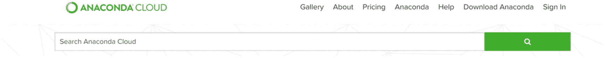

图 1-1

在 Anaconda 网站上，在页面的右上角，您会找到下载所需软件的链接

只需按照说明进行安装。安装完成后启动时，会出现图 [1-2](#Fig2) 所示的画面。如果您看不到此屏幕，只需单击左侧导航窗格上的主页链接。


图 1-2

启动 Anaconda 时看到的屏幕

Python 包(比如 NumPy)定期更新，而且非常频繁。软件包的新版本可能会使您的代码停止工作。函数被弃用和移除，并添加新的函数。为了解决这个问题，在 Anaconda 中，您可以创建一个所谓的环境。这基本上是一个容器，其中保存了特定的 Python 版本和您决定安装的包的特定版本。例如，有了它，您可以拥有一个 Python 2.7 和 NumPy 1.10 的容器，以及另一个 Python 3.6 和 NumPy 1.13 的容器。您可能必须使用使用 Python 2.7 开发的现有代码，因此，您必须拥有一个使用正确 Python 版本的容器。但是，与此同时，您的项目可能需要 Python 3.6。有了容器，您可以同时确保所有这些。有时不同的包会相互冲突，所以您必须小心，避免在您的环境中安装所有您感兴趣的包，尤其是如果您在截止日期前开发包。没有什么比发现你的代码不再工作，而你不知道为什么更糟糕的了。

### 注意

当您定义一个环境时，尽量只安装您真正需要的包，并且在更新它们时要注意，以确保任何升级都不会破坏您的代码。(记住:函数被弃用、删除、添加或频繁更改。)在升级之前检查更新的文档，并且仅当您确实需要更新的功能时才这样做。

您可以使用`conda`命令从命令行创建一个环境，但是要为我们的代码创建并运行一个环境，一切都可以从图形界面完成。这是我将在这里解释的方法，因为它是最简单的。我建议您阅读下面一页关于 Anaconda 的文档，以详细了解如何在其环境内工作: [`https://conda.io/docs/user-guide/tasks/manage-environments.html`](https://conda.io/docs/user-guide/tasks/manage-environments.html) 。

### 创造环境

让我们开始吧。首先，从左侧导航面板(图 [1-3](#Fig3) )中单击环境链接(有一个代表方框的小图标)。

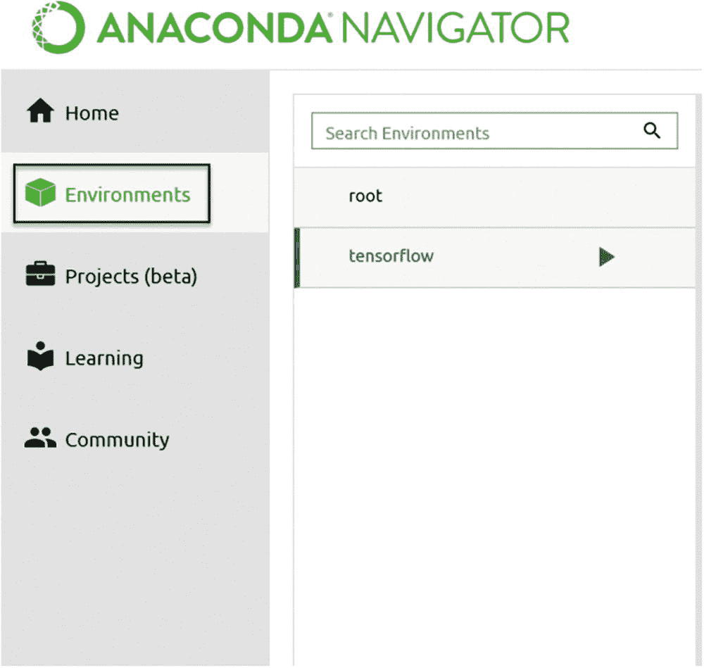

图 1-3

要创建一个新环境，首先必须进入应用程序的 Environments 部分，方法是单击左侧导航窗格中的相关链接(在图中用黑色矩形表示)

然后点击中间导航窗格中的创建按钮(如图 [1-4](#Fig4) 所示)。

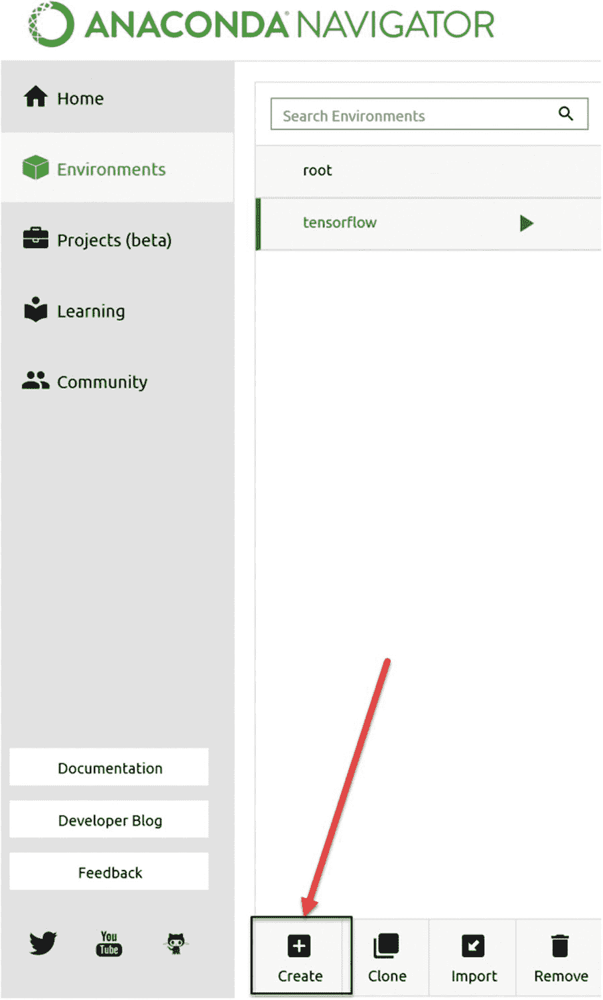

图 1-4

要创建新环境，您必须单击中间导航窗格中的“创建”按钮(用加号表示)。在图中，红色箭头表示按钮的位置。

点击创建按钮时，将弹出一个小窗口(见图 [1-5](#Fig5) )。

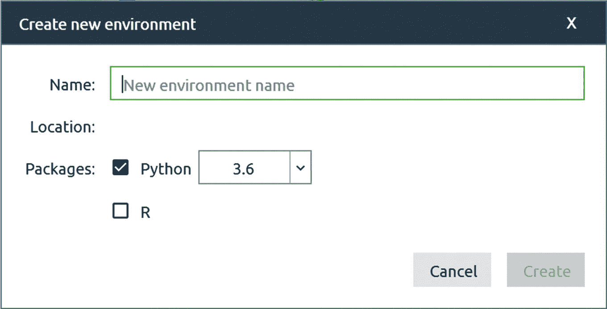

图 1-5

点击图 [1-4](#Fig4) 所示的创建按钮时，您将看到的窗口

你可以选择任何名字。在这本书里，我用了 *tensorflow* 这个名字。只要您键入一个名称,“创建”按钮就会变为活动状态(绿色)。单击它并等待几分钟，直到所有必需的软件包安装完毕。有时，您可能会看到一个弹出窗口，告诉您 Anaconda 的新版本已经推出，并询问您是否要升级。请随意单击是。按照屏幕上的说明操作，直到 Anaconda navigator 再次启动，如果您收到此消息并单击 yes。

我们还没完。再次单击左侧导航窗格上的环境链接(如图 [1-3](#Fig3) 所示)，然后单击新创建的环境的名称。如果到目前为止您一直按照说明操作，您应该会看到一个名为“tensorflow”的环境。几秒钟后，您将在右侧面板中看到所有已安装 Python 包的列表，您可以在环境中随意使用这些包。现在我们必须安装一些额外的包:NumPy、matplotlib、TensorFlow 和 Jupyter。为此，首先从下拉菜单中选择未安装，如图 [1-6](#Fig6) 所示。

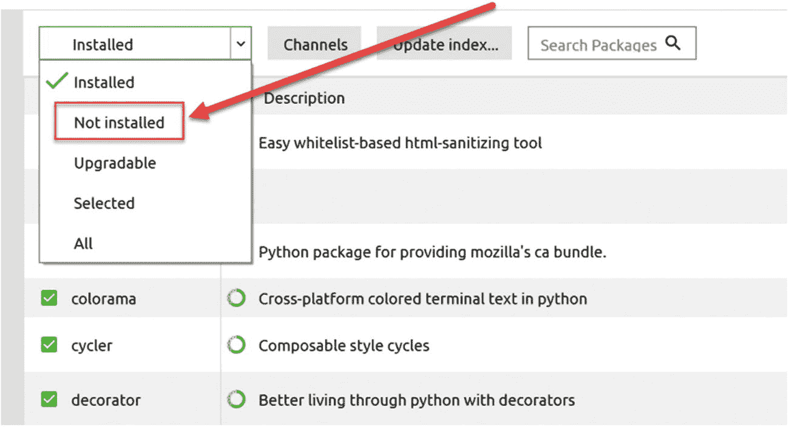

图 1-6

从下拉菜单中选择未安装的值

接下来，在 Search Packages 字段中，键入您想要安装的软件包名称(图 [1-7](#Fig7) 显示`numpy`已被选中)。

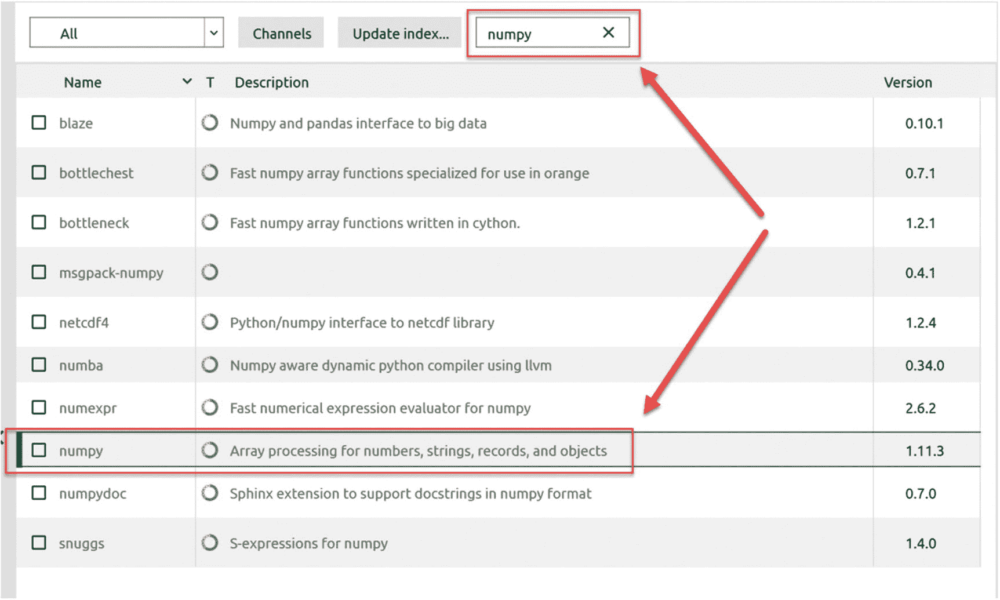

图 1-7

在搜索字段中键入“numpy ”,将其包含在包存储库中

Anaconda navigator 将自动向您显示标题或描述中包含单词 *numpy* 的所有包。点击名为 *numpy* 的包名称左边的小方块。它将变成一个向下的小箭头(表示它被标记为安装)。然后你可以点击界面右下角的绿色应用按钮(见图 [1-8](#Fig8) )。

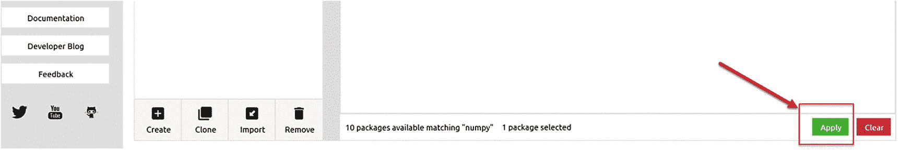

图 1-8

选择了要安装的`numpy`包后，点击绿色的 Apply 按钮。该按钮位于界面的右下方。

Anaconda navigator 足够智能，可以确定`numpy`是否需要其他包。您可能会得到一个额外的窗口，询问是否可以安装额外的软件包。只需点击应用。图 [1-9](#Fig9) 显示了这个窗口的样子。

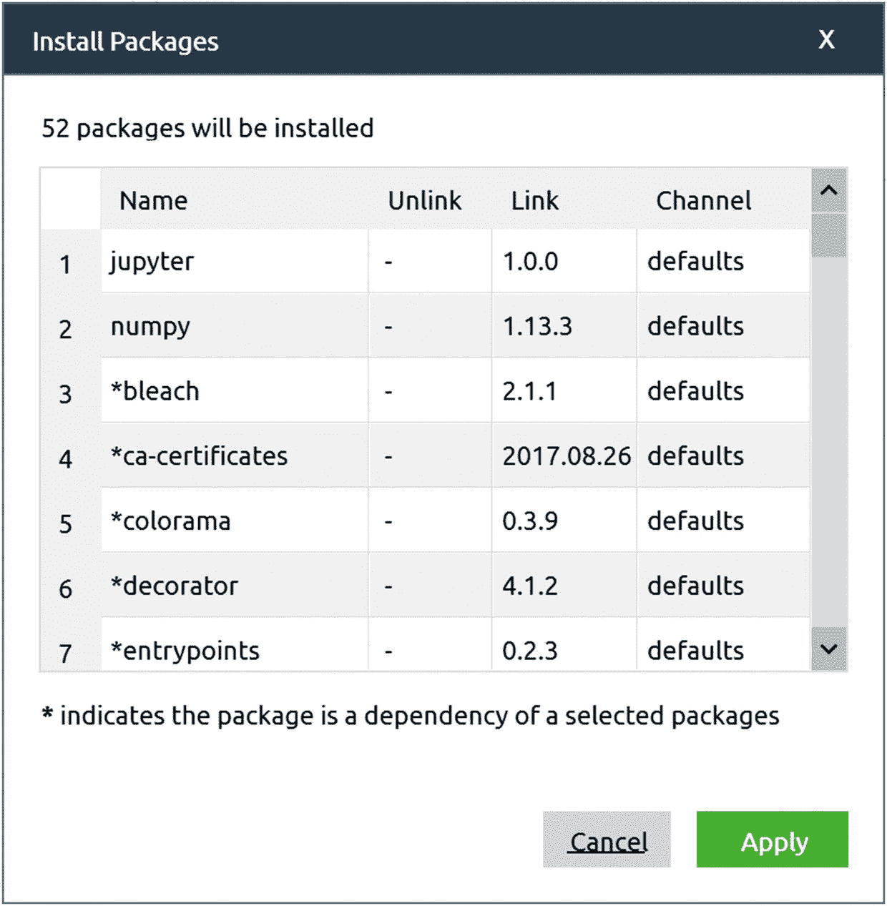

图 1-9

当安装一个包时，Anaconda navigator 将检查您想要安装的内容是否依赖于其他未安装的包。在这种情况下，它会建议您从一个额外的窗口安装缺少的(但却是必需的)软件包。在我们的例子中，在新安装的系统上，NumPy 库需要 52 个额外的包。只需点击应用安装所有这些软件。

您必须安装以下软件包才能运行本书中的代码。(我在括号中添加了我在本书中用于测试代码的版本；后续版本都可以。)

*   `numpy` (1.13.3):用于进行数值计算

*   (2.1.1):创造美好的情节，就像你将在本书中看到的那样

*   (0.19.1):这个包包含了所有与机器学习相关的库，例如，我们用来加载数据集的库。

*   (1.0.0):能够使用 Jupyter 笔记本电脑

### 安装 TensorFlow

安装 TensorFlow 稍微复杂一些。最好的方法是遵循 TensorFlow 团队给出的说明，地址如下: [`www.tensorflow.org/install/`](http://www.tensorflow.org/install/) 。

在此页面上，单击您的操作系统，您将收到您需要的所有信息。我将在这里提供 Windows 的操作说明，但是同样的操作也可以在 macOS 或者 Ubuntu (Linux)系统上完成。Anaconda 的安装没有得到官方支持，但是运行良好(它得到了社区的支持),并且是开始运行和检查本书中的代码的最简单的方法。对于更高级的应用程序，您可能需要考虑其他安装选项。(为此，您必须查看 TensorFlow 网站。)首先，进入 Windows 的开始菜单，输入“anaconda”在 Apps 下，您应该会看到 Anaconda 提示项，如图 [1-10](#Fig10) 所示。

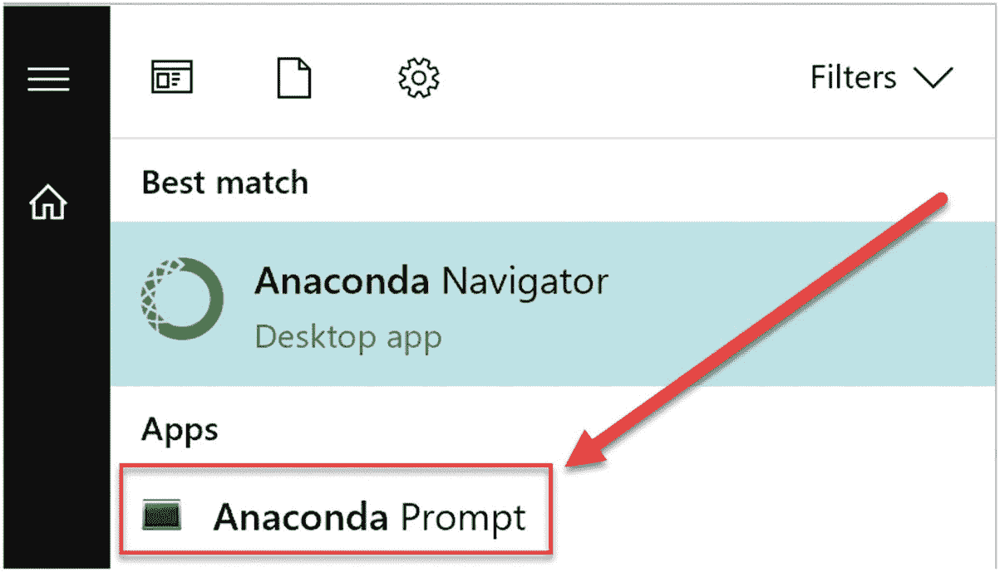

图 1-10

如果您在 Windows 10 的开始菜单搜索字段中键入“anaconda ”,您应该会看到至少两个条目:Anaconda Navigator，您在其中创建了 TensorFlow 环境，以及 Anaconda 提示符

启动 Anaconda 提示符。应出现一个命令行界面(参见图 [1-11](#Fig11) )。这与简单的`cmd.exe`命令提示符的区别在于，在这里，所有的 Anaconda 命令都被识别，而不需要设置任何 Windows 环境变量。

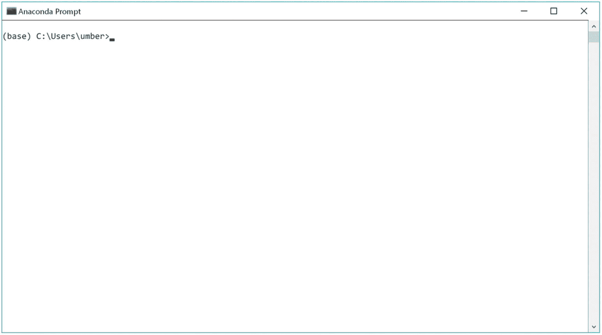

图 1-11

这是您在选择 Anaconda 提示符时应该看到的内容。请注意，用户名会有所不同。您将看到的不是`umber`(我的用户名)，而是您的用户名。

在命令提示符下，首先必须激活新的“tensorflow”环境。这对于让 Python 安装知道您想要在哪个环境中安装 TensorFlow 是必要的。为此，只需键入以下命令:`activate tensorflow`。您的提示应该变成这样:`(tensorflow) C:\Users\umber>`。

记住:你的用户名将是不同的(你将在你的提示中看到的不是数字，而是你的用户名)。这里我假设您将安装只使用 CPU(而不是 GPU)版本的标准 TensorFlow 版本。只需键入以下命令:`pip install --ignore-installed --upgrade tensorflow`。

现在让系统安装所有必要的软件包。这可能需要几分钟时间(取决于几个因素，如您的计算机速度或您的互联网连接)。您应该不会收到任何错误消息。恭喜你！现在您有了一个可以使用 TensorFlow 运行代码的环境。

### jupyter 笔记型电脑

能够键入代码并让它运行的最后一步是启动 Jupyter 笔记本。Jupyter 笔记本可以描述如下(根据官方网站):

> Jupyter Notebook 是一个开源的网络应用程序，允许你创建和分享包含实时代码、公式、可视化和叙述性文本的文档。用途包括:数据清理和转换、数值模拟、统计建模、数据可视化、机器学习等等。

它在机器学习社区中被广泛使用，学习如何使用它是一个好主意。在 [`http://jupyter.org/`](http://jupyter.org/) 查看 Jupyter 项目网站。

这个网站很有启发性，包括了许多可能的例子。您在本书中找到的所有代码都是使用 Jupyter 笔记本开发和测试的。我假设您已经对这种基于 web 的开发环境有了一些经验。如果您需要复习，我建议您查看 Jupyter 项目网站上的文档，网址是: [`http://jupyter.org/documentation.html`](http://jupyter.org/documentation.html) 。

要在新环境中启动一个笔记本，您必须返回到 Environments 部分的 Anaconda navigator(参见图 [1-3](#Fig3) )。点击你的“tensorflow”环境右边的三角形(如果你使用了不同的名称，你必须点击你的新环境右边的三角形)，如图 [1-12](#Fig12) 所示。然后单击用 Jupyter 笔记本打开。

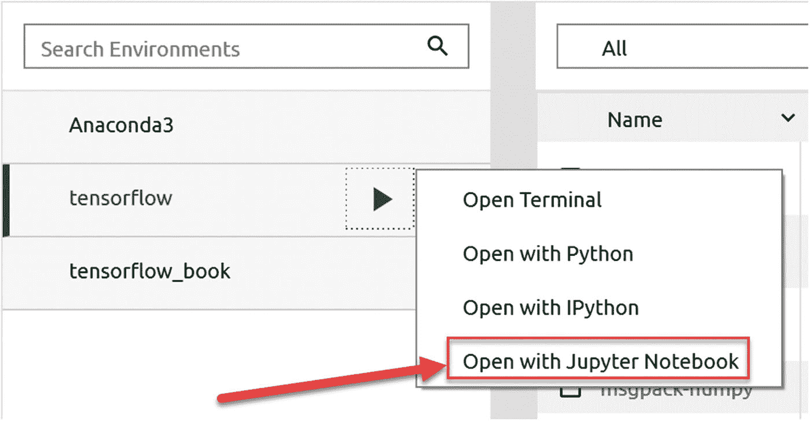

图 1-12

要在新环境中启动 Jupyter 笔记本，请单击“tensorflow”环境名称右侧的三角形，然后单击用 Jupyter 笔记本打开

您的浏览器将从您的用户文件夹中的所有文件夹列表开始。(如果您使用的是 Windows，这通常位于`c:\Users\<YOUR USER NAME>`下，您必须在其中用您的用户名替换`<YOUR USER NAME>`。)从那里，你应该导航到你想要保存你的笔记本文件的文件夹，在那里你可以通过点击新建按钮创建一个新的笔记本，如图 [1-13](#Fig13) 所示。

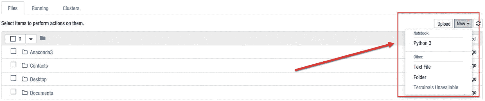

图 1-13

要创建新的笔记本，请单击页面右上角的 new 按钮，然后选择 Python 3

一个新的页面将会打开，看起来应该如图 [1-14](#Fig14) 所示。

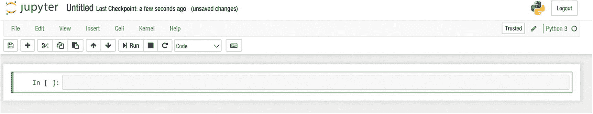

图 1-14

当您创建一个空笔记本时，将会打开一个看起来像这样的空白页面

例如，您可以在第一个“单元格”(您可以在其中键入内容的矩形框)中键入以下代码。

```py
a=1
b=2
print(a+b)

```

要评估代码，只需按 Shift+Enter，您应该立即看到结果(3)(图 [1-15](#Fig15) )。

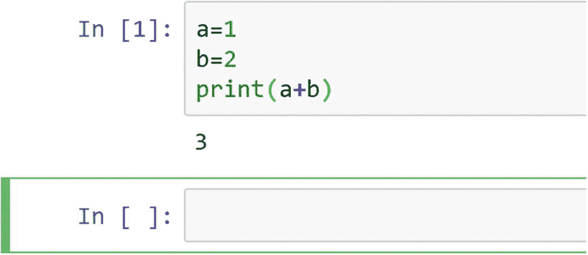

图 1-15

在单元格中键入一些代码后，按 Shift+Enter 将计算单元格中的代码

前面的代码给出了`a+b`的结果，也就是`3`。给出结果后，会自动创建一个新的空单元格供您输入。要了解更多关于如何添加注释、等式、内联图等等的信息，我建议您访问 Jupyter 网站并查看所提供的文档。

### 注意

如果您忘记了笔记本所在的文件夹，您可以查看该页面的 URL。比如我的情况，我有`http://localhost:8888/notebooks/Documents/Data%20Science/Projects/Applied%20advanced%20deep%20learning%20(book)/chapter%201/AADL%20-%20Chapter%201%20-%20Introduction.ipynb`。您会注意到，URL 只是笔记本所在文件夹的串联，用正斜杠分隔。一个`%20`字符仅仅意味着一个空格。在这种情况下，我的笔记本是在文件夹:`Documents/Data Science/Projects/…`等等。我经常同时用几个笔记本工作，知道每个笔记本的位置是很有用的，以防你忘记(我有时会忘记)。

## 张量流基础介绍

在开始使用 TensorFlow 之前，你必须了解它背后的哲学。该库在很大程度上基于计算图的概念，除非你理解这些是如何工作的，否则你无法理解如何使用该库。我将向您快速介绍计算图形，并向您展示如何用 TensorFlow 实现简单的计算。在下一节的结尾，你应该明白这个库是如何工作的，以及我们将如何在本书中使用它。

### 计算图形

要理解 TensorFlow 是如何工作的，你必须理解什么是计算图。计算图是其中每个节点对应一个操作或变量的图。变量可以将它们的值提供给操作，操作可以将它们的结果提供给其他操作。通常，节点被绘制成一个圆形(或省略号)，内部有变量名或操作，当一个节点的值是另一个节点的输入时，箭头会从一个节点指向另一个节点。可能存在的最简单的图是一个只有一个简单变量节点的图。(记住:节点可以是变量，也可以是操作。)图 [1-16](#Fig16) 中的图形简单计算了变量 *x* 的值。

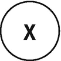

图 1-16

我们可以建立的最简单的图表，显示一个简单的变量

不是很有意思！现在让我们考虑稍微复杂一点的东西，比如两个变量的和 *x* 和*y*:*z*=*x*+*y*。如下图所示(图 [1-17](#Fig17) ):

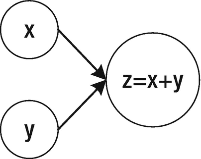

图 1-17

两个变量之和的基本计算图

图 [1-17](#Fig17) 左边的节点(里面有 *x* 和 *y* 的节点)是变量，较大的节点表示两个变量的和。箭头表示两个变量， *x* 和 *y* ，是第三个节点的输入。应该按照拓扑顺序阅读(和计算)该图，这意味着您应该按照箭头指示的顺序来计算不同的节点。箭头还会告诉您节点之间的依赖关系。要评估 *z* ，首先必须评估 *x* 和 *y* 。我们也可以说执行求和的节点依赖于输入节点。

需要理解的一个重要方面是，这样的图只定义了对两个输入值(在这种情况下， *x* 和 *y* )执行的操作(在这种情况下，是求和)以获得结果(在这种情况下， *z* )。它基本上定义了“如何”你必须给输入 *x* 和 *y* 赋值，然后求和得到 *z* 。只有在评估所有节点后，该图才会给出结果。

### 注意

在本书中，我将提到图的“构建”阶段，即定义每个节点正在做什么，以及“评估”阶段，即我们将实际评估相关操作。

这是需要理解的一个非常重要的方面。请注意，输入变量不必是实数。它们可以是矩阵、向量等等。(在本书中，我们将主要使用矩阵。)在图 [1-18](#Fig18) 中可以找到一个稍微复杂一点的例子，它使用一个图来计算量 *A* ( *x* + *y* )，给出三个输入量: *x* 、 *y* 和 *A* 。

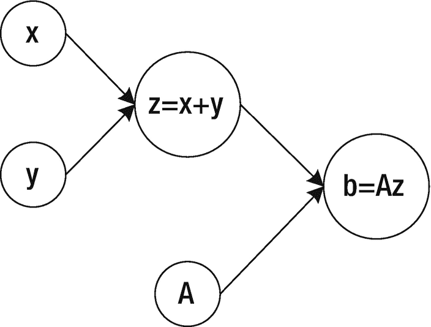

图 1-18

*计算量**A*(*x*+*y*)*给定三个输入量:x* 、 *y* 、*和 A*

我们可以通过给输入节点赋值来评估这个图(在这个例子中， *x* 、 *y* 和 *A* )，并通过图评估节点。例如，如果考虑图 [1-18](#Fig18) 中的图形，并指定值 *x* = 1、 *y* = 3、 *A* = 5，我们将得到结果 *b* = 20(如图 [1-19](#Fig19) 所示)。

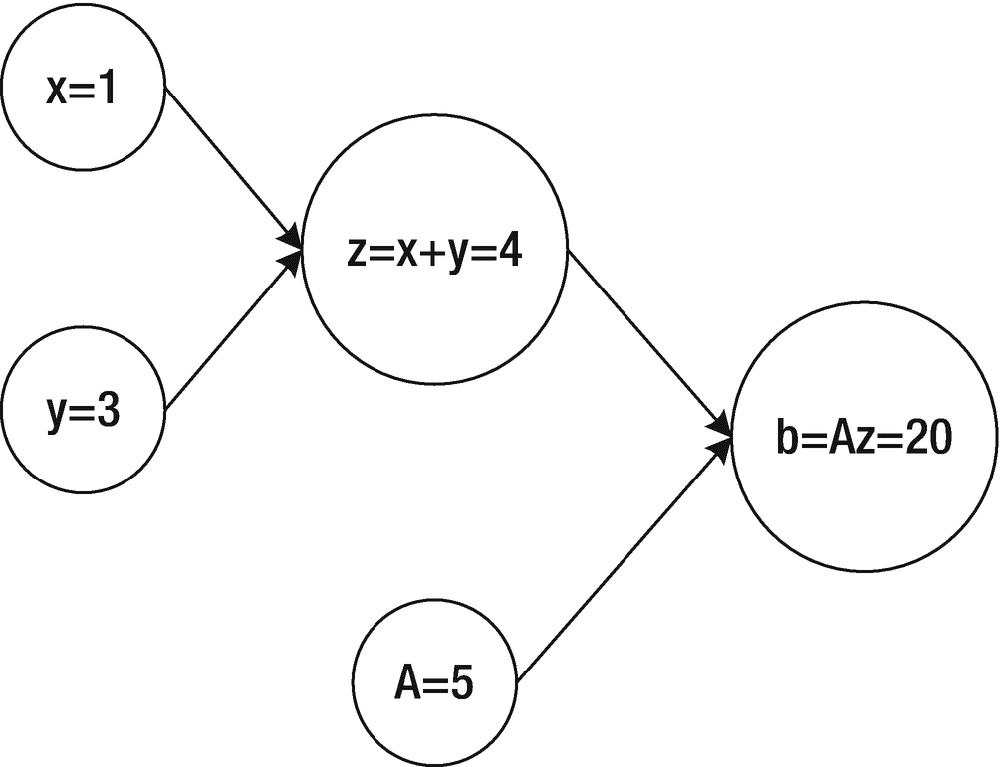

图 1-19

为了评估图 [1-18](#Fig18) 中的图表，我们必须给输入节点 x、y 和 A 赋值，然后通过图表评估这些节点

神经网络基本上是一个非常复杂的计算图，其中每个神经元由图中的几个节点组成，这些节点将其输出馈送给一定数量的其他神经元，直到达到某个输出。在下一节中，我们将构建最简单的神经网络:只有一个神经元的网络。即使有这样一个简单的网络，我们也能做一些有趣的事情。

允许你非常容易地构建非常复杂的计算图形。通过构造，它将它们的评价与构造分开。(请记住，要计算结果，您必须赋值并评估所有节点。)在接下来的部分中，我将向您展示这是如何工作的:如何构建计算图以及如何评估它们。

### 注意

记住`tensorflow`首先构建一个计算图(在所谓的构建阶段),但不会自动评估它。这个库将这两个步骤分开，这样你就可以用不同的输入来计算你的图形几次。

### 张量

t `ensorflow`处理数据的基本单位是——试着从它的名字猜测——一个张量。张量是简单的原始类型(例如浮点数)的集合，形状为一个 *n* 维数组。下面是一些张量的例子(带有相关的 Python 定义):

*   1 →一个标量

*   [1，2，3] →一个矢量

*   [[1，2，3]，[4，5，6]] →矩阵或二维数组

张量有静态类型和动态维度。评估时不能更改其类型，但在评估前可以动态更改尺寸。(基本上你声明了张量而没有指定一些维度，`tensorflow`会从输入值中推断出维度。)通常，人们谈论张量的秩，它只是张量的维数(而标量的秩是 0)。表 [1-1](#Tab1) 可能有助于理解张量的不同等级。

表 1-1

秩为 0、1、2 和 3 的张量示例

<colgroup><col class="tcol1 align-left"> <col class="tcol2 align-left"> <col class="tcol3 align-left"></colgroup> 
| 

军阶

 | 

数学实体

 | 

Python 示例

 |
| --- | --- | --- |
| Zero | 标量(例如，长度或重量) | L=30 |
| one | 向量(例如，二维平面中物体的速度) | S=[10.2，12.6] |
| Two | 矩阵 | M=[[23.2，44.2]，[12.2，55.6]] |
| three | 3D 矩阵(具有三维) | c =[[1]，[2]]，[[3]，[4]，[[5]，[6]]] |

假设你用语句`import tensorflow as tf`导入`tensorflow`，基本对象，一个张量，是类`tf.tensor`。一个`tf.tensor`有两个属性:

*   数据类型(例如，float32)

*   shape(例如，[2，3]，表示具有两行三列的张量)

一个重要的方面是张量的每个元素总是有相同的数据类型，而形状不需要在声明时定义。(这一点在下一章的实际例子中会更清楚。)我们将在本书中看到的张量的主要类型(还有更多)有

*   `tf.Variable`

*   `tf.constant`

*   `tf.placeholder`

在单个会话运行期间,`tf.constant`和`tf.placeholder`值是不可变的(稍后将详细介绍)。它们一旦有了价值，就不会改变。例如，`tf.placeholder`可能包含您想要用来训练神经网络的数据集。一旦分配，它将不会在评估阶段改变。一个`tf.Variable`可以包含你的神经网络的权重。它们会在训练过程中改变，以找到针对您的具体问题的最佳值。最后，一个`tf.constant`永远不会改变。我将在下一节向你展示如何使用这三种不同类型的张量，以及在开发你的模型时你应该考虑哪些方面。

### 创建和运行计算图形

让我们开始使用`tensorflow`来创建一个计算图。

### 注意

记住:我们总是将构建阶段(当我们定义一个图应该做什么时)和评估阶段(当我们执行计算时)分开。遵循同样的哲学:首先你构建一个图，然后你评估它。

让我们考虑一些非常简单的事情:两个张量的和

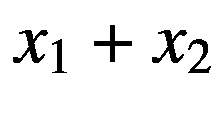

这可以用图 [1-20](#Fig20) 所示的计算图来计算。

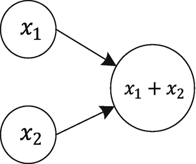

图 1-20

两个张量和的计算图

### 带有 tf 常数的计算图

如前所述，首先我们必须用`tensorflow`创建这个计算图。(记住:我们从构建阶段开始。)让我们开始使用`tf.constant`张量类型。我们需要三个节点:两个用于输入变量，一个用于求和。这可以通过以下代码实现:

```py
x1 = tf.constant(1)
x2 = tf.constant(2)
z = tf.add(x1, x2)

```

前面的代码创建了图 [1-20](#Fig20) 中的计算图，同时告诉`tensorflow``x1`应该具有值`1`(声明中括号中的值)，并且`x2`应该具有值`2`。现在，为了评估代码，我们必须创建`tensorflow`所称的会话(其中可以进行实际的评估)，然后我们可以要求 session 类使用以下代码运行我们的图:

```py
sess = tf.Session()
print(sess.run(z))

```

这将简单地给出`z`的评估结果，也就是预期的`3`。这个版本的代码相当简单，不需要太多，但是不太灵活。例如，`x1`和`x2`是固定的，在评估期间不能改变。

### 注意

在`TensorFlow`中，您首先必须创建一个计算图，然后创建一个会话，最后运行您的图。必须始终遵循这三个步骤来评估您的图表。

记住:你也可以要求`tensorflow`只评估一个中间步骤。例如，您可能想要评估`x1`(不是很有趣，但是在很多情况下它会很有用，例如，当您想要评估您的图形，同时评估模型的准确性和成本函数时)，如下所示:`sess.run(x1)`。

您将得到结果 1，正如所料(您所料，对吗？).最后，记得用`sess.close()`关闭会话以释放已用资源。

### 带 tf 的计算图。可变的

同样的计算图(图 [1-20](#Fig20) 中的图)可以用变量创建，但这需要更多的工作。让我们重新创建我们的计算图。

```py
x1 = tf.Variable(1)
x2 = tf.Variable(2)
z = tf.add(x1,x2)

```

像以前一样，我们希望用值`1`和`2`初始化变量。 <sup>[1](#Fn1)</sup> 问题在于，当你运行图形时，就像我们之前做的那样，用代码

```py
sess = tf.Session()
print(sess.run(z))

```

您将收到一条错误消息。这是一条很长的错误消息，但在接近末尾时，您会发现以下消息:

```py
FailedPreconditionError (see above for traceback): Attempting to use uninitialized value Variable

```

这是因为`tensorflow`不会自动初始化变量。为此，您可以使用以下方法:

```py
sess = tf.Session()
sess.run(x1.initializer)
sess.run(x2.initializer)
print(sess.run(z))

```

这现在工作没有错误。第`sess.run(x1.initializer)`行将使用值`1`初始化变量`x1`，第`sess.run(x2.initializer)`行将使用值`2`初始化变量`x2`。但这相当麻烦。(你不想为每个需要初始化的变量写一行。)一个更好的方法是向计算图中添加一个节点，其目标是用代码初始化图中定义的所有变量

```py
init = tf.global_variables_initializer()

```

然后再次创建并运行您的会话，在评估`z`之前运行这个节点(`init`)。

```py
sess = tf.Session()
sess.run(init)
print(sess.run(z))
sess.close()

```

如您所料，这将起作用并给出结果`3`。

### 注意

当处理变量时，记住总是要添加一个全局初始化器(`tf.global_variables_initializer()`)，并在开始时，在任何其他求值之前，运行会话中的节点。我们将在本书的许多例子中看到这是如何工作的。

### 带有 tf.placeholder 的计算图

让我们将`x1`和`x2`声明为占位符。

```py
x1 = tf.placeholder(tf.float32, 1)
x2 = tf.placeholder(tf.float32, 1)

```

请注意，我没有在声明中提供任何值。 <sup>[2](#Fn2)</sup> 我们将不得不在求值时给`x1`和`x2`赋值。这是占位符和其他两种张量类型的主要区别。那么，总和又由下式给出

```py
z = tf.add(x1,x2)

```

请注意，如果您尝试使用`print(z)`来查看`z`中的内容，您将得到

```py
Tensor("Add:0", shape=(1,), dtype=float32)

```

为什么会有这种奇怪的结果？首先，我们还没有给`tensorflow`提供`x1`和`x2`的值，其次，`TensorFlow`还没有运行任何计算。记住:图的构建和评估是分开的步骤。现在，像以前一样，让我们在`TensorFlow`创建一个会话。

```py
sess = tf.Session()

```

现在我们可以运行实际的计算，但是要做到这一点，我们必须首先有一种方法来给两个输入`x1`和`x2`赋值。这可以通过使用 Python 字典来实现，该字典包含所有占位符的名称作为键，并为它们赋值。在这个例子中，我们给`x1`赋值`1`，给`x2`赋值`2`。

```py
feed_dict={ x1: [1], x2: [2]}

```

可以使用以下命令将该代码提供给`TensorFlow`会话:

```py
print(sess.run(z, feed_dict))

```

你终于得到了你期待的结果:`3`。注意`tensorflow`相当智能，可以处理更复杂的输入。让我们重新定义占位符，使其能够使用包含两个元素的数组。(这里，我们报告了整个代码，以便更容易理解示例。)

```py
x1 = tf.placeholder(tf.float32, [2])
x2 = tf.placeholder(tf.float32, [2])

z = tf.add(x1,x2)
feed_dict={ x1: [1,5], x2: [1,1]}

sess = tf.Session()
sess.run(z, feed_dict)

```

这一次，您将获得一个包含两个元素的数组作为输出。

```py
array([ 2., 6.], dtype=float32)

```

记住`x1=[1,5]`和`x2=[1,1]`意味着`z=x1+x2=[1,5]+[1,1]=[2,6]`，因为求和是一个元素一个元素地完成的。

总而言之，以下是关于何时使用哪种张量类型的一些指南:

*   对于在每个评估阶段不会改变的实体，使用`tf.placeholder`。通常，这些是您希望在评估期间保持固定的输入值或参数，但可能会随着每次运行而改变。(在本书后面你会看到几个例子。)示例包括输入数据集、学习率等。

*   使用`tf.Variable`来表示在计算过程中会发生变化的实体，例如，我们的神经网络的权重，您将在本书后面看到。

*   将`tf.constant`用于永远不会改变的实体，例如，修复模型中不想再改变的值。

图 [1-21](#Fig21) 描绘了一个稍微复杂一点的例子:计算*x*<sub>1</sub>*w*<sub>1</sub>+*x*<sub>2</sub>*w*<sub>2</sub>的计算图。

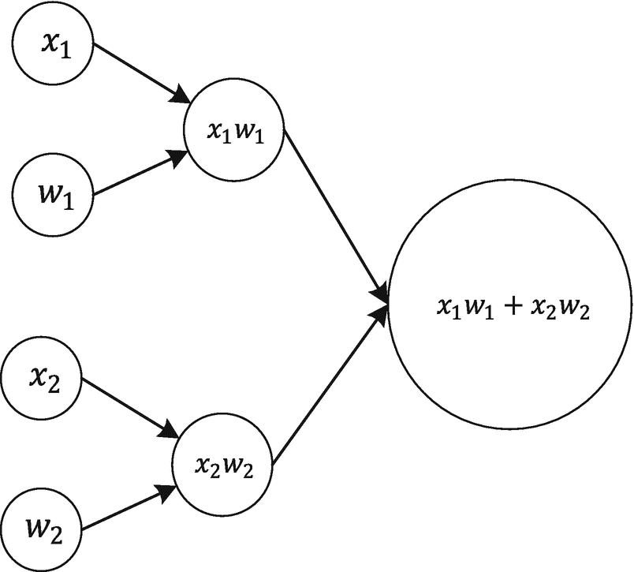

图 1-21

计算 x<sub>1</sub>w<sub>1</sub>+x<sub>2</sub>w<sub>2</sub>的计算图

在本例中，我将 *x* <sub>1</sub> 、 *x* <sub>2</sub> 、 *w* <sub>1</sub> 和 *w* <sub>2</sub> 定义为占位符(它们将是我们的输入)，包含标量(记住:在定义占位符时，您必须始终将维度作为第二个输入参数传递，在本例中是`1`)。

```py
x1 = tf.placeholder(tf.float32, 1)
w1 = tf.placeholder(tf.float32, 1)
x2 = tf.placeholder(tf.float32, 1)
w2 = tf.placeholder(tf.float32, 1)

z1 = tf.multiply(x1,w1)
z2 = tf.multiply(x2,w2)
z3 = tf.add(z1,z2)

```

运行计算意味着简单地(像以前一样)定义包含输入值的字典，创建一个会话，然后运行它。

```py
feed_dict={ x1: [1], w1:[2], x2:[3], w2:[4]}
sess = tf.Session()
sess.run(z3, feed_dict)

```

正如所料，您将得到以下结果:

```py
array([ 14.], dtype=float32)

```

这就是简单的 1 × 2 + 3 × 4 = 2 + 12 = 14(记得我们在前面的步骤中已经在`feed_dict`中输入了值`1`、`2`、`3`和`4`)。在第 [2](02.html) 章中，我们将绘制单个神经元的计算图，并将我们在本章中所学的知识应用到一个非常实际的案例中。使用该图，我们将能够对真实数据集进行线性和逻辑回归。和往常一样，完成后记得用`sess.close()`关闭会话。

### 注意

在`TensorFlow`中，同一段代码可能会运行几次，最终你会得到一个计算图，其中有同一个节点的多个副本。避免这种问题的一个非常常见的方法是在构建图的代码之前运行代码`tf.reset_default_graph()`。请注意，如果您适当地将构造代码与评估代码分开，您应该能够避免这样的问题。我们将在本书后面的许多例子中看到这是如何工作的。

### 运行和评估之间的差异

如果你看看博客和书籍，你可能会发现用`tensorflow`评估一个计算图的两种方法。我们到目前为止使用的是`sess.run()`，其中函数希望将您想要评估的节点的名称作为参数。我们选择了这种方法，因为它有一个很好的优点。为了理解它，请考虑下面的代码(与您之前看到的代码相同)

```py
x1 = tf.constant(1)
x2 = tf.constant(2)
z = tf.add(x1, x2)
init = tf.global_variables_initializer()
sess = tf.Session()
sess.run(init)
sess.run(z)

```

这将只给出计算过的节点 z，但是您也可以使用下面的代码同时计算几个节点:

```py
sess.run([x1,x2,z])

```

这会给你

```py
[1, 2, 3]

```

这是非常有用的，在下一节关于节点的生命周期中将会变得很清楚。此外，同时评估许多节点将使您的代码更短，可读性更好。

评估图中节点的第二种方法是使用`eval()`调用。这个代码

```py
z.eval(session=sess)

```

会评价`z`。但是这一次，您必须明确地告诉`TensorFlow`您想要使用哪个会话(您可能已经定义了几个)。这不太实用，我更喜欢用`run()`的方法同时得到几个结果(比如代价函数、精度、F1 分)。首选第一种方法还有一个性能原因，这将在下一节中解释。

### 节点之间的依赖关系

我之前提到过，`TensorFlow`按照拓扑顺序对一个图进行求值，也就是说当你让它对一个节点求值时，它会自动确定所有需要对你所问内容求值的节点，并先对它们求值。问题是`TensorFlow`可能会多次评估一些节点。例如，考虑下面的代码:

```py
c = tf.constant(5)
x = c + 1
y = x + 1
z = x + 2
sess = tf.Session()
print(sess.run(y))
print(sess.run(z))
sess.close()

```

该代码将构建并评估图 [1-22](#Fig22) 中的计算图。

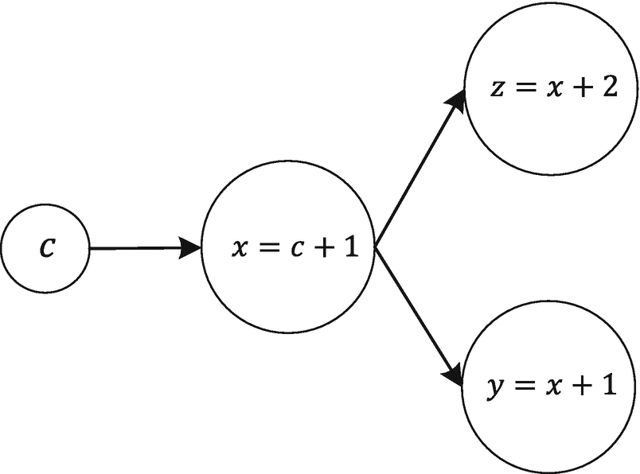

图 1-22

本节开头引用的代码构建的计算图

如你所见， *z* 和 *y* 都依赖于 *x* 。我们编写的代码的问题是，`TensorFlow`不会重用之前对 *c* 和 *x* 的评估结果。这意味着它将在计算 *z* 时计算一次 *x* 的节点，并在计算 *y* 时再次计算。在这种情况下，例如，使用代码`yy, zz = sess.run([y,z])`将在一次运行中评估 *y* 和 *z* ，而 *x* 仅评估一次。

### 关于如何创建和关闭会话的提示

我向您展示了如何使用模板创建会话

```py
sess = tf.Session()
# Code that does something

```

最后，您应该总是关闭一个会话，以释放使用的资源。语法很简单:

```py
sess.close()

```

请记住，当您关闭会话时，您不能评估任何其他内容。您必须创建一个新的会话并再次执行评估。在 Jupyter 环境中，这种方法的优点是允许您将评估代码分成几个单元，然后在最后关闭会话。但是知道有一种稍微简洁的方式来打开和使用会话是很有用的，使用下面的模板:

```py
With tf.Session() as sess:
# code that does something

```

例如，代码

```py
sess = tf.Session()
print(sess.run(y))
print(sess.run(z))
sess.close()

```

上一节中的内容可以写成

```py
with tf.Session() as sess:
    print(sess.run(y))
    print(sess.run(z))

```

在这种情况下，会话将在`with`子句结束时自动关闭。使用这种方法使得使用`eval()`更加容易。例如，代码

```py
sess = tf.Session()
print(z.eval(session=sess))
sess.close()

```

带有`with`子句的看起来像这样

```py
with tf.Session() as sess:
    print(z.eval())

```

在某些情况下，显式声明会话更可取。例如，编写一个函数来执行实际的图评估并返回会话是很常见的，这样就可以在主训练完成后进行额外的评估(例如，准确性或类似的度量)。在这种情况下，您不能使用第二个版本，因为它会在完成评估后立即关闭会话，因此无法使用会话结果进行其他评估。

### 注意

如果您在 Jupyter notebooks 等交互式环境中工作，并且希望将评估代码拆分到多个笔记本单元上，则更容易将会话声明为`sess = tf.Session()`，执行所需的计算，然后在结束时关闭它。通过这种方式，您可以插入评估、图表和文本。如果您编写的代码不是交互式的，有时使用第二个版本更好(更不容易出错),以确保会话在结束时关闭。此外，使用第二种方法，您不必在使用`eval()`方法时指定会话。

本章涵盖的材料应该给你用`tensorflow`构建神经网络所需的一切。我在这里解释的决不是完整的或详尽的。你真的应该花些时间去官方的 TensorFlow 网站，学习那里的教程和其他资料。

### 注意

在本书中，我使用了一种*惰性编程方法*。这意味着我只解释我想让你理解的东西，仅此而已。原因是我希望你专注于每章的学习目标，我不希望你被隐藏在方法或编程功能背后的复杂性分散注意力。一旦你理解了我试图解释的内容，你应该投入一些时间，使用官方文档更深入地研究这些方法和库。

<aside class="FootnoteSection" epub:type="footnotes">Footnotes [1](#Fn1_source)

要了解更多关于变量的信息，请查看 [`www.tensorflow.org/versions/master/api_docs/python/tf/Variable`](http://www.tensorflow.org/versions/master/api_docs/python/tf/Variable) 的官方文档。

  [2](#Fn2_source)

检查数据类型的官方文档总是一个好主意: [`www.tensorflow.org/versions/master/api_docs/python/tf/placeholder`](http://www.tensorflow.org/versions/master/api_docs/python/tf/placeholder) 。

 </aside>