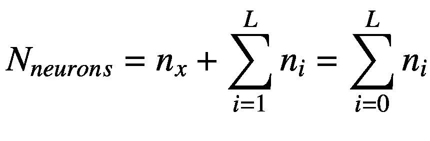
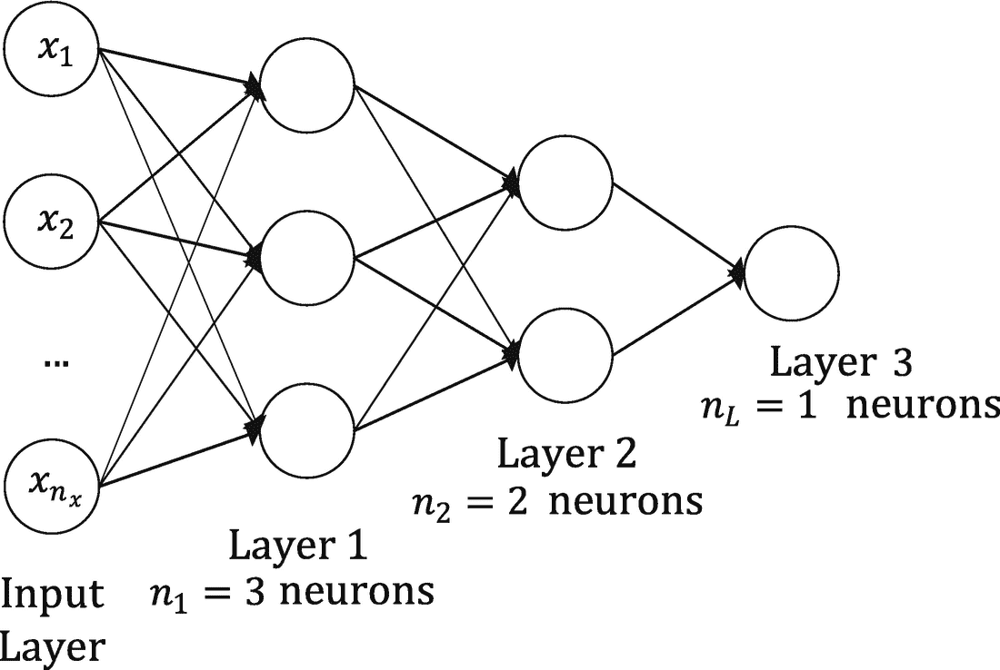
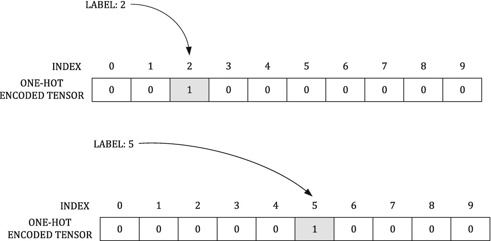

# 三、前馈神经网络

在第 [2](02.html) 章中，我们用一个神经元做了一些惊人的事情，但这不足以灵活地处理更复杂的情况。当几个(几千个，甚至几百万个)神经元为了解决一个特定的问题而相互作用时，神经网络的真正力量就显现出来了。网络架构(神经元如何相互连接，它们如何表现，等等)在网络的学习效率、预测能力以及解决何种问题方面起着至关重要的作用。

有许多类型的架构已经被广泛研究，并且非常复杂，但是从学习的角度来看，重要的是从具有多个神经元的最简单类型的神经网络开始。从所谓的前馈神经网络开始是有意义的，在前馈神经网络中，数据从输入层进入，一层一层地通过网络，直到到达输出层。(这就给了网络的名字:前馈神经网络。)在本章中，我们将考虑这样的网络，其中一层中的每个神经元从前一层的所有神经元获得其输入，并将它们的输出馈入下一层的每个神经元。

不难想象，越复杂，挑战就越多。要做到学习速度快，准确率好，难度比较大；由于网络复杂性的增加，可用的超参数的数量增加；当处理大数据集时，简单的梯度下降算法将不再有效。当开发具有许多神经元的模型时，我们将需要拥有一套扩展的工具，使我们能够应对这些网络带来的所有挑战。在这一章中，我们将开始研究一些更高级的方法和算法，这些方法和算法将使我们能够高效地处理大数据集和大网络。这些复杂的网络变得足够好，可以进行一些有趣的多类分类，这是大型网络需要执行的最频繁的任务之一(例如，手写识别、人脸识别、图像识别等)，所以我选择了一个数据集，它将允许我们进行一些有趣的多类分类，并研究其困难。

我将从讨论网络体系结构和所需的矩阵形式开始这一章。然后给出了伴随这种新型网络而来的新超参数的简要概述。然后解释如何使用`softmax`函数实现多类分类，以及需要哪种输出层。然后，在开始使用 Python 代码之前，先用一个简单的例子来详细解释什么是过拟合，以及如何对复杂网络进行基本的错误分析。然后，我们将开始使用 TensorFlow 构建更大的网络，将它们应用于一个类似 MNIST 的数据集，基于服装商品的图像(这将非常有趣)。我们将看看如何使第 [2 章](02.html)中的梯度下降算法更快，引入两个新的变化:随机和小批量梯度下降。然后，我们将看看如何以有效的方式添加许多层，以及如何以最好的方式初始化权重和偏差，以使训练快速而稳定。具体来说，我们将分别研究 sigmoid 和 ReLU 激活函数的 Xavier 和 He 初始化。最后，提供了一个关于如何比较不仅仅是神经元数量的网络复杂性的经验法则，本章最后给出了一些关于如何选择正确网络的提示。

## 网络体系结构

神经网络架构相当容易理解。它由一个输入层(inputs )、几个层(称为隐藏层，因为它们被夹在输入层和输出层之间，所以从外面看是“不可见的”)和一个输出层组成。在每一层中，你可能有一到几个神经元。这种网络的主要特性是每个神经元接收来自前一层中每个神经元的输入，并将其输出馈送给下一层中的每个神经元。在图 3-1 中，你可以看到这样一个网络的图示。


图 3-1

多层深度前馈神经网络图，其中每个神经元接收来自前一层中每个神经元的输入，并将其输出提供给后一层中的每个神经元

从一个神经元，如第 2 章所述，跳到这一步是相当大的一步。为了建立模型，我们将不得不使用矩阵形式，因此，我们必须得到所有的矩阵维度。首先，我将讨论一些新的符号。

*   *L* :隐藏层数，不包括输入层，但包括输出层

*   *n* <sub>*l*</sub> :层神经元的数量 *l*

在如图 [3-1](#Fig1) 所示的网络中，我们将用*N*<sub>T5】神经元</sub> 来表示神经元的总数，可以写成



其中，按照惯例，我们定义了*n*<sub>0</sub>=*n*<sub>*x*</sub>。两个神经元之间的每个连接都有自己的权重。让我们用![$$ {w}_{i\kern0.125em j}^{\left[l\right]} $$](img/463356_1_En_3_Chapter_TeX_IEq2.png)来表示 *l* 层神经元 *i* 和*l*1 层神经元 *j* 之间的权重。在图 [3-2](#Fig2) 中，我只画出了图 [3-1](#Fig1) 中我们通用网络的前两层(输入层和第 1 层)，以及输入层第一个神经元和第 1 层所有其他神经元之间的权重。为了清楚起见，所有其他神经元都是灰色的。


图 3-2

一般神经网络的前两层，输入层中的第一个神经元与第二层中的其他神经元之间的连接权重。为了使图表更清晰，所有其他神经元和连接都用浅灰色绘制。

输入层和层 1 之间的权重可以写成矩阵，如下所示:

![$$ {W}^{\left[1\right]}=\left(\begin{array}{ccc}{w}_{11}^{\left[1\right]}&amp; \dots &amp; {w}_{1{n}_x}^{\left[1\right]}\ \\ {}\vdots &amp; \ddots &amp; \vdots \\ {}{w}_{n_11}^{\left[1\right]}&amp; \dots &amp; {w^{\left[1\right]}}_{n_1{n}_x}\end{array}\right) $$](img/463356_1_En_3_Chapter_TeX_Equb.png)

这意味着我们的矩阵*W*<sup>【1】</sup>有维度*n*<sub>1</sub>×*n*<sub>*x*</sub>。当然，这可以在任意两个层 *l* 和*l*1 之间推广，这意味着由*W*<sup>[*l*]</sup>表示的两个相邻层 *l* 和*l*1 之间的权重矩阵将具有维度*n*<sub>*l*</sub>×*n 按照惯例，*n*<sub>0</sub>=*n*<sub>*x*</sub>是输入特征的个数(不是我们用 *m* 表示的观测值个数)。*

### 注意

我们用 *W* <sup>[ *l* ]</sup> 表示的两个相邻层 *l* 和*l*1 之间的权重矩阵将具有尺寸*n*<sub>*l*5【】á*n*<sub>t 19】l1</sub>，其中，按惯例为 *n* <sub>0</sub></sub>

偏差(在第 [2](02.html) 章中用 *b* 表示)这次将是一个矩阵。请记住，每个接收输入的神经元都会有自己的偏差，所以当考虑我们的两层时， *l* 和*l*1，我们将要求 *n* <sub>*l*</sub> 不同的 *b* 值。我们将用*b*<sup>[*l*]</sup>来表示这个矩阵，它将具有维度*n*<sub>*l*</sub>×1。

### 注意

我们用*b*<sup>[*l*】</sup>表示的两个相邻层 *l* 和*l*1 的偏置矩阵将具有尺寸*n*<sub>*l*</sub>×1。

### 神经元输出

现在让我们开始考虑我们神经元的输出。首先，我们将考虑第一层的第 *i* <sup>*th*</sup> 神经元(记住我们的输入层根据定义是第 0 层)。让我们用![$$ {\widehat{y}}_i^{\left[1\right]} $$](img/463356_1_En_3_Chapter_TeX_IEq3.png)来表示它的输出，并假设层 *l* 中的所有神经元使用相同的激活函数，我们将用*g*T11】[*l*]来表示。那我们就有了

![$$ {\widehat{y}}_i^{\left[1\right]}={g}^{\left[1\right]}\left({z}_i^{\left[1\right]}\right)={g}^{\left[i\right]}\kern0.75em \left(\sum \limits_{j=1}^{n_x}\left({w}_{ij}^{\left[1\right]}\ {x}_j+{b}_i^{\left[1\right]}\right)\right) $$](img/463356_1_En_3_Chapter_TeX_Equc.png)

在我们所指明的地方，正如大家会记得从第[章第 2](02.html) 、 *z* 、 *i* 、那样

![$$ {z}_i^{\left[1\right]}=\sum \limits_{j=1}^{n_x}\left({w}_{ij}^{\left[1\right]}\ {x}_j+{b}_i^{\left[1\right]}\right) $$](img/463356_1_En_3_Chapter_TeX_Equd.png)

可以想象，我们希望第 1 层的所有输出都有一个矩阵，所以我们将使用符号

![$$ {Z}^{\left[1\right]}={W}^{\left[1\right]}X+{b}^{\left[1\right]} $$](img/463356_1_En_3_Chapter_TeX_Eque.png)

其中*Z*<sup>【1】</sup>将具有维度 *n* <sub>1</sub> × 1，并且其中 *X* ，我们已经用我们所有的观察指示了我们的矩阵(特征的行，观察的列)，正如我已经在第 [2](02.html) 章中讨论的。我们在此假设层 *l* 中的所有神经元将使用相同的激活函数，我们将用*g*T16】[*l*表示。

我们可以很容易地将前面的方程推广到层 *l*

![$$ {Z}^{\left[l\right]}={W}^{\left[l\right]}{Z}^{\left[l-1\right]}+{b}^{\left[l\right]} $$](img/463356_1_En_3_Chapter_TeX_Equf.png)

因为层 *l* 将从层*l*1 获得其输入。我们只需要将 *X* 替换为*Z*T8】[*l*—1】。*Z*<sup>[*l*]</sup>会有尺寸*n*<sub>*l*</sub>×1。我们矩阵形式的输出将是

![$$ {Y}^{\left[l\right]}={g}^{\left[l\right]}\left({Z}^{\left[l\right]}\right) $$](img/463356_1_En_3_Chapter_TeX_Equg.png)

其中激活功能照常一个元素接一个元素地起作用。

### 矩阵维度汇总

下面是迄今为止我们所描述的所有矩阵的维数的总结。

*   *W* <sup>[ *l* ]</sup> 有尺寸*n*<sub>*l*</sub>×*n*<sub>*l*—1</sub>(这里我们有*n*<sub>0</sub>=*n*<sub>*x*</sub>的定义)

*   *b*T2*l*有尺寸 *n* <sub>*l*</sub> × 1

*   *Z*T2*l*1 有尺寸*n*T8】T9】l1×1

*   *Z*T2*l*有尺寸 *n* <sub>*l*</sub> × 1

*   *Y*<sup>*l*</sup>有尺寸 *n* <sub>*l*</sub> × 1

在每种情况下， *l* 从 1 到 *L* 。

### 示例:三层网络的方程式

为了让这个讨论更具体一点，让我们考虑一个三层网络的例子(so *L* = 3)，其中 *n* <sub>1</sub> = 3， *n* <sub>2</sub> = 2， *n* <sub>3</sub> = 1，如图 [3-3](#Fig3) 所示。



图 3-3

前馈神经网络的一个实例

在这种情况下，我们必须计算以下数量:

*   ![$$ {\widehat{Y}}^{\left[1\right]}={g}^{\left[1\right]}\left({W}^{\left[1\right]}X+{b}^{\left[1\right]}\right) $$](img/463356_1_En_3_Chapter_TeX_IEq4.png)，其中*W*<sup>【1】</sup>尺寸为 3 × * n * <sub>* x *</sub> ， *b* 尺寸为 3 × 1， *X* 尺寸为*n*<sub>*X*</sub>×*m*

*   ![$$ {\widehat{Y}}^{\left[2\right]}={g}^{\left[2\right]}\left({W}^{\left[2\right]}{Z}^{\left[1\right]}+{b}^{\left[2\right]}\right) $$](img/463356_1_En_3_Chapter_TeX_IEq5.png)，其中*W*<sup>【2】</sup>尺寸为 2 × 3， *b* 尺寸为 2 × 1，*Z*<sup>【1】</sup>尺寸为 3 × * m*

*   ![$$ {\widehat{Y}}^{\left[3\right]}={g}^{\left[3\right]}\left({W}^{\left[3\right]}{Z}^{\left[2\right]}+{b}^{\left[3\right]}\right) $$](img/463356_1_En_3_Chapter_TeX_IEq6.png)，其中*W*<sup>【3】</sup>尺寸为 1 × 2， *b* 尺寸为 1 × 1，*Z*<sup>【2】</sup>尺寸为 2 × * m*

你的网络输出![$$ {\widehat{Y}}^{\left[3\right]} $$](img/463356_1_En_3_Chapter_TeX_IEq7.png)，将会如预期的那样，有 1 × *m* 的尺寸。

所有这些可能看起来相当抽象(事实上，的确如此)。在本章的后面，你会看到在 TensorFlow 中实现它是多么容易，简单地通过建立正确的计算图，基于刚才讨论的步骤。

### 全连通网络中的超参数

在刚才讨论的网络中，有相当多的参数可以调整，以找到解决问题的最佳模型。您将从第 [2](02.html) 章中记住，您在开始时固定的参数，然后在训练阶段不改变的参数称为超参数。您必须为前馈网络调整以下额外的超参数:

*   层数: *L*

*   每层神经元个数:*n*<sub>T3】IT5】for*I*从 1 到 L</sub>

*   各层激活功能选择:*g*<sup>*l*</sup>

然后，当然，您仍然有在第 [2](02.html) 章中遇到的以下超参数:

*   迭代次数(或时期)

*   学习率

## 用于多类分类的 sof tmax 函数

在得到一些 TensorFlow 代码之前，你仍然需要忍受更多的理论。本章中描述的各种网络开始变得足够复杂，能够执行一些多类分类并获得合理的结果。要做到这一点，首先要介绍一下`softmax`函数。

从数学上来说，`softmax`函数 *S* 是将一个 *k* 维向量转换成另一个 *k* 维向量的实值，每个实值在 0 和 1 之间，并且总和为 1。给定 *k* 实值 *z* <sub>*i*</sub> 对于 *i* = 1，…， *k* ，我们定义向量***【z =***(*z*<sub>1</sub>，…*z*<sub>*k*</sub>)， 而我们定义的`softmax`矢量函数***S***(***z***)=(*S*(***z***)<sub>1</sub>*S*(***z***)<sub>2</sub>…*S*(

**

 *因为分母永远大于命名者，*S*(***z***)<sub>*I*</sub>***<***1。此外，我们还有


所以，*S*(***z***)<sub>*I*</sub>表现得像一个概率，因为它在 *i* 上的和是 1，它的元素都小于 1。我们将考虑*S*(***z***)<sub>*I*</sub>作为一个概率分布超过 *k* 个可能的结果。对于我们来说，*S*(***z***)<sub>*I*</sub>将仅仅是我们输入的观察值属于类 *i* 的概率。让我们假设我们正试图将一个观察结果分成三类。我们可能会得到以下输出:*S*(***z***)<sub>1</sub>***=***，*S*(***z***)<sub>2</sub>**=**0.6，*S*(这意味着我们的观测值有 10%的概率属于 1 类，60%的概率属于 2 类，30%的概率属于 3 类。通常，人们选择将输入观测值分类到具有较高概率的类别中，在本例中，类别 2 具有 60%的概率。

### 注意

我们将把*S*(***z***)<sub>*I*</sub>看做 *k* 上的概率分布，其中 *i* = 1，…， *k* 可能的结果。对我们来说，*S*(***z***)<sub>*I*</sub>将简单地是我们的输入观察属于类 *i* 的概率。

为了能够使用`softmax`函数进行分类，我们必须使用一个特定的输出层。我们将不得不使用十个神经元，每个神经元将给出***z***<sub>*I*</sub>作为其输出，然后一个神经元将输出***S***(***z***)。该神经元将具有作为激活函数的`softmax`函数，并将具有 10 个神经元的最后一层的 10 个输出**<sub>*I*</sub>作为输入。在 TensorFlow 中，您将`tf.nn.softmax`函数应用于具有 10 个神经元的最后一层。记住这个`tensorflow`函数将一个元素一个元素地作用。在本章的后面，你会发现一个具体的例子，展示如何从头到尾实现这一点。**

 **## 一个简短的题外话:过度拟合

在训练深度神经网络时，您将遇到的最常见的问题之一是过度拟合。可能发生的情况是，由于其灵活性，您的网络可能会学习由于噪音、错误或简单的错误数据而产生的模式。理解什么是过度拟合是非常重要的，所以我会给你一个可能发生的实际例子，让你对它有一个直观的理解。为了更容易可视化，我将使用一个简单的二维数据集，我将为此目的创建该数据集。我希望在下一节结束时，你会清楚地知道什么是过度配合。

### 过度拟合的实例

前面几节中描述的网络相当复杂，很容易导致数据集过拟合。让我简单解释一下过度拟合的概念。为了理解它，考虑下面的问题:找到逼近给定数据集的最佳多项式。给定一组二维点( *x* <sup>( *i* )</sup> ， *y* <sup>( *i* )</sup> )，我们要找出形式为 *K* 的最佳多项式


这将最小化均方差


其中， *m* 通常表示我们拥有的数据点的数量。我不仅要确定所有参数*a*<sub>T5【j</sub>，还要确定最接近我们数据的 *K* 的值。 *K* ，在这种情况下，测量我们的模型复杂度。比如对于 *K* = 0，我们简单的有*f*(*x*<sup>(*I*)</sup>)=*a*<sub>0</sub>(一个常数)，这是我们能想到的最简单的多项式。对于更高的 *K* ，我们有更高阶的多项式，这意味着我们的函数更复杂，有更多的参数可用于训练。

下面是我们对 K = 3 的函数的一个例子:


在我们的训练模型中有四个参数可以调整。让我们生成一些数据，从一个二阶多项式( *K* = 2)开始


并添加一些随机误差(这将使过度拟合可见)。让我们首先通过添加`curve_fit`函数来导入我们的标准库，这将自动最小化标准误差并找到最佳参数。这个功能不用太担心。这里的目标是向您展示当您使用一个过于复杂的模型时会发生什么。

```py
import numpy as np
import matplotlib.pyplot as plt
from scipy.optimize import curve_fit

```

让我们定义一个二次多项式的函数

```py
def func_2(p, a, b, c):
    return a+b*p + c*p**2

```

然后让我们生成数据集

```py
x = np.arange(-5.0, 5.0, 0.05, dtype = np.float64)
y = func_2(x, 1,2,3)+18.0*np.random.normal(0, 1, size=len(x))

```

为了给函数添加一些随机噪声，我们使用了函数`np.random.normal(0, 1, size=len(x`)，它从长度为`len(x)`的正态分布中生成一个随机值的`numpy`数组，平均值为`0`，标准差为`1`。

在图 [3-4](#Fig4) 中，你可以看到 *a* = 1、 *b* = 2、 *c* = 3 的数据是什么样子。


图 3-4

我们在 a = 1、b = 2 和 c = 3 的情况下生成的数据，如文中所述

现在让我们考虑一个过于简单而无法捕捉数据特征的模型，这意味着我们将看到一个具有高偏差 <sup>[1](#Fn1)</sup> 的模型能够做什么。让我们考虑一个线性模型( *K* = 1)。代码将是

```py
def func_1(p, a, b):
    return a+b*p
popt, pcov = curve_fit(func_1, x, y)

```

这将给出使标准误差最小化的 *a* 和 *b* 的最佳值。在图 [3-5](#Fig5) 中，很明显这个模型完全忽略了数据的主要特征，过于简单。


图 3-5

线性模型错过了数据的主要特征，过于简单。在这种情况下，模型具有高偏差。

我们试着拟合一个二次多项式( *K* = 2)。结果如图 [3-6](#Fig6) 所示。


图 3-6

2 次多项式的结果

那更好。这个模型似乎抓住了模型的主要特征，忽略了随机噪声。现在让我们尝试一个非常复杂的模型——一个 21 次多项式( *K* = 21)。结果如图 [3-7](#Fig7) 所示。


图 3-7

21 次多项式模型的结果

现在，这个模型显示了我们知道是错误的特征，因为我们创造了我们的数据。这些特征是不存在的，但是这个模型是如此的灵活，以至于它捕捉到了我们用噪声引入的随机可变性。这里，我指的是使用这个高次多项式出现的振荡。

在这种情况下，我们谈论过拟合，这意味着我们开始捕获我们的模型特征，例如，由于随机误差。很容易理解，这种概括相当糟糕。如果我们将这种 21 次多项式模型应用于新数据，它不会很好地工作，因为新数据中的随机噪声会有所不同，因此我们在图 [3-7](#Fig7) 中看到的振荡对新数据没有意义。在图 [3-8](#Fig8) 中，我绘制了最佳的 21 次多项式模型，该模型通过拟合添加了 10 个不同随机噪声值的数据而获得。你可以清楚地看到变化有多大。它不稳定，并且强烈依赖于存在的随机噪声。振荡总是不同的！在这种情况下，我们谈论的是*高方差*。


图 3-8

我们的模型的结果，用一个 21 次多项式来拟合添加了不同随机噪声值的 10 个不同数据集

现在让我们用我们的线性模型创建相同的图，同时改变我们的随机噪声，就像我们在图 [3-8](#Fig8) 中所做的那样。您可以查看图 [3-9](#Fig9) 中的结果。


图 3-9

我们的线性模型的结果应用于我们随机改变随机噪声的数据。为了便于与图 [3-8](#Fig8) 进行比较，我使用了相同的比例尺。

你可以看到我们的模型更加稳定。我们的线性模型没有捕捉到任何依赖于我们噪声的特征，但是它错过了我们数据的主要特征(凹形性质)。我们这里说的是*高偏置*。

图 [3-10](#Fig10) 应该可以帮助你对偏差和方差有一个直观的理解。偏差是衡量我们的测量值与真实值(图的中心)有多接近的指标，方差是衡量测量值在平均值周围的分布程度的指标(不一定是真实值，如您在右侧所见)。


图 3-10

偏差和方差

在神经网络的情况下，我们有许多超参数(层数、每层中的神经元数、激活函数等)，很难知道我们处于哪种状态。例如，我们如何判断我们的模型是具有高方差还是高偏差？我将用整整一章来讨论这个问题，但是执行这个误差分析的第一步是将我们的数据集分成两个不同的数据集。让我们看看这意味着什么，为什么我们要这样做。

### 注意

过度拟合的本质是在不知不觉中提取了一些剩余变化(即噪声),就好像这些变化代表了潜在的模型结构(参见 Burnham，K. P .安德森博士，*模型选择和多模型推理*，第二版。，纽约；施普林格出版社，2002 年)。相反的情况称为欠拟合，即模型无法捕捉数据的结构。

过度拟合和深度神经网络的问题是没有办法轻松地可视化结果，因此，我们需要一种不同的方法来确定我们的模型是过度拟合、欠拟合还是刚刚好。这可以通过将我们的数据集分成不同的部分，并评估和比较所有部分的指标来实现。让我们在下一节探讨基本的想法。

### 基本误差分析

为了检查我们的模型做得如何，并进行适当的误差分析，我们必须将我们的数据集分成以下两部分: <sup>[2](#Fn2)</sup>

*   *训练数据集*:使用输入和相关标签，通过优化算法(如梯度下降)在该数据集上训练模型，正如我们在第 [2](02.html) 章中所做的。通常，这一组被称为“列车组”

*   *开发(或验证)集*:经过训练的模型将用于这个数据集，以检查它做得如何。在这个数据集上，我们将测试不同的超参数。例如，我们可以在训练数据集上训练具有不同层数的两个不同模型，并在该数据集上测试它们，以检查它们的表现如何。通常，这个集合被称为“开发集合”

我将用整整一章的时间来讨论误差分析，但是向您概述一下分割数据集的重要性是个不错的主意。假设我们正在处理分类，假设我们用来判断模型质量的度量是 1 减去准确度，或者换句话说，错误分类的案例的百分比。让我们考虑以下三种情况(表 [3-1](#Tab1) ):

表 3-1

四个不同的案例展示了如何从训练和开发集错误中识别过度拟合

<colgroup><col class="tcol1 align-left"> <col class="tcol2 align-left"> <col class="tcol3 align-left"> <col class="tcol4 align-left"> <col class="tcol5 align-left"></colgroup> 
| 

错误

 | 

案例 A

 | 

案例 B

 | 

案例 C

 | 

案例 D

 |
| --- | --- | --- | --- | --- |
| 训练集错误 | 1% | 15% | 14% | 0.3% |
| 开发设置错误 | 11% | 16% | 32% | 1.1% |

*   *案例 A* :在这里，我们过度拟合(高方差)，因为我们在训练集上做得很好，但是我们的模型对我们的开发集概括得很差(再次参考图 [3-8](#Fig8) )。

*   *案例 B* :在这里，我们看到一个高偏差的问题，这意味着我们的模型在两个数据集上都做得不是很好(再次参考图 [3-9](#Fig9) )。

*   *案例 C* :这里，我们有一个高偏差(模型不能很好地预测训练集)和高方差(模型不能在 dev 集上很好地推广)。

*   *案例 D* :在这里，一切都显得 OK。该误差在训练集和开发集上都是好的。这是我们最佳模型的一个很好的候选。

我将在本书后面更彻底地解释所有这些概念，我将提供如何解决高偏差、高方差、两者兼而有之，甚至更复杂情况的方法。

概括一下:要执行一个非常基本的错误分析，您必须将您的数据集分成至少两组:train 和 dev。然后，您应该计算两个集合的指标，并将它们进行比较。您希望有一个在训练集和开发集上具有低误差的模型(如前面例子中的情况 D)，并且这两个值应该是可比较的。

### 注意

你从这一部分的主要收获应该是:( 1)需要一套食谱和指导方针来理解你的模型是如何做的(它是过拟合，欠拟合，还是刚刚好？);(2)要回答上述问题，您必须将数据集一分为二，以执行相关分析。在本书的后面，您将会看到如何将数据集分成三部分，甚至四部分。

## 扎兰多数据集

Zalando SE 是一家位于柏林的德国电子商务公司。该公司维持着一个跨平台商店，销售鞋子、服装和其他时尚商品。 <sup>[3](#Fn3)</sup> 为了一场 kaggle 比赛(如果你不知道这是什么，可以去网站 [`www.kaggle.com`](http://www.kaggle.com) 看看，从中你可以参加很多以用数据科学解决问题为目标的比赛)，Zalando 准备了一个类似 MNIST 的服装图像数据集，他们为此提供了 6 万张训练图像和 1 万张测试图像。和在 MNIST 一样，每张图片的灰度都是 28 × 28 像素。Zalando 将所有图像分为十个不同的类别，并为每个图像提供了标签。数据集有 785 列。第一列是类别标签(从 0 到 9 的整数)，剩余的 784 列包含图像的像素灰度值(您可以计算为 28 × 28 = 784)，正如我们在第 [2](02.html) 章中看到的，在与手写数字的 MNIST 数据集相关的讨论中。

每个培训和测试样本都被分配了以下标签之一(根据文档):

*   0: T 恤/上衣

*   1:裤子

*   2:套头衫

*   3:着装

*   4:外套

*   5:凉鞋

*   6:衬衫

*   7:运动鞋

*   8:袋子

*   9:短靴

在图 [3-11](#Fig11) 中，你可以看到从数据集中随机选择的每个类的例子。


图 3-11

Zalando 数据集中的十个类各有一个示例

该数据集是在麻省理工学院许可下提供的。 <sup>[4](#Fn4)</sup> 数据文件可以从 kaggle ( [`www.kaggle.com/zalando-research/fashionmnist/data`](http://www.kaggle.com/zalando-research/fashionmnist/data) )下载，也可以直接从 GitHub ( [`https://github.com/zalandoresearch/fashion-mnist`](https://github.com/zalandoresearch/fashion-mnist) )下载。如果你选择第二个选项。你得稍微准备一下数据。(您可以使用位于 [`https://pjreddie.com/projects/mnist-in-csv/`](https://pjreddie.com/projects/mnist-in-csv/) 的脚本将其转换为 CSV 格式)。)如果从 kaggle 下载，数据已经是正确的格式了。你会在 kaggle 网站上找到两个压缩的 CSV 文件。解压缩后，你会得到有 60，000 张图片的`fashion-mnist_train.csv`(大约 130MB)和有 10，000 张图片的`fashion-mnist_test.csv`(大约 21MB)。让我们打开 Jupyter 笔记本，开始编码吧！

我们需要在代码中导入以下内容:

```py
import pandas as pd
import numpy as np
import tensorflow as tf
%matplotlib inline
import matplotlib
import matplotlib.pyplot as plt
from random import *

```

将 CSV 文件放在与笔记本相同的目录中。然后，您可以简单地用`pandas`函数加载文件。

```py
data_train = pd.read_csv('fashion-mnist_train.csv', header = 0)

```

您也可以使用标准的 NumPy 函数(比如`loadtxt()`)来读取文件，但是使用 pandas 的`read_csv()`可以让您更加灵活地对数据进行切片和分析。此外，它的速度也快了很多。在我的笔记本电脑上，用 pandas 读取文件(即大约 130MB)需要大约 10 秒，而用 NumPy 需要 1 分 20 秒。因此，如果您正在处理大数据集，请记住这一点。使用 pandas 来读取和准备数据是常见的做法。如果你不熟悉熊猫，不要担心。你需要了解的都会详细解释。

### 注意

记住:你不应该关注 Python 的实现。关注模型，关注实现背后的概念。使用 pandas、NumPy 甚至 c 都可以达到同样的效果，试着把精力集中在如何准备数据、如何规范化数据、如何检查训练等方面。

随着命令

```py
data_train.head()

```

你可以看到你的数据集的前五行，如图 [3-12](#Fig12) 所示。


图 3-12

使用`data_train.head()`命令，您可以检查数据集的前五行

您将看到每一列都有一个名称。pandas 从文件的第一行检索它。通过检查列名，您可以立即知道哪一列中有什么。例如，在第一个例子中，我们有 class 标签。现在我们必须创建一个带有标签的数组和一个带有 784 个特征的数组(记住我们将所有像素灰度值作为特征)。为此，我们可以简单地编写以下内容:

```py
labels = data_train['label'].values.reshape(1, 60000)
train = data_train.drop('label', axis=1).transpose()

```

让我们简单讨论一下代码的作用，从标签开始。在 pandas 中，每一列都有一个名称(如图 [3-12](#Fig12) 所示)，在我们的例子中，这个名称是从 CSV 文件的第一行自动推断出来的。第一列(“标签”)包含类标签，一个从 0 到 9 的整数。在 pandas 中，要仅选择该列，我们可以简单地使用以下语法:

```py
data_train['label']

```

在方括号中给出列名。

如果你用

```py
data_train['label'].shape

```

您得到了预期的值`(60000)`。正如我们在第 [2](02.html) 章中已经看到的，我们想要一个维度为 1 × *m* 的标签张量，其中 *m* 是观察的数量(在本例中是 60000)。所以，我们必须用命令重塑它

```py
labels = data_train['label'].values.reshape(1, 60000)

```

现在张量标签有了我们想要的维数(1，60000)。

应该包含特征的张量应该包含除标签之外的所有列。所以，我们简单的把标签列用`drop('label', axis=1)`去掉，把其他的都拿走，然后转置张量。实际上，`data_train.drop('label', axis=1)`有维数(60000，784)，我们想要一个维数为*n*<sub>*x*</sub>×*m*的张量，这里*n*<sub>*x*</sub>= 784 是特征的个数。以下是到目前为止我们张量的总结。

*   *标签*:尺寸为 1 × *m* (1 × 60000)，包含类别标签(0 到 9 的整数)。

*   *Train* :这个有尺寸*n*<sub>T5】x</sub>×*m*(784×60000)，包含特征，其中每行包含图像中单个像素的灰度值(记住 28 × 28 = 784)。

再次参考图 [3-11](#Fig11) 了解图像的外观。最后，让我们将输入规范化，这样它就不会有从 0 到 255(灰度值)的值，而只有 0 到 1 之间的值。使用下面的代码很容易做到这一点:

```py
train = np.array(train / 255.0)

```

## 用 tensorflow 建立模型

现在是时候将我们在第 [2](02.html) 章中使用 TensorFlow 所做的事情从一个神经元扩展到具有许多层和神经元的网络。先讨论一下网络架构，需要什么样的输出层，然后用 TensorFlow 搭建我们的模型。

### 网络体系结构

我们将从只有一个隐藏层的网络开始。我们将有一个具有 784 个特征的输入层，然后是一个隐藏层(其中我们将改变神经元的数量)，然后是一个 10 个神经元的输出层，它将把它们的输出馈送到一个神经元，该神经元将具有一个激活函数`softmax`函数。首先参见图 [3-13](#Fig13) ，这是网络的图形表示，然后我会花一些时间解释各个部分，尤其是输出层。


图 3-13

具有单一隐藏层的网络结构。在我们的分析中，我们将改变隐藏层中神经元的数量，n <sub>1</sub> 。

让我解释一下为什么会有这个奇怪的有十个神经元的输出层，以及为什么需要一个额外的神经元用于`softmax`功能。请记住，对于每个图像，我们希望能够确定它属于哪一类。为了做到这一点，正如在讨论`softmax`函数时所解释的，我们将不得不为每个观察得到十个输出:每个输出都是图像属于每个类别的概率。所以，给定一个输入***x***<sup>(*I*)</sup>，我们将需要这十个值:*P*(*y*<sup>(*I*)</sup>= 1 |***x***<sup>(*I*)</sup>)*P*(、*P*(*y*<sup>(*I*)</sup>= 10 |***x***<sup>(*I*)</sup>)(观察类*y*<sup>(*I*)</sup>为给定输入*的十种可能性之一的概率)*


因为观察必须是一个单一的类的条件


必须满足。这可以这样理解:观察值有 100%的概率属于这十类中的一类，或者，换句话说，所有的概率总和必须为 1。我们分两步解决这个问题:

*   我们创建一个有十个神经元的输出层。这样，我们将有我们的十个值作为输出。

*   然后，我们将这十个值输入到一个新的神经元(姑且称之为“softmax”神经元),该神经元将接受这十个输入，并输出十个小于 1 且加起来等于 1 的值。

图 [3-14](#Fig14) 详细展示了我们的“softmax”神经元。


图 3-14

我们网络中的最后一个神经元将十个输入转换成概率

调用最后一层*z*<sub>*I*</sub>I*<sup>*th*</sup>神经元的输出(其中 *i* 从 1 到 10)，我们将有*

**

 *这正是`tensorflow`函数`tf.nn.softmax()`所做的。它将一个张量作为输入，并返回一个与输入维数相同但“规范化”的张量，如前所述。换句话说，如果我们将***z =***(*z*<sub>1</sub>*z*<sub>2</sub>…*z*<sub>10</sub>)馈入函数，它将返回一个与 ***z*** 维数相同的张量，意为 1 × 10，其中每个元素都是最后一个方程。

### 修改 softmax 函数的标签-一键编码

在开发我们的网络之前，首先我们必须解决另一个问题。您将从第 [2](02.html) 章中了解到，在分类中，我们将使用以下成本函数:

```py
cost = - tf.reduce_mean(Y * tf.log(y_)+(1-Y) * tf.log(1-y_))

```

其中,`Y`包含我们的标签,`y_`是我们网络的结果。所以，这两个张量必须有相同的维数。在我们的例子中，我向您解释了我们的网络将输出一个包含十个元素的向量，而数据集中的一个标签只是一个标量。因此，我们有维度为(10，1)的`y_`和维度为(1，1)的`Y`。如果我们不做些聪明的事情，这是行不通的。我们必须在一个维度为(10，1)的张量中变换我们的标签。还需要为每个类指定一个值的向量，但是我们应该使用什么值呢？

我们必须执行所谓的*一次性编码* *。* <sup>[5](#Fn5)</sup> 这意味着我们将使用以下算法将我们的标签(从 0 到 9 的整数)转换为维数为(1，10)的张量:我们的独热编码向量将具有全零，除了在标签的索引处。例如，对于标签 2，我们的 1 × 10 张量将具有全零，除了在索引 2 的位置，或者换句话说，它将是(0，0，1，0，0，0，0，0，0，0，0)。试试其他一些例子(见表 [3-2](#Tab2) ，概念马上就清晰了。

表 3-2

独热编码如何工作的例子(记住标签从 0 到 9 作为索引。)

<colgroup><col class="tcol1 align-left"> <col class="tcol2 align-left"></colgroup> 
| 

标签

 | 

独热编码标签

 |
| --- | --- |
| Zero | (1,0,0,0,0,0,0,0,0,0) |
| Two | (0,0,1,0,0,0,0,0,0,0) |
| five | (0,0,0,0,0,1,0,0,0,0) |
| seven | (0,0,0,0,0,0,0,1,0,0) |

在图 [3-15](#Fig15) 中，您可以看到标签一键编码过程的图示。在该图中，两个标签(2 和 5)在两个张量中被一热编码。张量的灰色元素(在这种情况下，是一个一维向量)是变成 1 的元素，而白色的元素保持为零。



图 3-15

标签一键编码过程的图示

Sklearn 有几种自动完成的方法(例如，检查函数`OneHotEncoder()`)，但是我认为手动进行这个过程是有启发性的，以便真正了解它是如何完成的。一旦你明白了为什么需要它，以何种格式需要它，你就可以使用你最喜欢的功能了。实现这一点的 Python 代码非常简单(最后一行只是将 pandas 数据帧转换成一个 NumPy 数组):

```py
labels_ = np.zeros((60000, 10))
labels_[np.arange(60000), labels] = 1
labels_ = labels_.transpose()
labels_ = np.array(labels_)

```

首先，创建一个具有正确维数的新数组:(60000，10)，然后用 NumPy 函数`np.zeros((60000,10))`填充零。接下来，您只将与标签本身相关的列设置为 1，使用 pandas 功能用线`labels_[np.arange(60000), labels] = 1`分割数据帧。然后你转置它，最后得到我们想要的维数:(10，60000)，其中每一列表示不同的观察。

现在，在我们的代码中，我们终于可以比较`Y`和`y_`了，因为对于一次观察，或者当考虑(10，60000)的整个训练数据集时，两者现在都具有维度(10，1)。y_ 中的每一行现在将表示我们的观察值属于某一特定类别的概率。最后，在计算我们模型的准确性时，我们将把概率最高的类分配给每个观察值。

### 注意

我们的网络将会给我们十个观察的概率，作为十类中的每一类。最后，我们将把概率最高的类别分配给观察。

### TensorFlow 模型

现在是时候用`tensorflow`构建我们的模型了。下面的代码将完成这项工作:

```py
n_dim = 784
tf.reset_default_graph()

# Number of neurons in the layers
n1 = 5 # Number of neurons in layer 1
n2 = 10 # Number of neurons in output layer

cost_history = np.empty(shape=[1], dtype = float)
learning_rate = tf.placeholder(tf.float32, shape=())

X = tf.placeholder(tf.float32, [n_dim, None])
Y = tf.placeholder(tf.float32, [10, None])    

W1 = tf.Variable(tf. truncated_normal ([n1, n_dim], stddev=.1))
b1 = tf.Variable(tf.zeros([n1,1]))
W2 = tf.Variable(tf. truncated_normal ([n2, n1], stddev=.1))
b2 = tf.Variable(tf.zeros([n2,1]))

# Let's build our network...
Z1 = tf.nn.relu(tf.matmul(W1, X) + b1)
Z2 = tf.nn.relu(tf.matmul(W2, Z1) + b2)
y_ = tf.nn.softmax(Z2,0)

cost = - tf.reduce_mean(Y * tf.log(y_)+(1-Y) * tf.log(1-y_))
optimizer = tf.train.AdamOptimizer(learning_rate).minimize(cost)

init = tf.global_variables_initializer()

```

我不会遍历每一行代码，因为你现在应该明白什么是占位符或变量。但是我想让你注意一些代码的细节。

*   当我们初始化权重时，使用代码`tf.Variable(tf. truncated_normal ([n1, n_dim], stddev=.1))`。`truncated_normal()`函数将返回正态分布的值，其特点是超过平均值 2 个标准偏差的值将被丢弃并重新选取。选择 0.1 这个小的`stddev`的原因是为了避免 ReLU 激活函数的输出变得太大，因此`nan` s 开始出现，因为 Python 不能正确计算太大的数字。我将在本章的后面讨论选择正确的`stddev`的更好的方法。

*   我们最后一个神经元会用到`softmax`函数:`y_ = tf.nn.softmax(Z2,0)`。记住`y_`将不是一个标量，而是一个与`Z2`维数相同的张量。第二个参数`0`告诉`tensorflow`我们想要沿着纵轴(行)应用`softmax`函数。

*   两个参数`n1`和`n2`定义了不同层中神经元的数量。记住第二(输出)层必须有十个神经元才能使用`softmax`功能。但是我们将使用`n1`的值。增加`n1`会增加网络的复杂性。

现在让我们试着进行训练，就像我们在第 [2](02.html) 章中所做的那样。我们可以重用已经编写的代码。尝试在您的笔记本电脑上运行以下代码:

```py
sess = tf.Session()
sess.run(tf.global_variables_initializer())

training_epochs = 5000

cost_history = []
for epoch in range(training_epochs+1):

    sess.run(optimizer, feed_dict = {X: train, Y: labels_, learning_rate: 0.001})
    cost_ = sess.run(cost, feed_dict={ X:train, Y: labels_, learning_rate: 0.001})
    cost_history = np.append(cost_history, cost_)

    if (epoch % 20 == 0):
        print("Reached epoch",epoch,"cost J =", cost_)

```

你应该马上注意到一件事:它非常慢。除非你有一个非常强大的 CPU 或安装了支持 GPU 的 TensorFlow，并且你有一个强大的显卡，否则在 2017 年的笔记本电脑上，这段代码将需要几个小时(从几个小时到几个小时，取决于你的硬件)。问题是，正如我们编码的那样，该模型将为所有观察值创建一个巨大的矩阵(即 60，000)，然后仅在完全覆盖所有观察值后才会修改权重和偏差。这需要相当多的资源、内存和 CPU。如果这是我们唯一的选择，我们就完了。请记住，在深度学习世界中，784 个特征的 60，000 个示例根本不是一个大数据集。因此，我们必须找到一种方法，让我们的模型学习得更快。

您需要的最后一段代码是可以用来计算模型精度的代码。您可以通过下面的代码轻松做到这一点:

```py
correct_predictions = tf.equal(tf.argmax(y_,0), tf.argmax(Y,0))
accuracy = tf.reduce_mean(tf.cast(correct_predictions, "float"))
print ("Accuracy:", accuracy.eval({X: train, Y: labels_, learning_rate: 0.001}, session = sess))

```

`tf.argmax()`函数返回张量轴上最大值的索引。你会记得，当我讨论`softmax`函数时，我说过我们会将一个观察值分配给具有最高概率的类(`y_`是一个具有十个值的张量，每个值包含每个类的观察值的概率)。因此，`tf.argmax(y_,0)`将为我们提供每个观察的最可能类。`tf.argmax(Y,0)`也会为我们的标签做同样的事情。请记住，我们对标签进行了一次性编码，例如，class 2 现在将是(0，0，2，0，0，0，0，0，0)。因此，`tf.argmax([0,0,2,0,0,0,0,0,0],0)`将返回 2(具有最高值的索引，在本例中，唯一一个不同于零的索引)。

我已经向您展示了如何加载和准备训练数据集。为了进行一些基本的错误分析，您还需要 dev 数据集。下面是您可以使用的代码。我将不讨论它，因为它与我们用于训练数据集的完全相同。

```py
data_dev = pd.read_csv('fashion-mnist_test.csv', header = 0)
labels_dev = data_test['label'].values.reshape(1, 10000)

labels_dev_ = np.zeros((10000, 10))
labels_dev_[np.arange(10000), labels_dev] = 1
labels_dev_ = labels_dev_.transpose()

dev = data_dev.drop('label', axis=1).transpose()

```

不要被文件名包含单词 *test* 的事实所迷惑。有时，开发数据集被称为测试数据集。在本书的后面，当我讨论错误分析时，我们将使用三个数据集:培训、开发和测试。为了在整本书中保持一致，我更喜欢坚持使用 dev 这个名字，这样就不会因为不同章节中的不同名字而让你感到困惑。

最后，要计算 dev 数据集的准确性，只需重用我之前提供的代码。

```py
correct_predictions = tf.equal(tf.argmax(y_,0), tf.argmax(Y,0))
accuracy = tf.reduce_mean(tf.cast(correct_predictions, "float"))
print ("Accuracy:", accuracy.eval({X: dev, Y: labels_dev_, learning_rate: 0.001}, session = sess))

```

一个很好的练习是将这个计算包含在您的模型中，这样您的`model()`函数会自动返回这两个值。

## 梯度下降变化

在第 [2](02.html) 、 [I](01.html) 章中，描述了非常基本的梯度下降算法(也称为批量梯度下降)。这不是找到成本函数最小值的最聪明的方法。让我们看看你需要知道的变化，并使用 Zalando 数据集比较它们的效率。

### 批量梯度下降

第 [2](02.html) 章中描述的梯度下降算法计算每个观测值的权重和偏差变化，但仅在所有观测值被评估后，或者换句话说，在所谓的历元后，执行学习(权重和偏差更新)。(请记住，整个数据集的一个循环称为一个时期。)

以下是一个优点:

*   更少的权重和偏差更新意味着更稳定的梯度，这通常导致更稳定的收敛。

以下是缺点:

*   通常，该算法以这样的方式实现，即所有数据集必须在存储器中，这在计算上是相当密集的。

*   对于非常大的数据集，这种算法通常非常慢。

一个可能的实现如下所示:

```py
sess = tf.Session()
sess.run(tf.global_variables_initializer())

training_epochs = 100

cost_history = []
for epoch in range(training_epochs+1):

    sess.run(optimizer, feed_dict = {X: train, Y: labels_, learning_rate: 0.01})
    cost_ = sess.run(cost, feed_dict={ X:train, Y: labels_, learning_rate: 0.01})
    cost_history = np.append(cost_history, cost_)

    if (epoch % 50 == 0):
        print("Reached epoch",epoch,"cost J =", cost_)

```

运行该代码 100 个时期将得到类似于以下的结果:

```py
Reached epoch 0 cost J = 0.331401
Reached epoch 50 cost J = 0.329093
Reached epoch 100 cost J = 0.327383

```

这段代码运行了大约 2.5 分钟，但是成本函数几乎没有变化。为了看到成本函数开始下降，你必须运行你的训练几千个纪元，这将需要相当长的时间。使用下面的代码，我们可以计算精度:

```py
correct_predictions = tf.equal(tf.argmax(y_,0), tf.argmax(Y,0))
accuracy = tf.reduce_mean(tf.cast(correct_predictions, "float"))
print ("Accuracy:", accuracy.eval({X: train, Y: labels_, learning_rate: 0.001}, session = sess))

```

经过 100 个纪元后，我们在训练集上只达到了 16%的准确率！

### 随机梯度下降

随机 <sup>[6](#Fn6)</sup> 梯度下降(缩写为 SGD)计算成本函数的梯度，然后更新数据集中每个观察的权重和偏差。

其优点是

*   频繁的更新允许容易地检查模型学习进行得如何。(您不必等到考虑了所有数据集。)

*   在少数问题中，该算法可能比批量梯度下降法更快。

*   该模型本质上是有噪声的，这可能允许它在试图找到成本函数的绝对最小值时避免局部最小值。

不利的一面是

*   在大型数据集上，这种方法非常慢，因为由于连续更新，它的计算量非常大。

*   算法有噪声的事实使得它很难确定成本函数的最小值，并且收敛可能不像预期的那样稳定。

一个可能的实现如下所示:

```py
sess = tf.Session()
sess.run(tf.global_variables_initializer())

cost_history = []
for epoch in range(100+1):
    for i in range(0, features.shape[1], 1):
        X_train_mini = features[:,i:i + 1]
        y_train_mini = classes[:,i:i + 1]

        sess.run(optimizer, feed_dict = {X: X_train_mini,
                                         Y: y_train_mini,
                                         learning_rate: 0.0001})
        cost_ = sess.run(cost, feed_dict={ X:features,
                                           Y: classes,
                                           learning_rate: 0.0001})
    cost_history = np.append(cost_history, cost_)

    if (epoch % 50 == 0):
        print("Reached epoch",epoch,"cost J =", cost_)

```

如果您让代码运行，您将得到如下所示的结果(确切的数字每次都会不同，因为我们会随机初始化权重和偏差，但下降的速度应该是相同的):

```py
Reached epoch 0 cost J = 0.31713
Reached epoch 50 cost J = 0.108148
Reached epoch 100 cost J = 0.0945182

```

如上所述，这种方法可能相当不稳定。例如，使用`1e-3`的学习速率将使`nan`在到达时期 100 之前出现。试着玩玩学习率，看看会发生什么。您需要一个相当小的值来使方法很好地收敛。相比之下，对于更大的学习速率(例如，大到 0.05)，诸如批量梯度下降的方法收敛没有问题。正如我之前提到的，这个方法计算量很大，100 个历元，在我的笔记本电脑上大约需要 35 分钟。有了这个变化，仅仅经过 100 个时期，我们就已经达到了 80%的准确率。有了这种变化，就纪元而言，学习非常有效，但也非常缓慢。

### 小批量梯度下降

通过梯度下降的这种变化，数据集被分成一定数量的小观察组(从这里使用术语 *mini* )(称为批次),权重和偏差仅在每个批次被输入模型后更新。这是目前为止深度学习领域最常用的方法。

其优点是

*   模型更新频率高于批次梯度下降，但低于 SGD。因此允许更稳健收敛。

*   这种方法在计算上比批量梯度下降(SGD)更有效，因为需要更少的计算和资源。

*   这种变化是迄今为止(我们将在后面看到)三种中最快的。

不利的一面是

*   这种变化的使用引入了一个必须调整的新的超参数:批量大小(小批量中的观察次数)。

对于批量大小为 50 的情况，可能的实现如下所示:

```py
sess = tf.Session()
sess.run(tf.global_variables_initializer())

cost_history = []
for epoch in range(100+1):

    for i in range(0, features.shape[1], 50):
        X_train_mini = features[:,i:i + 50]
        y_train_mini = classes[:,i:i + 50]

        sess.run(optimizer, feed_dict = {X: X_train_mini,
                                         Y: y_train_mini,
                                         learning_rate: 0.001})
        cost_ = sess.run(cost, feed_dict={ X:features,
                                           Y: classes,
                                           learning_rate: 0.001})
    cost_history = np.append(cost_history, cost_)

    if (epoch % 50 == 0):
        print("Reached epoch",epoch,"cost J =", cost_)

```

注意，代码与随机梯度下降的代码相同。唯一的区别是批次的大小。在这个例子中，在更新权重和偏差之前，我们每次使用 50 个观察值。运行它将得到如下结果(请记住，由于权重和偏差的随机初始化，您的数字会有所不同):

```py
Reached epoch 0 cost J = 0.322747
Reached epoch 50 cost J = 0.193713
Reached epoch 100 cost J = 0.141135

```

在这种情况下，我们使用了`1e-3`的学习速率(比 SGD 中的学习速率大得多),并达到了 0.14 的成本函数值(比 SGD 达到的 0.094 大，但比批量梯度下降达到的 0.32 小得多),并且只需要 2.5 分钟。所以，它比 SGD 快 14 倍。经过 100 个时代，我们达到了 66%的准确率。

### 变化的比较

以下是我们对 100 个时期梯度下降的三种变化的研究结果的总结(表 [3-3](#Tab3) )。

表 3-3

100 个时期梯度下降的三种变化的研究结果总结

<colgroup><col class="tcol1 align-left"> <col class="tcol2 align-left"> <col class="tcol3 align-left"> <col class="tcol4 align-left"></colgroup> 
| 

梯度下降变化

 | 

执行时间

 | 

成本函数的最终值

 | 

准确

 |
| --- | --- | --- | --- |
| 批量梯度下降 | 2.5 分钟 | Zero point three two three | 16% |
| 小批量梯度下降 | 2.5 分钟 | Zero point one four | 66% |
| 随机梯度下降 | 35 分钟 | Zero point zero nine four | 80% |

现在你可以看到，SGD 是在相同的历元数下实现最低价值函数值的算法，尽管它是迄今为止最慢的。对于小批量梯度下降来说，成本函数达到 0.094 的值需要 450 个时期和大约 11 分钟。尽管如此，这仍然是对 SGD 的一个巨大改进——相同结果的时间减少了 31%。

在图 [3-16](#Fig16) 中，你可以看到不同小批量的成本函数是如何降低的。很明显，关于时期的数量，小批量越小，减少越快(尽管不是在时间上)。这个数字所用的学习率是γ=0.001。请注意，在每种情况下所需的时间是不一样的，小批量越小，算法所需的时间就越多。


图 3-16

不同小批量下小批量梯度下降算法的收敛速度比较

### 注意

运行时间和收敛速度(相对于周期数)之间的最佳折衷是通过小批量梯度下降实现的。小批量的最佳大小取决于您的问题，但是，通常情况下，小数量，如 30 或 50，是一个不错的选择。你会在运行时间和收敛速度之间找到一个折中点。

为了让您了解运行时间如何取决于 100 个时期后成本函数可以达到的值，请参见图 [3-17](#Fig17) 。每个点都标有在该轮中使用的小批量的大小。请注意，这些点是单次运行，该图仅表示相关性。当经过几次运行评估时，运行时间和成本函数值具有小的变化。这种差异没有显示在图中。您可以看到，在 100 个周期后，将小批量从 300 减小会快速减小 *J* 的值，而不会显著增加运行时间，直到小批量的值达到大约 50。在这一点上，时间开始快速增加，并且在 100 个时期之后 *J* 的值不再快速减少并且变平。直觉上，最好的折衷方案是当曲线接近零时为小批量选择一个值(小运行时间和小成本函数值)，即小批量值在 50 和 30 之间。这就是为什么这些是最常选择的值。之后，运行时间的增加变得非常快，不再值得减少小批量。请注意，对于其他数据集，最佳值可能会有很大不同。因此，值得尝试不同的值，看看哪一个效果最好。在非常大的数据集中，您可能想要尝试更大的值，例如 200、300 或 500。在我们的例子中，我们有 60，000 个观察值和 50 个小批量，这给出了 1200 个批次。如果您有更多的数据，例如`1e-6`观察，50 的小批量将产生 20，000 个批次。记住这一点，尝试不同的值，看看哪个效果最好。


图 3-17

Zalando 数据集的绘图，显示 100 个时期后的成本函数值与运行 100 个时期所需的运行时间

编写一个运行评估的函数是很好的编程实践。通过这种方式，您可以调优您的超参数(比如小批量大小),而无需一遍又一遍地复制和粘贴相同的代码块。以下函数可用于训练我们的模型:

```py
def model(minibatch_size, training_epochs, features, classes, logging_step = 100, learning_r = 0.001):
    sess = tf.Session()
    sess.run(tf.global_variables_initializer())

    cost_history = []
    for epoch in range(training_epochs+1):
        for i in range(0, features.shape[1], minibatch_size):
            X_train_mini = features[:,i:i + minibatch_size]
            y_train_mini = classes[:,i:i + minibatch_size]

            sess.run(optimizer, feed_dict = {X: X_train_mini,
                                             Y: y_train_mini,
                                             learning_rate: learning_r})
        cost_ = sess.run(cost, feed_dict={ X:features, Y: classes, learning_rate: learning_r})
        cost_history = np.append(cost_history, cost_)

        if (epoch % logging_step == 0):
                print("Reached epoch",epoch,"cost J =", cost_)

    return sess, cost_history

```

`model()`功能将接受以下参数:

*   `minibatch_size`:每批中我们想要的观测值的个数。注意，如果我们为这个超参数选择一个数字 *q* ，它不是 *m* (观察次数)的约数，或者换句话说， *m* / *q* 不是一个整数，我们将得到最后一个观察次数不同于所有其他的小批量。但是这对于培训来说不是问题。例如，假设我们有一个 m=100 的假设数据集，您决定使用 32 个观察值的小批量。然后，当 m=100 时，你将有 3 个有 32 个观察值的完整小批量，1 个只有 4 个观察值，因为 100 = 3*32+4。现在您可能想知道这样一行会发生什么

    `X_train_mini = features[:,i:i + 32]`

    当 i=96 并且`features`只有 100 个元素时。我们没有超出阵列的极限吗？幸运的是，Python 对程序员很好，会照顾到这一点。考虑以下代码:

    `l = np.arange(0,100)`

    `for i in range (0, 100, 32):`

    `print (l[i:i+32])`

    结果是

    `[ 0 1 2 3 4 5 6 7 8 9 10 11 12 13 14 15 16 17 18 19 20 21 22 23 24 25 26 27 28 29 30 31]`

    `[32 33 34 35 36 37 38 39 40 41 42 43 44 45 46 47 48 49 50 51 52 53 54 55 56 57 58 59 60 61 62 63]`

    `[64 65 66 67 68 69 70 71 72 73 74 75 76 77 78 79 80 81 82 83 84 85 86 87 88 89 90 91 92 93 94 95]`

    `[96 97 98 99]`

    如你所见，最后一批只有四个元素，我们没有得到任何错误。所以，你不应该担心这一点，你可以选择任何小批量，更好地解决你的问题。

*   我们想要的纪元数量

*   包含我们特征的张量

*   包含我们标签的张量

*   `logging_step`:告诉函数在每个`logging_step`时段打印成本函数的值

*   `learning_r`:我们想要使用的学习率

### 注意

用超参数作为输入编写函数是常见的做法。这允许您使用不同的超参数值测试不同的模型，并检查哪一个更好。

## 错误预测的例子

使用批量梯度下降运行模型，一个具有 5 个神经元的隐藏层运行 1000 个时期，学习率为 0.001，将使我们在训练集上的准确度为 82.3%。您可以通过在隐藏层中使用更多的神经元来提高准确性。例如，使用 50 个神经元，使用 1000 个历元，学习率为 0.001，将允许您在训练集上达到 86.4%，在测试集上达到 86.1%。有趣的是检查一些错误分类的图片，看看我们是否能从错误中理解一些东西。图 [3-18](#Fig18) 显示了每个类别的错误分类图像示例。在每个图像上，报告了`True`类(标记为“真:”和预测类(标记为“Pred:”类)。这里使用的模型具有一个具有五个神经元的隐藏层，并且已经以 0.001 的学习率运行了 1000 个时期。


图 3-18

每个类别的错误分类图像示例

有些错误是可以理解的，例如，在图的左下方。衬衫被错误地归类为外套。也很难确定哪个项目是哪个，我很容易犯同样的错误。另一方面，被错误分类的包很容易被人分类。

## 重量初始化

如果您尝试过运行代码，您将会意识到算法的收敛性强烈依赖于您初始化权重的方式。您会记得，我们使用以下行来初始化权重:

```py
W1 = tf.Variable(tf.truncated_normal([n1, n_dim], stddev=.1))

```

但是为什么要选择 0.1 的标准差呢？

你肯定想知道为什么。在前面的章节中，我希望您能够专注于理解这样一个网络是如何工作的，而不受其他信息的干扰，但现在是时候更仔细地研究这个问题了，因为它在许多层中扮演着重要的角色。基本上，我们用一个小的标准偏差来初始化权重，以防止梯度下降算法爆炸并开始返回`nan` s。例如，在我们的第一层中，对于第 *i* <sup>*th*</sup> 神经元，我们将必须计算数量的 ReLU 激活函数(如果您已经忘记了原因，请参阅本章开头的解释)，如下所示:

![$$ {z}_i=\sum \limits_{j=1}^{n_x}\left({w}_{ij}^{\left[1\right]}\ {x}_j+{b}_i^{\left[1\right]}\right) $$](img/463356_1_En_3_Chapter_TeX_Equq.png)

通常在一个深度网络中，权重的数量是相当大的，所以你可以很容易地想象，如果![$$ {w}_{i\kern0.125em j}^{\left[1\right]} $$](img/463356_1_En_3_Chapter_TeX_IEq8.png)很大，数量*z*<sub>T5】I</sub>也可以相当大，而 ReLU 激活函数可以返回一个`nan`值，因为参数太大 Python 无法正确计算。所以，你希望 *z* <sub>* i *</sub> 足够小，以避免神经元输出的爆炸，又足够大，以防止输出逐渐消失，从而使收敛成为一个非常缓慢的过程。

这个问题已经被广泛的研究过了， <sup>[7](#Fn7)</sup> 并且有不同的初始化策略，取决于你使用的激活函数。表 [3-4](#Tab4) 中列出了一些，其中假设权重将初始化为均值为 0 且标准差为 0 的正态分布。(注意，标准偏差将取决于您想要使用的激活函数。)

表 3-4

不同的初始化策略，取决于激活功能

<colgroup><col class="tcol1 align-left"> <col class="tcol2 align-left"></colgroup> 
| 

激活功能

 | 

给定层的标准偏差 ***σ***

 |
| --- | --- |
| 乙状结肠的 | 通常称为泽维尔初始化 |
| 线性单元 | 通常称为贺初始化 |

在一层 *l* 中，输入的数量将是前一层*l*1 的神经元数量，输出的数量将是下一层的神经元数量: *l* + 1。所以，我们会有


和


通常，像前面讨论过的深层网络会有几层，每层都有相同数量的神经元。因此，对于大多数层，您将拥有*n*<sub>*l*-1</sub>=*n*<sub>*l*+1</sub>，因此，您将拥有以下 Xavier 初始化:


对于 ReLU 激活功能，he 初始化将为


让我们考虑一下 ReLU 激活函数(我们在本章中使用过的函数)。正如已经讨论过的，每一层都将有*n*<sub>T3】lT5】个神经元。例如，初始化层 3 的权重的一种方式是</sub>

```py
stddev = 2 / np.sqrt(n4+n2)
W3=tf.Variable(tf.truncated_normal([n3,n2], stddev = stddev)

```

或者，如果所有层都具有相同数量的神经元，因此，`n2=n3=n4`，您可以简单地使用以下公式:

```py
stddev = 2 / np.sqrt(2.0*n2)
W3=tf.Variable(tf.truncated_normal([n3,n2], stddev = stddev)

```

通常，为了使网络的评估和构建更容易，最典型的初始化形式是 ReLU 激活函数


和


例如，对于 sigmoid 激活函数，我们之前使用的一层网络的权重初始化代码如下所示:

```py
W1 = tf.Variable(tf.random_normal([n1, n_dim], stddev= 2.0 / np.sqrt(2.0*n_dim)))
b1 = tf.Variable(tf.ones([n1,1]))
W2 = tf.Variable(tf.random_normal([n2, n1], stddev= 2.0 / np.sqrt(2.0*n1)))
b2 = tf.Variable(tf.ones([n2,1]))

```

使用这种初始化可以大大加快训练速度，并且是许多库初始化权重的标准方式(例如，Caffe 库)。

## 有效地添加许多层

每次重复输入所有这些代码有点乏味而且容易出错。通常，我们所做的是定义一个创建层的函数。这可以通过下面的代码轻松实现:

```py
def create_layer (X, n, activation):
    ndim = int(X.shape[0])
    stddev = 2 / np.sqrt(ndim)
    initialization = tf.truncated_normal((n, ndim), stddev = stddev)
    W = tf.Variable(init)
    b = tf.Variable(tf.zeros([n,1]))
    Z = tf.matmul(W,X)+b
    return activation(Z)

```

让我们看一下代码:

*   首先，我们得到输入的维数，以便能够定义正确的权重矩阵。

*   然后，我们用上一节讨论的 he 初始化来初始化权重。

*   接下来，我们创建权重`W`和偏差`b`。

*   然后，我们评估数量`Z`并返回在`Z`评估的激活函数。(注意，在 Python 中，可以将函数作为参数传递给其他函数。在这种情况下，`activation`可能是`tf.nn.relu`。)

因此，要创建我们的网络，我们可以简单地编写我们的构造代码(在本例中，有两层)，如下所示:

```py
n_dim = 784
n1 = 300
n2 = 300
n_outputs = 10

X = tf.placeholder(tf.float32, [n_dim, None])
Y = tf.placeholder(tf.float32, [10, None])

learning_rate = tf.placeholder(tf.float32, shape=())

hidden1 = create_layer (X, n1, activation = tf.nn.relu)
hidden2 = create_layer (hidden1, n2, activation = tf.nn.relu)
outputs = create_layer (hidden2, n3, activation = tf.identity)
y_ = tf.nn.softmax(outputs)

cost = - tf.reduce_mean(Y * tf.log(y_)+(1-Y) * tf.log(1-y_))
optimizer = tf.train.GradientDescentOptimizer(learning_rate).minimize(cost)

```

为了运行我们的模型，我们再次定义`a model()`函数，如前所述。

```py
def model(minibatch_size, training_epochs, features, classes, logging_step = 100, learning_r = 0.001):
    sess = tf.Session()
    sess.run(tf.global_variables_initializer())

    cost_history = []
    for epoch in range(training_epochs+1):
        for i in range(0, features.shape[1], minibatch_size):
            X_train_mini = features[:,i:i + minibatch_size]
            y_train_mini = classes[:,i:i + minibatch_size]

            sess.run(optimizer, feed_dict = {X: X_train_mini, Y: y_train_mini, learning_rate: learning_r})
        cost_ = sess.run(cost, feed_dict={ X:features, Y: classes, learning_rate: learning_r})
        cost_history = np.append(cost_history, cost_)

        if (epoch % logging_step == 0):
                print("Reached epoch",epoch,"cost J =", cost_)

    return sess, cost_history

```

现在代码更容易理解了，你可以用它来创建你想要的网络。

有了前面的函数，运行几个模型并对它们进行比较是非常容易的，正如我在图 [3-19](#Fig19) 中所做的那样，图中展示了五个不同的测试模型。


图 3-19

五种模型的成本函数与时期的关系，如图例中所述

*   一层，每层十个神经元

*   两层，每层十个神经元

*   三层，每层十个神经元

*   四层，每层十个神经元

*   4 层，每层 100 个神经元

如果你想知道，有四层的模型，每层有 100 个神经元，似乎比其他的好得多，开始进入过度拟合状态，训练集的准确率为 94%，开发集的准确率为 88%(仅经过 200 个时期)。

## 附加隐藏层的优点

我建议你和模特一起玩。尝试改变层数、神经元数量、如何初始化权重等等。如果你投入一些时间，你可以在几分钟的运行时间内达到 90%以上的准确率，但这需要一些工作。如果您尝试几种模型，您可能会意识到，在这种情况下，与只有一个层的网络相比，使用多个层似乎不会带来好处。这是常有的事。

从理论上讲，一层网络可以近似你能想象的每一个函数，但是所需的神经元数量可能非常大，因此，该模型变得不太有用。问题在于，逼近一个函数的能力并不意味着网络能够学会这样做，例如，由于所涉及的神经元的数量或所需的时间。

经验表明，具有更多层的网络需要更少数量的神经元来达到相同的结果，并且通常更好地推广未知数据。

### 注意

从理论上讲，你不需要在你的网络中有多个层次，但实际上，你经常需要。尝试一个每层有几个神经元的多层网络，而不是一层有大量神经元的网络，几乎总是一个好主意。如何决定多少个神经元或层数是最好的，没有固定的规则。您应该尝试从较低的层数和神经元数开始，然后增加层数和神经元数，直到您的结果停止改善。

此外，拥有更多图层可以让您的网络了解输入的不同方面。例如，一层可以学习识别图像的垂直边缘，而另一层可以学习识别水平边缘。请记住，在本章中，我已经讨论了网络中的每一层都是相同的(直到神经元的数量)。稍后，在第 [4](04.html) 章中，您将看到如何构建这样的网络，其中每一层执行非常不同的任务，并且结构也与另一层非常不同，从而使这种网络对于本章前面讨论的某些任务更加强大。

你可能还记得，在第二章中，我们试图预测波士顿地区的房屋销售价格。在这种情况下，具有多个图层的网络可能会揭示更多关于要素与价格之间关系的信息。例如，第一个图层可能揭示基本关系，例如房子越大，价格越高。但是第二层可能揭示更复杂的关系，比如浴室数量较少的大房子相当于低售价。

## 比较不同的网络

现在你应该知道如何建立具有大量层或神经元的神经网络。但是，你很容易迷失在众多可能的模式中，而不知道哪些模式值得尝试。假设你从一个网络(正如我在前面几节中所做的)开始，一个隐藏层有五个神经元，一个层有十个神经元(对于我们的“softmax”函数)和我们的“softmax”神经元。假设您已经达到了一定的准确度，并且想要尝试不同的模型。首先，你应该尝试增加隐藏层中神经元的数量，看看你能实现什么。在图 [3-20](#Fig20) 中，我绘制了成本函数，它随着神经元数量的不同而降低。计算是用一个小批量梯度下降进行的，批量大小为 50，一个隐藏层分别有 1、5、15 和 30 个神经元，学习率为 0.05。你可以看到从一个神经元转移到五个神经元会使收敛更快。但是进一步增加神经元的数量并不会带来太大的改善。例如，将神经元从 15 个增加到 30 个几乎没有增加任何改善。


图 3-20

如图例中所示，对于分别具有 1、5、15 和 30 个神经元的一个隐藏层的神经网络，成本函数相对于时期减小。计算采用小批量梯度下降法进行，批量为 50，学习率为 0.05。

让我们首先尝试找到一种比较这些网络的方法。仅仅比较神经元的数量可能会产生很大的误导，我将很快向大家展示。请记住，您的算法试图找到权重和偏差的最佳组合，以最小化您的成本函数。但是在我们的模型中有多少可学习的参数呢？我们有权重和偏见。你会记得在我们的理论讨论中，我们可以将一定数量的权重关联到每一层，我们将用 *Q* <sup>[ *l* ]</sup> 表示的我们层 *l* 中的可学习参数的数量由矩阵*W*<sup>[*l*</sup>中的元素总数给出，也就是说 *n* 数字*Q*<sup>[*l*]</sup>可以写成

![$$ {Q}^{\left[l\right]}={n}_l{n}_{l-1}+{n}_l={n}_l\left({n}_{l-1}+1\right) $$](img/463356_1_En_3_Chapter_TeX_Equx.png)

因此我们网络中可学习参数的总数(这里用 *Q* 表示)可以写成


其中根据定义*n*T2 0=*n*<sub>*x*</sub>。请注意，我们网络的参数 *Q* 强烈依赖于架构。我们举几个例子计算一下，让你明白我的意思(表 [3-5](#Tab5) )。

表 3-5

不同网络架构的 Q 值比较

<colgroup><col class="tcol1 align-left"> <col class="tcol2 align-left"> <col class="tcol3 align-left"></colgroup> 
| 

网络体系结构

 | 

参数 ***Q*** (可学习参数的数量)

 | 

神经元数量

 |
| --- | --- | --- |
| **网络 A** : 784 个特征，2 层: *n* <sub>1</sub> = 15， *n* <sub>2</sub> = 10 | *q*<sub>*a*</sub>= 15(784+1)+10′10′15+1)= 11935 | Twenty-five |
| **网络 B** : 784 个特征，16 层:*n*<sub>1</sub>=*n*<sub>2</sub>=…=*n*<sub>15</sub>= 1， *n* <sub>16</sub> = 10 | *q*<sub>*【b】*</sub>= 1′(784+1)+1′+10′10′1 = 923 | Twenty-five |
| **网络 C** : 784 个特征，3 层: *n* <sub>1</sub> = 10， *n* <sub>2</sub> = 10， *n* <sub>3</sub> = 10 | *q*<sub>*【c】*</sub>= 10′(784+1)+10′10′(10+1)+(10+1)= 8070 | Thirty |

我想提请大家注意网络 A 和 B。两者都有 25 个神经元，但参数 *Q* <sub>*A*</sub> 比 *Q* <sub>*B*</sub> 大得多(超过十倍)。你可以很容易地想象，网络 A 在学习上会比网络 B 灵活得多，即使神经元数量相同。

### 注意

如果我告诉你这个数字是衡量一个网络有多复杂或者有多好的一个标准，我会误导你。事实并非如此，很可能在所有的神经元中，只有少数几个会发挥作用。因此，仅仅按照我告诉你的来计算并不能说明全部情况。有大量关于深度神经网络的所谓有效自由度的研究，但这远远超出了本书的范围。尽管如此，这个参数将提供一个很好的经验法则来决定您想要测试的模型集是否处于一个合理的复杂性进展中。

检查你想要测试的模型的 *Q* 可能会给你一些提示，告诉你哪些应该忽略，哪些应该尝试。例如，让我们考虑我们在图 [3-20](#Fig20) 中测试过的案例，并计算每个网络的参数 *Q* (表 [3-6](#Tab6) )。

表 3-6

不同网络架构的 Q 值比较

<colgroup><col class="tcol1 align-left"> <col class="tcol2 align-left"> <col class="tcol3 align-left"></colgroup> 
| 

网络体系结构

 | 

参数***Q**T3】*

 | 

神经元数量

 |
| --- | --- | --- |
| 784 个特征，1 层 1 个神经元，1 层 10 个神经元 | *q*= 1′(784+1)+10′(1+1)= 895 | Eleven |
| 784 个特征，1 层有 5 个神经元，1 层有 10 个神经元 | *q*= 5′(784+1)+10′(5+1)= 3985 | Fifteen |
| 784 个特征，1 层有 15 个神经元，1 层有 10 个神经元 | *q*= 15′(784+1)+10′(15+1)= 11935 | Twenty-five |
| 784 个特征，1 层 30 个神经元，1 层 10 个神经元 | *q*= 30′(784+1)+10′(30+1)= 23860 | Forty |

从图 [3-20](#Fig20) 中，假设我们选择 15 个神经元的模型作为我们的候选，作为我们的最佳模型。现在，让我们假设我们想要尝试一个具有 3 层的模型，所有层都具有相同数量的神经元，这应该比我们(目前)具有 1 层和 15 个神经元的候选模型竞争(并且可能更好)。我们应该选择什么作为三层神经元数量的起点？让我们将具有 1 层 15 个神经元的模型表示为模型 A，将具有 3 层的模型表示为模型 B，其中每层具有未知数量的神经元，用*n*<sub>T5】B</sub>表示。我们可以很容易地计算出两个网络的参数


和


什么值对于*n*<sub>T3】BT5】会给*Q*<sub>*B*</sub>≈Q<sub>*A*</sub>？我们可以很容易地解出这个方程。</sub>


你应该会解一个二次方程，所以我这里只给出解法(提示:试着解)。这个等式的求解值为 *n* <sub>*B*</sub> = 14.4，但是因为我们不能拥有 14.4 个神经元，我们将不得不使用最接近的整数，也就是 *n* <sub>*B*</sub> = 14。对于*n*<sub>*B*</sub>= 14，我们会得到*Q*<sub>*B*</sub>= 11560，一个非常接近 11935 的值。

### 注意

请让我再说一遍。两个网络具有相同数量的可学习参数的事实并不意味着它们可以达到相同的精度。它甚至不意味着如果一个人学得很快，第二个人就能学会！

然而，我们的模型具有 3 层，每层 14 个神经元，这可能是进一步测试的良好起点。

让我们讨论另一个在处理复杂数据集时很重要的点。考虑我们的第一层。假设我们考虑 Zalando 数据集，并创建一个两层网络:第一层有一个神经元，第二层有许多神经元。数据集拥有的所有复杂特征很可能会在第一个神经元中丢失，因为它会将所有特征合并为一个值，并将相同的精确值传递给第二层的所有其他神经元。

## 选择正确网络的提示

我听到你在哭，“你讨论了很多案例，给了我们很多公式，但我们怎么能决定如何设计我们的网络呢？”

不幸的是，没有固定的规则。但是你可以考虑以下建议:

*   当考虑您想要测试的一组模型(或网络架构)时，一个好的经验法则是从不太复杂的开始，然后转移到更复杂的。另一个是估计使用参数 *Q* 的相对复杂性(以确保您正朝着正确的方向前进)。

*   如果你不能达到很好的精确度，检查你的层是否有特别少的神经元。这一层可能会扼杀从网络的复杂数据集学习的有效能力。例如，考虑图 [3-20](#Fig20) 中一个神经元的情况。该模型无法达到成本函数的低值，因为网络过于简单，无法从 Zalando 这样复杂的数据集中进行学习。

*   请记住，神经元数量的高低总是与你拥有的特征数量相关。如果您的数据集中只有两个要素，一个神经元可能就足够了，但是如果您有几百个(像在 Zalando 数据集中，其中 *n* <sub>*x*</sub> = 784)，您不应该期望一个神经元就足够了。

*   你需要哪种架构也取决于你想做什么。查看在线文献，看看其他人对特定问题已经发现了什么，总是值得的。例如，众所周知，对于图像识别，卷积网络非常好，因此它们将是一个极好的选择。

### 注意

当从具有 *L* 层的模型转移到具有 *L* + 1 层的模型时，从新模型开始总是一个好主意，在每层中使用稍微少一些的神经元，然后逐步增加它们。请记住，更多的层有机会更有效地学习复杂的功能，所以如果你幸运的话，较少的神经元可能就足够了。这是值得一试的事情。始终跟踪你的优化指标(还记得第二章[中的这一点吗？)给你所有的型号。当你不再有太大的改善时，尝试完全不同的架构(可能是卷积神经元网络等)可能是值得的。).](02.html)

<aside class="FootnoteSection" epub:type="footnotes">Footnotes [1](#Fn1_source)

偏差是对源自模型的误差的度量，这些模型过于简单，无法捕捉数据的真实特征。

  [2](#Fn2_source)

为了进行适当的误差分析，我们至少需要三个部件，也许是四个。但是要对这个过程有一个基本的了解，有两个部分就足够了。

  [3](#Fn3_source)

维基百科，《呐喊》， [`https://en.wikipedia.org/wiki/Zalando`](https://en.wikipedia.org/wiki/Zalando) ，2018 年。

  [4](#Fn4_source)

维基百科，《带许可证》，2018 年。

  [5](#Fn5_source)

顺便提一下，这种技术通常用于向机器学习算法提供分类变量。

  [6](#Fn6_source)

*随机*意味着更新具有随机概率分布，无法准确预测。

  [7](#Fn7_source)

参见，例如，Xavier Glorot 和 Yoshua Bengio，“理解训练深度前馈神经网络的困难”，可在 [`https://goo.gl/bHB5BM`](https://goo.gl/bHB5BM) 获得。

 </aside>****