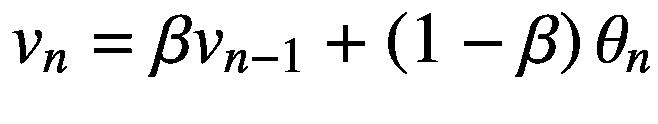

# 四、训练神经网络

用 TensorFlow 构建复杂的网络非常容易，您现在可能已经意识到了。几行代码足以构建具有数千个(甚至更多)参数的网络。现在应该很清楚，在训练这样的网络时会出现问题。测试超参数是困难的、不稳定的和缓慢的，因为运行几百个时期可能需要几个小时。这不仅是一个性能问题；否则，使用越来越快的硬件就足够了。问题是，收敛过程(学习)通常根本不起作用。它停止，它发散，或者它永远不会接近成本函数的最小值。我们需要使培训过程高效、快速和可靠的方法。您将看到有助于复杂网络训练的两个主要策略:动态学习率衰减和比简单梯度下降更智能的优化器([GD]如 RMSProp、Momentum 和 Adam)。

## 动态学习率衰减

我几次提到学习率 *γ* 是一个非常重要的参数，选择不好会使你的模型无法运行。再次参考图 [2-12](02.html#Fig12) ，图中显示了选择一个太大的学习率会使你的梯度下降算法在最小值附近反弹而不收敛。不讨论它们，让我们在讨论梯度下降算法时重写描述第 [2](02.html) 章中描述的权重和偏差更新的方程。(记住:我描述了一个有两个权重*w*T8】0 和*w*T12】1 的问题的算法。)

![$$ {w}_{0,\left[n+1\right]}={w}_{0,\left[n\right]}-\gamma \frac{\partial J\left({w}_{0,\left[n\right]},{w}_{1,\left[n\right]}\right)}{\partial {w}_0} $$](img/463356_1_En_4_Chapter_TeX_Equa.png)

![$$ {w}_{1,\left[n+1\right]}={w}_{1,\left[n\right]}-\gamma \frac{\partial J\left({w}_{0,\left[n\right]},{w}_{1,\left[n\right]}\right)}{\partial {w}_1} $$](img/463356_1_En_4_Chapter_TeX_Equb.png)

作为提醒，下面是符号的概述。(如果你不记得梯度下降是如何工作的，请再次参考第 [2](02.html) 章。)

*   *w* <sub>0，【*n*</sub>:迭代时权重 0*n*

*   *w* <sub>1，*n*</sub>:迭代时权重 1*n*

*   *J* ( *w* <sub>0，*n*</sub>， *w* <sub>1，*n*</sub>):迭代时的代价函数 *n*

*   *γ* :学习率

为了展示我将要讨论的效果，我们将考虑在第 [2](02.html) 章“实际例子中的学习率”一节中描述的相同问题。将权重 *w* <sub>0、 *n*</sub> 、 *w* <sub>1、 *n*</sub> 绘制在 *γ* = 2 的成本函数的等高线上(见图 [4-1](#Fig1) )显示了(正如您将从第 [2](02.html) 章中所记得的)权重值如何围绕最小值( *w* <sub>0)振荡在这里，学习率过大的问题清晰可见。该算法不能收敛，因为它采取的步骤太大，无法接近最小值。不同的估算值***w***<sub>***n***</sub>在图 [4-1](#Fig1) 中用点表示。最小值由图像中间的圆圈表示。</sub>


图 4-1

梯度下降算法的说明。这里，已经选择了 *γ* = 2 的学习率

但是你可能已经注意到，在我们的算法中，我们做了一个非常重要的决定(没有明确说明):*我们保持每次迭代的学习速率不变*。但是没有理由这样做。相反，这是一个非常糟糕的主意。直觉上，较大的学习速率将使收敛在开始时快速移动，但是一旦你接近最小值，你将想要使用小得多的学习速率，以允许算法以最有效的方式向最小值收敛。我们希望有一个学习率，开始(相对)大，然后随着迭代减少。但是应该怎么减少呢？目前使用的方法有几种，在下一节中，我们将研究那些最常用的方法，以及如何在 Python 和 TensorFlow 中实现它们。我们将使用生成图 [4-1](#Fig1) 和 [2-12](02.html#Fig12) 的相同问题，并比较不同算法的行为。请花些时间回顾第 [2](02.html) 章中关于梯度下降的部分，以便在阅读下一部分之前，对这些内容有个清晰的了解。

### 迭代还是纪元？

在查看各种方法之前，我想澄清一下这个问题:我们正在谈论的迭代是什么？它们是时代吗？从技术上讲，事实并非如此。迭代是指更新权重。例如，考虑小批量梯度下降。在这种情况下，每次小批量后都会进行一次迭代(当您更新权重时)。考虑第 3 章[中的 Zalando 数据集:60，000 个训练案例和 50 个小批量。在这种情况下，您将在一个时期中有 1200 次迭代。对于学习率的降低来说，重要的是你对权重进行更新的次数，而不是历元的数量。如果在 Zalando 数据集上使用随机梯度下降(SGD )(在每次观察后更新权重),您将有 60，000 次迭代，并且您可能需要比使用小批量梯度下降减少更多的学习，因为它更新得更频繁。在批量梯度下降的情况下，在对训练数据进行一次完整扫描后更新您的权重，您将在每个时期准确地更新一次学习率。](03.html)

### 注意

动态学习率衰减中的迭代指的是算法中更新权重的步骤。例如，如果您在第 3 章[中的 Zalando 数据集上使用 SGD，在一个时期(扫描 60，000 个训练观察值)中，小批量大小为 50，您有 1200 次迭代。](03.html)

正确理解这一点非常重要。如果你这样做了，你可以适当地选择学习率衰减的不同算法的参数。如果你选择它们时认为学习率只在每个时期后更新，你可能会犯大错误。

### 注意

对于每个动态降低的算法，学习率将引入新的超参数，您必须对其进行优化，从而增加模型选择过程的复杂性。

### 阶梯衰减

阶梯衰减法是最基本的方法。它包括在代码中手动降低学习率，并根据看起来可行的方式对更改进行硬编码。比如如何让 GD 算法收敛于图 [4-1](#Fig1) ，从一个 *γ* = 2 开始？让我们考虑下面的衰减(其中我们用 *j* 表示迭代次数):


简单地将它包含在 Python 代码中

```py
gamma0 = 2.0
if (j < 4):
        gamma = gamma0
    elif j>=4:
        gamma = gamma0 /5.0

```

会给出一个收敛算法(见图 [4-2](#Fig2) )。这里选择了初始学习率 *γ* <sub>0</sub> = 2，从迭代 4 开始，使用 *γ* = 0.4。不同的估计值***w***<sub>***n***</sub>用点表示。最小值由图像中间的圆圈表示。该算法现在能够收敛。每个点都标有迭代次数，以便于跟踪权重更新。


图 4-2

用阶梯衰减法说明梯度下降算法

第一步很大，然后，随着我们在迭代 4 时将学习率降低到 0.4，它们变得更小，GD 能够向最小值收敛。通过这个简单的修改，我们取得了很好的效果。问题在于，当处理复杂的数据集和模型时(比如我们在第 [3](03.html) 章中所做的)，这个过程需要(如果可行的话)大量的测试。您将不得不多次降低学习率，并且为学习率的降低找到正确的迭代和值是一项非常具有挑战性的任务，以至于它实际上是不可用的，除非您正在处理非常简单的数据集和网络。这种方法也不是很稳定，并且根据您所拥有的数据，可能需要不断地调整。TL；<sup>博士[1](#Fn1)T5】:不要用。</sup>

表 4-1

引入了额外的超参数

<colgroup><col class="tcol1 align-left"> <col class="tcol2 align-left"></colgroup> 
| 

超参数

 | 

例子

 |
| --- | --- |
| 算法将更新学习率的迭代 | 在这个例子中，我们选择迭代次数 4 |
| 每次变化后的学习率值(多个值) | 在这个例子中，从迭代 1 到 3， *γ* = 2，从迭代 4， *γ* = 0.4。 |

### 阶跃衰减

更自动的是所谓的阶跃衰减。这种方法每经过一定次数的迭代就以一个常数因子降低学习速率。数学上，它可以写成


其中⌊ *a* ⌋表示 *a* 的整数部分， *D* (在后面的代码中用`epoch_drop`表示)是一个我们可以调整的整数常量。例如，使用以下代码:

```py
epochs_drop = 2
gamma = gamma0 / (np.floor(j/epochs_drop)+1)

```

将再次给出收敛算法。在图 [4-3](#Fig3) 中，已经选择了初始学习率*γ*T4】0= 2，每迭代 2 次，学习率按照*γ*t8】0/⌊*j*/2+1⌋.递减不同的估计值***w***<sub>***n***</sub>用点表示。最小值由图像中间的圆圈表示。该算法现在能够收敛。每个点都标有迭代次数，以便于跟踪权重更新。


图 4-3

具有步长衰减的梯度下降算法的图示

了解学习率下降的速度是很重要的。你不想只经过几次迭代就有接近于零的学习率；否则你的收敛永远不会成功。在图 [4-4](#Fig4) 中，您可以看到 *D* 的三个值的学习率下降速度的对比。


图 4-4

使用步长衰减算法，降低三个值 *D* 的学习率:10、20 和 50

请注意，例如，在 *D* = 10 的情况下，仅经过 100 次迭代后，学习率就降低了大约 10 倍！如果你让你的学习率下降得太快，你可能会看到你的收敛在仅仅几次迭代后就停止了。总是试图了解你的 *γ* 下降有多快。

### 注意

感受你的学习速度下降有多快的一个好方法是，尝试确定经过多少次迭代后 *γ* 比初始值小十倍。记住，如果你在 10 次 *D* 迭代后得到一个 *γ* = *γ* <sub>0</sub> /10，那么你在仅仅 100 次 *D* 迭代后就会得到*γ*=*γ*<sub>0</sub>/100，*γ*=*γ*<sub>0</sub>/10 如果出现这种情况，只能通过用几个 *D* 值正确测试速率来回答需要什么。

让我们考虑一个具体的例子。假设您正在用 5000 个时期的`1e-5`观察值训练您的模型，小批量为 50，起始学习率为 *γ* <sub>0</sub> = 0.2。如果你不假思索地选择 *D* = 10，你就会有


只经过 100 个历元，所以如果你这么快降低学习率，用 5000 个历元也不会有太大收获。

表 4-2

引入了额外的超参数

<colgroup><col class="tcol1 align-left"> <col class="tcol2 align-left"></colgroup> 
| 

超参数

 | 

例子

 |
| --- | --- |
| 参数 D | *D* = 10 |

### 逆时间衰减

更新学习率的另一种方法是使用称为逆时间衰减的公式


其中 *ν* 是一个称为衰减率的参数。在图 [4-5](#Fig5) 中，可以看到 *ν* 的三个参数:0.01、0.1 和 0.8 的学习率下降的对比。在图 [4-5](#Fig5) 中，您还可以看到 *ν* 的三个不同值的学习率是如何降低的。请注意，y 轴以对数标度绘制，以使变化的实体更容易比较。注意， *y* 轴是对数轴。


图 4-5

使用逆时间衰减算法，ν的三个值(0.01、0.1 和 0.8)的学习率降低

这种方法也使得第 [2](02.html) 章讨论的 GD 算法收敛。在图 [4-6](#Fig6) 中，你可以看到当选择 *ν* = 0.2 时，权重如何在仅仅几次迭代后就收敛到最小位置。在图 [4-6](#Fig6) 中，已经选择了 *γ* <sub>0</sub> = 2 的初始学习速率，并且已经使用了 *ν* = 0.2 的逆时间衰减算法。不同的估计值***w***<sub>***n***</sub>用点表示。最小值由图像中间的圆圈表示。该算法现在能够收敛。每个点都标有迭代次数，以便于跟踪权重更新。


图 4-6

*ν* = 0.2 时具有逆时间衰减的梯度下降算法图解

如果我们为 *ν* 选择一个更大的值，看看会发生什么是非常有趣的。在图 [4-7](#Fig7) 中，已经选择了初始学习率 *γ* <sub>0</sub> = 2，并且使用了 *ν* = 1.5 的逆时间衰减算法。不同的估计值***w***<sub>***n***</sub>用点表示。最小值由图像中间的圆圈表示。该算法现在能够收敛。每个点都标有迭代次数，以便于跟踪权重更新。


图 4-7

*ν* = 1.5 的梯度下降算法图解

我们在图 [4-7](#Fig7) 中观察到的非常有意义。与图 [4-6](#Fig6) 中发生的情况相比，增加 *ν* 会使学习率下降得更快，因此需要更多的步骤才能达到最小值，因为学习率越来越小。我们可以比较 *ν* 的两个值的成本函数的行为。在图 [4-8](#Fig8) 中，您可以在图(A)中看到成本函数与历元数的关系。乍一看，两者似乎收敛得一样快。但是我们来放大一下图(B)中的 *J* = 0。您可以清楚地看到， *ν* = 0.2 的收敛速度更快，因为学习率比 *ν* = 1.5 的学习率更大。

表 4-3

引入了额外的超参数

<colgroup><col class="tcol1 align-left"> <col class="tcol2 align-left"></colgroup> 
| 

超参数

 | 

例子

 |
| --- | --- |
| 衰变率 *v* | *v* = 0.2 |


图 4-8

成本函数与历元数。在图(A)中，绘制了成本函数假设的整个值范围。在图(B)中， *J* = 0 周围的区域已经被放大，以显示对于较小的 *ν* 值，成本函数如何下降得更快。

### 指数式衰减

降低学习率的另一种方法是根据称为指数衰减的公式


参见图 [4-9](#Fig9) 了解学习率的速度。请注意，y 轴以对数标度绘制，以使变化的实体更容易比较。注意对于 *ν* = 0.01，经过 200 次迭代(不是历元)，学习率已经比开始时小了 1000 倍！


图 4-9

使用指数衰减算法，降低三个值 *ν* 的学习率:0.01、0.1 和 0.8，以及 *T* = 100

我们可以将这种方法应用于我们的问题，其中 *ν* = 0.2 并且 *T* = 3，并且算法再次收敛。在图 [4-10](#Fig10) 中，已经选择了*γ*T8】0= 2 的初始学习速率，并且使用了 *ν* = 0，2 和 *T* = 3 的指数衰减算法。不同的估计值***w***<sub>***n***</sub>用点表示。最小值由图像中间的圆圈表示。该算法现在能够收敛。每个点都标有迭代次数，以便于跟踪权重更新。

表 4-4

引入了额外的超参数

<colgroup><col class="tcol1 align-left"> <col class="tcol2 align-left"></colgroup> 
| 

超参数

 | 

例子

 |
| --- | --- |
| 衰变率 *v* | *v* = 0.2 |
| 衰变级数 *T* | *T* = 3 |


图 4-10

指数衰减的梯度下降算法图解

### 自然指数衰减

降低学习率的另一种方法是根据称为自然指数衰减的公式


这个案例特别有趣，因为它可以让你学到一些重要的东西。考虑第一个图 [4-11](#Fig11) ，比较 *ν* 的不同值如何与学习速率的不同速度降低相关。


图 4-11

使用自然指数衰减算法降低了 *ν* 的三个值的学习率:0.01、0.1 和 0.8 以及 *T* = 100、*。请注意，y 轴以对数标度绘制，以使变化的实体更容易比较。请注意，对于 200 次迭代(非历元)后的 *ν* = 0.8，学习率已经比开始时小了 10 倍 <sup>64</sup> 。*

我想提醒您注意 y 轴上的值(注意，它使用的是对数刻度)。对于 200 次迭代后的 *ν* = 0.8，学习率是初始值的 10 倍<sup>-64 倍</sup>！几乎为零。这意味着在几次迭代之后，不再有更新发生，因为学习率太小了。给你一个 10<sup>-64</sup>的尺度的概念，一个氢原子大概“只有”10<sup>-11</sup>*m*！所以，除非你非常小心地选择 *ν* ，否则你不会走得很远。

考虑图 [4-12](#Fig12) ，我已经画出了我们的权重，因为它们是用 GD 算法更新的，对于学习率的两个值:0.2(虚线)和 0.5(连续)。


图 4-12

具有自然指数衰减的梯度下降算法的图示

为了检查收敛性，我们需要放大最小值。你会在图 [4-13](#Fig13) 中看到。如果你想知道为什么最小值相对于图 [4-12](#Fig12) 中的等高线似乎处于不同的位置，这是因为等高线不相同，因为在图 [4-13](#Fig13) 中，我们更接近最小值。


图 4-13

在最小值附近放大的梯度下降算法的图示。此处使用了图 [4-12](#Fig12) 中使用的相同方法和参数。

现在我们看到了一些有意义的东西。实线表示*ν*= 0.5；因此，学习率下降得更快，无法达到最小值。事实上，在仅仅 7 次迭代之后，我们得到了 *γ* = 0.06，并且在 20 次迭代之后，我们得到了*γ*= 9 ^ 10<sup>-5</sup>，这个值如此之小，以至于收敛不再能够以合理的速度进行！同样，检查两个参数的成本函数下降非常有指导意义(见图 [4-14](#Fig14) )。


图 4-14

成本函数与两个值 *ν* = 0.2 和 0.5 的自然指数衰减的历元数的关系。在图(A)中，绘制了成本函数假设的整个值范围。在图(B)中， *J* = 0 周围的区域已经被放大，以显示对于 *ν* 的较小值，成本函数如何下降得更快。

我们从曲线(B)中看到，因为学习率太小，所以 *ν* = 0.5 的成本函数没有达到零，而是变得几乎恒定。你可能认为通过使用更多的迭代，该方法将最终收敛，但事实并非如此。参考图 [4-15](#Fig15) 可以看到收敛过程实际上停止了，因为一段时间后学习率几乎为零。图中已经选择了 *γ* <sub>0</sub> = 2 的初始学习速率，并且使用了 *ν* = 0.5 的指数衰减算法。GD 没有设法达到最小值。不同的估计值***w***<sub>***n***</sub>用点表示。最小值由图像中间的圆圈表示。该算法现在能够收敛。每个点都标有迭代次数，以便于跟踪权重更新。


图 4-15

200 次迭代的最小值附近放大的梯度下降算法的图示

让我们检查一下这个过程中的学习率 *ν* = 0.5(见图 [4-16](#Fig16) )。检查 y 轴上的值。在大约 175 次迭代后，学习率达到 10<sup>-40</sup>。实际上，它是零。GD 算法将不再更新权重，无论您让它运行多少次迭代。


图 4-16

*ν* = 0.5 时学习速率与自然指数衰减迭代次数的关系。注意 y 轴是对数刻度，以更好地突出 *γ* 的变化。

最后，让我们将这些方法放在同一个图中进行比较，以了解相关的行为。在图 [4-17](#Fig17) 中，你可以看到三个曲线图，追踪不同参数下每种方法的学习率衰减。


图 4-17

比较不同参数对算法学习率衰减的指示

### 注意

你应该意识到你的学习率下降的速度有多快，以避免它实际上变成零并完全停止你的收敛。

### tensorflow 实现

我应该简单讲一下`tensorflow`是如何实现我刚才解释的方法的，因为有一些细节你应该知道。在`tensorflow`中，您可以找到以下函数来执行动态学习率衰减: <sup>[2](#Fn2)</sup>

*   指数衰减→ `tf.train.exponential_decay` ( [`https://goo.gl/fiE2ML`](https://goo.gl/fiE2ML) )

*   逆时间衰减→ `tf.train.inverse_time_decay` ( [`https://goo.gl/GXK6MX`](https://goo.gl/GXK6MX) )

*   自然指数衰减→ `tf.train.natural_exp_decay` ( [`https://goo.gl/cGJe52`](https://goo.gl/cGJe52) )

*   步衰变→ `tf.train.piecewise_constant` ( [`https://goo.gl/bL47ZD`](https://goo.gl/bL47ZD) )

*   多项式衰减→ `tf.train.polynomial_decay` ( [`https://goo.gl/zuJWNo`](https://goo.gl/zuJWNo) )

多项式衰减是一种稍微复杂一点的降低学习速率的方式。因为很少使用，所以没有讨论这一点，但是您可以阅读 TensorFlow 网站上的文档，了解它的工作原理。

TensorFlow 使用一个额外的参数为您提供更多的灵活性。以逆时间衰减法为例。我们的学习率衰减方程是


这里我们有两个参数:*γ*T2 0 和 *ν* 。TensorFlow 使用三个参数:


其中*ν*T3*ds*T6 在 TensorFlow 代码`decay_step`中调用。Python 代码中 TensorFlow 官方文档中的公式是

```py
decayed_learning_rate = learning_rate / (1 + decay_rate * global_step / decay_step)

```

将 TensorFlow 语言与我们的符号联系起来，如下所示:

*   `global_step` → *j* (迭代次数)

*   `decay_rate`→

**   `decay_step`→*<sub>*【ds】*</sub>*

    **   `learning_rate` → *γ* <sub>*o*</sub> (初始学习率)** 

 **您可能会问自己，为什么要有这个额外的参数。从数学上来说，这个参数是多余的。我们可以简单地将我们的 *ν* 设置为与*ν*/*ν*<sub>*ds*</sub>相同的值，我们会得到相同的结果。实际上，问题是 *j* (迭代次数)很快变得很大，因此，我们的 *ν* 可能需要假设很小的值，以便能够获得合理的学习率降低。参数*ν*<sub>*ds*</sub>的目标是缩放迭代次数。例如，您可以将该参数设置为*ν*<sub>*ds*</sub>= 10<sup>5</sup>，从而使学习率的降低发生在 10 <sup>5</sup> 次迭代的范围内，而不是每次迭代。如果您有一个包含 10 个 <sup>8 个</sup>观测值的大型数据集，并且您使用的小批量大小为 50，那么对于每个时期，您将得到 2 ^ 10<sup>6 个</sup>迭代。假设在 100 个周期后，你希望你的学习率是初始值的 1/5。为此，你需要一个*ν*= 2 ^ 10<sup>8</sup>，一个相当小的值，更重要的是，它取决于数据集的大小和小批量的大小。如果你“标准化”，也就是说，迭代次数，你可以为 *ν* 选择一个保持不变的值，如果你选择改变，例如，小批量。还有一个额外的实际原因(比我刚才讨论的更重要)，就是下面这个:`tensorflow`函数有一个额外的参数:`staircase`，它可以取`True`或者`False`的值。如果设置为`True`，将使用以下功能:

![$$ \gamma =\frac{\gamma_0}{1+\nu \left[\frac{j}{\nu_{ds}}\right]} $$](img/463356_1_En_4_Chapter_TeX_Equk.png)

因此，你只对每一次*<sub>*ds*</sub>迭代进行更新，而不是连续更新。在图 [4-18](#Fig18) 中，你可以看到 *ν* = 0.5 和*ν*<sub>*ds*</sub>= 20 在 200 次迭代中的差异。在更新学习率之前，您可能希望保持十个历元的学习率不变。*

 *

图 4-18

学习率随着用`tensorflow`和`staircase` = `True`和`False`获得的两个变量而衰减

功能`tf.train.inverse_time_decay`、`tf.train.natural_exp_decay`和`tf.train.polynomial_decay`需要相同的参数。它们以相同的方式工作，附加参数的目的就是我刚刚描述的。如果您需要这个额外的参数，在实现`tensorflow`中的方法时不要混淆。我会告诉你如何实现它的逆时间衰减，但它的工作方式完全相同的所有其他类型。您需要以下额外的代码行:

```py
initial_learning_rate = 0.1
decay_steps = 1000
decay_rate = 0.1
global_step = tf.Variable(0, trainable = False)
learning_rate_decay = tf.train.inverse_time_decay(initial_learning_rate, global_step, decay_steps, decay_rate)

```

然后，您必须修改代码行，在该代码行中，您指定了与此一起使用的优化器。

```py
optimizer = tf.train.GradientDescentOptimizer(learning_rate_decay).minimize(cost, global_step = global_step)

```

唯一不同的是`minimize`函数中的附加参数:`global_step = global_step`。`minimize`函数将在每次更新时用迭代次数更新`global_step`变量。仅此而已。其他功能也是如此。

唯一不同的是函数`piecewise_constant`，它需要不同的参数:`x`、`boundaries`和`values`。例如(来自 TensorFlow 文档):

> *…前 100000 步使用 1.0 的学习率，100001 到 110000 步使用 0.5 的学习率，其他步骤使用 0.1 的学习率*

这需要

```py
boundaries = [100000, 110000]
values = [1.0, 0.5, 0.1]

```

代码

```py
boundaries = [b1,b2,b3, ..., bn]
values = [l1,l12,l23,l34, ..., ln]

```

将给出在`b1`次迭代之前的`l1`，在`b1`和`b2`次迭代之间的`l12`，在`b2`和`b3`次迭代之间的`l23`，等等。请记住，使用这种方法，您必须手动设置代码中的所有值和边界。如果你想测试每一个组合，看看它是否运行良好，这将需要相当大的耐心。TensorFlow 中步进衰减算法的实现如下所示:

```py
global_step = tf.Variable(0, trainable=False)
boundaries = [100000, 110000]
values = [1.0, 0.5, 0.1]
learning_rate = tf.train.piecewise_constant(global_step, boundaries, values)

```

### 将这些方法应用于 Zalando 数据集

让我们试着将您刚刚学到的方法应用到现实场景中。为此，我们将采用第 [3](03.html) 章中使用的 Zalando 数据集。请再次查看第 [3](03.html) 章，了解如何加载数据集以及如何准备数据。在本章的最后，我们编写了构建多层模型的函数和训练模型的函数。让我们考虑一个具有 4 个隐藏层的模型，每个隐藏层包含 20 个神经元。让我们比较一下模型如何以 0.01 的起始初始学习率进行学习，保持那个常数，然后应用逆时间衰减算法，从一个 *γ* <sub>0</sub> = 0.1、 *ν* = 0.1、*ν*<sub>*ds*</sub>= 10<sup>3</sup>开始(见图 [4-19](#Fig19) )。


图 4-19

应用于 Zalando 数据集的 4 层神经网络(每层有 20 个神经元)的成本函数行为。实线用于具有恒定学习率 *γ* = 0.01 的模型。虚线表示我们使用了逆时间衰减算法的网络，其中 *γ* <sub>0</sub> = 0.1， *ν* = 0.1，*ν*<sub>*ds*</sub>= 10<sup>3</sup>。

因此，即使初始学习速率大 10 倍，该算法也更有效。正如我们在这个案例中提到的，在几篇研究论文中已经证明了应用动态学习率可以使学习更快更有效。

### 注意

除非您使用的优化算法包括训练期间的学习率变化(您将在下一节中看到)，否则使用动态学习率衰减通常是一个好主意。这使得学习稳定，通常速度更快。缺点是您有更多的超参数需要优化。

通常，当使用动态学习率衰减时，从比通常使用的初始学习率 *γ* <sub>0</sub> 大的初始学习率开始是一个好主意。因为 *γ* 在减少，这通常不会产生问题，并且会使开始时的收敛(人们希望)更快。正如您现在应该预料到的，哪种方法效果更好并没有固定的规则。每个案例和数据集都是不同的，并且总是需要进行一些测试，以查看哪个参数值会产生最好的结果。

## 常见优化器

到目前为止，我们一直使用梯度下降来最小化我们的成本函数。这不是最有效的方法，有一些算法的修改可以使它更快更有效。这是一个非常活跃的研究领域，你会发现数量惊人的算法，基于不同的想法，使学习更快。我将在这里讨论最有启发性和最著名的:Momentum、RMSProp 和 Adam。S. Ruder 在一篇名为*梯度下降优化算法概述*(可在 [`https://goo.gl/KgKVgG`](https://goo.gl/KgKVgG) 获得)的论文中，为您提供了研究最奇特算法的其他参考资料。这篇文章不适合初学者，需要广泛的数学背景，但是它给出了 Adagrad、Adadelta 和 Nadam 等不寻常算法的概述。此外，它还回顾了在诸如 Hogwild！、倾盆大雨新币等等。当然，这是一本值得你花时间去读的书。

为了理解动量的基本概念(部分也是 RMSProp 和 Adam)，你首先必须理解什么是指数加权平均值。

### 指数加权平均值

让我们假设你正在测量一段时间内的一个量 *θ* (可能是你居住的地方的温度)——例如，一天一次。你会有一系列的测量值，我们可以用*θ*<sub>T5】I</sub>来表示，其中 *i* 从 1 到某个数字 *N* 。如果在开始时，这没有多大意义，请原谅我；然而，让我们递归地定义一个量 *v* <sub>*n*</sub> 为


以此类推，用 *β* ，一个实数用 0<βT2<1。一般来说，我们可以将 *n* <sup>*th*</sup> 项写成



现在我们把所有的项， *v* <sub>1</sub> ， *v* <sub>2</sub> 等等，都写成 *β* 和 *θ* <sub>*i*</sub> 的函数就行了(所以，不递归)。对于*v*T18】2，我们有


对于*v*T2】3，

![$$ {v}_3={\beta}^3+\left(1-\beta \right)\left[{\beta}^2{\theta}_1+\beta {\theta}_2+{\theta}_3\right] $$](img/463356_1_En_4_Chapter_TeX_Equo.png)

概括起来，我们得到

![$$ {v}_n={\beta}^n+\left(1-\beta \right)\left[{\beta}^{n-1}{\theta}_1+{\beta}^{n-2}{\theta}_2+\dots +{\theta}_n\right] $$](img/463356_1_En_4_Chapter_TeX_Equp.png)

或者，更优雅地说(没有三个点)，


现在让我们试着理解这个公式是什么意思。首先，请注意，如果我们选择*v*T8】0= 0，那么术语*β*<sup>T3】nT5】就会消失。让我们这样做(我们设置 *v* <sub>0</sub> = 0 ),现在考虑剩下的内容:</sup>


你还和我在一起吗？现在有趣的部分来了。让我们定义两个序列之间的卷积。 <sup>[3](#Fn3)</sup> 考虑两个序列: *x* <sub>*n*</sub> 和 *h* <sub>*n*</sub> 。两者之间的卷积(用符号∑表示)定义如下


现在，因为我们对于我们的量 *θ* <sub>*i*</sub> 只有有限数量的测量，我们将有


因此，我们可以把*v*<sub>T3】nT5】写成一个卷积为</sub>


我们已经定义了


为了理解这意味着什么，让我们一起画出 *θ* <sub>*n*</sub> ， *b* <sub>*n*</sub> 和 *v* <sub>*n*</sub> 。为此，我们假设 *θ* <sub>*n*</sub> 具有高斯形状(确切形式无关，仅作说明之用)，我们取 *β* = 0.9(见图 [4-20](#Fig20) )。


图 4-20

一个图(左)显示了*θ*<sub>T3】nT5(实线)和*b*<sub>T9】n</sub>(虚线)，一个图(右)显示了对于 *n* = 50 必须求和以获得 *v* <sub>*n*</sub> 的点</sub>

现在我将简要讨论图 [4-20](#Fig20) 。将高斯曲线(*θ*<sub>T5】n</sub>)与 *b* <sub>*n*</sub> 进行卷积，得到 *v* <sub>*n*</sub> 。结果可以在右图中看到。所有这些项， *i* = 1，…，50(标在右边)，将求和得到 *v* <sub>50</sub> 。直观上， *v* <sub>*n*</sub> 是所有 *θ* <sub>*n*</sub> 的平均值对于 *n* = 1，…，50。然后，每一项都乘以一项( *b* <sub>*n*</sub> )，对于 *n* = 50，该项为 1，然后对于 *n* ，项迅速减小，向 1 减小。基本上，这是一个加权平均值，权重呈指数递减(因此得名)。离 *n* = 50 较远的词条关联度越来越小，而离 *n* = 50 较近的词条权重更大。这也是均线。对于每个 *n* ，所有前面的项被相加，每个项乘以一个权重( *b* <sub>*n*</sub> )。

我现在要向你们展示为什么在*b*<sub>T5】n</sub>中有这个因子 1*β*。为什么不只选择 *β* <sup>*n*</sup> ？原因很简单。 *b* <sub>*n*</sub> 除以所有正数 *n* 之和等于 1。我们来看看为什么。考虑以下等式:


这里我们使用了这样的事实:对于*β*T3】1，我们有，对于一个几何级数，我们有


我们描述的计算 *v* <sub>*n*</sub> 的算法无非是我们的量 *θ* <sub>*i*</sub> 的卷积，其中一系列的和等于 1，并且具有(1*β*)*β*<sup>*I*</sup>的形式。

### 注意

一系列数量的指数加权平均值*v*<sub>*n*</sub>*θ*<sub>*n*</sub>是我们数量的卷积*v*<sub>*n*</sub>=*θ*<sub>*n*</sub>∫*b*<sub>*n*</sub> 用*b*<sub>*n*</sub>=(1—*β*)*β*<sup>*n*</sup>其中 *b* <sub>*n*</sub> 具有其与 *n* 的正值之和等于 1 的性质。 它有移动平均线的直观含义，其中每一项都乘以序列 *b* <sub>*n*</sub> 给出的权重。

当您选择越来越小的 *β* 时，权重明显不同于零的点*θ*<sub>T5】n</sub>的数量会减少，如图 [4-21](#Fig21) 所示，其中绘制了不同 *β* 值的系列 *b* <sub>*n*</sub> 。


图 4-21

系列 *b* <sub>*n*</sub> 为 *β* 的三个值:0.9、0.8、0.3。请注意，随着 *β* 变小，对于在 *n* = 0 附近数量越来越少的值，级数与零有显著不同。

这个方法是动量优化器和更高级的学习算法的核心，你将在接下来的章节中看到它在实践中是如何工作的。

### 动力

你会记得，在简单梯度下降中，权重更新是通过以下等式计算的

![$$ \Big\{{\displaystyle \begin{array}{l}{w}_{\left[n+1\right]}={w}_{\left[n\right]}-\gamma {\nabla}_{\mathbf{w}}J\left({w}_{\left[n\right]},{b}_{\left[n\right]}\right)\\ {}{b}_{\left[n+1\right]}={b}_{\left[n\right]}-\gamma \frac{\partial J\left({w}_{\left[n\right]},{b}_{\left[n\right]}\right)}{\partial b}\end{array}} $$](img/463356_1_En_4_Chapter_TeX_Equy.png)

动量优化器背后的思想是使用梯度校正的指数加权平均值，然后将它们用于权重更新。我们更精确地计算

![$$ \Big\{{\displaystyle \begin{array}{l}{v}_{w,\left[n+1\right]}=\beta {v}_{w,\left[n\right]}+\left(1-\beta \right){\nabla}_{\mathbf{w}}J\left({w}_{\left[n\right]},{b}_{\left[n\right]}\right)\\ {}{v}_{b,\left[n+1\right]}=\beta {v}_{b,\left[n\right]}+\left(1-\beta \right)\frac{\partial J\left({w}_{\left[n\right]},{b}_{\left[n\right]}\right)}{\partial b}\end{array}} $$](img/463356_1_En_4_Chapter_TeX_Equz.png)

然后我们会用公式进行更新

![$$ \Big\{{\displaystyle \begin{array}{l}{w}_{\left[n+1\right]}={w}_{\left[n\right]}-\gamma {v}_{w,\left[n\right]}\\ {}{b}_{\left[n+1\right]}={b}_{\left[n\right]}-\gamma {v}_{b,\left[n\right]}\end{array}} $$](img/463356_1_En_4_Chapter_TeX_Equaa.png)

其中通常选择 ***v*** <sub>*w* ，【0】</sub>=**0**和 *v* <sub>*b* ，【0】</sub>= 0。这意味着，正如您现在从上一节关于指数加权平均值的讨论中可以理解的那样，我们不是使用成本函数相对于权重的导数，而是使用导数的移动平均值来更新权重。通常，经验表明，理论上可以忽略偏差校正。

### 注意

动量算法使用成本函数相对于权重的导数的指数加权平均值来更新权重。这样，不仅使用了给定迭代的导数，还考虑了过去的行为。可能会出现算法在最小值附近振荡，而不是直接收敛的情况。与标准梯度下降法相比，这种算法可以更有效地逃离平台。

有时，你会在书籍或博客中发现一个稍微不同的公式(为了简洁，我在这里只提供了权重的等式，**)。**

**![$$ {v}_{w,\left[n+1\right]}=\gamma {v}_{w,\left[n\right]}+\eta {\nabla}_{\mathbf{w}}J\left({w}_{\left[n\right]},{b}_{\left[n\right]}\right) $$](img/463356_1_En_4_Chapter_TeX_Equab.png)**

 **想法和意思保持不变。这只是一个稍微不同的数学公式。我发现我描述的方法用序列卷积和加权平均的概念比第二个公式更容易直观地理解。你会发现的另一个公式(也是 TensorFlow 使用的公式)是

![$$ {v}_{w,\left[n+1\right]}={\eta}^t{v}_{w,\left[n\right]}+{\nabla}_{\mathbf{w}}J\left({w}_{\left[n\right]},{b}_{\left[n\right]}\right) $$](img/463356_1_En_4_Chapter_TeX_Equac.png)

其中 *η* <sup>*t*</sup> 由 TensorFlow 动量调用(上标 *t* 表示该变量由 TensorFlow 使用)。在此公式中，权重更新采用以下形式

![$$ {w}_{\left[n+1\right]}={w}_{\left[n\right]}-{\gamma}^t{v}_{w,\left[n+1\right]}={w}_{\left[n\right]}-{\gamma}^t\left({\eta}^t{v}_{w,\left[n\right]}+{\nabla}_{\mathbf{w}}J\left({w}_{\left[n\right]},{b}_{\left[n\right]}\right)\right)={w}_{\left[n\right]}-{\gamma}^t{\eta}^t{v}_{w,\left[n\right]}-{\gamma}^t{\nabla}_{\mathbf{w}}J\left({w}_{\left[n\right]},{b}_{\left[n\right]}\right) $$](img/463356_1_En_4_Chapter_TeX_Equad.png)

其中，上标 *t* 再次表示该变量是 TensorFlow 使用的变量。虽然看起来不一样，但是这个提法完全等同于我在本节开始时给你的提法。

![$$ {w}_{\left[n+1\right]}={w}_{\left[n\right]}-\gamma \beta {v}_{w,\left[n\right]}-\gamma \left(1-\beta \right){\nabla}_{\mathbf{w}}J\left({w}_{\left[n\right]},{b}_{\left[n\right]}\right) $$](img/463356_1_En_4_Chapter_TeX_Equae.png)

如果我们愿意，TensorFlow 公式和我之前讨论的公式是等价的


这可以通过简单地比较两个不同的权重更新等式来看出。通常，在 TensorFlow 实现中使用大约为 *η* = 0.9 的值，它们通常工作得很好。

在 TensorFlow 中实现动量非常容易。把`GradientDescentOptimizer`换成`tf.train.MomentumOptimizer(learning_rate = learning_rate, momentum = 0.9)`就行了。

动量几乎总是比简单的梯度下降收敛得快。

### 注意

比较不同优化器中的不同参数是错误的。例如，学习率在不同的算法中有不同的含义。你应该比较的是你可以用几个优化器达到的最佳收敛速度，而不考虑参数的选择。将学习率为 0.01 的 GD 与相同学习率的 Adam(稍后介绍)进行比较没有多大意义。您应该将优化器与给您带来最佳和最快收敛的参数进行比较，以决定使用哪一个。

在图 [4-22](#Fig22) 中，你可以看到上一节中讨论的问题对于平坦坡度下降(其中 *γ* = 0.05)和对于动量(其中 *γ* = 0.05 和 *η* = 0.9)的成本函数。你可以看到动量优化器是如何在最小值附近振荡的。在 y 标尺上很难看到的是，有了动量， *J* 达到一个低得多的值。


图 4-22

成本函数与普通梯度下降(其中 *γ* = 0.05)和动量(其中 *γ* = 0.05 和 *η* = 0.9)的历元数的关系。你可以看到动量优化器如何在最小值附近振荡。

更有趣的是检查动量优化器如何沿着成本函数表面选择它的路径。在图 [4-23](#Fig23) 中，您可以看到成本函数的 3D 曲面图。实线是梯度下降优化器沿着最大陡度选择的路径，正如预期的那样。虚线是动量优化器在最小值附近振荡时选择的线。


图 4-23

成本函数 j 的 3D 表面图。实线是梯度下降优化器选择的路径-如预期的那样，沿着最大陡度。虚线是动量优化器在最小值附近振荡时选择的线。

我想让你们相信动量收敛得更快更好。为此，让我们在权重平面中检查这两个优化器的行为。在图 [4-24](#Fig24) 中，可以看到两位优化者选择的路径。在右边的图中，你可以看到围绕最小值的放大。你可以看到梯度下降在 100 个时期后无法达到最小值，尽管它似乎选择了一条更直接的路径到达最小值。它非常接近，但还不够接近。动量优化器在最小值附近振荡，并非常有效地达到最小值。


图 4-24

两个优化器选择的路径。右图显示了围绕最小值的缩放。你可以看到动量如何在围绕它振荡后达到最小值，而 GD 无法在 100 个纪元内达到它。

### RMSProp

让我们转向更复杂一点，但通常更有效的东西。让我给你数学方程，然后我们将它们与我们目前看到的其他方程进行比较。在每次迭代中，我们需要计算

![$$ \Big\{{\displaystyle \begin{array}{l}{S}_{w,\left[n+1\right]}={\beta}_2{S}_{w,\left[n\right]}+\left(1-{\beta}_2\right){\nabla}_wJ\left(w,b\right)\circ {\nabla}_wJ\left(w,b\right)\\ {}{S}_{b,\left[n+1\right]}={\beta}_2{S}_{b,\left[n\right]}+\left(1-{\beta}_2\right)\frac{\partial J\left(w,b\right)}{\partial b}\circ \frac{\partial J\left(w,b\right)}{\partial b}\end{array}} $$](img/463356_1_En_4_Chapter_TeX_Equag.png)

其中符号∘表示元素式乘积。然后，我们将使用等式更新我们的权重

![$$ \Big\{{\displaystyle \begin{array}{l}{w}_{\left[n+1\right]}={w}_{\left[n\right]}-\frac{\gamma {\nabla}_wJ\left(w,b\right)}{\sqrt{S_{w,\left[n+1\right]}+\epsilon }}\\ {}{b}_{\left[n+1\right]}={b}_{\left[n\right]}-\gamma \frac{\partial J\left(w,b\right)}{\partial b}\frac{1}{\sqrt{S_{b,\left[n\right]}+\epsilon }}\end{array}} $$](img/463356_1_En_4_Chapter_TeX_Equah.png)

所以，首先你要确定数量***S***<sub>***w***，*n*+1】</sub>和 *S* <sub>*b* ，*n*+1】</sub>的指数加权平均值，然后用它们来修改你用来更新权重的导数。 *ϵ* ，通常是*ϵ*= 10<sup>8</sup>，是为了避免数量***s***<sub>***w***、 *n* + 1】、 *S* <sub>*b* 、 *n 直观的想法是，如果导数大，那么 *S* 的量就大；所以![$ 1/\sqrt{S_{w,\left[n+1\right]}+\epsilon } $](img/463356_1_En_4_Chapter_TeX_IEq2.png)或者![$ 1/\sqrt{S_{b,\left[n\right]}+\epsilon } $](img/463356_1_En_4_Chapter_TeX_IEq3.png)的因子会更小，学习会变慢。反过来也是如此，所以导数小，学习就快。这种算法将使正在减慢学习速度的参数学习得更快。在 TensorFlow 中，只需使用以下代码就可以轻松使用它:*</sub></sub>

```py
optimizer = tf.train.RMSPropOptimizer(learning_rate, momentum = 0.9).minimize(cost)

```

让我们看看这个优化器选择了什么路径。在图 [4-25](#Fig25) 中，可以看到 RMSProp 在最小值附近振荡。虽然 GD 没有到达它，但 RMSProp 算法在到达它之前有时间绕它做几个循环。


图 4-25

通过简单梯度下降和 RMSProp 选择的成本函数最小值路径。后者围绕最小值循环，然后达到最小值。在同样数量的纪元中，GD 甚至没有那么接近。注意右边图的比例。缩放级别非常高。我们正在看一个最小值附近的极端特写镜头(GD 路径在这个尺度上甚至不可见)。

在图 [4-26](#Fig26) 中，你可以在 3D 中看到沿着成本函数表面的相同路径。


图 4-26

GD ( *γ* = 0.05)和 RMSProp ( *γ* = 0.05， *η* = 0.9，*ϵ*= 10<sup>-10</sup>)沿代价函数表面选择的路径。红点表示最小值。RMSProp，尤其是在开始时，选择一条比 GD 更直接的路径来达到最小值。

在图 [4-27](#Fig27) 中，可以看到 GD、RMSProp 和动量路径。您可以看到 RMSProp 路径更直接地指向最小值。它非常快地接近它，然后越来越近地振荡。它在开始时有一点超调，但随后会很快自我修正并恢复。


图 4-27

GD、RMSProp 和 Momentum 选择的最小路径。您可以看到 RMSProp 通向最小值的路径更加直接。它很快绕过它，然后摆动得越来越近。

### 圣经》和《古兰经》传统中）亚当（人类第一人的名字

我们要看的最后一个算法叫做 Adam(自适应矩估计)。它在一个优化器中结合了 RMSProp 和 Momentum 的思想。像动量一样，它使用过去导数的指数加权平均值，像 RMSProp 一样，它使用过去平方导数的指数加权平均值。

你必须计算动量和 RMSProp 所需的相同量，然后你必须计算下列量:

![$$ {\displaystyle \begin{array}{c}{v}_{w,\left[n\right]}^{corrected}=\frac{v_{w,\left[n\right]}}{1-{\beta}_1^n}\\ {}{v}_{b,\left[n\right]}^{corrected}=\frac{v_{b,\left[n\right]}}{1-{\beta}_1^n}\end{array}} $$](img/463356_1_En_4_Chapter_TeX_Equai.png)

同样，您必须计算

![$$ {\displaystyle \begin{array}{c}{S}_{w,\left[n\right]}^{corrected}=\frac{S_{w,\left[n\right]}}{1-{\beta}_2^n}\\ {}{S}_{b,\left[n\right]}^{corrected}=\frac{S_{b,\left[n\right]}}{1-{\beta}_2^n}\end{array}} $$](img/463356_1_En_4_Chapter_TeX_Equaj.png)

当我们使用 *β* <sub>1</sub> 作为超参数时，我们将在 Momentum 中使用它，在 RMSProp 中使用 *β* <sub>2</sub> 作为超参数。然后，正如我们在 RMSProp 中所做的那样，我们将使用等式更新我们的权重

![$$ \Big\{{\displaystyle \begin{array}{l}{w}_{\left[n+1\right]}={w}_{\left[n\right]}-\frac{\gamma {v}_{w,\left[n\right]}^{corrected}}{\sqrt{S_{w,\left[n+1\right]}^{corrected}+\epsilon }}\\ {}{b}_{\left[n+1\right]}={b}_{\left[n\right]}-\gamma \frac{v_{b,\left[n\right]}^{corrected}}{\sqrt{S_{b,\left[n\right]}^{corrected}+\epsilon }}\end{array}} $$](img/463356_1_En_4_Chapter_TeX_Equak.png)

如果我们简单地使用下面的代码，TensorFlow 会为我们做所有的事情:

```py
optimizer = tf.train.AdamOptimizer(learning_rate = learning_rate, beta1 = 0.9, beta2 = 0.999, epsilon = 1e-8).minimize(cost)

```

其中，在这种情况下，已经选择了参数的典型值: *γ* = 0.3， *β* <sub>1</sub> = 0.9， *β* <sub>2</sub> = 0.999，*ϵ*= 10<sup>—8</sup>。注意，因为该算法使学习速率适应情况，所以我们可以从更大的学习速率开始，以加速收敛。

在图 [4-28](#Fig28) 中，你可以看到 GD 和 Adam 优化器选择的最小值周围的路径。亚当也在最小值附近振荡，但它毫无问题地达到了最小值。在右边的图中(围绕最小值的放大图)，你可以看到算法是如何非常接近最小值的。为了让您了解优化器有多好，在仅仅 200 个时期之后，权重和偏差达到 0.499983，2.000047，这非常接近最小值(记住最小值是在 *w* = 0.5 和 *b* = 2.0)。


图 4-28

GD 和 Adam 优化器在 200 个纪元后选择的路径。请注意 Adam 在最小值附近循环的次数。无论如何，与普通的 GD 相比，opimizer 是非常高效的。

我没有把所有的优化器放在一起展示，因为你会看到很多循环，这并不能真正教会你什么。

### 我应该使用哪个优化器？

总之，你应该使用*亚当*。一般认为它比其他方法更快更好。这并不意味着情况总是如此。最近有研究论文表明这些优化器如何在新数据集上进行糟糕的概括(例如，参见 Ashia C. Wilson、Rebecca Roelofs、Mitchell Stern、Nathan Srebro 和 Benjamin Recht，“机器学习中自适应梯度方法的边际价值”，at [`https://goo.gl/Nzc8bQ`](https://goo.gl/Nzc8bQ) )。还有其他论文支持使用 GD，但学习率会动态下降。这主要取决于你的问题。但是，总的来说，亚当是一个很好的起点。

### 注意

如果您不确定从哪个优化器开始，请使用 Adam。一般认为它比其他方法更快更好。

为了让您了解 Adam 有多好，让我们将它应用到 Zalando 数据集。我们将使用一个有 4 个隐藏层的网络，每个隐藏层有 20 个神经元。我们将使用的模型是在第 [3](03.html) 章最后讨论的模型。图 [4-29](#Fig29) 显示了与 GD 相比，使用 Adam 优化时成本函数如何收敛得更快。此外，在 100 个历元中，GD 达到 86%的准确度，而 Adam 达到 90%。请注意，除了优化器之外，我没有更改模型中的任何内容！对于亚当，我使用了以下代码:


图 4-29

具有 4 个隐藏层的网络的 Zalando 数据集的成本函数，每个隐藏层具有 20 个神经元。实线为素 GD，学习率 *γ* = 0.01，虚线为 Adam 优化， *γ* = 0.1， *β* <sub>1</sub> = 0.9， *β* <sub>2</sub> = 0.999，*ϵ*= 10<sup>—8</sup>。

```py
optimizer = tf.train.AdamOptimizer(learning_rate = learning_rate, beta1 = 0.9, beta2 = 0.999, epsilon = 1e-8).minimize(cost)

```

正如我所建议的，当在大数据集上测试复杂网络时，Adam 优化器是一个很好的起点。但是您不应该将您的测试仅限于这个优化器。测试其他方法总是值得的。也许另一种方法会更好。

## 自行开发的优化程序示例

在完成本章之前，我想向您展示如何使用 TensorFlow 开发您自己的优化器。当您想要使用不直接可用的优化器时，这非常有用。例如，Neelakantan 等人的论文 <sup>[4](#Fn4)</sup> 在他们的研究中，他们展示了在训练复杂网络时向梯度添加随机噪声如何使简单梯度下降变得非常有效。他们展示了一个 20 层的深度网络如何可以用标准的 GD 有效地训练，甚至从较差的权重初始化开始。

例如，如果您想测试这个方法，您不能使用`tf.GradientDescentOptimizer`函数，因为它实现了一个普通的 GD，没有本文中描述的噪声。要测试它，您必须能够访问代码中的渐变，向它们添加噪声，然后用修改后的渐变更新权重。我们不会在这里测试他们的方法；这将需要太多的时间，超出了本书的范围，但是了解如何在不使用`tf.GradientDescentOptimizer`和不手动计算任何导数的情况下开发简单的梯度下降是有益的。

在构建我们的网络之前，我们必须知道我们要使用的数据集以及什么问题(回归、分类等。)我们要解决。让我们用一个已知的数据集做一些新的东西。让我们使用我们在第 [2 章](02.html)中使用的 MNIST 数据集，但这一次，让我们使用`softmax`函数执行多类分类，就像我们在第 [3 章](03.html)中对 Zalando 数据集所做的那样。在第 [2](02.html) 章中， [I](01.html) 详细讨论了如何用 sklearn 加载 MNIST 数据集，所以让我们在这里用一种不同的(更有效的)方式来做。TensorFlow 有一个下载 MNIST 数据集的方法，包括已经一次性编码的标签。这可以通过下面几行简单地完成:

```py
from tensorflow.examples.tutorials.mnist import input_data
mnist = input_data.read_data_sets("/tmp/data/", one_hot=True)

```

这给了你输出

```py
Successfully downloaded train-images-idx3-ubyte.gz 9912422 bytes.
Extracting /tmp/data/train-images-idx3-ubyte.gz
Successfully downloaded train-labels-idx1-ubyte.gz 28881 bytes.
Extracting /tmp/data/train-labels-idx1-ubyte.gz
Successfully downloaded t10k-images-idx3-ubyte.gz 1648877 bytes.
Extracting /tmp/data/t10k-images-idx3-ubyte.gz
Successfully downloaded t10k-labels-idx1-ubyte.gz 4542 bytes.
Extracting /tmp/data/t10k-labels-idx1-ubyte.gz

```

你会在文件夹中找到这些文件(如果你使用的是 Windows) `c:\tmp\data`。如果您想更改文件的存储位置，您必须更改函数`read_data_sets`的`"/tmp/data"`参数。现在，你可能还记得第二章[中的](02.html)，MNIST 图像是 28 × 28 像素(总共 784 像素)的灰度图像，所以每个像素可以取 0 到 254 之间的值。有了这些信息，我们现在可以构建我们的网络。

```py
X = tf.placeholder(tf.float32, [784, None]) # mnist data image of shape 28*28=784
Y = tf.placeholder(tf.float32, [10, None]) # 0-9 digits recognition => 10 classes
learning_rate_ = tf.placeholder(tf.float32, shape=())
W = tf.Variable(tf.zeros([10, 784]), dtype=tf.float32)
b = tf.Variable(tf.zeros([10,1]), dtype=tf.float32)

y_ = tf.nn.softmax(tf.matmul(W,X)+b)
cost = - tf.reduce_mean(Y * tf.log(y_)+(1-Y) * tf.log(1-y_))

grad_W, grad_b = tf.gradients(xs=[W, b], ys=cost)

new_W = W.assign(W - learning_rate_ * grad_W)
new_b = b.assign(b - learning_rate_ * grad_b)

```

这条线

```py
grad_W, grad_b = tf.gradients(xs=[W, b], ys=cost)

```

前面的代码给出了包含`cost`节点分别相对于`W`和`b`的梯度的张量。`TensorFlow`自动为您计算！如果你有兴趣知道如何操作，可以在 [https:// goo. gl/ XAjRkX](https://goo.gl/XAjRkX) 查看`tf.gradients`函数的官方文档。现在，我们必须向更新权重的计算图添加节点，这就是我们对线条所做的

```py
new_W = W.assign(W - learning_rate_ * grad_W)
new_b = b.assign(b - learning_rate_ * grad_b)

```

当我们在会话期间要求`TensorFlow`评估节点`new_W`和`new_b`时，权重和偏差得到更新。最后，我们必须修改评估图形的函数，使用(对于小批量 GD)行

```py
_, _, cost_ = sess.run([new_W, new_b , cost], feed_dict = {X: X_train_mini, Y: y_train_mini, learning_rate_: learning_r})

```

以这种方式，新节点`new_W`和`new_b`得到评估，并且在这样做的过程中，`TensorFlow`更新权重和偏差。不再需要以下行:

```py
sess.run(optimizer, feed_dict = {X: X_train_mini, Y: y_train_mini, learning_rate_: learning_r})

```

因为我们不再有`optimizer`节点了。您需要的整个函数如下:

```py
def run_model_mb(minibatch_size, training_epochs, features, classes, logging_step = 100, learning_r = 0.001):
    sess = tf.Session()
    sess.run(tf.global_variables_initializer())

    total_batch = int(mnist.train.num_examples/minibatch_size)

    cost_history = []
    accuracy_history = []

    for epoch in range(training_epochs+1):
        for i in range(total_batch):
            batch_xs, batch_ys = mnist.train.next_batch(minibatch_size)
            batch_xs_t = batch_xs.T
            batch_ys_t = batch_ys.T
            _, _, cost_ = sess.run([new_W, new_b ,
                                    cost], feed_dict = {X: batch_xs_t, Y: batch_ys_t, learning_rate_: learning_r})

        cost_ = sess.run(cost, feed_dict={ X:features, Y: classes})
        accuracy_ = sess.run(accuracy, feed_dict={ X:features, Y: classes})
        cost_history = np.append(cost_history, cost_)
        accuracy_history = np.append(accuracy_history, accuracy_)

        if (epoch % logging_step == 0):
                print("Reached epoch",epoch,"cost J =", cost_)
                print ("Accuracy:", accuracy_)

    return sess, cost_history, accuracy_history

```

这个函数与我们以前用过的函数略有不同，因为在这里，我使用了 TensorFlow 的一些功能，让我们的生活变得轻松一些。特别是，该行

```py
total_batch = int(mnist.train.num_examples/minibatch_size)

```

计算我们拥有的小批量的总数，因为变量`mnist.train.num_examples`包含我们拥有的观察值的数量。然后为了得到批次，我们使用

```py
batch_xs, batch_ys = mnist.train.next_batch(minibatch_size)

```

这将返回两个张量，包含训练输入数据(`batch_xs`)和独热编码标签(`batch_ys`)。然后，我们只需转置它们，因为`TensorFlow`将观察值作为行返回数组。我们用线来做

```py
batch_xs_t = batch_xs.T
batch_ys_t = batch_ys.T

```

我还在函数中添加了精度计算，以便更容易看到我们做得有多好。让模型运行 python 调用

```py
sess, cost_history, accuracy_history = run_model (100, 50, X_train_tr, labels_, logging_step = 10, learning_r = 0.01)

```

将给出以下输出:

```py
Reached epoch 0 cost J = 1.06549
Accuracy: 0.773786
Reached epoch 10 cost J = 0.972171
Accuracy: 0.853371
Reached epoch 20 cost J = 0.961519
Accuracy: 0.869357
Reached epoch 30 cost J = 0.956766
Accuracy: 0.877814
Reached epoch 40 cost J = 0.953982
Accuracy: 0.883143
Reached epoch 50 cost J = 0.952118
Accuracy: 0.886386

```

该模型将与 TensorFlow 提供的梯度下降优化器完全一样。但是现在，你可以访问渐变，你可以修改它们，给它们添加噪声(如果你想尝试的话)，等等。在图 [4-30](#Fig30) 中，您可以看到成本函数行为(在右侧)以及我们通过该模型获得的精度与时期(在左侧)。

### 注意

TensorFlow 是一个很棒的库，因为它为您提供了基本上从零开始构建模型的灵活性。但是理解不同的方法是如何工作的是很重要的，这样才能最大限度地利用这个库。你需要对算法背后的数学有很好的理解，以便能够调整它们或开发变体。


图 4-30

具有一个神经元的神经网络的成本函数行为(右)和准确度与时期(左)以及使用`tf.gradients`函数开发的梯度下降

<aside class="FootnoteSection" epub:type="footnotes">Footnotes [1](#Fn1_source)

万一你不知道，TL；DR 是“太长；没看。”这是网络俚语，用来形容因为太长而被忽略的文本。(来源: [`https://en.wikipedia.org/wiki/TL`](https://en.wikipedia.org/wiki/TL) `;DR`)

  [2](#Fn2_source)

在 [`https://goo.gl/vpFNp7`](https://goo.gl/vpFNp7) 查看官方 TensorFlow 文档中的概述。

  [3](#Fn3_source)

一般来说，序列是对象的枚举集合。

  [4](#Fn4_source)

A.Neelakantan 等人，“添加梯度噪声改善非常深度学习的学习”，在 ICLR 2016 上发表的会议论文，可在 [`https://arxiv.org/abs/1511.06807`](https://arxiv.org/abs/1511.06807) 获得。

 </aside>*****