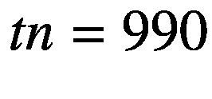
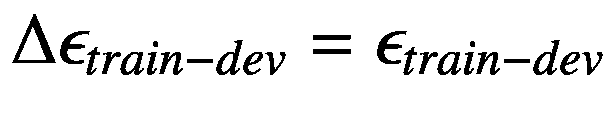

# 六、度量分析

让我们考虑一下我们在第 [3](03.html) 章中分析的问题，我们对 Zalando 数据集进行了分类。在做我们所有的工作时，我们做了一个强有力的假设，但没有明确地说出来:我们假设所有的观察都被正确地标记了。我们不能肯定地说。为了执行标记，需要一些人工干预，因此，一定数量的图像肯定被错误地分类，因为人类不是完美的。这是一个重要的启示。考虑下面的场景:在第三章[中，我们用我们的模型达到了大约 90%的准确率。人们可以尝试获得越来越好的精确度，但是什么时候停止尝试才是明智的呢？如果你的标签在 10%的情况下是错误的，那么你的模型，尽管可能很复杂，也永远无法以非常高的精度推广到新的数据，因为它已经为许多图像学习了错误的类别。我们花了相当多的时间来检查和准备训练数据，例如，标准化它，但是我们从来没有花任何时间来检查标签本身。我们还假设所有的类都有相似的特征。(我将在本章后面讨论这到底意味着什么，目前，对这个概念的直观理解就足够了。)如果特定类别的图像质量比其他类别的差，该怎么办？如果不同类别的灰度值不为零的像素数量有很大差异，会怎样？我们也没有检查一些图像是否完全空白。那种情况下会发生什么？你可以想象，我们不能手动检查所有的图像，试图发现这样的问题。假设我们有数百万张图像，手工分析肯定是不可能的。](03.html)

我们的武器库中需要一种新的武器，能够发现这种情况，并能够判断一个模型做得如何。这种新武器是本章的重点，我称之为“度量分析”该领域的人们经常将这一系列方法称为“错误分析”我发现这个名字很容易混淆，尤其是对于初学者。*错误*可能指的东西太多了:Python 代码 bug、方法错误、算法错误、优化器选择错误等等。在这一章中，你将会看到如何获得关于你的模型如何运行以及你的数据有多好的基本信息。我们将通过在一组不同的数据集上评估您的优化指标来做到这一点，这些数据集可以从您的数据中获得。

您之前已经看到了一个基本示例。你会记得我们讨论过，关于回归，如何在*MSE*<sub>*train*</sub>≪*MSE*<sub>*dev*</sub>的情况下，我们处于过度拟合的状态。我们的衡量标准是 MSE(均方误差),在两个数据集(training 和 dev)上对其进行评估，并比较这两个值，可以告知您模型是否过度拟合。我将在本章详述这种方法，让你从数据和模型中提取更多的信息。

## 人因水平性能和贝叶斯误差

在我们用于监督学习的大多数数据集中，一定有人已经标记了观察值。举个例子，在一个数据集里，我们有被分类的图像。如果我们要求人们对所有图像进行分类(想象这是可能的，不管图像的数量)，所获得的准确率永远不会是 100%。有些图像可能太模糊，无法正确分类，人们会犯错误。例如，如果 5%的图像由于模糊不清而无法正确分类，我们必须预计人们能够达到的最大准确度将永远低于 95%。

让我们考虑一个分类问题。首先，让我们定义一下*错误*这个词的含义。在本章中，将使用词语*误差*来表示下列量，用 *ϵ* 来表示:


例如，如果我们用一个模型达到 95%的准确度，我们将得到*ϵ*= 10.95 = 0.05，或者用百分比表示， *ϵ* = 5%。

需要理解的一个有用的概念是人的水平绩效，它可以定义如下:

*人的水平性能(* *定义 1)* :执行分类任务的人所能达到的误差 *ϵ* 的最低值。我们将用 *ϵ* <sub>*hlp*</sub> 来表示。

让我们设计一个具体的例子。假设我们有一组 100 张图片。现在让我们假设让三个人对这 100 张图片进行分类。假设他们获得了 95%、93%和 94%的准确率。在这种情况下，人级表现准确率将为 *ϵ* <sub>*hlp*</sub> = 5%。请注意，其他人可能在这项任务上做得更好，因此，考虑到我们得到的 *ϵ* <sub>*hlp*</sub> 的值始终是一个估计值，只应作为一个指导原则，这一点始终很重要。

现在让我们把事情复杂化一点。假设我们正在处理一个问题，医生将核磁共振扫描分为两类:有癌症迹象的和没有癌症迹象的。现在让我们假设我们从未经训练的学生获得 15%的结果、从有几年经验的医生获得 8%的结果、从有经验的医生获得 2%的结果、从有经验的医生获得 0.5%的结果*组*的医生的结果来计算 *ϵ* <sub>*hlp* 。那么什么是 *ϵ* <sub>*hlp*</sub> ？你应该总是选择你能得到的最低值，原因我将在后面讨论。</sub>

我们现在可以用第二个定义来扩展*ϵ*T2】T3】hlpt5】的定义。

*人的水平性能(* *定义 2)* :执行分类任务的人或*组*人所能达到的误差 *ϵ* 的最低值

### 注意

你不必决定哪个定义是正确的。就用给你 *ϵ* <sub>*hlp*</sub> 最低值的那个。

现在我将谈一谈为什么我们必须为 *ϵ* <sub>*hlp*</sub> 选择我们能得到的最低值。假设这 100 张图像中，有 9 张太模糊而无法正确分类。这意味着任何分类器能够达到的最低误差是 9%。任何分类器能够达到的最低误差称为贝叶斯误差。我们将用 *ϵ* <sub>*贝叶斯*</sub> 来表示这一点。在本例中， *ϵ* <sub>*贝叶斯*</sub> = 9%。通常情况下，*ϵ*<sub>*hlp*</sub>和 *ϵ* <sub>*贝叶斯*</sub> 非常接近，至少在人类擅长的任务上，比如图像识别。人们常说，人因水平的性能误差是贝叶斯误差的代理。通常不可能或很难知道 *ϵ* <sub>*贝叶斯*</sub> ，因此，实践者使用*ϵ*<sub>*hlp*</sub>假设两者接近，因为后者更容易(相对)估计。

请记住，比较这两个值并假设 *ϵ* <sub>*hlp*</sub> 是 *ϵ* <sub>*贝叶斯*</sub> 的代理是有意义的，前提是人(或人群)以与分类器相同的方式执行分类。例如，如果两者使用相同的图像来做分类，这是可以的。但是，在我们的癌症例子中，如果医生使用额外的扫描和分析来诊断癌症，这种比较就不再公平，因为人类水平的表现不再是贝叶斯错误的代理。拥有更多数据的医生，显然会比只有图像作为输入的模型更准确。

### 注意

*ϵ* <sub>*hlp*</sub> 和 *ϵ* <sub>*贝叶斯*</sub> 只有在由人类和从模型以相同方式完成分类的情况下才彼此接近。因此，在假设人的水平的表现是贝叶斯错误的代理之前，总是检查是否是这种情况。

在处理模型时，你会注意到的另一件事是，用相对较少的努力，你可以实现相当低的错误率，并且经常(几乎)达到 *ϵ* <sub>*hlp*</sub> 。在通过了人类水平的表现(在某些情况下，这是可能的)之后，进展往往会非常非常缓慢，如图 [6-1](#Fig1) 所示。


图 6-1

可以达到的准确度典型值与投入的时间量。刚开始的时候，机器学习往往达到ϵ <sub>hlp</sub> 就很容易达到相当不错的准确率。图中的线直观地表明了这一点。过了这一点，进展往往会非常缓慢。

只要你的算法误差大于 *ϵ* <sub>*hlp*</sub> ，你可以使用以下技巧得到更好的结果:

*   从人类或群体中获得更好的标签，例如，从医生群体中获得更好的标签，就像我们例子中的医疗数据一样。

*   从人类或群体中获取更多标记数据。

*   做好度量分析，以确定获得更好结果的最佳策略。你将在本章中学习如何做到这一点。

一旦你的算法超过人类水平的性能，你就不能再依赖那些技术了。因此，了解这些数字，决定如何做才能获得更好的结果是很重要的。以我们的 MRI 扫描为例，我们可以通过依赖与人类无关的来源来获得更好的标签，例如，在 MRI 日期几年后检查诊断，此时通常可以清楚患者是否患有癌症。或者，举例来说，在图像分类的情况下，您可能决定自己拍摄几千张特定类别的图像。这通常是不可能的，但我想把这个概念说清楚:你可以通过其他方式获得标签，而不是让人类执行你的算法正在执行的同类任务。

### 注意

对于人类擅长的任务，如图像识别，人类水平的性能是贝叶斯误差的良好代理。对于人类非常不擅长的任务，性能可能与贝叶斯错误相差甚远。

## 一个关于人类水平表现的小故事

我想告诉你一个故事，关于安德烈·卡帕西在试图评估一个具体案例中人类水平的表现时所做的工作。你可以在 [`https://goo.gl/iqCbC0`](https://goo.gl/iqCbC0) 阅读他的博客文章(一篇很长的文章，但我建议你阅读)。让我总结一下他所做的，因为这对于人类水平的表现到底是什么非常有启发性。卡帕西在 2014 年参与了 ILSVRC (ImageNet 大规模视觉识别挑战赛)( [`https://goo.gl/PCHWMJ`](https://goo.gl/PCHWMJ) )。这项任务由 120 万张图像(训练集)组成，分为 1000 个类别，包括动物、抽象物体(如螺旋)、场景等等。结果在 dev 数据集上进行评估。GoogleLeNet(谷歌开发的一个模型)达到了令人震惊的 6.7%的误差。卡帕西想知道人类会如何比较。

这个问题比乍看起来要复杂得多。因为图像都是人类分类的，难道 *ϵ* <sub>*hlp*</sub> = 0%？嗯，事实上，没有。事实上，这些图像首先是通过网络搜索获得的，然后通过向人们提出二元问题进行过滤和标记，例如，这是不是一个钩子？正如 Karpathy 在他的博客中提到的，这些图像是以二进制的方式收集的。人们没有被要求像算法那样，从 1000 张可用的图片中选择，给每张图片分配一个类别。你可能会认为这是一个技术问题，但是标记发生方式的不同使得正确评估一个*ϵ*<sub>*hlp*</sub>成为一件相当复杂的事情。因此，Karpathy 开始工作并开发了一个网络界面，左边是一幅图像，右边是 1000 个带有示例的类。您可以在图 [6-2](#Fig2) 中看到该界面的示例。你可以试试 [`https://goo.gl/Rh8S6g`](https://goo.gl/Rh8S6g) 的界面(我建议你这么做)，了解这样的任务有多复杂。尝试这个界面的人总是缺课和出错。达到的最佳误差约为 15%。因此，卡帕西做了每个科学家在他/她的职业生涯中的某个时刻都必须做的事情:他让自己无聊到死，并自己做了仔细的注释，有时需要 20 分钟来完成一幅图像。正如他在博客中所说，他只是做了`#forscience`。他能够达到一个惊人的*ϵ*<sub>*hlp*</sub>= 5.1%，比当时最好的算法好 1.7%。他列出了 GoogLeNet 比人类更容易受到影响的错误来源，例如图像中多个对象的问题，以及人类比 GoogLeNet 更容易受到影响的错误来源，例如具有巨大粒度的类的问题(例如，狗被分为 120 个不同的子类)。


图 6-2

Karpathy 开发的 Web 界面。不是每个人都会觉得看 120 种狗，并试着给左边的狗分类(顺便说一下，是藏獒)很有趣。

如果你有几个小时的空闲时间，我建议你试试。你会对评估人类水平的表现的困难有一个全新的认识。定义和评估人的水平的表现是一项非常棘手的任务。重要的是要理解 *ϵ* <sub>*hlp*</sub> 取决于人类如何处理分类任务，这取决于投入的时间、执行任务的人的耐心以及许多难以量化的因素。它如此重要的主要原因，除了知道机器何时变得比人更好的哲学方面，是因为它经常被视为贝叶斯错误的代理，贝叶斯错误给出了我们可能性的下限。

## MNIST 上人类水平的表现

在进入下一个主题之前，我想给你们举另一个例子，在我们一起分析的数据集上人类水平的表现:MNIST 数据集。人级性能被广泛分析，发现*ϵ*<sub>*hlp*</sub>= 0.2%。(可以阅读丹·西雷尚(Dan Cireş an)关于该主题的一篇不错的综述:《用于图像分类的多列深度神经网络》，技术报告编号 IDSIA-04-12，Dalle Molle 人工智能研究所， [`https://goo.gl/pEHZVB`](https://goo.gl/pEHZVB) )。)现在你可能想知道为什么人类不能 100%准确地对简单的数字进行分类，但请看图 [6-3](#Fig3) ，并尝试识别图像中的数字。我当然不能。因此，你可能会更好地理解为什么*ϵ*<sub>*hlp*</sub>= 0%是不可能的，为什么一个人不能达到 100%的准确率。其他原因可能跟人来自哪个文化有关。例如，在一些国家，表示 7 的数字的书写方式与表示 1 的数字非常相似，在某些情况下，可能会出错。在其他国家，数字“七”在竖线上有一个小破折号，这样更容易与“一”区分开来。


图 6-3

MNIST 数据集中的一组几乎无法识别的数字。这样的例子是ϵ <sub>hlp</sub> 不能为零的原因之一。

## 偏见

现在，让我们从指标分析开始:通过评估不同数据集上的优化指标，一组程序将为您提供有关模型表现如何以及数据好坏的信息。

### 注意

度量分析由一组程序组成，通过查看您对不同数据集的优化度量的评估，这些程序将为您提供有关模型运行情况以及数据好坏的信息。

首先，我们必须首先定义第三个错误:在训练数据集上评估的错误，用 *ϵ* <sub>*训练*</sub> 表示。

我们想要回答的第一个问题是，我们的模型是否没有达到人类水平的性能所需的灵活性或复杂性。或者，换句话说，我们想知道我们的模型对于人类水平的表现是否有很大的偏差。

要回答前面的问题，我们可以这样做:从我们的训练数据集 *ϵ* <sub>*火车*</sub> 计算我们的模型的误差，然后计算| *ϵ* <sub>*火车*</sub>-*ϵ*<sub>*hlp*</sub>|。如果数量不小(大于百分之几)，我们就存在偏差(有时称为可避免的偏差)，也就是说，我们的模型过于简单，无法捕捉我们数据的真正微妙之处。

让我们定义下面的量


δ*ϵ*<sub>*偏差*</sub> 越大，我们的模型偏差越大。在这种情况下，您希望在训练集上做得更好，因为您知道您可以在训练数据上做得更好。(我们一会儿再来看过拟合的问题。)以下技术有助于减少偏差:

*   更大的网络(更多的层或神经元)

*   更复杂的架构(例如，卷积神经网络)

*   训练您的模型更长时间(更多时期)

*   使用更好的优化器(比如 Adam)

*   进行更好的超参数搜索(在第 [7](07.html) 章中讨论)

你还需要明白一些事情。知道 *ϵ* <sub>*hlp*</sub> 和减少偏差达到它是两回事。假设你知道针对你问题的 *ϵ* <sub>*hlp*</sub> 。这并不意味着你必须达到它。很可能您使用了错误的体系结构，但是您可能不具备开发更复杂的网络所需的技能。甚至可能达到期望的误差水平所需的努力将是令人望而却步的(就硬件或基础设施而言)。永远记住你的问题需求是什么。总是试图理解什么是足够好的。对于一个识别癌症的应用，您可能希望尽可能多的投资以实现尽可能高的准确性:您不想让某人回家后几个月才发现癌症的存在。另一方面，如果你建立一个从网页图像中识别猫的系统，你可能会发现一个比*ϵ*<sub>*hlp*</sub>完全可以接受的更高的错误。

## 度量分析图

在这一章中，我们来看看你在开发模型时会遇到的不同问题，以及如何发现它们。我们已经看了第一个:偏见，有时也被称为可避免的偏见。我们已经看到了如何通过计算δ*ϵ*<sub>*偏差*</sub> 来发现这一点。在这一章的结尾，你将会有一些你可以计算出的量来发现问题。为了更容易理解它们，我使用了我喜欢称之为度量分析图(MAD)的东西。这是一个简单的条形图，其中每个条代表一个问题。让我们开始用(目前)我们已经讨论过的唯一的量来构建一个:偏差。在图 [6-4](#Fig4) 中可以看到。目前，这是一个相当愚蠢的图表，但你会看到当你同时有几个问题时，保持事情在控制之下是多么有用。


图 6-4

度量分析图(MAD)中只有一个我们将在本章中遇到的量:δϵ<sub>偏差</sub>

## 训练集过度拟合

我们在前几章详细讨论的另一个问题是训练数据的过度拟合。你会记得在第 [5](05.html) 章中，在执行回归时，我们看到过拟合的极端情况，其中*MSE*T4】t5】trainT7】≪*MSE*<sub>*dev*</sub>。这同样适用于分类问题。让我们用*ϵ*<sub>*train*</sub>表示我们的模型在我们的训练数据集上的误差，用*ϵ*<sub>*dev*</sub>表示 dev 数据集上的误差。如果*ϵ*<sub>*train*</sub>≪*ϵ*<sub>*dev*</sub>，我们就可以说我们过度调整了训练集。让我们定义一个新的量


有了这个量，如果*δϵ*<sub>*过拟合训练*</sub> 大于百分之几，我们可以说我们过拟合训练数据集。

让我们总结一下到目前为止我们所定义和讨论的内容。我们有三个错误:

*   *<sub>*训练*</sub> :我们的分类器在训练数据集上的误差*

**   *<sub>*hlp*</sub>:人的水平的表现(如前几节所述)*

    **   *<sub>*dev*</sub>:我们的分类器在 dev 数据集上的误差*** 

 **有了这三个量，我们就定义了

*   δ*ϵ*<sub>*偏差*</sub> = | *ϵ* <sub>*训练*</sub>—*ϵ*<sub>*hlp*</sub>|:测量我们在训练数据集和人类水平的表现之间有多少“偏差”

*   *δϵ*<sub>*过拟合训练*</sub> = | *ϵ* <sub>*训练*</sub>—*ϵ*<sub>*开发*</sub> |:测量训练数据集的过拟合量

此外，到目前为止，我们已经使用了两个数据集

*   *训练数据集*:我们用来训练模型的数据集(你现在应该知道了)

*   *Dev dataset* :我们用来检查训练数据集过度拟合的第二个数据集

现在，让我们假设我们的模型有偏差，并且稍微过拟合训练数据集，这意味着我们有δ*ϵ*<sub>*偏差*</sub> = 6%，以及*δϵ*<sub>*过拟合训练*</sub> = 4%。我们的 MAD 现在变成了图 [6-5](#Fig5) 所示的样子。


图 6-5

我们的两个问题的 MAD 图:训练数据集的偏差和过拟合

正如你在图 [6-5](#Fig5) 中所看到的，你可以对我们所面临的问题的相对严重性有一个快速的概述，你可以决定你想先解决哪个问题。

通常，当您过度拟合训练数据集时，这通常被称为方差问题。发生这种情况时，您可以尝试以下技术来最大限度地减少此问题:

*   为您的训练集获取更多数据

*   使用规则化(查看第 [5](05.html) 章以获得对该主题的完整讨论)

*   尝试数据扩充(例如，如果您正在处理图像，您可以尝试旋转、移动它们等。)

*   尝试“更简单”的网络架构

像往常一样，没有固定的规则，您必须测试哪些技术对您的问题最有效。

## 测试装置

我想快速提一下你可能遇到的另一个问题。我们会在第 [7](07.html) 章详细看，因为这和超参数搜索有关。回想一下你是如何在机器学习项目中选择最佳模型的(顺便说一句，这并不特定于深度学习)？让我们假设我们正在处理一个分类问题。首先，我们决定我们想要哪个优化指标，假设我们决定使用准确性。然后，我们构建一个初始系统，向它提供训练数据，并查看它在 dev 数据集上的表现，以检查我们是否过度拟合了我们的训练数据。你会记得在前面的章节中，我们经常谈到超参数——不受学习过程影响的参数。超参数的例子是学习率、正则化参数等。在前面的章节中我们已经看到了很多。假设您正在处理一个特定的神经网络架构。你需要搜索超参数的最佳值，看看你的模型能得到多好的结果。为此，您可以用不同的超参数值训练几个模型，并在 dev 数据集上检查它们的性能。可能发生的情况是，您的模型在 dev 数据集上工作得很好，但根本不进行概化，因为您仅使用 dev 数据集来选择最佳值。通过为超参数选择特定的值，您会招致过度拟合 dev 数据集的风险。要检查是否是这种情况，您需要创建第三个数据集，称为测试数据集，从您的起始数据集剪切一部分观察值，用于检查模型的性能。

我们必须定义一个新的量


其中 *ϵ* <sub>*测试*</sub> 是在测试集上评估的误差。我们可以将它添加到我们的 MAD 图中(图 [6-6](#Fig6) )。


图 6-6

我们可能遇到的三个问题的 MAD 图:偏差、训练数据的过拟合、开发数据的过拟合

请注意，如果您不进行任何超参数搜索，您将不需要测试数据集。它只在你进行大范围搜索时有用；否则，在大多数情况下，这是没有用的，而且会带走你可能用于训练的观察结果。到目前为止，我们讨论的内容假设您的开发和测试集观察具有相同的特征。例如，如果您正在处理一个图像识别问题，并决定使用来自智能手机的高分辨率图像作为训练和开发数据集，使用来自 Web 的低分辨率图像作为测试数据集，您可能会看到一个大| *ϵ* <sub>*开发*</sub>-*ϵ*<sub>*测试*</sub> |，但这可能是由于图像的差异，而不是过度拟合问题。我将在本章后面讨论当不同的集合来自不同的分布时会发生什么(换句话说，观察值有不同的特征)，这到底意味着什么，以及你能做些什么。

## 如何分割数据集

现在，我想简要讨论一下如何在一般和深度学习环境中拆分您的数据。

但是“分裂”到底是什么意思呢？正如上一节所讨论的，您将需要一组观察值来让模型学习，您称之为训练集。您还将需要一组将构成您的开发集的观察值，以及称为测试集的最终集。通常，您会看到这样的拆分，例如 60%的观察值用于训练集，20%的观察值用于开发集，20%的观察值用于测试集。通常，这些类型的拆分以下列形式表示:60/20/20，其中第一个数字(60)表示组成定型集的整个数据集的百分比，第二个数字(20)表示组成开发集的整个数据集的百分比，最后一个数字(20)表示组成测试集的百分比。在书籍、博客或文章中，您可能会遇到类似“我们将 80/10/10 分割数据集”这样的句子你现在对这意味着什么有了一个解释。

通常，在深度学习领域，你会处理大数据集。例如，如果我们有 *m* = 10 <sup>6</sup> ，我们可以使用 98/1/1 这样的分割。记住 10 个 <sup>6 个</sup>的 1%是 10 个 <sup>4 个</sup>——一个很大的数字！请记住，开发/测试集必须足够大，以便为模型的性能提供高度的信心，但不要太大。此外，您将希望为您的训练集保存尽可能多的观察。

### 注意

在决定如何分割数据集时，如果您有大量的观察值(例如，10 个 <sup>6 个</sup>或更多)，您可以将数据集分割为 98/1/1 或 90/5/5。因此，一旦您的开发和测试数据集达到合理的大小(取决于您的问题)，您就可以停止了。当决定如何分割数据集时，请记住您的开发/测试集必须有多大。

现在记住，你可能知道，大小并不代表一切。您的开发和测试数据集应该代表您的培训数据集和问题。让我们创造一个例子。让我们考虑一下前面描述的 ImageNet 挑战。在那里，你想把图像分成 1000 个不同的类别。为了了解您的模型在您的开发和测试数据集中的表现，您将需要每组中每个类的足够的图像。如果您决定只对 dev 或测试数据集进行 1000 次观察，您将不会得到任何合理的结果，因为，如果所有的类都在 dev 集合中表示，那么对于每个类您将只有一次观察。您应该决定构建您的开发和测试数据集，例如，为每个类至少选择 100 个图像，构建两个数据集(开发和测试)，每个数据集总共包含 10 个 <sup>5 个</sup>观察值(记住我们有 1000 个类)。在这种情况下，低于这个数字是不明智的。这不仅与深度学习上下文相关，而且与一般的机器学习相关。您应该总是尝试构建一个开发/测试数据集，反映您在训练集中的相同观察分布。为了理解我的意思，以 MNIST 数据集为例。让我们用下面的代码加载数据集(就像我们以前做的那样):

```py
import numpy as np
from sklearn.datasets import fetch_mldata
mnist = fetch_mldata('MNIST original')
X,y = mnist["data"], mnist["target"]
total = 0

```

然后我们可以检查每个数字在数据集中出现的频率(百分比)。

```py
for i in range(10):
    print ("digit", i, "makes", np.around(np.count_nonzero(y == i)/70000.0*100.0, decimals=1), "% of the 70000 observations")

```

这给了我们结果

```py
digit 0 makes 9.9 % of the 70000 observations
digit 1 makes 11.3 % of the 70000 observations
digit 2 makes 10.0 % of the 70000 observations
digit 3 makes 10.2 % of the 70000 observations
digit 4 makes 9.7 % of the 70000 observations
digit 5 makes 9.0 % of the 70000 observations
digit 6 makes 9.8 % of the 70000 observations
digit 7 makes 10.4 % of the 70000 observations
digit 8 makes 9.8 % of the 70000 observations
digit 9 makes 9.9 % of the 70000 observations

```

并非每个数字在数据集中出现的次数都相同。当构建我们的开发和测试数据集时，我们应该检查我们的分布是否反映了这一点；否则，当将我们的模型应用到开发或测试数据集时，我们可能会得到一个没有多大意义的结果，因为模型已经从不同的类分布中学习了。您可能还记得，在第 [5](05.html) 章中，我们用如下代码创建了一个开发数据集:

```py
np.random.seed(42)
rnd = np.random.rand(len(y)) < 0.8

train_y = y[rnd]
dev_y = y[~rnd]

```

在这种情况下，为了清楚起见，我只是把标签分开，看看算法是如何工作的。当然，在现实生活中，你也必须拆分这些特性。因为我们的原始分布几乎是均匀的，所以您应该期待一个与原始分布非常相似的结果。让我们用下面的代码来检查一下:

```py
for i in range(10):
    print ("digit", i, "makes", np.around(np.count_nonzero(train_y == i)/56056.0*100.0, decimals=1), "% of the 56056 observations")

```

这给了我们结果

```py
digit 0 makes 9.9 % of the 56056 observations
digit 1 makes 11.3 % of the 56056 observations
digit 2 makes 9.9 % of the 56056 observations
digit 3 makes 10.1 % of the 56056 observations
digit 4 makes 9.8 % of the 56056 observations
digit 5 makes 9.0 % of the 56056 observations
digit 6 makes 9.8 % of the 56056 observations
digit 7 makes 10.4 % of the 56056 observations
digit 8 makes 9.8 % of the 56056 observations
digit 9 makes 9.9 % of the 56056 observations

```

您可以将这些结果与整个数据集的结果进行比较。你会注意到它们非常接近——不相同(例如，比较数字 2 ),但足够接近。在这种情况下，我会无忧无虑地继续下去。但是让我们创建一个稍微不同的例子。假设您不是随机选择观察值来创建您的训练和开发数据集，而是决定将前 80%的观察值分配给训练集，将后 20%的观察值分配给开发集，因为您假设您的观察值随机分布在您的原始`NumPy`数组中。让我们试试看会发生什么。首先，让我们构建我们的训练和开发数据集，将前 56，000 (0.8*70000)个观察值用于训练集，其余的用于开发集。

```py
srt = np.zeros_like(y,  dtype=bool)

np.random.seed(42)
srt[0:56000] = True

train_y = y[srt]
dev_y = y[~srt]

```

我们可以使用以下代码再次检查我们有多少位数字:

```py
 total = 0
for i in range(10):
    print ("class", i, "makes", np.around(np.count_nonzero(train_y == i)/56000.0*100.0, decimals=1), "% of the 56000 observations")

```

这给了我们结果

```py
class 0 makes 8.5 % of the 56000 observations
class 1 makes 9.6 % of the 56000 observations
class 2 makes 8.5 % of the 56000 observations
class 3 makes 8.8 % of the 56000 observations
class 4 makes 8.3 % of the 56000 observations
class 5 makes 7.7 % of the 56000 observations
class 6 makes 8.5 % of the 56000 observations
class 7 makes 9.0 % of the 56000 observations
class 8 makes 8.4 % of the 56000 observations
class 9 makes 2.8 % of the 56000 observations

```

你注意到什么不同了吗？最大的不同是，现在，9 级只出现在 2.8%的情况下。以前，它出现在 9.9%的病例中。显然，我们关于类按照随机均匀分布分布的假设是不正确的。这在检查模型运行情况时是非常危险的，因为你的模型可能会从所谓的*不平衡的类分布*中学习。

### 注意

通常，数据集中不平衡的类分布是指一个或多个类出现的次数不同于其他类的分类问题。通常，当差异显著时，这就成为学习过程中的一个问题。几个百分点的差异通常不是问题。

例如，如果您有一个包含三个类的数据集，其中每个类中有 1000 个观察值，那么数据集具有完全平衡的类分布，但是如果在类 1 中只有 100 个观察值，在类 2 中有 10，000 个观察值，在类 3 中有 5000 个观察值，那么我们就可以说是不平衡的类分布。你不应该认为这是一种罕见的现象。假设您必须建立一个识别欺诈性信用卡交易的模型。可以有把握地假设，这些交易只占你可以支配的交易总量的很小一部分。

### 注意

分割数据集时，不仅要注意每个数据集中的观测值数量，还要注意每个数据集中的观测值。注意，这个问题并不是深度学习特有的，而是在机器学习中普遍重要。

关于如何处理不平衡数据集的细节超出了本书的范围，但是理解它们可能产生的后果是很重要的。在下一节中，我将向您展示如果向神经网络提供不平衡的数据集会发生什么，以便您对这种可能性有一个具体的理解。在本节的最后，我将提供一些提示，告诉你在这种情况下应该怎么做。

## 不平衡的阶级分布:会发生什么

因为我们正在讨论如何分割我们的数据集来执行度量分析，所以掌握不平衡类分布的概念以及如何处理它是很重要的。在深度学习中，你会发现自己非常频繁地拆分数据集，你应该意识到如果你以错误的方式这样做可能会遇到的问题。让我给你一个具体的例子，如果你做错了，事情会变得多么糟糕。

我们将使用 MNIST 数据集，并用单个神经元进行基本的逻辑回归(正如我们在第 [2](02.html) 章中所做的那样)。让我们快速地看一下如何加载和准备数据。除了我会给你指出的一些修改之外，我们将以与第二章[相似的方式来做。首先，我们加载数据](02.html)

```py
import numpy as np
from sklearn.datasets import fetch_mldata
from sklearn.metrics import confusion_matrix
import tensorflow as tf

mnist = fetch_mldata('MNIST original')
Xinput,yinput = mnist["data"], mnist["target"]

```

重要的部分来了。我们以这种方式创建一个新的标签:我们给数字 0 的所有观察值分配标签 0，给所有其他数字(1、2、3、4、5、6、7、8 和 9)分配标签 1，并带有代码

```py
y_ = np.zeros_like(yinput)
y_[np.any([yinput == 0], axis = 0)] = 0
y_[np.any([yinput > 0], axis = 0)] = 1

```

现在数组`y_`将包含新的标签。请注意，现在数据集严重不平衡。标签 0 大约出现在 10%的情况下，而标签 1 出现在 90%的情况下。让我们将数据随机分为一个训练数据集和一个开发数据集。

```py
np.random.seed(42)
rnd = np.random.rand(len(y_)) < 0.8

X_train = Xinput[rnd,:]
y_train = y_[rnd]
X_dev = Xinput[~rnd,:]
y_dev = y_[~rnd]

```

然后我们将训练数据标准化。

```py
X_train_normalised = X_train/255.0

```

然后我们转置并准备张量。

```py
X_train_tr = X_train_normalised.transpose()
y_train_tr = y_train.reshape(1,y_train.shape[0])

```

然后我们给这些变量赋予适当的名称。

```py
Xtrain = X_train_tr
ytrain = y_train_tr

```

然后我们用一个神经元构建我们的网络，就像我们在第 [2](02.html) 章中所做的一样。

```py
tf.reset_default_graph()

X = tf.placeholder(tf.float32, [n_dim, None])
Y = tf.placeholder(tf.float32, [1, None])
learning_rate = tf.placeholder(tf.float32, shape=())

W = tf.Variable(tf.zeros([1, n_dim]))
b = tf.Variable(tf.zeros(1))

init = tf.global_variables_initializer()y_ = tf.sigmoid(tf.matmul(W,X)+b)
cost = - tf.reduce_mean(Y * tf.log(y_)+(1-Y) * tf.log(1-y_))
training_step = tf.train.GradientDescentOptimizer(learning_rate).minimize(cost)

```

如果您不理解代码，请查看第 [2](02.html) 章了解更多详细信息。我希望您现在已经很好地理解了这个简单的模型，因为我们已经看过几次了。接下来，我们定义运行模型的函数(在前面的章节中你已经见过几次了)。

```py
def run_logistic_model(learning_r, training_epochs, train_obs, train_labels, debug = False):
    sess = tf.Session()
    sess.run(init)

    cost_history = np.empty(shape=[0], dtype = float)

    for epoch in range(training_epochs+1):

        sess.run(training_step, feed_dict = {X: train_obs, Y: train_labels, learning_rate: learning_r})

        cost_ = sess.run(cost, feed_dict={ X:train_obs, Y: train_labels, learning_rate: learning_r})
        cost_history = np.append(cost_history, cost_)

        if (epoch % 10 == 0) & debug:
            print("Reached epoch",epoch,"cost J =", str.format('{0:.6f}', cost_))

    return sess, cost_history

```

让我们用代码运行模型

```py
sess, cost_history = run_logistic_model(learning_r = 0.01,
                                training_epochs = 100,
                                train_obs = Xtrain,
                                train_labels = ytrain,
                                debug = True)

```

并使用以下代码检查准确性(如果您不记得，在第 [2](02.html) 章中详细解释):

```py
correct_prediction=tf.equal(tf.greater(y_, 0.5), tf.equal(Y,1))
accuracy = tf.reduce_mean(tf.cast(correct_prediction, tf.float32))
print(sess.run(accuracy, feed_dict={X:Xtrain, Y: ytrain, learning_rate: 0.05}))

```

我们得到了令人难以置信的 91.2%的准确率。不错吧？但是我们确定结果有那么好吗？现在让我们检查混淆矩阵 <sup>[1](#Fn1)</sup> 中我们的标签与代码

```py
ypred = sess.run(tf.greater(y_, 0.5), feed_dict={X:Xtrain, Y: ytrain, learning_rate: 0.05}).flatten().astype(int)
confusion_matrix(ytrain.flatten(), ypred)

```

运行代码时，您会得到以下结果:

```py
array([[ 659, 4888],
       [ 6, 50503]], dtype=int64)

```

稍微好一点的格式和一些解释性信息，矩阵看起来像表 [6-1](#Tab1) 。

表 6-1

文本中描述的模型的混淆矩阵

<colgroup><col class="tcol1 align-left"> <col class="tcol2 align-left"> <col class="tcol3 align-left"></colgroup> 
|   | 

预测类别 0

 | 

谓词类别 1

 |
| --- | --- | --- |
| **真实类 0** | Six hundred and fifty-nine | Four thousand eight hundred and eighty-eight |
| **真实类 1** | six | Fifty thousand five hundred and three |

我们应该如何读表？在“预测类 0”列中，您将看到我们的模型预测的每个真实类的类 0 的观察值的数量。659 是我们的模型预测为 0 类但实际上是 0 类的观察值的数量。6 是我们的模型在类 0 中预测的实际在类 1 中的观察值的数量。

现在应该很容易看出，我们的模型有效地预测了几乎所有的观察值都属于第 1 类(总共 4888 + 50，503 = 55，391)。正确分类的观察值的数量是 659(对于类 0)和 50，503(对于类 1)，总共 51，162 个观察值。因为我们在训练集中总共有 56，056 个观察值，所以我们得到的精度是 51162/56056 = 0.912，正如上面的 TensorFlow 代码告诉我们的那样。这不是因为我们的模式好；这仅仅是因为它已经有效地将所有观察结果分类到第 1 类。在这种情况下，我们不需要神经网络来达到这种精度。发生的情况是，我们的模型很少看到属于类 0 的观察结果，以至于它几乎不影响学习，而学习是由类 1 中的观察结果支配的。

起初看起来不错的结果结果却是一个非常糟糕的结果。这是一个例子，如果你不注意你的类的分布，事情会变得多糟糕。当然，这不仅适用于分割数据集时，而且通常适用于处理分类问题时，不管您想要训练的分类器是什么(它不仅适用于神经网络)。

### 注意

在复杂问题中分割数据集时，不仅要特别注意数据集中的观测值数量，还要特别注意选择的观测值以及类的分布。

最后，让我给你一些关于如何处理不平衡数据集的提示。

*   *改变你的度量标准*:在前面的例子中，你可能想用别的东西来代替准确性，因为它可能会误导人。例如，您可以尝试使用混淆矩阵或其他指标，如精确度、召回率或 F1。另一个检查你的模型运行情况的重要方法，也是我强烈建议你学习的方法，是 ROC 曲线，它会给你很大的帮助。

*   *使用一个* *欠采样数据集*。例如，如果您在类 1 中有 1000 个观察值，在类 2 中有 100 个观察值，您可以用类 1 中的 100 个随机观察值和类 2 中的 100 个观察值创建一个新数据集。然而，这种方法的问题是，通常情况下，您需要输入模型来训练它的数据会少得多。

*   *使用* *过采样数据集*。你可以试着做相反的事情。你可以在上面提到的第二类中取 100 个观察值，简单地重复 10 次，最终得到第二类中的 1000 个观察值(有时称为替换抽样)。

*   尝试用较少的 *观察值*在类中获得更多的数据:这并不总是可能的。在欺诈性信用卡交易的情况下，你不能到处去产生新的数据，除非你想去坐牢…

## 精确度、召回率和 F1 指标

让我们看看其他一些在处理不平衡数据集时非常有用的指标。考虑下面的例子。假设我们正在做一些测试，以确定一个受试者是否患有某种疾病。假设我们有 250 个测试结果。考虑下面的混淆矩阵(你应该从我们之前的讨论中知道那是什么):


我们将用 *N* 表示测试结果的总数，在本例中 *N* = 250。我们将使用以下术语:

*   *真阳性(tp)* :测试预测是，受试者确实患有疾病

*   *真阴性(tn)* :预测为 no 的测试，受试者没有患病

*   *假阳性(fp)* :预测结果为是，且受试者没有患病

*   *假阴性(fn)* :预测没有，但受试者确实有疾病的测试

这在视觉上转化为以下内容:


我们再用 *ty* 表示真正患病的患者人数，在这个例子中， *ty* = 10 + 150 = 160，用 *tno* 表示没有患病的患者人数，在这个例子中， *tno* = 75 + 15 = 90。在我们的例子中


我们可以将几个度量表示为前面讨论的术语的函数。例如:

*   **准确度**:(*TP*+*TN*)/*N*，我们的测试多长时间是对的

*   **误分率**:(*FP*+*fn*)/*N*，我们测试出错的频率。请注意，这等于 1*精度*。

*   **敏感度/回忆度** : *tp* / *ty* ，当受试者患有疾病时，测试真正预测是的频率

*   **特异性** : *tn* / *tno* ，当受试者没有疾病时，我们的测试多久预测一次

*   **精度**:*TP*/(*TP*+*FP*)，就获得的所有阳性结果而言，正确预测受试者患病的测试部分

根据您的问题，所有这些量都可以用作度量。让我们创造一个例子。假设你的测试可以预测一个人是否患有癌症。在这种情况下，你想要的是尽可能高的灵敏度，因为检测疾病很重要。但同时，你也希望特异性高，因为在需要的时候，没有什么比不治疗就把人送回家更糟糕的了。

让我们更仔细地看看精度和召回。精确度高意味着当你说某人生病时，你是对的。但是你不知道有多少人真的得了这种病，因为数量是由你的测试结果决定的。精确度是对你的测试做得如何的一种度量。高召回率意味着你可以识别样本中所有的病人。让我再举一个例子，让这一点更加清楚。假设我们有 1000 人。只有 10 人生病，990 人健康。让我们假设我们想要识别健康的人(这很重要)，我们建立一个测试，如果某人是健康的，返回 yes，并且**总是**预测人们是健康的。混淆矩阵看起来像这样:


我们会的


这意味着

*   准确率会达到 99%。

*   错误分类率是 10/1000，换句话说，是 1%。

*   召回率为 990/990 或 100%。

*   特异性为 0%。

*   精确度是 99%。

这看起来不错，对不对？如果想找到健康的人，这个测试会很棒。唯一的问题是，识别病人要重要得多！让我们重新计算前面的量，但这一次，考虑到一个积极的结果是当有人生病。在这种情况下，混淆矩阵会是这样的:


因为这一次，一个肯定的结果意味着某人生病了，而不是像以前一样，某人是健康的。让我们再计算一下上面的数量。





因此，

*   准确率仍然是 99%。

*   错误分类率仍然是 10/1000，换句话说，是 1%。

*   召回率现在是 0/10 或 0%。

*   特异性将是 990/990 或 100%。

*   精度应该是(0 + 0)/1000 或 0%。

请注意精度如何保持不变。如果你只看到这一点，你将无法理解你的模型是如何工作的。我们只是简单地改变了我们想要预测的东西，只使用准确性。我们不能对我们模型的性能说什么。但是看看回忆和精确是如何变化的。请参见下面的矩阵进行比较。


现在我们有了一些变化，可以给我们足够的信息，这取决于我们提出的问题。请注意，改变我们想要预测的内容将会改变混淆矩阵的外观。看着前面的矩阵，我们可以立即说，我们预测每个人都健康的模型在预测健康人时工作得非常好(不太有用)，但在试图预测生病的人时却悲惨地失败了。

还有一个重要的指标需要了解，那就是 F1 的分数。它被定义为


直观的理解很难得到，但基本上是精度和召回率的调和平均值。我们创建的例子有点极端，召回率或精确度为 0%，不允许我们计算 *F* 1。让我们假设我们的模型在预测生病的人方面很差，但也没那么差。假设我们有以下混淆矩阵:


在这种情况下，我们会有(我把计算留给你)


(Precision:)


(Recall:)

我们会的


该数量将为您提供信息，并考虑精确度(相对于获得的所有阳性结果，正确预测受试者患病的测试部分)和回忆(当受试者患病时，测试真正预测“是”的频率)。对于一些问题，你想最大化精确，对于另一些问题，你想最大化回忆。如果是这种情况，只需选择正确的指标。对于两种情况，即*精度* = 32%和*召回率* = 45%的情况和一种*精度* = 45%和*召回率* = 32%的情况， *F* 1 分数将是相同的。意识到这个事实。如果你想在*精度*和*召回*之间找到平衡，使用 *F* 1 分数。

### 注意

当您想要最大化*精度*和*召回*的调和平均值时，或者换句话说，当您不想单独最大化*精度*或*召回*时，使用 *F* 1 分数，但是您想要在两者之间找到最佳平衡。

如果我们在预测健康人群时计算出 *F* 1，就像我们一开始做的那样，我们将会


这告诉我们，该模型在预测健康人群方面相当不错。

1 分通常是有用的，因为，通常，作为一个度量，你想要一个单一的数字，这样，你就不必在精确和召回之间做出选择，因为两者都是有用的。请记住，所讨论的指标值将始终取决于您提出的问题(对您来说什么是“是”和“否”)。要知道，解释总是*取决于你想要回答的问题。*

### 注意

请记住，在计算您的指标时，无论它是什么，改变您的问题都会改变结果。你必须在一开始就非常清楚你想要预测什么，然后选择正确的指标。在高度不平衡的数据集的情况下，最好不要使用准确性，而是使用其他指标，如召回率、精确度，或者更好的是， *F* 1，它是精确度和召回率的平均值。

## 不同分布的数据集

现在我想讨论另一个术语问题，这将引导您了解深度学习世界中的一个常见问题。您经常会听到这样的句子:“这些集合来自不同的发行版。”这句话并不总是容易理解。例如，两个数据集由专业 DSLR 拍摄的图像组成，第二个数据集由智能手机拍摄的图像组成。在深度学习领域，我们会将这两个集合描述为来自不同的分布。但是这句话的真正含义是什么呢？由于各种原因，这两个数据集有所不同:图像的分辨率、不同质量的镜头导致的模糊、颜色的数量、聚焦的质量等等。所有这些差异就是通常所说的*分布*。让我们看另一个例子。我们可以考虑两个数据集:一个由白猫的图像组成，一个由黑猫的图像组成。此外，在这种情况下，我们谈论的是不同的分布。当您在一个集合上训练一个模型，并希望将它应用到另一个集合时，这就成了一个问题。例如，如果您在一组白猫的图像上训练模型，您可能不会在黑猫的数据集上做得很好，因为您的模型在训练期间从未见过黑猫。

### 注意

当谈到来自不同分布的数据集时，通常意味着观察结果在两个数据集中具有不同的特征:黑猫和白猫、高分辨率和低分辨率图像、用意大利语和德语记录的语音等等。

因为数据是如此珍贵，人们经常试图创建不同的数据集(培训、开发等。)来源不同。例如，您可能决定在一组从网络上拍摄的图像上训练您的模型，并检查用您的智能手机拍摄的图像集有多好。能够使用尽可能多的数据似乎是个好主意，但这可能会给你带来很多麻烦。让我们看看真实案例中会发生什么，这样你可能会对做类似事情的后果有所感受。

让我们考虑一下我们在第 [2](02.html) 章中使用的 MNIST 数据集的子集，由两个数字组成:1 和 2。我们将构建一个来自不同分布的 dev 数据集，将图像子集向右移动 10 个像素。我们将在原始数据集中的图像上训练我们的模型，并将模型应用于向右移动 10 个像素的图像，看看会发生什么。让我们先加载数据(更多细节可以查看第 [2](02.html) 章)。

```py
import numpy as np
from sklearn.datasets import fetch_mldata
%matplotlib inline

import matplotlib
import matplotlib.pyplot as plt
from random import *

mnist = fetch_mldata('MNIST original')
Xinput,yinput = mnist["data"], mnist["target"]

```

我们将完全按照第 [2](02.html) 章进行数据准备。首先，让我们只选择数字 1 和 2。

```py
X_ = Xinput[np.any([y == 1,y == 2], axis = 0)]
y_ = yinput[np.any([y == 1,y == 2], axis = 0)]

```

我们的数据集中有 14，867 个观察值。现在，让我们用我们的随机选择创建一个 train 和一个 dev 数据集(就像我们以前做的那样)，在这种情况下，我们有大约相同数量的 1 和 2。

```py
np.random.seed(42)
rnd_train = np.random.rand(len(y_)) < 0.8

X_train = X_[rnd_train,:]
y_train = y_[rnd_train]
X_dev = X_[~rnd_train,:]
y_dev = y_[~rnd_train]

```

然后我们将特征标准化。

```py
X_train_normalized = X_train/255.0
X_dev_normalized = X_dev/255.0

```

然后我们转换矩阵，使其具有正确的维数。

```py
X_train_tr = X_train_normalized.transpose()
y_train_tr = y_train.reshape(1,y_train.shape[0])

n_dim = X_train_tr.shape[0]
dim_train = X_train_tr.shape[1]

X_dev_tr = X_dev_normalized.transpose()
y_dev_tr = y_dev.reshape(1,y_dev.shape[0])

```

最后，我们将标签移动到 0 和 1(如果你不记得为什么，可以快速回顾第 [2](02.html) 章)。

```py
y_train_shifted = y_train_tr - 1
y_dev_shifted = y_dev_tr - 1

```

现在让我们给数组取一个合理的名字。

```py
Xtrain = X_train_tr
ytrain = y_train_shifted

Xdev = X_dev_tr
ydev = y_dev_shifted

```

我们可以用代码检查数组的大小

```py
print(Xtrain.shape)
print(Xdev.shape)

```

这给了我们

```py
(784, 11893)
(784, 2974)

```

我们在训练集中有 11，893 个观察值，在开发集中有 2974 个观察值。现在，让我们复制 dev 数据集，并将每个图像向右移动 10 个像素。我们可以用下面的代码快速完成:

```py
Xtraindev = np.zeros_like(Xdev)
for i in range(Xdev.shape[1]):
    tmp = Xdev[:,i].reshape(28,28)
    tmp_shifted = np.zeros_like(tmp)
    tmp_shifted[:,10:28] = tmp[:,0:18]
    Xtraindev[:,i] = tmp_shifted.reshape(784)

ytraindev = ydev

```

为了使移动变得容易，我首先在一个 28 × 28 的矩阵中重塑图像，然后简单地用`tmp_shifted[:,10:28] = tmp[:,0:18]`移动列，然后简单地在一个 784 个元素的一维数组中重塑图像。标签保持不变。在图 [6-7](#Fig7) 中，你可以在左边看到来自 dev 数据集的随机图像，在右边看到它的变换版本。


图 6-7

数据集的一个随机图像(左)及其转换版本(右)

现在让我们用单个神经元构建一个网络，看看会发生什么。我们像在第 [2](02.html) 章中一样建立模型。

```py
tf.reset_default_graph()

X = tf.placeholder(tf.float32, [n_dim, None])
Y = tf.placeholder(tf.float32, [1, None])
learning_rate = tf.placeholder(tf.float32, shape=())

W = tf.Variable(tf.zeros([1, n_dim]))
b = tf.Variable(tf.zeros(1))

init = tf.global_variables_initializer()
y_ = tf.sigmoid(tf.matmul(W,X)+b)
cost = - tf.reduce_mean(Y * tf.log(y_)+(1-Y) * tf.log(1-y_))
training_step = tf.train.GradientDescentOptimizer(learning_rate).minimize(cost)

```

为了训练模型，我们将使用您已经看到的相同函数

```py
def run_logistic_model(learning_r, training_epochs, train_obs, train_labels, debug = False):
    sess = tf.Session()
    sess.run(init)

    cost_history = np.empty(shape=[0], dtype = float)

    for epoch in range(training_epochs+1):

        sess.run(training_step, feed_dict = {X: train_obs, Y: train_labels, learning_rate: learning_r})

        cost_ = sess.run(cost, feed_dict={ X:train_obs, Y: train_labels, learning_rate: learning_r})
        cost_history = np.append(cost_history, cost_)

        if (epoch % 10 == 0) & debug:
            print("Reached epoch",epoch,"cost J =", str.format('{0:.6f}', cost_))

    return sess, cost_history

```

我们将用代码训练模型

```py
sess, cost_history = run_logistic_model(learning_r = 0.01,
                                training_epochs = 100,
                                train_obs = Xtrain,
                                train_labels = ytrain,
                                debug = True)

```

这给了我们输出

```py
Reached epoch 0 cost J = 0.678501
Reached epoch 10 cost J = 0.562412
Reached epoch 20 cost J = 0.482372
Reached epoch 30 cost J = 0.424058
Reached epoch 40 cost J = 0.380005
Reached epoch 50 cost J = 0.345703
Reached epoch 60 cost J = 0.318287
Reached epoch 70 cost J = 0.295878
Reached epoch 80 cost J = 0.277208
Reached epoch 90 cost J = 0.261400
Reached epoch 100 cost J = 0.247827

```

接下来，让我们用代码计算三个数据集的精度:Xtrain、Xdev 和 Xtraindev

```py
correct_prediction=tf.equal(tf.greater(y_, 0.5), tf.equal(Y,1))
accuracy = tf.reduce_mean(tf.cast(correct_prediction, tf.float32))
print(sess.run(accuracy, feed_dict={X:Xtrain, Y: ytrain, learning_rate: 0.05}))

```

简单地使用三个数据集的`right feed_dict`。我们在 100 个时期后得到以下结果:

*   对于训练数据集，我们得到 96.8%。

*   对于 dev 数据集，我们得到 96.7%。

*   对于 train-dev(稍后您将会看到它为什么被这样称呼)，一个有移动图像的，我们得到 46.7%。一个非常糟糕的结果。

所发生的情况是，该模型已经从所有图像都在框中居中的数据集学习到，因此，不能很好地推广到移位且不再居中的图像。

在数据集上训练模型时，通常会获得与训练集中的观察值相似的良好结果。但是如果你有这样的问题，你怎么发现呢？有一个相对简单的方法:扩展我们的 MAD 图。我们来看看怎么做。

假设您有一个训练数据集和一个开发数据集，其中的观察值具有不同的特征(来自不同的分布)。您所做的是从训练集中创建一个小的子集，称为 train-dev 数据集，最终得到三个数据集:来自相同分布的一个训练和一个 train-dev(观察值具有相同的特征)和一个 dev 集，对于 dev 集，观察值有些不同，正如我之前讨论的那样。你现在要做的是在你的训练集上训练你的模型，然后在三个数据集上评估你的误差*ϵ*:*ϵ*T4】t5】train， *ϵ* <sub>*dev*</sub> ，以及*ϵ*<sub>*train*—*dev*</sub>。如果您的 train 和 dev 集合来自相同的发行版，那么 train-dev 集合也是如此。在这种情况下，你应该期待*ϵ*<sub>*dev*</sub>≈*ϵ*<sub>*列车*—*dev*</sub>。如果我们定义



我们应该期待*δϵ*<sub>*火车*—*dev*</sub>≈0。如果 train(和 train-dev)和 dev 集合来自不同的分布(观察值具有不同的特征)，我们应该期望δ*ϵ*<sub>*trian*—*dev*</sub>很大。如果我们考虑我们之前创建的 MNIST 示例，我们实际上有δ*ϵ*<sub>*火车**dev*</sub>= 0.437，或 43.7%，这是一个巨大的差异。让我们回顾一下您应该做些什么来确定您的训练和您的开发(或测试)数据集是否具有不同特征的观察(来自不同的观察)。

1.  将您的训练集一分为二，一个用于训练，一个我们称之为训练集，另一个较小的称为训练开发集。

2.  在列车上训练你的模型。

3.  在三个场景中评估你的错误 *ϵ* :训练、开发和训练-开发。

4.  计算数量δ*ϵ*<sub>*列车**dev*</sub>。如果它很大，这将提供有力的证据证明原始的训练和开发集来自不同的发行版。

在图 [6-8](#Fig8) 中，你可以看到一个 MAD 图的例子，其中添加了刚刚讨论过的问题。别看数字；它们在那里只是为了说明的目的(阅读:我只是把它们放在那里)。


图 6-8

添加了数据不匹配问题的 MAD 图示例。别看数字；它们仅仅是为了说明的目的。

图 [6-8](#Fig8) 中的 MAD 图可以告诉我们以下事情。(我在带项目符号的列表中只强调了几项。要获得更完整的列表，请查看前面的章节。)

*   (训练和人类水平的表现之间的)偏差非常小，所以我们离我们能达到的最好水平并不远(让我们在这里假设人类水平的表现是贝叶斯误差的代理)。在这里，你可以尝试更大的网络，更好的优化，等等。

*   我们正在过度拟合数据集，所以我们可以尝试正则化或获得更多数据。

*   我们在 train 和 dev 之间存在严重的数据不匹配问题(数据集来自不同的分布)。在这一部分的最后，我建议你可以做些什么来解决这个问题。

*   在我们的超参数搜索过程中，我们也稍微过度拟合了 dev 数据集。

请注意，您不需要像我在这里所做的那样创建条形图。从技术上讲，你只需要这四个数字，就能得出同样的结论。

### 注意

一旦你有了你的 MAD 图(或者简单的数字)，解释它将会给你一些提示，告诉你应该怎样做才能得到更好的结果，例如，更高的准确性。

您可以尝试以下技术来解决集合之间的数据不匹配问题:

*   你可以进行人工错误分析，了解集合之间的区别，然后决定怎么做(在本章的最后一节，我会给你一个例子)。这很费时间，通常也相当困难，因为一旦你知道区别是什么，可能就很难找到解决办法了。

*   您可以尝试使训练集更像您的开发/测试集。例如，如果您正在处理图像，而测试/开发集的分辨率较低，您可能会决定降低定型集中图像的分辨率。

和往常一样，没有固定的规则。只要意识到问题并考虑以下几点:你的模型将从你的训练数据中学习特征，因此当应用于完全不同的数据时，它(通常)不会做得很好。始终获取反映您希望模型处理的数据的训练数据，而不是相反。

## k 倍交叉验证

现在，我想用另一种非常强大的技术来结束这一章，这种技术应该是任何机器学习从业者都知道的(不仅仅是在深度学习领域):k 倍交叉验证。该技术是解决以下两个问题的一种方法:

*   当您的数据集太小而无法在培训和开发/测试集中拆分时，该怎么办

*   如何获得关于您的指标的方差的信息

让我们用伪代码来描述这个想法。

1.  将你的完整数据集划分成 k 个同样大的子集: *f* <sub>1</sub> ， *f* <sub>2</sub> ，…， *f* <sub>*k*</sub> 。这些子集也称为折叠。通常子集是不重叠的，这意味着每个观察值出现在一个且仅一个折叠中。

2.  对于从 1 到 k 的`i`:
    *   在除 *f* <sub>*i*</sub> 之外的所有褶皱上训练你的模型

    *   在折上评估你的度量*f*<sub>T3】IT5】。fold*f*<sub>*I*</sub>将是迭代 *i* 中的 dev 集合</sub>

3.  根据 *k* 结果评估您的指标的平均值和方差

k 的典型值是 10，但这取决于数据集的大小和问题的特征。

请记住，我们关于如何分割数据集的讨论也适用于此。

### 注意

创建折叠时，必须确保它们反映原始数据集的结构。例如，如果原始数据集有 10 个类，则必须确保每个折叠都包含所有 10 个类，且比例相同。

虽然这看起来是一种非常有吸引力的技术，通常用于处理小于最佳大小的数据集，但是实现起来可能非常复杂。但是，正如您将很快看到的，检查不同折叠的度量将为您提供有关训练数据集可能过度拟合的重要信息。

让我们在真实数据集上尝试一下，看看如何实现它。请注意，您可以使用 sklearn 库在中轻松实现 k-fold 交叉验证，但我将从头开始开发它，向您展示后台发生的事情。每个人(嗯，几乎)都可以从网上复制代码来实现 sklearn 中的 k-fold 交叉验证，但没有多少人能够解释它是如何工作的或理解它，因此能够选择正确的 sklearn 方法或参数。作为一个数据集，我们将使用我们在第 [2](02.html) 章中使用的:简化的 MNIST 数据集，只包含数字 1 和 2。我们将对一个神经元执行简单的逻辑回归，以使代码易于理解，并让我们专注于交叉验证部分，而不是这里不相关的其他实现细节。本节的目标是让您理解 k-fold 交叉验证是如何工作的以及它为什么有用，而不是如何用尽可能少的代码行实现它。

像往常一样，让我们导入必要的库。

```py
import numpy as np
from sklearn.datasets import fetch_mldata

%matplotlib inline

import matplotlib
import matplotlib.pyplot as plt

from random import *

```

然后让我们导入 MNIST 数据集。

```py
mnist = fetch_mldata('MNIST original')
Xinput_,yinput_ = mnist["data"], mnist["target"]

```

请记住，数据集有 70，000 个观察值，由灰度图像组成，每个图像的大小为 28 × 28 像素。您可以再次查看第 [2](02.html) 章，了解详细讨论。然后，让我们只选择数字 1 和 2，并重新调整标签，以确保数字 1 的标签为 0，数字 2 的标签为 1。你会记得在第 2 章[中，我们将用于逻辑回归的成本函数期望两个标签为 0 和 1。](02.html)

```py
Xinput = Xinput_[np.any([yinput_ == 1,yinput_ == 2], axis = 0)]
yinput = yinput_[np.any([yinput_ == 1,yinput_ == 2], axis = 0)]
yinput = yinput - 1

```

我们可以用代码检查观察值的数量

```py
Xinput.shape[0]

```

我们有 14867 次观察(图像)。现在我们表演一个小魔术。为了保持代码简单，我们希望每个折叠都有相同数量的观察值。从技术上来说，这不是必需的，而且您通常会发现最后一个折叠的观察值比其他折叠的要小。在这种情况下，如果我们想要 10 倍，我们不能在每一倍相同数量的观察，因为 14，867 不是 10 的倍数。为了使事情变得简单，让我们简单地从数据集中删除最后七幅图像。(从美学的角度来看，这很可怕，但它会使我们的代码更容易理解和编写。)

```py
Xinput = Xinput[:-7,:]
yinput = yinput[:-7]

```

现在让我们创建 10 个数组，每个数组包含一个索引列表，我们将使用它来选择图像。

```py
foldnumber = 10
idx = np.arange(0,Xinput.shape[0])
np.random.shuffle(idx)
al = np.array_split(idx,foldnumber)

```

在每个文件夹中，我们将会有 1486 张图片。现在让我们创建包含图像的数组。

```py
Xinputfold = []
yinputfold = []
for i in range(foldnumber):
    tmp = Xinput[al[i],:]
    Xinputfold.append(tmp)
    ytmp = yinput[al[i]]
    yinputfold.append(ytmp)

Xinputfold = np.asarray(Xinputfold)
yinputfold = np.asarray(yinputfold)

```

如果您认为这段代码令人费解，那么您是对的。使用 sklearn 库有更快的方法，但是看看如何一步一步地手动完成它是非常有启发性的。我确信，前面的代码(其中每一步都是独立的)使理解变得更加容易。我们首先创建空列表:`Xinputfold`和`yinputfold`。列表中的每个元素都是一个文件夹，也就是图像或标签的数组。所以，如果我们想获得 fold 2 中的所有图像，我们将简单地使用`Xinputfold[1]`。(记住:在 Python 中，索引从零开始。).那些列出的，用 numpy 数组中的最后两行转换的，将有三个维度，你可以很容易地从语句中看到

```py
print(Xinputfold.shape)
print(yinputfold.shape)

```

这给了我们

```py
(10, 1486, 784)
(10, 1486)

```

在`Xinputfold`中，第一维表示折叠数，第二维表示观察值，第三维表示像素的灰度值。在`yinputfold`中，第一个尺寸表示折叠数，第二个尺寸表示标签。例如，要从 fold 0 中获取索引为 1234 的图像，您必须使用以下代码:

```py
Xinputfold[0][1234,:]

```

请记住:您应该检查每个文件夹中是否仍然有一个平衡的数据集，或者换句话说，您的 1 和 2 一样多。让我们检查 fold 0(您可以对其他人进行同样的检查)。

```py
for i in range(0,2,1):
    print ("label", i, "makes", np.around(np.count_nonzero(yinputfold[0] == i)/1486.0*100.0, decimals=1), "% of the 1486 observations")

```

这给了我们

```py
label 0 makes 51.2 % of the 1486 observations
label 1 makes 48.8 % of the 1486 observations

```

对我们来说，这已经足够平衡了。现在我们需要规范化这些特征(正如我们在第 [2](02.html) 章中所做的)。

```py
Xinputfold_normalized = np.zeros_like(Xinputfold, dtype = float)
for i in range (foldnumber):
    Xinputfold_normalized[i] = Xinputfold[i]/255.0

```

你可以在一个镜头中标准化数据，但我想清楚地表明，我们正在处理折叠，让读者清楚。现在，让我们根据需要重塑阵列。

```py
X_train = []
y_train = []
for i in range(foldnumber):
    tmp = Xinputfold_normalized[i].transpose()
    ytmp = yinputfold[i].reshape(1,yinputfold[i].shape[0])
    X_train.append(tmp)
    y_train.append(ytmp)

X_train = np.asarray(X_train)
y_train = np.asarray(y_train)

```

代码是以尽可能简单的方式编写的，出于指导性的目的，而不是以最优化的方式。现在我们可以用下面的方法来检查最终数组的尺寸

```py
print(X_train.shape)
print(y_train.shape)

```

这给了我们

```py
(10, 784, 1486)
(10, 1, 1486)

```

正是我们需要的。现在我们已经准备好建立我们的网络。我们将使用单神经元网络进行逻辑回归，具有 sigmoid 激活功能。

```py
import tensorflow as tf
tf.reset_default_graph()

X = tf.placeholder(tf.float32, [n_dim, None])
Y = tf.placeholder(tf.float32, [1, None])
learning_rate = tf.placeholder(tf.float32, shape=())

#W = tf.Variable(tf.zeros([1, n_dim]))
W = tf.Variable(tf.random_normal([1, n_dim], stddev= 2.0 / np.sqrt(2.0*n_dim)))
b = tf.Variable(tf.zeros(1))
y_ = tf.sigmoid(tf.matmul(W,X)+b)
cost = - tf.reduce_mean(Y * tf.log(y_)+(1-Y) * tf.log(1-y_))
training_step = tf.train.AdamOptimizer(learning_rate = learning_rate, beta1 = 0.9, beta2 = 0.999, epsilon = 1e-8).minimize(cost)

init = tf.global_variables_initializer()

```

这里，我们使用了 Adam 优化器，但是梯度下降也可以。这是一个非常简单的例子。我们将使用我们熟知的函数来训练模型。

```py
def run_logistic_model(learning_r, training_epochs, train_obs, train_labels, debug = False):
    sess = tf.Session()
    sess.run(init)

    cost_history = np.empty(shape=[0], dtype = float)

    for epoch in range(training_epochs+1):

        sess.run(training_step, feed_dict = {X: train_obs, Y: train_labels, learning_rate: learning_r})

        cost_ = sess.run(cost, feed_dict={ X:train_obs, Y: train_labels, learning_rate: learning_r})
        cost_history = np.append(cost_history, cost_)

        if (epoch % 200 == 0) & debug:
            print("Reached epoch",epoch,"cost J =", str.format('{0:.6f}', cost_))

    return sess, cost_history

```

在这一点上，我们将不得不迭代通过折叠。还记得我们开头的伪代码吗？选择一个折叠作为开发集，并在连接的所有其他折叠上训练模型。以这种方式进行所有的折叠。代码可能如下所示。(有点长，花几分钟理解一下。)在代码中，我添加了一些注释来指明我们正在讨论的是哪一步，因为您会发现下面是一个相应的解释性步骤的编号列表。

```py
train_acc = []
dev_acc = []

for i in range (foldnumber): # Step 1

    # Prepare the folds - Step 2
    lis = []
    ylis = []
    for k in np.delete(np.arange(foldnumber), i):
        lis.append(X_train[k])
        ylis.append(y_train[k])
        X_train_ = np.concatenate(lis, axis = 1)
        y_train_ = np.concatenate(ylis, axis = 1)

    X_train_ = np.asarray(X_train_)
    y_train_ = np.asarray(y_train_)

    X_dev_ = X_train[i]
    y_dev_ = y_train[i]

    # Step 3
    print('Dev fold is', i)
    sess, cost_history = run_logistic_model(learning_r = 5e-4,
                                training_epochs = 600,
                                train_obs = X_train_,
                                train_labels = y_train_,
                                debug = True)

    # Step 4
    correct_prediction=tf.equal(tf.greater(y_, 0.5), tf.equal(Y,1))
    accuracy = tf.reduce_mean(tf.cast(correct_prediction, tf.float32))
    print('Train accuracy:',sess.run(accuracy, feed_dict={X:X_train_, Y: y_train_, learning_rate: 5e-4}))
    train_acc = np.append( train_acc, sess.run(accuracy, feed_dict={X:X_train_, Y: y_train_, learning_rate: 5e-4}))

    correct_prediction=tf.equal(tf.greater(y_, 0.5), tf.equal(Y,1))
    accuracy = tf.reduce_mean(tf.cast(correct_prediction, tf.float32))
    print('Dev accuracy:',sess.run(accuracy, feed_dict={X:X_dev_, Y: y_dev_, learning_rate: 5e-4}))
    dev_acc = np.append( dev_acc, sess.run(accuracy, feed_dict={X:X_dev_, Y: y_dev_, learning_rate: 5e-4}))

    sess.close()

```

代码遵循以下步骤:

1.  对所有折叠进行循环(在本例中，从 1 到 10)，用变量`i`从 0 到 9 进行迭代。

2.  对于每个`i`，使用折叠`i`作为开发集，并连接所有其他折叠，并将结果用作训练集。

3.  对于每个`i`，训练模型。

4.  对于每个`i`，评估两个数据集(train 和 dev)的准确性，并将值保存在两个列表中:`train_acc`和`dev_acc`。

如果运行这段代码，对于每个折叠，您将得到如下所示的输出(您将得到以下输出的 10 倍，每个折叠一次):

```py
Dev fold is 0
Reached epoch 0 cost J = 0.766134
Reached epoch 200 cost J = 0.169536
Reached epoch 400 cost J = 0.100431
Reached epoch 600 cost J = 0.074989
Train accuracy: 0.987289
Dev accuracy: 0.984522

```

您将会注意到，对于每个折叠，您将获得稍微不同的精度值。研究精度值如何分布是非常有指导意义的。因为我们有 10 个折叠，所以我们有 10 个值要研究。在图 [6-9](#Fig9) 中，您可以看到 train 组(左)和 dev 组(右)的值分布。


图 6-9

训练集(左)和开发集(右)的精度值分布。请注意，这两个图在两个轴上使用了相同的比例。

这个形象很有教育意义。您可以看到，训练集的准确性值非常集中在平均值附近，而在开发集上评估的准确性值则分散得多。这显示了模型在新数据上的表现不如在它已训练的数据上的表现。训练数据的标准偏差为 5.4 10<sup>4</sup>，开发装置的标准偏差为 2.4 10<sup>3</sup>，比训练装置的值大 4.5 倍。这样，当应用于新数据时，您还可以估计度量的方差，以及它是如何概括的。如果你有兴趣学习如何用 sklearn 快速做到这一点，你可以在这里查看`KFold`方法的官方文档: [`https://goo.gl/Gq1Ce4`](https://goo.gl/Gq1Ce4) 。当你处理包含许多类的数据集时(还记得关于如何分割数据集的讨论吗？)，你一定要注意，做好所谓的分层抽样。 <sup>[2](#Fn2)</sup> sklearn 也提供了这样做的方法:`stratifiedKFold`，可以在这里访问: [`https://goo.gl/ZBKrdt`](https://goo.gl/ZBKrdt) 。

你现在可以很容易地找到平均值和标准差。对于训练集，我们的平均准确率为 98.7%，标准差为 0.054%，而对于开发集，我们的平均准确率为 98.6%，标准差为 0.24%。所以，现在你甚至可以给出你的度量的方差的估计。相当酷！

## 手工度量分析:一个例子

我之前提到过，有时候对数据进行手工分析是很有用的，这样可以检查你得到的结果(或错误)是否可信。我想在这里给你一个基本的例子，给你一个具体的想法，这涉及到什么，有多复杂。让我们考虑以下情况:我们非常简单的模型(记住，我们只使用一个神经元)可以获得 98%的准确性。识别数字的问题有那么容易吗？让我们试试看是不是这样。首先，请注意，我们的训练集甚至没有图像的二维信息。如果您还记得的话，每个图像都是以一维值数组的形式进行转换的:每个像素的灰度值，从左上角开始，从上到下逐行进行。一和二这么好认吗？让我们检查一下我们的模型的实际输入可能是什么样子。让我们开始分析数字 1。让我们以 fold 0 为例。在图 [6-10](#Fig10) 中，你可以看到左边的图像和一个 784 像素灰度值的条形图，就像从我们的模型中看到的一样。记住，作为观察，我们有一个图像像素的 784 个灰度值的一维数组。


图 6-10

数字 1 的 fold 0 示例。左边的图像是 784 个像素的灰度值的条形图，正如我们在右边的模型中看到的那样。记住，作为输入，我们有一个图像像素的 784 个灰度值的一维数组。

请记住，我们在一维数组中重塑我们的 28 × 28 像素图像，因此当重塑图 [6-10](#Fig10) 中的数字 1 时，我们会发现大约每 28 个像素有一个黑点，因为 1 几乎是黑点的垂直列。在图 [6-11](#Fig11) 中，你可以看到其他的，你会注意到当它们被重塑为一维时，它们看起来都是一样的:几个大致等间距的条形。现在你知道要寻找什么，你可以很容易地说图 [6-11](#Fig11) 中的所有图像都是数字 1。


图 6-11

数字 1 的四个示例被重塑为一维数组。所有看起来都一样:许多酒吧大致等间距。

现在让我们看看数字 2。在图 [6-12](#Fig12) 中，你可以看到一个例子，类似于我们在图 [6-10](#Fig10) 中看到的。


图 6-12

数字 2 的 fold 0 示例。左边的图像是 784 个像素的灰度值的条形图，正如我们在模型中看到的那样。记住，作为观察，我们有一个图像像素的 784 个灰度值的一维数组。

现在情况看起来不同了。在图 [6-12](#Fig12) 右侧的图中，我们可以看到两个区域的条形更加密集。这是像素 100 和 200 之间的情况，尤其是在像素 500 之后。为什么？这两个区域对应于图像的两个水平部分。在图 [6-13](#Fig13) 中，我已经强调了当不同的部分被重组为一维数组时的样子。


图 6-13

当图像的不同部分被调整为一维数组时，它们看起来是什么样的。水平部分标为(A)和(B)，更垂直的部分标为(C)。

水平部分(A)和(B)在被整形为一维数组时明显不同于部分(C)。垂直部分(C)看起来像数字 1，有许多等间距的条形，如右下方标有(C)的条形图所示，而更水平的部分显示为许多条形成组聚集在一起，如右上方和左下方标有(A)和(B)的条形图所示。所以，当重新整形后，如果你发现这些酒吧集群，你看到的是一个 2。如果你只看到等间距的小条形组，如图 [6-13](#Fig13) 中的曲线(C ),你看到的是 1。如果你知道要找什么，你甚至不必看到二维图像。请注意，这种模式非常稳定。在图 [6-14](#Fig14) 中，你可以看到数字 2 的四个例子，并且你可以清楚地看到更宽的条簇。


图 6-14

数字 2 的四个示例，被重塑为一维数组。可以清楚地看到较宽的酒吧群。

可以想象，对于算法来说，这是一个很容易发现的模式，因此可以预期我们的模型工作得很好。即使是人类也能毫不费力地认出这些图像，即使是经过改造的图像。这种详细的分析在实际项目中是不必要的，但是看看你能从你的数据中学到什么是有益的。了解数据的特征可能有助于您设计模型或了解模型不工作的原因。高级架构，如卷积网络，将能够以非常有效的方式准确地学习那些二维特征。

我们也来看看网络是如何学会识别数字的。你会记得我们神经元的输出是


其中 *σ* 为 sigmoid 函数，*x*<sub>T5】I*I*= 1，…，784 为图像像素的灰度值， *w* <sub>*i*</sub> 为 *i* = 1，…，784 为权重， *b* 为偏差。记住当时，我们把图像分类到 1 类(所以，数字 2)，如果，我们把图像分类到 0 类(所以，数字 1)。现在从第 [2](02.html) 章对 sigmoid 函数的讨论中，你会记得 *σ* ( * z * ) ≥ 0.5 当 *z* ≥ 0、*σ*(*z*)<0.5 对于 *z* < 0。这意味着我们的网络应该以这样的方式学习权重，对于所有的 1，我们有 *z* < 0，对于所有的 2， *z* ≥ 0。让我们看看是否真的如此。在图 [6-15](#Fig15) 中，可以看到一个数字 1 的曲线图，从中可以找到我们训练好的网络经过 600 个历元(并且达到 98%的准确率后)的权重 *w* <sub>* i *</sub> (实线)和像素 *x* <sub>* i *</sub> 的灰度值重新缩放到最大值 0.5(虚线)。注意如何每次 *x* <sub>* i *</sub> 为大， *w* <sub>* i *</sub> 为负。而当*w*<sub>*I*</sub>>0 时， *x* <sub>* i *</sub> 几乎为零。显然，结果将是负的，因此，*σ*(*z*)<0.5，网络将图像识别为 1。在图像中，我放大以使这种行为更加明显。</sub>


图 6-15

画出一个数字 1，从中你可以找到我们训练过的网络在 600 个时期后的权重 w <sub>i</sub> (实线)和像素 x <sub>i</sub> 的灰度值重新调整为最大值 0.5(虚线)

在图 [6-16](#Fig16) 中，您可以看到数字 2 的相同曲线。你会记得在前面的讨论中，对于 a 2，我们可以看到许多条聚集在一起，直到像素 250(粗略)。让我们检查一下那个区域的重量。现在，您将看到，像素灰度值较大的地方，权重为正，因此， *z* 为正值，因此， *σ* ( *z* ) ≥ 0.5，因此图像将被分类为 a 2。


图 6-16

画出一个数字 2，从中你可以找到我们训练过的网络在 600 个时期后的权重 w <sub>i</sub> (实线)和像素 x <sub>i</sub> 的灰度值重新调整为最大值 0.5(虚线)

作为额外的检查，我绘制了*w*<sub>*I*</sub>*x*<sub>*I*</sub>对于数字 1 的所有值，如图 [6-17](#Fig17) 所示。你可以看到几乎所有的点都在零度以下。还要注意，在这种情况下，*b*= 0.16。


图 6-17

w <sub>i</sub> x <sub>i</sub> 为 i = 1，…，784 为一位数字 1。你可以看到几乎所有的值都低于零。零点处的粗线由所有点 I 组成，因此 w <sub>i</sub> x <sub>i</sub> = 0。

如您所见，在非常简单的情况下，理解网络如何学习是可能的，因此，调试奇怪的行为要容易得多。但在处理复杂得多的案件时，不要指望这是可能的。我们所做的分析不会那么容易，例如，如果你试图用数字 3 和 8 做同样的事情，而不是 1 和 2。

<aside class="FootnoteSection" epub:type="footnotes">Footnotes [1](#Fn1_source)

在机器学习分类中，混淆矩阵是这样一种矩阵，其中矩阵的每一列表示预测类中的实例数量，而每一行表示实际类中的实例数量。

  [2](#Fn2_source)

维基百科，《分层抽样》， [`https://goo.gl/Wd8fuD`](https://goo.gl/Wd8fuD) ，2018 年。“在[统计调查](https://en.wikipedia.org/wiki/Statistical_survey)中，当总体人口中的[亚群体](https://en.wikipedia.org/wiki/Subpopulation)发生变化时，对每个亚群体(阶层)进行独立抽样是有利的。分层是在取样前将人口成员分成同质子群的过程

 </aside>**