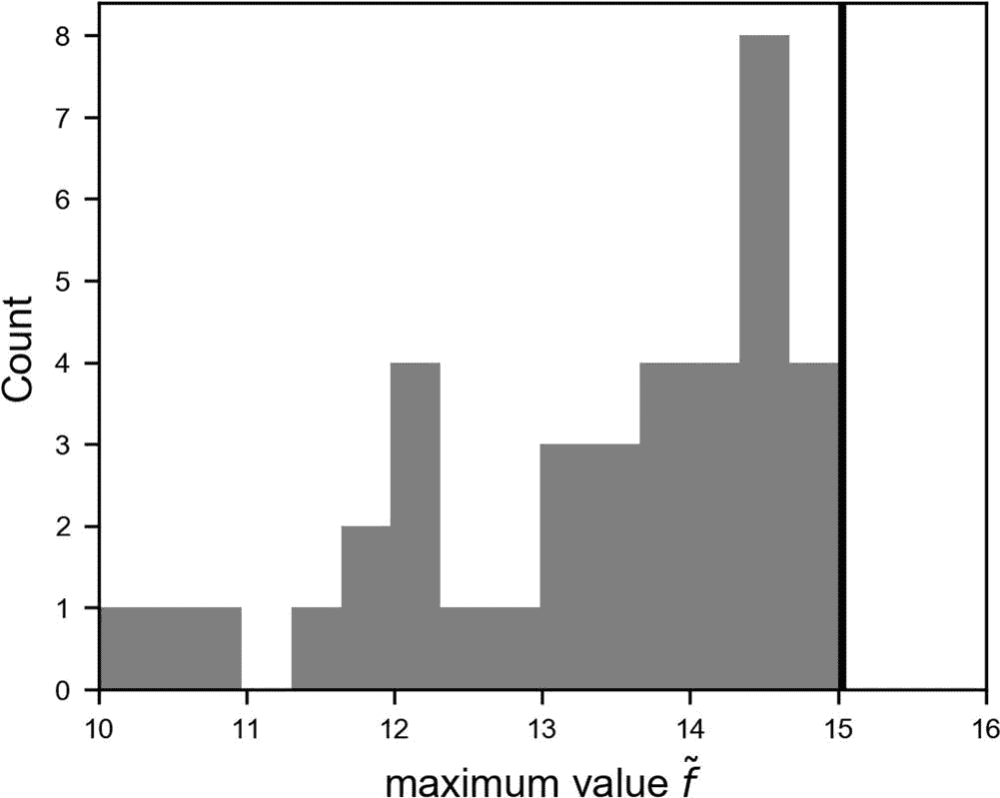
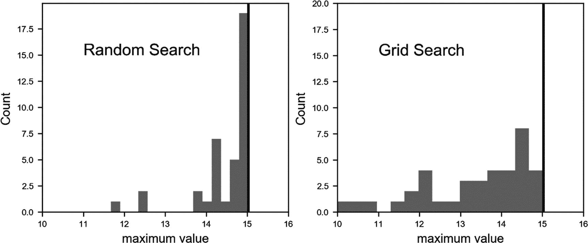
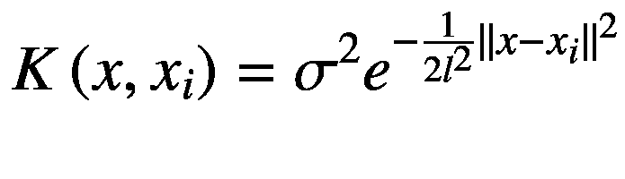
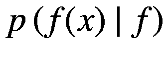
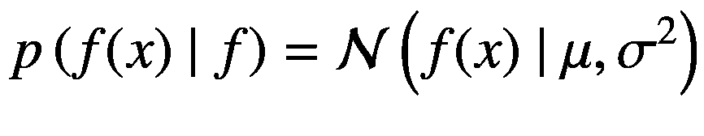

# 七、超参数调优

在这一章中，你将会看到寻找最佳超参数以从你的模型中获得最佳结果的问题。首先，我将描述什么是黑盒优化问题，以及这类问题如何与超参数调优相关。您将看到解决这类问题的三种最著名的方法:网格搜索、随机搜索和贝叶斯优化。我会用例子告诉你，哪一个在什么条件下起作用，我会给你一些技巧，这些技巧对于在对数尺度上改进优化和采样非常有帮助。在本章的最后，我将向您展示如何使用 Zalando 数据集使用这些技术来调优深度模型。

## 黑盒优化

超参数调整的问题只是一个更一般的问题的子类:黑盒优化。一个黑盒函数 *f* ( *x* )


是一个解析形式未知的函数。可以对一个黑盒函数进行求值，以获得它对于所有定义的 *x* 值的值，但是不能获得其他信息(比如它的梯度)。通常，通过黑盒函数(有时称为黑盒问题)的术语*全局优化* *，我们的意思是我们试图找到 *f* ( *x* )的最大值或最小值，有时在某些约束条件下。以下是这类问题的一些例子:*

*   为给定的机器学习模型找到最大化所选优化度量的超参数

*   寻找一个函数的最大值或最小值，这个函数只能用数字或我们看不到的代码来计算。在一些行业环境中，可能会有非常复杂的遗留代码，并且根据其结果，有些功能必须最大化。

*   寻找钻探石油的最佳地点。在这种情况下，你的函数将是你能找到多少石油和你的位置。

*   为过于复杂而无法建模的情况找到最佳的参数组合，例如，在太空发射火箭时，如何优化燃料量、火箭每级的直径、精确的轨道等。

这是一类非常迷人的问题，已经产生了聪明的解决方案。你会看到其中的三种:网格搜索、随机搜索和贝叶斯优化。如果你对这个主题感到好奇，你可以在 [`https://goo.gl/LY7huY`](https://goo.gl/LY7huY) 查看黑盒优化比赛。竞赛规则反映了现实生活中的问题。设置了一个问题，你必须通过黑盒接口优化一个函数(找到最大值或最小值)。你可以得到函数的所有值 *x* ，但是你不能得到任何其他信息，比如它的梯度。

为什么寻找神经网络的最佳超参数会构成黑箱问题？因为我们不能计算关于超参数的信息，例如我们的网络输出的梯度，特别是当使用复杂的优化器或定制函数时，我们需要其他方法，以便能够找到最大化所选优化度量的最佳超参数。请注意，如果我们有梯度，我们可以使用算法作为梯度下降，找到最大值或最小值。

### 注意

我们的黑盒函数 *f* 将是我们的神经网络模型(包括优化器、成本函数形式等东西。)给出我们的优化度量作为输出，给定超参数作为输入，并且 *x* 将是包含超参数的数组。

这个问题可能看起来很琐碎。为什么不尝试所有的可能性呢？嗯，这在你在前几章看到的例子中是可能的，但是如果你正在处理一个问题，并且训练你的模型需要一个星期，这可能是一个挑战。因为，通常情况下，你会有几个超参数，尝试所有的可能性是不可行的。让我们考虑一个例子来更好地理解这一点。假设我们正在训练一个有几层的神经网络模型。我们可以考虑以下超参数，看看哪种组合效果更好:

*   *学习率*:假设我们要尝试 *n* = 1，…，10 <sup>2</sup> 的值*n*10<sup>4</sup>。(100 个值)

*   *正则化参数* : 0，0.1，0.2，0.3，0.4，0.5 (6 个值)

*   *选择优化器* : GD、RMSProp 或 Adam (3 个值)

*   *隐藏层数* : 1，2，3，5，10 (5 个值)

*   *隐藏层中的神经元数量* : 100、200 和 300 (3 个值)

考虑你将需要训练你的网络


次，如果你想测试所有可能的组合。如果你的训练需要 5 分钟，你将需要 13.4 周的计算时间。如果培训需要几个小时或几天，你将没有任何机会。例如，如果训练需要一天，你将需要 73.9 年来尝试所有的可能性。大多数超参数的选择将来自经验。例如，您可以始终安全地使用 Adam，因为它是可用的更好的优化器(在几乎所有情况下)。但是您将无法避免尝试调整其他参数，例如隐藏层的数量或学习速率。您可以根据经验(如优化器)或一些智能算法来减少所需的组合数量，您将在本章后面看到这一点。

## 关于黑盒函数的注记

黑盒功能通常分为两大类:

*   *廉价函数*:可以求值上千次的函数

*   *代价高的函数*:只能评估几次的函数，通常少于 100 次

如果黑盒函数很便宜，那么优化方法的选择并不重要。例如，我们可以在数值上评估相对于 *x* 的梯度，或者简单地搜索在大量点上评估函数的最大值。如果功能是昂贵的，我们需要更聪明的方法。其中之一是贝叶斯优化，我将在本章后面讨论，让你了解这些方法是如何工作的以及它们有多复杂。

### 注意

尤其是在深度学习领域，神经网络几乎总是成本高昂的功能。

对于昂贵的函数，我们必须找到用尽可能少的求值次数来解决问题的方法。

## 超参数调优问题

在查看我们如何找到最佳超参数之前，我想快速回到神经网络，并讨论我们可以在深度模型中调整什么。通常，当谈到超参数时，初学者只想到数字参数，例如学习率或正则化参数。记住，下面的方法也可以多种多样，看看你是否能得到更好的结果:

*   有时候，简单地训练你的网络更长的时间会给你更好的结果。

*   *选择优化器*:您可以尝试选择不同的优化器。如果你使用的是普通梯度下降，你可以尝试亚当，看看你是否会得到更好的结果。

*   *改变* *正则化方法*:如前所述，有几种应用正则化的方法。改变方法很值得一试。

*   **激活函数*的选择:虽然在前面的章节中对于隐藏层中的神经元总是使用的激活函数是 ReLU，但是其他的可能工作得更好。例如，尝试 sigmoid 或 Swish 可能会帮助您获得更好的结果。*

**   *层数和每层神经元数* *:尝试不同的配置*:例如尝试神经元数不同的层。

    *   *学习率衰减方法*:尝试不同的学习率衰减方法(如果你没有使用优化器的话)。

    *   *小批量*:改变小批量的大小。数据少的时候，可以用批量梯度下降。当您有大量数据时，小批量效率更高。

    *   *权重初始化方法** 

 *让我们将模型中可以调整的参数分为以下三类:

*   参数是连续的实数，换句话说，可以取任何值。示例:学习率、正则化参数

*   离散的参数，但理论上可以假设有无限多的值。示例:隐藏层的数量、每层中神经元的数量或时期的数量

*   离散的参数，只能假设有限的可能性。示例:优化器、激活函数、学习率衰减方法。

对于类别 3，除了尝试所有的可能性，没有太多的事情可做。通常，这些参数会完全改变模型本身，因此，不可能对它们的影响进行建模，测试是唯一的可能。这也是经验可能帮助最大的一类。例如，众所周知，Adam 优化器几乎总是最佳选择，因此您可能会在开始时将精力集中在其他地方。对于类别 1 和类别 2，这有点困难，我们必须想出一些聪明的主意来找到最佳值。

## 样本黑盒问题

为了尝试解决黑箱问题，让我们创建一个“假”黑箱问题。问题如下:找出由公式给出的函数 *f* ( *x* )的最大值


假装不知道分子式本身。公式将允许我们检查我们的结果，但是我们将假装它们是未知的。你可能想知道为什么我们使用如此复杂的公式。我想要一些有一些最大值和最小值的东西，给你一个方法如何在一个不平凡的例子上工作的想法。 *f* ( *x* )可以用 Python 实现，代码如下

```py
def f(x):
    tmp1 = -np.cos(x/4.0)-np.sin(x/4.0)-2.5*np.cos(2.0*x/4.0)+0.5*np.sin(2.0*x/4.0)
    tmp2 = -np.cos(x/3.0)-np.sin(x/3.0)-2.5*np.cos(2.0*x/3.0)+0.5*np.sin(2.0*x/3.0)
    return 10.0+tmp1+0.5*tmp2

```

在图 [7-1](#Fig1) 中，可以看到 *f* ( *x* )的样子。


图 7-1

函数 f(x)的图，如文中所述

最大值处于近似值 *x* = 69.18，并且具有值 15.027。我们的挑战是在不知道任何关于 *f* ( *x* )的情况下，以最有效的方式找到这个最大值，除了它在我们想要的任何一点的值。当我们说“有效”时，我们当然是指尽可能少的评估。

## 网格搜索

我们看到的第一种方法，网格搜索，也是最不“智能”的。网格搜索只需要定期尝试函数，并查看函数 *f* ( *x* )的哪个 *x* 取最高值。在这个例子中，我们要找出函数 *f* ( *x* )在两个 *x* 值*x*<sub>*min*</sub>和*x*<sub>*max*</sub>之间的最大值。我们要做的只是简单地在*x*<sub>*min*</sub>和*x*<sub>*max*</sub>之间取 n 个点，并在这些点上评估函数。我们将定义一个点的向量


其中我们定义了δ*x*=*x*<sub>*max*</sub>—*x*<sub>*min*</sub>。然后我们在这些点上对函数 *f* ( *x* )求值，得到一个向量 ***f*** 的值


最大值的估计值为


并且，假设在找到最大值，我们也将有


现在，你可以想象，你使用的点数越多，你的最大估计值就越准确。问题是，如果对 *f* ( *x* )的评价代价很大，你就不可能想拿多少分就拿多少分。你需要在点数和准确度之间找到一个平衡点。让我们用我之前描述的函数 *f* ( *x* )来探索一个例子。我们来考虑*x*<sub>*max*</sub>= 80 和*x*<sub>*min*</sub>= 0，我们来取 *n* = 40 分。我们将有。我们可以用下面的代码在 Python 中轻松创建矢量 *** x *** :

```py
gridsearch = np.arange(0,80,2)

```

数组`gridsearch`将如下所示:

```py
array([ 0, 2, 4, 6, 8, 10, 12, 14, 16, 18, 20, 22, 24, 26, 28, 30, 32, 34, 36, 38, 40, 42, 44, 46, 48, 50, 52, 54, 56, 58, 60, 62, 64, 66, 68, 70, 72, 74, 76, 78])

```

在图 [7-2](#Fig2) 中，可以看到函数 *f* ( *x* )为一条连续的直线；十字标记了我们在网格搜索中采样的点；黑色方块表示函数的精确最大值。右图显示了围绕最大值的缩放。


图 7-2

范围[0，80]上的函数 f(x)。十字标记我们在网格搜索中采样的点，黑色方块标记最大值。

你可以看到我们在图 [7-2](#Fig2) 中采样的点是如何接近最大值的，但并不是精确的。当然，采样更多的点会让我们更接近最大值，但会让我们对 *f* ( *x* )进行更多的评估。我们可以用简单的代码很容易地找到最大值

```py
x = 0
m = 0.0
for i, val in np.ndenumerate(f(gridsearch)):
    if (val > m):
        m = val
        x = gridsearch[i]

print(x)
print(m)

```

这给了我们

```py
70
14.6335957578

```

这接近实际的最大值(69.18，15.027)，但不完全正确。让我们试试前面的例子，改变我们采样的点数，然后看看我们得到什么结果。我们将从 4 到 160 改变采样点的数量 *n* 。对于每种情况，我们将找到最大值及其位置，如前所述。我们可以用代码来做

```py
xlistg = []
flistg = []

for step in np.arange(1,20,0.5):
    gridsearch = np.arange(0,80,step)

    x = 0
    m = 0.0
    for i, val in np.ndenumerate(maxim(gridsearch)):
        if (val > m):
            m = val
            x = gridsearch[i]

    xlistg.append(x)
    flistg.append(m)

```

在列表`xlistg`和`flistg`中，我们将找到找到的最大值的位置以及 *n* 的各个值的最大值。

在图 [7-3](#Fig3) 中，我们绘制了结果的分布。黑色垂直线是最大值的正确值。



图 7-3

通过改变网格搜索中采样的点数 n 获得的结果的分布。黑色垂直线表示 f(x)的实际最大值。

如您所见，结果变化很大，可能与正确值相差很远，最大值为 10。这告诉我们，使用错误的点数会产生非常错误的结果。可以想象，最好的结果是步长δ*x*最小的结果，因为它更有可能接近最大值。在图 [7-4](#Fig4) 中，你可以看到找到的最大值是如何随步长δ*x*变化的。


图 7-4

最大值的发现值与 x 步长δx 的关系

在图 [7-4](#Fig4) 的右图放大图中，很明显δ*x*的较小值如何获得更好的值。注意，步长 1.0 表示采样 80 个 *f* ( *x* )的值。例如，如果评估需要 1 天时间，您将需要等待 80 天才能获得您需要的所有测量值。

### 注意

网格搜索是一种只有当黑盒函数便宜时才有效的方法。为了获得良好的结果，通常需要大量的采样点。

为了确保您真正获得最大值，您应该减少步长δ*x*，或者增加采样点的数量，直到您找到的最大值不再有明显变化。在前面的例子中，如图 [7-4](#Fig4) 的右图所示，当我们的步长δ*x*小于大约 2.0 时，或者，换句话说，当采样点的数量大于或大约等于 40 时，我们确定接近最大值。记住:40 乍一看可能是一个相当小的数字，但如果 *f* ( *x* )评估你的深度学习模型的度量，并且训练需要 2 个小时，例如，你正在看 3.3 天的计算机时间。通常，在深度学习的世界中，2 个小时对于训练一个模型来说并不多，所以在开始长时间的网格搜索之前进行快速计算。此外，请记住，在进行超参数调优时，您是在多维空间中移动(您不是在优化一个参数，而是许多参数)，因此所需的评估数量会非常快地增加。

让我们创建一个简单的例子。假设你决定你能负担得起对你的黑盒函数进行 50 次评估。如果您决定尝试以下超参数:

*   优化器(RMSProp、Adam 或普通 GD) (3 个值)

*   历元数(1000、5000 或 10，000) (3 个值)

你已经看到了九个评估。那么你能尝试多少种学习率值呢？只有五个！并且对于五个值，不可能接近最佳值。这个例子的目的是帮助你理解网格搜索只对廉价的黑盒函数可行。请记住，时间往往不是唯一的问题。例如，如果你使用谷歌云平台来训练你的网络，你是在为你使用的硬件付费。也许你有很多时间可以支配，但是费用可能会很快超出你的预算。

## 随机搜索

随机搜索是一种策略，它和网格搜索一样“愚蠢”,但是效果惊人地好。不是在范围(*x*<sub>T5】最小</sub> ， *x* <sub>*最大*</sub> )内定期采样 *x* 点，而是随机采样点。我们可以用代码来做

```py
Import numpy as np
randomsearch = np.random.random([40])*80.0

```

数组`randomsearch`将如下所示:

```py
array([ 0.84639256, 66.45122608, 74.12903502, 36.68827838, 61.71538757, 69.29592273, 48.76918387, 69.81017465, 1.91224209, 21.72761762, 22.17756662, 9.65059426, 72.85707634, 2.43514133, 53.80488236, 5.70717498, 28.8624395 , 33.44796341, 14.51234312, 41.68112826, 42.79934087, 25.36351055, 58.96704476, 12.81619285, 15.40065752, 28.36088144, 30.27009067, 16.50286852, 73.49673641, 66.24748556, 8.55013954, 29.55887325, 18.61368765, 36.08628824, 22.1053749 , 40.14455129, 73.80825225, 30.60089111, 52.01026629, 47.64968904])

```

根据您使用的种子，您得到的实际数字可能会有所不同。正如我们对网格搜索所做的那样，你可以在图 [7-5](#Fig5) 中看到 *f* ( *x* )的曲线，其中十字标记了采样点，黑色方块标记了最大值。在右边的图中，你可以看到围绕最大值的放大。


图 7-5

范围[0，80]上的函数 f(x)。十字标记了我们用随机搜索采样的点，黑色方块标记了最大值。

这种方法的风险是，如果你非常不走运，你随机选择的点数与真正的最大值相差甚远。但是这种可能性很低。注意，如果你对你的随机点取一个恒定的概率分布，你在任何地方得到这些点的概率都是相同的。观察这种方法的表现是很有趣的。让我们考虑 200 个不同的 40 点随机集合，通过改变代码中使用的随机种子来获得。图 [7-6](#Fig6) 中绘制了最大值的分布。


图 7-6

从随机搜索中随机抽取的 200 组不同的 40 个点中获得的结果的分布。黑色垂直线表示 f(x)的实际最大值。

正如你所看到的，不管使用的随机集合是什么，在大多数情况下，你得到的都非常接近真实的最大值。在图 [7-7](#Fig7) 中，你可以看到随机搜索得到的最大值的分布，从 10 到 80 个采样点。


图 7-7

从 10 到 80 改变随机搜索中采样的点数 n 获得的结果的分布。黑色垂直线表示 f(x)的实际最大值。

如果将它与网格搜索进行比较，您会发现随机搜索在获得更接近实际最大值的结果方面始终表现得更好。在图 [7-8](#Fig8) 中，您可以看到随机和网格搜索使用不同数量的采样点 *n* 时，您获得的最大值的分布之间的比较。在这两种情况下，这些图是用 38 个不同的集合生成的，因此总计数是相同的。



图 7-8

比较网格(右)和随机(左)搜索之间的分布，同时改变采样点数 n。两个图的总数都为 38，这是所使用的不同采样点数的数量。最大值的正确值由两个图中的垂直黑线标出。

显而易见，平均而言，随机搜索优于网格搜索。你得到的值总是更接近正确的最大值。

### 注意

随机搜索总是比网格搜索好，你应该尽可能地使用它。当处理变量 *x* 的多维空间时，随机搜索和网格搜索之间的差异变得更加明显。超参数调整实际上总是一个多维优化问题。

如果你对一篇关于随机搜索如何适用于高维问题的非常好的论文感兴趣，请阅读 James Bergstra 和 Yoshua Bengio 的文章，*超参数优化的随机搜索，*可在 [`https://goo.gl/efc8Qv`](https://goo.gl/efc8Qv) 获得。

## 由粗到细的优化

仍然有一个优化技巧，有助于网格或随机搜索。称之为由粗到细的优化。假设我们要求 *x* <sub>*min*</sub> 和*x*<sub>*max*</sub>之间的 *f* ( *x* )的最大值。我将解释随机搜索背后的概念，但它同样适用于网格搜索。以下步骤为您提供了优化所需遵循的算法。

1.  在区域*R*<sub>1</sub>=(*x*<sub>*min*</sub>，*x*<sub>*max*</sub>)中做一个随机搜索。让我们用( *x* <sub>1</sub> ， *f* <sub>1</sub> )来表示找到的最大值。

2.  现在考虑一个围绕 *x* <sub>1</sub> 、*R*<sub>2</sub>=(*x*<sub>1</sub>—*δx*<sub>1</sub>、*x*<sub>1</sub>+*δx*<sub>1</sub>)的较小区域，对于一些 *δx* <sub>1 当然，假设是真正的最大值在这个区域。我们将用( *x* <sub>2</sub> ， *f* <sub>2</sub> )来表示您在这里找到的最大值。</sub>

3.  在 *x* <sub>2</sub> 附近重复第 2 步，在我们用 *R* <sub>3</sub> 表示的区域，用一个比 *δx* <sub>1</sub> 小的 *δx* <sub>2</sub> ，用( *x* <sub>3</sub> ， *f* <sub>3</sub> 表示你在这一步找到的最大值。

4.  现在在 *x* <sub>3</sub> 周围重复步骤 2，在这个区域我们将用 *R* <sub>4</sub> 表示，用一个比*δx*<sub>3</sub>小的*δx*<sub>2</sub>。

5.  根据需要不断重复，直到区域中的最大值( *x* <sub>*i*</sub> ，*f*<sub>*I*</sub>)R<sub>*I*+1</sub>不再变化。

通常，只使用一次或两次迭代，但是，从理论上讲，您可以进行大量迭代。这种方法的问题是，你无法真正确定你的真正最大值位于你的区域 *R* <sub>*i*</sub> 。但这种优化有一个很大的优势，如果它确实如此的话。让我们考虑一下我们进行标准随机搜索的情况。如果我们希望采样点之间的平均距离为最大值*x*<sub>*max*-T11*x*<sub>T15】min</sub>的 1%,如果我们决定只执行一次随机搜索，那么我们将需要大约 100 个点，因此，我们必须执行 100 次评估。现在让我们考虑我刚才描述的算法。我们可以从区域*R*<sub>1</sub>=(*x*<sub>*最小*</sub> ， *x* <sub>*最大*</sub> )中的 10 个点开始。这里，我们将用( *x* <sub>1</sub> ， *f* <sub>1</sub> )来表示我们找到的最大值。那么我们再取在区域*R*<sub>2</sub>=(*x*<sub>1</sub>—*δx*，*x*T55】1</sub>+*δx*)。在区间(*x*<sub>1</sub>-*δx*，*x*<sub>1</sub>+*δx*)中，我们将平均拥有 1%的点之间的距离*x*<sub>*max*</sub>-*x*例如，让我们对我们之前使用的函数进行采样，在*x*<sub>*min*</sub>= 0 和*x*<sub>*max*</sub>= 80 之间有 10 个点，代码如下

```py
np.random.seed(5)
randomsearch = np.random.random([10])*80

x = 0
m = 0.0
for i, val in np.ndenumerate(f(randomsearch)):
    if (val > m):
        m = val
        x = randomsearch[i]

```

这就给了我们 *x* <sub>1</sub> = 69.65 和 *f* <sub>1</sub> = 14.89 的最大位置和值，还不错，但还没有真正的精确:69.18 和 15.027。现在，让我们再次对我们在区域*R*T10】2=(*x*T14】14，*x*T18】1+4)中找到的最大值周围的 10 个点进行采样。

```py
randomsearch = x + (np.random.random([10])-0.5)*8

x = 0
m = 0.0
for i, val in np.ndenumerate(maxim(randomsearch)):
    if (val > m):
        m = val
        x = randomsearch[i]

```

这给了我们结果 69.189 和 15.027。相当精确的结果，只有 20 次函数评估。如果我们用 *500 个*(比我们刚才做的多 25 倍)采样点做一个简单的随机搜索，我们得到 *x* <sub>1</sub> = 69.08 和 *f* <sub>1</sub> = 15.022。这个结果显示了这个技巧是多么的有用。但是记住风险:如果你的最大值不在你的区域内，你将永远找不到它，因为你仍然在处理随机数。所以，选择相对较大的区域(*x*<sub>*I*</sub>—*δx*<sub>*I*</sub>，*x*<sub>T31】I</sub>+*δx**I*)总是一个好主意，以确保它们包含你的最大值。深度学习世界中的几乎所有事情都取决于你的数据集和问题，而这些可能无法提前知道。不幸的是，需要测试。在图 [7-9](#Fig9) 中，可以看到函数 *f* ( *x* )上的采样点。在左侧的图中，您可以看到前 10 个点，而在右侧，区域 *R* <sub>2</sub> 具有额外的 10 个点。左边图中的小矩形标记了 *x* 区域*R*T54】2。


图 7-9

函数 f(x)。十字标记采样点:左边是在区域 R <sub>1</sub> (整个范围)采样的 10 个点，右边是在 R <sub>2</sub> 采样的 10 个点。黑色方块表示真正的最大值。右边的图是区域 R <sub>2</sub> 的放大图。

现在，选择开始时应该采样多少点是至关重要的。我们在这里很幸运。让我们在选择最初的 10 个随机点时考虑不同的种子，然后看看会发生什么(见图 [7-10](#Fig10) )。选错初始点导致灾难！


图 7-10

函数 f(x)。十字标记采样点:左边是在区域 R <sub>1</sub> (整个范围)采样的 10 个点，右边是在 R <sub>2</sub> 采样的 10 个点。黑色方块表示真正的最大值。该算法在 16 附近找到一个最大值，而不是绝对最大值。左边的小矩形标记了区域 R <sub>2</sub> 。右边的图是区域 R <sub>2</sub> 的放大图。

请注意，在图 [7-10](#Fig10) 中，算法如何在 16 左右找到最大值，因为在初始采样点中，最大值大约为 *x* = 16，如图 [7-10](#Fig10) 左侧的曲线图所示。没有一个点接近真正的最大值，大概是 *x* = 69。该算法很好地找到了最大值，而不是绝对最大值。这就是你使用这一招时所面临的危险。事情甚至可能比这更糟。考虑图 [7-11](#Fig11) ，其中开始时仅采样一个单点。你可以在图 [7-11](#Fig11) 左侧的图上看到算法是如何完全错过任何最大值的。它简单地给出了在右边图上用十字标记的点的最高值:(58.4，9.78)。


图 7-11

函数 f(x)。十字标记采样点:左边的 1 个点在区域 R <sub>1</sub> (整个范围)采样，右边的 10 个点在 R <sub>2</sub> 采样。黑色方块表示真正的最大值。该算法没有找到任何最大值，因为在区域 R <sub>2</sub> 中不存在任何最大值。右边的图是区域 R <sub>2</sub> 的缩放。

如果你决定使用这种方法，请记住，在优化你的搜索之前，你仍然需要在开始时有一个好的点数，以接近最大值。当你相对确定你的分数在最大值附近时，你可以使用这个技巧来改进你的搜索。

## 贝叶斯优化

在这一节中，我们将着眼于寻找黑盒函数的最小值(或最大值)的具体而有效的技术。这是一个相当聪明的算法，基本上包括选择采样点，以比简单地随机选择或在网格上选择更智能的方式来评估函数。为了理解这是如何工作的，您必须首先查看一些新的数学概念，因为该方法并不简单，并且需要了解一些更高级的概念。让我们从纳达莱亚-沃森回归开始。

### 纳达拉亚-沃森回归

这种方法是由èLiz bar aka kevi(e . a .)Nadaraya 于 1964 年在俄罗斯期刊*概率论及其应用*上发表的《论估计回归》中提出的。基本思想很简单。给定一个未知函数 *y* ( *x* )，给定 *N* 点*x*<sub>*I*</sub>= 1，……， *N* ，我们用*y*<sub>*I*</sub>=*f*(*x*<sub>*I*</sub>表示 Nadaraya-Watson 回归的思想是，我们可以使用以下公式计算未知点 *x* 处的未知函数


其中*w*<sub>*I*</sub>(*x*)是根据公式计算的权重


其中 *K* ( *x* 、 *x* <sub>*i*</sub> )称为一个内核。请注意，给定如何定义权重，我们有


在文献中，您可以找到几种核，但我们感兴趣的是高斯核，通常称为*径向基函数* (RBF)



参数 *l* 使高斯形状变宽或变窄。 *σ* 通常是数据的方差，但是在这种情况下，它不起作用，因为权重被归一化为 1。这是贝叶斯优化的基础，稍后您将会看到。

### 高斯过程

在谈论高斯过程之前，首先我必须定义什么是随机过程。一个*随机过程*是指任意一点*x*∈*ℝ*<sup>*d*</sup>我们给它赋一个随机变量*f*(*x*)∈*ℝ*。一个随机过程是高斯型的，如果对于任意有限个数的点，它们的联合分布是正态的。这意味着∀ *n* ∈ *ℕ* ，而对于∀ *x* <sub>1</sub> ，…*x*<sub>*n*∈*ℝ*<sup>*d*</sup>，向量为</sub>


其中，我们希望向量分量遵循正态分布，用表示。请记住，具有高斯分布的随机变量被称为正态分布。高斯过程的名字由此而来。正态分布的概率分布由函数给出


其中 *μ* 是分布的均值或期望值， *σ* 是标准差。从现在开始，我将使用以下符号:


并且随机值的协方差在这里将由 *K* 表示。

![$$ \mathit{\operatorname{cov}}\left[f\left({x}_1\right),f\left({x}_2\right)\right]=K\left({x}_1,{x}_2\right) $$](img/463356_1_En_7_Chapter_TeX_Equo.png)

字母 *K* 的选择是有原因的。我们将在下文中假设协方差将具有高斯形状，并且我们将对 *K* 使用先前定义的 RBF 函数。

### 平稳过程

为简单起见，我们在这里只考虑平稳过程。如果随机过程的联合概率分布不随时间变化，那么它就是平稳的。这也意味着均值和方差不会随时间改变。我们还将考虑一个过程，它的分布只取决于点的相对位置。这导致了

![$$ {\displaystyle \begin{array}{l}K\left({x}_1,{x}_2\right)=\tilde{K}\left({x}_1-{x}_2\right)\\ {} Var\left[f(x)\right]=\tilde{K}(0)\end{array}} $$](img/463356_1_En_7_Chapter_TeX_Equp.png)

请注意，要应用我们描述的方法，首先您必须将您的数据转换为静态数据，如果还不是这样的话，例如，消除季节性或时间趋势。

### 高斯过程预测

现在我们到了有趣的部分:给定向量 ***f*** ，如何估算任意点 *x* 处的 *f* ( *x* )？因为我们处理的是随机过程，我们要估计的是未知函数假设一个给定值 *f* ( *x* )的概率。在数学上，我们将预测以下量:



或者换句话说，得到值 *f* ( *x* )，给定向量*T5】f*，由所有点 *f* ( *x* <sub>1</sub> )，…，*f*(*x*<sub>*n*</sub>)组成的概率。

假设 *f* ( *x* )是一个平稳高斯过程，其中 *m* = 0，预测可以表示为


其中，我们用表示了在平均值为 0 的点和维数为 *n* + 1 × * n * + 1 的协方差矩阵上计算的正态分布，因为我们在分子中有 *n* + 1 个点。推导有点复杂，并且基于几个定理，例如贝叶斯定理。有关更多信息，您可以参考 Chuong B. Do 在“高斯过程”(2007)中的(高级)解释，可在 [`https://goo.gl/cEPYwX`](https://goo.gl/cEPYwX) 获得，其中详细解释了所有内容。为了理解什么是贝叶斯优化，我们可以简单地使用公式，无需推导。 *C* 将具有维度 *n* × *n* ，因为我们在分母中只有 *n* 个点。

我们有


和


我们已经定义了


可以证明 <sup>[1](#Fn1)</sup> 两个正态分布之比又是一个正态分布，这样我们就可以写出



随着


*μ* 和 *σ* 的精确形式的推导相当长，超出了本书的范围。基本上，我们现在知道，平均来说，我们的未知函数将假定值为 *x* 中的 *μ* ，方差为 *σ* 。现在让我们看看这个方法在 Python 中实际上是如何工作的。先定义我们的内核 *K* ( *x* )。

```py
def K(x, l, sigm = 1):
    return sigm**2*np.exp(-1.0/2.0/l**2*(x**2))

```

让我们用一个简单的函数来模拟未知函数


这可以实现为

```py
def f(x):
    return x**2-x**3+3+10*x+0.07*x**4

```

让我们考虑范围(0，12)内的函数。在图 [7-12](#Fig12) 中，你可以看到这个函数的样子。


图 7-12

未知测试函数的图，如文本中所述

让我们先用五个点构建我们的**向量，如下:**

```py
randompoints = np.random.random([5])*12.0
f_ = f(randompoints)

```

其中我们使用了随机数的种子 42:`np.random.seed(42)`。在图 [7-13](#Fig13) 中，你可以看到标有十字的随机点。


图 7-13

未知函数的绘图。十字标记了文本中随机选择的点。

我们可以用下面的代码应用前面描述的方法:

```py
xsampling = np.arange(0,14,0.2)

ybayes_ = []
sigmabayes_ = []
for x in xsampling:

    f1 = f(randompoints)
    sigm_ = np.std(f1)**2
    f_ = (f1-np.average(f1))

    k = K(x-randompoints, 2 , sigm_)

    C = np.zeros([randompoints.shape[0], randompoints.shape[0]])
    Ctilde = np.zeros([randompoints.shape[0]+1, randompoints.shape[0]+1])
    for i1,x1_ in np.ndenumerate(randompoints):
        for i2,x2_ in np.ndenumerate(randompoints):
            C[i1,i2] = K(x1_-x2_, 2.0, sigm_)

    Ctilde[0,0] = K(0, 2.0, sigm_)
    Ctilde[0,1:randompoints.shape[0]+1] = k.T
    Ctilde[1:,1:] = C
    Ctilde[1:randompoints.shape[0]+1,0] = k

    mu = np.dot(np.dot(np.transpose(k), np.linalg.inv(C)), f_)
    sigma2 = K(0, 2.0,sigm_)- np.dot(np.dot(np.transpose(k), np.linalg.inv(C)), k)
    ybayes.append(mu)
    sigmabayes_.append(np.abs(sigma2))

ybayes = np.asarray(ybayes_)+np.average(f1)
sigmabayes = np.asarray(sigmabayes_)

```

现在请花些时间去理解它。在列表`ybayes`中，我们会发现 *μ* ( *x* )的值是根据数组`xsampling`中包含的值计算的。以下是一些有助于理解代码的提示:

*   我们在一系列的 *x* 点上做一个循环，在这里我们要用代码`for x in xsampling:`来评估我们的函数。

*   我们用向量的每个元素的代码来构建我们的 ***k*** 和 ***f*** 向量。对于内核，我们已经为参数`l`选择了一个值，正如在`2`函数中定义的那样。我们已经在向量 ***f*** 中减去平均值，以获得 *m* ( *x* ) = 0，从而能够应用所推导的公式。

*   我们建立矩阵 *C* 和。

*   我们用`mu = np.dot(np.dot(np.transpose(k), np.linalg.inv(C)), f_)`和标准差计算 *μ* 。

*   最后，我们重新应用我们所做的所有转换，以使我们的过程以相反的顺序稳定，简单地将 *f* ( *x* )的平均值再次添加到评估的代理函数`ybayes = np.asarray(ybayes_)+np.average(f1)`。

在图 [7-14](#Fig14) 中，你可以看到这种方法是如何工作的。虚线是通过绘制 *μ* ( *x* )得到的预测函数，如代码中所计算的，当我们有五个点可供我们使用时( *n* = 5)。灰色区域是估计函数和+/- *σ* 之间的区域。


图 7-14

预测函数(虚线)，通过计算μ(x)来计算。灰色区域是估计函数和+/- σ之间的区域。

考虑到我们仅有的几分，这是一个不错的结果。请记住，你仍然需要几个点，才能得到一个合理的近似值。在图 [7-15](#Fig15) 中，你可以看到结果，如果我们只有两个点可以支配。结果没有那么好。灰色区域是估计函数和+/-T2σT3 周围的区域。你可以看到，离我们所拥有的点越远，预测函数的不确定性，或方差，就越高。


图 7-15

预测函数(虚线)，当我们只有两点可支配时。灰色区域是估计函数+/- σ之间的区域。

让我们停下来想一想，为什么我们要做这一切。这个想法是找到一个所谓的代理函数，它逼近我们的函数 *f* ，并且具有如下性质


这个代理函数必须有另一个非常重要的性质:它必须是廉价的评估。这样，我们可以很容易地找到的最大值，并且，利用前面的性质，我们将得到 *f* 的最大值，根据假设，这是代价很高的。

但是正如你所看到的，可能很难知道我们是否有足够的点来找到最大值的正确值。毕竟，根据定义，我们不知道我们的黑盒函数是什么样子的。那么，如何解决这个问题呢？

该方法背后的主要思想可以通过以下算法来描述:

1.  我们从随机选择的少量样本点开始(多小取决于你的问题)。

2.  我们使用这组点来获得一个代理函数，如前所述。

3.  我们向集合中添加了一个额外的点，使用了一个我将在后面讨论的特定方法，并重新评估代理函数。

4.  如果我们用代理函数找到的最大值继续变化，我们将继续增加点，如步骤 3，直到最大值不再变化，或者我们用完了时间或预算，不能执行任何进一步的评估。

如果我在步骤 3 中暗示的方法足够聪明，我们将能够相对快速和准确地找到我们的最大值。

### 获取功能

但是如何选择我上一节第三步提到的附加点呢？想法是使用所谓的获取函数。该算法是这样工作的:

1.  我们选择一个函数(一会儿我们会看到一些可能性)叫做获取函数。

2.  然后，我们选择采集函数具有最大值的点作为附加点 *x* 。

我们可以使用几个采集函数。我将在这里只描述一个我们将用来看看这个方法如何工作，但有几个你可能想检查，如熵搜索，改善的概率，预期的改善，和置信上限。

### 置信上限(UCB)

在文献中，你会发现这种获取函数的两种变体。我们可以把函数写成


这里我们用表示了在问题中的 *x* 范围上的替代函数的“预期”值。期望值就是函数在给定的 *x* 范围内的平均值。 *σ* ( *x* )是我们用我们的方法在点 *x* 计算的替代函数的方差。我们选择的新点是*a*<sub>*UCB*</sub>(*x*)最大的点。*η*T23】0 是一个权衡参数。这个采集函数基本上选择方差最大的点。评审图 [7-15](#Fig15) 。该方法选择方差较大的点，因此，尽可能远离我们已有的点。这样逼近往往会越来越好。

UCB 采集函数的另一种变化如下:


这一次，采集函数将在选择代理函数最大值周围的点和其方差最大的点之间进行权衡。第二种方法最适合快速找到最大值 *f* 的良好近似值，而第一种方法倾向于在整个 *x* 范围内给出 *f* 的良好近似值。在下一节中，我们将看到这些方法是如何工作的。

### 例子

我们先从复三角函数开始，如本章开头所述，考虑 *x* 范围【0，40】。我们的目标是找到它的最大值并逼近函数。为了方便我们的编码，让我们定义两个函数:一个评估代理函数，另一个评估新点。为了评估代理函数，我们可以使用以下函数:

```py
def get_surrogate(randompoints):
    ybayes_ = []
    sigmabayes_ = []
    for x in xsampling:

        f1 = f(randompoints)
        sigm_ = np.std(f_)**2
        f_ = (f1-np.average(f1))
        k = K(x-randompoints, 2.0, sigm_ )

        C = np.zeros([randompoints.shape[0], randompoints.shape[0]])
        Ctilde = np.zeros([randompoints.shape[0]+1, randompoints.shape[0]+1])
        for i1,x1_ in np.ndenumerate(randompoints):
            for i2,x2_ in np.ndenumerate(randompoints):
                C[i1,i2] = K(x1_-x2_, 2.0, sigm_)

        Ctilde[0,0] = K(0, 2.0)
        Ctilde[0,1:randompoints.shape[0]+1] = k.T
        Ctilde[1:,1:] = C
        Ctilde[1:randompoints.shape[0]+1,0] = k

        mu = np.dot(np.dot(np.transpose(k), np.linalg.inv(C)), f_)
        sigma2 = K(0, 2.0, sigm_)- np.dot(np.dot(np.transpose(k), np.linalg.inv(C)), k)
        ybayes_.append(mu)
        sigmabayes_.append(np.abs(sigma2))

    ybayes = np.asarray(ybayes_)+np.average(f1)
    sigmabayes = np.asarray(sigmabayes_)

    return ybayes, sigmabayes

```

这个函数的代码与我在前面几节的示例中已经讨论过的代码相同，但是它被打包在一个函数中，该函数返回数组`ybayes`中的代理函数和数组`sigmabayes`中的*<sup>2</sup>。此外，我们需要一个评估新点的函数，使用采集函数**(*x*)。我们可以通过函数很容易地得到它***

```py
def get_new_point(ybayes, sigmabayes, eta):

    idxmax = np.argmax(np.average(ybayes)+eta*np.sqrt(sigmabayes))
    newpoint = xsampling[idxmax]

    return newpoint

```

为了使事情更简单，我决定定义一个数组，它包含我们在函数之外想要的所有值。让我们从六个随机选择的点开始。为了检查我们的方法做得如何，让我们从一些定义开始。

```py
xmax = 40.0
numpoints = 6
xsampling = np.arange(0,xmax,0.2)
eta = 1.0

np.random.seed(8)
randompoints1 = np.random.random([numpoints])*xmax

```

在数组`randompoints1`中，我们将有我们最初选择的六个随机点。我们可以很容易地得到我们的函数的代理函数

```py
ybayes1, sigmabayes1 = get_surrogate(randompoints1)

```

在图 [7-16](#Fig16) 中，可以看到结果。虚线是采集函数*a*<sub>T5】UCB</sub>(*x*)，归一化以适应绘图。


图 7-16

黑盒函数 f(x)(实线)、随机选择的点(用十字标记)、代理函数(虚线)和采集函数 a <sub>UCB</sub> (x)(虚线)的概述，被移动以适合绘图。灰色区域是包含在线和之间的区域。

代理函数还不是很好，因为我们没有足够的点，大的方差(灰色区域)使这一点变得明显。唯一被很好地近似的区域是区域 *x* ≳ 35。你可以看到，当代理函数没有很好地逼近黑盒函数时，采集函数是很大的，而当它逼近黑盒函数时，采集函数是很小的，例如，对于 *x* ≳ 35。因此，直观地选择*a**(*x*)最大的点作为新的点，相当于选择函数不太好逼近的点，或者用更数学的术语来说，方差更大的点。相比之下，在图 [7-17](#Fig17) 中，您可以看到与图 [7-16](#Fig16) 相同的图，但是具有采集功能并且 *η* = 3.0。*

 *

图 7-17

黑盒函数 f(x)(实线)、随机选择的点(用十字标记)、代理函数(虚线)和采集函数(虚线)的概述，已移动以适合绘图。灰色区域是包含在线和之间的区域。

如你所见，趋向于在代理函数的最大值附近有一个最大值。请记住，如果 *η* 大，采集函数的最大值将向方差大的区域移动。但是这个获取函数倾向于稍微更快地找到“a”最大值。我说“a”，因为它取决于代理函数的最大值在哪里，而不是黑盒函数的最大值在哪里。

现在让我们看看当使用*a*<sub>*UCB*</sub>(*x*)和 *η* = 1.0 时会发生什么。对于第一个附加点，我们必须简单地运行以下三行代码:

```py
newpoint = get_new_point(ybayes1, sigmabayes1, eta)
randompoints2 = np.append(randompoints1, newpoint)
ybayes2, sigmabayes2 = get_surrogate(randompoints2)

```

为了简单起见，我为每个步骤的每个数组取了不同的名字，而不是创建一个列表。但是，通常，您应该使这些迭代自动进行。在图 [7-18](#Fig18) 中，您可以看到用黑色圆圈标记的附加点的结果。


图 7-18

黑盒函数 f(x)(实线)、随机选择的点(用十字标记)、x ≈ 27 附近的新选择点(用圆圈标记)、代理函数(虚线)和采集函数 a <sub>UCB</sub> (x)(虚线)的概述，移动以适合绘图。灰色区域是包含在线和之间的区域。

新的点在 *x* ≈ 27 左右。我们继续加分吧。在图 [7-19](#Fig19) 中，你可以看到五个点相加后的结果。


图 7-19

黑盒函数 f(x)(实线)、带有六个选定新点的随机选定点(用十字标记)、代理函数(虚线)和采集函数(虚线)的概述，已移动以适合绘图。灰色区域是包含在线和之间的区域。

请注意虚线。现在我们的代理函数非常接近黑盒函数，尤其是在真正的最大值附近。使用这个代理函数，我们可以找到一个非常好的原始函数的近似值，总共只有 11 次求值！请记住，除了 11 项评估，我们没有关于 *f* 的任何其他信息。

现在让我们看看采集函数会发生什么，让我们看看我们能多快找到最大值。在这种情况下，我们将使用 *η* = 3.0，以在代理函数的最大值及其方差之间获得更好的平衡。在图 [7-20](#Fig20) 中，您可以看到添加一个单独的附加点后的结果，用黑色圆圈标记。我们已经有了一个很好的真实最大值的近似值！


图 7-20

黑盒函数 f(x)(实线)、随机选择的点和额外选择的点(用十字标记)、代理函数(虚线)和采集函数(虚线)的概述，移动以适合绘图。灰色区域是包含在线和之间的区域。

现在我们再补充一点。你可以在图 [7-21](#Fig21) 中看到，该附加点现在仍然接近最大值，但在 30°左右的高方差区域方向上有所移动。


图 7-21

黑盒函数 f(x)(实线)、随机选择的点和额外选择的点(用十字标记)、代理函数(虚线)和采集函数(虚线)的概述，移动以适合绘图。灰色区域是包含在线和之间的区域。

如果我们选择使 *η* 变小，该点将更接近最大值，如果我们选择使其变大，该点将更接近方差最大的点，在 25 到大约 32 之间。现在让我们添加一个额外的点，看看会发生什么。在图 [7-22](#Fig22) 中，你可以看到该方法现在是如何选择一个靠近另一个高方差区域的点，该区域在 10 到大约 22 之间，同样用黑色圆圈标记。


图 7-22

黑盒函数 f(x)(实线)、随机选择的点(用十字标记)、额外选择的点(用黑色圆圈标记)、代理函数(虚线)和采集函数(虚线)的概述，移动以适合图。灰色区域是包含在线和之间的区域。

最后，该方法细化了 15 附近的最大区域，如图 [7-23](#Fig23) 所示，在 14 附近添加了一个点，用黑色圆圈标记。


图 7-23

黑盒函数 f(x)(实线)、随机选择的点和额外选择的点(用十字标记)、代理函数(虚线)和采集函数(虚线)的概述，移动以适合绘图。灰色区域是包含在线和之间的区域。

前面对两种类型的采集函数的行为的讨论和比较应该已经清楚了如何根据你想要应用什么策略来近似你的黑盒函数，你应该选择正确的采集函数。

### 注意

不同类型的采集函数将给出不同的近似黑盒函数的策略。例如，*a*<sub>*UCB*</sub>(*x*)将在具有最高方差的区域中添加点，而将在代理函数的最大值和具有高方差的区域之间添加点，以找到由 *η* 调节的平衡。

对所有不同类型的获取函数的分析超出了本书的范围。需要大量的研究和阅读已发表的论文，以获得足够的经验并理解不同的采集功能如何工作和表现。

如果您想在 TensorFlow 模型中使用贝叶斯优化，您不必完全从零开始开发该方法。你可以试试库 GPflowOpt，它在 Nicolas Knudde 等人的论文“GPflowOpt:一个使用 TensorFlow 的贝叶斯优化库”中有描述，可以在 [`https://goo.gl/um4LSy`](https://goo.gl/um4LSy) 或者 [`arXiv.org`](http://arxiv.org) 获得。

## 对数标度取样

我想讨论最后一个小细节。有时，您会发现自己处于这样一种情况，您想要尝试一个参数的大范围的可能值，但是您从经验中知道它的最佳值可能在一个特定的范围内。假设您想要为您的模型找到学习率的最佳值，并且您决定测试从 10<sup>-4</sup>到 1 的值，但是您知道，或者至少怀疑，您的最佳值可能位于 10<sup>-3</sup>和 10<sup>-4</sup>之间。现在让我们假设你正在使用网格搜索，你采样 1000 个点。你可能认为你有足够的分数，但你会得到

*   10<sup>4</sup>和 10<sup>3</sup>之间的 0 分

*   10<sup>3</sup>和 10<sup>2</sup>之间的 8 个点

*   10<sup>1</sup>和 10<sup>2</sup>之间的 89 点

*   1 和 10 之间的 899 个点<sup>——1</sup>

在不太有趣的范围内你会得到更多的分数，而在你想要的范围内你会得到零分。在图 [7-24](#Fig24) 中，可以看到点的分布。注意，在 *x* 轴上，我使用的是对数刻度。你可以清楚地看到，学习率越大，分数越高。


图 7-24

对数 x 标度上网格搜索选择的 1000 个点的分布

对于较小的学习率值，您可能希望以比较大的学习率值更好的方式进行采样。你应该做的是在对数标度上对你的点进行采样。让我解释一下。基本思想是，你想在 10 个<sup>-4 个</sup>和 10 个<sup>-3 个</sup>，10 个<sup>-3 个</sup>和 10 个<sup>-2 个</sup>，10 个<sup>-1 个</sup>和 10 个<sup>-2 个</sup>，以及 10 个<sup>-1 个</sup>和 1 个<sup>之间采样相同数量的点。为此，您可以使用以下 Python 代码。首先，在 0 之间选择一个随机数，减去 10 的最大幂的绝对值，在这个例子中是-4。</sup>

```py
r = - np.arange(0,1,0.001)*4.0

```

然后，您的阵列与选定的点可以创建与

```py
points2 = 10**r

```

在图 [7-25](#Fig25) 中，你可以看到数组`points2`中包含的点的分布是完全平坦的，正如我们所希望的。


图 7-25

使用修改的选择方法，在对数 x 标度上通过网格搜索选择的 1000 个点的分布

您在每个区域获得 250 分，因为您可以使用此代码轻松检查范围 10<sup>-3</sup>和 10<sup>-4</sup>(对于其他范围，只需更改代码中的数字):

```py
print(np.sum((alpha <= 1e-3) & (alpha > 1e-4)))

```

现在你可以看到 10 的不同次方之间的点数是相同的。用这个简单的技巧，你可以确保在你选择的范围内得到足够的分数，否则，你几乎得不到分数。请记住，在这个例子中，1000 点，使用标准方法，我们在 10<sup>-3</sup>和 10<sup>-4</sup>之间得到 0 点。这个范围对于学习率来说是最有趣的，所以你希望在这个范围内有足够多的点来优化你的模型。注意，这同样适用于随机搜索。它以完全相同的方式工作。

## 使用 Zalando 数据集进行超参数调优

为了给你一个超参数调优如何工作的具体例子，让我们在一个简单的案例中应用我们所学的知识。像往常一样，让我们从数据开始。我们将使用第 [3](03.html) 章中的 Zalando 数据集。有关完整的讨论，请参阅那一章。让我们快速加载和准备数据，然后讨论调优。

首先，像往常一样，加载必要的库。

```py
import pandas as pd
import numpy as np
import tensorflow as tf

%matplotlib inline

import matplotlib
import matplotlib.pyplot as plt

from random import *

```

您将需要 Jupyter 笔记本所在文件夹中的必要 CSV 文件。要获取它们，请再次参考第 [3](03.html) 章。一旦您将文件放在与笔记本相同的文件夹中，您就可以简单地用

```py
data_train = pd.read_csv('fashion-mnist_train.csv', header = 0)
data_dev = pd.read_csv('fashion-mnist_test.csv', header = 0)

```

记住:我们在训练数据集中有 60，000 个观察值，在开发数据集中有 10，000 个观察值。例如，打印`data_train`数组的形状，用

```py
print(data_train.shape)

```

会给你(60000，785)。请记住，`data_train`数组中的一列包含标签，784 是图像像素(大小为 28 × 28 像素)的灰度值。我们必须将标签从特征(像素的灰度值)中分离出来，然后我们需要重塑数组。

```py
labels = data_train['label'].values.reshape(1, 60000)
labels_ = np.zeros((60000, 10))
labels_[np.arange(60000), labels] = 1
labels_ = labels_.transpose()
train = data_train.drop('label', axis=1).transpose()

```

检查尺寸

```py
print(labels_.shape)
print(train.shape)

```

会给我们

```py
(10, 60000)
(784, 60000)

```

根据需要。(本数据集的数据准备工作详见第 [3](03.html) 章。)当然，我们必须对开发数据集做同样的工作。

```py
labels_dev = data_test['label'].values.reshape(1, 10000)
labels_dev_ = np.zeros((10000, 10))
labels_dev_[np.arange(10000), labels_test] = 1
labels_dev_ = labels_test_.transpose()
dev = data_dev.drop('label', axis=1).transpose()

```

现在让我们规范化这些特性，并转换一个`numpy`数组中的所有内容。

```py
train = np.array(train / 255.0)
dev = np.array(dev / 255.0)
labels_ = np.array(labels_)
labels_dev_ = np.array(labels_dev_)

```

我们已经准备好了所需的资料。现在让我们继续讨论模型。让我们从简单的开始。作为衡量标准，我们将在本例中使用准确性，因为数据集是平衡的。让我们考虑一个只有一层的网络，看看多少个神经元能给出最好的精度。在这个例子中，我们的超参数将是隐藏层中神经元的数量。基本上，我们将不得不为超参数(隐藏层中神经元的数量)的每个值建立一个新的网络，并训练它。我们将需要两个功能:一个建立网络，一个训练它。为了建立模型，我们可以定义以下函数:

```py
def build_model(number_neurons):
    n_dim = 784
    tf.reset_default_graph()

    # Number of neurons in the layers
    n1 = number_neurons # Number of neurons in the hidden layer
    n2 = 10 # Number of neurons in output layer

    cost_history = np.empty(shape=[1], dtype = float)
    learning_rate = tf.placeholder(tf.float32, shape=())

    X = tf.placeholder(tf.float32, [n_dim, None])
    Y = tf.placeholder(tf.float32, [10, None])
    W1 = tf.Variable(tf.truncated_normal([n1, n_dim], stddev=.1))
    b1 = tf.Variable(tf.constant(0.1, shape = [n1,1]) )
    W2 = tf.Variable(tf.truncated_normal([n2, n1], stddev=.1))
    b2 = tf.Variable(tf.constant(0.1, shape = [n2,1]))

    # Let's build our network...

    Z1 = tf.nn.relu(tf.matmul(W1, X) + b1) # n1 x n_dim * n_dim x n_obs = n1 x n_obs
    Z2 = tf.matmul(W2, Z1) + b2 # n2 x n1 * n1 * n_obs = n2 x n_obs
    y_ = tf.nn.softmax(Z2,0) # n2 x n_obs (10 x None)

    cost = - tf.reduce_mean(Y * tf.log(y_)+(1-Y) * tf.log(1-y_))
    optimizer = tf.train.GradientDescentOptimizer(learning_rate).minimize(cost)

    init = tf.global_variables_initializer()

    return optimizer, cost, y_, X, Y, learning_rate

```

你应该理解这个函数，因为我们已经在书中多次使用了这个代码。这个函数有一个输入参数:`number_neurons`，顾名思义，它将包含隐藏层中神经元的数量。但是有一个小的区别:函数返回我们在训练过程中必须引用的张量，例如，当我们想要在训练过程中评估`cost`张量时。如果我们不将它们返回给调用者，它们将只在这个函数内部可见，我们将无法训练这个模型。训练模型的函数将如下所示:

```py
def model(minibatch_size, training_epochs, features, classes, logging_step = 100, learning_r = 0.001, number_neurons = 15):

    opt, c, y_, X, Y, learning_rate = build_model(number_neurons)

    sess = tf.Session()
    sess.run(tf.global_variables_initializer())

    cost_history = []
    for epoch in range(training_epochs+1):
        for i in range(0, features.shape[1], minibatch_size):
            X_train_mini = features[:,i:i + minibatch_size]
            y_train_mini = classes[:,i:i + minibatch_size]

            sess.run(opt, feed_dict = {X: X_train_mini, Y: y_train_mini, learning_rate: learning_r})
        cost_ = sess.run(c, feed_dict={ X:features, Y: classes, learning_rate: learning_r})
        cost_history = np.append(cost_history, cost_)

        if (epoch % logging_step == 0):
                print("Reached epoch",epoch,"cost J =", cost_)

    correct_predictions = tf.equal(tf.argmax(y_,0), tf.argmax(Y,0))
    accuracy = tf.reduce_mean(tf.cast(correct_predictions, "float"))
    accuracy_train = accuracy.eval({X: train, Y: labels_, learning_rate: learning_r}, session = sess)
    accuracy_dev = accuracy.eval({X: dev, Y: labels_dev_, learning_rate: learning_r}, session = sess)

    return accuracy_train, accuracy_dev, sess, cost_history

```

您已经多次看到与这个函数非常相似的函数。主要部分要明确。你会发现一些新的东西。首先，我们在函数本身中用

```py
opt, c, y_, X, Y, learning_rate = build_model(number_neurons)

```

此外，我们还评估了 train 数据集和 dev 数据集的准确性，并将值返回给调用者。通过这种方式，我们可以对隐藏层中神经元数量的几个值进行循环，并获得精确度。注意，这一次，该函数有一个额外的输入参数:`number_neurons`。我们必须将这个数字传递给构建模型的函数。

假设我们选择以下参数:minibatch size = 50，我们训练 100 个历元，学习率=0.00，我们用隐藏层中的 15 个神经元来构建我们的模型。

然后我们运行这个模型。

```py
acc_train, acc_test, sess, cost_history = model(minibatch_size = 50,
                              training_epochs = 100,
                              features = train,
                              classes = labels_,
                              logging_step = 10,
                              learning_r = 0.001,
                              number_neurons = 15)

print(acc_train)
print(acc_test)

```

对于训练数据集，我们得到 0.75755 的准确度，对于开发数据集，得到 0.754 的准确度。我们能做得更好吗？好吧，我们可以先进行网格搜索。

```py
nn = [1,5,10,15,25,30, 50, 150, 300, 1000, 3000]
for nn_ in nn:
    acc_train, acc_test, sess, cost_history = model(minibatch_size = 50,
                              training_epochs = 50,
                              features = train,
                              classes = labels_,
                              logging_step = 50,
                              learning_r = 0.001,
                              number_neurons = nn_)
    print('Number of neurons:',nn_,'Acc. Train:', acc_train, 'Acc. Test', acc_test)

```

请记住，这将需要相当长的时间。三千个神经元是一个很高的数字，所以如果你想尝试的话，要小心。我们得到结果，如表 [7-1](#Tab1) 所示。

表 7-1

不同数量神经元的训练和测试数据集的准确性概述

<colgroup><col class="tcol1 align-left"> <col class="tcol2 align-left"> <col class="tcol3 align-left"></colgroup> 
| 

神经元数量

 | 

训练数据集的准确性

 | 

测试数据集的准确性

 |
| --- | --- | --- |
| one | 0.201383 | 0.2042 |
| five | 0.639417 | 0.6377 |
| Ten | 0.639183 | 0.6348 |
| Fifteen | 0.687183 | 0.6815 |
| Twenty-five | 0.690917 | 0.6917 |
| Thirty | 0.6965 | 0.6887 |
| Fifty | 0.73665 | 0.7369 |
| One hundred and fifty | 0.78545 | 0.7848 |
| Three hundred | 0.806267 | 0.8067 |
| One thousand | 0.828117 | 0.8316 |
| Three thousand | 0.8468 | 0.8416 |

毫不奇怪，更多的神经元提供了更好的准确性，没有过度拟合训练数据集的迹象，因为 dev 数据集的准确性几乎等于训练数据集的准确性。在图 [7-26](#Fig26) 中，你可以看到测试数据集的精确度与隐藏层中神经元数量的关系图。请注意，x 轴使用对数刻度，以使变化更加明显。


图 7-26

测试数据集的准确性与隐藏层中神经元数量的关系

如果你的目标是达到 80%的准确率，你可以就此打住。但是有一些事情需要考虑。首先，我们可能会做得更好，其次，用 3000 个神经元训练网络需要相当长的时间——在我的笔记本电脑上，大约 35 分钟。我们应该看看能否在很短的时间内得到相同的结果。我们想要一个能尽快训练的模型。让我们尝试一种稍微不同的方法。因为我们想更快，所以我们考虑一个四层的模型。实际上，我们也可以调整层数，但是在这个例子中我们还是坚持 4 层，然后调整其他参数。我们将尝试找到学习速率、小批量、每层神经元数量和时期数量的最佳值。我们将使用随机搜索。对于每个参数，我们将随机选择 10 个值。

*   *神经元数量*:35 到 60 之间

*   *学习率*:我们将在 10<sup>1</sup>和 10<sup>3</sup>之间的对数标度上进行搜索。

*   *小批量*:20-80 之间

*   *时期数*:介于 40 和 100 之间

我们可以用下面的代码用可能的值创建数组:

```py
neurons_ = np.random.randint(low=35, high=60.0, size=(10))
r = -np.random.random([10])*3.0-1
learning_ = 10**r
mb_size_ = np.random.randint(low=20, high=80, size = 10)
epochs_ = np.random.randint(low = 40, high = 100, size = (10))

```

请注意，我们不会尝试所有可能的组合，但我们将只考虑十种可能的组合:每个数组的第一个值，每个数组的第二个值，依此类推。我想让你看看随机搜索的效率有多高，只需要十次评估！我们可以用下面的循环测试我们的模型:

```py
for i in range(len(neurons_)):
    acc_train, acc_test, sess, cost_history = model_layers(minibatch_size = mb_size_[i],
                              training_epochs = epochs_[i],
                              features = train,
                              classes = labels_,
                              logging_step = 50,
                              learning_r = learning_[i],
                              number_neurons = neurons_[i], debug = False)
    print('Epochs:', epochs_[i], 'Number of neurons:',neurons_[i],'learning rate:', learning_[i], 'mb size',mb_size_[i],
          'Acc. Train:', acc_train, 'Acc. Test', acc_test)

```

如果您运行这段代码，您将得到一些以`nan`结尾的组合，因此，它得到 0.1 的精度(基本上是随机的，因为我们有十个类)和一些好的组合。您会发现，41 个时期、每层 41 个神经元、学习率为 0.0286、小批量为 61 的组合在 dev 数据集上的精度为 0.86。不坏，考虑到这个运行需要 2.5 分钟，所以比 1 层和 3000 个神经元的模型快 14 倍，好 6%。我们最初的测试给出了 0.75 的准确度，所以通过超参数调整，我们得到了比最初猜测好 11%的结果。深度学习的准确率提高了 11%，这是一个令人难以置信的结果。通常情况下，哪怕是 1%或 2%的提高都被认为是很好的结果。如果操作得当，我们所做的应该可以让您了解超参数调整的强大功能。请记住，你应该花相当多的时间去做这件事，尤其是考虑一下*如何*去做这件事。

### 注意

始终考虑*您希望如何*进行超参数调整，利用您的经验，或者向有经验的人寻求帮助。投入时间和资源去尝试那些你知道不起作用的参数组合是没有用的。例如，花时间测试非常小的学习率比测试 1 左右的学习率要好。请记住，你的网络的每一轮训练都需要时间，即使结果没有用！

这最后一节的重点不是获得可能的最佳模型，而是让您了解调优过程是如何工作的。您可以继续尝试不同的优化器(例如 Adam)，考虑更大的参数范围、更多的参数组合等等。

## 关于径向基函数的一个快速注记

在完成本章之前，我想讨论一下关于径向基函数的一个小问题


理解参数 *l* 的作用很重要。在例子中，我选择了 *l* = 2，但是我没有讨论为什么。原因如下。选择 *l* 过小会使采集函数在我们已经拥有的点周围形成非常窄的峰值，如图 [7-27](#Fig27) 中左图所示。 *l* 的大值将对采集函数产生平滑效果，如图 [7-27](#Fig27) 中的中间和右侧图所示。


图 7-27

改变径向基函数中参数 l 的影响

通常，良好的做法是避免 *l* 的值太小或太大，以便能够在已知点之间具有平滑变化的方差，如图 [7-27](#Fig27) 所示，对于 *l* = 1。具有非常小的 *l* 将使点之间的方差几乎恒定，因此，使算法几乎总是选择点之间的中点，正如您从采集函数中看到的。选择大的 *l* 将使方差变小，因此，对于某些采集功能，难以使用。如图 7-27 中的 *l* = 5 所示，采集函数几乎是常数。使用的典型值约为 1 或 2。

<aside class="FootnoteSection" epub:type="footnotes">Footnotes [1](#Fn1_source)

记住一个正态分布有一个指数形式，两个指数的比值还是一个指数。

 </aside>******