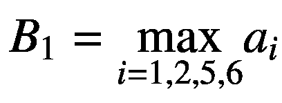
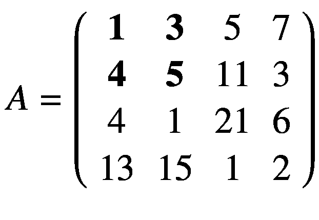

# 8.卷积和递归神经网络

在前几章中，您已经了解了全连接网络以及训练它们时遇到的所有问题。我们所使用的网络架构(其中一层中的每个神经元都连接到上一层和下一层中的所有神经元)并不真正擅长许多基本任务，例如图像识别、语音识别、时间序列预测等等。卷积神经网络(CNN)和递归神经网络(RNNs)是当今最常用的高级架构。在这一章中，你将看到卷积和池，CNN 的基本构件。然后，您将检查 rnn 如何在高层次上工作，并查看一些精选的应用示例。我还将讨论 CNN 和 RNNs 在 TensorFlow 中的一个完整但基本的实现。CNN 和 RNNs 的主题太过庞大，无法在一章中涵盖。因此，我将在这里只介绍基本概念，向您展示这些架构是如何工作的，但是完整的论述需要单独的一本书。

## 内核和过滤器

CNN 的主要组件之一是滤波器——具有维度*n*<sub>*K*</sub>×*n*<sub>*K*</sub>的方阵，其中，通常 *n* <sub>*K*</sub> 是一个小数字，例如 3 或 5。有时，过滤器也被称为内核。让我们定义四种不同的滤波器，并在本章后面检查它们在卷积运算中的作用。对于这些示例，我们将使用 3 × 3 滤波器。目前，考虑以下定义仅供参考；在本章的后面你会看到如何使用它们。

*   以下内核将允许检测水平边缘:


*   以下内核将允许检测垂直边缘:


*   以下内核将允许在亮度剧烈变化时检测边缘:


*   以下内核将模糊图像中的边缘:


在接下来的部分中，我们将使用滤镜对测试图像进行卷积，您将会看到它的效果。

## 盘旋

理解 CNN 的第一步是理解卷积。在几个简单的案例中，最容易看到它的实际应用。首先，在神经网络的环境中，卷积是在张量之间进行的。该操作得到两个张量作为输入，并产生一个张量作为输出。该操作通常用运算符*表示。让我们看看它是如何工作的。我们得到两个张量，维数都是 3 × 3。通过应用以下公式来执行卷积运算:


在这种情况下，结果只是每个元素 *a* <sub>*i*</sub> 的总和，乘以各自的元素 *k* <sub>*i*</sub> 。在一个更典型的矩阵形式中，这个公式可以用一个双和写成


但第一个版本的优点是使基本思想非常清楚:来自一个张量的每个元素乘以第二个张量的相应元素(相同位置的元素)，然后将所有值相加得到结果。

在上一节中，我提到了核，原因是卷积通常是在张量和核之间进行的，这里我们可以用 *A* 来表示张量。典型地，核很小，3 × 3 或 5 × 5，而输入张量 *A* 通常更大。例如，在图像识别中，输入张量 *A* 是尺寸可能高达 1024 × 1024 × 3 的图像，其中 1024 × 1024 是分辨率，最后一个尺寸(3)是颜色通道的数量，即 RGB(红、绿、蓝)值。在高级应用中，图像可能具有更高的分辨率。当我们有不同维数的矩阵时，我们如何应用卷积？为了理解这一点，让我们考虑一个 4 × 4 的矩阵 *A* 。


让我们看看如何使用内核 *K* 进行卷积，在本例中，我们将取 3 × 3。


这个想法是从矩阵 *A* 的左上角开始，选择一个 3 × 3 的区域。在我们的例子中，这将是


或者下面用粗体标记的元素。


然后，我们执行卷积，如开始所解释的，在这个更小的矩阵 *A* <sub>1</sub> 和 *K* 之间，得到(我们将用 *B* <sub>1</sub> 表示结果)


然后，我们必须将矩阵 *A* 中所选的 3 × 3 区域向右移动一列，并选择以下粗体标记的元素。


这将给我们第二子矩阵 *A* <sub>2</sub>


并且我们再次执行这个更小的矩阵 *A* <sub>2</sub> 和 *K* 之间的卷积


现在我们不能再向右移动我们的 3 × 3 区域，因为我们已经到达了矩阵 *A* 的末尾，所以我们要做的是将它向下移动一行，并从左侧重新开始。下一个选择的区域将是


再次，我们执行*A*T2 3 与 *K* 的卷积


此时您可能已经猜到，最后一步是将我们的 3 × 3 选定区域向右移动一列，并再次执行卷积。我们选择的区域现在将是


卷积会给出结果


现在我们不能再移动我们的 3 × 3 区域了，无论是向右还是向下。我们计算了 4 个值: *B* <sub>1</sub> 、 *B* <sub>2</sub> 、 *B* <sub>3</sub> 、 *B* <sub>4</sub> 。那些元素将形成卷积运算的结果张量，给我们张量 *B* 。


当张量 *A* 较大时，可以应用相同的过程。你将简单地得到一个更大的结果 *B* 张量，但是得到元素 *B* <sub>*i*</sub> 的算法是相同的。在继续之前，还有一个小细节我必须讨论一下，那就是 stride 的概念。在前面的过程中，我们总是将 3 × 3 区域向右移动一列，向下移动一行。在本例 1 中，行数和列数称为跨距，通常用 *s* 表示。Stride *s* = 2 仅仅意味着我们将把 3 × 3 的区域向右移动两列，向下移动两行。我必须讨论的另一件事是输入矩阵 *A* 中选定区域的大小。在此过程中，我们移动的选定区域的尺寸必须与所用内核的尺寸相同。如果你使用 5 × 5 内核，那么你必须在 *A* 中选择一个 5 × 5 的区域。一般来说，给定一个*n*<sub>*K*</sub>×*n*<sub>*K*</sub>内核，你会在 *A* 中选择一个*n*<sub>*K*</sub>×*n*<sub>*K*</sub>区域。

更正式的定义是，在神经网络环境中，与步幅 *s* 的卷积， 是取一个张量 *A* 的维数*n*<sub>*A*</sub>×*n*<sub>*A*</sub>和一个核 *K* 的维数*n*<sub>*K*</sub>×*n*<sub>*K*</sub>并输出一个矩阵的过程


这里我们用⌊ *x* ⌋表示 *x* 的整数部分(在编程界，这通常被称为 *x* 的底)。这个公式的证明将花费太多的时间来讨论，但很容易看出为什么它是正确的(尝试推导它)。为了简单一点，我们假设 *n* <sub>*K*</sub> 是奇数。你很快就会明白为什么这很重要(虽然不是基本的)。让我开始大踏步地正式解释这个情况。该算法根据以下公式从输入张量 *A* 和核 *K* 生成新的张量 *B*


这个公式晦涩难懂。让我们多看一些例子，以便更好地理解意思。在图 [8-1](#Fig1) 中，你可以看到卷积如何工作的直观解释。假设你有一个 3 × 3 的滤波器。然后，在图中，您可以看到矩阵 *A* 的左上九个元素，用黑色实线绘制的正方形标记，是用于根据前面的公式生成矩阵 *B* <sub>1</sub> 的第一个元素。用虚线画的正方形标记的元素是用于生成第二个元素*B*T10】2 的元素，以此类推。重申一下我在开头的例子里讨论的，基本思想是矩阵 *A* 的 3 × 3 方阵的每个元素乘以核 *K* 的对应元素，所有数相加。该和就是新矩阵 *B* 的元素。计算出*B*T20】1 的值后，将原始矩阵中您所考虑的区域向右移动一列(图 [8-1](#Fig1) 中用虚线表示的方块)并重复操作。您继续将区域向右移动，直到到达边界，然后向下移动一个元素，并从左侧重新开始，以这种方式继续，直到到达矩阵的右下角。相同的内核用于原始矩阵中的所有区域。


图 8-1

卷积的直观解释

例如，给定内核，你可以在图 [8-2](#Fig2) 中看到 *A* 的哪个元素与中的哪个元素相乘，元素*B*T8】1 的结果就是所有乘法的总和


图 8-2

与内核卷积的可视化

在图 [8-3](#Fig3) 中，您可以看到步长 *s* = 2 的卷积示例。


图 8-3

步幅为 *s* = 2 的卷积的直观解释

输出矩阵的维数只占的底(整数部分)的原因在图 [8-4](#Fig4) 中可以很直观的看到。如果*s*T35】1，根据 *A* 的尺寸，可能发生的情况是，在某一点，你不能再在矩阵 *A* 上移动你的窗口(例如，图 [8-3](#Fig3) 中的黑色方块)，并且你不能完全覆盖矩阵 *A* 的全部。在图 [8-4](#Fig4) 中，您可以看到如何在矩阵 *A* 的右侧需要一个额外的列(由许多 x 标记)，以便能够执行卷积运算。在图 [8-4 中](#Fig4)， *s* = 3，而既然我们有了*n*<sub>*A*</sub>= 5 和*n*<sub>*K*</sub>= 3， *B* 就会产生一个标量结果。


图 8-4

直观解释为什么在评估生成的矩阵 *B* 尺寸时需要 floor 函数

从图 [8-4](#Fig4) 中你可以很容易地看到，一个 3 × 3 的区域只能覆盖 *A* 的左上区域，因为步距 *s* = 3 时，你会在 *A* 之外结束，因此，可以只考虑一个区域进行卷积运算，从而最终得到张量 *B* 的标量。

现在让我们考虑几个额外的例子，使这个公式更加清晰。先说一个 3 × 3 的小矩阵。


让我们考虑一下内核


并且步幅 *s* = 1。卷积将由下式给出


而结果 *B* 将是一个标量，因为*n*<sub>T5】A</sub>= 3，*n*<sub>*K*</sub>= 3，因此


如果你现在考虑一个维数为 4 × 4 的矩阵 *A* ，或者*n*<sub>T5】A</sub>= 4，*n*<sub>*K*</sub>= 3， *s* = 1，你将得到维数为 2 × 2 的矩阵 *B* ，因为


例如，您可以验证给定的


和


我们有步距为*s*= 1


用我给你的公式来验证其中一个元素， *B* <sub>11</sub> 。我们有

![$$ {\displaystyle \begin{array}{l}{B}_{11}=\sum \limits_{f=0}^2\kern1em \sum \limits_{h=0}^2\kern0.375em {A}_{1+f,1+h}{K}_{1+f,1+h}=\sum \limits_{f=0}^2\left({\mathrm{A}}_{1+\mathrm{f},\kern0.5em 1}{K}_{1+f,1}+{\mathrm{A}}_{1+\mathrm{f},\kern0.5em 2}{K}_{1+f,2}+{\mathrm{A}}_{1+\mathrm{f},\kern0.5em 3}{K}_{1+f,3}\right)\\ {}\kern1.5em =\left({\mathrm{A}}_{1,\kern0.5em 1}{K}_{1,1}+{\mathrm{A}}_{1,\kern0.5em 2}{K}_{1,2}+{\mathrm{A}}_{1,\kern0.5em 3}{K}_{1,3}\right)+\left({\mathrm{A}}_{2,\kern0.5em 1}{K}_{2,1}+{\mathrm{A}}_{2,\kern0.5em 2}{K}_{2,2}+{\mathrm{A}}_{2,\kern0.5em 3}{K}_{2,3}\right)\\ {}\kern2em +\left({\mathrm{A}}_{3,\kern0.5em 1}{K}_{3,1}+{\mathrm{A}}_{3,\kern0.5em 2}{K}_{3,2}+{\mathrm{A}}_{3,\kern0.5em 3}{K}_{3,3}\right)=\left(1\cdot 1+2\cdot 2+3\cdot 3\right)+\left(5\cdot 4+6\cdot 5+7\cdot 6\right)\\ {}\kern2em +\left(9\cdot 7+10\cdot 8+11\cdot 9\right)=14+92+242=348\end{array}} $$](img/463356_1_En_8_Chapter_TeX_Equaf.png)

注意，我给你的卷积公式只适用于步距 *s* = 1，但可以很容易地推广到其他值的 *s* 。

这个计算很容易用 Python 实现。对于 *s* = 1，下面的函数可以足够容易地计算两个矩阵的卷积。(可以用 Python 中已经存在的函数来做，但是我认为从头开始看如何做是有启发性的。)

```py
import numpy as np
def conv_2d(A, kernel):
    output = np.zeros([A.shape[0]-(kernel.shape[0]-1), A.shape[1]-(kernel.shape[0]-1)])

    for row in range(1,A.shape[0]-1):
        for column in range(1, A.shape[1]-1):
            output[row-1, column-1] = np.tensordot(A[row-1:row+2, column-1:column+2], kernel)

    return output

```

注意输入矩阵 *A* 甚至不需要是正方形的，而是假设内核是，并且它的维数*n*<sub>T5】K</sub>是奇数。可以用下面的代码评估前面的示例:

```py
A = np.array([[1,2,3,4],[5,6,7,8],[9,10,11,12],[13,14,15,16]])
K = np.array([[1,2,3],[4,5,6],[7,8,9]])
print(conv_2d(A,K))

```

这给出了结果

```py
[[ 348\. 393.]
[ 528\. 573.]]

```

## 卷积的例子

现在让我们尝试将我们在开始时定义的内核应用到一个测试图像中，看看结果。作为测试图像，让我们创建一个尺寸为 160 × 160 像素的棋盘，代码如下

```py
chessboard = np.zeros([8*20, 8*20])
for row in range(0, 8):
    for column in range (0, 8):
        if ((column+8*row) % 2 == 1) and (row % 2 == 0):
            chessboard[row*20:row*20+20, column*20:column*20+20] = 1
        elif ((column+8*row) % 2 == 0) and (row % 2 == 1):
            chessboard[row*20:row*20+20, column*20:column*20+20] = 1

```

在图 [8-5](#Fig5) 中，可以看到棋盘的样子。


图 8-5

用代码生成棋盘图像

现在，让我们尝试使用步长为 *s* = 1 的不同内核对该图像进行卷积。

使用内核将检测水平边缘。这可以应用于代码

```py
edgeh = np.matrix('1 1 1; 0 0 0; -1 -1 -1')
outputh = conv_2d (chessboard, edgeh)

```

在图 [8-6](#Fig6) 中，你可以看到输出的样子。


图 8-6

内核和棋盘图像之间执行卷积的结果

现在你可以理解我为什么说这个内核检测水平边缘了。此外，这个内核可以检测你是从亮到暗还是从暗到亮。注意，这个图像只有 158 × 158 像素，正如预期的那样，因为

![$$ {n}_B=\left[\frac{n_A-{n}_K}{s}+1\right]=\left[\frac{160-3}{1}+1\right]=\left[\frac{157}{1}+1\right]=\left[158\right]=158 $$](img/463356_1_En_8_Chapter_TeX_Equag.png)

现在让我们用代码来应用

```py
edgev = np.matrix('1 0 -1; 1 0 -1; 1 0 -1')
outputv = conv_2d (chessboard, edgev)

```

这给出了如图 [8-7](#Fig7) 所示的结果。


图 8-7

内核和棋盘图像之间执行卷积的结果

现在我们可以使用内核

```py
edgel = np.matrix ('-1 -1 -1; -1 8 -1; -1 -1 -1')
outputl = conv_2d (chessboard, edgel)

```

这给出了如图 [8-8](#Fig8) 所示的结果。


图 8-8

内核和棋盘图像之间执行卷积的结果

最后，我们可以应用模糊内核。

```py
edge_blur = -1.0/9.0*np.matrix('1 1 1; 1 1 1; 1 1 1')
output_blur = conv_2d (chessboard, edge_blur)

```

在图 [8-9](#Fig9) 中，你可以看到两个图:左边是模糊的图像，右边是原始图像。这些图像只显示了原始棋盘的一小部分区域，以使模糊更加清晰。


图 8-9

模糊内核的效果。左边是模糊的图像，右边是原图。

为了结束这一部分，让我们试着更好地理解如何检测边缘。让我们考虑下面的矩阵，它有一个尖锐的垂直过渡，因为左边部分全是 10，右边部分全是 0。

```py
ex_mat = np.matrix('10 10 10 10 0 0 0 0; 10 10 10 10 0 0 0 0; 10 10 10 10 0 0 0 0; 10 10 10 10 0 0 0 0; 10 10 10 10 0 0 0 0; 10 10 10 10 0 0 0 0; 10 10 10 10 0 0 0 0; 10 10 10 10 0 0 0 0')

```

结果看起来是这样的。

```py
matrix([[10, 10, 10, 10, 0, 0, 0, 0],
        [10, 10, 10, 10, 0, 0, 0, 0],
        [10, 10, 10, 10, 0, 0, 0, 0],
        [10, 10, 10, 10, 0, 0, 0, 0],
        [10, 10, 10, 10, 0, 0, 0, 0],
        [10, 10, 10, 10, 0, 0, 0, 0],
        [10, 10, 10, 10, 0, 0, 0, 0],
        [10, 10, 10, 10, 0, 0, 0, 0]])

```

现在让我们考虑内核。我们可以对代码进行卷积

```py
ex_out = conv_2d (ex_mat, edgev)

```

结果是

```py
array([[ 0., 0., 30., 30., 0., 0.],
       [ 0., 0., 30., 30., 0., 0.],
       [ 0., 0., 30., 30., 0., 0.],
       [ 0., 0., 30., 30., 0., 0.],
       [ 0., 0., 30., 30., 0., 0.],
       [ 0., 0., 30., 30., 0., 0.]])

```

在图 [8-10](#Fig10) 中，可以看到原始矩阵(左边)和卷积的输出(右边)。与内核的卷积已经清楚地检测到原始矩阵中的急剧转变，在从黑到白的转变发生的地方用垂直黑线标记。比如考虑*B*T5】11= 0。


注意，在输入矩阵中


没有过渡，因为所有值都是相同的。相反，如果考虑*B*T2】13，就必须考虑输入矩阵的这个区域


因为最右边的一列是由 0 组成的，其余的是 10。你现在得到一个不同的结果。


这就是为什么一旦水平方向上的值有大的变化，卷积将返回高值，因为在核中乘以 1 的列的值将更大。相反，当沿着水平轴存在从小值到高值的转变时，乘以-1 的元素将给出绝对值更大的结果，因此，最终结果将是负的并且绝对值更大。这就是为什么这个内核也可以检测你是否从一个浅色到一个深色，反之亦然。事实上，如果你考虑一个假设的不同矩阵*中的相反转变(从 0 到 10)*，你会有


因为，这一次，我们沿着水平方向从 0 移动到 10。


图 8-10

矩阵`ex_mat`与内核卷积的结果，如文本所述

请注意，正如预期的那样，输出矩阵的维数是 5 × 5，因为原始矩阵的维数是 7 × 7，而核是 3 × 3。

## 联营

汇集是 CNN 的第二个基本操作。这个运算比卷积容易理解得多。为了理解它，让我们再次考虑一个具体的例子，什么是所谓的最大池。让我们再次使用卷积讨论中的 4 × 4 矩阵。


为了执行最大池，我们必须定义一个大小为*n*<sub>*K*×*n*<sub>*K*</sub>的区域，类似于我们对卷积所做的。我们来考虑一下*n*<sub>*K*</sub>= 2。我们必须做的是从我们矩阵的左上角 *A* 开始，从 *A* 中选择一个*n*<sub>*K*</sub>×*n*<sub>*K*</sub>区域，在我们的例子中是 2 × 2。在这里，我们选择</sub>


或矩阵 *A* 中以粗体标记的元素，如下所示:


从选择的元素中， *a* <sub>1</sub> ， *a* <sub>2</sub> ， *a* <sub>5</sub> ， *a* <sub>6</sub> ，最大汇集运算选择最大值，给出一个结果，我们用 *B* <sub>1</sub> 表示。



现在，我们必须将 2 × 2 窗口向右移动两列，通常与所选区域的列数相同，并选择以粗体标记的元素


或者换句话说，更小的矩阵。


最大池算法将选择最大值，给出一个结果，我们用 *B* <sub>2 表示。</sub>


此时，我们不能再将 2 × 2 区域向右移动，所以我们将其向下移动两行，并从 *A* 的左侧再次开始该过程，选择以粗体标记的元素并获取最大值，将其命名为 *B* <sub>3</sub> ，如下所示:


在这种情况下，步距 *s* 的含义与卷积讨论中的含义相同。它只是在选择元素时移动区域的行数或列数。最后，我们在 *A* 的下半部分选择最后一个区域 2 × 2，选择元素 *a* <sub>11</sub> 、 *a* <sub>12</sub> 、 *a* <sub>15</sub> 和 *a* <sub>16</sub> 。然后我们得到最大值，我们称之为*B*T22】4。利用我们在此过程中获得的值，在我们的示例中，四个值 *B* <sub>1</sub> 、 *B* 、T30】 2 、 *B* 、T34】 3 和 *B* 、 <sub>4</sub> ，我们将构建一个输出张量。


在这个例子中，我们有 *s* = 2。基本上，该操作将矩阵 *A* 、步距 *s* 和内核大小 *n* <sub>*K*</sub> (我们在前一示例中选择的区域的维度)作为输入，并返回新矩阵 *B* ，其维度由我们在卷积讨论中应用的相同公式给出。


重申一下，这个想法是从你的矩阵左上角的 *A* 开始，取一个维度为*n*<sub>T5】KT7】×*n*<sub>*K*</sub>的区域，对选中的元素应用 max 函数，然后向右移动 *s* 元素的区域，选择一个新的区域——再次是维度为 *n* <sub>*K* 在图 [8-11](#Fig11) 中，你可以看到如何从一个跨度为 *s* = 2 的矩阵 *A* 中选择元素</sub></sub>


图 8-11

步长为 *s* = 2 的池的可视化

例如，将最大池应用于输入 *A*


会给你结果(这是很容易验证的)


因为 4 是以粗体标记的值的最大值



11 是以粗体标记的值的最大值，如下所示:


等等。值得一提的是另一种池化方式，虽然没有最大池化广泛使用:*平均池化*。它不返回所选值的最大值，而是返回平均值。

### 注意

使用最多的池操作是*最大池*。*平均池*的使用并不广泛，但可以在特定的网络架构中找到。

### 填料

值得一提的是填充的概念。有时，在处理图像时，从维度不同于原始图像的卷积运算中获得结果并不是最佳选择。所以，有时候，你做所谓的*填充*。基本上，这个想法非常简单:它包括在最终图像的顶部、底部添加像素行，在右侧和左侧添加像素列，并填充一些值，以使结果矩阵与原始矩阵大小相同。一些策略是用零填充添加的像素，用最接近的像素的值填充，等等。在我们的例子中，带有零填充的`ex_out`矩阵如下所示:

```py
array([[ 0., 0., 0., 0., 0., 0., 0., 0.],
       [ 0., 0., 0., 30., 30., 0., 0., 0.],
       [ 0., 0., 0., 30., 30., 0., 0., 0.],
       [ 0., 0., 0., 30., 30., 0., 0., 0.],
       [ 0., 0., 0., 30., 30., 0., 0., 0.],
       [ 0., 0., 0., 30., 30., 0., 0., 0.],
       [ 0., 0., 0., 30., 30., 0., 0., 0.],
       [ 0., 0., 0., 0., 0., 0., 0., 0.]])

```

填充背后的用途和原因超出了本书的范围，但知道它的存在是很重要的。仅作为参考，在使用填充符 *p* (用作填充符的行和列的宽度)的情况下，在卷积和合并的情况下，矩阵 *B* 的最终尺寸由下式给出


### 注意

在处理真实图像时，您总是在三个通道中对彩色图像进行编码:RGB。这意味着您必须在三个维度上执行卷积和池化:宽度、高度和颜色通道。这将增加算法的复杂性。

## 美国有线电视新闻网的基石

基本上，卷积和池操作用于构建 CNN 中使用的层。通常，在 CNN 中，您可以找到以下层:

*   卷积层

*   池层

*   完全连接的层

完全连接的层正是你在前面所有章节中看到的:一个层中的神经元连接到前一层和后一层的所有神经元。您已经熟悉列出的层，但是前两个需要一些额外的解释。

### 卷积层

卷积层将张量(由于三个颜色通道，它可以是三维的)作为输入，例如，特定维度的图像；应用一定数量的内核，通常是 10 个、16 个甚至更多；添加一个偏差；应用 ReLU 激活函数(例如),将非线性引入卷积的结果；并产生输出矩阵 *B* 。如果您还记得我们在前面章节中使用的符号，卷积的结果将具有在第 [3](03.html) 章中讨论过的*W*<sup>[*l*]</sup>*Z*<sup>[*l*—1】</sup>的作用。

在前面的章节中，我已经展示了一些只使用一个内核应用卷积的例子。如何同时应用几个内核？嗯，答案很简单。最终的张量(我现在使用单词 *tenso* r，因为它不再是一个简单的矩阵) *B* 将不再是二维而是三维。让我们用 *n* <sub>*c*</sub> 来表示你要申请的内核数量(之所以用 *c* ，是因为人们有时会把这些称为通道)。您只需将每个过滤器独立应用于输入，并将结果堆叠起来。所以，不是一个维数为*n*<sub>*B*×*n*<sub>*B*</sub>的单一矩阵 *B* ，而是得到一个维数为*<sub>*B*×*n*<sub>*B*</sub>×</sub>的最终张量这意味着*</sub>

*![$$ {\tilde{B}}_{i,j,1}\kern1em \forall i,j\in \left[1,{n}_B\right] $$](img/463356_1_En_8_Chapter_TeX_Equbb.png)*

 *将是输入图像与第一内核的卷积的输出，

![$$ {\tilde{B}}_{i,j,2}\kern1em \forall i,j\in \left[1,{n}_B\right] $$](img/463356_1_En_8_Chapter_TeX_Equbc.png)

将是与第二个内核卷积的输出，以此类推。卷积层就是将输入转换成输出张量的东西。但是这一层的权重是什么呢？网络在训练阶段学习的权重或参数是内核本身的元素。我们已经讨论过，我们有 *n* <sub>*c*</sub> 个内核，每个维度有*n*<sub>*K*</sub>×*n*<sub>*K*</sub>。这意味着卷积层中有参数。

### 注意

卷积层中的参数数量与输入图像大小无关。这个事实有助于减少过度拟合，尤其是在处理大尺寸输入图像时。

有时，这一层用单词 *POOL* 和一个数字表示。在我们的例子中，我们可以用 POOL1 表示这个层。在图 [8-12](#Fig12) 中，你可以看到一个卷积层的示意图。通过应用与维度为*n*<sub>*A*</sub>×*n*<sub>*A*</sub>×*n*<sub>*c*</sub>的张量中的*n*<sub>*c*</sub>核的卷积，输入图像得到变换。


图 8-12

卷积层的表示 <sup>[1](#Fn1)</sup>

卷积层不一定必须紧接在输入之后。当然，卷积层可以将任何其他层的输出作为输入。请记住，通常您的输入图像将具有尺寸*n*<sub>*A*</sub>×*n*<sub>*A*</sub>×3，因为彩色图像有三个通道:RGB。在考虑彩色图像时，对 CNN 中张量的完整分析超出了本书的范围。在图中，层通常被简单地表示为立方体或正方形。

。

### 池层

池层通常由 *POOL* 和一个数字表示:例如，POOL1。它将一个张量作为输入，在将池应用于输入后，给出另一个张量作为输出。

### 注意

一个池层没有需要学习的参数，但是它引入了额外的超参数:*n*<sub>T3】KT5】和 stride *s* 。通常，在池化层中，不使用任何填充，因为使用池化的原因之一通常是为了减少张量的维数。</sub>

### 将层堆叠在一起

在 CNN 中，通常将卷积层和池层一个接一个地堆叠在一起。在图 [8-13](#Fig13) 中，您可以看到一个卷积层和一个池层堆栈。卷积层之后总是有一个池层。有时，两者合在一起称为一层。原因是池层没有可学习的权重，因此，它被视为与卷积层相关联的简单操作。所以，当你阅读报纸或博客时要小心，并核实他们的意图。


图 8-13

如何堆叠卷积层和池层的表示

为了结束 CNN 的讨论，在图 [8-14](#Fig14) 中，你可以看到一个 CNN 的例子。它类似于非常著名的 LeNet-5 网络，关于它你可以在这里阅读更多: [`https://goo.gl/hM1kAL`](https://goo.gl/hM1kAL) 。您有输入，然后两个卷积池层两次，三个完全连接的层，和一个输出层，其中您可能有您的`softmax`函数，例如，在您执行多类分类的情况下。我在图中放了一些任意的数字，让你对不同层的大小有个概念。


图 8-14

类似于著名的 LeNet-5 网络的 CNN 的代表

### CNN 的例子

让我们试着构建一个这样的网络，让您感受一下这个过程是如何工作的，代码是什么样子的。我们不会做任何超参数调整或优化，以保持该部分的可理解性。我们将按照以下顺序构建包含以下层的架构:

*   卷积层 1，有 6 个 5 × 5 的滤波器，步距 *s* = 1

*   最大池层 1，窗口 2 × 2，步距 *s* = 2

*   然后，我们将 ReLU 应用于前一层的输出。

*   卷积层 2，具有 16 个 5 × 5 的滤波器，步距 *s* = 1

*   最大池层 2，窗口 2 × 2，步距 *s* = 2

*   然后，我们将 ReLU 应用于前一层的输出。

*   全连接层，有 128 个神经元和激活函数 ReLU

*   全连接层，有 10 个神经元用于 Zalando 数据集的分类

*   Softmax 输出神经元

我们将导入 Zalando 数据集，正如我们在第 [3](03.html) 章中所做的那样，如下所示:

```py
data_train = pd.read_csv('fashion-mnist_train.csv', header = 0)
data_test = pd.read_csv('fashion-mnist_test.csv', header = 0)

```

有关如何获取文件的详细说明，请参见第 [3](03.html) 章。接下来，我们来准备数据。

```py
labels = data_train['label'].values.reshape(1, 60000)
labels_ = np.zeros((60000, 10))
labels_[np.arange(60000), labels] = 1
labels_ = labels_.transpose()
train = data_train.drop('label', axis=1)

```

和

```py
labels_dev = data_test['label'].values.reshape(1, 10000)
labels_dev_ = np.zeros((10000, 10))
labels_dev_[np.arange(10000), labels_dev] = 1
test = data_dev.drop('label', axis=1)

```

注意，在这种情况下，与第 [3](03.html) 章不同，我们将使用所有张量的转置，这意味着在每一行中，我们将有一个观察值。在第 3 章中，每个观察都在一列中。如果用代码检查尺寸

```py
print(labels_.shape)
print(labels_dev_.shape)

```

您将获得以下结果:

```py
(60000, 10)
(10000, 10)

```

第 [3](03.html) 章，尺寸互换。原因是为了开发卷积层和池层，我们将使用 TensorFlow 提供的函数，因为从头开发它们需要太多时间。此外，对于一些张量流函数，如果张量沿行有不同的观测值，则更容易。正如在第 3 章[中，我们必须将数据标准化。](03.html)

```py
train = np.array(train / 255.0)
dev = np.array(dev / 255.0)
labels_ = np.array(labels_)
labels_test_ = np.array(labels_test_)

```

我们现在可以开始建立我们的网络。

```py
x = tf.placeholder(tf.float32, shape=[None, 28*28])
x_image = tf.reshape(x, [-1, 28, 28, 1])
y_true = tf.placeholder(tf.float32, shape=[None, 10])
y_true_scalar = tf.argmax(y_true, axis=1)

```

需要解释的一行是第二行:`x_image = tf.reshape(x, [-1, 28, 28, 1])`。请记住，卷积层将需要二维图像，而不是像素灰度值的扁平列表，正如第 [3 章](03.html)中的情况，我们的输入是一个具有 784 (28 × 28)个元素的向量。

### 注意

CNN 最大的一个优点就是利用了输入图像中包含的二维信息。这就是为什么卷积层的输入是二维图像，而不是扁平矢量。

当构建 CNN 时，通常定义函数来构建不同的层。通过这种方式，超参数调整将变得更加容易，正如我们之前所看到的那样。另一个原因是，当我们将所有的功能放在一起时，代码的可读性会更好。函数名应该是不言自明的。让我们从构建卷积层的函数开始。请注意，TensorFlow 文档使用术语*过滤器*，因此这是我们将在代码中使用的。

```py
def new_conv_layer(input, num_input_channels, filter_size, num_filters):
    shape = [filter_size, filter_size, num_input_channels, num_filters]
    weights = tf.Variable(tf.truncated_normal(shape, stddev=0.05))
    biases = tf.Variable(tf.constant(0.05, shape=[num_filters]))
    layer = tf.nn.conv2d(input=input, filter=weights, strides=[1, 1, 1, 1], padding="SAME")
    layer += biases
    return layer, weights

```

此时，我们将从截断的正态分布初始化权重，偏差为常数，然后我们将使用步长 *s* = 1。步幅是一个列表，因为它给出了不同维度的步幅。在我们的例子中，我们有灰色图像，但我们也可以有 RGB，例如，从而有更多的维度:三个颜色通道。

池层更容易，因为它没有权重。

```py
def new_pool_layer(input):
    layer = tf.nn.max_pool(value=input, ksize=[1, 2, 2, 1], strides=[1, 2, 2, 1], padding="SAME")
    return layer

```

现在让我们定义一个将激活函数(在我们的例子中是 ReLU)应用到前一层的函数。

```py
def new_relu_layer(input_layer):
    layer = tf.nn.relu(input_layer)
    return layer

```

最后，我们需要一个函数来构建全连接层。

```py
def new_fc_layer(input, num_inputs, num_outputs):
    weights = tf.Variable(tf.truncated_normal([num_inputs, num_outputs], stddev=0.05))
    biases = tf.Variable(tf.constant(0.05, shape=[num_outputs]))
    layer = tf.matmul(input, weights) + biases

    return layer

```

我们使用的新 TensorFlow 函数是`tf.nn.conv2d`，它构建了一个卷积层，和`tf.nn.max_pool`，它构建了一个具有最大池化的池化层，从名字就可以想象得到。我们这里没有足够的空间来详细介绍每个函数的功能，但是您可以在官方文档中找到很多信息。现在，让我们将所有的东西放在一起，实际构建开头描述的网络。

```py
layer_conv1, weights_conv1 = new_conv_layer(input=x_image, num_input_channels=1, filter_size=5, num_filters=6)
layer_pool1 = new_pool_layer(layer_conv1)
layer_relu1 = new_relu_layer(layer_pool1)
layer_conv2, weights_conv2 = new_conv_layer(input=layer_relu1, num_input_channels=6, filter_size=5, num_filters=16)
layer_pool2 = new_pool_layer(layer_conv2)
layer_relu2 = new_relu_layer(layer_pool2)

```

我们必须创建完全连接的层，但是要使用`layer_relu2`作为输入，我们首先必须将其展平，因为它仍然是二维的。

```py
num_features = layer_relu2.get_shape()[1:4].num_elements()
layer_flat = tf.reshape(layer_relu2, [-1, num_features])

```

然后我们可以创建最后的层。

```py
layer_fc1 = new_fc_layer(layer_flat, num_inputs=num_features, num_outputs=128)
layer_relu3 = new_relu_layer(layer_fc1)
layer_fc2 = new_fc_layer(input=layer_relu3, num_inputs=128, num_outputs=10)

```

现在让我们来评估这些预测，以便稍后能够评估其准确性。

```py
y_pred = tf.nn.softmax(layer_fc2)
y_pred_scalar = tf.argmax(y_pred, axis=1)

```

数组`y_pred_scalar`将包含作为标量的类别号。现在我们需要定义成本函数，同样，我们将使用一个现有的张量流函数，以使我们的生活更容易，并保持本章的长度合理。

```py
cost = tf.reduce_mean(tf.nn.softmax_cross_entropy_with_logits(logits=layer_fc2, labels=y_true))

```

像往常一样，我们需要一个优化器。

```py
optimizer = tf.train.AdamOptimizer(learning_rate=1e-4).minimize(cost)

```

现在我们终于可以定义运算来评估精度了。

```py
correct_prediction = tf.equal(y_pred_scalar, y_true_scalar)
accuracy = tf.reduce_mean(tf.cast(correct_prediction, tf.float32))

```

是时候训练我们的网络了。我们将使用批量大小为 100 的小批量梯度下降，仅训练我们的网络十个时期。我们可以将变量定义如下:

```py
num_epochs = 10
batch_size = 100

```

培训可以通过以下方式完成

```py
with tf.Session() as sess:
    sess.run(tf.global_variables_initializer())
    for epoch in range(num_epochs):
        train_accuracy = 0
        for i in range(0, train.shape[0], batch_size):
            x_batch = train[i:i + batch_size,:]
            y_true_batch = labels_[i:i + batch_size,:]

            sess.run(optimizer, feed_dict={x: x_batch, y_true: y_true_batch})
            train_accuracy += sess.run(accuracy, feed_dict={x: x_batch, y_true: y_true_batch})

        train_accuracy /= int(len(labels_)/batch_size)
        dev_accuracy = sess.run(accuracy, feed_dict={x:dev, y_true:labels_dev_})

```

如果您运行这个代码(在我的笔记本电脑上大约花了 10 分钟)，它将在一个时期后开始，训练精度为 63.7%，在十个时期后，它将达到 86%的训练精度(也在 dev 集上)。还记得我们在第 [3](03.html) 章开发的第一个哑网络，一层有五个神经元，我们用小批量梯度下降达到了 66%。我们在这里只训练了十个纪元的网络。如果你训练的时间更长，你可以得到更高的准确度。此外，请注意，我们没有进行任何超参数调优，因此，如果您花时间调优这些参数，将会得到更好的结果。

您可能已经注意到，每次引入卷积层，都会为每一层引入新的超参数。

*   内核大小

*   进展

*   填料

这些都需要调整，以获得最佳结果。通常，研究人员倾向于使用现有的架构来完成特定的任务，这些架构已经被其他从业者优化过，并在论文中有很好的记录。

## RNNs 简介

rnn 与 CNN 有很大不同，通常用于处理顺序信息，换句话说，用于顺序很重要的数据。给出的典型例子是一个句子中的一系列单词。你很容易理解一个句子中单词的顺序会有很大的不同。例如，说“人吃了兔子”和“兔子吃了人”有不同的意思，唯一的区别是单词的顺序，以及谁被谁吃了。例如，您可以使用 RNNs 来预测句子中的后续单词。以“巴黎是……的首都”这句话为例。很容易用“法国”来完成句子，这意味着在前面的单词中编码了关于句子最后一个单词的信息，并且 RNNs 利用该信息来预测序列中的后续术语。名字 *recurrent* 来自于这些网络的工作方式:它们对序列的每个元素应用相同的操作，积累关于先前术语的信息。总结

*   rnn 利用顺序数据，并使用按照序列中术语的顺序编码的信息。

*   rnn 对序列中的所有项应用相同类型的运算，并建立序列中先前项的记忆，以预测下一项。

在试图更好地理解 rnn 的工作原理之前，让我们考虑几个可以应用它们的重要用例，让您了解潜在的应用范围。

*   *生成文本*:给定之前的一组单词，预测单词的概率。例如，你可以很容易地用 RNNs 生成看起来像莎士比亚的文本，就像 A. Karpathy 在他的博客上所做的那样，可以在 [`https://goo.gl/FodLp5`](https://goo.gl/FodLp5) 找到。

*   *翻译*:给定一种语言的一组单词，你可以得到另一种语言的单词。

*   *语音识别*:给定一系列音频信号(单词)，我们可以预测组成所说单词的字母序列。

*   *生成图像标签*:通过 CNN，RNNs 可以用来生成图像的标签。参考 A. Karpathy 关于这个主题的论文:“用于生成图像描述的深度视觉-语义排列”，可在 [`https://goo.gl/8Ja3n2`](https://goo.gl/8Ja3n2) 获得。要知道这是一篇相当高级的论文，需要广泛的数学背景。

*   聊天机器人(Chatbots):以一系列单词作为输入，rnn 试图生成输入的答案。

可以想象，要实现上述内容，您需要复杂的体系结构，这不容易用几句话来描述，并且需要对 rnn 的工作原理有更深入的理解(双关语),这超出了本章和本书的范围。

### 注释

我们来考虑一下“巴黎是法国的首都”这个序列。这个句子将被一次一个单词地输入 RNN:首先是“Paris”，然后是“is”，然后是“the”，以此类推。在我们的例子中，

*   “巴黎”将是该序列的第一个单词:`w1 = 'Paris'`

*   “是”将是序列的第二个单词:`w2 = 'is'`

*   “the”将是序列的第三个单词:`w3 = 'the'`

*   “大写”将是序列的第四个单词:`w4 = 'capital'`

*   “of”将是序列的第五个单词:`w5 = 'of'`

*   “法国”将是序列的第六个单词:`w6 = 'France'`

这些词将按以下顺序输入 RNN:`w1`、`w2`、`w3`、`w4`、`w5`、`w6`。不同的单词将被网络一个接一个地处理，或者像一些人喜欢说的那样，在不同的时间点处理。通常，据说如果在时间 *t* 处理字`w1`，那么在时间 *t* + 1 处理`w2`，在时间 *t* + 2 处理`w3`，以此类推。时间 *t* 与实际时间无关，但意味着序列中的每个元素是顺序处理的，而不是并行处理的。时间 *t* 也与计算时间或任何与之相关的事情无关。而 *t* + 1 中的增量 1 没有任何意义。它仅仅意味着我们正在讨论序列中的下一个元素。阅读论文、博客或书籍时，你可能会发现以下注释:

*   *x*<sub>T5】t</sub>:时间 *t* 的输入。例如，`w1`可以是时间 1*x*T12】1 的输入，时间 2*x*T16】2 的输入，依此类推。

*   *s* <sub>*t*</sub> :这是我们还没有定义的内存在时间 *t* 时的符号。这个量 *s* <sub>*t*</sub> 包含先前讨论的序列中先前项的累积信息。对它的直观理解就足够了，因为更数学化的定义需要太详细的解释。

*   *o* <sub>*t*</sub> 是网络在时间 *t* 的输出，或者换句话说，在直到 *t* 的序列的所有元素，包括元素 *x* <sub>*t*</sub> 都被馈送到网络之后。

### RNNs 的基本思想

通常，RNN 在文献中表示为图 [8-15](#Fig15) 中所示的最左侧部分。所使用的符号是指示性的——它简单地指示网络的不同元素: *x* 表示输入， *s* 表示内部存储器， *W* 表示一组权重，而 *U* 表示另一组权重。实际上，这个示意图只是描述网络真实结构的一种方式，如图 [8-15](#Fig15) 右侧所示。有时，这被称为网络的展开版本。


图 8-15

RNN 的示意图

图 [8-15](#Fig15) 的右部应从左向右看。图中的第一个神经元在指定的时间 *t* 进行评估，产生输出 *o* <sub>*t*</sub> ，并创建内存状态 *s* <sub>*t*</sub> 。在第一个神经元之后，在时间 *t* + 1 评估的第二个神经元获得序列中的下一个元素*x*<sub>*t*+1</sub>和前一个存储器状态 *s* <sub>*t*</sub> 作为输入。然后第二个神经元产生一个输出，*o*<sub>*t*+1</sub>，以及一个新的内存状态，*s*<sub>*t*+1</sub>。第三个神经元(图 [8-15](#Fig15) 最右边的那个)然后获得序列*x*<sub>*t*+2</sub>的新元素和先前的内部存储器状态*s*<sub>*t*+1</sub>作为输入，并且对于有限数量的神经元，该过程以这种方式进行。在图 [8-15](#Fig15) 中可以看到有两组砝码: *W* 和 *U* 。一组(用 *W* 表示)用于内部存储器状态，一组 *U* 用于序列元素。通常情况下，每个神经元都会生成新的内部记忆状态，其公式如下所示:


在我们用 *f* ()表示其中一个激活函数的地方，我们已经看到了 ReLU 或 tanh。此外，前面的公式当然是多维的。*s*<sub>T5】t</sub>可以理解为网络在时间 *t* 的记忆。可以使用的神经元数量(或时间步长)是一个新的超参数，必须根据问题进行调整。研究表明，当这个数字太大时，网络在训练期间会出现大问题。

需要注意的非常重要的一点是，在每个时间步长，权重不会改变。每一步都执行相同的操作，只需在每次执行评估时更改输入即可。另外，在图 [8-15](#Fig15) 中，我在图中为每一步都有一个输出( *o* <sub>*t*</sub> ， *o* <sub>*t* + 1</sub> 和*o*<sub>*t*+2</sub>)，但是，通常情况下，这不是必需的。在我们的例子中，我们想要预测一个句子中的最后一个单词，我们可能只需要最后的输出。

### 为什么叫*轮回*？

我想简单地讨论一下为什么网络被称为循环网络。我说过内部存储器在时间 *t* 的状态由下式给出


使用与时间*t*1 相同的存储器状态、时间*t*1 的存储器状态以及时间*t*2 的值来评估时间 *t* 的内部存储器状态，以此类推。这就是*轮回*名字的由来。

### 学习数数

为了让您了解它们的能力，我想举一个非常基本的例子，说明 rnn 非常擅长的事情，以及标准全连接网络(如您在前面章节中看到的网络)非常不擅长的事情。我们试着教一个网络数数。我们想要解决的问题如下:给定一个向量，我们假设它由 15 个元素组成，只包含 0 和 1，我们想要建立一个神经网络，它能够计算向量中 1 的数量。这对于一个标准网络来说是一个难题，但是为什么呢？为了直观地理解为什么，让我们考虑一下我们分析过的区分 MNIST 数据集中的一位数和两位数的问题。

如果你还记得度量分析的讨论，你会记得学习的发生是因为 1 和 2 在根本不同的位置有黑色像素。数字 1 和数字 2 的区别(至少在 MNIST 数据集中)是一样的，因此网络可以识别这些区别，一旦检测到这些区别，就可以做出明确的识别。在我们的情况下，这是不可能的。例如，考虑一个只有五个元素的向量的简单情况。

在这种情况下，1 只出现一次。我们有五种可能的情况:`[1,0,0,0,0]`、`[0,1,0,0,0]`、`[0,0,1,0,0]`、`[0,0,0,1,0]`和`[0,0,0,0,1]`。这里没有可辨别的模式。没有简单的砝码配置可以同时涵盖这些情况。在图像的情况下，这个问题类似于检测白色图像中黑色方块的位置的问题。我们可以在 TensorFlow 中建立一个网络，检查这样的网络有多好。然而，由于本章的介绍性质，我不会花时间讨论超参数、度量分析等等。我就简单的给你一个会数数的基本网络。

让我们从创建向量开始。我们将创建 10 个 <sup>5 个</sup>向量，我们将把它们分成训练集和开发集。

```py
import numpy as np
import tensorflow as tf
from random import shuffle

```

现在让我们创建向量列表。代码稍微复杂一些，我们将更详细地看一下。

```py
nn = 15
ll = 2**15
train_input = ['{0:015b}'.format(i) for i in range(ll)]
shuffle(train_input)
train_input = [map(int,i) for i in train_input]
temp  = []
for i in train_input:
    temp_list = []
    for j in i:
            temp_list.append([j])
    temp.append(np.array(temp_list))
train_input = temp

```

我们希望在 15 个元素的向量中有 1 和 0 的所有可能组合。因此，一个简单的方法是以二进制格式获取 2 <sup>15</sup> 之前的所有数字。为了理解为什么，让我们假设我们想只用四个元素来做这件事:我们想要四个 0 和 1 的所有可能的组合。考虑用这段代码可以得到的所有二进制数，从 2 <sup>到 4</sup> :

```py
['{0:04b}'.format(i) for i in range(2**4)]

```

这段代码简单地将你用`range(2**4)`函数得到的所有数字格式化，从`0`到`2**4`，以二进制格式，用`{0:04b}`，将位数限制为 4。结果如下:

```py
['0000',
 '0001',
 '0010',
 '0011',
 '0100',
 '0101',
 '0110',
 '0111',
 '1000',
 '1001',
 '1010',
 '1011',
 '1100',
 '1101',
 '1110',
 '1111']

```

正如您可以轻松验证的那样，所有可能的组合都已列出。出现一次的组合(`[0001]`、`[0010]`、`[0100]`和`[1000]`)，出现两次的组合，以此类推。对于我们的例子，我们将简单地用 15 位数字来做这件事，这意味着我们将用 2 <sup>15</sup> 以内的数字来做这件事。前面代码的其余部分只是简单地转换一个字符串，如列表`[0,1,0,0]`中的`'0100'`，然后将所有列表与所有可能的组合连接起来。如果检查输出数组的维数，您会注意到得到(32768，15，1)。每个观察值是一个维度(15，1)的数组。然后我们准备目标变量，一个计数的一键编码版本。这意味着如果我们有一个向量中有四个 1 的输入，我们的目标向量将看起来像`[0,0,0,0,1,0,0,0,0,0,0,0,0,0,0,0]`。正如预期的那样，`train_output`数组将具有尺寸`(32768, 16)`。现在让我们建立我们的目标变量。

```py
train_output = []

for i in train_input:
    count = 0
    for j in i:
        if j[0] == 1:
            count+=1
    temp_list = ([0]*(nn+1))
    temp_list[count]=1
    train_output.append(temp_list)

```

现在让我们将我们的集合分成一个 train 和一个 dev 集合，就像我们已经做了几次的那样。我们将在这里用一种“笨”的方式来做。

```py
train_obs = ll-2000
dev_input = train_input[train_obs:]
dev_output = train_output[train_obs:]
train_input = train_input[:train_obs]
train_output = train_output[:train_obs]

```

请记住，这是可行的，因为我们在开始时已经打乱了向量，所以我们应该有一个随机分布的案例。我们将使用 2000 个案例用于开发集，其余的(大约 30，000 个)用于培训。`train_input`将具有尺寸`(30768, 15, 1)`，并且`dev_input`将具有尺寸`(2000, 15,1)`。

现在你可以用这个代码建立一个网络，你应该能理解几乎所有的代码。

```py
tf.reset_default_graph()

data = tf.placeholder(tf.float32, [None, nn,1])
target = tf.placeholder(tf.float32, [None, (nn+1)])

num_hidden_el = 24
RNN_cell = tf.nn.rnn_cell.LSTMCell(num_hidden_el, state_is_tuple=True)

val, state = tf.nn.dynamic_rnn(RNN_cell, data, dtype=tf.float32)
val = tf.transpose(val, [1, 0, 2])
last = tf.gather(val, int(val.get_shape()[0]) - 1)

W = tf.Variable(tf.truncated_normal([num_hidden, int(target.get_shape()[1])]))
b = tf.Variable(tf.constant(0.1, shape=[target.get_shape()[1]]))

prediction = tf.nn.softmax(tf.matmul(last, W) + b)
cross_entropy = -tf.reduce_sum(target * tf.log(tf.clip_by_value(prediction,1e-10,1.0)))
optimizer = tf.train.AdamOptimizer()
minimize = optimizer.minimize(cross_entropy)
errors = tf.not_equal(tf.argmax(target, 1), tf.argmax(prediction, 1))
error = tf.reduce_mean(tf.cast(errors, tf.float32))

```

那我们来训练网络。

```py
init_op = tf.global_variables_initializer()
sess = tf.Session()
sess.run(init_op)
mb_size = 1000
no_of_batches = int(len(train_input)/mb_size)
epoch = 50
for i in range(epoch):
    ptr = 0
    for j in range(no_of_batches):
        train, output = train_input[ptr:ptr+mb_size], train_output[ptr:ptr+mb_size]
        ptr+=mb_size
        sess.run(minimize,{data: train, target: output})
incorrect = sess.run(error,{data: test_input, target: test_output})
print('Epoch {:2d} error {:3.1f}%'.format(i + 1, 100 * incorrect))

```

您可能认不出的新部分是下面这段代码:

```py
num_hidden_el = 24
RNN_cell = tf.nn.rnn_cell.LSTMCell(num_hidden_el,state_is_tuple=True)

val, state = tf.nn.dynamic_rnn(RNN_cell, data, dtype=tf.float32)
val = tf.transpose(val, [1, 0, 2])
last = tf.gather(val, int(val.get_shape()[0]) - 1)

```

出于性能原因，并且为了让你认识到 rnn 有多有效，我在这里使用了一种长短期记忆(LSTM)类型的神经元。这有一个计算内部状态的特殊方法。对 LSTMs 的讨论超出了本书的范围。目前，您应该关注结果，而不是代码。如果让代码运行，您将得到以下结果:

```py
Epoch 0 error 80.1%
Epoch 10 error 27.5%
Epoch 20 error 8.2%
Epoch 30 error 3.8%
Epoch 40 error 3.1%
Epoch 50 error 2.0%

```

仅仅 50 个时代之后，网络在 98%的情况下都是正确的。只要让它运行更多的纪元，你就能达到难以置信的精度。100 个纪元后，可以达到 0.5%的误差。一个有益的练习是尝试训练一个完全连接的网络(就像我们到目前为止讨论的那样)来计数。你会发现这是不可能的。

现在你应该对 CNN 和 rnn 的工作原理以及它们的工作原理有了基本的了解。对这些网络的研究是巨大的，因为它们非常灵活，但是前几节的讨论应该已经给了你足够的信息来理解这些架构是如何工作的。

<aside class="FootnoteSection" epub:type="footnotes">Footnotes [1](#Fn1_source)

猫图片来源: [`www.shutterstock.com/`](https://www.shutterstock.com/)

 </aside>*