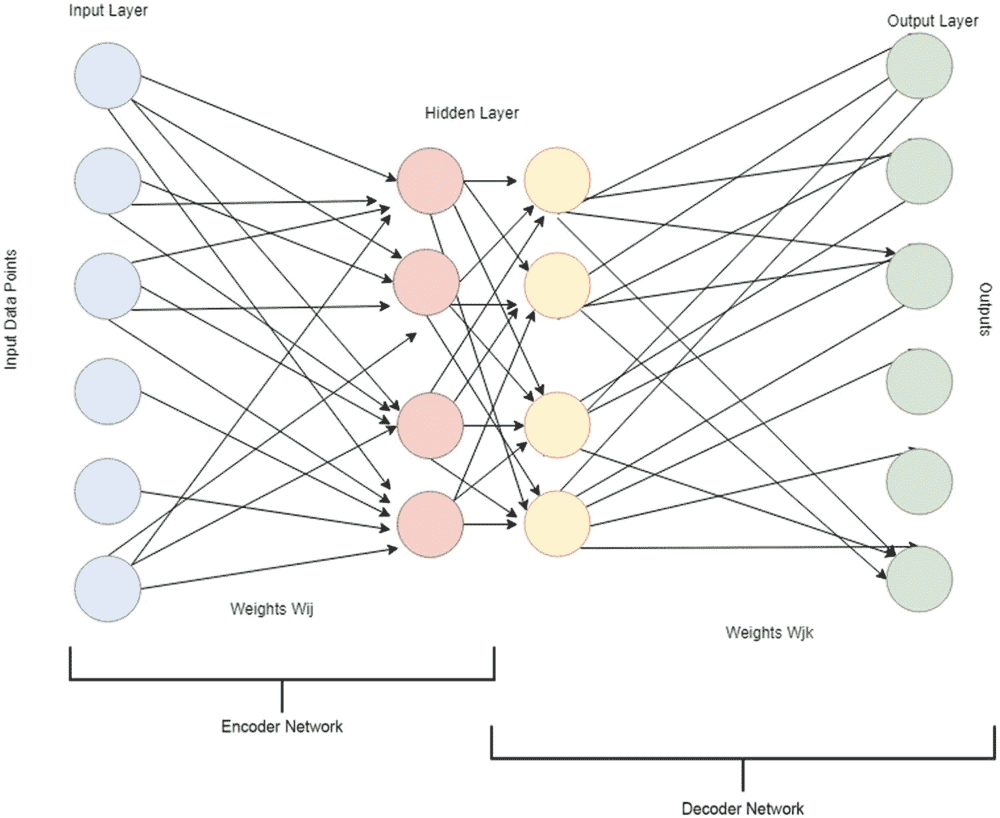
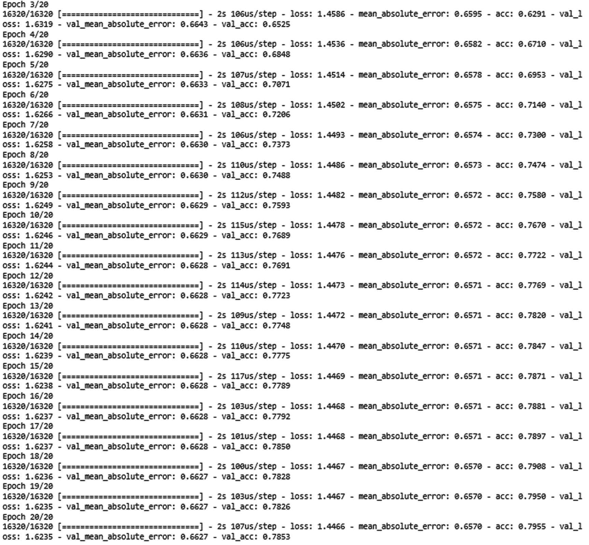
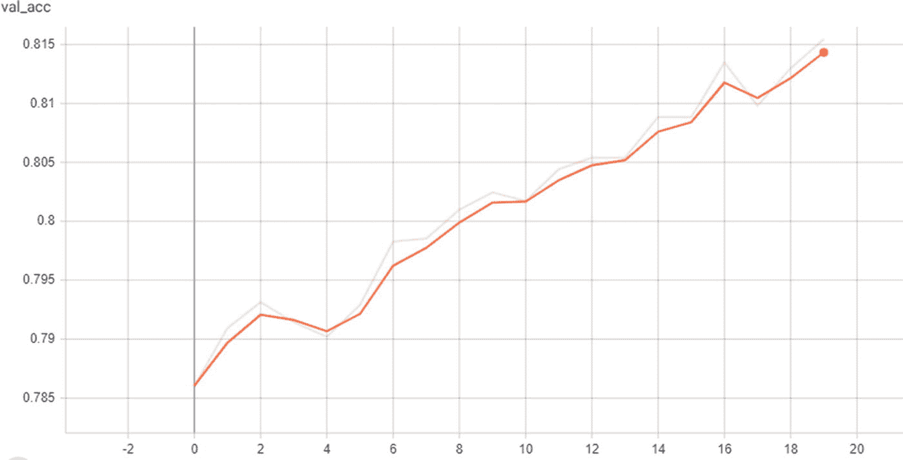
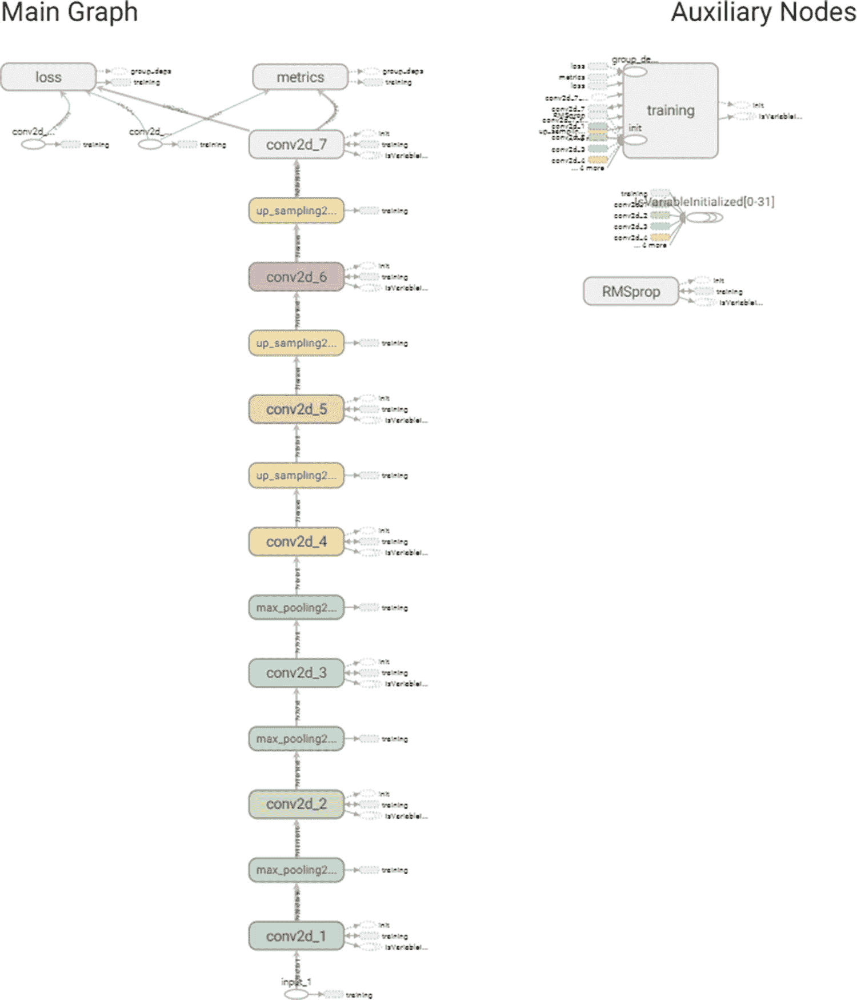
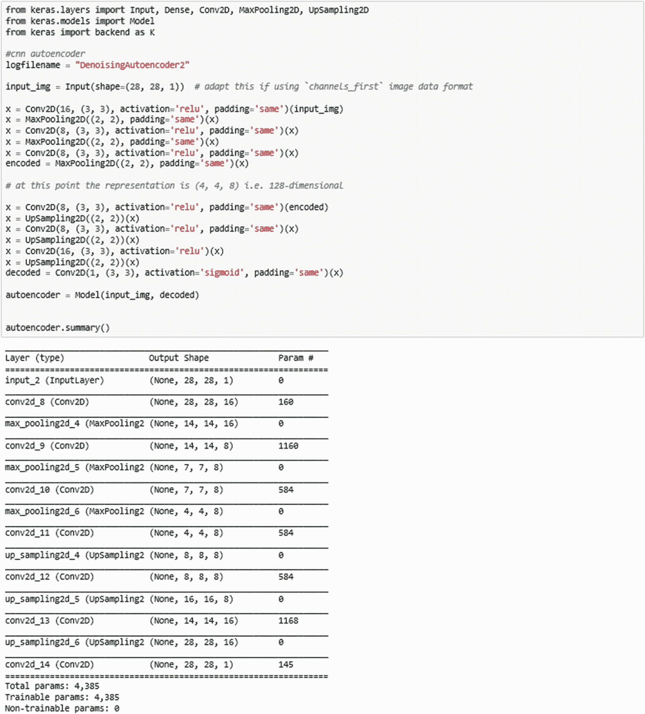
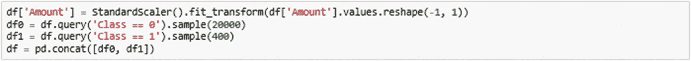
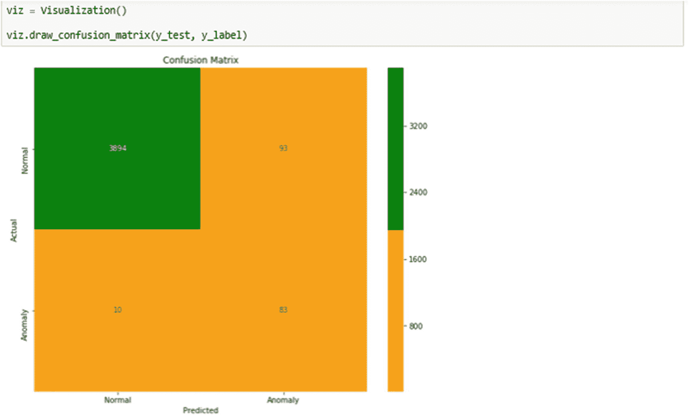

# 四、自编码器

在本章中，您将了解自编码器神经网络和不同类型的自编码器。您还将了解如何使用自编码器来检测异常，以及如何使用自编码器实现异常检测。

简而言之，本章将涵盖以下主题:

*   什么是自编码器？

*   简单的自解压程序

*   稀疏自编码器

*   深度自编码器

*   卷积自编码器

*   降噪自编码器

*   可变自编码器

## 什么是自编码器？

在前一章中，你学习了神经网络的基本功能。基本概念是神经网络本质上计算输入的加权计算来产生输出。输入在输入层，输出在输出层，在输入层和输出层之间有一个或多个隐藏层。反向传播是一种用于训练网络的技术，同时试图调整权重，直到误差最小化。自编码器以一种特殊的方式使用神经网络的这种特性来实现一些非常有效的训练网络的方法，以学习正常行为，从而在异常发生时帮助检测异常。图 [4-1](#Fig1) 显示了一个典型的神经网络。

图 4-1

典型的神经网络

自编码器是神经网络，能够发现高维数据的低维表示，并能够从输出中重建输入。自编码器由两部分神经网络组成，一个编码器和一个解码器。编码器将高维数据集的维度降低到低维，而解码器实质上将低维数据扩展到高维数据。这种过程的目标是试图重建原始输入。如果神经网络是好的，那么很有可能从编码数据中重建原始输入。这一内在原则对于构建异常检测模块至关重要。

请注意，如果您的训练样本在每个输入点包含很少的维度/特征，那么自编码器就没那么好。自编码器在五个或更多维度上表现良好。如果你只有一个维度/特征，你可以想象，你只是在做一个线性变换，这是没有用的。

自编码器在许多用例中非常有用。自编码器的一些流行应用有

1.  训练深度学习网络

2.  压缩

3.  分类

4.  异常检测

5.  生成模型

## 简单的自解压程序

当然，我们将在这一章集中讨论异常检测部分。现在，自编码器神经网络实际上是一对两个相连的子网络，一个编码器和一个解码器。编码器网络接收输入，并将其转换为更小的密集表示，也称为输入的潜在表示，解码器网络可以使用它尽可能将其转换回原始输入。图 [4-2](#Fig2) 显示了带有编码器和解码器子网络的自编码器示例。

图 4-2

自编码器的描述

自编码器使用数据压缩逻辑，其中由神经网络实现的压缩和解压缩功能是有损耗的，并且大多是无监督的，没有太多的干预。图 [4-3](#Fig3) 显示了自编码器的放大图。

图 4-3

自编码器的放大视图

整个网络通常作为一个整体来训练。损失函数通常是输出和输入之间的均方误差或交叉熵，称为*重构损失*，它惩罚网络创建不同于输入的输出。由于编码(只是中间隐藏层的输出)的单位远少于输入，编码器必须选择丢弃信息。编码器学习在有限的编码中尽可能多地保留相关信息，并智能地丢弃不相关的部分。解码器学习采用编码，并将其正确地重建回输入。如果您正在处理图像，则输出是图像。如果输入是音频文件，则输出是音频文件。如果输入是某个要素工程数据集，则输出也将是数据集。在本章中，我们将使用一个信用卡交易示例来说明自编码器。

为什么我们甚至费心去学习原始输入的表示，只是为了尽可能好地重建输出？答案是，当我们的输入具有许多特征时，通过神经网络的隐藏层生成压缩表示可以帮助压缩训练样本的输入。因此，当神经网络遍历所有训练数据并微调所有隐藏层节点的权重时，将会发生的是，权重将真正代表我们通常看到的输入类型。因此，如果我们试图输入一些其他类型的数据，例如带有一些噪声的数据，自编码器网络将能够检测噪声，并在生成输出时至少去除一部分噪声。这真是太棒了，因为现在我们有可能消除噪音，例如，猫和狗的图像。另一个例子是当安全监控摄像机捕捉到模糊不清的图片时，可能是在黑暗中或恶劣天气下，导致图像有噪声。

去噪 autoencoder 背后的逻辑是，如果我们已经在良好、正常的图像上训练了我们的编码器，并且当噪声作为输入的一部分出现时，它实际上不是一个显著的特征，则可以检测并去除这样的噪声。

图 [4-4](#Fig4) 显示了在 Jupyter 笔记本中导入所有必需包的基本代码。请注意各种包的版本。

图 4-4

在 Jupyter 笔记本中导入包

图 [4-5](#Fig5) 显示了在训练时通过混淆矩阵、异常图表和误差图表(预测值和真实值之间的差异)可视化结果的代码。它显示了可视化助手类。

图 4-5

可视化助手

您将使用信用卡数据的示例来检测交易是正常/预期的还是异常/异常的。图 [4-6](#Fig6) 显示了加载到 Pandas 数据帧中的数据。

图 4-6

检查熊猫数据框架

您将收集 20k 个正常记录和 400 个异常记录。您可以选择不同的比率来尝试，但一般来说，更多的正常数据示例会更好，因为您希望教会您的 autoencoder 正常数据是什么样的。训练中过多的异常数据会让自编码器学习到异常其实是正常的，这与你的目标背道而驰。图 [4-7](#Fig7) 显示了对数据帧进行采样并选择大多数正常数据。

图 4-7

对数据帧进行采样并选择大多数正态数据

您将数据帧分割成训练和测试数据集(80-20 分割)。图 [4-8](#Fig8) 显示了将数据分成训练和测试子集的代码。

图 4-8

将数据分成测试集和训练集，使用 20%作为维持测试数据

现在是时候创建一个只有编码器和解码器层的简单神经网络模型了。您将使用编码器将输入信用卡数据集的 29 列编码为 12 个要素。解码器将 12 个特征扩展回 29 个特征。图 [4-9](#Fig9) 显示了创建神经网络的代码。

图 4-9

创建简单的自编码器神经网络

如果你看看图 [4-9](#Fig9) 中的代码，你会看到两个不同的激活函数，分别是 relu 和 softmax。那么它们是什么呢？

**RELU** ，整流线性单元，是深度学习模型中最常用的激活函数。如果接收到任何负输入，函数返回 0，但是对于任何正值`xx`,它返回该值。所以可以写成

f(x)=max(0，x)。

**Softmax** ，Softmax 函数，输出一个向量，表示一系列潜在结果的概率分布。概率总和总是 1。

不用说，有几个可用的激活功能，您可以参考 Keras 文档查看 [`https://keras.io/activations/`](https://keras.io/activations/) 的选项。

现在，使用 RMSprop 作为优化器并使用损失计算的均方误差来编译模型。RMSprop 优化器类似于带有动量的梯度下降算法。度量函数类似于损失函数，只是在训练模型时不使用评估度量的结果。您可以使用任何损失函数作为度量函数，如 [`https://keras.io/losses/`](https://keras.io/losses/) 中所列。图 [4-10](#Fig10) 显示了使用平均绝对误差和准确度作为度量来编译模型的代码。

图 4-10

编译模型

现在，您可以开始使用训练数据集训练模型，以在每一步验证模型。选择 32 作为批次大小，选择 20 个时期。图 [4-11](#Fig11) 显示了训练模型的代码，这是该过程中最耗时的部分。

图 4-11

训练模型

如您所见，训练过程输出损失和准确度，以及每个时期的验证损失和验证准确度。图 [4-12](#Fig12) 显示了训练步骤的输出。

图 4-12

显示培训阶段的进度

图 [4-13](#Fig13) 是 TensorBoard 显示的模型图。

图 4-13

TensorBoard 中显示的模型图

图 [4-14](#Fig14) 显示了在训练过程中通过训练时期的准确度的绘图。

图 4-14

TensorBoard 中显示的精度绘图

图 [4-15](#Fig15) 显示了训练过程中各训练时期的 mae(平均绝对误差)图。

图 4-15

在 TensorBoard 中显示 mae 的绘图

图 [4-16](#Fig16) 显示了训练过程中通过训练时期的损失图。

图 4-16

张量板上显示的损耗图

图 [4-17](#Fig17) 显示了在训练过程中通过训练时期的验证准确度的绘图。

图 4-17

在 TensorBoard 中显示验证精度的绘图

图 [4-18](#Fig18) 显示了在培训过程中通过培训时期的验证损失图。

图 4-18

TensorBoard 中显示的验证损失绘图

现在，训练过程已经完成，让我们评估模型的损失和准确性。图 [4-19](#Fig19) 显示精度为 0.81，相当不错。它还显示了评估模型的代码。

图 4-19

评估模型的代码

下一步是计算误差，检测并绘制异常和误差。选择阈值 10。图 [4-20](#Fig20) 显示了基于该阈值测量异常的代码。

图 4-20

基于阈值测量异常的代码

让我们更深入地研究上面显示的代码，因为当您将数据点分类为异常或正常时，这将贯穿本章。如您所见，这是基于一个称为阈值的特殊参数。您只需查看误差(实际值和预测值之间的差异)并将其与阈值进行比较。首先，计算 threshold = 10 的精度和召回率。图 [4-21a](#Fig21) 显示了显示精度和召回的代码。

图 4-21a

显示精度和召回的代码

让我们也计算一下阈值= 1，5，15。参见图 [4-21b](#Fig22) 、 [4-21c](#Fig23) 和 [4-21d](#Fig24) 。

阈值= 1.0

图 4-21b

显示 threshold = 1.0 的精度和召回率的代码

阈值= 5.0

图 4-21c

显示 threshold = 5.0 的精度和召回率的代码

阈值= 15.0

图 4-21d

显示 threshold = 15.0 的精度和召回率的代码

如果您观察这四个分类报告，您可以看到 threshold = 1 或 5 的 precision 和 recall 列并不好(注意第 0 行和第 1 行中 precision 和 recall 的值非常低)。阈值= 10 或 15 时，它们看起来更好。事实上，threshold = 10 看起来很不错，召回率也很高，精确度也比 threshold = 1 或 5 高。

在这种模型和其他模型中，选择阈值是一个实验问题，并且会根据被训练的数据而变化。

计算 AUC(曲线下面积，0.0 至 1.0)，得出 0.86。图 [4-21e](#Fig25) 显示了显示 AUC 的代码。

图 4-21e

显示 AUC 的代码

现在，您可以可视化混淆矩阵，看看您对模型的处理有多好。图 [4-22](#Fig26) 显示了混淆矩阵。

图 4-22

混淆矩阵

现在，使用标签(正常或异常)的预测，您可以绘制与正常数据点相比较的异常。图 [4-23](#Fig27) 显示了基于阈值的异常。

图 4-23

基于阈值的异常

## 稀疏自编码器

在上面的简单自编码器的例子中，表示只受隐藏层(12)大小的限制。在这种情况下，通常发生的是隐藏层正在学习 PCA(主成分分析)的近似。但是，另一种将表示约束为紧凑的方法是对隐藏表示的活动添加稀疏性约束，因此在给定时间内会触发更少的单元。在 Keras 中，这可以通过添加一个`activity_regularizer`到你的`dense`层来实现。

简单和稀疏自编码器之间的差异主要是由于在训练期间正则化项被添加到损失中。

您将使用与上面简单的 autoencoder 示例中相同的信用卡数据集。您将使用信用卡数据来检测交易是正常/预期还是异常/异常。下面显示的是加载到 Pandas 数据帧中的数据。

然后，你会收集到 20k 个正常和 400 个异常记录。您可以选择不同的比率来尝试，但一般来说，更多的正常数据示例会更好，因为您希望教会您的 autoencoder 正常数据是什么样的。训练中过多的异常数据会让自编码器学习到异常其实是正常的，这与你的目标背道而驰。将数据帧分割成训练和测试数据集(80-20 分割)。

现在是时候创建一个只有编码器和解码器层的神经网络模型了。您将使用编码器将输入信用卡数据集的 29 列编码为 12 个要素。解码器会将 12 个特征扩展回 29 个特征。与简单的自编码器相比，关键的区别在于活动正则化器适应稀疏自编码器。图 [4-24](#Fig28) 显示了创建神经网络的代码。

图 4-24

创建神经网络的代码

图 [4-25](#Fig29) 显示了 TensorBoard 可视化的模型图形。

图 4-25

TensorBoard 创建的模型图

## 深度自编码器

你不必把自己限制在一个单独的层上作为编码器或解码器；你可以用一堆层。使用太多的隐藏层不是一个好主意，多少层取决于用例，所以你必须用它来寻求最佳的层数和压缩。

唯一真正改变的是层数。下面显示的是简单的多层自编码器。

您将使用信用卡数据的示例来检测交易是正常/预期的还是异常/异常的。下面显示的是加载到 Pandas dataframe 中的数据。

您将收集 20k 个正常记录和 400 个异常记录。您可以选择不同的比率来尝试，但一般来说，更多的正常数据示例会更好，因为您希望教会您的 autoencoder 正常数据是什么样的。训练中过多的异常数据会让自编码器学习到异常其实是正常的，这与你的目标背道而驰。将数据帧分割成训练和测试数据集(80-20 分割)。

现在是时候创建一个深度神经网络模型，其中三层用于编码器层，三层作为解码器层的一部分。您将使用编码器将输入信用卡数据集的 29 列编码为 16、8 和 4 个要素。解码器将 4 扩展回 8，然后 16，最后 29 个特征。图 [4-26](#Fig30) 显示了创建神经网络的代码。

图 4-26

创建神经网络的代码

图 [4-27](#Fig31) 显示了 TensorBoard 可视化的模型图形。

图 4-27

TensorBoard 中显示的模型图

## 卷积自编码器

每当输入图像时，使用卷积神经网络(convnets 或 CNN)作为编码器和解码器是有意义的。在实际设置中，应用于图像的自编码器总是卷积自编码器，因为它们的性能更好。

我们来实现一个。编码器将由一堆`Conv2D`和`MaxPooling2D`层组成(最大池用于空间下采样)，而解码器将由一堆`Conv2D`和`UpSampling2D`层组成。

图 [4-28](#Fig32) 显示了在 Jupyter 笔记本中导入所有必需包的基本代码。还要注意各种包的版本。

图 4-28

在 jupiter 笔记本中导入包

为此，您将使用 mnist 图像数据集。Mnist 包含数字 0 到 9 的图像，用于许多不同的用例。图 [4-29](#Fig33) 显示了加载 MNIST 数据的代码。

图 4-29

加载 MNIST 数据的代码

将数据集分成训练和测试子集。您还必须将数据整形为 28X28 的图像。图 [4-30](#Fig34) 显示了转换来自 MNIST 的图像的代码。

图 4-30

转换 MNIST 图像的代码

用卷积和 MaxPool 层创建一个 CNN 模型。图 [4-31](#Fig35) 显示了创建神经网络的代码。

图 4-31

创建神经网络的代码

使用 RMSprop 作为优化器并使用损失计算的均方误差来编译模型。RMSprop 优化器类似于带有动量的梯度下降算法。图 [4-32](#Fig36) 显示了编译模型的代码。

图 4-32

编译模型的代码

现在，您可以开始使用训练数据集训练模型，同时使用验证数据集在每一步验证模型。选择 32 作为批次大小，选择 20 个时期。训练过程输出每个时期的损失和精度以及验证损失和验证精度。图 [4-33](#Fig37) 显示正在训练的模型。

图 4-33

被训练的模型

现在，训练过程已经完成，让我们评估模型的损失和准确性。图 [4-34](#Fig38) 显示精度为 0.81，相当不错。它还显示了评估模型的代码。

图 4-34

评估模型的代码

下一步是使用模型为测试子集生成输出图像。这将显示重建阶段进展如何。图 [4-35](#Fig39) 显示了基于模型进行预测的代码。

图 4-35

基于模型进行预测的代码

您还可以通过显示这个阶段中的测试子集图像来了解编码器阶段是如何工作的。图 [4-36](#Fig40) 显示了显示编码图像的代码。

图 4-36

显示编码图像的代码

图 [4-37](#Fig41) 显示了 TensorBoard 可视化的模型图形。

图 4-37

在张量板上显示的模型图

图 [4-38](#Fig42) 显示了在训练过程中通过训练时期的准确度的绘图。

图 4-38

TensorBoard 中显示的精度绘图

图 [4-39](#Fig43) 显示了训练过程中各训练时期的损失图。

图 4-39

张量板上显示的损耗图

图 [4-40](#Fig44) 显示了在训练过程中通过训练时期的验证准确度的绘图。

图 4-40

在 TensorBoard 中显示验证精度的绘图

图 [4-41](#Fig45) 显示了在培训过程中通过培训时期的验证损失图。

图 4-41

TensorBoard 中显示的验证损失绘图

## 降噪自编码器

您可以通过向输入中添加随机噪声并使其恢复原始无噪声数据，来强制自编码器学习有用的功能。这样，自编码器不能简单地将输入复制到其输出，因为输入也包含随机噪声。自编码器将消除噪声并产生有意义的数据。这被称为去噪自编码器*。*图 [4-42](#Fig46) 显示了去噪自编码器的描述。

图 4-42

去噪自编码器的描述

另一个例子是安全监控摄像机捕捉到某种模糊不清的图像，可能是在黑暗中或恶劣天气下，导致图像嘈杂。

去噪 autoencoder 背后的逻辑是，如果您已经在良好的正常图像上训练了您的编码器，并且当噪声作为输入的一部分出现时，它实际上不是一个显著的特征，则可以检测并移除此类噪声。

图 [4-43](#Fig47) 显示了导入所有必需包的基本代码。还要注意各种包的版本。

图 4-43

导入包的代码

为此，您将使用 mnist 图像数据集。Mnist 包含数字 0 到 9 的图像，用于许多不同的用例。图 [4-44](#Fig48) 显示了加载 MNIST 图像的代码。

图 4-44

加载 MNIST 图像的代码

将数据集分成训练和测试子集。此外，将数据整形为 28X28 的图像。图 [4-45](#Fig49) 显示了加载和整形图像的代码。

图 4-45

加载和整形图像的代码

图 [4-46](#Fig50) 显示了显示图像的代码。

图 4-46

显示图像的代码

用卷积和 MaxPool 层创建一个 CNN 模型。图 [4-47](#Fig51) 显示了创建神经网络的代码。

图 4-47

创建神经网络的代码

使用 RMSprop 作为优化器并使用损失计算的均方误差来编译模型。RMSprop 优化器类似于带有动量的梯度下降算法。图 [4-48](#Fig52) 显示了编译模型的代码。

图 4-48

编译模型的代码

现在，您可以开始使用训练数据集训练模型，以在每一步验证模型。选择 32 作为批次大小，选择 20 个时期。训练过程输出每个时期的损失和精度以及验证损失和验证精度。图 [4-49](#Fig53) 显示了开始训练模型的代码。

图 4-49

开始训练模型的代码

现在，训练过程已经完成，让我们评估模型的损失和准确性。图 [4-50](#Fig54) 显示精度为 0.81，相当不错。它还显示了评估模型的代码。

图 4-50

评估模型的代码

下一步是使用模型为测试子集生成输出图像。这将向您展示重建阶段的进展情况。图 [4-51](#Fig55) 显示了显示去噪图像的代码。

图 4-51

显示去噪图像的代码

您还可以通过显示这个阶段中的测试子集图像来了解编码器阶段是如何工作的。图 [4-52](#Fig56) 显示了显示编码图像的代码。

图 4-52

显示编码图像的代码

图 [4-53](#Fig57) 显示了 TensorBoard 可视化的模型图形。

图 4-53

TensorBoard 中显示的模型图

图 [4-54](#Fig58) 显示了在训练过程中通过训练时期的准确度的绘图。

图 4-54

TensorBoard 中显示的精度绘图

图 [4-55](#Fig59) 显示了训练过程中各训练时期的损失图。

图 4-55

张量板上显示的损耗图

图 [4-56](#Fig60) 显示了在训练过程中通过训练时期的验证准确度的绘图。

图 4-56

在 TensorBoard 中显示验证精度的绘图

图 [4-57](#Fig61) 显示了在培训过程中通过培训时期的验证损失图。

图 4-57

TensorBoard 中显示的验证损失绘图

## 可变自编码器

变分自编码器是一种对正在学习的编码表示增加了约束的自编码器。更准确地说，它是一个为其输入数据学习一个`latent variable model`的自编码器。因此，你不是让你的神经网络学习一个任意的函数，而是学习一个模拟你的数据的概率分布的参数。如果对此分布中的点进行采样，则可以生成新的输入数据样本。这就是为什么变分自编码器被认为是生成模型的原因。

本质上，VAEs 试图确保来自一些已知概率分布的编码可以被解码以产生合理的输出，**，即使它们不是实际图像的编码**。

在许多真实世界的用例中，我们有一大堆我们正在查看的数据(可能是图像，可能是音频或文本；嗯，它可能是任何东西)但需要处理的底层数据可能比实际数据的维度更低，所以许多机器学习模型都涉及某种程度的维度缩减。一种非常流行的技术是奇异值分解或主成分分析。类似地，在深度学习空间中，变分自编码器执行降低维度的任务。

在我们深入变型自编码器的机制之前，让我们回顾一下你在本章中看到的普通自编码器。自编码器基本上至少使用编码器和解码器层来将输入数据特征减少到编码器层的潜在表示中。解码器扩展潜在表示以生成输出，目标是训练模型足够好以将输入再现为输出。输入和输出之间的任何差异都可能意味着某种异常行为或与正常情况的偏离，也称为异常检测。在某种程度上，输出被压缩成一个更小的表示，但是比输入的维数更小，这就是我们所说的瓶颈。从瓶颈开始，我们尝试重建输入。

现在你已经有了普通自编码器的基本概念，让我们看看变化的自编码器。在变型自编码器中，我们不是将输入映射到固定向量，而是将输入映射到分布，因此最大的区别是，通过查看分布，然后将采样的潜在向量作为实际瓶颈，以季度为单位的正常顺序中看到的瓶颈向量被均值向量和标准差向量所取代。显然，这与普通的自编码器非常不同，在普通的自编码器中，输入直接产生一个潜在向量。

首先，一个编码器网络将输入样本`x`转化为潜在空间中的两个参数，你可以称之为`z_mean`和`z_log_sigma`。然后，从假设生成数据的潜在正态分布`via z = z_mean + exp(z_log_sigma) * epsilon`中随机抽取相似点`z`，其中`epsilon`是随机正态张量。最后，解码器网络将这些潜在空间点映射回原始输入数据。图 [4-58](#Fig62) 描述了变分编码器神经网络。

图 4-58

变分编码神经网络

该模型的参数通过两个损失函数来训练:迫使解码样本匹配初始输入的重建损失(就像在先前的自编码器中一样)，以及学习的潜在分布和先前分布之间的 KL 散度，作为正则化项。您实际上可以完全摆脱后一项，尽管它确实有助于学习结构良好的潜在空间，并减少对训练数据的过度拟合。

你正在学习的分布离正态分布并不太远，所以你要努力使你的潜在分布相对接近于零的均值和一的标准差，所以在你训练你的变分自编码器之前，你必须考虑到可能会发生的采样问题。因为你只是从平均向量和标准偏差中抽取一个样本，所以很难实现反向传播。你对它进行采样，那么你如何在反向传播步骤中返回？

变分自编码器是一种神经网络和图形模型的混合，因为关于变分自编码器的第一篇论文试图创建图形模型，然后将图形模型转化为神经网络。变分自编码器基于变分推理。

假设有两个不同的分布，p 和 q，并且您可以使用 KL 散度来显示两个分布，p 和 q 之间的不相似性。因此，KL 散度用作两个分布，p 和 q 之间的相似性的度量。

理解对可变自编码器的需求的最佳方式是，在通用自编码器中，瓶颈过于依赖于输入，并且没有对数据性质的理解。因为您使用的是分布的抽样，所以您将能够更好地使模型适应新的数据类型。

图 [4-59](#Fig63) 显示了在 Jupyter 中导入所有必需包的基本代码。还要注意各种必需包的版本。

图 4-59

在 Jupyter 中导入包的代码

图 [4-60](#Fig64) 显示了在训练时通过混淆矩阵、异常图表和误差图表(预测值和真实值之间的差异)来可视化结果的代码。

图 4-60

可视化结果的代码

您将使用信用卡数据的示例来检测交易是正常/预期的还是异常/异常的。图 [4-61](#Fig65) 显示了加载到 Pandas 数据帧中的数据。

图 4-61

使用 Pandas 加载数据集的代码

您将收集 20k 个正常记录和 400 个异常记录。您可以选择不同的比率来尝试，但一般来说，更多的正常数据示例会更好，因为您希望教会您的 autoencoder 正常数据是什么样的。训练中过多的异常数据会训练自编码器学习异常实际上是正常的，这与你的目标背道而驰。图 [4-62](#Fig66) 显示了取大多数正常数据记录和少数异常记录的代码。

图 4-62

代码取大部分正常数据记录和少数异常记录

将数据帧分割成训练和测试数据集(80-20 分割)。图 [4-63](#Fig67) 显示了将数据分成训练和测试子集的代码。

图 4-63

将数据分成训练和测试子集的代码

到目前为止，你所看到的标准自编码器和变化的自编码器之间的最大区别是，这里你不仅仅是按原样接受输入；相反，您获取输入数据的分布，然后对该分布进行采样。图 [4-64](#Fig68) 显示了实现这种采样策略的代码。

图 4-64

对分布进行采样的代码

现在是时候用编码器和解码器阶段创建一个简单的神经网络模型了。您将使用编码器将输入信用卡数据集的 29 列编码为 12 个要素。编码器使用特殊的分布采样逻辑生成两个平行层，然后将采样输出(如上)包装为层对象。

解码器阶段使用该潜在向量并重构输入。在这样做的同时，它还测量重建的误差，以便将其最小化。图 [4-65](#Fig69) 显示了创建神经网络的代码。

图 4-65

创建神经网络的代码

图 [4-66](#Fig70) 显示了显示神经网络的代码。

图 4-66

显示神经网络的代码

使用 adam 作为优化器和损失计算的均方误差来编译模型。Adam 是一种优化算法，可以用来代替经典的随机梯度下降过程，以基于训练数据迭代地更新网络权重。图 [4-67](#Fig71) 显示了编译模型的代码。

图 4-67

编译模型的代码

现在，您可以开始使用训练数据集训练模型，以在每一步验证模型。选择 32 作为批次大小，选择 20 个时期。训练过程输出每个时期的损失和精度以及验证损失和验证精度。图 [4-68](#Fig72) 显示了训练模型的代码。

图 4-68

为模型定型的代码

现在，训练过程已经完成，让我们评估模型的损失和准确性。图 [4-69](#Fig73) 显示精度为 0.23。它还显示了评估模型的代码。

图 4-69

评估模型的代码

下一步是计算误差，检测并绘制异常和误差。选择阈值 10。图 [4-70](#Fig74) 显示了根据阈值预测异常的代码。

图 4-70

基于阈值预测异常的代码

计算 AUC(曲线下面积 0.0 至 1.0)；结果是 0.93，非常高。图 [4-71](#Fig75) 显示了计算 AUC 的代码。

图 4-71

计算 AUC 的代码

现在，您可以可视化混淆矩阵，看看您对模型的处理有多好。图 [4-72](#Fig76) 显示了显示混淆矩阵的代码。

图 4-72

显示混淆矩阵的代码

使用标签(正常或异常)的预测，您可以绘制与正常数据点相比较的异常。图 [4-73](#Fig77) 显示了相对于阈值的异常。

图 4-73

显示相对于阈值的异常

图 [4-74](#Fig78) 显示了 TensorBoard 可视化的模型图形。

图 4-74

TensorBoard 中显示的模型图

图 [4-75](#Fig79) 显示了 TensorBoard 可视化的模型图形。

图 4-75

TensorBoard 中显示的模型图

图 [4-76](#Fig80) 显示了在训练过程中通过训练时期的准确度的绘图。

图 4-76

TensorBoard 中显示的精度绘图

图 [4-77](#Fig81) 显示了训练过程中各训练时期的损失图。

图 4-77

张量板上显示的损耗图

图 [4-78](#Fig82) 显示了在训练过程中通过训练时期的验证准确度的绘图。

图 4-78

在 TensorBoard 中显示验证精度的绘图

图 [4-79](#Fig83) 显示了在培训过程中通过培训时期的验证损失图。

图 4-79

TensorBoard 中显示的验证损失绘图

## 摘要

在本章中，我们讨论了自编码器，自编码器的类型，以及如何使用它们来构建异常检测引擎。我们研究了实现一个简单的自编码器和稀疏、深度、卷积和去噪自编码器。我们还探索了变分自编码器作为一种手段来检测异常。

在下一章，我们将看看另一种异常检测方法，**波尔兹曼机**。