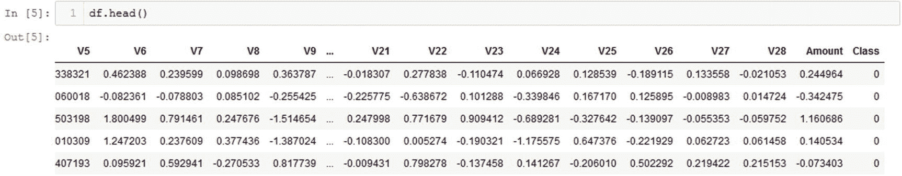

# 5.玻尔兹曼机器

在这一章中，你将学习玻尔兹曼机器，以及如何使用受限玻尔兹曼机器进行异常检测。

简而言之，本章将涵盖以下主题:

*   什么是玻尔兹曼机？

*   受限玻尔兹曼机器

*   RBM 应用

## 什么是玻尔兹曼机？

玻尔兹曼机器是一种特殊类型的双向神经网络，仅由隐藏节点和输入节点组成，旨在学习数据集的概率分布。玻尔兹曼机器的特别之处在于，每个节点都相互连接，这意味着隐藏层中的神经元也相互连接。此外，玻尔兹曼机器有固定的权重，节点做出是否开火的**随机**(概率)决定。

为了更好地理解这个模型，让我们看一下图 [5-1](#Fig1) 中的一个例子。


图 5-1

显示玻尔兹曼机器如何构造的图表。请注意，所有节点都是互连的，即使它们位于同一层

尽管可见节点和隐藏节点有区别，但这在玻尔兹曼机器中无关紧要。在这个模型中，每个节点都与其他每个节点通信，整个模型作为一个系统工作，以创建一个**生成网络**(这意味着它能够根据它通过拟合数据集所学到的东西来生成自己的数据)。在玻尔兹曼机器中，可见的节点是我们可以与之交互的；我们无法与隐藏节点互动。还有一个区别是没有培训过程；这些节点学习尽可能独立地对数据集建模，使玻尔兹曼机器成为一个**无监督的**深度学习模型。

然而，玻尔兹曼机器不一定实用，当网络规模扩大时，它们会遇到问题。玻尔兹曼机器的特定衍生产品，如**受限玻尔兹曼机器(RBM)** **、** **深度玻尔兹曼机器(DBM)** **、**和**深度信念网络(DBN)** 更适合和实用，尽管它们有点过时，并且没有 Keras、TensorFlow 和 PyTorch 等主流框架的支持。尽管如此，它们今天仍然看到了一些新的用途，尽管它们被更新的深度学习模型所掩盖。出于我们的目的，我们将着眼于将 **RBM** 应用于异常检测，特别是因为它是三种玻尔兹曼机器推导中最容易实现的，并且因为当我们考虑数学(仍处于高级水平)时，它更容易工作。

## 受限玻尔兹曼机(RBM)

**RBM** 类似于玻尔兹曼机器，因为它是一种无监督的、随机的(概率性的)、生成式深度学习模型。然而，一个关键的区别是 RBM 仅由两层组成:输入层和隐藏层。它的架构类似于你在第三章[中探索的人工神经网络模型，RBM 层看起来就像人工神经网络的前两层。因为我们在层上设置了一个限制，即在它们自己的层中没有节点是互连的，这个模型被称为一个**限制的**玻尔兹曼机器。更具体地说，由于每个节点输出一个二进制值，我们正在处理一个**布尔/伯努利 RBM** 。图](3.html) [5-2](#Fig2) 显示了一个 RBM。


图 5-2

基本受限玻尔兹曼机的可视化表示

我们可以进一步扩展这个模型，以包括偏差(见图 [5-3](#Fig3) )。


图 5-3

受限玻尔兹曼机的可视化表示，其中不同的偏置馈入两层中的每一层

偏置 **a** 添加到输入层的所有输出，偏置 **b** 添加到隐藏层的输出。从这里，我们可以定义所谓的**能量函数**，RBM 试图将其最小化。**能量函数**如图 [5-4](#Fig4) 所示。


图 5-4

定义受限玻尔兹曼机能量函数的公式

第一求和项是偏置 **a** 和可见层 **v** 之间的逐元素乘法，其中每一项 a <sub>i</sub> 与每一项 v <sub>i</sub> 相乘。第二个求和项遵循相同的逻辑，除了使用偏置 **b** 和隐藏层 **h** 的逐元素乘法。最后，最后一个求和项将每个可见节点 v <sub>i</sub> 与每个隐藏节点 h <sub>j</sub> 以及该连接的权重值 w <sub>ij</sub> 相乘。

求和基本上是两个向量之间的逐元素乘法，一个是**转置**，所以 **1xn (1 列 n 行)**，另一个是 **nx1 (n 列 1 行)**。当向量或矩阵被**转置时，**我们反转向量/矩阵的维度并重新排列值。在向量中，行/列中的相同值现在在列/行中。对于矩阵来说，要复杂一点。为了更好地理解**转置**一个向量或矩阵的概念，请参考图 [5-5](#Fig5) 、图 [5-6](#Fig6) 和图 [5-7](#Fig7) 。

**矢量与转置矢量**(图 [5-5](#Fig5) )


图 5-5

原始向量与其转置版本

**方阵与转置方阵**(图 [5-6](#Fig6) )


图 5-6

原始矩阵与其转置自身。请注意这些条目似乎是沿着对角线翻转的

**矩阵(nxm)与转置矩阵(mxn)** (图 [5-7](#Fig7) )6


图 5-7

原始 nxm 矩阵与其转置 mxn 自身。原始矩阵 C 的列成为转置矩阵 C 的行 <sup>T</sup>

重写求和以反映相应向量的乘法，其中一个向量被转置，能量函数等效于图 [5-8](#Fig8) 中的等式。


图 5-8

不用求和写出的能量函数的等价公式

使用能量函数，我们可以定义一个**概率函数**，它将输出网络具有特定 **(v，h)** 的概率。详细说一下 **v** 和 **h** ， **v** 是表示输入层各节点状态的向量， **h** 是表示隐含层各节点状态的向量。

**概率函数**如图 [5-9](#Fig9) 所示，给定一个具体的(v，h)。


图 5-9

与可见层 v 和隐藏层 h 相关联的概率函数

z 的定义如图 [5-10](#Fig10) 所示。


图 5-10

z 对数据集中每个可能的 v 和 h 执行运算，所以你可以看到它是如何形成概率函数的。(假设您想要一副牌中所有红心的概率。这是 13/52，13 是所有的红心，52 是牌的总数。)

z 是函数*E*<sup>—*E*(*v*， *h* )</sup> 在每一对输入和隐藏层状态向量(表示层状态的向量)上的和。传递到 p(v，h)中的参数应该是表示两层的特定配置的向量，这两层的特定配置与激活的神经元有关。

你可以看到这是如何形成一个概率函数的，因为我们想找出*E*<sup>—*E*(*v*， *h* )</sup> 对于某些 **v** ， **h** 超过了*E*<sup>—*E*(*v*， *h* )</sup>

我们可以更进一步，在给定 **h** 或 **v** 的情况下，定义 **v** 或 **h** 的概率公式(见图 [5-11](#Fig11) 和图 [5-12](#Fig12) )。


图 5-12

给定可见层处于状态 h，隐藏层处于状态 v 的概率公式


图 5-11

已知可见层处于状态 v，隐藏层处于状态 h 的概率公式

π的工作原理与σ类似，只是用乘法代替加法。本质上，p(h | v)是存在的每个 p(h <sub>i</sub> ，v)的乘积。在这些情况下， **m** 是隐藏节点的数量， **n** 是可见节点的数量。

这可能有点复杂，所以只需知道图 [5-11](#Fig11) 和 [5-12](#Fig12) 中的公式基本上是在给定各自的 **h** 或 **v** 层副本的情况下，找出 **v** 或 **h** 处于其状态的概率。

由此，我们可以定义另外两个关于特定节点 v <sub>i</sub> 或 h <sub>j</sub> 激活的概率的公式，分别给定向量 h 或 v(见图 [5-13](#Fig13) 和图 [5-14](#Fig14) )。


图 5-14

给定 h <sub>j</sub> 和添加了偏差的每个单个可见节点之间的权重的乘积，一个特定节点 h <sub>j</sub> 激活的概率


图 5-13

给定 v <sub>i</sub> 和添加了偏差的每个单个隐藏节点之间的权重的乘积，一个特定节点 v <sub>i</sub> 激活的概率

*σ* 代表 sigmoid 函数，由图 [5-15](#Fig15) 中的公式定义。


图 5-15

sigmoid 函数的公式

最后，给定训练输入，我们希望最大化输入的联合概率，由图 [5-16](#Fig16) 中的公式给出。


图 5-16

我们最大化每个可能的可见节点(输入)相对于权重的联合概率

本质上，给定所有可能的训练输入的集合 **V，**，对于每个可能的 **v** ，我们将最终得到 p( **v** )的巨大乘法链。我们取这个值，并且我们想要最大化关于权重 **W** 的乘积，所以我们想要权重增加联合概率(所有可能的 **v** 层的乘积)。

我们也可以根据最大化对数概率的期望值来重写，如图 [5-17](#Fig17) 所示。


图 5-17

我们取一些 V 的 p(v)的对数，这些 V 是整个训练集 ***V*** 的一部分。然后我们将这些项相加(回想一下对数规则)并找出它们的平均值。这就是我们想要最大化的权重 ***W***

符号 E [ ]代表**期望值**。在概率中，E(X)是某个随机变量 X 的期望值，可以认为是**均值**。在我们的例子中，我们试图最大化对数概率的平均值。再次， **V** 是所有训练输入的集合。

因此，为了解释公式的含义，我们使用对数规则将联合概率改写为总和，然后我们寻求相对于权重 **W** 最大化该总和的平均值。我们希望调整权重，以便继续最大化整个训练集中每个输入的期望值。

与 RBM 相关的公式可能会变得更加复杂和详细，但是到目前为止列出的公式应该足以帮助您很好地理解 RBM 是什么以及它是如何工作的。在其核心，RBM 是一个概率模型，按照一套公式运行。此外，公式的目标是帮助 RBM 学习表示 V 的概率分布，解释为什么 RBM 是一种**无监督学习**算法。

至于训练算法，有两种选择:**对比发散(CD)** 和**持续对比发散(PCD)** 。这些算法都使用马尔可夫链来帮助训练算法确定执行梯度计算的方向，但两者都有所不同，各有利弊。PCD 可以获得更好的数据样本，并更好地探索输入空间的域，但 CD 更擅长提取特征。

一些 RBM 可能还包含一个称为 **momentum** 的特性，它基本上允许提高学习速度，并可以被认为是模拟一个球从山上滚下来，以优化目标函数。(回想一下梯度下降以及目标是如何达到局部最小值。当“球”滚向最小值时，它获得“动量”并越来越快地下降。一旦它超调，它将获得相反方向的新动力，激励它更快地达到最小值)。

RBM 有更多的复杂性，但最终，您只需要知道 RBM 可用于创建输入数据的概率分布。我们将利用 RBMs 的这一特性，通过检查特定样本出现的概率来挑出异常。

### RBM 信用卡数据集的异常检测

现在，您对 RBM 的复杂机制有了更多的了解，让我们将 RBM 应用于一个数据集，看看它的表现如何。对于您的应用程序，让我们使用信用卡数据集，它可以在 [`www.kaggle.com/mlg-ulb/creditcardfraud/version/3`](http://www.kaggle.com/mlg-ulb/creditcardfraud/version/3) 找到。

从导入所有的包开始。对于这个应用程序，您将只探索如何将 RBM 应用于代码，因为源代码相当大。但是，您可以通过 [`https://github.com/aaxwaz/Fraud-detection-using-deep-learning`](https://github.com/aaxwaz/Fraud-detection-using-deep-learning) 的 GitHub 链接访问源代码。

只需下载名为`rbm`的文件夹，并将其放在您的工作目录中(任何您有笔记本文件或 Python 文件的地方)。在本例中，我们放置在一个名为`boltzmann_machines`的文件夹中。

现在，导入您的模块(参见图 [5-18](#Fig18) )。


图 5-18

导入您需要的所有模块。%matplotlib inline 将图形保存在 Jupyter 笔记本本身中

接下来，导入数据集。

运行以下程序(输出参见图 [5-19](#Fig19) ):


图 5-19

可视化您刚刚加载的数据集。该图向右滚动以显示类别

```py
df = pd.read_csv("datasets/creditcardfraud/creditcard.csv", sep=",", index_col=None, encoding="utf-8-sig")

```

查看数据，似乎需要对列中的值(数量，尤其是时间)进行规范化。看看时间的值有多大(见图 [5-20](#Fig20) )。


图 5-20

查看数据帧的末尾(底部的五个条目)，时间的值明显变得巨大。您必须解决这个问题，以便训练 RBM，并确保训练过程顺利进行和正常工作。像这样的大值会破坏整个过程，甚至导致不收敛

为了避免这些数字可能会破坏训练过程，您应该将这两列的值标准化。其他一切似乎都已经标准化了，所以您应该只担心这些列。运行图 [5-21](#Fig21) 中的代码。


图 5-21

标准化“数量”和“时间”列中的值

现在让我们来看看这些值是如何被转换的(见图 [5-22](#Fig22) 和图 [5-23](#Fig23) )。


图 5-23

查看时间列的值，了解它们是如何标准化的



图 5-22

查看列 Amount 的值，了解它们是如何标准化的

牛逼；看起来好多了。现在，您可以定义您的训练和测试数据集(参见图 [5-24](#Fig24) )。


图 5-24

由于 RBM 模型对输入的预期不同，这是一个不同于通常的过程

您应该会看到类似图 [5-25](#Fig25) 的输出。


图 5-25

训练集和测试集的输出形状

进入模型本身，使用图 [5-26](#Fig26) 中的代码。


图 5-26

用一组参数初始化模型

这些参数如下:

*   **num_visible** :可见图层中的节点数

*   **num_hidden** :隐藏层的节点数

*   **visible_unit_type** :如果可视单位是二进制或高斯类型

*   **main_dir** :存放模型的主目录，存放数据和汇总的目录

*   **型号名称**:保存时使用的型号名称

*   **gibbs_sampling_steps** :(可选)默认值为 1。

*   **learning_rate** :(可选)设置为默认值 0.01。指定学习率。

*   **动量:**用于梯度下降的动量值。默认值为 0.9。

*   **L2**:L2-重量衰减。默认值为 0.001。

*   **batch_size** :(可选)默认为 10。

*   **num_epochs** :(可选)默认值为 10。

*   **stddev** :(可选)默认值为 0.1。如果 visible_unit_type 不是 gauss，则忽略。

*   **详细**:(可选)默认值为 0。值 1 显示输出，值 0 不显示任何内容。

*   **plot_training_loss** :是否绘制培训损失。默认值为 True。

现在，您可以将数据拟合到模型中。运行以下程序(输出参见图 [5-27](#Fig27) ):


图 5-27

训练模型的输出

```py
model.fit(x_train, validation_set=x_test)

```

现在您已经完成了培训，您可以开始评估您的模型了。要获得测试集中每个条目的概率值，您必须计算每个数据点的自由能(这是这个版本的 RBM 独有的功能)。从那里，你可以得到每个数据点出现的概率，给定它的自由能。运行图 [5-28](#Fig28) 中的代码。


图 5-28

从测试集中获取成本并从中获取 AUC 分数的代码

输出应该如图 [5-29](#Fig29) 所示。


图 5-29

AUC 分数最终为 95.84%

考虑到 RBM 看似简单的架构(与神经网络相比，模型中的节点非常少)，这是一个非常好的 AUC 分数！

您还可以绘制每个数据点的自由能与概率的关系图，以了解异常点与正常数据点相比的情况。在此之前，让我们检查每个数据集的五个数字摘要，以了解它们是如何分布的。

图 [5-30](#Fig30) 显示了正常数据五位数汇总的代码。


图 5-30

用于检查正常数据的五位数汇总的代码

输出应该看起来有点像图 [5-31](#Fig31) 。


图 5-31

五个数字的汇总显示，正态数据是右偏的，因为每个四分位数的值都是负值，而尾部的异常值使平均值变为正值

现在让我们检查异常的五个数摘要(见图 [5-32](#Fig32) )。


图 5-32

检查五位数汇总异常的代码

输出应该看起来有点像图 [5-33](#Fig33) 。


图 5-33

从数据来看，似乎所有的异常值都低于 250。了解这一点后，您现在可以选择一个阈值，以便在图表上只显示相关的数据

知道了数据的一般分布，您可以选择一个阈值，以便在图表上只显示相关的数据。您知道大多数正态数据位于零值附近，因此离群值与您无关，因为它们不会显示在图表上(与零值附近的数万个值相比，20，000 的几个值不会显示)。

所以让我们选择 250 作为截止点，因为异常的最大自由能大约是 232。图 [5-34](#Fig34) 显示了测试集的自由能与概率的关系图。


图 5-34

绘制与`x_test`相关的自由能和相应概率的代码

图 [5-35](#Fig35) 显示了代码。


图 5-35

绘制数据点自由能及其概率的代码

输出图形如图 [5-36](#Fig36) 所示。


图 5-36

自由能与成本低于 500 的测试集中正常和异常数据点的概率的关系图

图表会根据数据点的自由能，自动绘制出这些数据点的概率，但这并没有让你看得很清楚。计算概率的方式对应于这行代码:

```py
probs = costs / np.sum(costs)

```

这实质上是用个体的自由能，除以与整个集合相关的总自由能。

RBM 似乎已经很好地了解了分布，您可以看到正常值和异常值之间非常清晰的分离，尽管有一点重叠。无论如何，RBM 在信用卡数据集上表现相当好，AUC 为 95.84%。

### 用 RBM - KDDCUP 数据集进行异常检测

还记得你在第 [2](2.html) 章看到的 KDDCUP 数据集吗？让我们试着把 RBM 也应用到它上面。该应用程序将是与上一个示例类似的过程，但不是处理数据集中过大的值，而是学习如何处理包含大量零条目的数据。

同样，首先导入所有必要的模块(参见图 [5-37](#Fig37) )。


图 5-37

导入必要的模块

接下来，您需要导入您的数据集。因为你以前用过它，你不必做`df.head()`或打印出形状，但它仍然有助于了解数据集的样子(见图 [5-38](#Fig38) )。


图 5-38

定义列和加载数据集

输出如图 [5-39](#Fig39) 所示。


图 5-39

请注意，需要处理分类标签，并且每个数据条目有大量的列

正如在第 [2](2.html) 章中，您只想关注 HTTP 攻击，所以让我们过滤数据帧以仅包括它们(参见图 [5-40](#Fig40) )。


图 5-40

过滤所有条目，仅包含 HTTP 攻击，并从数据帧中删除服务列

新的输出如图 [5-41](#Fig41) 所示。


图 5-41

这些列只包含 HTTP 攻击。这里你可以看到数据帧的尾端

提醒一下，`df.tail()`执行与`df.head()`相同的功能，但是从下往上显示条目，而不是从上往下。此外，您可以在括号中传递一个参数来指示您想要查看的行数。

你不希望数据中的值是字符串，所以你必须使用第 [2](2.html) 章中的标签编码器(见图 [5-42](#Fig42) )。


图 5-42

对数据框中的分类值使用标注编码器

新的输出如图 [5-43](#Fig43) 所示。


图 5-43

输出显示新数据框，其中分类值被转换为整数等价标注

在这个数据集中，正常数据条目占数据条目的绝大部分，几乎淹没了异常数据。不仅如此，您还不想将所有的数据值都传递到 RBM 中，因此您将创建一个包含一部分正常数据条目和所有异常数据条目的新数据框。运行图 [5-44](#Fig44) 中的代码。


图 5-44

定义异常数据集和正常数据集的代码。然后，对正常数据集进行洗牌以确保随机选择，并形成一个名为新奇事物的新数据集

如第 [2](2.html) 章所述，正常标签编码为 4，因此您可以使用它们作为区分正常条目和异常条目的基础。

由于数据集如此之大，在从中选择 50，000 个样本之前，条目被随机打乱 10 次。这是为了确保从整个数据集中随机选择值，而不是只选择前 50，000 个条目。输出如图 [5-45](#Fig45) 所示。


图 5-45

图 [5-44](#Fig44) 中的输出代码

KDDCUP 数据集的一个特点是有大量数据值为 0 或极小值的条目。您已经处理过信用卡数据集的大量值，并且您知道这些值可能会完全打乱训练过程。同样，大量的零值或非常小的数据值也会妨碍训练过程。

由于`novelties.head()`只显示了一些列，你必须使用其他的东西来检查每一列，所以请看图 [5-46](#Fig46) 中的代码。


图 5-46

打印数据框中所有列和五行的代码

参数是不言自明的。在该示例中，前 5 行显示所有 41 列(图 [5-47](#Fig47) 和图 [5-48](#Fig48) )。


图 5-48

输出的其余部分继续图 [5-46](#Fig46) 。每个条目中仍有许多零值或非常小的值


图 5-47

图 [5-46](#Fig46) 中代码的输出。请注意数据条目的列中有大量的零值

虽然大量的零值条目可能不会影响隔离林，但它们肯定会扰乱 RBM 的训练过程，导致可怕的 AUC 分数。因此，标准化所有值将有助于 RBM 在训练过程中获得正确的 AUC 分数。

您不希望将 protocol_type、flag 或 label 列的数据值标准化，因此请特别将其排除在外(参见图 [5-49](#Fig49) )。


图 5-49

标准化除标签编码器转换的列之外的每个值

显示标准化数据的输出如图 [5-50](#Fig50) ，图 [5-51](#Fig51) ，图 [5-52](#Fig52) 所示。


图 5-52

相同的输出，但是向右滚动以显示更多的值已经被转换


图 5-51

输出的第一部分显示大多数值已经被转换


图 5-50

Jupyter 细胞中的代码

正如您所看到的，大多数零值条目已经根据各自列中的所有值进行了标准化。这些列中的几个非零条目将帮助定标器标准化该列中的其余值。

正如您希望在训练集中避免大量的值一样，您也希望在数据中避免大量的零值条目。在这两种情况下，梯度的计算将被丢弃，导致诸如“爆炸梯度”(梯度如此之大，以至于模型永远不会收敛于局部最小值)或“消失梯度”(梯度如此之小，以至于它们实际上不存在，并且模型永远不会收敛于局部最小值)的情况。太大或太小的大量值会对训练过程产生负面影响，因此在对数据集进行模型训练之前对数据集进行预处理是一个好主意。

现在，您可以继续定义您的训练和测试集(参见图 [5-53](#Fig53) )。


图 5-53

定义训练集和测试集，并打印出每个集的形状

相应的输出如图 [5-54](#Fig54) 所示。


图 5-54

显示输出形状和一些`y_test`条目

43，000 个条目表明训练数据集和测试数据集之间大约有 80-20 的比例。

同样，您删除了最后一列，因为这是**无监督的**训练(虽然异常和正常条目都被标记，但模型在训练和预测过程中只看到未标记的数据)。

创建数据集后，您可以定义和训练模型(参见图 [5-55](#Fig55) ，图 [5-56](#Fig56) ，图 [5-57](#Fig57) )。


图 5-55

初始化模型

训练模型的代码如图 [5-56](#Fig56) 所示。


图 5-56

在`x_train`上训练模型，使用`x_test`作为验证数据

您应该看到的输出如图 [5-57](#Fig57) 所示。


图 5-57

由模型输出的训练代码为图 [5-56](#Fig56)

由于标签不是二进制的，您希望将它们重新定义为正常的 0 或异常的 1。运行图 [5-58](#Fig58) 中的代码。


图 5-58

代码更改所有 4 到 0 的标签，表示正常条目，以及所有不是 4 到 1 的标签，表示异常

您应该看到的输出如图 [5-59](#Fig59) 所示。


图 5-59

现在应该转换标签了。显示了`y_test`中的一些条目，以确保它们被正确转换

现在你的标签已经被改正了，你可以得到自由能并找到 AUC 分数(见图 [5-60](#Fig60) )。


图 5-60

代码获取`x_test`中每个模型的自由能，然后基于此找到 AUC 分数

您应该看到的输出如图 [5-61](#Fig61) 所示。


图 5-61

生成的 AUC 分数

这是一个比信用卡数据集更好的 AUC 分数！让我们看看，当你画出自由能和概率的关系时，会发生什么。和前面的例子一样，让我们来看看正态数据的五位数汇总，看看分布是什么样子的(图 [5-62](#Fig62) 和图 [5-63](#Fig63) )。


图 5-62

用于检查正常数据的五位数汇总的代码

输出应该看起来有点像图 [5-63](#Fig63) 。


图 5-63

看起来图表是向右倾斜的，所有的数值都在 1150 以下

现在让我们看看五个数字的汇总，看看异常数据的一般分布是什么样子的(见图 [5-64](#Fig64) 和图 [5-65](#Fig65) )。


图 5-64

用于检查异常数据的五位数摘要的代码

输出应该看起来有点像图 [5-65](#Fig65) 。


图 5-65

基于最大值，除了异常点和正常点之外，不需要过滤掉任何成本值

现在，您可以绘制测试集中每个值的自由能与概率的关系图，这些值由标签分隔。运行图 [5-66](#Fig66) 中的代码。


图 5-66

绘制测试集中每个条目的自由能和概率的代码。所有异常的自由能都低于 1500，因此您可以过滤掉所有低于 1500 的成本值，以使图表更容易可视化

输出应该看起来有点像图 [5-67](#Fig67) 。


图 5-67

异常数据点和正常数据点之间似乎有明确的界限。一般来说，反常现象似乎有更高的自由能成本和比通常更低的发生概率

RBM 再一次很好地了解了分布情况，在异常数据条目和正常数据条目之间有一个清晰明确的界限。

## 摘要

在这一章中，我们讨论了受限玻尔兹曼机器以及它们如何用于异常检测。我们还探讨了 RBM 在两个数据集上的应用，这两个数据集代表了数据标准化对于正确训练的必要性。现在，您对什么是 RBM、它如何工作以及如何将其应用于不同的数据集有了更多的了解。

在下一章，我们将看看使用递归神经网络的异常检测。