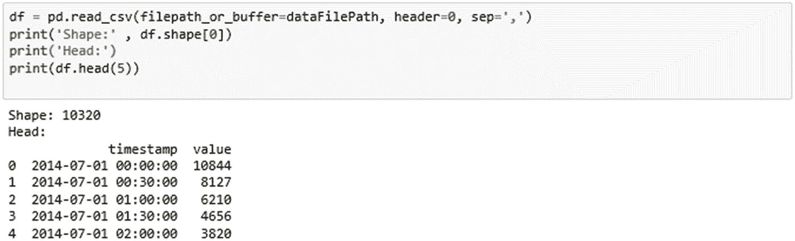
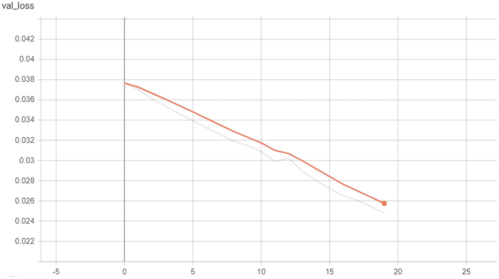
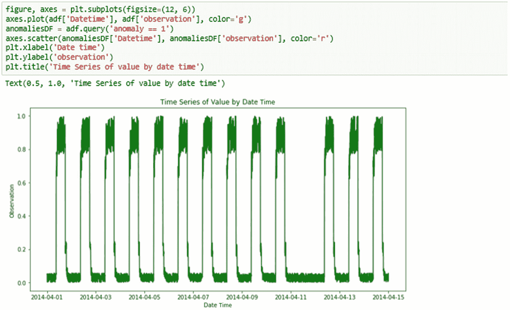
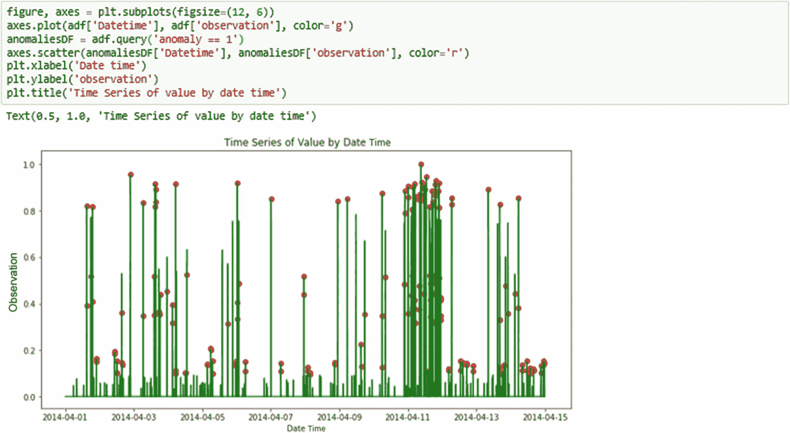
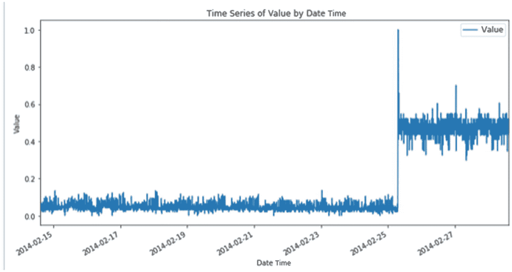

# 6.长短期记忆模型

在本章中，你将学习循环神经网络和长短期记忆模型。您还将了解 LSTMs 的工作原理，如何使用它们来检测异常，以及如何使用 LSTM 来实施异常检测。您将学习几个数据集，这些数据集描述了不同类型数据的时间序列，如 CPU 利用率、出租车需求等。来说明如何检测异常。本章向您介绍了使用 LSTM 的许多概念，以便您能够使用作为教材一部分提供的 Jupyter 笔记本进行进一步探索。

简而言之，本章将涵盖以下主题:

*   序列和时间序列分析

*   什么是 RNN？

*   什么是 LSTM？

*   LSM 应用程序

## 序列和时间序列分析

一个`time series`是一系列按照时间顺序索引的`data points`。最常见的是，时间序列是在连续的等间距时间点上获得的`sequence`。因此，它是一个`discrete-time`数据序列。时间序列的例子有心电图数据、天气传感器和股票价格。

图 [6-1](#Fig1) 显示了一些时间序列的例子。

图 6-1

时间序列

图 [6-2](#Fig2) 显示了近 150 年来 AMO 指数的月值。

图 6-2

AMO 指数的月度数值

图 [6-3](#Fig3) 显示了英国石油公司 20 年来的股价走势图。

图 6-3

BP 股票价格

时间序列分析是指对一段时间内数据趋势变化的分析。时间序列`analysis`包括用于分析时间序列数据的方法，以便提取有意义的统计数据和数据的其他特征，并且具有多种应用。一个这样的应用是根据一个项目的过去值来预测它的未来值。未来股票价格预测可能是这种应用的最好例子。另一个非常重要的用例是检测异常的能力。通过从能够理解从历史数据中看到的趋势和变化的角度来分析和学习时间序列，我们可以检测时间序列中的异常或异常数据点。

图 [6-4](#Fig4) 是有异常的时间序列。它用绿色显示正常数据，用红色显示可能的异常。

图 6-4

异常时间序列

## 什么是 RNN？

你已经在整本书中看到了几种类型的神经网络，所以你知道神经网络的高级表示看起来像图 [6-5](#Fig5) 。

图 6-5

神经网络的高级表示

显然，神经网络处理输入并产生输出，这适用于具有不同特征的多种类型的输入数据。然而，需要注意的一个关键点是，这个神经网络不知道事件发生的时间(输入)，只知道输入已经到来。

那么，事件(输入)在长时间内以流的形式出现会发生什么呢？上面显示的神经网络如何处理事件的趋势、事件的季节性等。？它如何从过去学习，并将其应用于现在和未来？

循环神经网络试图通过逐步建立神经网络来解决这一问题，将来自先前时间戳的信号纳入当前网络。图 [6-6](#Fig6) 显示了一个 RNN。

图 6-6

循环神经网络

你可以看到，RNN 是一个神经网络，有多个层次或步骤或阶段。每个阶段代表一个时间 T；T+1 时刻的 RNN 会将 T 时刻的 RNN 视为信号之一。每一级都将其输出传递给下一级。从一个阶段传递到下一个阶段的隐藏状态，是 RNN 如此良好工作的关键，这种隐藏状态类似于某种记忆保持。RNN 层(或级)在处理输入序列并返回其自身内部状态时充当编码器。该状态用作下一级解码器的输入，在给定目标序列的先前点的情况下，该解码器被训练来预测目标序列的下一点。具体来说，它被训练成将目标序列变成相同的序列，但在未来偏移一个时间步长。

像在其他神经网络中一样，当训练 RNN 时使用反向传播，但是在 RNNs 中也有时间维度。在反向传播中，我们对每个参数取损失的导数(梯度)。利用这一信息(损失)，我们可以将参数向相反方向移动，目标是使损失最小化。我们在每个时间步长都有一个损失，因为我们在时间中移动，我们可以对时间上的损失求和，得到每个时间步长的损失。这与时间上梯度的求和是一样的。

从常规神经网络节点构建的上述循环神经网络的问题在于，当我们试图对由大量其他值分隔的序列值之间的相关性进行建模时，时间步长 T 的梯度取决于 T-1 处的梯度、T-2 处的梯度等等。这导致当我们沿着梯度链变得越来越长的时间步长移动时，最早的梯度的贡献越来越小。这就是所谓的消失梯度问题。这意味着这些早期层的梯度将变得越来越小，因此网络不会了解长期的依赖性。RNN 因此变得有偏见，只处理短期数据点。

LSTM 网络是用 RNNs 解决这个问题的一种方式。

## 什么是 LSTM？

LSTM 网络是一种循环神经网络。如上所述，循环神经网络是试图对依赖于时间或序列的行为进行建模的神经网络，例如语言、股票价格、天气传感器等等。这是通过将神经网络层在时间 *T* 的输出反馈到同一网络层在时间 *T + 1 的输入来执行的。* LSTM 建立在 RNN 的基础上，增加了一个内存组件，旨在帮助将在时间 T 学到的信息传播到未来的 T+1、T+2 等等。主要思想是 LSTM 可以忘记先前状态的不相关部分，同时选择性地更新状态，然后输出状态的与未来相关的某些部分。

这如何解决 RNNs 中的消失梯度问题？好了，现在我们抛出一些状态，更新一些状态，并向前传播状态的一些部分，所以我们不再有一个在 RNNs 中看到的长长的反向传播链。因此，LSTMs 比典型的 RNN 效率高得多。

图 [6-7](#Fig7) 是带有 tanh 激活的 RNN。

图 6-7

激活 tanh 的 RNN

双曲正切函数被称为激活函数。有几种类型的激活函数有助于对神经网络中每个节点的输入应用非线性变换。图 [6-8](#Fig8) 显示了常用的激活功能。

图 6-8

常见激活功能

激活函数背后的关键思想是将非线性添加到数据中，以更好地与现实世界的问题和现实世界的数据保持一致。在图 [6-9](#Fig9) 中，上图显示线性，下图显示非线性。

图 6-9

线性和非线性数据图

显然，没有线性方程来处理非线性，所以我们需要一个激活函数来处理这一特性。不同的激活功能在 [`https://keras.io/activations/`](https://keras.io/activations/) 中列出。

在时间序列数据中，数据分布在一段时间内，而不是像第 [4](4.html) 章中看到的一些瞬时集合，例如自动编码器。因此，不仅查看某个时间 T 的瞬时数据很重要，而且通过时间步长传播该点左侧的较旧历史数据也很重要。由于我们需要来自历史数据点的信号存在很长一段时间，我们需要一个激活函数，它可以在变为零之前将信息维持更长的时间。tanh 是用于此目的的理想激活函数，如图 [6-10](#Fig10) 所示。

图 6-10

tanh 激活

我们还需要 sigmoid(另一种激活功能)作为记忆或遗忘信息的方式。在图 [6-11](#Fig11) 中显示了一个 s 形激活功能。

图 6-11

sigmoid 激活函数

现在，传统的 rnn 倾向于记住一切，包括不必要的输入，这导致无法从长序列中学习。相比之下，LSTMs 有选择地记住重要的输入，这允许它们处理短期和长期的依赖。

那么 LSTM 是如何做到这一点的呢？它通过使用三个重要的门在隐藏状态和单元状态之间释放信息来做到这一点:遗忘门、输入门和输出门。常见的 LSTM 单元由一个单元、`input gate`、`output gate,`和`forget gate`组成。该单元在任意时间间隔内记忆数值，三个*门*调节进出该单元的信息流。

更详细的 LSTM 架构如图 [6-12](#Fig12) 所示。使用了两个关键函数，tanh 和 sigmoid，它们是激活函数。F t 是遗忘门，I t 是输入门，O t 是输出门。

图 6-12

详细的 LSM 网路资料来源:commons.wikimedia.org

遗忘门是 LSTM 阶段的第一部分，它很大程度上决定了前一阶段的多少信息应该被记住或忘记。这是通过一个 sigmoid 函数传递先前的隐藏状态 hT-1 和当前输入 xT 来实现的。

输入门通过使用 sigmoid 函数和 tanh 函数来帮助决定将多少信息传递到当前级。

输出门控制这个阶段的隐藏状态将保留多少信息并传递到下一个阶段。同样，当前状态通过 tanh 函数传递。

仅供参考，带有遗忘门的 LSTM 单元的向前传递方程的简洁形式如下(来源:维基百科)

其中初始值为 c 0 = 0，h 0 = 0，运算符 0 表示元素间乘积。下标表示时间步长。

**变量**

*   x t∈r d { \ display style x _ { t } \ in \ mathbb { r } ^{d}}*x**t*∈ℝ*d*:lstm 单元的输入向量

*   f t∈r h { \ display style f _ { t } \ in \ mathbb { r } ^{h}}*f**t*∈ℝ*h*:忘记门的激活向量

*   I t∈r h { \ display style I _ { t } \ in \ mathbb { r } ^{h}}*I**t*∈ℝ*h*:输入/更新门的激活向量

*   o t∈r h { \ display style o _ { t } \ in \ mathbbb { r } ^{h}}*o**t*∈ℝ*h*:输出门的激活向量

*   h t∈r h { \ display style h _ { t } \ in \ mathbb { r } ^{h}}*h**t*∈ℝ*h*:隐藏状态向量，也称为 LSTM 单元的输出向量

*   c t∈r h { \ display style c _ { t } \ in \ mathbb { r } ^{h}}*c**t*∈ℝ*h*:单元格状态向量

*   w∈r h×d { \ display style w \ in \ mathbb { r } ^{h\times d } }*w*∈ℝ*h*×*d*，*u*∈ℝ*h*×*h**和 b*∈ℝ*h*u∈r

上标分别指输入特征的数量和隐藏单元的数量。

## 用于异常检测的 LSTM

在本节中，您将使用时间序列数据作为示例，查看一些用例的 LSTM 实现。在尝试使用 LSTM 检测异常时，可以使用的时间序列数据集很少。它们都有一个时间戳和值，可以很容易地用 Python 绘制出来。

图 [6-13](#Fig13) 显示了导入所有必需包的基本代码。还要注意各种必需包的版本。

图 6-13

导入包的代码

图 [6-14](#Fig14) 显示了通过异常图表和误差图表(预测值和真实值之间的差异)可视化结果的代码。

图 6-14

可视化错误和异常的代码

您将使用时间序列数据的不同示例来检测某个点是正常/预期还是异常/异常。图 [6-15](#Fig15) 显示了加载到 Pandas 数据帧中的数据。它显示了数据集的路径列表。

图 6-15

数据集的路径列表

现在，您将更详细地使用其中一个数据集。数据集为 nyc_taxi，基本由时间戳和打车需求组成。该数据集显示了纽约市从 2014 年 7 月 1 日到 2015 年 1 月 31 日的出租车需求，每半小时观察一次。这个数据集中几乎没有可检测的异常:感恩节、圣诞节、元旦、暴风雪等。

图 [6-16](#Fig16) 显示了选择数据集的代码。

图 6-16

选择数据集的代码

您可以使用 Pandas 将数据文件路径中的数据加载为 csv 文件。图 [6-17](#Fig17) 显示了将 csv 数据文件读入 Pandas 的代码。

图 6-17

将 csv 数据文件读入 Pandas 的代码

图 [6-18](#Fig18) 显示了时间序列图，x 轴显示月份，y 轴显示数值。它还展示了生成显示时间序列的图形的代码。

图 6-18

绘制时间序列

让我们进一步了解数据。您可以运行`describe()`命令来查看值列。图 [6-19](#Fig19) 显示了描述值列的代码。

图 6-19

描述值列

您也可以使用 seaborn kde plot 绘制数据，如图 [6-20](#Fig20) 所示。

图 6-20

使用 kde 绘制值列

数据点最少 8 个，最多 39197 个，范围很广。您可以使用缩放来标准化数据。

缩放的公式是(x-Min) / (Max-Min)。图 [6-21](#Fig21) 显示了缩放数据的代码。

图 6-21

缩放数据的代码

现在您已经缩放了数据，您可以再次绘制数据。您可以使用 seaborn kde plot 绘制数据，如图 [6-22](#Fig22) 所示。

图 6-22

使用 kde 绘制 scaled_value 列

现在，您可以查看数据框架，因为您已经缩放了值列。图 [6-23](#Fig23) 显示了显示时间戳和值以及 scaled_value 和日期时间的数据帧。

图 6-23

修改的数据帧

序列中有 10320 个数据点，您的目标是找到异常。这意味着您正在尝试找出数据点异常的时间。如果您可以根据 T-1 之前的历史数据预测时间 T 的数据点，那么您就有办法将预期值与实际值进行比较，以确定您是否在时间 T 的预期值范围内。如果您预测 2015 年 1 月 1 日的出租车需求数量为 ypred，那么您可以将此 ypred 与实际 yactual 进行比较。ypred 和 yactual 之间的差给出了误差，当你得到序列中所有点的误差时，你最终得到的只是误差的分布。

为此，您将使用一个使用 Keras 的顺序模型。该模型由 LSTM 层和稠密层组成。LSTM 层将时间序列数据作为输入，并学习如何学习与时间相关的值。下一层是密集层(全连通层)。密集层将 LSTM 层的输出作为输入，并将其转换为完全连接的方式。然后，对密集层应用 sigmoid 激活，以便最终输出介于 0 和 1 之间。

您还可以使用 **adam** 优化器和**均方误差**作为损失函数。图 [6-24](#Fig24) 显示了构建 LSTM 模型的代码。

图 6-24

构建 LSTM 模型的代码

如上所示，你使用了 LSTM 层。让我们用所有可能的参数来看看 LSTM 层函数的细节(来源: [`https://keras.io/layers/recurrent/`](https://keras.io/layers/recurrent/) ):

*   **keras.layers.LSTM** (units，activation='tanh '，recurrent _ activation = ' hard _ sigmoid '，use_bias= **True** ，kernel _ initializer = ' glorot _ uniform '，recurrent_initializer= '正交'，bias_initializer='zeros '，unit_forget_bias= **True** ，kernel _ regular =**None**，recurrent _ regular =**None**，bias _ regular =**None**，activity

**自变量**

*   **单位**:正整数，输出空间的维数

*   **激活**:要使用的激活功能(参见 [`https://keras.io/activations`](https://keras.io/activations) )。默认:双曲正切(`tanh`)。如果您通过`None`，则不应用激活(即“线性”激活:`a(x) = x`)。

*   **recurrent_activation** :用于循环步骤的激活函数(见 [`https://keras.io/activations`](https://keras.io/activations) )。默认:硬乙状结肠(`hard_sigmoid`)。如果你通过了`None`，没有激活被应用(即。“线性”激活:`a(x) = x`)。

*   **use_bias** :布尔型，该层是否使用偏置向量

*   **内核初始化器**:用于`kernel`权重矩阵的初始化器，用于输入的线性变换(见 [`https://keras.io/initializers`](https://keras.io/initializers) )

*   **递归 _ 初始化器**:用于`recurrent_kernel`权重矩阵的初始化器，用于递归状态的线性变换(参见 [`https://keras.io/initializers`](https://keras.io/initializers) )。

*   **bias_initializer** :偏置向量的初始化器(见 [`https://keras.io/initializers`](https://keras.io/initializers) )

*   **unit_forget_bias** :布尔型。如果为真，在初始化时将遗忘门的偏置加 1。将其设置为 true 也会强制`bias_initializer="zeros"`。Jozefowicz 等人(2015 年)对此提出了建议。

*   **kernel _ regulator**:应用于`kernel`权重矩阵的正则化函数(见 [`https://keras.io/regularizer`](https://keras.io/regularizer) )

*   **递归 _ 正则**:应用于`recurrent_kernel`权重矩阵的正则函数(见 [`https://keras.io/regularizer`](https://keras.io/regularizer) )

*   **偏差 _ 正则化**:应用于偏差向量的正则化函数(见 [`https://keras.io/regularizer`](https://keras.io/regularizer) )

*   **activity _ regulator**:应用于图层输出的正则化函数(其“激活”)(参见 [`https://keras.io/regularizer`](https://keras.io/regularizer) )

*   **kernel_constraint** :应用于`kernel`权重矩阵的约束函数(见 [`https://keras.io/constraints`](https://keras.io/constraints) )

*   **递归 _ 约束**:应用于`recurrent_kernel`权重矩阵的约束函数(见 [`https://keras.io/constraints`](https://keras.io/constraints) )

*   **bias_constraint** :应用于偏置向量的约束函数(见 [`https://keras.io/constraints`](https://keras.io/constraints) )

*   **dropout** :在 0 和 1 之间浮动。输入的线性变换要丢弃的单位的分数。

*   **recurrent_dropout** :在 0 和 1 之间浮动。递归状态的线性变换要丢弃的单位的分数。

*   **实现**:实现方式，1 或 2。模式 1 将把它的操作组织成大量较小的点积和加法，而模式 2 将它们分批成较少的较大的操作。这些模式在不同的硬件和不同的应用程序上具有不同的性能特征。

*   **return_sequences** :布尔型。是返回输出序列中的最后一个输出，还是整个序列。

*   **return_state** :布尔型。除了输出之外，是否返回最后的状态。状态列表返回的元素分别是隐藏状态和单元格状态。

*   **go _ backed**:布尔型(默认为假)。如果为真，则反向处理输入序列并返回反向序列。

*   **有状态**:布尔型(默认为假)。如果为真，批次中索引 I 处每个样本的最后状态将用作下一批次中索引 I 处样本的初始状态。

*   **展开**:布尔型(默认为假)。如果为真，网络将被展开，否则将使用符号循环。展开可以加快 RNN 的速度，尽管它往往会占用更多的内存。展开仅适用于短序列。

如果您注意到上面代码片段中的 LSTM 调用，就会发现使用了一个参数 time_steps=48。这是用于训练 LSTM 的序列中的步数。48 显然意味着 24 小时，因为您的数据点相隔 30 分钟。您可以尝试将其更改为 64 或 128，看看输出会有什么变化。

图 [6-25](#Fig25) 显示了将序列分割成长度为 48 的子序列的滚动窗口的代码。请注意 sequence_trimmed 的形状，它是 215 个子序列，每个子序列有 48 个点，每个点有 1 个维度(显然，在每个时间戳上只有 scaled_value 作为一列)。

图 6-25

创建子序列的代码

现在，让我们使用训练集作为验证数据，为`20`时期训练您的模型。你可以这样做。图 [6-26](#Fig26) 显示了训练模型的代码。

 

图 6-26

为模型定型的代码

图 [6-27](#Fig27) 显示了训练过程中各训练时期的损失图。

图 6-27

张量板损耗图

图 [6-28](#Fig28) 显示了训练过程中通过训练时期的平均绝对误差图。

图 6-28

张量板平均绝对误差图

图 [6-29](#Fig29) 显示了在培训过程中通过培训时期的验证损失图。

图 6-29

TensorBoard 验证损失图

图 [6-30](#Fig30) 显示了在训练过程中通过训练时期的验证平均绝对误差图。

图 6-30

张量板验证的平均绝对误差图

图 [6-31](#Fig31) 显示了 TensorBoard 可视化的模型图形。

图 6-31

通过 TensorBoard 可视化的模型图形

一旦模型定型，您就可以预测一个测试数据集，该数据集被拆分为与定型数据集长度(time_steps)相同的子序列。完成后，您就可以计算均方根误差(RMSE)。

图 [6-32](#Fig32) 显示了在测试数据集上预测的代码。

图 6-32

对测试数据集进行预测的代码

RMSE 是 0.040，相当低，这从 20 个纪元后训练阶段的低损耗也可见一斑:`loss: 0.0251 - mean_absolute_error: 0.0251 - val_loss: 0.0248 - val_mean_absolute_error: 0.0248`

现在，您可以使用预测数据集和测试数据集来计算差异 diff，然后通过向量范数进行传递。计算向量的长度或大小经常需要直接作为机器学习中的正则化方法。然后，您可以对分数/差异进行排序，并使用临界值来选择阈值。这显然可以根据您选择的参数而改变，尤其是截止值(在图 [6-33](#Fig33) 中为 0.99)。该图还显示了计算阈值的代码。

图 6-33

计算阈值的代码

你得到了 0.333 作为门槛；以上任何情况都被视为异常。

图 [6-34](#Fig34) 显示了绘制测试数据集(绿色)和相应预测数据集(红色)的代码。

图 6-34

绘制测试和预测数据集

图 [6-35](#Fig35) 显示了将数据点分类为异常或正常的代码。

图 6-35

将数据点分类为异常或正常的代码

图 [6-36](#Fig36) 显示了根据阈值绘制数据点的代码。

图 6-36

绘制带有阈值期望值的数据点的代码

图 [6-37](#Fig37) 显示了将异常标志附加到数据帧的代码。

图 6-37

将异常标志附加到数据帧的代码

图 [6-38](#Fig38) 显示了生成显示异常图形的代码。

图 6-38

显示异常情况的图表

在上图中，你可以看到感恩节前后的异常，新年前夕的异常，以及一月份暴风雪天的异常。

如果您试验您使用的一些参数，例如时间步长数、阈值截止值、神经网络的时期、批量大小和隐藏层，您将看到不同的结果。

改进检测的一个好方法是收集良好的正常数据，使用已识别的异常，并将其放入组合中，以便有一种方法来调整参数，直到在已识别的异常上获得良好的匹配。

## 时间序列的例子

### 艺术 _ 日常 _ 无噪音

这个数据集没有噪声或异常，是一个正常的时间序列数据集。正如您在下面看到的，时间序列在不同的时间戳上有值。

数据集:art_daily_no_noise.csv

图 [6-39](#Fig39) 显示了生成显示时间序列的图形的代码。

图 6-39

显示时间序列的图表

使用可视化，您现在可以绘制新的时间序列。如下所示，时间序列显示了数据时间与值列。因为没有异常，所以一切都是绿色的。图 [6-40](#Fig40) 显示了生成显示异常图形的代码。

图 6-40

显示异常情况的图表

由于这个数据集没有噪声或异常，是一个正常的时间序列数据集，所以没有显示异常(红色的数据点),一切都是绿色的。

接下来，让我们检查另一个不同于当前数据集的数据集。你将建立一个 LSTM 模型，看看是否有异常。

### art_daily_nojump

这个数据集没有噪声或异常，是一个正常的时间序列数据集。正如您在下面看到的，时间序列在不同的时间戳上有值。

使用可视化，您现在可以绘制时间序列。您将这个工作的时间戳转换为 datetime，并删除时间戳列。如下所示，时间序列显示了数据时间与值列。

数据集:art_daily_nojump.csv

图 [6-41](#Fig41) 显示了生成显示时间序列的图形的代码。

图 6-41

显示时间序列的图表

让我们将异常列添加到原始数据帧中，并准备一个新的数据帧。使用可视化，您现在可以绘制新的时间序列。如下所示，时间序列显示了数据时间与值列。因为没有异常，所以一切都是绿色的。图 [6-42](#Fig42) 显示了生成显示异常图形的代码。

图 6-42

显示异常情况的图表

由于这个数据集没有噪声或异常，是一个正常的时间序列数据集，所以没有显示异常(红色的数据点),一切都是绿色的。

接下来，让我们检查另一个不同于当前数据集的数据集。你将建立一个 LSTM 模型，看看是否有异常。

### 艺术 _ 每日 _ 跳跃

这个数据集混合了正常数据和异常数据。正如您在下面看到的，时间序列在不同的时间戳上有值。

使用可视化，您现在可以绘制时间序列。您将这个工作的时间戳转换为 datetime，并删除时间戳列。如下所示，时间序列显示了数据时间与值列。

数据集:art_daily_jumpsdown.csv

图 [6-43](#Fig43) 显示了生成显示时间序列的图形的代码。

图 6-43

显示时间序列的图表

让我们将异常列添加到原始数据帧中，并准备一个新的数据帧。使用可视化，您现在可以绘制新的时间序列。如下所示，时间序列显示了数据时间与值列。正常数据点显示为绿色，异常数据点显示为红色。图 [6-44](#Fig44) 显示了生成显示异常图形的代码。

图 6-44

显示异常情况的图表

因为这个数据集有一些噪声或异常，所以显示了异常(红色的数据点),其他正常的都是绿色的。

接下来，让我们检查另一个不同于当前数据集的数据集。你将建立一个 LSTM 模型，看看是否有异常。

### 艺术 _ 日常 _ 完美 _ 方波

这个数据集没有噪声或异常，是一个正常的时间序列数据集。正如您在下面看到的，时间序列在不同的时间戳上有值。

使用可视化，您现在可以绘制时间序列。您将这个工作的时间戳转换为 datetime，并删除时间戳列。如下所示，时间序列显示了数据时间与值列。

数据集:art _ daily _ perfect _ square _ wave . CSV

图 [6-45](#Fig45) 显示了生成显示时间序列的图形的代码。

图 6-45

显示时间序列的图表

让我们将异常列添加到原始数据帧中，并准备一个新的数据帧。使用可视化，您现在可以绘制新的时间序列。如下所示，时间序列显示“数据时间与值”列。因为没有异常，所以一切都是绿色的。图 [6-46](#Fig46) 显示了生成显示异常图形的代码。

图 6-46

显示异常情况的图表

由于这个数据集没有噪声或异常，是一个正常的时间序列数据集，所以没有显示异常(红色的数据点),一切都是绿色的。

接下来，让我们检查另一个不同于当前数据集的数据集。你将建立一个 LSTM 模型，看看是否有异常。

### art _ 负载平衡器 _ 峰值

这个数据集混合了正常数据和异常数据。正如您在下面看到的，时间序列在不同的时间戳上有值。

使用可视化，您现在可以绘制时间序列。您将这个工作的时间戳转换为 datetime，并删除时间戳列。如下所示，时间序列显示了数据时间与值列。

数据集:art_load_balancer_spikes.csv

图 [6-47](#Fig47) 显示了生成显示时间序列的图形的代码。

图 6-47

显示时间序列的图表

让我们将异常列添加到原始数据帧中，并准备一个新的数据帧。使用可视化，您现在可以绘制新的时间序列。如下所示，时间序列显示了数据时间与值列。正常数据点显示为绿色，异常数据点显示为红色。图 [6-48](#Fig48) 显示了生成显示异常图形的代码。

图 6-48

显示异常情况的图表

因为这个数据集有一些噪声或异常，所以显示了异常(红色的数据点),其他正常的都是绿色的。

接下来，让我们检查另一个不同于当前数据集的数据集。你将建立一个 LSTM 模型，看看是否有异常。

### 环境温度系统故障

这个数据集混合了正常数据和异常数据。正如您在下面看到的，时间序列在不同的时间戳上有值。

使用可视化，您现在可以绘制时间序列。您将这个工作的时间戳转换为 datetime，并删除时间戳列。如下所示，时间序列显示了数据时间与值列。

数据集:环境温度系统故障 csv

图 [6-49](#Fig49) 显示了生成显示时间序列的图形的代码。

图 6-49

显示时间序列的图表

让我们将异常列添加到原始数据帧中，并准备一个新的数据帧。使用可视化，您现在可以绘制新的时间序列。如下所示，时间序列显示了数据时间与值列。正常数据点显示为绿色，异常数据点显示为红色。图 [6-50](#Fig50) 显示了生成显示异常图形的代码。

图 6-50

显示异常情况的图表

因为这个数据集有一些噪声或异常，所以显示了异常(红色的数据点),其他正常的都是绿色的。

接下来，让我们检查另一个不同于当前数据集的数据集。你将建立一个 LSTM 模型，看看是否有异常。

### ec2 _ cpu _ 利用率

这个数据集混合了正常数据和异常数据。正如您在下面看到的，时间序列在不同的时间戳上有值。

使用可视化，您现在可以绘制时间序列。您将这个工作的时间戳转换为 datetime，并删除时间戳列。如下所示，时间序列显示了数据时间与值列。

数据集:ec2_cpu_utilization.csv

图 [6-51](#Fig51) 显示了生成显示时间序列的图形的代码。

图 6-51

显示时间序列的图表

让我们将异常列添加到原始数据帧中，并准备一个新的数据帧。使用可视化，您现在可以绘制新的时间序列。如下所示，时间序列显示了数据时间与值列。正常数据点显示为绿色，异常数据点显示为红色。图 [6-52](#Fig52) 显示了生成显示异常图形的代码。

图 6-52

显示异常情况的图表

因为这个数据集有一些噪声或异常，所以显示了异常(红色的数据点),其他正常的都是绿色的。

接下来，让我们检查另一个不同于当前数据集的数据集。你将建立一个 LSTM 模型，看看是否有异常。

### rds _ cpu _ 利用率

这个数据集混合了正常数据和异常数据。正如您在下面看到的，时间序列在不同的时间戳上有值。

使用可视化，您现在可以绘制时间序列。您将这个工作的时间戳转换为 datetime，并删除时间戳列。如下所示，时间序列显示了数据时间与值列。

数据集:rds_cpu_utilization.csv

图 [6-53](#Fig53) 显示了生成显示时间序列的图形的代码。

图 6-53

显示时间序列的图表

让我们将异常列添加到原始数据帧中，并准备一个新的数据帧。使用可视化，您现在可以绘制新的时间序列。如下所示，时间序列显示了数据时间与值列。正常数据点显示为绿色，异常数据点显示为红色。图 [6-54](#Fig54) 显示了生成显示异常图形的代码。

图 6-54

显示异常情况的图表

因为这个数据集有一些噪声或异常，所以显示了异常(红色的数据点),其他正常的都是绿色的。

## 摘要

在本章中，我们讨论了循环神经网络和长短期记忆模型。我们还将 LSTMs 作为检测异常的手段。我们还浏览了具有不同异常的时间序列数据的几个不同示例，并展示了如何开始检测异常。

在下一章，我们将看看另一种异常检测方法，即**时态卷积网络**。