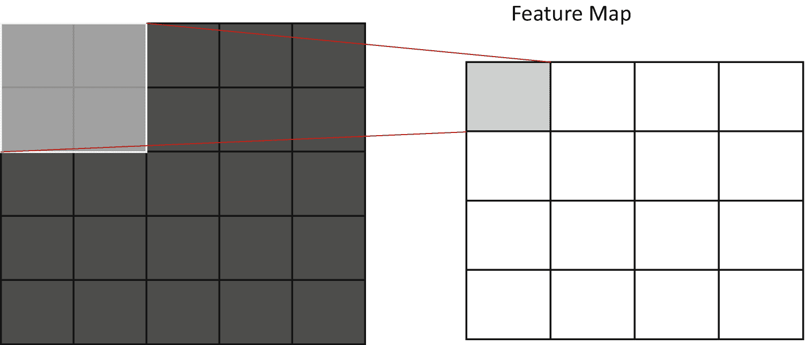
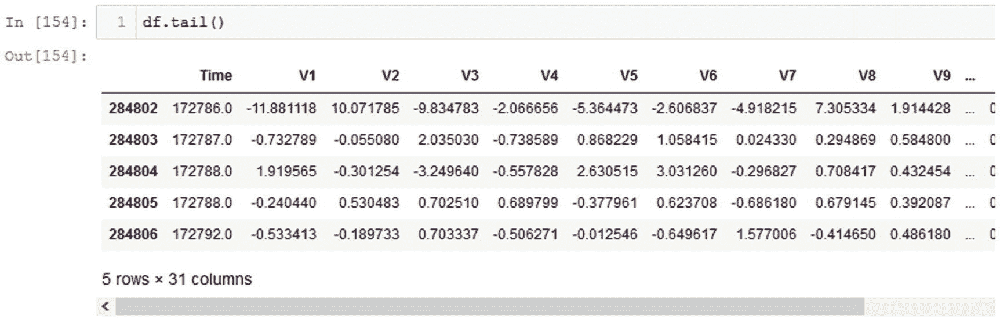
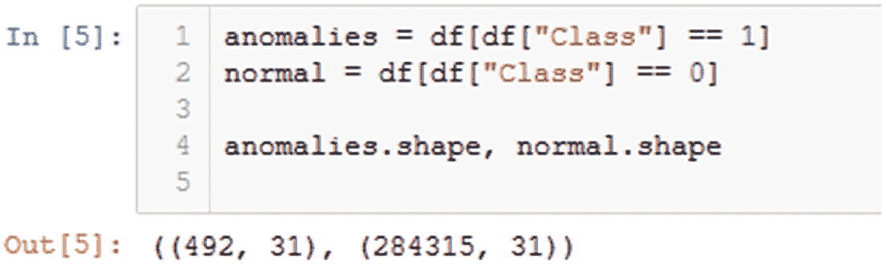
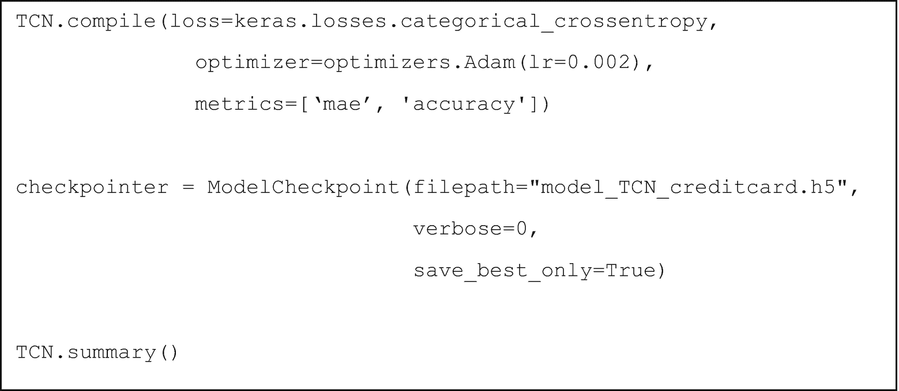

# 七、时态卷积网络

在本章中，你将学习时态卷积网络(TCN)。您还将了解 TCN 如何工作，如何使用 TCN 检测异常，以及如何使用 TCN 实施异常检测。

简而言之，本章将涵盖以下主题:

*   什么是时态卷积网络？

*   扩展时态卷积网络

*   编码器-解码器时态卷积网络

*   TCN 应用

## 什么是时态卷积网络？

时态卷积网络是指包含一维卷积层的一系列架构。更具体地说，这些回旋是**因果**，意味着未来的信息不会泄露到过去。换句话说，模型只处理时间上向前的信息。在语言翻译的背景下，循环神经网络的一个问题是，它在时间上从左到右阅读句子，在一些情况下，当句子的顺序被调换以产生强调时，会导致误译。为了解决这个问题，双向编码器被使用，但这意味着未来的信息将被考虑在现在。时态卷积网络没有这个问题，因为它们不依赖于来自先前时间步骤的信息，不像循环神经网络，这要归功于它们的偶然性。此外，TCNs 可以将任意长度的输入序列映射到相同长度的输出序列，就像循环神经网络(RNN)一样。

基本上，时态卷积网络似乎是 RNNs 的一个很好的替代方案。这些是 TCNs 的优点，特别是考虑到 RNNs 的一般情况:

*   **并行计算**:卷积网络与 GPU 训练配合得很好，特别是因为卷积层的矩阵密集型计算非常适合 GPU 的结构，GPU 被配置为执行矩阵计算，这是图形处理的一部分。正因为如此，TCNs 的训练速度比 RNNs 快得多。

*   **灵活性** : TCNs 可以改变输入大小、滤波器大小、增加膨胀因子、堆叠更多层等。以便容易地应用于各种领域。

*   **一致梯度**:因为 TCN 由卷积层组成，它们的反向传播不同于 rnn，因此所有梯度都被保存。rnn 有一个称为爆炸或消失梯度的问题，有时计算的梯度要么非常大，要么非常小，导致重新调整的权重变化太大，或者相对不存在变化。为了解决这个问题，开发了诸如 LSTM、GRU 和 HF-RNN 的 RNN 类型。

*   **更轻的内存**:lstm 将信息存储在它们的单元门内，因此如果输入序列很长，LSTM 网络会使用更多的内存。相比之下，TCN 相对简单，因为它们由若干层组成，这些层共享各自的过滤器。与 LSTMs 相比，TCN 在内存使用方面要轻得多。

然而，TCN 也有一些缺点:

*   **评估模式期间的内存使用情况**:rnn 只需知道一些输入 xt 即可生成预测，因为它们维护着通过隐藏状态向量了解到的所有信息的摘要。相比之下，TCN 需要直到当前点的整个序列才能再次进行评估，这可能导致比 RNN 更高的内存使用率。

*   **迁移学习的问题**:首先我们来定义一下什么是**迁移学习**。**转移学习**是指当一个模型已经为一个特定的任务(例如对车辆进行分类)进行了训练，并且将最后一层完全去掉并重新训练，以便该模型可以用于新的分类任务(例如对动物进行分类)。

在计算机视觉中，有一些非常强大的模型，如 inception-v3 模型，它们已经在强大的 GPU 上训练了相当长的时间，以实现它们的性能。我们不需要从头开始训练我们自己的 CNN(我们大多数人都没有 GPU 硬件或时间花在像 inception-v3 这样的非常深入的模型上)，我们可以简单地以 inception-v3 为例，它非常擅长从图像中提取特征，并训练它将它提取的特征与一组全新的类相关联。由于整个网络中的权重已经得到了很好的优化，因此这个过程花费的时间要少得多，所以您只需要为正在重新训练的层找到最佳权重。

这就是为什么迁移学习是如此有价值的过程；它允许我们采用预训练的高性能模型，并简单地用我们的硬件重新训练最后一层，并教会模型新的分类任务(针对 CNN)。

回到 TCNs，为了进行预测，模型可能需要记住不同水平的序列历史。如果模型不需要在旧任务中获取尽可能多的历史来进行预测，但在新任务中，它必须接收更多/更少的历史来进行预测，这将导致问题，并可能导致模型表现不佳。

在一维卷积层中，我们仍然有参数 **k** 来确定我们的内核或滤波器的大小。卷积层的工作方式与你在第三章[中看到的二维卷积层非常相似，但是在这种情况下我们只处理向量。](3.html)

下面是一维卷积运算的一个例子。假设输入向量如图 [7-1](#Fig1) 所定义，


图 7-1

用这些对应值定义的向量 x。这是输入向量

以及如图 [7-2](#Fig2) 初始化的滤波器，


图 7-2

与这个一维卷积层相关联的滤波器权重

卷积层的输出计算如图 [7-3](#Fig3) ，图 [7-4](#Fig4) ，图 [7-5](#Fig5) ，图 [7-6](#Fig6) 所示。


图 7-6

如何使用过滤器权重计算输出向量的最后一项


图 7-5

如何使用过滤器权重计算输出向量的第三个条目


图 7-4

如何使用过滤器权重计算输出向量的第二个条目。程序与图 [7-3](#Fig3) 相同，但滤波器权重向右移动一位


图 7-3

如何使用过滤器权重计算输出向量的第一个条目。滤波器权重与输入中的前三个条目按元素相乘，结果相加产生输出值

现在我们有了一维卷积层的输出。这些一维卷积层非常类似于二维卷积层的工作方式，它们几乎包含了我们将要研究的两种不同 TCN 的全部:扩展的时态卷积网络(T0)和基于 T2 编码器-解码器的时态卷积网络(T3)。值得注意的是，两个模型都涉及**监督异常检测**，尽管编码器-解码器 TCN 能够进行半监督异常检测，因为它是一个自编码器。

## 扩展时态卷积网络

在这种类型的 TCN 中，我们处理一种被称为膨胀的新性质。基本上，当膨胀因子大于 1 时，我们在输出数据中引入对应于膨胀因子的间隙。为了更好地理解膨胀的概念，让我们看看它如何为一个**二维卷积层**工作。

这是一个标准的卷积，相当于你在第 [3](3.html) 章看到的。你也可以认为一个标准卷积层的膨胀因子为**1**(参见图 [7-7](#Fig7) )。



图 7-7

膨胀系数为 1 的标准卷积

现在，让我们来看看当我们将**膨胀因子**增加到 2 时会发生什么。对于特征图中的第一个条目，卷积如图 [7-8](#Fig8) 所示。


图 7-8

膨胀因子为 2 的标准卷积定义了特征图中的第一个条目

请注意，每个采样条目之间的间距在所有方向上都增加了一个。在垂直、水平和对角方向上，采样条目都由一个条目隔开。本质上，这个间距是通过找出什么是**d–1**来确定的，其中 **d** 是**膨胀因子**。对于膨胀系数为 3 的情况，该间距将为 2。现在，对于第二个条目，卷积过程照常进行(见图 [7-9](#Fig9) )。


图 7-9

膨胀因子为 2 的卷积定义了特征图中的第二个条目

一旦该过程终止，我们将有我们的特征地图。请注意特征图的维数减少，这是增加膨胀因子的直接结果。在标准的二维卷积层中，我们有一个 4x4 的特征图，因为膨胀因子是 1，但现在在将该因子增加到 2 后，我们有一个 3x3 的特征图。

一维扩张卷积也是类似的。让我们重温一下一维卷积的例子，并稍微修改一下来说明这个概念。

现在假设新的输入向量和滤波器权重如图 [7-10](#Fig10) 和图 [7-11](#Fig11) 所示。


图 7-10

新的输入向量权重

和


图 7-11

新的过滤器权重

现在让我们假设膨胀因子是 2，而不是 1。新的输出向量如下，使用膨胀因子为 2 的膨胀一维卷积(见图 [7-12](#Fig12) ，图 [7-13](#Fig13) ，图 [7-14](#Fig14) ，图 [7-15](#Fig15) )。


图 7-15

最后一组三个输入向量值乘以滤波器权重，以产生最后一个输出向量值


图 7-14

第三组三个输入向量值乘以滤波器权重以产生下一个输出向量值


图 7-13

下一组三个输入向量值乘以滤波器权重，以产生下一个输出向量值


图 7-12

使用膨胀因子为 2 的膨胀一维卷积计算输出因子中的第一个条目

既然我们已经介绍了在一维卷积的背景下**膨胀卷积**是什么样子，让我们看看**因果**和**因果**膨胀卷积之间的区别。为了说明这个概念，假设两个例子都涉及一组扩展的一维卷积层。考虑到这一点，图 [7-16](#Fig16) 显示了一个**因果**网络。


图 7-16

一个不合理的扩张网络。第一个隐藏层的膨胀系数为 2，第二个隐藏层的膨胀系数为 4。请注意“序列中向前”的输入是如何影响下一层的节点的

从架构的构建方式来看，这一点可能并不明显，但如果您将输入层视为一系列在时间上向前发展的数据，您可能会看到在选择输出时会考虑到未来的信息。在一个**随意的**网络中，我们只想要到目前为止我们已经了解的信息，所以未来的信息都不会在模型的预测中被考虑。图 [7-17](#Fig17) 展示了一个**因果**网络的样子。


图 7-17

因果扩张网络。第一个隐藏层的膨胀系数为 2，第二个隐藏层的膨胀系数为 4。请注意，序列中没有向前的输入会影响下一层的节点。如果目标是在数据集内保持某种流，这种类型的结构是理想的，在我们的例子中是时间

从这里，我们可以看到时间的线性性质是如何在模型中保留下来的，以及模型是如何学习不到来自未来的信息的。在随意网络中，模型只考虑从过去到现在的信息。我们所指的扩展时态卷积网络具有类似的模型架构，在输出层之前的每一层中利用扩展因果卷积。

### 基于扩张 TCN 的异常检测

既然您对什么是 TCN 及其工作原理有了更多的了解，那么让我们尝试将扩展 TCN 应用于信用卡数据集。

首先，导入所有必需的包(参见图 [7-18a](#Fig18) )。


图 7-18a

导入所有必需的包，以便启动您的代码

然后，你必须为混淆矩阵等的可视化创建一个类。(参见图 [7-18b](#Fig19) )。


图 7-18b

创建可视化类

之后，继续导入数据集并进行处理(参见图 [7-19](#Fig20) )。


图 7-19

导入数据集并显示前五个条目

输出应该看起来有点像图 [7-20](#Fig21) 。


图 7-20

数据帧的前五个条目

数据帧在图 [7-21](#Fig22) 中继续。


图 7-21

图 [7-20](#Fig21) 中的输出向右滚动

每个条目都非常大，每个条目有 31 列。如果检查图 [7-22](#Fig23) 中数据帧的尾端，



图 7-22

数据帧的尾端。注意时间的值变得有多大

您可以看到数据集非常庞大，总共有 284，807 个条目(索引从 0 开始)。此外，请注意时间的值变得非常大。如果您将这么大的值传递到模型中进行训练，您肯定会在收敛时出错。不仅如此，规范化任何大值也是一种好的做法，因为如果您将较小的值传递给模型，它会提高性能和训练效率。运行图 [7-23](#Fig24) 中的代码来标准化时间和数量的值。


图 7-23

这段代码标准化了时间和数量的值

现在你可以看到时间列的值(图 [7-24](#Fig25)


图 7-24

时间列的标准化值

和数量(图 [7-25](#Fig26)


图 7-25

金额列的标准化值

要小得多，也容易管理得多。

由于整个数据集中有如此多的条目，所以最好限制输入到模型中的“正常”数据条目的数量，因为如果整个数据集都被传入，模型似乎会忽略异常。为了避免淹没异常数据条目，让我们挑选 10，000 个正常条目来导出您的训练和测试数据集(参见图 [7-26](#Fig27) )。


图 7-26

定义两个数据框:异常和正常

输出应该看起来有点像图 [7-27](#Fig28) 。



图 7-27

图 [7-26](#Fig27) 中的输出代码

在这个代码块中，您将两个新的数据框命名为异常和正常，它们的名称与其内容相对应。检查它们的形状显示，与整个数据集相比，异常相对较少，约占整个数据集的 0.173%。

现在让我们开始定义你的训练和测试数据集(见图 [7-28](#Fig29) )。


图 7-28

定义训练集和测试集，并按时间进行排序，以保持时间流

打乱正常数据集以及使用`train_test_split`函数随机选择测试和训练样本有助于确保您选择一个良好的数据值范围来代表正常数据。如果您愿意，您可以在代码的开头限制`for`块中的迭代次数。

从那里，混洗的正常数据的前 10，000 个数据条目与异常连接，并创建训练和测试数据集。然后，这两个集合都按时间列排序，以保持时间的完整性。

输出应该看起来有点像图 [7-29](#Fig30) 。


图 7-29

按时间列排序的数据集

请注意这些指数在数量上是如何变化的，尽管它们都是按时间排序的。

现在，您可以继续重塑您的数据集以传递到模型中。

运行图 [7-30](#Fig31) 中的代码块可以让你对数据集的结构有所了解。


图 7-30

输出形状以帮助理解数据集的结构

输出应该看起来有点像图 [7-31](#Fig32) 。


图 7-31

两个数据集的形状

要将数据集传递到模型中，x 集必须是三维的，y 集必须是二维的。你可以简单地改变 x 集合的形状，并将 y 集合改为分类的(参见第 [3](3.html) 章，了解 keras to _ categorical()函数的作用)。

运行图 [7-32](#Fig33) 的代码。


图 7-32

通过改变 x 集的形状并将 y 集更改为分类集，使 x 集成为三维的，y 集成为二维的。x 集合的整形是为了适应模型的输入形状

让我们看看这些操作是如何改变数据集的。运行图 [7-33](#Fig34) 的代码。


图 7-33

打印数据集形状的代码，以查看操作如何改变结构

输出应该如图 [7-34](#Fig35) 所示。


图 7-34

x 集是三维的，而 y 集是二维的

好了，现在两个数据集都已经成功地被重新整形了。输入形状告诉模型每个条目可以接受多少列和多少行。在这种情况下，输入形状指示将有 1 行 31 列。

现在让我们继续定义您的模型。图 [7-35](#Fig36) 中的代码块定义了一维卷积层和漏失层。


图 7-35

定义模型中的所有一维卷积层和下降层

图 [7-36](#Fig37) 中的代码块定义了最后两层，其中一层用来展平数据，另一层用来表示两个类。


图 7-36

定义最后两个图层，其中一个图层用于展平数据，另一个图层用于表示两个类

现在我们来编译模型，看看各层的汇总(见图 [7-37](#Fig38) )。



图 7-37

编译数据、定义回调以在给定的文件路径下保存模型并输出模型摘要的代码

输出应该如图 [7-38](#Fig39) 所示。


图 7-38

模型的概要。当您从头开始创建模型时，通过检查层的输出形状是否与后续层的输入形状匹配，您可以使用它来帮助调试您的模型

查看模型摘要可以帮助您更好地了解每一层的情况。有时，它有助于调试，其中可能会有您意想不到的维数减少。例如，有时当奇数维减少 2 倍时，它们可能会向下舍入。当向后扩展时，这可能会产生问题，因为新维度与旧维度不匹配。使用自编码器时，您可能会遇到类似的问题，该架构的全部目标是压缩数据并尝试重建数据。

运行图 [7-39](#Fig40) 中的代码，开始训练过程。


图 7-39

启动模型训练过程的代码

在训练过程中你应该会看到类似图 [7-40](#Fig41) 的东西。


图 7-40

培训过程中的输出

最后，您应该会看到类似图 [7-41](#Fig42) 的内容。


图 7-41

训练过程结束时的输出

现在培训已经结束，您可以评估您的模型的性能(参见图 [7-42](#Fig43) )。


图 7-42

评估测试集的损失和准确性的代码

输出应该看起来有点像图 [7-43](#Fig44) 。


图 7-43

测试集生成的损失和准确性分数。精确度确实很好，但是精确度并不总是判断模型的最佳标准

现在您可以检查 AUC 分数(见图 [7-44](#Fig45) )。


图 7-44

给定测试集和预测，生成 AUC 分数的代码

输出应该看起来有点像图 [7-45a](#Fig46) 。


图 7-45a

该模型生成的 AUC 得分为 99.02%

分类报告和混淆矩阵见图 [7-45b](#Fig47) 。


图 7-45b

分类报告和混淆矩阵

这是一个相当不错的 AUC 分数！然而，这是一个**监督异常检测**的例子，意味着您已经标记了异常和正常数据。你不会总是有这种奢侈，你也不应该期待它，因为可能涉及到大量的数据。对于您的下一个示例，您将实现基于编码器-解码器的时态卷积网络(ED-TCN)，但它也将是监督异常检测的一个实例，以便它可以与类似任务中的扩张 TCN 模型进行比较。然而，请记住，由于它是基于自编码器框架，ED-TCN 也应该能够执行**半监督异常检测**。

## 编码器-解码器时态卷积网络

您将探索的编码器-解码器 TCN 版本包含一维因果卷积层和池层的组合，以包含编码阶段，以及一系列上采样和一维因果卷积层，以包含解码阶段。该模型中的卷积层没有扩展，但它们仍然算作时态卷积网络的层。为了更好地理解该模型的结构，请看图 [7-46](#Fig48) 。


图 7-46

在编码和解码阶段，该模型由因果卷积层组成，并且其结构使得这些层总是因果的

这个图表可能看起来很复杂，所以让我们一层一层地分解它。

首先，看看编码阶段，从最底层的输入层开始。从这一层开始，你对输入执行一个**因果卷积**，作为第一卷积层的一部分。第一卷积层的输出，称为`conv_1`，现在是第一**最大池层**的输入，称为`pool_1`。

回想一下第 [3](3.html) 章，汇集层强调它所经过区域的最大值，通过选择最大值来有效地概化输入。从这里，你有另一组因果卷积和最大池层`conv_2`和`pool_2`。请注意，当数据经过编码阶段时，其大小会逐渐减小，这是自编码器的一个特征。最后，在两个阶段中间有一个密集层，代表编码阶段的最终编码输出和解码阶段的编码输入。

在这种情况下，解码阶段有点不同，因为您使用了所谓的**上采样**。上采样是一种技术，其中你重复数据 **n** 次，以因子 **n** 将其放大。在最大池层中，数据减少了一半。因此，要向上采样并将数据增加两倍，需要重复数据两次。在这种情况下，您使用一维上采样，因此该层相对于时间轴重复每一步 **n** 次。为了更好地理解上采样的作用，让我们将一维上采样应用于图 [7-47](#Fig49) 和图 [7-48](#Fig50) 。


图 7-48

上采样因子 n


图 7-47

用相应的值定义的向量 x

记住每个单独的时间步骤重复两次，你会看到类似图 [7-49](#Fig51) 、图 [7-50](#Fig52) 和图 [7-51](#Fig53) 的东西。


图 7-51

对输入向量中的第三个条目重复该过程，以形成输出向量中的下一个第三对条目


图 7-50

下一个条目被重复两次，以形成上采样操作的输出向量中的下两个条目


图 7-49

输入中的第一个条目被重复两次，以形成上采样输出向量中的前两个条目

以此类推，直到最后得到图 [7-52](#Fig54) 。


图 7-52

上采样操作后的输出向量与其下方的原始输入向量进行比较

回到该模型，每个上采样层然后连接到一维卷积层，并且该对上采样层和一维卷积层再次重复，直到最终输出通过 softmax 函数以产生输出/预测。

### 埃德-TCN 的异常探测

让我们通过将这个模型应用于信用卡数据集来测试它。同样，这个例子是**监督学习**的另一个实例，因此您将标记异常和正常数据。

首先，开始导入所有必要的模块(见图 [7-53](#Fig55) )。


图 7-53

导入必要的模块

接下来，加载数据并对其进行预处理。注意，这些步骤与第一个例子基本相同(见图 [7-54](#Fig56) )。


图 7-54

在时间和数量列上使用标准定标器，定义异常值和正常值数据集，然后定义一个新的数据集来生成训练集和测试集。最后，这些集合按照时间递增的顺序进行排序

现在你重新调整数据集，如图 [7-55](#Fig57) 所示。


图 7-55

重塑训练集和测试集，使它们与模型的输入形状相对应

既然数据预处理已经完成，让我们构建模型。这是编码阶段(见图 [7-56](#Fig58) )。


图 7-56

定义编码阶段的代码

该程序块之后是解码阶段的代码(见图 [7-57](#Fig59) )。


图 7-57

定义解码阶段和最终层的代码。然后模型被初始化

现在模型已经定义好了，我们来编译它，训练它(见图 [7-58](#Fig60) )。


图 7-58

编译模型，定义检查点回调，并调用汇总函数

输出应该看起来有点像图 [7-59](#Fig61) 。


图 7-59

模型的概要。通过查看每层的输出形状，这可以帮助您了解编码和解码是如何工作的

请注意添加了零填充层。这一层的作用是给数据序列加一个 0，以帮助维度匹配。因为原始数据具有奇数列，所以解码器级的输出中的维数与上采样后的原始数据的维数不匹配(这是因为舍入问题，因为一切都是整数)。为了解决这个问题，

```py
zero_pad_1 = ZeroPadding1D(padding=(0,1))(conv_5)

```

其中元组被格式化为(left_pad，right_pad)以定制填充方式。否则，传入一个整数只会填充两端。总而言之，**零填充**将向左侧、右侧或两侧(默认)的数据中的每个条目添加一个零。

模型编译完成后，剩下的工作就是训练数据(见图 [7-60](#Fig62) )。


图 7-60

在训练集上训练数据

过一会儿，你应该以类似图 [7-61](#Fig63) 的东西结束。


图 7-61

该输出类似于您在培训过程结束后应该看到的内容

现在评估你的模型的性能(见图 [7-62](#Fig64) )。


图 7-62

评估模型在损失和准确性方面的性能

您应该会看到类似于图 [7-63](#Fig65) 的输出。


图 7-63

传入测试集时，为模型的损失和准确性生成的输出

挺好的，但是 AUC 分数怎么样？运行图 [7-64](#Fig66) 中的代码。


图 7-64

在给定舍入预测和测试集的情况下检查 AUC 分数的代码

输出应该看起来有点像图 [7-65](#Fig67) 。


图 7-65

生成的 AUC 分数

这是一个不错的 AUC 分数！因此，对于编码器-解码器 TCN 和扩张 TCN 架构，您已经设法在监督设置下的信用卡数据集上获得超过 98%的 AUC 分数。虽然这两个模型都是在监督设置下训练和执行的，但由于异常和正常条目都是这样标记的，所以关键的一点是，TCN 使用 GPU 训练非常快，并且可以执行得非常好。

## 摘要

在本章中，我们讨论了时态卷积网络，并展示了它们在应用于异常检测时的表现。

在下一章，我们将看看异常检测的实际使用案例。