# 八、异常检测的实际用例

在本章中，您将了解异常检测如何应用于多个垂直行业。您将探索如何使用异常检测技术来解决实际用例，并解决业务环境中的实际问题。每个业务和用例都是不同的，所以虽然我们不能复制粘贴代码来构建一个成功的模型来检测任何数据集中的异常，但本章将涵盖许多用例，以给出思维过程背后的可能性和概念。

简而言之，本章将涵盖以下主题:

*   什么是异常检测？

*   异常检测的真实用例
    *   电信

    *   银行业务

    *   环境的

    *   卫生保健

    *   运输

    *   社会化媒体

    *   金融和保险

    *   网络安全

    *   视频监控

    *   制造业

    *   智能家居

    *   零售

*   基于深度学习的异常检测的实现

## 异常检测

异常检测是指发现不符合正常或预期行为的模式。由于异常事件，企业可能会损失数百万美元。消费者也可能损失数百万美元。事实上，每天都有很多人的生命和财产受到威胁的情况。如果你的银行账户被清空了，那就有问题了。如果你的水管破裂，淹没了你的地下室，那就是一个问题。如果所有的航班都延误了，那就是一个问题。你可能被误诊或根本没有诊断出健康问题，这是一个直接影响你健康的非常大的问题。

图 [8-1](#Fig1) 是一个异常的例子，显示了蓝色鱼类家族中一条彩虹色的鱼。

图 8-1

一个反常的例子

在业务用例中，一切都以数据为中心，异常检测是对异常数据点、事件或观察结果的识别，这些异常数据点、事件或观察结果会引起怀疑，因为它们与被认为正常或典型的数据有很大不同。许多此类异常可能会对业务运营或底线产生重大影响，这就是异常检测在某些行业获得大量关注的原因，许多企业正在大力投资于能够帮助他们在为时已晚之前识别异常行为的技术。这种主动异常检测变得越来越明显，由于人工智能革命中开发的新技术，这个问题也以前所未有的方式得到解决。

图 [8-2](#Fig2) 是每天通过旧金山金门大桥的汽车数量的例子。

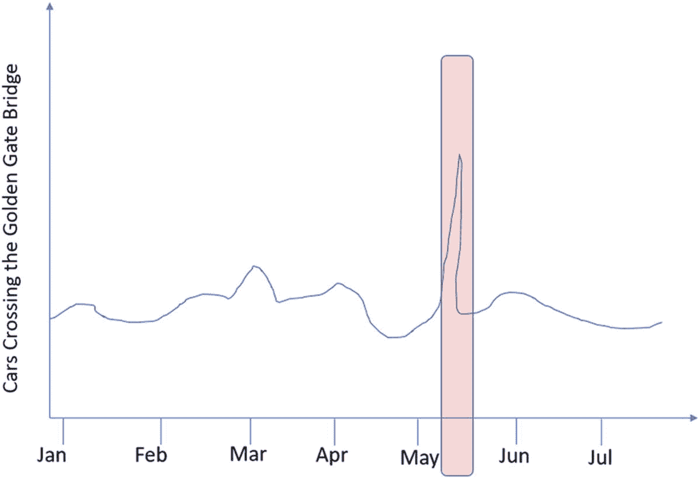

图 8-2

每日穿越车辆数

可能有助于业务的异常检测在很大程度上取决于作为业务操作的一部分而收集的数据的种类，以及作为执行异常检测的策略的一部分而使用的技术和算法的种类。

## 异常检测的真实用例

我们将了解几个垂直行业和业务，以及如何使用异常检测。

### 电信

在电信行业，异常检测的一些用例是检测漫游滥用、收入欺诈和服务中断。那么，我们如何发现电信领域的漫游滥用呢？通过查看蜂窝设备的位置，我们可以将蜂窝设备在任何特定时刻的行为分类为正常或异常。这有助于我们检测该时间段的蜂窝设备使用情况。通过查看我们所知道的关于漫游活动的所有其他信息，我们还可以检测到该蜂窝设备是如何被使用的，以及是否发生了任何漫游滥用。图 [8-3](#Fig3) 展示了您在世界各地旅行时手机的漫游功能。

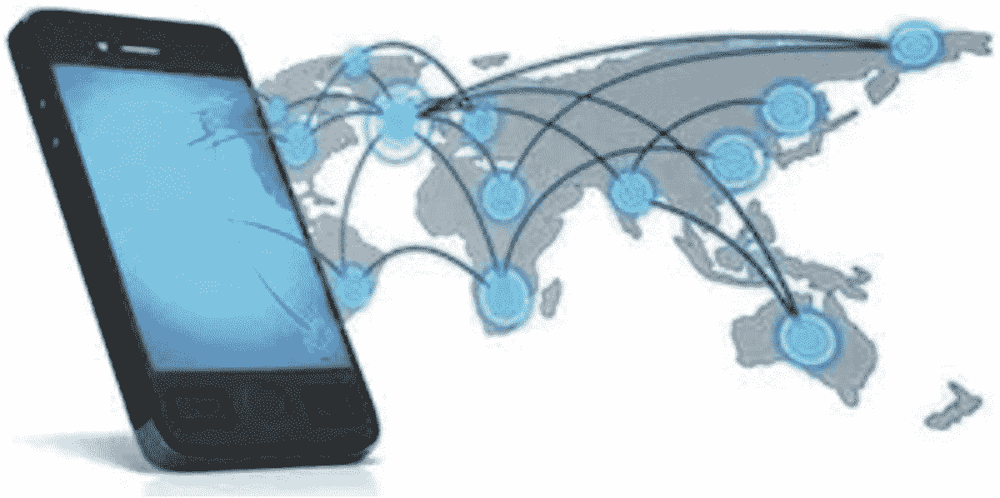

图 8-3

漫步

服务中断是异常检测的另一个影响非常大的用例。蜂窝设备通过遍布各处的信号塔连接到蜂窝网络。您的手机连接到最近的信号塔，以便加入蜂窝网络。在音乐会或足球比赛等涉及大量人群的活动中，通常表现良好的蜂窝塔会严重过载，导致严重的服务中断，并在过载期间造成非常糟糕的客户体验。图 [8-4](#Fig4) 显示了美国西北部的电话服务中断。

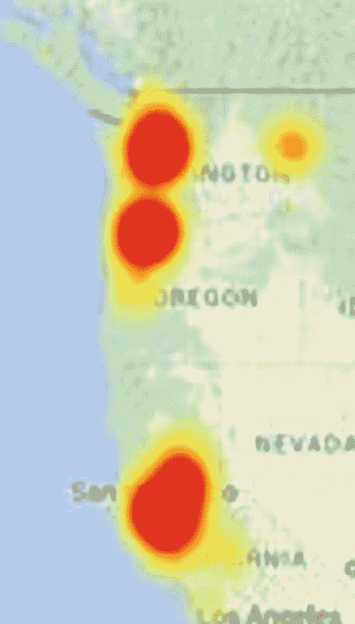

图 8-4

服务中断

如果我们知道手机发射塔和相关设备在某个时间段和长时间内的各种度量，以及我们所拥有的关于发射塔周围活动的典型性质的任何类型的信息，例如附近是否有音乐会或游戏，或者在手机发射塔附近是否预期有重大事件， 我们可以使用一个时间序列作为基础来代表所有这样的活动，然后使用 TCN 或 LSTM 算法来检测与重大事件有关的异常，因为它们具有时间依赖性。 这将有助于了解这些服务是如何被使用的，以及这些服务对于特定的手机信号塔有多有效。

手机公司现在有了一种方法来了解是否需要升级某些时段，或者需要建造更多的发射塔。例如，如果主要的办公楼正在特定的塔附近建造，使用蜂窝网络拥有的所有塔的时间序列数据，有可能检测到网络的其他部分中的异常，并将这些原理应用于可能会受到新建办公楼影响的塔(这将增加数千个手机连接，并可能导致塔过载，并影响塔在不久的将来的使用方式)。

### 银行业务

在银行业，异常检测的一些用例是标记异常高的交易、欺诈活动、网络钓鱼攻击等。世界上几乎每个人都使用信用卡，通常每个人都有特定的使用信用卡的方式，这与其他人不同。因此，使用信用卡的个人有一个隐含的个人资料，包括他们如何使用信用卡，何时使用，为什么使用信用卡，以及他们使用信用卡的目的。如果信用卡公司拥有大量消费者的信用卡使用信息，则可以使用异常检测来检测特定的信用卡交易何时可能是欺诈性的。

自编码器在这种异常检测用例中非常有用。在这种情况下，我们可以获取个人消费者的所有信用卡交易，并捕获这些特征并将其转换为数字特征，这样我们可以基于各种因素以及一种关于交易是正常还是异常的指示符，为每张信用卡分配一定的分数。然后，使用自编码器，我们可以构建一个异常检测模型，根据我们对客户所有其他交易的了解，该模型可以快速确定特定交易是正常还是异常。自编码器甚至不需要非常复杂；它可以只为编码器和解码器设置几个隐藏层，但仍然可以很好地检测信用卡上的异常活动(也称为欺诈活动)。图 [8-5](#Fig5) 是对信用卡诈骗的描绘。

图 8-5

信用卡欺诈的描述

### 环境的

说到环境方面，异常检测有几个适用的用例。无论是森林砍伐还是冰川融化，空气质量还是水质，异常检测都有助于识别异常活动。图 [8-6](#Fig6) 是砍伐森林的照片。

图 8-6

deforestation source:commons . wikimedia . org

让我们看一个空气质量指数的例子。空气质量指数提供了某种可呼吸空气质量的测量，可通过使用放置在该区域不同位置的各种传感器来测量。这些传感器测量并发送将由中央系统收集的周期性数据，在中央系统中从所有传感器收集这种数据。这就变成了一个时间序列，每个测量值都由几个属性或特征组成。每个时间点都有一定数量的特征，然后可以输入到自编码器等神经网络中，我们可以建立一个异常检测器。当然，我们可以用 LSTM 甚至 TCN 来做同样的事情。图 [8-7](#Fig7) 为 2015 年首尔的空气质量指数。

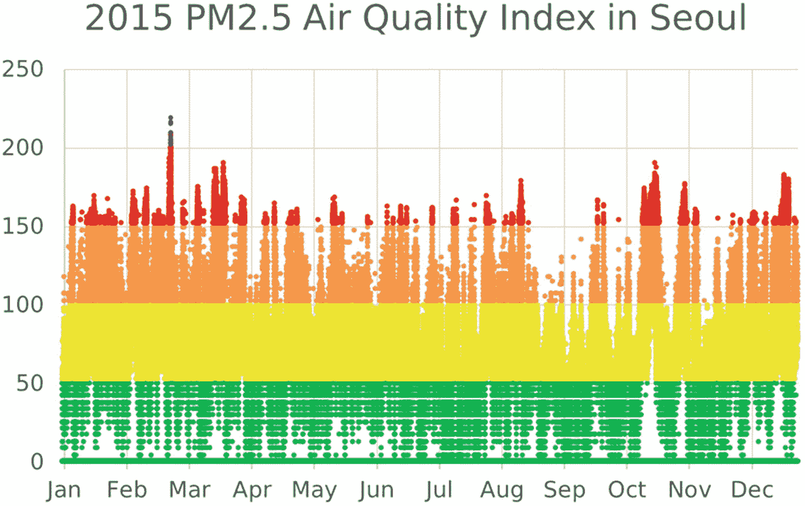

图 8-7

空气质量索引资源:commons.wikimedia.org

### 卫生保健

医疗保健是可以从异常检测中受益匪浅的领域之一，无论是防止欺诈、检测癌症或慢性病，还是改善流动服务等。

医疗保健中异常检测的最大用例之一是从各种诊断报告中检测癌症，甚至在出现任何可能表明癌症存在的显著症状之前。鉴于癌症对任何人的严重后果，这一点极其重要。我们在这里可以使用的一些异常检测技术包括与自编码器结合的卷积神经网络。

卷积神经网络使用维度减少的概念，通过使用神经网络层将大量具有颜色的特征/像素减少到低得多的维度点。因此，如果我们将这种卷积神经网络与自编码器结合起来，我们也可以使用自编码器来查看图像，如 MRI 图像、乳房 x 线照片或医疗保健行业诊断技术中的其他图像。图 [8-8](#Fig8) 是 CT 扫描的一组图像。

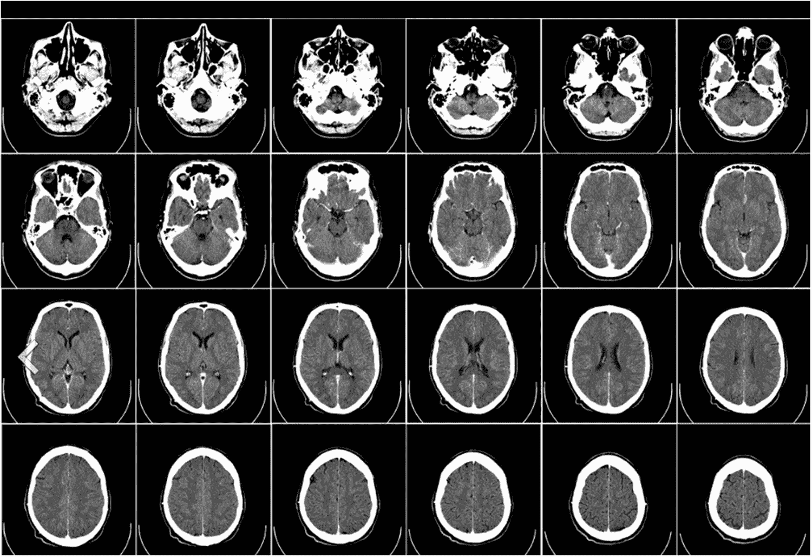

图 8-8

CT 扫描图像资源:commons.wikimedia.org

让我们看另一个用例，检测特定社区居民的异常健康状况。通常，当地医院由特定社区的居民使用。使用这样的数据，医院可以收集和存储来自该社区所有居民的各种健康指标。一些可能的指标是验血结果、血脂谱、血糖值、血压、心电图等。当结合诸如年龄、性别、健康状况等人口统计数据时。，这些信息可能允许我们建立一个复杂的基于人工智能的异常检测模型。

图 [8-9](#Fig9) 显示了通过查看心电图结果观察到的不同健康问题。

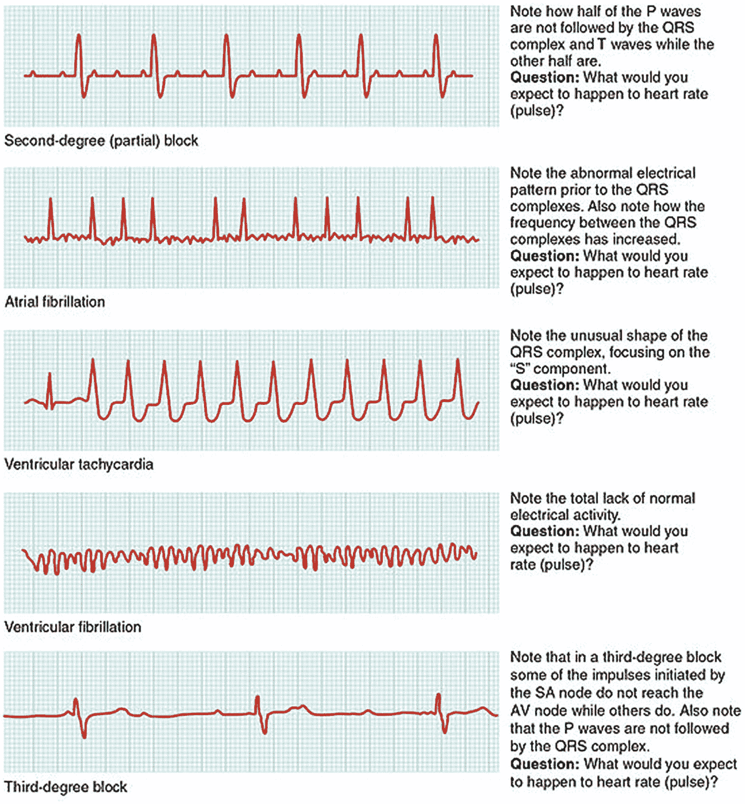

图 8-9

心电图结果资源:commons.wikimedia.org

在医疗保健领域有许多不同的使用案例，我们可以使用不同的异常检测算法来实施预防措施。

### 运输

在交通部门，异常检测可用于确保道路和车辆的正常运行。如果我们可以从道路上运行的所有传感器(如收费站、红绿灯、安全摄像头和 GPS 信号)收集不同类型的事件，我们就可以构建一个异常检测引擎，然后用它来检测异常的交通模式。

异常检测还可以用于查看公共交通时刻表中的时间以及类似交通领域中的相关交通状况。我们还可以从燃料消耗、公共交通支持的乘客数量、季节趋势等方面寻找异常活动。图 [8-10](#Fig10) 是高峰时段突发交通堵塞的图像。

图 8-10

塞车

### 社会化媒体

在 Twitter、脸书和 Instagram 等社交媒体平台中，异常检测可用于检测向每个人发送垃圾邮件的黑客账户、虚假广告、虚假评论等。数十亿人广泛使用社交媒体平台，因此社交媒体平台上的活动量非常高，并且还在不断增长。为了确保使用社交媒体平台的个人的隐私以及确保每个使用社交媒体平台的个人的适当体验，有许多技术可用于增强该系统的能力。使用异常检测，可以检查每个活动的正常和异常行为。

类似地，任何广告平台广告、任何个性化的朋友推荐、个人可能感兴趣的任何新闻文章(例如选举)都可以被处理为异常或异常活动。如果异常检测可以检测到您的 tweets 上的 troll 活动、宣传机器人、假新闻等等，这将是异常检测的一个很好的用例。异常检测也可以用于检测您的帐户是否被接管，因为突然之间，您的帐户可能会发布大量的推文、暂停推文和评论，或者可能会诱骗其他帐户并向其他人发送垃圾邮件。图 [8-11](#Fig11) 显示了一篇关于脸书假新闻的文章。

图 8-11

脸书的假新闻

### 金融和保险

在金融和保险行业，异常检测可用于检测欺诈性索赔、欺诈性交易(如将资金转入和转出该国)、欺诈性差旅费以及与特定保单或个人相关的风险等。金融和保险行业依赖于在处理金融和保险业务时瞄准正确的消费者并承担适当风险的能力。例如，如果他们已经知道一个特定的地区容易发生森林火灾或地震或非常频繁的洪水，保险公司投保你的家需要有所有的工具，他们可以得到他们的手，以量化风险的数量时，涉及到书面的政策，为房主保险。

异常检测还可以用于检测电汇欺诈，即使用多个不同的账户将大量资金转入和转出该国，考虑到每小时可能发生的巨大交易量，人眼很难人工浏览和发现这种情况。这是可行的，因为人工智能技术可以在非常大量的数据上进行训练，以检测非常新的和创新的电信欺诈，这超出了任何人或许多已经存在几十年的统计技术的能力。深度学习确实解决了金融和保险行业的一个非常大的问题，随着图形处理单元(GPU)的出现，这正在许多非常难以破解的用例中成为现实。异常检测和深度学习可以结合使用，以满足业务需求。图 [8-12](#Fig12) 显示了抵押贷款欺诈报告趋势。

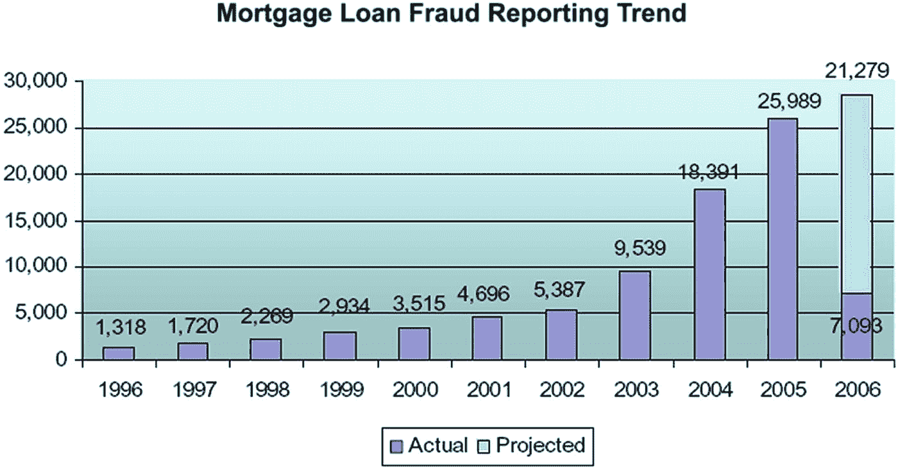

图 8-12

抵押贷款欺诈报告趋势

### 网络安全

异常检测的另一个用例是在网络安全或网络中。事实上，异常检测的最早使用案例之一是在几十年前，当时仅使用统计模型来尝试检测对网络的任何入侵尝试。在网络安全领域，可能会发生很多事情。最普遍的攻击之一是拒绝服务(DOS)攻击。当对您公司的网站或门户发起拒绝服务攻击以中断对客户的服务时，通常会动员大量机器对您的门户同时运行连接和随机的无用事务(可能正在为客户处理某种支付服务)。结果，门户无法响应客户，最终导致非常糟糕的客户体验和业务损失。

异常检测可以检测异常活动，因为我们正在根据长时间收集的数据训练系统。这些数据包括典型的使用行为、支付模式、活跃用户数量、特定时间的支付金额，以及支付门户的季节性行为和其他趋势。当针对您的支付门户突然发起 DOS 攻击时，您的异常检测算法很可能会检测到此类活动，并迅速通知基础架构或运营团队采取纠正措施，例如设置不同的防火墙规则或更好的路由规则，以阻止异常或不良行为者发起攻击或延长针对门户的攻击。图 [8-13](#Fig13) 是异常监控网络流量的示例。

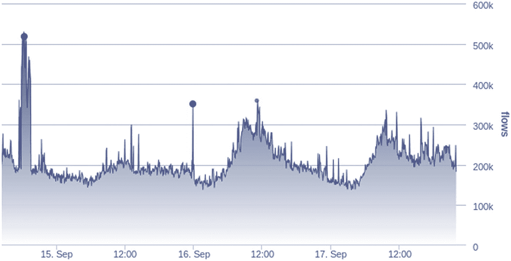

图 8-13

异常监控网络流量

另一个例子是当黑客试图进入一个系统时，假设他们首先能够设置一个木马来进入网络。通常，该过程涉及大量扫描，如端口或 IP 扫描，以查看服务运行时网络中存在哪些机器。这些机器可能正在运行 SSH 和 telnet(这更容易被破解)，黑客可能会尝试利用 telnet 或资产服务的漏洞发起几种不同类型的攻击。最终，其中一台目标机器会做出响应，黑客将进入系统并继续渗透内部网络，直到他们达到目的。

通常，网络有一个使用模式，有数据库服务器、web 服务器、开发服务器、工资系统、QA 系统和面向最终用户的系统。通常，众所周知的预期行为会持续很长一段时间。然后，在很长一段时间内，观察到并预期会有一种变化，即如何使用机器以及如何使用网络。我们还可以测量机器之间的对话方式，以及通过哪些服务/端口。

使用异常检测，我们可以检测特定机器上的特定端口或服务是否以异常速率连接或处理，这意味着正在发生某种入侵活动，一些入侵者试图侵入特定系统。这对于运营团队来说是非常有价值的信息，他们可以迅速召集网络安全专家，尝试深入了解实际情况，并采取任何类型的预防或主动措施，而不是重新激活。这可能是企业继续运营或关闭(至少暂时关闭)的区别。曾经有过这样的例子，一次网络安全入侵几乎使一个企业破产，造成数亿美元的损失。这就是网络安全领域对深度学习非常感兴趣的原因，涉及深度学习异常检测的用例是当今网络安全和网络领域的一些顶级用例。图 [8-14](#Fig14) 显示了不同服务端口上 TCP 连接数量的异常。

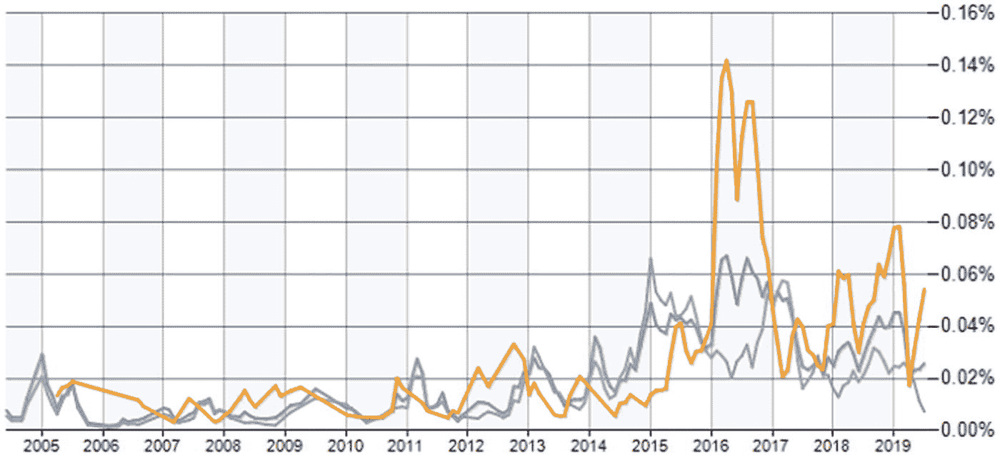

图 8-14

服务端口上的 TCP 连接

并非所有的使用案例都是网络安全或网络方面的悲观预测；异常检测还可以用于确定我们是否需要升级一些系统，我们的系统是否能够支持现在和未来的流量，是否需要进行任何节点容量规划以使一切恢复正常，等等。这对运营团队来说也非常重要，这样他们就可以了解是否有一年前没有预见到的趋势正在影响网络的正常到异常行为。当为时已晚时，现在就知道而不是以后知道是非常重要的，并且开始主动地计划处理在我们的网络中针对某些特定机器发生的这种原始流量或交易。

### 视频监控

异常检测变得极其重要的另一个领域是视频监控。如今，无论你走到哪里，都能看到安全摄像头和视频监控系统:当地的学校、当地的公园、主要街道、邻居家附近，或者你自己家里。关键是，视频监控会一直存在。鉴于智能应用和智能手机的所有新技术进步，这肯定不会很快改变。相反，我们应该期待更多的视频监控。在不久的将来，我们将会看到更多的智能汽车和自动驾驶汽车。它们还依赖于使用实时分析和检测各种对象对视频进行连续处理。与此同时，他们也能发现任何异常。在严格的安全视频监控意义上，异常检测可用于检测正在查看您后院的特定摄像机的正常情况。当检测到特定的异常是因为你家附近有某种运动时，比如野生动物，甚至是在你家草坪上行走的入侵者，你家的安全系统能够发现这是不正常的。为了让摄像机有效地做到这一点，制造商训练了非常复杂的机器学习模型，以实时评估视频信号。来自摄像机的馈送被确定为正常或异常。例如，如果你在州际公路上驾驶一辆自动驾驶汽车，汽车的视频将根据道路的外观，标志应该在哪里，树木应该在哪里，下一辆汽车应该在哪里，清楚地指示现在什么是正常的。使用异常检测，自动驾驶汽车可以避免道路上发生任何异常，然后在任何糟糕的事情发生之前采取纠正措施。

图 [8-15](#Fig15) 是一个物体探测视频监控系统。

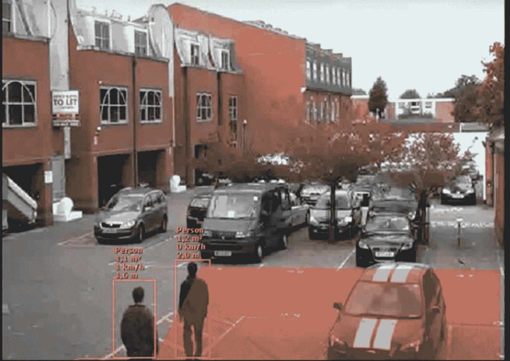

图 8-15

目标检测视频监控系统

### 制造业

异常检测也在制造业中大量使用。具体来说，由于当今大多数制造业涉及机器人和大量自动化，异常检测可用于检测制造系统部件的故障或即将发生的故障。

在制造业中，由于所有正在发生的自动化，人们非常重视实时或接近实时地收集各种传感器和其他类型的指标。该数据可用于构建复杂的异常检测模型，以尝试检测是否存在任何即将发生的问题，这些问题将很快在工厂或制造周期中被发现。

异常检测及其在商业中的应用的另一个例子是石油和天然气平台。一个石油和天然气平台通常具有数千个以各种方式相互连接的组件，以使设备发挥功能。不用说，所有组件都可以使用传感器进行监控，这些传感器对其所连接的组件的各种参数进行特定测量。所有这些传感器都可以成为物联网平台的一部分。如果您可以从连接到成千上万个组件的成千上万个传感器收集所有传感器输出，那么我们就有可能在更长的时间内收集此类数据，并训练复杂的异常检测模型，如自编码器、LSTMs 和 TCNs。

图 [8-16](#Fig16) 显示了带有传感器读数的制造工厂。

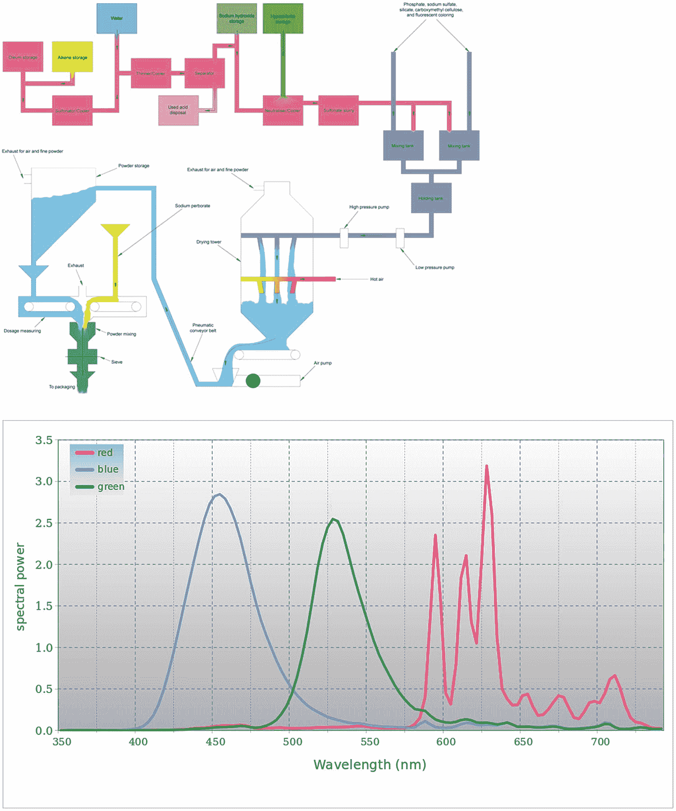

图 8-16

带有传感器读数的制造工厂

### 智能家居

另一种也利用异常检测的业务是智能家居系统。智能家居有许多集成的组件，如智能恒温器、冰箱和互联设备，它们都可以相互通信。假设你有一台亚马逊 Alexa。Alexa 可以与你的智能灯对话，智能灯使用智能灯泡。所有组件都可以在你的智能手机上使用一个非常智能的应用程序。甚至恒温器也是相互连接的。那么在这个用例中，我们如何真正使用异常检测呢？一个简单的方法是监控你如何在所有天气条件下将恒温器设置为最佳温度，并遵循某种建议或推荐的行为。因为每个家庭的恒温器在某种程度上都是个性化的，所以可能会有一种非常好的深度学习算法，它会不断地在所有房子(包括你的房子)中寻找恒温器，然后可以检测出你是如何正常使用它的。图 [8-17](#Fig17) 是智能家居的示意图。

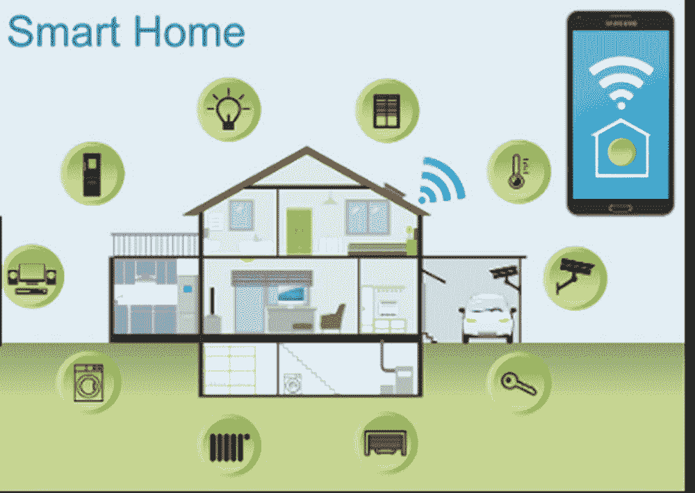

图 8-17

智能家居

### 零售

另一个使用异常检测算法的大行业是零售业。在零售行业中，有一些特定的用例，例如在商品和服务的分配方面供应链的效率。顾客的退货也很有趣，因为退货很棘手:有时清仓甩卖比重新进货成本更低。

从销售产生的收入以及规划未来产品和销售策略的角度来看，关注客户销售也是至关重要的，尤其是在更好地瞄准消费者的时候。图 [8-18](#Fig18) 显示了产品的历史销售数据。

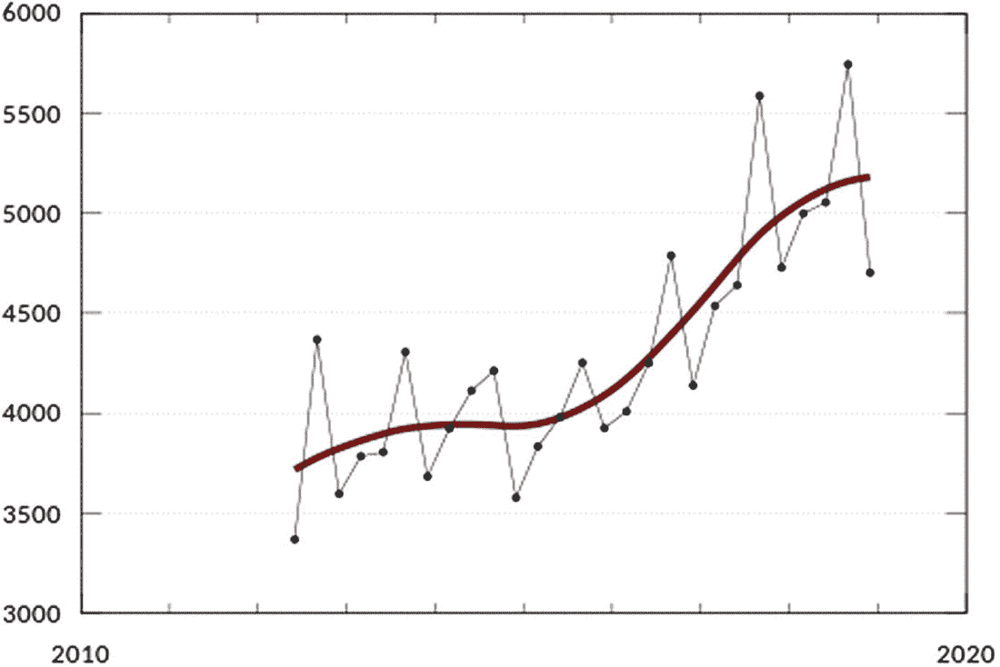

图 8-18

产品的历史销售数字

## 基于深度学习的异常检测的实现

给定这些不同行业中的这些用例，在您的组织或企业中建立异常检测实践的关键步骤是什么？

异常检测中涉及的关键步骤如下:

*   确定业务用例，并与期望保持一致

*   定义什么数据是可用的，并理解它和数据本身的性质

*   建立消费数据的流程，以便对数据进行处理

*   建立要使用的模型类型

*   关于如何使用和执行模型的战略讨论

*   调查结果和反馈分析对业务的影响

*   将日常业务活动中使用的模型运维化

特别是，我们对模型是如何构建的以及我们应该使用什么类型的模型非常感兴趣。所使用的异常检测算法的类型几乎影响了我们试图从这种异常检测策略中得到的一切。这又取决于可用数据的类型，以及数据是否已经被标记或识别。决定哪种类型的异常检测最适合特定用例的一个影响因素是它是点异常、上下文异常还是集体异常。我们还有兴趣了解数据是某个时间点的瞬时快照，还是持续发展或不断变化的实时时间序列数据。同样重要的是数据的具体特征或属性是分类的还是数值的、名义的、顺序的、二进制的、离散的还是连续的。知道数据是否已经被标记或者是否提供了关于该数据是什么的某种提示也是非常重要的，因为它可以将我们导向监督、半监督或无监督算法的方向。

虽然技术和算法可供使用，但实现基于深度学习的异常检测方法存在几个关键挑战:

*   很难将 AI 整合到现有的流程和系统中。

*   所需的技术和专业知识是昂贵的。

*   领导力需要接受人工智能能做什么和不能做什么的教育。

*   人工智能算法不是天生智能的；相反，他们通过分析“好”数据来学习。

*   “文化”需要改变，尤其是在大公司。

## 摘要

在这一章中，我们讨论了商业环境中异常检测的实际使用案例。我们展示了异常检测如何用于解决许多企业中的实际问题。每个业务和用例都是不同的，所以虽然我们不能复制/粘贴代码来构建一个成功的模型来检测任何数据集中的异常，但本章涵盖了许多用例，让您了解思考过程背后的可能性和概念。

请记住，这是一个不断发展的领域，对现有算法的不断发明和增强，这意味着未来的算法不会看起来一样。就在几年前，RNN(循环神经网络)是时间序列的最佳算法，但现在 LSTM(第 [6](6.html) 章)被大量使用，而 TCN(第 [7](7.html) 章)将成为处理时间序列的未来。甚至自编码器也发生了相当大的变化；传统的自编码器已经演变成各种各样的自编码器(第四章)。RBM(第 [5](5.html) 章)已经不常使用了。

在下一章，附录 A，我们将看看 Keras，这是一个流行的深度学习框架。