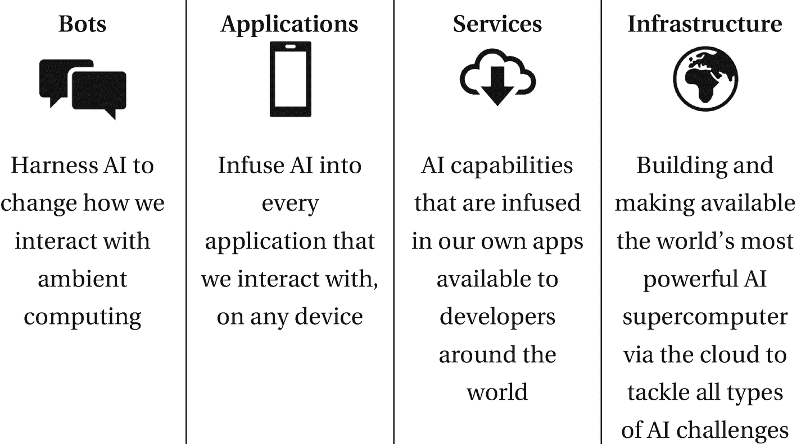
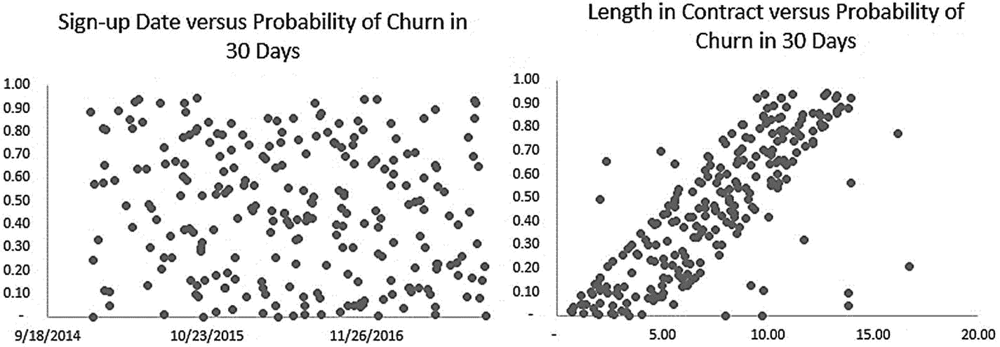
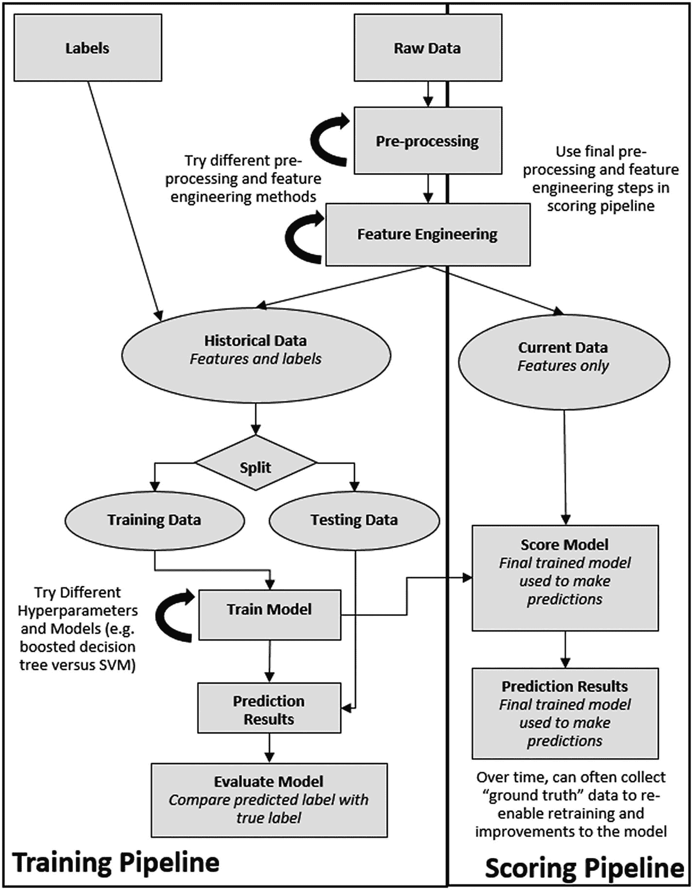
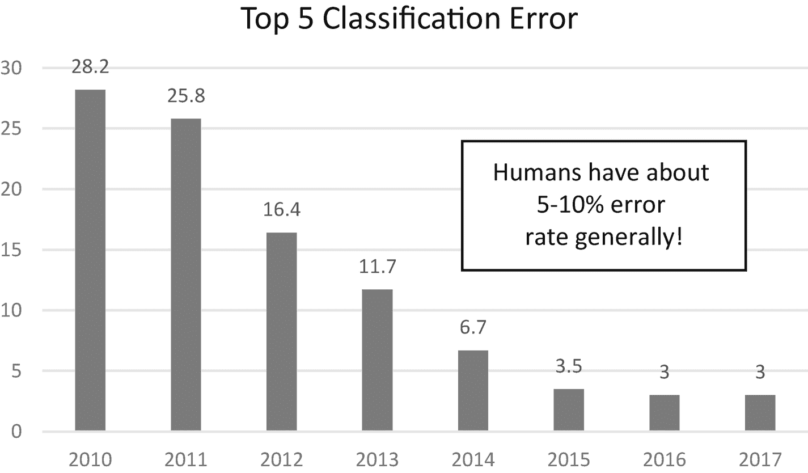
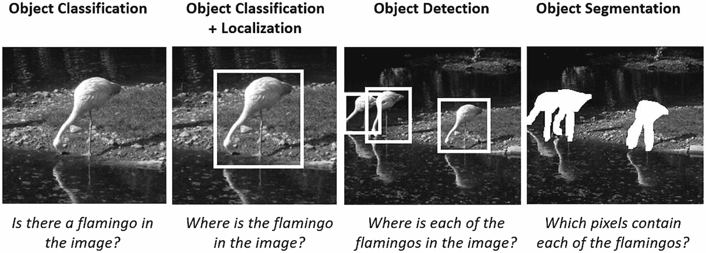
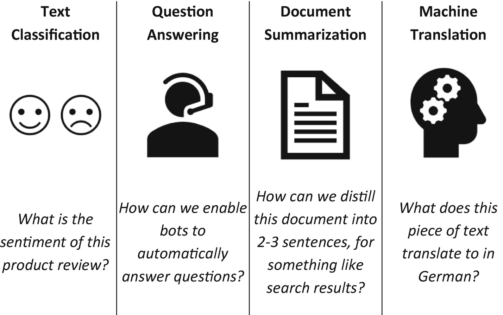
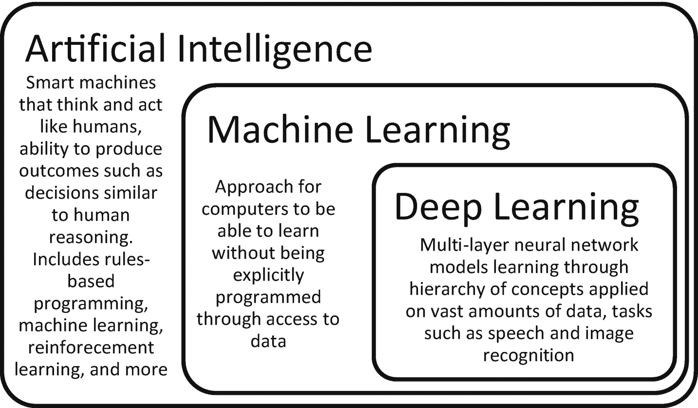

# 一、人工智能导论

智力可以有多种定义，例如，从学习处理新情况的能力到根据某种标准做出正确决定的能力(Bengio，2010)。标准计算机甚至基本计算器在某些方面可以被认为是智能的，因为它们可以根据人类编程的规则计算结果。计算机对于算术计算等日常操作非常有用，而且随着时间的推移，它们处理这些问题的速度和规模都大大提高了。

然而，许多人类天生的任务——如感知和控制任务——极难编写正式的规则或程序供机器执行。通常很难将信息处理和决策背后的所有知识和思维过程编纂成一个机器可以执行的正式程序。另一方面，人类在其一生中可以通过观察和经验收集大量数据，从而实现这种人类水平的智力、抽象思维和决策。

人工智能(AI)是一个广泛的研究领域，包括复杂的问题解决和类似人类的感知、行动和推理能力。人工智能的一个目标是创造像人类一样思考和行动的智能机器，具有模拟智能和通过类似于人类推理的过程做出决定的能力。这一领域涵盖了各种方法，从以前仅由智能生物(例如算术计算器)执行的任务的规定的、不变的算法，到试图使机器能够学习、响应反馈和从事抽象思维。

人工智能正在以越来越快的速度改变我们周围的世界，包括个性化体验、手机等设备中的智能个人助理、语音到语音翻译、自动化支持代理、精准医疗以及可以识别物体并做出适当反应的自动驾驶汽车等等。即使通过搜索或微软 Office 365 等产品，人工智能也正在对大多数人的日常生活产生有益的影响。就人类与计算机的交互方式而言，技术已经从互联网的早期走了很长一段路。人们越来越期望人类能够以智能的方式获取信息，并能够与以自然方式访问信息的设备进行交互。创造这些类型的体验通常需要某种类型的人工智能。

> 人工智能将颠覆每一个商业应用——无论是银行、零售和医疗保健等垂直行业，还是销售、营销和客户支持等横向业务流程。
> 
> —Harry Shum，微软人工智能和研究执行副总裁

当然，随着人工智能和智能系统的兴起，潜在的缺点和担忧也随之而来。尽管基于人工智能的潜在变革性体验和解决方案，但人工智能的创造者和用户都必须认识到一些重要的伦理问题。技术将继续塑造劳动力和经济，就像过去一样，人工智能将一些任务自动化，并增强人类在其他方面的能力(Brynjolfsson & Mitchell，2017)。媒体的描绘经常是人类与机器的较量，而这种情况在电脑玩游戏，尤其是与人类玩游戏的故事中变得更加严重。几十年来，计算机已经能够在国际象棋等游戏中击败人类，但随着最近人工智能的进步，计算机也可以在更复杂的游戏中超越人类的能力，在这些游戏中，蛮力计算能力并不实用，例如抽象的棋盘游戏围棋或视频街机游戏吃豆人女士(Silver et al .，2016；van Seijen，2017)。

然而，我们认为讨论不应该局限在人类与机器的二元对立中。开发能够增强人类能力的人工智能非常重要，因为人类拥有“创造力、同理心、情感、身体和洞察力”，可以与人工智能和机器的能力相结合，快速对大数据进行推理，以解决一些社会最大的问题(纳德拉，2016)。毕竟，当今世界上有丰富的信息可供我们学习，但我们受到人类在有限时间内吸收这些信息的能力的限制。人工智能可以帮助我们在有限的时间内实现更多的目标。

当然，由于算法不会总是得到正确的答案，因此需要采取保护措施。然后，关于“权利”到底是什么意思还有争论。尽管计算机被认为是中立的，因此体现了包容和尊重每个人的价值，但数据和编程到人工智能系统中的代码中可能存在隐藏的偏见，可能导致不公平和不准确的推论。在人工智能系统的开发和改进过程中，数据和隐私问题也需要得到解决。因此，用于人工智能开发的平台需要内置隐私、透明和安全保护。尽管我们距离人工一般智能和流行文化和科幻作品中因具有超级智能的计算机而导致人工智能系统失控的许多描述还很远，但人工智能的这些类型的法律和伦理影响是至关重要的。

我们仍然处于人工智能融入我们生活的早期，但一个大的转变已经在进行中。特别是由于过去几年的进步和平台的可用性，如微软人工智能平台，人们可以轻松地构建人工智能应用，我们将看到许多创新和变化。最终，这种变化将意味着人类和机器以更无缝的方式合作的更多情况。想象一下，当我们努力利用人工智能解决一些世界上最大的挑战，如疾病、贫困和气候变化时，会有什么样的可能性(纳德拉，2017)。

## 微软和人工智能

人工智能是微软战略的核心，“为智能云和注入了人工智能的智能边缘构建一流的平台和生产力服务”(微软 Form 10-K，2017)。虽然这种说法很新，但 AI 对微软来说并不新鲜。创始人比尔·盖茨相信，有一天计算机将能够看到、听到并理解人类及其环境。微软研究院成立于 1991 年，旨在解决一些基础性的人工智能挑战；许多最初的解决方案现在都嵌入在 Office 365、Skype、Cortana、Bing 和 Xbox 中。这些只是微软产品中的一部分，这些产品融入了人工智能的许多不同应用。甚至在 1997 年，具有自动垃圾邮件过滤功能的 Hotmail 就建立在一种人工智能系统的基础上，该系统的分类随着时间的推移随着数据的增加而改进。

今天让我们来看几个具体的例子。当你用 60 多种支持的语言中的任何一种说话时，PowerPoint 的一个名为演示翻译的插件可以直接在 PowerPoint 演示文稿上显示字幕；借助语音识别和自然语言处理技术，您还可以直接翻译幻灯片上的文本，以另一种语言保存您的演示文稿版本(Microsoft Translator，2017)。SwiftKey 是一种智能键盘，被超过 3 亿台 Android 和 iOS 设备使用，它从 10 万亿次击键中学习了你想要键入的下一个单词，节省了 10 万年的时间(微软新闻，2017)。

Bing 由人工智能驱动，具有智能搜索和智能回答功能，占美国所有 PC 搜索量的三分之一以上。持续的发展，如视觉图像搜索和将 Reddit 对话引入 Bing 答案的新合作伙伴关系，继续为搜索注入智能(Bing，2017b)。个人人工智能助理 Cortana 帮助回答了 13 个国家超过 1.48 亿活跃用户的超过 180 亿个问题(Linn，2017)。Seeing AI 的推出是为了通过自动描述附近的人、物体和文本的视野来帮助盲人和低视力群体。

虽然这些技术被注入到许多产品和应用中，但微软还旨在使人工智能技术民主化，以便其他人可以在其服务和平台的基础上构建智能解决方案。微软的研究和人工智能集团成立于 2016 年，旨在汇集工程师和研究人员，推动人工智能的发展，并将人工智能应用和服务推向市场。如图 [1-1](#Fig1) 所示，微软正在采取四管齐下的方法:

图 1-1

微软民主化人工智能的四管齐下的方法

1.  允许我们与人工智能交互的代理，如 Cortana 和通过微软机器人框架启用的机器人。

2.  注入人工智能的应用，如 PowerPoint Translator。

3.  允许开发人员利用这种人工智能的服务，如认知服务手写识别应用编程接口(API)。

4.  允许数据科学家和开发人员构建定制人工智能解决方案的基础设施，包括加速开发过程的专门工具和软件。

因此，微软和更大的开源社区内使用的 Azure 云和人工智能技术的庞大基础设施现在可供希望构建自己的智能应用的组织使用。Azure 上的微软人工智能平台是一个开放、灵活的企业级云计算平台，在第 [4](04.html) 章中有更详细的讨论。作为微软云平台力量的一个简单例子，2016 年，微软 FPGA 结构的一个节点就能够在 2.5 秒内将小说*战争与和平*的全部 1440 页从俄语翻译成英语。然后使用整个功能而不仅仅是单个节点，维基百科的所有内容都可以在不到十分之一秒的时间内完成翻译(微软新闻，2017)。微软专注于创建注入人工智能的代理和应用，然后通过服务和基础设施提供相同的技术。我们处于人工智能可能性的冰山一角，通过这些人工智能技术的民主化，世界各地的许多挑战将得到解决。

> 我们正在追求人工智能，这样我们就可以让每个人和每个机构拥有人工智能工具，这样他们就可以继续解决我们社会和经济最紧迫的问题 *。*
> 
> —微软首席执行官塞特亚·纳德拉

## 机器学习

虽然人工智能有许多子领域和应用，但机器学习(ML)已经成为当今许多人工智能应用的实用工具，并且是本书的重点。ML 是计算机科学的一个分支，通过访问计算机学习的数据，教会计算机处理信息和做出决策。关于这个主题有许多优秀的参考资料，超出了本书的范围。例如，典型的 ML 任务包括分类、回归、推荐、排序和聚类。因此，人工智能是一个比人工智能更广泛的概念，因为人工智能是人工智能中的一个研究领域，围绕着一旦获得正确类型的数据，机器就可以自我学习的想法(Marr，2016)。

对于经典的 ML 方法，有一些成熟的方法来利用本身已经是有用的特征或表示的数据点，例如捕捉年龄、性别、在线点击次数或温度传感器读数的数据点。计算机学习如何对这些输入特征集和它们试图预测的结果之间的关系进行建模；人类选择的算法限制了计算机能够学习的模型类型。人类还手工制作数据的表示，这一步骤通常被称为*特征工程* *，*，并将这些表示输入到 ML 模型中进行学习。最常见的 ML 类型是受监督的机器学习，其中模型具有标签，这些标签被认为代表要学习的基本事实。计算机学习模型中参数的过程通常被称为*训练。*

例如，假设一家电信公司的目标是解决客户流失问题。这里描述了他们使用传统的监督 ML 技术来解决这个问题的过程。他们希望识别出可能流失的客户，这样他们就可以主动出击，给他们留下来的激励。为了建立这一模型，他们将首先收集相关的原始输入数据，如其客户的使用模式和人口统计数据，如表 [1-1](#Tab1) 中所示。

表 1-1

示例原始表捕获来自电信公司客户的信息，这些信息需要在输入机器学习模型之前进行处理

<colgroup><col class="tcol1 align-left"> <col class="tcol2 align-left"> <col class="tcol3 align-left"> <col class="tcol4 align-left"> <col class="tcol5 align-left"> <col class="tcol6 align-left"></colgroup> 
| 

**客户信息**

 | 

**电话记录**

 |
| --- | --- |
| **名称** | **性别** | **报名日期** | **名称** | **通话时长** | **日期** |
| 玛丽 | F | 29.01.2011 | 玛丽 | Twelve | 30.01.2011 |
| 托马斯 | M | 20.06.2013 | 玛丽 | one | 01.02.2011 |
| 丹妮尔（f.） | F | 05.05.2014 | 玛丽 | three | 01.02.2011 |
| 威孝 | M | 01.09.2012 | … | … | … |
| 马太福音 | M | 15.11.2012 | 托马斯 | Twenty-two | 21.06.2012 |
| ILIUM 的复数 | M | 19.02.2013 | … | … | … |
| … | … | … |   |   |   |

在原始输入数据上完成了一些预处理，如按一定的时间尺度组织数据、根据需要聚合数据点，以及将与客户是否搅动相关的不同表连接在一起。接下来是功能工程，以创建这些客户数据的表示，并输入到模型中，例如创建一个表示与电信公司合作时间长度的功能，该功能是根据客户注册服务的日期找到的。创建数据的相关表示对于 ML 模型能够辨别数据中的模式非常重要，并且通常受到领域知识的严重指导，例如，如图 [1-2](#Fig2) 所示。

图 1-2

数据的表示非常重要；例如，在任何给定的时间点检查注册日期可能揭示出与 30 天内的流失概率几乎没有关系，但是在该时间点检查合同的长度可能揭示出很强的关系，因为如果个人已经在合同中呆了更长的时间，他们更有可能在 30 天内流失

然后，历史结果，例如，在一定时间内客户是否搅动的标签，将与这些数据匹配，并用于监督 ML 算法的训练过程，如表 [1-2](#Tab2) 所示。将经过训练的模型应用于一组保留的测试数据，以了解它对新客户的推广程度，将根据它对历史客户流失结果的预测程度来评估该模型。在反复进行预处理、特征工程和模型选择过程(尝试不同的模型以找到最佳渠道)之后，这将被应用于新的原始客户电信数据，以预测未来哪些客户可能流失。

表 1-2

简单特征工程的示例输出以及与未来 30 天内流失标签的匹配

<colgroup><col class="tcol1 align-left"> <col class="tcol2 align-left"> <col class="tcol3 align-left"> <col class="tcol4 align-left"> <col class="tcol5 align-left"></colgroup> 
| 

**名称**

 | 

**月**

 | 

**总通话时间最小值**

 | 

**与电信公司合作的月份**

 | 

**未来 30 天的流失**

 |
| --- | --- | --- | --- | --- |
| 玛丽 | 2.2011 | forty-four | Zero | Zero |
| 玛丽 | 3.2011 | Fifty-one | one | Zero |
| … | … | … | … | … |
| 托马斯 | 6.2013 | One hundred and fifty-two | Zero | Zero |
| 托马斯 | 7.2013 | Two hundred and one | one | Zero |
| 托马斯 | 8.2013 | One hundred and twenty | Two | one |

### 注意

在这种情况下，0 表示个人没有流失，1 表示个人确实流失了。

如图 [1-3](#Fig3) 所示，这种传统的监督式 ML 方法适用于许多问题，并已在许多行业广泛使用。在运营和劳动力管理中，ML 已被用于预测性维护解决方案和智能建筑管理，以及增强的供应链管理。例如，罗克韦尔通过监测海上钻井平台泵的健康状况的预测性维护解决方案，每天能够节省高达 30 万美元(微软，2015 年)。在营销和客户关系场景中，ML 用于创建个性化体验，进行产品推荐，并更好地预测客户获取和流失。在金融领域，欺诈检测解决方案和金融预测通常由 ML 支持的解决方案辅助。

图 1-3

经典监督机器学习解决方案的方法

## 深度学习

尽管传统的 ML 方法对于前面讨论的许多场景都工作得很好，但是世界的大部分是以不具有容易提取的语义的表示来量化的，例如音频片段或图像中的像素。

例如，给计算机编程来识别图 [1-4](#Fig4) 中的每一幅图像中是否有火烈鸟将会非常困难。这些图像以 0 到 255 像素值的矩阵形式呈现给计算机。标准彩色图像具有红色、绿色和蓝色三个通道，因此图像可以表示为三个二维矩阵。甚至很难定义哪个数值组合代表粉红色，更不用说处理它们来识别火烈鸟了。即使采用传统的 ML 方法和手工制作的特征来识别图像的部分，如喙、羽毛和腿，也需要非常专业的知识和大量的时间投入，才能在计算机可以学习的大量图像之上，根据原始像素值构建不同的表示。

图 1-4

示例图像，其中具有人工智能的机器可能会被问到需要它处理、理解和推理的问题。一个例子是这些图像中是否有火烈鸟，传统机器学习方法的手工制作特征非常困难和耗时。

类似地，传统的自然语言处理需要复杂且耗时的特定于任务的特征工程。在处理语音时，不同的语言、语调、环境和噪音会产生微妙的差异，这使得制作相关特征变得极其困难。

深度学习是本书的重点，是人工智能和人工智能的另一个子领域，特别是在没有图像、音频和文本数据等容易提取的语义的这类问题上表现出了希望(古德费勒、本吉奥和库维尔，2016)。通过深度学习方法，多层深度神经网络(DNN)模型被应用于大量数据。深度学习模型往往有数百万个参数；因此，它们需要非常大的训练集来避免过度拟合。该模型的目标是从输入映射到输出(例如，图像中的像素到图像的分类，如火烈鸟；音频剪辑到抄本)。原始输入通过一系列函数进行处理。基本思想是，受监督的深度学习模型通过检查大量数据来学习将此输入数据映射到输出分类的函数的最佳权重，并在将预测结果与地面真实标记的数据进行比较时逐渐校正自身。

这些模型和概念的早期变体可以追溯到 20 世纪 50 年代，大致基于人类大脑如何处理信息的想法，被称为*人工神经网络*。模型通过学习模式学习处理数据。首先是简单的图案，如边缘和简单的形状，然后通过模型的许多层组合起来形成更复杂的图案。当前的模型通常包括许多层——一些变体甚至拥有超过一百层——因此有了术语*深度*。因此，该模型通过处理信息的分层性质自动学习高级抽象。

尽管仍然需要对数据进行处理和整形以适应深度学习模型，但不再需要手工制作特征，因为原始输入(例如，图像中的像素值)被直接输入到模型中。模型会自动学习输入数据的特征(属性)。因此，不需要表示图片子部分的特征，例如前面火烈鸟例子中的喙和腿。深度学习方法显示了在输入数据中学习模式的前景，能够直接基于原始输入进行分类，而不是手动构建特征。相反，通常要花更多的时间来选择网络的结构，也称为网络架构，并调整超参数，即在学习过程开始之前就在模型中设置的参数。这就产生了网络架构工程是新特征工程的想法(Merity，2016)。深度学习也在 ML 的几个领域显示出了前景，传统方法也很好，例如预测时间序列中的未来值的预测和旨在预测用户对给定商品的偏好的推荐系统。在第 [2](02.html) 章和第 [3](03.html) 章中分别介绍了深度学习模型的具体类型以及深度学习的最新趋势的更多细节。

### 深度学习的兴起

深度学习背后的基本思想和算法已经存在了几十年，但深度学习在消费者和工业应用中的大规模使用只是在最近几年才出现。两个因素特别推动了人工智能应用，特别是深度学习解决方案的最近增长:云计算加速了计算能力的提高，数字数据的增长。

深度学习模型需要大量的实验，并且经常在大量的训练数据上运行，因此需要大量的计算资源，特别是 GPU 和 FPGAs 等硬件，这些硬件在 DNN 中的计算效率比传统的 CPU 高得多。云计算——通过互联网在共享资源的数据中心远程运行工作负载——提供了更廉价的硬件和计算能力。资源可以按需旋转并在不再使用时暂停，以节省成本，无需投资新硬件。

随着互联网和连接设备的出现，我们的世界越来越数字化，大量数据正在被收集。当然，理解如何组织和利用这些信息对于推进人工智能应用至关重要。改变人工智能研究的一个数据收集项目是 ImageNet 数据集，最初于 2009 年发布，后来演变为一年一度的人工智能算法竞赛，如哪种算法可以以最低的错误率将图像按对象分类(Russakovsky 等人，2015)。深度学习最近成为一种强大的技术，这在很大程度上归功于 ImageNet 数据集的收集。“事实上，如果我们今天看到的人工智能热潮可以归因于一个单一的事件，那就是 2012 年 ImageNet 挑战赛结果的宣布”(Gershgorn，2017)。

具体来说，在 2012 年，深度学习解决方案在对对象进行分类方面比前一年的结果有了显著改善，如图 [1-5](#Fig5) 所示。这一解决方案改变了计算机视觉研究的方向，加速了深度学习在自然语言处理、语音识别等其他领域的研究。继续更高级的深度学习研究，2015 年，微软研究院提交了一个名为 ResNet 的 152 层架构的条目，这是算法首次超越人类分类(何，张，任，【孙，2015)。

图 1-5

ILSVRC 中图像分类的 ImageNet 数据上年度获奖解决方案的五大分类错误率(Russakovsky 等人，2015 年)

这个 ImageNet 数据和竞赛绝不是一个纯粹的学术练习。本次比赛中使用的许多架构通常用于行业，许多基于 ImageNet 数据的预训练模型可供公众使用，许多深度学习计算机视觉应用也是由这项工作播种的。对于迁移学习方法来说尤其如此，这将在第 [2](02.html) 章中详细讨论。

> ImageNet 在人工智能领域改变的一件事是，人们突然意识到制作数据集这种费力不讨好的工作是人工智能研究的核心。人们真正认识到数据集的重要性，它和算法一样是研究的前沿和中心。(格什高恩，2017)
> 
> —李菲菲

当然，正如人们可能从过去几年 ImageNet 结果的大幅改进和对微软 ResNet-152 架构的讨论中推断的那样，支持深度学习解决方案的算法和可用于创建此类解决方案的工具也有了最新进展。因此，云计算加速的计算能力、数据的增长(特别是开放标签数据集)以及先进的算法和网络架构一起在过去几年中彻底改变了人工智能的可能性。

深度学习技术不仅可以在图像识别方面超越人类，而且还在推动其他领域，例如在语音识别方面接近人类水平。事实上，深度学习的一些第一次突破发生在语音识别上(Dahl，Yu，Deng，& Acero，2011)。然后在 2016 年 10 月，微软在 Switchboard 数据集上的单词错误率达到了人类的水平，这是一个超过 25 年来用于对人工智能系统进行基准测试的电话录音语料库(Xiong et al .，2016)。这些类型的创新是为什么个人设备和计算机上的语音识别系统在过去几年中有如此大的改进。

同样对于自然语言处理，2018 年 1 月 3 日，微软在维基百科文章组成的 SQuAD machine 阅读理解数据集上达到了 82.6%的得分。使用这些数据，计算机阅读一份文件并回答一个问题，并被发现在答案上胜过人类(人类的表现约为 82.3%；Linn，2017；Rajpurkar，张，Lopyrev，&梁，2016)。

然而，需要注意的是，这些成就是针对特定问题或应用的，并不代表可以推广到新任务的 AI 系统。还可以相对直接地创建计算机失败的例子，即所谓的对抗性例子(贾&梁，2017)。此外，即使只对原始任务稍作修改，系统的性能也会显著下降。例如，尽管现在计算机对一般图像的分类可能比人更好，如前面讨论的 ImageNet 数据所示，但对图像问题给出开放式答案仍然远远达不到人类的表现；截至 2017 年 6 月，视觉问答的 VQA 1.0 数据集(AI Index，2017)的准确率差异超过 10%。

此外，深度学习作为一种通用方法仍有许多限制，如无法推理和缺乏理解。在某些情况下，与传统系统相比，调整深度学习系统也可能更加困难，例如当它在某个方面做得不好时，这在某些情况下可能更容易在具有较少参数的传统 ML 模型中解决。存在其他 ML 和 AI 研究领域，并且比基于深度学习的方法更准确地解决其他类型的问题。深度学习与强化学习等其他人工智能研究领域的结合也有很大潜力。第 [3](03.html) 章讨论了有关最新进展、趋势和局限性的更多细节。

在本书中，我们主要关注人工智能和应用中的深度学习方法，在这些应用中，智能技术可以使用深度学习来创建为人们和企业提供支持的解决方案。例如，这些解决方案包括实现更好的客户参与、产品转型和更好的运营优化。深度学习应用通常可以以这样一种方式开发，即随着时间的推移，随着收集的数据越来越多，它们会不断学习和改进，并经常创建以更无缝的方式连接人和技术的体验。这本书旨在介绍如何使用微软人工智能平台开发深度学习解决方案。对于深度学习的更全面的概述，包括关于理论和高级主题的更多信息，强烈推荐本吉奥、古德菲勒和库维尔(2016)的书。

### 深度学习的应用

图 [1-6](#Fig6) 中显示了一些可以使用深度学习解决的经典计算机视觉问题，例如能够对图像进行分类并在图像中找到对象。这些常见的技术问题是许多不同终端用户应用的基础。例如，照片搜索应用，如微软的照片应用，允许用户键入对物体(如“汽车”)或概念(如“拥抱”)的描述，并返回相关结果，提供了通过使用 DNNs 构建的有用功能。

图 1-6

示例计算机视觉问题

计算机视觉的许多深度学习应用围绕着医疗保健和医疗领域，在医生通常检查患者或视觉测试结果的子领域，如皮肤病学、放射学和眼科。想象一下，放射科医师可以检查数千次扫描，但计算机可以显示并学习数百万次扫描。全球人类将从这些服务的民主化中受益，随着时间的推移，这些服务将变得更加准确和高效。Project InnerEye 就是一个例子，这是微软的一个研究项目，旨在构建用于三维放射图像的自动定量分析的创新工具，以帮助专业医疗从业者。

制造业和公用事业也有很多这样的例子。以 eSmarts 为例，这家位于挪威的电力和公用事业公司提供自动化能源管理系统。他们使用无人机收集电力线的图像，然后使用 DNNs 进行分析，以自动检测故障(Nehme，2016)。具体来说，eSmarts 对图像进行对象检测，以检测光盘，然后预测它们是否有故障。他们将真实图像与他们创造的合成图像混合，以创建足够大的数据集来进行预测。同样，领先的设计和制造解决方案提供商之一 Jabil 正在通过分析其电路板装配线的图像来自动检测缺陷，从而优化制造运营(Bunting，2017)。这样做减少了必须由观察生产线的操作人员手动检查的电路板数量，并提高了生产能力。

分析自然语言数据是深度学习的另一个常见用途。这些应用的目标主要是让计算机处理自然语言、文本分类、回答问题、总结文档以及在不同语言之间进行翻译。自然语言处理往往需要几个层次的处理，从单词和语义的语言层面到词性和实体，再到图 [1-7](#Fig7) 所示的终端用户应用类型(Goldberg，2016)。

图 1-7

从文本进行自然语言处理的示例应用

将音频数据翻译成文本是深度学习的另一个常见应用。一个使用深度学习进行语音识别的示例应用，Starship Commander 是 Human Interact 的一款新的虚拟现实(VR)游戏，其中玩家是科幻宇宙中的活跃代理人(微软客户故事，2017)。人类互动是围绕人类语言在游戏中建立逼真的体验，允许用户通过他们的声音影响游戏的故事情节和方向。为了实现这一点，游戏需要识别语音，并根据用户的潜在意图理解语音的含义。微软的定制语音服务允许开发人员在语音识别系统的基础上进行构建，利用深度学习，可以克服说话风格和背景噪音等障碍。开发人员甚至可以使用自定义脚本进行训练，以识别游戏中的关键词和短语，从而比从头开始构建更快、更容易地构建真正自定义的语音识别系统。

这只是识别单词的第一步——游戏需要理解用户的意思。假设用户正在发出命令来启动船只的引擎。有人可以用很多方式发出命令。微软的语言理解服务推断用户的潜在意图，在游戏识别的语音和用户实际意思之间进行翻译。

> 我们能够开发这样一款产品的唯一原因是，我们正在利用微软的深度学习和语音识别专业知识来提供革命性的娱乐体验。
> 
> ——亚历山大·梅希亚，人类互动的所有者和创意总监

当然，这些只是一些简单的例子，展示了深度学习如何为商业和消费者应用带来价值。例如，深度学习在语音、文本、视觉、预测和推荐器等应用方面显示出巨大的潜力(见图 [1-8](#Fig8) )，我们预计未来将在许多行业和更多应用中看到深度学习的巨大用途。

图 1-8

深度学习解决方案表现出色的示例领域

通过语音和文本而不是菜单与更多应用进行交互，在公司网站或人力资源页面上与机器人聊天以快速解决日常问题，允许自然搜索和操作的创新照片应用，以及从文档中快速找到相关信息，这些只是深度学习将为企业和消费者带来价值的一些示例场景。

## 摘要

本章介绍了人工智能、人工智能和深度学习的概念，如图 [1-9](#Fig9) 所示。正如本章中简要提到的那样，在几十年的研究和技术创新的基础上，微软现在通过建立在云计算平台 Azure 上的微软人工智能平台，提供服务和基础设施，以使其他人能够构建智能应用——包括本书中讨论的强大的深度学习应用。

图 1-9

人工智能、机器学习和深度学习之间关系的可视化

本章还讨论了最近深度学习兴起背后的原因，例如计算能力和数据集大小的增加，特别是对于 ImageNet 等已公开的标记数据。这些技术推动了计算机视觉、自然语言处理、语音识别和时间序列分析等领域的研究。我们还看到了许多基于深度学习的有价值的应用，如医疗保健、制造和公用事业等领域。我们相信这一趋势将会继续，但人工智能研究的其他领域在未来也会有用。

在下一章中，我们将介绍常见的深度学习模型以及开始深度学习所需的方面。在第 [3](03.html) 章中，我们随后将更详细地讨论深度学习和人工智能的一些新兴趋势，以及本章中简要提到的一些法律和道德影响。