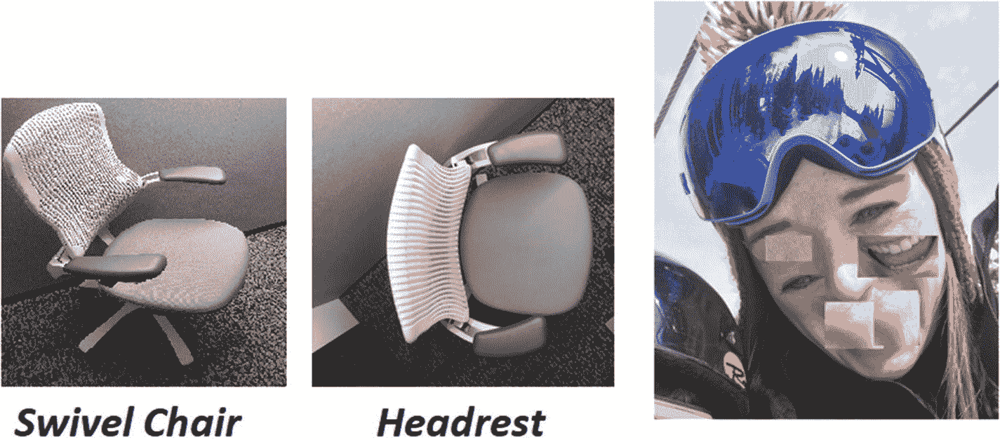
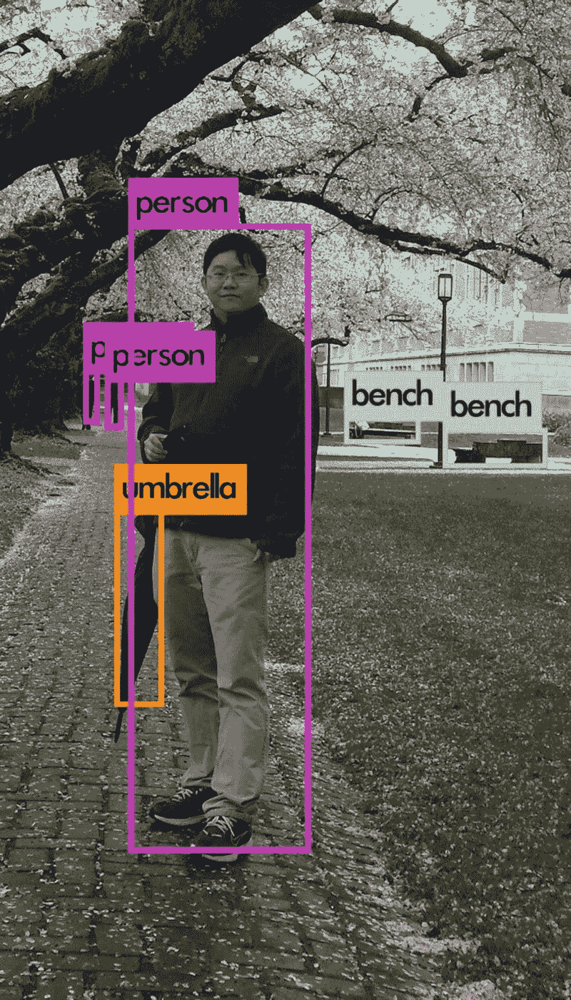
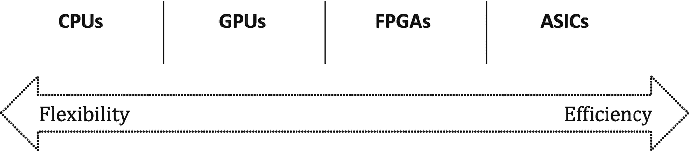
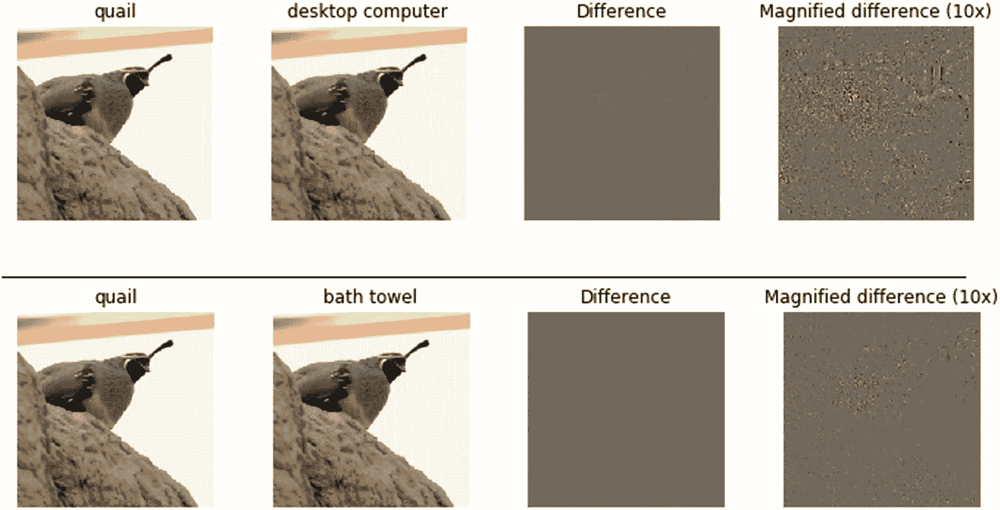

# 3.深度学习的趋势

这一章讨论了深度学习和相关领域的一些趋势。我们具体介绍了哪些趋势可能对哪些任务有用，并讨论了一些可能具有深远影响但尚未应用于许多现实问题的方法和想法。最后，我们简要介绍了深度学习目前的一些限制以及人工智能的一些其他领域，这些领域似乎为未来的人工智能应用带来了希望，并简要讨论了深度学习应用的一些道德和法律影响。

## 网络架构的变化

深度学习领域的第一个趋势是建立更多层的更深网络，以解决日益复杂的问题。然而，训练这样的深度网络是困难的，因为它们更难优化，并且准确性可能会降低而不是提高。如第 [1](01.html) 章所述，微软于 2015 年发布了一个基于剩余学习概念的网络结构，其架构名为 ResNet(何，张，任，【孙，2015)。不是试图学习网络内输入和输出之间的基本关系的直接映射，而是学习两者之间的差异或残差。有了这个概念，比以前使用的网络更深入的网络训练成为可能，152 层的网络赢得了 2015 年关于 ImageNet 数据的 ILSVRC 竞赛。一类称为初始网络的网络侧重于宽架构，其中并非所有层都简单地顺序堆叠，旨在提高神经网络模型的性能和计算效率(Szegedy，Liu 等人，2014)。

### 注意

为了加速开发，从业者应该利用来自研究社区的网络体系结构，如 Resnet-152，而不是试图从零开始构建和训练 CNN。

### 剩余网络和变体

近年来已经有许多建议的网络体系结构，并且这种趋势继续导致更多的网络体系结构选择。许多架构依赖于对 ResNet 的修改，如 ResNeXt、MultiResNet 和 PolyNet (Abdi & Nahavandi，2017；谢，吉尔希克，多拉尔，，何，2017；张，李，洛伊，林，2017)。还考虑了结合不同类型的方法，如 Inception-ResNet (Szegedy，Ioffe 和 Vanhoucke，2016 年)。相比之下，FractalNet 是一种非常深入的架构，不依赖于残差(Larsson，Maire 和 Shakhnarovi，2017)。

### 密集网络

DenseNet 是另一种流行的网络结构，其中每一层都与所有其他层相连；其受欢迎程度在于，它允许通过特征重用大幅减少参数数量，同时缓解与网络训练相关的问题，称为消失梯度(G. Huang，Liu，van der Maaten，& Weinberger，2018)。

### 小模型，少参数

与减少 DenseNet 的参数数量相关，CNN 的另一个趋势是创建更有效的网络，这些网络建立在更少的参数上，并且具有更小的模型尺寸。一般来说，较大的网络能够实现更准确的预测，但有一些聪明的方法可以创建架构并进行模型压缩，以实现接近或相当于较大网络的性能。因此，这些网络可以运行得更快，处理能力更低，这在例如计算能力和存储有限的嵌入式和移动设备上尤其有用。

由 Iandola 等人(2016)介绍的 SqueezeNet 被描述为具有与 AlexNet 相似的精度，参数少 50 倍，模型大小小于 0.5 MB，使用深度方向可分离卷积来减少参数的数量。MobileNet 是专为移动和嵌入式视觉应用设计的另一个例子(Howard et al .，2017)，最近通过 MobileNetV2 进行了扩展。除了设计高效的小型网络之外，替代方案还包括从现有深度网络中修剪权重、修剪过滤器以及在网络内量化权重(Mittal、Bhardwaj、Khapra 和 Ravindran，2018)。例如，通过修剪 VGG16 架构中的某些连接，可以在不修改模型预测的情况下将大小减少 49 倍(Han，Mao，& Dally，2016)。

在实践中，我们建议数据科学家尝试许多基于当前研究的网络结构，这些结构通常可以通过模型动物园和不同的深度学习框架获得，如第 [2](02.html) 章所述。数据科学家必须尝试不同的选项，并考虑各方面之间的权衡，如训练的容易程度和为特定数据集和手头问题所需的模型评分的速度。

### 胶囊网络

CNN 是一个奇妙的架构，也是神经网络复兴的关键原因之一。如前所述，CNN 是在平移不变性的前提下工作的。然而，这种平移不变性是有限的，并且它们具有明显的缺点，这些缺点源于这样一个事实，即它们不处理其他平移，例如输入井的大小、照明和旋转，如图 [3-1](#Fig1) 所示。这通常通过提供许多示例、用翻译的和一般修改的示例扩充数据，以及如前所述的合并层来克服。

图 3-1

CNN 不构建物体的内部表示，因此当从不同的角度观察时，很难理解物体，并且当物体的部分出现故障时，它们可能被愚弄。在这种情况下，当从上面看时，一个模型认为同一把椅子是不同的物体，并且认为这张脸是一个人，即使脸部的某些部分被移动了。胶囊网络被设计成使用逆图形的思想以更自然的方式解决这个问题。

一般来说，CNN 本质上并不关心图像中项目之间的空间和方向关系；他们只关心这些特征是否存在。较高级别的特征只是较低级别的特征的组合。此外，CNN 使用的方法减少了数据的空间维度，实际上增加了感受野，即更高级节点的视野。这允许节点在输入图像的更大区域中检测更高级别的特征。实现这一点的方法之一是最大池化，我们在第 [2](02.html) 章对此进行了解释。然而，通过使用最大池，CNN 失去了空间锐度。由于这个原因，辛顿认为最大池有点令人讨厌，因此他试图设计一种新的架构，胶囊网络(萨布尔，弗罗斯特，&辛顿，2017)。

胶囊网络的灵感来自于逆图形的想法。在传统图形中，我们描述一个对象及其姿态参数，并通过渲染过程，将该对象显示在屏幕上。在逆图形中，我们希望观察一个场景，并从中推断出物体及其姿态。

胶囊网络中的胶囊试图预测场景中给定位置的特定对象的存在和属性。胶囊输出矢量而不是标量，并且矢量的长度编码对象出现在特定位置的估计概率，并且方向编码对象的姿态参数。

胶囊网络还使用一种称为动态路由的新颖方式在层间传递信息。这意味着路由不是预先固定的，而是在执行过程中动态确定的。Sabour、Frosst 和 Hinton (2017)提出的实现这一点的方法称为协议路由。胶囊网络的架构非常类似于 CNN 的架构:胶囊的层彼此接续，较低层的胶囊检测到较低层的特征，而较高层的胶囊组合这些特征以创建较高层的特征。在协议路由中，较低级别的胶囊输出 *n* 维向量，其长度编码了检测到的对象的姿态在 *n* 维空间中的概率及其方向。随后的胶囊层获取所有这些胶囊的输入，然后通过迭代过程确定输入的权重。本质上，每一层的姿态参数的估计与后续层的姿态参数相匹配。匹配越接近，后续胶囊之间的重量越高。向量的标量积被用作相似性的度量。这意味着胶囊之间的权重不是静态的，而是根据存在的胶囊向量而变化。

胶囊网络已经展示了最先进的结果，并且由于其姿态不变性，需要比 CNN 更少的训练样本。然而，由于动态路由的迭代性质，训练它们仍然很慢，它们仍然需要在目前由 CNN 主导的所有计算机视觉领域中证明自己。

### 目标检测

深度学习的另一个趋势是使用元架构，在以前的解决方案基础上构建来解决其他类型的问题。例如，在分析图像时，CNN 的思想和片段被用作超出图像分类问题的主干，以解决诸如对象检测和图像分割的问题。例如，对象检测中的一个基本模型是 R-CNN 模型，其简单地提出使用诸如选择性搜索的区域提议方法在模型外部裁剪每个图像，基于 CNN 模型从每个裁剪的图像中提取特征，然后用支持向量机模型(SVMsGirshick、Donahue、Darrell 和 Malik，2013 年)。在对象检测中，趋势是使用最新的网络架构作为特征提取器，但也出现了改进的元架构以及改进的性能方法。例如，更快的 R-CNN 和 R-FCN 是替代元架构，它们也建立在标准 CNN 上，但也在训练期间使用“锚”预测边界框，这些边界框是以不同位置、比例和纵横比覆盖在图像上的框(Ren，he，Girshick，& Sun，2015；戴，何，孙，2016)。

YOLO 方法(你只看一次:统一的实时对象检测；见图 [3-2](#Fig2) )使用一个简单的 CNN 应用于整个图像(雷德蒙、迪夫瓦拉、吉尔希克、&法尔哈迪，2015)。YOLO 是第一个使实时对象检测实际可行的方法，它不是通过边界框将对象检测作为分类问题，而是作为边界框和相关类别概率的回归问题。其他相关方法，如 SSD、MultiBox 和 YoloV2，最近已经发布，其趋势是提供运行更快的模型，同时旨在保持良好的精度水平(Liu 等人，2015；雷德蒙&法尔哈迪，2016；塞格迪，里德，尔汗，安盖洛夫，&约菲，2014)。

图 3-2

应用预训练的对象检测模型来使用 YOLO 查找对象

在实践中，可能需要根据应用程序是否有实时性能等要求，在设置结果准确性解决方案和推理速度之间进行权衡。不同的元架构、在训练期间做出的选择(例如用作特征提取器的 CNN 架构、图像分辨率、硬件和软件)使得很难对理想方法做出宽泛的概括(J. Huang 等人，2017)。

### 对象分割

最近的许多建议探索了如何减少对对象检测的边界框的需求，并探索了 LinkNet 等分割神经网络模型，以及将更专业的网络用于其他视觉任务，如 CortexNet 用于识别图像上的动作，而不是对单个帧进行分类(Culurciello，2017)。用于密集对象检测的掩模 R-CNN 和焦点损失是对象检测中的其他最新趋势，这些趋势已由脸书人工智能研究所在一个名为 Detectron 的软件系统内开源，因此可在微软人工智能平台上运行(he，Gkioxari，Dollar，& Girshick，2017；林，戈亚尔，吉希克，何，&美元，2017)。这标志着对象分割真正令人兴奋的进展！

### 更复杂的网络

本章讨论的网络类型只是深度学习广阔空间中的一些例子。有许多方法来制定深度神经网络，以及在更广泛的解决方案中与其他方法结合。作为语音翻译领域的一个例子，微软研究院最近在一个大型基准数据集上发现了最先进的结果，即 2014 年在 [`http://bit.ly/2EzMeRY`](http://bit.ly/2EzMeRY) 举行的英法翻译活动，使用了一个被创造出来的审议网络(田，2017)。这个网络建立在一个简单的 LSTM 架构之上，结合了受人类思考方式启发的双重学习。前提很简单:第一遍解码器检查句子，类似于创建一个粗略的草稿，而第二遍解码器将原始输入和粗略的草稿作为输入，以获得最终的解决方案。这只是一个例子，还有许多其他将深度学习技术结合在一起或与其他方法结合作为更大解决方案的一部分的例子。

与 CNN 和 RNNs 相似，gan 的种类和用途也有了很大的发展。GANs 也已经有了许多商业应用。例如，微软与提供库存照片的 Getty Images 合作，探索图像到图像的翻译，例如将阳光明媚的海滩照片变成阴天的海滩照片，为他们的客户提供更多选择(利亚科维奇，巴拉扎和兰泽塔，2017 年)。微软研究院还开发了一个基于 GANs 的“绘图机器人”，它能够仅根据文本描述创建图像，这些图像仅基于计算机的“想象力”(Roach，2018)。为此目的提出的 AttnGAN 模型能够在 2018 年初优于以前的最先进模型，在行业标准测试中，文本到图像生成的图像质量提高了近三倍(Xu 等人，2017)。

### 自动化机器学习

最近几年，最大似然的另一个领域是自动最大似然和智能超参数调整(Bergstra，Yamins，& Cox，2013；多姆汉、斯普林根贝格和胡特，2015 年；Fusi & Elibol，2017；Golovin 等人，2017；李，贾米森，德萨沃，罗斯塔米扎德，&塔尔沃卡尔，2016)。这两个研究领域都试图利用历史信息、优化和元学习，以便能够自动或半自动地获得最佳的最大似然流水线、神经网络拓扑等。

另一项这样的工作围绕着使用强化学习和 LSTMs 来创建新的神经网络架构(Zoph & Le，2016)。强化学习(RL)是人工智能的一个子领域，旨在通过奖励反馈过程，让软件代理自动确定最佳行为，以最大化性能。这是一种自动学习机制。由此产生的名为 NASNet 的 CNN 架构在 2017 年底的 CIFAR10 数据集上取得了最先进的结果，比之前最先进的模型快 1.05 倍。其他人最近专注于更有效的搜索机制，如利用现有网络和重用训练过的网络权重(蔡，陈，张，于，&王，2017)。未来，随着计算变得更快，云基础架构的纵向扩展和横向扩展完全实现，我们可能会看到这一领域的进一步发展。

与架构搜索相关，神经进化领域最近在研究和工业界获得了更多的关注。这是人工智能的一个子领域，旨在理解和调用类似于在计算机中产生人脑智能形式的进化过程。尽管 NASNet 和相关研究领域专注于尝试自动创建网络，但今天深度学习的大多数应用都需要人类指定神经网络的架构。神经进化领域的研究人员研究的是学习本身的过程，而不是我们旨在优化的固定网络架构。

神经进化研究人员发现了有趣的结果，我们相信这些结果将在未来更强烈地影响人工智能的应用。神经进化的一个例子是新奇搜索的概念，这种想法认为为新奇而优化可能比为直接结果而优化提供更好的结果。Stanley (2017)通过试图找到一个机器人学习如何行走的模型的问题来说明这个概念。人们可能会猜测，获得令人惊叹的步行机器人的最佳方式是人工组合上一代最佳步行机器人的模型。然而，第一代擅长行走的机器人可能只是不可靠地蹒跚前行。相比之下，尝试以常规方式摆动双腿的机器人会立即摔倒，但可能会导致未来更强健的行走，因此简单地基于过去的最佳状态进行繁殖可能对未来无益。这个领域也极大地受益于今天可用的增加的计算能力，我们期望看到更多的进步和对深度学习领域的直接影响。

最近，用于从神经进化领域导出 AI 的算法和过程已被应用于深度学习架构搜索问题，并与导致 NASNet 的强化学习类型方法进行了比较。Real、Aggarwal、Huang 和 Le (2018)发现，正则化进化方法在早期搜索阶段的表现优于强化学习，并且通常发现它们产生相似或更高精度的结果，而无需重新调整参数。这一名为 AmoebaNets 的进化搜索过程的新架构在 2018 年初为几项图像分类任务带来了最先进的结果。

## 五金器具

深度神经网络涉及大量的计算，通常使用非常大的数据集来计算极其参数密集的模型的组成。最初设计用于在计算机上渲染图形的计算的 GPU 加速了深度学习的使用，因为它们在 GPU 卡内实现了高度的并行性。与 CPU 相比，GPU 可以为某些类别的应用程序提供更高的吞吐量和效率，包括深度学习训练和推理所需的计算类型。GPU 有定义明确的指令集和固定的数据宽度(特定精度的整数和浮点值)。

正如第 [2](02.html) 章所提到的，随着时间的推移，GPU 变得越来越强大。例如，2017 年 5 月发布的 NVIDIA Tesla V100 吹捧 ResNet-50 DNN 的训练速度比一年前发布的 P100 快 2.4 倍(Durant，Giroux，Harris，& Stam，2017)。此外，最近有关于混合精度训练的研究，允许减少内存消耗，从而缩短训练或推理时间(Micikevicius，2017)。

### 更专业的硬件

硬件继续专业化，现场可编程门阵列(FPGAs)和用于神经网络建模的专用集成电路(ASICs)专业化，朝着更加高效的更加专业化的硬件发展，如图 [3-3](#Fig3) 所示。FPGAs 是集成电路，不像 GPU 那样具有预定义的指令集或固定的数据宽度。FPGA 加速的工作原理是让 FPGA 处理那些被设计为由硬件加速的计算密集型任务，而 CPU 处理其他操作。它们通过优化推理的数字精度，为超低延迟计算提供了潜力，并有可能发展到新的 ML 应用领域。它们可以运行低精度工作负载，以使用更少的功率实现最佳效率，因此运行成本比 GPU 低得多。

由于 FPGA 的可重构性及其对硬件和软件级别的访问，FPGA 技术的使用越来越多是人工智能领域一个特别有前途的趋势。这是特别有希望的，因为它有可能在灵活性和专门化之间达成妥协。ASICs 对于它们所设计的应用来说性能更高，但是它们对于通用计算来说并不有用，因为它们在制造后不能重新配置。

换句话说，FPGAs 比 ASICs 更灵活，因为它们不仅可以用于深度学习和人工智能应用，还可以用于其他工作负载，例如图形分析、数据库加速和数据加密。编程 FPGAs 需要专业编译器的支持，这相对来说比用于传统处理器的编译器要困难得多。

图 3-3

处理计算的替代方法，如深度学习模型中的方法

### Azure 上的硬件

微软一直在投资专门的硬件，用于他们自己的产品以及其他人通过他们的 Azure 云计算平台使用的产品。例如，为了加速 Bing 的搜索排名算法，FPGAs 被编程用于唯一的目的，并导致吞吐量增加一倍，而功耗仅增加 10%(Feldman，2016)。2016 年，当微软准备作为第三方产品发布功能时，Altera FPGAs 被安装在每个 Azure 云服务器数据中心。2018 年初宣布的使用 FPGAs 进行深度学习推理的能力在第 [10](10.html) 章中有更详细的介绍。

### 量子计算

随着更先进的 GPU 和 FPGAs 等硬件继续进步和专业化，以实现深度学习，由于量子计算等领域正在进行的研究，从长远来看，计算方式的未来也可能发生巨大变化。与今天的计算机相比，量子计算是一种根本不同的计算方式。量子计算不是今天计算机中一个比特的基本组成部分，而是建立在称为*量子比特*的量子比特上，这些量子比特在给定的时间点以混合状态存在，并且可以被一次性操纵。目前还不清楚什么类型的问题最适用于量子计算，尽管有一些明确的应用，如密码学。不幸的是，建造量子计算机极其困难，而且极难使用和扩展。到目前为止，它们只能用于有限的计算任务。量子位对周围环境极其敏感，干扰会导致计算误差。微软正致力于开发更多通用量子计算机，通过对“拓扑量子位”的研究来帮助解决今天的棘手问题，这种量子位有可能通过开辟全新的计算潜力来彻底改革人工智能。

> 我们正在寻找用量子计算机解决的问题，是今天需要宇宙年龄时间尺度的问题。……这些问题中有些确实需要几十亿年才能解决。在量子计算机上，我们最近的一些研究表明，你可以在几周、几天、几小时、几秒内解决一些问题。
> 
> 微软研究院 Krysta Svore

虽然这是一个活跃的研究领域，但微软已经发布了量子计算开发工具和量子算法开发的编程语言。其他研究领域包括近似计算，使用较低的精度，以及允许随机的小错误可以随着时间的推移而抵消，以节省能源和提高计算效率。许多人认为量子计算有很大的潜力来加速人工智能的发展和应用，但其全部力量和潜力仍有待观察。

## 深度学习的局限性

深度学习导致了人工智能应用的许多令人难以置信的进步。深度神经网络通过将输入向量转换为目标输出向量来工作，这是通过一系列简单转换简单创建的复杂转换。凭借海量数据和计算能力，相对简单的神经网络模型概念可用于在许多输入和输出之间进行有效映射，例如从音频片段中识别语音。我们相信深度学习将继续在人工智能应用的进步中发挥重要作用，但我们需要了解在正确的场景中以适当的方式应用该技术的限制和能力。

### 警惕炒作

事实上，我们应该小心不要高估深度学习模型的能力。他们不会学习抽象概念，也不会以与人类相关的方式“理解”。从很小的时候起，人类就能够推理和维护世界的抽象模型，考虑假设的情况，并通过批判性思维做出决定。重要的是，这些神经网络不能以这种方式推理或进行长期规划，并且它们本身不代表任何类型的一般智能。毕竟，即使一个算法可以预测一个对象是什么，这并不意味着该算法实际上理解该对象的属性，它将如何与其环境交互，它是用来做什么的，或者它来自哪里。因此，尽管计算机可以从海量数据中学习，比人类更好地区分不同类型的鸟类，但人类在推断、解释和推理方面仍然远远领先，例如理解复杂的场景。

同样，在自然语言处理中，人类能够理解单词排序和上下文等方面的细微差别，而神经网络模型则难以理解对理解语言有用的更广泛的抽象概念和上下文信息。例如，当有人说，“沙发太大了，门放不进去，”对人来说，很明显“它”指的是沙发，因为我们理解沙发和门的概念，如果“它”指的是门，那么这种说法就没有意义。尽管在语言模型中使用单词序列和单词之间更广泛的联系方面有了许多进步，但它们仍然不能像人类一样学习。

### 注意

深度学习是一种令人难以置信的强大技术，但我们相信它本身不会导致人工通用智能。深度学习也有局限性，例如无法理解更高级别的概念，人工智能应用程序的开发人员应该认识到这一点。

### 概括能力的限制

正如 Chollet (2017)所述，“模型只能进行局部泛化，适应必须与过去数据保持非常接近的新情况，而人类认知能够进行极端泛化，快速适应根本上全新的情况，或为长期的未来情况进行规划。”事实上，模型的准确性可能经常比我们实际归因于它们的要低；例如，Ribeiro、Singh 和 Guestrin (2016)发现，该模型能够区分狼和狗是因为狼图像背景中的白色雪片，而不是因为它实际上理解了它们之间的差异。Jo 和 Bengio (2017)还提供了定量证据，表明深度 CNN 不学习更高级别的抽象概念，而是学习表面统计规律。他们表明，用一类傅立叶图像统计数据训练但在不同类型的傅立叶图像统计数据上验证的 CNN 显示出高达 28%的准确性差距，即使人类感觉它们离原始未过滤数据集不远。

深度学习模型理解抽象或完全实现的概念表示的这种限制在深度学习的最近趋势中得到了很好的说明，这种趋势围绕着创建以及旨在防御*对立示例、*合成示例，这些示例通过以特定方式修改输入图像来创建，从而使模型相信该图像属于另一个具有高可信度的类别，如图 [3-4](#Fig4) 所示。创建人眼无法察觉的对抗性例子非常简单——相当于愚弄人类的视错觉，只适用于计算机。最近有大量关于防御对抗实例的研究，试图使模型或算法稳健，使得这些类型的扰动不会欺骗模型。截至 2018 年初，仍然没有针对对抗性攻击的强大防御，研究仅显示了对抗性攻击可以有多强大，即使在物理世界中也是如此。例如，一些对立的例子甚至可以打印在标准纸上，用智能手机拍照，并继续愚弄模型(Kurakin，Goodfellow，& Bengio，2016)。

图 3-4

对立的例子。通过像素值的微小变化(人眼通常察觉不到)，模型可以被欺骗，将鹌鹑错误地分类为其他对象，如台式计算机或浴巾。

### 数据饥渴模型，尤其是标签

深度学习模型也受到训练网络所需的大量数据的限制。由于需要模型可以学习的高质量、精确的标签，这变得尤其困难。尽管前面提到的迁移学习和单词嵌入等技术能够在某种程度上缓解这一问题，但深度学习无法从显式定义中学习或完成许多类型的任务，这些任务不是简单的输入到输出配对。虽然令人难以置信地强大，但很明显，单靠深度学习不是人工通用智能的解决方案。再举一个例子，深度学习甚至努力去表现一个基本的排序算法。

深度学习的许多限制实际上是一般 ML 算法的限制，例如无法从本质上区分相关性和因果性。毕竟，深度学习只是一种擅长优化从输入到输出的映射的统计技术。然而，与一些更简单的方法不同，解释深度神经网络的解决方案可能极其困难。根据需要设计网络也可能相当困难，例如当出现问题或者想要调整建模结果的特定方面时，尝试进行调试。尽管深度学习有许多限制，并且只是许多工具中可以使用的一种工具，但我们相信深度学习将成为人工智能未来许多进步的垫脚石，正如我们稍后讨论的那样。

### 可重复的研究和基础理论

随着深度学习受欢迎程度的上升，研究论文的数量每年都在急剧增加。最近，研究人员开始对这些论文的可重复性提出更多关注，例如，当代码没有发布或对重现结果很重要的具体细节没有包括在内时。除了该领域中的许多论文需要大量计算资源来复制之外，对于如何最好地开发这些类型的网络以及优化它们缺乏理论上的理解，这加剧了这种情况。在实践中，过度拟合是常见的，根据评估方法的类型和数据的分割，可以获得非常不同的结果。

拉希米最近在 2017 年 12 月的 NIPS 演讲“机器学习已经成为炼金术”中提出了缺乏理论支撑的问题。他的观点是，我们缺乏对深度学习为什么有效以及如何理解何时无效的明确理论解释，这通常被称为黑箱问题。一个例外的例子是信息瓶颈的想法，它假设网络摆脱了嘈杂的无关细节，如通过瓶颈挤压信息，只有与一般概念相关的特征被保留(Tishby & Zaslavsky，2015)。其他人也警告说，理论通常落后于实证结果，过于谨慎有导致另一个“人工智能冬天”的风险，而继续研究如何利用模型解决实际问题可以推动我们前进。

尽管如此，很明显，深度学习在实践中适用于许多应用，是从业者的有用工具，我们需要了解它的有用性和弱点，以便人工智能可以在未来继续为社会带来更多价值。我们相信社区越开放，尽可能发布与研究相关的代码和数据，就越有助于该领域的发展。

## 展望未来:我们能从深度学习中期待什么？

虽然承认深度神经网络是一种具有许多限制的统计方法，但我们乐观地认为，随着时间的推移，深度神经网络将被用作越来越多的更复杂方法中的基础构件。例如，最近越来越多地使用动态网络，它使用深度神经网络，但允许网络随着输入模型的数据的变化而动态变化。 [2](#Fn2) 嵌入强化学习系统内部的深度神经网络的组合也解决了日益复杂的问题。LeCun (2018)建议，“可区分的编程”应该是深度学习的更名，以标志着向可区分和可优化的新型软件的转型。Karpathy (2017 年)提出，“神经网络不仅仅是另一个分类器，它们代表了我们编写软件方式的根本转变的开始……它们是软件 2.0。”。

我们预计研究将继续推动深度学习的实用性向前发展，例如前面讨论的优化神经网络架构的潜在突破。一些研究领域也仍然在很大程度上没有解决，例如从未标记数据中学习的能力，也称为无监督学习，在这方面有很大的创新空间。此外，我们预计更多的工作将集中在程序综合和图形网络，以及更多的敌对网络的应用。

### 道德和法规

最后，很明显，围绕偏见、安全、隐私以及深度学习和人工智能技术的适当使用等方面，存在伦理问题。随着法律和法规的颁布，这些伦理考虑将开始越来越多地影响人工智能系统的发展，以约束这些系统的影响。例如，如前所述，今天的深度学习系统容易受到敌对例子的攻击，即使在物理世界中也是如此，这带来了安全风险。那么，除了安全影响之外，还有关于偏见的伦理考虑。

AI 和 ML 算法中的偏差通常是根据统计偏差来描述和研究的，统计偏差是一种数学结构，用于描述被估计参数的期望值和真实值之间的差异。根据模型的类型，可以通过不同的方式引入偏差。但是，即使一个系统在数学上没有偏差，它在流行文化对这个词的解释上也会有偏差。

偏见的流行文化定义通常与对特定群体的某种形式的偏见或优待相关联。这通常被认为是不公平的。应该注意的是，公平是由文化定义的，并且随着历史的发展而变化。所以，不公平真的是在偏见的应用上。关于这一点的棘手之处在于，人们通常假设计算机将是无偏见的，并且从数学模型得出的结果将比人类得出的结果更公平。然而，就其本质而言，深度学习模型将在这个词的意义上显示出一些偏见，因为它们的驱动力是这些模型所基于的真实世界数据。不幸的是，这些真实的历史数据根植于偏见。

对于深度学习的一些应用，其中有高风险的结果，如招聘或贷款申请，很明显，这可能会产生非常有害的影响。例如，使用单词嵌入来表示低维空间中的单词。很明显，单词嵌入是有偏见的，一个例子是在谷歌新闻文章上训练的单词嵌入。这些单词嵌入在单词之间具有有偏向的嵌入关系，这些关系可以非常容易地提取，例如“男人对于计算机程序员就像女人对于家庭主妇”(Bolukbasi，Chang，Zou，Saligrama，& Kalai，2016)。当在不考虑这些类型的问题的情况下应用时，这可能对具有单词嵌入的深度学习的应用产生不利影响。例如，招聘人员越来越多地使用算法来自动匹配简历和职位空缺。然而，如果单词嵌入在这个过程中被盲目地应用，并且历史数据倾向于“成功”的人大多是男性，那么这个过程的结果可以被认为是有害的。奥尼尔(2016 年)在她的书*数学毁灭的武器*中概述了在大数据时代算法可能被用来产生有害影响的许多方式，认识到潜在的危害非常重要。

不幸的是，偏见很难检测和消除。另一个例子是 2015 年，一个照片应用程序不恰当地将一个深色皮肤的人贴上了“大猩猩”的标签，这导致了一个迅速而直接的道歉。如果该公司意识到这一点，他们肯定不会部署这项技术。然而，与传统的软件应用相比，人工智能和最大似然预测建模天生更难测试。毕竟，在一个经典的软件系统中，一个输入会产生一个已知的输出，但这对于基于人工智能的系统来说并不成立。基于人工智能的系统是根据它们的统计结果进行评估的，这些结果经常会随着数据的运行而变化。除非为基于人工智能的系统开发足够的测试方法，否则部署基于人工智能的系统可能会遇到重大障碍。

不仅有道德和文化问题，还有一系列法律问题。幸运的是，ML 应用中的偏见已经在研究和行业社区中得到了越来越多的讨论。然而，重要的是要认识到，单靠技术进步并不能解决问题；对此没有一个通用的解决方案。人工智能模型的测试和公平系统的开发无疑需要跨学科的方法来实现构建安全、广泛分布的人工智能的目标。

## 摘要

本章讨论了深度学习领域的一些趋势，例如在准确性和速度方面寻找最佳网络架构。我们还经历了计算机视觉神经网络的两个令人兴奋的最新发展，第一个是通过胶囊网络解决 CNN 的限制，另一个是使用神经网络通过自动化 ML 技术在最少人工干预的情况下尝试和定义最佳架构。

我们讨论了深度学习的其他几个趋势，包括更专业化的硬件以及使用预训练模型来播种解决方案，其数据少于从头构建深度学习解决方案所需的数据。我们最后讨论了深度学习的一些限制，开发人员应该认识到这些限制，例如这些模型无法理解抽象概念，以及一些法律和道德问题，包括对立的例子和模型中的偏见，这些模型是基于它们构建的基础数据。

下一章 [4](04.html) 描述了如何使用微软人工智能平台上的工具、基础设施和服务来管理深度学习项目和模型的开发生命周期，进行大规模培训，并将其作为 web APIs 快速运营。

<aside class="FootnoteSection" epub:type="footnotes">Footnotes [1](#Fn1_source)

莱特希尔在 1973 年发表了一份报告，认为人工智能是失败的，太肤浅而不能用于实践，导致对该领域的兴趣大幅度下降。

  [2](#Fn2_source)

MXNet/Gluon、PyTorch 和 Chainer 等框架支持这些类型的网络，我们预计这种趋势将继续下去。

 </aside>