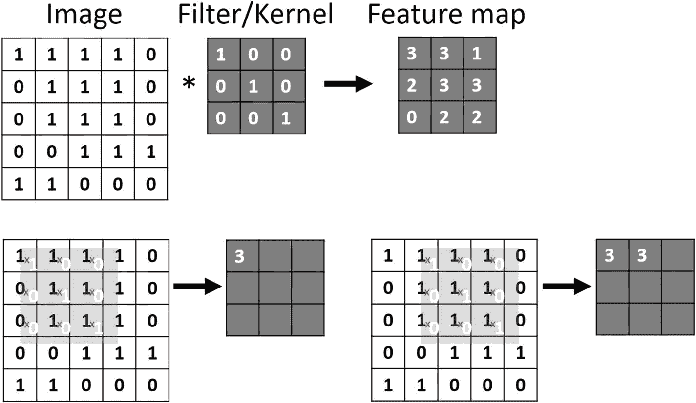
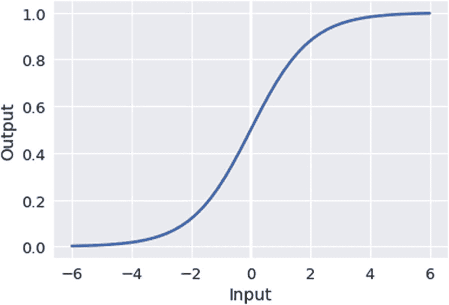
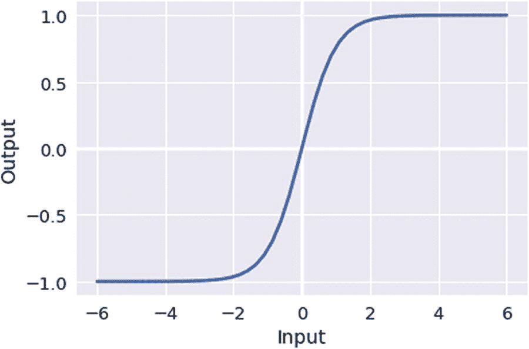
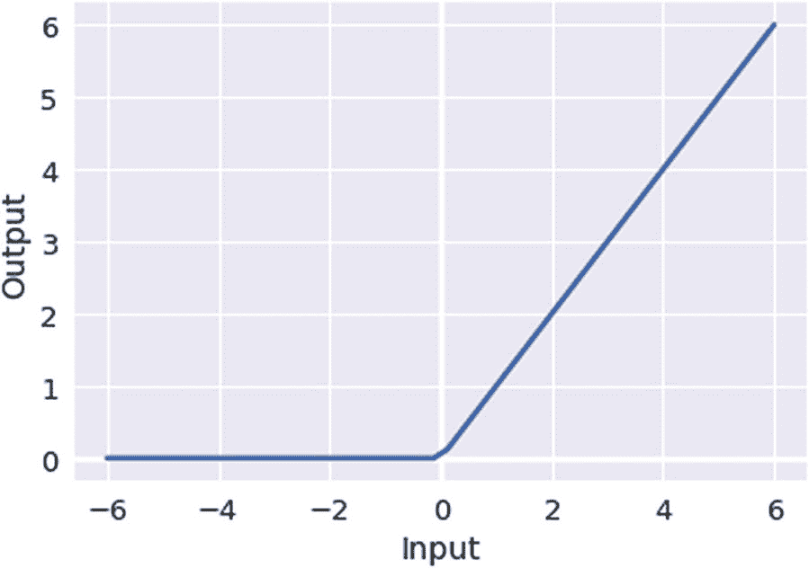

# 六、卷积神经网络

CNN 是神经科学影响深度学习的一个主要例子(LeCun，Bottou，Bengio 和 Haffner，1998)。这些神经网络基于 Hubel 和 Wiesel (1962 年)的开创性工作。他们发现，视觉皮层中的单个神经元细胞只对某些方向的边缘等视觉特征的存在做出反应。从他们的实验中，他们推断出视觉皮层包含神经元细胞的等级排列。这些神经元对视野中的特定子区域敏感，这些子区域被平铺以覆盖整个视野。事实上，它们充当输入空间的局部过滤器，使它们非常适合利用自然图像中的强空间相关性。CNN 在许多计算机视觉任务中取得了巨大的成功，这不仅是因为从神经科学中获得了灵感，也是因为采用了聪明的工程原理。尽管它们传统上用于计算机视觉领域的应用，例如人脸识别和图像分类，但是 CNN 也用于其他领域，例如用于某些任务的语音识别和自然语言处理。

本章简要描述了什么是卷积以及它与神经网络的关系。然后解释了构成 CNN 架构的各种元素和它们的作用，以及为什么 CNN 做得这么好。最后，在深入研究一些实际例子之前，它涵盖了训练 CNN 的通常步骤，使用 CIFAR10 数据集使用 Jupyter 笔记本训练 CNN。

CNN 的第一个成功应用是在 20 世纪 90 年代，使用 Yann LeCun 及其同事的 LeNet 架构读取邮政编码(LeCun，Boser 等人，1989)。然而，CNN 在 2012 年随着 AlexNet (Krizhevsky，Sutskever，& Hinton，2012)架构而得到广泛推广，赢得了第 [1](01.html) 章提到的 ImageNet 大规模视觉识别竞赛(ILSVRC)，并导致了计算机视觉领域的突破。此后，VGGNet(、，2014)和 ResNet(何、张、任、，2016)等研究人员进行了许多有益的开发并推荐了一些架构。我们不推荐特定的神经网络架构，因为这仍然是一个快速发展的领域，新的突破经常发生。相反，我们建议从业者挑选一个已经被研究人员开发和测试过的可用架构，并在必要时对其进行调整。

## 卷积神经网络中的卷积

为了简单起见，在讨论卷积时，我们将讨论离散卷积。数学上，卷积是两个函数逐点相乘的简单求和。求和可以在一维或多维上进行，因此对于灰度图像，求和可以在二维上进行，而在彩色图像中可以在三维上进行。

卷积类似于互相关，在许多深度学习库中，实现实际上是互相关，即使它被称为卷积。对于 CNN 中的所有实际目的，这只是一个实现细节，并不真正影响模型的最终行为。为了直观地感受卷积的行为，图 [6-1](#Fig1) 中给出了一个简单的例子。



图 6-1

CNN 中的卷积

在这个例子中，图像由一个 5 `×` 5 矩阵表示，每个像素只能取两个值，1 或 0。我们有一个检测对角线的卷积核。卷积核有时被称为滤波器或特征检测器。通过将我们的内核与图像进行卷积，我们得到了我们的特征和激活图。我们的特征图左上角的值是通过将重叠矩阵中的所有值相乘，然后对结果求和而创建的。在图像的最下面一行，我们可以看到将内核应用到我们的图像中，我们得到的值是 3。内核应用于图像左上区域的九个像素。如果我们要逐行拉平这些值，我们将得到向量[1，1，1，0，1，1，0，1，1]。内核将对应于向量[1，0，0，0，1，0，0，0，1]。如果我们将两个向量按元素相乘，就像这样[ 1*1，1*0，1*0，0*0 …]，我们将得到向量[ 1，0，0，0，1，0，0，0，1]，我们求和得到值 3。本质上，我们计算两个向量的点积，最终得到一个标量值。

然后我们将内核右移一位——这通常被称为*步幅*——并再次做同样的事情。请注意，特征图比原始图像小。为了减轻这一点，CNN 通常采用输入图像的填充，使得所得到的特征图的大小不会减小，因为这种恒定的减小会限制可以应用的连续卷积的数量。这只是一个简单的例子，因为真实的彩色图像有三个颜色通道——红色、绿色和蓝色——每个通道的像素值由 0 到 255 之间的整数表示。对于单个图像，我们的输入将是一个具有宽度、高度和通道数量的三维矩阵。根据你使用的深度学习框架，有些人希望渠道是第一个 CHW 或渠道是最后一个 HWC。

### 卷积层

CNN 在所谓的*卷积层**中采用卷积，这些卷积层只是由每个卷积层的权重表示的多个卷积核。卷积的维度和步幅通常是预定义的，但权重是在训练网络时学习的。CNN 通常有许多卷积层，每个卷积层都有自己的一组学习内核或滤波器。*

 *图 [6-2](#Fig2) 是从预训练的 CNN 中选取的卷积滤波器。顶行是来自第一卷积层的六个滤波器。最下面一行来自 CNN 的最后一个卷积层。从顶部到底部，卷积层看起来越来越复杂。第一层是编码方向和颜色。第二层似乎对斑点和网格纹理更感兴趣。最终的图层看起来像各种纹理的复杂组合。由此我们可以看到，当我们通过网络时，模式变得更加错综复杂，因此网络越深，卷积层将学习提取越复杂的模式。


图 6-2

**的可视化* *的卷积层。为了更详细的可视化，看看泽勒和弗格斯(2013)。**

 *另一件有趣的事情是，如果我们观察中间一行的第一个和最后一个过滤器，它们似乎是同一个过滤器的轻微旋转变体。这突出了 CNN 的一个缺陷:它们不是旋转不变的。这是 Hinton 试图用胶囊网络克服的问题，正如第 3 章所讨论的。

### 汇集层

卷积不是等变的，这意味着它们本身不能很好地处理输入的缩放和旋转(Sabour，Frosst 和 Hinton，2017)。现代 CNN 中有助于处理这一问题的一种常见类型的层是池层，最流行的池层是 max 池层。最大池将空间相邻输出的输出替换为这些值中的最大值。一般来说，池层用基于这些输出的某种形式的汇总统计来替换输出。

一般来说，池层的目的是使神经网络对输入的小平移保持局部不变，其本质是更关心某个特征是否被检测到，而不是它在输入中的确切位置。这反过来降低了模型的空间灵敏度，并被认为是 CNN 的限制；然而，池层已被证明是非常有用的。

### 激活功能

一般来说，激活函数在细胞神经网络和人工神经网络中非常重要。没有他们，CNN 将只是一系列的线性操作，并且不能做他们今天做的令人惊奇的事情。激活函数是层中神经元输出的简单非线性变换。它们被称为激活函数，因为它们从生物神经元的阈值和点火激活中获得灵感。有许多不同的激活函数具有不同的属性和特性，但是我们在这里只讨论最常见的类型。

#### 乙状结肠的

Sigmoid 或 logistic 是一个非线性函数，它在值 0 和 1 之间压缩输入(图 [6-3](#Fig3) )。




图 6-3

Sigmoid 函数

近年来，由于许多缺点，它已经失宠:

*   它受到消失梯度问题的困扰。在极值 1 和 0 附近，梯度是平坦的，这意味着当值接近这些极值时，神经元饱和，并且权重在反向传播期间不更新。此外，连接到该神经元的神经元获得非常微小的权重更新，本质上使它们缺乏急需的信息。

*   输出不是以零为中心。

#### 双曲正切

双曲正切函数与 sigmoid 函数非常相似；事实上，它们是 sigmoid 函数的简单缩放版本，因此它们以 0 为中心。Tanh 压缩值-1 和 1 之间的输出(图 [6-4](#Fig4) )。在实践中，Tanh 通常优于 sigmoid，但它仍然存在梯度消失的问题。




图 6-4

双曲正切

#### 整流器线性单元

整流线性单元(ReLU 见图 [6-5](#Fig5) )大概是现今使用最多的激活函数(LeCun，Bengio，& Hinton，2015)。




图 6-5

整流线性单元

使用 ReLU 激活功能，当输入大于零时，则输出与输入相同；当它小于零时，输出为零。它的流行主要是由于几个事实。首先，它在正区域不饱和或遭受消失梯度问题。第二，它是一个计算效率高的函数，并且它还导致稀疏激活，这也带来了计算上的好处。但是它仍然有一些缺点:

*   如果函数的输出在向前传递期间小于零，则在向后传递期间没有梯度向后传播。这意味着权重不会更新。如果 CNN 中的神经元持续表现出这种行为，这些神经元就被认为是死亡的，这意味着它们不再对网络做出贡献，本质上是无用的。如果这发生在你的 CNN 的一个重要部分，它将会停止并且不能学习。

*   对于分类任务，它不能用于输出图层，因为它的输出不受明确定义的边界的约束。

## CNN 架构

CNN 通常由多层堆叠而成(图 [6-6](#Fig6) )。一种常见的配置如下:首先，有一个卷积层，其中多个内核对输入进行卷积，并产生多个特征图。这些然后通过一个非线性激活函数，如 ReLU，然后是一个池层。这三个阶段通常以各种方式组合在一起，形成 CNN 的最初几层。最终层的输出被展平，然后馈入一个或多个完全连接的层。最后一层的激活函数通常是 softmax 或 sigmoid，它将输出压缩在 0 和 1 之间。


图 6-6

CNN 架构

## 训练分类 CNN

到目前为止，我们已经定义了 CNN 的样子以及信息是如何向前传播的，但是我们还没有描述它是如何学习的。训练 CNN 的过程如下:

1.  我们有一个预定义的架构，其中包含许多卷积和轮询层，以及最终的全连接层。CNN 的权重是基于某种分布随机初始化的。

2.  我们将训练图像作为一个小批次呈现给 CNN，一个四维矩阵(批次大小、宽度、高度和通道)。

3.  我们通过卷积、池层和激活函数来完成图像在网络中的前向传递，最后我们获得微型批次中每个图像的每个类的输出概率。

4.  我们将概率与真实标签进行比较，并计算误差。

5.  我们使用反向传播来计算相对于 CNN 权重的误差梯度，并且我们使用梯度下降来更新权重。

6.  这个过程重复一组时期或者直到满足其他条件。

这是所发生事情的简化视图，但它抓住了训练 CNN 的核心，一个目标函数，一种计算梯度的方法和一种优化方法。

目标或损失函数决定了我们将如何计算我们期望网络做的和它做的之间的差异。本质上，它将为我们的模型计算误差。常见的损失函数有均方误差(MSE)和交叉熵。现在，一旦我们有了误差，我们需要在正确的方向上更新网络的权重，这样下次我们的预测会变得更好。这是通过一种叫做反向传播的方法实现的。

CNN 最常用的优化方法是 minibatch 梯度下降，通常称为随机梯度下降(SGD)，即使 SGD 与 minibatch 梯度下降略有不同。迷你批次梯度下降试图通过基于每个迷你批次中的梯度迭代地更新 CNN 的权重来优化目标函数。由于细胞神经网络的非线性，解空间通常是非凸的，因此不能保证收敛。对于从业者来说，这可能是相当令人沮丧的，但是即使没有这种保证，CNN 也能令人惊讶地工作得很好。梯度下降的所有变体中的主要参数是学习速率，它决定了应用于网络权重的更新的幅度。SGD 的一个变体也包括一个动量项，它试图通过保持穿过参数空间的行进方向来加速学习。这是通过将先前时间步长的权重更新的一部分添加到当前更新来实现的。其他优化算法包括 Adam、RMSProp 等。

## 为什么选择 CNN

如前所述，CNN 受到了神经科学的启发，但它们也利用了声音工程原理，这也带来了优势。这些是稀疏连接和参数共享。目前的研究表明神经元也有这些特征。一个典型的人类神经元有 7000 个连接(比较大脑中的 10 个 <sup>11 个</sup>神经元)。类似地，每种神经元细胞类型都有特定的功能参数。后者的一个很好的例子是视网膜神经节细胞，它们都有效地实现了相同类型的卷积核(相反的中心环绕)。这些籽粒的重量是通过基因表达模式的进化“学习”的。

在多层感知器(MLPs)等传统神经网络中，每一层都完全连接到下一层的每个节点。随着层数和节点数的增加，参数的数量会激增。在 CNN 中，连接通常比输入小得多，因为内核是在输入上卷积的，输入由前一层表示。因此，在由数千个像素组成的图像中，卷积核可能只有几十个像素。由于所需计算量的减少，参数的减少提高了模型在存储和计算方面的效率。

第二个好处是参数共享。在标准神经网络中，下一层中每个节点的输入权重仅用于该节点，而在 CNN 中，相同的核被多次使用。因此，我们为所有节点学习一组内核，而不是为每个节点学习不同的参数。

## 在 CIFAR10 上培训 CNN

在下一节中，我们将逐步在 CIFAR10 数据集上训练 CNN(Krizhevsky 2009；尼尔·克里日夫斯基和辛顿，未注明日期)。我们使用 TensorFlow 作为深度学习库来构建我们的 CNN。CIFAR10 <sup>[2](#Fn2)</sup> 数据集是一个经常使用的数据集，总共包含 10 个类别的 60，000 个 32 `×` 32 彩色图像(见图 [6-7](#Fig7) )。这些分为 50，000 次训练和 10，000 次测试。这一节的代码也可以在笔记本`Chapter_06_01.ipynb` ( [`http://bit.ly/Nbook_ch06_01`](http://bit.ly/Nbook_ch06_01) )中找到。

### 更多信息

我们建议提供 Azure DLVM 来运行本章中的代码示例。更多信息请参见第 [4](04.html) 章。


图 6-7

CIFAR10 数据集

我们要做的第一件事是定义我们的 CNN(见清单 [6-1](#PC1) )。它不是很深，只有两个卷积层。第一卷积层有 50 个滤波器，第二卷积层有 25 个滤波器，每个滤波器的维数为 3 `×` 3。第一个卷积层使用 ReLU 激活，第二个卷积层在使用 max pooling 之前执行 ReLU 激活。在那之后，我们需要把我们的张量重塑成一个 2D 矩阵，第一个维度是我们的批次的大小。之后，我们通过 ReLU 激活将它传递到 512 个节点的全连接层。最后，我们介绍最后的密集层，它有 10 个输出，每个类一个。

```py
PYTHON

def create_model(model_input,
                 n_classes=N_CLASSES,
                 data_format="channels_last"):
    conv1 = tf.layers.conv2d(model_input,
                             filters=50,
                             kernel_size=(3, 3),
                             padding="same",
                             data_format=data_format,
                             activation=tf.nn.relu)
    conv2 = tf.layers.conv2d(conv1,
                             filters=50,
                             kernel_size=(3, 3),
                             padding="same",
                             data_format=data_format,
                             activation=tf.nn.relu)
    pool1 = tf.layers.max_pooling2d(conv2,
                                    pool_size=(2, 2),
                                    strides=(2, 2),
                                    padding="valid",
                                    data_format=data_format)
    flatten = tf.reshape(pool1, shape=[-1, 50*16*16])
    fc1 = tf.layers.dense(flatten, 512, activation=tf.nn.relu)
    logits = tf.layers.dense(fc1, n_classes, name="output")
    return logits

Listing 6-1CNN with Two Convolution Layers

```

训练神经网络的一个重要元素是定义要使用的损失函数和优化(见清单 [6-2](#PC2) )。这里我们使用交叉熵作为损失函数，使用带动量的 SGD 作为优化函数。SGD 是深度学习的标准优化方法。我们必须定义的两个参数是学习率和动量。

```py
PYTHON

def init_model_training(m, labels, learning_rate=LR, momentum=MOMENTUM):
    cross_entropy = tf.nn.sparse_softmax_cross_entropy_with_logits(
                                                 logits=m, labels=labels)
    loss = tf.reduce_mean(cross_entropy)
    optimizer = tf.train.MomentumOptimizer(learning_rate=learning_rate,
                                           momentum=momentum)
    return optimizer.minimize(loss)

Listing 6-2Initialize Model with Optimization and Loss Method

```

现在我们有了创建和训练 CNN 的函数，所以我们需要准备数据的方法，并成批地将它提供给 CNN，如清单 [6-3](#PC3) 所示。

```py
PYTHON

def prepare_cifar(x_train, y_train, x_test, y_test):

    # Scale pixel intensity
    x_train = x_train / 255.0
    x_test = x_test / 255.0

    # Reshape
    x_train = x_train.reshape(-1, 3, 32, 32)
    x_test = x_test.reshape(-1, 3, 32, 32)

    x_train = np.swapaxes(x_train, 1, 3)
    x_test = np.swapaxes(x_test, 1, 3)

    return (x_train.astype(np.float32),
            y_train.astype(np.int32),
            x_test.astype(np.float32),
            y_test.astype(np.int32))

Listing 6-3Prepare the CIFAR 10 Data

```

`prepare_cifar`函数接受训练图像和测试图像作为数组，标签作为向量。在我们使用 CNN 的图像之前，我们需要做一些预处理。首先，我们在 0 和 1 之间缩放像素值，然后我们重塑它，使矩阵处于通道的最后配置。这意味着图像数据将被整形(例如，高度、宽度、通道)。通道是指图像中的 RGB 通道。

接下来，我们定义 minibatch 函数，如果我们将数据定义为最后一个通道，它将返回一个形状矩阵(`BATCHSIZE`，32，32，3)(参见清单 [6-4](#PC4) )。我们还需要打乱数据，因为我们不想以任何有意义的顺序向 CNN 提供训练样本，因为这可能会影响优化算法。

```py
PYTHON

def minibatch_from(X, y, batchsize=BATCHSIZE, shuffle=False):
    if len(X) != len(y):
        raise Exception("The length of X {} and y {} don't \
                         match".format(len(X), len(y)))

    if shuffle:
        X, y = shuffle_data(X, y)

    for i in range(0, len(X), batchsize):
        yield X[i:i + batchsize], y[i:i + batchsize]

Listing 6-4Minibatch Generator

```

接下来，我们加载数据，如清单 [6-5](#PC5) 所示。

```py
PYTHON

x_train, y_train, x_test, y_test = prepare_cifar(*load_cifar())

Listing 6-5Load Data

```

然后我们为数据和标签创建占位符，如清单 [6-6](#PC6) 所示，并创建模型。

```py
PYTHON

X = tf.placeholder(tf.float32, shape=[None, 32, 32, 3])
y = tf.placeholder(tf.int32, shape=[None])
# Initialise model
model = create_model(X, training)

Listing 6-6Placeholders for the Data and Labels

```

然后，我们初始化模型并开始 TensorFlow 会话。

```py
PYTHON

train_model = init_model_training(model, y)
init = tf.global_variables_initializer()
sess = tf.Session()
sess.run(init)

Listing 6-7Initialize Model and Start the Session

```

接下来，我们针对期望的历元数来训练模型。在此过程中，我们执行正向传递，计算损失，然后反向传播误差并更新权重。这可能需要相当长的时间，具体取决于您所拥有的计算资源。Azure 笔记本在 CPU 上运行深度学习训练，计算资源有限。训练这些神经网络的首选环境之一是 DSVM 或 DLVM，它们有多种配置，包括 GPU。参见清单 [6-8](#PC8) 。

```py
PYTHON

for j in range(EPOCHS):
    for data, label in minibatch_from(x_train, y_train, shuffle=True):
        sess.run(train_model, feed_dict={X: data,
                                         y: label})
    # Log
    acc_train = sess.run(accuracy, feed_dict={X: data,
                                              y: label})
    print("Epoch {} training accuracy: {:0.4f}".format(j,acc_train))

Listing 6-8Loop over the Training Data for N Epochs and Train Model

```

既然我们已经有了训练好的模型，我们想要在我们的测试数据上评估它，如清单 [6-9](#PC9) 所示。

```py
PYTHON

y_guess = list()
for data, label in minibatch_from(x_test, y_test):
    pred=tf.argmax(model,1)
    output=sess.run(pred,feed_dict={X:data})
    y_guess.append(output)

Listing 6-9Evaluate Model on Test Data

```

这段代码将迷你批处理提供给 CNN，并将它们附加到一个列表中。

最后，我们根据真实标签评估模型的性能，如清单 [6-10](#PC10) 所示。

```py
PYTHON

print("Accuracy: ", sum(np.concatenate(y_guess) ==
                        y_test)/float(len(y_test)))

Listing 6-10Print out the Accuracy of Our Model

```

根据你训练网络的时间长短，你会得到不同的错误率。经过三个时期后，网络在测试集上达到了 64%的准确率。

这只是一个简单的练习，用来说明如何创建和训练自己的神经网络。随意摆弄这些层，看看它是如何影响性能的。

创建你自己的架构是有趣的，但是优化这些结构可能是费力和令人沮丧的。对于一个 ML 从业者来说，一个更有成效的策略是使用研究人员已经发布的最先进的架构，并省去尝试生成自己的网络的费力过程。

## 在 GPU 上训练一个深度 CNN

在这一节中，我们将在前一节所学的基础上构建一个更深层次的 CNN。为此，你几乎肯定需要一台支持 GPU 的机器，无论这是你自己的还是云中的。我们将使用 CIFAR10 数据集，但这一次我们将把我们的 CNN 架构基于 VGG 架构(Simonyan & Zisserman，2014)。我们使用 CNN 中使用的标准构建模块慢慢构建网络，看看将这些模块添加到我们的网络中会如何影响性能。所有的步骤都可以在笔记本`Chapter_06_03.ipynb` ( [`http://bit.ly/Nbook_ch06_03`](http://bit.ly/Nbook_ch06_03) )中找到。

如果你觉得这是一个飞跃，有另一个笔记本，我们没有在这里讨论，它深入到每个层的输出是如何受到为该层设置的属性的影响(见 [`http://bit.ly/Nbook_ch06_02`](http://bit.ly/Nbook_ch06_02) )。

### 模型 1

如前所述，我们将使用 CIFAR10 数据集，因此我们的输入将是 32 `×` 32 幅彩色图像，任务是将它们分为十类。我们的模型将以 VGG 建筑为基础(Simonyan & Zisserman，2014)。考虑到这一点，我们的第一个网络如清单 [6-11](#PC11) 所示。

```py
PYTHON

conv1_1 = tf.layers.conv2d(X,
                           filters=64,
                           kernel_size=(3,3),
                           padding='same',
                           data_format=data_format,
                           activation=tf.nn.relu)
conv1_2 = tf.layers.conv2d(conv1_1,
                           filters=64,
                           kernel_size=(3,3),
                           padding='same',
                           data_format=data_format,
                           activation=tf.nn.relu)
pool1_1 = tf.layers.max_pooling2d(conv1_2,
                                  pool_size=(2,2),
                                  strides=(2,2),
                                  padding='valid',
                                  data_format=data_format)
relu2 = tf.nn.relu(pool1_1)
flatten = tf.reshape(relu2, shape=[-1, 64*16*16])
fc1 = tf.layers.dense(flatten, 4096, activation=tf.nn.relu)
fc2 = tf.layers.dense(fc1, 4096, activation=tf.nn.relu)
model = tf.layers.dense(fc2, N_CLASSES, name="output")

Listing 6-11CNN with Two Convolution Layers

```

我们有两个卷积层，后面是一个最大池层，它构成了 CNN 的特色部分。我们的 CNN 的分类部分由两个完全连接的密集层组成，我们的最终输出与我们预期的类的数量相同。

经过 20 个时期的训练，我们的模型在测试集上获得了 72.1%的准确率。我们还可以看到，在我们停止训练之前的几个时期，它在训练集上达到了 100%。尽早停止模型通常是谨慎的，而且通常在任何框架中都可以使用回调来做到这一点。我们在这里只是简单地不使用这些来保持事情的简单。通过运行笔记本，您应该会得到类似的结果。

### 模型 2

在第二个模型中，我们添加了第二个卷积模块。为了与 VGG 架构保持一致，我们添加了两个卷积层，每个卷积层有 128 个过滤器以及一个最大池层(参见清单 [6-12](#PC12) )。这次我们将训练它 10 个纪元。

```py
PYTHON
# Block 1
conv1_1 = tf.layers.conv2d(X,
                           filters=64,
                           kernel_size=(3,3),
                           padding='same',
                           data_format=data_format,
                           activation=tf.nn.relu)
conv1_2 = tf.layers.conv2d(conv1_1,
                           filters=64,
                           kernel_size=(3,3),
                           padding='same',
                           data_format=data_format,
                           activation=tf.nn.relu)
pool1_1 = tf.layers.max_pooling2d(conv1_2,
                                  pool_size=(2,2),
                                  strides=(2,2),
                                  padding='valid',
                                  data_format=data_format)
# Block 2
conv2_1 = tf.layers.conv2d(pool1_1,
                           filters=128,
                           kernel_size=(3,3),
                           padding='same',
                           data_format=data_format,
                           activation=tf.nn.relu)
conv2_2 = tf.layers.conv2d(conv2_1,
                           filters=128,
                           kernel_size=(3,3),
                           padding='same',
                           data_format=data_format,
                           activation=tf.nn.relu)
pool2_1 = tf.layers.max_pooling2d(conv2_2,
                                  pool_size=(2,2),
                                  strides=(2,2),
                                  padding='valid',
                                  data_format=data_format)

relu2 = tf.nn.relu(pool2_1)
flatten = tf.reshape(relu2, shape=[-1, 128*8*8])
fc1 = tf.layers.dense(flatten, 4096, activation=tf.nn.relu)
fc2 = tf.layers.dense(fc1, 4096, activation=tf.nn.relu)
model = tf.layers.dense(fc2, N_CLASSES, name="output")

Listing 6-12CNN with Four Convolution Layers

```

经过 10 个时期的训练后，你会发现你的模型的性能有所提高。

### 模型 3

我们再加一个卷积块。不过，这一次，我们将过滤器的数量增加到 256 个，再次与 VGG 架构保持一致。参见清单 [6-13](#PC13) 。

```py
PYTHON
# Block 1
conv1_1 = tf.layers.conv2d(X,
                           filters=64,
                           kernel_size=(3,3),
                           padding='same',
                           data_format=data_format,
                           activation=tf.nn.relu)
conv1_2 = tf.layers.conv2d(conv1_1,
                           filters=64,
                           kernel_size=(3,3),
                           padding='same',
                           data_format=data_format,
                           activation=tf.nn.relu)
pool1_1 = tf.layers.max_pooling2d(conv1_2,
                                  pool_size=(2,2),
                                  strides=(2,2),
                                  padding='valid',
                                  data_format=data_format)
# Block 2
conv2_1 = tf.layers.conv2d(pool1_1,
                           filters=128,
                           kernel_size=(3,3),
                           padding='same',
                           data_format=data_format,
                           activation=tf.nn.relu)
conv2_2 = tf.layers.conv2d(conv2_1,
                           filters=128,
                           kernel_size=(3,3),
                           padding='same',
                           data_format=data_format,
                           activation=tf.nn.relu)
pool2_1 = tf.layers.max_pooling2d(conv2_2,
                                  pool_size=(2,2),
                                  strides=(2,2),
                                  padding='valid',
                                  data_format=data_format)
# Block 3
conv3_1 = tf.layers.conv2d(pool2_1,
                           filters=256,
                           kernel_size=(3,3),
                           padding='same',
                           data_format=data_format,
                           activation=tf.nn.relu)
conv3_2 = tf.layers.conv2d(conv3_1,
                           filters=256,
                           kernel_size=(3,3),
                           padding='same',
                           data_format=data_format,
                           activation=tf.nn.relu)
conv3_3 = tf.layers.conv2d(conv3_2,
                           filters=256,
                           kernel_size=(3,3),
                           padding='same',
                           data_format=data_format,
                           activation=tf.nn.relu)
pool3_1 = tf.layers.max_pooling2d(conv3_3,
                                  pool_size=(2,2),
                                  strides=(2,2),
                                  padding='valid',
                                  data_format=data_format)

relu2 = tf.nn.relu(pool3_1)
flatten = tf.reshape(relu2, shape=[-1, 256*4*4])
fc1 = tf.layers.dense(flatten, 4096, activation=tf.nn.relu)
fc2 = tf.layers.dense(fc1, 4096, activation=tf.nn.relu)
model = tf.layers.dense(fc2, N_CLASSES, name="output")

Listing 6-13CNN with Seven Convolution Layers

```

一旦你训练了 10 个时期的模型，你应该会发现性能再次提高，尽管幅度较小。您应该注意到，每增加一层，我们都会得到更好的结果，但回报会随着每一个连续的块而减少。

### 模型 4

由于大量的自由参数，CNN 可以受益于正则化。一种规范化的方法是使用 dropout(见清单 [6-14](#PC14) ，我们在第 [2](02.html) 章中谈到过。在正向传递期间，漏失层将随机地使其输出的一定比例为零。这意味着它不会参与正向计算，也不会接收任何权重更新(Srivastava，Hinton，Krizhevsky，Sutskever，& Salakhutdinov，2014)。辍学可以减少 CNN 或任何深度学习对一个或少数*神经元*的依赖。这反过来可以使模型对信息缺失具有鲁棒性。

```py
PYTHON
# Block 1
conv1_1 = tf.layers.conv2d(X,
                           filters=64,
                           kernel_size=(3,3),
                           padding='same',
                           data_format=data_format,
                           activation=tf.nn.relu)
conv1_2 = tf.layers.conv2d(conv1_1,
                           filters=64,
                           kernel_size=(3,3),
                           padding='same',
                           data_format=data_format,
                           activation=tf.nn.relu)
pool1_1 = tf.layers.max_pooling2d(conv1_2,
                                  pool_size=(2,2),
                                  strides=(2,2),
                                  padding='valid',
                                  data_format=data_format)
# Block 2
conv2_1 = tf.layers.conv2d(pool1_1,
                           filters=128,
                           kernel_size=(3,3),
                           padding='same',
                           data_format=data_format,
                           activation=tf.nn.relu)
conv2_2 = tf.layers.conv2d(conv2_1,
                           filters=128,
                           kernel_size=(3,3),
                           padding='same',
                           data_format=data_format,
                           activation=tf.nn.relu)
pool2_1 = tf.layers.max_pooling2d(conv2_2,
                                  pool_size=(2,2),
                                  strides=(2,2),
                                  padding='valid',
                                  data_format=data_format)
# Block 3
conv3_1 = tf.layers.conv2d(pool2_1,
                           filters=256,
                           kernel_size=(3,3),
                           padding='same',
                           data_format=data_format,
                           activation=tf.nn.relu)
conv3_2 = tf.layers.conv2d(conv3_1,
                           filters=256,
                           kernel_size=(3,3),
                           padding='same',
                           data_format=data_format,
                           activation=tf.nn.relu)
conv3_3 = tf.layers.conv2d(conv3_2,
                           filters=256,
                           kernel_size=(3,3),
                           padding='same',
                           data_format=data_format,
                           activation=tf.nn.relu)
pool3_1 = tf.layers.max_pooling2d(conv3_3,
                                  pool_size=(2,2),
                                  strides=(2,2),
                                  padding='valid',
                                  data_format=data_format)

relu2 = tf.nn.relu(pool3_1)
flatten = tf.reshape(relu2, shape=[-1, 256*4*4])
fc1 = tf.layers.dense(flatten, 4096, activation=tf.nn.relu)
drop1 = tf.layers.dropout(fc1, 0.5, training=training)
fc2 = tf.layers.dense(drop1, 4096, activation=tf.nn.relu)
drop2 = tf.layers.dropout(fc2, 0.5, training=training)
model = tf.layers.dense(drop2, N_CLASSES, name="output")

Listing 6-14CNN with Seven Convolution Layers and Dropout

```

当我们运行这个模型时，我们看到我们的准确率进一步提高到 80%。丢弃是一种非常有效的正则化技术，几乎所有的 CNN 架构都使用它，包括 VGG。

VGG 架构实际上比我们的最终模型有更多的层，但它旨在处理 ImageNet 数据集，该数据集包含的数据比 CIFAR10 数据集多得多。在可用数据有限的情况下添加更多图层很快就会被证明是站不住脚的。我们将不得不花费大量的努力来确保我们的模型不会过度拟合数据。 <sup>[3](#Fn3)</sup>

## 迁移学习

从头开始训练一个 CNN 往往需要大量的数据。克服这一限制的一个策略是使用迁移学习，如第 [2](02.html) 章所述。这意味着我们使用一个预定义的网络，该网络已经在一个更大但相似的数据集上进行了训练。然后我们利用网络来解决我们问题；换句话说，就是将网络从其他数据中获得的知识转移到我们的问题上。最简单的方法是简单地删除最上面的层，并使用这些倒数第二层的输出作为我们自己的 ML 模型的特征。这可以是另一种神经网络，例如 MLP，或者是经典的 ML 模型，例如支持向量机或随机森林。

另一种方法是替换最上面的完全连接的层，然后冻结某些层并重新训练它。冻结层意味着这些层的权重在训练期间不会更新。冻结哪些层取决于许多因素，包括所用数据集之间的相似性等等。重新训练更多的层通常可以提高模型的准确性，但也增加了过拟合的可能性。

几乎所有公布的网络拓扑都预先训练了 ImageNet 数据集的权重，ImageNet 数据集是最大的图像分类数据集之一，或多或少是图像分类问题的标准。该数据集由跨越多个类别的数百万幅图像组成(ImageNet，未注明日期)。使用在 ImageNet 上训练的预先训练的 CNN 是获得图像分类任务的非常好的结果的简单方法。

## 摘要

本章简要描述了 CNN 的构成。我们解释了为什么卷积在计算机视觉任务中是有用的，以及 CNN 的缺点是什么。我们通过一个在 TensorFlow 中创建 CNN 的简单示例，然后通过一系列步骤对其进行扩展，并观察其对模型性能的影响。这一章只是触及了 CNN 大量信息的表面，有许多伟大的书籍涵盖了它们背后的理论。下一章介绍了一种不同的深度学习架构，RNNs，它非常适合于语言翻译等序列建模任务。

<aside class="FootnoteSection" epub:type="footnotes">Footnotes [1](#Fn1_source)

Epoch 指的是 CNN 看过整个训练集。

  [2](#Fn2_source)

CIFAR 代表加拿大高级研究所。在神经网络寒冬期间，他们对资助 Hinton 和 LeCun 负有部分责任，导致神经网络最终作为深度学习重新兴起。

  [3](#Fn3_source)

我们还使用 Keras 实现了相同的笔记本，可以在 [`http://bit.ly/Ch06Keras`](http://bit.ly/Ch06Keras) 找到。

 </aside>**