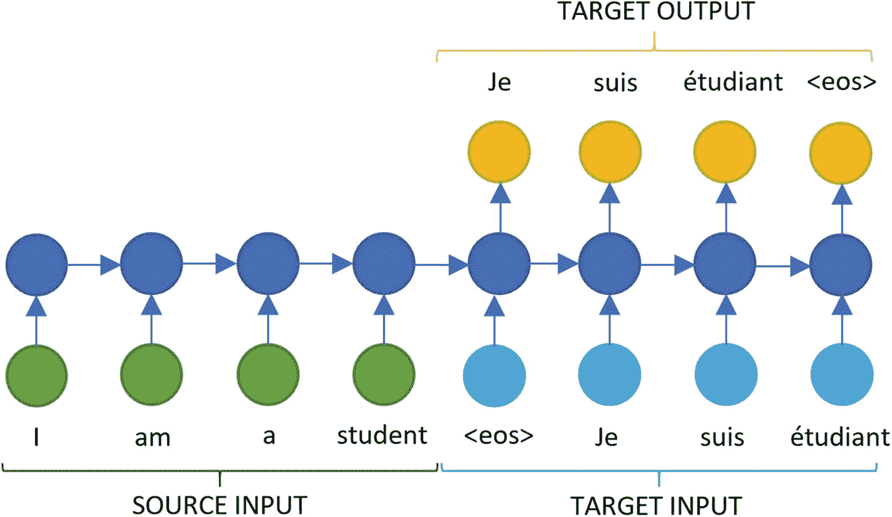

# 七、循环神经网络

前一章展示了深度学习模型——特别是 CNN——如何应用于图像。该过程可以被分离成一个特征提取器和一个分类器，特征提取器计算出输入的最佳隐藏状态表示(在这种情况下是特征映射的向量)和一个分类器(通常是一个完全连接的层)。这一章主要关注其他形式数据的隐藏状态表示，并探讨 rnn。rnn 对于分析序列特别有用，对于自然语言处理和时间序列分析特别有帮助。

甚至图像也可以被认为是序列数据的子集；如果我们打乱行和列(或通道),图像就会变得无法辨认。例如，电子表格数据就不是这种情况。然而，CNN 对顺序的概念很弱，通常卷积的核大小是个位数。当这些回旋堆叠在一起时，感受野会增加，但是讯号也会减弱。这意味着 CNN 通常只关心暂时的空间关系，例如鼻子或眼睛。在图 [7-1](#Fig1) 中，我们可以想象我们已经打乱了一个序列，只在局部组内保留了顺序，但大多数 CNN 仍然会将其分类为相同的，即使它在整体上没有意义。


图 7-1

CNN 具有弱的顺序概念，这可以通过将在 ImageNet 上训练的 ResNet-121 应用于混洗图像来看出

对于一些其他形式的数据，序列成员之间的关系变得更加重要。音乐、文本、时间序列数据等等都非常依赖于对历史的清晰描述。例如，“我昨天没有看这部电影，但是我真的很喜欢它”这句话不同于“我昨天确实看了这部电影，但是我真的不喜欢它”，或者甚至“这是一个谎言——我真的不喜欢我昨天看的这部电影。”毫不奇怪，词序是关键。对于一个 CNN 来说，要捕捉这么多单词之间的关系，内核的大小必须比 RNN 捕捉相同关系所需的隐藏单元的数量大得多(在某种程度上，这将不再可能)。

为了了解为什么我们需要一种新的深度学习结构来处理这些类型的序列，我们首先来看看如果我们试图黑掉一个基本的神经网络来预测序列的最后一位会发生什么。如果我们假设有一个数字序列(从 0 到 9)，如[0，1，2，3，4]和[9，8，7，6，5]，我们可以将每个数字表示为一个一键编码的 10 维向量。例如，数字 2 可以编码为[0，0，1，0，0，0，0，0，0]，6 可以编码为[0，0，0，0，0，0，0，0，1，0，0]。为了训练网络来预测序列的最后一位数字，我们可以尝试两种不同的方法。

首先，我们可以连接四个独热编码向量，从而创建一个存在于 40 维空间中的隐藏状态。神经网络然后调整权重矩阵(大小 40 `×` 10)和偏差矩阵(大小 10 `×` 1)以将其映射到标签(最后一个数字)，该标签存在于 10 维空间中。第二，我们可以将输入向量加在一起，并创建一个存在于 10 维空间中的隐藏状态，然后训练网络将其映射到标签。

第二种方法的问题是，例如，通过对 2 和 3 的独热编码向量求和，我们得到[0，0，1，1，0，0，0，0，0]，并且在这种隐藏状态下，不可能知道输入序列是[2，3]还是[3，2]，因此不可能知道下一个数字应该是 4 还是 1。第一种方法没有这个问题，因为我们可以清楚地看到[0，0，1，0，0，0，0，0，0，0，0，0，0，0，0，0，1，0，0，0，0，0，0，0，0]对应于[2，3]。然而，当我们看到我们已经学习了大小为(40 `×` 10)的权重矩阵时，另一个问题出现了。我们的神经网络只能输入四个数字。

因此，通过对输入求和，我们可以处理可变长度的序列，但我们不能保持顺序。相比之下，通过连接输入，我们可以保持顺序，但我们必须处理固定大小的序列。rnn 通过将历史表示为固定维度的向量来解决这个问题，该向量处理可变长度序列的输入(正如我们将在序列到序列部分看到的，也是可变长度的输出)。

在前面的例子中，RNN 的操作可以表示为第二个神经网络:对输入向量求和，但是修改为在每次求和之后，我们将隐藏状态乘以某个数。这个数字在所有的时间步长中保持不变，因此 rnn 以类似于 CNN 的方式利用权重共享。如果我们假设这个数字是 0.5，那么我们可以将[2]表示为[0，0，1*0.5，0，0，0，0，0，0]，将[2，3]表示为[0，0，1*0.5*0.5，1*0.5，0，0，0，0，0，0，0，0]，这是一个固定大小的隐藏状态，不同于表示为[0，0，1*0.5，1*0.5*0.5，0 的[3，2]在实践中，我们还应用了一个非线性(添加一个偏置项，并对输入 X 和隐藏使用不同的权重矩阵)；然而，如前所述，这些并不是理解 RNNs 背后的基本概念所必需的。

我们可以看到，任何给定时间段内的隐藏状态都是之前所有隐藏状态的函数。这意味着，如果我们有一个很长的序列(可能有 100 个条目)，那么我们将得到一个乘以权重矩阵 100 倍的条目。如果我们想象这个矩阵是标量的(像前面一样)，如果它小于 1，那么条目将趋向于 0，如果它大于 1，那么它将向无穷大爆炸。我们稍后将把它作为消失/爆炸梯度问题来讨论。

## RNN 建筑

rnn 最令人兴奋的特性之一是它们能够在不同的设计模式中工作。与受限于固定输入和输出结构(如图像)的 CNN 相比，RNNs 提供了更多的灵活性，因为它们能够管理可变的输入和输出序列。

图 [7-2](#Fig2) 显示了 RNNs 的不同设计模式。图 [7-2(a)](#Fig2) 显示了具有固定大小输入和输出序列的香草神经网络(无 RNN)的典型结构；这方面的一个例子是图像分类。图 [7-2(b)](#Fig2) 显示了一对多模式，这是图像字幕中使用的典型结构，其中输入是图像，输出是描述图像的一系列单词。图 [7-2(c)](#Fig2) 显示了多对一的模式。该模式的一个应用是情感分析，其中输入是文本，输出是布尔值(正或负)。图 [7-2(d)](#Fig2) 显示了同步多对多模式。视频字幕就是一个例子，我们希望为每个视频帧设置一个标签。最后，图 [7-2(e)](#Fig2) 显示了异步多对多表示，这是机器翻译的典型情况，其中输入可以是英语文本，输出可以是西班牙语文本。


图 7-2

底层是输入，中间是隐藏状态，顶层是输出。(a)具有单输入、隐藏状态和单输出的普通网络(无 RNN)。(b)一对多模式。(c)多对一模式。(d)同步多对多模式。(e)异步多对多模式，也称为编码器-解码器。

除了之前的设计模式，rnn 还会根据不同层之间的互连方式而有所不同。标准情况是 RNN 在隐藏单元之间有循环连接，如图 [7-3](#Fig3) 所示。在这种情况下，RNN 是图灵完全的(Siegelmann，1995)，因此可以模拟任何任意程序。本质上，一个 RNN 重复地应用一个非线性函数，带有可训练的参数到一个隐藏状态，这使得它们适合序列建模任务。


图 7-3

(一)RNN 与隐州之间的经常性联系。(b)展开的 RNN，显示隐藏状态之间的联系。

然而，它们的循环结构限制了每一步的计算都依赖于前一步的完成，使得网络难以并行化和扩展。类似于 CNN，训练 RNN 包括计算损失函数相对于权重的梯度。该操作包括计算一个前向传播，在图 [7-3(b)](#Fig3) 中从左向右移动，随后是一个后向传播，从右向左移动，以更新权重。这个训练过程是昂贵的，因为正向传播本质上是顺序的，因此不能并行化。RNNs 中应用的反向传播算法称为时间反向传播(BPTT)，本章稍后将详细讨论。

在图 [7-4](#Fig4) 所示的输出递归结构中可以找到慢速训练限制的解决方案。该系列的 rnn 将每个输出与未来隐藏状态连接，消除了隐藏到隐藏的连接。在这种情况下，在特定时间步比较预测和目标的任何损失函数都可以解耦；因此，每一步的梯度是独立计算和并行化的。


图 7-4

(a)有产出经常联系的 RNN。(b)具有输出递归的 RNN 的展开结构。

不幸的是，具有输出递归连接的 rnn 不如包含隐藏到隐藏连接的 rnn 强大(Goodfellow 等人，2016)。例如，他们不能模拟一个通用的图灵机。由于缺乏隐藏到隐藏的连接，传递到下一步的唯一信号是输出，除非它是非常高维度和丰富的，否则可能会错过过去的重要信息。

迄今所见的结构都认为所有序列都是前向序列，这意味着网络根据过去的状态获取当前状态的信息。然而，在某些情况下，相反方向的关系也是有价值的。语音识别或文本理解就是这种情况。在某些语言中，不同单词之间的语言关系可能依赖于将来或过去。例如，在英语中，动词通常位于句子的中间，而在德语中，动词往往位于句子的末尾。为了解决这一现象，提出了双向循环神经网络(Schuster & Paliwal，1997)。

双向循环神经网络(BiRNNs)有一层隐藏的连接，可以在时间中向前移动，还有一层向后移动(见图 [7-5](#Fig5) )。这种结构允许输出学习其近期和过去状态的表示，代价是使训练过程在计算上更加昂贵。


图 7-5

双向 RNN。双神经网络包含一层前向连接以编码未来的依赖性 h，以及一层后向连接以编码过去的依赖性 g。在所呈现的结构中，每个隐藏单元连接到另一个隐藏单元和输出。

## 培训注册护士

RNN 训练与我们在前一章看到的 CNN 训练方法有一些相似之处，但在 RNN 的情况下，使用的算法被称为 BPTT(沃博斯，1990)。BPTT 背后的基本思想是简单地将相同的广义反向传播算法应用于展开的计算图。训练 RNN 的步骤如下:

1.  我们有如图 [7-3](#Fig3) 、图 [7-4](#Fig4) 和图 [7-5](#Fig5) 所示的 RNN 架构。基于某种分布来初始化权重。

2.  我们将序列作为小批量输入到 RNN 中(批量大小，序列大小)。根据您使用的框架，序列长度可以是可变的。

3.  我们通过展开图形并获得每个时间步长的预测输出来计算正向传播。

4.  我们将预测的输出与真实的标签进行比较，并累积每个时间步长的误差(或损失)。

5.  我们通过计算损失相对于权重的梯度来应用反向传播，并使用梯度下降来更新权重。

6.  这个过程重复多次，或者直到满足一些退出标准。

对于长序列，更新权重的成本很高。例如，序列长度为 1，000 的 RNN 的梯度相当于具有 1，000 层的神经网络中的向前和向后传递(Sutskever，2013)。

因此，训练 RNNs 的实际方法是在展开图的滑动窗口中计算 BPTT，这被称为截断的 BPTT (Williams & Peng，1990)。这个想法很简单:每个完整的序列被分割成许多更小的子序列，BPTT 应用于这些部分中的每一个。这种方法在实践中效果很好，特别是在单词建模问题中(Mikolov，Karafiát，Burget，ernock，& Khudanpur，2010)，但该算法对不同窗口之间的依赖性是盲目的。

## 门控 RNNs

由于 RNNs 中传播误差的迭代性质，在某些情况下，当损耗梯度及时反向传播时，损耗梯度可能会消失。这被称为消失梯度(Bengio，Simard 和 Frasconi，1994)。消失梯度实际上意味着损失梯度是一个很小的量，因此更新权重的过程会花费很长时间。更罕见的是，渐变可以爆炸，产生指数级大的渐变，称为爆炸渐变。这也使得 RNNs 难以在具有长时间依赖性的序列上训练。

消失和爆炸梯度问题的解决方案是 LSTM RNN (Gers，schmid Huber & Cummins，2000；Hochreiter & Schmidhuber，1997)，这是一种专门用来学习长期关系的网络类型。为此，他们用一种叫做 LSTM 单元的新模块代替了标准 RNNs 的隐藏单元。这些细胞背后的直觉是，它们允许控制将要传递到下一个状态的信息量，并使用遗忘机制来阻止不再有用的信息。

LSTM 模块(见图 [7-6](#Fig6) )由一个状态单元和三个门控单元组成:忽略门、输入门和输出门。在高层次上，状态单元处理输入和输出之间的信息传递，并包含一个自循环。门控单元通过 sigmoid 函数简单地将它们的权重设置为 0 和 1 之间的值，控制来自输入、去往输出以及从状态单元被遗忘的信息量。


图 7-6

LSTM 的模式。它有三个单元:输入 x、状态 s、输出 y，由三个门控制:输入门 g <sub>i</sub> ，忘记门 g <sub>f</sub> ，输出门 g <sub>o</sub> 。状态单元包含一个自循环。

经验工作表明，LSTM 的关键组成部分是遗忘门和输出激活函数，当将 LSTM 与其其他变体进行比较时，在准确性方面没有显著差异(Greff，Srivastava，kout Nik，Steunebrink，& Schmidhuber，2017)。

LSTM 的一个变体是门控循环单元(GRU；Cho 等人，2014)，它使用稍微不同的门控单元组合简化了 LSTM 的结构。具体来说，它们缺少输出门，这将所有隐藏的内容暴露给输出。相比之下，LSTM 单元使用输出门来控制可见的内存量。GRUs 中缺少输出门使得它们的计算成本更低，但这可能导致次优的内存表示，这可能是 LSTM 倾向于记住更长序列的原因。关于 LSTMs 和 GRUs 之间更详细的比较，请参考 Chung、Gulcehre、Cho 和 Bengio，2014 年)。

## 序列对序列模型与注意机制

序列对序列模型(Cho 等人，2014；Sutskever，Vinyals 和 Le，2014)是一种相对较新的架构，为机器翻译、语音识别和文本摘要创造了许多令人兴奋的可能性。基本原理是将输入序列映射到输出序列，输出序列可以是不同的长度，这是图 [7-2(e)](#Fig2) 的变体。这是通过将把可变长度序列映射到固定长度向量的输入 RNN(或编码器)与把固定长度向量映射到可变长度序列的输出 RNN(或解码器)相结合来实现的。作为一个例子，请参见博客帖子，其中包含使用 LSTM 序列到序列模型生成音乐的相关教程，Azure Machine Learning from Erika menez es，可在 [`http://bit.ly/MusicGenAzure`](http://bit.ly/MusicGenAzure) 获得。

机器翻译领域的序列到序列模型(称为神经机器翻译[NMT])已经在很大程度上取代了基于短语的机器翻译，因为它们不需要对每个子组件(以及每种语言)进行大量的手动调整。NMT(如图 [7-7](#Fig7) 所示)模型的编码器和解码器组件可能具有不同的 RNN 结构；RNNs 的结构可以以几种方式变化:细胞类型，如 GRU 或 LSTM，层数，和方向性(单向或双向)。



图 7-7

英语-法语培训期间的简单 NMT 建筑示例

根据经验观察(Cho 等人，2014)，NMT 模型很难翻译长句。这是因为网络必须将输入句子中的所有信息压缩到一个固定长度的向量中，而不管句子的长度。

考虑一下这句话:“我昨天去公园打羽毛球，我的狗跳进了池塘。”我们可以看到(至少)有两个组成部分:“我昨天去公园打羽毛球”和“我的狗跳进了池塘。”当试图翻译第二个组件时，我们可能不关心第一个组件(反之亦然)。然而，NMT 模型别无选择，只能使用包含两个分量的隐藏向量来产生输入。理想情况下，我们应该有一个为每个输出单词的输入单词分配重要性的模型。在这种情况下，当翻译第二部分的部分时，第一部分中的单词的相对重要性将非常低。翻译一些单词时，句子中并不需要所有的东西。

注意机制(Bahdanau，Cho & beng io，2014；Yang et al .，2016)试图做到这一点:它试图为输出句子中的每个单词创建一个加权平均值，该平均值将输入句子中的重要成分对齐。与标准 NMT 模型的主要区别在于，不是将整个输入句子编码成单个固定长度的向量，而是将输入序列编码成一系列固定长度的向量，即“随机存取存储器”，并且对于翻译中的每个单词，不同的向量具有不同的权重。这意味着该模型现在可以自由地为更长的句子创建更长的隐藏向量序列，并学习在解码阶段关注哪些向量。

将这些组件放在一起，该机制可能看起来如图 [7-8](#Fig8) 所示。网络首先将输入句子的每个单元(通常是一个单词)编码成一个分布式特征向量。隐藏状态成为这些特征向量的集合。然后，在解码器阶段，该模型使用所有先前生成的预测以及特征向量序列来迭代地预测每个词，其中它已经学习了对它预测的每个目标词的每个特征向量(输入词)给予多少关注。


图 7-8

注意力被应用的例子。请注意，在预测“étudiant”时，“student”的权重最高(由线条粗细表示)

这种联合对齐单词(输入中的哪些单词是预测输出所需要的)和翻译的方法已经在经验上取得了超过手工方法和基本序列到序列模型的最先进的结果，并且是大多数在线翻译服务背后的核心组件(Klein，Kim，Deng，Senellart，& Rush，2017)。

## RNN 的例子

在本节中，我们将研究在 TensorFlow 中实现的两个 RNNs 示例。该代码可在 [`http://bit.ly/AzureRNNCode`](http://bit.ly/AzureRNNCode) 获得。第一个例子在 TensorFlow 和其他几个框架中运行情感分析。第二个例子基于第 6 章中的例子来说明 CNN 和 RNNs 在图像分类上的区别。第三个例子使用 RNNs 进行时间序列分析。

### 更多信息

我们建议提供 Azure DLVM 来运行本章中的代码示例。更多信息请参见第 [4](04.html) 章。

### 示例 1:情感分析

我们首先高度推荐在 [`http://bit.ly/DLComparisons`](http://bit.ly/DLComparisons) 可用的示例，在撰写本文时，这些示例包括用于 RNN (GRU)的六个不同的 Python 深度学习框架实现，以预测 IMDB 电影评论数据集上的情感，以及 R(具有 TensorFlow 后端的 Keras)和 Julia (Knet)中的一个实现。这些示例包括 NC 系列 DLVM (NVIDIA Tesla K80 GPU)和 NC_v2 系列 DLVM (NDIVIA Tesla P100 GPU)的训练时间，因此用户可以跟踪并比较时间，以确保设置正确。

### 示例 2:图像分类

在第 [6](06.html) 章中，我们看到了 CNN 是如何被典型地用于分类图像的。在这里，我们研究如何做同样的事情，但用 RNN。虽然这不是 RNNs 的传统应用，但它说明了通常可以将神经网络结构与问题类型解耦，并说明了 CNN 和 RNNs 之间的一些差异。

CNN 的数据以[示例数量、高度、宽度、频道]的形式加载。对于一个 RNN，我们简单地将它改造成[示例数量，高度，宽度*通道](见清单 [7-1](#PC1) )。 <sup>[1](#Fn1)</sup> 这意味着对于 CIFAR 数据，我们将有 32 个时间步长(像素行)，其中每行包含 32*3(列数*通道数)个变量。例如，第一个时间步长将包含[row1_column1_red_pixel，row1_column1_green_pixel，row1_column1_blue_pixel，row1_column2_red_pixel，…，row1_column32_bue_pixel]。

```py
PYTHON

# Original data for CNN
x_train, x_test, y_train, y_test = cifar_for_library(channel_first=False)
# RNN: Sequences of 32 time-steps, each containing 32*3 units
N_STEPS = 32 # Each step is a row
N_INPUTS = 32*3 # Each step contains 32 columns * 3 channels
x_train = x_train.reshape(x_train.shape[0], N_STEPS, N_INPUTS)
x_test = x_test.reshape(x_test.shape[0], N_STEPS, N_INPUTS)

Listing 7-1Loading Data

```

然后，我们可以创建一个由 64 个基本 RNN 单元组成的网络架构，并将其应用于输入张量的每个时间步长，如清单 [7-2](#PC2) 所示。我们将收集上一个时间步骤的输出，并应用一个具有 10 个神经元的完全连接的层。

```py
PYTHON

def create_symbol(X, n_steps=32, nhid=64, n_classes=10):
    # Convert x to a list[steps] where element has shape=2 [batch_size, inputs]
    # This is the format that rnn.static_rnn expects
    x=tf.unstack(X,n_steps,axis=1)
    cell=tf.nn.rnn_cell.BasicRNNCell(nhid)
    outputs,states=tf.contrib.rnn.static_rnn(cell,x,dtype=tf.float32)
    logits=tf.layers.dense(outputs[-1],n_classes,activation=None)
    return logits

Listing 7-2Create Network Architecture

```

为了训练一个模型，我们需要创建一个训练操作符，它是一个优化器(在这个例子中是 Adam)，处理一个损失(这个损失是预测和基本事实标签的函数)，如清单 [7-3](#PC3) 所示。

```py
PYTHON

def init_model(m, y, lr=LR, b1=BETA_1, b2=BETA_2, eps=EPS):
    xentropy=tf.nn.sparse_softmax_cross_entropy_with_logits(logits=m,labels=y)
    training_op= (tf.train.AdamOptimizer(lr,b1,b2,eps)
                           .minimize(tf.reduce_mean(xentropy)))
    return training_op

Listing 7-3Define How Model Will Be Trained

```

为了开始训练，我们需要创建占位符并初始化图中的变量，如清单 [7-4](#PC4) 所示。

```py
PYTHON

# Placeholders
X = tf.placeholder(tf.float32, shape=[None, N_STEPS, N_INPUTS])
y=tf.placeholder(tf.int32,shape=[None])  # Sparse
# Initialize model
sym = create_symbol(X)
model = init_model(sym, y)
sess = tf.Session()
sess.run(tf.global_variables_initializer())

Listing 7-4Placeholders and Initialization

```

然后我们可以训练我们的模型，如清单 [7-5](#PC5) 所示。

```py
PYTHON

for j in range(EPOCHS):
    for data,label in yield_mb(x_train,y_train,BATCHSIZE,shuffle=True):
        sess.run(model,feed_dict={X:data,y:label})

Listing 7-5Training Model

```

提供数据的生成器如清单 [7-6](#PC6) 所示。

```py
PYTHON

def shuffle_data(X, y):
    s=np.arange(len(X))
    np.random.shuffle(s)
    X=X[s]
    y=y[s]
    return X,y

def yield_mb(X, y, batchsize=64, shuffle=False):
    if shuffle:
        X,y=shuffle_data(X,y)
    # Only complete batches are submitted
    for i in range(len(X) //batchsize):
        yield X[i*batchsize:(i+1) *batchsize],y[i*batchsize:(i+1) *batchsize]

Listing 7-6Generator to Supply Data to Model

```

为了对我们的测试数据进行预测，我们对模型的预测应用了一个`argmax()`操作来挑选最可能的类(参见清单 [7-7](#PC7) )。如果我们想要类别概率，我们将首先应用 softmax 变换；然而，这仅在训练时需要，并且与损失函数捆绑在一起以提高计算效率。

```py
PYTHON

for data, label in yield_mb(x_test, y_test, BATCHSIZE):
    pred=tf.argmax(sym,1)
    output=sess.run(pred,feed_dict={X:data})

Listing 7-7Get Prediction

```

请注意，创建生成器、创建占位符、初始化变量以及用`feed_dict`进行训练是一个相当低级的 API，只对帮助展示一切是如何工作的有用。在实践中，所有这些都可以通过使用 TensorFlow 的 Estimator API 抽象出来。

### 示例 3:时间序列

在下一个例子中，我们将使用 LSTM 预测微软股票。我们将从将数据放入数据框开始，如清单 [7-8](#PC8) 所示。数据为微软 2012-2017 年的股票价值，从 [`http://bit.ly/MSFThist`](http://bit.ly/MSFThist) 获得。`.csv`文件包含第一列的日期、四列的股价(开盘价、最高价、最低价和收盘价)以及一些我们不打算使用的其他信息。从四个价格值中，为简单起见，我们将取平均值。我们只预测未来的一步，因为我们预测的时间越长，预测就越不准确。也可以玩不同的超参数。

```py
PYTHON

EPOCHS = 5
TEST_SIZE = 0.3
TIME_AHEAD = 1 #prediction step
BATCH_SIZE = 1
UNITS = 25
df = pd.read_csv('https://ikpublictutorial.blob.core.windows.net/book/MSFT_2012_2017.csv')
df = df.drop(['Adj Close', 'Volume'], axis=1)
mean_price = df.mean(axis = 1)

Listing 7-8Define Hyperparameters and Read in Historical Data

```

下一步是规范化数据并生成训练集和测试集，如清单 [7-9](#PC9) 所示。

```py
PYTHON

scaler = MinMaxScaler(feature_range=(0, 1))
mean_price = scaler.fit_transform(np.reshape(mean_price.values, (len(mean_price),1)))
train, test = train_test_split(mean_price, test_size=TEST_SIZE, shuffle=False)
print(train.shape) #(1056, 1)
print(test.shape) #(453, 1)

Listing 7-9Normalize Data and Create Training and Test Sets

```

然后我们需要执行整形，这样数据就可以添加到模型中，如清单 [7-10](#PC10) 所示。我们也定义了我们将要预测的未来时间；通常，该值越小，预测就越准确。

```py
PYTHON

def to_1dimension(df, step_size):
    X,y= [], []
    for i in range(len(df)-step_size-1):
        data=df[i:(i+step_size),0]
        X.append(data)
        y.append(df[i+step_size,0])
    X,y=np.array(X),np.array(y)
    X=np.reshape(X, (X.shape[0],1,X.shape[1]))
        return X,y
X_train, y_train = to_1dimension(train, TIME_AHEAD)
X_test, y_test = to_1dimension(test, TIME_AHEAD)

Listing 7-10Reshape Data for Model

```

下一步是定义和训练模型，如清单 [7-11](#PC11) 所示。在这种情况下，我们使用基本的 LSTM 电池，但你可以尝试使用 GRU 或比尔斯特姆。

```py
PYTHON

def create_symbol(X, units=10, activation="linear", time_ahead=1):
    cell=tf.contrib.rnn.LSTMCell(units)
    outputs,states=tf.nn.dynamic_rnn(cell,X,dtype=tf.float32)
    sym=tf.layers.dense(outputs[-1],1,activation=None,name='output')
    return sym

X = tf.placeholder(tf.float32, shape=[None, 1, TIME_AHEAD])
y = tf.placeholder(tf.float32, shape=[None])

sym = create_symbol(X, units=UNITS, time_ahead=TIME_AHEAD)

loss = tf.reduce_mean(tf.squared_difference(sym, y)) #mse
optimizer = tf.train.AdamOptimizer()
model = optimizer.minimize(loss)

init = tf.global_variables_initializer()
sess = tf.Session()
sess.run(init)

for i in range(EPOCHS):
    ii=0
    while(ii+BATCH_SIZE) <=len(X_train):
        X_batch=X_train[ii:ii+BATCH_SIZE,:,:]
        y_batch=y_train[ii:ii+BATCH_SIZE]
        sess.run(model,feed_dict={X:X_batch,y:y_batch})
        ii+=BATCH_SIZE
    loss_train=sess.run(loss,feed_dict={X:X_batch,y:y_batch})
    print('Epoch {}/{}'.format(i+1,EPOCHS),' Current loss: {}'.format(loss_train))

Listing 7-11Define and Train Model

```

最后，我们将计算测试集预测的均方根误差(RMSE)，如清单 [7-12](#PC12) 所示。

```py
PYTHON

y_guess = np.zeros(y_test.shape[0], dtype=np.float32)
ii = 0
while(ii + BATCH_SIZE) <= len(X_test):
    X_batch=X_test[ii:ii+BATCH_SIZE,:,:]
    output=sess.run(sym,feed_dict={X:X_batch})
    y_guess[ii:ii+BATCH_SIZE] =output
    ii+=BATCH_SIZE

y_test_inv = scaler.inverse_transform([y_test])
pred_test = scaler.inverse_transform([y_guess])
score = math.sqrt(mean_squared_error(y_test_inv, pred_test))
print('Test RMSE: %.2f' % (score)) #3.52

Listing 7-12Calculate Test Set RMSE

```

看着图 [7-9](#Fig9) ，看起来 LSTM 对股票的预测不错。现在你可以玩不同的时间范围或 LSTM 参数。这是一个使用 LSTMs 进行时间序列分析的简单例子，用来说明在预测中使用 LSTMs 的概念。


图 7-9

使用 LSTM 进行股票预测

对于使用 LSTMs 进行时间序列分析的另一个示例，我们推荐使用 Azure 机器学习服务进行预测性维护的教程，可在 [`http://bit.ly/DLforPM`](http://bit.ly/DLforPM) 获得。我们还推荐 Andrej Karpathy 在 [`http://bit.ly/RNNEffective`](http://bit.ly/RNNEffective) 发表的关于循环神经网络不合理有效性的博文。

## 摘要

本章介绍了 rnn 和不同的变体，它们对于在序列数据的基础上构建应用程序非常有用。这些模型对于自然语言处理和时间序列分析特别有用，尽管 RNNs 的应用可能相当广泛。本章以两个实际的“如何做”示例结束，并引用了一个推荐资源，用于在 Azure DLVM 上为 RNN (GRU)的情感分析示例尝试不同的深度学习框架。在接下来的一章中，我们接下来深入研究一种完全不同类型的深度学习网络，这是一种更近的发展，也显示出许多应用的前景。

在过去几年中，rnn 变得越来越受欢迎，但最近我们看到了一种回归 CNN 架构进行序列数据的趋势，可能部分是因为 CNN 更容易训练(从裸机和参数调整的角度来看)。

将注意力编码的向量堆叠在层级树中也可以保持序列中的顺序，并捕捉长期依赖性。这些类型的网络被称为分层神经注意力，类似于 WaveNet，wave net 已被用于合成语音。

时态卷积网络,( 1)从未来到过去没有信息泄漏(即，偶然的),以及(2)可以像 RNN 一样采用可变长度序列，对于以前通常被认为是 RNN 领域的纯序列任务已经变得越来越流行。

<aside class="FootnoteSection" epub:type="footnotes">Footnotes [1](#Fn1_source)

这在 CPU 和 GPU 之间可能是不同的。

 </aside>