# 九、训练人工智能模型

训练 AI 模型通常比训练标准 ML 模型要求更高，因为它们是处理密集型的，并且通常涉及的数据集更大。这就是为什么如果你对深度学习很认真，你必须使用 GPU。在 Azure 中，您可以通过多种方式在单个虚拟机或协调的集群中使用 GPU。在本章中，我们总结了几种最常用的方法以及每种方法的优缺点。然后，我们扩展我们在第 [6](06.html) 章中编写的代码，该代码使用类似 VGG 的 CNN，使用 DLVM 作为计算环境来处理 CIFAR10 数据集。在这一章中，我们扩展到其他的训练选项，比如批量人工智能和批量造船厂，这两个选项都有助于扩大训练规模。最后，我们简要强调了在 Azure 上训练 AI 模型的一些其他方法，这些方法不太常见，但根据手头的问题可能有用。

## 培训选项

Azure 有大量的选择来训练人工智能模型。在这里，我们将自己限制在我们认为满足大多数工作负载类型要求的少数几个。我们讨论的训练人工智能模型的四种方法是 DLVM、批处理人工智能、批处理造船厂和 DL 工作空间。训练一个 AI 模型没有最好的方法；每种方法都有其优点和缺点，有些方法比其他方法更适合某些解决方案。深度学习模型的训练可以在单个 GPU 机器上进行，也可以分布在多个 GPU 机器上。最常见的情况是为每个模型使用一台 GPU 机器，因为以分布式方式训练模型需要额外的考虑，这可能非常棘手，但可能是必要的，因为模型太大，无法安装到一台 GPU 机器上，或者希望减少训练时间。

在这一章中，我们没有提到在训练一个 AI 模型之前经常需要的数据处理。例如，原始数据通常必须经过处理才能被深度学习模型读取，ML 算法应该学习的标签可能存储在数据库中，或者原始数据可能来自许多来源。对于这种类型的工作，Microsoft AI 平台中有许多工具和选项可用，例如用于存储不同类型数据的 Azure SQL 数据仓库和 CosmosDB，以及用于数据移动的 Azure 数据工厂，这些不在本章的讨论范围之内。这里我们假设数据是以一种可以被人工智能模型训练的格式提供的。

### 分布式培训

当整个数据集无法存储在单台机器上，或者模型无法容纳在单个 GPU 上时，可以使用分布式训练，但它通常用于实现更快的训练。分布式训练的两种主要类型是数据并行或模型并行。

通过数据并行，同一模型将在许多 GPU 上复制，并将接收不同批次的训练数据。然后聚集梯度，然后将更新分发给模型。在这种情况下，通信开销可能相当大，因此一个积极的探索领域是如何通过探索异步更新使这一过程更有效(Calauzènes & Roux，2017；迪恩等人，2012；Recht，Re，Wright，& Niu，2011)或通过压缩或量化权重更新来减少开销(Lin，Han，Mao，Wang，& Dally，2017；Recht 等人，2011 年)。

通过模型并行性，模型被分割到多个 GPU 上。这种情况的一个例子可能是放置在不同 GPU 上的不同层，并且模型上的向前和向后传递涉及跨节点的网络通信。这是一种不太常见的场景，只有当模型无法在单个 GPU 上运行时才有必要。

在这些场景中，假设每个虚拟机只有一个 GPU，这通常被称为多节点多 GPU，但实际上 Azure 的配置是一个虚拟机上最多可以有四个 GPU。刚刚解释的所有场景都可以在单节点多 GPU 场景上执行，除了数据太大而无法在单个虚拟机上运行的场景。在这种情况下，通信开销通常不是太大的问题，因为它发生在单个节点上，如果深度学习框架使用英伟达的 NCCL 多 GPU 库( [`http://bit.ly/nvidianccl`](http://bit.ly/nvidianccl) )，性能甚至会更好。

### 深度学习虚拟机

DLVM 是一个单独的 VM，有许多不同的配置，其中一些配置有 GPU，并且是 DSVM 的特殊配置变体。目前拥有 GPU 的虚拟机类型有 NC、NV、ND、NCv2 和 NCv3，最便宜的是 NC 系列。这些都与 NVIDIA Tesla K80、M60、P40、P100 以及最终的 V100 安装了相应的 GPU。它们按照从最弱到最强的顺序松散排列，单个 K80 提供大约 4.4 万亿次浮点运算，单个 V100 提供大约 14 万亿次浮点运算。 <sup>[1](#Fn1)</sup>

### 注意

与在 CPU 上训练 AI 模型相比，即使是最弱的 GPU (K80)也能显著减少训练时间。

每个 VM 系列都有三种配置:一个 GPU、两个 GPU 或四个 GPU。请参阅当前文档，了解 Azure 上在 [`http://bit.ly/AzureVMs`](http://bit.ly/AzureVMs) 可用的所有虚拟机以及在 [`http://bit.ly/AzureDSVM`](http://bit.ly/AzureDSVM) 可用的 DSVM。

通过使用 DLVM，我们可以直接解决我们的数据科学问题，因为所有的库都预先安装在一个预制的 Anaconda 环境中，如图 [9-1](#Fig1) 所示。DLVM 对于实验来说是一个很好的选择，但是如果你想进行大规模的模型/数据并行训练或者简单地并行探索各种超参数，后一种选择会更好。

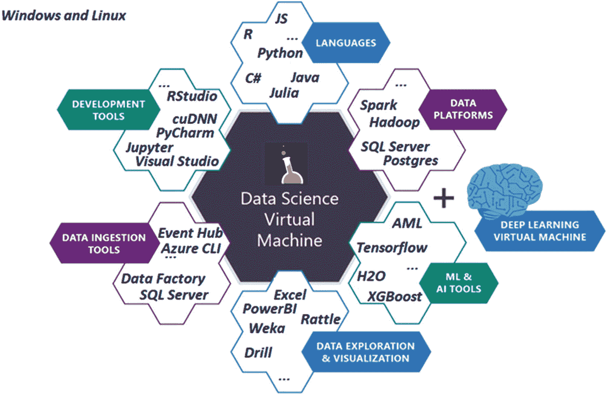

图 9-1

数据科学虚拟机是云中的一个预配置环境，用于数据科学和人工智能建模、开发和部署。深度学习虚拟机是针对深度学习工作负载的特殊配置

### 分批造船厂

batch yard 是一个通用工具，用于运行基于容器的批处理和高性能计算(HPC)工作负载。通过建立在 Azure Batch 之上，Batch yard 能够从其功能中受益，例如处理云中大规模并行和 HPC 应用的复杂性，管理 VM 部署和管理、作业调度和自动扩展要求等方面。在 Azure 上运行作业时，使用 Azure Batch 没有额外的成本；这是一项免费的增值服务，仅消耗计算资源以及相关的数据中心移动和存储成本。

batch yard 使用 Docker 容器，这使得管理 AI 工作负载带来的复杂依赖关系变得很容易。batch yard 是一个 CLI，可以在本地运行，也可以使用 Azure Cloud Shell 在云中运行。编排是通过易于理解的配置文件来管理的，这使得重用脚本变得很容易。它已经包含了一些最流行的深度学习框架的大量例子(参见 [`http://bit.ly/shipyard24c3`](http://bit.ly/shipyard24c3) )。

以下是使用 Batch 船厂的一些优点:

*   它与 Azure Batch 基础设施紧密相连，因此得到了很好的支持。

*   它很容易从 CLI 使用，也可以在云 shell 中使用。

*   它支持许多不同类型的虚拟机，包括 GPU。

*   它支持低优先级节点，这使得它非常高效。

*   它有工厂方法来支持简单的超参数调整。

使用分批造船厂的缺点如下:

*   它依赖于批处理基础设施，因此不支持自己的集群。

*   没有 REST API 或者 web 前端，只有 CLI。

### 批量人工智能

Batch AI 与 Batch and 非常相似，因为它运行在 Azure Batch 上，并允许您运行各种 AI 工作负载。Batch 船厂和 Batch AI 的核心区别如下:

1.  这是一项托管服务。这意味着批处理造船厂的 CLI 调用 Azure Batch 并设置一切。有了 Batch AI，云中就有了一个服务，我们调用它来使用 CLI、REST API 或 SDK，它可以协调一切。在实践中，这意味着有更丰富的方式与批量人工智能交互，并且更容易作为流水线的一部分进行编排。

2.  Batch AI 可以在 DSVM 或 DLVM 上执行，这使它能够在没有容器的情况下运行。如果您不想处理容器的复杂性，这使得开始变得非常容易。

3.  Batch AI 为在 PyTorch、TensorFlow 等多个深度学习框架上运行分布式训练提供了专门的支持。在实践中，这意味着一些复杂的事情，如设置消息传递接口(MPI)是由 Batch AI 自动配置的。

以下是 Batch AI 的一些优点:

*   这是一项托管服务。

*   它有多种方式与 CLI、SDK 和 REST APIs 交互。

*   它与 Azure Batch 基础设施紧密相连，因此得到了很好的支持。

*   它支持许多不同类型的虚拟机，包括 GPU。

*   它支持非常经济高效的低优先级节点。

*   它可以支持 DSVM 和 DLVM 作为计算目标。

以下是使用 Batch AI 的一些缺点:

*   它不具备与 Batch 船厂同等的功能。Batch yard 提供了一些很好的超参数搜索方法，这些方法还没有应用到 Batch AI 中。

*   它仍处于预览阶段，并非在所有地区都可用。

### 深度学习工作空间

深度学习工作区(DLWorkspace)是微软的一个开源项目，允许人工智能科学家以交钥匙的方式在本地或云中旋转集群。DLWorkspace 使用 Kubernetes 来管理各个节点上的作业。Kubernetes 是一个流行的开源容器编制器，我们将在第 [10](10.html) 章中详细讨论它。DLWorkspace 提供了一个 web 用户界面(UI)和一个 REST API，从中可以提交、监视和管理作业。这与 Batch AI 和 Batch yard 截然不同，因为它不依赖 Batch 基础设施来管理事情，也不依赖于 Azure 基础设施。这确实意味着它比其他两个选项需要更多的最终用户管理，但它提供了最大的灵活性。它也没有其他两种选择成熟。

以下是 DLWorkspace 的一些优势:

*   它不依赖于特定的基础设施，因此可以在本地集群和云中运行。

*   它使用 Kubernetes，一个著名的容器编排器。

DLWorkspace 的一些缺点如下:

*   它需要比批量造船厂或批量人工智能更多的设置。

*   集成到流水线中更难。

*   它仍在大力开发中。

## 要遵循的示例

在前面的许多章节中，我们已经演示了如何在支持 GPU 的 DLVM 上训练深度学习模型，因此我们在这里不做赘述。在接下来的章节中，我们将利用我们在第 [6](06.html) 章中编写的代码，该代码使用类似 VGG 的 CNN 来处理 CIFAR10 数据集，以扩展到使用 Batch 船厂和 Batch AI。如果你不记得我们在那里做了什么，明智的做法是回去刷新你的记忆。

### 在批量造船厂培训 DNN

在这一节中，我们将介绍如何在 Batch 船厂训练 CNN 的一般步骤。在笔记本`Chapter_09_01.ipynb` <sup>[2](#Fn2)</sup> 中详细描述了我们执行 AI 脚本所遵循的步骤，如图 [9-2](#Fig2) 所示。

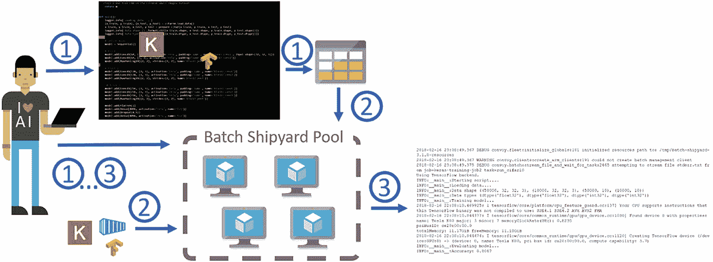

图 9-2

分批造船厂的运作步骤。(1)创建必要的 Azure 资源、配置文件和脚本。(2)调用 pool create，这将启动创建集群的过程。同时，这将把我们创建的脚本拉入文件共享。它还将提取 Docker 映像，并使其对池中的节点可用。(3)告诉 Batch 造船厂执行工作并详细说明输出。一旦全部完成，我们将删除作业、集群和 Azure 资源。

1.  从图 [9-2](#Fig2) 中的步骤可以看出，在批量造船厂训练你的模型需要一些先决条件。将训练您的模型的脚本。

2.  Docker 容器包含脚本的所有依赖项，如深度学习框架等。

3.  Azure 存储帐户和 Azure 批处理帐户。

4.  批量造船厂配置文件。这些可以是 YAML 或 JSON 文件，将持有所有必要的信息，以确定我们希望批处理船厂为我们做什么。

我们的模型脚本将与我们在`Chapter_06_03.ipynb`笔记本中写的非常相似，除了它将是一个 Python 文件而不是一个 Jupyter 笔记本，并且我们将添加向它传递参数的能力。这样做的原因是为了简化执行，以便我们可以看到模型在不同的超参数配置下的表现。这通常被称为超参数搜索，是创建人工智能模型的重要步骤。该脚本将下载 CIFAR10 数据，创建和训练我们的模型，并最终在测试数据集上对其进行评估。

准备好脚本后，我们需要创建自己的 Docker 映像或者引用一个预构建的映像。许多最流行的深度学习框架要么为你提供一个 Docker 映像，要么至少提供一个 Docker 文件，你可以用它来创建你的映像。对于以前没有使用过 Docker 的人来说，这可能会令人望而生畏。值得庆幸的是，网上有很多指南，Docker 文档也很不错(见 [`http://bit.ly/dockerstarted`](http://bit.ly/dockerstarted) `)`)。这里我们简单地使用我们为这本书创建的 Docker 图像。

我们将假设您已经创建了 Azure 存储和批处理帐户。在随附笔记本的“创建 Azure 资源”一节中概述了这样做的步骤。对于批量造船厂，有四个配置文件:

*   我们在这里放上我们使用的所有资源的凭证。在我们的例子中，它只是存储帐户和批处理帐户。

*   `config.yaml`:指定批量船厂的配置。在这里，我们将简单地指定使用哪个存储帐户以及我们想要使用的映像的位置。

*   这个配置文件定义了我们的池的属性，本质上是我们想要分配的虚拟机的数量和我们想要分配的虚拟机的类型。

*   在这个配置文件中，我们指定了我们希望执行的任务。我们可以指定一个或多个作业，每个作业可以有一个或多个任务。如何划分将取决于您想要运行的任务以及它们有多少共同点。在这个文件中，我们通常指定使用什么 Docker 映像，从哪里输入数据，以及执行什么命令。详见 [`http://bit.ly/shipyardjobs`](http://bit.ly/shipyardjobs) 。

从现在开始，我们将假设您正在从 Linux 终端或运行在 Linux 上的 Jupyter 笔记本电脑上运行。既然我们已经定义了配置文件和脚本，我们需要创建集群，如清单 [9-1](#PC1) 所示。

```py
BASH

shipyard pool add --configdir config

Listing 9-1Command to Create a Batch Cluster

```

该命令告诉 Batch Shipyard 按照位于`config`目录下的`pool.yaml`文件中的指定创建池。这将启动虚拟机并进入我们在配置文件中指定的任何文件，在我们的例子中，这只是我们的模型脚本。调配池可能需要 5 到 15 分钟，具体取决于指定的虚拟机数量。您可以创建的虚拟机数量取决于您的批处理帐户配额。如果您的批量帐户需要更多虚拟机，您只需通过 Azure 门户( [`http://bit.ly/azbatchquota`](http://bit.ly/azbatchquota) `)`)请求增加配额。

创建池后，我们只需添加作业。在列表 [9-2](#PC2) 中，我们提交了作业，但也交互地跟踪了任务的输出。

```py
BASH

shipyard jobs add --configdir config --tail stdout.txt

Listing 9-2Submit Job to Batch Shipyard and Tail Output

```

如果一切顺利，您应该开始看到输出被流式传输到您的笔记本电脑或终端。该脚本将首先下载 CIFAR 数据，训练模型，并对其进行评估。您还可以通过访问 Azure 门户来查看您的集群和作业的状态，在那里您应该会看到类似于图 [9-3](#Fig3) 的内容。

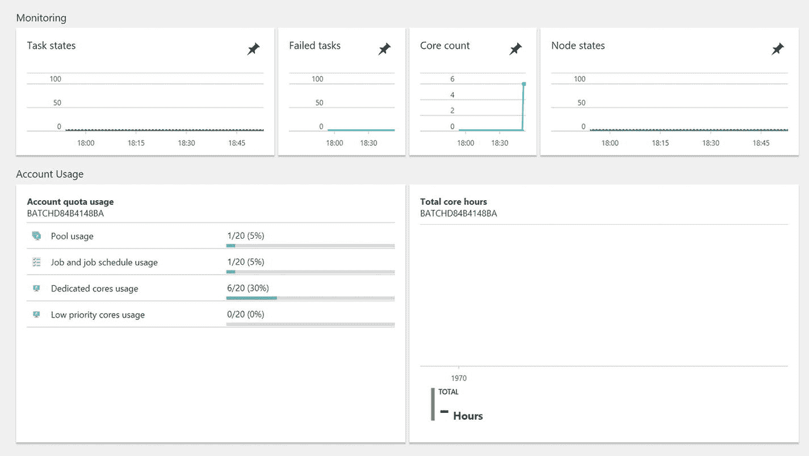

图 9-3

Azure 门户中的批处理仪表板

通过运行清单 [9-3](#PC3) ，我们流式传输`stderr.txt`的输出。这对于检查错误和调试脚本非常有用。

```py
BASH

shipyard data files stream -v --filespec my_job_id,my_task_id,stderr.txt

Listing 9-3Stream Output to Help Review Errors and Debug Scripts

```

一旦您完成了您的工作，最好删除它，这样它就不会计入您的活动工作配额，正如我们在清单 [9-4](#PC4) 中所做的那样。

```py
BASH

shipyard jobs del --configdir config -y –wait

Listing 9-4
Delete Batch Shipyard Jobs

```

最后，用清单 [9-5](#PC5) 中所示的代码删除您的池，这样您就不会在虚拟机不使用时产生费用。

```py
BASH

shipyard pool del --configdir config -y

Listing 9-5
Delete Batch Shipyard Pool

```

对于执行单个任务来说，这似乎是很大的开销，但是当您需要执行大量任务时，与节省的时间相比，最初的开销是很小的。

#### 超参数调优

训练 AI 模型甚至任何类型的 ML 模型都需要调整约束我们模型行为的各种超参数。依次这样做既费力又费时。通过并行运行这些实验，我们可以节省大量时间，并更快地找到最佳配置。云以及 Batch Shipyard 和 Batch AI 等服务类型的主要优势之一是能够根据需要扩展我们的计算。这意味着我们可以探索大量的配置，并且只为我们需要的计算付费，从而大大加快数据科学的进程。

如前所述，Batch yard 为生成称为任务工厂的超参数任务提供了一种便捷的方式。通过任务工厂，我们可以以多种方式生成任务参数，例如从随机分布、均匀分布、伽玛分布、贝塔分布、指数分布、高斯分布等等。

我们将在`jobs.yaml`文件中定义我们的任务工厂。假设我们想要参数化我们的 VGG 架构，并探索学习率对我们模型的影响。我们可以通过清单 [9-6](#PC6) 中的任务工厂规范来实现这一点。

```py
YAML

task_factory:
  random:
    distribution:
      uniform:
        a:0.001
        b:0.1
    generate:10
command: /bin/bash -c "python -m model.py –lr {}"

Listing 9-6Task Factory Specification to Generate Hyperparameter Tasks

```

YAML 的这个模块将指示 Batch yard 从 0.001 到 0.1 的均匀分布中随机抽取 10 个值，并运行`model.py`脚本。

任务工厂不限于从分布中生成值；他们还可以基于自定义生成器为更复杂的超参数机制生成任务。关于任务工厂的更多细节，请查看 [`http://bit.ly/shipyardtfactory`](http://bit.ly/shipyardtfactory) 。

#### 分布式培训

在多节点、多 GPU 培训场景中，Batch yard 处理集群的设置和作业的分配，但不处理节点之间的通信。这必须由深度学习框架本身来处理。不同的框架使用不同的协议在它们之间传递信息，比如 MPI (CNTK，Horovod)或 gRPC (TensorFlow)。打开适当的端口并启动适当的进程是很重要的，这在深度学习框架之间可以有所不同。在 Batch yard 中，这样的任务称为多实例任务，需要在作业配置文件中指定。在清单 [9-7](#PC7) 中可以看到一个示例配置文件。

```py
YAML

job_specifications:
- id: tensorflow
  auto_complete:true
  tasks:
  -docker_image:alfpark/tensorflow:1.2.1-gpu
    multi_instance:
      num_instances:pool_current_dedicated
command: /bin/bash -c "/shipyard/launcher.sh /shipyard/mnist_replica.py"

Listing 9-7Multi-Instance Tasks to Specify Multinode, Multi-GPU Tasks

```

关于如何在 Batch 船厂进行数据并行训练的详细演练，请看一下 [`http://bit.ly/shipyarddist`](http://bit.ly/shipyarddist) 。

#### 在批处理 AI 上训练 CNN

Batch AI 在很多方面与 Batch 船厂非常相似(见图 [9-4](#Fig4) )。它提供了 Python SDK 和 CLI。在我们的示例中，我们概述了如何使用 CLI，因为它比 SDK 稍微容易一些。这里提到的所有步骤都在附带的笔记本中，您可以用它来自己运行这个示例(`Chapter_09_02.ipynb`)。

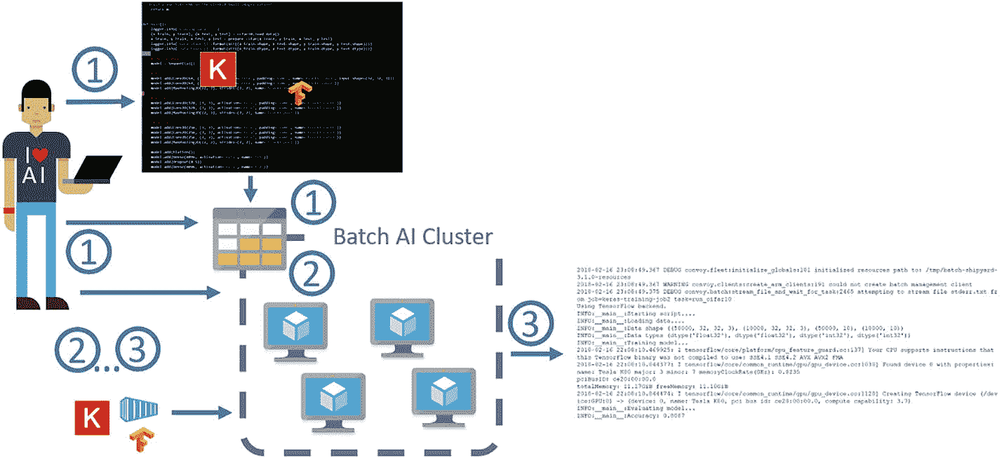

图 9-4

批量 AI 训练步骤:(1)创建必要的 Zzure 资源，作业配置文件，和脚本，上传脚本到 fileshare。(2)调用 cluster create，这将启动创建我们的集群的过程。它还将提取 Docker 映像，使其对池中的节点可用，并挂载文件共享。(3)运行作业配置中指定的命令。调用作业流文件来跟踪作业的输出。培训完成后，删除作业、集群和 Azure 资源。

Batch AI 用的是我们之前安装的 Azure CLI。要注册批处理 AI，运行清单 [9-8](#PC8) 中所示的代码。

```py
BASH

az provider register -n Microsoft.BatchAI
az provider register -n Microsoft.Batch

Listing 9-8Register for Batch AI Service

```

在撰写本文时，Batch AI 仅在美国东部地区可用，因此我们将在那里创建我们所有的资源。我们假设您已经创建了一个存储帐户和一个文件共享，并且已经将脚本上传到文件共享。这些步骤在附带的笔记本(`Chapter_09_02.ipynb`)中的“创建 Azure 资源”和“定义我们的模型”部分中。为了创建我们的集群，我们运行清单 [9-9](#PC9) 中的代码。

```py
BASH

az batchai cluster create -l eastus -w workspace --name my_cluster --vm- size STANDARD_NC6 --image UbuntuLTS --min 1 --max 1 --storage- account- name my_storage_account --storage-account-key my_ storage_account_key --afs-name my_fileshare --afs-mount-path azurefileshare --user-name my_username --password my_password

Listing 9-9
Create Batch AI Cluster

```

所有以`my`为前缀的值都应该由你来定义，它们应该与你已经创建的 Azure 资源相匹配。在前面的命令中，我们使用 [`az batchai cluster create`](https://docs.microsoft.com/en-us/cli/azure/batchai/cluster#az_batchai_cluster_create) 命令创建了一个名为`my_cluster`的批处理 AI 集群，由一个 GPU VM 节点组成。在本例中，虚拟机运行默认的 Ubuntu LTS 映像。如果您希望使用 DSVM 作为执行目标，只需指定`image UbuntuDSVM`即可。指定的虚拟机是 NC6，它有一个 NVIDIA K80 GPU。我们还告诉它在名为`azurefileshare`的文件夹中挂载文件共享。这个文件夹在 GPU 计算节点上的完整路径是`$AZ_BATCHAI_MOUNT_ROOT/azurefileshare. AZ_BATCHAI_MOUNT_ROOT`是 Batch AI 设置的环境变量。请确保存储帐户和文件共享信息与您创建的相匹配；否则，共享将无法装载，您的节点将变得不可用。

创建游泳池需要的时间和批量造船厂差不多，大约 5 到 15 分钟。要检查集群的状态，只需运行清单 [9-10](#PC10) 中所示的代码。

```py
BASH

az batchai cluster list -w workspace -o table

Listing 9-10Check on the Status

of the Batch AI Cluster

```

为了提交一个任务，我们必须创建一个配置文件，就像我们为 Batch 船厂所做的那样。出于我们的目的，配置文件看起来像清单 [9-11](#PC11) 中的代码。

```py
JSON
{
  "$schema": "https://raw.githubusercontent.com/Azure/BatchAI/master/schemas/2017-09-01-preview/job.json",
  "properties": {
    "containerSettings": {
      "imageSourceRegistry": {
        "image": "masalvar/keras_bait"
      }
    },
    "customToolkitSettings": {
      "commandLine": "python $AZ_BATCHAI_INPUT_SCRIPT/cifar10_cnn.py"
    },
    "inputDirectories": [
      {
        "id": "SCRIPT",
        "path": "$AZ_BATCHAI_MOUNT_ROOT/azurefileshare/cnn_example"
      }
    ],
    "nodeCount": 1,
    "stdOutErrPathPrefix": "$AZ_BATCHAI_MOUNT_ROOT/azurefileshare"
  }
}

Listing 9-11Example Configuration File for Batch AI

```

更多例子，看一下 [`http://bit.ly/baistart`](http://bit.ly/baistart) 。在作业配置中，我们定义了我们的`inputDirectories`，我们想要使用什么容器以及要执行的命令。在作业定义中，你会注意到在`inputDirectories`下，我们用 id 脚本定义了一个输入目录。这个位置被 Batch AI 映射到环境变量`AZ_BATCHAI_INPUT_SCRIPT`，我们在`commandLine`变量中引用它。一旦我们创建了作业 JSON 文件，我们就通过运行清单 [9-12](#PC12) 中的代码来执行作业。

```py
BASH

az batchai job create -w workspace -e experiment --name my_job --cluster-name my_cluster --config job.json

Listing 9-12Execute

the Batch AI Job

```

我们可以通过运行清单 [9-13](#PC13) 中的代码来监控作业。

```py
BASH

az batchai job list -w workspace -e experiment -o table

Listing 9-13Monitor

the Batch AI Job

```

如果你进入 Azure 门户并点击集群，你应该会看到类似于图 [9-5](#Fig5) 中的图片。该门户还提供其他诊断，例如每个作业的状态和资源组中的作业数量(参见图 [9-6](#Fig6) 和图 [9-7](#Fig7) )。这对于长时间运行的作业来说非常方便，因为您只是想从任何浏览器检查事物的状态。你用 Batch AI 从传送门得到的信息比你用 Batch 船厂得到的信息更丰富。

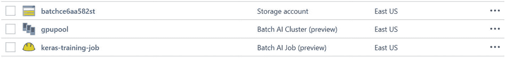

图 9-7

我们资源组的门户中显示的信息。注意，我们的集群称为`gpupool`，作业称为`keras-training-job`；这些是随附笔记本中的示例中使用的名称。

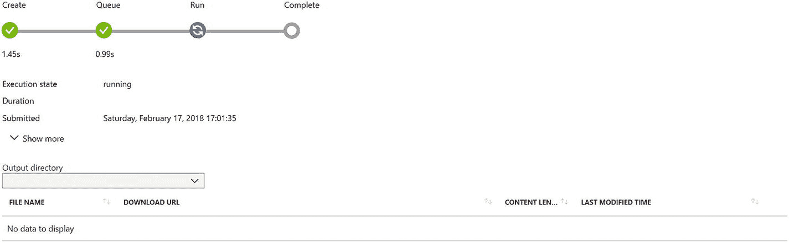

图 9-6

批处理 AI 的作业仪表板

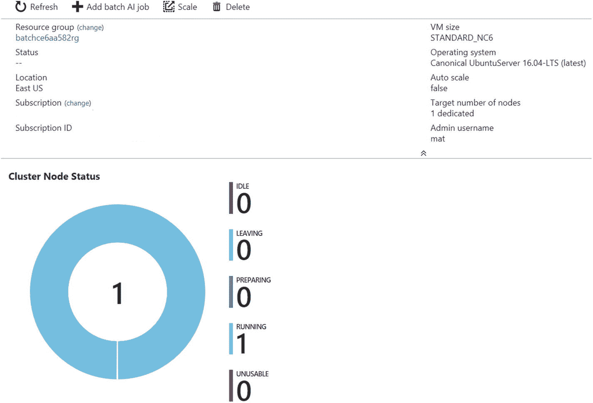

图 9-5

Azure 门户中的批量 AI 集群仪表板

为了以与 Batch Shipyard 相同的方式跟踪`stdout`的输出，我们只需运行清单 [9-14](#PC14) 中的代码。

```py
BASH

az batchai job file stream -w workspace -e experiment --j my_job --output-directory-id stdouterr --f stdout.txt

Listing 9-14Stream Output to Help Review Errors and Debug Scripts with Batch AI

```

一旦作业完成，为了删除作业，我们运行清单 [9-15](#PC15) 中的代码。

```py
BASH

az batchai job delete -w workspace -e experiment --name myjob

Listing 9-15
Delete Batch AI Job

```

现在我们用清单 [9-16](#PC16) 中的代码删除集群，这样我们就不会产生任何计算费用。

```py
BASH

az batchai cluster delete -w workspace -e experiment --name mycluster

Listing 9-16Delete Batch AI Cluster

```

最后，如果我们不想保留我们创建的存储帐户和其他资源，我们可以通过执行清单 [9-17](#PC17) 中的代码来清除它们。

```py
BASH

az group delete --name myResourceGroup

Listing 9-17If No Longer Needed, Delete Storage Account and Other Resources

```

#### 超参数调整和分布式训练

批量 AI 中超参数调整还没有批量船厂那么简单。没有任务工厂的概念，所以它要求我们创建许多作业，在这些作业中我们向模型传递不同的参数。因此，在我们的作业示例中，JSON 文件在我们的作业之间非常相似，唯一的区别是命令，特别是我们传递给脚本的参数。通过使用批处理 AI Python SDK 而不是 CLI，可以使超参数调整过程变得更容易。查看 [`http://bit.ly/baitsdk`](http://bit.ly/baitsdk) 了解 Python SDK 的更多细节。

对于 Batch AI 支持的框架，Batch AI 中的分布式训练比 Batch yard 稍微容易一些，因为 Batch AI 负责配置必要的节点间通信层，如 MPI。在撰写本文时，支持的框架有 Chainer、CNTK、TensorFlow、PyTorch 和 Caffe2。对于不受支持的框架，由用户提供适当的配置，这与 Batch Shipyard 相同。有关如何操作的示例，请参见 [`http://bit.ly/bairecipes`](http://bit.ly/bairecipes) 。

#### 使用 Python SDK 对 Batch AI 的变体

在前面的例子中，我们举例说明了在 Azure CLI 中使用 Batch AI，这是最简单的入门方式。Batch AI 也可以通过 Python SDK 使用。按照 [`http://bit.ly/deepbait`](http://bit.ly/deepbait) 给出的说明，可以复制本节描述的演示示例。在这个例子中，不是展示已经有例子的超参数调整或分布式训练的例子，而是使用九个不同的深度学习框架在 CIFAR10 数据集上训练一个简单的 CNN。在实践中，能够快速利用不同的框架可能非常有用，因为某些模型的最新实现可能只在一个或少数几个框架中可用。不过，通常情况下，人们会选择一个单一的框架，并使用该框架进行超参数调整或分布式训练，如本章所述。然而，这个例子也服务于教学目的，展示批处理人工智能服务的灵活性以及与服务交互的不同方式。

在这个例子中，项目是在 Azure Ubuntu DLVM 上开发和测试的。在这种情况下，使用 Anaconda 项目来创建环境和安装依赖项，下载数据，并允许用户以直接的方式与项目进行交互，以再现演示，例如通过命令行提示符询问 Azure 订阅标识符和应该在其中创建批处理 AI 集群的资源组的名称。该项目还附带了 makefiles 来帮助进行本地测试和调试，以允许用户更容易地修改项目。

这个例子与之前的批处理 AI 例子的不同之处还在于 Jupyter 笔记本的使用，它被直接发送到批处理 AI 集群而不是 Python 脚本，如图 [9-8](#Fig8) 所示。直接使用 Jupyter 笔记本，代码可以直接在笔记本内处理和输出存储。这对于已经在 Jupyter 笔记本中开发的数据科学家非常有用，他们希望通过这些笔记本展示结果(例如，在处理过程中或处理后创建的可视化)。在这种情况下，创建了九个不同的 Jupyter 笔记本(每个深度学习框架一个)，以及相关的 Docker 容器，笔记本在其中使用 Batch AI 运行。

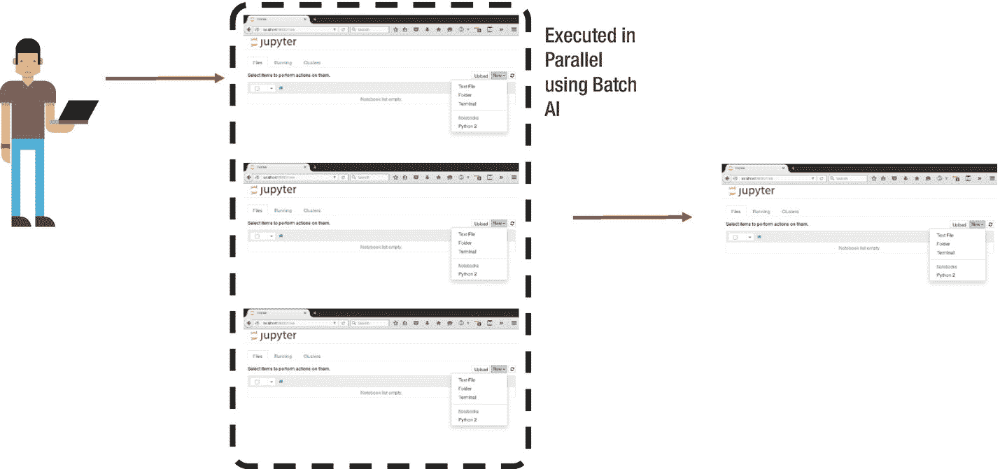

图 9-8

不必按顺序运行 Jupyter 笔记本来测试不同的选项，它们可以使用 Batch AI 并行执行

每一个笔记本都被设计成当它们在 Batch AI 集群上运行时可以修改参数。在用于说明目的的示例项目中，当在批处理 AI 上运行时，运行的历元数是从原始文件修改的。具体来说，作为示例，发送到集群的原始笔记本在笔记本顶部的列表 [9-18](#PC18) 中具有以下参数。

```py
PYTHON
# Parameters
EPOCHS = 10
N_CLASSES=10
BATCHSIZE = 64
LR = 0.01
MOMENTUM = 0.9
GPU = True

Listing 9-18Example Parameters at Top of Script That Are Modified When Run by Batch AI

```

在作业提交中，批处理 AI 集群在这种情况下被告知修改要运行的时期数(仅作为参数变化的一个示例)，笔记本被修改并以不同的时期数运行。在运行结束时，笔记本包含一个单元，其中包含运行时使用的所有参数，以及存储在笔记本本身中的每个运行单元的输出。这使得浏览结果变得容易:所有重要的信息都存储在笔记本中。

使用九个不同的深度学习框架来运行一个简单的 CNN 的步骤如下，如图 [9-9](#Fig9) 所示。

1.  创建 Jupyter 笔记本在 Batch AI 上运行，并将其转移到文件存储。

2.  将数据写入文件存储器。

3.  为每个深度学习框架创建 Docker 容器，并将它们转移到容器注册表中。

4.  创建一个批量 AI 池。

5.  每个作业将拉入适当的容器和笔记本，并从文件共享加载数据。

6.  一旦作业完成，执行的笔记本将被写入文件共享。

这些步骤与之前在 CLI 中使用 Batch AI 中描述的步骤非常相似，只是使用了 Jupyter 笔记本。除了通过批量人工智能减少实验时间的并行处理能力之外，这一场景还展示了云计算的力量，因为许多机器可以按需启动，用于所需的处理，然后可以关闭集群。这为数据科学家提供了更大的灵活性，同时大幅降低了成本，无需采购特殊硬件或管理系统。

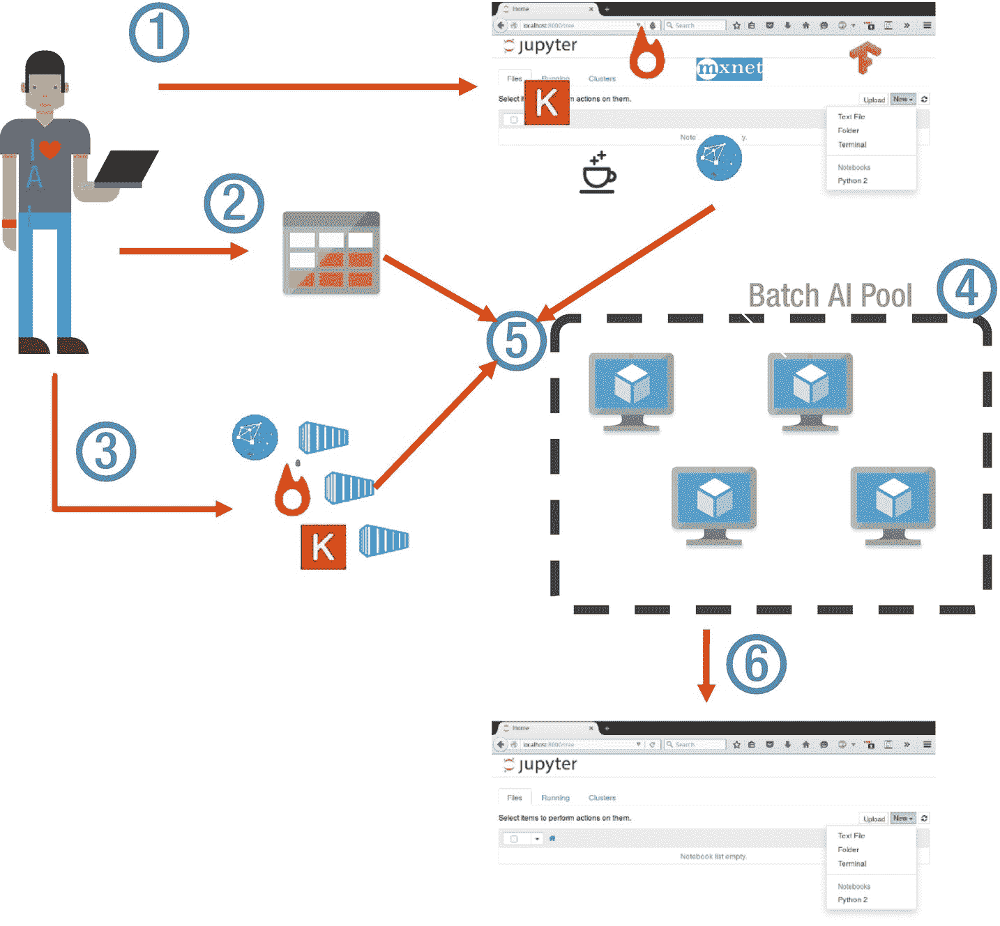

图 9-9

使用九个不同的深度学习框架运行一个简单的 CNN 所需的步骤，以说明批量人工智能的灵活性，代码处理和输出存储在 Jupyter 笔记本中。

包括许多帮助器函数，使与批处理 AI 集群的交互变得容易，例如图 [9-10](#Fig10) 所示的`setup_cluster( )`函数和图 [9-11](#Fig11) 所示的`print_jobs_summary( )`函数。

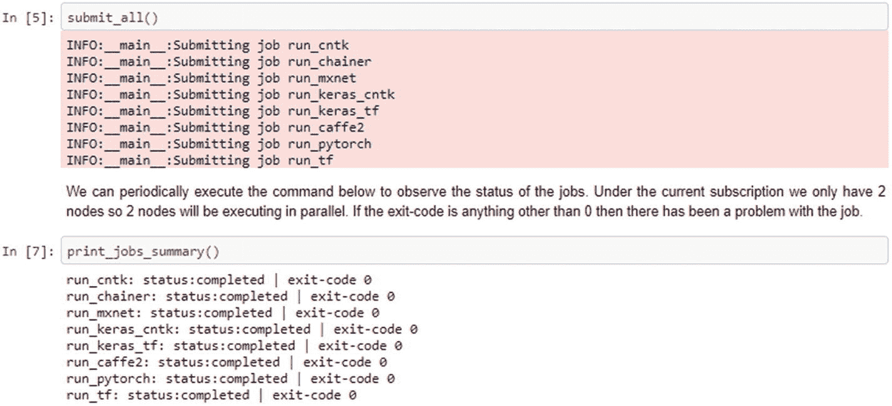

图 9-11

`ExploringBatchAI.ipynb`文件用于向批处理 AI 提交作业

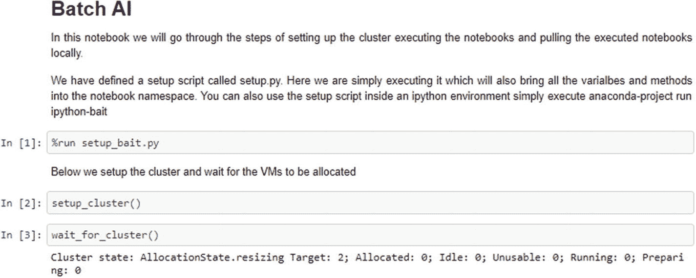

图 9-10

在 DLVM 上建立了 Anaconda 项目之后，通过 Jupyter 笔记本运行该示例，该笔记本包含与集群交互的助手函数

### Azure 机器学习服务

本章主要关注运行 AI 作业的计算环境和设置，这可以通过 DLVM、Batch yard、Batch AI 和 DLWorkspace 这四个主要示例来完成。Azure Machine Learning services 在第 4 章[的](04.html)中有更深入的介绍，它是一套服务，能够以端到端的方式构建、部署和管理人工智能模型。Azure 机器学习管理数据科学生命周期，例如提供模型版本化和运行历史(参见 [`http://bit.ly/amllogging`](http://bit.ly/amllogging) )的能力，在生产中跟踪模型，帮助 AI 开发者更快地开发。Azure 机器学习服务还旨在简化部署过程，例如在带有 Azure Kubernetes 服务的 Kubernetes 集群中运行带有 AI 模型的 Docker 容器，以实现可扩展的实时预测，或者在使用 Azure IoT 的边缘设备上运行(见图 [9-12](#Fig12) )。

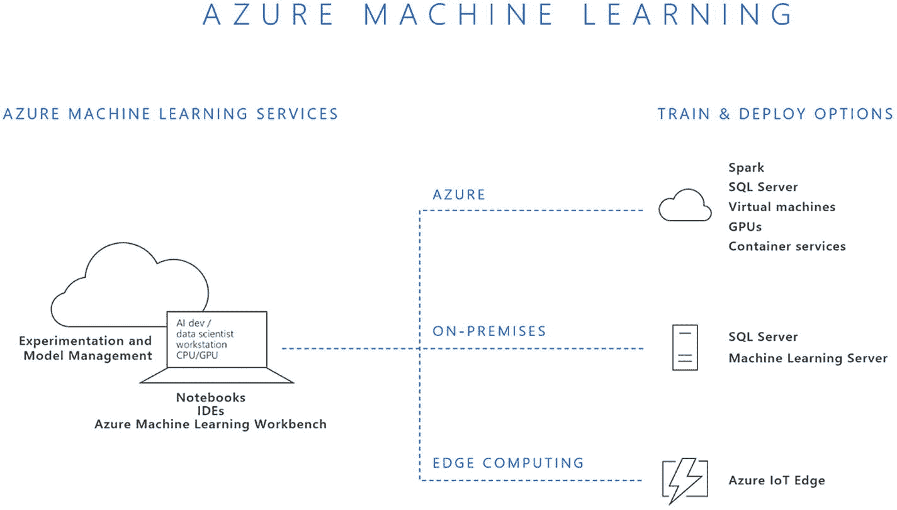

图 9-12

Azure 机器学习是一个开源兼容的端到端数据科学平台。来源: [`http://bit.ly/AMLservices`](http://bit.ly/AMLservices) `.`

本章提到的一些服务，如 DLVM 和 Batch AI，可以在 Azure 机器学习项目中设置为计算上下文。在撰写本文时，Azure Machine Learning services 与 Python 一起工作，并且在几个 Azure 地区可用。此外，还有针对 Visual Studio 和 Visual Studio 代码的 AI 扩展，允许与 Azure 机器学习平台进行交互(参见 [`http://bit.ly/aivisstdio`](http://bit.ly/aivisstdio) )。由于该服务经常更新，我们在本章中重点关注核心计算环境，并建议阅读在 [`http://bit.ly/AMLservices`](http://bit.ly/AMLservices) 可用的关于 Azure 机器学习服务的当前文档。

### Azure 上人工智能培训的其他选项

Azure 上还有许多其他的人工智能训练选项，我们没有深入描述，但我们在这里简要地提到其中的一些。第一个例子构建于 Apache Spark 之上，这是一个流行的大数据处理通用引擎。Azure 上有几个 Apache Spark 的产品，比如 Azure Databricks 和 Azure HDInsight。用 Spark 训练 AI 模型的一个流行选项是通过使用微软的 MMLSpark 库，该库提供了许多深度学习和数据科学工具，可以在 Github 的 [`http://bit.ly/mmlSpark`](http://bit.ly/mmlspark) 上开源。MMLSpark 将 Spark ML 流水线与深度学习框架 CNTK 以及 OpenCV 集成在一起。如果一个人工智能解决方案的数据已经存在于 SPARK 中，这就特别有用。MMLSpark 可用于在 GPU 节点上训练深度学习模型，因此可用于连接到 HDInsight Spark 集群的 DLVM，如 [`http://bit.ly/MMLSparkGPU`](http://bit.ly/MMLsparkGPU) 所述。

将 GPU VM 连接到 Spark 集群的另一种替代方法是利用迁移学习，在 Spark 集群上以并行方式使用 MMLSpark 应用预训练模型，然后使用 Spark 中的许多 ML 包之一训练分类器。这被用于雪豹保护，以预测包含雪豹的图像，并协助保护工作，如 Hamilton，Sengupta 和 Astala (2017)在博客中所述。

人工智能培训也可以通过使用 Docker 容器集群来扩展，例如通过使用 Kubernetes。虽然迄今为止我们已经看到 Kubernetes 集群主要用于部署和托管 AI 模型，但也有可能将其用于大规模训练。Zhang 和 Buchwalter (2017)描述了他们如何使用 Azure 容器服务引擎(ACS-engine)来生成 Azure 资源管理器模板，这些模板是部署配置好一切的集群所需要的。在他们与初创公司 Litbit 合作的案例中，Kubernetes 集群用于根据给定工作负载的需求扩展不同类型的虚拟机池(CPU、GPU)。Tok (2017)概述了如何通过 ACS-engine 将 CNTK 与 Kubernetes 结合使用，并详细介绍了如何设置集群，用于大规模培训和部署深度学习模型。

## 摘要

本章介绍了你可以用来训练你的人工智能模型的各种选项。如果您只是想进行试验，那么 DLVM 可能是最好的选择，因为它是设置起来最快捷、最容易的。如果你正在寻找运行超参数调整，分布式训练，或模型训练作为自动化流水线的一部分，那么批处理人工智能或批处理船厂将是这项工作的最佳工具。对于大规模实验，DLWorkspace 也是一个很好的选择，但是今天我们主要是在其他两个选项都不合适的情况下才推荐它。基于集群的训练方法起初看起来令人生畏，但它很快就带来了好处。Batch AI 是最容易使用和设置的，Batch yard 是功能最丰富的。我们仅仅触及了这些强大工具的表面。详细文档请查看[`http://bit.ly/azbai`](http://bit.ly/azbai)[`http://bit.ly/azshipyard`](http://bit.ly/azshipyard)[`http://bit.ly/azdlwork`](http://bit.ly/azdlwork)。在下一章中，我们将概述部署经过训练的深度学习模型的不同选项，以便它们可以在人工智能应用中使用。

<aside class="FootnoteSection" epub:type="footnotes">Footnotes [1](#Fn1_source)

顺序和数字基于单次精确浮点运算；具有两个芯片的卡被视为单独的 GPU。

  [2](#Fn2_source)

所有的步骤都在笔记本 *Chapter_09_01.ipynb* 中有详细说明，可以在 Chapter_09 文件夹[http://bit . ly/ch09 notebooks](http://bit.ly/CH09Notebooks)中找到。

 </aside>