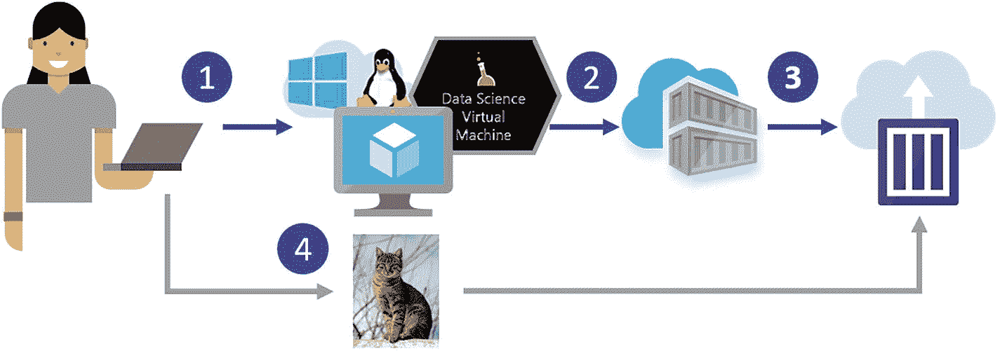
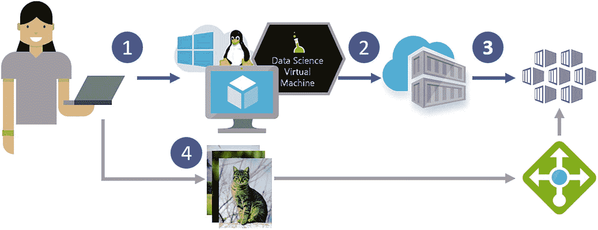
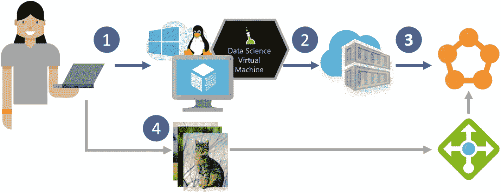
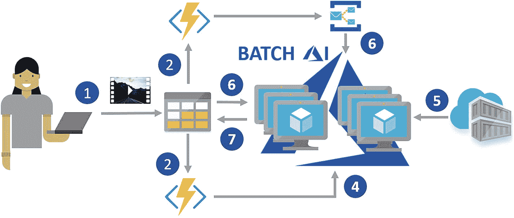
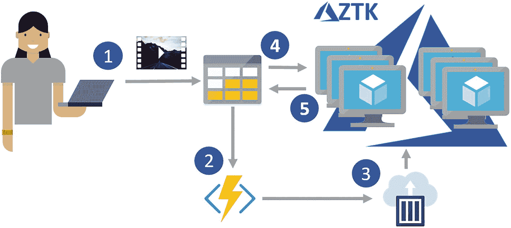
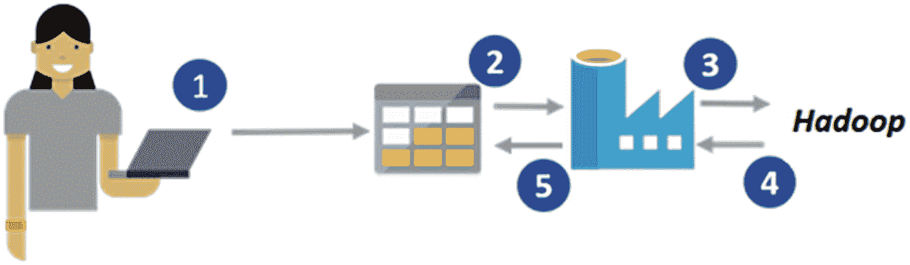
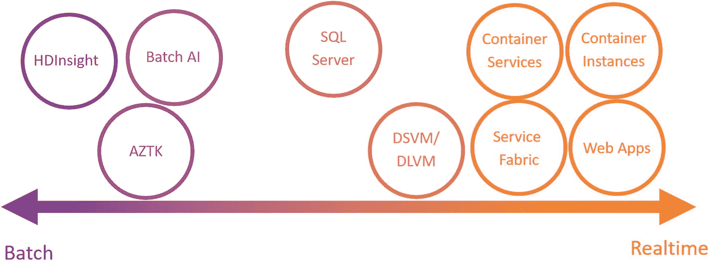
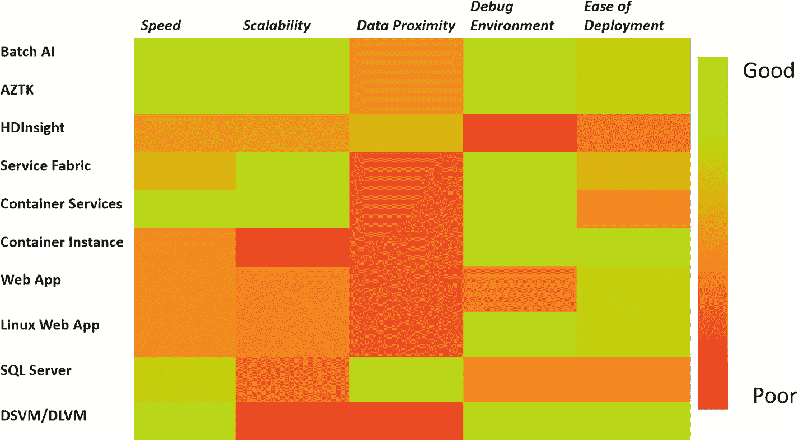

# 十、运维化人工智能模型

前一章介绍了人工智能模型的构成，我们可以创建的不同类型的模型，以及如何训练和构建这些模型。一个人工智能模型只有在被部署到某个地方并被最终用户使用后才会变得有用。本章描述了 Azure 上用于部署模型的各种选项。我们提供了使用什么和何时使用的通用指南，但这绝不是 Azure 平台的详尽指南。在接下来的部分中，我们将讨论用于比较各种部署平台的指标。然后，我们讨论了我们发现的适合部署 ML 模型的平台，并强调了它们的优缺点。我们还为它们中的每一个提供了简单的用例及架构，以便您了解它们如何适应更大的解决方案。我们还提供了将 CNN 部署到带有 GPU 节点的 Azure Kubernetes Services (AKS)的分步指南，作为构建实时请求-响应 AI 系统的一个推荐选项的实践指南。

## 运营平台

在考虑模型的可操作性时，一个常见的二分法是评分请求是批处理还是实时的。批处理工作负载的一个例子是，当我们有大量不经常给我们的记录(例如每 24 小时一次)需要评分时。这些记录可以是图像或其他类型的数据。实时工作负载是指服务必须始终保持运行，并且相对频繁地接收少量记录以进行评分。一个例子可能是一个手机应用，它发送一张图片来确定图片中是什么类型的动物。所提供的例子非常符合它们各自的分类，但实际上事情往往没有那么分散。例如，我们可能有一个实时工作负载，它需要大量的计算或我们的解决方案上的其他约束，这些约束打破了关键的架构假设。这就是为什么通常最好将这些解决方案视为一个连续体，其中每个解决方案都可以部分扩展到超出其理想适用范围。

部署模型时的一个关键考虑是依赖性和环境管理。这不是人工智能模型独有的问题:它对于所有类型的部署应用都是常见的，但对于人工智能应用来说，由于它们通常复杂的依赖性和硬件要求，它变得尤其尖锐。出于这个原因，使用 Docker 容器的服务通常是首选的，因为这使得保持相同的开发和测试环境以及确保满足所有依赖关系变得容易。如果你是 Docker 的新手，我们推荐你在 [`http://bit.ly/DockerDS`](http://bit.ly/DockerDS) 了解基本概况。

前面说过，AI 模型也有硬件要求；这些通常没有培训环境要求高，但根据具体情况，可能仍然需要合理数量的计算资源。这就是为什么部署选项的另一个考虑因素是平台上可用的硬件，特别是 GPU 的可用性。如果没有 GPU，吞吐量可能会非常有限，这意味着服务要么必须处理缓慢的响应，要么必须横向扩展计算。

### 数字地价模型

最简单的操作方法是使用我们推荐的实验平台:VM，特别是数据科学或 DLVM。您已经安装了依赖项，并且知道您的代码将在平台上运行。最重要的是，通过使用虚拟机，您可以在硬件配置方面获得最大的灵活性，甚至可以访问 GPU。这种运维化仅推荐用于概念验证和试点工作负载，因为没有管理基础架构，也无法横向扩展或分配负载。对于虚拟机，还可以使用 Docker 容器，这是部署的推荐方式，因为这将更容易迁移到不同的虚拟机，也可以迁移到其他更适合使用 Docker 容器的平台。

### Azure 容器实例

另一个用于运维化的简单平台是 Azure 容器实例(ACI)。ACI 是在 Azure 上运行容器最简单快捷的方式；您不必了解 Kubernetes 等 orchestrators，也不必了解如何调配和管理虚拟机。它非常适合托管简单的应用和任务自动化。只需要一个命令就可以部署您的预构建容器(参见清单 [10-1](#PC1) )。有关使用 ACI 进行部署的更多详细信息，请访问 [`http://bit.ly/ACIstart`](http://bit.ly/ACIstart) 。

```py
BASH

az container create --resource-group myResourceGroup --name mycontainer --image microsoft/aci-helloworld --dns-name-label aci-demo --ports 80

Listing 10-1Deploy Container on ACI

```

尽管您可以指定应用的 CPU 和内存需求，但在编写本文时，GPU 还不可用于 ACI 因此，对于需要 GPU 的工作负载，ACI 不是一个选项。ACI 的建议用途是用于短期应用，这些应用要么被触发，要么在短时间内保持运行。使用 ACI 的典型模型部署场景是部署一个简单的 Flask 应用作为短期演示，例如一个简单的图像分类模型，其中没有任何延迟或带宽要求。在图 [10-1](#Fig1) 中，我们可以看到一个示例场景。在这个场景中，用户在 DSVM 上开发一个模型和 Flask 应用，然后将其打包到一个容器中，用户也可以在上传到 Azure 容器注册表之前在 DSVM 上测试这个容器。然后，他们要求将模型从我们的容器注册表中取出，并最终将其部署在 ACI 上。使用部署的模型，他们可以简单地用图像调用端点，分类将返回给他们。



图 10-1

ACI 方案。(1)在 DSVM 上开发；(2)将容器推送到容器注册表；(3)部署到 ACI 以及(4)向部署的模型发送图像以进行评分。

### Azure 网络应用

Azure Web Apps 是另一种快速简单的部署模型的方式。它们可以是基于 Windows 的标准 Web 应用，也可以是 Linux Web 应用。两者都支持许多编程语言，Linux Web 应用支持 Docker 容器。Azure Web 应用的用例与 ACI 相同。它们的设置和配置可能有点困难，但对于长期运行的部署来说也更便宜。web 应用还提供了一些不错的特性，比如从 git 存储库部署，以及使用 CLI 安装包。有关网络应用的更多信息，请参见 [`http://bit.ly/AzureWebApps`](http://bit.ly/AzureWebApps) 。

### 蓝色忽必烈服务

AKS 是一个受管理的 Kubernetes 集群配置。它类似于标准的 Kubernetes 集群，只是主节点的管理由 Azure 处理。这意味着降低了开销和成本，因为您只需支付代理节点的计算费用。它使用 Kubernetes，这是一个流行的开源 Docker orchestrator，因此对于熟悉 Kubernetes 的人来说，它很容易导航，因为它是一个开源项目，所以可以从中提取大量信息。

AKS 最近支持部署到 GPU 虚拟机，从而为在其上运行 GPU AI 模型提供了可能性。事实上，AKS 是我们推荐的部署实时工作负载的方式。AKS 的一个典型场景是，我们需要建立一个实时服务，该服务需要随需求而扩展，并且具有容错能力。因为我们可以使用任何规模(SKU)的虚拟机，包括 GPU，所以这是要求苛刻的应用的理想解决方案。设置和管理比 ACI 显示的要复杂得多。在 [`http://bit.ly/ACSTutorial`](http://bit.ly/ACSTutorial) 中可以找到如何在一个编排好的容器集群上部署东西的例子。这使用旧的 Azure Container Services 服务，所以一些命令会有所不同。

该场景与针对 ACI 部署解释的场景非常相似，只是我们也有一个负载平衡器，以便在发出请求时，可以在部署的单元之间适当地分配负载(参见图 [10-2](#Fig2) )。图中省略了容器的创建，但它与图 [10-1](#Fig1) 中所示的相同。使用 AKS，我们还可以设置自动伸缩规则，以便集群中的单元和节点数量可以根据需求而变化。



图 10-2

AKS 场景:(1)在 DSVM 上开发，(2)将容器推送到容器注册中心，(3)部署到 AKS，以及(4)将映像发送到服务，这些映像使用负载均衡器在 pod 之间得到平衡。

要在 AKS 上部署人工智能模型，您需要:

1.  你的模型和调用它的 API。

2.  将处理请求的 Flask web 应用。

3.  包含模型、Flask 应用和必要依赖项的 Docker 容器。

一旦有了这些，就可以用清单 [10-2](#PC2) 中所示的命令创建集群。该命令将创建一个名为`myGPUCluster`的集群，其中一个节点是 NC6 VM。一个 NC6 VM 有一个 K80 GPU，与 CPU 相比，它将大大加快我们深度学习模型的推理速度。例如，使用 TensorFlow 中实现的 ResNet-152 模型，单个 NC6 每秒可以处理 20 幅图像的吞吐量。相比之下，一个具有 20 个 CPU 内核的 DS15 每秒可以处理大约 7 幅图像。因此，基于 GPU 的配置以大约一半的价格提供了近三倍的吞吐量。

```py
BASH

az aks create --resource-group myResourceGroup --name myGPUCluster --node-count 1 --generate-ssh-keys -s Standard_NC6

Listing 10-2Command to Create AKS Cluster

```

一旦我们启动并运行了集群，我们需要创建一个清单文件来指定我们想要部署什么以及如何部署。我们在这个例子中使用的清单文件可以在 [`http://bit.ly/AIManifest`](http://bit.ly/AIManifest) 找到。在 manifest 文件中，我们指定我们希望基于我们的容器创建一个服务，它需要一个 GPU，并且我们希望在端口 80 上有一个负载平衡器。我们使用清单 [10-3](#PC3) 中所示的命令部署 pod。

```py
BASH

kubectl create -f ai_manifest.json

Listing 10-3Command to Deploy Service Based on Manifest

```

大约五分钟后，我们的 pod 应该准备好了，我们可以使用清单 [10-4](#PC4) 中所示的命令获取服务的 IP，输出如清单 [10-5](#PC5) 所示。

```py
BASH-OUTPUT

AME       TYPE          CLUSTER-IP   EXTERNAL-IP   PORT(S)       AGE
azure-dl  LoadBalancer  10.0.155.14  13.82.238.75  80:30532/TCP  11m

Listing 10-5Results of Command Shown in Listing 10-4

```

```py
BASH

kubectl get service azure-dl

Listing 10-4Command to Get Service IP

```

我们服务的 IP 在`EXTERNAL-IP`之下。然后，我们可以向该服务发送请求，并获得响应。我们已经创建了一个分步指南，介绍如何使用 TensorFlow 或 Keras 编写的基于 ResNet-152 的 CNN 部署 TensorFlow 后端，您可以在 [`http://bit.ly/AKSAITutorial`](http://bit.ly/AKSAITutorial) 找到它。

### 天蓝色服务织物

Azure Service Fabric (ASF)是一个类似于 Kubernetes 的集群管理和编排服务。ASF 已经被微软内部用于许多服务，包括 Azure SQL 数据库、Azure Cosmos DB 和许多核心 Azure 服务。ASF 的吸引力在于它比 Kubernetes 更易于使用，因为人们只需了解 Docker 就可以部署应用，而不需要了解全新的编排服务。理论上应该可以在 GPU 上运行 ASF，但是目前还没有这样做的具体例子。service fabric 的用例与 AKS 的用例完全相同，唯一的区别是依赖 GPU 的工作负载已经在 AKS 上得到验证，但没有在 ASF 上得到验证(参见图 [10-3](#Fig3) )。



图 10-3

服务结构场景:(1)在 DSVM 上开发，(2)将容器推送到容器注册中心，(3)将容器部署到服务结构，以及(4)将图像发送到要评分的服务。

### 批量人工智能

在第 [9](09.html) 章中，我们讨论了 Batch AI，以及我们之前提到的在计算灵活性和可扩展性转移到可操作性方面的所有优势。Batch AI 最适合大规模并行批处理场景，在这种场景中，集群可以快速启动，任务并行执行，然后停止。因为 Batch AI 本身不需要任何成本，您只需要为您使用的计算付费，这使它成为一个极其高效的解决方案。图 [10-4](#Fig4) 显示了一个使用批处理 AI 的场景。我们假设您已经训练了模型，并将其包装在适当的 API 和 Docker 容器中，并将其全部推送到 ACR。用户上传一个或多个视频，由我们的深度学习模型进行处理。Azure 函数接收到数据已经上传到 blob 的通知，并启动批处理 AI 集群。与此同时，另一个 Azure 函数读取视频，并将它们在 Azure 服务总线中排队。当集群联机时，它会拉入适当的容器并使其旋转。容器中的应用订阅适当的主题，并查看哪些作业是可用的。现在，每个虚拟机将独立地从服务总线中提取一条消息，并基于该消息从 blob 存储中提取适当的视频，对其进行处理，然后将其推回。一旦所有的工作都完成了，Azure 功能就会破坏集群。



图 10-4

批量 AI 场景:(1)推送视频到存储。(2)存储触发 Azure 函数创建集群。(3) Azure function 开始将存储中找到的视频排队到服务总线。(4)批量人工智能集群加速运转。(5)群集从容器注册表中拉出适当的图像。(6)在每个虚拟机上运行的作业从服务总线上提取单个消息，并基于该映像从存储中提取适当的视频。(7)一旦视频被处理，结果被写回存储器。

Batch yard 与 Batch AI 非常相似，可能会提供 Batch AI 没有的功能。在前面的场景中，Batch 船厂或多或少可以作为 Batch AI 的替代。

### 阿兹特克

Spark 是大规模数据并行和高性能计算(HPC)工作负载最受欢迎的框架。Azure 分布式数据工程工具包(AZTK)是一个 Python CLI 应用，用于在 Azure 中提供按需 Spark 集群。这是使用 Spark 集群的一种既方便又便宜的方式。AZTK 能够在 5 到 10 分钟内配置一个集群，并且能够利用专用的低优先级虚拟机，因此非常经济高效。

AZTK 适合于许多组件依赖于 Spark 并且需求是短暂集群的场景。AZTK 使用 Docker 容器，这意味着可以很容易地管理依赖关系，并确保您的生产环境与部署环境相匹配。AZTK 也可以使用 GPU，这使得它非常适合需要 Spark 结合 GPU 的计算能力提供的数据并行化的解决方案。图 [10-4](#Fig4) 中显示的 AZTK 版本的场景可以在图 [10-5](#Fig5) 中看到。在 AZTK 场景中，我们不需要 Azure 订阅服务，因为我们可以使用 Spark 的内置并行化来分发东西。对于 AZTK，我们也使用 ACI，而不是从 Azure 函数调用它，因为 AZTK 是用 Python 编写的，而且在编写时，Python 对 Azure 函数的支持还处于试验阶段。



图 10-5

AZTK 场景:(1)推送视频到存储。(2)存储触发 Azure 功能。(3) Azure 函数调用安装了 AZTK 的 ACI，并启动 AZTK 集群。(PySpark 作业启动并开始从存储中提取数据并进行处理。(5)当每个视频的处理完成时，结果被写回存储器。

### HDInsight 和 Databricks

HDInsight (HDI)是微软推出的 Spark 产品。对于按需处理，它往往比 AZTK 贵一点，并且不能使用 GPU。Azure Databricks 是 Azure 上另一个基于 Spark 的平台，这是一个普遍可用的“第一方”微软服务。它有一个简单的单击启动，并与 Azure Active Directory 等 Azure 服务集成。Databricks 在优化的 Spark 平台中提供了交互式协作笔记本体验以及监控和安全工具。

可以使用 AZTK 和 Batch AI 场景中的 Azure 函数创建按需 Spark 集群，但由于它与 Azure 的集成更紧密，可以使用 Azure 数据工厂创建 Databricks 或 HDI 的按需集群(参见 [`http://bit.ly/ADFCreateHDI`](http://bit.ly/ADFCreateHDI) 和 [`http://bit.ly/DBwithADF`](http://bit.ly/DBwithADF) )。不幸的是，HDI 和 Databricks 不使用 Docker 容器，所以依赖管理有点棘手。由于更紧密的集成，使用 HDI 和 Databricks 的管道会稍微简单一点，但由于 Azure Data Factory 的限制，灵活性较差(见图 [10-6](#Fig6) )。



图 10-6

示例 Databricks 或 HDInsight 场景:(1)将视频推送到存储。(2) ADF 从存储器中读取数据。(3)它调用 HDInsight 或 Databricks 来处理数据。(4-5)然后，数据流回并存储。

请参见在 [`http://bit.ly/DB_DL`](http://bit.ly/DB_DL) 提供的 Azure Databricks 深度学习笔记本示例。

### 数据库

要在接近数据的位置执行计算，当数据已经存储在 SQL 中时，SQL Server 是一个很好的部署选项。这种部署的理想场景是 SQL Server 已经在使用中，或者该场景将受益于尽可能靠近数据执行的模型。数据邻近性要求通常是由两个因素造成的，数据重要性和数据敏感性。*数据引力*指的是由于移动数据的成本，大量数据对计算产生“引力”。*数据敏感性*是指当数据跨越不同系统时的隐私和安全问题，以及由于多次数据传输而导致数据被遗留或安全性被削弱的可能性。SQL Server 非常灵活，因为它可以安装在 Windows 和 Linux 上，可以部署在带有 GPU 的虚拟机上，以加速深度学习场景(参见 [`http://bit.ly/SQLServerDeepL`](http://bit.ly/SQLServerDeepL) )。Python 和 R 集成都可用于 SQL Server，因此数据科学家可以使用他们最熟悉的任何语言。关于在 SQL Server 上部署模型的更多示例可以在 [`http://bit.ly/SQLML`](http://bit.ly/SQLML) 找到。

## 运作概述

我们已经提出了一些可运维化的平台，很难从中做出选择。正如我们前面提到的，最好将这些服务视为从严格的批处理到实时的连续体，Batch AI 和 AZTK 等服务属于批处理端，AKS 和 ASF 等服务属于实时端。在图 [10-7](#Fig7) 中，你可以看到这个连续体的可视化表示:左边是更像批处理的平台，右边是更实时的平台。图 [10-7](#Fig7) 并不意味着最左边或最右边的选项分别是批处理和实时处理的推荐方法，只是这些平台最适合这种类型的处理。



图 10-7

批处理到实时连续体

图 [10-7](#Fig7) 只是一个通用指南，因为这些选项有可能以多种方式使用。例如，尽管 HDI 上的 Spark 或 Azure Databricks 通常与批处理工作负载相关联，但也有创建实时工作负载的选项，例如通过 MMLSpark 服务，如 [`http://bit.ly/MMLSparkStreaming`](http://bit.ly/MMLSparkStreaming) 所述。

您还将从每个服务的部分中了解到每个服务的优势和劣势。在图 [10-8](#Fig8) 中，你可以看到每个服务属性的可视化表示。热图左侧列出了服务，顶部列出了指标。每个服务都会收到一个由方框颜色表示的评级，该颜色基于热图右侧的颜色条。我们从五个方面对服务进行了比较:速度、可伸缩性、数据接近度、调试环境和易于部署。



图 10-8

部署服务热图

速度是指每个服务可用的硬件；对于人工智能模型来说，这主要围绕着 GPU 是否可用。可伸缩性是指服务是否可以轻松地纵向扩展和横向扩展。数据接近度是指计算与数据的接近程度；这主要是当我们出于容量或安全原因不想移动数据时的一个考虑因素。调试环境指的是为平台开发的难易程度；贯穿这个轴心的主要考虑是服务是否使用 Docker 容器。最后，部署的容易程度指的是部署模型的容易程度，以及是否有一个陡峭的学习曲线来让事情工作。

虽然有许多细微差别和理由偏离这一建议，但对于深度学习模型的实时处理，我们建议使用 GPU 节点的 AK。如前所述，我们已经创建了一个使用 TensorFlow 或 Keras 编写的如何使用 TensorFlow 后端部署基于 ResNet-152 的 CNN 的分步教程，您可以在 [`http://bit.ly/AKSAITutorial`](http://bit.ly/AKSAITutorial) 找到它。对于深度学习模型的批处理，在撰写本文时，我们建议使用 Batch AI。使用 TensorFlow 的例子可以在 [`http://bit.ly/BatchAIEx`](http://bit.ly/BatchAIEx) 找到。

我们在这里主要关注在 Azure 上操作深度学习模型。深度学习模型也可以在云上训练，然后在不同的环境中运行，如下一节讨论的物联网边缘，以及通过 ONNX 在 Windows 设备上本机运行，如 [`http://bit.ly/WindowsONNX`](http://bit.ly/WindowsONNX) 所述。

## Azure 机器学习服务

前面的例子将一个 AI 模型部署到 AKS 可能有点令人畏惧，特别是对于那些不熟悉 Docker 的人。为此，AML 提供了使 AI 模型更容易操作的选项:你只需提供模型文件、你在 YAML 文件中的依赖项，最后是模型驱动文件，它将创建适当的 Docker 容器并将其部署到 AKS(见 [`http://bit.ly/amldeploy`](http://bit.ly/amldeploy) )。它提供了简单方便的方法来在本地测试您的部署，并根据需要扩展服务。参见 Zhu，，Karmanov (2018)的博客文章，作为使用 Azure 机器学习部署深度学习模型以从胸部 x 射线图像中检测疾病的示例。Azure 机器学习还协助将深度学习模型部署到物联网边缘设备，如 [`http://bit.ly/DLtoIOT`](http://bit.ly/DLtoIOT) 所述。

在前几章中，我们提到了迁移学习的有用性，在本章中，我们也强调了使用 GPU 进行推理的好处。反洗钱服务现在能够在 FPGAs 上使用预训练的 ResNet 50 模型进行推断。FPGAs 以非常低的成本提供了比 CPU 和 GPU 更快的速度。基准测试表明，单个 FPGA 每秒可以获得大约 500 幅图像，获得 10，000 幅图像的成本不到 0.2 美分。要使用此服务，只需遵循 [`http://bit.ly/msfpga`](http://bit.ly/msfpga) 中给出的说明。它有许多 Jupyter 笔记本，这些笔记本讲述了如何根据功能训练您的模型，以及如何部署和测试模型。

## 摘要

本章介绍了 Azure 上提供的一些运维化选项。它经历了使用简单的托管服务(如 ACI 和 Azure Web Apps)部署模型到使用 GPU 支持的更复杂设置(如 AKS 和 Batch AI)的选项。我们还讨论了请求-响应场景和批处理场景。我们对所提供的每项服务的优势和劣势进行了比较概述。有了这个指导，你应该能够为你的场景选择最合适的选项，并部署你的模型，使你的模型在一个生产 AI 解决方案中可用。