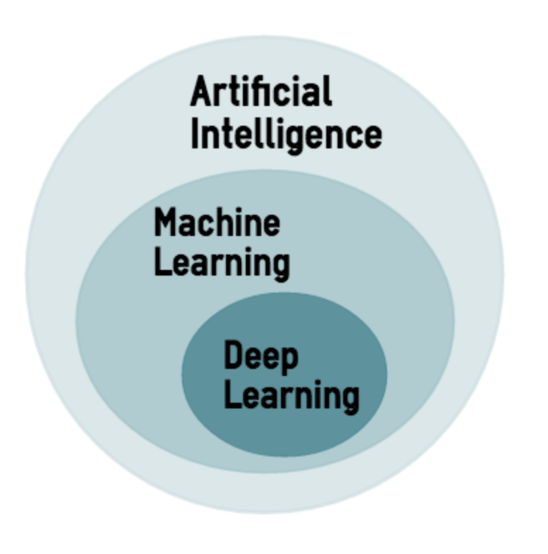

# 零、前言

Keras 深度学习实践是一个简明而全面的现代神经网络、人工智能和深度学习技术介绍，专为软件工程师和数据科学家设计。


# 代表团

这本书介绍了 20 多个使用 Keras 用 Python 编写的工作深度神经网络，Keras 是一个模块化的神经网络库，运行在 Google 的 TensorFlow 或 Lisa Lab 的 Theano 后端之上。

读者逐步介绍监督学习算法，如简单的线性回归，经典的多层感知器，更复杂的深度卷积网络和生成对抗网络。此外，这本书涵盖了无监督的学习算法，如自编码器和生成网络。循环网络和**长时短时记忆**(**【LSTM】**)网络也有详细解释。这本书继续讲述 Keras 功能 API，以及如何定制 Keras，以防读者的用例没有被 Keras 的广泛功能所覆盖。它还着眼于由前面介绍的构件组成的更大、更复杂的系统。这本书最后介绍了深度强化学习，以及如何用它来构建游戏人工智能。

实际应用包括将新闻文章分类为预定义类别的代码、文本的句法分析、情感分析、文本的合成生成以及词性标注。还探讨了图像处理，包括手写数字图像的识别、图像的分类以及带有相关图像注释的高级对象识别。还将提供识别用于面部检测的显著点的示例。声音分析包括对来自多个说话者的离散语音的识别。强化学习用于构建能够自主玩游戏的深度 Q 学习网络。

实验是这本书的精髓。每个网络由多个变量扩充，这些变量通过改变输入参数、网络形状、损失函数和用于优化的算法来逐步提高学习性能。还提供了 CPU 和 GPU 上的培训之间的一些比较。


# 深度学习与机器学习和人工智能有什么不同

**人工智能** ( **AI** )是一个非常大的研究领域，机器显示出*的认知*能力，如学习行为、与环境的主动交互、推理和演绎、计算机视觉、语音识别、问题解决、知识表示、感知和许多其他能力(有关更多信息，请参考本文:*人工智能:现代方法*，作者 S. Russell 和 P. Norvig，Prentice Hall，2003)。更通俗地说，人工智能指的是机器模仿人类通常表现出的智能行为的任何活动。人工智能从计算机科学、数学和统计学的元素中获得灵感。

**机器学习** ( **ML** )是人工智能的一个分支，专注于教会计算机如何学习，而不需要为特定任务编写程序(更多信息请参考 C. M. Bishop，Springer，2006 年出版的*模式识别和机器学习*)。事实上，ML 背后的关键思想是，有可能创建从数据中学习并对数据进行预测的算法。有三个不同的 ML 大类。在监督学习中，向机器提供输入数据和期望的输出，目标是以这样一种方式从这些训练示例中学习，即可以对新的看不见的数据进行有意义的预测。在无监督学习中，只向机器提供输入数据，机器必须在没有外部监督的情况下自己找到一些有意义的结构。在强化学习中，机器充当与环境交互的代理，并学习哪些行为会产生奖励。

**深度学习** ( **DL** )是使用**人工神经网络** ( **ANN** )的 ML 方法的一个特定子集，其灵感来自于位于人脑中的神经元结构(更多信息，请参考 Y. Bengio 发现的文章*学习 AI 的深度架构*)。趋势》2009 年第 2 卷)。通俗地说， *deep* 这个词是指人工神经网络中存在许多层，但这个意思随着时间的推移已经发生了变化。4 年前，10 层已经足以将网络视为深度*和*的网络，而如今，当网络有数百层时，将网络视为深度*和*的网络更为常见。



DL 是机器学习的一场真正的海啸(有关更多信息，请参考 C. D. Manning 的*计算语言学和深度学习*，“计算语言学”，第 41 卷，2015 年)，因为相对少量的聪明方法已经非常成功地应用于如此多的不同领域(图像、文本、视频、语音和视觉)，显著改善了过去几十年取得的最先进的成果。DL 的成功还得益于更多训练数据的可用性(如 ImageNet for images)和 GPU 相对低成本的可用性，可用于非常高效的数值计算。谷歌、微软、亚马逊、苹果、脸书和许多其他公司每天都在使用这些深度学习技术来分析海量数据。然而，这种专业知识不再局限于纯学术研究领域和大型工业公司。它已经成为现代软件产品不可或缺的一部分，因此是读者应该明确掌握的东西。这本书不需要任何特定的数学背景。但是，它假设读者已经是 Python 程序员了。


# 这本书涵盖的内容

[第 1 章](c2484fb4-248d-49ed-8166-06aff812e5e9.xhtml)、*神经网络基础*，讲授神经网络的基础知识。

[第 2 章](c2acf180-41e0-4f09-94c8-187edc23931c.xhtml)、 *Keras 安装和 API* ，展示了如何在 AWS、微软 Azure、谷歌云以及你自己的机器上安装 Keras。除此之外，我们还提供了 Keras APIs 的概述。

[第三章](4be2a04a-4545-4051-bcd9-32764d21f0f2.xhtml)，*深度学习与卷积网络*，介绍卷积网络的概念。这是深度学习中的一项根本性创新，已成功用于多个领域，从文本到视频到语音，远远超出了最初构想的最初图像处理领域。

[第 4 章](a67ea944-b1a6-48a3-b8aa-4e698166c0eb.xhtml)、*生成对抗网络和 WaveNet* ，介绍生成对抗网络，用于复制看起来像人类生成的数据的合成数据。我们将展示 WaveNet，这是一种深度神经网络，用于高质量地再现人类语音和乐器。

[第 5 章](700e9954-f126-49b5-b4e4-fa7321296e85.xhtml)，*词嵌入*，讨论词嵌入，这是一套深度学习方法，用于检测单词之间的关系并将相似的单词分组在一起。

[第 6 章](57a694a6-93f4-4eec-9fbf-e4eafd2d6824.xhtml)，*循环神经网络——RNN*，涵盖了循环神经网络，这是一类为处理文本等序列数据而优化的网络。

[第 7 章](9384823c-eb58-4a0f-91e7-1a5508eeb520.xhtml)、*附加深度学习模型*，简要介绍了 Keras 功能 API、回归网络、自编码器等等。

[第 8 章](5e7efad7-29cf-4d55-a923-d81988e44c21.xhtml)， *AI 游戏玩*，教你深度强化学习，以及如何用它来与 Keras 建立深度学习网络，Keras 根据奖励反馈学习如何玩街机游戏。

[附录](c0a1905f-57cc-401c-b485-6bf0854e43e9.xhtml)，*结论，*是本书所涵盖主题的简明回顾，并向用户介绍 Keras 2.0 中的新功能。


# 这本书你需要什么

为了能够顺利完成这些章节，您需要以下软件:

*   TensorFlow 1.0.0 或更高版本
*   Keras 2.0.2 或更高版本
*   Matplotlib 1.5.3 或更高版本
*   sci kit-学习 0.18.1 或更高版本
*   NumPy 1.12.1 或更高版本

硬件规格如下:

*   32 位或 64 位架构
*   2+ GHz CPU
*   4 GB 内存
*   至少 10 GB 的可用硬盘空间


# 这本书是给谁的

如果你是有机器学习经验的数据科学家，或者对神经网络有所接触的 AI 程序员，你会发现这本书是使用 Keras 进行深度学习的有用切入点。这本书需要 Python 知识。


# 约定

在这本书里，你会发现许多区分不同种类信息的文本样式。下面是这些风格的一些例子和它们的含义的解释。

文本中的码字、数据库表名、文件夹名、文件名、文件扩展名、路径名、伪 URL、用户输入和 Twitter 句柄如下所示:“此外，我们将真实标签分别加载到`Y_train`和`Y_test`中，并对它们执行一次热编码。”

代码块设置如下:

```py

from keras.models import Sequential
model = Sequential()
model.add(Dense(12, input_dim=8, kernel_initializer='random_uniform'))

```

当我们希望将您的注意力吸引到代码块的特定部分时，相关的行或项目以粗体显示:

```py

# 10 outputs
# final stage is softmax
model = Sequential()
model.add(Dense(NB_CLASSES, input_shape=(RESHAPED,)))
model.add(Activation('softmax'))
model.summary()

```

任何命令行输入或输出都按如下方式编写:

```py

pip install quiver_engine

```

**新术语**和**重要词汇**以粗体显示。你在屏幕上看到的单词，例如，在菜单或对话框中，出现在文本中，就像这样:“我们的简单网络开始的准确率为 92.22%，这意味着 100 个手写字符中大约有 8 个没有被正确识别。”

警告或重要提示出现在这样的框中。

提示和技巧是这样出现的。


# 读者反馈

我们随时欢迎读者的反馈。让我们知道你对这本书的看法——你喜欢或不喜欢什么。读者的反馈对我们来说很重要，因为它有助于我们开发出真正让你受益匪浅的图书。
要向我们发送总体反馈，只需发送电子邮件`feedback@packtpub.com`，并在邮件主题中提及书名。
如果有一个你擅长的主题，并且你对写作或写书感兴趣，请在[www.packtpub.com/authors](http://www.packtpub.com/authors)查看我们的作者指南。


# 客户支持

既然您已经是 Packt book 的骄傲拥有者，我们有许多东西可以帮助您从购买中获得最大收益。


# 下载示例代码

你可以从你在[http://www.packtpub.com](http://www.packtpub.com)的账户下载本书的示例代码文件。如果你在其他地方购买了这本书，你可以访问 http://www.packtpub.com/support 的[并注册，让文件直接通过电子邮件发送给你。](http://www.packtpub.com/support)

您可以按照以下步骤下载代码文件:

1.  使用您的电子邮件地址和密码登录或注册我们的网站。
2.  将鼠标指针悬停在顶部的支持选项卡上。
3.  点击代码下载和勘误表。
4.  在搜索框中输入图书的名称。
5.  选择您要下载代码文件的书。
6.  从下拉菜单中选择您购买这本书的地方。
7.  点击代码下载。

下载文件后，请确保使用最新版本的解压缩或解压文件夹:

*   WinRAR / 7-Zip for Windows
*   适用于 Mac 的 Zipeg / iZip / UnRarX
*   用于 Linux 的 7-Zip / PeaZip

这本书的代码包也在 https://github.com/PacktPublishing/Deep-Learning-with-Keras 的 GitHub 上。我们在 https://github.com/PacktPublishing/的[也有来自我们丰富的书籍和视频目录的其他代码包。看看他们！](https://github.com/PacktPublishing/)


# 下载这本书的彩色图片

我们还为您提供了一个 PDF 文件，其中包含本书中使用的截图/图表的彩色图像。彩色图像将帮助您更好地理解输出中的变化。你可以从[https://www . packtpub . com/sites/default/files/downloads/DeepLearningwithKeras _ color images . pdf](https://www.packtpub.com/sites/default/files/downloads/DeepLearningwithKeras_ColorImages.pdf)下载这个文件。


# 正误表

尽管我们已尽一切努力确保内容的准确性，但错误还是会发生。如果您在我们的某本书中发现了一个错误——可能是文本或代码中的错误——如果您能向我们报告，我们将不胜感激。这样做，你可以让其他读者免受挫折，并帮助我们改进本书的后续版本。如果您发现任何勘误表，请通过访问[http://www.packtpub.com/submit-errata](http://www.packtpub.com/submit-errata)，选择您的图书，点击勘误表提交表格链接，并输入勘误表的详细信息来报告。一旦您的勘误表得到验证，您的提交将被接受，该勘误表将被上传到我们的网站或添加到该标题的勘误表部分下的任何现有勘误表列表中。

要查看之前提交的勘误表，请前往[https://www.packtpub.com/books/content/support](https://www.packtpub.com/books/content/support)并在搜索栏中输入图书名称。所需信息将出现在勘误表部分。


# 海盗行为

互联网上版权材料的盗版是所有媒体都存在的问题。在 Packt，我们非常重视版权和许可证的保护。如果您在互联网上发现我们作品的任何形式的非法拷贝，请立即向我们提供地址或网站名称，以便我们采取补救措施。

请通过`copyright@packtpub.com`联系我们，并提供可疑盗版材料的链接。

我们感谢您帮助保护我们的作者，以及我们为您带来有价值内容的能力。


# 问题

如果您对本书的任何方面有问题，可以通过`questions@packtpub.com`联系我们，我们将尽最大努力解决问题。