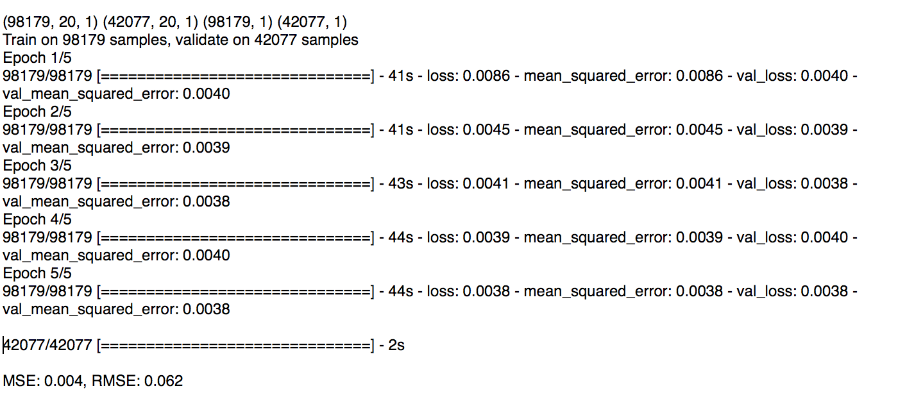

# 六、循环神经网络——RNN

在[第 3 章](4be2a04a-4545-4051-bcd9-32764d21f0f2.xhtml)、*深度学习与 ConvNets* 中，我们了解了**卷积神经网络** (CNN)，并看到了它们如何利用其输入的空间几何。例如，CNN 在一个维度中对沿时间维度的音频和文本数据应用卷积和池化操作，在两个维度中对沿(高×宽)维度的图像应用卷积和池化操作，在三个维度中对沿(高×宽×时间)维度的视频应用卷积和池化操作。

在本章中，我们将学习**循环神经网络** ( **RNN** )，这是一类利用其输入的顺序性质的神经网络。这种输入可以是文本、语音、时间序列以及序列中某个元素的出现依赖于它之前出现的元素的任何其他内容。例如，句子*中的下一个词是狗...*比*车*更有可能是*叫*，因此，给定这样的序列，RNN 比*车*更有可能预测到*叫*。

RNN 可以看作是 RNN 单元的图形，其中每个单元对序列中的每个元素执行相同的操作。rnn 非常灵活，已被用于解决语音识别、语言建模、机器翻译、情感分析和图像字幕等问题。通过重新安排图中单元的排列方式，rnn 可以适应不同类型的问题。我们将看到这些配置的一些例子，以及它们如何用于解决具体问题。

我们还将了解 SimpleRNN 细胞的一个主要限制，以及 SimpleRNN 细胞的两种变体——**长短期记忆** ( **LSTM** )和**门控循环单元**(**GRU**)——如何克服这一限制。LSTM 和 GRU 都是 SimpleRNN 单元的直接替代者，因此，只需用这些变体中的一种来替代 RNN 单元，通常就可以显著提高网络的性能。虽然 LSTM 和 GRU 不是唯一的变体，但经验表明(更多信息请参考文章:R. Jozefowicz，W. Zaremba 和 I. Sutskever，JMLR，2015 年的*循环网络架构的经验探索*和 K. Greff，arXiv:1503.04069，2015 年的 *LSTM:搜索空间奥德赛*)它们是大多数序列问题的最佳选择。

最后，我们还将了解一些提高 rnn 性能的技巧，以及何时和如何应用它们。

在本章中，我们将讨论以下主题:

*   简单细胞
*   Keras 中生成文本的基本 RNN 实现
*   RNN 拓扑
*   LSTM、GRU 和其他 RNN 变种


# 简单细胞

传统的多层感知器神经网络假设所有输入相互独立。这个假设在序列数据的情况下是不成立的。你已经看到了上一节中的例子，句子中的前两个词影响第三个词。同样的想法也适用于演讲——如果我们在一个嘈杂的房间里进行对话，我可以根据我迄今为止听到的单词对一个我可能没有理解的单词进行合理的猜测。时间序列数据，如股票价格或天气，也表现出对过去数据的依赖性，称为长期趋势。

RNN 细胞通过一种隐藏的状态或记忆来结合这种依赖性，这种状态或记忆保存了迄今所见的本质。任何时间点的隐藏状态值是前一时间步的隐藏状态值和当前时间步的输入值的函数，即:


*h[t]和*h[t-1]分别是时间步长 *t* 和 *t-1* 的隐藏状态值，*x[t]是时间 *t* 的输入值。注意方程是递归的，即 *h [t-1]* 可以用 *h [t-2]* 和 *x [t-1]* 来表示，以此类推，直到序列开始。这就是 RNNs 如何编码和合并来自任意长序列的信息。***

我们也可以用图形表示 RNN 单元格，如下图左侧所示。在时间 *t* 时，该单元具有输入*x[t]和输出*y[t]。输出*y[t](隐藏状态*h[t]的一部分被反馈到单元中，以在稍后的时间步骤 *t+1* 中使用。正如传统神经网络的参数包含在其权重矩阵中一样，RNN 的参数由三个权重矩阵 *U* 、 *V* 和 *W* 定义，分别对应于输入、输出和隐藏状态:****


另一种看待 RNN 的方式是*展开*，如右图所示。展开意味着我们为完整的序列画出网络。这里显示的网络是一个三层 RNN，适合处理三个元素序列。注意，权重矩阵 *U* 、 *V* 和 *W* 是跨步骤共享的。这是因为我们在每个时间步对不同的输入应用相同的操作。能够在所有时间步长上共享这些权重向量极大地减少了 RNN 需要学习的参数数量。

我们也可以用方程来描述 RNN 中的计算。在时间 *t* 的 RNN 的内部状态由隐藏向量*h[t]的值给出，它是在时间 *t-1* 的权重矩阵 *W* 和隐藏状态 *h [t-1]* 的乘积以及权重矩阵 *U* 和输入 *x [t] 的乘积之和选择 *tanh* 而不是其他非线性，是因为它的二阶导数非常缓慢地衰减到零。这将梯度保持在激活函数的线性区域中，并且有助于克服消失梯度问题。在这一章的后面我们将会学到更多关于渐变消失的问题。**

在时间 *t* 的输出向量*y[t]是权重矩阵 *V* 和隐藏状态*h[t]的乘积，其中 *softmax* 应用于该乘积，因此得到的向量是一组输出概率:**


Keras 提供了 SimpleRNN(更多信息请参考:[https://keras.io/layers/recurrent/](https://keras.io/layers/recurrent/))递归层，它整合了我们迄今为止看到的所有逻辑，以及更高级的变体，如 LSTM 和 GRU，我们将在本章的后面看到，因此，为了开始使用它们进行构建，并不一定要了解它们是如何工作的。然而，当您需要编写自己的 RNN 来解决给定的问题时，对结构和方程的理解是有帮助的。


# 带 Keras 的 SimpleRNN 生成文本

rnn 已经被**自然语言处理** ( **NLP** )社区广泛用于各种应用。一个这样的应用是构建语言模型。语言模型允许我们在给定前面单词的情况下预测文本中某个单词的概率。语言模型对于机器翻译、拼写纠正等各种更高级的任务非常重要。

根据前面的单词预测下一个单词的能力的一个副作用是一个生成模型，它允许我们通过从输出概率中采样来生成文本。在语言建模中，我们的输入通常是单词序列，输出是预测单词序列。使用的训练数据是现有的未标记文本，其中我们将时间 *t* 处的标签*y[t]设置为时间 *t+1* 处的输入*x[t+1]。**

对于我们使用 Keras 构建 RNNs 的第一个例子，我们将在*爱丽丝梦游仙境*的文本上训练一个基于字符的语言模型，以预测给定 10 个先前字符的下一个字符。我们选择在这里建立一个基于角色的模型，因为它的词汇量更小，训练速度更快。这个想法和使用基于单词的语言模型是一样的，除了我们使用字符而不是单词。然后，我们将使用训练好的模型以相同的样式生成一些文本。

首先，我们导入必要的模块:

```py

from __future__ import print_function
from keras.layers import Dense, Activation
from keras.layers.recurrent import SimpleRNN
from keras.models import Sequential
from keras.utils.visualize_util import plot
import numpy as np

```

我们从古腾堡计划网站上的*爱丽丝梦游仙境*的文本中读出我们的输入文本([http://www.gutenberg.org/files/11/11-0.txt](http://www.gutenberg.org/files/11/11-0.txt))。该文件包含换行符和非 ASCII 字符，因此我们做了一些初步的清理，并将内容写入一个名为`text`的变量:

```py

fin = open("../data/alice_in_wonderland.txt", 'rb')
lines = []
for line in fin:
    line = line.strip().lower()
    line = line.decode("ascii", "ignore")
    if len(line) == 0:
        continue
    lines.append(line)
fin.close()
text = " ".join(lines)

```

因为我们正在构建一个字符级的 RNN，所以我们的词汇表就是文本中出现的字符集。在我们的案例中有 42 个。由于我们将处理这些字符的索引，而不是字符本身，下面的代码片段创建了必要的查找表:

```py

chars = set([c for c in text])
nb_chars = len(chars)
char2index = dict((c, i) for i, c in enumerate(chars))
index2char = dict((i, c) for i, c in enumerate(chars))

```

下一步是创建输入和标签文本。我们通过由`STEP`变量(在我们的例子中为`1`)给出的字符数遍历文本，然后提取一段文本，其大小由`SEQLEN`变量(在我们的例子中为`10`)决定。跨距之后的下一个字符是我们的标签字符:

```py

SEQLEN = 10
STEP = 1

input_chars = []
label_chars = []
for i in range(0, len(text) - SEQLEN, STEP):
    input_chars.append(text[i:i + SEQLEN])
    label_chars.append(text[i + SEQLEN])

```

使用前面的代码，文本`it turned into a pig`的输入和标签文本如下所示:

```py

it turned -> i
 t turned i -> n
 turned in -> t
turned int -> o
urned into ->
rned into -> a
ned into a ->
ed into a -> p
d into a p -> i
 into a pi -> g

```

下一步是将这些输入和标签文本矢量化。RNN 的每一行输入都对应于前面显示的一个输入文本。这个输入中有`SEQLEN`个字符，由于我们的词汇量由`nb_chars`给出，我们将每个输入字符表示为一个大小为`nb_chars`的独热编码向量。因此，每个输入行都是一个大小为(`SEQLEN`和`nb_chars`)的张量。我们的输出标签是单个字符，因此类似于我们表示输入中每个字符的方式，它被表示为大小为(`nb_chars`)的一个 hot vector。因此，每个标签的形状是`nb_chars`:

```py

X = np.zeros((len(input_chars), SEQLEN, nb_chars), dtype=np.bool)
y = np.zeros((len(input_chars), nb_chars), dtype=np.bool)
for i, input_char in enumerate(input_chars):
    for j, ch in enumerate(input_char):
        X[i, j, char2index[ch]] = 1
    y[i, char2index[label_chars[i]]] = 1

```

最后，我们准备好构建我们的模型。我们将 RNN 的输出维度定义为大小为 128。这是一个需要通过实验来确定的超参数。一般来说，如果我们选择的尺寸太小，那么模型就没有足够的能力来生成好的文本，您将会看到长串的重复字符或长串的重复单词组。另一方面，如果选择的值太大，模型就有太多的参数，需要更多的数据来有效地训练。我们希望返回单个字符作为输出，而不是一个字符序列，所以`return_sequences=False`。我们已经看到，RNN 的输入是形状(`SEQLEN`和`nb_chars`)。此外，我们设置`unroll=True`是因为它提高了 TensorFlow 后端的性能。

RNN 连接到密集(完全连接)图层。密集层有(`nb_char`)个单元，为词汇表中的每个字符发出分数。密集层上的激活是 softmax，它将分数标准化为概率。选择概率最高的字符作为预测。我们使用分类交叉熵损失函数(分类输出的良好损失函数)和 RMSprop 优化器来编译模型:

```py

HIDDEN_SIZE = 128
BATCH_SIZE = 128
NUM_ITERATIONS = 25
NUM_EPOCHS_PER_ITERATION = 1
NUM_PREDS_PER_EPOCH = 100

model = Sequential()
model.add(SimpleRNN(HIDDEN_SIZE, return_sequences=False,
    input_shape=(SEQLEN, nb_chars),
    unroll=True))
model.add(Dense(nb_chars))
model.add(Activation("softmax"))

model.compile(loss="categorical_crossentropy", optimizer="rmsprop")

```

我们的训练方法和我们目前看到的有些不同。到目前为止，我们的方法是为固定数量的时期训练一个模型，然后根据一部分保留的测试数据对其进行评估。由于我们在这里没有任何标记的数据，我们为一个时期(`NUM_EPOCHS_PER_ITERATION=1`)训练模型，然后测试它。我们继续这样训练 25 次(`NUM_ITERATIONS=25`)迭代，一旦我们看到可理解的输出就停止。因此，我们有效地为`NUM_ITERATIONS`时代进行训练，并在每个时代之后测试模型。

我们的测试包括在给定随机输入的情况下从模型中生成一个字符，然后从输入中删除第一个字符，并追加上一次运行中预测的字符，并从模型中生成另一个字符。我们继续这样做 100 次(`NUM_PREDS_PER_EPOCH=100`)，并生成和打印结果字符串。该字符串为我们提供了模型质量的指示:

```py

for iteration in range(NUM_ITERATIONS):
    print("=" * 50)
    print("Iteration #: %d" % (iteration))
    model.fit(X, y, batch_size=BATCH_SIZE, epochs=NUM_EPOCHS_PER_ITERATION)

    test_idx = np.random.randint(len(input_chars))
    test_chars = input_chars[test_idx]
    print("Generating from seed: %s" % (test_chars))
    print(test_chars, end="")
    for i in range(NUM_PREDS_PER_EPOCH):
        Xtest = np.zeros((1, SEQLEN, nb_chars))
        for i, ch in enumerate(test_chars):
            Xtest[0, i, char2index[ch]] = 1
        pred = model.predict(Xtest, verbose=0)[0]
        ypred = index2char[np.argmax(pred)]
        print(ypred, end="")
        # move forward with test_chars + ypred
        test_chars = test_chars[1:] + ypred
print()

```

这次运行的输出如下所示。如你所见，该模型开始预测胡言乱语，但在第 25 个纪元结束时，它已经学会了相当好的拼写，尽管它在表达连贯的思想方面有困难。这个模型的惊人之处在于，它是基于字符的，没有单词知识，但它学会了拼写看起来像是来自原文的单词:


生成文本的下一个字符或下一个单词并不是这种模型唯一能做的事情。这种模型已经被成功地用于进行股票预测(有关更多信息，请参考 A. Bernal、S. Fok 和 R. Pidaparthi 在 2012 年发表的文章:*利用循环神经网络进行金融市场时间序列预测*)和生成古典音乐(有关更多信息，请参考 G. Hadjeres 和 F. Pachet 在 2016 年发表的文章:*DeepBach:Bach choral es 生成的可操纵模型*)安德烈·卡帕西(Andrej Karpathy)在他的博客文章中讲述了一些其他有趣的例子，如生成虚假的维基百科页面、代数几何证明和 Linux 源代码，他的博客文章位于:【http://karpathy.github.io/2015/05/21/rnn-effectiveness/】的的[的](http://karpathy.github.io/2015/05/21/rnn-effectiveness/)的【循环神经网络的不合理的有效性】。

这个例子的源代码可以在本章代码下载的`alice_chargen_rnn.py`中找到。这些数据可以从古登堡计划中获得。


# RNN 拓扑

用于 MLP 和 CNN 架构的 API 是有限的。两种架构都接受固定大小的张量作为输入，并产生固定大小的张量作为输出；并且它们在由模型中的层数给出的固定数量的步骤中执行从输入到输出的转换。rnn 没有这种限制——您可以在输入、输出或两者中都有序列。这意味着 rnn 可以以多种方式排列以解决特定问题。

正如我们所了解的，RNNs 将输入向量与先前的状态向量相结合，以产生新的状态向量。这可以认为类似于运行一个有一些输入和一些内部变量的程序。因此，RNNs 可以被认为本质上描述了计算机程序。事实上，已经表明 RNNs 是图灵完全的(更多信息参考文章:*关于神经网络的计算能力*，作者 H. T. Siegelmann 和 E. D. Sontag，计算学习理论第五届年度研讨会会议录，ACM，1992)。)在某种意义上，给定适当的权重，它们可以模拟任意的程序。

这种能够处理序列的特性产生了许多常见的拓扑，我们将讨论其中的一些，如下所示:


所有这些不同的拓扑都源自上图所示的相同基本结构。在这种基本拓扑结构中，所有的输入序列长度相同，并且在每个时间步产生一个输出。我们已经看到了一个例子，我们的角色级 RNN 在*爱丽丝梦游仙境*中生成单词。

多对多 RNN 的另一个例子可以是显示为 **(b)** 的机器翻译网络，它是称为序列对序列的一般网络家族的一部分(有关更多信息，请参考 O. Vinyals 著的:*作为外语的语法*，神经信息处理系统的进展，2015)。这些接受一个序列并产生另一个序列。在机器翻译的情况下，输入可以是句子中的英语单词序列，输出可以是翻译的西班牙语句子中的单词。在使用序列到序列进行**词性** ( **词性**)标注的模型的情况下，输入可以是句子中的单词，输出可以是相应的词性标注。它不同于以前的拓扑结构，在某些时间步没有输入，在其他时间步没有输出。我们将在本章后面看到这样一个网络的例子。

其他变型是显示为 **(c)** 的一对多网络，其示例可以是图像字幕网络(更多信息请参考 A. Karpathy 和 F. Li 的文章:*用于生成图像描述的深度视觉语义对齐*，2015 年 IEEE 计算机视觉和模式识别会议论文集)。)，其中输入是图像，输出是单词序列。

类似地， **(d)** 中所示的多对一网络的示例可以是对句子进行情感分析的网络，其中输入是单词序列，输出是积极或消极的情感(更多信息请参考 R. Socher 的文章:*Recursive Deep Models for Semantic composition ity over a feeling tree bank*，自然语言处理中的经验方法会议录(EMNLP)。2013 年第 1631 卷)。在本章的后面，我们将会看到这种拓扑的一个例子(与引用的模型相比要简单得多)。


# 消失和爆炸渐变

就像传统的神经网络一样，训练 RNN 也涉及反向传播。这种情况下的区别在于，由于参数由所有时间步长共享，因此每个输出的梯度不仅取决于当前时间步长，还取决于之前的时间步长。这个过程被称为通过时间的**反向传播** ( **BPTT** )(更多信息请参考 G. E .辛顿、D. E .鲁梅尔哈特和 R. J .威廉姆斯的文章:*通过反向传播错误*学习内部表征，并行分布式处理:认知的微观结构探索 1，1985):


考虑上图所示的小型三层 RNN。在前向传播期间(由实线示出)，网络产生与标签相比较的预测，以计算每个时间步长的损耗 *L [t]* 。在反向传播期间(由虚线示出)，在每个时间步长计算损失相对于参数 *U* 、 *V* 和 *W* 的梯度，并且用梯度的总和更新参数。

以下等式显示了损耗相对于 *W* 的梯度，该矩阵对长期相关性的权重进行编码。我们关注更新的这一部分，因为这是渐变消失和爆炸问题的原因。关于矩阵 *U* 和 *V* 的损失的另外两个梯度也以类似的方式在所有时间步长上相加:


现在让我们看看在最后一个时间步( *t=3* )损失梯度发生了什么。正如你所看到的，这个梯度可以用链式法则分解成三个子梯度的乘积。隐藏状态 *h2* 相对于 *W* 的梯度可以进一步分解为每个隐藏状态相对于前一个隐藏状态的梯度之和。最后，隐藏状态相对于前一个的每个梯度可以进一步分解为当前隐藏状态相对于前一个的梯度的乘积:


进行类似的计算，以计算损耗*L[1]和*L[2](在时间步骤 1 和 2)相对于 *W* 的梯度，并将它们相加到 *W* 的梯度更新中。我们不会在本书中进一步探究数学。如果你想自己做，这篇 WILDML 博客文章([https://goo.gl/l06lbX](https://goo.gl/l06lbX))对 BPTT 有很好的解释，包括这个过程背后更详细的数学推导。**

就我们的目的而言，上式中梯度的最终形式告诉我们为什么 RNNs 有消失和爆炸梯度的问题。考虑隐藏状态相对于前一个状态的单独梯度小于 1 的情况。当我们跨越多个时间步长反向传播时，梯度的乘积变得越来越小，从而导致梯度消失的问题。类似地，如果梯度大于 1，乘积会越来越大，从而导致爆炸梯度的问题。

消失梯度的效果是，来自较远步骤的梯度对学习过程没有任何贡献，因此 RNN 最终没有学习到长程相关性。传统神经网络也可能出现消失梯度，这在 RNNs 的情况下更明显，因为 RNNs 往往有更多的层(时间步长)，反向传播必须在其上发生。

爆炸梯度更容易被检测到，梯度将变得非常大，然后变成**而不是一个数字** ( **南**)，训练过程将崩溃。如 R. Pascanu，T. Mikolov 和 Y. Bengio，ICML，2013 年第 1310-1318 页的论文中所讨论的，可以通过在预定义的阈值处剪切梯度来控制爆炸梯度。

虽然有一些方法可以最大限度地减少消失梯度的问题，例如正确初始化 *W* 矩阵，使用 ReLU 而不是 *tanh* 层，以及使用无监督方法预先训练层，但最流行的解决方案是使用 LSTM 或 GRU 架构。这些架构被设计来处理消失梯度问题，并且更有效地学习长期依赖性。我们将在本章的后面了解更多关于 LSTM 和 GRU 的建筑。


# 长短期记忆——LSTM

LSTM 是 RNN 的变体，能够学习长期依赖性。LSTMs 首先由 Hochreiter 和 Schmidhuber 提出，并由许多其他研究人员完善。它们能很好地解决各种各样的问题，是应用最广泛的一种 RNN。

我们已经看到 SimpleRNN 如何使用前一时间步的隐藏状态和当前输入到一个 *tanh* 层来实现递归。LSTMs 也以类似的方式实现递归，但不是单一的 *tanh* 层，而是有四层以非常特殊的方式交互。下图说明了在时间步长 *t* 应用于隐藏状态的变换:


这个图看起来很复杂，但是让我们一个组件一个组件地来看。穿过图顶部的线是单元状态 *c* ，代表单元的内部存储器。穿过底部的线是隐藏状态，而 *i* 、 *f* 、 *o* 和 *g* 门是 LSTM 解决消失梯度问题的机制。在训练期间，LSTM 学习这些门的参数。

为了更深入地理解这些门如何调制 LSTM 的隐藏状态，让我们考虑显示它如何根据前一时间步的隐藏状态 *h [t-1]* 计算时间 *t* 的隐藏状态*h[t]的方程:*


这里的 *i* 、 *f* 和 *o* 是输入、遗忘和输出门。它们是用相同的方程计算的，但参数矩阵不同。sigmoid 函数在 0 和 1 之间调制这些门的输出，因此产生的输出向量可以按元素乘以另一个向量，以确定第二个向量有多少可以通过第一个向量。

遗忘门定义了您希望允许通过多少先前状态 *h [t-1]* 。输入门定义了多少新计算的当前输入状态*x[t]想要通过，输出门定义了多少内部状态想要暴露给下一层。基于当前输入*x[t]和先前隐藏状态*h[t-1]计算内部隐藏状态 *g* 。请注意， *g* 的公式与 SimpleRNN 单元的公式相同，但在这种情况下，我们将通过输入门 *i* 的输出来调制输出。***

给定 *i* 、 *f* 、 *o* 和 *g* ，我们现在可以根据时间*c[t-1]*(*t-1*)乘以遗忘门以及状态 *g* 乘以输入来计算时间 *t* 时的单元状态 *c [t] 因此，这基本上是一种将先前的存储器和新的输入相结合的方法——将遗忘门设置为 *0* 会忽略旧的存储器，将输入门设置为 *0* 会忽略新计算的状态。*

最后，在时间 *t* 的隐藏状态*h[t]通过将存储器*c[t]乘以输出门来计算。**

需要认识到的一点是，LSTM 是 SimpleRNN 单元的替代物，唯一的区别是 lstm 抵抗消失梯度问题。你可以用 LSTM 取代网络中的 RNN 单元，而不用担心任何副作用。随着训练时间的延长，你通常会看到更好的结果。

如果你想知道更多，WILDML 博客帖子对这些 LSTM 门及其工作原理有非常详细的解释。为了更直观的解释，看看克里斯托弗·奥拉赫的博客文章:*理解 lst ms*(【http://colah.github.io/posts/2015-08-Understanding-LSTMs/】T2)他带你一步一步地完成这些计算，每一步都有插图。


# LSTM 与 Keras——情感分析

Keras 提供了一个 LSTM 图层，我们将在这里使用它来构建和训练多对一 RNN。我们的网络接受一个句子(一个单词序列)并输出一个情感值(积极的或消极的)。我们的训练集是来自 ka ggle([https://inclass.kaggle.com/c/si650winter11](https://inclass.kaggle.com/c/si650winter11))上 UMICH SI650 情感分类竞赛的约 7000 个短句的数据集。每句话被分别标记为 *1* 或 *0* 表示积极或消极的情绪，我们的网络将学习预测这些情绪。

像往常一样，我们从进口开始:

```py

from keras.layers.core import Activation, Dense, Dropout, SpatialDropout1D
from keras.layers.embeddings import Embedding
from keras.layers.recurrent import LSTM
from keras.models import Sequential
from keras.preprocessing import sequence
from sklearn.model_selection import train_test_split
import collections
import matplotlib.pyplot as plt
import nltk
import numpy as np
import os

```

在开始之前，我们想对数据做一些探索性的分析。具体来说，我们需要知道语料库中有多少独特的单词，以及每个句子中有多少单词:

```py

maxlen = 0
word_freqs = collections.Counter()
num_recs = 0
ftrain = open(os.path.join(DATA_DIR, "umich-sentiment-train.txt"), 'rb')
for line in ftrain:
    label, sentence = line.strip().split("t")
    words = nltk.word_tokenize(sentence.decode("ascii", "ignore").lower())
    if len(words) > maxlen:
        maxlen = len(words)
    for word in words:
        word_freqs[word] += 1
    num_recs += 1
ftrain.close()

```

使用这一点，我们得到了对我们的语料库的以下估计:

```py

maxlen : 42
len(word_freqs) : 2313

```

使用独特单词`len(word_freqs)`的数量，我们将我们的词汇量设置为一个固定的数字，并将所有其他单词视为词汇之外的**(**)单词，并用伪单词 UNK(未知)替换它们。在预测的时候，这将允许我们把以前看不见的单词当作 OOV 单词来处理。****

 ****句子中的单词数(`maxlen`)允许我们设置一个固定的序列长度，并在适当的时候用零填充较短的句子和截断较长的句子。尽管 rnn 处理可变的序列长度，但这通常是通过如上所述的填充和截断，或者通过按序列长度将输入分组为不同的批次来实现的。这里我们将使用前一种方法。对于后一种方法，Keras 建议使用一个批次(更多信息请参考:[https://github.com/fchollet/keras/issues/40](https://github.com/fchollet/keras/issues/40))。

基于前面的估计，我们将`VOCABULARY_SIZE`设置为`2002`。这是我们词汇表中的 2000 个单词加上 UNK 伪单词和 PAD 伪单词(用于将句子填充到固定数量的单词)，在我们的例子中是由`MAX_SENTENCE_LENGTH`给出的 40 个单词:

```py

DATA_DIR = "../data"

MAX_FEATURES = 2000
MAX_SENTENCE_LENGTH = 40

```

接下来，我们需要一对查找表。RNN 的每一行输入都是单词索引序列，其中索引按照训练集中最频繁到最不频繁的单词排序。这两个查找表允许我们查找给定单词的索引和给定索引的单词。这也包括`PAD`和`UNK`伪词:

```py

vocab_size = min(MAX_FEATURES, len(word_freqs)) + 2
word2index = {x[0]: i+2 for i, x in
enumerate(word_freqs.most_common(MAX_FEATURES))}
word2index["PAD"] = 0
word2index["UNK"] = 1
index2word = {v:k for k, v in word2index.items()}

```

接下来，我们将输入句子转换成单词索引序列，将它们填充到`MAX_SENTENCE_LENGTH`单词中。由于我们在这种情况下的输出标签是二元的(积极或消极情绪)，我们不需要处理标签:

```py

X = np.empty((num_recs, ), dtype=list)
y = np.zeros((num_recs, ))
i = 0
ftrain = open(os.path.join(DATA_DIR, "umich-sentiment-train.txt"), 'rb')
for line in ftrain:
    label, sentence = line.strip().split("t")
    words = nltk.word_tokenize(sentence.decode("ascii", "ignore").lower())
    seqs = []
    for word in words:
        if word2index.has_key(word):
            seqs.append(word2index[word])
        else:
            seqs.append(word2index["UNK"])
    X[i] = seqs
    y[i] = int(label)
    i += 1
ftrain.close()
X = sequence.pad_sequences(X, maxlen=MAX_SENTENCE_LENGTH)

```

最后，我们将训练集分成 80-20 个训练测试部分:

```py

Xtrain, Xtest, ytrain, ytest = train_test_split(X, y, test_size=0.2, random_state=42)

```

下图显示了我们的 RNN 的结构:


每一行的输入是一个单词索引序列。序列长度由`MAX_SENTENCE_LENGTH`给出。张量的第一维设置为`None`表示批量大小(每次馈入网络的记录数)在定义时当前未知；它是在运行时使用`batch_size`参数指定的。所以假设一个尚未确定的批量，输入张量的形状是`(None, MAX_SENTENCE_LENGTH, 1)`。这些张量被送入一个大小为`EMBEDDING_SIZE`的嵌入层，其权重用小的随机值初始化，并在训练过程中学习。这一层将把张量转换成一个形状`(None,MAX_SENTENCE_LENGTH, EMBEDDING_SIZE)`。嵌入层的输出被馈送到具有序列长度`MAX_SENTENCE_LENGTH`和输出层大小`HIDDEN_LAYER_SIZE`的 LSTM，因此 LSTM 的输出是形状`(None, HIDDEN_LAYER_SIZE, MAX_SENTENCE_LENGTH)`的张量。默认情况下，LSTM 将在其最后一个序列(`return_sequences=False`)输出一个形状为`(None, HIDDEN_LAYER_SIZE)`的张量。这被馈送到具有 sigmoid 激活函数的输出大小为`1`的密集层，因此它将输出`0`(负面评价)或`1`(正面评价)。

我们使用二进制交叉熵损失函数和 Adam 优化器(一种很好的通用优化器)来编译模型，因为它预测二进制值。请注意，超参数`EMBEDDING_SIZE`、`HIDDEN_LAYER_SIZE`、`BATCH_SIZE`和`NUM_EPOCHS`(设置为常数，如下所示)是在多次运行中通过实验调整的:

```py

EMBEDDING_SIZE = 128
HIDDEN_LAYER_SIZE = 64
BATCH_SIZE = 32
NUM_EPOCHS = 10

model = Sequential()
model.add(Embedding(vocab_size, EMBEDDING_SIZE,
input_length=MAX_SENTENCE_LENGTH))
model.add(SpatialDropout1D(Dropout(0.2)))
model.add(LSTM(HIDDEN_LAYER_SIZE, dropout=0.2, recurrent_dropout=0.2))
model.add(Dense(1))
model.add(Activation("sigmoid"))

model.compile(loss="binary_crossentropy", optimizer="adam",
    metrics=["accuracy"])

```

然后，我们针对`10`个时期(`NUM_EPOCHS`)和`32` ( `BATCH_SIZE`)的批量大小来训练网络。在每个时期，我们使用测试数据验证模型:

```py

history = model.fit(Xtrain, ytrain, batch_size=BATCH_SIZE, epochs=NUM_EPOCHS,
    validation_data=(Xtest, ytest))

```

该步骤的输出显示了在多个时期内损耗如何降低，精度如何提高:


我们还可以使用以下代码绘制损耗和精度值随时间的变化曲线:

```py

plt.subplot(211)
plt.title("Accuracy")
plt.plot(history.history["acc"], color="g", label="Train")
plt.plot(history.history["val_acc"], color="b", label="Validation")
plt.legend(loc="best")

plt.subplot(212)
plt.title("Loss")
plt.plot(history.history["loss"], color="g", label="Train")
plt.plot(history.history["val_loss"], color="b", label="Validation")
plt.legend(loc="best")

plt.tight_layout()
plt.show()

```

前面示例的输出如下:


最后，我们根据完整的测试集评估我们的模型，并打印分数和准确性。我们还从测试集中随机挑选了几个句子，并打印出 RNN 的预测、标签和实际句子:

```py

score, acc = model.evaluate(Xtest, ytest, batch_size=BATCH_SIZE)
print("Test score: %.3f, accuracy: %.3f" % (score, acc))

for i in range(5):
    idx = np.random.randint(len(Xtest))
    xtest = Xtest[idx].reshape(1,40)
    ylabel = ytest[idx]
    ypred = model.predict(xtest)[0][0]
    sent = " ".join([index2word[x] for x in xtest[0].tolist() if x != 0])
    print("%.0ft%dt%s" % (ypred, ylabel, sent))

```

从结果可以看出，我们的准确率接近 99%。模型对此特定集合所做的预测与标签完全匹配，尽管并非所有预测都是如此:


如果您想在本地运行这段代码，您需要从 Kaggle 网站获取数据。

这个例子的源代码可以在本章代码下载的文件`umich_sentiment_lstm.py`中找到。


# 门控循环单元— GRU

GRU 是 LSTM 的变体，由 K. Cho 引入(有关更多信息，请参考 K. Cho 著的:*学习使用 RNN 编码器-解码器进行统计机器翻译的短语表示*，arXiv:1406.1078，2014)。它保留了 LSTM 对消失梯度问题的抵抗力，但其内部结构更简单，因此训练更快，因为更新其隐藏状态需要更少的计算。下图显示了 GRU 单元的门:


与 LSTM 单元中的输入、遗忘和输出门不同，GRU 单元有两个门，
一个更新门 *z* 和一个复位门 r。更新门定义了保留多少以前的内存，复位门定义了如何将新输入与以前的内存相结合。不存在像 LSTM 那样与隐藏状态截然不同的持久单元状态。以下等式定义了 GRU 中的门控机制:


根据 2015 年 R. Jozefowicz、W. Zaremba 和 I. Sutskever，JMLR 的几个经验评估(更多信息请参考文章:*循环网络架构的经验探索*)和 J. Chung 的*门控循环神经网络序列建模的经验评估*，arXiv:1412.3555。2014)，GRU 和 LSTM 的表现不相上下，没有简单的方法来推荐一个或另一个特定的任务。虽然 gru 训练速度更快，需要的数据更少，但在有足够数据的情况下，LSTM 更强的表达能力可能会导致更好的结果。像 LSTMs 一样，gru 是 SimpleRNN 单元的替代物。

Keras 提供了`LSTM`和`GRU`的内置实现，以及我们之前看到的`SimpleRNN`类。


# 带有 Keras-POS 标签的 GRU

Keras 提供了一个 GRU 实现，我们将在这里使用它来构建一个进行词性标注的网络。词性是在多个句子中以相同方式使用的单词的语法类别。词性的例子有名词、动词、形容词等等。例如，名词通常用来标识事物，动词通常用来标识它们做什么，形容词用来描述这些事物的一些属性。词性标注过去是手动完成的，但现在是使用统计模型自动完成的。近年来，深度学习也被应用于这个问题(更多信息请参考文章:*自然语言处理(几乎)从零开始*，作者 R. Collobert，Journal of Machine Learning Research，2011 年第 2493-2537 页)。

对于我们的训练数据，我们需要带有词性标签的句子。宾夕法尼亚树库([https://catalog.ldc.upenn.edu/ldc99t42](https://catalog.ldc.upenn.edu/ldc99t42))就是这样一个数据集，它是一个包含大约 450 万个美式英语单词的人工标注语料库。但是，它是非免费资源。作为 NLTK(【http://www.nltk.org/】)的一部分，宾夕法尼亚树库的 10%样本是免费提供的，我们将用它来训练我们的网络。

我们的模型将接受一个句子中的单词序列，并输出每个单词对应的 POS 标签。因此，对于由单词[ *的*、*的*、*的*、*的*、*的*、*的*、*组成的输入序列。* ]，发出的输出序列将是 POS 符号[ *DT* ， *NN* ， *VB* ，中的*， *DT* ， *NN* ]。*

我们从进口开始:

```py

from keras.layers.core import Activation, Dense, Dropout, RepeatVector, SpatialDropout1D
from keras.layers.embeddings import Embedding
from keras.layers.recurrent import GRU
from keras.layers.wrappers import TimeDistributed
from keras.models import Sequential
from keras.preprocessing import sequence
from keras.utils import np_utils
from sklearn.model_selection import train_test_split
import collections
import nltk
import numpy as np
import os

```

然后，我们从 NLTK 下载适合下游代码格式的数据。具体来说，这些数据是作为 NLTK 树库语料库的一部分以解析的形式提供的。我们使用下面的 Python 代码将这些数据下载到两个并行文件中，一个用于句子中的单词，另一个用于 POS 标记:

```py

DATA_DIR = "../data"

fedata = open(os.path.join(DATA_DIR, "treebank_sents.txt"), "wb")
ffdata = open(os.path.join(DATA_DIR, "treebank_poss.txt"), "wb")

sents = nltk.corpus.treebank.tagged_sents()
for sent in sents:
    words, poss = [], []
    for word, pos in sent:
        if pos == "-NONE-":
            continue
        words.append(word)
        poss.append(pos)
    fedata.write("{:s}n".format(" ".join(words)))
    ffdata.write("{:s}n".format(" ".join(poss)))

fedata.close()
ffdata.close()

```

同样，我们想稍微研究一下数据，找出应该设置什么样的词汇量。这一次，我们必须考虑两种不同的词汇表，单词的源词汇表和 POS 标记的目标词汇表。我们需要找出每个词汇中独特单词的数量。我们还需要找到我们的训练语料库中一个句子的最大单词数和记录数。由于词性标注的一对一特性，最后两个值对于两个词汇表来说是相同的:

```py

def parse_sentences(filename):
    word_freqs = collections.Counter()
    num_recs, maxlen = 0, 0
    fin = open(filename, "rb")
    for line in fin:
        words = line.strip().lower().split()
        for word in words:
            word_freqs[word] += 1
        if len(words) > maxlen:
            maxlen = len(words)
        num_recs += 1
    fin.close()
    return word_freqs, maxlen, num_recs

    s_wordfreqs, s_maxlen, s_numrecs = parse_sentences(
    os.path.join(DATA_DIR, "treebank_sents.txt"))
    t_wordfreqs, t_maxlen, t_numrecs = parse_sentences(
    os.path.join(DATA_DIR, "treebank_poss.txt"))
print(len(s_wordfreqs), s_maxlen, s_numrecs, len(t_wordfreqs), t_maxlen, t_numrecs)

```

运行这段代码告诉我们有 10，947 个唯一的单词和 45 个唯一的 POS 标记。最大句子长度为 249，10%集合中的句子数量为 3914。利用这些信息，我们决定只考虑前 5000 个单词作为源词汇。我们的目标词汇表有 45 个唯一的 POS 标签，我们希望能够预测所有的标签，所以我们将在词汇表中考虑所有的标签。最后，我们将最大序列长度设置为 250:

```py

MAX_SEQLEN = 250
S_MAX_FEATURES = 5000
T_MAX_FEATURES = 45

```

就像我们的情感分析示例一样，输入的每一行都将被表示为一系列单词索引。相应的输出将是 POS 标签索引的序列。因此，我们需要构建查找表，在单词/POS 标签和它们对应的索引之间进行转换。下面是实现这一点的代码。在源端，我们构建了一个词汇表索引，其中有两个额外的槽来保存`PAD`和`UNK`伪词。在目标端，我们不丢弃任何单词，因此不需要`UNK`伪单词:

```py

s_vocabsize = min(len(s_wordfreqs), S_MAX_FEATURES) + 2
s_word2index = {x[0]:i+2 for i, x in
enumerate(s_wordfreqs.most_common(S_MAX_FEATURES))}
s_word2index["PAD"] = 0
s_word2index["UNK"] = 1
s_index2word = {v:k for k, v in s_word2index.items()}

t_vocabsize = len(t_wordfreqs) + 1
t_word2index = {x[0]:i for i, x in
enumerate(t_wordfreqs.most_common(T_MAX_FEATURES))}
t_word2index["PAD"] = 0
t_index2word = {v:k for k, v in t_word2index.items()}

```

下一步是建立我们的数据集，并输入到我们的网络中。我们将使用这些查找表将我们的输入句子转换成长度为`MAX_SEQLEN` ( `250`)的单词 ID 序列。标签需要被构造成一个大小为`T_MAX_FEATURES` + 1 ( `46`)，长度为`MAX_SEQLEN` ( `250`)的独热向量序列。`build_tensor`函数从两个文件中读取数据，并将它们转换成输入和输出张量。传递附加的默认参数来构建输出张量。这触发了对`np_utils.to_categorical()`的调用，将 POS 标签 id 的输出序列转换为独热向量表示:

```py

def build_tensor(filename, numrecs, word2index, maxlen,
        make_categorical=False, num_classes=0):
    data = np.empty((numrecs, ), dtype=list)
    fin = open(filename, "rb")
    i = 0
    for line in fin:
        wids = []
        for word in line.strip().lower().split():
            if word2index.has_key(word):
                wids.append(word2index[word])
            else:
                wids.append(word2index["UNK"])
        if make_categorical:
            data[i] = np_utils.to_categorical(wids, 
                num_classes=num_classes)
        else:
            data[i] = wids
        i += 1
    fin.close()
    pdata = sequence.pad_sequences(data, maxlen=maxlen)
    return pdata

X = build_tensor(os.path.join(DATA_DIR, "treebank_sents.txt"),
    s_numrecs, s_word2index, MAX_SEQLEN)
Y = build_tensor(os.path.join(DATA_DIR, "treebank_poss.txt"),
    t_numrecs, t_word2index, MAX_SEQLEN, True, t_vocabsize)

```

然后，我们可以将数据集分割成 80-20 的训练测试分割:

```py

Xtrain, Xtest, Ytrain, Ytest = train_test_split(X, Y, test_size=0.2, random_state=42)

```

下图显示了我们的网络示意图。看起来很复杂，让我们来解构一下:


如前所述，假设批量大小尚未确定，网络的输入是形状为`(None, MAX_SEQLEN, 1)`的单词 id 的张量。这是通过嵌入层发送的，嵌入层将每个单词转换为形状的密集向量(`EMBED_SIZE`)，因此该层的输出张量具有形状`(None, MAX_SEQLEN, EMBED_SIZE)`。这个张量被馈送到编码器 GRU，输出大小为`HIDDEN_SIZE`。在看到一个大小为`MAX_SEQLEN`的序列后，GRU 被设置为返回一个上下文向量(`return_sequences=False`)，因此 GRU 层的输出张量具有形状`(None, HIDDEN_SIZE)`。

然后，使用 RepeatVector 层将该上下文向量复制成形状为`(None, MAX_SEQLEN, HIDDEN_SIZE)`的张量，并馈入解码器 GRU 层。然后，它被送入一个致密层，产生一个形状为`(None, MAX_SEQLEN, t_vocab_size)`的输出张量。致密层上的激活函数是 softmax。这个张量的每一列的 argmax 是该位置的单词的预测 POS 标签的索引。

模型定义如下:`EMBED_SIZE`、`HIDDEN_SIZE`、`BATCH_SIZE`、`NUM_EPOCHS`为超参数，在试验了多个不同的值后被赋予这些值。由于我们有多种类别的标签，模型是用`categorical_crossentropy`损失函数编译的，使用的优化器是流行的`adam`优化器:

```py

EMBED_SIZE = 128
HIDDEN_SIZE = 64
BATCH_SIZE = 32
NUM_EPOCHS = 1

model = Sequential()
model.add(Embedding(s_vocabsize, EMBED_SIZE,
input_length=MAX_SEQLEN))
model.add(SpatialDropout1D(Dropout(0.2)))
model.add(GRU(HIDDEN_SIZE, dropout=0.2, recurrent_dropout=0.2))
model.add(RepeatVector(MAX_SEQLEN))
model.add(GRU(HIDDEN_SIZE, return_sequences=True))
model.add(TimeDistributed(Dense(t_vocabsize)))
model.add(Activation("softmax"))

model.compile(loss="categorical_crossentropy", optimizer="adam",
    metrics=["accuracy"])

```

我们为单个时期训练这个模型。模型非常丰富，参数很多，在第一个历元训练后开始过拟合。当在下一个时期多次输入相同的数据时，模型开始过度适应训练数据，并且在验证数据上表现更差:

```py

model.fit(Xtrain, Ytrain, batch_size=BATCH_SIZE, epochs=NUM_EPOCHS,
    validation_data=[Xtest, Ytest])

score, acc = model.evaluate(Xtest, Ytest, batch_size=BATCH_SIZE)
print("Test score: %.3f, accuracy: %.3f" % (score, acc))

```

培训和评估的输出如下所示。如您所见，该模型在第一次训练后表现良好:


类似于实际的 rnn，Keras 中的三个递归类(`SimpleRNN`、`LSTM`和`GRU`)是可互换的。为了演示，我们简单地用`LSTM`替换前面程序中所有出现的`GRU`，然后重新运行程序。只有模型定义和导入语句会发生变化:

```py

from keras.layers.recurrent import GRU

model = Sequential()
model.add(Embedding(s_vocabsize, EMBED_SIZE,
input_length=MAX_SEQLEN))
model.add(SpatialDropout1D(Dropout(0.2)))
model.add(GRU(HIDDEN_SIZE, dropout=0.2, recurrent_dropout=0.2))
model.add(RepeatVector(MAX_SEQLEN))
model.add(GRU(HIDDEN_SIZE, return_sequences=True))
model.add(TimeDistributed(Dense(t_vocabsize)))
model.add(Activation("softmax"))

```

正如您从输出中看到的，基于 GRU 的网络的结果与我们之前基于 LSTM 的网络相当。

序列对序列模型是一类非常强大的模型。它最典型的应用是机器翻译，但是还有很多其他的应用，比如前面的例子。事实上，许多 NLP 任务在层次结构中处于更高的位置，例如命名实体识别(有关更多信息，请参考 J. Hammerton 的文章:*具有长短期记忆的命名实体识别*，HLT-NAACL 第七届自然语言学习会议的会议录，计算语言学协会，2003 年)和句子解析(有关更多信息，请参考 O. Vinyals 的文章:*作为外语的语法*，神经信息处理系统的进展，2015 年)， 以及更复杂的网络，例如用于图像字幕的网络(有关更多信息，请参考 A. Karpathy 和 F. Li 在 2015 年 IEEE 计算机视觉和模式识别会议上发表的文章:*用于生成图像描述的深度视觉语义对齐*)。 )，是序列到序列组合模型的例子。

这个例子的完整代码可以在本章代码下载的文件`pos_tagging_gru.py`中找到。


# 双向 RNNs

在给定的时间步长 *t* ，RNN 的输出取决于所有先前时间步长的输出。然而，输出也完全可能依赖于未来的输出。对于 NLP 这样的应用来说尤其如此，在 NLP 中，我们试图预测的单词或短语的属性可能依赖于整个封闭句子给出的上下文，而不仅仅是它前面的单词。双向 rnn 还有助于网络架构同等重视序列的开头和结尾，并增加可用于训练的数据。

双向 rnn 是两个 rnn 堆叠在一起，以相反的方向读取输入。所以在我们的例子中，一个 RNN 从左向右读单词，另一个 RNN 从右向左读单词。每个时间步长的输出将基于两个 rnn 的隐藏状态。

Keras 通过双向包装层为双向 rnn 提供支持。例如，对于我们的 POS 标记示例，我们可以通过用这个双向包装器包装 LSTMs 来使它们成为双向的，如下面的模型定义代码所示:

```py

from keras.layers.wrappers import Bidirectional

model = Sequential()
model.add(Embedding(s_vocabsize, EMBED_SIZE,
input_length=MAX_SEQLEN))
model.add(SpatialDropout1D(Dropout(0.2)))
model.add(Bidirectional(LSTM(HIDDEN_SIZE, dropout=0.2, recurrent_dropout=0.2)))
model.add(RepeatVector(MAX_SEQLEN))
model.add(Bidirectional(LSTM(HIDDEN_SIZE, return_sequences=True)))
model.add(TimeDistributed(Dense(t_vocabsize)))
model.add(Activation("softmax"))

```

这为我们提供了与单向 LSTM 示例相当的性能，如下所示:


# 有状态 RNNs

rnn 可以是有状态的，这意味着它们可以在训练期间跨批维护状态。也就是说，为一批训练数据计算的隐藏状态将被用作下一批训练数据的初始隐藏状态。但是，这需要显式设置，因为 Keras RNNs 在默认情况下是无状态的，并且在每次批处理后都会重置状态。将 RNN 设置为有状态意味着它可以跨其训练序列构建状态，甚至在进行预测时保持该状态。

使用有状态 rnn 的好处是更小的网络规模和/或更少的训练时间。缺点是，我们现在负责用反映数据周期性的批量大小来训练网络，并在每个时期后重置状态。此外，在训练网络时不应打乱数据，因为数据呈现的顺序与状态网络相关。


# 具有 Keras 的状态 LSTM—预测电力消耗

在本例中，我们使用有状态和无状态 LSTM 网络预测消费者的用电量，并比较他们的行为。正如您所记得的，Keras 中的 rnn 默认情况下是无状态的。在有状态模型的情况下，在处理一批输入之后计算的内部状态被重新用作下一批输入的初始状态。换句话说，从一个批次中的元素 *i* 计算出的状态将被用作下一批次中的元素 *i* 的初始状态。

我们将使用的数据集是来自 UCI 机器学习存储库的电力负载图数据集([https://archive . ics . UCI . edu/ml/datasets/electricityloaddiagrams 2011 2014](https://archive.ics.uci.edu/ml/datasets/ElectricityLoadDiagrams20112014))，包含 2011 年至 2014 年四年间每隔 15 分钟采集的 370 个客户的消费信息。在我们的例子中，我们随机选择客户号 250。

需要记住的一点是，大多数问题都可以用无状态 RNN 解决，所以如果您确实使用有状态 RNN，请确保您需要它。通常，当数据具有周期性成分时，您会需要它。稍微想一想，就会意识到用电是周期性的。白天的消耗量往往比晚上高。让我们提取客户编号为 250 的消费数据，并绘制前 10 天的数据。最后，我们还将其保存到一个二进制 NumPy 文件中，以供下一步使用:

```py

import numpy as np
import matplotlib.pyplot as plt
import os
import re

DATA_DIR = "../data"

fld = open(os.path.join(DATA_DIR, "LD2011_2014.txt"), "rb")
data = []
cid = 250
for line in fld:
    if line.startswith(""";"):
        continue
    cols = [float(re.sub(",", ".", x)) for x in 
                line.strip().split(";")[1:]]
    data.append(cols[cid])
fld.close()

NUM_ENTRIES = 1000
plt.plot(range(NUM_ENTRIES), data[0:NUM_ENTRIES])
plt.ylabel("electricity consumption")
plt.xlabel("time (1pt = 15 mins)")
plt.show()

np.save(os.path.join(DATA_DIR, "LD_250.npy"), np.array(data))

```

前面示例的输出如下:


如你所见，明显存在每日周期趋势。所以这个问题是有状态模型的一个很好的候选。此外，根据我们的观察，`96`的`BATCH_SIZE`(24 小时内 15 分钟的读数)似乎是合适的。

我们将同时展示模型的无状态版本和有状态版本的代码。两个版本的大部分代码是相同的，所以我们将同时查看两个版本。我将指出代码中出现的差异。

首先，像往常一样，我们导入必要的库和类:

```py

from keras.layers.core import Dense
from keras.layers.recurrent import LSTM
from keras.models import Sequential
from sklearn.preprocessing import MinMaxScaler
import numpy as np
import math
import os

```

接下来，我们将客户 250 的数据从保存的 NumPy 二进制文件加载到一个大小为(`140256`)的长数组中，并将其重新调整到范围 *(0，1)* 。最后，我们根据网络的需要，将输入重塑为三个维度:

```py

DATA_DIR = "../data"

data = np.load(os.path.join(DATA_DIR, "LD_250.npy"))
data = data.reshape(-1, 1)
scaler = MinMaxScaler(feature_range=(0, 1), copy=False)
data = scaler.fit_transform(data)

```

在每一批中，模型将获取一系列 15 分钟的读数，并预测下一批。输入序列的长度由代码中的`NUM_TIMESTEPS`变量给出。基于一些实验，我们得到一个`NUM_TIMESTEPS`的值为`20`，即每个输入行将是一个长度为`20`的序列，输出将具有长度`1`。下一步将输入数组重新排列成形状为`(None, 4)`和`(None, 1)`的`X`和`Y`张量。最后，我们将输入张量`X`整形为网络所需的三维:

```py

X = np.zeros((data.shape[0], NUM_TIMESTEPS))
Y = np.zeros((data.shape[0], 1))
for i in range(len(data) - NUM_TIMESTEPS - 1):
    X[i] = data[i:i + NUM_TIMESTEPS].T
    Y[i] = data[i + NUM_TIMESTEPS + 1]

# reshape X to three dimensions (samples, timesteps, features)
X = np.expand_dims(X, axis=2)

```

然后我们将我们的`X`和`Y`张量分成 70-30 的训练测试部分。由于我们处理的是时间序列，我们只需选择一个分割点，将数据分割成两部分，而不是使用`train_test_split`函数，该函数也会打乱数据:

```py

sp = int(0.7 * len(data))
Xtrain, Xtest, Ytrain, Ytest = X[0:sp], X[sp:], Y[0:sp], Y[sp:]
print(Xtrain.shape, Xtest.shape, Ytrain.shape, Ytest.shape)

```

首先，我们定义我们的无状态模型。如前所述，我们还设置了`BATCH_SIZE`和`NUM_TIMESTEPS`的值。我们的 LSTM 输出大小由`HIDDEN_SIZE`给出，这是另一个通常通过实验得出的超参数。这里，我们只是将其设置为`10`，因为我们的目标是比较两个网络:

```py

NUM_TIMESTEPS = 20
HIDDEN_SIZE = 10
BATCH_SIZE = 96 # 24 hours (15 min intervals)

# stateless
model = Sequential()
model.add(LSTM(HIDDEN_SIZE, input_shape=(NUM_TIMESTEPS, 1), 
    return_sequences=False))
model.add(Dense(1))

```

有状态模型的相应定义非常相似，如下所示。在 LSTM 构造函数中，您需要设置`stateful=True`，而不是在运行时确定批处理大小的`input_shape`，您需要用批处理大小显式地设置`batch_input_shape`。您还需要确保您的训练和测试数据大小是您的批量大小的完美倍数。稍后，当我们查看培训代码时，我们将看到如何做到这一点:

```py

# stateful
model = Sequential()
model.add(LSTM(HIDDEN_SIZE, stateful=True,
    batch_input_shape=(BATCH_SIZE, NUM_TIMESTEPS, 1), 
    return_sequences=False))
model.add(Dense(1))

```

接下来我们编译这个模型，它对于无状态和有状态 rnn 都是一样的。请注意，这里我们的度量是均方误差，而不是我们通常的精度。这是因为这确实是一个回归问题；我们感兴趣的是知道我们的预测离标签有多远，而不是知道我们的预测是否与标签匹配。您可以在 Keras 指标页面上找到 Keras 内置指标的完整列表:

```py

model.compile(loss="mean_squared_error", optimizer="adam",
    metrics=["mean_squared_error"])

```

为了训练无状态模型，我们可以使用一个我们现在可能已经非常熟悉的 liner:

```py

BATCH_SIZE = 96 # 24 hours (15 min intervals)

# stateless
model.fit(Xtrain, Ytrain, epochs=NUM_EPOCHS, batch_size=BATCH_SIZE,
    validation_data=(Xtest, Ytest),
    shuffle=False)

```

有状态模型的相应代码如下所示。这里有三点需要注意。

首先，您应该选择反映数据周期性的批次大小。这是因为有状态 rnn 将状态从每一批调整到下一批，因此选择正确的批大小允许网络更快地学习。

一旦设置了批量大小，训练集和测试集的大小就需要是批量大小的整数倍。我们在下面通过从我们的训练集和测试集中截断最后几个记录来确保这一点。

第二件事是，您需要手动拟合模型，在一个循环中训练模型所需的历元数。每次迭代为一个时期训练模型，并且状态在多个批次中被保留。在每个时期之后，需要手动重置模型的状态。

第三件事是数据要按顺序馈入。默认情况下，Keras 会在每个批处理中打乱行，这将破坏有状态 RNN 有效学习所需的对齐。这是通过在对`model.fit()`的调用中设置`shuffle=False`来实现的:

```py

BATCH_SIZE = 96 # 24 hours (15 min intervals)

# stateful
# need to make training and test data to multiple of BATCH_SIZE
train_size = (Xtrain.shape[0] // BATCH_SIZE) * BATCH_SIZE
test_size = (Xtest.shape[0] // BATCH_SIZE) * BATCH_SIZE
Xtrain, Ytrain = Xtrain[0:train_size], Ytrain[0:train_size]
Xtest, Ytest = Xtest[0:test_size], Ytest[0:test_size]
print(Xtrain.shape, Xtest.shape, Ytrain.shape, Ytest.shape)
for i in range(NUM_EPOCHS):
    print("Epoch {:d}/{:d}".format(i+1, NUM_EPOCHS))
    model.fit(Xtrain, Ytrain, batch_size=BATCH_SIZE, epochs=1,
        validation_data=(Xtest, Ytest),
        shuffle=False)
    model.reset_states()

```

最后，我们根据测试数据评估模型，并打印出分数:

```py

score, _ = model.evaluate(Xtest, Ytest, batch_size=BATCH_SIZE)
rmse = math.sqrt(score)
print("MSE: {:.3f}, RMSE: {:.3f}".format(score, rmse))

```

运行五个时期的无状态模型的输出如下:



有状态模型的相应输出如下，也是在一个循环中运行五次，每次运行一个时期。注意第二行中截断操作的结果:


如您所见，有状态模型产生的结果比无状态模型稍好。就绝对值而言，由于我们已经将我们的数据缩放到 *(0，1)* 范围，这意味着无状态模型具有大约 6.2%的错误率，有状态模型具有 5.9%的错误率，或者相反，它们分别具有大约 93.8%和 94.1%的准确性。因此，相对而言，我们的有状态模型比无状态模型略胜一筹。

本例的源代码在解析数据集的文件`econs_data.py`和定义并训练无状态和有状态模型的文件`econs_stateful.py`中提供，可从本章的代码下载中获得。


# 其他 RNN 变体

我们将通过研究 RNN 晶胞的更多变体来结束这一章。RNN 是一个活跃的研究领域，许多研究人员提出了用于特定目的的变体。

一个流行的 LSTM 变体是增加*窥视孔连接*，这意味着栅极层被允许窥视单元状态。这是由 Gers 和 Schmidhuber 在 2002 年提出的(更多信息请参考文章:*用 LSTM 循环网络学习精确定时*，作者是 F. A. Gers，N. N. Schraudolph 和 J. Schmidhuber，机器学习研究杂志，第 115-43 页)。

另一个 LSTM 变体，最终导致了 GRU，是使用耦合的遗忘和输出门。关于忘记什么信息和获取什么信息的决定是一起做出的，新的信息取代了被遗忘的信息。

Keras 仅提供三种基本变体，即简单层、LSTM 层和 GRU 层。然而，这不一定是个问题。Gref 对许多 LSTM 变体进行了实验调查(更多信息请参考文章: *LSTM:搜索空间奥德赛*，作者 K. Greff，arXiv:1503.04069，2015)，并得出结论，没有一个变体比标准 LSTM 架构有显著改善。所以 Keras 中提供的组件通常足以解决大多数问题。

如果您确实需要构建自己的层的能力，您可以构建自定义的 Keras 层。我们将在下一章看看如何建立一个自定义层。还有一个叫做 recurrent shop([https://github.com/datalogai/recurrentshop](https://github.com/datalogai/recurrentshop))的开源框架，可以让你用 Keras 构建复杂的循环神经网络。


# 摘要

在这一章中，我们看了循环神经网络的基本架构，以及它们如何在序列数据上比传统神经网络工作得更好。我们看到了如何使用 RNNs 来学习作者的写作风格，并使用学习到的模型生成文本。我们还看到了如何将这个示例扩展到预测股票价格或其他时间序列、来自嘈杂音频的语音等等，以及生成由学习模型创作的音乐。

我们研究了组成 RNN 单元的不同方式，这些拓扑可用于建模和解决特定问题，如情感分析、机器翻译、图像字幕和分类等。

然后我们看了 SimpleRNN 架构的最大缺点之一，即渐变的消失和爆炸。我们看到了如何使用 LSTM(和 GRU)架构处理消失梯度问题。我们还详细考察了 LSTM 和 GRU 的建筑。我们还看到了两个使用基于 LSTM 的模型预测情感的例子，以及使用基于 GRU 的序列到序列架构预测词性标签的例子。

然后我们学习了有状态 rnn 以及如何在 Keras 中使用它们。我们还看到了一个学习状态 RNN 来预测大气中一氧化碳含量的例子。

最后，我们了解了 Keras 中没有的一些 RNN 变体，并简要探讨了如何构建它们。

在下一章中，我们将看看那些不完全符合我们目前所看到的基本模型的模型。我们还将看看如何使用 Keras functional API 组合这些基本模型(更大更复杂的模型),以及根据我们的需求定制 Keras 的一些例子。****