# 八、人工智能游戏

在前几章中，我们研究了监督学习技术，如回归和分类，以及非监督学习技术，如 GANs、自编码器和生成模型。在监督学习的情况下，我们用期望的输入和输出训练网络，并期望它在给定新输入的情况下预测输出。在无监督学习的情况下，我们向网络显示一些输入，并期望它学习数据的结构，以便它可以将这些知识应用于新的输入。

在本章中，我们将学习强化学习，或者更具体地说，深度强化学习，即深度神经网络在强化学习中的应用。强化学习源于行为心理学。通过奖励正确的行为和惩罚不正确的行为来训练代理。在深度强化学习的背景下，网络被显示一些输入，并根据它是否从该输入产生正确的输出而被给予积极或消极的奖励。因此，在强化学习中，我们有稀疏和延时的标签。经过多次迭代，网络学会产生正确的输出。

深度强化学习领域的先驱是一家名为 DeepMind 的英国小公司，该公司在 2013 年发表了一篇论文(更多信息请参考:*用深度强化学习玩雅达利*，作者 V. Mnih，arXiv:1312.5602，2013)。)描述了如何通过向一个**卷积神经网络** ( **CNN** )显示屏幕像素并在分数增加时给予奖励，来教会它玩 Atari 2600 视频游戏。同样的架构被用来学习七个不同的 Atari 2600 游戏，其中六个模型优于所有以前的方法，三个模型优于人类专家。

与我们之前学习的学习策略不同，在学习策略中，每个网络学习一个单一的学科，强化学习似乎是一种通用的学习算法，可以应用于各种环境；它甚至可能是走向通用人工智能的第一步。DeepMind 后来被谷歌收购，该集团一直处于人工智能研究的前沿。随后的论文(更多信息请参考:*通过深度强化学习的人类水平控制*，作者 V. Mnih，Nature 518.7540，2015: 529-533。)在 2015 年被著名的《自然杂志》刊登，他们将同一模型应用于 49 个不同的游戏。

在这一章中，我们将探索深层强化学习的理论框架。然后，我们将应用这个框架，使用 Keras 构建一个学习玩接球游戏的网络。我们将简要介绍一些可以让这个网络变得更好的想法，以及这个领域中一些有前途的新研究领域。

综上所述，我们将在本章学习以下围绕强化学习的核心概念:

*   q 学习
*   探索与开发
*   体验回放


# 强化学习

我们的目标是建立一个神经网络来玩接球游戏。每场游戏开始时，一个球从屏幕顶部的随机位置落下。目标是使用左右箭头键移动屏幕底部的球拍，在球到达底部时接住球。就游戏而言，这很简单。在任何时间点，这个游戏的状态都是由球和桨的 *(x，y)* 坐标给出的。大多数街机游戏往往有更多的移动部分，所以一般的解决方案是提供整个当前游戏屏幕图像作为状态。下面的截图显示了我们的 catch 游戏的四个连续截图:

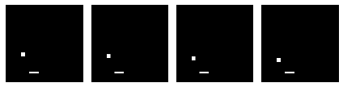

敏锐的读者可能会注意到，我们的问题可以建模为一个分类问题，其中网络的输入是游戏屏幕图像，输出是三个动作之一——向左移动、保持不动或向右移动。然而，这将需要我们向网络提供训练样本，可能来自专家玩的游戏的记录。另一种更简单的方法可能是建立一个网络，让它重复玩这个游戏，根据它是否成功抓住球给它反馈。这种方法也更直观，更接近人类和动物的学习方式。

最常见的表示这种问题的方式是通过一个**马尔可夫决策过程** ( **MDP** )。我们的游戏是代理人试图学习的环境。在时间步 *t* 的环境状态由*s[t]给出(并且包含球和球拍的位置)。代理可以执行某些操作(例如向左或向右移动挡板)。这些行为有时会导致奖励*r[t]，奖励可以是积极的，也可以是消极的(比如分数的增减)。动作改变了环境，可以导致一个新的状态*s[t+1]，此时代理可以执行另一个动作 *a [t+1]* 等等。状态、动作和奖励的集合，以及从一种状态转换到另一种状态的规则，构成了马尔可夫决策过程。单个游戏是这一过程的一个插曲，由状态、动作和奖励的有限序列来表示:***

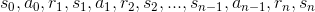

既然，这是一个马尔可夫决策过程，那么状态*s[t+1]的概率只取决于当前状态*s[t]和动作 *a [t]* 。**


# 最大化未来回报

作为代理商，我们的目标是最大化每场比赛的总回报。总报酬可以表示如下:

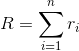

为了使总报酬最大化，代理人应该从游戏中的任意时间点 *t* 开始努力使总报酬最大化。在时间步长 *t* 的总报酬由*R[t]给出，并表示为:*

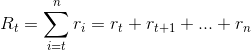

然而，随着我们越往未来发展，就越难预测奖励的价值。为了考虑到这一点，我们的代理应该尝试在时间 *t* 最大化总贴现未来奖励。这是通过在前一个时间步的基础上用因子γ来贴现每个未来时间步的回报来实现的。如果γ是 *0* ，那么我们的网络完全不考虑未来的回报，如果γ是 *1* ，那么我们的网络是完全确定性的。γ的一个好值大约是 *0.9* 。对等式进行因式分解使我们能够将给定时间步的总贴现未来奖励递归表示为当前奖励和下一时间步的总贴现未来奖励之和:

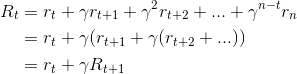

# q 学习

深度强化学习利用了一种称为 **Q-learning** 的无模型强化学习技术。Q-learning 可用于在有限马尔可夫决策过程中找到任何给定状态的最优动作。当我们在状态 *s* 执行动作 *a* 时，Q-learning 试图最大化 Q-function 的值，该值代表最大的贴现未来报酬:

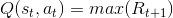

一旦我们知道了 Q 函数，在状态 *s* 的最优动作 *a* 就是具有最高 Q 值的那个。然后，我们可以定义一个策略*(s)*，它可以在任何状态下为我们提供最佳行动:

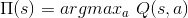

我们可以根据下一点的 Q 函数( *s [t+1]* ，*a[t+1])来定义一个过渡点的 Q 函数(*s[t]，*a[t]， *r [t]* ， *s [t+1]* )这个方程被称为**贝尔曼方程**:***

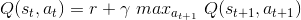

Q 函数可以用贝尔曼方程近似计算。你可以把 Q 函数想象成一个查找表(称为 **Q-table** )，其中状态(用 *s* 表示)是行，动作(用 *a* 表示)是列，元素(用 *Q(s，a)* 表示)是当你处于行给出的状态并采取列给出的动作时得到的奖励。在任何状态下采取的最佳行动都是奖励最高的行动。我们首先随机初始化 Q 表，然后执行随机操作并观察奖励，以根据以下算法迭代更新 Q 表:

```py

initialize Q-table Q
observe initial state s
repeat
   select and carry out action a
   observe reward r and move to new state s'
   Q(s, a) = Q(s, a) + α(r + γ max_a' Q(s', a') - Q(s, a))
   s = s'
until game over

```

你会意识到，该算法基本上是在贝尔曼方程上做随机梯度下降，通过状态空间(或插曲)反向传播奖励，并在许多试验(或时期)上求平均。这里，α是学习率，它决定了应该结合多少以前的 Q 值和折扣后的新的最大 Q 值之间的差异。


# 作为 Q 函数的深 Q 网络

我们知道我们的 Q 函数将是一个神经网络，自然的问题是:什么样的？对于我们的简单示例游戏，每个状态由四个大小为 *(80，80)* 的连续黑白屏幕图像表示，因此可能状态的总数(以及我们的 Q 表的行数)为*2^(80 X80 x4)。幸运的是，这些状态中的许多表示不可能或极不可能的像素组合。由于卷积神经网络具有局部连通性(即每个神经元仅连接到其输入的局部区域)，因此它避免了这些不可能或不可能的像素组合。此外，神经网络通常非常擅长为图像等结构化数据提供良好的特征。因此，CNN 可以用来非常有效地模拟 Q 函数。*

DeepMind 论文(更多信息请参考:*用深度强化学习玩雅达利*，作者 V. Mnih，arXiv:1312.5602，2013。)，也使用三层卷积，后跟两个完全连接的层。与用于图像分类或识别的传统 CNN 不同，它没有池层。这是因为合并图层使得网络对影像中特定对象的位置不太敏感。在游戏的情况下，该信息可能需要计算奖励，因此不能被丢弃。

下图显示了我们示例中使用的深度 Q 网络的结构。除了输入和输出层形状之外，它遵循与原始 DeepMind 论文相同的结构。我们每个输入的形状是 *(80，80，4)* :游戏主机的四个黑白连续截图，每个 *80* x *80* 像素大小。我们的输出形状是( *3* )，对应于三个可能动作(向左移动、保持不动、向右移动)中每一个的 Q 值:

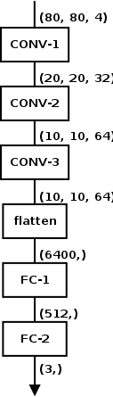

由于我们的输出是三个 Q 值，这是一个回归任务，我们可以通过最小化 *Q(s，a)* 的当前值与其计算值之间的误差平方差来优化它，该计算值是未来一步的奖励和贴现 Q 值*Q(s’，a’)*之和。迭代开始时，当前值是已知的，未来值是根据环境返回的回报计算的:

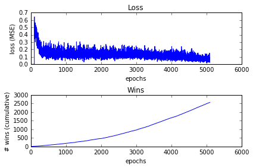

# 平衡勘探和开发

深度强化学习是在线学习的一个例子，其中穿插了训练和预测步骤。与通过对整个训练数据进行学习来生成最佳预测器的批量学习技术不同，通过在线学习训练的预测器随着对新数据的训练而不断改进。

因此，在训练的初始时期，深度 Q 网络给出随机预测，这可能导致较差的 Q 学习性能。为了缓解这一点，我们可以使用一个简单的探索方法，如&epsi;——贪婪。在&epsi;-贪婪探索的情况下，代理以概率*1-&ε选择网络建议的行动；*否则一个动作均匀地随机进行。这就是为什么这种策略被称为探索/开发。

随着历元数量的增加和 Q 函数的收敛，它开始返回更加一致的 Q 值。考虑到这一点，可以衰减&epsi;的值，因此当网络开始返回更一致的预测时，代理选择利用网络返回的值，而不是选择随机动作。在 DeepMind 的情况下，&epsi;的值随着时间从 *1* 减少到 *0.1* ，在我们的例子中，它从 *0.1* 减少到 *0.001* 。

因此，&epsi;-贪婪探索确保在开始时，系统用完全随机的移动来平衡从 Q-网络做出的不可靠的预测，以探索状态空间，然后随着 Q-网络做出的预测的改善，安定下来进行不太激进的探索(和更激进的利用)。


# 体验回放，或者说体验的价值

基于表示状态动作对的 Q 值的方程 *(s [t] ，a [t] )* ，根据当前奖励 *r [t]* 和下一时间步*的贴现最大 Q 值(s [t+1] ，a [t+1] )* ，我们的策略在逻辑上将是训练网络来预测最佳下一状态事实证明，这往往会使网络陷入局部最小值。这是因为连续的训练样本往往非常相似。

为了应对这种情况，在游戏过程中，我们将所有先前的移动 *(s，a，r，s’)*收集到一个大的固定大小的队列中，称为**重放内存**。重放记忆代表网络的体验。在训练网络时，我们从重播内存中生成随机批次，而不是最近的(批次)事务。由于批次由无序的随机经验元组 *(s，a，r，s’)*组成，网络训练得更好，避免陷入局部极小。

也可以从人类游戏中收集经验，而不是(或除此之外)从网络玩游戏期间的先前移动中收集经验。另一种方法是通过在开始时以*观察*模式运行网络一段时间来收集经验，这时它生成完全随机的动作(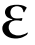 *= 1* )，并从游戏中提取奖励和下一个状态，并将它们收集到它的经验重放队列中。


# 示例-用于捕捉的 Keras 深度 Q 网络

我们游戏的目标是通过使用左右箭头键水平移动屏幕底部的球拍，抓住从屏幕顶部随机位置释放的球。如果球拍能接住球，玩家就赢了，如果球在球拍到达之前从屏幕上掉下来，玩家就输了。这个游戏的优点是非常容易理解和构建，并且是仿照埃德尔·桑塔纳在他的博客文章中描述的 catch 游戏(更多信息请参考: *Keras Plays Catch，一个单文件强化学习示例*，埃德尔·桑塔纳，2017 年。)关于深度强化学习。我们使用 py game([https://www.pygame.org/news](https://www.pygame.org/news))构建了最初的游戏，这是一个用于构建游戏的免费开源库。这个游戏允许玩家使用左右箭头键移动球拍。如果你想体验一下，这个游戏可以在本章的代码包中找到。

**Installing Pygame**:
Pygame runs on top of Python, and is available for Linux (various flavors), macOS, Windows, as well as some phone operating systems such as Android and Nokia. The full list of distributions can be found at: [http://www.pygame.org/download.shtml](http://www.pygame.org/download.shtml). Pre-built versions are available for 32-bit and 64-bit versions of Linux and Windows and 64-bit version of macOS. On these platforms, you can install Pygame with `pip install pygame` command.
If a pre-built version does not exist for your platform, you can also build it from source using instructions available at: [http://www.pygame.org/wiki/GettingStarted](http://www.pygame.org/wiki/GettingStarted).
Anaconda users can find pre-built Pygame versions on the conda-forge:
`conda install binstar`
`conda install anaconda-client`
`conda install -c https://conda.binstar.org/tlatorre pygame # Linux`
`conda install -c https://conda.binstar.org/quasiben pygame # Mac`

为了训练我们的神经网络，我们需要对原始游戏进行一些更改，以便网络可以代替人类玩家进行游戏。我们希望包装游戏，让网络通过 API 而不是键盘的左右箭头键与它通信。让我们看看这个包装游戏的代码。

像往常一样，我们从进口开始:

```py

from __future__ import division, print_function
import collections
import numpy as np
import pygame
import random
import os

```

我们定义了我们的阶级。我们的构造函数可以选择将游戏的包装版本设置为在*无头*模式下运行，也就是说，不需要显示 Pygame 屏幕。当你必须运行在云中的 GPU 机器上，并且只能访问基于文本的终端时，这是非常有用的。如果您在本地运行包装的游戏，并且可以访问图形终端，那么您可以将这一行注释掉。接下来我们调用`pygame.init()`方法来初始化所有 Pygame 组件。最后，我们设置了一些类级别的常量:

```py

class MyWrappedGame(object):

    def __init__(self):
        # run pygame in headless mode
        os.environ["SDL_VIDEODRIVER"] = "dummy"

        pygame.init()

        # set constants
        self.COLOR_WHITE = (255, 255, 255)
        self.COLOR_BLACK = (0, 0, 0)
        self.GAME_WIDTH = 400
        self.GAME_HEIGHT = 400
        self.BALL_WIDTH = 20
        self.BALL_HEIGHT = 20
        self.PADDLE_WIDTH = 50
        self.PADDLE_HEIGHT = 10
        self.GAME_FLOOR = 350
        self.GAME_CEILING = 10
        self.BALL_VELOCITY = 10
        self.PADDLE_VELOCITY = 20
        self.FONT_SIZE = 30
        self.MAX_TRIES_PER_GAME = 1
        self.CUSTOM_EVENT = pygame.USEREVENT + 1
        self.font = pygame.font.SysFont("Comic Sans MS", self.FONT_SIZE)

```

`reset()`方法定义了每场比赛开始时需要调用的操作，比如清空状态队列、将球和球拍设置到它们的起始位置、初始化比分等等:

```py

    def reset(self):
        self.frames = collections.deque(maxlen=4)
        self.game_over = False
        # initialize positions
        self.paddle_x = self.GAME_WIDTH // 2
        self.game_score = 0
        self.reward = 0
        self.ball_x = random.randint(0, self.GAME_WIDTH)
        self.ball_y = self.GAME_CEILING
        self.num_tries = 0

        # set up display, clock, etc
        self.screen = pygame.display.set_mode((self.GAME_WIDTH, self.GAME_HEIGHT))
        self.clock = pygame.time.Clock()

```

在原始游戏中，有一个 Pygame 事件队列，玩家在移动球拍时引发的左右箭头键事件以及 Pygame 组件引发的内部事件都被写入该队列。游戏代码的核心部分基本上是一个循环(称为**事件循环**，它读取事件队列并对其做出反应。

在包装版本中，我们将事件循环移到了调用方。`step()`方法描述了在循环中的一次循环中发生了什么。该方法采用一个整数`0`、`1`或`2`来表示一个动作(分别为向左移动、停留和向右移动)，然后设置变量来控制球和球拍在该时间步长的位置。`PADDLE_VELOCITY`变量代表一个*速度*，当发送向左移动和向右移动动作时，该速度会将桨向左或向右移动多个像素。如果球越过了挡板，它会检查是否有碰撞。如果有，桨*接住*球，玩家(神经网络)赢，否则玩家输。然后，该方法重新绘制屏幕，并将其附加到包含游戏屏幕最后四帧的固定长度`deque`上。最后，它返回状态(由最后四帧给出)、当前动作的奖励和一个告诉调用者游戏是否结束的标志:

```py

    def step(self, action):
        pygame.event.pump()

        if action == 0: # move paddle left
            self.paddle_x -= self.PADDLE_VELOCITY
            if self.paddle_x < 0:
                # bounce off the wall, go right
                self.paddle_x = self.PADDLE_VELOCITY
        elif action == 2: # move paddle right
            self.paddle_x += self.PADDLE_VELOCITY
            if self.paddle_x > self.GAME_WIDTH - self.PADDLE_WIDTH:
                # bounce off the wall, go left
                self.paddle_x = self.GAME_WIDTH - self.PADDLE_WIDTH - self.PADDLE_VELOCITY
        else: # don't move paddle
            pass

        self.screen.fill(self.COLOR_BLACK)
        score_text = self.font.render("Score: {:d}/{:d}, Ball: {:d}"
            .format(self.game_score, self.MAX_TRIES_PER_GAME,
                    self.num_tries), True, self.COLOR_WHITE)
        self.screen.blit(score_text, 
            ((self.GAME_WIDTH - score_text.get_width()) // 2,
            (self.GAME_FLOOR + self.FONT_SIZE // 2)))

        # update ball position
        self.ball_y += self.BALL_VELOCITY
        ball = pygame.draw.rect(self.screen, self.COLOR_WHITE,
            pygame.Rect(self.ball_x, self.ball_y, self.BALL_WIDTH, 
            self.BALL_HEIGHT))
        # update paddle position
        paddle = pygame.draw.rect(self.screen, self.COLOR_WHITE,
            pygame.Rect(self.paddle_x, self.GAME_FLOOR, 
                        self.PADDLE_WIDTH, self.PADDLE_HEIGHT))

        # check for collision and update reward
        self.reward = 0
        if self.ball_y >= self.GAME_FLOOR - self.BALL_WIDTH // 2:
            if ball.colliderect(paddle):
                self.reward = 1
            else:
                self.reward = -1

        self.game_score += self.reward
        self.ball_x = random.randint(0, self.GAME_WIDTH)
        self.ball_y = self.GAME_CEILING
        self.num_tries += 1

        pygame.display.flip()

        # save last 4 frames
        self.frames.append(pygame.surfarray.array2d(self.screen))

        if self.num_tries >= self.MAX_TRIES_PER_GAME:
            self.game_over = True

        self.clock.tick(30)
        return np.array(list(self.frames)), self.reward, self.game_over

```

我们将查看代码来训练我们的网络玩游戏。

像往常一样，首先我们导入我们需要的库和对象。除了来自 Keras 和 SciPy 的第三方组件，我们还导入了我们之前描述过的`wrapped_game`类:

```py

from __future__ import division, print_function
from keras.models import Sequential
from keras.layers.core import Activation, Dense, Flatten
from keras.layers.convolutional import Conv2D
from keras.optimizers import Adam
from scipy.misc import imresize
import collections
import numpy as np
import os

import wrapped_game

```

我们定义了两个便利函数。第一个将四个输入图像的集合转换成适合网络使用的形式。输入来自一组四个 800 x 800 的图像，因此输入的形状是 *(4，800，800)* 。然而，网络期望其输入为形状的四维张量*(批量大小，80，80，4)* 。在游戏的最开始，我们没有四帧，所以我们通过堆叠第一帧四次来伪造它。这个函数返回的输出张量的形状是 *(80，80，4)* 。

`get_next_batch()`函数从体验回放队列中采样`batch_size`个状态元组，从神经网络中获取奖励和预测的下一个状态。然后，它计算下一个时间步长的 Q 函数的值，并将其返回:

```py

def preprocess_images(images):
    if images.shape[0] < 4:
        # single image
        x_t = images[0]
        x_t = imresize(x_t, (80, 80))
        x_t = x_t.astype("float")
        x_t /= 255.0
        s_t = np.stack((x_t, x_t, x_t, x_t), axis=2)
    else:
        # 4 images
        xt_list = []
        for i in range(images.shape[0]):
            x_t = imresize(images[i], (80, 80))
            x_t = x_t.astype("float")
            x_t /= 255.0
            xt_list.append(x_t)
        s_t = np.stack((xt_list[0], xt_list[1], xt_list[2], xt_list[3]), 
                       axis=2)
    s_t = np.expand_dims(s_t, axis=0)
    return s_t

def get_next_batch(experience, model, num_actions, gamma, batch_size):
    batch_indices = np.random.randint(low=0, high=len(experience), 
        size=batch_size)
    batch = [experience[i] for i in batch_indices]
    X = np.zeros((batch_size, 80, 80, 4))
    Y = np.zeros((batch_size, num_actions))
    for i in range(len(batch)):
        s_t, a_t, r_t, s_tp1, game_over = batch[i]
        X[i] = s_t
        Y[i] = model.predict(s_t)[0]
        Q_sa = np.max(model.predict(s_tp1)[0])
        if game_over:
            Y[i, a_t] = r_t
        else:
            Y[i, a_t] = r_t + gamma * Q_sa
    return X, Y

```

我们定义我们的网络。这是为我们的游戏模拟 Q 函数的网络。我们的网络与 DeepMind 论文中提出的网络非常相似。唯一的区别是输入和输出的大小。我们的输入形状是 *(80，80，4)* ，而他们的是 *(84，84，4)* ，我们的输出是 *(3)* ，对应于需要计算 Q 函数值的三个动作，而他们的是 *(18)* ，对应于 Atari 可能的动作。

有三个卷积层和两个全连接(密集)层。除了最后一层，所有层都有 ReLU 激活单元。由于我们预测的是 Q 函数的值，因此它是一个回归网络，最后一层没有激活单元:

```py

# build the model
model = Sequential()
model.add(Conv2D(32, kernel_size=8, strides=4, 
                 kernel_initializer="normal", 
                 padding="same",
                 input_shape=(80, 80, 4)))
model.add(Activation("relu"))
model.add(Conv2D(64, kernel_size=4, strides=2, 
                 kernel_initializer="normal", 
                 padding="same"))
model.add(Activation("relu"))
model.add(Conv2D(64, kernel_size=3, strides=1,
                 kernel_initializer="normal",
                 padding="same"))
model.add(Activation("relu"))
model.add(Flatten())
model.add(Dense(512, kernel_initializer="normal"))
model.add(Activation("relu"))
model.add(Dense(3, kernel_initializer="normal"))

```

正如我们之前所描述的，我们的损失函数是 *Q(s，a)* 的当前值和它的计算值之间的平方差，该计算值是奖励和贴现的 Q 值*Q(s’，a’)*的和，这是未来一步的情况，因此均方误差(MSE)损失函数工作得非常好。对于优化器，我们选择 Adam，这是一个很好的通用优化器，以较低的学习率进行实例化:

```py

model.compile(optimizer=Adam(lr=1e-6), loss="mse")

```

我们为我们的训练定义了一些常数。`NUM_ACTIONS`常量定义了网络可以发送给游戏的输出动作数量。在我们的例子中，这些动作是`0`、`1`和`2`，分别对应于向左移动、停留和向右移动。`GAMMA`值是未来奖励的贴现因子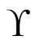。`INITIAL_EPSILON`和`FINAL_EPSILON`是指贪婪探索中参数的起始值和结束值。`MEMORY_SIZE`是体验回放队列的大小。`NUM_EPOCHS_OBSERVE`指的是网络被允许通过向游戏发送完全随机的动作并看到奖励来探索游戏的次数。`NUM_EPOCHS_TRAIN`变量是指网络将经历在线训练的次数。每个纪元对应于一个游戏或一集。一轮训练中的游戏总数是`NUM_EPOCHS_OBSERVE`和`NUM_EPOCHS_TRAIN`值的总和。`BATCH_SIZE`是我们将用于培训的小批量的大小:

```py

# initialize parameters
DATA_DIR = "../data"
NUM_ACTIONS = 3 # number of valid actions (left, stay, right)
GAMMA = 0.99 # decay rate of past observations
INITIAL_EPSILON = 0.1 # starting value of epsilon
FINAL_EPSILON = 0.0001 # final value of epsilon
MEMORY_SIZE = 50000 # number of previous transitions to remember
NUM_EPOCHS_OBSERVE = 100
NUM_EPOCHS_TRAIN = 2000

BATCH_SIZE = 32
NUM_EPOCHS = NUM_EPOCHS_OBSERVE + NUM_EPOCHS_TRAIN

```

我们实例化游戏和体验重放队列。我们还打开一个日志文件并初始化一些变量，为训练做准备:

```py

game = wrapped_game.MyWrappedGame()
experience = collections.deque(maxlen=MEMORY_SIZE)

fout = open(os.path.join(DATA_DIR, "rl-network-results.tsv"), "wb")
num_games, num_wins = 0, 0
epsilon = INITIAL_EPSILON

```

接下来，我们设置控制训练次数的循环。如前所述，每个时期对应一个游戏，因此我们在此时重置游戏状态。一场比赛相当于一个球从天花板上掉下来，或者被球拍接住，或者没接住。损失是游戏的预测 Q 值和实际 Q 值之差的平方。

我们通过向游戏发送一个虚拟动作(在我们的例子中，是一个 *stay* )来开始游戏，并获取游戏的初始状态元组:

```py

for e in range(NUM_EPOCHS):
    game.reset() 
    loss = 0.0

    # get first state
    a_0 = 1 # (0 = left, 1 = stay, 2 = right)
    x_t, r_0, game_over = game.step(a_0) 
    s_t = preprocess_images(x_t)

```

下一个区块是游戏的主循环。这是我们移到调用代码的原始游戏中的事件循环。我们保存当前状态，因为我们将需要它用于我们的体验重放队列，然后决定发送什么动作信号来包装游戏。如果我们处于观察模式，我们将只生成一个与我们的一个动作相对应的随机数，否则我们将使用-贪婪探索来选择一个随机动作，或者使用我们的神经网络(我们也在训练它)来预测我们应该发送的动作:

```py

    while not game_over:
        s_tm1 = s_t

        # next action
        if e <= NUM_EPOCHS_OBSERVE:
            a_t = np.random.randint(low=0, high=NUM_ACTIONS, size=1)[0]
        else:
            if np.random.rand() <= epsilon:
                a_t = np.random.randint(low=0, high=NUM_ACTIONS, size=1)[0]
            else:
                q = model.predict(s_t)[0]
                a_t = np.argmax(q)

```

一旦我们知道了我们的动作，我们就通过调用`game.step()`将它发送到游戏，它返回新的状态、奖励和一个指示游戏结束的布尔标志。如果奖励是正的(表示球被接住了)，我们增加获胜次数，并将这个*(状态、动作、奖励、新状态、游戏结束)*元组存储在我们的体验重放队列中:

```py

        # apply action, get reward
        x_t, r_t, game_over = game.step(a_t)
        s_t = preprocess_images(x_t)
        # if reward, increment num_wins
        if r_t == 1:
            num_wins += 1
        # store experience
        experience.append((s_tm1, a_t, r_t, s_t, game_over))

```

然后，我们从我们的经验重放队列中随机抽取一个小批量，并训练我们的网络。对于每一次训练，我们都会计算损失。每个时段中所有训练的损失总和是整个时段的损失:

```py

        if e > NUM_EPOCHS_OBSERVE:
            # finished observing, now start training
            # get next batch
            X, Y = get_next_batch(experience, model, NUM_ACTIONS, GAMMA, BATCH_SIZE)
            loss += model.train_on_batch(X, Y)

```

当网络相对未经训练时，它的预测不是很好，因此更多地探索状态空间以减少陷入局部极小值的机会是有意义的。然而，随着网络变得越来越训练有素，我们逐渐减少的值，因此模型可以预测网络发送给游戏的越来越多的动作:

```py

    # reduce epsilon gradually
    if epsilon > FINAL_EPSILON:
        epsilon -= (INITIAL_EPSILON - FINAL_EPSILON) / NUM_EPOCHS

```

我们在控制台上写下每个时期的日志，并写入日志文件供以后分析。在 100 个时期的训练之后，我们保存模型的当前状态，以便我们可以在出于任何原因决定停止训练的情况下恢复。我们还保存我们的最终模型，以便我们可以使用它来玩我们的游戏:

```py

    print("Epoch {:04d}/{:d} | Loss {:.5f} | Win Count {:d}"
        .format(e + 1, NUM_EPOCHS, loss, num_wins))
    fout.write("{:04d}t{:.5f}t{:d}n".format(e + 1, loss, num_wins))

    if e % 100 == 0:
        model.save(os.path.join(DATA_DIR, "rl-network.h5"), overwrite=True)

fout.close()
model.save(os.path.join(DATA_DIR, "rl-network.h5"), overwrite=True)

```

我们通过让它观察 100 场比赛，然后分别玩 1，000，2，000 和 5，000 场比赛来训练游戏。接下来显示了运行 5000 次游戏的日志文件的最后几行。如您所见，在培训接近尾声时，网络在玩游戏方面变得相当熟练:

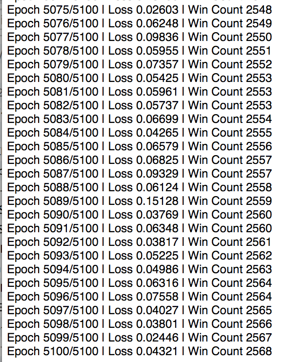

如下图所示，epoch 上的输赢计数图也讲述了类似的故事。虽然看起来随着更多的训练，这种损失可能会进一步收敛，但在 *5000* 个训练周期中，它已经从 *0.6* 下降到大约 *0.1* 。类似地，获胜次数的曲线向上弯曲，表明网络随着时期数的增加而学习得更快:


最后，我们通过让它玩固定次数的游戏(在我们的例子中是 100 次)并观察它能赢多少来评估我们训练的模型的技能。下面是实现这一点的代码。如前所述，我们从进口开始:

```py

from __future__ import division, print_function
from keras.models import load_model
from keras.optimizers import Adam
from scipy.misc import imresize
import numpy as np
import os
import wrapped_game

```

我们加载我们在训练结束时保存的模型并编译它。我们还实例化了我们的`wrapped_game`:

```py

DATA_DIR = "../data"
model = load_model(os.path.join(DATA_DIR, "rl-network.h5"))
model.compile(optimizer=Adam(lr=1e-6), loss="mse")

game = wrapped_game.MyWrappedGame()

```

然后我们循环 100 多个游戏。我们通过调用每个游戏的`reset()`方法来实例化它，并启动它。然后，对于每个游戏，直到它结束，我们调用模型来预测具有最佳 Q 函数的动作。我们报告它赢了多少场比赛的累计总数。

我们对每个模型都进行了测试。第一个训练了 1000 场的赢了 100 场的 42 场，训练了 2000 场的赢了 100 场的 74 场，训练了 5000 场的赢了 100 场的 87 场。这清楚地表明，网络正在随着培训而改进:

```py

num_games, num_wins = 0, 0
for e in range(100):
    game.reset()

    # get first state
    a_0 = 1 # (0 = left, 1 = stay, 2 = right)
    x_t, r_0, game_over = game.step(a_0) 
    s_t = preprocess_images(x_t)

    while not game_over:
        s_tm1 = s_t
        # next action
        q = model.predict(s_t)[0]
        a_t = np.argmax(q)
        # apply action, get reward
        x_t, r_t, game_over = game.step(a_t)
        s_t = preprocess_images(x_t)
        # if reward, increment num_wins
        if r_t == 1:
            num_wins += 1

    num_games += 1
    print("Game: {:03d}, Wins: {:03d}".format(num_games, num_wins), end="r")
print("")

```

如果您运行评估代码，并注释掉在 headless 模式下运行它的调用，您可以观看网络玩游戏，观看起来相当令人惊奇。鉴于 Q 值预测开始时是随机值，并且主要是稀疏奖励机制在训练期间为网络提供指导，网络学习如此有效地玩游戏几乎是不合理的。但是与深度学习的其他领域一样，网络事实上确实学得很好。

前面给出的例子相当简单，但它说明了深度强化学习模型的工作过程，并有望帮助创建一个心智模型，使用它您可以处理更复杂的实现。你可能会觉得有趣的一个实现是 Ben Lau 对 FlappyBird 的实现(更多信息请参考:*使用 Keras 和 Deep Q-Network 玩 FlappyBird* ，作者 Ben Lau，2016。和 GitHub 页面:【https://github.com/yanpanlau/Keras-FlappyBird】T2 使用 Keras。Keras-RL 项目(【https://github.com/matthiasplappert/keras-rl】)是一个深度强化学习的 Keras 库，也有一些非常好的例子。

自 DeepMind 最初提出建议以来，已经有其他改进建议，如双 Q 学习(更多信息请参考:H. Van Hasselt，A. Guez 和 D. Silver，AAAI 的*双 Q 学习深度强化学习*)。2016)、优先化的经验重放(更多信息参考:*优先化的经验重放*，T. Schaul，arXiv:1511.05952，2015)，以及决斗网络架构(更多信息参考:*用于深度强化学习的决斗网络架构*，Z. Wang，arXiv:1511.06581，2015)。双 Q 学习使用两个网络-主网络选择动作，目标网络选择动作的目标 Q 值。这减少了单个网络对 Q 值的可能高估，并允许网络更快更好地训练。优先化的经验重放增加了对具有较高预期学习进度的经验元组进行采样的概率。决斗网络架构将 Q 函数分解为状态和动作组件，并分别将它们组合在一起。

本节讨论的所有代码，包括人类玩家可以玩的基本游戏，都可以在本章附带的代码包中找到。


# 前方的路

2016 年 1 月，DeepMind 宣布发布 AlphaGo(欲了解更多信息，请参考:*利用深度神经网络和树搜索掌握围棋游戏*，作者 D. Silver，Nature 529.7587，2016 年第 484-489 页)，这是一种用来玩围棋的神经网络。围棋被认为是人工智能非常具有挑战性的游戏，主要是因为在游戏中的任何一点，平均有大约*10^(170)种可能的走法(更多信息请参考:[http://ai-depot.com/LogicGames/Go-Complexity.html](http://ai-depot.com/LogicGames/Go-Complexity.html))(相比之下，国际象棋大约有 *10 ^(50)* )。因此，使用蛮力方法确定最佳移动在计算上是不可行的。在本文发表时，AlphaGo 已经在与现任欧洲围棋冠军范辉的 5 场比赛中以 5 比 0 获胜。这是计算机程序第一次在围棋上击败人类棋手。随后，2016 年 3 月，AlphaGo 以 4-1 战胜世界第二职业围棋选手李·塞多尔(Lee Sedol)。*

AlphaGo 中有几个值得注意的新想法。首先，它使用人类专家游戏的监督学习和强化学习的组合进行训练，通过让 AlphaGo 的一个副本与另一个副本进行比赛。在前面的章节中，你已经看到了这两个概念的应用。

其次，AlphaGo 由一个价值网络和一个策略网络组成。在每一步棋中，AlphaGo 都使用蒙特卡罗模拟(Monte Carlo simulation)，这是一种用于预测在随机变量存在的情况下未来不同结果的概率的过程，以想象从当前位置开始的许多备选游戏。价值网络用于减少树搜索的深度，以估计赢/输的概率，而不必一直计算到游戏结束，有点像关于这步棋有多好的直觉。策略网络用于通过将搜索导向承诺最大即时回报(或 Q 值)的行动来减少搜索的广度。更详细的描述可以参考博文: *AlphaGo:用机器学习掌握围棋的古老游戏*，谷歌研究博客，2016。

虽然 AlphaGo 是对原始 DeepMind 网络的一个重大改进，但它仍然在玩一个所有玩家都可以看到所有游戏片段的游戏，也就是说，它们仍然是完美信息的游戏。2017 年 1 月，卡内基梅隆大学的研究人员公布了 Libratus(更多信息请参考: *AI 挑战顶级扑克玩家*，作者 T. Revel，New Scientist 223.3109，2017 年第 8 页)，这是一个玩扑克的 AI。与此同时，另一个由来自阿尔伯塔大学、布拉格查理大学和捷克技术大学(也来自布拉格)的研究人员组成的小组提出了 DeepStack 架构(有关更多信息，请参考: *DeepStack:无限扑克中的专家级人工智能*，作者 M. Moravaa k，arXiv:1701.01724，2017)。扑克是一种不完全信息的游戏，因为玩家看不到对手的牌。所以，除了学习如何玩游戏，玩扑克的人工智能还需要对对手的游戏发展一种直觉。

Libratus 没有使用内置的直觉策略，而是使用一种算法来计算这种策略，试图实现风险和回报之间的平衡，也称为纳什均衡。从 2017 年 1 月 11 日到 2017 年 1 月 31 日，Libratus 与四位顶级人类扑克玩家进行了对决(更多信息请参考:*加大赌注:顶级扑克职业选手对阵人工智能*，卡内基梅隆大学，2017 年 1 月)，并彻底击败了他们。

DeepStack 的直觉是使用强化学习来训练的，使用从随机扑克情况中生成的例子。它与来自 17 个国家的 33 名职业扑克玩家进行了比赛，其获胜评级使其比优秀玩家评级高出*个数量级*(更多信息请参考:*深度学习预测人类行为的神秘直觉*，C. E. Perez，Medium corporation，Intuition Machine，2017 年 2 月 13 日)。

如你所见，这的确是非常激动人心的时刻。始于能够玩街机游戏的深度学习网络的进步导致了能够有效地读取你的思想，或者至少预测(有时是非理性的)人类行为并在虚张声势的游戏中获胜的网络。深度学习的可能性似乎是无限的。


# 摘要

在这一章中，我们学习了强化学习背后的概念，以及如何使用它来建立深度学习网络，这些网络通过奖励反馈来学习如何玩街机游戏。从那里，我们继续简要讨论了这一领域的进展，例如网络已经被教会在超人的水平上玩更难的游戏，如围棋和扑克。虽然玩游戏可能看起来像是一个无聊的应用，但这些想法是迈向通用人工智能的第一步，在通用人工智能中，网络从经验而不是大量训练数据中学习。