# 十一、强化学习

本章介绍了**强化学习**(**RL**)——探索最少但最有前途的学习范式。强化学习与我们在前面章节中讨论的监督和非监督学习模型有很大的不同。从一个干净的石板开始(即，没有先验信息)，RL 代理可以经历多个阶段的试验和错误，并学习实现一个目标，同时唯一的输入是来自环境的反馈。OpenAI 在 RL 上的研究似乎表明，持续的竞争可能是智力进化的一个原因。许多深度学习从业者认为，RL 将在大 AI 梦想中扮演重要角色:**人工通用智能** ( **AGI** )。本章将深入研究不同的 RL 算法。将涵盖以下主题:

*   什么是 RL 及其行话
*   了解如何使用 OpenAI Gym 界面
*   RL 的应用
*   深度 Q-网络
*   政策梯度

本章的所有代码文件都可以在 https://packt.link/dltfchp11 找到。

# RL 简介

婴儿学走路、鸟儿学飞翔、RL 特工学玩雅达利游戏有什么共同点？好吧，这三个都包括:

*   **试错**:孩子(或小鸟)尝试了各种方法，失败了很多次，在某些方面成功了，才真正能走(或飞)。RL 代理在变得可靠成功之前玩了许多游戏，赢了一些，输了许多。
*   **目标**:孩子有目标行走，小鸟飞翔，RL 代理赢得游戏。
*   **与环境的互动**:他们唯一的反馈来自他们的环境。

因此，首先出现的问题是什么是 RL，它与监督和非监督学习有什么不同？任何拥有宠物的人都知道，训练宠物的最佳策略是奖励它的良好行为，惩罚它的不良行为。RL 也称为**跟随评论家**学习，是一种学习范式，其中代理以同样的方式学习。这里的代理对应的是我们的网络(程序)；它可以执行一组**动作** ( **a** )，从而带来环境的**状态** ( **s** )的变化，反过来，代理人从环境中获得奖励或惩罚。

例如，考虑训练狗去捡球的情况:在这里，狗是我们的代理人，狗做出的随意肌肉运动是动作，地面(以及人和球)是环境；狗认为我们对它行为的反应是给它一点奖励。RL 可以被定义为在一些理想化的条件下，从与环境的交互中进行目标导向的学习和决策的计算方法。代理可以感知环境的状态，并且代理可以对环境执行特定的明确定义的动作。这导致了两件事:第一，环境状态的改变，第二，奖励产生了(在理想条件下)。这个循环继续下去，理论上代理人学会了如何随着时间的推移更频繁地产生奖励:

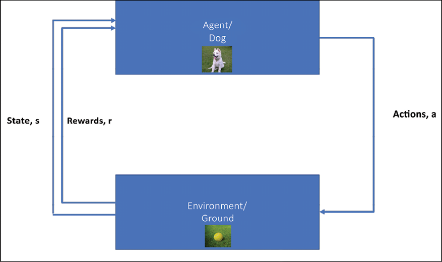

图 11.1:强化学习:主体和环境之间的相互作用

与监督式学习不同，代理人不会看到任何训练示例；它不知道正确的动作是什么。

与无监督学习不同，代理的目标不是在输入中找到一些固有的结构(学习可能会找到一些结构，但这不是目标)；相反，它的唯一目标是最大化回报(从长远来看)和减少惩罚。

## RL 行话

在学习各种 RL 算法之前，我们有必要了解一些重要术语。我们将借助两个例子来说明这些术语，第一个是迷宫中的机器人，第二个是控制自动驾驶汽车 ( **SDC** )车轮的智能体。两个 RL 代理如下所示:

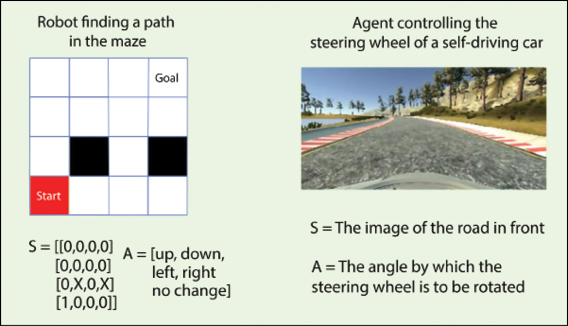

图 11.2:机器人试图在迷宫中寻找路径的状态(LHS)。代理试图控制自动驾驶汽车(RHS)方向盘的状态

*图 11.2* 显示了我们将要考虑的两个例子。让我们从术语开始:

*   **状态**， *S* :状态是一组的记号(或表示)，可以定义环境可能处于的所有状态。它可以是连续的，也可以是离散的。在机器人通过迷宫寻找路径的情况下，状态可以用一个 4×4 的矩阵来表示，其中的元素表示该块是空的、被占用的还是被阻塞的。值为 1 的区块表示被机器人占据，0 表示为空， *X* 表示该区块不可通行。这个数组中的每个元素 *S* 都可以有这三个离散值中的一个，所以状态本质上是离散的。接下来，考虑控制自动驾驶汽车方向盘的代理。代理将前视图像作为输入。图像包含连续值的像素，因此这里的状态是连续的。
*   **动作**、 *A(S)* :动作是代理在特定状态下可以做的所有可能事情的集合。一组可能的动作 *A* 取决于当前状态 *S* 。动作可能会也可能不会导致状态的改变。像状态一样，它们可以是离散的，也可以是连续的。在迷宫中寻找路径的机器人可以执行五个离散动作[ **向上**、**向下**、**向左**、**向右**、**不变**。另一方面，SDC 代理可以在连续的角度范围内转动方向盘。
*   **奖励** *R(S，A，S’)*:奖励是一个由环境基于代理的动作返回的标量值。这里 *S* 是当前状态，*S’*是采取动作 *A* 后的环境状态。是由目标决定的；如果行动使其接近目标，代理人将获得较高的奖励，否则将获得较低的(甚至是负的)奖励。我们如何定义奖励完全取决于我们自己——在迷宫的情况下，我们可以将奖励定义为代理当前位置和目标之间的欧几里得距离。SDC 代理奖励可以是汽车在路上(正奖励)或不在路上(负奖励)。
*   **策略** 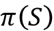:策略定义了每个状态和在该状态下要采取的动作之间的映射。策略可以是*确定性的*，也就是说，对于每个状态，都有一个定义明确的策略。在迷宫机器人的情况下，策略可以是如果顶部的块是空的，则向上移动。策略也可以是随机的，也就是说，根据某种概率采取行动。它可以被实现为简单的查找表，或者它可以是依赖于当前状态的函数。策略是 RL 代理的核心。在本章中，我们将学习帮助代理学习策略的不同算法。
*   **Return** *G* [t] :这是从当前时间开始的所有未来奖励的折扣总和，数学定义为:

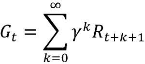

*   这里 *R* [t] 是时间 *t* 的奖励，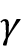是贴现因子；它的值介于 0 和 1 之间。贴现因子决定了未来奖励在决定保单时的重要性。如果接近于零，代理人会重视眼前的回报。然而，高折扣系数意味着代理商对未来的展望很远。它可能会为了未来的高额回报而放弃眼前的回报，就像在象棋比赛中，你可能会牺牲一个棋子来将死对手。
*   **价值函数** *V(S)* :这定义了一个国家长期的“善”。它可以被认为是从状态 *S* 开始，代理可以期望随着时间积累的总奖励量。你可以把它看作是长期的好处，而不是眼前的短暂的好处。你认为眼前回报最大化和价值函数最大化哪个更重要？你可能猜对了:就像在国际象棋中，我们有时会失去一个棋子，以在几步之后赢得比赛，因此代理应该尝试最大化价值函数。
*   通常，该值被定义为**状态值函数** 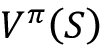或**动作值函数** 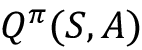，其中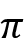是遵循的策略。状态-值函数是在遵循策略之后从状态 *S* 的期望回报:

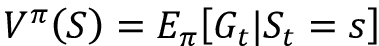

*   这里 *E* 是期望， *S* [t] *=s* 是时间 *t* 时的状态。动作值函数是从状态 *S* 开始，采取动作 *A=a* 并遵循策略的期望回报:

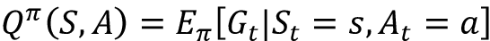

*   **环境模型**:这是一个可选元素。它模仿环境的行为，它包含了环境的物理学；换句话说，它表明环境将如何表现。环境的模型由到下一个状态的转移概率来定义。这是一个可选组件；我们还可以进行**无模型**强化学习，其中不需要转移概率来定义 RL 过程。

在 RL 中，我们假设环境的状态遵循**马尔可夫性质**，即每个状态都单独依赖于前面的状态、从动作空间采取的动作以及相应的回报。

也就是说，如果 *S* ^t ^(+1) 是时间 *t+1* 的环境状态，那么它就是时间 *t* 时*S*t 状态的函数，*A*t 是时间 *t* 时采取的动作，*R*t^(t^(如果*P(S*^t^(+1)|*S*^t*)*是转移概率，数学上的马尔可夫性质可以写成:))

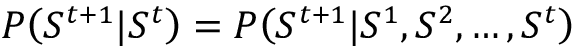

由此，RL 可以被假设为一个**马尔可夫决策过程** ( **MDP** )。

## 深度强化学习算法

**深度强化学习** ( **DRL** )的基本思想是，我们可以使用深度神经网络来逼近策略函数或价值函数。在这一章中，我们将学习一些流行的 DRL 算法。根据它们的近似程度，这些算法可以分为两类:

*   **基于值的方法**:在这些方法中，算法采取最大化值函数的行动。这里的代理学习预测一个给定的状态或行为会有多好。基于价值的方法的一个例子是深度 Q 网络。例如，考虑我们在迷宫中的机器人:假设每个状态的值是从那个盒子到目标所需的步数的负数，那么，在每个时间步，代理将选择使其达到具有最佳值的状态的动作，如下图所示。因此，从值 **-6** 开始，移动到 **-5** 、 **-4** 、 **-3** 、 **-2** 、 **-1** ，最终到达值为 **0** 的目标:

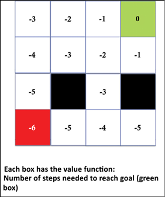

图 11.3:迷宫寻找机器人的演示值函数值

*   **基于策略的方法**:在这些方法中，算法预测最优策略(最大化预期回报的策略)，而不维护价值函数估计。目的是找到最优政策，而不是最优行动。基于策略的方法的一个例子是策略梯度。这里，我们近似策略函数，它允许我们将每个状态映射到最佳的对应动作。基于策略的方法优于基于值的方法的一个优点是，我们甚至可以将它们用于连续的动作空间。

除了近似策略或值的算法之外，我们还需要回答几个问题来使强化学习起作用。

### 代理人如何选择其行动，尤其是在未经训练的情况下？

当代理开始学习时，它不知道确定一个动作的最佳方式是什么，或者哪个动作将提供最佳的 T2 值。那么我们该如何着手呢？我们从大自然的书里取了一片叶子。像蜜蜂和蚂蚁一样，智能体在探索新行为和利用已有行为之间取得平衡。最初，当代理启动时，它不知道可能的动作中哪一个更好，所以它随机选择，但是随着它学习，它开始利用学习到的策略。这就是所谓的**勘探与开发**【2】权衡。通过探索，代理收集更多信息，然后利用收集的信息做出最佳决策。

### 代理商如何在勘探和开发之间保持平衡？

有各种各样的策略；最常用的政策之一是贪婪的 T2 政策。在这里，代理不断地探索，根据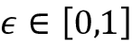的值，在每一步代理以概率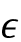选择一个随机动作，并以概率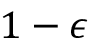选择一个使价值函数最大化的动作。正常情况下，的值是渐近递减的。在 Python 中,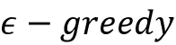策略可以实现为:

```py
 if np.random.rand() <= epsilon:

        a = random.randrange(action_size)

  else:

        a = np.argmax(model.predict(s)) 
```

其中`model`是近似价值/策略函数的深度神经网络，`a`是从大小为`action_size`的动作空间中选择的动作，`s`是状态。执行探索的另一种方式是使用噪声；研究人员已经成功地对高斯噪声和奥恩斯坦-乌伦贝克噪声进行了实验。

### 如何处理高度相关的输入状态空间

我们的 RL 模型的输入是环境的当前状态。每个行动都会导致环境的一些变化；然而，两个连续状态之间的相关性非常高。现在，如果我们让我们的网络基于顺序状态进行学习，连续输入之间的高度相关性会导致所谓的**灾难性遗忘**。为了减轻灾难性遗忘的影响，2018 年，大卫·伊泽尔和阿肯塞尔·科斯贡提出了**经验重演**方法。

最简单地说，学习算法首先将 MDP 元组(状态、动作、奖励和下一状态*、T2【S，A，R，S’>*)存储在缓冲器/存储器中。一旦建立了大量的内存，就随机选择一批来训练代理。随着新的添加和旧的删除，存储器被不断刷新。体验回放的使用提供了三个好处:

*   首先，它允许在许多权重更新中潜在地使用相同的体验，从而提高数据效率。
*   第二，经验批次的随机选择消除了呈现给网络用于训练的连续状态之间的相关性。
*   第三，它阻止了任何可能出现的、导致网络陷入局部极小值或发散的不必要的反馈循环。

经验重放的一个修改版本是**优先经验重放**(根据的**)。由 Tom Schaul 等人[4]在 2015 年提出，它源于这样一个想法，即并非所有的经历(或者，你可以说，尝试)都同等重要。一些尝试是比其他尝试更好的教训。因此，在选择培训时，为更多的教育经历分配更高的优先级将比随机选择经历更有效。在 Schaul 的论文中，建议应该优先考虑预测和目标之间差异较大的经验，因为代理人可以在这些情况下学到很多东西。**

### 如何处理移动目标的问题

与监督学习不同，目标是 RL 中先前未知的。随着目标的移动，代理人试图最大化期望收益，但是最大值随着代理人的学习而不断变化。本质上，这就像试图抓住一只蝴蝶，但每次你接近它，它都会移动到一个新的位置。有一个移动目标的主要原因是相同的网络被用来估计行动和目标值，这可能导致学习中的振荡。

DeepMind 团队在 2015 年发表在《自然》杂志上的题为*通过深度强化学习进行人类水平的控制*的论文中提出了一个解决方案。解决方案是，现在代理人有了短期固定目标，而不是移动目标。代理现在维护两个网络，这两个网络在架构上完全相同，一个称为本地网络，用于在每个步骤估计当前动作，另一个是目标网络，用于获得目标值。然而，两个网络都有自己的一套权重。在每个时间步长，局部网络学习方向，使得其估计值和目标值彼此接近。在一些时间步骤之后，目标网络权重被更新。更新可以是**硬更新**，其中本地网络的权重在 *N* 时间步之后被完全复制到目标网络，或者它可以是软更新，其中目标网络缓慢地(以因子τ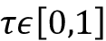将其权重移向本地网络。

## 近年来加固成功

在过去的几年里，DRL 已经被成功地用于各种任务，尤其是在游戏和机器人方面。在学习 RL 算法之前，让我们先了解一些 RL 的成功案例:

*   **AlphaGo Zero** :由谷歌 DeepMind 团队开发的 AlphaGo Zero paper *在没有任何人类知识的情况下掌握围棋游戏*从绝对空白的石板(**白板**)开始。AlphaGo Zero 使用一个神经网络来近似移动概率和值。
*   该神经网络将原板表示作为输入。它使用由神经网络引导的蒙特卡罗树搜索来选择移动。强化学习算法在训练循环中加入了前瞻搜索。它使用 40 个块的残余 CNN 训练了 40 天，在训练过程中，它玩了大约 2900 万场游戏(这是一个很大的数字！).神经网络在 Google Cloud 上使用 TensorFlow 进行了优化，有 64 个 GPU 工作器和 19 个 CPU 参数服务器。你可以在这里查阅论文:[https://www.nature.com/articles/nature24270](https://www.nature.com/articles/nature24270)。
*   **AI 控制的滑翔机**:微软开发了一个控制器系统，可以运行在许多不同的自动驾驶硬件平台上，比如 Pixhawk 和 Raspberry Pi 3。它可以在不使用发动机的情况下，通过自动寻找和捕捉自然产生的热气流来保持滑翔机在空中飞行。控制器通过检测和使用这些热量来帮助滑翔机自行运行，而无需马达或人的帮助。他们将其实现为部分可观察的马尔可夫决策过程。他们采用贝叶斯强化学习，并使用蒙特卡罗树搜索来搜索最佳行动。他们将整个系统划分为级别规划器——一个高级规划器根据经验做出决定，另一个低级规划器使用贝叶斯强化学习来实时检测和锁定热量。在微软新闻可以看到滑翔机在行动:[https://News . Microsoft . com/features/science-mimics-nature-Microsoft-researchers-test-ai-controlled-sowing-machine/](https://news.microsoft.com/features/science-mimics-nature-microsoft-researchers-test-ai-controlled-soaring-machine/)。
*   **运动行为**:在论文《丰富环境中运动行为的出现*(【https://arxiv.org/pdf/1707.02286.pdf】)中，DeepMind 的研究人员为智能体提供了丰富多样的环境。这些环境提出了一系列不同难度的挑战。代理在增加订单时遇到困难；这导致代理学习复杂的运动技能，而不执行任何奖励工程(即设计特殊的奖励函数)。*
**   **使用强化学习的数据中心冷却**:数据中心是当前数字/互联网革命的主力。凭借其大型服务器和网络设备，他们可以通过互联网方便地进行数据存储、数据传输和信息处理。数据中心约占全球总能耗的 1.5%，如果不采取措施，能耗只会增加。DeepMind 在 2016 年与谷歌研究一起，采用了强化学习模型，将其数据中心的能耗降低了 40%。使用从数据中心内的传感器收集的历史数据，他们训练了一个深度神经网络来预测未来的能源效率并提出最佳行动。您可以在论文*数据中心冷却使用模型预测控制*([https://proceedings . neur IPS . cc/paper/2018/file/059 fdcd 96 baeb 75112 f 09 fa 1 DC c740 cc-paper . pdf](https://proceedings.neurips.cc/paper/2018/file/059fdcd96baeb75112f09fa1dcc740cc-Paper.pdf))中阅读模型和方法的详细信息。*   **控制核聚变等离子体**:RL 最近(2022)一个有趣的应用是在强化学习的帮助下控制核聚变等离子体。研究结果发表在《自然》杂志的一篇论文上:*通过强化学习对托卡马克等离子体进行磁控制*。*

 *看到 DRL 智能体在没有任何隐性知识的情况下，如何在许多专门的任务中学会执行甚至击败人类，真是令人惊讶。在接下来的部分，我们将探索这些神话般的 DRL 算法，并看到它们在几千个纪元内以近乎人类的效率玩游戏。

# 强化学习的仿真环境

如前所述，**试错**是任何 RL 算法的重要组成部分。因此，首先在模拟环境中训练我们的 RL 代理是有意义的。

如今，有大量平台可用于创建环境。一些受欢迎的是:

*   **OpenAI Gym** :这里包含了一系列的环境，我们可以用来训练我们的 RL 代理。在这一章中，我们将使用 OpenAI Gym 界面。
*   **Unity ML-Agents SDK** :它允许开发人员将使用 Unity 编辑器创建的游戏和模拟转换到可以通过简单易用的 Python API 使用 DRL、进化策略或其他机器学习方法训练智能代理的环境中。它与 TensorFlow 一起工作，并提供能力来训练 2D/3D 和 VR/AR 游戏的智能代理。你可以在这里了解更多:【https://github.com/Unity-Technologies/ml-agents】T4。
*   **Gazebo** :在 Gazebo 中，我们可以用基于物理的模拟来构建三维世界。`gym-gazebo`工具包使用沿线的露台，配备**机器人操作系统** ( **ROS** )和 OpenAI 健身房接口，可用于训练 RL 特工。要了解更多这方面的信息，你可以参考白皮书:[https://arxiv.org/abs/1608.05742](https://arxiv.org/abs/1608.05742)。
*   **Blender 学习环境**:这是 Blender 游戏引擎的 Python 接口，也可以和 OpenAI Gym 配合使用。它的基础是 Blender:一个集成了游戏引擎的免费 3D 建模软件。这为创作游戏提供了一套简单易用、功能强大的工具。它提供了 Blender 游戏引擎的接口，游戏本身是在 Blender 中设计的。然后，我们可以创建一个定制的虚拟环境，在特定问题上训练一个 RL 代理([https://github.com/LouisFoucard/gym-blender](https://github.com/LouisFoucard/gym-blender))。
*   马尔默:由微软团队建造，马尔默是在《我的世界》基础上建立的人工智能实验和研究平台。它为创建任务和使命提供了一个简单的 API。你可以在这里了解更多马尔默项目:[https://www . Microsoft . com/en-us/research/Project/Project-Malmo/](https://www.microsoft.com/en-us/research/project/project-malmo/)。

# 开放式健身房介绍

我们将使用 OpenAI 健身房为我们的经纪人提供一个环境。OpenAI Gym 是一个开发和比较 RL 算法的开源工具包。它包含各种模拟环境，可用于训练代理和开发新的 RL 算法。

首先要做的是安装 OpenAI 健身房。以下命令将安装最小的`gym`包:

```py
pip install gym 
```

如果你想安装所有(免费的)`gym`模块，在它后面加上`[all]`:

```py
pip install gym[all] 
```

MuJoCo 环境需要购买许可证。对于基于 Atari 的游戏，您需要安装 Atari 依赖项(Box2D 和 ROM):

```py
pip install box2d-py 
```

OpenAI Gym 提供了多种环境，从简单的基于文本的游戏到三维游戏。支持的环境可分为以下几组:

*   **算法**:包含执行计算(如加法)的环境。虽然我们可以在计算机上轻松地执行计算，但让这些问题像 RL 问题一样有趣的是，代理完全通过例子来学习这些任务。
*   雅达利:这个环境提供了各种各样的经典雅达利/街机游戏。
*   **Box2D** :包含二维机器人任务，如赛车代理或双足机器人行走。
*   **经典控制**:这包含了经典控制理论问题，比如平衡一根推车杆子。
*   **MuJoCo** :这是专有的(可以获得一个月的免费试用)。它支持各种机器人模拟任务。该环境包括物理引擎；因此，它被用于训练机器人的任务。
*   **机器人**:这个环境也使用了 MuJoCo 的物理引擎。它模拟了取物机器人和阴影手机器人基于目标的任务。
*   玩具文本:一个简单的基于文本的环境——非常适合初学者。

你可以从健身房网站上得到一份完整的环境列表:[https://gym.openai.com](https://gym.openai.com)。要查找安装中所有可用环境的列表，可以使用以下代码:

```py
from gym import envs

envall = envs.registry.all()

len(envall) 
```

在写这本书的时候，结果是 859，也就是说，在`gym`模块中有 859 个不同的环境。让我们看看这些环境的更多细节。每个环境都是通过使用`make`函数创建的。与每个环境相关联的是一个唯一的 ID，它的观察空间，它的行动空间，以及一个默认的奖励范围。Gym 允许您通过点符号来访问它们，如下面的代码所示。我们浏览了`envall`列表中的所有环境，并记下了它的唯一 ID，该 ID 用于使用`make`方法创建环境、它的观察空间、奖励范围和动作空间:

```py
from tqdm import tqdm

List = []

for e in tqdm(envall):

    try:

        env = e.make()

        List.append([e.id, env.observation_space, env.action_space, env.reward_range])

        env.close() 

    except:

        continue 
```

*图 11.4* 显示了列表中的随机样本:

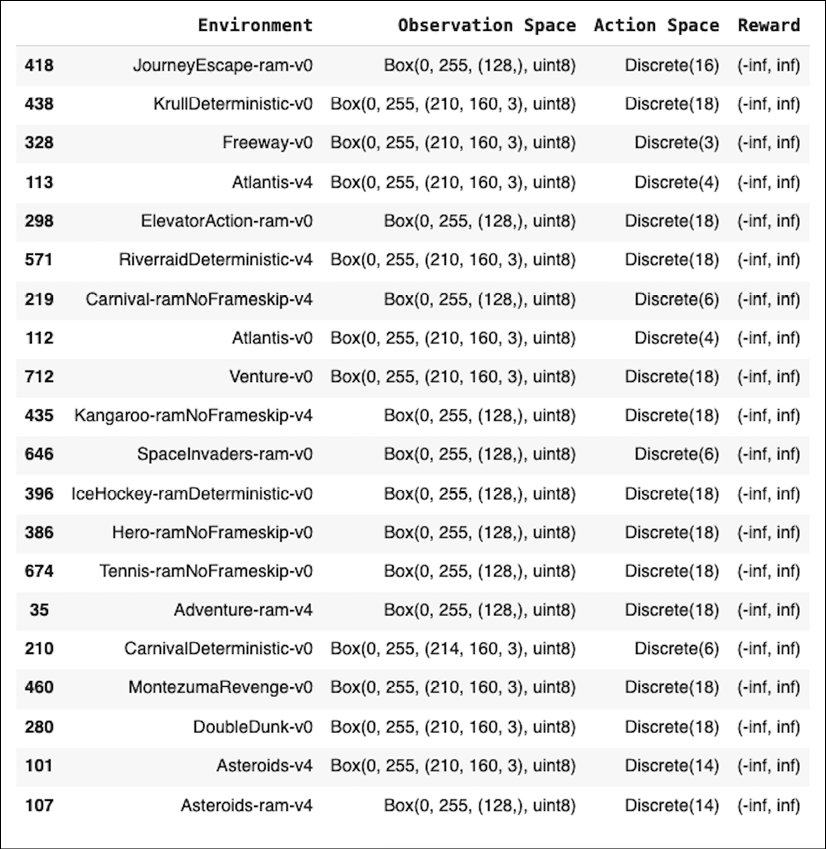

图 11.4:open ai 健身房中可用环境的随机列表

你可以使用这些命令找出健身房中任何环境的细节。例如，以下代码打印 MountainCar 环境的详细信息:

```py
env = gym.make('MountainCar-v0')

print(f"The Observation space is        {env.observation_space}" )

print(f"Upper Bound for Env Observation {env.observation_space.high}")

print(f"Lower Bound for Env Observation {env.observation_space.low}")

print(f"Action Space                    {env.action_space}")

env.seed(0)

obs = env.reset()

print(f"The initial observation is      {obs}")

# Take a random actionget the new observation space

new_obs, reward, done, info = env.step(env.action_space.sample())

print(f"The new observation is          {new_obs}")

env.close() 
```

OpenAI 健身房提供的核心接口是统一环境接口。代理可以使用三种基本方法与环境交互，即`reset`、`step`和`render`。`reset`方法重置环境并返回观察结果。`step`方法使环境步进一个时间步长，并返回`new_obs`、`reward`、`done`和`info`。方法渲染环境的一帧，就像弹出一个窗口。让我们尝试观察一些不同的环境，并观察它们的初始框架:

| **物理引擎** | **经典控制** | **雅达利** |
| 

```py
e = 'LunarLander-v2'

env = gym.make(e)

obs = env.reset() 

img = env.render(mode='rgb_array')

env.close()

plt.imshow(img) 
```

 | 

```py
e = 'CartPole-v0'

env = gym.make(e)

env.reset()

img = env.render(mode='rgb_array')

env.close()

plt.imshow(img) 
```

 | 

```py
e = 'SpaceInvaders-v0'

env = gym.make(e)

env.reset()

img = env.render(mode='rgb_array')

env.close()

plt.imshow(img) 
```

 |
| 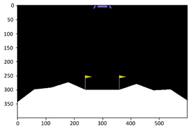 | 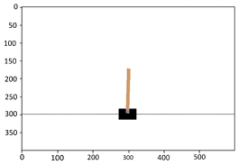 | 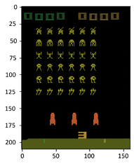 |

表 11.1:open ai 健身房的不同环境及其初始状态

前面的代码使用 Matplotlib 显示环境；或者，您可以直接使用`render`方法:

```py
import gym

env_name = 'Breakout-v0'

env = gym.make(env_name)

obs = env.reset()

env.render() 
```

你可以在*图 11.5* 中看到突围环境；`render`功能弹出环境窗口:

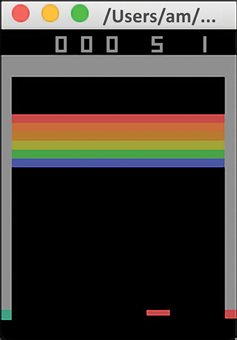

图 11.5:突破环境的初始状态

我们可以使用`env.observation_space`和`env.action_space`找到更多关于突围游戏的状态空间和动作空间。结果表明，状态由大小为 210 × 160 的三通道图像组成，动作空间是离散的，有四个可能的动作。完成后，不要忘记使用以下命令关闭 OpenAI:

```py
env.close() 
```

## 随机代理播放突破

让我们找点乐子，然后玩突围游戏。当我第一次玩这个游戏时，我不知道规则和如何玩，所以我随机选择了控制按钮。我们的新手代理也会这样做；它将从动作空间中随机选择动作。Gym 提供了一个名为`sample()`的函数，它从动作空间中选择一个随机动作——我们将使用这个函数。此外，我们可以保存比赛的回放，以便以后观看。有两种方法可以保存剧本，一种是使用 Matplotlib，另一种是使用 OpenAI Gym Monitor 包装器。让我们先来看看 Matplotlib 方法。

我们将首先导入必要的模块；我们现在只需要`gym`和`matplotlib`,因为代理会随机移动:

```py
import gym

import matplotlib.pyplot as plt

import matplotlib.animation as animation 
```

我们创造健身房环境:

```py
env_name = 'Breakout-v0'

env = gym.make(env_name) 
```

接下来，我们将运行游戏，一次一步，选择一个随机动作，要么 300 步，要么直到游戏结束(以较早者为准)。环境状态(观察)空间保存在列表`frames`中的每一步:

```py
frames = [] # array to store state space at each step

env.reset()

done = False

for _ in range(300): 

    #print(done)

    frames.append(env.render(mode='rgb_array'))

    obs,reward,done, _ = env.step(env.action_space.sample())

    if done:

        break 
```

现在是使用 Matplotlib 动画将所有帧组合成 GIF 图像的部分。我们创建一个图像对象，修补，然后定义一个将图像数据设置为特定帧索引的函数。Matplotlib `Animation`类使用该函数来创建动画，我们最终将它保存在文件`random_agent.gif`中:

```py
patch = plt.imshow(frames[0])

plt.axis('off')

def animate(i):

    patch.set_data(frames[i])

    anim = animation.FuncAnimation(plt.gcf(), animate, \

        frames=len(frames), interval=10)

    anim.save('random_agent.gif', writer='imagemagick') 
```

上面的代码将生成一个 GIF 图像。以下是一些截图:

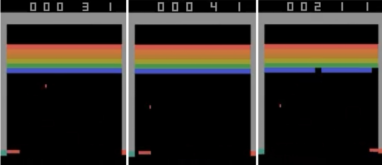

图 11.6:保存的 GIF 图像的一些截图

现在我们已经熟悉了 OpenAI Gym，我们将继续讨论包装器——您可以使用它来创建自己的定制环境。

## 健身房的包装纸

Gym 为我们提供了各种包装器来修改现有的环境。例如，如果您有基于图像的输入，并且的 RGB 亮度值介于 0 和 255 之间，但是您使用的 RL 代理是一个神经网络，如果输入在 0-1 的范围内，它会工作得最好，那么您可以使用 Gym wrapper 类来预处理状态空间。下面我们定义一个连接观察值的包装器:

```py
from collections import deque

from gym import spaces

import numpy as np

#Class to concat observations

class ConcatObservations(gym.Wrapper):

    def __init__(self, env, n):

        gym.Wrapper.__init__(self, env)

        shape = env.observation_space.shape

        self.n = n

        self.frames = deque([], maxlen=n)

        self.observation_space = \

            spaces.Box(low=0, high=255, shape=((n,) + shape), dtype=env.observation_space.dtype)

    def reset(self):  #reset function

        obs = self.env.reset()

        for _ in range(self.n):

            self.frames.append(obs)

        return self._get_obs()

    def step(self, action): #step function

        obs, reward, done, info = self.env.step(action)

        self.frames.append(obs)

        return self._get_obs(), reward, done, info

    def _get_obs(self):

        return np.array(self.frames) 
```

你可以看到我们需要改变默认的`reset`函数、`step`函数和观察函数`_get_obs`。我们还需要修改默认的观察空间。

让我们看看它是如何工作的。如果取`"BreakoutNoFrameskip-v4"`环境，那么初始观测空间为 210×160×3:

```py
env = gym.make("BreakoutNoFrameskip-v4")

print(f"The original observation space is  {env.observation_space}") 
```

```py
### OUTPUT: 
```

```py
>>>The original observation space is  Box(0, 255, (210, 160, 3), uint8) 
```

现在，如果您使用我们刚刚创建的包装器:

```py
env = ConcatObservations(env, 4)

print(f"The new observation space is  {env.observation_space}") 
```

```py
### OUTPUT: 
```

```py
The new observation space is  Box(0, 255, (4, 210, 160, 3), uint8) 
```

您可以看到，现在添加了一个维度，它有四个框架，每个框架的大小为 210 x 160 x 3。您也可以使用包装器来修改奖励。在这种情况下，您使用超类`RewardWrapper`。下面是示例代码，可以将奖励限制在[-10，10]范围内:

```py
class ClippedRewards(gym.RewardWrapper):

    def __init__(self, env):

        gym.RewardWrapper.__init__(self, env)

        self.reward_range = (-10,10)

    def reward(self, reward):

        """Clip to {+10, 0, -10} by its sign."""

        return reward if reward >= -10 and reward <= 10 else 10 * np.sign(reward) 
```

让我们尝试在 CartPole 环境中使用它，它有奖励范围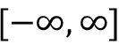:

```py
env = ClippedRewards(gym.make("CartPole-v0"))

print(f'Clipped reward range: {env.reward_range}')

env.close() 
```

```py
### OUTPUT: 
```

```py
Clipped reward range: (-10, 10) 
```

包装器的另一个有用的应用是当代理学习的时候你想要保存状态空间。通常，RL 代理需要许多步骤来进行适当的训练，因此，在每个步骤存储状态空间是不可行的。相反，在前面的算法中，我们可以选择在每 500 步(或者你希望的任何其他数字)之后存储。OpenAI Gym 提供了`Wrapper Monitor`类将游戏保存为视频。为此，我们需要首先导入包装器，然后创建环境，最后使用`Monitor`。

默认会存储 1，8，27，64，(有完美立方体的集数)等等的视频，然后每 1000 集；默认情况下，每个培训都保存在一个文件夹中。实现这一点的代码是:

```py
import gym

env = gym.make("Breakout-v0")

env = gym.wrappers.Monitor(env, 'recording', force=True)

observation = env.reset()

for _ in range(1000):

    #env.render()

    action = env.action_space.sample()

    # your agent here (this takes random actions)

    observation, reward, done, info = env.step(action)

    if done:

        observation = env.reset()

env.close() 
```

为了工作，我们需要 FFmpeg 支持。如果缺少它，我们可能需要根据我们的操作系统来安装它。

这将把视频以`.mp4`格式保存在文件夹`recording`中。这里需要注意的重要一点是，如果你想在下一次训练中使用同一个文件夹，你必须设置`force=True`选项。

如果您想在 Google Colab 上培训您的代理，您将需要添加以下驱动程序，以便能够可视化健身房输出:

```py
!pip install pyglet

!apt-get install -y xvfb python-opengl > /dev/null 2>&1

!pip install gym pyvirtualdisplay > /dev/null 2>&1 
```

安装 Python 虚拟显示器后，需要启动它—Gym 使用虚拟显示器来设置观测值。以下代码可以帮助您启动 600 x 400 大小的显示器:

```py
from pyvirtualdisplay import Display

display = Display(visible=0, size=(600, 400))

display.start() 
```

为了能够玩 Atari 游戏，请使用:

```py
!wget http://www.atarimania.com/roms/Roms.rar

!mkdir /content/ROM/

!unrar e /content/Roms.rar /content/ROM/

!python -m atari_py.import_roms /content/ROM/ 
```

# 深度 Q-网络

**深度 Q 网络**，简称 **DQNs** ，是深度学习神经网络，设计用于逼近 Q 函数(值-状态函数)。它们是最流行的基于值的强化学习算法之一。该模型由谷歌的 DeepMind 在 NeurIPS 2013 年发表的题为*用深度强化学习玩雅达利*的论文中提出。这篇论文最重要的贡献是他们直接使用原始状态空间作为网络的输入；输入功能不是像早期 RL 实现中那样手工制作的。此外，他们可以用完全相同的架构训练代理人玩不同的 Atari 游戏，并获得最先进的结果。

该模型是简单 Q 学习算法的扩展。在 Q-学习算法中，Q-表是作为备忘单来维护的。每次行动后，使用贝尔曼方程[5]更新 Q 表:

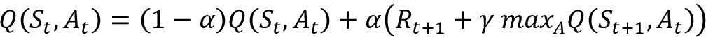

为学习率，其值位于范围[0，1]内。第一项代表旧的 *Q* 值的分量，第二项代表目标 *Q* 值。如果状态的数量和可能的动作的数量很小，Q-learning 是好的，但是对于大的状态空间和动作空间，Q-learning 是不可扩展的。更好的选择是使用深度神经网络作为函数逼近器，逼近每个可能动作的目标 Q 函数。在这种情况下，深度神经网络的权重存储 Q 表信息。每个可能的动作都有一个单独的输出单元。网络将状态作为其输入，并返回所有可能动作的预测目标值 *Q* 。问题出现了:我们如何训练这个网络，损失函数应该是什么？嗯，因为我们的网络必须预测目标*Q*值:

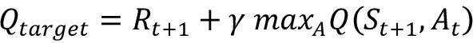

损失函数应尝试减少预测的 *Q* 值、 *Q* 预测的与目标 *Q* 、 *Q* [目标]之间的差异。我们可以通过将损失函数定义为:


其中 *W* 是我们的深度 *Q* 网络的训练参数，使用梯度下降来学习，使得损失函数最小化。

以下是 DQN 的总体架构。网络以 *n* 维状态为输入，输出 *m* 维动作空间中每个可能动作的 *Q* 值。每层(包括输入)可以是卷积层(如果我们将原始像素作为输入，卷积层更有意义)或密集层:

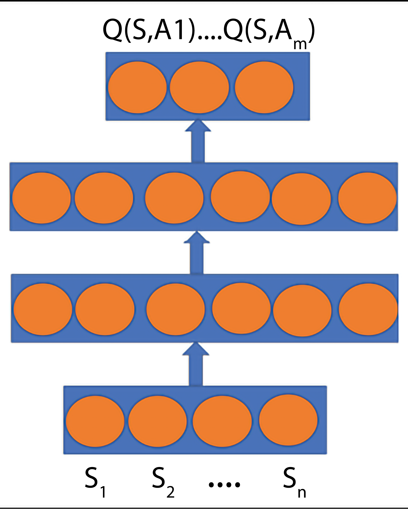

图 11.7:该图显示了一个简单的 DQN 网络，输入层取状态向量 S，输出预测状态所有可能动作的 Q

在下一部分，我们将尝试训练一只 DQN。我们的代理人任务是稳定推车上的杆子。代理可以向左或向右移动购物车以保持平衡。

## DQN 换侧手翻

CartPole 是一个具有连续状态空间和离散动作空间的经典开放问题。其中，一根杆子通过一个非驱动关节连接到一辆车上；手推车沿着无摩擦的轨道移动。目标是通过向左或向右移动推车来保持杆子站在推车上。杆子每站立一个时间步，奖励+1。一旦柱子偏离垂直方向超过 15 度，或者手推车偏离中心超过 2.4 个单位，游戏就结束了:

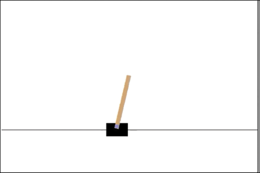

图 11.8:来自 CartPole Gym 环境的截图

你可以查看 OpenAI Gym 的排行榜，了解一些适合 CartPole 环境的酷条目:[https://github.com/openai/gym/wiki/Leaderboard#cartpole-v0](https://github.com/openai/gym/wiki/Leaderboard#cartpole-v0)。

我们从导入必需的模块开始。显然，我们需要`gym`为我们提供 CartPole 环境，并需要`tensorflow`建立我们的 DQN 网络。除此之外，我们还需要`random`和`numpy`模块:

```py
import random

import gym

import math

import numpy as np

from collections import deque

import tensorflow as tf

from tensorflow.keras.models import Sequential

from tensorflow.keras.layers import Dense

from tensorflow.keras.optimizers import Adam 
```

我们为我们将训练代理的最大情节(`EPOCHS`)设置全局值，当我们考虑环境已解决时设置阈值(`THRESHOLD`)，以及指示我们是否想要记录训练的布尔值(`MONITOR`)。请注意，根据官方的 OpenAI 文档，当代理能够在 195 个时间步长(刻度)内将杆子保持在垂直位置时，就认为解决了杆子环境。在下面的代码中，为了节省时间，我们将`THRESHOLD`减少到了 45:

```py
EPOCHS = 1000

THRESHOLD = 45

MONITOR = True 
```

现在让我们建设我们的 DQN。我们声明一个类`DQN`，并在它的`__init__()`函数中声明所有的超参数和我们的模型。我们也在`DQN`班级内部创造环境。正如您所看到的，这个类非常通用，您可以用它来训练任何状态空间信息可以包含在 1D 数组中的健身房环境:

```py
class DQN():

    def __init__(self, env_string, batch_size=64):

        self.memory = deque(maxlen=100000)

        self.env = gym.make(env_string)

        input_size = self.env.observation_space.shape[0]

        action_size = self.env.action_space.n

        self.batch_size = batch_size

        self.gamma = 1.0

        self.epsilon = 1.0

        self.epsilon_min = 0.01

        self.epsilon_decay = 0.995

        alpha=0.01

        alpha_decay=0.01

        if MONITOR: self.env = gym.wrappers.Monitor(self.env,

        'data/'+env_string, force=True)

        # Init model

        self.model = Sequential()

        self.model.add(Dense(24, input_dim=input_size,

        activation='tanh'))

        self.model.add(Dense(48, activation='tanh'))

        self.model.add(Dense(action_size, activation='linear'))

        self.model.compile(loss='mse', optimizer=Adam(lr=alpha,

        decay=alpha_decay)) 
```

我们构建的 DQN 是一个三层感知机；在下面的输出中，您可以看到模型摘要。我们使用学习率衰减的 Adam 优化器:

```py
Model: "sequential"

_________________________________________________________________

 Layer (type)                Output Shape              Param #   

=================================================================

 dense (Dense)               (None, 24)                120       

 dense_1 (Dense)             (None, 48)                1200      

 dense_2 (Dense)             (None, 2)                 98        

=================================================================

Total params: 1,418

Trainable params: 1,418

Non-trainable params: 0

_________________________________________________________________ 
```

变量列表`self.memory`将包含我们的经验回放缓冲区。我们需要添加一个将 *< S，A，R，S’>*元组保存到内存中的方法，以及一个从其中批量获取随机样本来训练代理的方法。我们通过定义类方法`remember`和`replay`来执行这两个功能:

```py
def remember(self, state, action, reward, next_state, done):

        self.memory.append((state, action, reward, next_state, done))

def replay(self, batch_size):

        x_batch, y_batch = [], []

        minibatch = random.sample(self.memory, min(len(self.memory),

        batch_size))

        for state, action, reward, next_state, done in minibatch:

             y_target = self.model.predict(state)

             y_target[0][action] = reward if done else reward + self.gamma * np.max(self.model.predict(next_state)[0])

             x_batch.append(state[0])

             y_batch.append(y_target[0])

        self.model.fit(np.array(x_batch), np.array(y_batch),

        batch_size=len(x_batch), verbose=0) 
```

我们的代理在选择动作时将使用**ε贪婪策略**。这是通过以下方法实现的:

```py
def choose_action(self, state, epsilon):

        if np.random.random() <= epsilon:

            return self.env.action_space.sample()

        else:

            return np.argmax(self.model.predict(state)) 
```

接下来，我们编写一个方法来训练代理。我们定义了两个列表来跟踪分数。首先，我们填充体验回放缓冲区，然后从中选择一些样本来训练代理,并希望代理会慢慢学会做得更好:

```py
def train(self):

    scores = deque(maxlen=100)

    avg_scores = []

    for e in range(EPOCHS):

        state = self.env.reset()

        state = self.preprocess_state(state)

        done = False

        i = 0

        while not done:

            action = self.choose_action(state,self.epsilon)

            next_state, reward, done, _ = self.env.step(action)

            next_state = self.preprocess_state(next_state)

            self.remember(state, action, reward, next_state, done)

            state = next_state

            self.epsilon = max(self.epsilon_min,

            self.epsilon_decay*self.epsilon) # decrease epsilon

            i += 1

        scores.append(i)

        mean_score = np.mean(scores)

        avg_scores.append(mean_score)

        if mean_score >= THRESHOLD and e >= 100:

            print('Ran {} episodes. Solved after {} trials ✔'.format(e, e - 100))

            return avg_scores

        if e % 100 == 0:

            print('[Episode {}] - Mean survival time over last 100 episodes was {} ticks.'.format(e, mean_score))

    self.replay(self.batch_size)

    print('Did not solve after {} episodes :('.format(e))

    return avg_scores 
```

现在所有必要的功能都完成了，我们只需要一个辅助功能来重塑 CartPole 环境的状态，以便模型的输入处于正确的形状。环境状态由四个连续变量描述:小车位置([-2.4-2.4])、小车速度、极角([-41.8°-41.8°)，以及极速度:

```py
def preprocess_state(self, state):

    return np.reshape(state, [1, self.input_size]) 
```

现在让我们为 CartPole 环境实例化我们的代理并训练它:

```py
env_string = 'CartPole-v0'

agent = DQN(env_string)

scores = agent.train() 
```

```py
[Episode 0] - Mean survival time over last 100 episodes was 28.0 ticks.

[Episode 100] - Mean survival time over last 100 episodes was 15.71 ticks.

[Episode 200] - Mean survival time over last 100 episodes was 27.81 ticks.

Ran 259 episodes. Solved after 159 trials ✔ 
```

让我们绘制代理学习时的平均奖励:

```py
import matplotlib.pyplot as plt

plt.plot(scores)

plt.show() 
```

*图 11.9* 显示代理正在我的系统上接受培训。该代理能够在 254 个步骤中达到我们设定的阈值 45:

``

图 11.9:平均代理报酬图

培训完成后，您可以关闭环境:

```py
agent.env.close() 
```

你可以看到，从开始，没有关于如何平衡杆子的信息，代理使用 DQN，能够随着学习平衡杆子越来越多的时间(平均)。从空白开始，代理能够构建信息/知识来实现所需的目标。了不起！

## DQN 玩雅达利的游戏

在前面的部分，我们训练了一个 DQN 在横翻筋斗中保持平衡。这是一个简单的问题，因此我们可以使用感知器模型来解决它。但是想象一下，如果环境状态只是我们人类所看到的横向视觉。使用原始像素值作为输入状态空间，我们以前的 DQN 将不起作用。我们需要的是一个卷积神经网络。接下来，我们基于关于 DQNs 的开创性论文*构建一个，用深度强化学习*玩雅达利。

大部分代码将类似于 CartPole 的 DQN，但 DQN 网络本身将有重大变化，以及我们如何预处理从环境中获得的状态。

首先，让我们看看状态空间处理方式的变化。*图 11.10* 显示了一款雅达利游戏，Breakout:

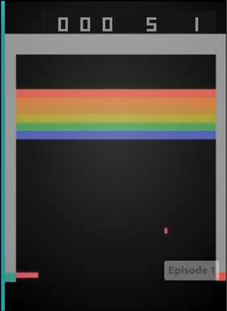

图 11.10:雅达利游戏《突围》的截图

现在，如果你看图像，并不是所有的都包含相关信息:顶部有关于分数的冗余信息，底部有不必要的空白，图像是彩色的。为了减轻我们模型的负担，最好去掉不必要的信息，所以我们对图像进行裁剪，将其转换为灰度，并使其成为大小为 84 × 84 的正方形(如论文中所示)。以下是预处理输入原始像素的代码:

```py
def preprocess_state(self, img):

    img_temp = img[31:195]  # Choose the important area of the image

    img_temp = tf.image.rgb_to_grayscale(img_temp)

    img_temp = tf.image.resize(img_temp, [self.IM_SIZE, self.IM_SIZE],

    method=tf.image.ResizeMethod.NEAREST_NEIGHBOR)

    img_temp = tf.cast(img_temp, tf.float32)

    return img_temp[:,:,0] 
```

另一个重要的问题是，仅仅通过在一个时间步长上查看图像，代理如何知道球是向上还是向下？一种方法是使用 LSTM 和 CNN 来记录过去，从而记录球的运动。然而，这篇论文使用了一种简单的技术。它不是单一的状态帧，而是将过去四个时间步长的状态空间连接在一起，作为 CNN 的一个输入；也就是说，网络将环境的四个过去的帧视为其输入。以下是组合当前和先前状态的代码:

```py
def combine_images(self, img1, img2):

    if len(img1.shape) == 3 and img1.shape[0] == self.m:

        im = np.append(img1[1:,:, :],np.expand_dims(img2,0), axis=2)

        return tf.expand_dims(im, 0)

    else:

        im = np.stack([img1]*self.m, axis = 2)

        return tf.expand_dims(im, 0) 
```

该模型在`__init__`函数中定义。我们修改该函数，使 CNN 的输入为(84 × 84 × 4 ),代表四个状态帧，每个帧的大小为 84 × 84:

```py
def __init__(self, env_string,batch_size=64, IM_SIZE = 84, m = 4):

    self.memory = deque(maxlen=5000)

    self.env = gym.make(env_string)

    input_size = self.env.observation_space.shape[0]

    action_size = self.env.action_space.n

    self.batch_size = batch_size

    self.gamma = 1.0

    self.epsilon = 1.0

    self.epsilon_min = 0.01

    self.epsilon_decay = 0.995

    self.IM_SIZE = IM_SIZE

    self.m = m

    alpha=0.01

    alpha_decay=0.01

    if MONITOR: self.env = gym.wrappers.Monitor(self.env, '../data/'+env_string, force=True)

    # Init model

    self.model = Sequential()

    self.model.add( Conv2D(32, 8, (4,4), activation='relu',padding='valid', input_shape=(IM_SIZE, IM_SIZE, m)))

    self.model.add( Conv2D(64, 4, (2,2), activation='relu',padding='valid'))

    self.model.add( Conv2D(64, 3, (1,1), activation='relu',padding='valid'))

    self.model.add(Flatten())

    self.model.add(Dense(512, activation='elu'))

    self.model.add(Dense(action_size, activation='linear'))

    self.model.compile(loss='mse', optimizer=Adam(lr=alpha, decay=alpha_decay)) 
```

最后，我们需要对`train`函数做一个小改动。我们将需要调用新的`preprocess`函数，以及`combine_images`函数来确保四个帧连接在一起:

```py
def train(self):

    scores = deque(maxlen=100)

    avg_scores = []

    for e in range(EPOCHS):

        state = self.env.reset()

        state = self.preprocess_state(state)

        state = self.combine_images(state, state)

        done = False

        i = 0

        while not done:

            action = self.choose_action(state,self.epsilon)

            next_state, reward, done, _ = self.env.step(action)

            next_state = self.preprocess_state(next_state)

            next_state = self.combine_images(next_state, state)

            #print(next_state.shape)

            self.remember(state, action, reward, next_state, done)

            state = next_state

            self.epsilon = max(self.epsilon_min, self.epsilon_decay*self.epsilon) # decrease epsilon

            i += reward

        scores.append(i)

        mean_score = np.mean(scores)

        avg_scores.append(mean_score)

        if mean_score >= THRESHOLD and e >= 100:

            print('Ran {} episodes. Solved after {} trials ✔'.format(e, e - 100))

            return avg_scores

        if e % 100 == 0:

            print('[Episode {}] - Score over last 100 episodes was {}.'.format(e, mean_score))

        self.replay(self.batch_size)

    print('Did not solve after {} episodes :('.format(e))

    return avg_scores 
```

仅此而已。我们现在可以训练代理玩突围。完整的代码可以在 GitHub 储存库([https://GitHub . com/packt publishing/Deep-Learning-with-tensor flow-and-Keras-3rd-edition/tree/main/Chapter _ 11](https://github.com/PacktPublishing/Deep-Learning-with-TensorFlow-and-Keras-3rd-edition/tree/main/Chapter_11))的文件`DQN_Atari_v2.ipynb`中找到。

## DQN 变体

在 DQNs 取得前所未有的成功后，人们对 RL 的兴趣增加了，许多新的 RL 算法应运而生。接下来，我们将看到一些基于 dqn 的算法。他们都使用 dqn 作为基础，并在其上进行构建。

### 双 dql

在 DQNs 中，代理使用相同的 *Q* 值来选择和评估动作。这可能导致学习中的最大化偏差。例如，让我们考虑对于一个状态， *S* ，所有可能的动作都具有为零的真值 *Q* 。现在，我们的 DQN 估计值将有大于零的一些值和小于零的一些值，由于我们选择了具有最大 *Q* 值的动作，然后使用相同的(最大化的)估计值函数评估每个动作的 *Q* 值，我们高估了*Q*——或者换句话说，我们的代理人过于乐观。这可能导致不稳定的培训和低质量的政策。为了解决这个问题，来自 DeepMind 的 Hasselt 等人在他们的论文*中提出了双 DQN 算法，使用双 Q 学习的深度强化学习*。在双 DQN 中，我们有两个结构相同但权重不同的 Q 网络。其中一个 Q-网络用于确定使用ε-贪婪策略的动作，另一个用于确定其值(Q-目标)。

如果您记得在 DQNs 中，Q 目标由下式给出:

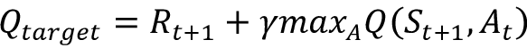

这里，动作 *A* 是使用相同的 DQN、 *Q(S，A；W)* ，其中 *W* 为网络的训练参数；也就是说，我们正在编写 *Q* 值函数及其训练参数，以强调普通 DQNs 和双 DQN 之间的区别:

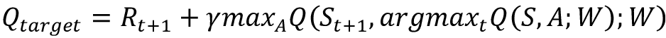

在双 DQN 中，目标的等式现在将改变。现在，DQN *Q(S，A；W)* 用于确定动作和 DQN *Q(S，A；w’)*用于计算目标(注意不同的权重)。因此，前面的等式将变为:

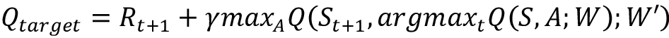

这个简单的改变减少了高估，帮助我们更快更可靠地训练代理。

### 决斗 DQN

这种架构是由王等人在 2015 年的论文*duing Network Architectures for Deep Reinforcement Learning*中提出的。像 DQN 和双 DQN 一样，它也是一种无模型算法。

决斗 DQN 将 Q 函数解耦为价值函数和优势函数。我们之前讨论过的值函数，代表了独立于任何动作的状态值。另一方面，优势函数提供了状态 *S* 中动作 *A* 的效用(优势/良好性)的相对度量。决斗 DQN 在初始层使用卷积网络从原始像素中提取特征。但是，在后期阶段，它被分成两个不同的网络，一个逼近值，另一个逼近优势。这确保了网络为价值函数和优势函数产生单独的估计:

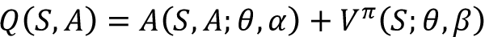

这里，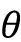是共享卷积网络的训练参数数组(它由 *V* 和 *A* 共享)，而和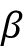是用于*优势*和*值*估计器网络的训练参数。稍后，使用聚合层来重新组合两个网络，以估计 *Q* 值。

在*图 11.11* 中，你可以看到决斗 DQN 的架构:


图 11.11:可视化决斗 DQN 的架构

你可能想知道，做所有这些有什么好处？如果我们只是把它放回一起，为什么要分解 Q？嗯，解耦价值和优势函数让我们知道哪些状态是有价值的，而不必考虑每个状态的每个动作的效果。有许多状态，无论采取何种行动，都是好的或坏的状态:例如，在一个好的度假胜地与你爱的人一起吃早餐永远是一种好的状态，而住进医院急诊病房永远是一种坏的状态。因此，将价值和优势分开允许人们得到价值函数的更稳健的近似。接下来，你可以从论文中看到一个图，突出显示了在雅达利游戏 Enduro 中，价值网如何学会注意道路，而优势网只在正前方有车时才学会注意，从而避免碰撞:

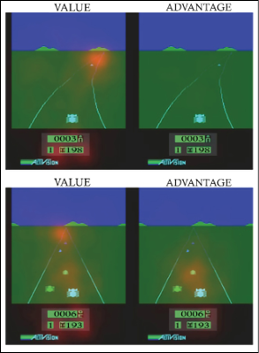

图 11.12:雅达利游戏 Enduro 中，价值网学会关注道路(红点)，优势网只在其他车辆正前方时关注。图片来源:https://arxiv.org/pdf/1511.06581.pdf

集合层以允许从给定的 *Q* 中恢复 *V* 和 *A* 的方式实现。这是通过强制优势函数估计器在所选动作处具有零优势来实现的:

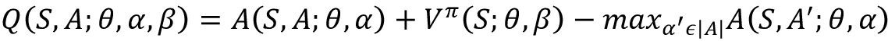

在论文中，王等人报道了如果用平均运算代替最大运算，则网络更稳定。这是因为优势的变化速度现在与平均值的变化速度相同，而不是最优(最大)值。

### 彩虹

彩虹是当前最先进的 DQN 变体。从技术上讲，称其为 DQN 变种是错误的。从本质上讲，它是许多 DQN 变体组合成一个单一算法的集合。它将分布 RL [6]损失修改为多步损失，并使用贪婪动作将其与双 DQN 组合。引用报纸上的话:

> 网络体系结构是一种适用于退货分布的决斗网络体系结构。网络有一个共享的表示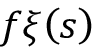，然后被馈入具有 *N* [原子]输出的价值流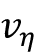，以及具有 *N* [原子] × * N * [动作]输出的优势流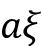，其中 a1ξ(fξ(s)，a)将表示对应于原子 I 和动作 a 的输出。对于每个原子 *z* [ i]

Rainbow 结合了六种不同的 RL 算法:

*   n 步返回
*   分布式状态-动作值学习
*   决斗网络
*   嘈杂的网络
*   双 dql
*   优先体验重放

到目前为止，我们已经考虑了基于价值的强化学习算法。在下一节中，我们将了解基于策略的强化学习算法。

# 深度确定性政策梯度

DQN 及其变体在解决状态空间连续而动作空间离散的问题上非常成功。例如，在 Atari 游戏中，输入空间由原始像素组成，但动作是离散的——[**向上**，**向下**，**向左**，**向右**，**无操作**。我们如何用连续的动作空间解决一个问题？例如，假设一个驾驶汽车的 RL 代理需要转动它的轮子:这个动作有一个连续的动作空间。

处理这种情况的一种方法是离散化动作空间，并继续使用 DQN 或其变体。然而，更好的解决方案是使用策略梯度算法。在策略梯度方法中，策略是直接近似的。

使用神经网络来近似策略；在最简单的形式中，神经网络通过使用最陡梯度上升调整其权重来学习选择最大化回报的行动的策略，因此得名:策略梯度。

在本节中，我们将重点介绍**深度确定性策略梯度** ( **DDPG** )算法，这是 Google 的 DeepMind 在 2015 年推出的另一个成功的 RL 算法。DDPG 是使用两个网络实现的；一个叫演员网，另一个叫评论家网。

行动者网络确定性地逼近最优策略，也就是说，对于任何给定的输入状态，它输出最优选的动作。本质上，演员是在学习。另一方面，评论家使用行动者最喜欢的行动来评估最佳行动价值函数。在进一步讨论之前，让我们将它与上一节讨论的 DQN 算法进行对比。在*图 11.13* 中，可以看到 DDPG 的大致建筑:

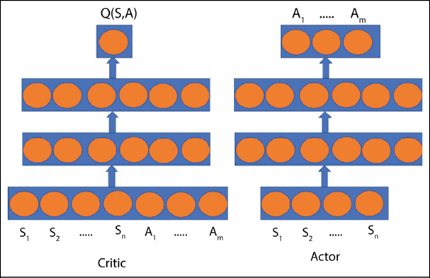

图 11.13:DDPG 模型的架构

在*图 11.13* 的左侧是批判网络，它将状态向量 *S* 和采取的动作 *A* 作为输入。网络的输出是该状态和动作的 *Q* 值。右图为演员网络。它将状态向量 S 作为输入，并预测要采取的最佳动作 A。在图中，我们已经显示了演员和评论家都是四层的。这只是为了演示的目的。

演员网络输出最喜欢的动作；批评家将输入状态和采取的动作作为输入，并评估其 *Q* 值。为了训练评论家网络，我们遵循与 DQN 相同的程序；也就是说，我们试图最小化估计的 *Q* 值和目标 *Q* 值之间的差异。然后，动作上的 *Q* 值的梯度被传播回去以训练动作者网络。所以，如果批评家足够好，它会迫使行动者选择具有最优价值函数的行动。

# 摘要

强化学习近年来取得了很大进展。在一章中总结所有这些是不可能的。然而，在这一章中，我们将重点放在最近成功的 RL 算法上。本章首先介绍了 RL 领域的重要概念、面临的挑战以及解决方案。接下来，我们深入研究了两种重要的 RL 算法:DQN 和 DDPG 算法。在本章的末尾，我们讨论了深度学习领域的重要主题。

在下一章，我们将继续把我们所学的应用到生产中。

# 参考

1.  麻省理工科技评论涵盖 OpenAI 关于强化学习的实验:[https://www . Technology Review . com/s/614325/open-ai-algorithms-learned-tool-use-and-cooperation-after-hide-and-seek-games/](https://www.technologyreview.com/s/614325/open-ai-algorithms-learned-tool-use-and-cooperation-after-hide-and-seek-games/)
2.  科根，梅勒妮。(2014).*强化学习中的探索与利用*。研究由麦吉尔大学 CRA-DMP 项目 Doina Precup 教授指导。
3.  林，龙记。(1993).*利用神经网络对机器人进行强化学习*。不 CMU CS-93-103。匹兹堡卡内基梅隆大学计算机科学学院。
4.  舒尔、汤姆、约翰·全、约安尼斯·安东诺格鲁和大卫·西尔弗。(2015).*优先体验回放*。arXiv 预印本 arXiv:1511.05952
5.  萨顿 r，巴尔托 A. *第四章，强化学习*。麻省理工出版社:[https://web . Stanford . edu/class/psych 209/Readings/suttonbartoiprlbook 2 nded . pdf](https://web.stanford.edu/class/psych209/Readings/SuttonBartoIPRLBook2ndEd.pdf)
6.  Dabney W .，Rowland M .，belle mare M . g .，和 Munos R. (2018 年)。*分位数回归的分布式强化学习*。在第三十二届 AAAI 人工智能会议上。
7.  Hessel，m .，Modayil，j .，Van Hasselt，h .，Schaul，t .，Ostrovski，g .，Dabney，w .，Horgan，d .，Piot，b .，Azar，m .，和 Silver，D. (2018)。 *Rainbow:结合深度强化学习的改进*。在第三十二届 AAAI 人工智能会议上。
8.  关于不同环境的细节可以从[https://www.gymlibrary.ml/](https://www.gymlibrary.ml/)获得
9.  在[https://github.com/openai/gym/wiki](https://github.com/openai/gym/wiki)为一些环境维护维基页面
10.  关于安装说明和依赖关系的详细信息可从 https://github.com/openai/gym 获得
11.  链接到 DeepMind 的论文，*深度强化学习的异步方法*:【https://arxiv.org/pdf/1602.01783.pdf】T2
12.  这是安德烈·卡帕西关于强化学习的博客:[http://karpathy.github.io/2016/05/31/rl/](http://karpathy.github.io/2016/05/31/rl/)
13.  Glorot X .和 Bengio Y. (2010 年)。*了解训练深度前馈神经网络的难度*。第十三届人工智能与统计国际会议论文集:【http://proceedings.mlr.press/v9/glorot10a/glorot10a.pdf 
14.  关于 RL 为何仍然难以破解的一个很好的解读:[https://www.alexirpan.com/2018/02/14/rl-hard.xhtml](https://www.alexirpan.com/2018/02/14/rl-hard.xhtml)
15.  Lillicrap，T. P .，Hunt，J. J .，Pritzel，a .，Heess，n .，Erez，t .，Tassa，y ....和威斯特拉博士(2015 年)。*深度强化学习的连续控制。arXiv 预印本 arXiv:1509.02971* 。

# 加入我们书的不和谐空间

加入我们的 Discord 社区，结识志同道合的朋友，与 2000 多名会员一起学习:[https://packt.link/keras](https://packt.link/keras)

*