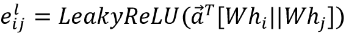

# 十七、图神经网络

在这一章中，我们将研究一类相对较新的神经网络，即**图神经网络** ( **GNN** )，它非常适合处理图形数据。社交媒体、生物化学、学术文献等领域的许多现实问题本质上都是“图形型”的，这意味着它们的输入由最适合用图形表示的数据组成。我们将从数学的角度讨论什么是图，然后解释“图卷积”背后的直觉，这是 GNNs 背后的主要思想。然后，我们将介绍一些基于基本图形卷积技术变体的流行 GNN 图层。我们将描述 GNNs 的三个主要应用，包括节点分类、图分类和边预测，并使用 TensorFlow 和**深度图形库** ( **DGL** )进行示例。DGL 提供了我们刚刚提到的 GNN 层以及更多。此外，它还提供了一些我们将在示例中使用的标准图形数据集。接下来，我们将展示如何使用 DGL 的低级消息传递 API，从您自己的数据以及您自己的图层构建 DGL 兼容的数据集。最后，我们将看看图的一些扩展，如异构图和时态图。

我们将在本章中讨论以下主题:

*   图表基础
*   图形机器学习
*   图形卷积
*   公共图层
*   常见图形应用
*   图表自定义
*   未来方向

本章的所有代码文件都可以在 https://packt.link/dltfchp17 找到

让我们从基础开始。

# 图表基础

从数学上讲，图 *G* 是一个数据结构，由一组顶点(也称为节点) *V* 组成，通过一组边 *E* 相互连接，即:


图可以等价地表示为大小为( *n* ， *n* )的邻接矩阵 *A* ，其中 *n* 是集合 *V* 中顶点的数量。该邻接矩阵的元素*A【I，j】*表示顶点 *i* 和顶点 *j* 之间的边。因此，如果顶点 *i* 和顶点 *j* 之间有边，元素 *A[I，j] = 1* ，否则为 0。在加权图的情况下，边可能具有它们自己的权重，并且邻接矩阵将通过将边权重设置给元素 *A[i，j]* 来反映这一点。边可以是有向的或无向的。例如，表示一对节点 *x* 和 *y* 之间的友谊的边是无向的，因为 *x* 是 *y* 的朋友意味着 *y* 是 *x* 的朋友。相反，有向边可以是追随者网络(社交媒体)中的一个，其中跟随 *y* 的 *x* 并不意味着 *y* 跟随 *x* 。对于无向图， *A[I，j] = A[j，i]* 。

邻接矩阵 *A* 的另一个有趣的性质是， *A* ^n ，即 *A* 取 *n* 次的乘积，暴露了节点间的 *n* 跳连接。

图-矩阵等价是双向的，这意味着邻接矩阵可以转换回图表示，而不会丢失任何信息。由于**机器学习** ( **ML** )方法，包括**深度学习** ( **DL** )方法，都是以张量的形式消耗输入数据，这种等价性意味着图可以高效地表示为各种机器学习算法的输入。

每个节点还可以与其自己的特征向量相关联，非常类似于表格输入中的记录。假设一个大小为 *f* 的特征向量，节点集合 *X* 可以表示为 *(n，f)* 。边缘也可能具有它们自己的特征向量。由于图和矩阵之间的等价性，图通常被库表示为有效的基于张量的结构。我们将在本章后面更详细地研究这一点。

# 图形机器学习

任何 ML 练习的目标都是学习从输入空间 *X* 到输出空间 *y* 的映射 *F* 。早期的机器学习方法需要特征工程来定义适当的特征，而 DL 方法可以从训练数据本身推断特征。DL 通过假设一个具有随机权重的模型 *M* 来工作，将任务公式化为参数的优化问题:


以及使用梯度下降在多次迭代中更新模型权重，直到参数收敛:


毫不奇怪，gnn 也遵循这个基本模型。

然而，正如您在前面章节中看到的，ML 和 DL 通常针对特定的结构进行了优化。例如，当处理表格数据时，您可能会本能地选择简单的**前馈网络** ( **FFN** )或“密集”网络，当处理图像数据时，您可能会选择**卷积神经网络** ( **CNN** ，当处理文本或时间序列等序列数据时，您可能会选择**循环神经网络** ( **RNN** )。一些输入可以简化为更简单的结构，例如像素点阵或标记序列，但不一定如此。在其自然形式中，图是不确定大小的拓扑复杂结构，并且不是置换不变的(即，实例不是彼此独立的)。

由于这些原因，我们需要特殊的工具来处理图形数据。我们将在本章中介绍 DGL，这是一个跨平台的图形库，它通过使用可配置的后端来支持 MX-Net、PyTorch 和 TensorFlow 的用户，并且被广泛认为是可用的最强大和易用的图形库之一。

# 图形卷积 GNNs 背后的直觉

卷积算子有效地允许 2D 平面上相邻像素的值以特定的方式聚集，在计算机视觉的深度神经网络中取得了成功。一维变体在自然语言处理和音频处理中也取得了类似的成功。正如您在*第 3 章*、*卷积神经网络*中回忆的那样，网络在连续层中应用卷积和池化操作，并设法在足够多的输入像素中学习足够多的全局特征，以成功完成它被训练完成的任务。

从另一端来看这个类比，图像(或图像的每个通道)可以被认为是一个格子状的图形，其中相邻的像素以特定的方式相互链接。类似地，单词或音频信号的序列可以被认为是另一个线性图，其中个相邻的标记相互链接。在这两种情况下，深度学习架构在输入图的相邻顶点之间逐步应用卷积和汇集操作，直到它学会执行任务，这通常是分类。每个卷积步骤包含一个额外级别的邻居。例如，第一个卷积合并来自节点的距离 1(直接)邻居的信号，第二个合并来自距离 2 邻居的信号，等等。

*图 17.1* 显示了 CNN 中 3×3 卷积和相应的“图形卷积”操作之间的等价性。卷积运算符将过滤器(本质上是一组九个可学习的模型参数)应用于输入，并通过加权求和来组合它们。通过将像素邻域视为以中间像素为中心的九个节点的图形，可以达到相同的效果。

这种结构上的图形卷积将只是节点特征的加权和，与 CNN 中的卷积运算符相同:


图 17.1:图像中的卷积和图形中的卷积之间的平行线。图片来源:斯坦福大学带图的 CS-224W 机器学习。

CNN 上的卷积运算和图形卷积对应的方程如下所示。如您所见，在 CNN 上，卷积可以被视为输入像素及其每个邻居的加权线性组合。每个像素以所应用的过滤器的形式带来它自己的权重。另一方面，图形卷积也是输入像素及其所有邻居的聚合的加权线性组合。所有邻居的综合效应被平均到卷积输出中:


因此，图卷积是我们已经熟悉的卷积的一种变体。在下一节中，我们将看到如何将这些卷积组合起来构建不同种类的 GCN 层。

# 公共图层

我们在本节中讨论的所有图表图层都使用上述图表卷积运算的某种变体。像 DGL 这样的图形库的贡献者在学术论文中提出后的短时间内就提供了许多这些层的预构建版本，所以实际上你永远不必实现其中的一个。这里的信息主要是为了了解事情如何在引擎盖下工作。

## 图形卷积网络

**图卷积网络** ( **GCN** )是 Kipf 和 Welling [1]提出的图卷积层。它最初是作为一种针对图结构数据的半监督学习的可扩展方法提出的。他们将 GCN 描述为对基础图的节点特征向量 *X* 和邻接矩阵 *A* 的操作，并指出当 *A* 中的信息不存在于数据 *X* 中时，例如引用网络中文档之间的引用链接，或知识图中的关系，这可能会异常强大。

GCNs 使用一些权重(初始化为随机值)将每个节点的特征向量值与其邻居的特征向量值相结合。因此，对于每个节点，相邻节点的特征的总和被相加。该操作可以表示如下:


这里的*更新*和*聚集*是不同种类的求和函数。这种对节点特征的投影被称为消息传递机制。这种消息传递的单次迭代相当于每个节点的直接邻居上的图形卷积。如果我们希望合并来自更远的节点的信息，我们可以多次重复这个操作。

下面的等式描述了层 *(l+1)* 的 GCN 在节点 *i* 的输出。这里， *N(i)* 是节点 *I* (包括自身)的邻居集合， *c* [ij] 是节点度数的平方根的乘积，sigma 是激活函数。 *b(l)* 项是可选的偏置项:


接下来，我们将研究图形注意力网络，这是 GCN 的一种变体，其中的系数是通过注意力机制学习的，而不是明确定义的。

## 图形注意网络

**图形注意网络** ( **GAT** )层是 Velickovic 等人提出的【2】。像 GCN 一样，GAT 对其邻居的特征进行局部平均。不同之处在于，GAT 允许使用对节点特征的自我关注来学习，而不是明确地指定归一化项*c*ij。对于 GAT，相应的归一化项被写成，这是基于相邻节点的隐藏特征和学习到的注意力向量来计算的。本质上，GAT 背后的思想是将来自相似邻居节点的特征信号优先于来自不同邻居节点的特征信号。

节点 *i* 的每个邻居邻居 *N* ( *i* )发送自己的注意系数矢量。以下方程组描述了节点 *i* 的 GAT 在层( *i+1* )的输出。注意力通过使用前馈网络的 Bahdanau 注意力模型来计算:




GCN 和 GAT 架构适用于中小型网络。下一节描述的 GraphSAGE 架构更适合大型网络。

## GraphSAGE(样本和集合)

到目前为止，我们考虑的卷积要求图中的所有节点在训练期间都存在，因此是直推式的，不会自然地推广到看不见的节点。Hamilton、Ying 和 Leskovec [3]提出了 GraphSAGE，这是一个通用的归纳框架，可以为以前看不见的节点生成嵌入。它通过从节点的本地邻域采样和聚集来实现。GraphSAGE 已被证明在时间演化网络(如引文图和 Reddit 帖子数据)上的节点分类方面是成功的。

GraphSAGE 对邻居的子集进行采样，而不是使用所有邻居。它可以使用随机行走定义一个节点邻域，并累加重要性分数以确定最佳样本。聚合函数可以是均值、GCN、池和 LSTM 之一。均值聚合只是取相邻向量的元素均值。LSTM 聚集更有表现力，但本质上是顺序的和不对称的；它应用于从节点邻居的随机排列中得到的无序集合。池集合既是对称的，也是可训练的；这里，每个邻居向量通过一个完全连接的神经网络独立地馈入,最大池化应用于邻居集合的聚合信息。

这组等式显示了层 *(l+1)* 处的节点 *i* 的输出是如何从层 *l* 处的节点 *i* 及其邻居 *N(i)* 生成的:


现在，我们已经看到了使用 GNNs 处理大型网络的策略，我们将使用图同构网络来研究最大化 GNNs 的代表性(以及辨别能力)的策略。

## 图形同构网络

徐等人[4]提出了**图同构网络** ( **GIN** )作为一个比现有的更有表现力的图层。具有高表达能力的图形层应该能够区分拓扑相似但不相同的一对图形。他们表明 GCNs 和 GraphSAGE 不能区分某些图形结构。他们还表明，在区分图形结构方面，和聚集优于均值和最大聚集。因此，与 GCNs 和 GraphSAGE 相比，GIN 层提供了一种更好的方式来表示邻居的聚合。

下面的等式显示了节点 *i* 和层 *(l+1)* 处的输出。这里，函数*f*θ是可调用的激活函数， *aggregate* 是聚合函数，例如 SUM、MAX 或 MEAN，是将在训练过程中学习的可学习参数:


已经介绍了几种流行的 GNN 架构，现在让我们把注意力转向我们可以用 GNNs 完成的任务。

# 常见图形应用

我们现在来看看 GNNs 的一些常见应用。通常，应用属于下面列出的三个主要类别之一。在本节中，我们将看到如何使用 TensorFlow 和 DGL 为每项任务构建和训练 gnn 的代码示例:

*   节点分类
*   图形分类
*   边缘分类(或链接预测)

GNNs 还有其他应用，比如图聚类或生成图模型，但它们不太常见，我们在这里不考虑它们。

## 节点分类

节点分类是图形数据上的一个流行任务。这里，模型被训练来预测节点类别。非图分类方法可以单独使用节点特征向量来做到这一点，并且诸如 DeepWalk 和 node2vec 的一些前 GNN 方法可以单独使用邻接矩阵，但是 GNNs 是可以同时使用节点特征向量和连接信息来进行节点分类的第一类技术。

本质上，其思想是将一个或多个图卷积(如前一节所述)应用于图的所有节点，以将节点的特征向量投影到可用于预测节点类别的相应输出类别向量。我们的节点分类示例将使用 CORA 数据集，这是一个由 2，708 篇科学论文组成的集合，分为七个类别。这些论文被组织成一个引用网络，其中包含 5429 个链接。每篇论文由大小为 1，433 的词向量描述。

我们首先建立我们的进口。如果您还没有这样做，那么您需要使用`pip install dgl`将 DGL 库安装到您的环境中。您还需要将环境变量`DGLBACKEND`设置为 TensorFlow。在命令行上，这是通过命令`export DGLBACKEND=tensorflow`实现的，在笔记本环境中，您可以尝试使用神奇的`%env DGLBACKEND=tensorflow`:

```py
import dgl

import dgl.data

import matplotlib.pyplot as plt

import numpy as np

import os

import tensorflow as tf

import tensorflow_addons as tfa

from dgl.nn.tensorflow import GraphConv 
```

CORA 数据集预先打包为 DGL 数据集，因此我们使用以下调用将数据集加载到内存中:

```py
dataset = dgl.data.CoraGraphDataset() 
```

第一次调用这个函数时，它会记录它正在下载并解压到一个本地文件。一旦完成，它将打印出关于 CORA 数据集的一些有用的统计数据。如您所见，图中有 2，708 个节点和 10，566 条边。每个节点具有大小为 1，433 的特征向量，并且一个节点被分类为七类中的一类。此外，我们看到它有 140 个训练样本、500 个验证样本和 1，000 个测试样本:

```py
 NumNodes: 2708

  NumEdges: 10556

  NumFeats: 1433

  NumClasses: 7

  NumTrainingSamples: 140

  NumValidationSamples: 500

  NumTestSamples: 1000

Done saving data into cached files. 
```

因为这是一个图表数据集，所以它应该包含与一组图表相关的数据。然而，CORA 是一个单一的引用图。你可以通过`len(dataset)`来验证这一点，它会给你`1`。这也意味着下游代码将在`dataset[0]`给出的图上工作，而不是在完整的数据集上工作。节点特征将作为键值对包含在字典`dataset[0].ndata`中，边特征包含在`dataset[0].edata`中。`ndata`包含关键字`train_mask`、`val_mask`和`test_mask`，它们是布尔掩码，分别表示哪些节点是训练、验证和测试分割的一部分，以及一个`feat`关键字，它包含图中每个节点的特征向量。

我们将建立一个有两层`GraphConv`的`NodeClassifier`网络。每一层将通过聚集邻居信息来计算新的节点表示。`GraphConv`层只是简单的`tf.keras.layers.Layer`对象，因此可以堆叠。第一`GraphConv`层将输入特征大小(1，433)投影到大小为 16 的隐藏特征向量，第二`GraphConv`层将隐藏特征向量投影到大小为 2 的输出类别向量，从该向量中读取类别。

请注意，`GraphConv`只是我们可以放入`NodeClassifier`模型的许多图形层之一。DGL 提供了各种图形卷积层，如果需要，可以用来替换`GraphConv`:

```py
class NodeClassifier(tf.keras.Model):

  def __init__(self, g, in_feats, h_feats, num_classes):

    super(NodeClassifier, self).__init__()

    self.g = g

    self.conv1 = GraphConv(in_feats, h_feats, activation=tf.nn.relu)

    self.conv2 = GraphConv(h_feats, num_classes)

  def call(self, in_feat):

    h = self.conv1(self.g, in_feat)

    h = self.conv2(self.g, h)

    return h

g = dataset[0]

model = NodeClassifier(

  g, g.ndata["feat"].shape[1], 16, dataset.num_classes) 
```

我们将使用下面显示的代码，用 CORA 数据集训练这个模型。我们将使用`AdamW`优化器(更流行的`Adam` 优化器的一种变体，可以产生具有更好泛化能力的模型)，学习速率为 *1e-2* ，权重衰减为 *5e-4* 。我们将训练 200 个纪元。让我们也检测一下我们是否有可用的 GPU，如果有，将图形分配给 GPU。

如果检测到 GPU，TensorFlow 会自动将模型移动到 GPU:

```py
def set_gpu_if_available():

  device = "/cpu:0"

  gpus = tf.config.list_physical_devices("GPU")

  if len(gpus) > 0:

    device = gpus[0]

  return device

device = set_gpu_if_available()

g = g.to(device) 
```

我们还定义了一个`do_eval()`方法，该方法在给定被评估的分割的特征和布尔掩码的情况下计算精度:

```py
def do_eval(model, features, labels, mask):

  logits = model(features, training=False)

  logits = logits[mask]

  labels = labels[mask]

  preds = tf.math.argmax(logits, axis=1)

  acc = tf.reduce_mean(tf.cast(preds == labels, dtype=tf.float32))

  return acc.numpy().item() 
```

最后，我们准备设置并运行我们的培训循环，如下所示:

```py
NUM_HIDDEN = 16

LEARNING_RATE = 1e-2

WEIGHT_DECAY = 5e-4

NUM_EPOCHS = 200

with tf.device(device):

  feats = g.ndata["feat"]

  labels = g.ndata["label"]

  train_mask = g.ndata["train_mask"]

  val_mask = g.ndata["val_mask"]

  test_mask = g.ndata["test_mask"]

  in_feats = feats.shape[1]

  n_classes = dataset.num_classes

  n_edges = dataset[0].number_of_edges()

  model = NodeClassifier(g, in_feats, NUM_HIDDEN, n_classes)

  loss_fcn = tf.keras.losses.SparseCategoricalCrossentropy(from_logits=True)

  optimizer = tfa.optimizers.AdamW(

    learning_rate=LEARNING_RATE, weight_decay=WEIGHT_DECAY)

  best_val_acc, best_test_acc = 0, 0

  history = []

  for epoch in range(NUM_EPOCHS):

    with tf.GradientTape() as tape:

      logits = model(feats)

      loss = loss_fcn(labels[train_mask], logits[train_mask])

      grads = tape.gradient(loss, model.trainable_weights)

      optimizer.apply_gradients(zip(grads, model.trainable_weights))

    val_acc = do_eval(model, feats, labels, val_mask)

    history.append((epoch + 1, loss.numpy().item(), val_acc))

    if epoch % 10 == 0:

      print("Epoch {:3d} | train loss: {:.3f} | val acc: {:.3f}".format(

         epoch, loss.numpy().item(), val_acc)) 
```

训练运行的输出显示训练损失从`1.9`减少到`0.02`，验证精度从`0.13`增加到`0.78`:

```py
Epoch   0 | train loss: 1.946 | val acc: 0.134

Epoch  10 | train loss: 1.836 | val acc: 0.544

Epoch  20 | train loss: 1.631 | val acc: 0.610

Epoch  30 | train loss: 1.348 | val acc: 0.688

Epoch  40 | train loss: 1.032 | val acc: 0.732

Epoch  50 | train loss: 0.738 | val acc: 0.760

Epoch  60 | train loss: 0.504 | val acc: 0.774

Epoch  70 | train loss: 0.340 | val acc: 0.776

Epoch  80 | train loss: 0.233 | val acc: 0.780

Epoch  90 | train loss: 0.164 | val acc: 0.780

Epoch 100 | train loss: 0.121 | val acc: 0.784

Epoch 110 | train loss: 0.092 | val acc: 0.784

Epoch 120 | train loss: 0.073 | val acc: 0.784

Epoch 130 | train loss: 0.059 | val acc: 0.784

Epoch 140 | train loss: 0.050 | val acc: 0.786

Epoch 150 | train loss: 0.042 | val acc: 0.786

Epoch 160 | train loss: 0.037 | val acc: 0.786

Epoch 170 | train loss: 0.032 | val acc: 0.784

Epoch 180 | train loss: 0.029 | val acc: 0.784

Epoch 190 | train loss: 0.026 | val acc: 0.784 
```

现在，我们可以根据保持测试分割来评估我们训练的节点分类器:

```py
test_acc = do_eval(model, feats, labels, test_mask)

print("Test acc: {:.3f}".format(test_acc)) 
```

这将打印出模型相对于保留测试分割的整体精度:

```py
Test acc: 0.779 
```

## 图形分类

图形分类是通过聚集所有节点特征来预测整个图形的某些属性，并对其应用一个或多个图形卷积来完成的。例如，当在药物发现过程中试图将分子分类为具有特定治疗特性时，这可能是有用的。在这一节中，我们将通过一个例子展示图分类。

为了运行该示例，请确保安装了 DGL，并设置为使用 TensorFlow 后端；有关如何做到这一点的信息，请参考上一节的节点分类。为了开始这个例子，让我们导入必要的库:

```py
import dgl.data

import tensorflow as tf

import tensorflow_addons as tfa

from dgl.nn import GraphConv

from sklearn.model_selection import train_test_split 
```

我们将使用 DGL 的蛋白质数据集。数据集是一组图表，每个图表都具有结点要素和单个标注。每个图代表一个蛋白质分子，图中的每个节点代表分子中的一个原子。节点特征列出了原子的化学性质。标签表明蛋白质分子是否是酶:

```py
dataset = dgl.data.GINDataset("PROTEINS", self_loop=True)

print("node feature dimensionality:", dataset.dim_nfeats)

print("number of graph categories:", dataset.gclasses)

print("number of graphs in dataset:", len(dataset)) 
```

上面的调用在本地下载蛋白质数据集，并打印出数据集的一些信息。大家可以看到，每个节点都有一个大小为`3`的特征向量，图类别数为`2`(有无酶)，数据集中的图数为`1113`:

```py
node feature dimensionality: 3

number of graph categories: 2

number of graphs in dataset: 1113 
```

我们首先将数据集分为训练、验证和测试。我们将使用训练数据集来训练我们的 GNN，使用验证数据集进行验证，并根据测试数据集发布最终模型的结果:

```py
tv_dataset, test_dataset = train_test_split(

  dataset, shuffle=True, test_size=0.2)

train_dataset, val_dataset = train_test_split(

  tv_dataset, test_size=0.1)

print(len(train_dataset), len(val_dataset), len(test_dataset)) 
```

这将数据集分为个训练、验证和测试部分，分别为 801、89 和 223 个图。由于我们的数据集很大，我们需要使用小批量来训练我们的网络，以免淹没 GPU 内存。因此，这个例子也将使用我们的数据演示小批量处理。

接下来，我们定义用于图分类的 GNN。这由堆叠在一起的两个`GraphConv`层组成，它们将节点编码成它们的隐藏表示。因为目标是预测每个图的单个类别，所以我们需要将所有节点表示聚合到一个图级表示中，这是通过使用`dgl.mean_nodes()`对节点表示进行平均来实现的:

```py
class GraphClassifier(tf.keras.Model):

  def __init__(self, in_feats, h_feats, num_classes):

    super(GraphClassifier, self).__init__()

    self.conv1 = GraphConv(in_feats, h_feats, activation=tf.nn.relu)

    self.conv2 = GraphConv(h_feats, num_classes)

  def call(self, g, in_feat):

    h = self.conv1(g, in_feat)

    h = self.conv2(g, h)

    g.ndata["h"] = h

    return dgl.mean_nodes(g, "h") 
```

对于训练，我们设置训练参数和`do_eval()`功能:

```py
HIDDEN_SIZE = 16

BATCH_SIZE = 16

LEARNING_RATE = 1e-2

NUM_EPOCHS = 20

device = set_gpu_if_available()

def do_eval(model, dataset):

  total_acc, total_recs = 0, 0

  indexes = tf.data.Dataset.from_tensor_slices(range(len(dataset)))

  indexes = indexes.batch(batch_size=BATCH_SIZE)

  for batched_indexes in indexes:

    graphs, labels = zip(*[dataset[i] for i in batched_indexes])

    batched_graphs = dgl.batch(graphs)

    batched_labels = tf.convert_to_tensor(labels, dtype=tf.int64)

    batched_graphs = batched_graphs.to(device)

    logits = model(batched_graphs, batched_graphs.ndata["attr"])

    batched_preds = tf.math.argmax(logits, axis=1)

    acc = tf.reduce_sum(tf.cast(batched_preds == batched_labels,

                                dtype=tf.float32))

    total_acc += acc.numpy().item()

    total_recs += len(batched_labels)

  return total_acc / total_recs 
```

最后，我们定义并运行我们的训练循环来训练我们的`GraphClassifier`模型。我们使用学习率为`1e-2`的`Adam`优化器，并将`SparseCategoricalCrossentropy`作为损失函数、训练或`20`时期:

```py
with tf.device(device):

  model = GraphClassifier(

    dataset.dim_nfeats, HIDDEN_SIZE, dataset.gclasses)

  optimizer = tf.keras.optimizers.Adam(learning_rate=LEARNING_RATE)

  loss_fcn = tf.keras.losses.SparseCategoricalCrossentropy(

    from_logits=True)

  train_indexes = tf.data.Dataset.from_tensor_slices(

    range(len(train_dataset)))

  train_indexes = train_indexes.batch(batch_size=BATCH_SIZE)

  for epoch in range(NUM_EPOCHS):

    total_loss = 0

    for batched_indexes in train_indexes:

      with tf.GradientTape() as tape:

        graphs, labels = zip(*[train_dataset[i] for i in batched_indexes])

        batched_graphs = dgl.batch(graphs)

        batched_labels = tf.convert_to_tensor(labels, dtype=tf.int32)

        batched_graphs = batched_graphs.to(device)

        logits = model(batched_graphs, batched_graphs.ndata["attr"])

        loss = loss_fcn(batched_labels, logits)

        grads = tape.gradient(loss, model.trainable_weights)

        optimizer.apply_gradients(zip(grads, model.trainable_weights))

        total_loss += loss.numpy().item()

    val_acc = do_eval(model, val_dataset)

    print("Epoch {:3d} | train_loss: {:.3f} | val_acc: {:.3f}".format(

        epoch, total_loss, val_acc)) 
```

输出显示，随着`GraphClassifier`模型经过 20 个时期的训练，损失减少，验证精度增加:

```py
Epoch   0 | train_loss: 34.401 | val_acc: 0.629

Epoch   1 | train_loss: 33.868 | val_acc: 0.629

Epoch   2 | train_loss: 33.554 | val_acc: 0.618

Epoch   3 | train_loss: 33.184 | val_acc: 0.640

Epoch   4 | train_loss: 32.822 | val_acc: 0.652

Epoch   5 | train_loss: 32.499 | val_acc: 0.663

Epoch   6 | train_loss: 32.227 | val_acc: 0.663

Epoch   7 | train_loss: 32.009 | val_acc: 0.697

Epoch   8 | train_loss: 31.830 | val_acc: 0.685

Epoch   9 | train_loss: 31.675 | val_acc: 0.685

Epoch  10 | train_loss: 31.580 | val_acc: 0.685

Epoch  11 | train_loss: 31.525 | val_acc: 0.708

Epoch  12 | train_loss: 31.485 | val_acc: 0.708

Epoch  13 | train_loss: 31.464 | val_acc: 0.708

Epoch  14 | train_loss: 31.449 | val_acc: 0.708

Epoch  15 | train_loss: 31.431 | val_acc: 0.708

Epoch  16 | train_loss: 31.421 | val_acc: 0.708

Epoch  17 | train_loss: 31.411 | val_acc: 0.708

Epoch  18 | train_loss: 31.404 | val_acc: 0.719

Epoch  19 | train_loss: 31.398 | val_acc: 0.719 
```

最后，我们根据我们的坚持测试数据集评估训练模型:

```py
test_acc = do_eval(model, test_dataset)

print("test accuracy: {:.3f}".format(test_acc)) 
```

这将打印出经过训练的`GraphClassifier`模型相对于保留测试分割的准确性:

```py
test accuracy: 0.677 
```

精度显示模型成功识别一个分子是酶还是非酶的概率略低于 70%。

## 链接预测

链接预测是一种边分类问题，其任务是预测在图中的两个给定节点之间是否存在边。

很多应用，比如社交推荐，知识图谱补全等。，可以公式化为链路预测，预测一对节点之间是否存在边。在这个例子中，我们将预测引用网络中的两篇论文之间是否存在引用或被引用的引用关系。

一般的方法是将图中的所有边视为正例，并将大量不存在的边作为负例进行采样，并在这些正例和负例上训练用于二元分类(边存在与否)的链接预测分类器。

在运行示例之前，请确保安装了 DGL 并设置为使用 TensorFlow 后端；参考*节点分类*部分了解如何操作。让我们从导入必要的库开始:

```py
import dgl

import dgl.data

import dgl.function as fn

import tensorflow as tf

import itertools

import numpy as np

import scipy.sparse as sp

from dgl.nn import SAGEConv

from sklearn.metrics import roc_auc_score 
```

对于我们的数据，我们将重用来自 DGL 数据集的 CORA 引用图，我们在前面的节点分类示例中使用了该图。我们已经知道数据集是什么样子的，所以在这里我们不会再对它进行剖析。如果您想回忆一下，请参考节点分类示例以了解相关详细信息:

```py
dataset = dgl.data.CoraGraphDataset()

g = dataset[0] 
```

现在，让我们准备我们的数据。为了训练我们的链接预测模型，我们需要一组正边和一组负边。正边是 CORA 引用图中已经存在的 10，556 条边中的一条，而负边将是 10，556 个节点对，不连接从图的其余部分采样的条边。此外，我们需要将积极和消极的方面分成训练、验证和测试部分:

```py
u, v = g.edges()

# positive edges

eids = np.arange(g.number_of_edges())

eids = np.random.permutation(eids)

test_size = int(len(eids) * 0.2)

val_size = int((len(eids) - test_size) * 0.1)

train_size = g.number_of_edges() - test_size - val_size

u = u.numpy()

v = v.numpy()

test_pos_u = u[eids[0:test_size]]

test_pos_v = v[eids[0:test_size]]

val_pos_u = u[eids[test_size:test_size + val_size]]

val_pos_v = v[eids[test_size:test_size + val_size]]

train_pos_u = u[eids[test_size + val_size:]]

train_pos_v = v[eids[test_size + val_size:]]

# negative edges

adj = sp.coo_matrix((np.ones(len(u)), (u, v)))

adj_neg = 1 - adj.todense() - np.eye(g.number_of_nodes())

neg_u, neg_v = np.where(adj_neg != 0)

neg_eids = np.random.choice(len(neg_u), g.number_of_edges())

test_neg_u = neg_u[neg_eids[:test_size]]

test_neg_v = neg_v[neg_eids[:test_size]]

val_neg_u = neg_u[neg_eids[test_size:test_size + val_size]]

val_neg_v = neg_v[neg_eids[test_size:test_size + val_size]]

train_neg_u = neg_u[neg_eids[test_size + val_size:]]

train_neg_v = neg_v[neg_eids[test_size + val_size:]]

# remove edges from training graph

test_edges = eids[:test_size]

val_edges = eids[test_size:test_size + val_size]

train_edges = eids[test_size + val_size:]

train_g = dgl.remove_edges(g, np.concatenate([test_edges, val_edges])) 
```

我们现在构建一个 GNN，它将使用两个`GraphSAGE`层来计算节点表示，每个层通过平均其邻居信息来计算节点表示:

```py
class LinkPredictor(tf.keras.Model):

  def __init__(self, g, in_feats, h_feats):

    super(LinkPredictor, self).__init__()

    self.g = g

    self.conv1 = SAGEConv(in_feats, h_feats, 'mean')

    self.relu1 = tf.keras.layers.Activation(tf.nn.relu)

    self.conv2 = SAGEConv(h_feats, h_feats, 'mean')

  def call(self, in_feat):

    h = self.conv1(self.g, in_feat)

    h = self.relu1(h)

    h = self.conv2(self.g, h)

    return h 
```

然而，链接预测需要我们计算节点对的表示，DGL 建议您将节点对视为另一个图，因为您可以将一对节点定义为一条边。对于链接预测，我们将有一个包含所有正例作为边的正图，以及一个包含所有负例作为边的负图。正图和负图都包含与原始图相同的节点集:

```py
train_pos_g = dgl.graph((train_pos_u, train_pos_v), 

  num_nodes=g.number_of_nodes())

train_neg_g = dgl.graph((train_neg_u, train_neg_v), 

  num_nodes=g.number_of_nodes())

val_pos_g = dgl.graph((val_pos_u, val_pos_v), 

  num_nodes=g.number_of_nodes())

val_neg_g = dgl.graph((val_neg_u, val_neg_v), 

  num_nodes=g.number_of_nodes())

test_pos_g = dgl.graph((test_pos_u, test_pos_v), 

  num_nodes=g.number_of_nodes())

test_neg_g = dgl.graph((test_neg_u, test_neg_v), 

  num_nodes=g.number_of_nodes()) 
```

接下来，我们将定义一个预测器类，该类将从`LinkPredictor`类获取一组结点表示，并使用`DGLGraph.apply_edges`方法计算边要素得分，即源结点要素和目标结点要素的点积(在本例中，两者都是从`LinkPredictor`输出的):

```py
class DotProductPredictor(tf.keras.Model):

  def call(self, g, h):

    with g.local_scope():

      g.ndata['h'] = h

      # Compute a new edge feature named 'score' by a dot-product 

      # between the source node feature 'h' and destination node 

      # feature 'h'.

      g.apply_edges(fn.u_dot_v('h', 'h', 'score'))

      # u_dot_v returns a 1-element vector for each edge so you 

      # need to squeeze it.

      return g.edata['score'][:, 0] 
```

您还可以构建一个自定义预测器，如具有两个密集层的多层感知器，如下面的代码所示。注意，`apply_edges`方法描述了如何计算边缘分数:

```py
class MLPPredictor(tf.keras.Model):

  def __init__(self, h_feats):

    super().__init__()

    self.W1 = tf.keras.layers.Dense(h_feats, activation=tf.nn.relu)

    self.W2 = tf.keras.layers.Dense(1)

  def apply_edges(self, edges):

    h = tf.concat([edges.src["h"], edges.dst["h"]], axis=1)

    return {

      "score": self.W2(self.W1(h))[:, 0]

    }

  def call(self, g, h):

    with g.local_scope():

      g.ndata['h'] = h

      g.apply_edges(self.apply_edges)

      return g.edata['score'] 
```

我们实例化我们之前定义的`LinkPredictor`模型，选择`Adam`优化器，并声明我们的损失函数为`BinaryCrossEntropy`(因为我们的任务是二进制分类)。我们将在示例中使用的预测头是`DotProductPredictor`。但是，`MLPPredictor`可以作为替代的替代物；只需替换下面的`pred`变量指向`MLPPredictor`而不是`DotProductPredictor`:

```py
HIDDEN_SIZE = 16

LEARNING_RATE = 1e-2

NUM_EPOCHS = 100

model = LinkPredictor(train_g, train_g.ndata['feat'].shape[1], 

    HIDDEN_SIZE)

optimizer = tf.keras.optimizers.Adam(learning_rate=LEARNING_RATE)

loss_fcn = tf.keras.losses.BinaryCrossentropy(from_logits=True)

pred = DotProductPredictor() 
```

我们还为我们的训练循环定义了几个方便的函数。第一个计算从正图和负图返回的分数之间的损失，第二个从两个分数计算曲线下的**面积** ( **AUC** )。AUC 是评估二元分类模型的常用指标:

```py
def compute_loss(pos_score, neg_score):

    scores = tf.concat([pos_score, neg_score], axis=0)

    labels = tf.concat([

      tf.ones(pos_score.shape[0]),

      tf.zeros(neg_score.shape[0])

    ], axis=0

)

    return loss_fcn(labels, scores)

def compute_auc(pos_score, neg_score):

    scores = tf.concat([pos_score, neg_score], axis=0).numpy()

    labels = tf.concat([

      tf.ones(pos_score.shape[0]),

      tf.zeros(neg_score.shape[0])

    ], axis=0).numpy()

    return roc_auc_score(labels, scores) 
```

我们现在训练我们的`LinkPredictor` GNN 进行 100 次训练，使用以下训练循环:

```py
for epoch in range(NUM_EPOCHS):

  in_feat = train_g.ndata["feat"]

  with tf.GradientTape() as tape:

    h = model(in_feat)

    pos_score = pred(train_pos_g, h)

    neg_score = pred(train_neg_g, h)

    loss = compute_loss(pos_score, neg_score)

    grads = tape.gradient(loss, model.trainable_weights)

    optimizer.apply_gradients(zip(grads, model.trainable_weights))

  val_pos_score = pred(val_pos_g, h)

  val_neg_score = pred(val_neg_g, h)

  val_auc = compute_auc(val_pos_score, val_neg_score)

  if epoch % 5 == 0:

    print("Epoch {:3d} | train_loss: {:.3f}, val_auc: {:.3f}".format(

      epoch, loss, val_auc)) 
```

这将返回以下培训日志:

```py
Epoch   0 | train_loss: 0.693, val_auc: 0.566

Epoch   5 | train_loss: 0.681, val_auc: 0.633

Epoch  10 | train_loss: 0.626, val_auc: 0.746

Epoch  15 | train_loss: 0.569, val_auc: 0.776

Epoch  20 | train_loss: 0.532, val_auc: 0.805

Epoch  25 | train_loss: 0.509, val_auc: 0.820

Epoch  30 | train_loss: 0.492, val_auc: 0.824

Epoch  35 | train_loss: 0.470, val_auc: 0.833

Epoch  40 | train_loss: 0.453, val_auc: 0.835

Epoch  45 | train_loss: 0.431, val_auc: 0.842

Epoch  50 | train_loss: 0.410, val_auc: 0.851

Epoch  55 | train_loss: 0.391, val_auc: 0.859

Epoch  60 | train_loss: 0.371, val_auc: 0.861

Epoch  65 | train_loss: 0.350, val_auc: 0.861

Epoch  70 | train_loss: 0.330, val_auc: 0.861

Epoch  75 | train_loss: 0.310, val_auc: 0.862

Epoch  80 | train_loss: 0.290, val_auc: 0.860

Epoch  85 | train_loss: 0.269, val_auc: 0.856

Epoch  90 | train_loss: 0.249, val_auc: 0.852

Epoch  95 | train_loss: 0.228, val_auc: 0.848 
```

现在，我们可以根据拒不接受的测试集来评估已训练的模型:

```py
pos_score = tf.stop_gradient(pred(test_pos_g, h))

neg_score = tf.stop_gradient(pred(test_neg_g, h))

print('Test AUC', compute_auc(pos_score, neg_score)) 
```

这将返回我们的`LinkPredictor` GNN 的以下测试 AUC:

```py
Test AUC 0.8266960571287392 
```

这是非常令人印象深刻的,因为它意味着链接预测器可以正确地预测测试集中 82%的链接。

# 图表自定义

我们已经看到了如何为常见的图形 ML 任务构建和训练 gnn。然而，为了方便起见，我们选择在我们的模型中使用预构建的 DGL 图卷积层。虽然不太可能，但您可能需要 DGL 包中没有提供的图层。DGL 提供了一个消息传递 API，允许你轻松地构建自定义的图形层。在本节的第一部分中，我们将看一个使用消息传递 API 构建自定义图形卷积层的示例。

对于我们的示例，我们还从 DGL 数据包中加载了数据集。更有可能的是，我们将需要使用我们自己的数据。因此，在本节的第二部分，我们将了解如何将我们自己的数据转换成 DGL 数据集。

## 自定义层和消息传递

尽管 DGL 提供了许多开箱即用的图层，但可能会出现提供的图层不能完全满足我们需求的情况，我们需要构建自己的图层。

幸运的是，所有这些图形层都基于图形中的节点之间消息传递的公共基础概念。因此，为了构建一个定制的 GNN 层，您需要理解消息传递范例是如何工作的。这种范式也被称为**消息传递神经网络** ( **MPNN** )框架[5]:


图中的每个节点 *u* 都有一个隐藏状态(最初是它的特征向量)，用 *h* [u] 表示。对于每个节点 *u* 和 *v* ，其中节点 *u* 和 *v* 是邻居，即通过边*e*u[u->v]连接，我们应用一些函数 *M* 称为*消息函数*。消息函数 *M* 应用于图上的每个节点。然后，我们将所有节点的 *M* 的输出与其所有相邻节点的输出相加，以产生消息 *m* 。这里的就是所谓的*减少功能*。注意，尽管我们用求和符号表示 reduce 函数，但它可以是任何聚合函数。最后，我们使用获得的消息和节点的先前状态来更新节点 *v* 的隐藏状态。在此步骤应用的函数 *U* 称为*更新函数*。

消息传递算法重复特定的次数。在那之后，我们到达*读出阶段*，在那里我们从代表整个图形的每个节点提取特征向量。例如，在节点分类的情况下，节点的最终特征向量可能代表节点类别。

在这一节中，我们将使用 MPNN 框架来实现 GraphSAGE 层。尽管 DGL 提供了`dgl.nn.SAGEConv`，它已经实现了这一点，但这只是一个使用 MPNN 创建自定义图形层的例子。GraphSAGE 层的消息传递步骤如下:


使用 MPNN 实现自定义 GraphSAGE 层的代码如下所示。DGL 函数`update_all`调用允许你指定一个`message_fn`和一个`reduce_fn`，它们也是 DGL 内置函数，`tf.concat`和`Dense`层代表最终的更新函数:

```py
import dgl

import dgl.data

import dgl.function as fn

import tensorflow as tf

class CustomGraphSAGE(tf.keras.layers.Layer):

  def __init__(self, in_feat, out_feat):

    super(CustomGraphSAGE, self).__init__()

    # A linear submodule for projecting the input and neighbor 

    # feature to the output.

    self.linear = tf.keras.layers.Dense(out_feat, activation=tf.nn.relu)

  def call(self, g, h):

    with g.local_scope():

        g.ndata["h"] = h

        # update_all is a message passing API.

        g.update_all(message_func=fn.copy_u('h', 'm'),

                     reduce_func=fn.mean('m', 'h_N'))

        h_N = g.ndata['h_N']

        h_total = tf.concat([h, h_N], axis=1)

        return self.linear(h_total) 
```

这里我们看到`update_all`函数指定了一个`message_func`，它只是将节点的当前特征向量复制到一个消息向量 *m* ，然后对每个节点邻域内的所有消息向量进行平均。如你所见，这完全符合上面的第一个 GraphSAGE 方程。https://docs.dgl.ai/api/python/dgl.function.xhtml 提供了许多这样的内置函数。

一旦在第一步中计算了邻域向量 *h_N* ，它就与输入特征向量 *h* 连接，然后通过具有 ReLU 激活的`Dense`层，如上面 GraphSAGE 的第二个等式所述。我们已经用我们的`CustomGraphSAGE`对象实现了 GraphSAGE 层。

下一步是把它放入 GNN，看看它是如何工作的。下面的代码展示了一个`CustomGNN`模型，它使用了我们定制的两层`SAGEConv`实现:

```py
class CustomGNN(tf.keras.Model):

  def __init__(self, g, in_feats, h_feats, num_classes):

    super(CustomGNN, self).__init__()

    self.g = g

    self.conv1 = CustomGraphSAGE(in_feats, h_feats)

    self.relu1 = tf.keras.layers.Activation(tf.nn.relu)

    self.conv2 = CustomGraphSAGE(h_feats, num_classes)

  def call(self, in_feat):

    h = self.conv1(self.g, in_feat)

    h = self.relu1(h)

    h = self.conv2(self.g, h)

    return h 
```

我们将运行它来对 CORA 数据集进行节点分类，其细节应该在前面的示例中已经熟悉了。

上面的代码假设了一个未加权的图，即节点之间的边具有相同的权重。对于 CORA 数据集来说，这个条件是成立的，其中每个边代表一篇论文对另一篇论文的引用。

然而，我们可以想象这样的场景，其中边可以基于某个边被调用的次数来加权，例如，连接产品和用户以获得用户推荐的边。

为了处理加权边，我们需要做的唯一改变是允许权重在我们的消息函数中发挥作用。也就是说，如果我们的节点`u`和邻居节点`v`之间的边出现`k`次，我们应该考虑该边出现`k`次。下面的代码显示了我们的自定义 GraphSAGE 层处理加权边的能力:

```py
class CustomWeightedGraphSAGE(tf.keras.layers.Layer):

  def __init__(self, in_feat, out_feat):

    super(CustomWeightedGraphSAGE, self).__init__()

    # A linear submodule for projecting the input and neighbor 

    # feature to the output.

    self.linear = tf.keras.layers.Dense(out_feat, activation=tf.nn.relu)

  def call(self, g, h, w):

    with g.local_scope():

      g.ndata['h'] = h

      g.edata['w'] = w

      g.update_all(message_func=fn.u_mul_e('h', 'w', 'm'),

                   reduce_func=fn.mean('m', 'h_N'))

      h_N = g.ndata['h_N']

      h_total = tf.concat([h, h_N], axis=1)

      return self.linear(h_total) 
```

这段代码需要一个额外的边属性 *w* ，它包含边权重，您可以通过以下方式在 CORA 数据集上进行模拟:

```py
g.edata["w"] = tf.cast(

   tf.random.uniform((g.num_edges(), 1), minval=3, maxval=10, 

                     dtype=tf.int32),

   dtype=tf.float32) 
```

`CustomWeightedGraphSAGE`中的`message_func`已经从简单的将特征向量 *h* 复制到消息向量 *m* ，变为将 *h* 和 *w* 相乘产生消息向量 *m* 。其他的一切都和 T2 一样。新的`CustomWeightedGraphSAGE`层现在可以简单地放到最初调用`CustomGraphSAGE`的调用类`CustomGNN`中。

## 自定义图表数据集

你可能面临的一个更常见的用例是使用你自己的数据来训练一个 GNN 模型。显然，在这种情况下，您不能使用 DGL 提供的数据集(正如我们到目前为止在所有示例中一直使用的)，您必须将您的数据包装到一个定制的图形数据集中。

您的自定义图形数据集应该从 DGL 提供的`dgl.data.DGLDataset`对象继承，并实现以下方法:

*   `__getitem__(self, i)`–从数据集中检索第`i`个例子。检索到的示例包含一个 DGL 图及其标签(如果适用)。
*   `__len__(self)`–数据集中实例的数量。
*   `process(self)`–定义如何从磁盘加载和处理原始数据。

正如我们之前看到的，节点分类和链接预测在单个图上操作，而图分类在一组图上操作。虽然这两种情况下的方法基本相同，但是对于这两种情况都有一些特定的问题，因此我们将在下面提供一个示例来实现这两种情况。

### 数据集中的单一图表

对于我们的例子，我们将选择 Zachary 的空手道俱乐部图，它代表了一个空手道俱乐部三年来的成员。久而久之，一个管理员(军官)和指导老师(Hi 先生)之间产生了分歧，俱乐部成员在军官和 Hi 先生的领导下分裂重组(下面分别显示为蓝色和红色节点)。Zachary 空手道俱乐部网络可从 NetworkX 图书馆下载:


图 17.2:空手道俱乐部网络的图示

该图包含 34 个节点，根据它们在拆分后最终属于哪个组，分别标有“官员”或“嗨先生”中的一个。它包含 78 条边，这些边是无向的和未加权的。一对成员之间的边缘表明他们在俱乐部之外相互影响。为了使该数据集更符合 GNN 的使用，我们将为每个节点附加一个 10 维随机特征向量，并附加一个边权重作为边特征。以下是将空手道俱乐部图转换为 DGL 数据集的代码，您可以将该数据集用于下游节点或边分类任务:

```py
class KarateClubDataset(DGLDataset):

  def __init__(self):

    super().__init__(name="karate_club")

  def __getitem__(self, i):

    return self.graph

  def __len__(self):

    return 1

  def process(self):

    G = nx.karate_club_graph()

    nodes = [node for node in G.nodes]

    edges = [edge for edge in G.edges]

    node_features = tf.random.uniform(

        (len(nodes), 10), minval=0, maxval=1, dtype=tf.dtypes.float32)

    label2int = {"Mr. Hi": 0, "Officer": 1}

    node_labels = tf.convert_to_tensor(

        [label2int[G.nodes[node]["club"]] for node in nodes])

    edge_features = tf.random.uniform(

        (len(edges), 1), minval=3, maxval=10, dtype=tf.dtypes.int32)

    edges_src = tf.convert_to_tensor([u for u, v in edges])

    edges_dst = tf.convert_to_tensor([v for u, v in edges])

    self.graph = dgl.graph((edges_src, edges_dst), num_nodes=len(nodes))

    self.graph.ndata["feat"] = node_features

    self.graph.ndata["label"] = node_labels

    self.graph.edata["weight"] = edge_features

    # assign masks indicating the split (training, validation, test)

    n_nodes = len(nodes)

    n_train = int(n_nodes * 0.6)

    n_val = int(n_nodes * 0.2)

    train_mask = tf.convert_to_tensor(

      np.hstack([np.ones(n_train), np.zeros(n_nodes - n_train)]),

      dtype=tf.bool)

    val_mask = tf.convert_to_tensor(

      np.hstack([np.zeros(n_train), np.ones(n_val), 

                 np.zeros(n_nodes - n_train - n_val)]),

      dtype=tf.bool)

    test_mask = tf.convert_to_tensor(

      np.hstack([np.zeros(n_train + n_val), 

                 np.ones(n_nodes - n_train - n_val)]),

      dtype=tf.bool)

    self.graph.ndata["train_mask"] = train_mask

    self.graph.ndata["val_mask"] = val_mask

    self.graph.ndata["test_mask"] = test_mask 
```

大部分逻辑都在`process`方法中。我们调用 NetworkX 方法将空手道俱乐部作为 NetworkX 图获取，然后将其转换为具有节点特征和标签的 DGL 图对象。尽管空手道俱乐部图没有定义节点和边特征，我们制造了一些随机数，并将其设置为这些属性。请注意，这只是出于本示例的目的，以显示如果您的图形具有节点和边特征，这些特征需要在哪里进行更新。请注意，数据集包含一个图表。

此外，为了节点分类的目的，我们还希望将图分割成训练、验证和测试分割。为此，我们分配掩码来指示一个节点是否属于这些分裂之一。我们通过拆分图 60/20/20 中的节点并为每个拆分分配布尔掩码来实现这一点。

为了从我们的代码中实例化这个数据集，我们可以说:

```py
dataset = KarateClubDataset()

g = dataset[0]

print(g) 
```

这将为我们提供以下输出(为了可读性，稍微重新格式化)。两个主要结构是`ndata_schemas`和`edata_schemas`，可分别访问为`g.ndata`和`g.edata`。在`ndata_schemas`中，我们有分别指向节点特性(`feats`)、节点标签(`label`)和指示训练、验证和测试分割的掩码(`train_mask`、`val_mask`和`test_mask`)。在`edata_schemas`下，有表示边权重的`weight`属性:

```py
Graph(num_nodes=34, 

      num_edges=78,

      ndata_schemes={

        'feat': Scheme(shape=(10,), dtype=tf.float32),

        'label': Scheme(shape=(), dtype=tf.int32),

        'train_mask': Scheme(shape=(), dtype=tf.bool),

        'val_mask': Scheme(shape=(), dtype=tf.bool),

        'test_mask': Scheme(shape=(), dtype=tf.bool)

      }

      edata_schemes={

         'weight': Scheme(shape=(1,), dtype=tf.int32)

      }

) 
```

有关如何使用这种自定义数据集的信息，请参考结点分类和链接预测的示例。

### 数据集中的多个图的集合

支持图表分类任务的数据集将包含多个图表及其关联标签，每个图表一个。对于我们的例子，我们将考虑一个用图形表示的分子的假设数据集，任务将是预测该分子是否有毒(二元预测)。

我们将使用 NetworkX 方法`random_regular_graph()`来生成具有随机数量的节点和节点度的合成图。对于每个图的每个节点，我们将附加一个随机的 10 维特征向量。每个节点将有一个标签(0 或 1)来指示该图是否有毒。请注意，这只是对真实数据的模拟。对于真实数据，每个图的结构和节点向量的值(在我们的情况下是随机的)将对目标变量(即分子的毒性)产生真实影响。

下图展示了一些合成“分子”的例子:


图 17.3:使用 NetworkX 生成的随机规则图的一些例子

下面是将一组随机的 NetworkX 图转换成用于图分类的 DGL 图数据集的代码。我们将生成 100 个这样的图形，并将它们以 DGL 数据集的形式存储在一个列表中:

```py
from networkx.exception import NetworkXError

class SyntheticDataset(DGLDataset):

  def __init__(self):

    super().__init__(name="synthetic")

  def __getitem__(self, i):

    return self.graphs[i], self.labels[i]

  def __len__(self):

    return len(self.graphs)

  def process(self):

    self.graphs, self.labels = [], []

    num_graphs = 0

    while(True):

      d = np.random.randint(3, 10)

      n = np.random.randint(5, 10)

      if ((n * d) % 2) != 0:

        continue

      if n < d:

        continue

      try:

        g = nx.random_regular_graph(d, n)

      except NetworkXError:

        continue

      g_edges = [edge for edge in g.edges]

      g_src = [u for u, v in g_edges]

      g_dst = [v for u, v in g_edges]

      g_num_nodes = len(g.nodes)

      label = np.random.randint(0, 2)

      # create graph and add to list of graphs and labels

      dgl_graph = dgl.graph((g_src, g_dst), num_nodes=g_num_nodes)

      dgl_graph.ndata["feats"] = tf.random.uniform(

          (g_num_nodes, 10), minval=0, maxval=1, dtype=tf.dtypes.float32)

      self.graphs.append(dgl_graph)

      self.labels.append(label)

      num_graphs += 1

      if num_graphs > 100:

        break

    self.labels = tf.convert_to_tensor(self.labels, dtype=tf.dtypes.int64) 
```

创建后，我们可以从代码中调用它，如下所示:

```py
dataset = SyntheticDataset()

graph, label = dataset[0]   

print(graph)

print("label:", label) 
```

这将为 DGL 数据集中的第一个图表生成以下输出(为便于阅读，稍微重新格式化)。如您所见，数据集中的第一个图有`6`个节点和`15`条边，并包含一个大小为`10`的特征向量(可使用`feats`键访问)。标签是 long ( `int64`)类型的`0`维张量(即标量):

```py
Graph(num_nodes=6, num_edges=15,

      ndata_schemes={

        'feats': Scheme(shape=(10,), dtype=tf.float32)}

      edata_schemes={})

label: tf.Tensor(0, shape=(), dtype=int64) 
```

和前面一样，为了了解如何使用这个自定义数据集来完成一些任务，如图表分类，请参考本章前面的图表分类示例。

# 未来方向

图神经网络是一个快速发展的学科。到目前为止，我们已经介绍了在各种流行的图任务中使用静态同构图，这涵盖了许多真实世界的用例。但是，很可能有些图既不是齐次的，也不是静态的，也不容易简化成这种形式。在这一节中，我们将看看我们处理异构和时态图的选项。

## 异构图

异构图[7]，也称为异图，不同于我们迄今所见的图，因为它们可能包含不同种类的节点和边。这些不同类型的节点和边也可能包含不同类型的属性，包括不同维度的可能表示。异构图的常见例子有包含作者和论文的引用图、包含用户和产品的推荐图，以及可以包含许多不同类型实体的知识图。

通过为每个边类型分别手动实现消息和更新函数，可以在异构图上使用 MPNN 框架。每个边类型由三元组(源节点类型、边类型和目标节点类型)定义。然而，DGL 使用`dgl.heterograph()` API 提供了对异构图的支持，其中一个图被指定为一系列图，每个边类型一个图。

与异类图相关联的典型学习任务类似于它们的同类对应物，即节点分类和回归、图分类和边分类/链接预测。用于处理异构图的一个流行的图层是**关系 GCN** 或 **R-GCN** ，这是 DGL 的一个内置图层。

## 时态图

时态图[8]是 Twitter 开发的一个框架，用于处理随时间变化的动态图。虽然 GNN 模型主要关注不随时间变化的静态图，但增加时间维度可以让我们对社交网络、金融交易和推荐系统中的许多有趣现象进行建模，所有这些都是内在动态的。在这样的系统中，传递重要见解的是动态行为。

动态图可以表示为一系列定时事件，例如节点和边的添加和删除。这个事件流被馈送到编码器网络，该网络为图中的每个节点学习与时间相关的编码。解码器在这种编码上被训练以支持一些特定的任务，例如未来时间点的链路预测。DGL 图书馆目前还不支持时态图，这主要是因为时态图是一个发展非常迅速的研究领域。

在高层次上，**时态图网络** ( **TGN** )编码器通过基于节点的交互和随时间的更新创建节点的压缩表示来工作。每个节点的当前状态存储在 TGN 内存中，作为 RNN 的隐藏状态*s*t；但是，对于每个节点 *i* 和时间点 *t* ，我们有一个单独的状态向量*s*[t]*(t)*。

类似于我们在 MPNN 框架中看到的消息函数使用状态向量和它们的交互作为输入，为一对节点 *i* 和 *j* 计算两个消息 *m* [i] 和 *m* [j] 。然后使用内存更新器将消息和状态向量组合起来，内存更新器通常实现为 RNN。已经发现，在未来边缘预测和动态节点分类的任务中，tgn 在准确性和速度方面都优于它们的静态对应物。

# 摘要

在这一章中，我们已经介绍了图神经网络，这是一套激动人心的技术，不仅可以从节点特征中学习，还可以从节点之间的交互中学习。我们已经讨论了图形卷积为什么起作用背后的直觉，以及它们和计算机视觉中的卷积之间的相似之处。我们已经描述了一些常见的图形卷积，它们是由 DGL 按层提供的。我们已经演示了如何使用 DGL 来执行节点分类、图分类和链接预测等常见的图任务。此外，万一标准的 DGL 图形层不能满足我们的需求，我们已经学会了如何使用 DGL 的消息传递框架实现我们自己的图形卷积层。我们还了解了如何为我们自己的图表数据构建 DGL 数据集。最后，我们展望了图神经网络的一些新兴方向，即异构图和时态图。这将使你具备使用 GNNs 解决这方面有趣问题的技能。

在下一章，我们将把注意力转向学习一些与深度学习项目相关的最佳 ML 实践。

# 参考

1.  Kipf 和 m . Welling(2017 年)。*用图卷积网络进行半监督分类*。Arxiv 预印本，arXiv: 1609.02907 [cs。LG】。从 https://arxiv.org/abs/1609.02907[取回](https://arxiv.org/abs/1609.02907)
2.  Velickovic，p .等人(2018 年)。*图注意力网络*。Arxiv 预印本，arXiv 1710.10903[统计。ML】。从 https://arxiv.org/abs/1710.10903[取回](https://arxiv.org/abs/1710.10903)
3.  Hamilton，W. L .，Ying，r .和 Leskovec，J. (2017 年)。*大型图上的归纳表示学习*。Arxiv 预印本，arXiv: 1706.02216 [cs。SI】。从 https://arxiv.org/abs/1706.02216[取回](https://arxiv.org/abs/1706.02216)
4.  徐，k，等(2018)。*图神经网络有多强大？*。Arxiv 预印本，arXiv: 1810.00826 [cs。LG】。从 https://arxiv.org/abs/1810.00826[取回](https://arxiv.org/abs/1810.00826)
5.  吉尔默等人(2017 年)。*量子化学的神经信息传递*。Arxiv 预印本，arXiv: 1704.01212 [cs。LG】。从 https://arxiv.org/abs/1704.01212[取回](https://arxiv.org/abs/1704.01212)
6.  扎卡里，W. W. (1977)。*小群体中冲突和裂变的信息流模型*。人类学研究杂志。检索自[https://www . journals . uchicago . edu/doi/ABS/10.1086/jar . 33 . 4 . 3629752](https://www.journals.uchicago.edu/doi/abs/10.1086/jar.33.4.3629752)
7.  鹏飞，W. (2020)。*在 DGL 使用异构图形*。博客帖子。从 https://www.jianshu.com/p/767950b560c4[取回](https://www.jianshu.com/p/767950b560c4)
8.  布朗斯坦，M. (2020)。*时态图网络*。博客帖子。检索自[https://towards data science . com/temporal-graph-networks-ab8f 327 F2 EFE](https://towardsdatascience.com/temporal-graph-networks-ab8f327f2efe)

# 加入我们书的不和谐空间

加入我们的 Discord 社区，结识志同道合的朋友，与 2000 多名会员一起学习:[https://packt.link/keras](https://packt.link/keras)

