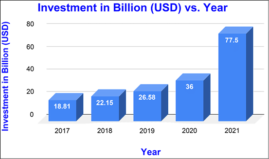
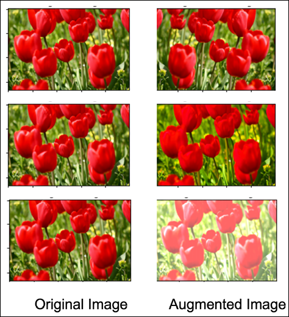
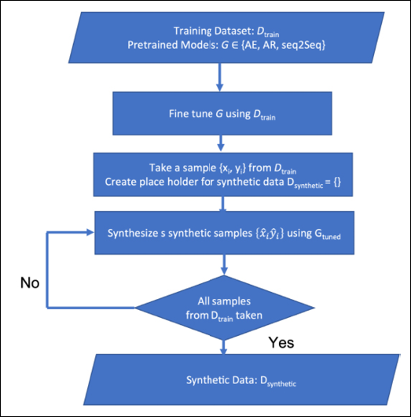

# 十八、机器学习最佳实践

机器学习不仅仅是建立和训练模型。到目前为止，在本书中，我们专注于不同的深度学习算法，并介绍了最新的算法，它们的功能和它们的局限性。在这一章中，我们改变我们的关注点，从 ML/DL 算法到可以让我们成为更好的机器学习工程师和科学家的实践。

该章将包括:

*   人工智能/人工智能最佳实践的需求
*   数据最佳实践
*   示范最佳实践

# 对最佳实践的需求

今天，深度学习算法不仅是一个活跃的研究领域，也是许多商业系统和产品的重要组成部分。*图 18.1* 显示了最近五年对人工智能初创企业的投资。你可以看到人们对人工智能初创企业的兴趣正在不断增加。从医疗保健到虚拟助理，从房间清洁机器人到自动驾驶汽车，今天的人工智能是最近许多重要技术进步的驱动力。人工智能决定一个人是否应该被雇用，或者应该被给予贷款。人工智能正在创建你在社交媒体上看到的提要。有**自然语言处理** ( **NLP** )机器人生成内容、图像、人脸——任何你能想到的东西——有人试图将人工智能融入其中。由于大多数团队由跨领域工作的多个团队成员组成，因此构建最佳实践非常重要。最佳实践应该是什么？这个问题没有确定的答案，因为 ML 中的最佳实践取决于特定的问题领域和数据集。

然而，在本章中，我们将提供一些机器学习最佳实践的通用提示:



图 18.1:过去五年(2017-2022 年)对人工智能初创企业的投资

以下是机器学习最佳实践非常重要的几个原因:

*   它可以确保模型是以既有效又高效的方式构建的。
*   这有助于避免过度拟合等问题，过度拟合会导致对不可见数据的性能下降。
*   它可以确保模型是可解释的，并且可以很容易地向非技术受众解释。
*   它有助于提高机器学习研究的可重复性。

在接下来的章节中，你将了解到一些由 **FAANG** ( **脸书**，**亚马逊**，**苹果**，**网飞**，**谷歌**)公司和人工智能影响者倡导的最佳实践。遵循这个建议可以帮助你避免常见的错误，这些错误会导致不准确或差的结果。这些最佳实践将有助于确保您的人工智能服务准确可靠。最后，最佳实践可以帮助你优化人工智能服务的性能和效率。

# 数据最佳实践

在当今世界，数据变得越来越重要。不仅仅是人工智能领域的人，还有各种世界领导人都将数据称为“新黄金”或“新石油”**——基本上是推动全球经济的商品。数据有助于决策过程、管理交通、处理供应链问题、支持医疗保健等等。从数据中获得的洞察力可以帮助企业提高效率和业绩。**

 **最重要的是，数据可以用来创造新知识。例如，在商业中，数据可以用来识别新的趋势。在医学上，数据可以用来揭示疾病之间的新关系，并开发新的治疗方法。然而，我们的模型只和它们被训练的数据一样好。因此，数据的重要性在未来可能会继续增加。随着数据变得越来越容易访问和使用，它将在各个领域变得越来越重要。现在让我们看看一些常见的瓶颈以及处理它们的最佳方法。

## 特征选择

当我们开始任何人工智能/人工智能问题时，第一步是提出一个假设:有哪些输入特征可以帮助我们分类或预测我们的输出？选择正确的功能对于任何机器学习模型都是必不可少的，但很难知道选择哪些功能。如果在模型中包含太多不相关的特征，结果将会不准确。如果包含的特征太少，模型可能无法从数据中学习。因此，特征选择是机器学习中的一个关键步骤，可以帮助您降低噪声并提高模型的准确性:

*   通常，在使用任何特征工程之前，应该从直接观察和报告的特征开始，而不是从学习的特征开始。学习到的特征是由外部系统(如聚类算法)或通过采用深度模型本身生成的特征。简化可以帮助你获得稳定的基线表现，之后你可以尝试更深奥的策略。
*   删除不使用的功能。未使用的功能会产生技术债务。它们使您的代码更难阅读和维护，还会导致意想不到的错误和安全漏洞。当然，很难跟踪哪些功能正在使用，哪些没有使用。但是，不要随意丢弃特性；仔细执行数据分析和探索——了解特征。一个好的方法是给每个特性分配一个所有者。特性所有者将负责维护特性并记录其基本原理，以便知识可以在团队间共享。这也意味着每当一个特性的所有者离开团队时，所有权就会转移给其他成员。通过花时间去理解和删除不用的特性，你可以保持你的代码干净，避免积累技术债务。
*   通常，我们认为更多的功能意味着更好的模型，但事实远非如此。与其使用数百万你不了解的特性，不如使用特定的特性；您可以使用正则化的方法来移除应用于太少示例的特征。
*   您也可以组合和修改特征以创建新特征。有多种方式可以组合和修改。例如，您可以将连续值要素离散化为许多离散要素。还可以通过交叉(相乘)两个或多个现有要素来创建合成的新要素。例如，如果您有特征“身高”和“体重”，您可以通过组合这两个特征来创建一个名为“身体质量指数”的新特征。特征交叉可以提供超出那些特征单独所能提供的预测能力。两个特征中的每一个都在一定程度上预测了期望的结果，当它们组合起来时，预测性可能更强。这是因为组合特征捕获了任一单独特征都不能捕获的信息。特征交叉是一种强大的工具，有助于提高预测模型的准确性。

## 特征和数据

当我们从学习数据科学转向解决实际问题时，一个问题是缺乏数据。尽管互联网、移动和物联网设备产生大量数据，但获得高质量的标签数据是一大障碍。注释的成本通常很高，因为它既耗时又需要专业知识。

因此，我们需要确保我们有足够的数据来训练模型。根据经验，模型可以学习的输入特征数量( *n* )大致与你拥有的数据量(*N*)(*N*<<*N*)成正比。在这种情况下，可以遵循以下几个技巧:

*   将模型学习扩展到数据的大小。例如，如果我们只有 1000 个标记样本，那么就使用高度人性化的特征。一个好的数字应该是 1000 个标记样本有十几个精选的特征。但是如果我们有数百万个例子，那么我们就有能力拥有十万个特征。假设我们有数十亿个数据样本，我们可以建立一个有数百万个特征的模型。
*   如果我们有太多的数据，我们不会随意丢弃它；而是可以使用**重要性权重抽样**([https://web . Stanford . edu/class/archive/cs/cs 224n/cs 224n . 1214/reports/final _ reports/report 247 . pdf](https://web.stanford.edu/class/archive/cs/cs224n/cs224n.1214/reports/final_reports/report247.pdf))。其思想是基于某种分布特征，为每个样本分配一个重要性权重，该分布特征捕捉与特定领域数据的相似性。
*   处理缺乏足够数据的另一种方法是使用数据扩充。最初由 H. S. Baird 在他的文章*文档图像分析* [7]中针对图像数据提出，已经证明这是通过使用简单的图像变换，如水平翻转、垂直翻转、旋转、平移等来增加图像数据的好方法。大多数深度学习框架都有数据生成器，你可以使用它们在旅途中执行这种增强，如图*图 18.2* 所示:



图 18.2:原始图像和增强图像

虽然增强图像数据在所有主要的深度学习框架中都很容易获得，但是增强文本数据和音频数据并不那么简单。接下来，我们将介绍一些可以用来扩充文本和语音数据的技术。

### 扩充文本数据

我们可以用一些简单的方法来扩充文本数据:

*   **同义词替换**:在这种情况下，从句子中随机选择单词，并使用 WordNet 将替换为它们的同义词。例如，如果我们有句子“这本书**侧重于**使用 TensorFlow 和 Keras 进行深度学习，同时面向**新手**和专家”，我们可以选择粗体的两个词进行同义词替换，从而得到这句话:“这本书**侧重于使用 TensorFlow 和 Keras 进行深度学习，同时面向**初学者**和专家。”**
*   **反向翻译**:方法是森里奇等人在 2016 年提出的。基本思路是把一个句子翻译成另一种语言，然后再翻译回原文。我们可以使用语言翻译 API 或者像`googletrans`这样的 Python 模块。下面的代码片段将一个句子从英语翻译成德语，然后再翻译回来。为了让代码工作，我们需要安装`googletrans`:

```py
from googletrans import Translator

translator = Translator()

text = 'I am going to the market for a walk'

translated = translator.translate(text, src='en', dest='de')

synthetic_text = translator.translate(translated.text, src='de', dest='en')

print(f'text: {text}\nTranslated: {translated.text}\nSynthetic Text: {synthetic_text.text}') 
```

现在我们有两个句子“我要去市场”和“我走到市场”属于同一类。*图 18.3* 详细说明了使用反向翻译进行数据扩充的过程:


图 18.3:使用反向翻译的数据扩充

在综述论文*NLP 数据增强方法的调查*中，作者提供了许多其他增强方法的广泛列表。本文对自然语言处理中的数据扩充进行了深入的分析。

近年来，随着大型语言模型和转换器的成功，人们已经尝试使用它们来完成数据扩充的任务。在亚马逊 Alexa AI 团队题为*使用预训练的变压器进行数据增强*的论文中，作者展示了他们如何通过每类仅使用 10 个训练样本，就可以使用预训练的变压器生成合成数据。

他们试验了三种不同的预训练模型:自编码器 LM BERT、自回归 LM GPT2 和预训练`seq2seq`模型 Bart。*图 18.4* 显示了他们使用预训练模型生成合成数据的算法:



图 18.4:使用预训练转换器生成合成文本数据的算法

语音数据也可以使用以下技术进行扩充:

*   **时间扭曲**:这里选择一个随机点，数据向左或向右扭曲一个距离 *w* 。距离 *w* 不是固定的，而是从均匀分布[0， *W* 中选择。
*   **频率屏蔽**:这里一个范围的频道【f [0] ，f [0] +f】被屏蔽；频率*F*0 和 *f* 的选择取决于频率通道的数量和频率屏蔽参数 *F* 。
*   **时间屏蔽**:在这种情况下，连续的时间步长被屏蔽。

这些技术是由谷歌团队在 2019 年在其论文 *SpecAugment:一种用于自动语音识别的简单数据增强方法*中提出的。

# 示范最佳实践

模型准确性和性能对于任何机器学习和深度学习项目的成功都至关重要。如果一个模型不够精确，相关的业务用例将不会成功。因此，关注模型的准确性和性能以增加成功的机会是很重要的。有许多因素会影响模型的准确性和性能，因此了解所有这些因素对于优化准确性和性能非常重要。下面我们列出了一些模型最佳实践，它们可以帮助我们最好地利用我们的模型开发工作流程。

## 基线模型

基线模型是机器学习中用来评估其他模型的工具。它通常是最简单的可能模型，并作为更复杂的模型的比较点。目标是看看更复杂的模型实际上是否比基线模型提供了任何改进。如果不是，那么使用更复杂的模型是没有意义的。基线模型也可以用来帮助检测数据泄漏。当来自测试集的信息渗入训练集时，就会发生数据泄漏，从而导致过度拟合。通过将基线模型的性能与其他模型进行比较，可以检测出何时发生了数据泄漏。基线模型是机器学习的重要组成部分，并为更复杂模型的性能提供了有价值的视角。因此，每当我们开始处理一个新问题时，最好想一个最简单的模型来拟合数据并获得基线。

一旦我们建立了一个令人满意的基线模型，我们需要仔细地检查它。

回顾关于数据集的初始假设和我们初始算法的选择。例如，也许当我们第一次开始处理数据时，我们假设我们正在观察的模式可以用**高斯混合模型** ( **GMM** )来最好地解释。然而，在进一步的探索之后，我们可能会发现 GMM 并不能够准确地捕捉数据的底层结构。在这种情况下，我们需要重新考虑我们的策略。最终，我们对算法的选择是由数据本身的性质决定的。

确认模型是过拟合还是欠拟合。如果模型过度拟合，尝试更多的数据，降低模型复杂性，增加批量大小，或包括正则化方法，如**脊**、**套索**或**脱落**。如果模型不适合，尝试增加模型的复杂性，添加更多的功能，并为更多的时代进行训练。

根据模型的性能指标分析模型。例如，如果我们已经建立了一个分类模型，按照业务用例分析它的混淆度量和它的精确度/召回率。识别哪个类模型预测不正确；这应该会让我们深入了解这些类的数据。

执行超参数调整以获得强基线模型。我们建立一个强大的基线模型是很重要的，因为它可以作为未来模型改进的基准。基线应该包含所有的业务和技术需求，并测试数据工程和模型部署管道。通过花时间制定一个强大的基线，我们可以确保我们的机器学习项目从一开始就处于正确的轨道上。此外，当我们迭代我们的模型时，一个好的基线可以帮助我们识别潜在的改进区域。因此，投入时间和精力创建一个健壮的基线模型是非常值得的。

## 预训练模型、模型 API 和 AutoML

当我们想要推出一个商业产品时，时间和精力往往是两个最重要的因素。当处理一个新项目时，从头开始训练一个基线模型是非常耗时的。然而，现在有很多资源可以让我们找到预训练模型，从而节省我们大量的时间和精力。其中包括 GitHub、Kaggle 以及来自亚马逊、谷歌、OpenAI 和微软等公司的各种基于云的 API。

此外，还有专门的初创公司，如 Scale AI 和 Hugging Face，它们为各种不同的任务提供预训练的模型。通过利用这些资源，我们可以快速启动并运行我们的机器学习项目，而不必花费大量时间从头开始训练模型。因此，如果我们的问题是一个标准的分类或回归问题，或者我们有可用的结构化表格数据，我们可以利用预先训练的模型，或者亚马逊、谷歌和微软等公司提供的 API。使用这些方法可以节省我们宝贵的时间和精力，并让我们快速开始我们的项目。

另一个正在发展的解决方案是使用 **AutoML** ，或**自动机器学习**。使用 AutoML，我们可以创建更加适合公司特定需求的定制模型。如果您在组织知识和资源方面受到限制，我们仍然可以通过利用 AutoML 来大规模利用机器学习。该解决方案已经帮助大大小小的公司以更高效、更准确的方式实现了他们的业务目标。将来，随着人们对 AutoML 功能认识的提高，它很可能会变得越来越流行。

## 模型评估和验证

在这一部分，我们将讨论评估我们模型的方法。这里我们不讨论传统的机器学习指标，而是关注最终用户的体验:

*   用户体验技巧:当我们的模型接近生产时，我们应该进一步测试它。在我们发布产品之前，众包是从我们的观众那里获得反馈的一个很好的方式。我们可以付钱给人们，或者在真实的用户身上进行现场实验，以便让他们给出关于什么最有效的宝贵意见。我们可以在流程的早期创建用户角色，也就是说，创建假设的用户——例如，如果我们是一个年龄在 19-40 岁之间的团队，并且我们建立了一个推荐系统，我们可以为 60 多岁的人创建一个用户角色。之后，我们可以通过引入真实的人并观察他们对我们网站的反应来进行可用性测试。
*   **使用模型增量**:当我们发布一款新模型时，衡量其成功的最好方法之一就是计算它与生产中的模型有多大的不同。例如，如果我们的排名算法给出了比预期更好的结果，但没有达到人们会注意或关心的程度，那么我们应该在整个系统的样本上运行这两个模型，权重由职位排名给出。如果我们发现两个查询之间的差异非常小，那么我们知道变化会很小。但是，如果差异较大，就要保证变化是好的。在这种情况下，我们应该探索对称差异高的查询；这将使你能够定性地理解变化。
*   **功利力量比预测力量**更重要:我们可能有一个具有最高准确度和最佳预测的模型。但这并不是结束；问题是我们如何处理这个预测。例如，如果我们构建一个模型来对文档进行语义排序，那么最终排序的质量比预测更重要。让我们考虑另一个例子:假设你建立了一个垃圾邮件过滤器，我们的模型预测给定消息是垃圾邮件还是 ham 的概率；我们跟随它，切断什么文本被阻止。在这种情况下，我们允许什么通过最重要。因此，我们有可能得到一个日志丢失更好的模型，但总体性能仍然没有改善。在这种情况下，我们应该寻找其他的特性来提高性能。
*   **在测量误差中寻找模式**:在训练样本中，检查模型不能正确预测的样本。探索我们尚未考虑的功能；它们能改善对错误样本的预测吗？不要非常具体地描述特征；我们可以添加一打，然后让模型决定可以用它们做什么。为了可视化分类问题中的错误，我们可以使用混淆矩阵，并且在回归任务中，我们可以寻找损失高的情况。
*   **测试未知数据**:为了测量我们模型的性能，在模型被训练后收集的数据上测试它；通过这种方式，我们可以对生产中的性能进行评估。这可能会导致性能降低，但降低幅度不应太大。

性能监控是模型开发的关键部分。训练和生产数据之间的性能可能会有很大差异，这意味着我们必须持续监控部署模型的行为，以确保它们不会在我们的系统中做任何意想不到的事情。我们应该建立一个监控管道，持续监控性能、质量和偏差度量、公平性度量、模型解释和用户交互。

## 模型改进

一旦建立并部署了一个可靠的模型，这项工作还远远没有结束。由于各种原因，如数据漂移或概念漂移，可能需要更改模型。数据漂移发生在数据的分布随时间变化时，概念漂移发生在因变量(标记变量)的属性随时间变化时。为了解释这些变化，模型必须根据新数据重新训练，并相应地更新。这一过程可能既耗时又昂贵，但对于维护高性能的机器学习模型来说是必不可少的。然而，在我们开始模型改进之前，重要的是要确定和衡量低性能的原因—**“首先衡量，其次优化”**:

**数据漂移**:机器学习模型的性能可以根据它何时被训练和何时被部署而变化。这是因为训练和服务期间使用的数据可能不同。为了避免这个问题，在部署时记录特性是很重要的。这可以让我们监控服务数据(生产中的数据)的变化。一旦数据漂移(训练数据和服务数据之间的差异)超过阈值，我们应该用新数据重新训练模型。这将确保模型在将要部署的相同数据上进行训练，从而提高其性能。

**训练-服务偏斜**:训练-服务偏斜可能是机器学习模型的一个主要问题。如果模型的训练方式和在现实世界中的使用方式之间存在差异，这可能会导致性能不佳和不准确。训练-服务偏差有三个主要原因:训练和服务中使用的数据之间的差异，训练和服务之间的数据变化，以及模型和算法之间的反馈循环。例如，如果我们已经建立了一个推荐电影的推荐系统，我们可以在以后根据用户从推荐列表中看到的电影重新训练推荐者。前两个原因可以通过仔细的数据管理来解决，而第三个原因在设计机器学习模型时需要特别注意。

即使在充分的实验之后，我们也可能发现，利用当前的特征，我们不能进一步提高模型性能。然而，要想继续经营下去，持续增长是必要的。因此，当我们发现我们的模型性能已经达到稳定状态时，就应该寻找新的改进来源，而不是使用现有的特性。

软件开发过程从未真正“完成”甚至在一个产品发布后，总会有新的功能被添加或者现有的功能被改进。机器学习模型也是如此。即使在一个模型“完成”并部署到生产中之后，总会有新的数据可用于训练更好的模型。随着数据随着时间的推移而变化，该模型将需要根据新数据进行重新训练，以保持准确性。因此，将机器学习模型视为处于不断变化的状态是很重要的。直到你停止努力，它才真正“完成”。

当我们构建模型时，重要的是要考虑添加或删除功能有多容易。我们可以轻松地创建管道的新副本并验证其正确性吗？有可能让两个或三个模型副本并行运行吗？这些都是构建模型时需要考虑的重要因素。通过提前考虑这些事情，我们可以节省大量的时间和精力。

# 摘要

在这一章中，我们集中讨论了从模型中获得最佳性能的策略和规则。这里的列表并不详尽，由于人工智能技术仍在不断成熟，在未来几年我们可能会看到更多的规则和启发出现。尽管如此，如果你遵循这一章的建议，你将能够从人工智能模型的炼金术本质转向更可靠、更健壮、更可重复的行为。

在下一章中，我们将探索 TensorFlow 生态系统，并了解如何将本书涵盖的所有内容集成到实际的商业应用中。

# 参考

1.  Soni，n .，Sharma，E. K .，Singh，n .和 Kapoor，A. (2020 年)。*商业中的人工智能:从研究和创新到市场部署*。Procedia 计算机科学， *167* ，2200–2210。
2.  冯，S. Y .，甘加尔，v .，魏，j .，钱达尔，s .，沃索基，s .，三田村，t .，和霍维，E. (2021)。*自然语言处理的数据扩充方法综述*。arXiv 预印本 arXiv:2105.03075。
3.  Sennrich，r .，Haddow，b .，和 Birch，A. (2016 年)。*用单语数据改进神经机器翻译模型*。《计算语言学协会第 54 届年会论文集》(第 1 卷:长篇论文)，第 86-96 页，柏林，德国。计算语言学协会。
4.  Kumar，v .，Choudhary，a .，和 Cho，E. (2020 年)。*使用预先训练的变压器模型进行数据扩充*。预印本 arXiv:2003.02245。
5.  park d . s，Chan w，Zhang y，Chiu c . c .，Zoph，b .，Cubuk，E. D .，和 Le，Q. V. (2019)。 *SpecAugment:一种用于自动语音识别的简单数据扩充方法*。arXiv 预印本 arXiv:1904.08779
6.  机器学习的规则:ML 工程的最佳实践。马丁·辛克维齐。[https://developers . Google . com/machine-learning/guides/rules-of-ml](https://developers.google.com/machine-learning/guides/rules-of-ml)
7.  贝尔德，H. S. (1995)。*文档图像分析*。章节:文档图像缺陷模型，第 315-325 页。IEEE 计算机学会出版社，美国加州洛斯阿拉米斯。

# 加入我们书的不和谐空间

加入我们的 Discord 社区，结识志同道合的朋友，与 2000 多名会员一起学习:[https://packt.link/keras](https://packt.link/keras)

**