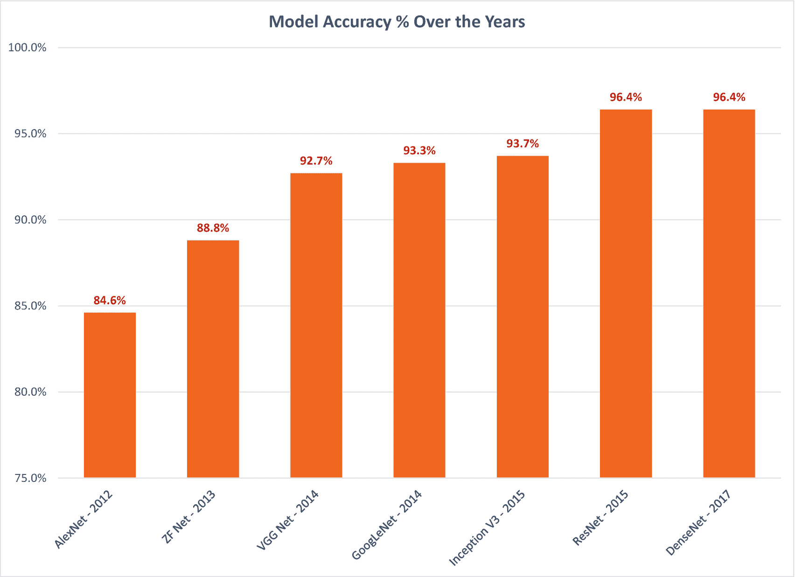

# 1.什么是深度学习？

我们生活在人工智能(AI)时代。

我们可能生来探索地球有点晚，生来探索宇宙又太早。然而，我们可能正好赶上见证人工智能的崛起。

我们可以帮助建设这样的未来。

人工智能领域的创新每天都在发生，从智能消费设备到人工智能个人助理，再到自动驾驶汽车。科技巨头——谷歌、脸书、亚马逊、微软、苹果、IBM 以及 DeepMind 和 OpenAI 等人工智能专业组织——努力在各个领域建立人工智能技术，以解决问题并提高生活质量。

深度学习是 AI 的最新迭代。虽然这个概念本身已经存在了很多年，但深度学习在过去几年中变得流行起来，因为它继续实现了显著的突破。十年前的科幻小说现在正在成为现实。

得益于深度学习，人工智能技术正日益成为我们家庭的一部分。今天，我们的大多数消费设备和服务都内置了某种人工智能。也许是你加入革命的时候了。你也可以开始为这个人工智能驱动做贡献。

但首先，我们需要确保我们理解什么是深度学习。

## 定义深度学习

无论你是来自传统的人工智能背景，还是刚刚进入人工智能领域，你可能会想知道术语“人工智能”、“机器学习”和“深度学习”是什么意思，以及围绕它的其他术语(图 [1-1](#Fig1) )。

图 1-1

深度学习的困惑

随着术语“深度学习”成为一个流行词，也成为一些消费技术的一部分，可能很难弄清楚这些术语的含义以及它们之间的关系。您可能试图弄清楚这三个术语是否可以互换使用，以及它们各自的来源。

当我们开始深度学习之旅时，这些是我们所有人都会遇到的常见问题。让我们看看如何回答这些问题。

*深度学习*是机器学习的子集，处理分层特征学习。

*机器学习*是一种人工智能方法，旨在为机器提供学习能力，而无需显式编程。

至于人工智能，大概要从头说起。这一切都始于*智能机器*的想法。

## 智能机器

智能机器的概念是指机器可以被制造成具有与人类同等(或更高)的智能，赋予它们执行需要人类智能的任务的能力。

人类自古以来就痴迷于这种思想，关于它的文字记录可以追溯到 16 世纪(来自拉蒙·伊勒尔(Ramon Llull，1232–1315)的作品)。到了 17 世纪，Gottfried Leibniz 用他的*微积分推理器*扩展了这个想法——一个理论上的通用逻辑计算框架。到了十九世纪，随着乔治·布尔的*命题逻辑*和戈特洛布·弗雷格的*谓词演算*等概念的引入，*形式推理*的概念已经开始。

然而，在 1956 年的达特茅斯会议之前，人工智能没有正式的研究概念。

## 人工智能

1956 年 6 月，该领域的许多专家——科学家和数学家——聚集在新罕布什尔州的达特茅斯学院。这个名为“达特茅斯人工智能夏季研究项目”的会议是人工智能正式研究领域的起点。由艾伦·纽厄尔、司马贺和克里夫·肖开发的逻辑理论家，现在被认为是第一个人工智能程序，也在达特茅斯会议上提出。逻辑理论家的目的是模仿人类解决逻辑问题的方式，并且能够证明《数学原理》中前 52 个定理中的 38 个(这是一本由阿尔弗雷德·诺斯·怀特海和伯特兰·罗素写的关于数学原理的书)。

到了 20 世纪 60 年代，人工智能研究如火如荼。它得到了美国国防部的资助，越来越多的人工智能研究实验室正在建立，研究人员很乐观。司马贺曾在 1965 年预言“二十年内，机器将能做任何人能做的工作。” [1](#Fn1)

但是人工智能并没有进步得那么快。

大约在 20 世纪 90 年代末和 21 世纪初，研究人员在他们的人工智能方法中发现了一个问题:为了人工创造一个具有智能的机器，*人们需要首先理解智能是如何工作的*。

即使在今天，我们对所谓的“智力”也没有一个完整的定义。

为了解决这个问题，研究人员决定从头开始工作:他们没有试图建立智能，而是研究建立一个可以自己培养智能的系统。

这个想法创造了人工智能的新子领域，称为*机器* *学习*。

## 机器学习

机器学习是人工智能的一个子集，旨在为机器提供无需显式编程即可学习的能力。这个想法是，这种机器(或计算机程序)一旦建成，当它们暴露于新数据时，将能够进化和适应。

机器学习背后的主要思想是学习者从经验中归纳的能力。一旦给定了一组训练样本，学习者(或程序)必须能够在这些样本的基础上建立一个通用模型，这将允许它以足够的准确度来决定新的案例。

基于这种方法，机器学习系统有三种学习方法:

*   **监督学习:**系统被给予一组标记的案例(训练集)，基于此，它被要求创建一个可以作用于看不见的案例的一般化模型。

*   **无监督学习:**系统被给定一组未标记的案例，并被要求在其中找到一个模式。这是发现隐藏模式的理想方法。

*   **强化学习:**系统被要求采取任何行动，并根据该行动在给定情况下的适当程度给予奖励或惩罚。随着时间的推移，系统必须了解在给定的情况下，哪种行为能产生最大的回报。

有了这些技术，机器学习领域蓬勃发展。他们在计算机视觉和文本分析领域尤其成功。多年来，已经引入了许多模型作为实现机器学习技术的手段，例如人工神经网络(受大脑神经元工作方式启发的模型)、决策树(使用树状结构对决策和结果进行建模的模型)、回归模型(使用统计方法映射输入和输出变量的模型)等等。

大约在 2010 年，发生了一些影响机器学习研究的事情:

*   计算能力变得更加可用，评估更复杂的模型变得更加容易。

*   数据处理和存储变得更加便宜。更多的数据可供消费。

*   我们对自然大脑如何工作的理解增加了，允许我们围绕它们建立新的机器学习算法。

这些突破将我们推进了一个新的机器学习领域，称为深度学习。

## 深度学习

深度学习是机器学习的一个子集，专注于一个算法领域，该领域受到我们对大脑如何获取知识的理解的启发。

也被称为*深度结构化学习*或*分层学习*。

深度学习建立在人工神经网络的思想基础上，并将其放大，以便能够通过以特定方式深化网络来消耗大量数据。通过更深的网络，深度学习模型能够从原始数据中提取特征，并在每一层中一点一点地“学习”这些特征，建立起更高层次的数据知识。这种技术被称为*分层* *特征* *学习*，它允许这样的系统在最少的人工干预下，通过多层次的抽象自动学习复杂的特征。

以下是深度学习的一些定义，来自该领域的一些开创性工作:

*机器学习中的一个子领域，基于学习多级表示的算法来模拟数据之间的复杂关系。因此，较高级别的特性和概念是根据较低级别的特性和概念定义的，这样的特性层次结构被称为深度架构*。

— *深度学习:方法与应用* [2](#Fn2)

概念的层次结构允许计算机通过用简单的概念构建复杂的概念来学习它们。如果我们画一个图表来显示这些概念是如何建立在彼此之上的，那么这个图表是很深的，有许多层。出于这个原因，我们把这种人工智能的方法称为深度学习。

——*深度学习* [3](#Fn3)

深度学习最显著的特征之一——也是使它非常流行和实用的特征之一——是它的扩展性很好；也就是说，给它的数据越多，它的性能就越好。与许多旧的机器学习算法不同，它们可以摄取的数据量有上限——通常被称为性能的*高原* *(图[1-2](#Fig2))——深度学习模型没有这样的限制(理论上)，它们可能能够超越人类能够理解的范围。这一点在现代基于深度学习的图像处理系统中表现得非常明显，这些系统能够超越人类。*

图 1-2

深度学习中缺乏性能平台

## 卷积神经网络

卷积神经网络(CNN)是深度学习的一个主要例子。他们受到了视觉皮层(大脑中处理视觉输入的区域)中神经元排列方式的启发。这里，并不是所有的神经元都与来自视野的所有输入相连。相反，视野是由相互部分重叠的神经元群(称为感受野)组成的。

CNN 以类似的方式工作。他们使用数学卷积算子在输入的重叠块中处理输入，这近似于感受野的工作方式(图 [1-3](#Fig3) )。

图 1-3

卷积神经网络

第一卷积层使用一组卷积滤波器从输入图像中识别一组低级特征。这些识别的低级特征然后被汇集(来自汇集层)并作为输入提供给下一个卷积层，该卷积层使用另一组卷积滤波器来从先前识别的低级特征中识别一组高级特征。对于几个层来说，这是连续的，其中每个卷积层使用来自前一层的输入来识别比前一层更高级别的特征。最后，将最后一个卷积层的输出传递给一组完全连接的层，以进行最终分类。

## 有多深？

一旦你掌握了深度学习的能力，通常会出现一个问题:如果我们说更深更复杂的模型赋予了深度学习模型超越甚至人类能力的能力，那么*机器学习模型应该有多深才能被认为是* *深度* *学习模型？*

事实证明，这个问题没有明确的答案。相反，我们需要做的是从不同的角度看待深度学习，以更好地理解它。让我们后退一步，看看深度学习模型是如何工作的——例如，CNN。

如前所述，CNN 的卷积滤波器试图首先识别较低级别的特征，并使用这些识别的特征通过多个步骤逐渐识别较高级别的特征。

这就是我们之前谈到的分层特征学习，它是理解深度学习以及它与传统机器学习算法的区别的关键(图 [1-4](#Fig4) )。

图 1-4

分层特征学习

深度学习模型(如 CNN)不会试图立刻理解整个问题；也就是说，它不像传统算法那样试图一次掌握输入的所有特征。它所关注的是输入，一点一点地，这样它就可以从它的底层模式/特性中派生出来。然后，它使用这些较低级别的特征，通过许多层，分层次地逐渐识别较高级别的特征。这使得深度学习模型能够通过从简单模式逐步建立复杂模式来学习复杂模式。这也允许深度学习模型更好地理解世界，它们不仅看到了功能，还看到了这些功能如何在每一层上构建的层次结构。

当然，必须分层次地学习特征意味着模型中必须有许多层。这意味着这样的模式将是“深度的”。

这让我们回到了最初的问题:深度模型并不是深度学习，而是为了实现分层学习，模型需要是深度的。深度是实现分层特征学习的副产品。

那么我们如何识别一个模型是不是深度学习模型呢？

简而言之，如果模型使用分层特征学习——首先识别较低级别的特征，然后在它们的基础上识别较高级别的特征(例如，通过使用卷积滤波器)——那么它就是深度学习模型。如果不是，那么无论你的模型有多少层，都不被认为是深度学习模型。这意味着，具有 100 个全连接层(并且只有全连接层)的神经网络不会是深度学习模型，但具有少量卷积层的网络会是。

## 深度学习只是 CNN 吗？

当我们谈论深度学习时，我们会大量谈论 CNN。你可能想知道深度学习是否只有 CNN。

答案是否定的。

其中，以下模型被认为是深度学习:

*   卷积神经网络

*   深层玻尔兹曼机

*   深度信念网络

*   堆叠自编码器

*   生成对抗网络

*   变形金刚(电影名)

我们更多的是拿 CNN 作为深度学习的例子，因为它们更容易理解。因为它们是基于生物视觉如何工作的，所以更容易想象和应用它们是如何基于视觉的认知工作流程的。

但我们应该记住，CNN 并不是深度学习的全貌。

## 为什么是计算机视觉？

纵观深度学习的历史和它最近的一些成果， [4](#Fn4) 你会注意到它被应用于处理计算机视觉的大部分项目。甚至 ImageNet 竞赛也注重视觉识别。

这是为什么呢？深度学习只对计算机视觉起作用吗？

不完全是。

视觉——理解视觉输入并赋予其意义——是人类特别擅长的事情。理解周围环境的能力被认为是智力的标志。因此，当谈到建造智能机器时，视觉是我们希望智能机器拥有的核心能力之一。这也很容易验证，因为我们可以很容易地将其与人类的能力进行比较。

因此，探索视觉能力已经成为深度学习研究的核心领域。

深度学习在视觉领域收集的成就可能也会影响我们如何接近其他领域。由于迁移学习的能力(我们将在后面的章节中讨论)，深度学习可以将从一个领域获得的知识应用到另一个领域。虽然这种能力通常用于将来自一个视觉模型的知识应用到另一个视觉模型，但是可以推测(并且有许多正在进行的研究)来自视觉输入训练的模型的知识如何应用在非视觉环境中。

## 这一切是如何组合在一起的？

回到我们最初的问题:*人工智能、机器学习和深度学习的领域是如何相互联系的？*

简单来说，机器学习是人工智能的一个子集(一种方法)，深度学习是机器学习的一个子集，都朝着创造智能机器的共同目标努力(图 [1-5](#Fig5) )。

图 1-5

人工智能、机器学习和深度学习是如何相互联系的

参见图 [1-6](#Fig6) 快速回顾深度学习、机器学习和人工智能这些年来是如何发展的。

图 1-6

深度学习的进化

随着其在 2010 年代初的启动，深度学习不断取得突破性的成果，在以前认为只有人类才能完成的任务中，如图像识别、语言处理和语音识别，其准确性在早期被认为是不可能的。图 [1-7](#Fig7) 中显示的是过去十年图像识别中几个值得注意的深度学习里程碑。

图 1-7

多年来深度学习模型的准确性

你可以在附录 1 中了解更多关于这些特定模型及其对深度学习的重要性。

随着深度学习所展示的能力和取得的成功，我们可能离人工智能的最终目标更近了一步:建造一台具有人类(或更高)水平智能的机器。

## 人工智能可能吗？

尽管人工智能已经取得了一切成就，但对于真正的人工智能(也称为人工通用智能)是否可能仍然存在一些怀疑。

这些怀疑的原因之一是由于对术语“人工智能”的误解这引起了人们对人工智能实现其目标的方式的怀疑。

“人工智能”一词是一个令人遗憾的错误术语，导致了许多误解。当 1956 年的达特茅斯会议将新的研究领域命名为人工智能时，他们对这个名称有着良好的意愿。但是，和往常一样，意图并没有得到保留，也不明显。

从字面上理解，常见的误解是人工智能旨在人工构建“智能”。然而，在现实中，“人工智能”一词过去是，而且一直是“人工”+“智能”，这意味着它是人工和智能的桥梁。人工智能的目标是观察和理解自然结构(人类或其他)中固有的“智能”行为，并试图将智能行为构建到人工结构中。这些人工构造可以是计算机程序、机器/机器人、算法或理论框架。

这个概念给我们带来了神经网络和遗传算法等模型。如果你仔细观察这些模型，就会发现它们都是在人工构造的基础上应用自然智能概念的修改版本。

人工智能的最终目标是——现在也是——建造一台具有人类或更高智能水平的机器。(注意，“机器”在这里是一个主观术语，可以指任何人工构造。)我们不想为它重新发明“智能”。我们只需要让自然智能的特征和概念适应我们构建的人工结构。

我们不会人工制造智慧。我们制造受自然启发的机器。

<aside aria-label="Footnotes" class="FootnoteSection" epub:type="footnotes">Footnotes [1](#Fn1_source)

司马贺，*《人与管理的自动化的形态*》(纽约州:哈珀&罗，1965)，第 96 页。

  [2](#Fn2_source)

邓梨和董宇，*深度学习:方法和应用*(华盛顿州雷蒙德市:微软研究院，2014 年)，第 200 页。

  [3](#Fn3_source)

伊恩·古德费勒、约舒阿·本吉奥和亚伦·库维尔，*深度学习*(马萨诸塞州剑桥:麻省理工学院出版社，2016 年)，第 9 页封底文字。

  [4](#Fn4_source)

附录 1 更详细地介绍了这些年来深度学习的里程碑。

 </aside>