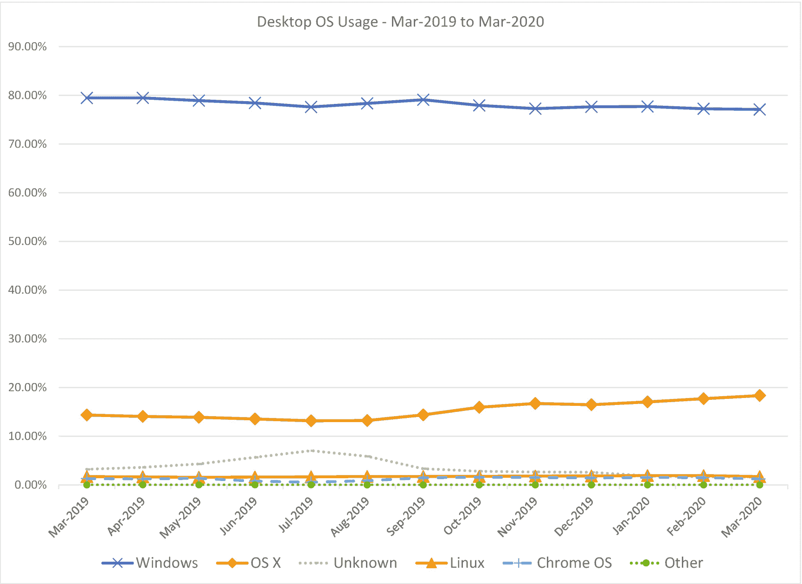
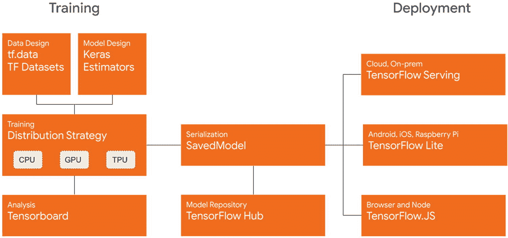
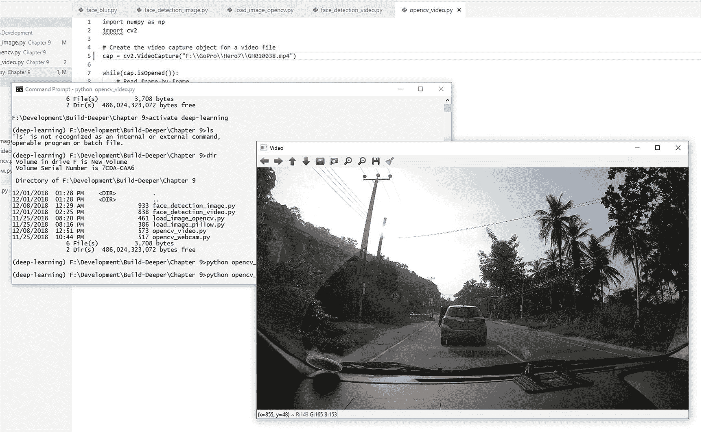

# 2.从哪里开始你的深度学习

欢迎来到深度学习、人工智能和计算机视觉的激动人心的世界。

通过上一章对深度学习及其功能的高度理解，你可能会渴望学习构建实用的深度学习和计算机视觉系统。

但是您是否不愿意为了开发而切换到 Linux 呢？您是否觉得自己对 Windows 更熟悉了，并希望可以在 Windows 上构建一切？

你不用再担心了。最新的深度学习和计算机视觉库已经成熟到几乎所有东西都可以在 Windows 上无缝工作。

我们将一步一步地研究在 Windows 上构建深度学习系统。

但是首先，让我们来回答你可能会有的一个问题。

## 能否在 Windows 上建立深度学习模型？

如果你已经做了很长时间的开发人员，你可能已经注意到 Windows 过去并不适合尖端开发，尤其是开源项目。

虽然深度学习和计算机视觉框架不一定局限于特定的操作系统，但在基于 Linux 或 Unix 的系统上开发的容易程度以及开发的速度意味着最新的功能和选项要么被推迟，要么在 Windows 上不可用。因此，有一段时间，如果你想制作任何严肃的机器学习、人工智能或计算机视觉模型，似乎你必须坚持使用 Linux 或基于 Unix 的系统。

但幸运的是，近年来 Windows 的情况有了很大的改善。

像 TensorFlow 和 Keras 这样的尖端深度学习框架，以及 OpenCV 和 Dlib 这样的计算机视觉库，现在都有了在 Windows 上原生工作的新版本。现在，驱动程序支持和 GPU 加速也可以在 Windows 上无缝工作。

事实上，在某些情况下，在 Windows 上比在 Linux 上更容易获得 GPU 加速，如 NVIDIA CUDA 支持。Windows 驱动对消费级显卡的支持已经领先很多年了。

### 使用 Windows 的优势

Windows 是世界上最流行的操作系统，超过 70%的台式电脑都在使用它的某个版本(见图 [2-1](#Fig1) )。 [1](#Fn1)

图 2-1

台式机上的 Windows 使用情况 1

在大多数情况下，除非你是一个专门的 DL/ML 研究人员，如果你已经有一台相当强大的通用 PC——或者正在考虑购买或构建一台——你倾向于在上面使用 Windows。您可能更熟悉使用 Windows 作为您家用电脑的操作系统，并且在您的电脑上使用其他仅在 Windows 上可用的软件。

因此，如果你正在考虑学习建立深度学习模型，当你不需要切换你的操作系统来这样做时，它会更容易。

如果您计划在您的模型上使用 GPU 加速(我们将在本章稍后介绍)，那么由于更好的驱动程序支持(尽管 Linux GPU 驱动程序支持现在正在改进)，让它们在 Windows 上工作要比其他操作系统容易得多。

如果你的电脑中确实有一个好的 GPU，那么你很可能会将它用于其他事情，如游戏或生产力，而不是将其用于深度学习。坚持使用 Windows，你可以两全其美。

### 使用 Windows 的限制

除了我们讨论的优点之外，使用 Windows 还有一些您应该知道的限制。

虽然大多数深度学习和计算机视觉的框架和库现在都可以在 Windows 上使用，但你可能会发现它们的最新版本通常比 Linux 版本延迟更多。

如果您尝试从源代码定制或构建库，您可能会发现在 Windows 上构建它们的要求有点严格。这是 Windows 的原生包延迟的主要原因。

因为对 Windows 的支持是最近才有的，所以您可能会发现社区对 Windows 问题的支持也比 Linux 少。这有望在未来得到改善，更多人开始在 Windows 上进行深度学习开发。

底线是，如果你不想学习深度学习，你不必为了学习深度学习而从 Windows 切换到 Linux 这样的操作系统。在本书中，我们将看到如何获得构建在 Windows 上工作的深度学习系统所需的一切。

对于开发者来说，Linux 是一个很棒的操作系统。如果你喜欢的话，你一定要试试在 Linux 上开发。深度学习和计算机视觉的严肃研究人员确实倾向于使用 Linux 系统进行开发，因为它提供了灵活性。但这并不是你必须开始学习的。

你可以在 Windows 上开始构建实用的深度学习系统。一旦你学会了如何操作，如果你愿意，你可以切换到任何操作系统来进行开发。

那么你需要从什么开始呢？

你需要选择一种编程语言来编写代码，并为该语言选择几个深度学习框架，加入一些实用程序库和工具来帮助你，然后开始编码。

这听起来是不是太过分了？

让我们一次看一个需求。

## 编程语言:Python

你可能想知道，为什么是 Python？是深度学习的唯一语言吗？肯定不是。

当你理解了这些概念，你就可以使用几乎任何语言来实现深度学习。但是一些语言已经建立了支持机器学习和深度学习任务的工具、库和框架。为了避免重新发明已经存在的元素，我们选择了一种有很多这种预先存在的支持的语言。

Python 是深度学习的最佳语言吗？这是一个棘手的问题。

当我们寻找最流行的机器学习语言时，有几种语言脱颖而出:Python、R、C++、C 和 MATLAB。每一种都有它的优点和缺点。

我们选择 Python 有几个原因，当你刚刚开始学习深度学习时，这些原因尤其重要。

对于深度学习的初学者来说——特别是对于有编程背景的人来说——用 Python 编写代码会更自然。您可以使用大多数熟悉的面向对象和函数式编程概念。虽然性能可能不如 C 或 C++，但 Python 仍然相当快。能够在多个 CPU 和 GPU 上运行代码也很有帮助。另一个优点是大多数 C 和 C++库也倾向于使用 Python 接口(例如 OpenCV、Dlib、Caffe)。与 R 和 MATLAB 相比，深度学习和机器学习库在 Python 中的可用性是相似的。但是考虑到库的成熟度，Python 库似乎更具优势。大多数最新的深度学习框架目前正在开发，主要针对 Python(例如 TensorFlow)。

使用 Python 的最大优势之一是它的可部署性。假设您构建了一个非常棒的深度学习程序，并且希望将其部署为 web 服务。使用 Python，这相当简单。用 R，MATLAB，或者 C/C++，要花相当大的力气。

考虑到所有这些好处，我们将使用 Python 进行深度学习实验。

## 包和环境管理:Anaconda

Anaconda 是 Python 和 R 语言的开源平台，用于机器学习、数据科学、大规模数据处理和科学计算。Anaconda 包含针对许多平台和架构的 Python 优化版本。

它不仅是 Python 发行版，还是 Python 的包、依赖项和环境管理器。通过 conda 包管理器，Anaconda 允许轻松创建虚拟隔离环境——使用 Python 二进制文件和包——进行实验。您可以根据需要创建多个 Python 版本的多个独立 Python 环境，以及它们自己独立的安装包。

Anaconda 还包含数百个预先构建和测试的包，用于机器学习、科学计算和数据处理，您可以通过 conda 包管理器直接安装这些包。它消除了寻找、构建、安装和依赖管理包和库的麻烦。

## 用于深度学习和计算机视觉的 Python 实用程序库

当使用 Python 和深度学习框架时(我们将很快看到)，拥有以下一组实用程序库将使许多任务变得更容易:

*   **NumPy:** 增加了对 Python 中处理大型多维数组的支持，以及一组可以跨数组应用的高级数学函数。

*   科学:NumPy 的科学表亲。SciPy 为 Python 添加了对数学优化、线性代数、积分和微分方程、插值、特殊函数、傅立叶变换和信号处理的支持。

*   **Pillow:** pillow 是 PIL (Python 图像库)的一个分支，为 Python 增加了图像处理能力。它为图像添加了广泛的文件格式支持，并具有高效的内部表示机制。

*   **Scikit-Image:** 为 Python 增加了一套更高级别的图像处理能力，如边缘检测、均衡、特征检测、分割等。

*   **h5py:** 为 Python 增加了对 HDF5 二进制数据格式的支持。HDF5 格式用于许多机器学习框架，因为它允许轻松存储和处理大型 TB 级数据，就像它们是内部数据数组一样。

*   Matplotlib: Matplotlib 是一个用于 Python 的复杂的 2D 和 3D 绘图和数据可视化库，允许您在各种平台上创建出版物质量的绘图和图形。

Note

这些只是让我们的代码工作所需的一些实用程序库。随着进展，我们将需要更多。但是拥有这些将有助于从一开始就使事情变得容易。

有了 Anaconda，我们也不需要一个接一个地安装它们。Anaconda 有一些实用函数可以快速安装这些以及更多的功能，我们将在下一章研究这些功能。

## 深度学习框架

### TensorFlow

TensorFlow 是目前世界上开发最活跃的机器学习库之一。其核心是一个符号数学库，专门用于神经网络等应用。

TensorFlow 是谷歌大脑团队的第二代机器学习库，由于其深度学习能力，最近一段时间获得了巨大的人气。2015 年 11 月首次发布，作为 dist faith(Google Brains 第一代机器学习库)的继任者，TensorFlow 最初只支持 Linux 上的 Python 和 C。从那以后，它增加了对 C++、Java、Go、JavaScript 的支持，以及对 Swift 的实验性支持。第三方支持也可用于 C#、Haskell、Julia、MATLAB、R、Scala、Rust、OCaml 和 Crystal。TensorFlow 现在可以在 Windows 和 Mac OS 上原生运行。

TensorFlow 能够在 CPU 或 GPU 上运行(使用 NVIDIA CUDA)。它还运行在谷歌专有的张量处理单元(TPUs)上——专门为机器学习构建的专用集成电路(ASIC)单元，为 TensorFlow 量身定制。TensorFlow 在运行推理时，也可以运行在手机这样的低端设备上——在 Android 和 iOS 上——以及 Raspberry Pi 设备上。

TensorFlow 使用有状态数据流图进行数值计算，其中图的节点表示数学运算，而图的边表示流经节点的数据。数据被表示为多维数组(张量)，因此被命名为“张量流”

2017 年 2 月，TensorFlow 发布 1.0 版本。

TensorFlow.js 1.0 于 2018 年 3 月发布。

TensorFlow 2.0 于 2019 年 1 月发布，2.1 版本于 2020 年 1 月发布，2.2 版本于 2020 年 5 月发布。

2.x 版本提供了许多新功能和改进，如渴望执行、多 GPU 支持、更紧密的 Keras 集成以及新的部署选项，如 TensorFlow 服务(图 [2-2](#Fig2) )。

图 2-2

TensorFlow 2.0 生态系统 [2](#Fn2)

### 硬

Keras 是 Python 的高级神经网络库，可以运行在 TensorFlow、CNTK(微软认知工具包)或 Theano 之上，对 MXNet 和 Deeplearning4j 的支持有限。Keras 的重点是通过用户友好、最小化、模块化和可扩展来实现代码的快速实验和原型制作。与直接使用后端库相比，Keras 给你一个更加干净和结构化的代码。

Keras 支持卷积网络和递归网络，以及两者的组合，并且可以在 CPU 和 GPU 上运行，这取决于所使用的后端的能力。

随着 2017 年 2 月 TensorFlow v1.0 的发布，TensorFlow 团队在 TensorFlow 库中添加了对 Keras 的专用支持。

随着 2019 年 1 月发布的 TensorFlow 2.0，Keras 库完全集成到 TensorFlow 库中，并通过 tf.keras 接口提供。multibackend Keras 实现也作为一个单独的分支来维护，但是现在主要的开发是在 tf.keras 上进行的。

### 其他框架

#### Scikit-Learn

Scikit-Learn(以前的 scikits.learn)是一个用于机器学习、数据挖掘和数据分析的库。它提供了分类、回归、聚类、降维、模型选择和预处理(特征提取和归一化)等功能。Scikit-Learn 拥有机器学习和数据处理实用算法的最佳集合之一。

#### 提亚诺

Theano 是蒙特利尔大学研究人员开发的一个机器学习和数值计算库。ano 背后的想法是允许开发人员编写符号表达式，然后动态编译以在各种架构上运行。Theano 的动态 C 代码生成功能允许程序高效运行，并利用不同的 CPU 或 GPU 架构。Theano 与 NumPy 紧密集成，使用 NumPy 来表示多维数据结构。

自 2007 年以来，Theano 一直在积极开发中，被认为是 TensorFlow 的良好替代方案，因为两者支持相似的功能。

## 计算机视觉库

为什么我们需要计算机视觉库？

正如我们在前一章讨论的那样，当使用深度学习时，你会遇到许多需要计算机视觉和图像处理的任务。

拥有这些库将使事情变得更容易。

### 开放计算机视觉

OpenCV(开源计算机视觉)是计算机视觉领域事实上的标准库。针对实时计算机视觉应用，OpenCV 加载了视觉和图像处理算法。它还内置了一些机器学习功能，以帮助构建计算机视觉应用程序。

OpenCV 最初由 Intel 开发，并于 2000 年 6 月发布，此后一直是开源的，现在在 BSD 许可下发布。OpenCV 的当前版本主要是用 C++编写的，但是仍然包含一些遗留的 C 组件和 C 接口。OpenCV 有 C、C++、Python、MATLAB 和 Java 的接口。它可以在 Windows、Linux、Mac OS、iOS 和 Android 上运行。

除了它的计算机视觉方面，OpenCV 还提供了优秀的图像处理和操作选项，如裁剪、调整大小、变换、颜色通道操作，以及各种图像类型的更多选项。这使得它对于许多使用图像的应用来说至关重要，例如使用 TensorFlow 等框架构建深度学习计算机视觉模型。OpenCV 还能够处理来自摄像机的视频流以及视频文件(图 [2-3](#Fig3) )。

图 2-3

OpenCV 处理视频文件

目前 OpenCV 有两个主要分支:v3.x 和 v4 . x。4 . x 分支包含最新的开发，并且更加优化。然而，3.x 版本可能与我们正在使用的其他库更加交叉兼容。

### 德列卜

Dlib 是一个用于 C++和 Python 的工具包，包含机器学习算法和工具，用于创建复杂的软件来解决现实世界的问题。Dlib 提供机器学习和深度学习的算法、多类分类和聚类模型、支持向量机、回归模型、矩阵操作和线性代数等领域的大量数值算法、图形模型推理算法以及计算机视觉和图像处理的实用算法。由于 C++实现支持大多数这些实现，它们被优化到可以在一些实时应用中使用的程度。

如果你对面部识别模型或面部情感处理感兴趣，那么 Dlib 是你应该尝试的一个库，因为 Dlib 有一些最优化的开箱即用的面部检测和面部标志检测模型(图 [2-4](#Fig4) )。

图 2-4

Dlib 人脸地标检测在行动

Dlib 还具有易于使用的功能，可以训练您自己的对象检测器、形状预测器和基于深度学习的图像语义分割。

## 优化器和加速器

构建和训练深度学习模型是计算复杂的任务，通常需要系统的大量处理能力和时间。优化器和加速器是帮助更快执行这些步骤的库和工具。大多数优化器和加速器工具的工作方式是让你的深度学习代码直接访问系统硬件的功能，允许它们利用硬件的全部潜力。

### NVIDIA CUDA 和 cuDNN

CUDA 是 NVIDIA 发明的并行计算平台和编程模型。通过利用 GPU 的能力，它能够大幅提高计算性能。cud nn——CUDA 深度神经网络库——是一个 GPU 加速的深度神经网络原语库。cuDNN 为标准例程提供了高度优化的实现，例如前向和后向卷积、池化、规范化和激活层。

将 CUDA 和 cuDNN 与 Theano 或 TensorFlow 一起使用可以极大地加速您的神经网络(花几个小时训练的网络可能只需要几分钟，但这将完全取决于您的模型)。唯一的要求是，你需要在你的系统中有一个支持 CUDA 的 NVIDIA GPU。

### OpenBLAS

OpenBLAS 是 BLAS(基本线性代数子程序)的开源实现，包含针对许多特定处理器类型的优化。诸如 Theano 之类的机器学习库可以通过利用 BLAS 库来加速某些例程。在 CPU 上运行带有 OpenBLAS 的模型时，您会看到明显的速度差异。然而，一些库，如 TensorFlow，有其内部优化器，不会看到 OpenBLAS 的任何改进。

## 硬件呢？

下一个你可能会想到的问题是:我需要什么样的硬件来做深度学习实验？

这是一个棘手的问题，因为我们需要考虑深度学习系统的两个阶段:*训练*和*推理*。

为了建立一个深度学习系统——或者任何机器学习系统——我们首先收集一些数据来训练系统。然后，我们建立一个深度学习模型，并通过训练数据集运行它。这是我们的模型“学习”数据特征的地方。一旦系统运行通过训练数据集，我们通常做一些验证步骤，以确保它已经被正确地训练。这些步骤被称为系统的*训练阶段*。

一旦系统完成训练阶段，就可以投入实际使用了。这是向系统呈现新的、真实世界的数据并利用它所学到的东西的地方。该系统将使用它所学习到的知识来推断关于它所呈现的新数据的事情。这被称为系统的*推理阶段*。

那么这和我们关于硬件的问题有什么关系呢？

培训阶段是两个阶段中最耗费资源的阶段。它需要高计算能力(CPU 或 GPU)来通过深度学习模型运行训练，并需要大量内存来保存训练所需的数据。所以对于训练深度学习模型，你将需要一台有足够计算能力和内存的机器。你的能力越强，你能训练的模型就越快越复杂。拥有 GPU 计算能力的显卡(如支持 NVIDIA CUDA 的 GPU)将是一个优势。

但请记住，即使是一台中等大小的 PC 也能够训练足够大的深度学习模型。您可以使用一些技术来处理内存有限的大型数据集。因此，不要让你的电脑规格阻碍你进行实验。我们在本书中讨论的所有代码都可以在标准 PC 或笔记本电脑上运行。

如果你觉得你的本地计算能力不足以进行你的实验，你可以很容易地使用云计算服务来训练你的深度学习模型。亚马逊网络服务提供了他们的 P3 GPU 计算实例，这些实例由英伟达特斯拉 GPU 提供支持(参见 AWS P3 实例 [3](#Fn3) )，这些实例应该能够处理海量的深度学习模型，或者谷歌 Colab 笔记本(参见谷歌合作实验室 [4](#Fn4) )。

推理阶段呢？

一个经过适当优化的深度学习模型将能够在一个有限的资源设备上运行推理，例如 Raspberry Pi 设备或智能手机。这通常取决于最终训练模型的大小。有深度学习架构——如 MobileNet 和 SqueezeNet，它们专门设计得更快、更小，因此可以适合移动设备。

## 推荐的电脑硬件配置

如果你正在考虑建造(或升级)或购买一台 PC，计划用于深度学习、机器学习或计算机视觉任务，这里有一些硬件建议。

Note

请注意，这些只是建议。本书中提到的库和框架可以在各种硬件配置上建立和运行。

如前所述，针对深度学习和计算机视觉的机器的主要要求是处理能力和内存。处理能力决定了所需计算的执行速度，并由您的 CPU 和 GPU 的速度决定。CPU 拥有的处理器内核数量也会对速度产生影响，因为它决定了操作的并行程度。内存决定了模型的复杂程度(因为需要将模型加载到内存中)以及一次可以将多少训练数据加载到内存中，从而间接影响训练速度。您能够训练的模型的复杂性将由机器拥有的 RAM 数量和 GPU 拥有的 VRAM 数量决定。

因此，理想的深度学习 PC 应该包括一个更快、更强大的 CPU，具有高内核数、大容量 RAM 和更快的 GPU，具有更高的 VRAM。

但是除非你有无限的钱花在绝对最高端的个人电脑上，否则你必须平衡这些需求。所以让我们看看我们实际上应该关注什么。

对于 CPU 来说，平衡处理能力和负担能力。像英特尔酷睿 i5 或 AMD 锐龙 5 这样的处理器至少就足够了。英特尔的酷睿-i7 或更高版本(第八代或更高版本)，AMD 的或锐龙 7 或更高版本(第二代或更高版本)， [6](#Fn6) 如果你能争取的话会是更好的选择。选择时，请考虑内核数量和单核性能。只有在您有超频经验的情况下，我们才建议您使用超频处理器(即倍频器解锁处理器，如英特尔 K 系列)，因为对于深度学习工作负载，我们更喜欢稳定性而不是原始速度。购买非超频处理器通常可以节省数百美元。

将处理器与像样的主板配对。你不需要一个花哨的游戏功能的主板。但是要找一个配电好的，有更多 VRM(电压调节器模块)的。在深度学习工作流中，CPU 和 GPU 都将最大限度地运行，因此更好的功率传输将使它们保持稳定。此外，还要考虑主板的可扩展性。拥有更多内存插槽将允许您以后添加更多内存，而更多 PCIe 16x 插槽将允许您以后选择多 GPU。但是，如果您刚刚开始，这些都是可选功能。

选择你能承受的最大内存容量。建议至少有 16GB 的内存。此外，请注意您的处理器和主板支持的建议 RAM 速度。如果您不熟悉高速 RAM 的工作原理，XMP 配置文件可能会带来不稳定性。

正如主板所提到的，稳定的电源对系统的稳定性至关重要。一些深度学习训练任务可能需要数小时，如果不是数天的话。因此，稳定的电源是必须的。选择电源时，请选择能效等级为“80+ Gold”或更高的电源。根据您选择的处理器和显卡，通常 500 瓦的电源就足够了。但是，如果您计划以后使用多个 GPU，您可能会选择更高的 GPU。

选择 GPU 可能有点棘手，因为它们通常是 PC 构建中最昂贵的组件。由于大多数深度学习和机器学习框架和库使用 NVIDIA CUDA 进行 GPU 处理，我们需要选择 NVIDIA 显卡。

Note

虽然 AMD 有一些优秀的显卡型号，但它们对 ML 任务的兼容性和支持仍然是实验性的。所以我们需要坚持使用 NVIDIA。

在考虑深度学习、机器学习或计算机视觉任务的显卡时，需要考虑的事情很少:

*   **CUDA 核心数:**核心数越高，越能并行处理。

*   **内存:**更高的内存允许您一次处理更多的训练数据。(如果您的数据集大于可用的 GPU 内存，您将不得不将其分块并执行增量学习。)

*   **时钟速度:**时钟速度越高，通常越好(如果你刚刚开始，不要过多考虑“基础时钟”和“增强时钟”之类的数字，因为其他几个因素也在影响卡的速度)。

*   **其他功能:**拥有额外的功能，如采用英伟达图灵微架构(GeForce RTX 20 系列或更新版本)的 GPU 中的张量核心，可能有助于提高模型的训练速度。但是您可能需要调整您的模型来利用这些特性。

基于这些因素，可以推荐以下显卡系列:

*   **GeForce 10 系列:**老一代，但性能还是相当不错的。如果你愿意买一个二手的 GPU，你也可以在二手市场上买到非常便宜的。推荐卡:GTX 1070Ti 以上(1070Ti，1080，1080Ti)。

*   **GeForce 16 系列:**与 20 系列相同的图灵架构，但没有张量内核和 RT 内核(光线跟踪)。推荐卡:GTX 1660 或更好的(1660，1660Ti)。

*   **GeForce 20 系列:**最新一代 NVIDIA GeForce(撰写本文时)。具有张量核和 RT 核的图灵体系结构。推荐卡:RTX 2060 超级或更好(2060 超级，2070 超级，2080 超级，2080 蒂，泰坦 RTX)。

*   **GeForce 30 系列:**现在说下一代 NVIDIA GeForce 的深度学习性能还为时尚早。但有了新的安培微体系结构，它有望超过前几代产品。

NVIDIA 显卡要么直接通过 NVIDIA 销售，即“创始人版”显卡，要么通过 NVIDIA 合作伙伴销售，如华硕、微星、EVGA、技嘉等。选择显卡时，最好从知名品牌中选择，因为这些品牌往往具有更好的构建质量、更好且稳定的功率传输和更好的冷却。深度学习任务会给你的 GPU 带来压力，并且比任何游戏或应用程序都更能承受这种压力。

除此之外，SSD 等更快的存储也有助于提高系统速度。

我们在这里讨论的只是建议；有可能用比这更老或更慢的硬件来建立深度学习模型。因此，如果您当前的机器不符合这些建议，请不要气馁。正如前面提到的，优化你的模型比你训练的硬件速度更重要。所以开始学习，开始建设。

<aside aria-label="Footnotes" class="FootnoteSection" epub:type="footnotes">Footnotes [1](#Fn1_source)

统计数据来自 GS Statcounter，“全球桌面操作系统市场份额，2019 年 9 月-2020 年 9 月”， [`https://gs.statcounter.com/os-market-share/desktop/worldwide`](https://gs.statcounter.com/os-market-share/desktop/worldwide) ，2020 年 4 月 19 日访问，维基百科，“桌面/笔记本电脑操作系统浏览统计”， [`https://en.wikipedia.org/wiki/Usage_share_of_operating_systems#Desktop_and_laptop_computers`](https://en.wikipedia.org/wiki/Usage_share_of_operating_systems%2523Desktop_and_laptop_computers) ，2020 年 4 月 17 日访问。

  [2](#Fn2_source)

图片来自[ [`https://blog.tensorflow.org/2019/09/tensorflow-20-is-now-available.html`](https://blog.tensorflow.org/2019/09/tensorflow-20-is-now-available.html) ]，“TensorFlow 2.0 现已上市！、“[2019 年 9 月 30 日]。

  [3](#Fn3_source)

AWS P3 实例来自[ [`https://aws.amazon.com/ec2/instance-types/p3/`](https://aws.amazon.com/ec2/instance-types/p3/) ]，《亚马逊 EC2 P3 实例》，[2020 年 4 月 20 日。]

  [4](#Fn4_source)

谷歌合作实验室，“欢迎来到合作实验室”， [`https://colab.research.google.com/`](https://colab.research.google.com/) ，【2020 年 4 月 20 日。]

  [5](#Fn5_source)

[ [`https://en.wikipedia.org/wiki/List_of_Intel_microprocessors`](https://en.wikipedia.org/wiki/List_of_Intel_microprocessors) ]“英特尔处理器列表”[2020 年 11 月 21 日]中的英特尔微处理器列表。

  [6](#Fn6_source)

AMD 锐龙从[ [`https://en.wikipedia.org/wiki/Ryzen`](https://en.wikipedia.org/wiki/Ryzen) ]，《锐龙》，[2020 年 11 月 20 日]。

 </aside>