# 四、构建你的第一个深度学习模型

我们现在准备开始构建我们的第一个深度学习模型。

但是我们从哪里开始呢？

要看到深度学习在发挥作用，让我们从深度学习系统极其擅长的东西开始:为图像分类而构建的卷积神经网络。为此，我们将构建通常被认为是深度学习的“hello world”程序——也就是说，编写一个对手写数字图像进行分类的程序。可以把它想象成一个简单的 OCR 系统。

但是我们不是需要大量的数据来训练系统吗？

好吧，幸运的是，由于手写数字分类是一个非常流行的问题(甚至在深度学习之前)，有一个公开可用的数据集叫做 *MNIST 数据集。*

## 什么是 MNIST 数据集？

早在 1995 年，美国国家标准和技术研究所(NIST)创建了一个手写字符数据集，用于机器学习和图像处理系统。虽然该数据集在很大程度上起作用，但由于训练集和验证集并非来自同一来源，并且由于对图像应用了一些预处理，因此对数据集在机器学习上下文中的有效性存在一些担忧。

1998 年，来自 NIST 数据集的数据被清理、规范化和重组以解决其问题，这创建了 MNIST 数据集(修改的国家标准和技术研究所数据集)。MNIST 包含 70，000 张 28x28 像素的图像，其中包括 60，000 张训练图像和 10，000 张测试/验证图像。

MNIST 数据集在其官方网站上公开提供。 <sup>[1](#Fn1)</sup> 然而，由于它的流行，许多机器学习和深度学习框架要么内置了它，要么提供实用方法来读取和读取数据集。Keras、Scikit-Learn 和 TensorFlow 都提供了这样的内置方法，使我们不必自己检索、读取和格式化数据。来自 MNIST 数据集的一些样本如图 [4-1](#Fig1) 所示。

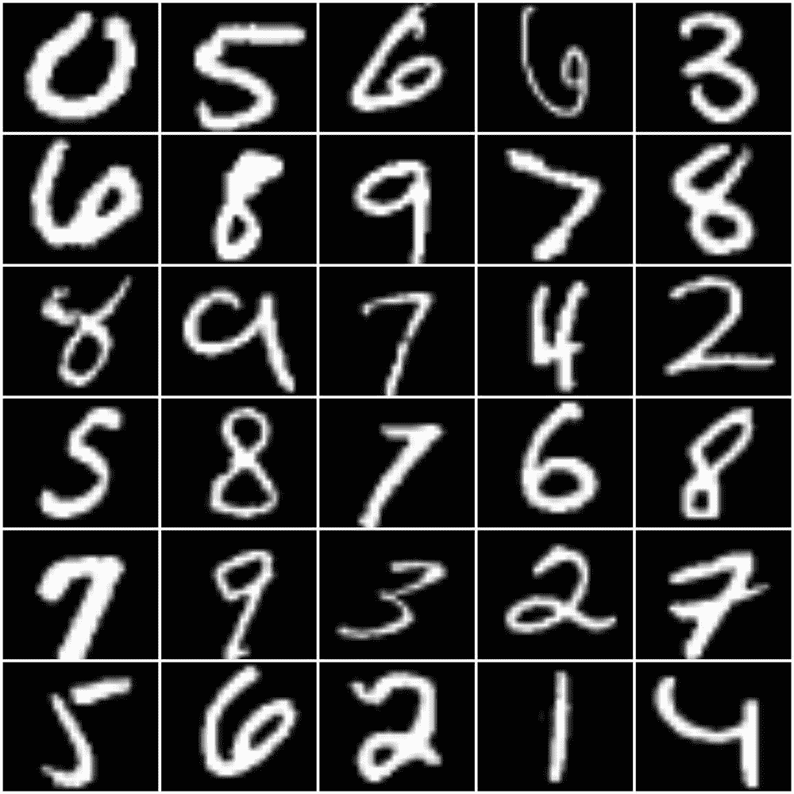

图 4-1

MNIST 数据集中的几个样本

手头有了数据集，我们现在需要决定要构建的卷积神经网络的架构。在深度学习中，由于我们可以构建模型的方式有很多种变化，因此通常更好的方法是从已知和经过验证的深度学习模型开始，然后对其进行调整。因此，对于我们的任务，我们将选择 **LeNet** 架构。

## LeNet 模型

LeNet 是由 Y. LeCun、L. Bottou、Y. Bengio 和 P. Haffner 提出的 7 层卷积神经网络(CNN)。1998 年，他们推出了 LeNet-5，这是该架构的第五次成功迭代。 <sup>[2](#Fn2)</sup> 它是专门为手写和印刷字符识别而设计的，所以完全符合我们的要求。

LeNet 使用两组卷积运算(图 [4-2](#Fig2) )。第一组使用 20 个卷积滤波器，并使用 ReLU(整流线性单元)作为非线性函数(1998 年论文中的原始 LeNet 架构使用 Tanh 而不是 ReLU 作为非线性函数)，随后是 Max-Pooling 层。第二组使用 50 个卷积滤波器，之后是 ReLU 和 Max-Pooling。这些的输出然后变平，并通过两个完全连接的(密集)层发送，以获得输出预测。

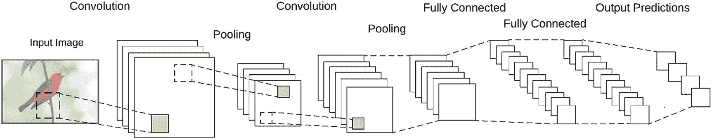

图 4-2

LeNet 架构

LeNet 架构简单，但为小型图像分类任务提供了出色的准确性。由于它很小，所以可以很容易地在 CPU 上进行训练。

## 让我们建立我们的第一个模型

我们现在有了数据，并为我们的第一个深度学习模型选择了一个架构。所以让我们开始建造吧。

我们将在之前创建的 Python 3.7 环境中使用 TensorFlow 2.1 和 TF . Keras(Keras 的 TensorFlow 版本)。

创建一个新的 Python 文件，将其命名为`lenet_mnist_tf_keras.py`。

在这个新文件中，我们将从导入必要的包开始:

```py
14:
15: # first, let's import tensorFlow
16: import tensorflow as tf
17: import numpy as np
18:
19: # import the mnist dataset
20: from tensorflow.keras.datasets import mnist
21:
22: # imports used to build the deep learning model
23: from tensorflow.keras.optimizers import SGD
24: from tensorflow.keras.models import Sequential
25: from tensorflow.keras.layers import Conv2D
26: from tensorflow.keras.layers import MaxPooling2D
27: from tensorflow.keras.layers import Activation
28: from tensorflow.keras.layers import Flatten
29: from tensorflow.keras.layers import Dense
30:
31: # import the keras util functions
32: import tensorflow.keras.utils as np_utils
33:
34: import argparse
35: import cv2
36: import matplotlib.pyplot as plt
37:

```

我们从导入 TensorFlow 开始，我们需要它来使用 tf.keras 函数。

`tensorflow.keras.datasets`包包含了几个常用的 Keras 内置数据集。我们从中导入 MNIST 数据集。

`tensorflow.keras.optimizers`、`tensorflow.keras.models`和`tensorflow.keras.layers`包含了我们构建深度学习模型所需的核心函数集。

这个包有几个实用函数，可以帮助我们构建模型。

我们导入`argparse`包来处理命令行参数，这允许我们训练和评估模型。

OpenCV(导入为`cv2`)用于显示评估训练模型的结果。

`matplotlib`包用于可视化/图形化模型的训练表现，因为看到模型的训练效果总是更好。

我们的数字分类系统将有两个阶段:训练和评估(对于这个应用，我们不是建立一个推理阶段)。培训阶段需要时间，并且通常是资源最密集的阶段。我们当然不希望每次运行我们的程序时都运行培训。因此，我们定义了几个命令行参数来触发这两个阶段:

```py
37:
38: # Setup the argument parser to parse out command line arguments
39: ap = argparse.ArgumentParser()
40: ap.add_argument("-t", "--train-model", type=int, default=-1,
41:                 help="(optional) Whether the model should be trained on the MNIST dataset. Defaults to no")
42: ap.add_argument("-s", "--save-trained", type=int, default=-1,
43:                 help="(optional) Whether the trained models weights should be saved." +
44:                 "Overwrites existing weights file with the same name. Use with caution. Defaults to no")
45: ap.add_argument("-w", "--weights", type=str, default="data/lenet_weights.hdf5",
46:                 help="(optional) Path to the weights file. Defaults to 'data/lenet_weights.hdf5'")
47: args = vars(ap.parse_args())
48:

```

我们定义了三个参数:

*   **-训练模型:**表示模型是否需要训练。将 1 传递给它来训练模型。

*   **-保存-训练:**当模型被训练时，我们可以选择将模型权重保存到一个文件中，以便以后加载。将 1 传递给该参数，以指示保存权重。

*   **- weights:** 默认情况下，我们会将模型权重保存到 data/lenet_weights.hdf5(由该参数的默认参数设置)。如果要覆盖该路径，可以向该参数传递一个自定义路径。

现在，我们加载并预处理数据集:

```py
49:
50: # Get the MNIST dataset from Keras datasets
51: # If this is the first time you are fetching the dataset, it will be downloaded
52: # File size will be ~10MB, and will placed at ~/.keras/datasets/mnist.npz
53: print("[INFO] Loading the MNIST dataset...")
54: (trainData, trainLabels), (testData, testLabels) = mnist.load_data()
55: # The data is already in the form of numpy arrays,
56: # and already split to training and testing datasets
57:
58: # Reshape the data matrix from (samples, height, width) to (samples, height, width, depth)
59: # Depth (i.e. channels) is 1 since MNIST only has grayscale images
60: trainData = trainData[:, :, :, np.newaxis]
61: testData = testData[:, :, :, np.newaxis]
62:
63: # Rescale the data from values between [0 - 255] to [0 - 1.0]
64: trainData = trainData / 255.0
65: testData = testData / 255.0
66:
67: # The labels come as a single digit, indicating the class.
68: # But we need a categorical vector as the label. So we transform it.
69: # So that,
70: # '0' will become [1, 0, 0, 0, 0, 0, 0, 0, 0, 0]
71: # '1' will become [0, 1, 0, 0, 0, 0, 0, 0, 0, 0]
72: # '2' will become [0, 0, 1, 0, 0, 0, 0, 0, 0, 0]
73: # and so on...
74: trainLabels = np_utils.to_categorical(trainLabels, 10)
75: testLabels = np_utils.to_categorical(testLabels, 10)
76:

```

Keras 已经为我们完成了数据集的大部分清理工作。它已经是 numpy 数组的格式，并且已经拆分为训练和测试数据。

如果这是您第一次使用来自 Keras 的 MNIST 数据集，它将被下载(大约 10MB 文件大小)，并放置在`%USERPROFILE%/.keras/datasets/mnist.npz`。

numpy 数组的格式为**【样本，高度，宽度】。**但是 Keras(和 TensorFlow)期望数据数组中多一个维度，即**深度**—或通道—维度。在彩色图像中，有三个通道——红色、绿色和蓝色。但是因为我们的数字图像是灰度图像，所以只有一个通道。所以我们对数组进行了整形，增加了一个轴，这样数组就变成了**【样本，高度，宽度，深度】**的形状。

因为这些是图像数据，每个值都是像素的灰度值，所以值的范围是 0–255。但是对于一个神经网络来说，最好总是在 0-1 的范围内取值。因此，我们将整个数组除以 255，使其在范围内。

数据集的标签是个位数。但是为了训练神经网络模型，我们需要它们作为分类向量。我们使用 util 函数`to_categorical`来转换它们，以便:

*   ' 0 '将变成[1，0，0，0，0，0，0，0，0，0，0，0]

*   ' 1 '将变成[0，1，0，0，0，0，0，0，0，0，0，0]

*   ' 2 '将变成[0，0，1，0，0，0，0，0，0，0，0]

*   诸如此类。

现在我们来看代码的核心部分，定义模型的结构。我们将为此定义一个名为 **build_lenet()** 的函数:

```py
077:
078: # a function to build the LeNet model
079: def build_lenet(width, height, depth, classes, weightsPath=None):
080:     # Initialize the model
081:     model = Sequential()
082:
083:     # The first set of CONV => RELU => POOL layers
084:     model.add(Conv2D(20, (5, 5), padding="same",
085:                      input_shape=(height, width, depth)))
086:     model.add(Activation("relu"))
087:     model.add(MaxPooling2D(pool_size=(2, 2), strides=(2, 2)))
088:
089:     # The second set of CONV => RELU => POOL layers
090:     model.add(Conv2D(50, (5, 5), padding="same"))
091:     model.add(Activation("relu"))
092:     model.add(MaxPooling2D(pool_size=(2, 2), strides=(2, 2)))
093:
094:     # The set of FC => RELU layers
095:     model.add(Flatten())
096:     model.add(Dense(500))
097:     model.add(Activation("relu"))
098:
099:     # The softmax classifier
100:     model.add(Dense(classes))
101:     model.add(Activation("softmax"))
102:
103:     # If a weights path is supplied, then load the weights
104:     if weightsPath is not None:
105:         model.load_weights(weightsPath)
106:
107:     # Return the constructed network architecture
108:     return model
109:

```

我们的函数有五个参数:输入的宽度、高度和深度；班级数量；以及模型权重文件的路径(如果给定)，并返回模型结构(如果通过 weightsPath 参数传递，则加载模型权重)。

我们使用 Keras **序列**模型来构建我们的网络。Keras 顺序模型使得构建顺序网络架构(所有层按顺序堆叠)更加简单。对于更复杂、非顺序的架构(比如初始模块)，Keras 提供了**功能 API** 。但是对于 LeNet 这样简单的顺序模型，顺序模型是最简单的。

我们从第一个卷积、ReLU 和池层集开始。在顺序模型中，第一层需要知道期望的输入的形状，所以我们用 **input_shape** 参数传递它。后续层可以自己推断形状。我们首先定义 20 个大小为 5×5 的卷积滤波器，然后是一个 **ReLU** 激活，以及一个 2×2 的**最大池**层。步长参数定义了每个池化操作的池化窗口应该在特征图上滑动的程度。我们将在下一章讨论这些操作是如何工作的。

第二组卷积层、ReLU 层和池层几乎相同，卷积滤波器的数量增加到 50 个。

然后，我们展平输入，并添加一个由 500 个单元组成的**密集**(完全连接)层。

最后一层也是密集层，其中单元的数量等于数据输出类的数量。我们设置一个 **Softmax** 分类器作为它的激活。

如果传递了一个模型权重文件的路径，我们将权重加载到构建的模型中。否则，我们只返回模型。

Note

如果您还不了解这些图层类型和参数是什么以及它们是如何工作的，请不要担心。我们将在本书后面更详细地研究它们。

一旦我们有了构建模型的函数，我们就可以为模型指定优化器，然后编译它:

```py
142:
143: # Build and Compile the model
144: print("[INFO] Building and compiling the LeNet model...")
145: opt = SGD(lr=0.01)
146: model = build_lenet(width=28, height=28, depth=1, classes=10,
147:                     weightsPath=args["weights"] \
148:                     if args["train_model"] <= 0 else None)
149: model.compile(loss="categorical_crossentropy",
150:               optimizer=opt, metrics=["accuracy"])
151:

```

这里，我们使用 **SGD** 优化器(随机梯度下降)，学习率为 0.01(由 **lr** 参数设置)。

我们将输入的宽度和高度指定为 28x28，因为这是 MNIST 数据集中图像的尺寸。深度参数设置为 1，因为我们处理的是只有一个颜色通道的灰度图像。

一旦模型被编译，我们就训练我们的模型:

```py
152: # Check the argument whether to train the model
153: if args["train_model"] > 0:
154:     print("[INFO] Training the model...")
155:
156:     history = model.fit(trainData, trainLabels,
157:                         batch_size=128,
158:                         epochs=20,
159:                         validation_data=(testData, testLabels),
160:                         verbose=1)
161:
162:     # Use the test data to evaluate the model
163:     print("[INFO] Evaluating the model...")
164:
165:     (loss, accuracy) = model.evaluate(
166:         testData, testLabels, batch_size=128, verbose=1)
167:
168:     print("[INFO] accuracy: {:.2f}%".format(accuracy * 100))
169:

```

我们检查命令行参数(通过 argparse 处理),看看我们是否应该运行训练。

我们将我们的 trainData 和 trainLabels(我们之前对它们进行了预处理/清理)传递给 **model.fit()** 函数。

我们将批量大小设置为 128，这意味着模型将一次用 128 个图像的批量进行训练。分批训练大大减少了训练时间。当使用梯度下降进行训练时，批量大小也控制误差梯度估计的准确性。正因为如此，深度学习模型几乎都是批量训练的。批量大小为 128 应该适合我们的数据集。以后可以改一下，看看对训练有什么影响。

一个历元是对整个数据集的迭代。epochs 参数表示需要在整个数据集上训练模型的次数。我们将纪元计数设置为 20。

除了 trainData 和 trainLabels，我们还传递了 testData 和 testLabels(使用 validation_data 参数)。这使我们能够验证模型在各个时期的性能。

一旦训练完成，我们使用 **model.evaluate()** 函数用完整的测试数据集对训练好的模型进行评估，以获得模型的最终损失和准确性。

您可能已经注意到 model.fit()函数返回了一个我们在 **history** 变量中捕获的值。该历史值包含模型训练时每个时期的训练和验证的准确度和损失值。使用这个值，我们可以绘制一个模型训练情况的图表。让我们定义一个新函数—**graph _ training _ history()**—来接受这个历史对象并绘制图形:

```py
109:
110: # a function to graph the training history of the model
111: def graph_training_history(history):
112:     plt.rcParams["figure.figsize"] = (12, 9)
113:
114:     plt.style.use('ggplot')
115:
116:     plt.figure(1)
117:
118:     # summarize history for accuracy
119:
120:     plt.subplot(211)
121:     plt.plot(history.history['accuracy'])
122:     plt.plot(history.history['val_accuracy'])
123:     plt.title('Model Accuracy')
124:     plt.ylabel('Accuracy')
125:     plt.xlabel('Epoch')
126:     plt.legend(['Training', 'Validation'], loc='lower right')
127:
128:     # summarize history for loss
129:
130:     plt.subplot(212)
131:     plt.plot(history.history['loss'])
132:     plt.plot(history.history['val_loss'])
133:     plt.title('Model Loss')
134:     plt.ylabel('Loss')
135:     plt.xlabel('Epoch')
136:     plt.legend(['Training', 'Validation'], loc='upper right')
137:
138:     plt.tight_layout()
139:
140:     plt.show()
141:

```

历史对象包含四个关键字:**【ACC，loss，val_acc，val _ loss】**。

我们使用 **matplotlib** 来绘制图形。

我们从指定图形大小(12，9)和样式(ggplot)开始。

我们定义两个子曲线来分别绘制用于训练和验证的准确度矩阵和损失矩阵。每个子图将显示训练和验证的矩阵。

模型训练完成后，我们将历史对象传递给该函数，就在第 168 行的 morel 准确性打印语句之后:

```py
169:
170:     # Visualize the training history
171:     graph_training_history(history)
172:

```

一旦所有的训练和验证完成，我们将模型权重保存到一个文件中:

```py
172:
173: # Check the argument on whether to save the model weights to file
174: if args["save_trained"] > 0:
175:     print("[INFO] Saving the model weights to file...")
176:     model.save_weights(args["weights"], overwrite=True)
177:
178: # Training of the model is now complete
179:

```

我们使用**权重**命令行参数的值作为路径，如果您没有覆盖它，它默认设置为`data/lenet_weights.hdf5`。如果在指定的位置已经有一个同名的文件，默认情况下 save_weights()函数不会覆盖它。这是为了避免意外覆盖您的已训练模型。这里我们允许它通过设置`overwrite=True`来覆盖文件。

现在我们的模型被构建、编译、训练和评估。我们可以使用这个经过训练的模型来测试一些随机数字:

```py
179:
180: # Randomly select a few samples from the test dataset to evaluate
181: for i in np.random.choice(np.arange(0, len(testLabels)), size=(10,)):
182:     # Use the model to classify the digit
183:     probs = model.predict(testData[np.newaxis, i])
184:     prediction = probs.argmax(axis=1)
185:
186:     # Convert the digit data to a color image
187:     image = (testData[i] * 255).astype("uint8")
188:     image = cv2.cvtColor(image, cv2.COLOR_GRAY2RGB)
189:
190:     # The images are in 28x28 size. Much too small to see properly
191:     # So, we resize them to 280x280 for viewing
192:     image = cv2.resize(image, (280, 280), interpolation=cv2.INTER_LINEAR)
193:
194:     # Add the predicted value on to the image
195:     cv2.putText(image, str(prediction[0]), (20, 40),
196:                 cv2.FONT_HERSHEY_DUPLEX, 1.5, (0, 255, 0), 1)
197:
198:     # Show the image and prediction
199:     print("[INFO] Predicted: {}, Actual: {}".format(
200:         prediction[0], np.argmax(testLabels[i])))
201:     cv2.imshow("Digit", image)
202:     cv2.waitKey(0)
203:
204: # close all OpenCV windows
205: cv2.destroyAllWindows()

```

我们从测试数据集中随机抽取 10 个数字。

然后，我们将每个图像传递给 **model.predict()** 函数，以获得该数字是什么的预测。model.predict()函数与 model.fit()函数非常相似，都希望输入是用于预测的批处理。因为我们一次只传递一个样本，所以我们在数据数组中添加了一个新的轴——testData[NP . new axis，I]—来表示这个输入中只有一个样本。

预测是数据中每个类别的概率向量。所以我们使用 **argmax** 函数来获取概率最高的类的数组索引。因为我们的类是数字 0 到 9，所以数组索引是数字的类标签。

我们现在有了预测。但是我们不想在控制台中单独打印出来，而是希望将它和数字一起显示出来。为此，我们将使用 OpenCV。但我们需要对数据做一些轻微的调整/后处理，然后才能在 OpenCV 上显示它们。

请记住，之前我们将所有数据重新调整到[0.0–1.0]的范围内。现在我们需要把它重新调整到[0–255]，所以我们把所有的东西都乘以 255。

OpenCV 期望图像数据是无符号的 8 位整数。这意味着我们用 astype(“uint8”)将整个数组转换为 uint 8 格式。

现在图像是灰度格式。我们通过调用 cv2.cvtColor(image，cv2)将其转换为彩色图像。COLOR_GRAY2RGB)。图像看起来仍然是灰度的。但是现在，我们可以用颜色在上面画文字。

最后，28x28 像素的图像太小了。所以我们需要使用 cv2.resize()函数将它们的大小调整为 280x280。

准备好图像数据后，我们将预测的数字值放在图像的左上角并显示出来。通过指定 cv2.waitKey(0 ),我们保持窗口打开，直到按下任何键。由于我们是在一个循环中，我们可以在我们从测试数据集中选择的 10 个随机数中进行切换。

除了显示数字，我们还将预测数字和样本的实际值打印到控制台。

最后，作为良好的编码实践，我们还将在文件顶部添加一些关于如何运行代码的说明，作为注释:

```py
01: # How to use
02: #
03: # Train the model and save the model weights
04: # python lenet_mnist_tf_keras.py --train-model 1 --save-trained 1
05: #
06: # Train the model and save the model weights to a give directory
07: # python lenet_mnist_tf_keras.py --train-model 1 --save-trained 1 --weights data/lenet_weights.hdf5
08: #
09: # Evaluate the model from pre-trained model weights
10: # python lenet_mnist_tf_keras.py
11: #
12: # Evaluate the model from pre-trained model weights from a give directory
13: # python lenet_mnist_tf_keras.py --weights data/lenet_weights.hdf5
14:

```

这就完成了我们第一个深度学习模型的编码。

## 运行我们的模型

我们现在准备运行我们的第一个深度学习模型。让我们在点击 run 之前做一些预检查，以确保它能顺利运行:

1.  确保已经安装了上一章提到的所有必需的库。TensorFlow、OpenCV 和 Matplotlib 是这个例子的主要需求。

2.  确保您已经激活了安装了所有库的 conda 环境。您可以通过查看命令提示符来仔细检查是否显示了激活环境的名称。

3.  在保存`lenet_mnist_tf_keras.py`文件的目录中，创建一个名为`data`的目录(如果您还没有这样做的话)。这是默认情况下保存模型权重的位置。请确保该数据目录是可写的。

如果所有的预检查都没问题，我们就可以运行我们的代码了。

因为这是我们模型的第一次运行，我们需要训练模型。因此，我们设置命令行参数来训练模型，并保存训练好的模型的权重:

```py
python lenet_mnist_tf_keras.py --train-model 1 --save-trained 1

```

如果您以前没有使用过 MNIST 数据集，Keras 将自动下载 MNIST 数据集。下载大概 10MB，应该用不了多长时间。

一旦数据被下载，我们的代码将构建深度学习模型，编译它，并将开始训练(图 [4-3](#Fig3) )。

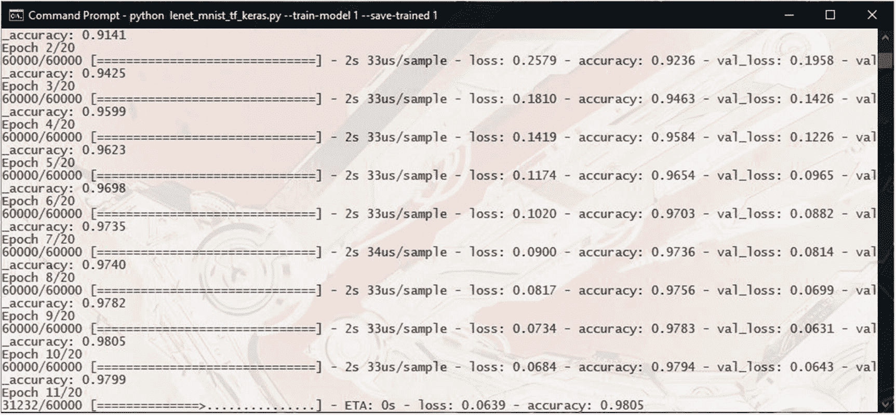

图 4-3

我们的模型正在被训练

按照我们的规定，训练将进行 20 个时期。

如果您使用 TensorFlow GPU 版本运行此程序，培训时间不到两分钟。然而，在 CPU 上，这可能需要 30 分钟。

控制台将显示训练的进度、准确性以及训练和验证的损失。

一旦训练完成，它将在测试数据集上评估模型，并给出最终的精度值(图 [4-4](#Fig4) )。

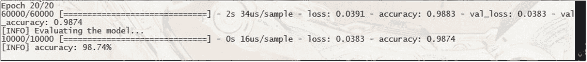

图 4-4

培训已完成，评估正在进行

深度学习特别擅长对这类简单图像进行分类。使用我们的简单模型，我们应该可以获得大约 98–99%的准确率。

一旦评估步骤完成，代码将使用 Matplotlib 打开一个窗口，显示模型的训练历史(图 [4-5](#Fig5) )。

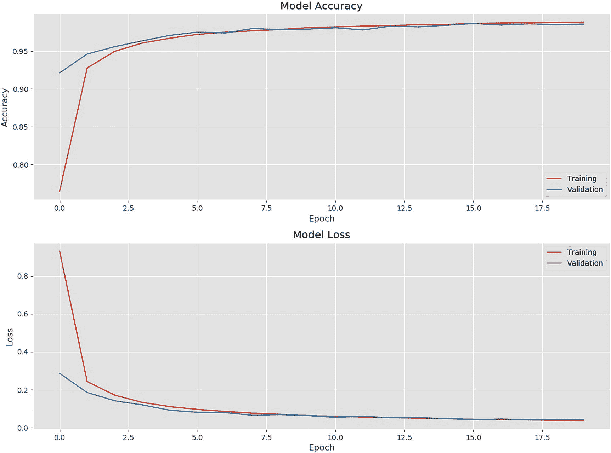

图 4-5

模型训练历史

验证矩阵遵循训练的趋势，这是一个很好的指示，因为它看起来不像模型在训练数据上过度拟合。

Note

在您关闭 Matplotlib 窗口之前，代码执行将暂停。因此，请记住在查看图表后关闭它。您也可以从 Matplotlib 窗口将图形保存为图像。

现在，有趣的部分。OpenCV 将一次打开 10 个随机测试数字，以及该数字的预测值(在图像的左上角以绿色显示)。下面是一些例子(图 [4-6](#Fig6) 、 [4-7](#Fig7) 和 [4-8](#Fig8) ):

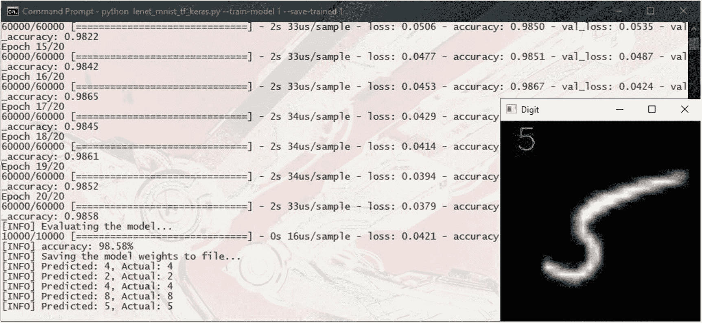

图 4-8

模型预测:数字 5

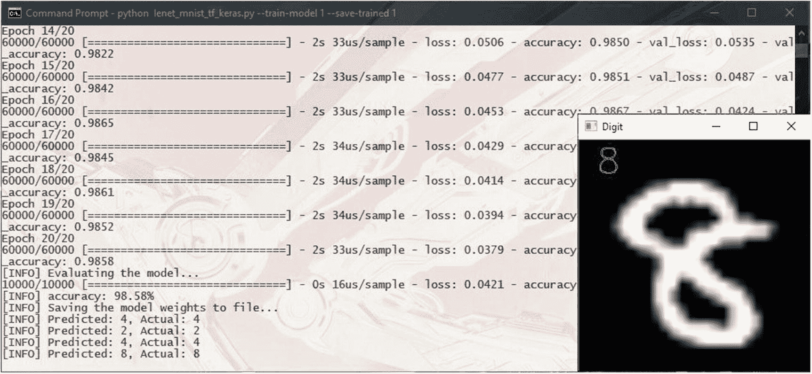

图 4-7

模型预测:数字 8

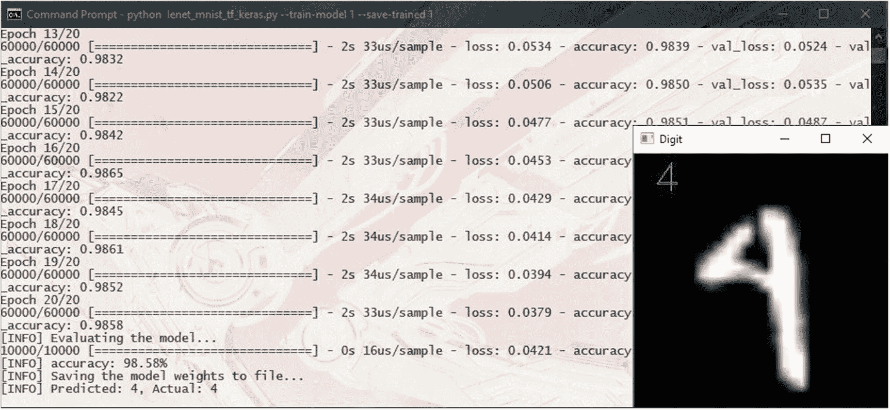

图 4-6

模型预测:数字 4

你可以按任意键切换数字。

Note

在 OpenCV 的一些 Windows 版本中，在打开图像窗口的代码中有一个 bug，如果您试图手动关闭窗口(通过单击窗口关闭按钮)，代码执行会停滞。因此，最好让代码通过按任意键在结果之间切换来正确关闭窗口。

除了显示数字，我们还将预测值和实际值打印到控制台(图 [4-9](#Fig9) )。

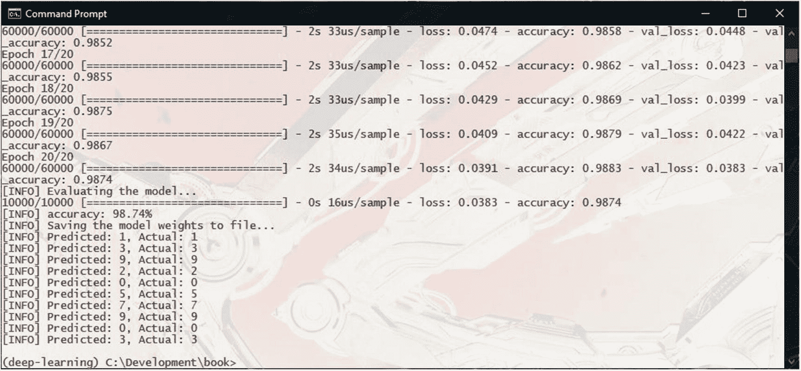

图 4-9

控制台上打印的测试数字预测值和实际值

训练完我们的模型后，模型权重将被保存到`data/lenet_weights.hdf5`。您可以通过运行以下命令再次运行模型，而无需培训:

```py
python lenet_mnist_tf_keras.py

```

## 尝试不同的数据集

一旦您对 LeNet 模型对 MNIST 数据集中的数字进行分类的方式感到满意，您可能想尝试一个稍微复杂一点的不同数据集。

时尚-MNIST 数据集将是下一个最佳选择。

时尚-MNIST 由 10 类服装图像组成。图像为 28x28 像素灰度格式，有以下 10 类，标记为 0 到 9:

*   0: T 恤/上衣

*   1:裤子

*   2:套头衫

*   3:着装

*   4:外套

*   5:凉鞋

*   6:衬衫

*   7:运动鞋

*   8:袋子

*   9:短靴

以下是数据集中的几个例子(图 [4-10](#Fig10) ):


图 4-10

来自时尚 MNIST 数据集的样本

像 MNIST 数据集一样，时尚 MNIST 由 70，000 张图像组成，包括 60，000 张训练图像和 10，000 张测试图像。由于两个数据集之间的相似性，时尚 MNIST 可以直接替代任何使用 MNIST 数据集的模型。

你可以从《时尚-MNIST》的官方网站下载。 <sup>[3](#Fn3)</sup> 但是，与 MNIST 一样，由于数据集的流行，许多机器学习和深度学习框架都内置了它。

## 基于时尚 MNIST 的服装图像分类

让我们建立一个深度学习模型，从时尚 MNIST 数据集中对服装图像进行分类。

正如我们前面谈到的，时尚 MNIST 的目的是在任何可以使用 MNIST 的地方提供替代服务。因此，我们可以从相同的 LeNet 模型结构和之前使用的代码开始。

让我们为它创建一个新的 Python 文件，命名为`lenet_fashion_mnist_tf_keras.py`。

我们将从导入必要的包开始:

```py
01: # How to use
02: #
03: # Train the model and save the model weights
04: # python lenet_fashion_mnist_tf_keras.py --train-model 1 --save-trained 1
05: #
06: # Train the model and save the model weights to a give directory
07: # python lenet_fashion_mnist_tf_keras.py --train-model 1 --save-trained 1 --weights data/lenet_fashion_weights.hdf5
08: #
09: # Evaluate the model from pre-trained model weights
10: # python lenet_fashion_mnist_tf_keras.py
11: #
12: # Evaluate the model from pre-trained model weights from a give directory
13: # python lenet_fashion_mnist_tf_keras.py --weights data/lenet_fashion_weights.hdf5
14:
15: # first, let's import tensorFlow
16: import tensorflow as tf
17: import numpy as np
18:
19: # import the FASHION_MNIST dataset
20: from tensorflow.keras.datasets import fashion_mnist
21:
22: # imports used to build the deep learning model
23: from tensorflow.keras.optimizers import SGD
24: from tensorflow.keras.models import Sequential
25: from tensorflow.keras.layers import Conv2D
26: from tensorflow.keras.layers import MaxPooling2D
27: from tensorflow.keras.layers import Activation
28: from tensorflow.keras.layers import Flatten
29: from tensorflow.keras.layers import Dense
30:
31: # import the keras util functions
32: import tensorflow.keras.utils as np_utils
33:
34: import argparse
35: import cv2
36: import matplotlib.pyplot as plt

```

然后，我们将定义命令行参数:

```py
38: # Setup the argument parser to parse out command line arguments
39: ap = argparse.ArgumentParser()
40: ap.add_argument("-t", "--train-model", type=int, default=-1,
41:                 help="(optional) Whether the model should be trained on the MNIST dataset. Defaults to no")
42: ap.add_argument("-s", "--save-trained", type=int, default=-1,
43:                 help="(optional) Whether the trained models weights should be saved." +
44:                 "Overwrites existing weights file with the same name. Use with caution. Defaults to no")
45: ap.add_argument("-w", "--weights", type=str, default="data/lenet_fashion_weights.hdf5",
46:                 help="(optional) Path to the weights file. Defaults to 'data/lenet_fashion_weights.hdf5'")
47: args = vars(ap.parse_args())

```

然后，我们将加载并预处理数据集:

```py
50: # Getting the FASHION_MNIST dataset from Keras datasets
51: print("[INFO] Loading the FASHION_MNIST dataset...")
52: (trainData, trainLabels), (testData, testLabels) = fashion_mnist.load_data()
53: # The data is already in the form of numpy arrays,
54: # and already split to training and testing datasets
55:
56: # Rescale the data from values between [0 - 255] to [0 - 1.0]
57: trainData = trainData / 255.0
58: testData = testData / 255.0
59:
60: # Defining the string labels for the classes
61: class_names = ['T-shirt/top', 'Trouser', 'Pullover', 'Dress', 'Coat',
62:                'Sandal', 'Shirt', 'Sneaker', 'Bag', 'Ankle boot']
63:
64: # Display a sample from the FASHION_MNIST dataset
65: plt.figure(figsize=(16,16))
66: for i in range(25):
67:     plt.subplot(5,5, i+1)
68:     plt.xticks([])
69:     plt.yticks([])
70:     plt.grid(False)
71:     plt.imshow(trainData[i], cmap=plt.cm.binary)
72:     plt.xlabel(class_names[trainLabels[i]])
73: plt.show()
74:
75: # Reshape the data matrix from (samples, height, width) to (samples, height, width, depth)
76: # Depth (i.e. channels) is 1 since MNIST only has grayscale images
77: trainData = trainData[:, :, :, np.newaxis]
78: testData = testData[:, :, :, np.newaxis]
79:
80: # The labels comes as a single digit, indicating the class.
81: # But we need a categorical vector as the label. So we transform it.
82: # So that,
83: # '0' will become [1, 0, 0, 0, 0, 0, 0, 0, 0, 0]
84: # '1' will become [0, 1, 0, 0, 0, 0, 0, 0, 0, 0]
85: # '2' will become [0, 0, 1, 0, 0, 0, 0, 0, 0, 0]
86: # and so on...
87: trainLabels = np_utils.to_categorical(trainLabels, 10)
88: testLabels = np_utils.to_categorical(testLabels, 10)

```

这里，我们定义了一个名为 class_names 的列表来存放时尚 MNIST 数据集的 10 个类的文本标签(第 61 行)。列表中每个元素的索引是类 ID。

我们还从数据集加载 25 个样本并显示(第 65–73 行)。

现在我们建立我们的模型结构。这与我们用于 MNIST 数据集的 LeNet 模型相同:

```py
091: def build_lenet(width, height, depth, classes, weightsPath=None):
092:     # Initialize the model
093:     model = Sequential()
094:
095:     # The first set of CONV => RELU => POOL layers
096:     model.add(Conv2D(20, (5, 5), padding="same",
097:                      input_shape=(height, width, depth)))
098:     model.add(Activation("relu"))
099:     model.add(MaxPooling2D(pool_size=(2, 2), strides=(2, 2)))
100:
101:     # The second set of CONV => RELU => POOL layers
102:     model.add(Conv2D(50, (5, 5), padding="same"))
103:     model.add(Activation("relu"))
104:     model.add(MaxPooling2D(pool_size=(2, 2), strides=(2, 2)))
105:
106:     # The set of FC => RELU layers
107:     model.add(Flatten())
108:     model.add(Dense(500))
109:     model.add(Activation("relu"))
110:
111:     # The softmax classifier
112:     model.add(Dense(classes))
113:     model.add(Activation("softmax"))
114:
115:     # If a weights path is supplied, then load the weights
116:     if weightsPath is not None:
117:         model.load_weights(weightsPath)
118:
119:     # Return the constructed network architecture
120:     return model

```

我们还像以前一样定义了`graph_training_history()`函数:

```py
123: def graph_training_history(history):
124:     plt.rcParams["figure.figsize"] = (12, 9)
125:
126:     plt.style.use('ggplot')
127:
128:     plt.figure(1)
129:
130:     # summarize history for accuracy
131:
132:     plt.subplot(211)
133:     plt.plot(history.history['accuracy'])
134:     plt.plot(history.history['val_accuracy'])
135:     plt.title('Model Accuracy')
136:     plt.ylabel('Accuracy')
137:     plt.xlabel('Epoch')
138:     plt.legend(['Training', 'Validation'], loc='lower right')
139:
140:     # summarize history for loss
141:
142:     plt.subplot(212)
143:     plt.plot(history.history['loss'])
144:     plt.plot(history.history['val_loss'])
145:     plt.title('Model Loss')
146:     plt.ylabel('Loss')
147:     plt.xlabel('Epoch')
148:     plt.legend(['Training', 'Validation'], loc='upper right')
149:
150:     plt.tight_layout()
151:
152:     plt.show()

Also like we did before, we build, compile, and run the training:

155: # Build and Compile the model
156: print("[INFO] Building and compiling the LeNet model...")
157: opt = SGD(lr=0.01)
158: model = build_lenet(width=28, height=28, depth=1, classes=10,
159:                     weightsPath=args["weights"] if args["train_model"] <= 0 else None)
160: model.compile(loss="categorical_crossentropy",
161:               optimizer=opt, metrics=["accuracy"])
162:
163: # Check the argument whether to train the model
164: if args["train_model"] > 0:
165:     print("[INFO] Training the model...")
166:
167:     history = model.fit(trainData, trainLabels,
168:                         batch_size=128,
169:                         epochs=50,
170:                         validation_data=(testData, testLabels),
171:                         verbose=1)
172:
173:     # Use the test data to evaluate the model
174:     print("[INFO] Evaluating the model...")
175:
176:     (loss, accuracy) = model.evaluate(
177:         testData, testLabels, batch_size=128, verbose=1)
178:
179:     print("[INFO] accuracy: {:.2f}%".format(accuracy * 100))
180:
181:     # Visualize the training history
182:     graph_training_history(history)

```

这里我们将训练时期的数量设置为 50(第 169 行)。

训练完成后，我们将模型权重保存到一个文件中，并从测试数据集中选择一些随机图像来评估训练后的模型:

```py
184: # Check the argument on whether to save the model weights to file
185: if args["save_trained"] > 0:
186:     print("[INFO] Saving the model weights to file...")
187:     model.save_weights(args["weights"], overwrite=True)
188:
189: # Training of the model is now complete
190:
191: # Randomly select a few samples from the test dataset to evaluate
192: for i in np.random.choice(np.arange(0, len(testLabels)), size=(10,)):
193:     # Use the model to classify the digit
194:     probs = model.predict(testData[np.newaxis, i])
195:     prediction = probs.argmax(axis=1)
196:
197:     # Convert the digit data to a color image
198:     image = (testData[i] * 255).astype("uint8")
199:     image = cv2.cvtColor(image, cv2.COLOR_GRAY2RGB)
200:
201:     # The images are in 28x28 size. Much too small to see properly
202:     # So, we resize them to 280x280 for viewing
203:     image = cv2.resize(image, (280, 280), interpolation=cv2.INTER_LINEAR)
204:
205:     # Add the predicted value on to the image
206:     cv2.putText(image, str(class_names[prediction[0]]), (20, 40),
207:                 cv2.FONT_HERSHEY_DUPLEX, 1.5, (0, 255, 0), 1)
208:
209:     # Show the image and prediction
210:     print("[INFO] Predicted: \"{}\", Actual: \"{}\"".format(
211:         class_names[prediction[0]], class_names[np.argmax(testLabels[i])]))
212:     cv2.imshow("Digit", image)
213:     cv2.waitKey(0)
214:
215: cv2.destroyAllWindows()

```

我们使用前面定义的`class_names`列表从预测中获取文本类名(第 206 和 210 行)。

## 运行我们的时尚 MNIST 模式

当我们的代码准备好了，我们也做了和 MNIST 一样的预检查，我们就可以运行我们的新模型了:

```py
python lenet_fashion_mnist_tf_keras.py --train-model 1 --save-trained 1

```

如果你以前没有使用过时尚 MNIST 数据集，Keras 会自动下载。一旦数据集被加载，我们的代码将显示数据集中的几个样本(图 [4-11](#Fig11) )。

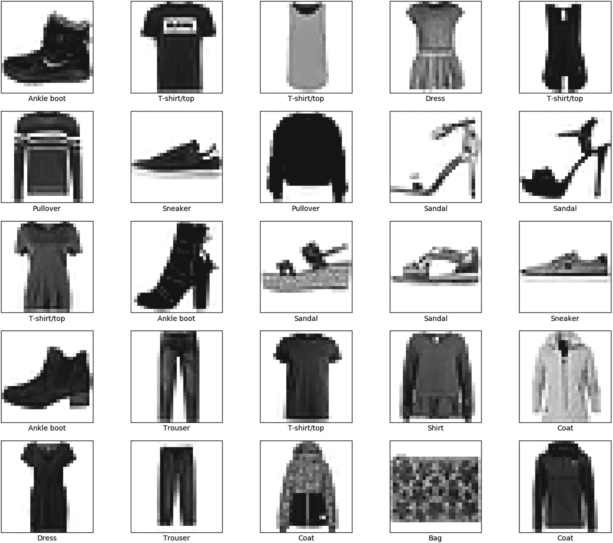

图 4-11

数据集中的一些样本

该培训将运行 50 个纪元，在 GPU 上运行时将需要几分钟时间。

使用我们的 LeNet 模型，您将获得大约 90%的准确性(图 [4-12](#Fig12) )。

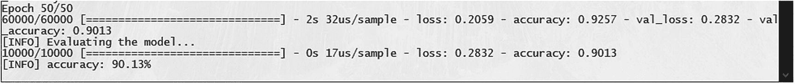

图 4-12

我们的时装模特——MNIST 的准确性

培训历史图表将类似于图 [4-13](#Fig13) 中的图表。

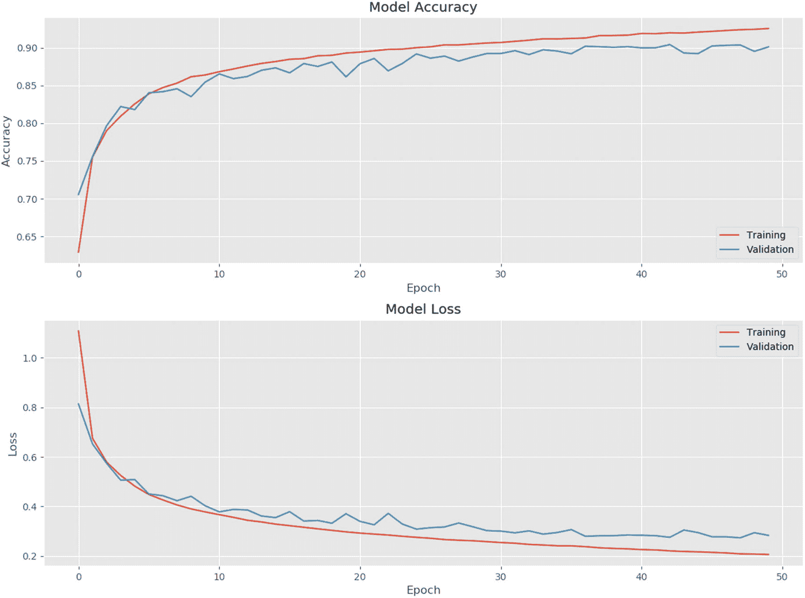

图 4-13

我们模型的训练历史图

然后，我们的代码将显示测试数据集中的 10 个随机样本，以及它们在模型中的预测类(图 [4-14](#Fig14) 、 [4-15](#Fig15) 、 [4-16](#Fig16) )。

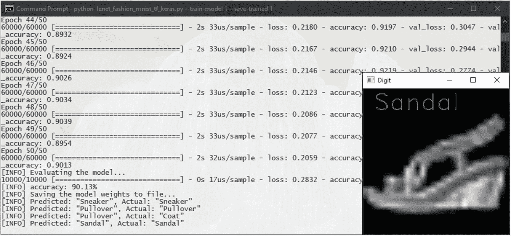

图 4-16

模型预测:凉鞋

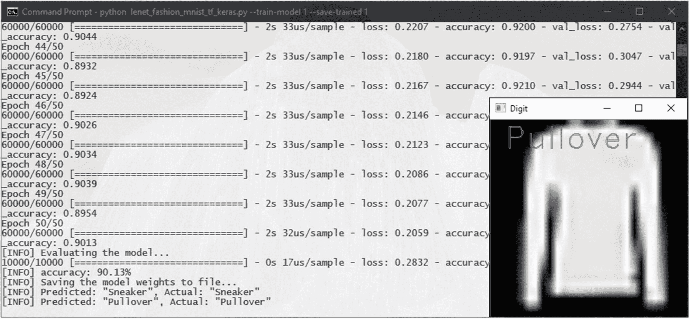

图 4-15

模型预测:套头衫

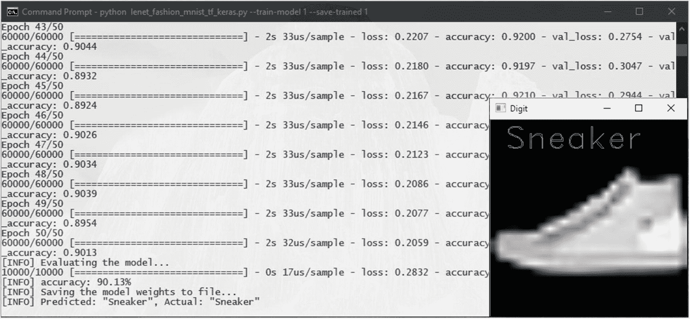

图 4-14

模型预测:运动鞋

除了显示样本的结果，代码还会将预测值和实际值打印到控制台(图 [4-17](#Fig17) )。

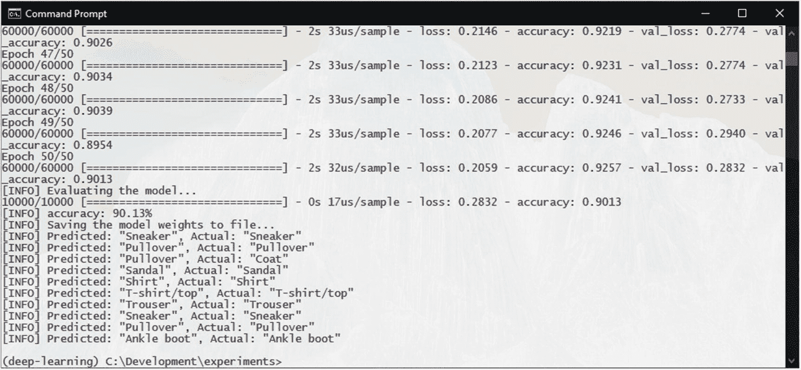

图 4-17

控制台上打印的预测值和实际值

训练完成后，模型权重将像以前一样保存到 data/lenet _ fashion _ weights . HD F5。

## 接下来你能做什么？

在时尚 MNIST 数据集上获得 90%的准确率是不错的——但你肯定可以尝试提高这个结果。您可以尝试调整模型，看看它是否能改善结果。以下是一些你可以尝试的事情:

*   更改卷积滤波器的数量，并查看它如何影响训练(通过训练历史图)。

*   增加更多的卷积层，看看它是否改善了模型。看看它如何影响训练时间。看看在模型开始变坏之前你能增加多少层。

*   添加更密集的层。模型开始过度拟合了吗？

您可以通过查看损失度量来检测模型何时过度拟合。如果验证损失停止下降，而随着训练的进行，训练损失继续下降，则模型过度拟合。这意味着模型基本上“记住”了我们的训练样本，但没有学会概括问题，导致它在看不见的样本(在这种情况下，验证样本)上失败。

我们将在后面的章节中讨论如何处理更复杂的数据集和模型。

<aside aria-label="Footnotes" class="FootnoteSection" epub:type="footnotes">Footnotes [1](#Fn1_source)

MNIST 网站， [`http://yann.lecun.com/exdb/mnist/`](http://yann.lecun.com/exdb/mnist/) ，【日期】。

  [2](#Fn2_source)

Y.LeCun，L. Bottou，Y. Bengio 和 P. Haffner，“应用于文档识别的基于梯度的学习”，【出版信息】 *(1998)。*

  [3](#Fn3_source)

时尚:MNIST 官网， [`https://github.com/zalandoresearch/fashion-mnist`](https://github.com/zalandoresearch/fashion-mnist) ，【日期】。

 </aside>