# 5.了解我们建造了什么

运行我们的第一个深度学习模型让我们略微了解了深度学习可以做什么。我们可以用深度学习建立许多令人兴奋的项目。

但是首先，最好理解我们构建了什么，以及它是如何工作的。

让我们回顾一下我们建立的模型。我们使用 LeNet 架构，看起来像这样(图 [5-1](#Fig1) ):

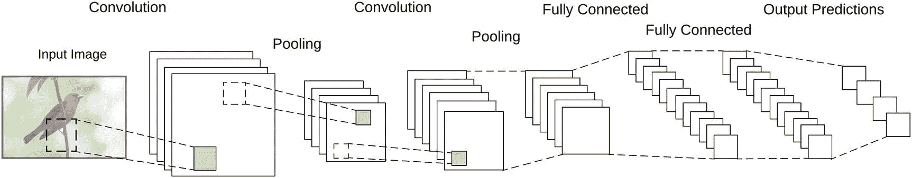

图 5-1

LeNet 模型

通过查看模型架构和我们的代码，我们看到模型的工作基于几个函数:

1.  输入:数字图像

2.  回旋

3.  非线性函数

4.  联营

5.  分类器(全连接层)

让我们来看看这些函数是如何工作的，以及它们是如何对我们的模型做出贡献的。

## 数字图像

我们的输入图像是这个过程的第一部分。

虽然我们基于我们的感知将它们视为图像，但对于机器来说，图像只是另一种形式的数字数据。

数字图像由像素的集合组成。每个像素由一个或多个颜色通道的颜色值定义。灰度图像只有一个通道。图像中的每个像素都有一个从 0 到 255 的值，其中 0 表示黑色，255 表示白色(图 [5-2](#Fig2) )。

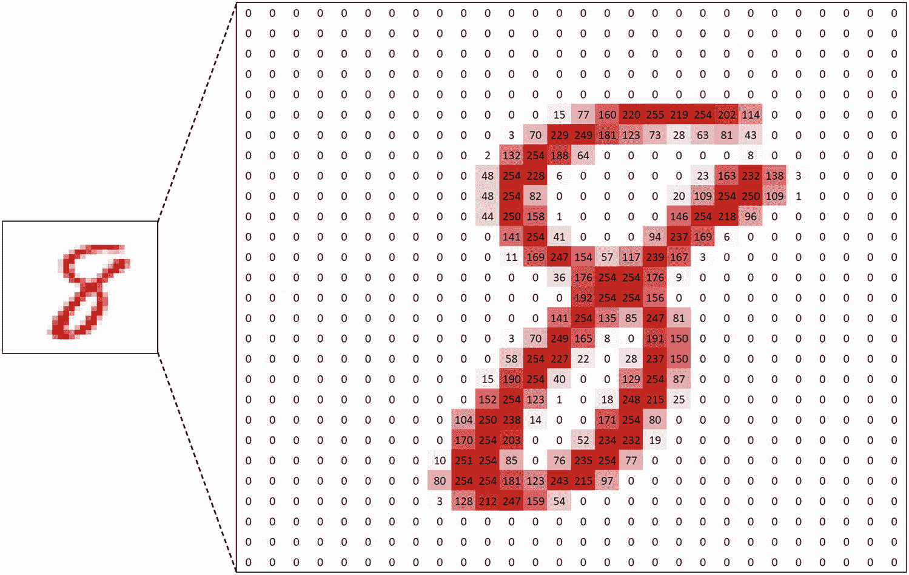

图 5-2

图像只是像素值的矩阵

彩色图像有三个通道 RGB 图像的红色、绿色和蓝色(图 [5-3](#Fig3) )。

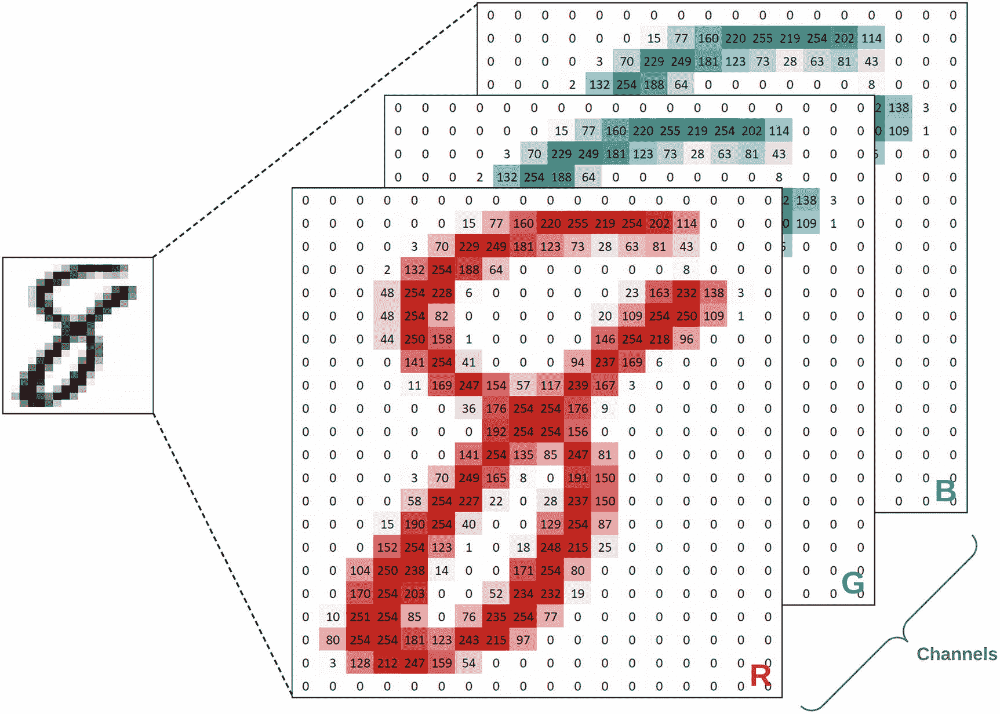

图 5-3

彩色图像是每个通道的一组像素值

因此，在数学术语中，图像是像素值的矩阵。

深度学习模型(以及一般的神经网络)中的操作是在这些值矩阵上执行的。

## 回旋

对矩阵的数学卷积运算能够从诸如图像的矩阵中提取特征，因为它保留了矩阵元素之间的空间关系。CNN 广泛使用卷积运算，这就是它们被命名为卷积神经网络的原因。正如我们在第 [1](01.html) 章中所讨论的，图像上的数学卷积就像人类和动物视觉皮层的感受域一样工作。像感受野一样，回旋每次处理输入的小方块。

Note

你可以在维基百科的“卷积”页面了解更多关于数学卷积运算的性质这里: [`https://en.wikipedia.org/wiki/Convolution`](https://en.wikipedia.org/wiki/Convolution) 。

为了简单理解卷积如何工作，考虑两个矩阵:输入和卷积矩阵(图 [5-4](#Fig4) )。

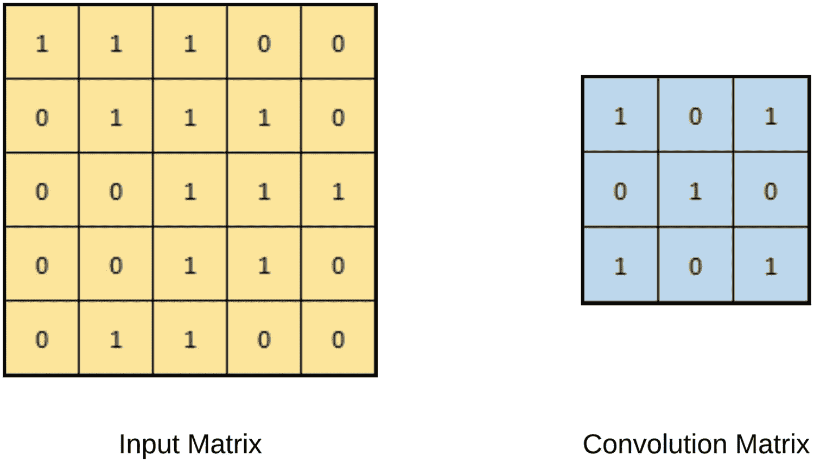

图 5-4

输入和卷积矩阵

卷积运算通过卷积矩阵在输入矩阵上“滑动”而发生，以产生卷积输出(图 [5-5](#Fig5) )。

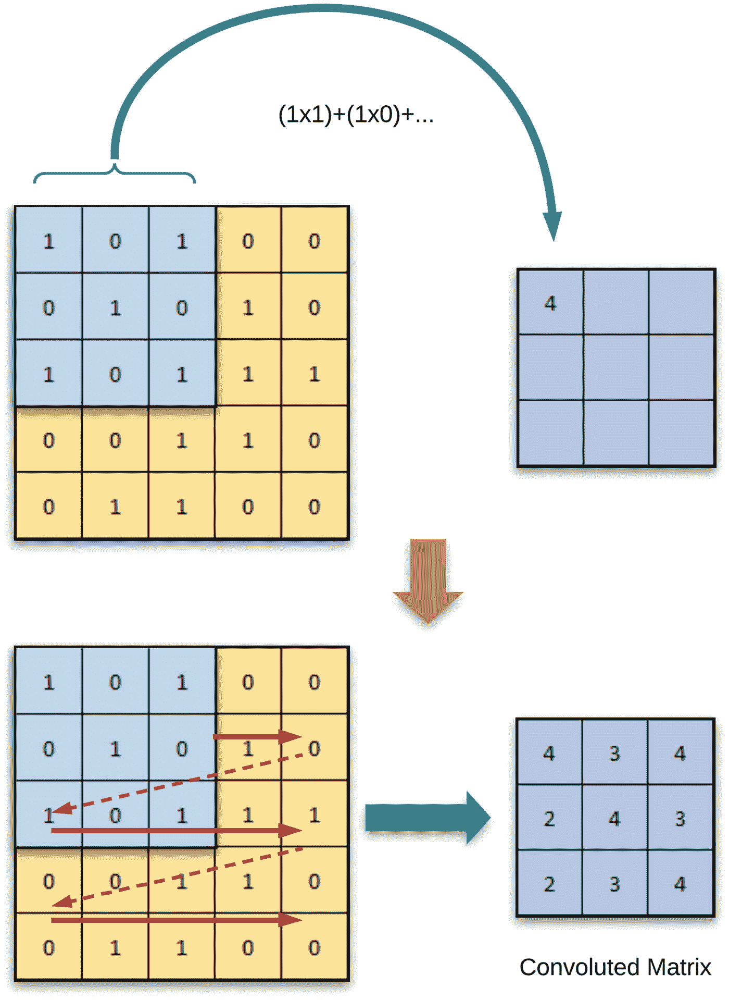

图 5-5

卷积运算

随着卷积运算的发生，卷积矩阵只看到输入矩阵的一部分，但它保持了所看到的内容的空间关系。各种不同的卷积矩阵从输入产生不同的输出。

如果我们对一幅图像应用同样的操作会怎么样？

正如我们所讨论的，数字图像是像素值的矩阵。

因此，我们也应该能够对图像执行相同的卷积操作。

如果我们用不同的卷积矩阵尝试相同的操作(其中输入是图像),它们的输出将显示图像特征的各种表示。以下是几个例子(图 [5-6](#Fig6) )。

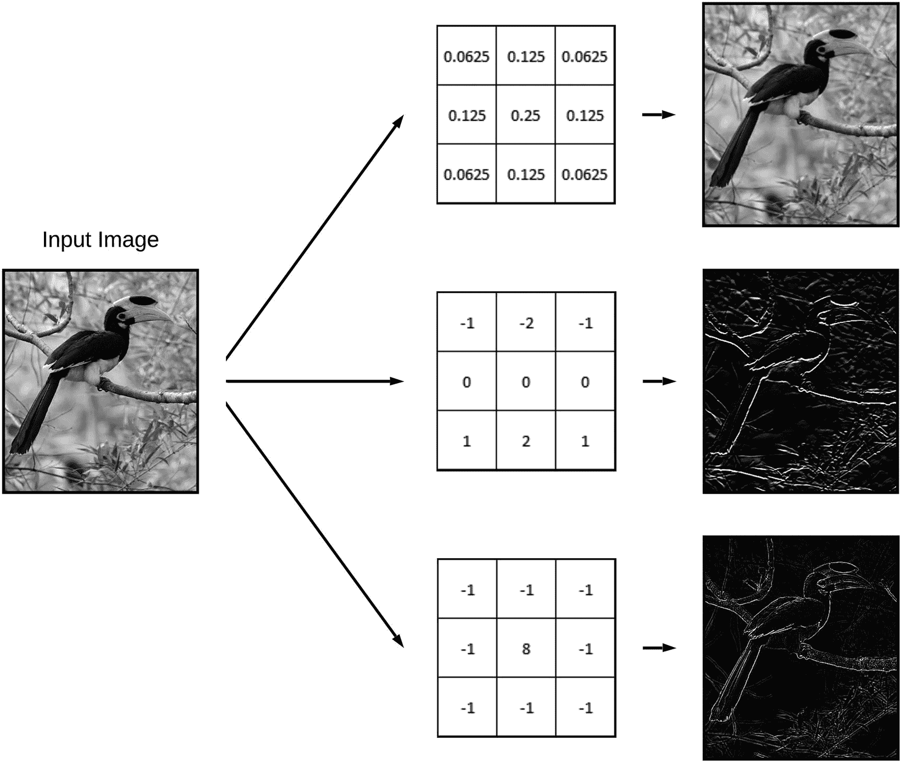

图 5-6

不同卷积对图像的影响

由于这些不同的卷积运算过滤和提取图像的不同特征，它们通常被称为“过滤器”

在 CNN 中，许多滤波器用于从输入图像中提取和学习不同的特征。当使用深度学习库如 TensorFlow 或 Keras 时，我们不需要指定每个过滤器应该是什么。相反，我们只指定过滤器的数量和大小。库的训练过程将决定使用哪些过滤器。通常，网络中的过滤器越多，它就越善于从输入中学习模式。

## 非线性函数

一旦卷积步骤完成，并且已经生成了输入图像的各种特征图，CNN 就对特征图应用非线性函数。因为真实世界的数据是非线性的，所以需要非线性，但是卷积函数是线性运算。因此，为了处理真实世界数据的表示，我们需要应用一个非线性函数。

整流线性单元(ReLU)是一种常用的非线性函数。诸如双曲正切或 sigmoid 之类的其他函数也可以用作非线性函数。使用哪个函数将取决于您的模型的架构。使用反向传播进行训练时，ReLU 在大多数情况下表现更好。在大多数情况下，与 sigmoid 和 tanh 相比，ReLU 在更深的模型架构中表现更好。因此，在开发新的模型架构时，ReLU 是一个很好的起点。

ReLU 功能可以在图 [5-7](#Fig7) 中看到。

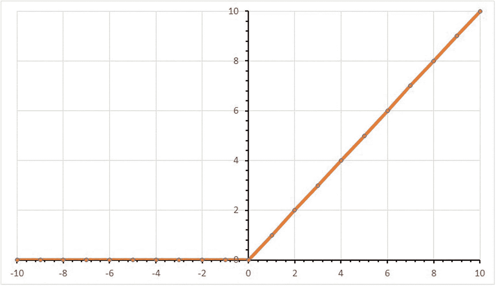

图 5-7

ReLU 函数

这可能看起来很复杂，但是 ReLU 相当简单。它遍历每个像素，将负值设置为零，并保留正像素值。

该函数也可以表示为:

```py
Output = max(0, Input)

```

当应用于特征映射时，ReLU 的结果如下所示(图 [5-8](#Fig8) ):

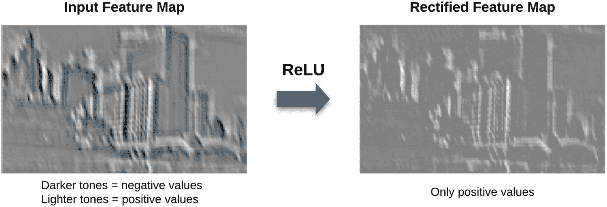

图 5-8

ReLU 应用于特征映射

## 联营

应用非线性后，CNN 执行合并步骤(也称为空间合并、子采样或下采样)。池化通过仅保留最重要的信息来减少每个特征图的维度。有几种方法可以做到这一点，如最大池、平均池和总和池。其中，max pooling 总体上表现出更好的结果。

在 max pooling 中，我们定义一个窗口(特征图的一个区域)，并从该区域的像素中获取最大值(图 [5-9](#Fig9) )。

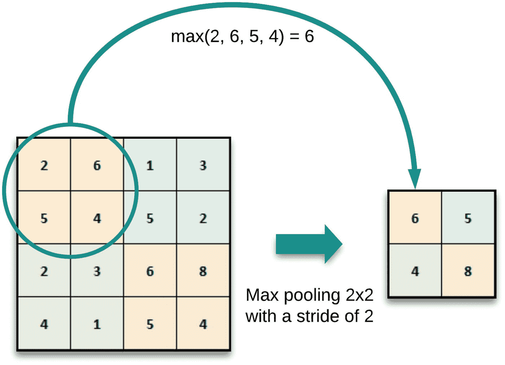

图 5-9

最大池化

联营给 CNN 带来了几个好处:

1.  这使得特征尺寸更小且更易于管理。

2.  它通过减少网络中所需的参数和计算的数量来减少过度拟合的可能性。

3.  它使网络对输入中的小变换、失真和平移保持不变，这意味着输入中的小变化不会显著影响输出。这允许网络更好地概括。

4.  它使网络比例保持不变，允许对象在输入图像中的任何位置都能被检测到。

至此，CNN 的单个卷积层的工作完成。接下来的卷积图层会将前一图层的输出特征地图作为其输入，并继续相同的操作，直到它们到达完全连接的图层。

## 分类器(全连接层)

分类器(也称为全连接层或密集层)是一个传统的多层感知器网络。分类器中一层的每个神经元与下一层的每个神经元相连。分类器的最终输出层通常使用 softmax 激活函数。诸如 sigmoid 的其他激活功能也可以用于不同的场景。Sigmoid 通常在处理二元分类问题时表现良好，而 softmax 在处理多类分类时表现良好。

分类器的目的是将卷积和汇集层提取的高级特征进行组合，以便进行最终分类(图 [5-10](#Fig10) )。

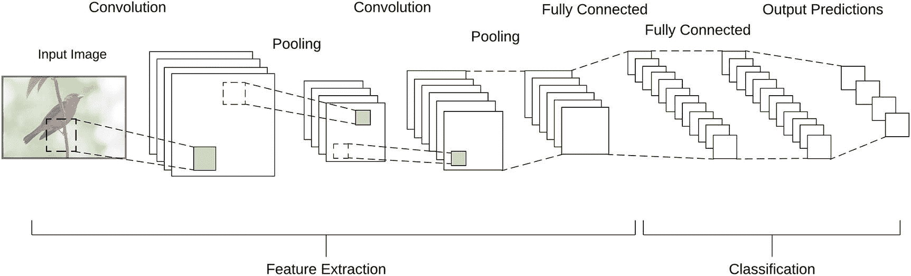

图 5-10

特征提取和分类

## 这一切是如何结合在一起的？

我们讨论的这些元素——卷积、ReLU、池和分类器——是如何协同工作来理解图像的？

为了理解这一点，让我们举一个极其简单的例子:让我们看看神经网络可能如何学习识别正方形。

像任何其他训练任务一样，神经网络需要经过数百甚至数千张训练图像。

它需要学习的是正方形的定义特征。

对于我们人类来说，由于我们对视觉元素有着牢固的把握，正方形的定义特征应该是“线条”、“长度”和“角度”。我们知道——也就是说，我们的大脑已经被训练知道——哪些特征的组合产生了一个正方形，以及在识别一个正方形时要寻找什么(图 [5-11](#Fig11) )。

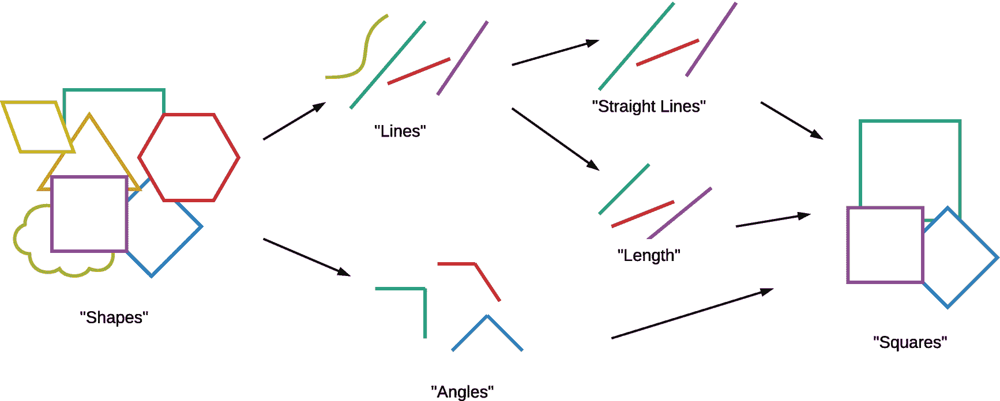

图 5-11

识别正方形的一种可能的思维过程

但是机器(或未经训练的人工智能)对什么是直线、长度或角度没有概念。人工智能(在这种情况下是神经网络)试图做的是在提供的训练集中寻找任何可以看到的共同特征。

通过使用诸如卷积之类的特征提取方法，可以大大提高“看到”神经网络特征的能力。

正如你在前面的图表中看到的(图 [5-12](#Fig12) )，卷积滤波器允许从图像中提取出一些独特的元素。

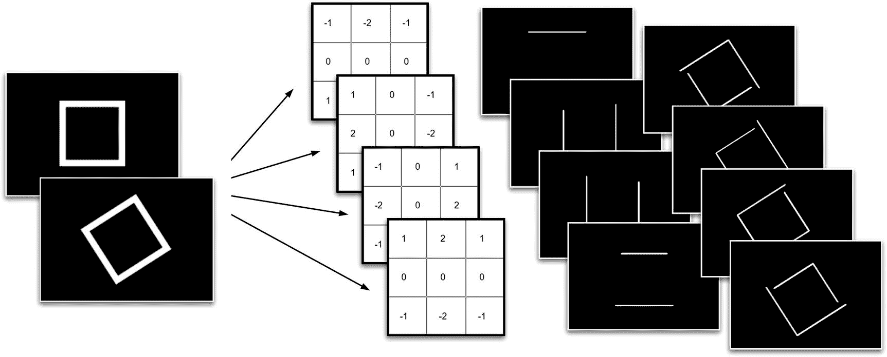

图 5-12

使用卷积由模型学习的可能特征

使用像这样的特征提取流程(卷积、ReLU 和池化)，神经网络将能够更好地从输入图像中归纳出已识别的特征。因此，它将能够更容易地缩小给定数据集的共同特征。

我们的手写数字分类器以同样的方式工作。

我们建立的模型使用许多卷积过滤器来识别数字的共同特征，并试图识别它们的哪些组合有助于哪个数字类别(图 [5-13](#Fig13) )。

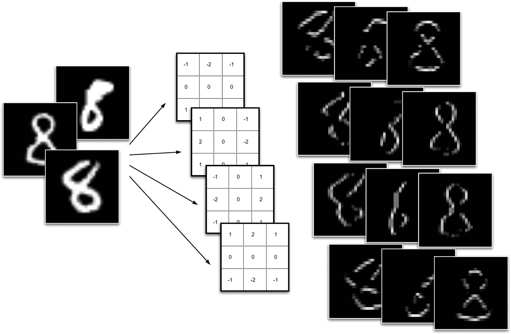

图 5-13

在 MNIST 数据集的数字上学习的可能特征

同样的概念也可以应用于识别更复杂的输入，例如更真实的图像。下图显示了如何通过 CNN 中的特征提取来识别汽车图像(图 [5-14](#Fig14) )。

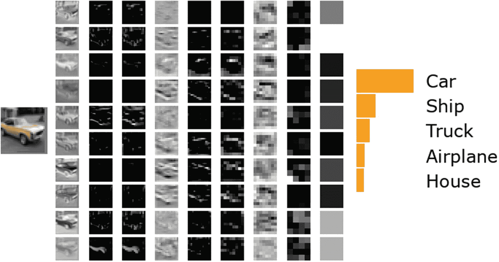

图 5-14

过滤器如何提取特征

我们在这里讨论的是我们只有几层的简单卷积神经网络的流程。但是该模型中的概念——卷积、正则化、池化等等——也在更复杂的模型中使用。当我们开始构建更大、更复杂的模型时，您会注意到这些相同概念的组合应用于这些模型中。