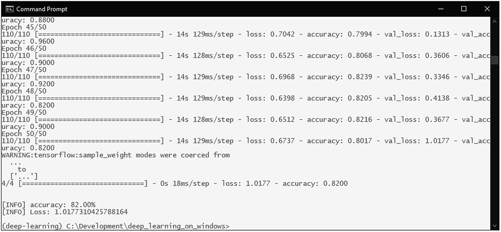

# 7.迁移学习

我们看到深度学习模型在应用于计算机视觉和分类任务时表现得非常好。我们的 LeNet 模型使用 MNIST 和时尚 MNIST 数据集，能够在非常合理的训练时间内达到 90%–99%的准确率。我们也看到了 ImageNet 模型如何在更复杂的数据集中达到破纪录的准确性水平。

现在，您可能急于尝试我们在一个更复杂、更实用的分类任务中学到的东西。但是当我们要从零开始用自己的类别训练自己的图像分类模型的时候，我们应该考虑什么呢？

## 数据少的问题是

如果你试图建立这样一个系统，你可能会发现从头开始建立一个分类系统——即使有深度学习——也不是一件容易的事情。为了在不过度拟合的情况下从模型中获得足够的精度，需要大量的训练数据。ImageNet 有数百万个数据样本，这就是在其上训练的模型表现如此之好的原因。但是对于我们来说，为我们计划建立的分类任务找到或建立那个级别的训练数据集实际上是不可行的。

使用小数据集来训练模型的问题是，当模型在其训练时段中重复看到相同的几个样本时，它往往会过度适应这些特定的样本。没有足够大的验证数据集会让事情变得更糟。

但是我们真的需要那么多数据来让一个图像分类模型工作吗？我们能用少量的数据做什么？

我们可以尝试的一种方法是使用数据扩充。

## 使用数据扩充

扩充数据的想法很简单:我们对输入数据执行随机转换和标准化，这样被训练的模型就不会两次看到相同的输入。

当处理有限数量的训练数据时，这种方法可以显著减少模型过度拟合的机会。

但是手动对我们的输入数据执行这样的转换将是一项乏味的任务，这就是为什么 TensorFlow/Keras 有内置函数来帮助完成这一任务。

tf.keras 的图像预处理包具有 ImageDataGenerator 函数，可以根据需要配置该函数来执行输入图像的随机转换和规范化。然后，这个 ImageDataGenerator 可以与`flow()`和`flow_from_directory()`函数耦合，以自动加载数据、应用扩充并馈入模型。

Note

当使用 tf.keras 的 ImageDataGenerator 时，它的输出将是扩充数据集。因此，当使用 ImageDataGenerator 向模型提供数据时，模型将只能看到扩充的数据集。这是推荐的方法，适用于许多情况。还有其他将扩充数据集与原始数据集相结合的技术，但它们不太常用。

让我们编写一个小脚本来看看 ImageDataGenerator 的数据增强功能。

我们将使用以下内容作为我们的输入图像(图 [7-1](#Fig1) )。在与脚本相同的位置创建一个名为 data 的目录，并将这个输入图像放在那里。还要在这个数据目录中创建一个名为 augmented 的子目录。这将是保存生成的增强图像的地方。


图 7-1

输入图像 bird.jpg

然后，我们将使用以下脚本加载图像，使用 ImageDataGenerator 对其运行 20 次数据增强，并保存生成的增强图像:

```py
01: from tensorflow.keras.preprocessing.image import ImageDataGenerator, img_to_array, load_img
02:
03: # define the parameters for the ImageDataGenerator
04: datagen = ImageDataGenerator(
05:     rotation_range=40,
06:     width_shift_range=0.2,
07:     height_shift_range=0.2,
08:     shear_range=0.2,
09:     zoom_range=0.2,
10:     horizontal_flip=True,
11:     fill_mode='nearest')
12:
13: img = load_img('data/Bird.jpg')  # this is a PIL image
14:
15: # convert image to numpy array with shape (3, width, height)
16: img_arr = img_to_array(img)
17:
18: # convert to numpy array with shape (1, 3, width, height)
19: img_arr = img_arr.reshape((1,) + img_arr.shape)
20:
21: # the .flow() command below generates batches of randomly transformed images
22: # and saves the results to the `data/augmented` directory
23: i = 0
24: for batch in datagen.flow(
25:         img_arr,
26:         batch_size=1,
27:         save_to_dir='data/augmented',
28:         save_prefix='Bird_A',
29:         save_format='jpeg'):
30:     i += 1

31:     if i > 20:
32:         break  # otherwise the generator would loop indefinitely

```

这里，我们使用以下参数进行扩充:

*   **rotation_range:** 对图像应用随机旋转的范围(度)。

*   **width_shift_range:** 应用随机水平移动的范围。

*   **height_shift_range:** 应用随机垂直移动的范围。

*   **shear_range:** 应用随机剪切变换的范围。

*   **zoom_range:** 对图像进行随机缩放的范围。

*   **水平翻转:**是否对图像进行随机水平翻转。

*   **fill_mode='nearest':** 填充新创建像素的方法。指定为最近将使用与输入图像的最近像素相同的值填充新像素。

ImageDataGenerator 还有几个用于扩充的参数。你可以在官方文档页面上读到它们。 <sup>[1](#Fn1)</sup>

ImageDataGenerator 的`flow()`函数能够接收输入图像，应用我们定义的增强，并在循环中无限期地生成批量增强数据。虽然在这个例子中我们只有一个输入图像，但是`flow()`函数实际上是用于成批的图像。

生成的增强图像保存在`data/augmented`目录中，看起来会像这样(图 [7-2](#Fig2) ):


图 7-2

一些增强图像

通过使用像这样的数据增强，我们应该能够减少深度学习模型在小数据集上训练时过度拟合的机会。

## 利用数据增强建立图像分类模型

随着我们对数据扩充的理解，让我们应用它来建立一个实用的模型。

但是首先，我们需要一个图像数据集。为此，我们将使用来自 Kaggle 的鸟类图像数据集。

Kaggle 是一个由数据科学家和机器学习爱好者组成的社区，允许您查找和发布数据集，在 Jupyter 笔记本环境中实验和构建模型，以及参加数据科学和机器学习竞赛。

在 Kaggle 庞大的数据集目录中，我们将使用 225 种鸟类的数据集。 <sup>[2](#Fn2)</sup> 数据集大小约 1.4GB，可作为 zip 文件下载(图 [7-3](#Fig3) )。


图 7-3

来自 Kaggle 的 225 种鸟类数据集

Note

这个数据集和 Kaggle 中的许多其他数据集一样，是主动维护的。虽然在撰写本文时有 225 种鸟类的图像，但在您阅读本文时，更多的物种和类别可能已被添加到该数据集中。您还可以选择具有类似结构的任何其他数据集。

下载后，您可以提取 zip 文件的内容。在提取的目录中，你会得到 4 个子目录:consolidated、train、test、valid(图 [7-4](#Fig4) )。


图 7-4

提取的数据集

综合目录包含完整的数据集，组织成每个物种/类别的子目录。train、test 和 valid 子目录包含相同的数据集，这些数据集被拆分为具有相同子目录结构的 train、test 和 validation 集。

对于我们的实验，最初我们将只从 225 个类别中选择 10 个。我们将选择以下 10 个作为开始:

*   信天翁

*   蕉林莺

*   黑喉麻雀

*   美冠鹦鹉

*   黑眼睛灯心草

*   d-阿诺·巴伯

*   锦鸡

*   家朱雀

*   知更鸟

*   索拉

Note

选择这 10 个类别是因为它们包含每个类别的不同数量的样本。我们将看到它如何影响训练的准确性，以及如何克服它的负面影响。

创建一个名为 data 的新目录，并在其中创建两个名为 train 和 validation 的子目录。将前面选定类别的目录从提取的数据集的训练和有效目录复制到您创建的训练和验证目录。最终的目录结构应该是这样的(图 [7-5](#Fig5) ):


图 7-5

数据集的目录结构

Note

创建目录结构时，确保验证目录的子目录结构与培训目录的子目录结构相同。

让我们从一个新的代码文件开始，用数据扩充来开始我们的鸟类分类模型。我们将它命名为`bird_classify_augmented.py`。

我们将从导入必要的包开始:

```py
1: from tensorflow.keras.preprocessing.image import ImageDataGenerator
2: from tensorflow.keras.models import Sequential
3: from tensorflow.keras.layers import Conv2D, MaxPooling2D
4: from tensorflow.keras.layers import Activation, Dropout, Flatten, Dense
5: from tensorflow.keras import backend as K
6: import matplotlib.pyplot as plt
7: import math

```

然后，我们使用 Matplotlib 定义我们的效用函数来绘制训练历史:

```py
09: # utility functions
10: def graph_training_history(history):
11:     plt.rcParams["figure.figsize"] = (12, 9)
12:
13:     plt.style.use('ggplot')
14:
15:     plt.figure(1)
16:
17:     # summarize history for accuracy
18:
19:     plt.subplot(211)
20:     plt.plot(history.history['accuracy'])
21:     plt.plot(history.history['val_accuracy'])
22:     plt.title('Model Accuracy')
23:     plt.ylabel('Accuracy')
24:     plt.xlabel('Epoch')
25:     plt.legend(['Training', 'Validation'], loc='lower right')
26:
27:     # summarize history for loss
28:
29:     plt.subplot(212)
30:     plt.plot(history.history['loss'])
31:     plt.plot(history.history['val_loss'])
32:     plt.title('Model Loss')
33:     plt.ylabel('Loss')
34:     plt.xlabel('Epoch')
35:     plt.legend(['Training', 'Validation'], loc='upper right')
36:
37:     plt.tight_layout()
38:
39:     plt.show()

```

然后，我们为训练定义一些参数:

```py
41: # dimensions of our images.
42: img_width, img_height = 224, 224
43:
44: train_data_dir = 'data/train'
45: validation_data_dir = 'data/validation'
46:
47: # number of epochs to train
48: epochs = 50
49:
50: # batch size used by flow_from_directory
51: batch_size = 16

```

224x224 像素是 ImageNet 等大规模图像分类模型中使用的标准尺寸之一。我们在这里也使用它，因为它允许我们以后有一些灵活性。

要在我们的模型训练中使用自动数据扩充，我们需要定义数据生成器函数，就像我们在前面的数据扩充示例中所做的那样。使用数据生成器给了我们额外的优势，即能够使用`flow_from_directory()`函数，该函数从我们的目录结构中加载数据，并使用子目录名称提供类别标签。这里，我们定义了两个数据生成器:一个用于训练，一个用于验证:

```py
53: # this is the augmentation configuration we will use for training
54: train_datagen = ImageDataGenerator(
55:     rescale=1\. / 255,
56:     shear_range=0.2,
57:     zoom_range=0.2,
58:     horizontal_flip=True)
59:
60: # this is the augmentation configuration we will use for testing:
61: # only rescaling
62: test_datagen = ImageDataGenerator(rescale=1\. / 255)
63:
64: train_generator = train_datagen.flow_from_directory(
65:     train_data_dir,
66:     target_size=(img_width, img_height),
67:     batch_size=batch_size,
68:     class_mode='categorical')
69:
70: validation_generator = test_datagen.flow_from_directory(
71:     validation_data_dir,
72:     target_size=(img_width, img_height),
73:     batch_size=batch_size,
74:     class_mode='categorical')
75:
76: # print the number of training samples

77: print(len(train_generator.filenames))
78:
79: # print the category/class labal map
80: print(train_generator.class_indices)
81:
82: # print the number of classes
83: print(len(train_generator.class_indices))

```

由于我们正在构建一个多类图像分类模型，class_mode 被设置为 categorical。

<generator>。文件名包含训练集的所有文件名。通过得到它的长度，我们可以得到训练集的大小。</generator>

同样，<generator>。class _ indices 是类名及其索引的映射/字典。得到它的长度就可以得到类的数量。</generator>

我们使用这些值来计算所需的培训和验证步骤:

```py
85: # the number of classes/categories
86: num_classes = len(train_generator.class_indices)
87:
88: # calculate the training steps
89: nb_train_samples = len(train_generator.filenames)
90: train_steps = int(math.ceil(nb_train_samples / batch_size))
91:
92: # calculate the validation steps
93: nb_validation_samples = len(validation_generator.filenames)
94: validation_steps = int(math.ceil(nb_validation_samples / batch_size))

```

现在，我们可以定义我们的模型:

```py
097: # build the model
098: input_shape = (img_width, img_height, 3)
099:
100: model = Sequential()
101: model.add(Conv2D(32, (3, 3), input_shape=input_shape))
102: model.add(Activation('relu'))
103: model.add(MaxPooling2D(pool_size=(2, 2)))
104:
105: model.add(Conv2D(32, (3, 3)))
106: model.add(Activation('relu'))
107: model.add(MaxPooling2D(pool_size=(2, 2)))
108:
109: model.add(Conv2D(64, (3, 3)))
110: model.add(Activation('relu'))
111: model.add(MaxPooling2D(pool_size=(2, 2)))
112:
113: model.add(Flatten())
114: model.add(Dense(64))
115: model.add(Activation('relu'))
116: model.add(Dropout(0.5))
117: model.add(Dense(num_classes))
118: model.add(Activation('softmax'))

```

这是一个比我们的 LeNet 模型稍微深一点的模型，但是使用了相同的概念。这使用了三组 CONV => RELU = >池层。随后是密集层和 softmax 分类器。

一旦我们定义了模型结构，我们就可以编译它并运行培训。`model.fit()`函数接受数据生成器，就像它接受训练数据数组(以及其他几种数据格式)一样。<sup>[3](#Fn3)T4】</sup>

```py
120: model.compile(loss='categorical_crossentropy',
121:               optimizer='rmsprop',
122:               metrics=['accuracy'])
123:
124: history = model.fit(
125:     train_generator,
126:     steps_per_epoch=train_steps,
127:     epochs=epochs,
128:     validation_data=validation_generator,
129:     validation_steps=validation_steps
130:     )

```

在训练步骤之后，我们可以保存已训练的模型，对其进行评估，并使用我们在开始时定义的函数绘制训练历史:

```py
132: model.save('bird_classify_augmented.h5')
133:
134: (eval_loss, eval_accuracy) = model.evaluate(
135:     validation_generator, steps=validation_steps)
136:
137: print("\n")
138:
139: print("[INFO] accuracy: {:.2f}%".format(eval_accuracy * 100))
140: print("[INFO] Loss: {}".format(eval_loss))
141:
142: # visualize the training history
143: graph_training_history(history)

```

如果我们现在运行这段代码，我们应该得到 70%到 85%之间的正确值。由于所应用的数据增强的随机性以及数据集非常小，您将获得的精度可能会有所不同。例如，在下面的例子中，我们达到了 82%的准确率(图 [7-6](#Fig6) )。



图 7-6

使用数据扩充的模型的准确性

如果我们查看培训历史图表，我们可以看到准确性和损失曲线已经达到平稳状态(图 [7-7](#Fig7) )。


图 7-7

使用数据扩充的模型的训练历史图

这通常表明模型在没有更多数据的情况下无法进一步发展。您可能还会注意到，验证准确性高于训练准确性。这通常也表明数据不足。

虽然 82%的准确率并不可怕，但很明显，要用给定的数据达到更高的准确率，我们需要使用更先进的技术。

## 瓶颈特征

我们应该接受我们达到的 82%的准确率，还是放弃尝试建立我们自己的鸟类图像分类器？

不会。因为深度学习有一个解决方案。

深度学习支持一种非常有用的技术，称为*迁移学习*。这意味着，你可以采用一个预训练的深度学习模型——在 ImageNet 等大规模数据集上训练——并重新调整它的用途，以处理一个完全不同的问题。由于模型已经从大型数据集学习了某些特征(回想一下分层特征学习)，它将能够使用这些特征作为基础来学习我们提出的新分类问题。

使迁移学习起作用的基本技术是获得一个预训练的模型(加载了训练的模型权重),并从该模型中移除最终完全连接的层。然后，我们使用模型的剩余部分作为较小数据集的特征提取器。这些提取的特征称为*瓶颈特征*，是原始模型中完全连接层之前的最后激活图。然后，我们训练一个小模型，在这些提取的瓶颈特征之上具有完全连接的层，以获得我们需要的类，作为我们新的分类任务的输出。该工作流程如图 [7-8](#Fig8) 所示。


图 7-8

瓶颈特征提取的工作原理

由于迁移学习是构建深度学习模型中大量使用的技术之一，TensorFlow 和 Keras 等框架提供了简化实现它的方法。TensorFlow 和 Keras 的许多 ImageNet 模型都内置了经过训练的权重。它们的内置实现还提供了实用函数来移除原始的顶层，并围绕它们构建新的模型以进行迁移学习。

## 将瓶颈功能用于预训练的 VGG16 型号

让我们利用鸟类图像分类模型中的瓶颈特征。

我们将使用 VGG16 模型及其 ImageNet 训练权重作为基础模型。您可以在附录 1 中了解有关 VGG16 型号和其他 ImageNet 型号的更多信息。

为了使用瓶颈特征训练我们的鸟图像分类器，我们将使用以下步骤:

1.  使用内置的预训练 ImageNet 模型之一创建一个基本模型，但不使用其最终密集层。在我们的例子中，我们将使用 VGG16 模型。

2.  为分类定义一组新的密集层(我们将称之为顶层模型)，并通过组合基础模型和顶层模型来创建新的模型。

3.  “冻结”基础模型的层。也就是说，将不会训练基础模型中的层的权重，因为我们不想破坏基础模型在 ImageNet 数据集上训练时已经学习的特征。这使得基础模型可以重复使用这些知识，并将激活(瓶颈特性)输出到我们添加到顶部的新密集层。

4.  用我们的新类别训练产生的新模型。

让我们使用瓶颈特性来开始我们的 bird 分类模型，方法是启动一个新的代码文件，我们将其命名为 bird _ classify _ through . py，并导入必要的包:

```py
01: import tensorflow as tf
02: import numpy as np
03: from tensorflow.keras.preprocessing.image import ImageDataGenerator, img_to_array, load_img
04: from tensorflow.keras.models import Sequential, Model, load_model
05: from tensorflow.keras.layers import Dropout, Flatten, Dense, GlobalAveragePooling2D, Input
06: from tensorflow.keras.applications.vgg16 import VGG16
07: from tensorflow.keras.applications.inception_v3 import InceptionV3
08: from tensorflow.keras import optimizers
09: import matplotlib.pyplot as plt
10: import math

```

像以前一样，我们将定义我们的效用函数:

```py
12: # utility functions
13: def graph_training_history(history):
14:     plt.rcParams["figure.figsize"] = (12, 9)
15:
16:     plt.style.use('ggplot')
17:
18:     plt.figure(1)
19:
20:     # summarize history for accuracy
21:
22:     plt.subplot(211)
23:     plt.plot(history.history['accuracy'])
24:     plt.plot(history.history['val_accuracy'])
25:     plt.title('Model Accuracy')
26:     plt.ylabel('Accuracy')
27:     plt.xlabel('Epoch')
28:     plt.legend(['Training', 'Validation'], loc='lower right')
29:
30:     # summarize history for loss
31:
32:     plt.subplot(212)
33:     plt.plot(history.history['loss'])
34:     plt.plot(history.history['val_loss'])
35:     plt.title('Model Loss')
36:     plt.ylabel('Loss')
37:     plt.xlabel('Epoch')
38:     plt.legend(['Training', 'Validation'], loc='upper right')
39:
40:     plt.tight_layout()

41:
42:     plt.show()

```

训练参数和数据生成器定义也将与之前相同:

```py
44: # dimensions of our images.
45: img_width, img_height = 224, 224
46:
47: train_data_dir = 'data/train'
48: validation_data_dir = 'data/validation'
49:
50: # number of epochs to train
51: epochs = 50
52:
53: # batch size used by flow_from_directory
54: batch_size = 16
55:
56: # this is the augmentation configuration we will use for training
57: train_datagen = ImageDataGenerator(
58:     rescale=1\. / 255,
59:     shear_range=0.2,
60:     zoom_range=0.2,
61:     horizontal_flip=True)
62:
63: # this is the augmentation configuration we will use for testing:
64: # only rescaling
65: test_datagen = ImageDataGenerator(rescale=1\. / 255)
66:
67: train_generator = train_datagen.flow_from_directory(
68:     train_data_dir,
69:     target_size=(img_width, img_height),
70:     batch_size=batch_size,
71:     class_mode='categorical')
72:
73: validation_generator = test_datagen.flow_from_directory(
74:     validation_data_dir,
75:     target_size=(img_width, img_height),
76:     batch_size=batch_size,
77:     class_mode='categorical')
78:
79: # print the number of training samples
80: print(len(train_generator.filenames))
81:
82: # print the category/class labal map
83: print(train_generator.class_indices)
84:
85: # print the number of classes
86: print(len(train_generator.class_indices))
87:
88: # the number of classes/categories

89: num_classes = len(train_generator.class_indices)
90:
91: # calculate the training steps
92: nb_train_samples = len(train_generator.filenames)
93: train_steps = int(math.ceil(nb_train_samples / batch_size))
94:
95: # calculate the validation steps
96: nb_validation_samples = len(validation_generator.filenames)
97: validation_steps = int(math.ceil(nb_validation_samples / batch_size))

```

接下来，我们将定义基本模型。我们将使用`include_top=False`参数加载 VGG16 模型及其 ImageNet 权重，但不加载顶部密集层:

```py
100: # create the base pre-trained model
101: base_model = VGG16(weights='imagenet', include_top=False, input_tensor=Input(shape=(img_width, img_height, 3)))

```

然后，我们定义顶层模型，即密集层和最终分类层:

```py
103: # add a global spatial average pooling layer
104: x = base_model.output
105: x = GlobalAveragePooling2D()(x)
106: x = Dense(512, activation="relu")(x)
107: predictions = Dense(num_classes, activation="softmax")(x)

```

一旦定义了基础模型和顶层模型，我们就将它们合并成一个模型:

```py
109: # this is the model we will train
110: model = Model(inputs=base_model.input, outputs=predictions)

```

然后，我们将基本模型的层设置为不可训练的，并编译该模型。模型的编译应该仅在层被标记为不可训练之后进行:

```py
112: # train only the top layers (which were randomly initialized)
113: # i.e. freeze all convolutional layers
114: for layer in base_model.layers:
115:     layer.trainable = False
116:
117: # compile the model (should be done *after* setting layers to non-trainable)
118: model.compile(optimizer='rmsprop', loss="categorical_crossentropy", metrics=['accuracy'])

```

最后，我们运行培训，保存模型，评估并绘制培训历史:

```py
120: history = model.fit(
121:     train_generator,
122:     steps_per_epoch=train_steps,
123:     epochs=epochs,
124:     validation_data=validation_generator,
125:     validation_steps=validation_steps
126:     )
127:
128: model.save('bird_classify_bottleneck.h5')
129:
130: (eval_loss, eval_accuracy) = model.evaluate(
131:     validation_generator, steps=validation_steps)
132:
133: print("\n")
134:
135: print("[INFO] accuracy: {:.2f}%".format(eval_accuracy * 100))
136: print("[INFO] Loss: {}".format(eval_loss))
137:
138: # visualize the training history

139: graph_training_history(history)

```

现在让我们运行培训，看看瓶颈模型与之前的简单模型相比如何。

准确率提高到了 94%(图 [7-9](#Fig9) )。


图 7-9

使用瓶颈特征的模型的准确性

训练历史图表也显示了改进。以前有的数据不足的特点现在都没有了(图 [7-10](#Fig10) )。


图 7-10

使用瓶颈特征的模型的训练历史图

使用瓶颈特性，我们能够将同一数据集上的准确率从 82%提高到 94%。

但是我们能做得更好吗？

## 模型微调更进一步

达到 94%的准确率是很棒的。但是我们已经看到深度学习模型取得了更令人印象深刻的结果。

那么，我们如何进一步改善我们的结果呢？

我们在使用瓶颈功能时所做的是采用深度学习模型(在我们的情况下是 VGG16 模型)，该模型已经使用大型数据集(在我们的情况下是 ImageNet 数据集)进行了训练，并使用其中的瓶颈功能来训练一组密集层，以将我们的数据分类到我们想要的类别中。我们确实从中得到了很好的结果。

但是，我们的数据在这种方法中的分类效果如何，仍然取决于预训练模型的瓶颈特征能够在多大程度上代表我们的类别。

由于 ImageNet 已经用代表 1000 个类别的数百万幅图像进行了训练，因此它确实具有很好的特征概括能力。在我们的例子中，由于最初的 1000 个类别也包含一些鸟类图像类别，该模型能够很好地适应我们的新类别。但它仍然受限于它对最初的 1000 个类别的训练，这些类别并不完全是我们想要的类别。

这就是我们的准确率被限制在 94%的原因。

但是，如果我们采用预先训练的模型，教它一点我们想要的类别，会怎么样呢？

这就是模型微调的思想来源。

在模型微调中，我们采用一个经过训练的模型，并使用极小的学习率重新训练顶级分类器和最后几个卷积层。

我们仍然像以前一样冻结较低级别的卷积层，这样当我们微调时，它们将不会被重新训练。这将保留这些层学习到的一般的、不太抽象的特征，并且将防止整个模型过度拟合。

微调的工作流程如图 [7-11](#Fig11) 所示。


图 7-11

模型微调的概念

为了微调我们的模型，我们将使用以下步骤:

1.  像前面一样定义基础模型(带有预训练的重量)和顶部模型。

2.  像我们在前面部分所做的那样，使用瓶颈特性训练整个模型。

3.  “解冻”基础模型的最后一个卷积块，即允许它被训练。

4.  以极小的学习率再次训练整个模型。

当微调一个模型时，你应该总是从一个已经训练好的模型开始。如果我们试图在我们添加的顶层模型仍未被训练时微调该模型，由于那些层的初始权重，它将被随机初始化，这将由于反向传播而潜在地破坏基础模型的已经学习的特征。由于我们拥有的有限数据不足以满足这种模型的高学习能力(请记住，ImageNet 模型能够从数以百万计的训练样本中学习数以千计的类别)，这肯定会导致模型过度拟合。

此外，在进行微调时，我们需要使用一个非常小的学习率，比如 0.0001，通常使用 SGD 优化器。使用自适应学习率优化器(如 RMSProp)可能会弄乱模型中已经学习到的特性。

## 微调我们的 VGG16 模型

让我们对我们的鸟类图像分类模型进行微调。

我们将创建一个新的代码文件，命名为 bird_classify_finetune.py。

因为我们需要从一个经过训练的模型开始进行微调，所以代码的第一部分与我们针对瓶颈特性进行的训练几乎相同。唯一的区别是在第 91 行，我们将`class_indices`字典保存到一个文件中。该文件将在后面的部分中变得有用:

```py
001: import tensorflow as tf
002: import numpy as np
003: from tensorflow.keras.preprocessing.image import ImageDataGenerator, img_to_array, load_img
004: from tensorflow.keras.models import Sequential, Model, load_model
005: from tensorflow.keras.layers import Dropout, Flatten, Dense, GlobalAveragePooling2D, Input
006: from tensorflow.keras.applications.vgg16 import VGG16
007: from tensorflow.keras import optimizers
008: from tensorflow.keras.optimizers import SGD
009: import matplotlib.pyplot as plt
010: import math
011:
012: # utility functions
013: def graph_training_history(history):
014:     plt.rcParams["figure.figsize"] = (12, 9)
015:
016:     plt.style.use('ggplot')
017:
018:     plt.figure(1)
019:
020:     # summarize history for accuracy

021:
022:     plt.subplot(211)
023:     plt.plot(history.history['accuracy'])
024:     plt.plot(history.history['val_accuracy'])
025:     plt.title('Model Accuracy')
026:     plt.ylabel('Accuracy')
027:     plt.xlabel('Epoch')
028:     plt.legend(['Training', 'Validation'], loc='lower right')
029:
030:     # summarize history for loss
031:
032:     plt.subplot(212)
033:     plt.plot(history.history['loss'])
034:     plt.plot(history.history['val_loss'])
035:     plt.title('Model Loss')
036:     plt.ylabel('Loss')
037:     plt.xlabel('Epoch')
038:     plt.legend(['Training', 'Validation'], loc='upper right')
039:
040:     plt.tight_layout()
041:
042:     plt.show()
043:
044: # dimensions of our images.
045: img_width, img_height = 224, 224
046:
047: train_data_dir = 'data/train'
048: validation_data_dir = 'data/validation'
049:
050: # number of epochs to train
051: epochs = 50
052:
053: # batch size used by flow_from_directory

054: batch_size = 16
055:
056: # this is the augmentation configuration we will use for training
057: train_datagen = ImageDataGenerator(
058:     rescale=1\. / 255,
059:     shear_range=0.2,
060:     zoom_range=0.2,
061:     horizontal_flip=True)
062:
063: # this is the augmentation configuration we will use for testing:
064: # only rescaling
065: test_datagen = ImageDataGenerator(rescale=1\. / 255)
066:
067: train_generator = train_datagen.flow_from_directory(
068:     train_data_dir,
069:     target_size=(img_width, img_height),
070:     batch_size=batch_size,
071:     class_mode='categorical')
072:
073: validation_generator = test_datagen.flow_from_directory(
074:     validation_data_dir,
075:     target_size=(img_width, img_height),
076:     batch_size=batch_size,
077:     class_mode='categorical')
078:
079: # print the number of training samples
080: print(len(train_generator.filenames))
081:
082: # print the category/class labal map
083: print(train_generator.class_indices)
084:
085: # print the number of classes
086: print(len(train_generator.class_indices))
087:
088: # the number of classes/categories
089: num_classes = len(train_generator.class_indices)
090:
091: # save the class indices for use in the predictions
092: np.save('class_indices.npy', train_generator.class_indices)
093:
094: # calculate the training steps

095: nb_train_samples = len(train_generator.filenames)
096: train_steps = int(math.ceil(nb_train_samples / batch_size))
097:
098: # calculate the validation steps
099: nb_validation_samples = len(validation_generator.filenames)
100: validation_steps = int(math.ceil(nb_validation_samples / batch_size))
101:
102:
103: # create the base pre-trained model
104: base_model = VGG16(weights='imagenet', include_top=False, input_tensor=Input(shape=(img_width, img_height, 3)))
105:
106: # add a global spatial average pooling layer
107: x = base_model.output
108: x = GlobalAveragePooling2D()(x)
109: x = Dense(512, activation="relu")(x)
110: predictions = Dense(num_classes, activation="softmax")(x)
111:
112: # this is the model we will train
113: model = Model(inputs=base_model.input, outputs=predictions)
114:
115: # first: train only the top layers (which were randomly initialized)
116: # i.e. freeze all convolutional layers
117: for layer in base_model.layers:
118:     layer.trainable = False
119:
120: # compile the model (should be done *after* setting layers to non-trainable)
121: model.compile(optimizer='rmsprop', loss="categorical_crossentropy", metrics=['accuracy'])
122:
123: history = model.fit(
124:     train_generator,
125:     steps_per_epoch=train_steps,
126:     epochs=epochs,
127:     validation_data=validation_generator,
128:     validation_steps=validation_steps,
129:     max_queue_size=10,
130:     workers=8

131:     )
132:
133: model.save('bird_classify_fine-tune_step_1.h5')
134:
135: (eval_loss, eval_accuracy) = model.evaluate(
136:     validation_generator, steps=validation_steps)
137:
138: print("\n")
139:
140: print("[INFO] accuracy: {:.2f}%".format(eval_accuracy * 100))
141: print("[INFO] Loss: {}".format(eval_loss))

```

一旦我们有了训练好的模型，我们将定义微调的参数，并重置我们的数据生成器，以便我们可以重用它们。我们将微调的时期数设置为 25:

```py
144: # Run Fine-tuning on our model
145:
146: # number of epochs to fine-tune
147: ft_epochs = 25
148:
149: # reset our data generators
150: train_generator.reset()
151: validation_generator.reset()
152:
153: # let's visualize layer names and layer indices to see how many layers
154: # we should freeze:
155: for i, layer in enumerate(base_model.layers):
156:    print(i, layer.name)

```

然后，我们将解冻从基本模型的最后一个卷积块到分类层的层。基础模型中的所有其他层将保持冻结:

```py
158: # we chose to train the last convolution block from the base model
159: for layer in model.layers[:15]:
160:    layer.trainable = False
161: for layer in model.layers[15:]:
162:    layer.trainable = True

```

然后，我们重新编译模型，使修改生效，并定义具有低学习率的 SGD 优化器:

```py
164: # we need to recompile the model for these modifications to take effect
165: # we use SGD with a low learning rate
166: model.compile(
167:     optimizer=optimizers.SGD(lr=0.0001, momentum=0.9),
168:     loss='categorical_crossentropy',
169:     metrics=['acc']
170:     )

```

最后，我们进行培训，评估并绘制培训历史:

```py
172: history = model.fit(
173:     train_generator,
174:     steps_per_epoch=train_steps,
175:     epochs=ft_epochs,
176:     validation_data=validation_generator,
177:     validation_steps=validation_steps,
178:     max_queue_size=10,
179:     workers=8
180:     )
181:
182: model.save('bird_classify_finetune.h5')
183:
184: (eval_loss, eval_accuracy) = model.evaluate(
185:     validation_generator, steps=validation_steps)
186:
187: print("\n")
188:
189: print("[INFO] accuracy: {:.2f}%".format(eval_accuracy * 100))
190: print("[INFO] Loss: {}".format(eval_loss))
191:
192: # visualize the training history

193: graph_training_history(history)

```

在这里，我们将最终经过训练和微调的模型保存为`bird_classify_finetune.h5`。保留这个文件，以及我们在代码中前面保存的`class_indices.npy`文件，因为后面的部分会用到它们。

让我们看看我们微调后的模型表现如何:我们的准确率提高到了 98%(图 [7-12](#Fig12) )。


图 7-12

微调模型的准确性

微调图看起来也不错(图 [7-13](#Fig13) )。


图 7-13

微调模型的历史图表

凭借 98%的准确率，我们几乎达到了使用微小数据集所能达到的极限。

## 用我们的模型做预测

我们现在有了一个训练有素的模型，精确度极高。现在我们应该看看如何使用它来进行预测和图像分类。

回想一下，在我们的微调代码中，我们从代码中保存了两个文件:类标签字典和训练模型文件。我们现在可以使用这两个文件来重建整个训练模型，而不必重新定义模型结构。

让我们开始一个新的代码文件。我们将其命名为 bird_classify_predict.py。

我们将首先导入必要的包，并定义测试映像的路径，以及映像大小参数:

```py
1: import numpy as np
2: import tensorflow as tf
3: from tensorflow.keras.preprocessing.image import img_to_array, load_img
4: from tensorflow.keras.models import Model, load_model
5: from tensorflow.keras.utils import to_categorical
6: import cv2
7:
8: image_path = 'data/validation/ALBATROSS/1.jpg'
9: img_width, img_height = 224, 224

```

然后，我们加载保存的模型和类标签字典。

```py
11: # load the trained model
12: model = load_model('bird_classify_finetune.h5')
13:
14: # load the class label dictionary
15: class_dictionary = np.load('class_indices.npy', allow_pickle=True).item()

```

然后，我们加载并预处理图像:

```py
17: # load the image and resize itto the size required by our model
18: image_orig = load_img(image_path, target_size=(img_width, img_height), interpolation="lanczos")
19: image = img_to_array(image_orig)
20:
21: # important! otherwise the predictions will be '0'
22: image = image / 255.0
23:
24: # add a new axis to make the image array confirm with
25: # the (samples, height, width, depth) structure
26: image = np.expand_dims(image, axis=0)

```

然后，我们通过加载的模型运行预处理的图像数据，解码预测，并将预测的类以及置信度打印到控制台:

```py
28: # get the probabilities for the prediction
29: probabilities = model.predict(image)
30:
31: # decode the prediction
32: prediction_probability = probabilities[0, probabilities.argmax(axis=1)][0]
33: class_predicted = np.argmax(probabilities, axis=1)
34: inID = class_predicted[0]
35:
36: # invert the class dictionary in order to get the label for the id
37: inv_map = {v: k for k, v in class_dictionary.items()}
38: label = inv_map[inID]
39:
40: print("[Info] Predicted: {}, Confidence: {:.5f}%".format(label, prediction_probability*100))

```

最后，我们使用 OpenCV 加载并显示图像，标签和置信度覆盖在上面:

```py
42: # display the image and the prediction using OpenCV
43: image_cv = cv2.imread(image_path)
44: image_cv = cv2.resize(image_cv, (600, 600), interpolation=cv2.INTER_LINEAR)
45:
46: cv2.putText(image_cv,
47:             "Predicted: {}".format(label),
48:             (20, 40), cv2.FONT_HERSHEY_DUPLEX, 1, (0, 0, 255), 2, cv2.LINE_AA)
49: cv2.putText(image_cv,
50:             "Confidence: {:.5f}%".format(prediction_probability*100),
51:             (20, 80), cv2.FONT_HERSHEY_DUPLEX, 1, (0, 0, 255), 2, cv2.LINE_AA)
52:
53: cv2.imshow("Prediction", image_cv)

54: cv2.waitKey(0)
55:
56: cv2.destroyAllWindows()

```

运行预测代码，我们会得到这样的结果(图 [7-14](#Fig14) )。正如所料，基于我们得到的验证准确性，预测的置信度为 99+%。


图 7-14

信天翁图像的模型预测和置信度

以下是更多的结果示例(图 [7-15](#Fig15) 和 [7-16](#Fig16) )。


图 7-16

知更鸟图像的模型预测和置信度


图 7-15

d-arnauds barbet 图像的模型预测和置信度

## 尝试更深入的模型:InceptionV3

到目前为止，我们仅尝试在本章开始时从完整的鸟类图像数据集中选择的 10 个类上运行我们的训练。

如果我们需要尝试为数据集的 50、100 或全部 225 个类构建一个模型，该怎么办？

我们在这里学到的所有迁移学习技术——瓶颈特性、微调——以及数据扩充也可以应用于更大范围的课程。

到目前为止，我们只在 VGG16 型号上尝试过。当处理较大的类集和较大的数据集时，最好尝试不同的预训练模型作为基础，以找到最佳的模型结构。

在这里，我们将看看如何将相同的概念应用于 InceptionV3 ImageNet 模型。

除了使用 InceptionV3 模型，我们还将看到如何减轻所选数据集的数据不平衡。

如果您还记得，当我们从完整的数据集中选择 10 个类时，我们选择它们的方式是，我们选择的一些类比其他类具有更多的样本数。这是我们要处理的真实世界数据集的一个常见问题。

当呈现给模型的样本数量存在较大差异时，它可能会更熟悉样本数量较高的类的特征，并且可能会破坏代表性较低的类的特征。

减轻这种情况的一种方法是，根据每个类所拥有的样本数来计算它们的权重值(对样本数较少的类给予较高的权重)，并将该权重映射传递给被训练的模型。这允许模型用较少的样本正确地学习类的特征。

我们将在阅读 InceptionV3 的以下代码时看到这是如何实现的。但是请记住，这种技术可以用于任何模型。

我们将通过导入必要的包来开始我们的新代码，命名为`bird_classify_inceptionV3.py`:

```py
01: import tensorflow as tf
02: import numpy as np
03: from tensorflow.keras.preprocessing.image import ImageDataGenerator, img_to_array, load_img
04: from tensorflow.keras.models import Sequential, Model, load_model
05: from tensorflow.keras.layers import Dropout, Flatten, Dense, GlobalAveragePooling2D, Input
06: from tensorflow.keras.applications.inception_v3 import InceptionV3
07: from tensorflow.keras import optimizers
08: from tensorflow.keras.optimizers import SGD
09: import matplotlib.pyplot as plt

10: import math
11: import os
12: import os.path

```

这里，我们从内置模型中导入了 InceptionV3 模型，而不是我们之前使用的 VGG16 模型。

我们将定义通常的效用函数来绘制训练历史:

```py
14: # utility functions
15: def graph_training_history(history):
16:     plt.rcParams["figure.figsize"] = (12, 9)
17:
18:     plt.style.use('ggplot')
19:
20:     plt.figure(1)
21:
22:     # summarize history for accuracy
23:
24:     plt.subplot(211)
25:     plt.plot(history.history['accuracy'])
26:     plt.plot(history.history['val_accuracy'])
27:     plt.title('Model Accuracy')
28:     plt.ylabel('Accuracy')
29:     plt.xlabel('Epoch')
30:     plt.legend(['Training', 'Validation'], loc='lower right')
31:
32:     # summarize history for loss
33:
34:     plt.subplot(212)
35:     plt.plot(history.history['loss'])
36:     plt.plot(history.history['val_loss'])
37:     plt.title('Model Loss')
38:     plt.ylabel('Loss')
39:     plt.xlabel('Epoch')
40:     plt.legend(['Training', 'Validation'], loc='upper right')
41:
42:     plt.tight_layout()

43:
44:     plt.show()

```

然后，我们将定义一个新的效用函数来计算类权重:

```py
46: # util function to calculate the class weights based on the number of samples on each class
47: # this is useful with datasets that are higly skewed (datasets where
48: # the number of samples in each class differs vastly)
49: def get_class_weights(class_data_dir):
50:     labels_count = dict()
51:     for img_class in [ic for ic in os.listdir(class_data_dir) if ic[0] != '.']:
52:         labels_count[img_class] = len(os.listdir(os.path.join(class_data_dir, img_class)))
53:     total_count = sum(labels_count.values())
54:     class_weights = {cls: total_count / count for cls, count in
55:                     enumerate(labels_count.values())}
56:     return class_weights

```

当被调用时，该函数将返回类权重的映射，如下所示(图 [7-17](#Fig17) ):


图 7-17

计算出的类权重

然后，我们像以前一样定义我们的训练参数和生成器:

```py
058: # dimensions of our images.
059: img_width, img_height = 224, 224
060:
061: train_data_dir = 'data/train'
062: validation_data_dir = 'data/validation'
063:
064: # number of epochs to train
065: epochs = 50
066:
067: # batch size used by flow_from_directory
068: batch_size = 16
069:
070: # this is the augmentation configuration we will use for training
071: train_datagen = ImageDataGenerator(
072:     rescale=1\. / 255,
073:     shear_range=0.2,
074:     zoom_range=0.2,
075:     horizontal_flip=True)
076:
077: # this is the augmentation configuration we will use for testing:
078: # only rescaling
079: test_datagen = ImageDataGenerator(rescale=1\. / 255)
080:
081: train_generator = train_datagen.flow_from_directory(
082:     train_data_dir,
083:     target_size=(img_width, img_height),
084:     batch_size=batch_size,
085:     class_mode='categorical')
086:
087: validation_generator = test_datagen.flow_from_directory(
088:     validation_data_dir,
089:     target_size=(img_width, img_height),
090:     batch_size=batch_size,
091:     class_mode='categorical')
092:
093: # print the number of training samples

094: print(len(train_generator.filenames))
095:
096: # print the category/class labal map
097: print(train_generator.class_indices)
098:
099: # print the number of classes
100: print(len(train_generator.class_indices))
101:
102: # the number of classes/categories
103: num_classes = len(train_generator.class_indices)
104:
105: # calculate the training steps
106: nb_train_samples = len(train_generator.filenames)
107: train_steps = int(math.ceil(nb_train_samples / batch_size))
108:
109: # calculate the validation steps
110: nb_validation_samples = len(validation_generator.filenames)

111: validation_steps = int(math.ceil(nb_validation_samples / batch_size))

```

我们使用前面定义的函数加载类权重，方法是将路径传递给 training 目录:

```py
113: # get the class weights
114: class_weights = get_class_weights(train_data_dir)
115: print(class_weights)

```

创建基本模型时，我们将使用 InceptionV3 而不是 VGG16:

```py
118: # create the base pre-trained model
119: base_model = InceptionV3(weights='imagenet', include_top=False, input_tensor=Input(shape=(img_width, img_height, 3)))

```

定义顶级模型和编译的代码保持不变:

```py
121: # add a global spatial average pooling layer
122: x = base_model.output
123: x = GlobalAveragePooling2D()(x)
124: x = Dense(512, activation="relu")(x)
125: predictions = Dense(num_classes, activation="softmax")(x)
126:
127: # this is the model we will train
128: model = Model(inputs=base_model.input, outputs=predictions)
129:
130: # first: train only the top layers (which were randomly initialized)
131: # i.e. freeze all convolutional layers
132: for layer in base_model.layers:
133:     layer.trainable = False
134:
135: # compile the model (should be done *after* setting layers to non-trainable)
136: model.compile(optimizer='rmsprop', loss="categorical_crossentropy", metrics=['accuracy'])

```

在模型训练步骤，我们将之前计算的类权重传递到`model.fit()`函数的`class_weight`参数中:

```py
138: history = model.fit(
139:     train_generator,
140:     steps_per_epoch=train_steps,
141:     epochs=epochs,
142:     validation_data=validation_generator,
143:     validation_steps=validation_steps,
144:     class_weight=class_weights
145:     )

```

如前所述，已训练的模型被保存和评估，微调步骤开始:

```py
147: model.save('bird_classify_fine-tune_IV3_S1.h5')
148:
149: (eval_loss, eval_accuracy) = model.evaluate(
150:     validation_generator, steps=validation_steps)
151:
152: print("\n")
153:
154: print("[INFO] accuracy: {:.2f}%".format(eval_accuracy * 100))
155: print("[INFO] Loss: {}".format(eval_loss))
156:
157:
158: # Run Fine-tuning on our model
159:
160: # number of epochs to fine-tune
161: ft_epochs = 25
162:
163: # reset our data generators
164: train_generator.reset()
165: validation_generator.reset()
166:
167: # let's visualize layer names and layer indices to see how many layers
168: # we should freeze:
169: for i, layer in enumerate(base_model.layers):
170:    print(i, layer.name)

```

微调 InceptionV3 时，要冻结的层数与 VGG16 不同。我们将冻结到第 249 层，而不是第 15 层:

```py
172: # we chose to train the last convolution block from the base model
173: for layer in model.layers[:249]:
174:    layer.trainable = False
175: for layer in model.layers[249:]:
176:    layer.trainable = True

```

然后，该模型被重新编译、训练、微调、评估和保存。这里，类权重也被传递给`model.fit()`:

```py
178: # we need to recompile the model for these modifications to take effect
179: # we use SGD with a low learning rate
180: model.compile(
181:     optimizer=optimizers.SGD(lr=0.0001, momentum=0.9),
182:     loss='categorical_crossentropy',
183:     metrics=['accuracy']
184:     )
185:
186: history = model.fit(
187:     train_generator,
188:     steps_per_epoch=train_steps,
189:     epochs=ft_epochs,
190:     validation_data=validation_generator,
191:     validation_steps=validation_steps,
192:     class_weight=class_weights
193:     )
194:
195: model.save('bird_classify_finetune_IV3_final.h5')
196:
197: (eval_loss, eval_accuracy) = model.evaluate(
198:     validation_generator, steps=validation_steps)
199:
200: print("\n")
201:
202: print("[INFO] accuracy: {:.2f}%".format(eval_accuracy * 100))
203: print("[INFO] Loss: {}".format(eval_loss))
204:
205: # visualize the training history
206: graph_training_history(history)

```

如果我们像以前一样运行同样的 10 个类，我们将看到与以前几乎相似的结果(图 [7-18](#Fig18) 和 [7-19](#Fig19) )。


图 7-19

微调的 InceptionV3 模型的定型历史图表


图 7-18

微调后的 InceptionV3 模型的准确性

但是，当您将此模型应用于大量的类或大型数据集时，您将开始看到改进。

你现在可以试着把它应用到 225 种鸟类的数据集上。

<aside aria-label="Footnotes" class="FootnoteSection" epub:type="footnotes">Footnotes [1](#Fn1_source)

tensorlow(imagedatagenerous 参数)、、【2020 年 11 月 14 日】。

  [2](#Fn2_source)

卡格尔，“225 个鸟类物种数据集”， [`https://www.kaggle.com/gpiosenka/100-bird-species`](https://www.kaggle.com/gpiosenka/100-bird-species) ，【2020 年 3 月 1 日】。你需要注册一个 Kaggle 账户来下载数据集。注册是免费的，作为一个机器学习爱好者，它给了你很多好处。

  [3](#Fn3_source)

TensorFlow (Model.fit()函数)， [`https://www.tensorflow.org/api_docs/python/tf/keras/Model#fit`](https://www.tensorflow.org/api_docs/python/tf/keras/Model%2523fit) ，【2020 年 11 月 21 日】。

 </aside>