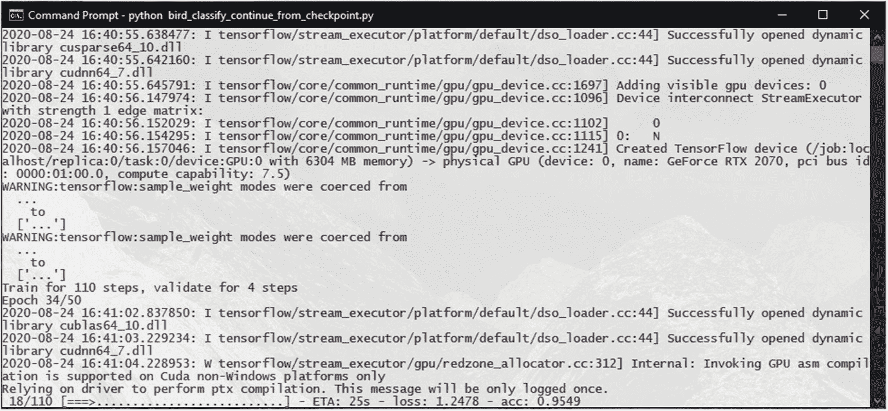

# 八、开始、停止和恢复学习

现在你可能已经知道，训练深度学习模型可能需要很长时间:根据模型的复杂程度和数据集的大小，可能需要几个小时甚至几天。

有时，在一次培训中完成培训可能不切实际。

电源故障、机器无响应、操作系统错误、计划外重启或 Windows 更新可能会导致您损失数小时甚至数天的工作。

我们如何降低这种风险？

一种方法是提高模型训练的速度。

## 利用多线程技术提高训练速度

当我们使用带有`model.fit()`函数的数据生成器进行训练时，默认情况下，我们在单线程模式下准备数据批次。基本上，在这种模式下，只有一个 CPU 线程准备和排队要发送到模型进行训练的数据批。默认情况下，队列大小设置为 10，这可能会导致 GPU 必须等待更多批次排队。

虽然这种单线程批处理准备模式提供了更可预测的行为，并且更易于调试，但大多数时候它会减慢训练过程。

这就是`model.fit()`功能支持多线程模式的原因。我们可以通过使用`workers`参数来指定要使用的工作线程的数量，以及增加`max_queue_size`参数来增加排队的批处理的数量来启用它。

让我们看看通过调整这些参数，我们可以实现多大的速度提升。

我们将从使用上一章的 InceptionV3 模型的鸟类分类系统开始，并添加几行代码来测量训练所用的时间。我们将为此导入时间包:

```py
13: import time

```

我们将在定义了实用函数之后，在脚本的开头标记开始时间:

```py
59: # start time of the script
60: start_time = time.time()
61:
62: # dimensions of our images.
63: img_width, img_height = 224, 224
64:
65: train_data_dir = 'data/train'
66: validation_data_dir = 'data/validation'
67:

```

在脚本的最后，我们将标记结束时间，并计算培训所需的时间:

```py
209: end_time = time.time()
210:
211: training_duration = end_time - start_time
212: print("[INFO] Total Time for training: {} seconds".format(training_duration))

```

让我们看看在单线程批处理模式下在我们的 InceptionV3 模型上运行训练(包括瓶颈特性和微调)需要多少时间(图 [8-1](#Fig1) )。


图 8-1

单线程批处理模式下训练所用的时间

整个训练大约需要 1101 秒(18 分 21 秒)。

现在让我们看看是否可以使用多线程来改进它。

对于我们的两个`model.fit()`函数，我们将增加两个参数:`workers`和`max_queue_size`:

```py
142: history = model.fit(
143:     train_generator,
144:     steps_per_epoch=train_steps,
145:     epochs=epochs,
146:     validation_data=validation_generator,
147:     validation_steps=validation_steps,
148:     class_weight=class_weights,
149:     max_queue_size=15,
150:     workers=8
151:     )
...
...
192: history = model.fit(
193:     train_generator,
194:     steps_per_epoch=train_steps,
195:     epochs=ft_epochs,
196:     validation_data=validation_generator,
197:     validation_steps=validation_steps,
198:     class_weight=class_weights,
199:     max_queue_size=15,
200:     workers=8
201:     )

```

`workers`参数定义了多少个 CPU 线程并行工作来生成数据批。默认值为 1，因此我们在这里将其增加到了 8。

`max_queue_size`参数定义了队列中有多少批次在被训练消耗之前保持就绪。默认值为 10，这里我们将其增加到了 15。

让我们看看这些参数值如何影响我们的训练时间(图 [8-2](#Fig2) )。


图 8-2

多线程批处理模式下训练所用的时间

训练时间现在减少到 364 秒，也就是 6 分 3 秒多一点。这是训练时间的大约 300%的改进。

然而，在使用这种方法时，有一些事情你应该记住。

首先，您将获得的实际速度提升将取决于模型结构，以及您正在使用的数据集。

其次，在分配工作线程数量时，应该考虑 CPU 并行支持的线程数量。将工人数量设置得太高可能会锁定或冻结您的机器。在 Windows 上要遵循的一个很好的经验法则是将工作线程数设置为低于 CPU 的最大线程数。例如，如果您的 CPU 支持 12 个线程，那么将工作线程的数量保持在 8。这将允许操作系统、后台任务和培训的其他任务在不锁定的情况下运行。

最后，在极少数情况下，你可能会在训练中遇到不规范的行为。这可能是由于您正在使用的版本或该版本的 Windows 版本中的错误造成的。如果您遇到问题，请先尝试禁用多线程，然后再更改模型中的其他内容。

Note

在 TensorFlow 2.x 的某些 Windows 版本中，当运行多线程训练时，您可能会遇到错误消息，如“tensor flow/core/kernels/data/generator _ dataset _ op . cc:103]完成 GeneratorDataset 迭代器时出错:已取消:操作已取消”(图 [8-3](#Fig3) )。这可以安全地忽略，并有望在未来的版本中得到解决。


图 8-3

多线程错误消息

## 使用模型检查点

回顾我们最初的问题——减少培训的潜在中断——我们可以看到，加快培训过程只解决了部分问题。即使有多线程提供的加速，中断仍然可能发生，您可能会丢失您的进度。

这就是模型检查点的概念的由来:在训练过程中的某些点保存模型的状态，以便您可以在以后恢复模型。

我们讨论了如何使用`model.save()`函数将整个模型保存到一个文件中，包括它的权重、编译和优化器状态。

模型检查点的工作原理相同。

但是，您可以让 TensorFlow/Keras 框架为您保存它们，而不必手动保存模型。

在 TensorFlow/Keras 中，训练过程支持回调函数。回调允许您在培训的特定阶段执行功能。TensorFlow/Keras 中有几个内置回调，同时还允许您定义自定义回调。

其中一个内置回调是 ModelCheckpoint。

ModelCheckpoint 回调类允许您以给定的频率或在给定的条件下自动保存正在训练的模型。例如，您可以告诉 ModelCheckpoint 在每个定型时期后保存模型，或者每 5 个时期后保存模型，或者仅在验证准确性增加时保存模型，等等。

模型检查点的参数如下:

```py
tensorflow.keras.callbacks.ModelCheckpoint(
    checkpoint_filepath,
    monitor="val_loss",
    verbose=0,
    save_best_only=False,
    save_weights_only=False,
    mode="auto",
    save_freq="epoch"
)

```

*   **checkpoint_filepath:** 保存检查点的文件路径。这可以将来自训练时期的一些参数作为格式化选项，以便您可以将这些值注入到文件名中。我们稍后将讨论这些选项。

*   **monitor:** 如果 save_best_only 设置为 true，则监控什么训练参数。

*   **详细:**详细级别，0 或 1。

*   **save_best_only:** 是否仅在被监视的参数(由 monitor 参数指定)改善时保存检查点。

*   **save_weights_only:** 是只保存权重(类似于`model.save_weights()`)，还是整个模型(类似于`model.save()`)。

*   **模式:**如何监测被监测参数的改善情况。例如，如果 monitor 是 val_acc，则模式应该是 max 如果是 val_loss，模式应该是 min。如果模式设置为自动，它将尝试使用被监控参数的名称导出模式。

*   **save_freq:** 应该在哪个点保存检查点。如果设置为 epoch，检查点将在每个 epoch 后保存。如果设置为一个数字，那么每次经过这么多纪元时都会保存检查点。

Note

在 TensorFlow v2.1 或更低版本上，使用 period 参数而不是 save_freq。

让我们在鸟类分类模型中添加模型检查点。我们将添加一个新目录 checkpoints/training 来保存检查点。(可能还有一个检查点/微调目录，用于在微调中保存检查点)。

我们将像以前一样获得一份我们的 InceptionV3 微调代码的副本，并将其命名为`bird_classify_inceptionV3_checkpoint.py`。我们将把导入添加到其中的 ModelCheckpoint 回调中。我们还将对`model.compile()`呼叫进行更改，从`metrics=['accuracy']`改为`metrics=['acc']`。这对于与我们将在模型检查点中使用的一些命名约定保持一致非常重要:

```py
9: from tensorflow.keras.callbacks import ModelCheckpoint
...
...
136: model.compile(optimizer='rmsprop', loss="categorical_crossentropy", metrics=['acc'])
137:
138: training_checkpoint_dir = 'checkpoints/training'
139:
140: filepath = training_checkpoint_dir + "/model-{epoch:02d}-{val_acc:.2f}-{val_loss:.2f}.h5"
141: checkpoint = ModelCheckpoint(
142:                             filepath,
143:                             verbose=1,
144:                             save_best_only=False,
145:                             save_weights_only=False,
146:                             save_freq="epoch"
147:                             )
148:
149: callbacks_list = [checkpoint]
150:
151: history = model.fit(

152:     train_generator,
153:     steps_per_epoch=train_steps,
154:     epochs=epochs,
155:     validation_data=validation_generator,
156:     validation_steps=validation_steps,
157:     class_weight=class_weights,
158:     max_queue_size=15,
159:     workers=8,
160:     callbacks=callbacks_list
161:     )

```

Note

指定`metrics=['accuracy']`时，精度度量将报告为 accuracy 和 val_accuracy。当将它们指定为`metrics=['acc']`时，它们将被报告为 acc 和 val_acc，这是许多回调函数所期望的命名约定。确保您还更新了`graph_training_history()`函数，以更新 acc 的所有精度引用，以及 val_acc 的 val_accuracy 引用。如果没有更新，您可能会收到诸如“KeyError: 'acc ."

这里，我们已经指定了每个时期要保存的检查点。我们没有监控任何参数。

由于我们已经将文件名模式指定为 model-{ epoch:02d }-{ val _ ACC:. 2f }-{ val _ loss:. 2f } . H5，epoch 编号、验证准确度值和验证损失值将被注入到正在保存的文件名中(图 [8-4](#Fig4) )。例如，文件名 model-01-0.80-12.06.h5 将指示纪元是 01，验证准确度是 0.80，验证损失是 12.06。这些值允许您通过检查文件名轻松选择最佳检查点。


图 8-4

每个时期保存的模型检查点

虽然可能存在需要保存每个训练历元的情况(例如，当训练生成性对抗网络时，我们不能直接依赖准确性度量来识别模型改进)，但在大多数情况下，最好仅在训练改进时保存检查点。

现在，让我们更新代码，仅在验证损失改善时(验证损失最小时)保存检查点:

```py
9: from tensorflow.keras.callbacks import ModelCheckpoint
...
...
130: model.compile(optimizer='rmsprop', loss="categorical_crossentropy", metrics=['acc'])
131:
132: training_checkpoint_dir = 'checkpoints/training'
133:
134: filepath = training_checkpoint_dir + "/model-{epoch:02d}-{val_acc:.2f}-{val_loss:.2f}.h5"
135: checkpoint = ModelCheckpoint(
136:                             filepath,
137:                             monitor="val_loss",
138:                             verbose=1,
139:                             save_best_only=True,
140:                             save_weights_only=False,
141:                             mode="min"
142:                             )
143:
144: callbacks_list = [checkpoint]
145:
146: history = model.fit(

147:     train_generator,
148:     steps_per_epoch=train_steps,
149:     epochs=epochs,
150:     validation_data=validation_generator,
151:     validation_steps=validation_steps,
152:     class_weight=class_weights,
153:     callbacks=callbacks_list
154:     )

```

这里，我们将 save_best_only 参数设置为 True，并将监视器设置为 val_loss，将模式设置为 min，以便仅在验证丢失低于前一个时期时保存检查点(图 [8-5](#Fig5) )。


图 8-5

只保存最好的检查点

这将减少保存的检查点文件的数量，从而更容易挑选出模型的最佳状态。

根据您的模型的要求，您可以对模型的任何其他矩阵执行相同的操作:acc、loss、val_acc、val_loss。

现在让我们假设您的模型训练被中断了，但是您保存了一些模型检查点。你怎么能从其中一个检查点重新开始训练呢？

举个例子，假设我们保存了以下检查点(图 [8-6](#Fig6) ),并且我们的训练在纪元 33 之后的某个时候被中断。


图 8-6

保存的检查点

让我们开始一个新的代码文件，它将允许我们从一个检查点继续训练。我们将它命名为`bird_classify_continue_from_checkpoint.py`。

我们将从导入包开始。这些将与我们之前的进口相同:

```py
01: import tensorflow as tf
02: import numpy as np
03: from tensorflow.keras.preprocessing.image import ImageDataGenerator, img_to_array, load_img
04: from tensorflow.keras.models import Sequential, Model, load_model
05: from tensorflow.keras.layers import Dropout, Flatten, Dense, GlobalAveragePooling2D, Input
06: from tensorflow.keras.applications.inception_v3 import InceptionV3
07: from tensorflow.keras import optimizers
08: from tensorflow.keras.optimizers import SGD
09: from tensorflow.keras.callbacks import ModelCheckpoint
10: import matplotlib.pyplot as plt
11: import math
12: import os
13: import os.path
14: import time

```

然后，我们将定义我们通常的效用函数:

```py
16: # utility functions
17: def graph_training_history(history):
18:     plt.rcParams["figure.figsize"] = (12, 9)
19:
20:     plt.style.use('ggplot')
21:
22:     plt.figure(1)
23:
24:     # summarize history for accuracy
25:
26:     plt.subplot(211)
27:     plt.plot(history.history['acc'])
28:     plt.plot(history.history['val_acc'])
29:     plt.title('Model Accuracy')
30:     plt.ylabel('Accuracy')
31:     plt.xlabel('Epoch')
32:     plt.legend(['Training', 'Validation'], loc='lower right')
33:
34:     # summarize history for loss

35:
36:     plt.subplot(212)
37:     plt.plot(history.history['loss'])
38:     plt.plot(history.history['val_loss'])
39:     plt.title('Model Loss')
40:     plt.ylabel('Loss')
41:     plt.xlabel('Epoch')
42:     plt.legend(['Training', 'Validation'], loc='upper right')
43:
44:     plt.tight_layout()
45:
46:     plt.show()
47:
48: # util function to calculate the class weights based on the number of samples on each class
49: # this is useful with datasets that are highly skewed (datasets where
50: # the number of samples in each class differs vastly)
51: def get_class_weights(class_data_dir):
52:     labels_count = dict()
53:     for img_class in [ic for ic in os.listdir(class_data_dir) if ic[0] != '.']:
54:         labels_count[img_class] = len(os.listdir(os.path.join(class_data_dir, img_class)))
55:     total_count = sum(labels_count.values())
56:     class_weights = {cls: total_count / count for cls, count in
57:                     enumerate(labels_count.values())}
58:     return class_weights

```

然后，我们将添加一个新函数，该函数将返回给定检查点的纪元编号:

```py
60: # util function to get the initial epoch number from the checkpoint name
61: def get_init_epoch(checkpoint_path):
62:     filename = os.path.basename(checkpoint_path)
63:     filename = os.path.splitext(filename)[0]
64:     init_epoch = filename.split("-")[1]
65:     return int(init_epoch)

```

我们的培训参数将和以前一样:

```py
68: # start time of the script
69: start_time = time.time()
70:
71: # dimensions of our images.
72: img_width, img_height = 224, 224
73:
74: train_data_dir = 'data/train'
75: validation_data_dir = 'data/validation'
76:
77: # number of epochs to train
78: epochs = 50
79:
80: # batch size used by flow_from_directory
81: batch_size = 16

```

然后，我们定义要加载的检查点，并使用我们之前定义的函数获取它的纪元编号:

```py
83: # the checkpoint to load and continue from
84: checkpoint_to_load = "checkpoints/training/model-33-0.94-8.92.h5"
85: # get the epoch number to continue from
86: init_epoch = get_init_epoch(checkpoint_to_load)

```

我们的数据生成器和参数将被定义为与初始训练脚本完全相同:

```py
088: # this is the augmentation configuration we will use for training
089: train_datagen = ImageDataGenerator(
090:     rescale=1\. / 255,
091:     shear_range=0.2,
092:     zoom_range=0.2,
093:     horizontal_flip=True)
094:
095: # this is the augmentation configuration we will use for testing:
096: # only rescaling
097: test_datagen = ImageDataGenerator(rescale=1\. / 255)
098:
099: train_generator = train_datagen.flow_from_directory(
100:     train_data_dir,
101:     target_size=(img_width, img_height),
102:     batch_size=batch_size,
103:     class_mode='categorical')
104:
105: validation_generator = test_datagen.flow_from_directory(
106:     validation_data_dir,
107:     target_size=(img_width, img_height),
108:     batch_size=batch_size,
109:     class_mode='categorical')
110:
111: # the number of classes/categories
112: num_classes = len(train_generator.class_indices)
113:
114: # calculate the training steps
115: nb_train_samples = len(train_generator.filenames)
116: train_steps = int(math.ceil(nb_train_samples / batch_size))
117:
118: # calculate the validation steps
119: nb_validation_samples = len(validation_generator.filenames)
120: validation_steps = int(math.ceil(nb_validation_samples / batch_size))
121:
122: # get the class weights
123: class_weights = get_class_weights(train_data_dir)

```

然后我们使用`load_model()`函数来加载检查点。一旦加载，它将成为我们的模型:

```py
125: # load the model state from the checkpoint
126: model = load_model(checkpoint_to_load)

```

检查点定义将与之前相同:

```py
128: training_checkpoint_dir = 'checkpoints/training'
129:
130: filepath = training_checkpoint_dir + "/model-{epoch:02d}-{val_acc:.2f}-{val_loss:.2f}.h5"
131: checkpoint = ModelCheckpoint(
132:                             filepath,
133:                             monitor="val_acc",
134:                             verbose=1,
135:                             save_best_only=True,
136:                             save_weights_only=False,
137:                             mode="max"
138:                             )
139:
140: callbacks_list = [checkpoint]

```

在`model.fit()`函数中，我们添加了一个额外的参数`initial_epoch`,该参数具有我们之前导出的值，用于指定从哪个时期开始训练:

```py
142: history = model.fit(
143:     train_generator,
144:     steps_per_epoch=train_steps,
145:     epochs=epochs,
146:     validation_data=validation_generator,
147:     validation_steps=validation_steps,
148:     class_weight=class_weights,
149:     initial_epoch=init_epoch,
150:     callbacks=callbacks_list
151:     )

```

培训的其余步骤将保持不变:

```py
153: model.save('bird_classify_fine-tune_IV3_S1.h5')
154:
155: (eval_loss, eval_accuracy) = model.evaluate(
156:     validation_generator, steps=validation_steps)
157:
158: print("\n")
159:
160: print("[INFO] accuracy: {:.2f}%".format(eval_accuracy * 100))
161: print("[INFO] Loss: {}".format(eval_loss))
162:
163:
164: # Run Fine-tuning on our model
...
...

```

运行这段代码，我们将看到训练现在开始于第 34 个时期(图 [8-7](#Fig7) )。



图 8-7

从检查站继续训练

有了模型检查点，我们可以确保在一个失败的事件中，我们在训练一个模型上花费的几个小时或几天的努力不会丢失。

## 知道何时停止训练

在我们之前训练的所有模型中，我们将待训练的时期数指定为固定数。我们使用了过去在类似模型中运行良好的数字。

但是我们如何确定训练模型的最佳时期数呢？

训练过多可能导致过度适应。但是训练太少不会给你最好的结果。为了达到最佳效果，我们需要找到停止训练的最佳点。

我们可以确定的一种方法是针对不同的时期数进行训练，并比较结果。但对于深度学习模型，每次训练可能需要几个小时，甚至几天。因此，总是进行几次训练来确定最佳方案可能不切实际。

但是如果有办法在训练达到一个最优点的时候自动停止训练呢？

这就是模型早期停止的用武之地。EarlyStopping 是 TensorFlow/Keras 中的另一个内置回调函数，可以与`model.fit()`函数一起使用。

早期停止的工作方式类似于模型检查点中的度量监视工作方式，即持续监视给定的度量，如果在给定的时期数内没有改善，则停止训练。

当实现早期停止时，最好也实现模型检查点。当提前停止在某一点停止训练时，可以使用保存的检查点使模型处于最佳点。

提前停止的参数如下:

*   **monitor:** 监视什么指标，比如模型检查点。

*   **min_delta:** 被视为改进的受监控指标的最小变化。

*   **耐心:**在停止训练之前要等待多少个时期才能有所改善。

*   **详细:**详细级别

*   **模式:**最小、最大或自动，与模型检查点一样。

*   **基线:**训练的基线是什么。如果没有超过基线，训练将会停止。

*   **restore_best_weights:** 是否根据被监控的参数将模型恢复到其最低点。如果将此设置为 False，则模型将使用停止前完成的最后一步的权重，这可能是也可能不是最好的。

```py
tensorflow.keras.callbacks.EarlyStopping(
    monitor="val_loss",
    min_delta=0,
    patience=0,
    verbose=0,
    mode="auto",
    baseline=None,
    restore_best_weights=False,
)

```

让我们在模型中加入提前停车。我们将从`bird_classify_inceptionV3_checkpoint.py`中复制一份代码，并将其命名为`bird_classify_inceptionV3_early_stopping.py`。然后，我们将对其进行以下修改:

```py
9: from tensorflow.keras.callbacks import ModelCheckpoint, EarlyStopping
...
...
132: training_checkpoint_dir = 'checkpoints/training'
133:
134: filepath = training_checkpoint_dir + "/model-{epoch:02d}-{val_acc:.2f}-{val_loss:.2f}.h5"
135: checkpoint = ModelCheckpoint(
136:                             filepath,
137:                             monitor="val_acc",
138:                             verbose=1,
139:                             save_best_only=True,
140:                             save_weights_only=False,
141:                             mode="max"
142:                             )
143:
144: early_stop = EarlyStopping(
145:                             monitor="val_acc",
146:                             mode="max",
147:                             verbose=1,
148:                             patience=3,
149:                             restore_best_weights=True
150:                             )
151:
152: callbacks_list = [checkpoint, early_stop]
153:
154: history = model.fit(
155:                     train_generator,
156:                     steps_per_epoch=train_steps,
157:                     epochs=epochs,
158:                     validation_data=validation_generator,
159:                     validation_steps=validation_steps,
160:                     class_weight=class_weights,
161:                     max_queue_size=15,
162:                     workers=8,
163:                     callbacks=callbacks_list

164:                     )

```

这里，我们指定 EarlyStopping 来监控验证准确性，如果连续三个时期没有改善，就停止训练。我们还指定一旦停止，它应该将模型恢复到上一个最佳状态(在本例中是三个时期之前)。

当使用这些配置运行模型时，您会看到当训练没有改进模型时，训练将自动停止(图 [8-8](#Fig8) )。


图 8-8

提前停止模型训练

## 构建强大的培训脚本

使用模型检查点，我们能够在中断的情况下恢复我们的模型训练状态。通过提前停止，我们能够在训练的正确点自动停止模型的训练。

现在，让我们看看如何将它们结合起来构建一个健壮的训练脚本——一个你可以随时停止和开始而不会丢失你的进度的脚本。

在构建强大的培训脚本时，我们需要考虑以下几点:

*   我们模块的训练包括两个步骤:训练初始模型，和微调模型。

*   对于这些步骤中的每一步，我们都需要确定该步骤是否已经完成，并运行剩下的步骤。

*   对于需要运行的每一步，我们需要确定最后一次训练在哪里停止，并从那个时期继续。

*   在训练时，我们需要保存检查点，以便稍后可以从这些点继续该步骤的训练。

记住这些，让我们建立我们健壮的训练脚本。

我们将新的代码文件命名为`bird_classify_robust_training.py`，并从导入包开始:

```py
01: import tensorflow as tf
02: import numpy as np
03: from tensorflow.keras.preprocessing.image import ImageDataGenerator, img_to_array, load_img
04: from tensorflow.keras.models import Sequential, Model, load_model
05: from tensorflow.keras.layers import Dropout, Flatten, Dense, GlobalAveragePooling2D, Input
06: from tensorflow.keras.applications.inception_v3 import InceptionV3
07: from tensorflow.keras import optimizers
08: from tensorflow.keras.optimizers import SGD
09: from tensorflow.keras.callbacks import ModelCheckpoint, EarlyStopping
10: import matplotlib.pyplot as plt
11: import math
12: import os
13: import os.path
14: import time

```

然后我们将添加我们的效用函数定义。这里的新内容是我们的`graph_training_history()`函数现在接受两个额外的参数来将图形保存到一个文件中，而不是显示它:

```py
16: # utility functions
17: def graph_training_history(history, save_fig=False, save_path=None):
18:     plt.rcParams["figure.figsize"] = (12, 9)
19:
20:     plt.style.use('ggplot')
21:
22:     plt.figure(1)
23:
24:     # summarize history for accuracy
25:
26:     plt.subplot(211)
27:     plt.plot(history.history['acc'])
28:     plt.plot(history.history['val_acc'])
29:     plt.title('Model Accuracy')
30:     plt.ylabel('Accuracy')
31:     plt.xlabel('Epoch')
32:     plt.legend(['Training', 'Validation'], loc='lower right')
33:
34:     # summarize history for loss
35:
36:     plt.subplot(212)
37:     plt.plot(history.history['loss'])
38:     plt.plot(history.history['val_loss'])
39:     plt.title('Model Loss')
40:     plt.ylabel('Loss')
41:     plt.xlabel('Epoch')
42:     plt.legend(['Training', 'Validation'], loc='upper right')
43:
44:     plt.tight_layout()
45:
46:     if save_fig:
47:         plt.savefig(save_path, bbox_inches="tight", dpi=300)
48:     else:
49:         plt.show()
50:
51:     # clear and close the current figure
52:     plt.clf()
53:     plt.close()
54:
55: # util function

to calculate the class weights based on the number of samples on each class
56: # this is useful with datasets that are highly skewed (datasets where
57: # the number of samples in each class differs vastly)
58: def get_class_weights(class_data_dir):
59:     labels_count = dict()
60:     for img_class in [ic for ic in os.listdir(class_data_dir) if ic[0] != '.']:
61:         labels_count[img_class] = len(os.listdir(os.path.join(class_data_dir, img_class)))
62:     total_count = sum(labels_count.values())
63:     class_weights = {cls: total_count / count for cls, count in
64:                     enumerate(labels_count.values())}
65:     return class_weights
66:
67: # util function to get the initial epoch number from the checkpoint name
68: def get_init_epoch(checkpoint_path):
69:     filename = os.path.basename(checkpoint_path)
70:     filename = os.path.splitext(filename)[0]
71:     init_epoch = filename.split("-")[1]
72:     return int(init_epoch)

```

然后，我们检查保存的模型文件是否存在，以确定需要运行哪一步培训(初始培训或微调):

```py
74: run_training = True
75: run_finetune = True
76:
77: class_indices_path = 'class_indices.npy'
78: initial_model_path = 'bird_classify_finetune_initial.h5'
79: final_model_path = 'bird_classify_finetune_final.h5'
80:
81: # check which of the training steps still need to complete
82: # if saved model file is already there, then that step is considered complete
83: if os.path.isfile(initial_model_path):
84:     run_training = False
85:     print("[Info] Initial model exists '{}'. Skipping training step.".format(initial_model_path))
86:
87: if os.path.isfile(final_model_path):
88:     run_finetune = False
89:     print("[Info] Fine-tuned model exists '{}'. Skipping fine-tuning step.".format(final_model_path))

```

对于需要运行的每个步骤，我们然后确定从哪个检查点开始:

```py
091: load_from_checkpoint_train = False
092:
093: training_checkpoint_dir = 'checkpoints/training'
094: if run_training and len(os.listdir(training_checkpoint_dir)) > 0:
095:     # the checkpoint to load and continue from
096:     training_checkpoint = os.path.join(training_checkpoint_dir, os.listdir(training_checkpoint_dir)[len(os.listdir(training_checkpoint_dir))-1])
097:     load_from_checkpoint_train = True
098:
099: init_epoch_train = 0
100: if load_from_checkpoint_train:
101:     # get the epoch number to continue from
102:     print(training_checkpoint)
103:     init_epoch_train = get_init_epoch(training_checkpoint)
104:     print("[Info] Training checkpoint found for epoch {}. Will continue from that step.".format(init_epoch_train))
105:
106:
107: load_from_checkpoint_finetune = False
108:
109: finetune_checkpoint_dir = 'checkpoints/finetune'
110: if run_finetune and len(os.listdir(finetune_checkpoint_dir)) > 0:
111:     # the checkpoint to load and continue from
112:     finetune_checkpoint = os.path.join(finetune_checkpoint_dir, os.listdir(finetune_checkpoint_dir)[len(os.listdir(finetune_checkpoint_dir))-1])
113:     load_from_checkpoint_finetune = True
114:
115: init_epoch_finetune = 0
116: if load_from_checkpoint_finetune:
117:     # get the epoch number to continue from
118:     init_epoch_finetune = get_init_epoch(finetune_checkpoint)
119:     print("[Info] Training checkpoint found for epoch {}. Will continue from that step.".format(init_epoch_finetune))

```

然后，我们的数据生成器和训练参数照常定义:

```py
122: # start time of the script
123: start_time = time.time()
124:
125: # dimensions of our images.
126: img_width, img_height = 224, 224
127:
128: train_data_dir = 'data/train'
129: validation_data_dir = 'data/validation'
130:
131: # number of epochs to train
132: epochs = 50
133:
134: # batch size used by flow_from_directory
135: batch_size = 16
136:
137:
138: # this is the augmentation configuration we will use for training
139: train_datagen = ImageDataGenerator(
140:     rescale=1\. / 255,
141:     shear_range=0.2,
142:     zoom_range=0.2,
143:     horizontal_flip=True)
144:
145: # this is the augmentation configuration we will use for testing:
146: # only rescaling
147: test_datagen = ImageDataGenerator(rescale=1\. / 255)
148:
149: train_generator = train_datagen.flow_from_directory(
150:     train_data_dir,
151:     target_size=(img_width, img_height),
152:     batch_size=batch_size,
153:     class_mode='categorical')
154:
155: validation_generator = test_datagen.flow_from_directory(
156:     validation_data_dir,
157:     target_size=(img_width, img_height),
158:     batch_size=batch_size,
159:     class_mode='categorical')
160:
161: # the number of classes/categories

162: num_classes = len(train_generator.class_indices)
163:
164: # save the class indices for use in the predictions
165: np.save(class_indices_path, train_generator.class_indices)
166:
167: # calculate the training steps
168: nb_train_samples = len(train_generator.filenames)
169: train_steps = int(math.ceil(nb_train_samples / batch_size))
170:
171: # calculate the validation steps
172: nb_validation_samples = len(validation_generator.filenames)
173: validation_steps = int(math.ceil(nb_validation_samples / batch_size))
174:
175: # get the class weights
176: class_weights = get_class_weights(train_data_dir)

```

基于我们之前检查的条件，我们要么从头开始训练，如果检查点已经存在，则从检查点开始，或者如果已训练的模型文件已经存在，则跳过训练步骤:

```py
178: if run_training:
179:     if load_from_checkpoint_train:
180:         model = load_model(training_checkpoint)
181:     else:
182:         # create the base pre-trained model
183:         base_model = InceptionV3(
184:             weights='imagenet',
185:             include_top=False,
186:             input_tensor=Input(shape=(img_width, img_height, 3))
187:             )
188:
189:         # add a global spatial average pooling layer
190:         x = base_model.output
191:         x = GlobalAveragePooling2D()(x)
192:         x = Dense(512, activation="relu")(x)
193:         predictions = Dense(num_classes, activation="softmax")(x)
194:
195:         # this is the model we will train
196:         model = Model(inputs=base_model.input, outputs=predictions)
197:
198:         # first: train only the top layers (which were randomly initialized)
199:         # i.e. freeze all convolutional layers
200:         for layer in base_model.layers:
201:             layer.trainable = False

202:
203:         # compile the model (should be done *after* setting layers to non-trainable)
204:         model.compile(optimizer='rmsprop', loss="categorical_crossentropy", metrics=['acc'])
205:
206:     filepath = training_checkpoint_dir + "/model-{epoch:02d}-{val_acc:.2f}-{val_loss:.2f}.h5"
207:     checkpoint = ModelCheckpoint(
208:                                 filepath,
209:                                 monitor="val_acc",
210:                                 verbose=1,
211:                                 save_best_only=True,
212:                                 save_weights_only=False,
213:                                 mode="max"
214:                                 )
215:
216:     early_stop = EarlyStopping(
217:                                 monitor="val_acc",
218:                                 mode="max",
219:                                 verbose=1,
220:                                 patience=5,
221:                                 restore_best_weights=True
222:                                 )
223:
224:     callbacks_list = [checkpoint, early_stop]
225:
226:     history = model.fit(
227:                         train_generator,
228:                         steps_per_epoch=train_steps,
229:                         epochs=epochs,
230:                         validation_data=validation_generator,
231:                         validation_steps=validation_steps,
232:                         class_weight=class_weights,
233:                         max_queue_size=15,
234:                         workers=8,
235:                         initial_epoch=init_epoch_train,
236:                         callbacks=callbacks_list

237:                         )
238:
239:     model.save(initial_model_path)
240:
241:     (eval_loss, eval_accuracy) = model.evaluate(
242:         validation_generator, steps=validation_steps)
243:
244:     print("\n")
245:
246:     print("[INFO] accuracy: {:.2f}%".format(eval_accuracy * 100))
247:     print("[INFO] Loss: {}".format(eval_loss))
248:
249:     graph_training_history(history, save_fig=True, save_path='training.png')
250:
251: else:
252:     # training step is already completed
253:     # load the already trained model
254:     model = load_model(initial_model_path)

```

然后，我们将对微调步骤进行同样的操作:

```py
257: # Run Fine-tuning on our model
258: if run_finetune:
259:     # number of epochs to fine-tune
260:     ft_epochs = 25
261:
262:     # reset our data generators
263:     train_generator.reset()
264:     validation_generator.reset()
265:
266:     if load_from_checkpoint_finetune:
267:         model = load_model(finetune_checkpoint)
268:     else:
269:         # we chose to train the last convolution block from the base model
270:         for layer in model.layers[:249]:
271:             layer.trainable = False
272:         for layer in model.layers[249:]:
273:             layer.trainable = True
274:
275:         # we need to recompile the model for these modifications to take effect
276:         # we use SGD with a low learning rate

277:         model.compile(
278:             optimizer=optimizers.SGD(lr=0.0001, momentum=0.9),
279:             loss='categorical_crossentropy',
280:             metrics=['acc']
281:             )
282:
283:     filepath = finetune_checkpoint_dir + "/model-{epoch:02d}-{val_acc:.2f}-{val_loss:.2f}.h5"
284:     checkpoint = ModelCheckpoint(
285:                                 filepath,
286:                                 monitor="val_acc",
287:                                 verbose=1,
288:                                 save_best_only=True,
289:                                 save_weights_only=False,
290:                                 mode="max"
291:                                 )
292:
293:     early_stop = EarlyStopping(
294:                                 monitor="val_acc",
295:                                 mode="max",
296:                                 verbose=1,
297:                                 patience=5,
298:                                 restore_best_weights=True
299:                                 )
300:
301:     callbacks_list = [checkpoint, early_stop]
302:
303:     history = model.fit(
304:                         train_generator,
305:                         steps_per_epoch=train_steps,
306:                         epochs=ft_epochs,
307:                         validation_data=validation_generator,
308:                         validation_steps=validation_steps,
309:                         class_weight=class_weights,
310:                         max_queue_size=15,
311:                         workers=8,
312:                         initial_epoch=init_epoch_finetune,
313:                         callbacks=callbacks_list
314:                         )
315:
316:     model.save(final_model_path)
317:
318:     (eval_loss, eval_accuracy) = model.evaluate(

319:         validation_generator, steps=validation_steps)
320:
321:     print("\n")
322:
323:     print("[INFO] accuracy: {:.2f}%".format(eval_accuracy * 100))
324:     print("[INFO] Loss: {}".format(eval_loss))
325:
326:     graph_training_history(history, save_fig=True, save_path='finetune.png')
327:
328:     end_time = time.time()
329:
330:     training_duration = end_time - start_time
331:     print("[INFO] Total Time for training: {} seconds".format(training_duration))

```

这个脚本现在允许你从训练过程中的任何步骤恢复(图 [8-9](#Fig9) 和 [8-10](#Fig10) )。


图 8-10

跳过已经完成的训练步骤，并从微调检查点继续


图 8-9

从检查点恢复训练步骤

有了这样的训练脚本，您可以随时开始、停止和恢复训练，而不用担心由于中断而丢失进度。