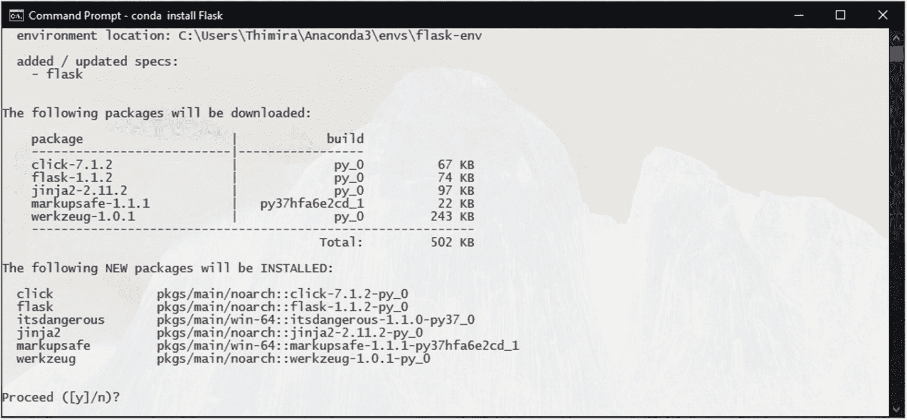
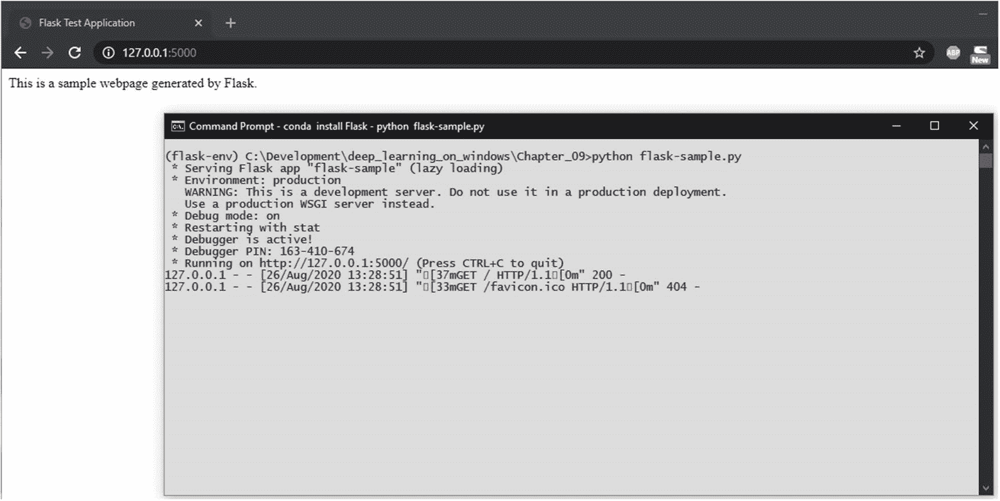

# 九、将您的模型部署为 Web 应用

在过去的几章中，我们已经讨论了一些优化模型训练的技术。我们经历了从小数据集开始的步骤，以获得可以在实际场景中应用的结果。

您现在知道了训练一个实用模型所需的步骤。现在该谈谈如何把你训练好的模型做成应用了。

在第 [7](07.html) 章中，我们简要讨论了如何构建一个脚本来使用训练好的模型运行预测(图 [9-1](#Fig1) )。


图 9-1

使用脚本通过模型运行预测

但是使用这样的脚本并不是一种用户友好的应用开发方式。一个更好的方法是将你的模型转换成一个 web 应用。它将允许更好的可用性，以及允许您向多个用户提供新的深度学习应用。

我们可以使用 Flask 框架将我们的模型转换成 web 应用。

## 安装烧瓶

Flask 是一个用于 Python 的轻量级微 web 框架，它允许您构建网站、web 应用、API 和微服务。只要有几个基本的依赖项，您就可以用一个简单的结构开始构建您的应用，然后使用一个大型的可用扩展库在其上扩展附加的特性和可伸缩性。

当我们在第 [3](03.html) 章中用 Anaconda 元包建立深度学习环境时，我们安装了 Flask 包和其他几个依赖包，它们将帮助我们构建应用。

如果您想单独安装 Flask，只需运行:

```py
conda install Flask

```

这将安装 Flask，以及 Werkzeug、Jinja2、MarkupSafe 及其危险包(图 [9-2](#Fig2) )。



图 9-2

Conda 安装烧瓶和附件

安装完成后，我们可以通过创建一个简单的应用来测试 Flask。我们将这个文件命名为`flask-sample.py`:

```py
01: from flask import Flask
02:
03: header_text = '''
04:     <html>\n<head> <title>Flask Test Application</title> </head>\n<body>'''
05: page_content = '''
06:     <p>This is a sample webpage generated by Flask.</p>\n'''
07: footer_text = '''</body>\n</html>'''
08:
09: # request handler function for the home/index page
10: def index():
11:   return header_text + page_content + footer_text
12:
13: # setting up the application context
14: application = Flask(__name__)
15:
16: # add a rule for the index page.
17: application.add_url_rule('/', 'index', index, methods=['GET', 'POST'])
18:
19: # run the app.
20: if __name__ == "__main__":
21:     # Setting debug to True enables debug output. This line should be
22:     # removed before deploying a production app.
23:     application.debug = True
24:     application.run()

```

这里，我们导入 Flask 包，定义应用上下文，并运行最终的 Flask 应用。我们定义了一个函数——index()—并绑定它来处理到达应用`add_url_rule()`函数的索引路径的请求。在 index()函数中，我们现在只是返回一些硬编码的 HTML 字符串。

我们可以通过运行以下命令来运行这个应用:

```py
python flask-sample.py

```

Flask 将启动一个开发 web 服务器进程来为您的应用服务。默认情况下，它将在本地主机的端口 5000 上运行。可以在 http://127.0.0.1:5000/(图 [9-3](#Fig3) )上访问申请页面。



图 9-3

烧瓶样本 Web 应用正在运行

随着 Flask 的启动和运行，我们现在准备使用 Flask 设计我们的深度学习 web 应用。

## 设计您的 Web 应用

正如我们在第 [7](07.html) 章中所做的，我们可以使用通过 model.save()函数保存的模型文件(例如，在我们的鸟类图像分类系统示例的微调中的`bird_classify_finetune_IV3_final.h5`文件)。通过使用完整的模型文件，我们可以加载处于训练状态的模型，而不必为模型结构重新定义代码。除了模型文件，我们还将使用从同一个脚本中保存的`class_indices.npy`文件。class _ indices 文件包含类的文本标签到它们的 id 的字典/映射。我们将需要标签映射来显示预测类的文本标签(图 [9-4](#Fig4) )。


图 9-4

构建 web 应用所需的模型文件

有了模型文件，我们就可以开始设计应用了。我们需要考虑以下几点:

*   作为我们系统的输入，我们需要有一个网页表单，允许上传/提交文件的 HTML 页面。

*   上传的文件需要放在 Python 代码可以读取的位置。

*   需要一个函数来处理请求，该函数加载上传的图像文件，通过模型运行它，并使用模型的结果/预测进行响应。

*   前端网页需要能够显示结果。

*   从文件加载模型需要时间。为每个请求加载模型是不现实的。因此，我们需要一种只加载一次模型的方法(最好是在应用启动时)。

*   在代码中使用 HTML 字符串是不实际的。我们应该使用模板引擎，这会给我们的前端更多的灵活性。幸运的是，Flask 的默认安装附带了 Jinja2 模板引擎。

基于这些考虑，我们将为我们的 Flask 应用定义以下结构(图 [9-5](#Fig5) ):


图 9-5

我们应用的结构

我们的应用将包含 3 个目录:模型、模板和上传，以及一个主 application.py 文件。models 目录将包含我们保存的模型文件，以及该模型的类标签字典文件。templates 目录将包含 Jinja2 模板文件(Jinja2 引擎希望这个目录被命名为 templates)。上传目录用于保存应用的上传文件。application.py 将包含 Flask 应用定义以及使用我们训练的模型处理图像和预测的函数。

遵循这个简单的应用结构将允许我们以后扩展我们的应用的功能，并且允许我们在允许 Flask 应用的各种服务中上传和托管我们的应用。

## 构建你的深度学习网络应用

为了构建我们的 web 应用，让我们从主页的模板文件开始。在我们的应用结构的 templates 目录中，创建一个`index.html`文件。

在这个文件中，首先添加页面的基本 HTML 结构。为此，我们将使用 Jinja2 模板:

```py
1: <!doctype html>
2: <html lang="en">
3:     <head>
4:         <title>Bird Image Classification System</title>
5:     </head>
6:     <body>
7:         <h3>Deep Learning Bird Image Identification System</h3>

```

在页面顶部，我们将添加一个部分来显示从后端返回的任何错误消息。我们将使用 Flask 框架中的 Flash 消息机制:

```py
08:         <!-- show error messages from backend, if any -->
09:         
10:             
11:                 <ul>
12:                 
13:                     <li>{{ message }}</li>
14:                 
15:                 </ul>
16:             
17:         

```

接下来，我们将添加允许我们上传图像的主 HTML 表单:

```py
18:         <form action="" method="post" enctype="multipart/form-data">
19:             <div>
20:                 <label for="bird_image">Select an image to upload <small>(Supports .jpg, .jpeg, .gif, and .png images.)</small></label>
21:                 <input type="file" name="bird_image" id="bird_image" accept=".jpg,.jpeg,.gif,.png" required="required">
22:             </div>
23:             <div>
24:                 <input type="submit" value="Process" name="submit">
25:             </div>
26:         </form>

```

最后，我们将添加一个部分来显示结果:

```py
27:         
28:         <br/>
29:         <br/>
30:         <div>
31:             
32:             
33:             
34:             <h3 class="card-title">Identification</h3>
35:             <p class="card-text">Predicted : {{label}}</p>
36:             <p class="card-text">Confidence [0-100]% : {{prob}} %</p>
37:         </div>
38:         
39:     </body>
40: </html>

```

这里需要注意的一点是，我们在标签中使用的是 Base64 图像数据，而不是图像文件的路径。这使我们能够显示应用了任何图像处理的图像，而不必将其保存为文件。

Note

为了简单起见，我们不会在这里添加任何样式/css。

现在我们可以开始编写 Flask 应用的主要代码了。

在我们的应用结构的根目录中启动一个`application.py`文件，并导入包:

```py
01: from flask import Flask, request, render_template, url_for, make_response, send_from_directory, flash, redirect, jsonify
02: from werkzeug.utils import secure_filename

03:
04: import numpy as np
05: import tensorflow as tf
06: from tensorflow.keras.preprocessing.image import img_to_array, load_img
07: from tensorflow.keras.models import Model, load_model
08: from tensorflow.keras.utils import to_categorical
09: from PIL import Image
10: from io import BytesIO
11: import os
12: import os.path
13: import sys
14: import base64
15: import uuid
16: import time

```

对于 TensorFlow 的某些版本，cuDNN 和 Flask 存在一些不兼容。因此，我们添加以下代码来避免不兼容:

```py
18: # avoiding some compatibility problems in TensorFlow, cuDNN, and Flask
19: from tensorflow.compat.v1 import ConfigProto
20: from tensorflow.compat.v1 import InteractiveSession
21: config = ConfigProto()
22: config.gpu_options.allow_growth = True
23: session = InteractiveSession(config=config)

```

Note

如果您尝试在没有这些兼容性修复程序的情况下运行应用，可能会遇到诸如“BaseCollectiveExecutor::StartAbort Unknown:未能获取卷积算法”之类的错误。这可能会在未来的版本中得到解决。

接下来，我们设置应用参数，并从文件中加载模型:

```py
25: # dimensions of our images.
26: img_width, img_height = 224, 224
27: # limiting the allowed filetypes
28: ALLOWED_FILETYPES = set(['.jpg', '.jpeg', '.gif', '.png'])
29:
30: model_path = 'models/bird_classify_finetune_IV3_final.h5'
31:
32: # loading the class dictionary and the model
33: class_dictionary = np.load('models/class_indices.npy', allow_pickle=True).item()
34:
35: model = load_model(model_path)

```

然后我们将添加一个函数——classify _ image()—它将获取图像，对图像执行预处理，在模型中运行它，并返回结果:

```py
37: # function for classifying the image using the model
38: def classify_image(image):
39:     image = img_to_array(image)
40:
41:     # important! otherwise the predictions will be '0'
42:     image = image / 255.0
43:
44:     # add a new axis to make the image array confirm with
45:     # the (samples, height, width, depth) structure
46:     image = np.expand_dims(image, axis=0)
47:
48:     # get the probabilities for the prediction
49:     # with graph.as_default():
50:     probabilities = model.predict(image)
51:
52:     prediction_probability = probabilities[0, probabilities.argmax(axis=1)][0]
53:
54:     class_predicted = np.argmax(probabilities, axis=1)
55:
56:     inID = class_predicted[0]
57:
58:     # invert the class dictionary in order to get the label for the id
59:     inv_map = {v: k for k, v in class_dictionary.items()}
60:     label = inv_map[inID]
61:
62:     print("[Info] Predicted: {}, Confidence: {}".format(label, prediction_probability))
63:
64:     return label, prediction_probability

```

当显示上传图像的结果时，最好也在页面中显示图像。因此，我们将添加一个实用函数，以 Base64 编码格式返回上传图像的缩略图版本。Base64 图像数据可以通过 HTML 标签直接呈现，而不需要提供文件位置。回想一下，在我们的模板中，我们指定了使用`data:image/jpeg;base64`的标签:

```py
66: # get a thumbnail version of the uploaded image
67: def get_iamge_thumbnail(image):
68:     image.thumbnail((400, 400), resample=Image.LANCZOS)
69:     image = image.convert("RGB")
70:     with BytesIO() as buffer:
71:         image.save(buffer, 'jpeg')
72:         return base64.b64encode(buffer.getvalue()).decode()

```

然后我们来看看我们的主请求处理程序，index()函数:

```py
074: # request handler function for the home/index page
075: def index():
076:     # handling the POST method of the submit
077:     if request.method == 'POST':
078:         # check if the post request has the submitted file
079:         if 'bird_image' not in request.files:
080:             print("[Error] No file uploaded.")
081:             flash('No file uploaded.')
082:             return redirect(url_for('index'))
083:
084:         f = request.files['bird_image']
085:
086:         # if user does not select a file, some browsers may
087:         # submit an empty field without the filename
088:         if f.filename == '':
089:             print("[Error] No file selected to upload.")
090:             flash('No file selected to upload.')
091:             return redirect(url_for('index'))
092:
093:         sec_filename = secure_filename(f.filename)
094:         file_extension = os.path.splitext(sec_filename)[1]
095:
096:         if f and file_extension.lower() in ALLOWED_FILETYPES:
097:             file_tempname = uuid.uuid4().hex
098:             image_path = './uploads/' + file_tempname + file_extension
099:             f.save(image_path)
100:
101:             image = load_img(image_path, target_size=(img_width, img_height), interpolation="lanczos")
102:
103:             label, prediction_probability = classify_image(image=image)
104:             prediction_probability = np.around(prediction_probability * 100, decimals=4)
105:
106:             orig_image = Image.open(image_path)
107:             image_data = get_iamge_thumbnail(image=orig_image)
108:
109:             with application.app_context():
110:                 return render_template('index.html',
111:                                         label=label,
112:                                         prob=prediction_probability,
113:                                         image=image_data

114:                                         )
115:         else:
116:             print("[Error] Unauthorized file extension: {}".format(file_extension))
117:             flash("The file type you selected: '{}' is not supported. Please select a '.jpg', '.jpeg', '.gif', or a '.png' file.".format(file_extension))
118:             return redirect(url_for('index'))
119:     else:
120:         # handling the GET, HEAD, and any other methods
121:
122:         with application.app_context():
123:             return render_template('index.html')

```

这个 index()函数处理呈现初始页面的 GET 请求，以及来自表单 submit 的 POST 请求。当处理 GET 请求时，index()函数呈现我们前面定义的 index.html 模板。索引页面中的 webform 被设置为向自身发出 POST 请求(带有提交的文件),该请求再次被 index()函数获取。

在处理 POST 请求时，我们会进行几项检查，比如一个文件是否被上传，它是否有允许的文件扩展名。Flask 框架的 flash 消息机制用于向用户报告任何错误。如果所有检查都通过了，那么上传的图像就被放在我们的应用结构的 uploads 目录中，使用 Keras 的`load_img()`函数加载，并传递给我们前面定义的`classify_image()`函数。一旦结果准备好了，我们再次渲染 index.html 模板，这次是用结果信息。

添加了另一个实用函数来处理 HTTP 413 错误，当上传的文件大小大于应用的 MAX_CONTENT_LENGTH 时会发出该错误:

```py
125: # handle 'filesize too large' errors
126: def http_413(e):
127:     print("[Error] Uploaded file too large.")
128:     flash('Uploaded file too large.')
129:     return redirect(url_for('index'))

```

Note

在本地运行我们的应用时，当上传的文件超过我们设置的限制时，您可能会在浏览器中看到“连接重置”或“连接中止”错误，而不是我们使用前面的函数设置的错误消息。这是 Flask 的开发服务器的一个已知限制。你可以在 Flask 文档页面上阅读更多关于处理文件上传的内容。 <sup>[1](#Fn1)</sup>

最后，定义 Flask 应用上下文、参数和 URL 规则:

```py
131: # setting up the application context
132: application = Flask(__name__)
133: # set the application secret key. Used with sessions.
134: application.secret_key = '@#$%^&*@#$%^&*'
135:
136: # add a rule for the index page.
137: application.add_url_rule('/', 'index', index, methods=['GET', 'POST'])
138:
139: # limit the size of the uploads
140: application.register_error_handler(413, http_413)
141: application.config['MAX_CONTENT_LENGTH'] = 10 * 1024 * 1024
142:
143: # run the app.
144: if __name__ == "__main__":
145:     # Setting debug to True enables debug output. This line should be
146:     # removed before deploying a production app.
147:     application.debug = True
148:     application.run()

```

像我们的烧瓶样本应用一样，我们按如下方式运行:

```py
python application.py

```

当应用启动时，在启动 web 服务器之前，它将首先从文件中加载模型(图 [9-6](#Fig6) )。


图 9-6

加载模型的烧瓶应用

网络服务器启动后，在浏览器中查看网页，默认情况下，浏览器运行在 http://127.0.0.1:5000 上(图 [9-7](#Fig7) )。


图 9-7

我们的鸟类分类烧瓶应用正在运行

你现在可以上传一张图片，看看我们的应用能识别到什么程度(图 [9-8](#Fig8) )。应用将返回带有预测置信度的预测标签。


图 9-8

上传图像的结果

如果您想知道如何托管这个应用，我们构建的应用结构将与 Flask 应用托管服务(如 AWS Elastic Beanstalk)一起开箱即用。 <sup>[2](#Fn2)</sup>

## 扩展您的 Web 应用

我们在这里构建的应用虽然功能强大，但远非最佳设计。在 it 方面，我们有几个方面可以改进，例如:

*   主应用处理 web 功能(如模板渲染、请求处理)和深度学习推理任务。这将成为某些功能的瓶颈，因为相同的应用线程需要处理两组任务。

*   运行推理是计算密集型的。这同样适用于图像预处理。而 web 功能相对不太复杂。

*   通过将应用的 web 和深度学习组件放在一起，我们将需要分配不必要的处理/机器资源。

*   当实现计算密集型函数时，最好限制(或抑制)此类函数的并行调用次数，以减少资源使用。想想多用户场景。

*   计算密集型功能最好异步完成。

考虑到所有这些事实，最好分割应用，以便 web 组件和深度学习部分由两个独立的微服务处理。

最好在两个服务之间实现一个作业队列机制作为节流机制。

此处显示了考虑到这些因素的一种可能的应用设计(图 [9-9](#Fig9) )。


图 9-9

扩展应用

通过在设计时考虑这些因素，您可以构建能够一次处理成千上万个请求的应用。

<aside aria-label="Footnotes" class="FootnoteSection" epub:type="footnotes">Footnotes [1](#Fn1_source)

烧瓶(处理文件上传)， [`https://flask.palletsprojects.com/en/1.1.x/patterns/fileuploads/#improving-uploads`](https://flask.palletsprojects.com/en/1.1.x/patterns/fileuploads/%2523improving-uploads) ，【2019 . 9 . 23】。

  [2](#Fn2_source)

弹性豆茎(将烧瓶应用部署到弹性豆茎)，【 [`https://docs.aws.amazon.com/elasticbeanstalk/latest/dg/create-deploy-python-flask.html`](https://docs.aws.amazon.com/elasticbeanstalk/latest/dg/create-deploy-python-flask.html) ，【2020 年 11 月 22 日】。

 </aside>