# 10.享受计算机视觉的乐趣

我们已经讨论了深度学习和计算机视觉的结合方式。在过去的几章中，我们已经建立了一些计算机视觉模型:深度学习图像分类模型，从手写数字分类到鸟类识别。在第 [3](03.html) 章中，当我们建立我们的深度学习开发环境时，我们安装了几个实用程序库，它们有助于计算机视觉和图像处理任务。

但是除了使用 OpenCV 来加载和显示我们深度学习模型的结果，我们还没有探索这些库中可用的许多功能。

因此，在这一章中，让我们来看看其中的一些功能和概念，以帮助您入门。虽然这一章不是完整的计算机视觉教程，但它希望指导你开始自己的实验，并学习如何将它与我们已经了解的深度学习结合起来。

## 我们需要什么

在第 [3](03.html) 章“设置您的工具”中，我们已经安装了计算机视觉和图像处理任务所需的一切，包括 OpenCV、Dlib、Pillow 和 Scikit-Image。

*   OpenCV 可以说是最好的计算机视觉库。它可以自己完成简单的功能，如加载和处理图像，也可以建立复杂的模型，如基于深度学习的图像识别。

*   Dlib 是一个机器学习库，它内置了一些优化的、易于使用的计算机视觉函数。

*   Pillow 和 Scikit-Image 允许您加载和处理不同格式的图像，并允许基本操作，如颜色通道处理。

除了软件库之外，最好在你的机器上安装一个网络摄像头，因为我们也将研究一些实时视频处理。

如果你在笔记本电脑上工作，那么你可能已经有一个内置的网络摄像头，这就足够了。如果没有，您可以使用 USB 网络摄像头。对于大多数 USB 网络摄像头，Windows 安装的默认驱动程序就足够了。

Note

你可以使用 Windows 10 上的摄像头应用程序来检查网络摄像头是否工作，并加载工作驱动程序。您也不需要高端高清网络摄像头，因为我们将使用较低的分辨率(640x480)。

## 处理图像的基础知识

任何图像处理任务的最基本功能是加载和显示图像。我们已经使用这个功能来显示模型的结果。

当处理图像文件时，OpenCV 有方便的函数来加载图像并显示它们。下面的代码将使用 OpenCV 的`imread`函数来加载图像:

```py
01: import numpy as np
02: import cv2
03:
04: # Read the image...
05: # cv2.IMREAD_COLOR - load a color image, without transparency
06: # cv2.IMREAD_GRAYSCALE - load image in grayscale mode
07: # cv2.IMREAD_UNCHANGED - load image as-is, including transparency if it is there
08: img = cv2.imread('img//Bird.jpg', cv2.IMREAD_COLOR)
09:
10: # Display the image
11: cv2.imshow('Image', img)
12:
13: # Wait for a keypress
14: cv2.waitKey(0)
15:
16: # Close all OpenCV windows
17: cv2.destroyAllWindows()

```

图像将通过 OpenCV 显示在一个新窗口中(图 [10-1](#Fig1) )。

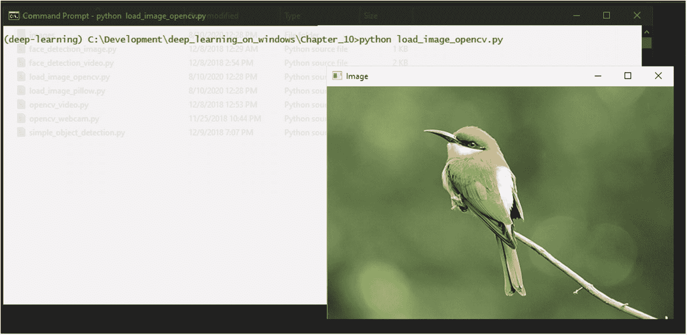

图 10-1

OpenCV 加载和显示图像

OpenCV 可以加载大多数图像文件格式，但是它支持的具体格式取决于您安装的版本和内部版本。

如果您遇到 OpenCV 无法打开的图像文件，您总是可以使用 Pillow 打开它。Pillow 支持比 OpenCV 更多的格式:

```py
01: import numpy as np
02: import cv2
03: from PIL import Image
04:
05: # Read the image...
06: pil_image = Image.open('img//Bird.jpg')
07:
08: # Convert image from RGB to BGR
09: opencv_image = cv2.cvtColor(np.array(pil_image), cv2.COLOR_RGB2BGR)
10:
11: # Display the image
12: cv2.imshow('Image', opencv_image)
13:
14: # Wait for a keypress
15: cv2.waitKey(0)
16:
17: # Close all OpenCV windows
18: cv2.destroyAllWindows()

```

这里，我们已经用 Pillow 加载了图像，转换了颜色格式以兼容 OpenCV，并使用 OpenCV 显示图像(图 [10-2](#Fig2) )。

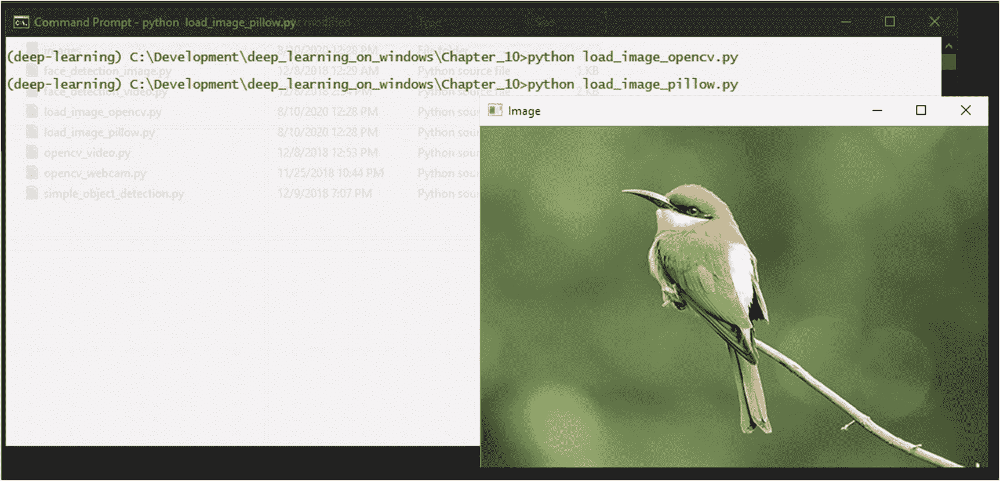

图 10-2

用 Pillow 加载图像并用 OpenCV 显示

将 Pillow 与 OpenCV 一起使用时，我们必须转换颜色格式，因为 OpenCV 使用 BGR 格式，而 Pillow 使用更常见的 RGB 格式。如果您忘记转换这些颜色通道，图像将显示不正确的颜色(图 [10-3](#Fig3) )。

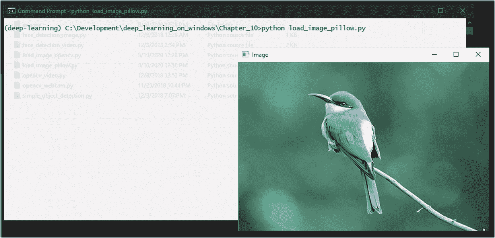

图 10-3

如果不执行 RGB 到 BGR 颜色转换，颜色不正确

一旦您加载了图像，OpenCV 和 Pillow 允许您对图像进行许多变换，如调整大小、旋转、颜色转换和阈值处理。以下代码显示了如何使用 OpenCV 围绕图像的中心点执行旋转:

```py
01: import numpy as np
02: import cv2
03:
04: # Read the image...
05: img = cv2.imread('img//Bird.jpg', cv2.IMREAD_COLOR)
06:
07: # Perform the rotation around the center point
08: rows,cols,channels = img.shape
09: M = cv2.getRotationMatrix2D((cols/2,rows/2),45,1)
10: dst = cv2.warpAffine(img,M,(cols,rows))
11:
12: # Display the image
13: cv2.imshow('Image', dst)
14:
15: # Wait for a keypress
16: cv2.waitKey(0)
17:
18: # Close all OpenCV windows
19: cv2.destroyAllWindows()

```

这将导致图像旋转 45 度(图 [10-4](#Fig4) )。

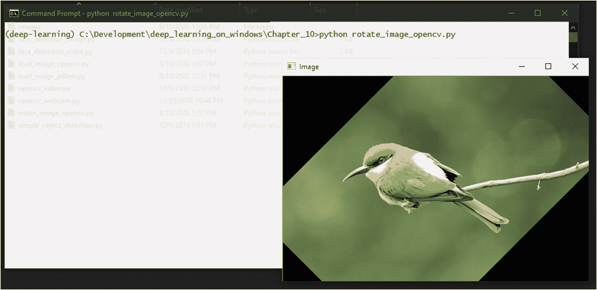

图 10-4

使用 OpenCV 进行图像旋转

您可以从 OpenCV 文档 <sup>[1](#Fn1)</sup> 和 Pillow 文档中了解完整的可用图像变换功能。<sup>2[2](#Fn2)T7】</sup>

你需要学习的下一个最重要的功能是从图像中提取出感兴趣的区域。以下代码演示了如何从图像中提取区域:

```py
01: import numpy as np
02: import cv2
03:
04: # Read the image...
05: img = cv2.imread('img//Bird.jpg', cv2.IMREAD_COLOR)
06:
07: # Extract the region-of-interest from the image
08: img_roi = img[50:250, 150:300]
09:
10: # Display the extracted region-of-interest
11: cv2.imshow('Image ROI', img_roi)
12:
13: # Wait for a keypress

14: cv2.waitKey(0)
15:
16: # Close all OpenCV windows
17: cv2.destroyAllWindows()

```

这将从图像中提取并显示一个区域(图 [10-5](#Fig5) )。

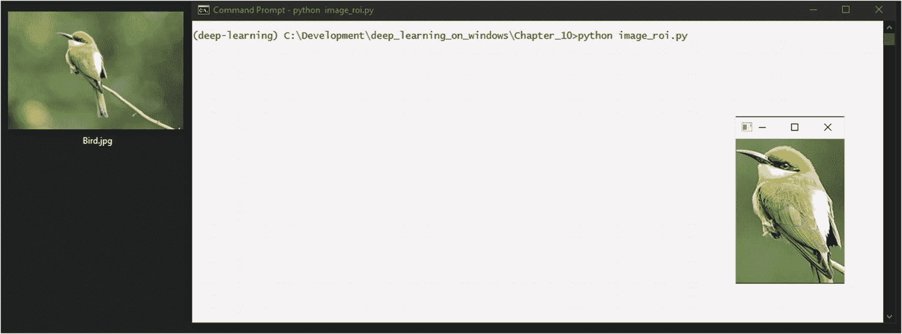

图 10-5

从图像中提取感兴趣区域

您也可以使用`imwrite`功能保存提取的图像区域。

```py
07: # Extract the region-of-interest from the image
08: img_roi = img[50:250, 150:300]
09:
10: # Save the region-of-interest as an image
11: cv2.imwrite('img//Bird_ROI.jpg', img_roi)

```

当您处理对象检测和识别时，提取感兴趣区域的能力非常有用。

## 处理视频:使用网络摄像头

通常，当使用硬件设备时，比如当你试图从一个连接的摄像头读取代码时，你必须摆弄一些摄像头驱动程序的东西。

但是 OpenCV 在这个例子中包含了我们。

OpenCV 可以读取系统中任何内置或 USB 连接的摄像头。来自摄像机的视频流只是一系列有序的图像，OpenCV 是逐帧读取的。因此，每一帧就像加载一个单独的图像:

```py
01: import numpy as np
02: import cv2
03:
04: # Create the video capture object for camera id '0'
05: video_capture = cv2.VideoCapture(0)
06:
07: while True:
08:     # Capture frame-by-frame
09:     ret, frame = video_capture.read()
10:
11:     if (ret):
12:         # Display the resulting frame
13:         cv2.imshow('Video Feed', frame)
14:
15:     ch = 0xFF & cv2.waitKey(1)
16:
17:     # Press "q" to quit the program
18:     if ch == ord('q'):
19:         break
20:
21: # When everything is done, release the capture
22: video_capture.release()
23: cv2.destroyAllWindows()

```

通过这段代码，OpenCV 将打开一个窗口——此处命名为 Video Feed 并在从摄像机读取帧时加载每一帧(图 [10-6](#Fig6) )。

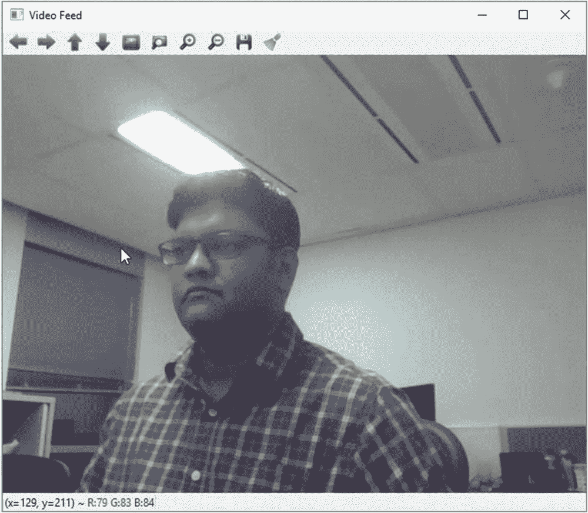

图 10-6

OpenCV 从网络摄像头加载视频

代码将无限循环，或者直到您按下键盘上的 q 键。

OpenCV 使用其 HighGUI 模块(高级图形用户界面)来访问摄像机以及显示帧。HighGUI 模块有三组功能:硬件、文件系统和 GUI。硬件部分处理访问硬件设备，如照相机。文件系统部分处理图像和视频文件的加载和保存。GUI 部分是生成显示图像或帧的窗口的部分，它还能让您在这些窗口中处理键盘和鼠标事件。我们之前打开的窗口的工具栏和状态栏也是来自 HighGUI 的组件。 <sup>[3](#Fn3)</sup> 使用 conda 安装 OpenCV 时，默认安装 HighGUI 模块。

摄像机 id 0 是您的默认摄像机。通常，如果您在笔记本电脑上，这是内置摄像头；如果您有多个摄像头，则是您设置为默认的摄像头。如果您有多台摄像机，它们的 id 将被列为 0、1、2 等等。只需检查并设置您想要的相机的 id。您可以使用多个视频采集对象从多个摄像机读取(图 [10-7](#Fig7) )。

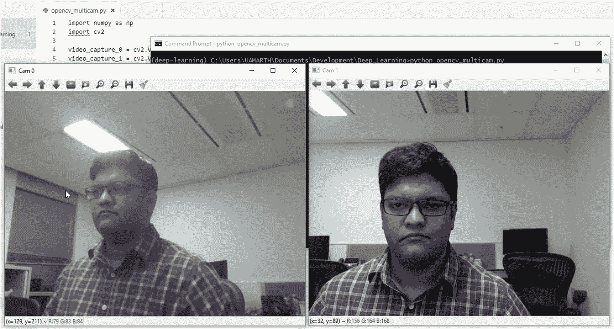

图 10-7

在 OpenCV 中从多个摄像机读取

一旦你从相机中读取帧，它就作为一个图像。现在，您可以对该帧执行任何图像变换。

## 使用视频:使用视频文件

这几乎等同于通过网络摄像头阅读。您只需要在视频捕获对象中传递视频文件的路径，而不是摄像机 id:

```py
01: import numpy as np
02: import cv2
03:
04: # Create the video capture object for a video file
05: cap = cv2.VideoCapture("F:\\GoPro\\Hero7\\GH010038.mp4")
06:
07: while(cap.isOpened()):
08:     # Read frame-by-frame
09:     ret, frame = cap.read()
10:
11:     if (ret):
12:         # Resize the frame
13:         res = cv2.resize(frame, (960, 540), interpolation = cv2.INTER_CUBIC)
14:
15:         # Display the resulting frame
16:         cv2.imshow('Video', res)
17:
18:     # Press "q" to quit the program
19:     if cv2.waitKey(1) & 0xFF == ord('q'):
20:         break
21:
22: cap.release()
23: cv2.destroyAllWindows()

```

就像网络摄像头代码一样，OpenCV 将打开一个窗口，并在从视频文件中读取每一帧时加载它们(图 [10-8](#Fig8) )。

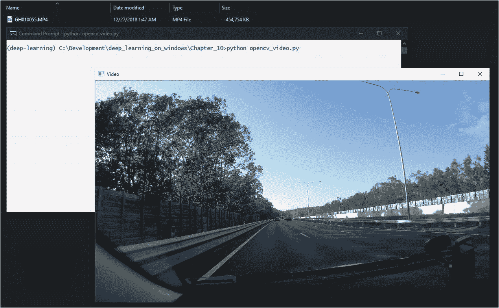

图 10-8

OpenCV 加载视频文件

与图像一样，支持的视频文件格式可能会因您安装的 OpenCV 的确切版本/内部版本而异。OpenCV 依靠 FFmpeg 和 GStreamer 库来处理视频文件，而 DirectShow 库在 Windows 上用于处理来自网络摄像头的视频。这些库是在安装 OpenCV 和 conda 时安装的。因此，打开标准的 AVI 和 MP4 文件应该不成问题。

您可能会注意到，视频的播放速度比预期快或慢。这是因为我们使用的功能不是为了以自然速度回放视频。我们正在做的是抓取视频的每一帧——就像我们对网络摄像头所做的那样——并在窗口中显示它，在抓取下一帧之间添加延迟。该延迟由`cv2.waitkey()`功能增加。在这里，我们将帧之间的延迟设置为 1 毫秒。您可以通过调整此延迟来提高或降低视频的速度。

## 检测图像中的人脸

在这里，我们进入了计算机视觉的一些有趣的部分。

从头开始编写代码来检测人脸是一项有点复杂的任务，因为从图像中可靠地识别人脸的过程包括许多步骤。但是像 OpenCV 和 Dlib 这样的库已经内置了这些算法的复杂部分。

要检测图像中的任何对象(如人脸)，您需要一个训练有素的对象检测器。幸运的是，Dlib 已经有一个预训练的人脸检测器内置在库中。您可以使用`dlib.get_frontal_face_detector()`功能加载它。

```py
01: import numpy as np
02: import cv2
03: import dlib
04:
05: # Load the built-in face dedector of Dlib
06: detector = dlib.get_frontal_face_detector()
07:
08: # Load the image
09: img = cv2.imread('img//Face.jpg', cv2.IMREAD_COLOR)
10: # Create a grayscale copy of the image
11: img_gray = cv2.cvtColor(img, cv2.COLOR_BGR2GRAY)
12:
13: # Get the detected face bounding boxes, using the grayscale image
14: rects = detector(img_gray, 0)
15:
16: # Loop over the bounding boxes, if there are more than one face
17: for rect in rects:
18:     # Get the OpenCV coordinates from the Dlib rectangle objects
19:     x = rect.left()
20:     y = rect.top()
21:     x1 = rect.right()
22:     y1 = rect.bottom()
23:
24:     # Draw a rectangle around the face bounding box in OpenCV

25:     cv2.rectangle(img, (x, y), (x1, y1), (0, 0, 255), 2)
26:
27: # Display the resulting image
28: cv2.imshow('Detected Faces', img)
29:
30: # Wait for a keypress
31: cv2.waitKey(0)
32:
33: # Close all OpenCV windows
34: cv2.destroyAllWindows()

```

这里，我们使用 OpenCV 加载图像，然后对其进行灰度复制。我们将图像的灰度副本传递给 Dlib 人脸检测器对象。

使用灰度图像是因为它可以提高人脸的检测速度。Dlib 人脸检测器也可以处理彩色图像，但是速度较慢。

检测器将返回一个 Dlib 矩形对象的数组来表示所有检测到的面的边界框。我们循环遍历每个边界框，提取它们的坐标，并使用 OpenCV 使用这些坐标在检测到的人脸周围绘制一个矩形。最后，我们显示结果图像，以及检测到的人脸(图 [10-9](#Fig9) )。

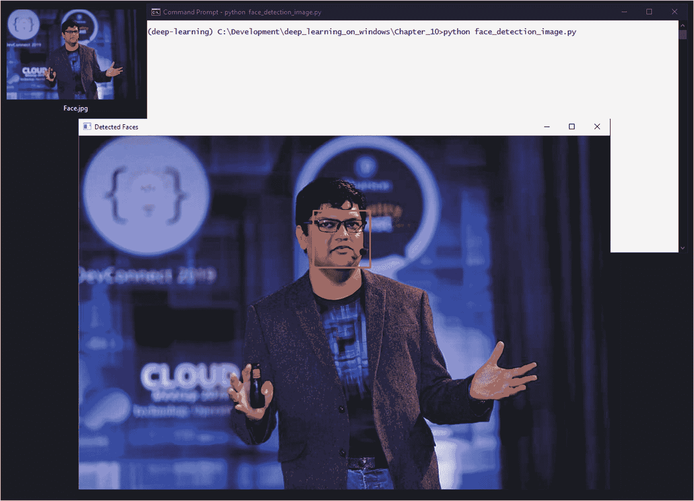

图 10-9

动态人脸检测

## 检测视频中的人脸

一旦我们让人脸检测与图像一起工作，让它在视频或网络摄像头上工作就非常简单了。我们需要做的就是一帧一帧地捕捉视频，并将每一帧传递给人脸检测器:

```py
01: import numpy as np
02: import cv2
03: import dlib
04:
05: # Create the video capture object for camera id '0'
06: video_capture = cv2.VideoCapture(0)
07: # Load the buil-in face dedector of Dlib
08: detector = dlib.get_frontal_face_detector()
09:
10: while True:
11:     # Capture frame-by-frame
12:     ret, frame = video_capture.read()
13:
14:     if (ret):
15:         # Create a grayscale copy of the captured frame
16:         gray = cv2.cvtColor(frame, cv2.COLOR_BGR2GRAY)
17:
18:         # Get the detected face bounding boxes, using the grayscale image
19:         rects = detector(gray, 0)
20:
21:         # Loop over the bounding boxes, if there are more than one face
22:         for rect in rects:
23:             # Get the OpenCV coordinates from the Dlib rectangle objects

24:             x = rect.left()
25:             y = rect.top()
26:             x1 = rect.right()
27:             y1 = rect.bottom()
28:
29:             # Draw a rectangle around the face bounding box in OpenCV
30:             cv2.rectangle(frame, (x, y), (x1, y1), (0, 0, 255), 2)
31:
32:         # Display the resulting frame
33:         cv2.imshow('Video Feed', frame)
34:
35:     ch = 0xFF & cv2.waitKey(1)
36:
37:     # press "q" to quit the program.
38:     if ch == ord('q'):
39:         break
40:
41: # When everything is done, release the capture
42: video_capture.release()
43: cv2.destroyAllWindows()

```

这里我们在视频的每一帧上运行人脸检测步骤(就像我们对图像所做的一样)。在一台典型的机器上，Dlib 的人脸检测器足够快，可以实时检测人脸，允许我们对每一帧都运行它。你会看到检测框实时更新每一帧(图 [10-10](#Fig10) )。

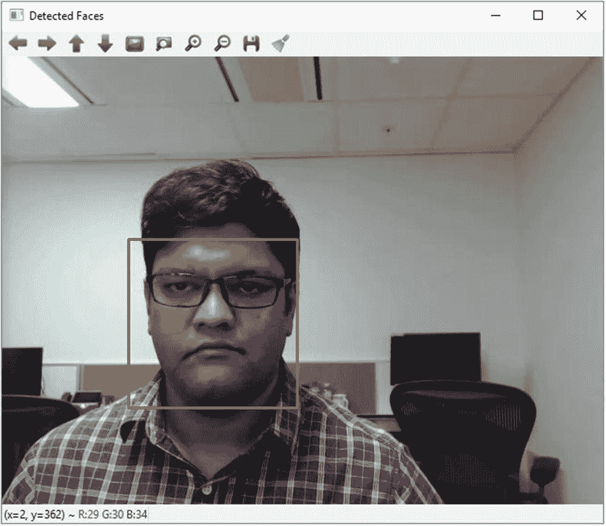

图 10-10

在视频上运行的人脸检测

## 简单的实时深度学习对象识别

接下来，我们将结合我们对深度学习模型的了解和 OpenCV 的计算机视觉功能，建立一个初步的对象识别系统。

我们将使用 OpenCV 从网络摄像头捕捉视频流，并使用 TensorFlow/Keras 应用程序的 ResNet50 深度学习模型来识别视频每一帧中的对象。您可以在附录 1 中了解有关 ResNet50 型号的更多信息。

我们将从导入必要的包开始:

```py
1: import numpy as np
2: import cv2
3: import tensorflow as tf
4: from tensorflow.keras.applications.resnet50 import ResNet50
5: from tensorflow.keras.preprocessing import image
6: from tensorflow.keras.applications.resnet50 import preprocess_input, decode_predictions

```

除了 OpenCV、numpy 和 ResNet50 模型，我们还从 Keras 中导入了一些图像预处理函数。

接下来，我们使用 ImageNet 权重加载 ResNet50 模型，并创建视频捕获对象:

```py
08: # Load the ResNet50 model with the ImageNet weights
09: model = ResNet50(weights='imagenet')
10: # Create the video capture object
11: video_capture = cv2.VideoCapture(0)

```

在代码的主循环中，我们将捕获的帧转换为 RGB(因为 OpenCV 在 BGR 工作)，并将其大小调整为 224x224 像素，这是 ResNet50 模型所需的输入大小:

```py
13: while True:
14:     # Capture frame-by-frame
15:     ret, frame = video_capture.read()
16:
17:     if (ret):
18:         # Convert image from BGR to RGB
19:         rgb_im = cv2.cvtColor(frame,cv2.COLOR_BGR2RGB)
20:         # Resize the image to 224x224, the size required by ResNet50 model
21:         res_im = cv2.resize(rgb_im, (224, 224), interpolation = cv2.INTER_CUBIC)

```

然后，我们通过一组预处理步骤运行图像，为模型获取图像做准备:

```py
23:         # Preprocess image
24:         prep_im = image.img_to_array(res_im)
25:         prep_im = np.expand_dims(prep_im, axis=0)
26:         prep_im = preprocess_input(prep_im)

```

接下来，我们将处理后的图像传递给模型并进行预测。我们还需要解码预测——使用 TensorFlow/Keras 中的便利函数——以获得预测的类标签:

```py
28:         # Make the prediction
29:         preds = model.predict(prep_im)
30:
31:         # Decode the prediction
32:         (class_name, class_description, score) = decode_predictions(preds, top=1)[0][0]

```

最后，我们将预测的标签和预测的置信度分数叠加在图像本身上，并将其打印在控制台上，使用 OpenCV 显示图像:

```py
34:         # Display the predicted class and confidence
35:         print("Predicted: {0}, Confidence: {1:.2f}".format(class_description, score))
36:         cv2.putText(frame, "Predicted: {}".format(class_description), (10, 50),
37:                 cv2.FONT_HERSHEY_PLAIN, 2, (255, 255, 255), 2, cv2.LINE_AA)
38:         cv2.putText(frame, "Confidence: {0:.2f}".format(score), (10, 80),
39:                 cv2.FONT_HERSHEY_PLAIN, 2, (255, 255, 255), 2, cv2.LINE_AA)
40:
41:         # Display the resulting frame
42:         cv2.imshow('Video Feed', frame)
43:
44:     ch = 0xFF & cv2.waitKey(1)
45:
46:     # press "q" to quit the program.
47:     if ch == ord('q'):
48:         break
49:
50: # When everything is done, release the capture
51: video_capture.release()
52: cv2.destroyAllWindows()

```

当您运行代码时，它会将视频的每一帧传递给 ResNet50 模型，该模型会尝试识别帧中最突出的对象。然后，代码将显示并打印出预测以及来自 ResNet50 模型的预测置信度(图 [10-11](#Fig11) )。

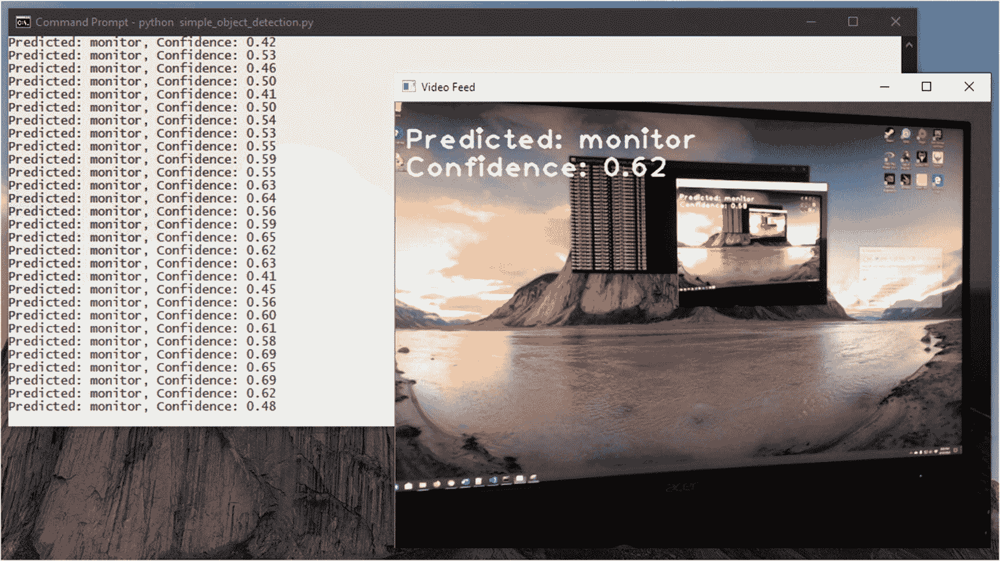

图 10-11

实时对象检测运行

我们在这里建立的是一个非常基本的物体识别系统，它有几个局限性。它一次只能识别一个对象，因为它将整个帧作为输入。它也不能识别它所识别的对象的边界框。真正的对象检测系统将能够识别一帧中的多个对象，并且还能够识别它们的边界。

但是有了我们到目前为止学到的概念，您可以研究扩展系统的能力。

我们的人脸检测系统也是如此。

你将如何扩展它来对检测到的人脸执行人脸识别？

想想我们学到的从图像中提取感兴趣区域的知识。你能想到一种方法来应用这个概念，提取出检测到的人脸图像，并通过深度学习模型运行它吗？您是否也可以使用相同的概念来构建模型的训练数据集？

<aside aria-label="Footnotes" class="FootnoteSection" epub:type="footnotes">Footnotes [1](#Fn1_source)

OpenCV(图像变换)， [`https://docs.opencv.org/3.4.1/da/d6e/tutorial_py_geometric_transformations.html`](https://docs.opencv.org/3.4.1/da/d6e/tutorial_py_geometric_transformations.html) ，【2018 . 2 . 23】。

  [2](#Fn2_source)

Pillow(图像变换)， [`https://pillow.readthedocs.io/en/stable/reference/Image.html`](https://pillow.readthedocs.io/en/stable/reference/Image.html) ，【2020 年 7 月 24 日】。

  [3](#Fn3_source)

OpenCV (HighGUI module)， [`https://docs.opencv.org/3.4.11/d7/dfc/group__highgui.html`](https://docs.opencv.org/3.4.11/d7/dfc/group__highgui.html) ，【2020 年 7 月 17 日】。

 </aside>