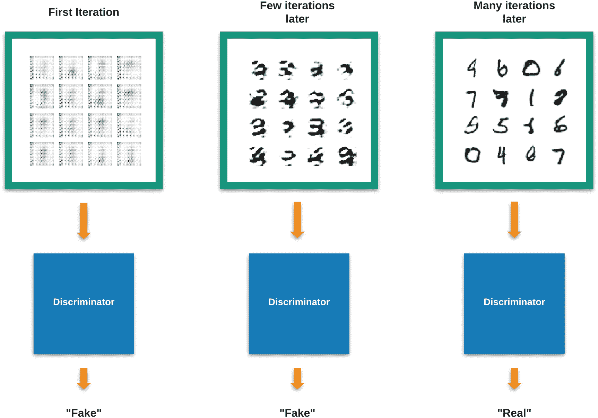

# 11.生成对抗网络导论

人工智能能有创造力吗——例如，它能学会创造艺术吗？传统的答案是否定的。但最近我们不那么确定了。最近，由于深度学习，创造力的定义变得模糊了。

## 艺术家和艺术评论家的故事

让我们看一个故事。

曾经有一个新手艺术家，他通过从现有的艺术品中获取灵感来学习创作艺术品。

这位艺术家创作了一件艺术品，并把它展示给一位艺术评论家。

评论家分析了艺术品，宣称它不够好。但是，出于良心，评论家也向艺术家提供反馈，说明为什么它被认为不够好。

这位艺术家吸收了这一反馈，并试图根据反馈再次创作另一件艺术作品，并把它展示给评论家。

这种情况发生了几个周期。

每次批评家批评艺术品，艺术家就获得了如何改进它的经验。

同样，每当艺术家创作出一件新的艺术品，评论家就获得了如何评价它的经验。

经过多次这样的反复，这位艺术家创作出了一件堪称杰作的艺术品。

因为批评家，艺术家成了大师。

如果我们能对人工智能做同样的事情呢？

这就是生成性对抗网络背后的理念。

## 生成对抗网络

生成对手网络(GAN)是一种机器学习模型，其中两个神经网络相互竞争以生成具有给定训练集的相同特征的新数据。

*   **生成:**模型生成新数据，而不是从给定的集合中挑选输出。

*   这两个网络是彼此的对手。

*   **网络:**该模型基于神经网络。

像我们的故事一样，生成对立网络也由两个元素组成:一个*生成器*(艺术家)和一个*鉴别器*(艺术评论家)。生成器试图学习创建看起来“真实”的项目，而鉴别器试图区分生成的项目和真实的项目(图 [11-1](#Fig1) )。


图 11-1

GAN 的典型工作流程

生成的项目可以是图像、文本、视频、声音或任何东西。

在这样一个系统中，发生者和鉴别者需要一起训练，就像我们故事中的艺术家和艺术评论家一起经历一样。当我们训练这样一个系统时，生成器将逐渐变得更好地生成看起来真实的项目，而鉴别器将变得更好地区分它们和真实的项目。经过多次这样的迭代训练后，鉴别器可能不再能够区分生成的项目和真实的项目(图 [11-2](#Fig2) )。



图 11-2

甘的训练

为了简化解释，让我们拿一个 GAN 来比生成图像。生成器采用随机噪声向量作为输入，而鉴别器采用属于我们想要生成的图像类别的真实图像的训练集。

## 用 DCGAN 生成手写数字

DCGAN(深度卷积生成对抗网络)是最简单的 GAN 实现之一。在这个模型中，我们在生成器和鉴别器中使用了卷积层，这使得 DCGAN 模型能够很好地处理图像。

我们将使用 MNIST 数据集作为输入。我们的目标是生成与人类手写数字难以区分的图像。

我们的工作流程如下所示(图 [11-3](#Fig3) )。


图 11-3

用于手写数字生成的 DCGAN

我们将从一个新的代码文件开始，命名为 DCGAN_Digits.py。

我们通过导入必要的包来开始我们的代码:

```py
01: import tensorflow as tf
02:
03: from tensorflow.keras import layers
04: import glob
05: import imageio
06: import matplotlib.pyplot as plt
07: import numpy as np
08: import os
09: import PIL
10: import time
11: import cv2

```

然后，我们加载数据集并对其进行规范化:

```py
13: (train_images, train_labels), (_, _) = tf.keras.datasets.mnist.load_data()
14:
15: train_images = train_images.reshape(train_images.shape[0], 28, 28, 1).astype('float32')
16: train_images = (train_images - 127.5) / 127.5 # Normalize the images to [-1, 1]

```

MNIST 像素值在 0–255 范围内。在这里，我们将其标准化为-1–1 范围。

然后，我们定义批量大小，然后对数据集进行洗牌和分块以进行训练:

```py
18: BUFFER_SIZE = 60000
19: BATCH_SIZE = 256
20:
21: # Batch and shuffle the data
22: train_dataset = tf.data.Dataset.from_tensor_slices(train_images).shuffle(BUFFER_SIZE).batch(BATCH_SIZE)

```

接下来，我们需要定义生成器和鉴别器模型。

### 发电机

我们的生成器模型接受一个随机噪声种子，并输出一个 28x28x1 的图像。模型看起来会是这样的(图 [11-4](#Fig4) ):


图 11-4

发电机模型

该模型使用`Conv2DTranspose`层对每一层的输入进行上采样。`LeakyReLU`用作正则化，因为它允许少量负值通过，与 ReLU 相反，ReLU 会移除所有负值。

我们将为发电机模型定义一个新函数`make_generator_model()`:

```py
24: def make_generator_model():
25:     model = tf.keras.Sequential()
26:     model.add(layers.Dense(7*7*256, use_bias=False, input_shape=(100,)))
27:     model.add(layers.BatchNormalization())
28:     model.add(layers.LeakyReLU())
29:
30:     model.add(layers.Reshape((7, 7, 256)))
31:     assert model.output_shape == (None, 7, 7, 256) # Note: None is the batch size
32:
33:     model.add(layers.Conv2DTranspose(128, (5, 5), strides=(1, 1), padding="same", use_bias=False))
34:     assert model.output_shape == (None, 7, 7, 128)
35:     model.add(layers.BatchNormalization())
36:     model.add(layers.LeakyReLU())
37:
38:     model.add(layers.Conv2DTranspose(64, (5, 5), strides=(2, 2), padding="same", use_bias=False))
39:     assert model.output_shape == (None, 14, 14, 64)
40:     model.add(layers.BatchNormalization())
41:     model.add(layers.LeakyReLU())
42:
43:     model.add(layers.Conv2DTranspose(1, (5, 5), strides=(2, 2), padding="same", use_bias=False, activation="tanh"))
44:     assert model.output_shape == (None, 28, 28, 1)
45:
46:     return model

```

我们现在可以使用这个函数来创建一个模型实例并生成一个初始图像:

```py
48: generator = make_generator_model()
49:
50: noise = tf.random.normal([1, 100])
51: generated_image = generator(noise, training=False)
52:
53: plt.imshow(generated_image[0, :, :, 0], cmap="gray")
54: plt.show()
55: plt.close()

```

由于发电机模型仍未经训练，输出看起来像噪声(图 [11-5](#Fig5) )。


图 11-5

未经训练的生成器的输出

### 鉴别器

鉴别器是一个简单的深度学习图像分类器(基于熟悉的卷积神经网络)。它将一个 28x28x1 的图像作为输入，并将它们分类为真或假。鉴别器模型看起来像这样(图 [11-6](#Fig6) ):


图 11-6

鉴别器模型

我们将为鉴别器模型定义 make_discriminator_model()函数。它使用我们熟悉的 Conv2D 层:

```py
57: def make_discriminator_model():
58:     model = tf.keras.Sequential()
59:     model.add(layers.Conv2D(64, (5, 5), strides=(2, 2), padding="same",
60:                                      input_shape=[28, 28, 1]))
61:     model.add(layers.LeakyReLU())
62:     model.add(layers.Dropout(0.3))
63:
64:     model.add(layers.Conv2D(128, (5, 5), strides=(2, 2), padding="same"))
65:     model.add(layers.LeakyReLU())
66:     model.add(layers.Dropout(0.3))
67:
68:     model.add(layers.Flatten())
69:     model.add(layers.Dense(1))
70:
71:     return model

```

然后，我们可以使用这个函数创建一个鉴别器实例，并传递我们之前生成的图像:

```py
73: discriminator = make_discriminator_model()
74: decision = discriminator(generated_image)
75: print (decision)

```

由于鉴别器模型仍然未经训练，它将输出如下内容:

```py
tf.Tensor([[0.00122253]], shape=(1, 1), dtype=float32)

```

一旦训练完成，鉴别器将为真实图像输出 1，为伪造图像输出 0。

### 反馈

就像我们的艺术家和艺术评论家的故事一样，为了改进，我们的生成器和鉴别器需要反馈。这里我们定义了发生器和鉴别器的损失值，稍后我们将使用这些值来计算梯度，以便在训练时更新它们:

```py
77: # This method returns a helper function to compute cross entropy loss
78: cross_entropy = tf.keras.losses.BinaryCrossentropy(from_logits=True)
79:
80: def discriminator_loss(real_output, fake_output):
81:     real_loss = cross_entropy(tf.ones_like(real_output), real_output)
82:     fake_loss = cross_entropy(tf.zeros_like(fake_output), fake_output)
83:     total_loss = real_loss + fake_loss
84:     return total_loss
85:
86: def generator_loss(fake_output):
87:     return cross_entropy(tf.ones_like(fake_output), fake_output)
88:
89: generator_optimizer = tf.keras.optimizers.Adam(1e-4)
90: discriminator_optimizer = tf.keras.optimizers.Adam(1e-4)

```

鉴别器的损耗是由它区分真实图像和生成图像的能力决定的。因此，我们接收来自鉴别器的对真实图像(`real_output`数组)和虚假图像(`fake_output`数组)的预测，并将它们与预期输出进行比较。一旦经过适当的训练，鉴别器应该为真实图像产生 1，而为生成的或伪造的图像产生 0。因此，我们得到具有 1 数组的真实图像的输出之间的差异，以及具有 0 数组的伪图像的输出之间的差异。

类似地，我们期望发生器一旦经过适当的训练，就能产生从鉴别器产生 1 的图像。像以前一样，我们将生成的或虚假图像的输出与 1 的数组进行比较，以确定发生器的损耗。

我们还为生成器和鉴别器定义了两个独立的 Adam 优化器，因为这两个模型需要同时单独训练。

由于 gan 的训练可能需要很长时间，我们配置模型检查点以定期保存，这将有助于在训练中断时进行恢复。确保在代码文件所在的目录中创建名为 training_checkpoints 的目录:

```py
92: checkpoint_dir = './training_checkpoints'
93: checkpoint_prefix = os.path.join(checkpoint_dir, "ckpt")
94: checkpoint = tf.train.Checkpoint(generator_optimizer=generator_optimizer,
95:                                  discriminator_optimizer=discriminator_optimizer,
96:                                  generator=generator,
97:                                  discriminator=discriminator)

```

### 培训

接下来，我们为训练定义训练参数和随机种子:

```py
100: EPOCHS = 1000
101: noise_dim = 100
102: num_examples_to_generate = 16
103:
104: # We will reuse this seed overtime (so it's easier)
105: # to visualize progress in the animated GIF)
106: seed = tf.random.normal([num_examples_to_generate, noise_dim])

```

我们将在整个训练时期重用相同的种子，以更好地可视化每个生成的样本如何在时期上改进(因为相同的种子导致生成相同的数字)。

然后，我们为训练步骤定义函数:

```py
108: # Notice the use of `tf.function`
109: # This annotation causes the function to be "compiled".
110: @tf.function
111: def train_step(images):
112:     noise = tf.random.normal([BATCH_SIZE, noise_dim])
113:
114:     with tf.GradientTape() as gen_tape, tf.GradientTape() as disc_tape:
115:         generated_images = generator(noise, training=True)
116:
117:         real_output = discriminator(images, training=True)
118:         fake_output = discriminator(generated_images, training=True)
119:
120:         gen_loss = generator_loss(fake_output)
121:         disc_loss = discriminator_loss(real_output, fake_output)
122:
123:     gradients_of_generator = gen_tape.gradient(gen_loss, generator.trainable_variables)
124:     gradients_of_discriminator = disc_tape.gradient(disc_loss, discriminator.trainable_variables)
125:
126:     generator_optimizer.apply_gradients(zip(gradients_of_generator, generator.trainable_variables))
127:     discriminator_optimizer.apply_gradients(zip(gradients_of_discriminator, discriminator.trainable_variables))

```

在每个训练步骤中，我们将一个随机噪声向量传递给生成器，生成器使用它作为输入来生成一组图像。这些生成的图像，以及一组真实图像，然后通过鉴别器得到它们的输出。这些输出是来自鉴别器的关于它认为它们是真的还是假的预测/分类。使用我们之前定义的损失函数，为发生器和鉴别器计算损失值，并使用损失值的梯度来更新它们。把它看作是“反馈”,推动他们朝着正确的方向训练。

接下来是主训练循环的功能:

```py
129: def train(dataset, epochs):
130:     train_start = time.time()
131:     for epoch in range(epochs):
132:         start = time.time()
133:
134:         for image_batch in dataset:
135:             train_step(image_batch)
136:
137:         # Produce images for the GIF as we go
138:         generate_and_save_images(generator,
139:                                 epoch + 1,
140:                                 seed,
141:                                 display = True)
142:
143:         # Save the model every 15 epochs
144:         if (epoch + 1) % 15 == 0:
145:             checkpoint.save(file_prefix = checkpoint_prefix)
146:
147:         print ('Time for epoch {} is {} sec'.format(epoch + 1, time.time()-start))
148:
149:     print ('Time for total training is {} sec'.format(time.time()-train_start))

```

这里，我们基本上是通过我们定义的多个时期来运行每个训练批次。在每个训练时期结束时，我们使用之前定义的种子来生成一组样本并保存这些图像文件。

该功能定义如下，主要是对生成的图像进行后处理。确保在代码文件所在的目录中创建一个名为 output 的目录:

```py
151: def generate_and_save_images(model, epoch, test_input, display = False):
152:     # Notice `training` is set to False.
153:     # This is so all layers run in inference mode.
154:     predictions = model(test_input, training=False)
155:
156:     fig = plt.figure(figsize=(4,4), facecolor="black")
157:
158:     for i in range(predictions.shape[0]):
159:         plt.subplot(4, 4, i+1)
160:         image = predictions[i, :, :, 0] * 127.5 + 127.5
161:         plt.imshow(image, cmap="gray")
162:         plt.axis('off')
163:
164:     plt.savefig('output/image_at_epoch_{:04d}.png'.format(epoch), facecolor=fig.get_facecolor())
165:     plt.close()
166:     disp_image = cv2.imread('output/image_at_epoch_{:04d}.png'.format(epoch))
167:     disp_image = cv2.bitwise_not(disp_image)
168:     cv2.imwrite('output/image_at_epoch_{:04d}.png'.format(epoch), disp_image)
169:     if (display):
170:         cv2.imshow("Results", disp_image)
171:         cv2.waitKey(100)

```

一旦定义了所有的训练效用函数，我们就调用主训练函数:

```py
173: train(train_dataset, EPOCHS)

```

在培训结束时，我们执行一些清理步骤，然后将所有生成的输出图像合并到一个动画 GIF 文件中:

```py
175: checkpoint.restore(tf.train.latest_checkpoint(checkpoint_dir))
176: cv2.destroyAllWindows()
177:
178: anim_file = 'dcgan.gif'
179:
180: with imageio.get_writer(anim_file, mode="I") as writer:
181:     filenames = glob.glob('output/image*.png')
182:     filenames = sorted(filenames)
183:     last = -1

184:     for i,filename in enumerate(filenames):
185:         frame = 2*(i**0.5)
186:         if round(frame) > round(last):
187:             last = frame
188:         else:
189:             continue
190:         image = imageio.imread(filename)
191:         writer.append_data(image)
192:         cv2.imshow("Results", image)
193:         cv2.waitKey(100)
194:     image = imageio.imread(filename)
195:     writer.append_data(image)

```

### 运行培训

准备好 DCGAN 模型后，我们可以通过运行以下命令开始培训:

```py
Python DCGAN_Digits.py

```

该脚本将在控制台中显示每个时期所用的时间，以及在 OpenCV 窗口中显示每个时期的结果(图 [11-7](#Fig7) )。


图 11-7

DCGAN 数字生成的训练运行

当在 RTX2070 的 GPU 上运行时，1000 个周期的训练需要大约 2 个小时(图 [11-8](#Fig8) )。


图 11-8

DCGAN 培训已完成

Note

GANs 的训练可能需要很长时间。我们的 DCGAN 模型可能需要几个小时来训练，这取决于正在运行的机器的处理能力，以及您是在 CPU 还是 GPU 上运行该模型。通常，在 GPU 上运行每个历元可能需要 7 到 10 秒。在 CPU 上运行 GAN 培训可能不切实际，因为完成培训可能需要时间。

如果您不确定，请先运行少量的历元训练，以了解可能需要多长时间。

Tip

如果在显示初始噪声图像后，训练似乎停滞了，您可以尝试注释掉第 53 到 55 行。之所以会发生这种情况，是因为我们的 GAN 训练会占用大量的系统资源，并且在尝试可视化结果时可能会偶尔耗尽机器的资源。类似地，您可以在第 141 行将显示参数设置为 False。

如果你在本地机器上运行有问题，你可以使用 Kaggle 笔记本 <sup>[1](#Fn1)</sup> 来运行你的代码。Kaggle 在他们的笔记本/内核中提供了对 NVIDIA TESLA P100 GPU 的免费访问，<sup>T5】2</sup>可以大大加速训练 GANs 等复杂模型。

在训练开始时，结果看起来像随机噪声(图 [11-9](#Fig9) )。


图 11-9

第 1 时段生成的图像

经过 100 个时期后，数字的不同形状开始显现(图 [11-10](#Fig10) )。


图 11-10

在时期 100 生成的图像

经过 200 个时代后，形状变得更加精致(图 [11-11](#Fig11) )。


图 11-11

在纪元 200 生成的图像

经过 1000 个纪元后，图像几乎与人类手写数字无法区分(图 [11-12](#Fig12) )。


图 11-12

1，000 年生成的图像

您还可以查看生成的 dcgan.gif 文件，了解生成的结果在训练中是如何改进的。

## 我们能生成更复杂的东西吗？

我们现在已经看到了我们的 DCGAN 模型如何能够生成与人类绘制的数字几乎无法区分的手写数字。但是 GANs 能产生更复杂的东西吗？

为了找到答案，让我们尝试将我们从 DCGAN_Digits 模型中学到的东西应用到更复杂的事情上:生成人脸图像。

为此，我们需要一个包含人脸图像的大型数据集来训练我们的鉴别器模型。为此，我们将使用 Kaggle 的 CelebFaces 属性(CelebA)数据集(图 [11-13](#Fig13) )。


图 11-13

Kaggle 中的 CelebFaces 属性(CelebA)数据集

CelebA 数据集的大小约为 1.4GB。 <sup>[3](#Fn3)</sup> 下载完成后，解压 zip 文件，并将顶层目录重命名为 celeba-dataset。你应该得到如下的文件夹结构(图 [11-14](#Fig14) ):


图 11-14

未压缩 CelebA 数据集的文件夹结构

准备好数据集后，让我们为我们的 face generator 创建一个新的代码文件，我们将把它命名为 DCGAN_Faces.py。

我们将从导入必要的包开始:

```py
01: import tensorflow as tf
02:
03: from tensorflow.keras import layers
04: import glob
05: import imageio
06: import matplotlib.pyplot as plt
07: import numpy as np
08: import os
09: import PIL
10: import time
11: import cv2

```

然后，我们将定义一个辅助函数来加载每个人脸图像，并只裁剪其中的人脸部分。由于 CelebA 数据集中的图像已经对齐，我们可以使用硬编码值来裁剪面部:

```py
13: # Load the image, crop just the face, and return image data as a numpy array
14: def load_image(image_file_path):
15:     img = PIL.Image.open(image_file_path)
16:     img = img.crop([25,65,153,193])
17:     img = img.resize((64,64))
18:     data = np.asarray( img, dtype="int32" )
19:     return data

```

然后，我们加载数据集图像路径，并定义批处理参数:

```py
21: dataset_path = "celeba-dataset/img_align_celeba/img_align_celeba/"
22:
23: # load the list of training images
24: train_images = np.array(os.listdir(dataset_path))
25:
26: BUFFER_SIZE = 2000
27: BATCH_SIZE = 8
28:
29: # shuffle and list
30: np.random.shuffle(train_images)
31: # chunk the training images list in to batches
32: train_images = np.split(train_images[:BUFFER_SIZE],BATCH_SIZE)

```

然后，我们定义我们的发电机模型:

```py
34: def make_generator_model():
35:     model = tf.keras.Sequential()
36:
37:     model.add(layers.Dense(4*4*1024, use_bias = False, input_shape = (100,)))
38:     model.add(layers.BatchNormalization())
39:     model.add(layers.LeakyReLU())
40:
41:     model.add(layers.Reshape((4,4,1024)))
42:     assert model.output_shape == (None, 4, 4, 1024) # Note: None is the batch size
43:
44:     model.add(layers.Conv2DTranspose(512, (5, 5), strides = (2,2), padding = "same", use_bias = False))
45:     assert model.output_shape == (None, 8, 8, 512)
46:     model.add(layers.BatchNormalization())
47:     model.add(layers.LeakyReLU())
48:
49:     model.add(layers.Conv2DTranspose(256, (5,5), strides = (2,2), padding = "same", use_bias = False))
50:     assert model.output_shape == (None, 16, 16, 256)
51:     model.add(layers.BatchNormalization())
52:     model.add(layers.LeakyReLU())
53:
54:     model.add(layers.Conv2DTranspose(128, (5,5), strides = (2,2), padding = "same", use_bias = False))
55:     assert model.output_shape == (None, 32, 32, 128)
56:     model.add(layers.BatchNormalization())
57:     model.add(layers.LeakyReLU())
58:
59:     model.add(layers.Conv2DTranspose(3, (5,5), strides = (2,2), padding = "same", use_bias = False, activation = "tanh"))
60:     assert model.output_shape == (None, 64, 64, 3)
61:
62:     return model

63:
64: generator = make_generator_model()
65:
66: noise = tf.random.normal([1,100])
67: generated_image = generator(noise, training = False)
68: plt.imshow(generated_image[0], interpolation="nearest")
69: plt.show()
70: plt.close()

```

这使用了与我们的 DCGAN_Digits 模型中的生成器相同的概念。但是我们在这里使用了一个更深层次的模型，因为我们的数据更加复杂。

未经训练的生成器生成的图像看起来会像这样(图 [11-15](#Fig15) ):


图 11-15

未经训练的生成器的输出

然后我们定义我们的鉴别器模型，比我们的 DCGAN_Digits 模型更深一点:

```py
72: def make_discriminator_model():
73:     model = tf.keras.Sequential()
74:     model.add(layers.Conv2D(64, (5, 5), strides=(2, 2), padding="same", input_shape=[64, 64, 3]))
75:     model.add(layers.LeakyReLU())
76:     model.add(layers.Dropout(0.3))
77:
78:     model.add(layers.Conv2D(512, (5, 5), strides=(2, 2), padding="same"))
79:     model.add(layers.LeakyReLU())
80:     model.add(layers.Dropout(0.3))
81:
82:     model.add(layers.Conv2D(128, (5, 5), strides=(2, 2), padding="same"))
83:     model.add(layers.LeakyReLU())
84:     model.add(layers.Dropout(0.3))
85:
86:     model.add(layers.Flatten())
87:     model.add(layers.Dense(1))
88:
89:     return model
90:
91: discriminator = make_discriminator_model()
92: decision = discriminator(generated_image)
93: print (decision)
94: # output will be something like tf.Tensor([[-6.442342e-05]], shape=(1, 1), dtype=float32)

```

损失函数、检查点和训练参数与我们之前使用的完全一样:

```py
096: # This method returns a helper function to compute cross entropy loss
097: cross_entropy = tf.keras.losses.BinaryCrossentropy(from_logits=True)
098:
099: def discriminator_loss(real_output, fake_output):
100:     real_loss = cross_entropy(tf.ones_like(real_output), real_output)
101:     fake_loss = cross_entropy(tf.zeros_like(fake_output), fake_output)
102:     total_loss = real_loss + fake_loss
103:     return total_loss
104:
105: def generator_loss(fake_output):
106:     return cross_entropy(tf.ones_like(fake_output), fake_output)
107:
108: generator_optimizer = tf.keras.optimizers.Adam(1e-4)
109: discriminator_optimizer = tf.keras.optimizers.Adam(1e-4)
110:
111: checkpoint_dir = './training_checkpoints'
112: checkpoint_prefix = os.path.join(checkpoint_dir, "ckpt")
113: checkpoint = tf.train.Checkpoint(generator_optimizer=generator_optimizer,
114:                                  discriminator_optimizer=discriminator_optimizer,
115:                                  generator=generator,
116:                                  discriminator=discriminator)
117:
118:
119: EPOCHS = 1000
120: noise_dim = 100
121: num_examples_to_generate = 16
122:
123: # setting the seed for the randomization, so that we can reproduce the results
124: tf.random.set_seed(1234)
125: # We will reuse this seed overtime (so it's easier)
126: # to visualize progress in the animated GIF)
127: seed = tf.random.normal([num_examples_to_generate, noise_dim])

```

在训练步骤函数中，我们使用辅助函数 load_image 来预处理我们的图像。其余步骤与之前相同:

```py
129: # Notice the use of `tf.function`
130: # This annotation causes the function to be "compiled".
131: @tf.function
132: def train_step(images):
133:     noise = tf.random.normal([BATCH_SIZE, noise_dim])
134:
135:     # pre-process the images
136:     new_images = []
137:     for file_name in images:
138:         new_pic = load_image(dataset_path + file_name)
139:         new_images.append(new_pic)
140:
141:     images = np.array(new_images)
142:     images = images.reshape(images.shape[0], 64, 64, 3).astype('float32')
143:     images = (images - 127.5) / 127.5 # Normalize the images to [-1, 1]
144:
145:     with tf.GradientTape() as gen_tape, tf.GradientTape() as disc_tape:
146:         generated_images = generator(noise, training=True)
147:
148:         real_output = discriminator(images, training=True)
149:         fake_output = discriminator(generated_images, training=True)
150:
151:         gen_loss = generator_loss(fake_output)
152:         disc_loss = discriminator_loss(real_output, fake_output)
153:
154:     gradients_of_generator = gen_tape.gradient(gen_loss, generator.trainable_variables)
155:     gradients_of_discriminator = disc_tape.gradient(disc_loss, discriminator.trainable_variables)
156:
157:     generator_optimizer.apply_gradients(zip(gradients_of_generator, generator.trainable_variables))
158:     discriminator_optimizer.apply_gradients(zip(gradients_of_discriminator, discriminator.trainable_variables))
159:
160:     images = None

```

最后，主训练循环、保存生成的图像以及生成动画的函数都使用了与我们在 DCGAN_Digits 模型中使用的相同的步骤:

```py
162: def train(dataset, epochs):
163:     tf.print("Starting Training")
164:     train_start = time.time()
165:
166:     for epoch in range(epochs):
167:         start = time.time()
168:         tf.print("Starting Epoch:", epoch)
169:
170:         batch_count = 1
171:         for image_batch in dataset:
172:             train_step(image_batch)
173:             batch_count += 1
174:
175:         # Produce images for the GIF as we go
176:         generate_and_save_images(generator,
177:                                  epoch + 1,
178:                                  seed)
179:
180:         tf.print("Epoch:", epoch, "finished")
181:         tf.print()
182:         tf.print('Time for epoch {} is {} sec'.format(epoch + 1, time.time()-start))
183:         tf.print()
184:
185:     # Save the model every epoch
186:     checkpoint.save(file_prefix = checkpoint_prefix)
187:
188:     print ('Time for total training is {} sec'.format(time.time()-train_start))
189:
190:
191: def generate_and_save_images(model, epoch, test_input):
192:     # Notice `training` is set to False.
193:     # This is so all layers run in inference mode.
194:     predictions = model(test_input, training=False).numpy()
195:
196:     fig = plt.figure(figsize=(4,4))
197:
198:     for i in range(predictions.shape[0]):
199:         plt.subplot(4, 4, i+1)
200:         image = predictions[i]
201:         plt.imshow(image)
202:         plt.axis('off')
203:
204:     plt.savefig('output/image_at_epoch_{:04d}.png'.format(epoch))
205:     plt.show()
206:
207: train(train_images, EPOCHS)
208:
209: checkpoint.restore(tf.train.latest_checkpoint(checkpoint_dir))
210: cv2.destroyAllWindows()
211:
212: anim_file = 'dcgan_faces.gif'

213:
214: with imageio.get_writer(anim_file, mode="I") as writer:
215:     filenames = glob.glob('output/image*.png')
216:     filenames = sorted(filenames)
217:     last = -1
218:     for i,filename in enumerate(filenames):
219:         frame = 2*(i**0.5)
220:         if round(frame) > round(last):
221:             last = frame
222:         else:
223:             continue
224:         image = imageio.imread(filename)
225:         writer.append_data(image)
226:         cv2.imshow("Results", image)
227:         cv2.waitKey(100)
228:     image = imageio.imread(filename)
229:     writer.append_data(image)

```

那么，我们的人脸生成器表现如何呢？

训练开始时，发生器产生纯黑色图像(图 [11-16](#Fig16) )。


图 11-16

第 1 时段生成的图像

经过 100 个时期后，一些形状开始出现在输出中(图 [11-17](#Fig17) )。


图 11-17

在时期 100 生成的图像

经过 1000 个时代后，一些类似面部特征的形状正在生成(图 [11-18](#Fig18) )。


图 11-18

1，000 年生成的图像

虽然不是栩栩如生，但我们的生成器能够学习生成我们可以与人脸关联的特征，这是非常了不起的。

为了进一步改进我们的模型，你可以尝试训练更长的时期。或者尝试生成器和鉴别器的更深模型的组合。

但是，请记住，在 GPU 上训练 1000 个纪元的模型需要 7 个多小时。当你试图进一步推进时，你应该提前计划。

## 甘还能做什么？

正如我们前面讨论的，DCGAN 是 GANs 最简单的实现之一。在这里，我们只是触及了 GANs 所能做的事情的表面。

生成对抗网络是深度学习和人工智能的最新研究领域之一。这也是过去几年中发展最积极的领域之一。最近已经提出并实施了许多创新的 GAN 架构，该领域每天都有越来越多的创新发生。以下是一些著名的 GAN 架构:

*   **Cycle gan(Cycle-Consistent GANs):**能够学习在不同风格的图像之间转换，不需要有配对的图像数据进行训练。

*   **StyleGAN(基于样式的 gan):**能够生成高分辨率图像，通过具有堆叠模型，其中较低层生成较低分辨率的图像，这些图像由模型的较高层逐渐增强。

*   **cGAN(条件 GANs):** 能够利用额外的可用信息(例如图像的标签)进行学习，而不仅仅依赖于原始图像数据。

*   **lsGAN(最小二乘 GANs):** 对鉴别器使用最小二乘损失函数，而不是传统的交叉熵损失函数，从而产生更高质量的图像。

*   **DiscoGAN(发现与 GANs 的跨域关系):**能够以无监督的方式学习相关图像集之间的跨域关系。

有了这些以及许多更新颖的架构，GANs 已经能够产生一些突破性的成果。

来自 NVIDIA 的一个名为“这个人不存在” <sup>[4](#Fn4)</sup> 的项目能够使用 StyleGAN 来生成人脸的照片级图像(图 [11-19](#Fig19) )。


图 11-19

NVIDIA 的“这个人不存在”中的一些样本

同样由 NVIDIA 开发的 GauGAN 项目， <sup>[5](#Fn5)</sup> ，可以将粗糙的草图转换成照片级的逼真图像(图 [11-20](#Fig20) )。


图 11-20

NVIDIA GauGAN 在行动

gan 不仅仅是为了生成图像。OpenAI Jukebox 项目 <sup>[6](#Fn6)</sup> 可以使用 GAN 模型生成音乐以及唱歌(图 [11-21](#Fig21) )。


图 11-21

OpenAI 点唱机项目

随着 GANs 的快速推进，也许会有人类创造力受到挑战的一天。

<aside aria-label="Footnotes" class="FootnoteSection" epub:type="footnotes">Footnotes [1](#Fn1_source)

卡格尔，《笔记本指南》， [`https://www.kaggle.com/docs/notebooks`](https://www.kaggle.com/docs/notebooks) ，【2020 年 11 月 24 日】。

  [2](#Fn2_source)

卡格尔，“GPU 用法”， [`https://www.kaggle.com/docs/efficient-gpu-usage`](https://www.kaggle.com/docs/efficient-gpu-usage) ，【2020 年 11 月 24 日】。

  [3](#Fn3_source)

可以从 Kaggle (CelebA dataset)， [`https://www.kaggle.com/jessicali9530/celeba-dataset`](https://www.kaggle.com/jessicali9530/celeba-dataset) ，【2018 . 6 . 2】下载 CelebA 数据集。

  [4](#Fn4_source)

此人不存在， [`https://thispersondoesnotexist.com`](https://thispersondoesnotexist.com) ，【2020 年 3 月 23 日】。

  [5](#Fn5_source)

英伟达，“高根计划”， [`http://nvidia-research-mingyuliu.com/gaugan`](http://nvidia-research-mingyuliu.com/gaugan) ，【2019 年 10 月 18 日】。

  [6](#Fn6_source)

OpenAI，“OpenAI 点唱机项目”， [`https://openai.com/blog/jukebox`](https://openai.com/blog/jukebox) ，【2020 年 4 月 30 日】。

 </aside>