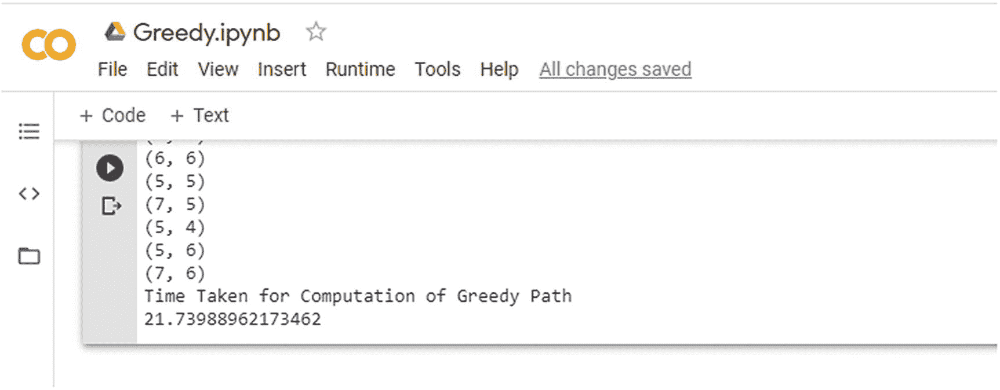
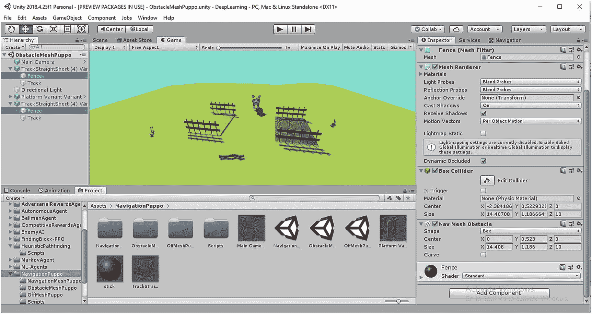

# 二、寻路和导航

寻路是获得从给定的源到目的地的最短路线的算法解释和实现。虽然这种范式属于一般图论，但已经有许多关于不同启发式算法的研究。选择最佳(最低成本)路线的基本方面意味着要遵循某些启发法。在本节中，我们将尝试理解启发式搜索算法的不同概念，从基本的 Dijkstra 算法到 A* (A star)的变体。对不同搜索算法的需求是非常必要的，因为诸如广度优先搜索(BFS)和深度优先搜索(DFS)的通用穷举算法对于游戏、模拟和机器人是不可行的。当我们深入每个启发式算法时，我们将会遇到不同的权衡标准，从时间复杂度到空间复杂度。我们还将探索导航网格的基本方面，以及如何创建一个智能寻路智能体，当它到达并找到目标对象时获得奖励。

如果我们回忆一下上一章，我们谈到了强化学习(RL)环境是如何由状态、行动和奖励组成的。在通用寻路中，我们将继续讨论状态和动作概念的变化。寻路中状态的概念来自于不同的平面坐标，当一个智能体寻找一个合适的轨迹时，它将自己放置在这些坐标中。如果我们考虑 GridWorld 环境的情况，智能体可以放在网格中的任何地方，智能体在特定网格中的位置就是一个状态。我们已经在贝尔曼方程和上一章的 Q-learning 部分看到，智能体决定去一个特定的状态(网格或“轨道部分”)以获得最大的回报。类似的概念也适用于此。动作空间包括智能体可以移动的不同方向，以检查到达目的地的替代的较短路径。在 2D 网格世界环境中，智能体可以具有动作空间，其包括八个方向，包括上、下、左、右、左上、右上、左下和右下，或者可以包括它们的子集。

这种状态和动作的概念对于启发式寻路算法非常重要。由于大多数寻路算法依赖于集中的距离最小化技术，因此在动态加权、边选择、双向最小化等方面对每个算法都进行了某些修改。图 [2-1](#Fig1) 展示了智能体如何使用寻路功能到达目的地。


图 2-1

RL 环境下的路径发现

当我们使用像 Bellman Ford 这样的穷举搜索算法时，基于最优性的一般寻路是相当耗时的，该算法确定从任何源到任何目的地的最佳轨迹，并考虑负权重边。这就是 Dijkstra、A*、B*和许多其他算法发挥作用的地方，它们战略性地消除了智能体轨迹中可能导致次优路径的某些状态。优化的度量可以包括重量最小化、时间最小化、回报最大化和其他策略，并且基于这些约束，不同的算法采用动态规划或启发式搜索来建模寻路问题。在算法复杂度确定的上下文中，我们使用 O() (big-oh)作为复杂度分析的上限度量。如果我们认为网格环境是一个图形数据结构，其中的节点表示状态和提供的源/目的节点，我们可以强调用 V 表示图中的顶点数，用 E 表示图中的边数。在一般的 BFS 和 DFS 技术(基本搜索)中，时间复杂度可以被视为 O(|V| +|E|)，这是线性时间复杂度。这是因为贪婪的穷举 BFS 算法依赖于在计算期间选择所有的顶点 V 和边 E。对于最优性，不同的算法在运行时复杂性方面将有不同的 big-O()值，我们将在下一节中看到。这将与用 Python 实现的算法的运行时相一致。总的来说，这些算法用于机器人、自主车辆和自我搜索智能体，以及基于非玩家角色(NPC)导航的不同模拟。在这些情况下，RL 环境也可能涉及智能体为达到目标而必须避免的某些障碍或挑战。这可能包括网格中最短路径轨迹中的物理障碍或基于虚拟负奖励的障碍(奖励为负的 n 维平面中的不同坐标)，这可能阻止智能体进入特定状态。第二个例子可能是机器人学中的一个场景，当机器人智能体试图远离目标时，它被认为是负奖励。

## 寻路算法

让我们试着理解不同的寻路算法。我们将开始强调算法实现，并查看这些算法在时间复杂度上的对比。最初，我们将从一般的穷举贪婪搜索算法开始，然后逐渐深入到优化的启发式 A*算法家族。


图 2-2

网格中的贪婪搜索状态空间

*   **贪婪算法** **:** 这是一种穷举搜索技术，其中智能体尝试冒险所有可能的路径和状态，以选择一个最佳轨迹到达目的地，我们考虑一个简化的 GridWorld 环境，其中智能体从一个特定的网格出发，必须以最佳路径到达另一个网格；这为智能体在八个方向上提供了一组可能的可移动状态，如前一节所述。由于这是一种穷举技术，所有可能的状态都被探索，这与 BFS 或 DFS 算法非常相似。如果我们使用 BFS，这可以被想象成一个智能体从一个特定的状态 S <sub>i，j</sub> 到 S <sub>i，j+1</sub> ，S <sub>i，j-1</sub> ，S <sub>i+1，j</sub> ，S <sub>i-1，j</sub> ，S <sub>i+1，j+1</sub> ，S <sub>i-1，j+1</sub> ，S 这可以在图 [2-2](#Fig2) 中看到。

现在，让我们借助 Python 中的一个示例 gridWorld 模拟来理解贪婪算法是如何工作的。我们创建了一个简化的 Gridworld，主要由 0 和 1 组成，其中 0 是“可行走”的网格，1 包含有障碍物的网格。智能体被提供了源网格和目的网格，并且必须通过穷尽搜索“可行走的”网格来贪婪地搜索目的地。

在 Jupyter 或 Colab 中打开“Greedy.ipynb”笔记本，让我们查看该程序所需的导入。

```py
import numpy as np
import networkx as nx
import heapq
import sys
import time

```

我们需要 heapq 库，它实现了一个优先级队列(最大堆数据结构),用于容器(数组、列表、元组)的自动排序，这在更新与特定状态或网格的最小距离时很有帮助。然后我们进入贪婪函数，这是搜索算法的主要部分。

```py
def Greedy(maze,src,dest):
     pq=[(0,src)]
     while (len(pq)>0):
          dist_measure,node= heapq.heappop(pq)

     #If destination is reached
           if node==dest:

              print("Reached")
              break

```

源状态或网格(“src”)被插入到优先级队列中，并且网格数据结构(元组)包含位置，作为 2D 平面中特定网格的 x 和 y 位置方面的属性之一。只要优先级队列不为空，搜索就会继续(这是 BFS 工作方式的一个经典例子)。

最初，我们检查当前从优先级队列中提取的网格状态是否是目的网格状态(“dest”)。如果到达目的地，我们就打破循环。

```py
#Look for child nodes (L,R,U,D,UL,UR,DL,DR)
for new_position in [(0, -1), (0, 1), (-1, 0), (1, 0), (-1, -1), (-1, 1), (1, -1), (1, 1)]:
       new_node=(node[0] + new_position[0], node[1] + new_position[1])

       #Check if new point is inside the maze
       if new_node[0] > (len(maze) - 1) or new_node[0] < 0 or new_node[1] > (len(maze[len(maze)-1]) -1) or new_node[1] < 0:

       continue

       #If not obstacle (maze index value==1)
          if maze[new_node[0]][new_node[1]] != 0:
             continue
        #Update Distance
        dist_temp=dist_measure+1
        heapq.heappush(pq,(dist_temp,new_node))
        path.append(new_node)

        return path

```

在这部分代码中，我们遍历了八个可能的可冒险网格状态(上、下、左、右、左上、右上、左下和右下),并添加了网格位置以获得新网格状态的位置。

由于贪婪是一种彻底的搜索，它会将所有不同的网格位置重复放置几次，以到达最终目的地。然后，我们应用条件逻辑，通过阻止智能体进入值为“1”的网格状态，来检查迷宫或网格世界是否可行走我们还检查智能体是否在迷宫或网格环境中，并且没有离开边界。然后，我们添加新的距离作为一个单位值，并将新的网格状态添加到优先级队列中，以便根据位置距离再次对其进行排序。

Gridworld 或 maze 的实现如下:

```py
maze=[[0, 0, 0, 0, 1, 0, 0, 0, 0, 0],
            [0, 0, 0, 0, 1, 0, 0, 0, 0, 0],
            [0, 0, 0, 0, 1, 0, 0, 0, 0, 0],
            [0, 0, 0, 0, 1, 0, 0, 0, 0, 0],
            [0, 0, 0, 0, 1, 0, 0, 0, 0, 0],
            [0, 0, 0, 0, 0, 0, 0, 0, 0, 0],
            [0, 0, 0, 0, 1, 0, 0, 0, 0, 0],
            [0, 0, 0, 0, 1, 0, 0, 0, 0, 0],
            [0, 0, 0, 0, 1, 0, 0, 0, 0, 0],
            [0, 0, 0, 0, 0, 0, 0, 0, 0, 0]]

```

main 函数调用这个特定迷宫或 GridWorld 上的贪婪搜索，如下所示:

```py
src=(0,0)
    dest=(7,6)
    st=time.time()
    path=Greedy(maze,src,dest)
    print_path(path,dest)
    et=time.time()
    print("Time Taken for Computation of Greedy Path")
    print(et-st)

```

这里源网格选择为(0，0)，目的网格选择为(7，6)；但是，这些可以根据我们的要求进行更改。然后调用贪婪函数，使用 Python 的“time”库计算路径的计算时间。在运行笔记本中的代码后，我们看到一个不同网格的列表，智能体在此行进以到达(7，6)。由于贪婪是穷尽的，搜索的次数可能会重复，路径可能会很长。这可能与算法巨大的运行时间有关，如图 [2-3](#Fig3) 所示。



图 2-3

贪婪搜索算法的运行时间

由于时间复杂度相当大，我们尝试探索一种优化的、单源的最短路径算法，称为 Dijkstra。

*   **Dijkstra 算法:** Dijkstra 是一种基于图形的算法，可提供从源到目的地的最佳或最短路线。该算法通过对距离度量的整体重新排序来寻找最优路径，并且路径长度的一般排序可以被认为是单调递增的。该算法维护两个单独的列表，通常称为开放列表和封闭列表。开放列表包含当前在相邻网格帮助下分析的网格状态或节点。封闭列表包含已经计算的网格状态。该开放列表通过使用优先级队列来实现，该优先级队列基于网格状态与源的距离大小的排序非递减顺序来存储网格状态。特别是因为 Dijkstra 算法总是从源找到任何网格状态之间的最短路径，所以当网格状态是目的地时，该算法停止。这条特定的路径是最优的，因为如果有其他“最优”路径，Dijkstra 算法会选择这条路径。这遵循了图论中的一般引理，其中如果在起始和目的节点之间存在最优路径，则沿着该特定路径的所有节点将具有距起始节点或源的最优距离。数学上，如果 U(s)是源节点，V(s)是目的节点，并且如果它们之间的路径是最优的，那么该路径上的任何节点 U <sub>1</sub> (s)也将具有到源的最优距离。这可以如下导出:

V(s) = U(s) + d(u，v)，

其中 V(s)是目的节点，U(s)是源 vode，d(u，V)是节点之间的最佳距离。那么对于该路径上的任意点 U <sub>1</sub> (s):

V(s) = U(s) + d(u，U<sub>1</sub>)+U<sub>1</sub>(s)+d(U<sub>1</sub>，v)

其中 d(u，u <sub>1</sub> )是从源 U(s)到 U <sub>1</sub> (s)的距离，d(u <sub>1</sub> ，V)是从 U <sub>1</sub> (s)到目的地 V(s)的距离。因此，路径 d(u，u <sub>1</sub> 是源和节点 U <sub>1</sub> 之间的最佳路径。这就完成了证明。

Dijkstra 算法使用这一原理来寻找最优的最短路径，并保持所访问的节点或网格状态的历史，以便不回溯。然而，该算法适合于正权重的图和网格，并且不能为负权重的边或网格路径提供最佳解决方案(由 Bellman Ford 解决)。该算法存储每个网格状态或节点到源或开始节点的距离，并且通常是按非递减顺序。如图 [2-4](#Fig4) 所示。


图 2-4

Dijkstra 最短路径优先算法

在图 [2-4](#Fig4) 中，智能体(带有橙色六边形)在一个图中找到从源(黄色圆形)到目的地(灰色圆形)的最短路线。

Note

Dijkstra 算法是由计算机科学家 Edsger W.Dijkstra 于 1965 年设计的。

“箭头”上的数字表示穿过该边的边权重或成本(这可以与覆盖该边所花费的时间进行比较)。该单向图有一条唯一的最短路径，该路径涉及 10 个单位的总成本，由智能体显示。该路径也具有从源到该路径上任何节点的最短距离。我们可以尝试创建不同的图形，然后应用 Dijkstra 算法，并始终检查证明的有效性。

现在我们已经介绍了 Dijkstra 的重要方面，让我们尝试用 Python 来实现它，这样我们就可以直观地看到算法是如何工作的。我们将在下一节中基于这个算法创建 Unity 项目，并创建一个使用这个算法到达特定目的地的 AI 智能体。在 Jupyter 或 Colab 中打开“Dijkstra.ipynb”笔记本。代码库有一个通用的模板，使用和以前一样的 GridWorld 环境(maze ),我们将专注于实现逻辑的实际“dijkstra”函数。

我们用最大值初始化距离字典(包含两个实体 grid-Position.x 和 grid-Position.y ),并使用函数最小化该字典以获得最小距离。

```py
distance=dict()
#Initialization of Dictionary
# [(position.x,position.y),distance]

for i in range(0,9):
        for j in range(0,9):
               distance[(i,j)]=sys.maxsize

```

下一步包括将开始网格或源包含在优先级队列中，这是我们的开放列表。只要优先级队列有一些元素(网格)，这个循环就会继续。从优先级队列或开放列表中提取每个网格，并使用之前分配的距离测量其距离。对于第一次迭代，由于我们包括了具有最大值的距离，新值(1 个单位)小于替换它的距离。在接下来的步骤中，基于相邻节点的不同距离计算，特定网格的距离值将会改变。如果距离大于先前观察到的值，则不会将其考虑在内。如果当前网格是目的地，则循环中断，并且我们已经到达具有最小成本路径的目标网格。

这是通过以下代码行实现的:

```py
def dijkstra(maze,src,dest):
     pq=[(0,src)]
       while(len(pq)>0):
                  dist_measure,node= heapq.heappop(pq)

                  #If distance of the node is greater
                  if(dist_measure>distance[(node[0],node[1])]):

                        continue
                  #If destination is reached
                  if node==dest:

                  print("Reached")
                  break

```

下一段处理沿着八个方向的周围状态或网格，用于可能的下一个网格位置。我们认为每个网格之间的距离在所有方向上都是 1 个单位。我们检查八个可能的网格中的每一个，并相应地更新新网格的位置；同样，如果路径包含与前一种情况类似的障碍物(标记为“1”)，我们将避开这些网格。然后，我们将 1 个单位的成本值添加到从旧网格到新网格的距离，并检查该距离是否小于新网格的当前距离。如果满足极小性条件，我们用附加值更新到新网格的距离，并将新网格添加到下一个相邻网格的优先级队列或开放列表中。这个过程一直持续到到达目的地。一旦到达目的地，沿路径的所有格网都将具有从起始格网或源开始的最小成本。

```py
#Look for child nodes (L,R,U,D,UL,UR,DL,DR)
for new_position in [(0, -1), (0, 1), (-1, 0), (1, 0),
(-1, -1), (-1, 1), (1, -1), (1, 1)]:
     new_node=(node[0] + new_position[0], node[1] +
     new_position[1])

      #Check if new point is inside the maze
     if new_node[0] > (len(maze) - 1) or new_node[0] < 0 or
     new_node[1] > (len(maze[len(maze)-1]) -1) or new_node[1] < 0:
        continue

      #If not obstacle (maze index value==1)
      if maze[new_node[0]][new_node[1]] != 0:
        continue
      #Update Distance
      dist_temp=dist_measure+1
      if(dist_temp<distance[(new_node[0],new_node[1])]):

        distance[(new_node[0],new_node[1])]=dist_temp
        heapq.heappush(pq,(dist_temp,new_node))
        path.append(new_node)

       return path,distance

```

这是 Dijkstra 算法的整个控制逻辑，我们将把它的运行时复杂性与以前创建的贪婪搜索算法进行比较。运行时，我们将看到类似于图 [2-5](#Fig5) 所示的运行时。


图 2-5

Dijkstra 算法的运行时

在笔记本的下一部分中，我们将观察图形的创建，并使用 Networkx 库在均匀加权的图形中创建 Dijkstra 路径，以欧几里德距离作为成本度量。Networkx 是一个 Python 库，包含几个与图遍历和最短路径查找(SPF)算法相关的算法，这里提供的只是一个在它的帮助下模拟 Dijkstra 算法的例子。

```py
G=nx.grid_graph(dim=[4,5])
def eucli(a,b):
  (x1,y1)=a
  (x2,y2)=b
  return ((x1-x2)**2 + (y1-y2)**2)**0.5

paths=nx.dijkstra_path(G,(1,2),(4,3))
print(paths)
path_length= nx.dijkstra_path_length(G,(1,2),(4,3))
print(path_length)
nx.draw_networkx(G)

```

该实现的模拟图如图 [2-6](#Fig6) 所示。


图 2-6

使用 Networkx 库可视化图形

现在我们理解了 Dijkstra 算法，我们将在 Unity 中创建一个相同的模拟，一个 AI 智能体尝试该算法以达到下一节中的目标。目前，我们将专注于另一类寻路算法的基础方面，这类算法通常被称为 A*。当谈到游戏、RL 和机器人时，这是最重要的一类算法，因为它与 Dijkstra 算法密切相关，所以我们将理解算法的差异和变体。


图 2-7

A*算法启发式和成本函数

*   **A* algorithm** **:** A* is a path searching algorithm that is most extensively used in games and simulations owing to computational flexibility, robustness, and optimality. However, there is an expensive space complexity associated with a classic A* algorithm, mainly due to its nature to store previous grids or states (nodes in a graph). The fundamental aspect of A* is its heuristic nature. It combines information that the Dijkstra algorithm uses, which involves favoring grids or states closer to the destination along the optimal path. The algorithm uses the heuristic to rule out certain grids or states, which may increase the optimal trajectory of the path and only focuses on those states that provide the minimum cost. This requires processing and storing of a grid’s information in terms of its neighbors’ distances. There are certain important heuristics that are followed in A*, which relies on the weights associated with each grid or state (node). This may include Euclidean or Hamiltonian distance measures from that particular grid to the destination. The A* uses an optimization strategy based on the grid attributes. In addition to the grid position, each grid has three important attributes:
    *   **g 值:**这是从起始网格或源到该特定网格(节点)的路径的成本。

    *   **h-Value:** 这是从当前网格到目的网格的启发式估计成本。

    *   **f 值:**这是特定网格(状态或节点)的 G 值和 H 值的相加。

    这在数学上可以简化为:

    F(n) = G(n) + H(n)

    Now let us try to understand why the heuristic term plays a significant role in the A* algorithm.
    *   在一个极端，如果 H(n)的值是 0，那么 F(n) = G(n)。这意味着，如果不考虑启发式因素，A*会简化 Dijkstra 算法。

    *   如果 H(n)值总是小于从网格‘n’移动到目的地的成本，那么 A*必然会找到最短路径。H(n)的值越小，启发性越小，这意味着对不同网格的探索越多，可能会造成更大的时间复杂度。

    *   如果 H(n)值等于从网格‘n’移动到目的地的成本，那么这总是 A*选择的最佳或最优路径。然而，这可以被定义为一种特殊情况，其中 A*算法试探法提供了从格网到估计点的优化路径的精确值。

    *   如果 H(n)值大于从网格“n”移动到目的地的成本，则沿着某个路径方向进行开发。这将涉及 A*算法运行明显更快，但产生次优轨迹。

    *   在另一个极端，如果 H(n)值大于 G(n ),那么在 A*算法中只涉及试探法，这使它类似于贪婪算法。

    *   通常选择 H(n)作为可接受的启发式函数，它不会高估实际成本。这使得启发式问题具体化了。

    *   H(n)可以包括距离度量，例如欧几里德距离、曼哈顿距离或平方欧几里德距离作为启发式度量。

    *   一致或单调试探法是一种试探法，其中特定网格“n”的值小于或等于该网格到下一个网格的距离和下一个网格的试探法值，如下所示:

    H(n) ≤ d(n，n+1) + H(n+1)

    现在我们已经理解了启发式算法在 A*算法中的重要性，我们可以用树的形式用 A*来可视化智能体的一般传播，如图 [2-7](#Fig7) 所示，其中红色节点代表网格的封闭列表，绿色节点在开放列表中。

让我们了解 Python 中的实现细节，然后我们将在 Unity 中模拟 A*算法。在 Jupyter 或 Colab 中打开“A-star.ipynb”笔记本。我们将使用 GridWorld 的相同模板，就像我们之前所有的搜索算法 Python 模拟一样，比如 maze 或 GridWorld 环境。在笔记本的开始，我们初始化一个节点类，它包含距离、x、y(在 2D 格网环境中)的位置以及将在 A*算法中使用的 f、g 和 h 值。

```py
class Node():
    """A node class for A* Pathfinding"""

    def __init__(self, parent=None, position=None):
        self.parent = parent
        self.position = position

        self.g = 0
        self.h = 0
        self.f = 0

    def __eq__(self, other):
        return self.position == other.position

```

下一部分涉及实际的 A*算法。如前所述，我们创建了两个列表:开放列表和封闭列表。开放列表将包含当前正在使用成本和启发式函数进行分析的所有网格(节点)，而封闭列表由已经分析过的网格(节点)组成。

```py
def astar(maze, start, end):

    """Returns a list of tuples as a path from the given start to the given end in the given maze"""

    # Create start and end node
    start_node = Node(None, start)
    start_node.g = start_node.h = start_node.f = 0
    end_node = Node(None, end)
    end_node.g = end_node.h = end_node.f = 0

    # Initialize both open and closed list
    open_list = []
    closed_list = []

    # Add the start node
    open_list.append(start_node)

```

我们将源网格包含在优先级队列或开放列表中。源格网和目标格网的 f 值、g 值和 h 值都初始化为 0。在循环内部，我们将提取每个网格。然后，我们将使用开放列表中网格的 f 值检查提取的网格(节点)的 f 值。如果提取的格网的值较大，那么我们将其分配给从开放列表中选择的 f 值小于提取的格网的格网。我们从开放列表中弹出提取的网格，并将其添加到封闭列表中。如果提取的当前网格是目的地网格，则搜索终止，变量“path”包含从源到目的地的最佳路线。

```py
while len(open_list) > 0:

        # Get the current node
        current_node = open_list[0]
        current_index = 0
        for index, item in enumerate(open_list):
            if item.f < current_node.f:
                current_node = item
                current_index = index

        # Pop current off open list, add to closed list
        open_list.pop(current_index)
        closed_list.append(current_node)

        # Found the goal
        if current_node == end_node:
            path = []
            current = current_node
            while current is not None:
                path.append(current.position)
                current = current.parent
            return path[::-1] # Return reversed path

```

然后，我们创建一个子格网或邻居的列表，启发式算法将计算从格网到目的地的欧几里德距离。像以前一样，我们在特定网格的八个方向上分析状态空间，并确保它是“可行走的”(网格值不为 1)，并且它在迷宫或 GridWorld 环境内。然后，我们将新网格添加到子列表中。

```py
# Generate children
   children = []
   for new_position in [(0, -1), (0, 1), (-1, 0), (1, 0),
   (-1, -1), (-1, 1), (1, -1), (1, 1)]: # Adjacent squares

            # Get node position
  node_position = (current_node.position[0]
  +new_position[0], current_node.position[1]
  +new_position[1])

            # Make sure within range
if node_position[0] > (len(maze) - 1) or
   node_position[0] < 0 or node_position[1]
      > (len(maze[len(maze)-1]) -1) or
      node_position[1] < 0:
                continue

            # Make sure walkable terrain
            if maze[node_position[0]][node_position[1]] != 0:
                continue

            # Create new node
            new_node = Node(current_node, node_position)

            # Append
            children.append(new_node)

```

下一步是计算 f 值、g 值和 h 值。首先检查子列表中的子网格是否已经在封闭列表中，然后忽略它。我们加 1 个单位作为距离成本 G(子；就像在 Dijkstra 中一样)，因为我们认为每个网格之间的距离是 1 个单位。然后，我们基于当前子网格和目标网格的 x 和 y 坐标之间的欧几里德平方距离来计算 H(子)值，以获得启发值。最后，我们将这两个值相加，得到 F(子)值。如果当前网格在开放列表上，我们检查 G(子)值是否小于开放列表上网格的 G 值。如果当前子代的 g 值更大，那么我们不考虑它，因为我们需要最小成本值或优化成本值。最后，我们将子网格添加到下一次迭代的优先级队列或开放列表中。下面几行代码说明了整个工作流程:

```py
# Loop through children
        for child in children:

            # Child is on the closed list
            for closed_child in closed_list:
                if child == closed_child:
                    continue

            # Create the f, g, and h values
            child.g = current_node.g + 1
            child.h = ((child.position[0]
            - end_node.position[0]) ** 2)
            + ((child.position[1] –
            end_node.position[1]) ** 2)

            child.f = child.g + child.h

            # Child is already in the open list
            for open_node in open_list:
                if child == open_node
                and child.g > open_node.g:
                    continue

            # Add the child to the open list
            open_list.append(child)

```

这是 A*算法的实现，如果我们运行这个模拟，我们将会看到算法的运行时间以及所遵循的路径，类似于图 [2-8](#Fig8) 中所示。


图 2-8

A*算法的运行时间

一旦我们熟悉了算法的实现和工作流程，我们就可以尝试一下 Networkx 库的 A*实现，感兴趣的读者可以在同一笔记本中找到它。

当我们用 Unity 创建我们的模拟时，我们将利用这个算法，然后我们将看到 A*算法如何使用这个算法试图找到一个最佳路径。我们已经详细讨论了经典的 A*算法，我们还将了解 A*算法的许多变体。这些变化是基于不同的启发式和算法的修改，用内存换取时间优化，反之亦然。我们将在未来的 A*算法课程中使用相同的迷宫模板。

Note

A*算法是由 N.J .尼尔森、P.E .哈特和 B .拉斐尔设计的。

## A*算法的变体

我们讨论了 A*算法的细节，但是还有许多修改，通过遵循不同的方法来提高内存优化或降低时间复杂度。一些最流行的算法实现是:

*   **动态加权 A*算法** **:** 这是经典 A*算法的加权版本。权重年龄被给予 A*优化函数的启发式部分。这样做是因为在探索的开始，我们通常需要更强的试探来进行更多的网格(节点)探索，以获得最佳路径。当智能体接近目的地网格时，要求启发式算法最小化，以便获得到达目的地的实际成本。对于向目的地的每个网格传播，这种降低启发式因子的权重的过程被称为动态加权 A*。通用公式如下所示:

    F(n) = G(n) + w(n) * H(n)，

    where F(n), G(n), H(n) have their usual meaning, and w(n) is the dynamic weight part. Let us try to visualize its implementation in the maze environment in our Python Notebook. Open the “DynamicA-star.ipynb” Notebook, and we can observe that there is a weight attribute in the node class.

    ```py
    #Dynamic-A-Star Algorithm for Pathfinding
    import time
    class Node():

        def __init__(self, parent=None, position=None):
            self.parent = parent
            self.position = position

            self.g = 0
            self.h = 0
            self.f = 0

            self.w=1

        def __eq__(self, other):
            return self.position == other.position

    ```

    因为我们使用与 A*算法相同的源模板，所以“dynamicastar”函数只有微小的变化。随着搜索继续向目的地进行，我们初始化权重衰减，即衰减因子。这种衰减对于减少启发式估计是必要的。

```py
def dynamicastar(maze, start, end):
      weight_decay=0.99

```

下一节中的大部分片段类似于 A*算法，包括将起始网格放入开放列表，然后迭代直到开放列表不为空。然后我们抽象出八个方向上的子网格，并检查它的距离，它是否是“可行走的”，以及它是否在迷宫内。唯一的区别在于成本函数，如下所示:

```py
# Create the f, g, and h values
child.g = current_node.g + 1

#Compute distance towards end for dynamic weightmapping
child.h = ((child.position[0] - end_node.position[0]) **   2) + ((child.position[1] - end_node.position[1]) ** 2)

src_dest=((start_node.position[0]-end_node.position[0])**2) + ((start_node.position[1]-end_node.position[1])**2)

child.w= child.w*weight_decay*(child.h/src_dest)

 child.f = child.g + child.w*child.h

```

我们首先记录实际成本 G(子成本)和启发式估计 H(子成本)的值，然后通过将搜索深度乘以衰减因子来更新 W(子成本)因子。搜索深度表示智能体沿着搜索轨迹已经访问了网格多远。最后，我们使用动态加权 A*的等式来更新 F(子)值。代码段的其余部分与 A*相同，包括更新封闭列表，并为下一次迭代向开放列表添加子网格。运行代码后，我们可以得到算法所需时间的估计，如图 [2-9](#Fig9) 所示。


图 2-9

动态加权 A*算法的运行时间

*   **迭代深化 A* (IDA*)算法** **:** 这是 A*算法的另一个变种，强调内存优化，执行递归。IDA*算法的关键特征是，它不像 A*算法(开放列表)那样保留被访问节点的记录。相反，当到达具有更大 f 值的新网格节点时，它从开始在网格节点上重复。该算法使用阈值，如果特定网格的 f 值大于阈值，该算法将从起始网格到新网格(新深度)重新开始。该实现需要一个无限循环，因为每当达到更高的 F (grid)值时，我们就从开始递归地跟踪网格节点。在递归阶段，每当获得更高的 F(网格)值时，启发式估计不沿着该网格节点探索(因为它不太可能在最佳轨迹上)，而是存储 F(网格)值。该递归返回最小 F(网格)值分数，该分数被设置为新的阈值，因为 F 值的减小意味着朝向目的地的最优轨迹。让我们在笔记本中探索这种算法的变体。打开“IDA-star.ipynb”笔记本，我们将只查看代码更改，因为使用了相同的迷宫模板。节点类与具有 F(n)、G(n)、H(n)、位置和距离属性的*节点类相同。唯一的区别是在“idastar”函数中，这里有一个无限循环。我们最初将阈值设置为从起始网格到目的网格的最大平方欧几里得距离或深度，由下式给出:

```py
threshold=((start_node.position[0]-
end_node.position[0])**2) + ((start_node.position[1]-
end_node.position[1])**2)

```

在无限循环中，我们观察到大多数操作是相同的，因为创建了新的子网格列表，并且对于每个新的子网格，探索了所有可能的八个方向。不同之处在于每个子网格的成本估计更新规则。

```py
child.g = current_node.g + 1
child.h = ((child.position[0] - end_node.position[0]) ** 2) + ((child.position[1] - end_node.position[1]) ** 2)
child.f = child.g + child.h

if(child.f<threshold):
#Restart again from the start to the path of the child node
  current_node=child

#check if child node is end node
if(child==end_node):
  break

```

if 条件验证当前子格网 F(子)值是否小于阈值，如果是，则子格网成为下一个要分析的格网。这是一种最小化技术，强调在所有子网格中选择尽可能低的 F(子)值作为新阈值。类似地，一旦子网格与目标网格相同，我们就中断。我们可以运行这个程序来生成算法的运行时效率。由于该算法中没有内存，因此路径可能包含多个重复的网格节点，这在为每个 NPC 分配内存非常昂贵的游戏和模拟中非常有用。在单个 NPC 或机器人的情况下，该算法可能不提供合适的解决方案，因为迭代提供了时间开销。IDA*的复杂度主要依赖于路径的深度，它像 A*一样返回最优路径，前提是启发式函数是可容许的(即 h 值没有高估真实成本)。图 [2-10](#Fig10) 显示了算法的运行时间。


图 2-10

IDA*算法的运行时间

*   **终身规划 A* (LPA*)算法** **:** 该算法为增量 A*算法，最适合动态图或动态 RL 环境。这是游戏和模拟中最常用的方法，其中不需要重新计算整个网格或图形节点。在动态环境中更新最佳轨迹需要某些附加组件。LPA*算法维护一个前任和继任网格节点的列表。当位于最佳路径上的周围网格动态变化时，这有助于更新特定网格节点的邻居。网格节点 n 的前趋节点是具有从它到 n 的边的任何网格节点。网格节点 n 的后继节点是边从 n 引导到的节点。网格节点具有称为 Rhs(节点)的另一个属性。该值是基于 G(节点)值最小化的前瞻值，可以写成:

    Rhs(Node) =最小值(G(node <sub>1</sub> ) + d(node，node <sub>1</sub> )，

    其中 d(node，node <sub>1</sub> )是网格 N=node 和 node <sub>1</sub> 之间的距离，前者是后者的前身。

    这起了一个重要的因素，好像 Rhs (n)等于 G(n)，那么网格 n 是局部一致的。如果所有的网格都是局部一致的，那么在这些网格之间就隐含着一个最佳轨迹。实际上，成本等式也会改变，并且是以下属性的最小化:

    F(n) = minimum(( minimum ( G(n)，Rhs(n)) + H(n))，(minimum ( G(n)，Rhs(n)))，

    其中符号具有它们通常的含义。

    There are certain advantages of this optimization, as each grid node is visited at most twice for each iteration of the algorithm. Since the priority queue or the open list contains a larger set of attributes, the implementation of this data structure determines the runtime of the algorithm. The grid nodes are expanded in a monotonically increasing manner, and nodes that are not consistent locally are not explored. Since it is based on the A* algorithm, the heuristic should be admissible, and in dynamic graph changing environments, LPA* outperforms the A* algorithm. We will have a brief overview of how the algorithm works and is implemented in most game engines and simulations for dynamic RL environments. Open the “LPA-star.ipynb” Notebook and observe the changes in the node class.

    ```py
    class Node():
        """A node class for LPA* Pathfinding"""

        def __init__(self, parent=None, position=None):
            self.parent = parent
            self.position = position

            self.g = 0
            self.h = 0
            self.f = 0
            self.rhs=0

        def __eq__(self, other):
            return self.position == other.position

    ```

    Rhs (n) lookahead 属性已添加到 node 类中。我们创建了前任和继任列表，如下所示:

    predecessor_list=[]

```py
successor_list=[]

```

“lpastar”函数的其余部分几乎与以前的算法相似，只是对于在八个方向上探索的每个子网格，它们被输入到后继列表中，如下所示:

```py
new_node = Node(current_node, node_position)
successor_list.append(new_node)

```

接下来，我们转到开销更新方法，并尝试理解如何为后继节点更新开销。我们更新当前子网格的 G(n)和 H(n)值。然后，用 G(n)值和从子网格的前身到网格的距离之和来更新子网格的 Rhs(n)值。

```py
child.g = current_node.g + 1

child.h = ((child.position[0] - end_node.position[0]) ** 2) + ((child.position[1] - end_node.position[1]) ** 2)

for i in range(len(children)):
  if children[i]==child:
    break

#Do rhs calculation
child.rhs= child.g + children[i-1].h
if child.rhs<child.g:
  child.g=child.rhs

```

下一步是更新子节点的后续网格节点。这是通过使用“update_successor”函数来完成的，该函数用前趋网格节点的 G(n)和 H(n)之和与后继网格节点的 Rhs(n)之间的最小值来更新后继网格节点的 Rhs(n)值。如果后续网格已经在开放列表中，那么它将从列表中移除。如果后继者的 G(n)和 Rhs(n)值不匹配，我们设置 F(n ),如 LPA*的成本最小化等式中所述。该函数用最小成本值更新所有后继网格节点，以便沿着本地一致的后继网格节点继续探索。

```py
def update_successor(predecessor_list,successor,
successor_list,open_list,src):
  for pred in predecessor_list:
      successor.rhs=min(successor.rhs,pred.g+ pred.h)
  if successor!=src:
    successor.rhs=sys.maxsize
  if successor in open_list:
    open_list.remove(successor)
  if successor.g!=successor.rhs:
    successor.f=  min(min(child.g,child.rhs)
+ child.h,child.g + child.h)
    open_list.append(successor)

```

在子网格的所有后续网格节点都被更新之后，当前子网格的 F(n)值按照以下等式被更新:

```py
child.f = min(min(child.g,child.rhs) + child.h,child.g + child.h)

```

该算法在任何仿真引擎的通用寻路人工智能中有广泛的应用。原因可以归因于每当网格环境改变时 F(n)、G(n)、H(n)和 Rhs(n)值的快速更新。这在动态环境中非常实用，在动态环境中，以消耗更多内存为代价返回更快的最优轨迹。我们可以在笔记本或 Colab 中运行这个来检查算法的运行时间，如图 [2-11](#Fig11) 所示。


图 2-11

LPA*算法的运行时间

*   **D* (D-star) algorithm** **:** This is another variation of A* that operates in a similar manner with respect to the classic A* algorithm. There are three variants of this algorithm:
    *   经典 D*算法

    *   聚焦 D*算法

    *   d 他妈的一点点

    为简单起见，我们将理解经典的 D*算法，因为聚焦的 D*算法是基于这一点的，带有某些启发性。D* lite 是前面提到的 LPA*算法的改进。这个算法也有一个开放列表和一个封闭列表。除此之外，还需要两个属性:提升和降低。格网的 raise 属性表示其 F(n)值高于上次访问时的值。网格的较低属性表示当前 F(n)值低于上次访问网格节点时的值。在“扩展”阶段或路径探索阶段，算法将网格更新到开放列表，并更新所有相邻网格节点的变化。与 A*的主要区别在于，与 A*不同，D*选择从源网格到目的网格的最佳路径，D *从目的网格开始向后搜索。这可以理解为，每个网格节点在存储器中有一个后向指针，它可以在其中存储路径中的前一个网格。当到达一个障碍时，当前网格节点 F(n)值被提高。这又提高了所有相邻网格节点的 F(n)值。当通过选择另一个轨迹(另一个相邻网格)可以降低升高的网格节点时，这也会反向传播到所有先前升高的相邻网格节点。这被认为是增量搜索的另一种变体，在游戏和模拟中被广泛使用。我们可以尝试使用 Python 笔记本来理解 D*算法的简化变体。在 Jupyter 或 Colab 中打开“D-star.ipynb”笔记本。由于大部分代码类似于 A*，我们将只考虑重要的部分。我们有一个类似的节点类初始化，在“dstar”函数中，我们有开放和封闭列表以及后继和前任列表。最重要的方面是当子网格节点遇到障碍时，调用“is_raise”函数，根据目前观察到的最小 F(n)值最小化子网格节点的 F(n)值。

```py
#Raise Function for neighbouring successor nodes
def is_raise(children,child_node,mini):
  if child_node.f < mini:
    mini=child_node.f
  return child_node

```

下一步是检查网格的开放列表，查找比当前子网格的 F(n)值高的任何值 F(n)。这意味着开放列表网格节点遇到了障碍，并且已经提高了它们节点的所有 F(n)值。因此需要降低。

```py
#Recalculate distance based on the Raise value of node
for open_node in open_list:
    if child == open_node and child.g > open_node.g:
        continue
    if(open_node.f>child.f):
        open_node=child
        open_list.append(child)

```

一旦我们理解了 D*算法的这个简化变体，我们就可以检查这个算法的运行时间。聚焦 D*算法依赖于提高和降低属性的启发式估计。运行时预览如图 [2-12](#Fig12) 所示。


图 2-12

D*算法的运行时间

*   **B* (B-star)算法** **:** 这是一种最佳优先搜索算法，是 A*算法的另一种变体。这种搜索的概念依赖于证明或否定通过特定网格节点的路径是否是最佳路径。B*算法的功能类似于深度优先搜索树，它从根部延伸到叶子，要么证明要么否定。这使得探索被限制到网格节点，在那里有机会生成最佳路径。这种方法对 A*算法进行了微调，因为它创建了处于最佳轨迹的最佳拟合网格节点的子空间，而不是迭代所有同等概率的节点。B*采用区间评估和启发式估计。该算法通过基于 F(n)值的上限和下限选择节点来执行。这是一个相当简单的算法，我们来试着理解一下它在“B-star.ipynb”笔记本中的实现。在大部分代码段中，几乎都是类似的，除了在“bstar”函数中，我们用 Python 提供的最低最小值来初始化最小值。

```py
mini=sys.maxsize

```

在沿着八个方向的子网格节点的循环中，我们看到在 F(n) update 函数之后，我们比较所有子网格节点中的“mini”值(下限),并用该下限最小值更新子网格的 F(n)值。这确保了沿着正确的子网格节点继续探索。

```py
child.f = child.g + child.h
    if(child.f<mini):
      mini=child.f
#Apply B-star logic
for child in children:
 if child.f==mini:
 # Child is already in the open list
    for open_node in open_list:
        if child == open_node and child.g > open_node.g:
            continue

    # Add the child to the open list
    open_list.append(child)

```

我们可以运行这段代码，也可以得到该算法的运行时值，如图 [2-13](#Fig13) 所示。


图 2-13

B*算法的运行时间

*   **简单的受内存限制的 A* (SMA*)算法** **:** 这是 A*的另一种算法变体，它沿着最有利的网格节点扩展，并修剪不利的节点。如果允许的内存足以存储模拟的浅层版本，这是完全最佳的。在给定的内存空间中，该算法提供了比大多数 A*变体更好的解决方案。它不会重新访问旧的网格节点。类似地，在 A*中，扩展继续考虑 F(n)试探法。最简单地说，这可以被认为是带有修剪的 B*算法的内存受限版本。如果提供了足够的内存，该算法将最佳地优化内存。“SMA-star.ipynb”笔记本中提供了 SMA*算法的变体，包括 B*和 LPA*的组合。由于之前已经讨论过代码，我们将只讨论 LPA*和内存优化 B*的链接。

```py
child.rhs= child.g + children[i-1].h
if child.rhs<child.g:
      child.g=child.rhs
      #Update the successor nodes in the path
      for successor in successor_list:
        update_successor(predecessor_list,successor,
successor_list,open_list)

```

这是更新后继者的 LPA*变体，下面的代码段是 B*变体。

```py
child.f = child.g + child.h
    if(child.f<mini):
      mini=child.f
#Apply B-star logic
for child in children:
 if child.f==mini:
 # Child is already in the open list
    for open_node in open_list:
        if child == open_node and child.g > open_node.g:
            continue

    # Add the child to the open list
    open_list.append(child)

```

运行这段代码为我们提供了路径和运行时间，如图 [2-14](#Fig14) 所示。


图 2-14

SMA*算法的运行时间

## 寻路的其他变体

到目前为止，我们已经非常熟悉一般寻路中的启发式估计。这些算法在几个模拟引擎和游戏引擎中内部实现，并且在启发式寻路领域中被最广泛地使用。还存在其他算法变体，例如这里列出的那些。

*   **跳跃搜索算法** **:** 一种改进的 A*算法，智能体可以从一个网格跳到另一个网格以获得最优路径。这可以被认为如下:不是选择相隔 1 个单位的八个可能的方向，而是考虑相隔 2 或 3 个单位的八个或更多的方向。这大大增加了搜索空间，并在游戏中使用。

*   **阿尔法-贝塔剪枝算法** **:** 博弈论(二人零和游戏)中使用的经典算法，其中一个智能体必须以另一个智能体为代价最大化其回报。这种算法试图建立一棵极大极小树——一棵使一个智能体的回报最大化，而使另一个智能体的回报最小化的树。

*   **分支定界** **:** 这是一种经典的算法，涉及到所有可能状态的搜索树的生成。这是一种用于组合优化问题的穷举搜索算法。

*   **贝尔曼·福特****:**Dijkstra 算法的变体，涉及图中的负权重和多源最短路径。

我们试图理解游戏中所有的寻路算法和优化技术。A*寻路变体的详细描述是理解 Unity 游戏引擎如何内部优化搜索和 AI 寻路的一个基本方面。虽然我们提供了启发式算法的不同变体的 Python 实现，但我们现在将关注用 Dijkstra 和 A*算法模拟 Unity 游戏。由于 A*被认为是游戏中最原始的启发式算法，我们将尝试在 Unity 中理解并构建一个 A*搜索环境。稍后我们将集中在 Unity 中的导航网格上，并使用基于 NPC 的寻路技术构建一个敌方 AI。

## 团结中的寻路

在本节中，我们将尝试在 Unity 中模拟 Dijkstra 和 A*算法，其中一个 AI 智能体试图到达目标。因为我们已经了解了 Dijkstra 算法是如何工作的，所以我们将研究 Unity 模拟。

### Unity 中的 Dijkstra 算法

我们必须下载“deep learning”Unity 文件夹(从与该书相关的 Github 项目中)，我们将在所有项目中使用它。下载完成后，我们将打开“Assets”文件夹，导航到“HeuristicPathfinding”文件夹。这包含了 Dijkstra 和 A*算法模拟的场景设置。在 Unity 编辑器中打开“DijkstraAgent”场景文件。模拟的概念是让紫色智能体立方体通过最小成本路径到达绿色目标立方体。道路上的障碍物用白色方块表示。我们将从我们在 Dijkstra 算法的 Python 实现中创建的 GridWorld 或 menvironment 中进行类比。模拟的平台或平面被划分成网格(如 Unity 场景中所示)。这些网格组合在一起形成一个迷宫(网格矩阵)。迷宫的尺寸是 6X6，我们在水平和垂直方向上有六个网格。像以前一样，对于可行走的网格，我们将网格的值初始化为 0，对于不可行走的网格(有障碍物的网格)，我们将值初始化为 1。我们将 Unity 场景转换为 Python 的迷宫模拟，将网格分配给平台，将障碍物分配为白色立方体，将目标分配为目的网格。图 [2-15](#Fig15) 提供了场景的预览。


图 2-15

Unity 编辑器中的 Dijkstra 算法场景

让我们试着理解这个模拟的源代码是如何工作的。打开“Scripts”文件夹，打开“dijkstraagent . cs”C #脚本。因为我们将尝试实现 Python 代码段的 C#版本，所以我们将浏览某些数据结构和集合(容器)。我们首先初始化“Pair”类，它对于存储网格平台的 x 和 y 坐标很有用(因为它是 2D)。这对于用 0 和 1 值填充矩阵或网格平台很有用，这取决于网格是否可行走。网格坐标被表示为具有 x 和 y 坐标(x，y)的元组或容器，例如(0，0)，这表示起始网格节点。类似地，我们将目标 gridnode 设为(5，5)，这表示平台的右上角。网格平台矩阵的编号在特定行从 0 到 5(从左到右)开始，在每列从 0 到 5(从下到上)开始。因此，放置智能体立方体的左下角坐标具有作为 x 和 y 值的网格位置坐标(0，0)，而目标智能体位于位置(5，5)。然后，障碍物可以表示为左侧的网格位置[(0，3)，(1，3)]和右侧的[(3，3)，(4，3)，(5，3)]之间，只允许通过(2，3)网格位置的移动。这是按照我们的规则进行的，即从左到右、从下到上进行编号。一旦我们能够用 Unity 场景和迷宫环境映射网格平台的结构，我们就可以创建类了。

```py
public class Pair<T, U>
{
    public Pair()
    {
    }

    public Pair(T first, U second)
    {
        this.First = first;
        this.Second = second;
    }

    public T First { get; set; }
    public U Second { get; set; }
};

```

我们转到主类“DijkstraAgent”，初始化智能体游戏对象、目标游戏对象、平台的网格矩阵和 dictionary 等变量，dictionary 将矩阵索引与网格变换位置和堆或优先级队列数据结构的实现进行映射，后者广泛用于网格距离的排序。

```py
float[][] grid;
Dictionary<float, int> dictionary;
public GameObject agent;
public GameObject target;
Transform agent_transform;
Transform target_transform;
List<Pair<Pair<int, int>, float>> heapq;

```

像以前一样，在 start 方法中，我们用标签初始化我们的游戏对象，并且用基于矩阵网格坐标的网格变换值填充字典。我们用 0 和 1 初始化网格矩阵，并创建一个堆数据结构的对象(优先级队列)。然后，我们调用协程函数作为一个单独的线程来启动模拟。这可以通过以下方式实现:

```py
agent = GameObject.FindWithTag("agent");
target = GameObject.FindWithTag("target");
agent_transform = agent.GetComponent<Transform>();
target_transform = target.GetComponent<Transform>();
dictionary = new Dictionary<float, int>();
dictionary.Add(-25f, 0);
dictionary.Add(-15f, 1);
dictionary.Add(-5f, 2);
dictionary.Add(5f, 3);
dictionary.Add(15f, 4);
dictionary.Add(25f, 5);
//sample states (-25,-15,-5,5,15,25 for x and y axes)
grid = create_mat(6);
for (int i = 0; i < 6; i++)
{
    for (int j = 0; j < 6; j++)
    {
        grid[i][j] = 0;
    }
}

for (int i = 0; i < 6; i++)
{
    if (i != 2)
    {
        grid[i][3] = 1;
    }
}
heapq = new List<Pair<Pair<int, int>, float>>();
StartCoroutine(executeDijkstra(grid, dictionary, heapq, agent_transform, target_transform));

```

在这种情况下，我们实现了一个多线程模拟，因为协程调用“executedijkstra”枚举器方法，该方法又将变量传递给另一个名为“dijkstra”的协程。这是实现控制逻辑的地方，并且创建了一个路径容器，用于存储位于智能体所沿路径上的网格的 x 和 y 坐标位置。

```py
private IEnumerator executeDijkstra(float[][] grid, Dictionary<float, int> dictionary, List<Pair<Pair<int, int>, float>> heapq,Transform agent_transform, Transform target_transform)
    {

        yield return new WaitForSeconds(2f);
        List<Pair<int, int>> path = new List
   <Pair<int, int>>();
        yield return StartCoroutine(dijkstra(grid,
        dictionary, heapq, agent_transform,
        target_transform,   path));

    }

```

在“dijkstra”方法中，我们首先创建一个名为“距离”的集合或容器这个容器包含网格的 x 和 y 坐标以及一个浮点值，该值表示特定网格节点与源网格节点之间的距离。我们用来自网格矩阵的值初始化这个“距离”容器，网格矩阵代表网格变换位置(其中 grid.x = 0 和 grid.y = 0 表示平台上的坐标为(0，0)或起始网格)。在这种情况下，我们将手动将目标放置到平台矩阵上的网格位置(5，5)。因此，我们在源网格(0，0)上有智能体多维数据集，在目的网格(5，5)上有目标多维数据集。我们通过遵循我们的平台规则来初始化平台。

```py
List<Pair<Pair<int, int>, float>> distance = new List<Pair<Pair<int, int>, float>>();

for (int i = 0; i < 6; i++)
{
    for (int j = 0; j < 6; j++)
    {
                      Pair<int, int> ps = new Pair<int, int>();
                      ps.First = i;
        ps.Second = j;
        distance.Add(new Pair<Pair<int, int>, float>(ps, float.MaxValue));

    }
}

```

一旦我们构建了“距离”容器，我们就创建了另一个名为“状态”的位置容器，当我们考虑特定网格节点(类似于 Python 程序中的子网格)的邻域中的八个网格节点时，这将很有帮助。我们创建源和目标网格，并指定其位置值，但源节点除外；所有其他网格节点的初始值都设置为系统的最大浮点值。这类似于我们在 Dijkstra 中使用的方法，因为我们必须基于最小化算法来更新权重。然后，我们将源节点分配给优先级队列或堆。

```py
Pair<int, int> src = new Pair<int, int>();
src.First = 0;
src.Second = 0;
Pair<int, int> dest = new Pair<int, int>();
dest.First = 5;
dest.Second = 5;
heapq.Add(new Pair<Pair<int, int>, float>(src, 0f));

List<Pair<int, int>> states = new List<Pair<int, int>>();

states.Add(new Pair<int, int>(0, -1));
states.Add(new Pair<int, int>(0, 1));
states.Add(new Pair<int, int>(-1, 0));
states.Add(new Pair<int, int>(1, 0));
states.Add(new Pair<int, int>(-1, -1));
states.Add(new Pair<int, int>(-1, 1));
states.Add(new Pair<int, int>(1, -1));
states.Add(new Pair<int, int>(1, 1));

```

下一部分运行一个循环并迭代，直到优先级队列不为空。我们从队列的顶部提取网格节点，然后检查网格的距离值是否小于同一网格的先前观察值。对于第一次迭代，因为所有的网格距离值都被初始化为浮点型。MaxValue(最大浮点值)，它将被替换。我们不考虑网格的当前距离是否超过相同网格的先前距离值，并且如果目的地和当前网格位置相同，我们就退出循环。这是在经典 Dijkstra Python 源代码中实现的相同算法工作流。

```py
while (heapq.Count > 0)
{
            float dist = 0f;
            Pair<int, int> coord = new Pair<int, int>();
    foreach (Pair<Pair<int, int>, float> kv in heapq)
    {
        dist = kv.Second;
        coord = kv.First;
        break;
    }
    path.Add(coord);
    Debug.Log("heapsize");
    Debug.Log(heapq.Count);

    heapq.RemoveAt(0);
    float dist_measure = 0f;
    foreach (Pair<Pair<int, int>, float> kw in distance)
   {
        Pair<int, int> old_coord = kw.First;
        if (old_coord == coord)
        {
            dist_measure = kw.Second;
            break;
        }
    }

```

下一段类似于检查当前网格的八个方向上的网格，并添加新的网格位置。然后，我们检查新位置是否在网格平台内，以及它是否可行走(值不为 1)。我们将浮点值 5f 添加到新的网格距离中。然后，我们检查更新后的网格距离值是否小于先前观察到的值。如果该值较小，我们将更新当前网格距离的距离值，并将新子网格添加到优先级队列和路径容器中。这个操作类似于 Python 笔记本中的子网格更新代码段。

```py
    Debug.Log("inside the loop");
    foreach (Pair<int, int> sample_pair in states)
    {
        Debug.Log("inside the loop");
        Pair<int, int> new_coord = new Pair<int, int>();
        new_coord.First = coord.First + sample_pair.First;
        new_coord.Second = coord.Second + sample_pair.Second;
        int l = new_coord.First;
        int r = new_coord.Second;
        Debug.Log("inside the loop");
        if (l < 0 || l > 5 || r < 0 || r > 5)
        {
            Debug.Log("Checking neighbours");
            continue;
        }

        if (grid[l][r] == 1)
        {
           Debug.Log("notwalkable");
            continue;
        }
        float temp_dist = dist_measure + 5f;
        float dx = 0f;
        Pair<int, int> ps = new Pair<int, int>();
        ps = new_coord;
        foreach (Pair<Pair<int, int>, float> ds in distance)
        {
            if (ps.First == ds.First.First
            &&  ps.Second==ds.First.Second)
            {
                Debug.Log("changing the  values");
                dx = ds.Second;
                if (dx > temp_dist)
                {
                    Debug.Log("changing values");
                    ds.Second = dx;

                                        #Add to heap
                    heapq.Add(new Pair<Pair<int, int>,
                    float>(ds.First, ds.Second));
                                      #Add the node to the path
                    path.Add(new Pair<int,
                    int>(ds.First.First, ds.First.Second));
                }
                break;
            }
        }
    }

```

为了在 Unity 模拟中显示这一点，在“dijkstra”函数完成后，包含从源到目的地路径上的网格的(x，y)坐标的路径容器被填充，另一个协程被调用。“move_agent”协程非常简单，因为它从路径容器中检索每个网格坐标(x，y ),然后使用字典映射特定坐标的变换位置。然后，智能体的变换根据来自该字典的 Dijkstra 路径上的网格的变换值进行更新。

```py
foreach (Pair<int, int> ps in path)
{
    int l = ps.First;
    int r = ps.Second;
    //Debug.Log(path.Count);
    Debug.Log("grid values");
    Debug.Log(l);
    Debug.Log(r);
    float x_vector = 0f;
    float z_vector = 0f;
    foreach (KeyValuePair<float, int> kv in dictionary)
    {
        if (kv.Value == l)
        {
            x_vector = kv.Key;
        }
        if (kv.Value == r)
        {
            z_vector = kv.Key;
         }
         Debug.Log("Dictionary Values");
         Debug.Log(kv.Value);
        agent_transform.position = new
   Vector3(x_vector,
   agent_transform.position.y, z_vector);

   yield return new WaitForSeconds(1f);
    }

}

```

这就完成了 Unity 中用于寻路的 Dijkstra 算法的整个模拟代码段。在我们对代码的分析感到满意之后，我们可以尝试在 Unity 编辑器中运行它。我们将观察到，对于每次迭代，智能体立方体通过不同的网格到达目标。我们允许智能体基于 Dijkstra 优化做出的每个决定有 1 秒钟的等待时间。我们还可以转到 DeepLearning 根文件夹下的 environments 文件夹，运行涉及 Dijkstra 算法的 Unity 可执行模拟。这为读者形成了一个粗略的模板，不同的图形搜索算法可以用这个模板来实现。在下一部分中，我们将考虑经典 A*算法的实现。既然我们现在已经熟悉了原始算法以及我们在本节中创建的 Unity 迷宫环境，那么理解 Unity 中的 A*模拟概念就相当容易了。在算法中，我们将使用专门的节点类来存储 F、G、H 值，并使用复合集合容器来基于启发式估计和最小化成本函数更新这些值。图 [2-16](#Fig16) 提供了该场景的示意图。


图 2-16

智能体沿着 Dijkstra 路径走向目标多维数据集

### Unity 中的 A*算法仿真

让我们在相同的 Unity 迷宫环境或网格环境中创建 A*模拟。我们有 Unity 场景的相似架构，分别在(0，0)和(5，5)有相同的智能体和目标。图 [2-17](#Fig17) 提供了现场的视图。


图 2-17

A*算法模拟 Unity 场景

因为我们在 Dijkstra 中提到了模拟的工作流程，所以我们在这个算法中也遵循了类似的工作流程。最初，我们创建包含 F、G、H 值的节点类。

```py
public class Node<T, U, V>
{
    public float f = 0f;
    public float g = 0f;
    public float h = 0f;

    public Node()
    {

    }
    public Node(T f, U g, V h)
    {
        this.F = f;
        this.G = g;
        this.H = h;
    }
    public T F { get; set; }
    public U G { get; set; }
    public V H { get; set; }
}

```

在 monobehavior 类下，我们有类似于智能体的变换、目标的变换以及字典的变量。优先级队列的数据结构发生了变化，因为现在我们必须一起考虑几个属性，以最小化最佳轨迹的距离。因此堆或优先级队列(在 A*算法中是开放列表)中的每个实体都将是不同容器的复合集合。

```py
    float[][] grid;
    Dictionary<float, int> dictionary;
    public GameObject agent;
    public GameObject target;

    Transform agent_transform;
    Transform target_transform;
    List<Pair<Pair<Pair<int, int>, Node<float, float, float>>
    , float>> heapq;
    //SortedDictionary<float, Pair<int, int>> heapq;
    // Start is called before the first frame update
    List<Pair<Pair<Pair<int, int>, Node<float, float, float>>
   , float>> closed_list;

```

开放列表堆中的每个网格节点实体都有一个位置坐标(x，y；由一对<int int="">给定)，后跟网格节点(F，G，H)和距起始节点的距离。因此，包含在单个网格节点中的信息发生了实质性的变化。与 Dijkstra 不同，它包含位置、节点属性和距离。这个 start 方法包含网格平台和 GameObjects 字典的类似实现和初始化。唯一增加的是开放列表(堆)和封闭列表复合容器，如下所示:</int>

```py
heapq = new List<Pair<Pair<Pair<int, int>,
   Node<float, float, float>>, float>>();
closed_list = new List<Pair<Pair<Pair<int, int>,
        Node<float, float, float>>, float>>();
StartCoroutine(executeAstar(grid, dictionary,
heapq,  closed_list, agent_transform, target_transform));

```

然后我们转到协程“executeAstar”，在那里调用另一个实现原始算法的协程“Astar”，路径容器被初始化，并像在 Dijkstra 中一样作为参数传递。

```py
yield return new WaitForSeconds(2f);
List<Pair<int, int>> path = new List<Pair<int, int>>();
yield return StartCoroutine(Astar(grid, dictionary, heapq, closed_list, agent_transform, target_transform, path));

```

在“Astar”函数中，我们初始化了距离容器，它保存了网格节点的位置坐标(x，y)以及与起始节点的距离。我们还有类似的“states”容器，其中包含每个网格节点的八个可能的子网格节点位置坐标的列表。我们最初将起始网格和结束网格的 F、G、H 值设置为 0。起始网格的位置坐标被初始化为(0，0)，目标网格的位置坐标为(5，5)。起始网格的距离初始化为 0，所有其他网格初始化为 float。像 Dijkstra 里的 MaxValue。

然后，我们将开始网格节点添加到开放列表或优先级队列或堆中。

```py
        Pair<int, int> src = new Pair<int, int>();
        src.First = 0;
        src.Second = 0;
        Pair<int, int> dest = new Pair<int, int>();
        dest.First = 5;
        dest.Second = 5;
        Node<float, float, float> src_node = new Node
  <float, float, float>();
        Node<float, float, float> dest_node = new Node
        <float, float, float>();

        src_node.F = src_node.G = src_node.H = 0f;
        dest_node.F = dest_node.G = dest_node.H = 0f;
        Pair<Pair<int, int>,
        Node<float, float, float>>  pair_dest =
        new Pair<Pair<int, int>, Node<float, float, float>>
        (dest, dest_node);

        Pair<Pair<int, int>,
        Node<float, float, float>> pair_src = new Pair
        <Pair<int, int>, Node<float, float, float>>
        (src,  src_node);
        heapq.Add(new Pair<Pair<Pair<int, int>,
        Node<float, float, float>>, float>(pair_src, 0f));

```

然后，只要开放列表不为空，我们就进行迭代，一次提取一个网格节点。然后，我们检查提取的网格节点的 F 值是否大于开放列表中的其他网格节点。一旦找到 F 值小于当前网格节点的网格节点，我们就将节点属性(F，G，H)分配给当前网格节点。如果当前的网格节点是目的节点，我们终止进程并提供路径。

```py
Pair<Pair<int, int>, Node<float, float, float>> current_node = new Pair<Pair<int, int>, Node<float, float, float>>(coord, var_node);
Pair<Pair<Pair<int, int>, Node<float, float, float>>, float> current_sample = new Pair<Pair<Pair<int, int>, Node<float, float, float>>, float>(current_node, dist);
foreach (Pair<Pair<Pair<int, int>, Node<float, float, float>>, float> kv in heapq)
{
    var_node = kv.First.Second;
    Node<float, float, float> cur_node = new
    Node<float, float, float>();
    cur_node = current_node.Second;
    if (var_node.F < cur_node.F)
    {
        cur_node.F = var_node.F;
        cur_node.G = var_node.G;
        cur_node.H = var_node.H;
        current_node.Second = cur_node;
    }
}
path.Add(coord);
if (current_sample.First.First == pair_dest.First)
{
    Debug.Log("Found");
    break;
}

```

在下一部分中，我们迭代八个相邻的网格，并验证新的网格位置是否位于网格或迷宫平台内，以及它是否是“可行走的”(值不为 1)，就像在 Dijkstra 中一样。然后，像 Dijkstra 一样，我们将新的子网格的距离增加 5 个单位，并比较这是否是最小距离值，并添加到开放列表中。这是距离更新的标准成本函数，类似于 Dijkstra。

```py
List<Pair<Pair<Pair<int, int>, Node<float, float, float>>, float>> children_list = new List<Pair<Pair<Pair<int, int>, Node<float, float, float>>, float>>();
foreach (Pair<int, int> sample_pair in states)
{
    Debug.Log("inside the loop");
    Pair<int, int> new_coord = new Pair<int, int>();
    new_coord.First = coord.First + sample_pair.First;
    new_coord.Second = coord.Second + sample_pair.Second;
    int l = new_coord.First;
    int r = new_coord.Second;

    if (l < 0 || l > 5 || r < 0 || r > 5)
    {
        Debug.Log("Checking neighbours");
        continue;
    }
    if (grid[l][r] == 1)
    {
        Debug.Log("notwalkable");
        continue;
    }

```

然后，我们比较子网格的距离度量，如下所示:

```py
    float temp_dist = dist_measure + 5f;
    float dx = 0f;
    Pair<int, int> ps = new Pair<int, int>();
    ps = new_coord;
    Node<float, float, float> temp_node = new
    Node<float, float, float>(0f, 0f, 0f);
    Pair<Pair<Pair<int, int>,
    Node<float, float, float>>, float> new_node = new
    Pair<Pair<Pair<int, int>, Node<float, float, float>>
    , float>();
    foreach (Pair<Pair<int, int>, float> ds in distance)
    {
        if (ps.First == ds.First.First &&
            ps.Second == ds.First.Second)
        {
            Debug.Log("changing the  values");
            dx = ds.Second;
            if (dx > temp_dist)
            {
                ds.Second = dx;
                Pair<Pair<int, int>,
                Node<float, float, float>> temp_n =
                new Pair<Pair<int, int>,
                Node<float, float, float>>
               (ds.First, temp_node);

new_node = new
                Pair<Pair<Pair<int, int>,
Node<float, float, float>>, float>
(temp_n, ds.Second);

children_list.Add(new_node);
            }
            break;
        }
    }
}

```

在当前子网格节点的下一步中，我们检查它是否出现在封闭列表中。如果当前子网格节点是封闭列表的一部分，那么分析没有完成。下一步是更新 A*算法的最小化函数。我们通过添加浮点值 5 来更新基于距离开销 G 的值。然后，我们通过比较从当前子网格到目的网格节点的平方欧几里德距离来更新启发式估计值 H。最后，我们结合成本函数 G 的结果和启发式 H 估计值来获得 F 值。这是 A*算法的标准启发式更新规则，在 Python 实现中提到过。这可以通过下面几行来观察。

```py
foreach (Pair<Pair<Pair<int, int>, Node<float, float, float>>, float> child in children_list)
{
    #Check in closed list
    foreach (Pair<Pair<Pair<int, int>,
    Node<float, float, float>>, float> closed_child
    in closed_list)
    {
        if (closed_child.First == child.First
        && closed_child.Second == child.Second)
        {
            continue;
        }
    }
    #Update G,H, and F values
    Pair<Pair<Pair<int, int>,
    Node<float, float, float>>, float> var_test =
    new Pair<Pair<Pair<int, int>, Node<float, float, float>>
    , float>();
    var_test = child;
    Pair<Pair<int, int>, Node<float, float, float>> dc =
    new Pair<Pair<int, int>, Node<float, float, float>>();
    dc = var_test.First;
    dc.Second.G = dc.Second.G + 5f;
    Pair<int, int> dist_pt = new Pair<int, int>();
    dist_pt = dc.First;
    float end_cur_dist = ((5f - dist_pt.First) *
    (5f - dist_pt.First)) + ((5f - dist_pt.Second) *
    (5f - dist_pt.First));
    dc.Second.H = end_cur_dist;
    dc.Second.F = dc.Second.G + dc.Second.H;
    var_test.First = dc;

```

如果网格节点的 G 成本大于开放列表中网格节点的 G 成本，我们也忽略该网格节点。如果所有条件都通过，我们将这个子网格节点添加到下一次迭代的开放列表中。

```py
foreach (Pair<Pair<Pair<int, int>, Node<float, float, float>>, float> open_node in heapq)
    {
        if (var_test.First == open_node.First
        && var_test.Second == open_node.Second
        && var_test.First.Second.G > open_node.First.Second.G)
        {
            continue;
        }
    }
    heapq.Add(var_test);
    }

```

这就是 A*算法在 Unity 中的完整实现。然后，我们在“move_agent”协程中传递路径容器，就像在 Dijkstra 中一样，这样智能体转换就可以遵循那些位于最佳路径上的网格转换。我们可以在 Unity 编辑器中运行这段代码，并检查智能体的运动路径。图 [2-18](#Fig18) 提供了工作中的 A*算法的示意图。


图 2-18

智能体沿着 A*优化路径到达目标

到目前为止，我们已经对游戏引擎和模拟引擎内部的寻路算法有了一个相当好的理解。感兴趣的读者可以使用这些模板来构建他们自己的高效寻路算法，这些算法属于 A*类。这些算法的核心概念对于理解 Unity 的导航系统是如何工作的非常重要，我们将在下一节集中讨论导航网格和敌人 AI。

## 导航网格

导航网格被认为是控制智能体可以行走的区域并使用优化的寻路算法到达目标的网格。一般来说，这些是凸多边形的集合，将区域划分为智能体可以行走的小三角形(最简单的多边形)。通常在基于人工智能的导航中，这些是在包含网格信息的数据结构的帮助下创建的，例如特定平台或模型的顶点和边的数量。简单地说，如果我们将“可行走”的区域分成更小的三角形网格，我们可以将智能体视为三角形内的一个点，而将目标视为远处三角形中的另一个点。现在的方法仍然是找到这两个三角形之间的优化路径，其中使用了类似 A*的算法。由于导航网格也可以包含环境的各种障碍集，这些障碍被视为从源到目的地的路径中的一些三角形内的独立点。当智能体或智能体点靠近包含障碍点的三角形附近时，它会根据距离测量检测到沿该路径可能会发生碰撞。因此避免了冲突检测。由于在大多数情况下，这些三角形网格保持静态，导航网格用于关卡设计，以提供智能体可以遍历的区域。然而，我们也可以创建动态导航网格，它根据障碍物和可行走路径的性质而变化。因为我们认为三角形是通用网格数据结构中的基本组成部分，所以我们可以一般地将网格定义为沿 x、y 和 z 轴的三个点的组合。有两种不同的方法来链接不同的三角形(多边形)以创建复合区域网格。

*   **三角形网格的边共享****:一个三角形网格的公共边与另一个 ad 关节网格共享。**

***   **三角形网格的顶点共享****:这包括拥有一个连接两个三角形网格的公共顶点。**** 

 ****凸复合导航可以由不同的形状组成，例如矩形或菱形，但是任何复合凸网格的基本部分都是三角形。通常，为了减少复杂游戏场景中的细节层次(LOD ),导航网格一起显示为大矩形或凸多边形，而不是单个三角形，以减少渲染期间的计算成本。图 [2-19](#Fig19) 所示的插图试图在导航网格中传达有关寻路的信息。导航网格的每个网格由两个三角形(黄色和黑色)组成。由于网格形状类似于矩形，所以每个矩形都由两个三角形组成，这两个三角形是任何多边形的基本构造块。网格上的源网格点是蓝色圆圈，目标是绿色圆圈。在中心网格中有一个障碍物(标记为红色)。我们可以看到，网格中的大多数网格都是由共用一条边的三角形组成的，除了障碍物左侧的一个网格。这个网格由两个三角形之间的顶点共享模式连接。当智能体遇到障碍时，它将自己重定向到沿对角线的网格，通过顶点共享模式连接。这就是智能体如何重新路由其路径以避开包含网格的障碍物。箭头符号表示智能体的运动方向。

Note

导航网格的概念始于 20 世纪 80 年代，主要用于机器人和游戏，被称为“草地地图”


图 2-19

导航网格中的寻路

在下一节，我们将看到如何使用 Unity 引擎的 AI 模块在 Unity 中创建导航网格。我们将通过导航网格中的寻路来帮助我们的 Puppo 收集棍子。

### 导航网格和 Puppo

打开“深度学习”根文件夹，导航到“环境”然后导航到“NavigationPuppo”Unity 可执行文件。运行模拟或游戏。我们可以看到，如果我们单击绿色区域(平台)的任何位置，Puppo 将立即转到该位置。这是一个人工智能智能体试图找到从当前位置到我们在屏幕上指出的位置的最佳路径的例子。我们点击地面上的任何地方，都会看到噗噗去了那个特定的地方。图 [2-20](#Fig20) 提供了噗噗场景的视图。


图 2-20

使用 Unity 导航网格的导航 Puppo 场景

让我们尝试创建这个模拟游戏。打开 Assets 文件夹中的“NavigationPuppo”文件夹，然后单击“NavigationMeshPuppo”场景。在 Unity 中，我们可以非常快速地创建导航网格。我们可以进入 Unity 编辑器的窗口标签，然后选择 AI。在人工智能中，我们有一个“导航”选项这使我们能够使用 UnityEngine。AI 组件，并将我们的 RL 平台环境更改为导航网格。因此，在 Unity 场景中添加导航组件的一般方法是遵循 **Windows ➤ AI ➤导航**。如图 [2-21](#Fig21) 所示。


图 2-21

选择导航组件

然后我们选择希望导航网格出现的地形或地面环境。这个过程在 Unity 中被称为 NavMesh 烘焙。NavMesh 烘焙过程收集标记为导航静态的所有凸面网格的渲染网格。这意味着导航网格将在环境中保持静态。在我们选择场景中的“平台变体”后，我们转到检查器窗口中的导航选项卡(如图 [2-21](#Fig21) 右侧所示)并点击烘焙。导航网随即以蓝色覆盖物出现在地面平台上，如图 [2-22](#Fig22) 所示。Navigation 选项卡下有四个主要的子选项卡，我们将分别研究其中的每一个。


图 2-22

地面平台变成蓝色，表示导航网格创建

然后，我们将探究位于导航选项卡下的四个选项卡的详细信息。这里讨论了四个主要的子选项卡。

*   **智能体**:该页签包含智能体类型，默认为人形。它还包含智能体的半径、高度、步高和最大斜率。
    *   **半径**:表示围绕智能体的圆柱碰撞体的半径

    *   **高度**:表示药剂的高度

    *   **步高**:决定智能体在移动过程中的步高

    *   **最大斜率**:智能体在环境中可以探测和穿越的允许角度

智能体页签也可以直观观察和更改，如图 [2-23](#Fig23) 所示。当我们将 Puppo 指定为导航网格智能体(NavMesh 智能体)时，这是必需的。


图 2-23

检查器窗口中导航选项卡下的“智能体”选项卡

*   **Areas** : This tab focuses on the different segments of the navigation mesh. As we observe, we can see two parallel tabs, “Name” and “Cost.” This can be useful if we are creating a diverse environment for our agent where certain parts of the terrain can be watery or muddy while other parts can be plain. We can associate different costs to the different mesh sections highlighted by their names. Since Unity Engine internally uses the A* algorithm, the cost factor determines the actual cost of the minimization function, which we saw in previous sections, denoted by the G(n) value. The higher the cost, the more difficult is for the agent to traverse along the path, since according to our discussion on A*, the lower value of G(n) is always taken into consideration (open list). Visually this can be shown as shown in Figure [2-24](#Fig24).

    

    图 2-24

    “检查器”窗口中“导航”标签下的“区域”标签

*   **烘焙** **:** 该选项卡控制导航网格的烘焙。烘焙意味着用凸多边形导航网格来拟合地平面网格。拟合的精度可能取决于“烘焙”选项卡下列表中包含的几个因素:我们在“烘焙”选项卡下还有一些附加设置，这些设置包含在“脱离网格”链接中。我们将在下一节讨论脱离网格链接时研究这一点。如图 [2-25](#Fig25) 所示，烘焙标签下有一些高级设置，包括:
    *   **智能体半径:**智能体周围的圆柱形碰撞器决定了智能体可以多接近墙壁或障碍物

    *   **智能体高度:**决定智能体到达目的地可以使用的空间

    *   **最大坡度:**地面地形的最大倾斜度，以便智能体可以向上行走

    *   **步高:**智能体可以踩的障碍物的高度

        We also have additional settings under the Bake Tab that are included for off mesh links . We will look into this in the next section when we discuss off mesh links.
    *   **下降高度:**这是智能体通过脱离网格链接从一个导航网格移动到另一个导航网格时可以下降的最大高度

    *   **跳转距离:**智能体跨越脱离网格链接到相邻导航网格时可以跳转的最大距离。

        There are certain advanced settings under the Bake Tab as shown in Figure
    *   **手动体素尺寸:**这允许我们改变烘焙过程的精度。体素化是一个过程，在该过程中，屏幕被光栅化，并且 NavMesh 被构建为最适合任意级别的几何图形。体素大小决定了导航网格符合场景几何的精确程度。默认值设定为每个智能体半径 3 个体素(直径= 6 个体素)。我们可以手动更改该值，在烘焙速度和准确度之间进行权衡。

    *   **最小区域面积:**这允许我们剔除导航网格上不直接相连的较小区域。总面积小于最小区域面积的曲面将被移除。

    *   **Height Mesh:** The height of the navigation mesh above the terrain.

        

        图 2-25

        检查器窗口中导航标签下的烘焙标签

*   **Object** **:** This tab contains the details about Prefabs, Mesh Renderers, and the Terrains in the scene, which contain the navigation meshes. We also have the navigation static, off mesh links, and navigation area, which is set to walkable in this tab, as shown in Figure [2-26](#Fig26). We will focus on the off mesh links in the subsequent sections to generate automatic off mesh links between navigation meshes.

    

    图 2-26

    检查器窗口中导航选项卡下的对象选项卡

现在我们已经对 Unity 中的导航组件有了一个大致的了解，下一步是将 NavMesh 智能体组件附加到 Puppo 上。我们最初将所有值设置为默认值。为了让智能体遵循寻路算法到达目的地，我们必须在这个脚本中添加不同的组件。诸如转向、避障和寻路等组件存在于组件内部。大多数转向和避障都有可修改的值，如角速度、加速度、停车距离、高度、半径等。最重要的方面是寻路部分，这里默认勾选了自动重走路径和自动遍历网格。当目的地改变它的位置时，自动重传自动计算从当前源到目的地的新 A*路径(可以认为是我们讨论的 LPA*算法的扩展)。还有一个区域掩码组件，指示导航网格的哪个部分具有哪个功能(默认情况下有 3 个:可行走、不可行走和跳转；最多可以有 29 个自定义)。在我们添加并完成了场景中必要的变化之后，让我们来探索创建模拟游戏的源代码。

在任意编辑器中打开“navigationpuppo . cs”C #脚本，查看创建 NavMesh 智能体的通用模板，并将其连接到目标。我们将看到我们通常的 Unity 导入(使用组件)；我们也在进口 UnityEngine。我们代码段里的 AI 库。这包含智能体在导航网格中导航时将使用的必要的类和方法。

```py
using System.Collections;
using System.Collections.Generic;
using UnityEngine;
using UnityEngine.AI;

```

在 Unity 中创建一个导航网格智能体非常简单。这是通过在变量声明部分使用 NavMeshAgent 类型来完成的。首先，我们初始化我们的游戏对象变量，并创建一个摄像机变量，我们将使用它进行光线投射。摄像机光线投射将被转换成我们点击的屏幕上的一个点，这将是 Puppo 智能体必须去的新目的地。

```py
public NavMeshAgent navmesh_puppo;
Transform puppo_transform;
public Camera cam;
public GameObject puppo;

```

到目前为止，我们知道 start 方法用于变量和带有标签的游戏对象的初始化。

```py
puppo = GameObject.FindWithTag("agent");
puppo_transform = puppo.GetComponent<Transform>();

```

在每帧调用的更新方法中，我们检查是否通过命令输入单击了鼠标左键。GetMouseButtonDown(0)，其中 0 是鼠标左键的代码。然后我们使用 ScreenPointToRay()函数创建一个光线投射，该光线投射被摄像机转换为屏幕上的一个点。然后，根据光线在屏幕上的位置，我们使用 NavMesh 智能体的 SetDestination()函数更新智能体的新目的地。

```py
if (Input.GetMouseButtonDown(0))
{
    Ray ray = cam.ScreenPointToRay(Input.mousePosition);
    RaycastHit hit;
    if (Physics.Raycast(ray, out hit))
    {
        navmesh_puppo.SetDestination(hit.point);
    }
}

```

完成后，我们可以关闭编辑器，并将脚本分配给 Puppo (CORGI)游戏对象。然后我们可以在编辑器中运行游戏。图 [2-27](#Fig27) 显示了这一场景。


图 2-27

Unity 编辑器中的导航 Puppo 场景

### 障碍网格和 Puppo

在上一节中，我们概述了 Unity 中的导航组件，以及如何创建一个 AI agent，它可以使用*以最佳方式移动到我们在屏幕上单击的任何点。现在让我们回到奖励和障碍的经典 RL 环境。在“环境”文件夹中，我们将打开“ObstaclePuppo”Unity 可执行文件。当我们运行游戏时，我们看到 Puppo 现在被放置在同一个地方，但有一些路障形式的障碍，Puppo 无法行走。但是 Puppo 必须从地面上的不同位置到达并收集所有三根棍子，这也是为了遵循一条最佳组合路径到达三根棍子。当我们玩的时候，我们看到 Puppo 如何智能地在场景中导航并避开路障，最终收集所有三根棍子。图 [2-28](#Fig28) 显示了 Puppo 在收集完所有三根棍子后休息。


图 2-28

障碍 Puppo 游戏在团结

打开 Unity 中的“ObstacleMeshPuppo”场景。我们有一个和以前相似的环境，增加了两个路障和三根棍子，路障是导航网障碍，棍子是奖励或目标。我们像以前一样烘焙场景，并可视化导航网格的蓝色覆盖。不同之处在于，我们必须初始化网格中存在的障碍物。标有“栅栏”的预设是障碍物，我们必须给它们添加 NavMesh 障碍物组件。这让 Unity Engine 知道网格在那些特定的变换或位置包含障碍。其余的所有值和其他组件，如 NavMesh 智能体或烘焙属性，与上一个场景相同。图 [2-29](#Fig29) 显示导航网格障碍场景。



图 2-29

导航网格障碍添加到障碍 Puppo 场景

让我们打开“obstaclepuppo . cs”C #脚本来创建这个模拟。像以前一样，我们使用 UnityEngine。我们导航网格的人工智能模块。我们还为智能体、目标游戏对象及其转换初始化了变量，并为 Puppo(智能体)初始化了 NavMesh 智能体变量。

```py
public GameObject puppo;
Transform puppo_transform;
public NavMeshAgent puppo_agent;
public float max_reward;
public List<GameObject> sticks;
public List<Transform> stick_transform;
public GameObject[] st;
float initial_reward = 0f;

```

Start 方法初始化变量，并填充目标棒变换列表，如下所示:

```py
float initial_reward = 0f;
puppo = GameObject.FindWithTag("agent");
sticks = new List<GameObject>();
st = GameObject.FindGameObjectsWithTag("target");
foreach (GameObject stick in st)
{
    stick_transform.Add(stick.GetComponent<Transform>());
    sticks.Add(stick);
}
puppo_transform = puppo.GetComponent<Transform>();

```

下一步涉及从名为“executeObstacleFind”的更新方法中调用一个协程，它在每一帧都会被触发。

```py
StartCoroutine(executeObstacleFind());

```

我们运行模拟，直到所有的棍子都被收集，并且 Puppo 收到最大的奖励。我们根据变换位置从列表中随机选择一根棍子，然后将它的位置指定为智能体 Puppo 的新目的地。这是由 SetDestination 控制的，它采用了 stick GameObejct 的变换位置属性。

```py
if (initial_reward < max_reward && sticks.Count > 0)
{
    int idx = Random.Range(0, sticks.Count);
    GameObject sample_stick = sticks[idx];
    Transform tf = sample_stick.GetComponent<Transform>();
    puppo_agent.SetDestination(tf.position);

```

然后我们计算智能体和棍子之间的距离。如果距离小于给定的阈值，则意味着 Puppo 已经到达了棍子并收集了棍子。普普每收集一根棍子，智能体普普就会得到 10 分的奖励。为了完成模拟，Puppo 需要收集所有三根棍子，总计 30 分。

```py
float distance = (float)Vector3.Distance(tf.position, puppo_transform.position);
if (distance < 0.1f)
    {
        // Debug.Log(distance);
        initial_reward += 10f;
        Debug.Log("Stick Picked");
        Destroy(sample_stick);
         sticks.Remove(sample_stick);
         Debug.Log(initial_reward);
    }
}
if (initial_reward == max_reward)
{
    Debug.Log(max_reward);
    Debug.Log("Max Reward Picked");
}
yield return new WaitForSeconds(3.5f);
//After Episode Ends
yield return new WaitForSeconds(1f);

```

最后，我们让普普在收集完所有的棍子后休息一下。这是正在收集第一棒的 Puppo，如图 [2-30](#Fig30) 所示。


图 2-30

障碍 Puppo 统一场景

### 脱离网格链接和 Puppo

导航网格的最后也是最有趣的概念是脱离网格链接。这些链接允许导航网格智能体在平面凸多边形导航网格之外以及不同网格之间运动。有两种方法可以生成脱离网格链接来连接不连续的导航网格。打开“off mesh puppo”Unity 场景。这里列出了生成脱离网格链接的两种方法。

*   **自动生成**:这是通过点击检查器窗口中的导航标签，然后点击对象标签来控制的。我们必须点击“生成非网格链接”(勾选)，以自动生成两个导航网格之间的链接。在这种情况下，必须注意改变“跳跃高度”和“下落高度”,因为下落高度的轨迹是这样设计的，即智能体的水平移动是:

    2* agentRadius + 4*体素尺寸

    and the trajectory for the “jump across” is defined such that the horizontal travel is more than 2* agentRadius and less than the jump distance. Figure [2-31](#Fig31) shows Off Mesh Links.

    

    图 2-31

    两个导航网格之间的自动脱离网格链接

*   **添加脱离网格链接** **组件**:这是将脱离网格链接手动添加到需要连接的平台或地形的另一种方法。基于脱离网格链接的宽度，智能体总是选择源和目的地之间的最小路径，这存在于两个不同的导航网格中。

添加脱离网格链接后，我们将看到在两个导航网格之间形成了链接。这也向我们展示了在下一个导航网格中，智能体 Puppo 可以沿其行进以到达棍目标的路径，如图 [2-32](#Fig32) 和图 [2-33](#Fig33) 所示。


图 2-32

编辑器场景视图中的脱离网格链接

现在，让我们创建一个非常简单的脚本，让 Puppo 使用 off mesh 链接并到达下一个导航网格中的 stick 目标(左边的那个)。打开“OffMeshPuppo，cs”C #脚本。由于大部分初始化和库包含与前面的代码相似，我们将把注意力集中在“Offmesh”协程上。我们使用 SetDestination 方法将智能体的目的地设置为目标棒的位置，然后我们检查目标和 Puppo 之间的距离是否小于给定的阈值。如果满足这个条件，我们奖励普普 10 分，棍子被收走，给普普一些时间休息。

```py
nav_agent.SetDestination(target_transform.position);
if (Vector3.Distance(puppo_transform.position, target_transform.position) < 0.5f)
{
    initial_reward += 10f;
}
if (initial_reward == max_reward)
{
    Debug.Log("Reached");
    Debug.Log(initial_reward);
    target.SetActive(false);
}
yield return new WaitForSeconds(1f);

```

在运行场景时(或者我们可以从“环境”文件夹中选择“off mesh Puppo”Unity.exe 文件)，我们可以看到 Puppo 如何使用“off mesh”链接来连接不同的导航网格。如图 [2-33](#Fig33) 所示。


图 2-33

Unity 游戏场景中的离线链接

我们现在进行到本章的最后一节，在这里我们将借助导航网格和我们目前所学的寻路算法来创建一个敌人 AI。

## 创造敌人人工智能

现在，我们对寻路如何与导航网格同步工作以及 Unity NavMesh 系统的易用性有了一个相当好的理解，我们将创建一个非常简单的敌人 AI，其中一个智能体立方体必须在一个充满障碍的环境中找到一个目标立方体。一旦目标立方体在智能体立方体的视线内(即智能体可以清楚地看到)，那么智能体就开始向目标开火以摧毁它。然而，有一个问题——我们有能力将目标移动到场景中我们想要的任何地方，以避免被智能体击中。要玩这个游戏，进入“环境”文件夹，运行“敌人”Unity.exe 文件。在屏幕上点击我们希望目标移动到的地方，目标就会移动到那里。一旦智能体发现目标，它就开始开火，一旦智能体摧毁目标就获得奖励。

图 [2-34](#Fig34) 显示了带有导航网格的敌方 AI 的 Unity 场景。


图 2-34

使用 NavMesh 智能体和寻路的敌方人工智能游戏

现在，让我们打开资产中的“EnemyAI”文件夹，探索场景和导航网格。在这个场景中，墙壁是障碍物，平台是导航网格。我们使用前面提到的烘焙方法来创建它。然后，我们将 NavMesh 智能体组件分配给紫色智能体立方体。这是敌方智能体，它使用启发式 A*来寻找到达目标立方体的最佳路径。导航网格以及 NavMesh 智能体的设置值被设置为默认值。对于这个特殊的用例，我们有两个不同的脚本。“PlayerAI”脚本控制目标(即我们)的运动，而“EnemyAI”脚本控制紫色智能体。我们将探索“PlayerAI ”,因为它类似于“NavigationPuppo.cs”脚本，该脚本使用相机和光线投射来确定屏幕上的命中点，并使目标相应地移动到那里。图 [2-33](#Fig33) 提供了场景的预览。


图 2-35

包含 NavMesh 智能体组件的 Unity 场景视图

打开“PlayerAI”脚本。我们看到我们有和以前一样的初始化，包含目标游戏对象，目标转换，一个 NavMesh 智能体变量，以及像以前一样将光线投射转换为屏幕点的 camera 变量。

```py
public Camera cam;
public NavMeshAgent player_agent;
Transform player_transform;
public GameObject player;

```

我们还将 start 方法初始化为:

```py
void Start()
{
    player=GameObject.FindWithTag("target");
    player_transform=player.GetComponent<Transform>();
}

```

然后我们有了更新方法，与前面类似，我们检查用户是否单击了鼠标左键，然后触发光线投射，使用 ScreenPointToRay()函数将光线投射转换为一个点，以获得新的转换位置。然后，我们将目标设置为这个新的变换位置。

```py
if (Input.GetMouseButtonDown(0))
{
    Ray ray = cam.ScreenPointToRay(Input.mousePosition);
    RaycastHit hit;
    if (Physics.Raycast(ray, out hit))
    {
        player_agent.SetDestination(hit.point);
    }
}

```

现在让我们来看看“EnemyAI”脚本。我们需要初始化某些变量，比如目标、智能体游戏对象、NavMesh 智能体和一个叫做“子弹”的球形游戏对象。我们将刚体组件分配给“子弹”游戏对象，这样当它与目标游戏对象碰撞时，它会使用碰撞检测。

```py
public GameObject enemy;
Transform enemy_transform;
public NavMeshAgent enemy_agent;
public Transform target_transform;
public GameObject target;
public Rigidbody particle;
public GameObject bullet;

```

start 方法然后像这样初始化这些变量:

```py
void Start()
{
    target=GameObject.FindWithTag("target");
    target_transform= GameObject.FindWithTag("target").
    GetComponent<Transform>();
    enemy=GameObject.FindWithTag("agent");
    enemy_transform= enemy.GetComponent<Transform>();
    bullet=GameObject.FindWithTag("bullet");
    particle= GameObject.FindWithTag("bullet").
    GetComponent<Rigidbody>();
}

```

然后，我们有一个 OnTriggerEnter 方法，当子弹和目标游戏对象之间发生碰撞时会触发该方法。目标在碰撞时被子弹摧毁。

```py
void OnTriggerEnter(Collider col)
{
     if(col.gameObject.tag=="target")
     {
     //Destroy(gameObject);
        gameObject.SetActive(false);
        col.gameObject.SetActive(false);
}

```

接下来我们来看更新方法。这里，我们创建一个光线投射，它沿着智能体的 z 轴向前移动。这种光线投射有助于检查目标是否在特工的视线范围内。我们还有 SetDestination()方法，它更新智能体的目的地。

```py
RaycastHit hit;
var dir= enemy_transform.TransformDirection(Vector3.forward);
enemy_agent.SetDestination(target_transform.position);
var dist=Vector3.Distance(enemy_transform.position,
target_transform.position);

```

如果光线投射击中了一个游戏对象，我们借助下面几行代码检查被击中的对象是否是目标:

```py
Rigidbody clone=null;
         if(Physics.Raycast(enemy_transform.position,dir,
        out hit) && dist>4.5f)
        {
             if(hit.collider.gameObject.tag=="target")
                    {

```

然后，我们让智能体在 Instantiate()方法的帮助下发射子弹，该方法用于实例化子弹游戏对象的预设或克隆。这会命中目标对象并调用 OnTriggerEnter，该方法会导致目标被销毁。

```py
clone=Instantiate(particle,enemy_transform.position,enemy_transform.rotation);
clone.velocity= enemy_transform.TransformDirection(Vector3.forward*5);

```

我们还有另一种情况，如果子弹没有击中特工。当智能体离开目标的视线并被分配到新的位置时，会发生这种情况。在这种情况下，如果智能体多维数据集在目标多维数据集附近，后者就会被破坏。

```py
else if(dist<=4.5f)
      {
           Debug.Log(dist);
           target.SetActive(false);
           //Destroy(target);
           bullet.SetActive(false);
                Destroy(clone);

     }

```

这就是这个游戏的全部代码。让我们回到 Unity，将“PlayerAI.cs”脚本分配给目标(绿色)，将“EnemyAI.cs”脚本分配给智能体(紫色)。这两个游戏对象都连接了 NavMesh 智能体。在 Unity 编辑器中点击 play，我们就可以玩这个 AI 驱动的寻路游戏了，如图 [2-35](#Fig35) 和 [2-36](#Fig36) 所示。


图 2-36

在 Unity 中，智能体在游戏过程中使用导航网格向目标开火

## 摘要

至此，我们将结束这一章。我们已经简要地探讨了经典 RL 和自主控制智能体中的寻路算法的核心基础，也学习了导航网格。

*   我们从强化学习(RL)环境中寻路的一般概念开始。我们理解了不同的场景，在这些场景中，自主智能体必须决定从源到目的地的适当的最优路径，即使路径上有障碍。

*   然后，我们详细介绍了在一般图论中使用的一些流行的寻路算法，如贪婪广度优先搜索和 Dijkstra。

*   下一个主题是通过增加一个启发式估计来即兴创作搜索算法。我们介绍了用于寻路的 A*算法的概念，并讨论了作为 A*算法特例的 Dijkstra 算法。

*   我们探索了基于时间复杂度和内存优化的 A*算法的不同变体，如动态加权 A*、迭代深化 A*、终身规划 A*、D*、B*和小内存限制 A*算法。这有助于我们理解不同的变化是如何在基于内存和速度的模拟和游戏引擎中使用的。

*   然后，我们探索了在 Unity 中为 Dijkstra 和 A*算法创建一个模拟，并开始探索 C#中类和复合容器的新的基本概念。

*   我们试图理解导航网格和组成它们的凸多边形的基本原理。

*   在 Unity 中，我们创建了导航网格并了解了 Unity 引擎。AI 组件。该模块负责 Unity 中的导航和寻路。

*   我们在 NavMesh 智能体、NavMesh 障碍物和脱离网格链接的帮助下学习了脱离网格链接和障碍规避，并为其创建了游戏和模拟。

*   在上一节中，我们应用我们的知识和理解创建了一个“EnemyAI”游戏，其中目标的主要任务是避免被 NavMesh 智能体开火，该智能体智能地避开障碍物，并通过最佳轨迹找到目标。

现在，我们已经了解了基于状态的 RL 以及通用游戏和自主智能体中的寻路。这构成了经典 RL 基本概念的基础。在接下来的步骤中，我们将开始使用 Unity 慢慢发现机器学习(ML)智能体和深度 RL 的深度。下一章介绍如何设置和安装 Unity ML 智能体以及如何配置系统。我们将研究 Unity ML 智能体的核心概念，以及为什么 RL 需要深度学习。

Note

这是我们的 Microsoft Word 写作模板，其中包括如何将样式应用于文本的简要指南。我们希望你能使用它。但是，如果您对其他写作应用或您自己的 Word 模板有强烈的偏好，请告诉我们，我们将努力满足您的需求。****