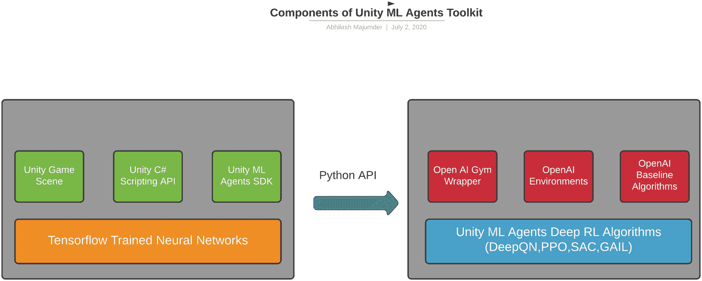
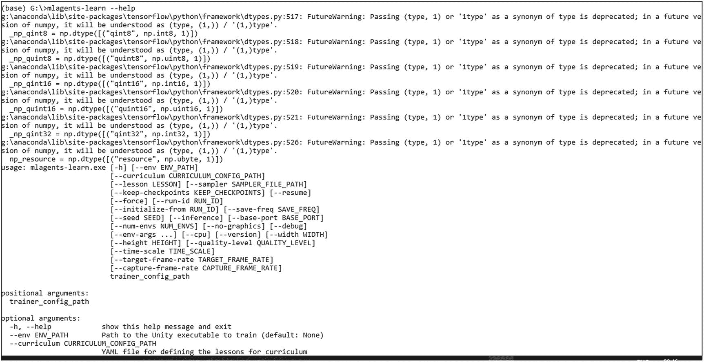
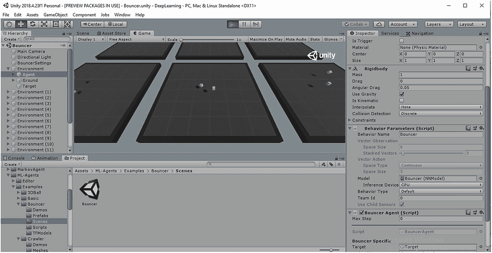
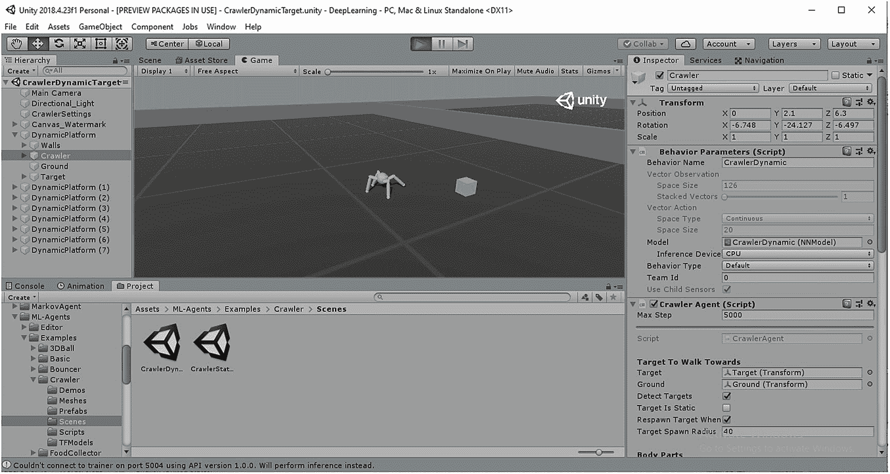
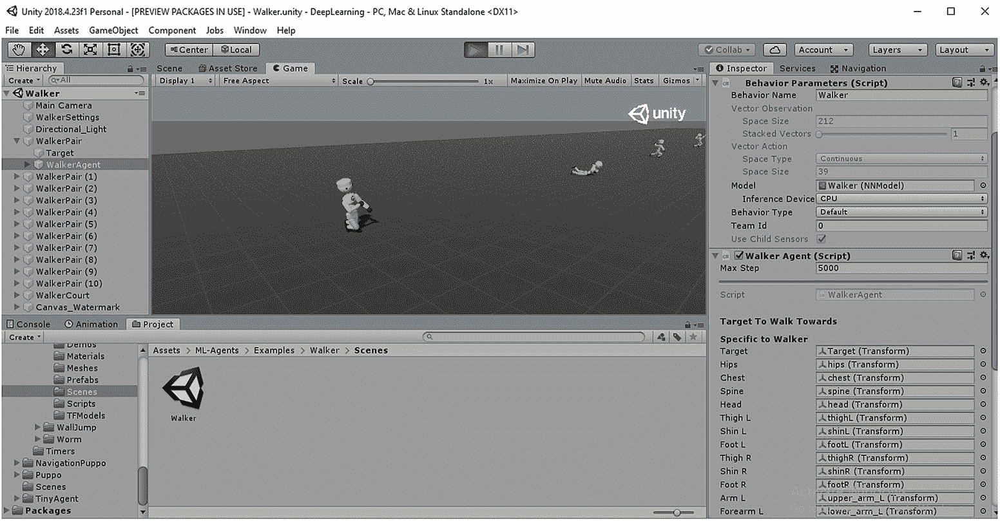

# 3.设置 ML 代理工具包

在前面的章节中，我们已经看到了在强化学习(RL)环境中，状态、动作和奖励是如何在驱动主体达到其目标的过程中起着至关重要的作用。现在，我们已经熟悉了一般的基于状态的 RL 的基础，我们将继续安装与 Unity ML 代理的使用相关的所有库、框架和扩展，并在深度学习的后续模块中进一步发展。在我们开始安装之前，让我们试着理解 Unity 制作的 ML 代理包。自 2017 年成立以来，Unity ML Agents Toolkit 为研究人员、开发人员和游戏程序员提供了深度 RL 领域的大量资源。ML Agents Toolkit 最初是为了帮助研究人员和开发人员将 Unity Editor 帮助创建的游戏和模拟转换为深度学习环境而创建的，在深度学习环境中，可以通过简化的 Python API 使用最先进的(SOTA)深度 RL 算法、进化和遗传策略以及其他深度学习方法(涉及计算机视觉、合成数据生成)来训练代理。随着软件包版本 1.0 的最新发布(在撰写本书时)，在简化 C# SDK、Python API 链接、与 Tensorflow 库的强大兼容性方面，工具包的开发有了巨大的进步，在课程学习、自我和对抗游戏、生成对抗模仿学习和预先存在的深度学习算法(近似策略优化-PPO、软演员批评家-SAC)方面也有了巨大的进步。对核心库进行了重大修改，使用开放的人工智能体育馆环境作为包装器。Unity ML Agents Toolkit 版拥有连接 Unity (C#)和 Python API(深度学习)的稳定通信器，并为游戏开发者提供了编写深度学习代理和在游戏中模拟他们自己的人工智能(AI)的灵活性。对修改其用例的核心算法感兴趣的研究人员，也可以获得灵活的 Gym 包装环境，该环境为编写他们自己的深度学习算法提供了模板。所有这些都可以通过简单使用 Unity Engine、Unity ML Toolkit、Jupyter Notebook 和 Tensorflow 框架来完成。现在我们已经了解了 Unity ML 代理的范围和可能性，我们将在本章中讨论安装所有必要的库和框架的整个过程。Unity ML 代理工具包中的不同代理如图 [3-1](#Fig1) 所示。


图 3-1

Unity ML 代理工具包版本 1.0.0

## Unity ML 代理工具包概述

到目前为止，我们已经在系统中安装了 Unity(任何高于 2018.3 的版本)，并且对 MonoBehaviour C#环境有了一个大致的了解。在我们开始阅读安装指南之前，让我们先了解一下 ML 代理工具包的组件。ML Agents Toolkit 是一个软件开发工具包(SDK)，它将 Unity Engine 制作的 C#脚本与 Gym wrapper 链接起来，以便我们可以在深度学习算法中培训我们的代理。因此，SDK 有两个基本方面:

*   **Unity Engine C #脚本**:这是我们一直在使用的 Unity 的基础部分。稍后，我们将看到如何包含 Tensorflow 神经网络，并使用 C#脚本为我们的游戏训练我们的模型。

*   **OpenAI Gym 包装器 Python API** :这部分是 Unity 引擎和 open ai 环境之间的通信器和接口。该模块帮助我们将 Unity 游戏场景转换为深度 RL 环境，在该环境中，我们可以使用自己的算法实现或使用 OpenAI 提供的基线来训练场景中的代理。

这些是 Unity ML 代理工具包的主要部分，它使我们能够在 Unity 中创建游戏，并在健身房包装器的帮助下将它们转换为深度学习环境，在那里我们可以应用我们的 RL 算法。图 [3-2](#Fig2) 显示了 ML 代理工具包的组件。



图 3-2

Unity ML 代理工具包的组件

现在我们对 Unity ML Agents Toolkit 有了一个大致的了解，我们可以认识到我们在第一章中使用的健身房环境的重要性，并分析了 CartPole 环境。在这一节中，我们将安装 ML 代理与我们的游戏无缝协作所需的先决条件。由于不同版本的 ML 代理和 Tensorflow 框架之间存在一些不稳定问题，我们将坚持这两个版本的标准稳定版本。我们之前已经安装了 Anaconda 环境，其中包括 Jupyter Notebook、Spyder IDE 和 Python 控制台等。这将极大地帮助我们以后创建模型，并将我们的场景与体育馆环境联系起来。我们之前在 Anaconda 提示符下使用以下代码安装了 Tensorflow 版:

```py
pip install tensorflow==1.7

```

我们还安装了 TensorBoard，使用以下命令进行模型训练的可视化:

```py
pip install tensorboard

```

## 安装基线和训练深度 Q 网络

下一步是为 Gym 构建我们的环境，我们将在后面的章节中广泛使用它。如果我们想在 Colab 或 Jupyter 笔记本中模拟我们的健身房，我们必须安装健身房环境，可以使用:

```py
!pip install gym

```

现在让我们尝试构建我们之前创建的 CartPole 环境(在第 [1](1.html) 章)，但是现在我们将使用 OpenAI 基线库来训练我们的模型。OpenAI Baselines library 是 OpenAI 创建的开源库，包含应用于 Atari 游戏、机器人甚至 Unity 上的游戏的 SOTA 深度强化学习算法。由于我们熟悉 Q 学习算法(在第 [1](1.html) 章)，我们将简单明了地使用 CartPole 环境中基线提供的深度 Q 学习算法。深度 Q 学习是 Q 学习算法在离散/连续空间而不仅仅是离散状态上的非策略深度学习实现。建议在 Google Colab Notebook 中尝试一下，因为我们将使用不同版本的 tensorflow，它在基线方面是稳定的。首先让我们使用以下命令在 Colab 中安装来自 github 的基线:

```py
!pip install git+git://github.com/openai/baselines

```

现在我们将使用这个库为 CartPole 编写一个非常简单的深度 Q 学习模型。这只是为了测试我们的安装是否正确，以及所有其他库(如 Tensorflow)是否兼容。我们现在还不需要进入模型的细节，因为我们将在后面的章节中探索它，因此这个实现将只使用由 OpenAI 实现的仅具有超参数的 SOTA 深度 Q 算法。

和以前一样，我们将为我们的实现导入基线、Gym 和 Tensorflow:

```py
import gym
from baselines import deepq, logger
import tensorflow as tf

```

deepq 是 OpenAI 的深度 Q 学习实现。对于已安装的 Tensorflow 版本，如果由于“tf.contrib.layers:”不兼容而出现问题，我们必须将 Tensorflow 版本升级到 1.14 的稳定版本。但是，此基线库与 Tensorflow 版不兼容，因为该版本中没有“tf.contrib.layers”。现在我们已经有了完整的稳定库，我们可以使用下面的代码行来模拟 CartPole 环境:

```py
env=gym.make("CartPole-v0")

```

这是用行动、空间和奖励建立我们的 RL 环境的第一步(第 [1](1.html) 章)。接下来的几行包含深度 Q 网络，它是由 OpenAI 作为 SOTA 创建的。虽然在这个阶段不需要理解模型的含义和内部功能，但是我们将讨论创建模型所涉及的超参数。

```py
act=deepq.learn(
      env,
      network='mlp',
      lr=1e-4,
      total_timesteps=1000,
      buffer_size=50,
      exploration_fraction=0.05,
      exploration_final_eps=0.001,
      print_freq=10,
  )

```

我们使用基线库中的“deepq.learn”命令。以下是与该模型相关的超参数。

*   “env”:这是我们在上一步中创建的 CartPole 环境。

*   “网络”:这是模型将使用的神经网络体系结构的类型。基于不同的方面，网络可以是“mlp”，表示多层感知模型；“lstm”，这是长短期记忆模型；或“cnn”，表示卷积神经网络模型。目前还有其他神经网络架构，我们将在深入的 RL 章节中讨论所有这些架构。

*   “lr”:这表示学习率，其在通用 ML 中用于优化函数的适当全局收敛。

*   “total_timesteps”:我们想要模拟环境的迭代次数

*   “buffer_size”:用于记录先前状态、动作和奖励的存储缓冲器的大小限制

*   “exploration_fraction”:时间步长的分数；该模型将尝试探索新的状态

*   “探索 _ 最终 _ 每股收益”:最后一集的探索分数

*   “print_freq”:在屏幕上打印模型日志的频率

这是由 OpenAI 设计的 deep Q 模型的概述，我们用它来训练 CartPole。我们将在以后的 Unity 游戏中使用这个模型的变体。这差不多就是模拟环境和训练横杠所需要的全部内容。一旦完成了这些，我们就可以确信基线库已经被正确地导入到我们的系统中了。或者，我们也可以通过使用 Python 终端或 Anaconda 提示符并键入以下命令来测试安装:

```py
python -m baselines.run --alg=deepq --env=CartPole-v0 --save_path=./cartpole_model.pkl --num_timesteps=1e5

```

一旦运行，我们将看到模型正在 Anaconda 提示环境中运行，并且日志被捕获到用户数据(Windows 中的 AppData)中，如图 [3-3](#Fig3) 所示。


图 3-3

从基线训练深度 Q 算法用于钢管混凝土柱

我们已经完全安装了所有相关的深度 RL 库和框架，包括 Tensorflow、TensorBoard、Anaconda environment、Gym、Baselines、Keras 和 Unity Engine。在下一节中，我们将深入探讨 Unity 中 ML 代理工具包的安装，并解决库的主要错误和稳定性问题，包括与 Python 深度学习框架的兼容性。在本次会议中，我们将使用 Unity 的 2018.4 版本，尽管它将在 Unity 的更高版本(2019 和 2020)中工作。

## 安装 Unity ML 代理工具包

Unity ML 代理工具包是 Unity 深度学习的官方工具包。在我们的系统上安装库有几个步骤。Unity ML 代理开源库的官方 Github 页面可以在 [`https://github.com/Unity-Technologies/ml-agents`](https://github.com/Unity-Technologies/ml-agents) 找到。

这是 Unity ML 代理的官方资料库；让我们看看 Github 页面上的详细信息。在滚动到“Readme”部分时，有几个细节提到了 ML 代理的版本、存储库内不同的内置训练 Unity 环境(数量超过 15 个)、对邻近策略操作(PPO)和软参与者评论(SAC)算法的内置支持以及 SDK 的跨功能灵活性。如果我们前往链接 [`https://github.com/Unity-Technologies/ml-agents/releases`](https://github.com/Unity-Technologies/ml-agents/releases) 给出的版本页面，我们将看到 Unity ML 代理工具包的所有版本。每个发布版本都有软件包版本详细信息、主要和次要更改、错误修复以及底部附加的源文件。由于我们使用的是 1.0 版本，所以提到了 Python API、Gym wrapper、Unity C# SDK 和其他版本的详细信息。图 [3-4](#Fig4) 显示了 Unity ML Agents Release 1 的 Github 页面。


图 3-4

Unity ML 代理版本 1

资产内部有两个“zip”和“tar.gz”格式的源文件，如图 [3-5](#Fig5) 所示。这包含 Unity ML 代理版本 1 的预编译二进制文件。在我们的本地机器上获得 ML 代理工具包的最简单的方法是下载 Unity ML 代理工具包的特定版本。下载完成后，我们可以解压到目录中合适的位置。还有其他几种下载方式，我们可以在 Windows 命令行或 Anaconda 提示符下使用 git 命令来下载 ML 代理的相关分支。


图 3-5

zip 格式的 Unity ML 代理 1.0 版源代码

```py
git clone --branch release_1 https://github.com/Unity-Technologies/ml-agents.git

```

### 克隆 Github Unity ML 代理库

现在我们已经从 Github 下载了官方的 Unity ML 代理库，无论是使用“git clone”还是手动下载源 zip 文件，我们都必须在使用它之前做进一步的修改。建议不要克隆 ML 代理库的“主”分支；相反，我们可以克隆“release_1”分支，如图 [3-6](#Fig6) 所示。


图 3-6

在 Github 上克隆 Unity ML Agents Release_1”分支

下载并提取 Unity ML 代理后，我们可以使用 3D 模板创建一个新的 Unity 项目。要在此项目中使用 Unity ML 代理，只需将 Unity ML 代理提取的存储库拖动到 Unity 项目的资产面板中。这将使 Unity 引擎能够安装所有的依赖项、库和框架，例如 ML 代理包提供的 barracuda(Unity 的神经网络链接框架)。

### 探索 Unity ML 代理示例

我们可以浏览到 ML 代理文件夹中的所有内置 Unity 游戏模板

**项目➤资产➤ml-代理商➤示例**

在这个文件夹中，我们有所有用 Unity ML 代理制作的人工智能训练的游戏环境，并且已经预先训练了深度 RL 算法，如 PPO 和 SAC。在旧版本的 ML 代理中，可能会有类似“unity ml-agents”或“unity”的文件夹来代替“项目”文件夹现在，我们将关注 Examples 文件夹的内容。让我们打开用 Unity ML 代理制作的 3D 球环境游戏。环境如图 [3-7](#Fig7) 所示。


图 3-7

3D 球环境 Unity ML 代理

在这个环境中，我们看到 12 个蓝色的立方体平衡着它们上面的小球。这些蓝色立方体是场景中的代理，如果球从代理的“头”上掉下来，代理将获得一个负奖励。因此，代理人必须尽可能长时间地继续平衡头顶上的球，以收集奖励并最大化其目标。这是 Unity ML 代理工具包的第一个例子，它是在 PPO(一种深度 RL 算法)的帮助下训练的，我们将在后面讨论。从前面几章我们的概念可以看出，代理是蓝色立方体，奖励是平衡它头上的球(球体)。

*   **状态**:该环境的观测空间可分为稳定和不稳定两部分。当代理人平衡球时，它是一个稳定的空间，而当代理人失去球的平衡时，它就变成了一个不稳定的空间。要么球在头上，要么不在头上。

*   **动作**:每个蓝色的代理立方体可以沿着 x 和 z 轴自由旋转，以平衡球体自身。每个球沿 x、y 和 z 轴有六个自由度的运动。所有这些都属于环境行动空间。立方体被固定在它们的位置上，不能进行平移运动

*   奖励:代理人每平衡一个球就会得到奖励。当球从代理人的“头”上掉下来时，奖励是负的。

当我们尝试使用这个环境来构建和训练我们自己的模型时，我们将进行深入的探索。但是现在，我们可以尝试用 Unity ML 代理创建其他环境，并尝试识别每个环境的状态、动作和奖励。这是另一个名为“基本”的，如图 [3-8](#Fig8) 所示，代理可以选择获得更大的奖励(由大的“绿色”球显示)或较小的奖励(小的“绿色”球)。这是一个非常简单的游戏模拟，使用深度 RL 和 Unity 引擎，代理人将通过走向更大的领域来尝试最大化其奖励。虽然最初代理人可能会去他们中的任何一个，随着训练的进展，它发现更大的一个有更大的回报，它将朝着回报最大化的方向发展。作为一个练习，我们可以尝试识别这个代理和环境的状态、动作和奖励空间。一旦我们玩完了内置的 ML 代理的 Unity 游戏，让我们试着去理解通过 Unity 编辑器安装 Unity ML 代理的其他可能的选择。


图 3-8

Unity ML 代理中的基本环境

让我们打开 Unity，如前所述，我们必须拖入之前下载的 ML 代理包。然后，我们将导航到 Assets 文件夹，在该文件夹中，ML Agents 文件夹包含我们刚刚查看的所有环境以及脚本和神经网络模型。让我们尝试在 Unity 引擎中安装 ML 代理的替代方法。

### Unity ML 代理的本地安装

现在，我们将在本地安装 Unity ML 代理。当您不需要源存储库的所有内容时，这很有帮助，除了必要的内容，如行为脚本(大脑)、academy 和带有示例场景的深度学习算法。导航到“窗口”选项卡，选择“包”选项。“包”窗口包含了当前在特定 Unity 项目中的所有包。这些是“JSON”文件，包含不同的包，如 Unity Ads、Physics、HRDP 等等。预览如图 [3-9](#Fig9) 所示。


图 3-9

Unity 编辑器的窗口选项卡中的包选项

下一步是添加我们下载(或克隆)的 ML 代理包。这将安装所有的包细节，包括 Barracuda、Python API 和某些 C#脚本(即行为脚本或大脑)，没有它们 ML 代理将无法工作。因为我们必须从我们的 ML 代理安装目录添加软件包，所以我们选择下面的“+”图标来添加它。我们得到一个选项“从磁盘添加包”，我们必须点击它来打开一个窗口弹出。下一步是导航并选择我们想要包含在项目中的包。在我的情况下，我使用的是 Unity 2018.4 版本，因此 UI 可能会因其他更高版本而有所不同，但步骤是相同的。图 [3-10](#Fig10) 显示了软件包管理器窗口。


图 3-10

从磁盘添加 ML 代理包的选项

接下来，我们必须导航到我们下载的 ML 代理文件夹，并转到“com.unity.ml-agents”文件夹。该文件夹包含一个名为“package.json”的 JSON 文件，其内容如下:

```py
{
  "name": "com.unity.ml-agents",
  "displayName": "ML Agents",
  "version": "1.0.2-preview",
  "unity": "2018.4",
  "description": "Use state-of-the-art machine learning to create intelligent character behaviors in any Unity environment (games, robotics, film, etc.).",
  "dependencies": {
    "com.unity.barracuda": "0.7.1-preview"
  }
}

```

包文件包含 ML 代理版本的细节，以及我们正在使用的 Unity 的当前版本，还有 Barracuda 包版本。Barracuda 包非常重要，因为它是 Unity 中神经网络的轻量级包，使我们能够在 Unity 游戏中运行预训练的 Tensorflow 网络。一旦我们选择了这个 JSON 包导入到 Unity 中，我们必须等待一段时间，直到 Unity 完成构建依赖项和添加 ML 代理工作所需的脚本。

### 从 Python 包索引安装 ML 代理

我们还可以从 Python 包索引(PyPI)站点安装 ML 代理。这还允许下载和安装以前可能没有安装的任何依赖项。如果在下载或安装 ML 代理时错误和问题仍然存在，这将有助于消除这些错误。本安装指南还旨在解决之前下载的其他库(如 Tensorflow 或 Pytorch 或 Gym/Baselines)版本不同的问题。安装命令非常简单，可以在命令提示符或 Anaconda 提示符下编写:

```py
pip install mlagents

```

这将下载所有相关的库，并提供关于正在下载的版本的日志。这不是从 Github 库下载或克隆的，而是从链接 [`https://pypi.org/project/mlagents/`](https://pypi.org/project/mlagents/) 中提到的 ML 代理 PyPI 页面下载或克隆的。

在 Anaconda 提示符下完成安装后，我们可以通过运行以下命令进行检查:

```py
mlagents-learn –help

```

运行该命令时，所有相关命令和与已安装的 ML 代理相关的信息都会显示在屏幕上。以前，显示屏上有一个 Unity 标志；但是，较新的版本已经取消了“–help”命令中的徽标。当我们在本章后面通过 Anaconda 提示符训练 ML 代理时，将会看到这个标志。此安装还将安装“setup.py”文件中提到的所有详细信息。随着时间的推移，PyPI 页面可能会更新为 ML 代理的新版本，运行上述命令可以确保安装最新版本。图 [3-11](#Fig11) 显示了上述步骤。



图 3-11

在 Anaconda 提示符下运行“mlagents-learn - help”命令

现在，我们已经成功地完成了 ML 代理和所有外围设备的安装。现在让我们试着理解如何在容器化的环境中安装，例如虚拟机环境。

### 虚拟环境中的安装

虚拟环境是一个包含根目录的独立环境，它有自己的一组库和框架，不会影响本地系统的任何其他部分。这是一个容器化的环境，它有自己的 Python 版本，可能不同于基础版本或本地安装的 Python。在虚拟环境中工作非常有用，因为无论何时虚拟环境中发生任何错误或崩溃，其他环境和本地设置或库都不会受到影响。当在一个专注于用 ML 代理开发游戏的生产环境中工作时，虚拟环境有两个重要的方面对开发团队很有帮助。

*   **轻松的依赖关系管理:**与 Python 的独立模块相关的依赖关系可以轻松管理，而不必担心崩溃或对整个产品进行不必要的更改。

*   **健壮的 CI/CD 管道** **:** CI/CD 代表持续集成/持续开发，一般指从开发、构建、测试、分析的生产管道。有了容器化的环境，可以实现敏捷方法(基于开发的冲刺),这肯定会有助于产品的增长。

对于这种特殊情况，我们必须从安装 pip 模块开始，因为它可能不在虚拟环境中。这可以使用以下命令下载和安装:

```py
curl https://bootstrap.pypa.io/get-pip.py -o get-pip.py

```

下一步是使用以下命令运行“get-pip.py”模块:

```py
python3 get-pip.py

```

接下来，我们检查安装的 pip 的版本:

```py
pip3 -V

```

下一步是在 Anaconda 提示符下使用以下命令创建我们自己的虚拟环境:

```py
python -m venv python-envs\new-env

```

为了激活环境，使用以下命令:

```py
python-envs\new-env\Scripts\activate

```

这就是我们在 Anaconda 提示符下建立自己的虚拟环境所要做的全部工作。使用 pip 命令安装 ML 代理的后续步骤与上一节类似。这里唯一的区别是，在这种情况下，我们在一个容器化的环境中而不是在本地运行 ML 代理安装，对于模型训练的所有步骤，我们只能在这个虚拟环境中使用 ML 代理的功能。如果 ML 代理没有安装在其他地方，那么 ML 代理的这些命令或功能将不会运行，除非它在相关联的虚拟环境中。我们还可以停用虚拟环境并重新激活，这类似于使用 activate 命令。

### 用于修改 ML 代理环境的高级本地安装

当我们想要修改我们的培训环境时，需要安装“mlagents_envs”包的另一个方面。虽然这一步不是强制性的，但是我们也应该能够单独安装这些模块。有两种安装 ML 代理环境的方法。

*   **从 PyPI 安装:**PyPI 包含“mlagents_envs”包的发行版，可以在 [`https://pypi.org/project/mlagents-envs/`](https://pypi.org/project/mlagents-envs/) 链接中找到。

    使用 pip 命令完成安装:

*   **从 ML 代理包安装:**为了从 ML 代理的克隆存储库中安装环境，我们必须在 Anaconda 提示符下导航到克隆存储库的根目录，然后键入:

```py
pip install mlagents-envs

```

```py
pip install  -e ./ml-agents-envs
pip install  -e ./ml-agents

```

从 ML 代理克隆包安装它们有一些先决条件。“-e”对 ML 代理的所有依赖项进行更改。如果我们不使用 pip 命令来安装环境，那么我们必须先安装“mlagetns-envs ”,然后再安装“mlagents”这是因为 mlagents 的功能依赖于“mlagents-envs”。如果我们以相反的顺序来做，那么当我们安装“mlagents”时，默认的 mlagents-envs 将从 PyPI 安装。

这就完成了整个安装过程，并提供了安装 ML 代理的不同方法。在下一节中，我们将看看这个 ML 代理包的各种组件，以及如何将它与 Python 和 Jupyter 笔记本连接起来。

## 配置 ML 代理的组件:大脑和学院

在本节中，我们将对 ML 代理包的不同组件进行概述，并尝试了解 ML 代理在以前版本和当前版本中所做的更改。ML 代理包有三个主要部分，将用于我们的深度学习:

*   **mlagents** :这部分包含了用于在 Unity 环境中训练我们的代理的深度 RL 的主要源代码算法。

*   **mlagents_envs** :这本质上是连接 mlagents 和环境的 Python API。因此，记住 Unity ML 代理依赖于 ML 代理环境是很重要的。

*   Gym _ unity:open ai 健身房环境的包装器，用于将我们的 Unity 游戏场景转换为可训练的深度学习环境

我们可以进入上述每个文件夹结构的细节，并了解每个单独的组件，但不失一般性，mlagents 文件夹对于我们理解 Unity 的核心 PPO 和 SAC 算法实现以及我们如何修改它是极其重要的。如果我们去 **mlagents ➤培训师**文件夹，我们可以看到几个算法存在。不用说，这是最重要的方面，我们将在本书的后面部分探讨。在 **mlagents-envs** 文件夹中，Python API 链接最重要的部分由 **communicator_objects** 文件夹完成。这尤其包含了在训练 ML 代理时与将本地服务器连接到端口 5004 相关的所有信息，并且还在 Tensorflow、Tensorboard 和 C# Unity 之间形成了一座桥梁。类似地， **gym_unity** 文件夹包含所有 unity 环境和测试文件夹，它们在 RL Unity 环境的训练期间被转换为 gym 环境。

现在，我们已经安装并设置了 ML 代理，并对三个主要部分进行了简要概述，我们将深入 ML 代理的基础架构。这种架构模式最初是作为 ML 代理如何工作的可视化发布的，近年来已经发生了很大的变化。然而，从根本上来说，尽管该架构已经被修改为更健壮的架构，但核心功能仍在基线架构上运行:大脑-学院架构。

### 大脑学院建筑

关于人工智能代理的初始构建的基本概念是让代理在通常被称为代理的大脑的神经网络的帮助下被控制。学院类似于环境，控制大脑的训练，以及在运行代理或模拟时与在线模型通信。从根本上说，大脑结构可以大致分类如下。

*   **内部大脑** **:** 这种类型的大脑架构包含使用各种深度学习算法训练过的预训练模型。内部大脑不需要与 Python API 进行运行时通信来进行训练，因为它已经在预先存在的一组观察-动作空间上进行了训练。Unity ML 代理下的所有示例项目都有与之关联的内部 brain(预训练网络)。

*   **启发式大脑** **:** 这种类型的大脑通常不包含任何神经网络模型；相反，它包含了一个启发性的问题。我们在第 2 章[中讨论了涉及 A*的启发式寻路算法。这些算法都包含在这个大脑里。启发式大脑没有使用基于梯度下降的深度学习，而是更专注于动态编程和基于状态的学习。](2.html)

*   **外脑** **:** 外脑是另一个使用深度学习算法的大脑；但是，这是在 Unity 场景中培训代理时使用的。communicator 对象在与端口 5004 的通信中起着重要的作用，在这里我们在 Tensorflow 中训练我们的模型。外部大脑用于通过通信器和 Python API 在运行时训练代理。当这些训练过的模型作为代理的生产化和预训练模型被传递时，它们就被用作内部大脑。

脑学院架构如图 [3-12](#Fig12) 所示。


图 3-12

大脑 Unity ML 代理的学院架构

**学院:**学院控制着环境中的大脑集合，可以访问运行时环境。学院控制的环境范围包括:

*   **Unity 引擎配置:**这包括速度、每秒帧数以及与正在接受训练或以推理模式运行的特定游戏相关的渲染管道。

*   **剧集长度:**这控制了在 Unity 游戏环境中 RL 代理的剧集长度。

*   **FrameSkip:** 在每个代理做出新决定时要跳过的 Unity 引擎站点的数量。这实质上排除了未渲染的帧数，而策略在代理的训练阶段得到更新。

这是在 1.0 版本发布之前就存在的 ML 代理的中心架构模型。在新版本中，大脑组件(C#脚本)已被弃用，取而代之的是某些控制大脑和代理决策过程的脚本。

### Unity ML 代理版本 1.0 中的行为和决策脚本

控制大脑和决策过程的最重要的脚本是:

*   **行为参数 C#脚本**

*   **决策请求者 C#脚本**

*   **模型覆盖 C#脚本**

重要的是要明白，在 Unity ML 代理中，有传感器记录环境中的任何观察-动作空间。在传感器的帮助下，代理将开始了解 RL 环境的不同部分。这些传感器本质上是射线(物理射线),在我们前面的章节中被用来表示一个代理在环境中的位置，也用来检查代理和奖励之间的距离。

为了理解这些变化，让我们在 Unity 中打开 3D 球环境，在 3D 球预设中，我们将看到两个模型:“球”和“代理”。“球”预设是“代理”预设必须在其“头”上保持平衡的小球体。

如果我们在检查窗口中打开“代理”预置，我们将会看到与这个预置相关的不同组件和脚本。一些细节是通用的，像变换和框控件；其他细节需要我们注意。我们可以看到有“行为参数”、“决策请求者”和“模型否决者”C#脚本与这个代理相关联。还有一个附加的“球 3D 代理”C#脚本，我们将在本章的后面部分看到。如上所述，让我们试着简单理解这三个不同的 C#脚本。

*   **Behavior parameters script** **:** The previous concept of brain architecture that had different types such as: internal, external, and heuristic are present in this script. The main purpose of this script is to determine whether the agent will run in Inference Mode (internal brain), in Heuristic Mode(heuristic brain), or in External Mode (external brain). This is shown in Figure [3-13](#Fig13).

    

    图 3-13

    Unity 中“代理”预置的检查器窗口中的行为参数、决策请求者和模型否决者脚本

    It also controls the use of sensors, determines whether to use child sensors, and determines at a particular time-step which agent is searched for in a multi-agent training environment. We will explore more about this script in the next chapter when we will be considering the brain architecture in depth. For the time being, we can see that there are two important aspects inside this tab in the Inspector Window.
    *   **Model:** This contains the neural network model that is required during Inference Mode or during actual gameplay. This is the trained Tensorflow model that is placed in the internal brain. We can also select different pretrained models that are present in our scenes. This also contains the Inference Device—that is whether we want to run the model in CPU or GPU, as shown in Figure [3-14](#Fig14).

        

        图 3-14

        为行为参数脚本选择神经网络模型

    *   **Behavior type** **:** This controls the type of “Brain” we would want to use—internal, heuristic, or external. Depending on the behavior type, the agent tries to follow that particular policy for reward maximization. Fundamentally this can be thought of as the “Brain” architecture. It should be noted that in case there are no pretrained models for the internal brain to work upon, during the training stage of our model we will be using the external brain. Later this trained external brain can be stored in Unity and later used as the internal brain. The heuristic brain should be present if we don't want to use deep RL algorithms for our agents. Figure [3-15](#Fig15). represents the behaviors.

        

        图 3-15

        控制大脑的检查器窗口中的行为类型

        还有其他几个属性，我们将在下一章深入讨论所有这些。现在，重要的是理解行为参数的重要性，它是 ML 代理的基本大脑。

*   **决策请求者脚本** **:** 该脚本与代理在其动作空间上的决策过程相关联。该脚本还包含代理根据特定策略做出决策的频率，并且还调节代理是否可以在决策之间采取行动。这与大脑学院-学院架构模型有关，因为它控制着学院步骤中的决策过程。我们将在下一章进一步探讨这个问题。它还包含一些变量，如“决策周期”，默认为 5，表示做出决策的频率，以及“在决策之间采取行动”(布尔型)变量，如果选中该变量，则允许代理在决策之间采取行动。

*   **模型覆盖脚本** **:** 用于在推理阶段覆盖现有的神经网络模型。这还包含了剧集应该播放多长时间的详细信息，通常建议每个代理使用一个行为参数(1:1 比率)。它还有助于在由“maxSteps”表示的时间步长内运行神经网络，以检查模型中的故障。这也可以被认为是大脑学院——学院建筑的一部分。

我们现在已经简要概述了大脑最基本和最重要的概念——学院架构和新版本中的变化，引入了行为参数、决策请求程序和模型覆盖程序脚本。还有其他脚本也处理对大脑决策很重要的基于光线的传感器，我们将在使用 Unity ML 代理创建游戏的整个过程中深入讨论这些。概略地说，新版本和大脑学院之间的架构关系可以以图 [3-16](#Fig16) 所示的方式呈现。


图 3-16

新旧建筑的关系

## 将 Unity ML 代理与 Tensorflow 链接

这一部分将主要依赖于将 ML 代理神经网络模型与 Tensorflow(我们将通篇使用的深度学习框架)相链接。Unity C# ML Agents SDK 代码和 Python 中的深度学习算法之间的链接是在我们在本章开始时简要研究过的 communicator 对象的帮助下完成的。然而，有趣的是，在训练期间，我们可以通过 Anaconda prompt 环境以非常简化的方式使用 Unity 提供的 PPO 和 SAC 算法的实现。在“mlagents”的“trainers”文件夹中(前面讨论过)，我们看到了算法的不同实现。然而，目前我们只需要了解如何将这些 ML 模型与预先构建的 Unity ML 代理环境关联起来。为此，我们需要 ML 代理克隆存储库中的“config”文件夹。这包含几个扩展名为“yaml”的文件本质上，这些文件包含我们在 Tensorflow 中训练神经网络模型时所需的超参数。但是在培训之前，让我们先了解一下 Barracuda，Unity 推理机。

### 梭鱼:统一推理引擎

Unity ML Agents Toolkit 用于使用推理模式(内部大脑)运行预训练的神经网络模型，如前所述。这是在 Unity 推理引擎或 Barracuda 的帮助下完成的。这是一个轻量级库，帮助将神经网络模型(来自 Tensorflow)转换为扩展名为“. nn”的序列化文件。推理引擎与 C# Mono 以及 C++ (ILCPP2)的中间语言兼容。ILCPP2 是一个运行在 C++上的脚本后端，对减少游戏的大小有很大的帮助；它通过执行字节码剥离。NET DLL 文件，并生成一个轻量级且速度更快的本机二进制文件。当我们选择构建游戏的构建设置时，这个选项也会出现。推理引擎支持两种不同的格式，如下所述。

*   **梭鱼**:梭鱼。nn”文件格式，包含经过训练的神经网络模型。这是由“tensor flow _ to _ barracuda . py”Python 脚本完成的。在接下来的章节中，当我们试图理解神经网络模型的序列化时，我们也会看到这一点。

*   **ONNX** :这是“ONNX”文件格式，是“tf2onnx 包”产生的跨功能神经网络模型支持的行业标准开放格式。

推理引擎可以在行为参数脚本中看到。我们看到在“模型”部分下有一个推理设备属性，我们可以在其中选择 CPU 或 GPU。这使得推理引擎能够在设备上运行。除非我们使用 Resnet 或 VGG16(计算机视觉模型)，否则我们应该可以使用 CPU 作为我们的推理引擎设备。图 [3-17](#Fig17) 所示为推理装置。


图 3-17

推理机运行的推理机(CPU/GPU)

现在我们已经知道 Tensorflow 训练的网络是如何通过 Barracuda 存储在 Unity 中的，我们可以使用 3D Balls 示例训练一个预构建的模型。

### 使用 Unity ML 代理训练 3D 球环境

让我们导航到存储库中的“config”文件夹，查看其内容。我们将使用“trainer_config.yaml”文件通过 Anaconda 提示符来训练我们的模型。还有其他几个 yaml 文件，像“gail_config.yaml”和“sac_trainer_config.yaml”。然而，对我们来说，我们将使用“trainer_config.yaml”默认文件，它依赖于 PPO 算法进行训练。让我们看看“yaml”文件的内部。

在打开时，我们看到一个用于训练我们的神经网络的参数(超参数)列表。现在，让我们把这些超参数看作在训练过程中有帮助的某些属性。我们有一组默认的超参数，如下所示:

```py
default:
  trainer: ppo
  batch_size: 1024
  beta: 5.0e-3
  buffer_size: 10240
  epsilon: 0.2
  hidden_units: 128
  lambd: 0.95
  learning_rate: 3.0e-4
  learning_rate_schedule: linear
  max_steps: 5.0e5
  memory_size: 128
  normalize: false
  num_epoch: 3
  num_layers: 2
  time_horizon: 64
  sequence_length: 64
  summary_freq: 100
  use_recurrent: false
  vis_encode_type: simple
  reward_signals:
    extrinsic:
      strength: 1.0
      gamma: 0.99

```

正如我们所看到的，有几个像“trainer: ppo”这样的参数，这表示 ppo 模型用于这种环境。此外，我们还有几个属性，如内存大小、最大步数、时期数、批量大小等等。所有这些都有各自的意义，我们将在“深度学习”一章中深入探讨。假设训练环境在这些超参数的帮助下被管理是安全的，这些超参数指定使用什么算法、状态和奖励、用于保存观察空间的信息的存储器大小、训练将持续多长时间以及代理选择的动作之间的时间间隔。该“默认”模块用于训练任何没有指定训练哪个超参数的环境。但是在我们的例子中，我们将使用 3D 球超参数集，如下所示:

```py
3DBall:
  normalize: true
  batch_size: 64
  buffer_size: 12000
  summary_freq: 12000
  time_horizon: 1000
  lambd: 0.99
  beta: 0.001

```

在这种情况下，与这个相比，我们有一个更小的超参数集。我们有批处理大小和缓冲区大小，批处理大小控制用于训练的批处理的大小，缓冲区大小包含重放缓冲区或内存的大小。“λ”和“β”是控制学习速率的超参数。此外，我们还有另一组用于 3D 球硬环境的超参数，如下所示:

```py
3DBallHard:
  normalize: true
  batch_size: 1200
  buffer_size: 12000
  summary_freq: 12000
  time_horizon: 1000
  max_steps: 5.0e6
  beta: 0.001
  reward_signals:
    extrinsic:
      strength: 1.0
      gamma: 0.995

```

因此，现在我们简单了解一下“trainer_config.yaml”文件中包含的超参数。现在让我们打开 Anaconda 提示符环境，然后在提示符中，我们必须导航到包含“trainer_config.yaml”文件的目录。之后，我们必须键入命令:

```py
mlagents-learn trainer_config.yaml –-run-id=new3DBall –train

```

“trainer_config.yaml”就是我们之前提到的 yaml 文件。这让 ML 代理知道我们想要使用“trainer_config.yaml”文件中的“3D Ball”模块。run-ID 表示我们正在训练的新模型的名称。一般来说，训练的语法可以写成:

```py
mlagents-learn <path to trainer_config.yaml file> –-run-id=<new name for the trained model> --train

```

–train 命令在新版本中是可选的，也可以省略。现在我们使用“trainer_config.yaml”中提到的超参数，但我们知道还有其他 yaml 文件包含不同的训练算法和不同的超参数集。例如，如果我们要在“sac_trainer_config.yaml”文件的帮助下训练它，那么语法应该是:

```py
mlagents-learn <path to sac_trainer_config.yaml file> –-run-id=<new name for the trained model> --train

```

如果我们在" config "文件夹中运行我们的命令，那么它可以简化为:

```py
mlagents-learn sac_trainer_config.yaml –-run-id=sac3DBall --train

```

一旦完成，我们将看到 Unity ML 代理开始通过端口 5004 连接到 Python API，然后使用 Tensorflow 库开始训练过程。

一段时间后，会有一个选项出现在 Anaconda 提示窗口中，提示 3D 球环境必须在 Unity Editor 中进行外部训练。如果 Unity Editor 环境不处于播放模式，那么 API 会超时，训练也不会完成。因此，我们需要去编辑➤项目设置➤播放器。在播放器部分，我们必须去“分辨率和演示”部分，并检查“在后台运行”选项。这将使 Unity 引擎编辑器能够在我们在 Anaconda 提示窗口中训练模型时运行，如图 [3-18](#Fig18) 所示。


图 3-18

在项目设置中配置播放器(在后台运行)

如果我们开始我们的训练过程，它应该会出现类似图 [3-19](#Fig19) 的东西，加上这次有一个 Unity 标志要显示，如图 [3-19](#Fig19) 所示。


图 3-19

运行“mlagents-learn”命令来训练 3D Ball Unity 代理

一旦培训开始，我们将看到“mlagents”、“mlagents-envs”、“Python Communicator API”和 Tensorflow 的版本。我们将被提示选择在 Unity 编辑器场景中点击播放来开始外部大脑的训练过程。这将类似于图 [3-20](#Fig20) 中所示的图像。


图 3-20

在 Unity ML agents 和 Tensorflow 中使用 PPO 深度学习算法进行 3D 球环境训练

我们将看到代理人试图平衡他们头上的球或球体，在许多情况下，在初始阶段，球在训练中从他们的头上掉下来。这给代理人一个负面的奖励，随着学习的进展，我们将逐渐看到代理人学习平衡球。此外，我们在屏幕上显示了从“trainer_config.yaml”文件接收的超参数。训练过程的预览如图 [3-21](#Fig21) 所示。


图 3-21

培训过程中的超参数、奖励和步骤

我们现在看到代理是逐渐学习的，Anaconda 提示中的日志也揭示了每 12000 步的均值或平均奖励以及奖励的标准差，这就是所谓的超参数。如果我们让这种训练持续很长时间(假设平均一个小时)，我们会看到随着代理人越来越熟练地在上面平衡球，奖励会逐渐增加。现在让我们在 TensorBoard 中想象这种学习。

### 用张量板可视化

我们知道 TensorBoard 是一个可视化工具，当我们在 CartPole 环境中尝试深度 Q-learning 时，已经在第 [1](1.html) 章中安装了相同的工具。在本节中，我们将把 Anaconda 提示中的训练与 Unity ML Agents 和 Tensorboard 链接起来，以便正确显示奖励和其他细节。为此，我们必须打开另一个 Anaconda 提示终端，并像前面一样在 ML 代理存储库中导航到“config”文件夹。在该文件夹中，有一个“summaries”文件夹，用于保存正在训练的特定模型的 TensorBoard 可视化统计数据。启动和链接 TensorBoard 的命令是:

```py
tensorboard --logdir=summaries

```

一旦完成，我们将在 Anaconda 提示符中看到一条消息，显示端口号 6006 以及要可视化的 http 细节。默认情况下，TensorBoard 从 6006 端口运行，链接类型为 http:// <device-name>:6006，其中 device–name 是我们正在使用的计算机系统的名称。这类似于图 [3-22](#Fig22) 中所示的图像。</device-name>


图 3-22

推出 TensorBoard for Unity ML 代理

TensorBoard 可视化显示了奖励和在特定时期完成的步骤，以及深度学习算法(PPO)的损失。这是一个交互式可视化工具，随着时间的推移，我们会看到奖励的价值增加。我们将分别探讨每个 TensorBoard 模块，但简而言之，这个仪表板提供了损失率、准确性、收集的奖励、平均奖励、奖励的标准偏差以及步骤的交互式视图。这将有利于我们在 Unity 中构建自己的代理，并在以后的章节中使用 ML 代理训练它们。仪表板如图 [3-23](#Fig23) 所示。


图 3-23

3D 球环境训练期间的 TensorBoard 仪表板

现在，我们已经了解了如何链接 Tensorflow 来培训 Unity 中的 ML 代理，以及如何在培训过程中链接 TensorBoard 来实现交互式可视化。我们可以随时通过停止 Unity 中的游戏模式来关闭训练。

#### 编者ˌ编辑

现在，如果我们想在场景中可视化训练好的新模型(名为“new3DBall”)，我们可以导航到“代理”预设中的行为参数脚本，在“模型”的位置，我们可以选择(“new3DBall”)模型。然后，我们可以看到，在编辑器中播放时，Unity Engine 现在使用 Unity 推理引擎，并向代理提供新的训练模型(推理模式)。这就是如何将一个训练有素的外部大脑转换成可以在 Unity 编辑器内部使用的内部大脑。这个大脑使用 Unity 环境中的 OpenAI 健身房包装器在 PPO 上进行训练，以提供一个可以平衡球体的实际 AI 代理。在菜单中配置构建设置后，我们可以通过点击构建选项来创建一个 Unity 可执行模拟游戏。将新训练的模型放入“行为参数”脚本的“模型”部分，我们应该看到类似图 [3-24](#Fig24) 所示的内容。


图 3-24

使用经过训练的神经网络作为 3D 球代理的内部大脑

到目前为止，我们已经对 Unity ML 代理的范围有了一个概念，并且还在 ML 代理和 Tensorflow 的帮助下训练了一个新的神经网络模型，并发布了一个基于深度 RL 的 PPO 算法的新模拟游戏。在接下来的章节中，我们将深入研究深度学习算法的每个独立模块，并使用 Unity ML 代理创建模拟和游戏。我们还将看到如何利用 OpenAI 的基线模型的力量，在 ML 代理和 Python API 的帮助下，在 Unity 中训练我们的新游戏。在下一节中，我们将尝试一些 Unity 场景的示例，并了解环境的多样性。

### 使用 Unity ML 代理示例

我们已经看到了“3D 球”环境和“基本”环境。现在让我们对 ML 代理示例文件夹中的其他环境做一个简单的概述。对于每一种环境，我们将对代理人、奖励、目标、对手以及所使用的大脑和传感器的类型有一个概述。需要注意的一件重要事情是，在每一种环境中，我们都会注意到向量动作空间，以及它是离散的还是连续的。这将有助于我们了解环境的多样性以及培训每个代理的复杂性。我们将讨论另外 15 种环境，因此现在我们可以利用上一节中学到的知识来培训它们。



图 3-25

保镖环境 Unity ML 代理

*   **蹦跳者环境** **:** 在这个 Unity 环境中，如图 [3-25](#Fig25) 所示，蓝色的智能体要“跳”或“弹跳”才能到达绿色的目标，绿色的目标位于离地面较高的位置。代理人每跳对一次都会得到奖励。这里我们有行为参数脚本，它包含蹦跳者神经网络预训练模型。在这种情况下，向量观察-动作空间是连续的，这适合于深度学习算法。对于在这个环境中使用 PPO 或 SAC(或 ghost/GAIL)进行训练，过程非常相似，因为我们必须在 Anaconda 提示符下运行“mlagents-learn”命令，并传递“yaml”文件的位置以进行训练。

```py
mlagents-learn trainer_config.yaml –-run-id=newBounce –train

```



图 3-26

Unity ML 代理中的爬虫环境

*   **履带环境** **:** 在这种环境下，如图 [3-26](#Fig26) 所示，履带是关节的集合。它就像一只试图寻找绿色目标(食物)的昆虫。爬虫因为每个正确的发现而被奖励；此外，还有两种变体:静态和动态平台。爬行器是一个非常复杂的预设，因为这里的奖励是由爬行器系统关节的运动和矢量方向驱动的。虽然一开始理解起来有些吓人，但我们会用它来训练我们的 Puppo，它也有一个基于关节的系统。向量空间是连续的，并且还显示了行为参数的细节。关节系统包括代理腿上的关节，这有助于代理移动。向量的方向和关节旋转在决定奖励方面起着重要的作用，因为爬行动物离食物越近，获得奖励的机会就越大。然而，我们也可以使用我们对“mlagents-learn”命令的了解来训练这个代理，并且可以观察爬虫向其目标移动的方式。


图 3-27

GridWorld 环境 Unity ML 代理

*   食物收集者环境 **:** 这是一个不同的搜索环境，代理人必须在一个充满不同预设和物体的雷区收集食物(绿色目标立方体)。如图 [3-27](#Fig27) 所示。在这里，我们可以看到一条粉红色的线，它实际上是一条扩展的传感器射线，在这种情况下，需要注意的是，向量观察空间是离散的，要将其转换为深度学习模型，必须将其转换为多离散向量空间。此外，这可以在 Unity ML 代理中使用“mlagents-learn”命令进行培训。


图 3-28

GridWorld 环境 Unity ML 代理

*   **GridWorld 环境** **:** 这是一个高级环境，因为它包括计算机视觉和深度增强现实，如图 [3-28](#Fig28) 所示。这里的代理是“0”符号(蓝色)，它的目标是到达“+”(绿色符号)。在这种情况下，我们将使用 Resnet，这是一种由不同的卷积神经网络制成的 SOTA 计算机视觉模型。除了行为参数脚本，我们还有一个附加到代理的摄像机传感器组件脚本。这使用像素方面的压缩视觉信息来训练 Resnet 深度网络。然后，计算机视觉模型的结果被传递，作为行为脚本用来将代理(“0”)向“+”绿色符号导航的决策。这里，向量空间也是离散的，可以使用“mlagents-learn”命令训练模型。这是一个有趣的环境，当我们试图理解 deep RL 中的计算机视觉模型时，我们将使用这个环境。


图 3-29

走廊环境 Unity ML 代理

*   **走廊环境** **:** 走廊环境是另一个独特的环境，蓝色代理必须将自己导向“X”极或“0”极。在中心有一个方块，在每个回合中，显示一个独特的符号(或者是“X”或者是“0”)。代理必须记住中心块显示的是什么符号，并且应该自动导航到具有类似符号的极点。如果“X”显示在中央区块，代理将前往“X”极，反之亦然。这里可以说，在这种情况下，代理应该非常依赖于基于记忆的网络来存储关于中心块上显示的符号的视觉信息。这里有两种变体，其中一种需要计算机视觉模型，比如 Resnet。但是，还有一些其他网络，如 LSTM 和递归神经网络(RNNs)，可用于为代理添加更多内存。我们将在关于深度 RL 的章节中更详细地讨论这一点。在这种情况下，我们在行为参数中有一个离散的向量观察空间，可以通过使用“mlagents-train”命令并指定算法和“yaml”文件的性质来训练该空间。图 [3-29](#Fig29) 显示了环境的预览。


图 3-30

推块环境 Unity ML 代理

*   **推块环境** **:** 这是一个简单的环境，蓝色代理必须将较大的块推向绿色检查站。这是通过使用与碰撞器碰撞的传感器射线来完成的，并检查视野中的对象是否是更大的立方体，然后它将它推向目标。这里向量空间也是离散的，我们可以训练模型，如图 [3-30](#Fig30) 所示。


图 3-31

金字塔环境 Unity ML 代理

*   **金字塔环境** **:** 这是一个两步的基于奖励的环境，在这个环境中，代理人必须首先瞄准一个放置在充满障碍的环境中的“开关”。一旦代理到达开关，一个新的目标出现，它是一个金字塔的形状。然后，代理必须搜索金字塔。这是一个简单的双重奖励验证环境，我们将在后面的章节中进一步探讨。这里，向量空间也是离散的。这如图 [3-31](#Fig31) 所示。


图 3-32

Reacher 环境统一 ML 代理

*   **Reacher 环境** **:** 这是一个相当具有挑战性的环境，代理人必须控制机械臂，目标是将机械臂的末端保持在绿色球体内，如图 [3-32](#Fig32) 所示。这是一个很深的 RL 问题，需要先进的学习算法来控制手臂的运动方向。环境中的 20 个机械臂由一个具有连续动作向量空间的单个代理控制。稍后，我们将专门使用这个特定的环境，届时我们将了解非策略深度确定性策略梯度(DDPGs)和其他高级算法。不过，目前我们可以用 Unity ML Agents PPO 算法和“trainer_config.yaml”文件中的超参数来训练这个 Reacher agent。


图 3-33

足球环境 Unity ML 代理

*   **足球环境** **:** 这是一个非常流行和有趣的环境，广泛应用于大多数游戏中，如国际足联(电子艺界)和谷歌多巴胺足球场。如图 [3-33](#Fig33) 所示。这实际上是一个零和游戏，敌对的队伍必须相互对抗才能得分。这可以被模拟成一场足球比赛，其中一个队的进球会对另一个队产生负面影响。奖励提供给获胜的团队，而负面奖励提供给无法进球的团队——紫色和蓝色代理的团队。这将在我们学习 RL 中的对抗性自我游戏算法时使用，这些算法的操作策略类似于 mini-max(两人，0 sum)和 alpha beta 修剪算法。这里的空间是离散的，这里也有传感器射线，用于确定足球(橄榄球)和球门的位置。


图 3-34

网球环境联盟代理

*   **网球环境** **:** 这是两个智能体进行网球比赛的经典环境，类似于足球比赛，如图 [3-34](#Fig34) 所示。在这里，我们将看到，如果有任何代理人未击中网球，将计入负奖励。这里可以使用两种不同的算法范例。对抗性网络的模仿学习可以帮助智能体通过一个健壮的行为克隆策略进行学习。同样，我们可以使用课程学习，这意味着逐步增加特定主体(连续向量空间)的挑战。



图 3-35

沃克环境统一 ML 代理

*   **行者环境** **:** 这类似于爬虫环境，智能体是一个由一系列关节组成的人形机器人。然而，与搜索目标不同，这里的主要目标是人形智能体在其关节的帮助下行走。这也是一个复杂的挑战，依赖于联合系统。不失一般性，代理使用其关节的方向向量向前移动并平衡自身，为它能够这样做的每个时间步长收集奖励。由于所有基于关节的系统严重依赖于先进的深度 RL 技术，向量空间是连续的。环境如图 [3-35](#Fig35) 所示。


图 3-36

WallJump 环境 Unity ML 代理

*   **翻墙环境** **:** 类似于推块和金字塔环境，这里的智能体要翻墙到达目标(绿色位置)，如图 [3-36](#Fig36) 。这是一个使用传感器射线和连续向量空间观测的简单环境。代理人每成功跳过一个更大的立方体(“墙”)就会得到奖励。


图 3-37

Worm 环境 Unity ML 代理

*   **蠕虫环境** **:** 与爬虫类似，这种基于关节的智能体类似于必须寻找绿色目标立方体(食物)的蠕虫。它使用联合旋转和方向的类似策略来计算奖励，并需要深度学习算法来训练。图 [3-37](#Fig37) 显示了环境的预览。

这些是 ML 代理示例文件夹中存在的各种环境。不用说，所有这些环境在观察行动空间、奖励、环境和对手方面都是非常独特和多样的。这里有一些要点需要注意:

*   根据我们目前对训练 ML 代理的理解，我们可以通过使用“mlagents-learn”命令并指定我们希望用作训练的超参数的“yaml”文件来训练所有的环境。我们还可以在 TensorBoard 中可视化每个培训代理。

*   某些环境，如爬行器、行走器和蠕虫，依赖于基于关节的物理系统，在这些情况下，深度 RL 算法，如 DDPG、TRPO、PPO 和 AC 可用于连续向量观察空间。这些将在高级深层 RL 的后续章节中单独讨论。这里的训练依赖于关节动力学和向量方向。

*   足球和网球等竞争环境严重依赖极小极大策略或具有深度 RL 的零和游戏。以网球为例，我们还将研究对抗性模仿学习如何帮助主体以及解释课程学习的核心概念。

*   标准环境，如 Bounce、PushBlock、WallJump、pyramid 和 food collector，依赖基于光线的传感器数据作为向量的观察空间的信息，然后使用外部大脑和 RL 算法进行训练。这将被用作在 Unity ML 代理中创建深度 RL 游戏的起点。

*   GridWorld 和 hallway 等基于计算机视觉和内存的环境非常有趣，因为这些环境使用 Resnet 模型和深度卷积层来使用 Unity 相机检索像素信息。然后，这些被作为连续的向量空间观察传递给大脑或行为脚本来做出决定。我们还看到了基于 LSTM 的内存网络如何在走廊环境中发挥重要作用，并将在后面的章节中看到。

## 摘要

至此，我们将结束本章，本章主要围绕安装 Unity ML 代理和其他库，并简要概述 ML 代理的架构、模型训练以及与 Tensorflow 框架的链接。总结一下:

*   我们从 Github 库以及通过命令行安装了 Unity ML 代理。我们还浏览了 Unity ML 代理上的“发布”链接。从 Unity Package Manager 安装完成后，我们开始了解“package.json”文件的重要性。

*   然后，我们在本地安装了 PyPI 的 Unity ML 代理，并为健壮的 CI/CD 管道创建了虚拟环境。高级安装也是在“mlagents-envs”的 pip 命令的帮助下进行的

*   我们了解了 ML 代理的基本组件的整个架构，以及 Unity C# SDK 如何链接到深度学习模型的 Python API。我们还安装了来自 OpenAI 的基线，并训练了一个深度 Q 网络。这将有助于我们在深度强化学习章节中引入基线模型。

*   大脑学院架构通过有关内部、启发式和外部大脑的信息进行了深度可视化。大脑和其他超参数的组合被放置在学院内部，其中也包含通信器对象。通信器负责将 ML 代理与用于外部培训的 Python API 链接起来。

*   我们看到了 ML 代理 1.0 版的新架构设计，它具有行为参数、决策请求者和模型覆盖脚本。我们认为行为参数类似于代理人的大脑，另外两个脚本是学院的一部分。

*   接下来，我们使用 Unity ML 代理链接 Tensorflow(端口:5004)和 TensorBoard(端口:6006 ),并使用 PPO 算法训练 3D 球环境。我们使用了“mlagents-learn”命令并指定了“trainer_config.yaml”文件，该文件包含用于训练的超参数。我们还看到了“yaml”文件的内容。然后，我们将 TensorBoard 与 ML 代理链接起来，以可视化显示训练过程的奖励、损失、平均奖励和时间步骤。

*   经过训练后，我们将训练好的模型用作 3D 球代理的推理模型(内部大脑),并在 Unity 编辑器中播放场景。我们使用构建选项创建了一个带有训练模型的模拟游戏。

*   在上一节中，我们看到了除“基本”和“3D 球”环境之外的 15 种不同的环境。每个环境都是独特的，有自己的行为参数和大脑。我们开始了解深度学习中的课程学习、计算机视觉模型以及基于记忆的模型。我们将在接下来的章节中根据主题逐一探讨。

就这样，我们来到了本章的结尾。在下一章中，我们将更详细地学习大脑的结构，并且用它来制作一个模拟游戏。