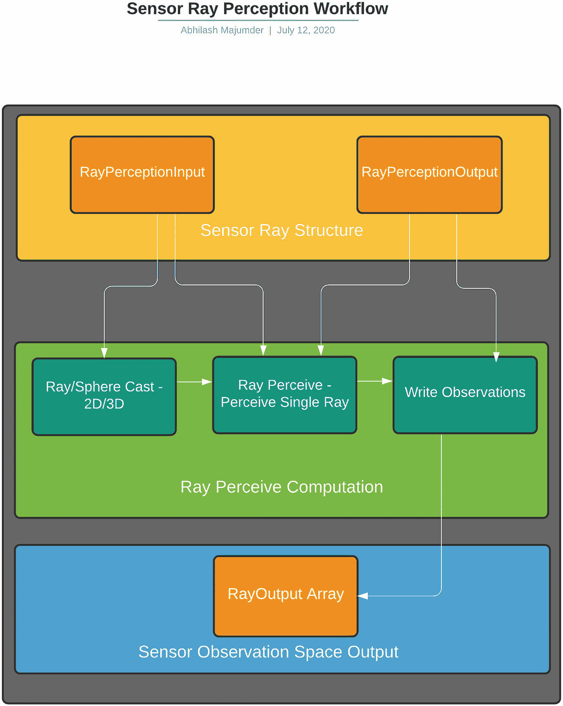
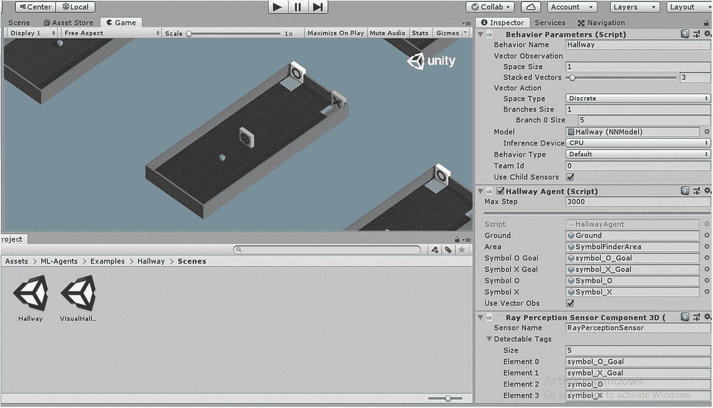
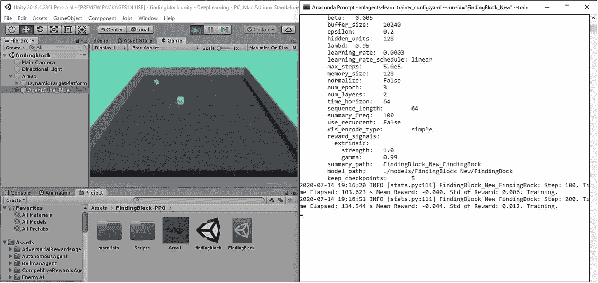

# 4.了解大脑代理和学院

大脑结构是 ML 代理工具包的一个重要方面。在前一章中，我们安装了 ML 代理工具包，并简要了解了这个架构。在内部，ML 代理工具包使用三种不同的大脑，外加一个由用户控制的玩家大脑。我们关心的是理解 ML 代理包中某些脚本的内部工作，它使用 Unity 代理中 Tensorflow 训练的神经网络。由于我们已经尝试了将深度 Q-learning 作为截至目前唯一的深度 RL 算法，因此我们也可以使用该算法来训练代理的大脑。在 Unity ML 代理中，内部大脑的默认算法是近端策略操作(PPO ),这是一种健壮的算法，并且在易于实现、样本调整和复杂性之间取得了令人满意的平衡，我们将探索将用作代理大脑的不同算法。在本节中，我们将深入了解大脑架构以及与之相关的所有相关 C#脚本，包括模型训练和超参数调整的不同方面。我们将在 Unity 中使用 ML 代理来构建游戏。

在我们深入相关脚本之前，让我们回顾一下上一章中我们强调的大脑学院架构的某些方面。由于大脑主要有三种类型-内部、启发式和外部-我们将主要关注内部大脑的某些方面，内部大脑使用 Barracuda 推理引擎，外部大脑使用 communicator 对象在 Tensorflow 中实时训练代理。我们提到了某些脚本的用法，比如行为参数，我们将在本章中深入探讨。我们还将研究引擎在没有通过端口 5004 连接到 Python API 进行外部训练时如何配置自己。就 C#脚本而言，brain 架构最重要的方面可以在“com.unity.ml-agents”包下的运行时文件夹中找到。使用多种策略的整个大脑架构的构建模块依赖于推理机、传感器、通信器、演示器和模型加载器。这些部分中的每一个都构成了大脑的一个独立功能，例如推理引擎，它有助于在 Unity 中运行经过训练的张量流模型。由于所有这些组件都是 C#脚本，因此大脑架构可以如图 [4-1](#Fig1) 所示进行可视化。


图 4-1

Unity ML 代理的部分大脑结构

传感器是大脑架构中最重要的方面，因为它控制着智能体做出决策和选择行动所需的观察空间。传感器是物理射线，它以离散和连续向量的形式收集信息，这些用于模型训练部分。然后，控制深度 RL 算法的策略使用传感器数据，如 Unity ML 代理的 PPO 和(软演员评论家)SAC。策略和通信器与外部大脑相关联。外部大脑在运行时在 Tensorflow 中训练，就像我们在上一章中训练我们的模型一样。这些演示是一套不同的算法，依赖于模仿学习和行为克隆，这些也依赖于传感器数据。通过通信器，演示可以被训练为实现模仿学习家族的样本启发式/外部大脑。然后我们有推理机，用于预训练的模型。推理引擎接收观察/动作空间的训练向量。然后这被用作内部大脑。推理引擎还可以选择使用使用策略中的深度 RL 算法处理的传感器数据以及来自预训练模型的观察数据。存储的最终神经网络模型可用于 Unity 中的实时游戏。既然我们已经了解了大脑的重要方面，那么让我们深入了解它的实现细节以及与不同 Python APIs 的通信。

## 理解大脑的结构

为了理解大脑架构的不同方面，我们将尝试理解与之相关的 C#脚本。由于传感器在为代理收集观察数据时起着重要的作用，我们将讨论我们可以在场景中使用的不同类型的传感器。传感器是物理射线，当它们与场景中的另一个游戏对象碰撞时，用于收集观察结果。这些控制观察空间的分布，无论它是离散的还是连续的。我们将探索不同类型的传感器，用于获取 ML 代理培训阶段所需的观察结果。然后对这些传感器数据进行编码，以产生张量，如 one-hot 编码技术，然后传递给深度学习层，以用于不同的策略。在 sensors 文件夹中，有几种 ML 代理使用的传感器:相机传感器、射线传感器、射线感知 2D 传感器和许多其他传感器。每种传感器类型都有独特的属性，我们将在本节中探讨所有这些属性。然后，我们将研究包含深度 RL 的训练算法的策略。这还将包含我们在第 [3](3.html) 章中简要学习过的大脑架构的基本脚本，即行为参数 C#脚本。我们还将深入探索推理模块，以了解 Barracuda 在运行预训练模型期间如何对内部大脑进行推理。

### 传感器

传感器是整个 ML 代理工具包中最重要的方面。这包含观察空间并控制空间的分布。根据这些观察，代理必须选择策略并执行操作。这些传感器本质上是来自 Unity 的物理引擎的射线传感器，并在与标记的预置碰撞时收集信息。首先，我们将研究 ISensor.cs 脚本，因为它包含射线传感器和相机传感器将使用的主要方法。然后，我们将研究该文件夹中的一些不同的传感器变体。基本上，使用传感器收集观察数据的流程可以被可视化，如图 [4-2](#Fig2) 所示。


图 4-2

Unity ML 代理中的传感器

ISensor:ISensor 是一个包含所有函数声明的接口，用于 ML 代理中的不同传感器。它包含的功能通过更改视觉观察的数据类型来影响相机传感器，并通过修改光线投射的类型(2D 或 3D)来影响光线传感器。ISensor 脚本以一个 enum 开始，它定义了存储从相机传感器收集的视觉信息的可能性，无论它是浮点数组的形式还是 PNG 格式(二进制格式)。

```py
public enum SensorCompressionType
 {
   None,
   PNG
 }

```

下一个片段有一个方法“GetObservationShape”，它控制将在 RayPerceptionSensor 脚本中使用的观察空间的大小。例如，在光线传感器的情况下，如果传感器正在观察刚体的速度向量，那么它的尺寸将是 3 (x，y 和 z 轴)。然而，在相机传感器的情况下，如果使用 RGB 像素图像，则观察空间将是 5(高度、宽度和 RGB 的三个通道)。当我们讨论卷积神经网络(Conv2D)如何有助于训练来自相机传感器的这些采样图像时，将详细讨论后者。它还有一个方法“Write”，将观察结果写入输出容器(数组)。当输出的维度或大小相当大时,“GetCompressedObservation”方法对于压缩结果的输出数组非常有用。除此之外，还有“更新”和“重置”方法，它们指定传感器的内部状态。“更新”方法在代理做出每个决定时更新传感器，而“重置”方法在代理的每个情节结束时触发。还有“GetCompressionType”和“GetName”方法，它们分别控制压缩类型并提供所有代理中传感器的确定性排序。

```py
int[] GetObservationShape();
int Write(ObservationWriter writer);
byte[] GetCompressedObservation();
void Update();
void Reset();
SensorCompressionType GetCompressionType();
string GetName();

```

它还包含“SensorExtensions”类中的帮助函数，该函数提供 ISensor 观察空间中的元素数量。这包括将每个输入观察空间的形状元素相乘，如下所示:

```py
public static int ObservationSize(this ISensor sensor)
{
    var shape = sensor.GetObservationShape();
    var count = 1;
    foreach (var dim in shape)
    {
        count *= dim;
   }
    return count;
}

```

这就完成了 ISensor 接口脚本。我们将探索这个脚本是如何在照相机和光线传感器中被用来创建代理的观察空间的。让我们了解射线传感器，然后我们将探讨相机传感器。

#### 射线传感器

**RayPerceptionSensor****:**在 ML 代理的上下文中，第一个重要的传感器是 RayPerceptionsensor.cs 脚本，它位于“com.unity.ml-agents”包下的运行时文件夹中。该传感器基本上控制光线投射的 2D 或 3D 维度。这是通过以下代码行完成的:

```py
namespace Unity.MLAgents.Sensors
{
    /// <summary>
    /// Determines which dimensions the sensor will perform the casts in.
    /// </summary>
    public enum RayPerceptionCastType
    {
        Cast2D,

        Cast3D,
    }

```

“RayPerceptionCastType”包含投射光线的类型。下一部分包含一个数据结构(struct ),该数据结构包含“RayPerceptionInput”传感器中包含的详细信息。它包含光线长度、碰撞检测、偏移、投射半径、图层蒙版、角度、投射类型和变换等细节。层遮罩是一个重要的属性，因为它允许光线穿过某些层，以检测其他层中存在的对象。偏移允许光线在距离源几个单位的距离处投射。碰撞检测属性用于检查射线传感器是否与标记的对象发生碰撞。角度控制光线的方向，通常 90 度被认为是相对于对象的“向前”方向。转换类型来自“RayPerceptionCastType”枚举，该枚举控制它是 2D 还是 3D。变换表示触发光线的对象(代理)的位置变换。投射半径决定了球面光线投射的半径，通常如果提供 0 或更小的值，则表示法线光线。

```py
public struct RayPerceptionInput
    {
        public float RayLength;

        public IReadOnlyList<string> DetectableTags;

        public IReadOnlyList<float> Angles;

        public float StartOffset;

        public float EndOffset;

        public float CastRadius;

        public Transform Transform;

        public RayPerceptionCastType CastType;

        public int LayerMask;

```

这个类中有一些方法，比如“OutputSize”方法，可以控制传感器的大小。这个大小形成了观察空间的大小，这是行为参数脚本所需要的。这表现为:

```py
public int OutputSize()
        {
            return (DetectableTags.Count + 2) * Angles.Count;
        },

```

其中“可检测标签”。“计数”控制代理的光线传感器可以检测到的场景中标记的游戏对象的数量。“角度。Count "属性返回从代理发出的传感器光线的不同角度的数量。

接下来我们将了解其他方法，如“PolarToCartesian3D”和“PolarToCartesian2D”这些方法对于将光线变换从 Unity 场景中的极坐标转换到笛卡尔坐标非常有用。本质上，这将光线从局部空间转换到世界空间。然后，世界空间坐标用于分析传感器光线击中了哪些可检测的游戏对象。这可以通过使用变换位置的正弦和余弦变换来完成。这在图 [4-3](#Fig3) 中有图解显示。


图 4-3

n-D 射线的极坐标到笛卡尔坐标的转换

“半径”表示极坐标中的射线长度。Unity 中的相关轴是 x 轴和 z 轴。作为参考，我们认为 x 轴是水平面，z 轴是垂直面。这由圆圈中相隔 90 度的轴表示。如果传感器射线相对于 x 轴的角度为“A”，则沿 x 轴的相应射线长度为“半径*cos(A)”，沿垂直 z 轴的相应射线长度为“半径*sin(A)”现在让我们用“PolarToCartesian2D”方法来研究 2D 射线转换。这非常重要，因为我们将使用角度来指定场景中光线之间的间隙。

```py
static internal Vector2 PolarToCartesian2D(float radius, float angleDegrees)
      {
            var x = radius *
    Mathf.Cos(Mathf.Deg2Rad * angleDegrees);
            var y = radius *
    Mathf.Sin(Mathf.Deg2Rad * angleDegrees);
            return new Vector2(x, y);
        }

```

在 2D 射线传感器转换的情况下，我们考虑相互垂直的 x 轴和 y 轴。如果我们把这个和之前的图比较一下，x 轴是水平线，y 轴是垂直线。该角度被转换为弧度，用于正弦和余弦角度计算。同样，如果我们观察 3D 对应物:

```py
static internal Vector3 PolarToCartesian3D
(float radius, float angleDegrees)
        {
            var x = radius *
    Mathf.Cos(Mathf.Deg2Rad * angleDegrees);
            var z = radius *
    Mathf.Sin(Mathf.Deg2Rad * angleDegrees);
            return new Vector3(x, 0f, z);
        }

```

在这种情况下，我们将 x-z 作为相互垂直的轴，y 轴为 0。这是我们将在场景中使用的部分。对于下一部分，我们有“RayExtents”方法，它控制传感器射线的命中点的坐标。这也估计了从射线源到射线传感器的距离，并使用极坐标到坐标的转换来进行该计算。同样在这里，我们有决定射线是在 2D 还是在 3D 中的情况。

```py
var angle = Angles[rayIndex];
Vector3 startPositionLocal, endPositionLocal;
if (CastType == RayPerceptionCastType.Cast3D)
{
    startPositionLocal = new Vector3(0, StartOffset, 0);
    endPositionLocal = PolarToCartesian3D(RayLength, angle);
    endPositionLocal.y += EndOffset;
}
else
{
    // Vector2s here get converted to Vector3s (and back to Vector2s for casting)
    startPositionLocal = new Vector2();
    endPositionLocal = PolarToCartesian2D(RayLength, angle);
}
var startPositionWorld = Transform.TransformPoint(startPositionLocal);
var endPositionWorld = Transform.TransformPoint(endPositionLocal);
return (StartPositionWorld : startPositionWorld, EndPositionWorld : endPositionWorld);

```

下一部分包含类“RayPerceptionOutput”，它控制传感器射线击中标记对象时的不同结果。在这个类中，有一个结构“RayOutput”，它包含几个属性，如“HasHit”、“HitTaggedObject”、“HitTagIndex”和“HitFraction”。这些分别包含关于传感器射线是否已经击中相关对象的细节、击中对象的标签、列表中可检测标签中对象标签的索引(如果击中任何其他对象或未指定任何对象，则为-1)以及击中对象的归一化距离。

```py
public struct RayOutput
        {
            public bool HasHit;

            public bool HitTaggedObject;

            public int HitTagIndex;

            public float HitFraction;

```

“ToFloatArray”方法将光线输出信息写入浮动数组的子集。该列表包含观察数据，可以是以下数据:

*   用于可检测标签的一次性编码数据。如果“可检测标签。长度”等于“n”，列表的前 n 个元素将是命中的可检测标签的一个热编码，或者如果没有命中，则为 0。

*   如果传感器射线错过了一切，则“numDetectableTags”将被设置为 1，如果它击中了某个东西(无论“可检测”与否)，则设置为 0。

*   “numDetectableTags + 1”表示对象被击中时的归一化距离，如果没有击中，则为 1.0。

还有一个控制输出缓冲区大小的浮点缓冲区数组，由(numDetectableTags+2)* ray outputs . length 给出。

```py
public void ToFloatArray(int numDetectableTags, int rayIndex, float[] buffer)
{
    var bufferOffset = (numDetectableTags + 2) * rayIndex;
    if (HitTaggedObject)
    {
        buffer[bufferOffset + HitTagIndex] = 1f;
    }
    buffer[bufferOffset + numDetectableTags] =
                                          HasHit ? 0f : 1f;
    buffer[bufferOffset + numDetectableTags + 1] =
                                              HitFraction;
}
}

```

有一个名为“DebugDisplayInfo”的内部类，用于调试屏幕上绘制的传感器光线的属性，并显示帧速率。它还在光线击中任何可检测标签时显示信息，并由“RayPerceptionsensorComponent”使用

```py
internal class DebugDisplayInfo
{
public struct RayInfo
{
    public Vector3 worldStart;
    public Vector3 worldEnd;
    public float castRadius;
    public RayPerceptionOutput.RayOutput rayOutput;
}
public void Reset()
{
    m_Frame = Time.frameCount;
}
public int age
{
    get { return Time.frameCount - m_Frame; }
}
public RayInfo[] rayInfos;
int m_Frame;
}

```

下一部分是射线传感器的实现，它继承自 ISensor 组件。有“RayPerceptionInput”类和“DebugDisplayInfo”类的实例化对象。公共函数 RayPerceptionSensor 用初始化的值设置类的对象，并分配传感器光线输入。

```py
float[] m_Observations;
int[] m_Shape;
string m_Name;
RayPerceptionInput m_RayPerceptionInput;
DebugDisplayInfo m_DebugDisplayInfo;
internal DebugDisplayInfo debugDisplayInfo
{
    get { return m_DebugDisplayInfo; }
}
public RayPerceptionSensor(string name, RayPerceptionInput rayInput)
{
    m_Name = name;
    m_RayPerceptionInput = rayInput;
    SetNumObservations(rayInput.OutputSize());
    if (Application.isEditor)
    {
        m_DebugDisplayInfo = new DebugDisplayInfo();
    }
}

```

“SetNumObservations”方法详细说明了传感器观测阵列的大小。“SetRayPerceptionInput”方法检查可检测标签的数量和传感器光线是否在运行时被修改。它还检查“RayPerceptionInput”数组的大小是否与“rayInput”数组的大小相同。这意味着与传感器射线阵列相关的所有形状都是一致的，并且在运行时不会被修改。

```py
void SetNumObservations(int numObservations)
{
    m_Shape = new[] { numObservations };
    m_Observations = new float[numObservations];
}
internal void SetRayPerceptionInput(RayPerceptionInput rayInput)
{
        if (m_RayPerceptionInput.OutputSize() != rayInput.OutputSize())
                  {
                           Debug.Log(
                    "Changing the number of tags or
                     rays at runtime is not " +
                    "supported and may cause errors
                     in training or inference."
                );
            SetNumObservations(rayInput.OutputSize());
        }
    m_RayPerceptionInput = rayInput;
}

```

下一部分通过收集传感器射线与可检测物体碰撞的信息来记录观察结果。首先，它收集关于从代理发出的传感器射线数量和场景中可检测标签的信息。如果相关传感器阵列的形状不一致，它将重置信息并调整缓冲区的大小。然后，它使用“感知单一光线”方法来触发光线的投射，并将信息写入缓冲区。然后，转换的输出被写入“rayOutput”数组，该数组是“RayPerceptionOutput”类的一个对象。它还返回观察数组长度。

```py
public int Write(ObservationWriter writer)
{
    using (TimerStack.Instance.Scoped("RayPerceptionSensor.Perceive"))
    {
        Array.Clear(m_Observations, 0, m_Observations.Length);
        var numRays = m_RayPerceptionInput.Angles.Count;
        var numDetectableTags
 = m_RayPerceptionInput.DetectableTags.Count;
        if (m_DebugDisplayInfo != null)
        {
            m_DebugDisplayInfo.Reset();
            if (m_DebugDisplayInfo.rayInfos == null
 || m_DebugDisplayInfo.rayInfos.Length != numRays)
            {
                m_DebugDisplayInfo.rayInfos =
new DebugDisplayInfo.RayInfo[numRays];
            }
        }
        for (var rayIndex = 0; rayIndex < numRays; rayIndex++)
        {
            DebugDisplayInfo.RayInfo debugRay;
            var rayOutput
 = PerceiveSingleRay(m_RayPerceptionInput,  rayIndex, out debugRay);
            if (m_DebugDisplayInfo != null)
            {
                m_DebugDisplayInfo.rayInfos[rayIndex]
= debugRay;
            }
            rayOutput.ToFloatArray(numDetectableTags
, rayIndex, m_Observations);
        }
        writer.AddRange(m_Observations);
    }
    return m_Observations.Length;
}

```

然后，我们讨论“感知单一阵列”静态方法。它接受一个“RayPerceptionInput”类的对象“rayIndex”和一个 DebugDisplayInfo 对象，ray index 是光线数组中特定光线的索引。然后，它会指定光线长度、投射半径、范围、开始和结束位置以及光线方向等变量。但是，如果比例与 Unity 中使用的比例不同，那么“rayDirection”变量的绝对值将不同于“rayLength”还有一些属性可以转换不同投射长度和命中率的光线长度，还可以放大或缩小投射光线的球体或圆半径。在未缩放射线长度为 0 的情况下，也有避免除以 0 的规定。

```py
var unscaledRayLength = input.RayLength;
var unscaledCastRadius = input.CastRadius;
var extents = input.RayExtents(rayIndex);
var startPositionWorld = extents.StartPositionWorld;
var endPositionWorld = extents.EndPositionWorld;
var rayDirection = endPositionWorld - startPositionWorld;
var scaledRayLength = rayDirection.magnitude;
var scaledCastRadius = unscaledRayLength > 0 ?
    unscaledCastRadius * scaledRayLength / unscaledRayLength :
    unscaledCastRadius;
bool castHit;
float hitFraction;
GameObject hitObject;

```

代码段的下一部分检查光线输入 ID 的类型是 2D 还是 3D。然后，它检查投射半径是否大于 0，这表示它是球形投射还是光线投射。然后它使用“物理学”。光线投射”或“物理学。SphereCast”相应地发射射线。然后，它检查缩放的射线长度是否为 0，并且还进行检查以避免除以 0。

```py
if (input.CastType == RayPerceptionCastType.Cast3D)
{
    RaycastHit rayHit;
    if (scaledCastRadius > 0f)
    {
        castHit = Physics.SphereCast(startPositionWorld
          , scaledCastRadius, rayDirection, out rayHit,
            scaledRayLength, input.LayerMask);
    }
    else
    {
        castHit = Physics.Raycast(startPositionWorld
         , rayDirection, out rayHit,
            scaledRayLength, input.LayerMask);
    }
    hitFraction = castHit ? (scaledRayLength > 0
      ? rayHit.distance / scaledRayLength : 0.0f) : 1.0f;
    hitObject = castHit ? rayHit.collider.gameObject : null;
}
else
{
    RaycastHit2D rayHit;
    if (scaledCastRadius > 0f)
    {
        rayHit = Physics2D.CircleCast(startPositionWorld
            , scaledCastRadius, rayDirection,
            scaledRayLength, input.LayerMask);
    }
    else
    {
        rayHit = Physics2D.Raycast(startPositionWorld
         , rayDirection, scaledRayLength, input.LayerMask);
    }
    castHit = rayHit;
    hitFraction = castHit ? rayHit.fraction : 1.0f;
    hitObject = castHit ? rayHit.collider.gameObject : null;
}

```

在它命中目标可检测标签后，它使用“CompareTag”方法，并为“HitTagIndex”分配命中目标的正确索引。它还计算 RayPerceptionOutput 对象的命中率和其他属性。一旦它碰到一个可探测的物体，循环就中断了。最后，它为 worldStart、worldEnd、rayOuput 和 castRadius 变量分配计算值，并将输出光线返回给“Write”方法。

```py
var rayOutput = new RayPerceptionOutput.RayOutput
{
    HasHit = castHit,
    HitFraction = hitFraction,
    HitTaggedObject = false,
    HitTagIndex = -1
};
if (castHit)
{
    for (var i = 0; i < input.DetectableTags.Count; i++)
    {
        if (hitObject.CompareTag(input.DetectableTags[i]))
        {
            rayOutput.HitTaggedObject = true;
            rayOutput.HitTagIndex = i;
            break;
        }
    }
}

debugRayOut.worldStart = startPositionWorld;
debugRayOut.worldEnd = endPositionWorld;
debugRayOut.rayOutput = rayOutput;
debugRayOut.castRadius = scaledCastRadius;
return rayOutput;

```

但是，“写”方法也使用“感知”方法来调用“PerceoveSingleRay”方法。这个“感知”方法将光线输入数组和与光线相关联的角度作为输入，并将它们传递给“感知单一光线”方法，以获得光线输出和可检测标签的数组。然后传递给“Write”方法作为观察空间写入。

```py
RayPerceptionOutput output = new RayPerceptionOutput();
output.RayOutputs = new RayPerceptionOutput.RayOutput[input.Angles.Count];
for (var rayIndex = 0; rayIndex < input.Angles.Count; rayIndex++)
{
    DebugDisplayInfo.RayInfo debugRay;
    output.RayOutputs[rayIndex] = PerceiveSingleRay(input
       , rayIndex, out debugRay);
}
return output;

```

这就完成了 RayPerceptionsensor 脚本，它是最重要的脚本，用于控制代理发出的射线，以获得可检测标记的观察结果。RayPerceptionsensor 脚本的工作流程如图 [4-4](#Fig4) 所示。



图 4-4

“射线感知传感器”脚本工作流程

这个脚本有不同的版本，用于 2D 光线感知和三维光线感知，我们将会深入研究。

**rayperceptionsensorcomponent 2d****:**该脚本用于将 2D 射线感知传感器组件添加到场景中的代理。它还将投射类型声明为 2D，并使用“Physics.2D”模块来投射光线。虽然它使用 rayperceptionsensorcomponentbase . cs 脚本作为其属性，但后者在内部使用 RayPerceptionSensor 脚本。因此，所有的功能，如绘制球面/光线投射以及单条光线的感知，都是在 RayPerceptionSensor 脚本的帮助下完成的，我们在上一节中讨论过。该脚本特别声明光线投射的类型是 2D，并且可以作为组件添加到针对特定代理的检查器窗口中。

```py
public class RayPerceptionSensorComponent2D : RayPerceptionSensorComponentBase
{
       public RayPerceptionSensorComponent2D()
       {
             RayLayerMask = Physics2D.DefaultRaycastLayers;
       }
       public override RayPerceptionCastType GetCastType()
       {
             return RayPerceptionCastType.Cast2D;
       }
}

```

**rayperceptionsensorcomponent 3D****:**这类似于 2D 组件，除了这里的 3D 投射类型用于光线。最初，如“StartVerticalOffset”和“EndVerticalOffset”方法中所述，为射线的开始和结束位置提供偏移。此脚本继承自“RayPerceptionSensorComponentBase”脚本。偏移量声明声明如下:

```py
[HideInInspector, SerializeField, FormerlySerializedAs("startVerticalOffset")]
[Range(-10f, 10f)]
[Tooltip("Ray start is offset up or down by this amount.")]
float m_StartVerticalOffset;
public float StartVerticalOffset
{
    get => m_StartVerticalOffset;
    set { m_StartVerticalOffset = value; UpdateSensor(); }
}
[HideInInspector, SerializeField, FormerlySerializedAs("endVerticalOffset")]
[Range(-10f, 10f)]
[Tooltip("Ray end is offset up or down by this amount.")]
float m_EndVerticalOffset;
public float EndVerticalOffset
{
    get => m_EndVerticalOffset;
    set { m_EndVerticalOffset = value; UpdateSensor(); }
}

```

下一个代码段包含强制转换的类型，并为 StartVerticalOffset 和 EndVerticalOffset 变量赋值。

```py
public override RayPerceptionCastType GetCastType()
{
    return RayPerceptionCastType.Cast3D;
}
public override float GetStartVerticalOffset()
{
    return StartVerticalOffset;
}
public override float GetEndVerticalOffset()
{
    return EndVerticalOffset;
}

```

**SensorComponent** **:** 这是 ISensor 脚本的变体，用于 Unity 编辑器。为简单起见，特定的 ISensor 实现应该有一个相应的 SensorComponent 来构建它。在内部，它调用“ISensor”脚本的不同方法，这在代理开始创建光线传感器或相机传感器时触发。“GetObservationShape”和“isVisual”方法分别涉及获取传感器向量的观察形状，检查传感器类型是可视的(有五个参数)还是 3D 矢量化属性(例如:刚体的速度/位置，有三个参数)。方法“isVector”控制观察的输出形状是否矢量化(离散或连续)。

```py
public abstract ISensor CreateSensor();
public abstract int[] GetObservationShape();
public virtual bool IsVisual()
        {
            var shape = GetObservationShape();
            return shape.Length == 3;
        }
public virtual bool IsVector()
        {
            var shape = GetObservationShape();
            return shape.Length == 1;
        }

```

**RayPerceptionSensorComponentBase****:**该脚本在内部使用了 RayPerceptionSensor 脚本的功能，并从 SensorComponent 脚本继承而来。当我们为场景中的代理指定一个“RayPerceptionSensorComponent2D”或 RayPerceptionSensorComponent3D 组件时，就会调用这个脚本。它具有传感器的名称，默认为“RayPerceptionSensor”

```py
[HideInInspector, SerializeField, FormerlySerializedAs("sensorName")]
 string m_SensorName = "RayPerceptionSensor";
public string SensorName
{
    get { return m_SensorName; }
    set { m_SensorName = value; }
}

```

这个脚本有一些重要的属性来控制球体投射半径，光线长度和角度。默认情况下，代理发出的光线之间的角度为 70 度；大于 90 度将允许光线在物体后面行进，而在 90 度时将严格限制在左右方向。默认球体投射半径为 0.5 个浮点单位，默认光线长度为 20 个浮点单位。它控制每个方向发射的光线数量，默认为三个(左、右和中心)。它列出了传感器光线可以检测到的可检测标签，以及表示光线可以穿过哪些图层的图层蒙版。

```py
[SerializeField, FormerlySerializedAs("detectableTags")]
[Tooltip("List of tags in the scene to compare against.")]
List<string> m_DetectableTags;
public List<string> DetectableTags
{
    get { return m_DetectableTags; }
    set { m_DetectableTags = value; }
}
[HideInInspector, SerializeField, FormerlySerializedAs("raysPerDirection")]
[Range(0, 50)]
[Tooltip("Number of rays to the left and right of center.")]
int m_RaysPerDirection = 3;
public int RaysPerDirection
{
    get { return m_RaysPerDirection; }
    set { m_RaysPerDirection = value;}
}
[HideInInspector, SerializeField, FormerlySerializedAs("maxRayDegrees")]
[Range(0, 180)]
[Tooltip("Cone size for rays. Using 90 degrees will cast rays to the left and right. " +
    "Greater than 90 degrees will go backwards.")]
float m_MaxRayDegrees = 70;
public float MaxRayDegrees
{
    get => m_MaxRayDegrees;
    set { m_MaxRayDegrees = value; UpdateSensor(); }
}
public float SphereCastRadius

{
    get => m_SphereCastRadius;
    set { m_SphereCastRadius = value; UpdateSensor(); }
}

[HideInInspector, SerializeField, FormerlySerializedAs("rayLength")]
[Range(1, 1000)]
[Tooltip("Length of the rays to cast.")]
float m_RayLength = 20f;
public float RayLength
{
    get => m_RayLength;
    set { m_RayLength = value; UpdateSensor(); }
}
[HideInInspector, SerializeField, FormerlySerializedAs("rayLayerMask")]
[Tooltip("Controls which layers the rays can hit.")]
LayerMask m_RayLayerMask = Physics.DefaultRaycastLayers;
public LayerMask RayLayerMask
{
    get => m_RayLayerMask;
    set { m_RayLayerMask = value; UpdateSensor(); }
}

```

它还包含观察堆栈，这表示我们想要堆叠多少观察并将其传递给神经网络(默认为 1，表示没有以前的观察将用于神经网络训练)。它还有其他属性，如光线命中颜色、错过颜色、光线投射类型(2D/3D)以及开始和结束偏移位置(从 SensorComponent 脚本继承)。在后面的部分中，当我们将我们的 RayPerceptionSensorComponent3D 组件/脚本分配给 Unity 中的代理时，所有这些组件在检查器窗口中都是可编辑的。

```py
[HideInInspector, SerializeField, FormerlySerializedAs("observationStacks")]
[Range(1, 50)]
[Tooltip("Number of raycast results that will be stacked before being fed to the neural network.")]
int m_ObservationStacks = 1;
public int ObservationStacks
{
    get { return m_ObservationStacks; }
    set { m_ObservationStacks = value; }
}
[HideInInspector]
[SerializeField]
[Header("Debug Gizmos", order = 999)]
internal Color rayHitColor = Color.red;
[HideInInspector]
[SerializeField]
internal Color rayMissColor = Color.white;
[NonSerialized]
RayPerceptionSensor m_RaySensor;
public RayPerceptionSensor RaySensor

{
    get => m_RaySensor;
}

public abstract RayPerceptionCastType GetCastType();
public virtual float GetStartVerticalOffset()
{
    return 0f;
}
public virtual float GetEndVerticalOffset()
{
    return 0f;
}

```

“CreateSensor”方法会覆盖“ISensor”脚本，并通过使用“RayPerceptionSensor”脚本中的方法来初始化传感器。如果使用了大于 1 的值，它还会堆叠观察值。

```py
public override ISensor CreateSensor()
{
    var rayPerceptionInput = GetRayPerceptionInput();
    m_RaySensor = new RayPerceptionSensor(m_SensorName, rayPerceptionInput);
    if (ObservationStacks != 1)
    {
        var stackingSensor = new StackingSensor(m_RaySensor, ObservationStacks);
        return stackingSensor;
    }
    return m_RaySensor;
}

```

下一个代码段包含 GetRayAngles 浮点数组方法，该方法返回传感器光线的角度以及每个方向上的光线数量。每条射线之间的角度范围以“δ”的间距成算术级数 delta 变量通过将最大光线角度除以每个方向上的光线数量值来计算。然后它以{ 90，90 - delta，90 + delta，90 - 2*delta，90 + 2*delta }的形式对光线进行插值。

```py
internal static float[] GetRayAngles(int raysPerDirection, float maxRayDegrees)
{
var anglesOut = new float[2 * raysPerDirection + 1];
var delta = maxRayDegrees / raysPerDirection;
anglesOut[0] = 90f;
for (var i = 0; i < raysPerDirection; i++)
{
    anglesOut[2 * i + 1] = 90 - (i + 1) * delta;
    anglesOut[2 * i + 2] = 90 + (i + 1) * delta;
}
    return anglesOut;
}

```

下一个部分是 GetObservationShape，它也覆盖了来自“RayPerceptionSensor”的相同方法，并控制可检测标记的数量和射线的数量、观察的堆栈大小以及观察大小。

```py
public override int[] GetObservationShape()
        {
            var numRays = 2 * RaysPerDirection + 1;
            var numTags = m_DetectableTags?.Count ?? 0;
            var obsSize = (numTags + 2) * numRays;
            var stacks = ObservationStacks > 1
                        ? ObservationStacks : 1;
            return new[] { obsSize * stacks };
        }

```

在该代码段的最后一部分，覆盖了“GetRayPerceptionInput”方法，所有变量都根据我们之前讨论过的“RayPerceptionInput”结构(structure)进行赋值。

```py
public RayPerceptionInput GetRayPerceptionInput()
{
    var rayAngles = GetRayAngles
                    (RaysPerDirection, MaxRayDegrees);
    var rayPerceptionInput = new RayPerceptionInput();
    rayPerceptionInput.RayLength = RayLength;
    rayPerceptionInput.DetectableTags = DetectableTags;
    rayPerceptionInput.Angles = rayAngles;
    rayPerceptionInput.StartOffset = GetStartVerticalOffset();
    rayPerceptionInput.EndOffset = GetEndVerticalOffset();
    rayPerceptionInput.CastRadius = SphereCastRadius;
    rayPerceptionInput.Transform = transform;
    rayPerceptionInput.CastType = GetCastType();
    rayPerceptionInput.LayerMask = RayLayerMask;
    return rayPerceptionInput;

}

```

“OnDrawGizmosSelectedMethod”脚本获取输入光线，并从“RayPerceptionSensor”脚本调用“感知单一光线”函数，用于沿不同方向的每条光线。根据光线是否为空，显示光线的颜色。较旧的观察结果以较浅的阴影显示，以降低当前训练情节的重要性。

```py
var rayInput = GetRayPerceptionInput();
for (var rayIndex = 0; rayIndex < rayInput.Angles.Count; rayIndex++)
{
    DebugDisplayInfo.RayInfo debugRay;
    RayPerceptionSensor.PerceiveSingleRay(rayInput, rayIndex, out debugRay);
    DrawRaycastGizmos(debugRay);
}

```

“DrawRaycastGizmos”方法使用 DisplayDebugInfo 变量(来自 RayPerceptionSensor 脚本)来调试偏移位置、光线方向、命中率和命中半径等变量。图 [4-5](#Fig5) 显示了在“finding block-PPO”Unity 场景中使用“RayPerceptionSensorComponent3D”的光线传感器，我们将在本章的后一节中对此进行研究。


图 4-5

使用传感器光线的 Unity 中的光线感知传感器 3D

这完成了射线传感器的基本方面。还有关联的脚本，比如 VectorSensor 和 StackingSensor。

**矢量传感器** **:** 这个脚本是光线传感器的矢量实现。它有“AddObservation”的不同变体，这是一种方法重载技术。当观察大小可以是变换(矢量 3/矢量 2)、四元数(x，y，z，w)、布尔或整数时，这很有用。这将在我们编写自己的代理脚本时使用。如果预期的观察空间大小与训练期间接收的观察空间大小不一致，则显示警告。如果接收到过多的观测值，则截断观测值，如果接收到比预期少的观测值，则用 0 填充。

```py
public int Write(ObservationWriter writer)
{
    var expectedObservations = m_Shape[0];
    if (m_Observations.Count > expectedObservations)
    {
        Debug.LogWarningFormat(
            "More observations ({0}) made than vector observation size ({1}). The observations will be truncated.",
            m_Observations.Count, expectedObservations
        );
        m_Observations.RemoveRange(expectedObservations, m_Observations.Count - expectedObservations);
    }
    else if (m_Observations.Count < expectedObservations)
    {
        Debug.LogWarningFormat(
            "Fewer observations ({0}) made than vector observation size ({1}). The observations will be padded.",
            m_Observations.Count, expectedObservations
        );
        for (int i = m_Observations.Count; i < expectedObservations; i++)
        {
            m_Observations.Add(0);
        }

    }
    writer.AddRange(m_Observations);
    return expectedObservations;
}

```

**堆叠传感器** **:** 该传感器用于观测值的时间堆叠，连续的观测值从左到右存储在一个数组(1D)中。该特定传感器的细节是跨功能的，并且用于需要存储器的深度 RL 算法中。

这就完成了整个类别的射线传感器。代理在 Unity 中使用“RayPerceptionSensorComponent2D”或“RayPerceptionSensorComponent3D”。该脚本进而调用 RayPerceptionSensorComponentBase 脚本，该脚本实现 SensorComponent 脚本。后者是 Unity 编辑器的 ISensor 脚本的实现。RayPerceptionSensorComponentBase 脚本显示在“检查器”窗口中，用于控制观察、光线及其属性。这个脚本在内部调用“RayPerceptionSensor”脚本，它包含结构“RayPerceptionInput”和“RayPerceptionOutput”。这是大脑最重要的部分之一，用于收集来自传感器射线的观察结果。图 [4-6](#Fig6) 显示了这种架构。


图 4-6

Unity ML 代理中的射线传感器脚本

#### 相机传感器

在这一节中，我们还将探索相机传感器，它是由 camera sensorComponent 和 CameraSensor 脚本控制的。

**CameraSensorComponent****:**这个脚本也像光线传感器一样继承了 SensorComponent 脚本，控制一个视觉观察空间的不同属性。由于 GridWorld 这样的环境依赖于压缩形式(PNG)的视觉观察，然后将其传递给深度学习计算机视觉算法，因此该脚本用于分配输入观察空间的高度、宽度、压缩和矢量化分布。脚本被分配给一个代理，该代理在 Unity 场景中的摄像机的帮助下控制视觉观察。它也将摄像机指定为默认视觉观察。生成的图像的宽度和高度也是一个属性，默认为 84 个单位。

```py
[AddComponentMenu("ML Agents/Camera Sensor", (int)MenuGroup.Sensors)]
public class CameraSensorComponent : SensorComponent
{
    [HideInInspector, SerializeField
     , FormerlySerializedAs("camera")]
    Camera m_Camera;
    CameraSensor m_Sensor;
    public Camera Camera
    {
        get { return m_Camera;  }
        set { m_Camera = value; UpdateSensor(); }
    }
    [HideInInspector, SerializeField
     , FormerlySerializedAs("sensorName")]
    string m_SensorName = "CameraSensor";
    public string SensorName
    {
        get { return m_SensorName;  }
        set { m_SensorName = value; }
    }
    [HideInInspector, SerializeField
     , FormerlySerializedAs("width")]
    int m_Width = 84;
    public int Width
    {
        get { return m_Width;  }
        set { m_Width = value; }
    }

    [HideInInspector, SerializeField
    , FormerlySerializedAs("height")]
    int m_Height = 84;
    public int Height
    {
        get { return m_Height;  }
        set { m_Height = value;  }
    }

```

该脚本还具有控制图像是以 RGB(三通道)格式还是灰度(一通道)格式接收的属性。它还包含默认为“PNG”的图像压缩类型然后，该相机传感器对象可用于收集视觉信息(视觉传感器)。该对象属于 ISensor 类型，管理 Unity ML 代理中的所有传感器。

```py
[HideInInspector, SerializeField, FormerlySerializedAs("grayscale")]
bool m_Grayscale;
public bool Grayscale
{
    get { return m_Grayscale;  }
    set { m_Grayscale = value; }
}
[HideInInspector, SerializeField, FormerlySerializedAs("compression")]
SensorCompressionType m_Compression = SensorCompressionType.PNG;
public SensorCompressionType CompressionType
{
    get { return m_Compression;  }
    set { m_Compression = value; UpdateSensor(); }
}
public override ISensor CreateSensor()
{
    m_Sensor = new CameraSensor(m_Camera, m_Width, m_Height, Grayscale, m_SensorName, m_Compression);
    return m_Sensor;
}

```

它还覆盖了方法“GetObservationShape”，就像射线传感器一样，它返回观察向量(容器)，其形状由图像的高度、宽度和通道(RGB/灰度)控制。它还有另一个方法“UpdateSensor”，该方法分配相机传感器的名称和压缩类型(none/PNG)。

```py
public override int[] GetObservationShape()
        {
            return CameraSensor.GenerateShape(m_Width
                     , m_Height, Grayscale);
        }
internal void UpdateSensor()
        {
            if (m_Sensor != null)
            {
                m_Sensor.Camera = m_Camera;
                m_Sensor.CompressionType = m_Compression;
            }
        }

```

**CameraSensor:** 它继承了 ISensor 脚本并覆盖了它的方法。这个脚本的基本功能是包装一个摄像机对象，为代理生成视觉观察。它具有 CameraSensorComponent 脚本中存在的属性，如高度、宽度、灰度、名称形状和压缩类型，并具有分配这些属性的相关函数。“GetCompressedObservation”方法以 PNG 二进制格式对图像进行编码。

```py
public byte[] GetCompressedObservation()
{
    using (TimerStack.Instance.Scoped("CameraSensor.GetCompressedObservation"))
    {
        var texture = ObservationToTexture(m_Camera, m_Width
                       , m_Height);
        // TODO support more types here, e.g. JPG
        var compressed = texture.EncodeToPNG();
        DestroyTexture(texture);
        return compressed;
    }
}

```

重要的方法包括重写“Write”方法、“ObservationToTexture”方法。后者很重要，因为相机捕捉呈现在渲染纹理(纹理 2D)上的图像。该函数为变量分配纹理 2D 属性，如宽度、高度和纹理格式(RGB24 ),还控制摄像机的变换及其景深。此脚本还可以帮助渲染到屏幕外纹理，这在 CPU 中训练 Resnet 模型时非常有用。对于每个时间戳，图像被捕获和激活，以便它可以被神经网络处理。经过处理后，RenderTexture 变量被释放，并为下一个时间步分配一个新图像。

```py
var texture2D = new Texture2D(width, height, TextureFormat.RGB24, false);
var oldRec = obsCamera.rect;
obsCamera.rect = new Rect(0f, 0f, 1f, 1f);
var depth = 24;
var format = RenderTextureFormat.Default;
var readWrite = RenderTextureReadWrite.Default;
var tempRt =RenderTexture.GetTemporary(width, height, depth, format, readWrite);
var prevActiveRt = RenderTexture.active;
var prevCameraRt = obsCamera.targetTexture;

RenderTexture.active = tempRt;
obsCamera.targetTexture = tempRt;

obsCamera.Render();
texture2D.ReadPixels(new Rect(0, 0, texture2D.width, texture2D.height), 0, 0);
obsCamera.targetTexture = prevCameraRt;
obsCamera.rect = oldRec;
RenderTexture.active = prevActiveRt;
RenderTexture.ReleaseTemporary(tempRt);
return texture2D;

```

“Write”方法然后将这个“ObservationToTexture”方法调用到代理的观察空间。然而，在这种情况下，观察空间写在一个张量上(我们将在下一章讨论)，它可以被假设为适合执行深度学习算法计算的密集矩阵。一旦来自观察空间的视觉信息被运行在外部大脑上的网络处理，相关联的纹理就被破坏了。该脚本在以下几行的帮助下实现了这一点:

```py
using (TimerStack.Instance.Scoped("CameraSensor.WriteToTensor"))
   {
      var texture = ObservationToTexture(m_Camera,
                    m_Width, m_Height);
      var numWritten = Utilities.TextureToTensorProxy(texture
                     , writer, m_Grayscale);
      DestroyTexture(texture);
      return numWritten;
   }

```

“GenerateShape”方法返回图像的形状及其相关通道:一个用于灰度，三个用于 RGB。

```py
internal static int[] GenerateShape(int width, int height, bool grayscale)
        {
            return new[] { height, width, grayscale ? 1 : 3 };
        }

```

在 GridWorld 环境中，使用了相机传感器组件。这两个重要的脚本控制来自摄像机的视觉观察输入，并将这些信息传递给神经网络进行训练。如图 [4-7](#Fig7) 所示。


图 4-7

GridWorld 中的摄像机传感器

还有另一个名为“RenderTextureSensor”的类，它包含 CameraSensor 脚本中使用的函数和方法的初始化，例如创建纹理 2D 格式，并为训练分配高度、宽度、通道、名称和压缩。传感器部分控制代理的集中观察空间，并为代理提供所有细节，以根据运行时策略做出下一个决策。我们已经深入探讨了两种不同的传感器:射线传感器和相机传感器。重要的结论是，这两个传感器都继承了较低级别的“ISensor”和“SensorComponent”脚本，并且具有它们自己的独立功能。与射线传感器工作流程相比，摄像机传感器工作流程可以可视化，如图 [4-8](#Fig8) 所示。


图 4-8

Unity ML 代理中的摄像机传感器工作流程

### 政策

在本节中，我们将探讨代理在做出决策时遵循的策略。我们将探索在上一章中简要提到的 BehaviorParameters 脚本，我们将了解该脚本如何与传感器组件相关联，以获得代理的观察空间。BarracudaPolicy 脚本在运行内部大脑的同时，提供与推理引擎策略相关的信息。当代理上没有应用特定的大脑(内部/外部)时，启发式策略脚本参与制定启发式策略。

**BehaviorParameters:** 如上一章所述，这个脚本与智能体在接收到传感器的观察后的决策过程相关联。代理可以选择默认、内部或启发式决策。如果选择默认策略，脚本将尝试获取当前策略。这可以是在推理引擎中运行的预训练策略，也可以是启发式策略。如果不存在预先训练的模型(没有推理)并且没有实施启发式策略，则该默认策略用于具有 Tensorflow(外部大脑)的神经网络的实时训练。默认策略使用远程流程进行决策:(实时培训)。如果外部大脑训练不存在，它将使用推理引擎(内部大脑)，如果没有提供模型，它将默认为启发式策略。

```py
 [Serializable]
public enum BehaviorType
{
     Default,

    HeuristicOnly,

    InferenceOnly

}

```

下一个代码段在运行时实现策略，并生成代理的策略对象。该脚本使用 BrainParameters 脚本，该脚本具有诸如观测值大小、堆叠观测值、矢量动作大小以及离散或连续观测值分布等属性。该段还包含一个神经网络模型变量，如果选择内部策略进行推理，则会使用该变量。它还具有指定推理设备的属性，例如 CPU 或 GPU，在 Unity 中玩游戏时，预训练的模型将在这些设备上运行。

```py
[HideInInspector, SerializeField]
BrainParameters m_BrainParameters = new BrainParameters();
public BrainParameters BrainParameters
{
    get { return m_BrainParameters; }
    internal set { m_BrainParameters = value; }
}

[HideInInspector, SerializeField]
NNModel m_Model;

public NNModel Model
{
    get { return m_Model; }
    set { m_Model = value; UpdateAgentPolicy(); }
}

[HideInInspector, SerializeField]
InferenceDevice m_InferenceDevice;

public InferenceDevice InferenceDevice
{
    get { return m_InferenceDevice; }
    set { m_InferenceDevice = value; UpdateAgentPolicy();}
}

```

它还控制行为类型、行为名称和布尔变量，布尔变量控制是否使用子传感器，并为行为分配一个小组 ID，表示为“FullyQualifiedBehaviorName”子传感器表示附属于代理的子游戏对象的传感器。

```py
[HideInInspector, SerializeField]
BehaviorType m_BehaviorType;

public BehaviorType BehaviorType
{
    get { return m_BehaviorType; }
    set { m_BehaviorType = value; UpdateAgentPolicy(); }
}

[HideInInspector, SerializeField]
string m_BehaviorName = "My Behavior";

public string BehaviorName
{
    get { return m_BehaviorName; }
    set { m_BehaviorName = value; UpdateAgentPolicy(); }
}

[HideInInspector, SerializeField, FormerlySerializedAs("m_TeamID")]
public int TeamId;

[FormerlySerializedAs("m_useChildSensors")]
[HideInInspector]
[SerializeField]
[Tooltip("Use all Sensor components attached to child GameObjects of this Agent.")]
bool m_UseChildSensors = true;

public bool UseChildSensors
{
    get { return m_UseChildSensors; }
    set { m_UseChildSensors = value; }
}

public string FullyQualifiedBehaviorName
{
    get { return m_BehaviorName + "?team=" + TeamId; }
}

```

下一个方法是“GeneratePolicy”，它的类型是“IPolicy”它将参数作为大脑参数和行为类型。基于行为的类型，将应用一个切换案例。如果选择了“HeuristicOnly”类型，那么它将从“HeuristicPolicy”中提取其行为(我们将对此进行讨论)。如果使用“推理唯一”策略，那么将进行检查以确保有效的预训练模型可用于通过 Barracuda 的推理。如果不是，则提供警告以改变行为类型。如果存在一个预训练的模型，那么它将被传递给“BarracudaPolicy”脚本来运行推理。

```py
case BehaviorType.HeuristicOnly:
    return new HeuristicPolicy(heuristic
   , m_BrainParameters.NumActions);
case BehaviorType.InferenceOnly:
{
    if (m_Model == null)
    {
        var behaviorType = BehaviorType.InferenceOnly.
        ToString();
        throw new UnityAgentsException(
            $"Can't use Behavior Type {behaviorType} without a model. " +
            "Either assign a model, or change to a different Behavior Type."
        );
    }
    return new BarracudaPolicy(m_BrainParameters, m_Model, m_InferenceDevice);
}

```

然后是“默认”策略，它首先检查通信器是否打开。这意味着连接端口 5004 是为了使用 Tensorflow 对模型进行实时 Python 训练。这是正在进行的外部大脑训练。在端口未连接的情况下，策略检查“推断”策略的可用有效预训练模型。否则，它默认为“启发式”策略。

```py
case BehaviorType.Default:
    if (Academy.Instance.IsCommunicatorOn)
    {
                return new RemotePolicy(m_BrainParameters, FullyQualifiedBehaviorName);
            }
            if (m_Model != null)
            {
                return new BarracudaPolicy(m_BrainParameters, m_Model, m_InferenceDevice);
            }
            else
            {
                return new HeuristicPolicy(heuristic, m_BrainParameters.NumActions);
            }
        default:
            return new HeuristicPolicy(heuristic, m_BrainParameters.NumActions);
    }

```

如果代理不为空，此脚本的最后一个方法“UpdateAgentPolicy”将更新代理的策略。

```py
internal void UpdateAgentPolicy()
{
    var agent = GetComponent<Agent>();
    if (agent == null)
    {
        return;
    }
    agent.ReloadPolicy();
}

```

此 BehaviorParameter 脚本使用某些相邻的脚本，如 BrainParameters、BarracudaPolicy、“HeuristicPolicy”和“IPolicy”脚本，它们是其功能的基础。在本章的下一节中，我们将使用 Unity 编辑器为代理分配一个“行为参数”脚本。

如果我们打开 DeepLearning Assets 文件夹中的任何场景，并导航到场景中的任何代理，我们将看到附加到它的行为参数脚本。例如，在这种情况下,“走廊”的“行为参数”脚本如图 [4-9](#Fig9) 所示。



图 4-9

走廊场景中的行为参数脚本

有些参数(如 VectorObservation 和 VectorAction)是从 BrainParameters 脚本中派生出来的，我们可以看到一些变量，如模型(控制神经网络模型)、推理设备(CPU/GPU)、行为类型(HeuristicOnly、InferenceOnly、Default)、团队 ID 和布尔使用子传感器，我们在该脚本中对此进行了讨论。

**BrainParameters** **:** 控制观察输入和输出空间。它确定“BrainParameter”类中的动作空间是离散的还是连续的，并保存与向量观察空间的大小相关的数据(默认为 1)。它还具有诸如“堆叠向量”之类的属性，堆叠向量指的是用于训练的跨不同帧的观察结果的串联。

```py
public enum SpaceType
{
    Discrete,

    Continuous
}
[FormerlySerializedAs("vectorObservationSize")]
 public int VectorObservationSize = 1;

[FormerlySerializedAs("numStackedVectorObservations")]
 [Range(1, 50)] public int NumStackedVectorObservations = 1;

```

“VectorActionSize”变量定义了动作空间的大小。如果空间是连续的，那么大小就简单地定义为向量的大小。对于离散动作空间，大小取决于动作空间的分支。它还有描述动作空间的“VectorActionDescriptions”和连续或离散的“VectorActionSpaceType”。

```py
[FormerlySerializedAs("vectorActionSize")]
public int[] VectorActionSize = new[] {1};

[FormerlySerializedAs("vectorActionDescriptions")]
public string[] VectorActionDescriptions;

[FormerlySerializedAs("vectorActionSpaceType")]
public SpaceType VectorActionSpaceType = SpaceType.Discrete;

```

“NumActions”返回向量动作空间内的动作数量。如果是离散的，则返回“VectorActionSize”数组的长度(取决于分支因子)。对于连续空间，在堆叠观察值时，返回“VectorActionSize”数组的第一个索引处的值。

```py
public int NumActions
{
    get
    {
        switch (VectorActionSpaceType)
        {
            case SpaceType.Discrete:
                return VectorActionSize.Length;
            case SpaceType.Continuous:
                return VectorActionSize[0];
            default:
                return 0;
        }
    }
}

```

该脚本中的最后一个方法 Clone 用上下文中讨论的值初始化 BrainParameter 对象。这些属性然后被传递到出现在编辑器上的 BehaviorParameters 脚本中。

```py
public BrainParameters Clone()
{
    return new BrainParameters
    {
        VectorObservationSize = VectorObservationSize,
        NumStackedVectorObservations
        = NumStackedVectorObservations,
        VectorActionSize = (int[])VectorActionSize.Clone(),
        VectorActionDescriptions
        = (string[])VectorActionDescriptions.Clone(),
        VectorActionSpaceType = VectorActionSpaceType
    };
}

```

**BarracudaPolicy** **:** 这是用于在 Unity 中运行预训练神经网络的推理机。在内部，这个脚本使用了“ModelRunner”类。该脚本的第一阶段包含不同类型的“推理设备”的枚举，它是 CPU 或 GPU(分别为 0 或 1。)的“BarracudaPolicy”继承自“IPolicy”接口。它包含代理 ID 和传感器形状列表等属性。“ModelRunner”脚本用于所有具有相似深度学习模型和相同推理设备的策略。

```py
public enum InferenceDevice
{
    CPU = 0,

    GPU = 1
}
protected ModelRunner m_ModelRunner;
int m_AgentId;
List<int[]> m_SensorShapes;

```

该脚本还有一个方法 BarracudaPolicy，它将 BrainParameters 类的属性、要使用的神经网络模型和运行该模型的推理设备作为参数。该方法使用 Academy 类中的“GetOrCreateModel”方法，这意味着如果该模型以前曾用于推理，它将继续使用该模型。如果该代理以前没有使用过预训练模型，它将从 assets 文件夹中获得已构建的模型。

```py
public BarracudaPolicy(
    BrainParameters brainParameters,
    NNModel model,
    InferenceDevice inferenceDevice)
{
    var modelRunner = Academy.Instance.GetOrCreateModelRunner(model, brainParameters, inferenceDevice);
    m_ModelRunner = modelRunner;
}

```

它包含一个“RequestDecision”方法，该方法根据训练好的模型为代理做出决策。它将传感器列表(光线/摄像机)作为输入，并为决策过程的每个阶段提供相关联的剧集 ID。

```py
public void RequestDecision(AgentInfo info, List<ISensor> sensors)
{
    m_AgentId = info.episodeId;
    m_ModelRunner?.PutObservations(info, sensors);
}

```

“DecideAction”方法使用 ModelRunner 脚本中的“GetAction”方法，允许代理针对特定决策采取相应的操作。

```py
public float[] DecideAction()
{
    m_ModelRunner?.DecideBatch();
    return m_ModelRunner?.GetAction(m_AgentId);
}

```

**HeuristicPolicy** **:** 当 BehaviorParameters 脚本中既没有提供 Default 选项也没有提供 InferenceOnly 选项时使用。这是启发式策略的一个相当硬编码的实现，它使得代理在每次调用“RequestDecision”方法时采取行动。它不使用 BrainParameters 脚本属性，而是直接使用来自代理的传感器输入列表来做出决策。在这种情况下，重要的方法是“RequestDecision”方法，该方法将传感器列表作为输入，以及“DecideAction”方法，该方法采用策略先前做出的决策。

```py
public HeuristicPolicy(ActionGenerator heuristic, int numActions)
{
    m_Heuristic = heuristic;
    m_LastDecision = new float[numActions];
}
public void RequestDecision(AgentInfo info, List<ISensor> sensors)
{
    StepSensors(sensors);
    m_Done = info.done;
    m_DecisionRequested = true;
}

public float[] DecideAction()
{
    if (!m_Done && m_DecisionRequested)
    {
         m_Heuristic.Invoke(m_LastDecision);
    }
    m_DecisionRequested = false;
    return m_LastDecision;
}

```

步进传感器功能使用 ISensor。GetCompressedObservation，它使传感器的使用在训练和推断之间保持一致。如果不使用压缩，则使用来自传感器的观察空间数据(写入 ObservationWriter 类)；否则，它将作为压缩数据传递。

```py
void StepSensors(List<ISensor> sensors)
{
    foreach (var sensor in sensors)
    {
        if (sensor.GetCompressionType()
            == SensorCompressionType.None)
        {
            m_ObservationWriter.SetTarget(m_NullList
             , sensor.GetObservationShape(), 0);
            sensor.Write(m_ObservationWriter);
        }
        else
        {
            sensor.GetCompressedObservation();
        }
    }
}

```

**IPolicy** **:** 该接口用于我们研究的所有策略脚本，因为它连接到单个代理。它提供了本节中描述的其他策略脚本所需的方法，以提供代理可以采取的决策。它有两个独特的声明:一个是“RequestDecision”方法，它通知大脑代理需要根据它所运行的策略做出决定；另一个是“DecideAction”方法，它意味着必须在调用该方法的特定时间步骤做出决定。

```py
void RequestDecision(AgentInfo info, List<ISensor> sensors);
float[] DecideAction();

```

一旦调用了“决策”方法，大脑就会更新它的决策。

这就完成了策略部分，它涉及代理的决策步骤。这一部分将传感器数据作为输入，并作为不同类型的大脑(内部、外部和启发式)的接口来工作，并向代理提供决策。这是大脑的 C#部分，与 Tensorflow 中的深度学习网络进行内部链接(我们将在第 [5](5.html) 章中讨论)。图 [4-10](#Fig10) 总结了整个政策架构。


图 4-10

智能体大脑中的传感器策略架构

到目前为止，我们已经对大脑的两个主要部分有了很好的理解:传感器和策略。然而，这仅限于 ML 代理软件开发工具包(SDK)的 C#层。大脑的其他重要部分包括推理、交流和演示。其中，推理模块与 Barracuda 引擎和在叠加观测数据上使用 Tensorflow 预训练模型的过程相关。演示者是模仿学习算法集的一个重要方面。这里将简要讨论这两个问题，因为它们与 ML 代理的 Python 方面有更多的关系。communicators 是一个有趣的模块，它处理策略和 Tensorflow/Python API 之间的连接。

### 推理

这部分用于在 Unity 中运行预训练模型的推理机。本质上，这处理作为来自张量流训练的输出而接收的压缩张量数据。我们之前学习的梭鱼策略使用这个模块来连接观察和行动空间，并在游戏过程中提供决策。这个模块有一些重要的方面，比如“ModelRunner”脚本和“BarracudaModelParamLoader”脚本。处理张量处理数据的相关脚本有 TensorApplier、TensorGenerator、TensorProxy 和 TensorNames 脚本。我们将学习本模块的某些方面，即 ModelRunner 脚本，以了解 Barracuda policy 如何使用该脚本做出决策。

**ModelRunner** **:** 这个脚本的属性包括代理信息、传感器和包含代理最后执行的动作的字典。它还包含类似神经网络模型的属性，用于推理、推理设备、推理输入和输出以及传感器形状的验证。“ModelRunner”方法使用来自“BrainParameter”脚本的参数，并且还具有“TensorAllocator”属性，用于对每一集训练的张量结果进行中间缓存。然后，它通过使用模型加载器来加载要使用的模型。加载语法并将其指定为 Barracuda 模型。如果不存在用于推断的模型，则赋一个空值。

```py
public ModelRunner(
    NNModel model,
    BrainParameters brainParameters,
    InferenceDevice inferenceDevice = InferenceDevice.CPU,
    int seed = 0)
      {
    Model barracudaModel;
    m_Model = model;
    m_InferenceDevice = inferenceDevice;
    m_TensorAllocator = new TensorCachingAllocator();
    if (model != null)
    {
#if BARRACUDA_VERBOSE
        m_Verbose = true;
#endif

        D.logEnabled = m_Verbose;
        barracudaModel = ModelLoader.Load(model);
        var executionDevice = inferenceDevice == InferenceDevice.GPU
            ? WorkerFactory.Type.ComputePrecompiled
            : WorkerFactory.Type.CSharp;
        m_Engine = WorkerFactory.CreateWorker(executionDevice, barracudaModel, m_Verbose);
    }
    else
    {
        barracudaModel = null;
        m_Engine = null;
    }

```

下一部分涉及在 BarracudaModelParamLoader 的帮助下，从加载的 Barracuda 模型中提取推理输入。GetInputTensors 命令。同样，推理输出也是从 Barracuda 模型接收的。但是，为了运行推理，还需要一些其他的属性，比如 TensorGenerator 和 TensorApplier 类。张量生成器实际上是一个字典，在张量名称和生成器之间进行映射。生成器可以被认为是专门的函数，通过将它作为迭代器传递，可以帮助分析大型数据集。生成器不会在训练或使用预训练模型期间加载整个数据集，而是根据允许更好的数据流入以进行处理的函数来帮助划分数据。我们将在下一章学习卷积神经网络时深入理解生成器的使用。目前，可以安全地假设“TensorGenerator”类是一个映射，它允许适当的数据流管道进行推理。类似地，TensorApplier 是输出张量名称和将使用该特定输出张量的方法之间的映射。它还存储模型信息和动作，并更新代理的内存(缓冲区)。

```py
m_InferenceInputs = BarracudaModelParamLoader.GetInputTensors(barracudaModel);
m_OutputNames = BarracudaModelParamLoader.GetOutputNames(barracudaModel);
m_TensorGenerator = new TensorGenerator(
    seed, m_TensorAllocator, m_Memories, barracudaModel);
m_TensorApplier = new TensorApplier(
    brainParameters, seed, m_TensorAllocator, m_Memories, barracudaModel);

```

PrepareBarracudaInputs 从 Barracuda 初始化推理输入，并在字典中创建名称和推理输入之间的映射。

FetchBarracudaOutputs 根据提供的特定“名称”获取输出。这对于获得与特定名称相关联的正确映射的推理输入非常重要，以便可以对其进行处理。

```py
static Dictionary<string, Tensor> PrepareBarracudaInputs(IEnumerable<TensorProxy> infInputs)
{
    var inputs = new Dictionary<string, Tensor>();
    foreach (var inp in infInputs)
    {
        inputs[inp.name] = inp.data;
    }
    return inputs;
}

List<TensorProxy> FetchBarracudaOutputs(string[] names)
{
    var outputs = new List<TensorProxy>();
    foreach (var n in names)
    {
        var output = m_Engine.PeekOutput(n);
        outputs.Add(TensorUtils.TensorProxyFromBarracuda(output, n));
    }

    return outputs;
}

```

PutObservations 验证传感器的形状，并将一个情节 ID 与每个情节相关联，以便代理以排序的方式做出决定。如果代理通过遵循推理引擎模型达到目标，那么最后的动作从字典中移除，因为对于该情节不应该采取进一步的步骤。

```py
public void PutObservations(AgentInfo info, List<ISensor> sensors)
{
#if DEBUG
    m_SensorShapeValidator.ValidateSensors(sensors);
#endif
    m_Infos.Add(new AgentInfoSensorsPair
    {
        agentInfo = info,
        sensors = sensors
    });
    m_OrderedAgentsRequestingDecisions.Add(info.episodeId);
    if (!m_LastActionsReceived.ContainsKey(info.episodeId))
    {
        m_LastActionsReceived[info.episodeId] = null;
    }
    if (info.done)
    {
        m_LastActionsReceived.Remove(info.episodeId);
    }
}

```

“DecideBatch”方法实际上是在推理机中批量运行预先训练好的模型。检查当前的批量大小，并通过“TensorGenerator”脚本中的生成器函数传递，以生成一个张量，该张量可以作为信息传递给代理。如上所述，生成器允许数据以顺序分区和成批处理数据的形式传递，而不是传递整个数据。这可以提高性能，如果在传递处理过的数据时占用了大量内存，这也会有所帮助。“BeginSample”方法将采样的张量名称与推理输入相关联。然后使用“GenerateTensor”方法将输入张量提供给推理机。这个方法是批处理的初始管道，它涉及到使用生成器函数将张量数据传递给推理引擎。

```py
if (currentBatchSize == 0)
{
    return;
}
if (!m_VisualObservationsInitialized)
{
    var firstInfo = m_Infos[0];
    m_TensorGenerator.InitializeObservations(firstInfo.sensors, m_TensorAllocator);
    m_VisualObservationsInitialized = true;
}

Profiler.BeginSample("ModelRunner.DecideAction");
Profiler.BeginSample($"MLAgents.{m_Model.name}.GenerateTensors");
m_TensorGenerator.GenerateTensors(m_InferenceInputs, currentBatchSize, m_Infos);
Profiler.EndSample();

```

下一阶段包括准备对应于准备好的张量数据的梭鱼推断输入。这里 TensorGenerator 脚本变得很有用，它包含张量名称(数据)和推理输入之间的映射。

```py
Profiler.BeginSample($"MLAgents.{m_Model.name}.PrepareBarracudaInputs");
var inputs = PrepareBarracudaInputs(m_InferenceInputs);
Profiler.EndSample();

```

然后梭子鱼/推理机执行模型。为此，它在内部使用 WorkerFactory 类来执行模型。m_Engine 变量使用推理输入，并在一个时间步中指定一个特定的动作由代理执行，如 3D 运动。这反过来又以代理采取的记忆、动作和决策的形式返回被执行模型的输出。这里 TensorApplier 脚本变得有用；它控制相关推理输出与记忆和代理采取的动作之间的映射。

```py
Profiler.BeginSample($"MLAgents.{m_Model.name}.ExecuteGraph");
m_Engine.Execute(inputs);
Profiler.EndSample();

Profiler.BeginSample($"MLAgents.{m_Model.name}.FetchBarracudaOutputs");
m_InferenceOutputs = FetchBarracudaOutputs(m_OutputNames);
Profiler.EndSample();

Profiler.BeginSample($"MLAgents.{m_Model.name}.ApplyTensors");
m_TensorApplier.ApplyTensors(m_InferenceOutputs, m_OrderedAgentsRequestingDecisions, m_LastActionsReceived);
Profiler.EndSample();

Profiler.EndSample();

m_Infos.Clear();

m_OrderedAgentsRequestingDecisions.Clear();

```

方法“HasModel”检查是否存在有效的预训练模型用于推理以及相关的推理设备。方法“GetAction”按照决策向量的排序顺序检索代理采取的最后一个动作。

总而言之，这个特定的脚本与使用代理的推理模式相关联。流水线包括从预训练的模型中获取已处理的数据，根据生成器函数将其划分为张量数据以进行更平滑的批处理，将该张量数据及其张量名称作为推理输入传递到 Barracuda 引擎(“张量生成器”)，执行模型，以存储器的形式提取结果，以推理输出格式假设代理采取的动作，在 TensorApplier 的帮助下将推理输出与每集的结果相关联，并提取下一集的最新输出。只要代理已经达到推理训练的目标或者情节被终止，这就继续。这可以在图 [4-11](#Fig11) 中说明。


图 4-11

ML 智能体大脑中的推理模块工作流

与这个推理模块相关的其他脚本包括这里提到的那些。

**TensorGenerator** **:** 如前所述，这个脚本维护了张量名称和生成器函数之间的映射，用于预处理数据的批处理。这很重要，因为在 ML 代理中，我们将使用离散/多离散和连续观察空间来研究各种模型。根据张量预训练数据的性质，每个模型的生成函数是不同的。可以有不同的生成器用于这种情况，例如用于批处理、序列长度或递归输入(用于递归神经网络):

```py
m_Dict[TensorNames.BatchSizePlaceholder] =
    new BatchSizeGenerator(allocator);
m_Dict[TensorNames.SequenceLengthPlaceholder] =
    new SequenceLengthGenerator(allocator);
m_Dict[TensorNames.RecurrentInPlaceholder] =
    new RecurrentInputGenerator(allocator, memories);

```

例如，如果我们使用一个使用视觉观察数据的模型(ConvD NN 模型)，那么我们使用 VisualObservationInputGenerator，如果我们使用矢量化模型(离散/连续),那么我们有 VectorObservationGenerator。基于所使用的深度 RL 算法的类型和相关联的神经网络模型，生成器是不同的。然而，不失一般性，该脚本与推理引擎模块要处理的数据的平滑批处理相关联。

```py
if (isVectorSensor)
{
    if (vecObsGen == null)
    {
        vecObsGen = new VectorObservationGenerator(allocator);
    }
    vecObsGen.AddSensorIndex(sensorIndex);
}
else
{
    m_Dict[TensorNames.VisualObservationPlaceholderPrefix
           + visIndex] =
        new VisualObservationInputGenerator(sensorIndex
           , allocator);
    visIndex++;
}

```

除此之外，Barracuda 还有自己的生成器函数，与可以使用的推理模型相关联。

**TensorApplier** **:** 这个脚本是张量输出与代理的记忆和动作的映射。根据分布的类型(连续或离散)，映射会有所不同。连续动作空间使用 ContinuousActionOutputApplier，离散动作输出 Applier 用于离散空间。它还通过执行代理的每一集来更新内存，并使用 BarracudaMemoryOutputApplier 方法来保存每一集的内存内容。该脚本还根据代理采取的操作更新代理。

### 示范

大脑的另一个基本部分是演示模块，它通过启发式策略进行模仿学习，并记录用户用于训练代理的游戏。该模块不需要神经网络训练或推理机来允许代理做出决定。相反，这是一个独立的模块，致力于让代理通过模仿人类控制来学习。我们将在本节中探索的最重要的脚本是演示记录器脚本。

**演示记录器** **:** 为了通过启发式控制记录来自代理的演示，我们必须向代理添加这个脚本。当在游戏过程中选中“录制”选项时，演示将被录制在位于资产文件夹中的. demo 文件中。这个特定的演示文件包含执行模仿学习算法的详细演示，根据环境的复杂性，这可能需要几分钟到几个小时。图 [4-12](#Fig12) 显示了 Unity 中 3D 球环境下的演示文件。


图 4-12

示例演示文件(。演示)

这个脚本有一定的属性，比如演示者的名字，名字的最大长度，文件的扩展名类型。demo)，以及默认的存储目录(Assets/Demonstrations)。

```py
[FormerlySerializedAs("demonstrationDirectory")]
 [Tooltip("Directory to save the demo files. Will default to " +
                 "{Application.dataPath}/Demonstrations if not specified.")]
        public string DemonstrationDirectory;

        DemonstrationWriter m_DemoWriter;
        internal const int MaxNameLength = 16;

        const string k_ExtensionType = ".demo";
        const string k_DefaultDirectoryName = "Demonstrations";
        IFileSystem m_FileSystem;

        Agent m_Agent;

```

在初始化时，而不是在惰性初始化期间，代理的行为参数被作为输入，并且为演示文件提供相关联的文件路径和文件名。

```py
internal DemonstrationWriter LazyInitialize(IFileSystem fileSystem = null)
        {
            if (m_DemoWriter != null)
            {
                return m_DemoWriter;
            }

            if (m_Agent == null)
            {
                m_Agent = GetComponent<Agent>();
            }

            m_FileSystem = fileSystem ?? new FileSystem();
            var behaviorParams
            = GetComponent<BehaviorParameters>();
            if (string.IsNullOrEmpty(DemonstrationName))
            {
                DemonstrationName
                = behaviorParams.BehaviorName;
            }
            if (string.IsNullOrEmpty(DemonstrationDirectory))
            {
                DemonstrationDirectory
                = Path.Combine(Application.dataPath
                 ,  k_DefaultDirectoryName);
            }

            DemonstrationName
             = SanitizeName(DemonstrationName, MaxNameLength);

            var filePath = MakeDemonstrationFilePath
            (m_FileSystem, DemonstrationDirectory,
            DemonstrationName);

            var stream = m_FileSystem.File.Create(filePath);
            m_DemoWriter = new DemonstrationWriter(stream);

            AddDemonstrationWriterToAgent(m_DemoWriter);

            return m_DemoWriter;
        }

```

“SanitizeName”方法从演示名称中删除除字母数字字符以外的所有字符。可以认为它类似于用于删除字符的正则表达式。

```py
internal static string SanitizeName(string demoName, int maxNameLength)
        {
            var rgx = new Regex("[^a-zA-Z0-9 -]");
            demoName = rgx.Replace(demoName, "");

          if (demoName.Length > maxNameLength)
            {
                demoName = demoName.Substring
                  (0, maxNameLength);
            }
            return demoName;
        }

```

MakeDemonstrationFilePath 对于在观察完成后保存演示文件很重要。它使用时间戳来保存演示文件。训练集结束后，将调用“AddDemonstratorWriterToAgent”方法。它调用代理的行为参数并关联训练好的观察文件(。演示)文件。代理然后运行这个经过训练的演示文件，并使用模仿学习。重要的部分是，在记录阶段(模仿学习的训练阶段)，行为参数类型可以设置为启发式，因为在这种情况下，没有相关的内部/外部大脑可供选择。这个启发式大脑运行在启发式策略上，我们在大脑的策略部分讨论过。然而，另一个修改可以是使用玩家大脑，它可以通过用户的游戏记录动作。

```py
var behaviorParams = GetComponent<BehaviorParameters>();
            demoWriter.Initialize(
                DemonstrationName,
                behaviorParams.BrainParameters,
                behaviorParams.FullyQualifiedBehaviorName
            );
            m_Agent.DemonstrationWriters.Add(demoWriter);

```

演示部分和相关脚本到此结束，理解它们非常重要。当我们在后面的章节中深入探讨生成性对抗性模仿学习(GAIL)时，将单独讨论相关的脚本。可以查看模仿学习的工作流程，如图 [4-13](#Fig13) 所示。


图 4-13

大脑模仿学习演示模块

### 传播者

通信器模块与连接大脑和 Python API 相关联。由于该模块对于实时培训非常重要，因此可以将其视为学院的一部分。由于该模块控制 C#和 Python API 之间的链接，因此我们将研究 ICommunicator 脚本。

**I communicator:**I communicator 脚本包含重要的属性，比如用于连接 Python 的端口号、Unity 包版本、Unity 通信版本、名称以及 C#框架的 RL 功能。

```py
public int port;
public string name;

public string unityPackageVersion;

public string unityCommunicationVersion;

public UnityRLCapabilities CSharpCapabilities;

```

这些包含重要的结构，如 UnityRLParameters，它包含布尔变量 isTraining，用于检查端口(5004)是否被外部大脑用于运行张量流模型。

```py
internal struct UnityRLInputParameters
    {
        public bool isTraining;
    }

```

“QuitCommandHandler”和“ResetCommandHandler”退出并重置由通信器发送的事件和参数更新。该脚本还处理来自通信器的“UnityRLInputParameters”更新。

```py
internal delegate void QuitCommandHandler();
internal delegate void ResetCommandHandler();
internal delegate void RLInputReceivedHandler(UnityRLInputParameters inputParams);

```

下一部分很重要，因为在沟通者中有两种类型:统一沟通者和外部沟通者。两个通信器之间的信息(数据包)流完全是顺序的。一旦建立了连接，就在两个通信器之间交换初始化消息包。这类似于计算机网络中的握手技术。作为惯例，Unity 输入是从外部到 Unity 的消息，Unity 输出是从 Unity 到外部的消息。除了外部通信器第一次发送两个建立连接的消息之外，每次信息交换都是一个接一个地顺序发送消息包。消息的结构可以表示如下:

```py
UnityMessage
    ...Header
    ...UnityOutput
    ......UnityRLOutput
    ......UnityRLInitializationOutput
    ...UnityInput
    ......UnityRLInput
    ......UnityRLInitializationInput

```

“ICommunicator”界面包含所有先前功能的声明，如退出/重置收到的命令。它还使用“初始化”方法通过通信器发送学院参数:

```py
UnityRLInitParameters Initialize(CommunicatorInitParameters initParameters);

```

“订户大脑”为交流注入了新的大脑:

```py
void SubscribeBrain(string name, BrainParameters brainParameters);

```

PutObservation 通过通信器在外部训练的每个时间步将观察结果发送给代理。DecideBatch 向 ICommunicator 发出信号，表示代理已经准备好接收动作，如果通信器还没有接收到代理的动作，那么它需要在此时获得一个动作。“GetActions”方法根据批处理过程(key)获取代理操作。

```py
void PutObservations(string brainKey, AgentInfo info, List<ISensor> sensors);
void DecideBatch();
float[] GetActions(string key, int agentId);

```

还有其他与通信器相关联的脚本，例如 rpccommunicator 和 UnityRLCapabilities 脚本，它们在内部实现了这个 Icommunicator 接口。通信器最重要的功能包括通过端口号 5004 在 Unity brain 和外部通信器之间交换信息包。

这就结束了对大脑架构的五个主要部分的深入分析:传感器、策略、沟通者、推理/梭鱼和演示。大脑架构中存在的相关文件夹包括“编辑器”和 Grpc。编辑器文件夹包含继承/实现在编辑器中显示的大脑的四个主要部分的脚本。Grpc 是一种路由协议，用作通信器的一部分。在下一节中，我们将了解 academy 架构，它涉及三个主要脚本:代理、Academy 和 DecisionRequester。这些控制和协调代理的训练活动及其与环境的关系。

## 了解学院和代理

现在我们有了大脑架构的概念，我们可以理解学院的不同方面，它与大脑同步工作。学院可以被认为是 Unity 中 RL 环境的一部分，它负责控制代理大脑的训练、情节、时期和环境变量。因此，学院、代理、通信器和 Python API 是帮助大脑进行决策过程的四个主要的大脑外围设备。我们在上一节中研究了 communicator 对象，在这里我们将看到学院是如何与 communicator 相关联的。我们将学习与学院建筑相关的学院脚本。在后面的部分中，我们将会看到“代理”脚本和决策请求者脚本。

**Academy:**Academy 和学习大脑一起，是环境的一部分，而 communicator 用于在前者和 Python API 之间交换消息包。在“固定更新”方法中，“学院”。Instance.EnvironmentStep()"方法，该方法用于为每一集的训练设置环境。

```py
void FixedUpdate()
        {
            Academy.Instance.EnvironmentStep();
        }

```

academy 类是单例设计模式。实例在第一次被访问时被初始化。初始化后，学院会尝试通过外部通信器连接到 Python API。如果外部通讯器和 academy 之间没有可用的端口或没有交换信息包，外部大脑将不起作用。在这种情况下，academy 默认环境以推理模式或启发式模式运行。communicator 交互非常重要，因为它直接在 Python API 和 academy 之间交互。该脚本包含一些重要的属性，例如 API 版本，它必须与“UnityEnvironment”兼容。API_VERSION，“包版本、训练端口(5004)和用于通知训练端口的标志(“—mlagents-port”)。

```py
const string k_ApiVersion = "1.0.0"
internal const string k_PackageVersion = "1.0.0-preview";

const int k_EditorTrainingPort = 5004;
 const string k_PortCommandLineFlag = "--mlagents-port";

```

academy 脚本随后会执行一个惰性初始化过程，一旦初始化，通信器和 academy 之间的消息交换连接将保持打开。然后，它使用布尔变量 IsCommunicatorOn 检查通信器是否打开。

```py
static Lazy<Academy> s_Lazy = new Lazy<Academy>(() => new Academy());
public bool IsCommunicatorOn
        {
            get { return Communicator != null; }
        }

```

它控制已完成的集数、训练阶段的总集数、单集完成的总步骤数以及整个模拟过程中完成的总步骤数。它使用“ModelRunner”类(已讨论过)来存储在运行时训练的神经网络模型，以便进行推理。它还有一个随机的种子值，以便进行推理。

```py
int m_EpisodeCount;
int m_StepCount;
int m_TotalStepCount;

        internal ICommunicator Communicator;

        bool m_Initialized;
        List<ModelRunner> m_ModelRunners = new List<ModelRunner>();

        bool m_HadFirstReset;
        int m_InferenceSeed;

        public int InferenceSeed
        {
            set { m_InferenceSeed = value; }
        }

```

学院类的重要方面是，在多代理环境中，它在通信中保持同步。这意味着代理以一致的方式执行它们的步骤，并且在另一个代理可以请求决定之前，一个代理必须基于特定的决定采取行动。它还有 DecideAction、AgentIncrementStep 和 Destroy 方法等变量来控制这种同步。它控制代理采取的重置、操作、预步骤和其他决策。

```py
internal event Action DecideAction;
internal event Action DestroyAction;
internal event Action AgentIncrementStep;
public event Action<int> AgentPreStep;
internal event Action AgentSendState;
internal event Action AgentAct;
internal event Action AgentForceReset;
public event Action OnEnvironmentReset;
AcademyFixedUpdateStepper m_FixedUpdateStepper;
GameObject m_StepperObject;

```

然后，它初始化代理(“Academy”方法)，以确保场景中至少存在一个有效的代理。“EnableAutomaticStepping”包括使用“Academy/EnvironmentStep”方法来控制代理采取的行动和决策，以及培训环境。它存在于固定的更新方法中，因为它为代理采取行动的每个帧调用，并将“AcademyFixedUpdateStepper”组件附加到代理以执行此任务。

```py
void EnableAutomaticStepping()
{
    if (m_FixedUpdateStepper != null)
    {
        return;
    }

    m_StepperObject = new GameObject("AcademyFixedUpdateStepper");
    m_StepperObject.hideFlags = HideFlags.HideInHierarchy;
    m_FixedUpdateStepper = m_StepperObject.AddComponent
                                            <AcademyFixedUpdateStepper>();
    try
    {
        GameObject.DontDestroyOnLoad(m_StepperObject);
    }
    catch {}
}

```

“禁用自动步进”方法用于手动控制学院训练步骤，而不是在每一帧更新它。与固定更新方法相反，要利用学院训练，我们必须使用“学院”手动设置步进。EnvironmentStep”方法。通常不建议在使用 academy 进行在线培训期间禁用最佳绩效评估的自动更新。

```py
void DisableAutomaticStepping()
        {
            if (m_FixedUpdateStepper == null)
            {
                return;
            }

            m_FixedUpdateStepper = null;
            if (Application.isEditor)
            {
                UnityEngine.Object.DestroyImmediate(m_StepperObject);
            }
            else
            {
                UnityEngine.Object.Destroy(m_StepperObject);
            }

            m_StepperObject = null;
        }

```

“AutomaticSteppingEnabled”用于在学院训练期间自动踏步。它在“DisableAutomaticStepping”和“EnableAutomaticStepping”之间进行选择，具体取决于训练阶段是否有已修复的更新。下一个方法“ReadPortFromArgs”读取用于训练的端口和相关标志。在这种情况下,“环境参数”非常重要，因为如果使用课程学习(将在后面讨论),那么从培训过程中生成的参数值可以传递给学院。

```py
public EnvironmentParameters EnvironmentParameters
        {
            get { return m_EnvironmentParameters; }
        }

```

“StatsRecorder”方法记录正在 Unity 中训练的特定学院的统计数据。“InitializeEnvironment”方法用于初始化环境和注册用于信息交换的侧信道(通信器的一部分)。当我们看到在训练模型时如何在 Jupyter Notebook 和 Unity 之间传递信息时，侧通道将特别有用。它允许我们注册观察和动作空间，并具有控制模拟训练的某些属性。下一步包括启动端口并建立与外部通信器(“rpcCommunicator”)的连接。

```py
TimerStack.Instance.AddMetadata("communication_protocol_version", k_ApiVersion);
TimerStack.Instance.AddMetadata("com.unity.ml-agents_version", k_PackageVersion);

EnableAutomaticStepping();

SideChannelsManager.RegisterSideChannel(new EngineConfigurationChannel());
m_EnvironmentParameters = new EnvironmentParameters();
m_StatsRecorder = new StatsRecorder();

var port = ReadPortFromArgs();
if (port > 0)
{
    Communicator = new RpcCommunicator(
        new CommunicatorInitParameters
        {
            port = port
        }
    );
}

```

如果未连接手操器，则开始新的尝试，以启动 UnityRLParameters 和手操器之间的链接。根据结果，如果通信器由于没有 Python 进程处于训练状态而没有响应，则学院默认为“推理”学习模式。它还发出一个警告，说明在无法通过当前的“API_VERSION”与端口 5004 上的训练器连接的情况下，学院会强制大脑使用推理模块及其相关策略。

```py
if (Communicator != null)
{
       try
    {
        var unityRlInitParameters = Communicator.Initialize(
            new CommunicatorInitParameters
            {
                unityCommunicationVersion = k_ApiVersion,
                unityPackageVersion = k_PackageVersion,
                name = "AcademySingleton",
                CSharpCapabilities = new UnityRLCapabilities()
            });
        UnityEngine.Random.InitState(unityRlInitParameters.seed);
        m_InferenceSeed = unityRlInitParameters.seed;
        TrainerCapabilities = unityRlInitParameters.TrainerCapabilities;
        TrainerCapabilities.WarnOnPythonMissingBaseRLCapabilities();
    }
    catch
    {
        Debug.Log($"" +
            $"Couldn't connect to trainer on port {port} using API version {k_ApiVersion}. " +
            "Will perform inference instead."
        );
        Communicator = null;
    }
    if (Communicator != null)
    {
        Communicator.QuitCommandReceived += OnQuitCommandReceived;
        Communicator.ResetCommandReceived += OnResetCommand;
    }

```

接下来的几个代码段与记录训练环境的不同统计数据相关，例如剧集、剧集数量、重置环境、特定剧集中完成的步骤等。另一个有趣的方面是，Academy 脚本使用了 ModelRunner 类中的“GetOrCreateModel”方法，我们在大脑的推理模块中谈到过。这是必需的，因为在没有连接通信器的情况下，学院求助于推理模块，该模块在 Barracuda 引擎上运行并使用 ModelRunner 脚本。在内部，正如我们所研究的，这个脚本使用 BrainParameters 脚本根据预先训练的神经网络、推理策略和推理设备来做出决策。如果通过关闭与通信器的通信和侧信道来完成训练，则“处置”方法处置连接。一旦训练/推理完成，学院会重置自己，以便当我们想要使用内部或外部大脑再次训练时，它应该分别与推理或通信模块连接。

学院的整个工作流程包括控制包版本、端口号、API 与 Python 的兼容性，以及在培训期间控制剧集和剧集中的步骤。它还在连接通讯器和大脑进行实时训练方面发挥重要作用，并提供启用或禁用环境步骤选项之间的选择。它还基于通信器是否发送确保连接建立的反馈消息包来控制大脑运行模型的选择。如果建立了连接，则触发在线训练过程，该过程通过 Python API 用 Tensorflow 训练代理的外部大脑。如果没有建立联系，那么推理模型被分配给大脑。总之，这种结构控制了大脑训练其策略所需的所有环境属性。如图 [4-14](#Fig14) 所示。


图 4-14

情报人员中与大脑相连的学术层

代理人:由于这个脚本特别大，我们将研究它的重要方面。如前所述，代理使用大脑学院架构来做出决策和相应的行动。它具有控制动作空间的某些参数，无论是连续的还是离散的。对于离散空间，DiscreteActionMasks 布尔数组控制代理不采用的决策分支。它有奖励、训练模拟期内达到的最大步数和相应的剧集 ID。AgentActions 结构包含浮点数组 vectorActions。如前所述，代理通过大脑的传感器层(光线/球体/相机)接收观察输入，并将其传递给大脑策略层中存在的不同策略，以做出相应的决策。基于通信器和相关端口的可用性，学院决定是否对代理进行外部策略(实时张量流训练)或推理策略的训练。然后，学院将这些信息传递给大脑的行为参数脚本和相关的行为类型(默认，仅推理，仅启发式)。还有一些重要的变量控制着累积奖励、完成的剧集、步数、代理信息、请求决策和请求行动。它还包含观察传感器和存在于大脑传感器模块的代理预置中的传感器列表。对于模仿学习，它还包含用于在。演示文件，我们在大脑的“演示”模块中学习过。

“OnBeforeSerialize”和“OnAfterDeserialize”方法用于代理参数(决策、步骤、最大步骤、操作)的序列化。“LazyInitialize”方法使用相关联的剧集 ID、代理信息、策略(来自 brain 的策略模块、行为参数)和传感器来初始化代理。它还初始化每次训练的步长增量(AgentIncrementStep)、代理要做出的决定(DecideAction)、代理的操作步骤(AgentAct)、代理发送状态(agent send state)和重置代理参数的 AgentForceReset。ResetData、Initialize 和 InitializeSensors 方法对于代理的工作流非常重要。

```py
if (m_Initialized)
{
    return;
}
m_Initialized = true;

m_EpisodeId = EpisodeIdCounter.GetEpisodeId();
m_PolicyFactory = GetComponent<BehaviorParameters>();

m_Info = new AgentInfo();
m_Action = new AgentAction();
sensors = new List<ISensor>();

Academy.Instance.AgentIncrementStep += AgentIncrementStep;
Academy.Instance.AgentSendState += SendInfo;
Academy.Instance.DecideAction += DecideAction;
Academy.Instance.AgentAct += AgentStep;
Academy.Instance.AgentForceReset += _AgentReset;
m_Brain = m_PolicyFactory.GeneratePolicy(Heuristic);
ResetData();
Initialize();
InitializeSensors();

if (Academy.Instance.TotalStepCount != 0)
{
    OnEpisodeBegin();
}
}

```

“DoneReason”枚举包含诸如 DoneCalled、MaxStepReached 和 Disabled 之类的详细信息，这些信息向代理发出信号，表明目标已达到或训练已停止、代理已达到的最大步数以及代理是否被禁用。下一个重要的方法是“NotifyAgentDone”，它将代理标记为完成；这意味着代理已达到目标或培训已终止。这包含代理获得的奖励、已完成剧集的剧集 ID，还使用“CollectObservations”方法收集决策。因为我们提到在连续的训练步骤中最后的动作是由代理采取的，这是由“m_Brain”实现的。。RequestDecision”方法。代理做出决定后，使用“重置传感器”方法重置传感器。现在，除了推理和外部训练，我们还有依靠启发式控制的演示者。为此，代理人根据“的内容作出决定”。demo”文件，并通过“Record”方法编写新的奖励和行为集。对于每一集，奖励和决策一起计算，在一集结束时，包含该特定集细节的数组被清除。奖励设置为 0，请求决策/请求动作变量设置为假。一旦通过遵循特定的策略达到了目标，这个方法实际上向代理发出了写观察结果的信号。

```py
    if (m_Info.done)
    {
                return;
    }
    m_Info.episodeId = m_EpisodeId;
    m_Info.reward = m_Reward;
    m_Info.done = true;
    m_Info.maxStepReached = doneReason == DoneReason.MaxStepReached;
    if (collectObservationsSensor != null)
    {
        collectObservationsSensor.Reset();
        CollectObservations(collectObservationsSensor);
    }
   m_Brain?.RequestDecision(m_Info, sensors);
    ResetSensors();

     foreach (var demoWriter in DemonstrationWriters)
    {
        demoWriter.Record(m_Info, sensors);
    }

    if (doneReason != DoneReason.Disabled)
    {
        m_CompletedEpisodes++;
        UpdateRewardStats();
    }

    m_Reward = 0f;
    m_CumulativeReward = 0f;
    m_RequestAction = false;
    m_RequestDecision = false;
    Array.Clear(m_Info.storedVectorActions, 0, m_Info.storedVectorActions.Length);

```

“SetModel”方法类似于 BehaviorParameters，它根据推理、外部训练模型或启发式策略来决定使用哪个模型。“ReloadPolicy”方法重新加载代理在特定剧集开始时使用的当前策略。“SetReward”方法提供了代理在培训期间获得的奖励的实现。值得注意的是，奖励仅在 RL 的外部大脑训练状态下使用，而不是在推理模式下使用。此方法将替换在当前培训时间步骤中添加给代理的任何奖励。

```py
public void SetReward(float reward)
        {
#if DEBUG
            Utilities.DebugCheckNanAndInfinity(reward, nameof(reward), nameof(SetReward));
#endif
            m_CumulativeReward += (reward - m_Reward);
            m_Reward = reward;
        }
It is recommended to use a positive reward to reinforce learning (during training) and a negative reward to penalize mistakes. We will be using this in our scripts. The "AddReward" method is used for adding the Rewards for all the stages of the training (cumulative rewards across episodes).
public void AddReward(float increment)
        {
#if DEBUG
            Utilities.DebugCheckNanAndInfinity(increment, nameof(increment), nameof(AddReward));
#endif
            m_Reward += increment;
            m_CumulativeReward += increment;
        }

```

“GetCumulativeReward”方法用于获取该集的累积奖励。“UpdateRewardStates”方法用于根据代理使用的策略更新奖励，并取决于行为类型。“RequestAction”方法用于重复代理根据其策略的决定(最新的)所采取的前一个操作。在许多情况下，可能不会请求新的决策，例如，代理可能会使用以前的决策来沿轴平移。在这里，代理使用“请求动作”方法来保持其路线，当代理想要改变其路线或其速度/加速度/力时，就调用决策。“重置数据”方法重置大脑参数、观察/动作空间和向量(离散/连续)。在“初始化”方法中，有一个使用“输入”的启发式方法。GetAxis”来沿着不同的轴操纵代理。这或多或少是一种使用控制的启发式策略，用于演示策略(模仿学习)被大脑触发的情况。

```py
public override void Heuristic(float[] actionsOut)
            {
                 actionsOut[0] = Input.GetAxis("Horizontal");
                actionsOut[1] = Input.GetKey(KeyCode.Space) ? 1.0f : 0.0f;
                 actionsOut[2] = Input.GetAxis("Vertical");
            }

```

“IntializeSensors”方法依赖于大脑的传感器模块，并使用其方法，如获取代理的子传感器，控制矢量(矢量传感器和大脑参数脚本)和其他属性的堆叠观察。这种方法就像一个接口，向大脑的传感器模块发出信号，将观察结果记录在向量容器(浮动数组)中。SendInfoToBrain 将代理获取的传感器信息发送到大脑，然后大脑可以处理这些数据。如上所述，这些信息被传递到大脑的策略模块。在这里，学院发挥了作用——如果连接了通信器，则采用外部实时培训策略，并使用该策略对代理进行培训。如果没有，信息被发送到大脑的推理模块，在那里梭鱼引擎运行相关的预训练神经网络模型。“请求决策”方法(已讨论过)然后使用这些来自传感器的观察和大脑的策略，让智能体做出特定的决定

```py
 m_Brain.RequestDecision(m_Info, sensors);

```

代理使用其他方法“GetAction”和“ScaleAction”将这些决策转换为操作。“CollectDiscreteActionMasks()”方法用于屏蔽代理不会执行的某些离散操作。最后，“OnActionReceived”方法表示代理基于决策策略采取的操作。对于连续的情况，返回一个浮点数组，这应该被箝位以增加训练中的稳定性，而对于离散的情况，动作空间由分支组成(例如，输入上箭头键表示代理向前移动，反之亦然)。

总的来说，代理脚本依靠大脑和学院来选择它的决定，并相应地采取行动和获得奖励。初始化阶段包括分配大脑参数、智能体参数的值和设置环境的奖励函数。代理从大脑的传感器模块获得输入信息，并将其传递给大脑进行处理。然后，学院根据通信器模块建立的连接，确认是使用外部大脑还是内部大脑。在此基础上，相应的策略被应用到代理以做出决策。决策方面调用代理来采取行动。行动的结果可以是对代理人的正面或负面奖励。根据是否达到了目标或获得了回报，请求传感器信息并使用策略对其进行处理以及提供操作的过程将会继续。在每集结束时，代理被重置，并且所有代理参数被重置。

我们将讨论的最后一个脚本是“决策请求者”脚本。

**决策请求者** **:** 这个脚本自动为代理请求决策。这是一个脚本，需要附加到我们的场景中的代理。它控制代理请求决策的频率，以学院时间步长为单位。例如，值 5 表示代理将在 5 个学院时间步长后请求决策。它控制着代理人是否会在 academy 时间步长的决策之间采取行动的选择，例如“代理人”脚本中提到的示例。它还初始化代理类。

```py
[Range(1, 20)]
[Tooltip("The frequency with which the agent requests a decision. A DecisionPeriod " +
                 "of 5 means that the Agent will request a decision every 5 Academy steps.")]
public int DecisionPeriod = 5;

[Tooltip("Indicates whether or not the agent will take an action during the Academy " +
                 "steps where it does not request a decision. Has no effect when DecisionPeriod " +
                 "is set to 1.")]
 [FormerlySerializedAs("RepeatAction")]
 public bool TakeActionsBetweenDecisions = true;

 [NonSerialized]
 Agent m_Agent;

```

“MakeRequests”方法使用来自学院的决策来通知代理是否应该请求决策或在决策之间采取行动。

```py
void MakeRequests(int academyStepCount)
        {
            if (academyStepCount % DecisionPeriod == 0)
            {
                m_Agent?.RequestDecision();
            }
            if (TakeActionsBetweenDecisions)
            {
                m_Agent?.RequestAction();
            }
        }

```

这就完成了大脑、学院和深度代理的整个架构。我们现在对大脑/学院部分的不同脚本有了一个公平的理解，也研究了它们之间的相互作用。如图 [4-15](#Fig15) 所示，可以说明大脑、学院和代理的不同部分之间的联系。


图 4-15

智能体连接的大脑学院架构

在这个模块中有某些脚本需要深度学习的知识，我们将在后面讨论，特别是 ModelOverrider 脚本。在下一节中，利用这些知识，我们将在 Unity 中构建一个小型深度学习代理，并用 Unity ML 代理对其进行训练。

## 训练一个只有一个大脑的间谍

在本节中，我们将创建一个简单的代理，其任务是找到场景中存在的目标对象。只是这一次，我们将使用我们自己的代理脚本实现，用 Unity ML 代理来训练它。为此，我们必须导航到 DeepLearning 文件夹下的 Assets 文件夹，并导航到 FindingBlock-PPO 文件夹。我们必须打开 findingblock Unity 场景文件。在这个场景中，蓝色代理必须在 ML 代理和传感器的帮助下定位绿色目标。它被包围在一个包围盒平台中。场景的样本预览看起来类似于图 [4-16](#Fig16) 。


图 4-16

在 Unity ML 代理中查找块场景

### 附加行为参数脚本

**行为参数** **:** 现在在这种情况下，由于我们必须使用外部大脑来训练我们的 ML 代理，所以第一个目标是将所有必要的组件附加到蓝色代理。为此，最重要的部分是为代理关联一个大脑，在这种情况下，我们将把“行为参数”脚本附加到蓝色代理。正如我们已经提到的，这控制了所有的向量观察、堆叠向量、动作空间、推理装置和子传感器。对于我们的例子，除了向量观察的空间大小，我们将使用默认值保留大部分细节。这是因为在我们的例子中，代理可以沿着 x 和 z 轴移动。对于每个轴，代理可以在正方向和负方向上移动，因此可能的观察空间是沿着单个轴的两个。对于 x 轴和 z 轴，总的矢量观测空间变为 2*2，即 4。我们知道内部有一个浮点数组出现在 vector observations 部分，编号从 0 到 3。

**光线感知传感器组件 3D** :我们将附上这个脚本，因为它与大脑的传感器模块相关联，用于收集场景中的观察结果。我们将保持大部分默认值不变，例如角度、每个方向的光线、光线长度等等，或者我们可以相应地更改它们。我们必须定义代理必须观察的可检测标签。在这种情况下，代理应该只观察目标和平台的墙壁边界；并且相应地提到了那些可检测的标签。图 [4-17](#Fig17) 显示了 Unity 中的这种设置。


图 4-17

附加到代理的 RayPerceptionSensorComponent3D 脚本

**决策请求者** **:** 这个脚本也附在代理上，因为它有助于决策过程，如前所述。我们将在这里保留默认值。

**模型覆盖器** **:** 我们必须附加这个脚本，以便在运行时或推理过程中覆盖我们的训练模型。我们将在下一章研究这个脚本。

这就是我们将大脑与代理相关联时必须附加的所有相关脚本。现在，我们必须编写自己的脚本来处理代理，并为我们的 RL 问题设计一个奖励函数。

### 编写代理脚本

对于这个上下文，我们将打开 findingblockAgent 脚本。因为在这个脚本中，我们将使用 ML 代理框架的依赖项，我们必须包含一些库，特别是 Unity。密探和团结。MlAgents .传感器:

```py
using System.Collections;
using System.Collections.Generic;
using UnityEngine;
using Unity.MLAgents;
using System;
using System.Linq;
using Unity.MLAgents.Sensors;
using Random = UnityEngine.Random;

```

现在，这个脚本继承了我们在上一节中讨论的代理脚本，这意味着我们现在可以根据我们的需要修改代理脚本的所有不同属性(情节、奖励、决策、动作)。我们将初始化场景中的游戏对象，如代理和目标，并将刚体与它们关联起来，这样我们就可以沿代理的运动方向对其施加力。除此之外，我们还有控制平台纹理颜色的变量。这是因为一旦代理达到目标，我们希望平台以绿色点亮。

```py
    float rewards = 0f;
    public GameObject main_agent;
    public GameObject area;
    public GameObject main_target;
    private int target_hit_count = 0;
    private findblockArea my_area;
    public Rigidbody agent_body;
    public Rigidbody target_body;
    public GameObject ground;
    public bool vectorObs;
    public Material green_material;
    public Material default_material;
    public Renderer ground_renderer;

```

现在，我们将在脚本中使用某些覆盖方法。初始化第一个被覆盖方法。在这个方法中，我们将初始化代理、目标和平台

```py
public override void Initialize()
{

    agent_body = GetComponent<Rigidbody>();
    my_area = area.GetComponent<findblockArea>();
    target_body = GetComponent<Rigidbody>();
}

```

下一个被覆盖的方法是“CollectObservations”，它将来自“VectorSensor”类的传感器作为输入。因为，在我们的例子中，我们将使用大脑的射线传感器模块，布尔变量“vectorObs”的结果为真。“传感器。AddObservation”方法以浮点向量的形式收集传感器信息。

```py
if (vectorObs == true)
{
    sensor.AddObservation(transform.InverseTransformDirection(agent_body.velocity));
}

```

因为我们还需要一个默认的启发式策略，所以我们忽略了启发式方法。这是一个简单的启发式实现，我们使用 W、A、S 和 D 键来控制我们的代理。为此，我们使用“输入”。GetKey "方法，并填入" actionOut "浮点数组(包含动作空格)。

```py
public override void Heuristic(float[] actionsOut)
{
    actionsOut[0] = 0;
    if (Input.GetKey(KeyCode.D))
    {
        actionsOut[0] = 3;
    }
    else if (Input.GetKey(KeyCode.W))
    {
        actionsOut[0] = 1;
    }
    else if (Input.GetKey(KeyCode.A))
    {
        actionsOut[0] = 4;
    }
    else if (Input.GetKey(KeyCode.S))
    {
        actionsOut[0] = 2;
    }
}

```

下一个被覆盖的方法是 MoveAgent 脚本，它控制代理的动作。因为我们使用离散动作空间，代理可以基于分支做出决策。如前所述，代理可以在 x 和 z 平面上沿两个方向移动，并且对于代理采取的每个动作，都有一个力施加到它。这有助于代理沿着动作向量建议的旋转方向移动。

```py
public void moveAgent(float[] acts)
    {

        var direction = Vector3.zero;
        var rotation = Vector3.zero;
        var action = Mathf.FloorToInt(acts[0]);
        switch (action)
        {
            case 1:
                direction = transform.forward * 1.0f;
                break;
            case 2:
                direction = transform.forward * (-1.0f);
                break;
            case 3:
                rotation = transform.up * 1.0f;
                break;
            case 4:
                rotation = transform.up * (-1.0f);
                break;

        }
        transform.Rotate(rotation, Time.deltaTime * 100f);
        agent_body.AddForce(direction * 1f
        , ForceMode.VelocityChange);
}

```

下一个被覆盖的方法是“OnActionReceived”，该方法用于根据代理在那一集的培训中是否达到目标来奖励代理。相应地，我们在这里为剧集的每一步都调用了“MoveAgent”方法。“AddReward”方法添加奖励。我们还可以使用“SetRewards”将收到的奖励替换为代理在达到目标时收到的单一奖励。

```py
public override void OnActionReceived(float[] vectorAction)
    {
        moveAgent(vectorAction);

        AddReward(-0.0001f);
        Debug.Log("Choosing action");
        rewards += -0.0001f;
        Debug.Log(rewards);
    }

```

最后一个被覆盖的方法是“OnEpisodeBegin”，顾名思义，它控制特定培训集开始时所需的事件。这将调用 reset()方法，该方法用于将目标和蓝色代理的位置设置为平台内的随机起始位置。在任何情况下，如果蓝色代理进入平台表面以下，则发出“EndEpisode”方法的信号。这指示 ML 代理架构开始下一集的训练。

```py
public override void OnEpisodeBegin()
    {
        Debug.Log("Resetting");

        reset();
        if (main_agent.transform.position.y <= -2.0f
           || main_agent.transform.position.y >= 3.0f)
        {
            Debug.Log("Down");
            reset();
            EndEpisode();
        }

    }

```

这些都是在任何传统的基于传感器(射线传感器)的 ML 代理 Unity 中所需的覆盖方法。还有一些相关联的函数，如“OnCollisionEnter”，它检查代理是否已经到达绿色目标，并使用“SetReward”方法来设置代理奖励，或者代理是否已经与墙壁相撞，在这种情况下，SetReward 方法会给出一个负奖励来模拟惩罚。

```py
void OnCollisionEnter(Collision collision)
    {
        if (collision.gameObject.CompareTag("target"))
        {
            SetReward(5.0f);
            target_hit_count++;
            rewards += 5.0f;
            Debug.Log(rewards);
            StartCoroutine(Lightupground());
            EndEpisode();

        }
        else if (collision.gameObject.CompareTag("wall"))
        {
            SetReward(-0.02f);
            rewards += -0.02f;
            Debug.Log(rewards);
            Debug.Log("Failed");
            EndEpisode();
        }

    }

```

重置方法通过选择范围内的任何角度(0-360 度)作为代理的方向以及沿 x 和 z 轴的随机变换位置来重置代理。类似地，绿色目标也在每集开始时在随机变换位置初始化。

```py
public void reset()
    {
        var rotate_sample = Random.Range(0, 4);
        var rotate_angle = 90f * rotate_sample;
        main_agent.transform.Rotate(new Vector3(0f
          , rotate_angle, 0f));

        var loc_random_x = Random.Range(-30f, 34f);
        var loc_random_z = Random.Range(-29f, 50f);

        main_agent.transform.position =
         new Vector3(loc_random_x, 2.5f, loc_random_z);
        agent_body.velocity = Vector3.zero;
        agent_body.angularVelocity = Vector3.zero;
        target_reset();

    }

```

“Lightupground”枚举器通过将地面渲染器的材质更改为绿色来照亮平台表面，这表明代理已到达绿色目标。

```py
private IEnumerator Lightupground()
    {
        ground_renderer.material = green_material;
        Debug.Log("Success");
        yield return new WaitForSeconds(0.1f);
        ground_renderer.material = default_material;

    }

```

findingblockAgent 脚本到此结束，蓝色代理需要它来到达绿色目标或找到它。我们将这个脚本附加到蓝色代理，现在我们要在 Tensorflow 和 Unity ML 代理中训练这个代理。总而言之，我们只需覆盖“代理”脚本的某些方法，就可以在其中创建我们自己的 RL 环境和代理。这是创建模拟 RL 环境的便利，该环境利用了 Unity ML 代理的深度学习算法和 OpenAI Gym 包装器。

### 训练我们的特工

到目前为止，我们已经熟悉了使用 Unity ML 代理中实现的默认 PPO 算法来训练代理。因此，我们将打开 Anaconda 提示符并键入 mlagents learn 命令。我们将使用“trainer_config.yaml”文件(像上一章一样)，由于我们没有创建任何特定于“finding block-PPO”Unity 场景的超参数，我们将使用“yaml”文件中的默认超参数集。

```py
mlagents-learn <path to trainer_config.yaml> --run-id= "newFindingblockagent" --train

```

在编写这个命令时，我们将看到带有 Tensorflow API 版本、Unity 包版本和 Python API 版本的 Unity 徽标。当出现提示时，我们必须点击 Unity 编辑器中的播放按钮来开始训练过程，如图 [4-18](#Fig18) 所示。


图 4-18

用 Tensorflow(外部大脑)训练“FindingBlockAgent”

我们还将看到默认超参数列表和每个训练集的结果。现在，我们可以在内部连接学院与通信器(端口:5004)交换信息包，以允许培训过程。我们还可以联系到外部大脑现在是如何用代理附带的“行为参数”脚本的默认策略进行训练的，如图 [4-19](#Fig19) 所示。



图 4-19

在 ML 代理中用 PPO 算法训练情节

在训练过程中，我们还可以移动到场景视图，查看光线传感器如何检测场景中的标记对象，如图 [4-20](#Fig20) 所示。


图 4-20

在张量流训练期间检测标签的射线传感器

### 用 TensorBoard 可视化

现在我们将在 TensorBoard 中想象这种学习。我们已经在前一章探讨了如何做到这一点。我们必须导航到 ML 代理的“config”文件夹，然后我们必须键入命令:

```py
tensorboard –logdir=summaries

```

这让 TensorBoard 知道训练阶段的日志和细节将被记录在“摘要”文件夹中。在端口 6006 上建立连接，并提供相应的“http”地址，其中包含我们系统的设备名称。当我们打开 Tensorboard 时，我们会看到环境累积奖励和剧集长度，如图 [4-21](#Fig21) 所示。


图 4-21

TensorBoard 的环境参数

我们还将可视化损失、策略熵、策略外在回报和价值评估细节，这些都是学习的重要指标，如图 [4-22](#Fig22) 所示。


图 4-22

TensorBoard 的策略参数

### 在推理模式下运行

我们在 Unity ML 代理中建立了并培训了我们的代理。现在我们必须在推理模式下使用这个训练好的模型。我们可以将这个模型附加到“BehaviorParameters”脚本的 NNModel 部分，并选择我们想要运行的推理设备。最后，我们可以将训练好的模型放在 agent 中作为内部大脑(用于推理)来构建这个 Unity 场景，并观看仿真，如图 [4-23](#Fig23) 所示。


图 4-23

使用 ML 代理寻找块代理模拟

## 通用超参数

因为我们根据“trainer_config.yaml”文件使用默认的超参数进行训练，所以我们可以相应地使用这些超参数来获得更好的结果。默认的超参数集可以表示为:

```py
default:
  trainer: ppo
  batch_size: 1024
  beta: 5.0e-3
  buffer_size: 10240
  epsilon: 0.2
  hidden_units: 128
  lambd: 0.95
  learning_rate: 3.0e-4
  learning_rate_schedule: linear
  max_steps: 5.0e5
  memory_size: 128
  normalize: false
  num_epoch: 3
  num_layers: 2
  time_horizon: 64
  sequence_length: 64
  summary_freq: 100
  use_recurrent: false
  vis_encode_type: simple
  reward_signals:
    extrinsic:
      strength: 1.0
      gamma: 0.99

```

这意味着 PPO 算法被用作深度 RL 算法(我们将在下一章研究这一点)。我们可以控制时代、情节和其他属性。如果我们面临与系统内存相关的性能问题，我们可以更改批处理大小属性。改变隐单元、学习率也有助于更快地收敛到全局极小值。如果我们将“use_recurrent”属性设置为 true，那么我们将使用递归神经网络在代理的内存中保存信息。我们可以增加内存大小属性，也可以检查相应的性能。然而，对于最佳实践，在大多数用例中，批量大小为 512 的隐藏层深度大约为 128 可以表现得相当好。然而，基于复杂的环境，这些也可以被改变。我们可以摆弄这些超参数，并在 TensorBoard 上可视化。与改变这些参数相关的含义将在下一章更深入地讨论。

## 摘要

我们在这一章的末尾，这一章详细介绍了 ML 代理的整个体系结构。本章的一些关键要点包括:

*   我们了解了 ML 特工大脑的基本结构。我们研究了用于收集信息的不同类型的传感器，以及训练这些观察所需的策略。然后我们学习了大脑的推理模块，它使用梭鱼引擎。理解了对模仿学习很重要的演示模块。最后，我们参观了通信器，它也是控制实时 Python API 培训过程的 academy 框架的一部分。

*   接下来的部分围绕着理解学院的架构，我们看到了环境参数是如何被学院控制的。根据交流者的反应，学院为智能体选择大脑的类型(推理型、外部型、启发式)。

*   我们研究了代理脚本，我们也用它来训练我们自己的“FindingBlock”代理。我们了解代理如何将自己与大脑和学院联系起来，并根据他们提供的决策采取行动。我们观察了离散和连续动作空间之间的区别。

*   研究了控制代理决策过程的决策请求者脚本。我们还深入研究了行为参数脚本，这是大脑的一个基本部分。

*   在下一阶段，我们基于 PPO 算法创建一个模拟，其中一个代理必须在一个受限的环境中找到一个目标。我们使用 RayPerceptionsensorComponent3D、行为参数、决策请求器和模型覆盖器脚本来为我们的代理建立大脑学院架构。然后，我们编写了代理脚本的可重写方法来创建我们自己的奖励函数、观察和动作空间。

*   我们使用 mlagents-learn 命令来训练我们的代理，这是我们在上一章中探索的，并通过 Python API 在实时外部训练中可视化光线传感器、奖励、动作。

*   在 Tensorboard 中对政策奖励、累积奖励和损失进行了可视化，然后我们使用经过训练的大脑进行推理，并构建了一个 Unity 可执行文件，其中包含具有经过训练的内部大脑的代理。

*   最后，我们简要研究了“trainer_config.yaml”文件中的默认超参数。我们将在下一章讨论改变超参数如何影响学习过程。

至此，我们将结束这一章。在下一章中，我们将了解 Unity ML 代理中的不同深度 RL 算法，以及使用 Gym Wrapper 创建我们自己的深度学习模型。我们将研究 ML 代理的 Python 方面，并为我们的代理创建基于视觉的神经网络。