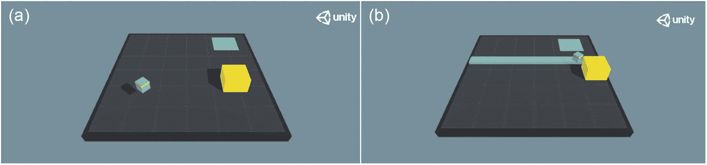

# 六、人工智能智能体的竞争网络

在最后一章中，我们研究了深度强化学习(RL)的不同部分，还研究了 Python API 构建定制模型的交互性。因为在 RL 中有各种各样的范例，所以除了课程学习之外，我们还将探索对抗学习和合作学习。既然我们已经有了算法的行动者批判类的概念，包括近似策略操作(PPO)，我们也将研究我们在上一章提到的非策略对应物:深度确定性策略梯度(DDPG)。本章的重要方面包括理解当课程学习与政策梯度变量一起应用时培训的显著改进。这允许智能体在新的动态环境中逐步学习。在本节中，我们将探索更多的机器学习(ML)智能体示例，以获得对抗性自我游戏的概述，其中智能体必须与对手竞争以获得奖励。在涵盖了基本的主题之后，我们还将看一些使用人工智能智能体的模拟，包括卡丁车游戏(我们在前一章提到过)。让我们从课程学习开始，然后我们将探索竞争网络。

## 课程学习

课程学习是一种逐渐增加学习环境复杂性的方法。在实际情况下，智能体在实现其目标后获得标量奖励，而在复杂环境下，智能体可能很难完成该任务。这种方法在每一步提供递增的奖励，以稳定智能体的学习。这可以被认为是一个智能体正在接受训练，每一步的难度都在增加。课程学习中考虑的两个主要政策包括:

*   设计一个度量标准来量化任务的难度，以便相应地对任务进行分类

*   在训练期间为智能体提供一系列难度不断增加的任务，并增加稳定性

依赖于不同政策的课程学习有几种变体。的一些变体包括:

*   **特定任务课程学习** **:** 这包括逐渐增加智能体要执行的任务的复杂性。从这种学习形式中得出的一些概括包括:
    *   导致更好概括的更清晰的例子

    *   逐步引入更难的例子来加快训练

如果我们使用级别复杂性的增量作为我们的主要度量，就需要量化级别的难度(复杂性)。这可以通过使用相对于另一个网络的最小损耗深度网络来解决，同时前者正在被训练。这允许智能体随着级别复杂性的增加，使用改进的网络顺序学习。在本节中，我们将探讨使用 ML 智能体的 PPO 策略的课程学习类别。特定任务的课程学习使用程序性内容生成，用于随机选择游戏中的特定关卡或环境。当我们在下一章的障碍塔挑战中学习 PCG 时，我们可以了解这一点，因为我们将理解关卡如何使用课程学习来增加环境的复杂性。我们还可以修改以前课程中关于不同深度 RL 算法的一些功能，使其成为特定于任务或特定于奖励的课程学习。因为我们在实现中使用了开放的健身房环境，比如 CartPole 和 MountainCar，所以我们无法修改固有的环境。但是，我们可以在每一步训练后增加或减少奖励。这具有修改深层网络的梯度收敛的间接效果。如果在训练的每一步都连续减少奖励，我们将智能体应用于奖励有效减少的恶劣条件；因此，A2C 等政策梯度算法中的梯度上升步长将会减小。相反的情况是，当奖励在每一步都增加时，这意味着一种渐进的课程学习方法。在 PPO-A2C 课程奖励 Specific.ipynb 笔记本中，我们可以看到两种情况下每次迭代训练的奖励对比；在第一种情况下，我们有算法的原始实现，而在第二种情况下，我们有一个增量奖励策略，在每次连续迭代后奖励都加倍。变化在于“agent.run”方法，我们将奖励乘以 2，然后传递给下一步，而不是直接将奖励分配给下一步。

```py
    action, prob=agent.act(state)
    state_1, reward, done,_=env.step(action)
    reward*=2
    score+=reward
    agent.memory(state, action, prob, reward)
    state=state_1

```

或者，也可以更改“折扣 _ 奖励”方法，通过提供增量折扣来定义下一步的奖励。结果也可以在 Tensorboard 训练的帮助下可视化。奖励的对比如图 [6-1](#Fig1) 所示。


图 6-1

奖励与原来的 PPO-A2C 对墨盒环境

第二种情况显示了报酬的增加，这也意味着政策函数梯度上升的增加，如图 [6-2](#Fig2) 所示。


图 6-2

PPO 奖励课程的奖励---- cart pole 的 A2C

现在为了更好的效果，损失函数(“trpo_ppo_penalty_loss”)内的超参数也可以改变。超参数的逐渐增加或减少可以影响智能体的学习，这类似于增加或减少任务的难度。通过改变“trpo_ppo_penalty_loss”中的超参数“prob”，我们可以通过 Tensorboard 可视化历元损失的变化，如图 [6-3](#Fig3) 所示。


图 6-3

通过逐渐改变超参数来改变历元损失

*   **教师学生课程学习:**在这种情况下，智能体通过 N 任务课程和适应性策略进行学习。这种课程学习形式的概念包括两种策略:
    *   损失函数在每次迭代学习前后都会发生变化，这有助于智能体优化每个级别的奖励。在这种情况下，损失函数的变化触发了回报信号的变化，这也改变了特定策略的梯度上升。

    *   在 PPO 等策略梯度算法的情况下，两个网络(教师和学生网络)之间的 KL 分歧有助于智能体在难度增加的方向上学习。当它适度地概括训练样本并稳定网络以允许智能体学习时，模型复杂性增加。

在这种形式的课程学习中，教师网络为学生网络提供了学习策略。然后，学生可以通过遵循老师的策略来学习复杂的任务。通常这导致更快的学习，但是由于损失函数的持续变化，学生可能会忘记之前的训练。简而言之，教师和学生都是深度学习网络，其中教师网络的任务是提出一组学生网络可以执行的复杂活动。这种形式的课程学习有离散和连续的空间变体。教师网络还可以使用 Epsilon-Greedy 和 Thompson 采样以及其他探索-开发算法来增加任务集的难度。在这种情况下，我们将借助“PPO-A2C 教师学生课程学习. ipynb”笔记本来研究教师学生的课程学习。我们将使用原始的 A2C 算法，这将是我们的学生网络，我们将有一个替代的 A2C 算法与变化的损失函数作为教师网络。由于学生网络与上一章相同，我们将重点关注教师网络。为此，我们有单独的数组来保存教师网络的奖励、标签、状态和概率，正如这里提到的。

```py
    self.teacher_labels=[]
    self.teacher_states=[]
    self.teacher_rewards=[]
    self.teacher_prob=[]
    self.Teacher_Actor=self.build_teacher_actor_model(True)
    self.Teacher_Critic=self.build_teacher_critic_model()

```

在下一节中，我们将研究“build_teacher_actor_model”方法，它类似于“build_actor_model”(学生网络)。这种情况下的不同之处在于，我们在两个不同损失函数之间交替的自变量中传递一个布尔值:削波 PPO 损失和 KL 散度 PPO 损失。我们还更改了该方法中的一些超参数值，即 epsilon、prob 和 clip_loss 值。代码段的其余部分类似于之前编写的 PPO 算法。改变损失函数的要求是优化回报信号，这提到如下:

```py
def build_teacher_actor_model(self, loss_fn):
    logdir= "logs/scalars/" + datetime.now().
    strftime("%Y%m%d-%H%M%S")
    tensorboard_callback=keras.callbacks.
    TensorBoard(log_dir=logdir)

    Actor=Sequential()
    Actor.add(Dense(64, input_dim=self.state_size,
    activation='relu', kernel_initializer="glorot_uniform"))
    Actor.add(Dense(64, activation="relu", kernel_initializer
    ='glorot_uniform'))
    Actor.add(Dense(self.action_size, activation="softmax"))
    def trpo_ppo_clip_loss(y_true, y_pred):
      entropy=2e-4
      clip_loss=0.3
      old_log= k.sum(y_true)
      print(old_log)
      pred_log=k.sum(y_pred)
      print(pred_log)
      r=pred_log/(old_log + 1e-8)
      advantage=pred_log-old_log
      p1=r*advantage
      p2=k.clip(r, min_value=
      1-clip_loss, max_value=1+clip_loss)*advantage
      prob=1e-3
      loss=-k.mean(k.minimum(p1, p2) +
      entropy*(-(prob*k.log(prob+1e-9))))
      return loss

    def trpo_ppo_penalty_loss(y_true, y_pred):
      entropy=2e-4
      clip_loss=0.3
      old_log= k.sum(y_true)
      print(old_log)
      pred_log=k.sum(y_pred)
      print(pred_log)
      r=pred_log/(old_log + 1e-8)
      kl_divergence= k.sum(old_log* k.log(old_log/pred_log))
      advantage=kl_divergence
      p1=r*advantage
      p2=k.clip(r, min_value=
      1-clip_loss, max_value=1+clip_loss)*advantage
      prob=1e-3
      loss=-k.mean(k.minimum(p1, p2) +
      entropy*(-(prob*k.log(prob+1e-9))))
      return loss

    if loss_fn==True:
      Actor.compile(optimizer=Adam
     (learning_rate=self.learning_rate),
      loss=trpo_ppo_penalty_loss)
      loss_fn=False
    else:
      Actor.compile(optimizer=Adam
      (learning_rate=self.learning_rate),
      loss=trpo_ppo_clip_loss)
      loss_fn=True
    return Actor

```

“教师记忆”方法用于对动作进行热编码，并存储奖励、标签和概率，类似于 A2C 的“记忆”方法。“教师 _ 行动”方法用于选择概率最高的行动，类似于原始 A2C 中的“行动”方法。我们有与教师网络中的 A2C 代码(学生网络)相似的方法，因为我们看到这些方法的前缀是“teacher_ <method name="">”在 main 方法中，在我们为学生和教师网络初始化状态、动作和奖励之后，我们分别训练它们。在来自教师网络的奖励超过学生网络的情况下，它分配奖励并在新策略中训练它。每个培训阶段的交替策略也优化了奖励信号。在没有教师网络监督的正常 A2C 算法中，张量图显示了历元损失(红色线段表示的值估计的误差减少)和回报(蓝色线段)，如图 [6-4](#Fig4) 所示。</method>


图 6-4

原 PPO-A2C 无教师学生课程学习

随着教师网络的到位，我们可以看到由于梯度上升和政策的变化，奖励也在增加。这种情况下的奖励可以用橙色段表示，如图 [6-5](#Fig5) 所示。


图 6-5

PPO-A2C 与师生课程学习

*   **Curriculum learning** **through self-play** **:** In this case, agents learn through self-play, which uses a similar teacher student type to curriculum learning, with certain changes. The difference from the teacher student framework is that here an adversarial approach is used for training the agent. We have two different networks. The task of the first network is to retrieve rewards from the environment by attaining a state S<sub>1</sub> from S<sub>0</sub> and set the initial benchmarks for attaining that reward. The second network has to reach the state S<sub>1</sub> in a shorter time span and retrieve the same rewards. Hence the two networks are in an adversarial positioning with respect to each other; the first network has to cover the maximum rewards and set a proper benchmark, while the second network has to attain that in a smaller time span as compared to the first one. In this case, we have two different methods that take place for the second network.
    *   在自播放模式中，第一网络将状态从 S <sub>0</sub> 改变到 S <sub>1</sub> ，然后第二网络具有将环境重置回初始状态 S <sub>0</sub> 的任务

    *   在目标任务模式中，如果第二网络在较短的时间跨度内达到特定的新状态，则第二网络接收奖励信号。

    在这种情况下，让我们将第一个网络表示为教师，将第二个网络表示为学生。教师网络的任务是提高学生网络的效率。为此，老师试图选择一个学生需要相当长时间才能完成的任务。当学生网络比老师更快地完成任务时，它会获得奖励，并且随着任务难度的增加，老师应该减少任务完成的时间戳之间的差异，以使学生能够学习。在自播放中，这是通过用与当前网络相同的参数集训练网络来实现的，以便提高第一网络的训练效率。现在让我们通过对 PPO 算法的一些修改来理解这个概念。我们将使用师生课程学习代码段作为我们的基础，并将只修改“main”方法。打开“PPO-A2C 自我游戏课程学习. ipynb”笔记本。在“main”方法中，我们有一个奖励列表，将为“reward_level”数组表示的三个时间步骤提供奖励。

```py
reward_level=[800.0,900.0,1000.0]

```

然后，我们遍历这个数组，并在完成新任务时向教师网络授予奖励。然后，学生网络有一个在更短时间内完成活动的任务，该任务由“min_time”变量控制。一旦学生完成了老师奖励的任务，这个特定级别的学生网络和过程继续。我们可以看到学生的价值观和老师的奖励形成了鲜明的对比。如果差别太大，这意味着学生网络无法获得足够的回报或比教师网络表现得更快。虽然这个系统的累积回报增加，但两个网络之间有足够的余量。这可以通过改变超参数以及定义替代损失函数来解决，该替代损失函数将在奖励之间的差异超过特定阈值的情况下惩罚教师网络。这是通过以下代码行实现的:

```py
if teacher_score>reward_level[l]:
           teacher_score=reward_level[l]
    #Train the Student to get that score in minimum time
           counter+=1
           if(counter<min_time):
            min_time=counter
      if(teacher_score<score):
          agent.rewards[-1]=teacher_score

```

图 [6-6](#Fig6) 提供了这种课程学习形式的纪元损失的张量板可视化。


图 6-6

PPO-A2C 与自我游戏课程学习

现在，如果我们将这个(橙色部分)与师生课程学习的时代损失(蓝色部分)进行比较，我们将看到后者与自我游戏相比具有较低的损失梯度，而自我游戏的回报更多。这是由于自我游戏中教师和学生网络的对抗性，这导致了在这种情况下更多的奖励。这也意味着比普通教师更快的收敛学生的课程学习。在初始阶段，由于学生网络无法与老师竞争，自我游戏具有更深的损失梯度，但随着级别的增加，损失梯度会降低。这由张量板图证明，如图 [6-7](#Fig7) 所示。


图 6-7

师生与自我游戏的时代缺失比较

对抗式自我游戏是学习的主要形式，我们将在本章中详细介绍，届时我们将分析 ML 智能体中的足球环境。除了这些主要的课程学习形式，还有其他的变体。


图 6-8

用于自动目标生成课程学习的目标 GAN

*   **自动目标生成** **:** 这种形式的课程学习依赖于生成的目标，并选择一个可行的目标，智能体可以用当前策略解决。这是课程学习的一个有趣方面，因为目标是随机生成的，供智能体实现。这是在对抗网络或 GAN 的帮助下实现的，我们在上一章的无模型 GAIL 算法的上下文中研究了它。因为我们知道 GAN 有一个相互竞争的生成器和一个鉴别器，所以我们可以使用这个概念来训练智能体。生成器的目标是产生智能体必须实现的中间目标。这些被称为“GOID”，意味着中等难度的目标。然后，生成器网络必须被训练以产生这样的中间目标，并且具有相关联的最小和最大值，分别由 R <sub>min</sub> 和 R <sub>max</sub> 表示，其控制智能体在 T 个时间步期间达到目标的最大和最小概率。鉴别器的作用是确定目标是否可以由智能体在提供的时间段内实现，并且还验证目标是否来自 GOID 集合。在这种情况下，可以使用策略梯度函数:

    π*(a<sub>t</sub>| s<sub>，(g)= arg max<sub>e【r<sup>)，</sup></sub></sub>

    其中 R <sup>g</sup> (π)是达到目标 g 的成功概率，a 和 s 分别是动作和状态。这种用 GAN 学习的原理叫做目标 GAN。目标 GAN 课程学习的生成器和鉴别器功能可定义如下:

    l<sub>goal gan</sub>(g)=()e<sub>z</sub>[(d(g(z)]-c)<sup>2</sup>

    l<sub>goal gan</sub>(d)=()e<sub>g</sub>[(d(g)-b)<sup>2</sup>+(1-y)<sub>g</sub>)(d(g)-a)<sup>2</sup>+()

    where a is the label for fake data, b is the label for real data, and c is the value that generator G wants discriminator D to believe for fake data. y<sub>g</sub> is a Boolean variable that signifies whether the goal is real (1) or not (0). There are three main components in this form of curriculum learning, which include :
    *   策略解算器:策略解算器得到一个目标 g，并在目标达到时收到一个奖励信号 R <sup>g</sup> (π)。

    *   鉴别器 D:这预测目标是否可由智能体实现，并且通常使用分类模型。

    *   生成器 G:生成器负责在可行的分数限制内生成目标 G。

    这种使用 GANs 作为内部架构的课程学习形式用于对难度逐渐增加的智能体进行系统培训。如图 [6-8](#Fig8) 所示。

我们将使用“AGG.ipynb ”,在自定义生成器和鉴别器模型的帮助下，确定目标 GAN 在课程学习中的效果。“build_generator_model”方法负责创建生成器网络，“build_discriminator_model”负责创建鉴别器网络。我们将研究生成器模型，它几乎类似于 critic 模型，只是内核大小和内核初始化器有所不同。

```py
def build_generator_model(self):

    logdir= "logs/scalars/" + datetime.now()
    .strftime("%Y%m%d-%H%M%S")
    tensorboard_callback=keras.callbacks.
    TensorBoard(log_dir=logdir)

    generator=Sequential()
    generator.add(Dense(128, input_dim=self.state_size,
    activation='relu', kernel_initializer="he_uniform"))
    generator.add(Dense(64, activation="relu",
    kernel_initializer='he_uniform'))
    generator.add(Dense(self.action_size,
        activation='softmax'))
    generator.compile(optimizer=Adam(learning_rate=
    self.learning_rate), loss="categorical_crossentropy")
    return generator

```

鉴别器网络具有带有正常密集神经网络模型架构的额外“LeakyReLU”。这有助于网络区分原始目标(奖励)和虚假目标(奖励)。这由以下几行表示:

```py
  def build_discriminator_model(self):

    logdir= "logs/scalars/" + datetime.now()
   .strftime("%Y%m%d-%H%M%S")
    tensorboard_callback=keras.callbacks.
    TensorBoard(log_dir=logdir)

    discriminator=Sequential()
    discriminator.add(Dense(128, input_dim=self.state_size,
    activation='relu', kernel_initializer="he_uniform"))
    discriminator.add(Dense(64, activation="relu",
    kernel_initializer='he_uniform'))
    discriminator.add(keras.layers.LeakyReLU(alpha=0.1))
    discriminator.add(Dense(self.action_size,
    activation='softmax'))
    discriminator.compile(optimizer=Adam(learning_rate=
    self.learning_rate), loss="categorical_crossentropy")
    return discriminator

```

下一部分是“训练”方法，我们使用来自原始状态的五个样本和发电机网络的标签来生成假样本。然后我们用这些样本训练生成器。类似地，我们用鉴别器模型训练整个状态和标签。演员评论家模型也存在，这是我们的情况下的政策解决者。这是通过以下代码行完成的:

```py
    labels=np.vstack(self.labels)
    rewards=np.vstack(self.rewards)
    rewards=self.discount_rewards(rewards)
    rewards=(rewards-np.mean(rewards))/np.std(rewards)
    labels*=-rewards
    x=np.squeeze(np.vstack([self.states]))
    y=np.squeeze(np.vstack([self.labels]))
    #tensorboard.set_model(self.Actor)
    #Assign a small part of the input to the generator
    print("Generator Sampling")
    x_g, y_g=np.squeeze(np.vstack([self.states[:5]]))
    ,np.squeeze(np.vstack
    ([self.labels[:5]]))
    self.generator.fit(x_g, y_g, callbacks=
    [tensorboard_callback])
    #Train Discriminator network
    print("Discriminator Sampling")
    self.discriminator.fit(x, y, callbacks
    =[tensorboard_callback])
    #Solver Network training
    print("A2C-PPO policy solver")
    self.Actor.fit(x, y, callbacks=[tensorboard_callback])

    self.Critic.train_on_batch(x, y)
    self.states, self.probs, self.labels, self.rewards=[],
   [],[],[]

```

如果我们在 PPO-A2C 策略上训练这个 GAN，那么我们清楚地看到了由生成器和鉴别器生成的回报以及策略解算器(智能体)的纪元损失。如图 [6-9](#Fig9) 所示。


图 6-9

甘课程学习目标的得分与时代损失

现在我们已经详细介绍了课程学习的不同方面，还有一些其他的方法，如基于技能的课程学习和通过升华的课程学习。

*   **基于技能的课程学习** **:** 这依赖于同时分析不同的任务，以确定哪些任务提供更好的奖励信号。这是在期望最大化或变异 EM 方法的帮助下完成的，并帮助智能体以无监督的方式学习。这也与 meta RL 有关，在 meta RL 中，智能体试图找出一个合适的策略来获得最佳回报。

*   **课程学习** **通过蒸馏** **:** 这涉及到利用迁移学习产生不同的技能，防止灾难性遗忘。渐进式神经网络和基于长短期记忆(LSTM)的记忆网络在训练智能体借助迁移学习方法进行学习方面发挥着重要作用。

### ML 智能体中的课程学习

我们将借助 Unity 中的墙跳 Unity 场景来考虑 ML agents 中的课程学习。在这种情况下，蓝色智能体的目标是通过穿越墙壁到达绿色目标区域。这堵墙可以在黄色方块的帮助下进行缩放，黄色方块充当一个平台，智能体可以在其上跳跃以到达墙另一侧的目标。基于墙的高度，智能体必须移动黄色块以缩放墙。如果智能体最初是在一个有大墙的环境中训练的，那么智能体使用 PPO 或 SAC 算法将花费更长的时间来计算。因此，课程学习的概念在这里起着重要的作用。墙的高度最初为 0，然后逐渐增加，这让智能体知道最初的绿色目标放在哪里。因此，对于连续迭代的训练，随着墙的高度增加，智能体必须使用黄色平台来跨越它。在初始阶段，没有墙，在这种情况下，智能体必须跳过黄色平台才能到达目标；随着高度的增加，墙的高度也有系统地增加。这将增加每个连续级别的累积奖励。两种训练水平的比较如图 [6-10](#Fig10) (a，b)所示。



图 6-10

(a & b)。改变墙壁高度以模拟课程学习

让我们首先通过脚本了解跳墙环境，然后我们将通过课程学习来训练这种环境。为此，我们将研究控制智能体移动的 WallJumpAgent C#脚本。和这个脚本一起，还有行为参数、模型覆盖器和决策请求器脚本，和我们前面的例子一样。蓝色智能体还使用 RayPerceptionSensorComponent3D 来收集观察结果。在第一部分中，有三种不同类型的神经网络大脑用于推理:无墙大脑、小墙大脑和大墙大脑。根据课程学习的墙的高度，每一个都单独使用。然后还有控制智能体、地面材料和跳跃属性的变量——高度、时间、开始位置和结束位置。这些变量还控制繁殖区域、繁殖区域的边界、碰撞器、目标区域和黄色平台。

```py
    int m_Configuration;
    public NNModel noWallBrain;
    public NNModel smallWallBrain;
    public NNModel bigWallBrain;

    public GameObject ground;
    public GameObject spawnArea;
    Bounds m_SpawnAreaBounds;

    public GameObject goal;
    public GameObject shortBlock;
    public GameObject wall;
    Rigidbody m_ShortBlockRb;
    Rigidbody m_AgentRb;
    Material m_GroundMaterial;
    Renderer m_GroundRenderer;
    WallJumpSettings m_WallJumpSettings;

    public float jumpingTime;
    public float jumpTime;

     public float fallingForce;
    public Collider[] hitGroundColliders = new Collider[3];
    Vector3 m_JumpTargetPos;
    Vector3 m_JumpStartingPos;

    EnvironmentParameters m_ResetParams;

```

“Initialize”方法用于初始化在上一步中声明的变量。这个方法也是我们之前的示例中使用的被覆盖的方法。

```py
        m_WallJumpSettings
        = FindObjectOfType<WallJumpSettings>();
        m_Configuration = Random.Range(0, 5);

        m_AgentRb = GetComponent<Rigidbody>();
        m_ShortBlockRb = shortBlock.GetComponent<Rigidbody>();
        m_SpawnAreaBounds
         = spawnArea.GetComponent<Collider>().bounds;
        m_GroundRenderer = ground.GetComponent<Renderer>();
        m_GroundMaterial = m_GroundRenderer.material;

        spawnArea.SetActive(false);

        m_ResetParams
       = Academy.Instance.EnvironmentParameters;

```

然后我们有了“Jump”方法，该方法用于以 jumpingTime float 变量表示的频率值触发跳转。这也允许蓝色智能体从其当前位置跳跃。

```py
    public void Jump()
    {
        jumpingTime = 0.2f;
        m_JumpStartingPos = m_AgentRb.position;
    }

```

“DoGroundCheck”方法用于根据智能体是否接地来评估智能体的当前位置。它是在对撞机的帮助下完成的。“物理学。OverlapBoxNonAlloc”方法用于在给定的盒子中存储碰撞器。该方法由布尔变量 smallCheck 控制，并根据该值确定智能体的碰撞体是否与平台、墙壁和地面碰撞。这通过检查不同标签的冲突来提供与当前环境相关的智能体信息。

```py
if (!smallCheck)
        {
            hitGroundColliders = new Collider[3];
            var o = gameObject;
            Physics.OverlapBoxNonAlloc(
                o.transform.position +
                new Vector3(0, -0.05f, 0),
                new Vector3(0.95f / 2f, 0.5f, 0.95f / 2f),
                hitGroundColliders,
                o.transform.rotation);
            var grounded = false;
            foreach (var col in hitGroundColliders)
            {
                if (col != null && col.transform !=
                   transform &&
                    (col.CompareTag("walkableSurface") ||
                     col.CompareTag("block") ||
                     col.CompareTag("wall")))
                {
                    grounded = true; //then we're grounded
                    break;
                }
            }
            return grounded;
        }
        else
        {
            RaycastHit hit;
            Physics.Raycast(transform.position
            + new Vector3(0, -0.05f, 0), -Vector3.up, out hit,
                1f);

            if (hit.collider != null &&
                (hit.collider.CompareTag("walkableSurface") ||
                 hit.collider.CompareTag("block") ||
                 hit.collider.CompareTag("wall"))
                && hit.normal.y > 0.95f)
            {
                return true;
            }

            return false;
        }

```

“MoveTowards”方法用于向目标方向移动智能体。这是在“矢量 3”的帮助下完成的。MoveTowards”方法，它根据智能体的速度和位置控制运动。

```py
void MoveTowards(
        Vector3 targetPos, Rigidbody rb,
        float targetVel, float maxVel)
    {
        var moveToPos = targetPos - rb.worldCenterOfMass;
        var velocityTarget = Time.fixedDeltaTime *
        targetVel * moveToPos;
        if (float.IsNaN(velocityTarget.x) == false)
        {
            rb.velocity = Vector3.MoveTowards(
                rb.velocity, velocityTarget, maxVel);
        }
    }

```

然后我们有一个被覆盖的方法“CollectObservations”，类似于我们之前的项目，它在射线传感器的帮助下收集观察结果。传感器检查智能体和目标之间的距离，以及离地面的距离，并使用 DoGroundCheck 检查环境中的碰撞体。

```py
public override void CollectObservations(VectorSensor sensor)
    {
        var agentPos = m_AgentRb.position
           - ground.transform.position;

        sensor.AddObservation(agentPos / 20f);
        sensor.AddObservation(DoGroundCheck(true) ? 1 : 0);
    }

```

“GetRandomSpawnPos”是一种由智能体和黄色平台使用的方法，用于在地面平台范围内的任何地方随机繁殖。这是借助于“随机”来完成的。范围”的方法。

```py
public Vector3 GetRandomSpawnPos()
    {
        var randomPosX = Random.
          Range(-m_SpawnAreaBounds.extents.x,
            m_SpawnAreaBounds.extents.x);
        var randomPosZ = Random.
          Range(-m_SpawnAreaBounds.extents.z,
            m_SpawnAreaBounds.extents.z);

        var randomSpawnPos = spawnArea.transform.position +
            new Vector3(randomPosX, 0.45f, randomPosZ);
        return randomSpawnPos;
    }

```

“移动智能体”方法用于通过分析来自射线传感器的向量观察空间来控制智能体的运动。它使用“DoGroundCheck”来验证当前位置和碰撞体，并根据观察数组，智能体可以向前、向上或向右移动。智能体使用“AddForce”方法触发特定方向的跳转。

```py
public void MoveAgent(float[] act)
    {
        AddReward(-0.0005f);
        var smallGrounded = DoGroundCheck(true);
        var largeGrounded = DoGroundCheck(false);

        var dirToGo = Vector3.zero;
        var rotateDir = Vector3.zero;
        var dirToGoForwardAction = (int)act[0];
        var rotateDirAction = (int)act[1];
        var dirToGoSideAction = (int)act[2];
        var jumpAction = (int)act[3];

        if (dirToGoForwardAction == 1)
            dirToGo = (largeGrounded ? 1f : 0.5f)
            * 1f * transform.forward;
        else if (dirToGoForwardAction == 2)
            dirToGo = (largeGrounded ? 1f : 0.5f)
           * -1f * transform.forward;
        if (rotateDirAction == 1)
            rotateDir = transform.up * -1f;
        else if (rotateDirAction == 2)
            rotateDir = transform.up * 1f;
        if (dirToGoSideAction == 1)
            dirToGo = (largeGrounded ? 1f : 0.5f)
                   * -0.6f * transform.right;
        else if (dirToGoSideAction == 2)
            dirToGo = (largeGrounded ? 1f : 0.5f)
                   * 0.6f * transform.right;
        if (jumpAction == 1)
            if ((jumpingTime <= 0f) && smallGrounded)
            {
                Jump();
            }

        transform.Rotate(rotateDir,
         Time.fixedDeltaTime * 300f);
        m_AgentRb.AddForce(dirToGo
          * m_WallJumpSettings.agentRunSpeed,
            ForceMode.VelocityChange);

        if (jumpingTime > 0f)
        {
            m_JumpTargetPos =
                new Vector3(m_AgentRb.position.x,
                    m_JumpStartingPos.
                 y + m_WallJumpSettings.agentJumpHeight,
                    m_AgentRb.position.z) + dirToGo;
            MoveTowards(m_JumpTargetPos,
             m_AgentRb, m_WallJumpSettings.agentJumpVelocity,
                m_WallJumpSettings.agentJumpVelocityMaxChange);
        }

        if (!(jumpingTime > 0f) && !largeGrounded)
        {
            m_AgentRb.AddForce(
                Vector3.down *
                fallingForce, ForceMode.Acceleration);
        }
        jumpingTime -= Time.fixedDeltaTime;
    }

```

“OnActionReceived”方法是一种被覆盖的方法，它使用光线投射(光线传感器)来提供观察空间。然后，它使用“SetReward”方法，在每次智能体无法达到目标时提供负奖励，并终止该集的训练。它还通过触发地面材料的变化来发出奖励阶段的信号。

```py
public override void OnActionReceived(float[] vectorAction)
    {
        MoveAgent(vectorAction);
        if ((!Physics.Raycast
           (m_AgentRb.position, Vector3.down, 20))
            || (!Physics.Raycast(m_ShortBlockRb.
             position, Vector3.down, 20)))
        {
            SetReward(-1f);
            EndEpisode();
            ResetBlock(m_ShortBlockRb);
            StartCoroutine(
                GoalScoredSwapGroundMaterial
               (m_WallJumpSettings.failMaterial, .5f));
        }
    }

```

“启发式”方法用于智能体的启发式控制。这依赖于启发式大脑，并且在没有使用训练过的推理模型或外部大脑时使用。

```py
public override void OnActionReceived(float[] vectorAction)
    {
        MoveAgent(vectorAction);
        if ((!Physics.Raycast
            (m_AgentRb.position, Vector3.down, 20))
            || (!Physics.Raycast(m_ShortBlockRb
                .position, Vector3.down, 20)))
        {
            SetReward(-1f);
            EndEpisode();
            ResetBlock(m_ShortBlockRb);
            StartCoroutine(
                GoalScoredSwapGroundMaterial
                (m_WallJumpSettings.failMaterial, .5f));
        }
    }

```

“OnTriggerStay”方法检查智能体是否达到了目标，然后它使用“SetReward”方法在智能体成功的情况下提供积极的奖励。智能体通过检查碰撞器是否有“goal”标记来实现这一点，如下面的代码段所述:

```py
void OnTriggerStay(Collider col)
    {
        if (col.gameObject.CompareTag("goal")
          && DoGroundCheck(true))
        {
            SetReward(1f);
            EndEpisode();
            StartCoroutine(
                GoalScoredSwapGroundMaterial
               (m_WallJumpSettings.goalScoredMaterial, 2));
        }
    }

```

“ResetBlock”方法用于在每一集训练开始时重置场景中黄色块的位置。

```py
void ResetBlock(Rigidbody blockRb)
    {
        blockRb.transform.position = GetRandomSpawnPos();
        blockRb.velocity = Vector3.zero;
        blockRb.angularVelocity = Vector3.zero;
    }

```

“OnEpisodeBegin”方法是一个被覆盖的方法，它使用“ResetBlock”方法重置智能体的位置、速度和方向。“FixedUpdate”方法控制实际的游戏逻辑，并调用“ConfigureAgent”方法，如下所示:

```py
public override void OnEpisodeBegin()
    {
        ResetBlock(m_ShortBlockRb);
        transform.localPosition = new Vector3(
            18 * (Random.value - 0.5f), 1, -12);
        m_Configuration = Random.Range(0, 5);
        m_AgentRb.velocity = default(Vector3);
    }

    void FixedUpdate()
    {
        if (m_Configuration != -1)
        {
            ConfigureAgent(m_Configuration);
            m_Configuration = -1;
        }
    }

```

“配置智能体”方法基于墙的高度控制要使用的推理神经网络，并且与课程学习部分相关联。如果“config”的值为 0，则暗示没有墙(高度为 0 的墙)，智能体使用 noWallBrain brain 进行推理。这是通过使用“SetModel”方法实现的。如果墙的高度是 1 个单位，那么智能体使用“smallWallBrain”作为推理大脑。对于大于 1 个单位的墙高值，智能体使用 bigWallBrain 进行推理。智能体在收到来自光线传感器的输入后，在 localScale 变量的帮助下计算墙的高度。这由以下代码行显示:

```py
void ConfigureAgent(int config)
    {
        var localScale = wall.transform.localScale;
        if (config == 0)
        {
            localScale = new Vector3(
                localScale.x,
                m_ResetParams.GetWithDefault("no_wall_height", 0),
                localScale.z);
            wall.transform.localScale = localScale;
            SetModel("SmallWallJump", noWallBrain);
        }
        else if (config == 1)
        {
            localScale = new Vector3(
                localScale.x,
                m_ResetParams.GetWithDefault("small_wall_height", 4),
                localScale.z);
            wall.transform.localScale = localScale;
            SetModel("SmallWallJump", smallWallBrain);
        }
        else
        {
            var min = m_ResetParams.GetWithDefault("big_wall_min_height", 8);
            var max = m_ResetParams.GetWithDefault("big_wall_max_height", 8);
            var height = min + Random.value * (max - min);
            localScale = new Vector3(
                localScale.x,
                height,
                localScale.z);
            wall.transform.localScale = localScale;
            SetModel("BigWallJump", bigWallBrain);
        }
    }

```

这是控制蓝色智能体的脚本，在这种情况下，我们可以看到，根据墙的高度，智能体会相应地推动黄色平台进行缩放。此外，根据墙的高度，智能体使用不同的推理大脑。还有一个关联的脚本 WallJumpSettings，它控制环境的不同属性，如地面材质颜色、速度、跳跃高度和智能体的跳跃速度。

```py
using UnityEngine;

public class WallJumpSettings : MonoBehaviour
{
    [Header("Specific to WallJump")]
    public float agentRunSpeed;
    public float agentJumpHeight;

    public Material goalScoredMaterial;

    public Material failMaterial;

    [HideInInspector]
    public float agentJumpVelocity = 777;
    [HideInInspector]
    public float agentJumpVelocityMaxChange = 10;

}

```

现在我们已经了解了在环境中控制智能体的脚本，在使用“mlagents-train”方法训练智能体之前，让我们了解另一个独特的脚本。

由于我们将使用课程学习来培训我们的智能体，因此我们必须使用不同的“yaml”脚本来控制超参数，以便系统地提高奖励级别和隔离墙的高度。这可以在 Config 文件夹内的 courses 文件夹中找到。在课程文件夹中，我们有 Wall_Jump.yaml 脚本。这里我们看到，我们有 BigWallJump 和 SmallWallJump 作为两种推理模式的课程学习参数。两者的测量值、min_lesson_length 和 signal_smoothing 相同。在课程学习的 BigWallJump 集合中，我们观察到奖励阈值从 0.1 增加到 0.3，然后增加到 0.5。这也是我们学习的特定于任务(奖励)的课程学习。此外，我们还有 big_wall_min_height，它以 2 个单位的步长从 0.0 逐渐增加到 8.0。我们有 big_wall_max_height，它决定了墙在特定剧集中应该限制的最大高度。在这种情况下，对于第一集，最大墙高是 4 个单位，而最小值是 0 个单位，并且这种模式随着奖励的增加而随着高度的增加而连续出现。

```py
BigWallJump:
  measure: progress
  thresholds: [0.1, 0.3, 0.5]
  min_lesson_length: 100
  signal_smoothing: true
  parameters:
    big_wall_min_height: [0.0, 4.0, 6.0, 8.0]
    big_wall_max_height: [4.0, 7.0, 8.0, 8.0]

```

在 SmallWallJump 的例子中，我们有每个等级的奖励阈值。这从 1.0 以 2 个单位的步长增加到 5.0。“小 _ 壁 _ 高度”也从 1.5 增加到 4.0 单位，步长为 0.5 单位。

```py
SmallWallJump:
  measure: progress
  thresholds: [0.1, 0.3, 0.5]
  min_lesson_length: 100
  signal_smoothing: true
  parameters:
    small_wall_height: [1.5, 2.0, 2.5, 4.0]

```

这是必须添加到我们的原始 trainer_config.yaml 文件(PPO-policy)中的脚本，用于在课程学习中培训智能体。PPO 网络的超参数和属性与前面的情况相同。现在，为了训练智能体，我们必须从 config 文件夹中编写以下命令:

```py
mlagents-learn trainer_config.yaml --curriculum=curricula/wall_jump.yaml --run-id=NewWallJump --train

```

概括一下这个语法:

```py
mlagents-learn <path to trainer_config.yaml> --curriculum=<path to curricula/wall_jump.yaml> --run-id=<new id> --train

```

在运行时，我们可以可视化培训，在这种情况下，我们将使用 BigWallJump 参数进行课程学习，如图 [6-11a](#Fig11) 所示。


图 6-11a

无墙跳墙的课程训练

在这种情况下，我们可以看到训练随着墙壁高度的增加而增加，如图 [6-11b](#Fig12) 所示。


图 6-11b

随墙高跳墙的课程训练

现在我们知道了如何在 Tensorboard 的帮助下可视化该训练，让我们重新编写启动 tensorboard 的命令，如下所示:

```py
tensorboard --logdir=summaries

```

这是从 config 文件夹运行的，从端口 6006 开始。然后，我们可以评估奖励(累积)、剧集长度和纪元损失。图 [6-12](#Fig13) 提供了使用课程学习的培训预览。


图 6-12

跳墙运动课程学习的张量板可视化

我们已经观察了如何在课程文件夹中的附加 yaml 文件的帮助下在 Unity 中触发课程学习。对于我们使用 ML 智能体创建的任何新的模拟或游戏，我们可以使用前面提到的相同模式为课程学习添加我们自己的一组 yaml 参数脚本。还有额外的课程学习脚本，以及足球和测试，可以阅读，以更好地理解。在下一节中，我们将重点关注另一个深度 RL 算法，DDPG，然后再继续讨论对抗性自我游戏和合作网络。

## 扩展的深度强化学习算法

### 深度确定性政策梯度

在这种情况下，我们将研究 DDPG 算法，这是一个政策外的演员评论家变种。该算法将用于连续动作空间的深度 Q 网络(DQN)与传统的行动者批评策略相结合。它与原始的 Q 学习算法密切相关，该算法使用贝尔曼更新，只是这仅发生在连续空间中。算法中连续性的需要来自于这样一个事实，即对于离散空间，计算最大 Q 值(奖励)是可行的。然而，在连续动作空间的情况下，在达到最大值之前需要进行不可计数的计算。我们可以从上一节回忆起，在最初的 DQN 算法中，有一个存储过去的动作/观察空间的重放缓冲器，以及一个权重不能改变的冻结的目标网络。同样的方法也适用于这里，但行动空间是连续的，这就是梯度进入图片。DDPG 框架有两个明显的特征:

*   **深度 Q 学习****:**DDPG 的这一部分依赖于传统的 DQN，它使用贝尔曼方程来计算 Q 值的误差。该误差被称为均方贝尔曼误差(MSBE)，是二次损失函数，算法必须通过梯度下降使其最小化。这些等式可以写成如下形式:

    Y(s，a，r，s**`**)= r+y max<sub>a</sub>Q<sub>θ</sub>(s**`**，a **`** )

    L(θ) = E <sub>θ</sub> [(Y(s，a，r，s**`**)-Q<sub>θ【T5(s，a)) <sup>2</sup> ，</sub>

    其中 y(γ)是勘探开发系数。这形成了 DDPG 算法的初始部分，并且由于该算法依赖于连续的动作空间，梯度通过二次损失函数的偏导数来计算。修改的损失函数可以表示为:

    l(θ)= e<sub>[(q<sub>(s，a)-(r+y(1-d)<sub>最大值 a</sub>(q<sub>(s，【a】)))】t8【2】</sub></sub></sub>

    其中(1-d)值决定了座席代表是处于训练过程的结束阶段还是非结束阶段。关于 Q 值的梯度计算可以通过使用偏导数来计算:

    √l(θ)/q(s，a)=√e<sub>[(q)<sub>(s，a)-(r+y(1-d)<sub>至</sub> (Q)】</sub></sub>

    从我们之前的 DQN 概念中，我们知道重放缓冲区和目标网络训练是非策略网络的两个最重要的特征。重放缓冲器允许 DDPG 算法在最近使用的样本和较旧的样本之间进行选择，以防止过拟合。因为在 DDPG，我们必须确定连续空间的最大 Q 值，这是在目标网络的帮助下完成的。目标网络被训练为最大化 Q <sub>θ</sub> (s `，a `)的值，并且这使用μ <sub>θ</sub> (s `)来表示。在许多情况下，会增加额外的噪声来提高效率。此外，经过训练的目标网络对二次 MSBE 损失函数进行处理，以更新 Q 值:

    Q <sub>θ</sub> (s `，a`) = Q <sub>θ</sub> (s，a) - α ∂L(θ)/∂Q <sub>θ</sub> (s，a)

    其中，α是算法的学习速率。

*   **策略网络** **:** 针对 DDPG 的策略涉及使用策略梯度算法来最大化策略的价值估计。这是基于梯度上升的策略优化技术的最简单形式，我们在前一章中研究过，可以表述为:

    <sub>【j(θ)=最大 e[q<sub>(s `，μ<sub>)]</sub></sub></sub>

这完成了这个非策略算法的数学方面。现在，我们将借助山地连续环境中的稳定基线来研究其实现的细节。在 Google Colab 中打开 DDPG _ 基线. ipynb Python 笔记本。由于大多数库和框架与前面的用例相似，我们将把注意力集中在核心实现上。我们从健身房环境中获得动作空间，然后我们对动作应用一个噪声(前面提到过)。这种噪音是为了增加 DQN 训练的稳定性，被称为 OrnsteinUhlenbeckActionNoise。然后，我们从基线调用 DDPG 策略，并使用动作和参数噪声传递所需的参数。这是通过以下代码行完成的:

```py
env = gym.make('MountainCarContinuous-v0')
# the noise objects for DDPG
n_actions = env.action_space.shape[-1]
param_noise = None
action_noise = OrnsteinUhlenbeckActionNoise(mean=np.zeros(n_actions), sigma=float(0.5) * np.ones(n_actions))

model = DDPG(MlpPolicy, env, verbose=1, param_noise=param_noise, action_noise=action_noise)
model.learn(total_timesteps=4000)
model.save("ddpg_mountain")

del model
model = DDPG.load("ddpg_mountain")

```

然后，我们运行一个循环，对智能体进行 4000 次迭代的 DDPG 策略培训，该模型预测每个培训阶段的回报。在“ipythondisplay”库的帮助下，训练的可视化也在屏幕上更新。

```py
obs = env.reset()
while True:
    action, _states = model.predict(obs)
    obs, rewards, dones, info = env.step(action)
    screen = env.render(mode='rgb_array')
    plt.imshow(screen)
    ipythondisplay.clear_output(wait=True)
    ipythondisplay.display(plt.gcf())

```

在运行时，我们将看到不同的属性，如参考 Q 平均值、部署 Q 平均值，以及训练集长度、持续时间、时期、步数、评论家和演员损失，如图 [6-13](#Fig14) 所示。


图 6-13

在山地连续环境中训练 DDPG 的输出

我们还可以看到汽车试图爬上悬崖去够旗子，如图 [6-14](#Fig15) 所示。


图 6-14

山地车训练可视化

这个算法是一个经典的非策略算法，也可以用于在 Unity ML 智能体中训练 Reacher 环境的情况。在这种情况下，我们可以使用算法的基线实现。正如我们在第 [3](3.html) 章中读到的关于不同环境的内容，Reacher 是一个复杂的机械臂模拟环境，如果机器人将手臂保持在绿色球形球内，就会获得奖励。解决这个问题的一些最好的实现需要 PPO 与 DDPG 的连续空间。由于 DDPG 采用行动者批评机制作为政策网络，PPO 在培训中提供了良好的稳定性。正如上一章提到的，我们可以使用 Python API 在 Unity ML 智能体上连接和运行我们的基线健身房模型来训练它们。这留给一个热心的读者去尝试用 DDPG 训练 Reacher 智能体。图 [6-15](#Fig16) 显示了与 DDPG 一起训练环境的预览。


图 6-15

有 PPO 的 Reacher 环境-DDPG 非政策培训

现在我们将简要地研究一下 DDPG 算法的一些变种。

### 孪生延迟 DDPG

这是 DDPG 算法的一个变体，它通过使用策略更新的限幅(类似于限幅 PPO)来改进 DDPG，并使用延迟的策略更新来防止它高估 Q 值。Twine-delayed DDPG (TD3)几乎与 DDPG 相似，但有一些改动:

*   **目标策略平滑** **:** 正如在 DDPG 的案例中提到的，我们有一个使用 MSBE 损耗作为度量的目标网络。这在 TD3 算法中通过削波添加到目标网络的噪声来修改。这被限制在范围 a <sub>低</sub> ≤ a ≤ a <sub>高</sub>内。在这种情况下，目标操作计算如下:

    a `( s `) = clip(μ<sub>θ</sub>(s `)+clip(ε，-c，c)，a <sub>低</sub>，a <sub>高</sub>)，

    其中(-c，c)是超参数。剪切因子在算法的正则化中起着重要的作用，并且消除了 DDPG 的缺点。DDPG 利用曲线上的尖锐点，这在许多情况下会给出脆弱和不稳定的回报。使用 TD3 平滑曲线在稳定曲线方面起着重要作用。

*   **限幅双 Q 学习:**该技术作为最小化目标，试图最小化来自双 DQN 中两个网络的 Q 值。我们有如下公式:

    R (y，s `，d)= r+y(1-d)min<sub>`</sub>(Q<sub>θ1</sub>(s`，a`)，Q <sub>θ2</sub> (s`，a`))，

    其中符号具有它们通常的含义。基于这个奖励值，两个 dqn 用它们相应的 MSBE 损失训练如下:

    l<sub>1</sub>(μ)= e<sub>[(q<sub>(s，a)-(r(y，s `，d)) <sup>2</sup></sub></sub>

    l<sub>2</sub>(μ)= e<sub><sub>[(q<sub><sub>(s，a) - R(y，s `，d)]<sup>2</sup></sub></sub></sub></sub>

    目标网络的较小 Q 值有助于防止高估并稳定训练。

*   **延迟策略控制** **:** TD3 以延迟的方式更新策略，也以策略梯度的基本最大化为核心函数:

    <sub>【j(θ)=最大 e[q<sub>(s `，μ<sub>)]</sub></sub></sub>

    建议在每两次 Q 函数(值)更新后更新策略。

这就完成了双延迟 DDPG 算法。这可以在 TD3-Baselines.ipynb 笔记本中可视化，其中包含算法的 OpenAI 实现。大部分代码段与 DDPG 相同，唯一的变化是算法的策略。

```py
n_actions = env.action_space.shape[-1]
action_noise = NormalActionNoise(mean=np.zeros(n_actions), sigma=0.1 * np.ones(n_actions))
model = TD3(MlpPolicy, env, action_noise=action_noise, verbose=1)
model.learn(total_timesteps=50000, log_interval=10)
model.save("td3_pendulum")

```

在这种情况下，我们使用 Pendulum 环境来训练该算法，如图 [6-16](#Fig17) 所示。


图 6-16

钟摆环境中的 TD3 训练

其他一些变体包括:

*   **分布式深度确定性策略梯度(D4PG)** **:** 这使用分布式批判作为核心功能。这允许使用优先化的经验重放对 DDPG 网络进行分布式训练。D4PG 使用多个分布式角色并行工作，并将数据输入同一个重放缓冲区。

*   **多智能体深度确定性策略梯度(MADDPG)** **:** 这是 DDPG 算法的多智能体版本，其中环境响应于在场景中工作的所有智能体而改变。这可以与多主体马尔可夫决策过程(MDP)相比较。在这种情况下，批评家从特定智能体的集中行动价值函数中学习。这可能会导致奖励功能的冲突和竞争环境。在这种情况下，每个智能体都有多个参与者来更新策略梯度。

我们已经学习了与策略上和策略外深度 RL 相关的大多数算法。DDPG 是连续向量空间的一种重要的非策略算法，可用于行为参数脚本中模式为连续类型的 ML 智能体。在下一节中，我们将关注对抗性的自我游戏和合作网络。

## 对抗性自我游戏和合作学习

### 对抗性自我游戏

这是训练智能体在动态环境中发挥作用的一个重要方面。除了环境中存在的障碍之外，还存在另一个智能体，其奖励信号相对于玩家智能体是对抗性的。这个敌对的智能体控制了玩家。当智能体也认为另一个智能体是环境的障碍时，使用对抗性自我游戏。自我游戏包括玩家智能体试图战胜自己过去的状态，这是对抗性游戏中的场景。敌对智能体迫使玩家智能体改变其策略，并获得比其先前状态更好的 Q 值估计。然而，在大多数情况下，难度水平应该得到适当的控制，以防止球员经纪人受到惩罚。这可以在网球环境的情况下观察到，其中玩家智能体必须与敌对智能体竞争以获得分数。根据对手的游戏级别，玩家智能体必须相应地调整其策略。在游戏开始时，如果提供了一个强有力的对手，那么玩家智能体可能无法进行有效的学习。相比之下，如果对手随着训练的进行而变弱，这可能会导致玩家智能体的学习不稳定。对上述两种情况使用相同的策略对玩家来说是有问题的，因为它可能不会学到很多东西。这使得对抗性游戏很难估计。如前所述，在自我游戏中，智能体试图通过改变策略来与过去的自己竞争，如果当前的自己比过去的自己更好，他就会得到奖励。智能体的这种提高只能来自游戏难度的增加，包括对手的实力。随着游戏的进展，课程学习在调节和控制难度方面扮演着重要的角色。在课程学习(特定任务)的帮助下，玩家利用对抗性自我游戏来系统地更新其策略以达到特定目标，如图 [6-17](#Fig18) 所示。


图 6-17

敌对自我游戏环境中的智能体

### 共同学习

合作网络用于多智能体环境中，在这种环境中，我们让特定组中的多个智能体与不同组中的敌对智能体竞争。组可以多于两个，在这种情况下，我们有一群智能体，他们有相同的政策和奖励估计，被训练来达到相同的目标。在对抗性游戏中，我们有两个或更多的深度 RL 神经网络，它们为了价值最大化而相互竞争。在合作游戏中，我们有两个或多个深度 RL 神经网络，它们在架构、策略和损失函数方面相似，并以相同的动机进行训练。然而，可以在合作智能体之间进行修改，以通过观察彼此来学习改变它们的策略。这是另一个重要的度量，其中一个智能体使用 A2C 的策略梯度技术，而另一个合作智能体可以使用盖尔模仿它。这种基于协作网络的智能体通常出现在基于群体的游戏中，例如足球。在足球环境中(两个球员)，我们有两个不同的队，每个队有两个球员。在特定球队的球员中，一个是守门员，另一个是前锋。这两个球员(智能体)必须相互合作才能击败对方球队，对方球队还包括一名守门员和一名前锋。这个环境制作精美，既展示了同一个团队的智能体之间的合作学习，也展示了不同团队的智能体之间的对抗自我游戏。图 [6-18](#Fig19) 显示了环境的预览。


图 6-18

足球环境中的对抗与合作学习

让我们在这一节详细了解足球环境。

### 对抗与合作学习的足球环境

我们可能玩过基于人工智能的足球或足球游戏，如国际足联，在那里我们看到智能人工智能智能体(球员)与我们一起玩，也与我们对抗。这是一个典型的例子，其中敌对和合作网络都发挥了重要作用。在 Unity 场景中，我们有两个不同的团队:蓝色和紫色。每个团队由两名有效智能体组成。这些智能体中的每一个都包含行为参数和模型覆盖器，以及附加到其上的决策请求者脚本。此外，我们还有 RayPerceptionSensorComponent3D 脚本，它控制智能体的离散观察空间。在这种情况下，我们将首先研究“AgentSoccer”脚本。在脚本的开始，我们有球队的类型— 0 和 1，分别代表蓝队和紫队。它还包含基于玩家在平台上的位置的玩家类型；如果智能体被安排在更靠近球门的位置，他就成了守门员，而在其他位置，他就成了前锋。

```py
public enum Team
    {
        Blue = 0,
        Purple = 1
    }

    public enum Position
    {
        Striker,
        Goalie,
        Generic
    }

```

然后我们有控制位置的不同变量，智能体的 ID，踢力，智能体的速度(横向，存在，向前)，和控制团队的参数，智能体的刚体。

```py
[HideInInspector]
    public Team team;
    float m_KickPower;
    int m_PlayerIndex;
    public SoccerFieldArea area;
    // The coefficient for the reward for colliding with a ball. Set using curriculum.
    float m_BallTouch;
    public Position position;

    const float k_Power = 2000f;
    float m_Existential;
    float m_LateralSpeed;
    float m_ForwardSpeed;

    [HideInInspector]
    public float timePenalty;

    [HideInInspector]
    public Rigidbody agentRb;
    SoccerSettings m_SoccerSettings;
    BehaviorParameters m_BehaviorParameters;
    Vector3 m_Transform;

    EnvironmentParameters m_ResetParams;

```

被覆盖的“Initialize”方法用于将不同的智能体分配给他们各自的团队，并分别分配他们的 id。根据智能体的位置，它被分配一个横向和向前的速度，我们可以看到守门员和前锋的不同值。它还指定刚体和智能体的最大角速度。

```py
m_Existential = 1f / MaxStep;
m_BehaviorParameters = gameObject.GetComponent
<BehaviorParameters>();
        if (m_BehaviorParameters.TeamId == (int)Team.Blue)
        {
            team = Team.Blue;
            m_Transform = new Vector3(transform.
            position.x - 4f, .5f, transform.position.z);
        }
        else
        {
            team = Team.Purple;
            m_Transform = new Vector3(transform.position.x
            + 4f, .5f, transform.position.z);
        }
        if (position == Position.Goalie)
        {
            m_LateralSpeed = 1.0f;
            m_ForwardSpeed = 1.0f;
        }
        else if (position == Position.Striker)
        {
            m_LateralSpeed = 0.3f;
            m_ForwardSpeed = 1.3f;
        }
        else
        {
            m_LateralSpeed = 0.3f;
            m_ForwardSpeed = 1.0f;
        }
        m_SoccerSettings = FindObjectOfType<SoccerSettings>();
        agentRb = GetComponent<Rigidbody>();
        agentRb.maxAngularVelocity = 500;

        var playerState = new PlayerState
        {
            agentRb = agentRb,
            startingPos = transform.position,
            agentScript = this,
        };
        area.playerStates.Add(playerState);
        m_PlayerIndex
         = area.playerStates.IndexOf(playerState);
        playerState.playerIndex = m_PlayerIndex;

        m_ResetParams
       = Academy.Instance.EnvironmentParameters;

```

“MoveAgent”方法在接收到射线观测值后移动智能体。根据接收到的动作，开关代码块沿着特定的轴(向前和横向运动)移动智能体，并允许它旋转。然后，它使用“AddForce”方法来触发智能体沿着特定方向的运动。

```py
         var dirToGo = Vector3.zero;
        var rotateDir = Vector3.zero;

        m_KickPower = 0f;

        var forwardAxis = (int)act[0];
        var rightAxis = (int)act[1];
        var rotateAxis = (int)act[2];

        switch (forwardAxis)
        {
            case 1:
                dirToGo = transform.forward * m_ForwardSpeed;
                m_KickPower = 1f;
                break;
            case 2:
                dirToGo = transform.forward * -m_ForwardSpeed;
                break;
        }

        switch (rightAxis)
        {
            case 1:
                dirToGo = transform.right * m_LateralSpeed;
                break;
            case 2:
                dirToGo = transform.right * -m_LateralSpeed;
                break;
        }

        switch (rotateAxis)
        {
            case 1:
                rotateDir = transform.up * -1f;
                break;
            case 2:
                rotateDir = transform.up * 1f;
                break;
        }

        transform.Rotate(rotateDir, Time.deltaTime * 100f);
        agentRb.AddForce(dirToGo
        * m_SoccerSettings.agentRunSpeed,
            ForceMode.VelocityChange);

```

被覆盖的“OnActionReceived”方法根据智能体的位置控制智能体收到的奖励。如果是守门员的位置，提供积极的奖励。如果位置是一个前锋，一个消极的存在奖励被提供。对于所有其他一般情况，向智能体提供少量负奖励。

```py
if (position == Position.Goalie)
        {
            // Existential bonus for Goalies.
            AddReward(m_Existential);
        }
        else if (position == Position.Striker)
        {
            // Existential penalty for Strikers
            AddReward(-m_Existential);
        }
        else
        {
            // Existential penalty cumulant for Generic
            timePenalty -= m_Existential;
        }
        MoveAgent(vectorAction);

```

我们有“启发式”方法，这是所有 ML 智能体脚本通用的，使用不同的键(W，A[前进]，S，D[旋转]，E，Q[右])来控制智能体。主要用作玩家大脑，也用于模仿学习。

```py
if (Input.GetKey(KeyCode.W))
        {
            actionsOut[0] = 1f;
        }
        if (Input.GetKey(KeyCode.S))
        {
            actionsOut[0] = 2f;
        }
        //rotate
        if (Input.GetKey(KeyCode.A))
        {
            actionsOut[2] = 1f;
        }
        if (Input.GetKey(KeyCode.D))
        {
            actionsOut[2] = 2f;
        }
        //right
        if (Input.GetKey(KeyCode.E))
        {
            actionsOut[1] = 1f;
        }
        if (Input.GetKey(KeyCode.Q))
        {
            actionsOut[1] = 2f;
        }

```

“OnCollisionEnter”方法对于在球进入对方球门时奖励智能体和球队很重要。如果在守门员位置，智能体踢球的力度也会增加。通常，智能体每进一个球可获得+1.0 的奖励，每丢一个球可获得-1.0 的负分数。在所有其他情况下，会收到-0.0003 单位的负分数。

```py
var force = k_Power * m_KickPower;
        if (position == Position.Goalie)
        {
            force = k_Power;
        }
        if (c.gameObject.CompareTag("ball"))
        {
            AddReward(.2f * m_BallTouch);
            var dir = c.contacts[0].point
                    - transform.position;
            dir = dir.normalized;
            c.gameObject.GetComponent<Rigidbody>
           ().AddForce(dir * force);
        }

```

“OnEpisodeBegin”方法用于重置智能体，以及场景中不同智能体的位置。它还重置了环境的速度、力度和惩罚时间。

```py
       timePenalty = 0;
        m_BallTouch = m_ResetParams.GetWithDefault
                   ("ball_touch", 0);
        if (team == Team.Purple)
        {
            transform.rotation = Quaternion.Euler
            (0f, -90f, 0f);
        }
        else
        {
            transform.rotation = Quaternion.Euler
            (0f, 90f, 0f);
        }
        transform.position = m_Transform;
        agentRb.velocity = Vector3.zero;
        agentRb.angularVelocity = Vector3.zero;
        SetResetParameters();

```

这就完成了智能体脚本。这个脚本被添加到两个队的两个球员中。对于特定的团队，会触发相应的属性(基于枚举)。还有其他一些脚本可以帮助这个脚本，比如 SoccerBallController 脚本。这控制了与不同游戏对象的碰撞，特别是球接触了什么游戏对象(蓝队球员、紫队球员、球门)

```py
void OnCollisionEnter(Collision col)
    {
        if (col.gameObject.CompareTag(purpleGoalTag))
          //ball touched purple goal
        {
            area.GoalTouched(AgentSoccer.Team.Blue);
        }
        if (col.gameObject.CompareTag(blueGoalTag))
          //ball touched blue goal
        {
            area.GoalTouched(AgentSoccer.Team.Purple);
        }
    }

```

足球场地控制着比赛的平台或场地。这包括在进球时点亮平台，以及为进球智能体增加+1.0 单位的奖励，负奖励归因于失球智能体。

```py
foreach (var ps in playerStates)
        {
            if (ps.agentScript.team == scoredTeam)
            {
                ps.agentScript.AddReward(1
                + ps.agentScript.timePenalty);
            }
            else
            {
                ps.agentScript.AddReward(-1);
            }
            ps.agentScript.EndEpisode();
           //all agents need to be reset

            if (goalTextUI)
            {
                StartCoroutine(ShowGoalUI());
            }
        }

```

在每集开始时，Socceragent 脚本中还会调用一个“ResetBall”方法。这会将球重置到平台的中间，并重置其旋转、缩放和方向。

```py
         ball.transform.position = ballStartingPos;
        ballRb.velocity = Vector3.zero;
        ballRb.angularVelocity = Vector3.zero;

        var ballScale
        = m_ResetParams.GetWithDefault("ball_scale", 0.015f);
        ballRb.transform.localScale = new Vector3
         (ballScale, ballScale, ballScale);

```

这种情况下的最后一个脚本是 SoccerSettings 脚本，它具有控制蓝队和紫队的材料、智能体的速度的变量，以及用于在训练期间随机化智能体的布尔变量。

```py
    public Material purpleMaterial;
    public Material blueMaterial;
    public bool randomizePlayersTeamForTraining = true;
    public float agentRunSpeed;

```

现在，我们将在基于 PPO 的课程学习的帮助下训练这一场景，以观察对抗性的自我游戏和合作学习在行动中的表现。

### 训练足球环境

我们将使用课程学习，因为对于任何团队(玩家智能体)来说，训练的难度应该逐渐增加。这允许两个团队的智能体学习使用稳定的策略来获得最佳回报。与上一节中训练跳墙环境类似，我们将使用以下代码从 Anaconda 提示符(命令提示符)终端启动训练过程:

```py
mlagents-learn trainer_config.yaml --curriculum=curricula/soccer.yaml –run-id=NewSoccer --train

```

在运行这个命令时，我们可以看到 PPO 算法使用了我们在前面章节中看到的超参数。此外，我们还使用了 Soccer.yaml 课程学习脚本中的参数。我们可以观察到奖励阈值从 0.05 开始增加了 0.05 个单位，并且 ball_touch 参数也从 1.0 逐渐减少到 0.0。这意味着随着难度的增加，特定团队中的智能体更难长时间保留球权。对于初始等级，智能体可以拥有球更长的时间跨度，随着等级的增加，这个时间减少。在实际的足球比赛中，可以观察到，如果两个队非常有竞争力，那么两个队的控球率都会降低。

```py
SoccerTwos:
  measure: progress
  thresholds: [0.05, 0.1]
  min_lesson_length: 100
  signal_smoothing: true
  parameters:
    ball_touch: [1.0, 0.5, 0.0]

```

训练场景如图 [6-19](#Fig20) 所示。


图 6-19

利用对抗-合作学习训练足球环境

### 张量板可视化

让我们也在 Tensorboard 中想象这个训练过程。我们将使用以下命令:

```py
tensorboard --logdir=summaries

```

这个命令需要从 ML 智能体存储库中的 config 文件夹中调用。我们可以直观地看到培训的累积回报、损失和其他参数。图 [6-20](#Fig21) 显示了张量板可视化的预览。


图 6-20

训练的张量板可视化

我们可以改变超参数来可视化它如何影响训练、损失和回报。经过相当一段时间的训练，我们可以看到智能体打得真的很好。我们已经看到了对抗(不同团队)和合作(相同团队)学习模式的效果如何影响智能体处理环境的能力。我们可以使用除 PPO 之外的不同算法，例如 SAC(或其他软 Q 学习技术)来查看训练过程中的差异。虽然网球环境是一个纯粹的基于竞争(对抗)学习的环境，但在足球环境中，我们既有对抗学习的味道，也有合作学习的味道。必须记住，我们还可以更改超参数属性，包括我们在上一章提到的 Model.py 脚本中存在的神经网络参数，并查看输出中的变化。值得注意的是，可以观察到改变循环网络属性(LSTM 网络属性)如何改变智能体的学习。

## 为迷你卡丁车游戏构建自主 AI 智能体

我们现在将使用 ML 智能体为微型卡丁车游戏构建一个自动驾驶智能体。我们也将对 PPO 政策进行培训，但也可以使用任何其他政策。在这个场景中，智能体必须沿着一条小跑道移动才能到达目的地。问题是赛道是弯曲的，智能体应该能够无缝地通过它。随着路径长度的增加，训练集长度也增加。由于我们将不使用视觉观察传感器(无 CNN)，我们将主要集中于使用光线感知传感器从智能体的当前位置、与目标的距离以及当前方向获得信息。为此我们将开启 Tinyagent Unity 场景。这是一个小型的赛车游戏，只有一个智能体在场。如果我们可以让智能体学习达到目标的轨迹，我们甚至可以扩展它，使用更多这样的竞争智能体(以及课程学习)来创建一个成熟的游戏。场景如图 [6-21](#Fig22) 所示。


图 6-21

微型智能体 Unity 场景中的自主智能体

我们有一个智能体(蓝色)在卡丁车里。智能体有一个 RayPerceptionSensorComponent3D 脚本用于收集观察结果。它还附带了行为参数、模型覆盖器和决策请求程序脚本。对于这种情况，我们使用离散分布，并让我们研究 Tinyagent 脚本。设计背后的主要思想是智能体计算目标和其当前位置之间的距离。对于沿着目标方向的任何移动，智能体被递增地奖励。如果智能体撞上了极点的边界，那么它会得到负回报。达到目标的时间也是决定奖励的一个因素——花费的时间越多，智能体接受的惩罚就越多。随着我们的进展，我们将看到我们计算了智能体(卡丁车)和目的地之间的方向和相对距离。如果智能体向与目标相反的方向移动，那么它也会得到一个负奖励。有了这个概念，我们来理解剧本。脚本包含变量，如游戏对象、目标和智能体相对于目标的当前位置。它还控制当地面与轨迹边界(红色)碰撞或到达目的地(绿色)时用于给地面着色的材质。为了计算相对距离，我们将使用三个变量:prev_spawn_dist、prev_target_dist 和 prev_dist。这些用于在每次训练开始时调整智能体的位置，也用于计算与目标的距离。

```py
    float rewards = 0f;
    public GameObject main_agent;
    public GameObject target;
    Transform target_pos;
    Transform agent_pos;
    Rigidbody agent_body;
    float prev_dist = 0f;
    float prev_spawn_dist = 0f;
    float prev_target_dist = 0f;
    public GameObject ground;
    public bool vectorObs;
    public Material green_material;
    public Material default_material;
    public Renderer ground_renderer;
    Vector3 previous_position = new Vector3
                               (28.88f, 1.9f, -34.5f);

```

然后我们有“初始化”被覆盖的方法，它初始化目标位置，卡丁车智能体位置分配它的刚体组件。

```py
        agent_pos = GetComponent<Transform>();
        target_pos = GetComponent<Transform>();
        agent_body = GetComponent<Rigidbody>();

```

然后，我们有“收集观测值”方法，用于收集离散向量观测值。它计算卡丁车和目的地之间的相对距离，并将其用作观测值。智能体的速度(卡丁车)也被作为一个观察。

```py
if (vectorObs == true)
        {
            var relative_position
            = target_pos.position - agent_pos.position;

            sensor.AddObservation(transform.
             InverseTransformDirection(agent_body.velocity));

            sensor.AddObservation(relative_position);
        }

```

然后我们有 MoveAgent 脚本，它根据从传感器接收到的观察结果来控制卡丁车的运动。由于智能体可以向前和向上移动，也可以沿着特定的轴旋转，我们在动作空间中总共有 6 个向量，对于直线运动(正向和负向)的每个 x 和 z 轴有 2 个向量，沿着旋转轴有 2 个向量。然后，我们使用 AddForce 组件向卡丁车智能体添加一个力。

```py
        var direction = Vector3.zero;
        var rotation = Vector3.zero;
        // var velocity = Vector3.zero;

        var action = Mathf.FloorToInt(acts[0]);
        switch (action)
        {
            case 1:
                direction = transform.forward * 1.0f;
                break;
            case 2:
                direction = transform.forward * (-1.0f);
                break;
            case 3:
                rotation = transform.up * 1.0f;
                break;
            case 4:
                rotation = transform.up * (-1.0f);
                break;

        }
        transform.Rotate(rotation, Time.deltaTime * 100f);

        agent_body.AddForce(direction * 0.1f, ForceMode.VelocityChange);

```

然后我们有“OnActionReceived”被覆盖的方法，它控制卡丁车从起始位置到目的地的距离。这是必需的，因为如果智能体的距离从起始位置开始增加，它将获得积分。对于每一个向目标前进的动作，智能体得到 0.009 个单位的奖励，当到达目标时，它得到 5 个单位的奖励。对于智能体没有到达目标附近的每个时间步长，它得到-0.005 个单位的负积分。为了防止智能体沿着 y 轴移动，卡丁车每倒下一次就增加-2 个单位的负奖励。我们可以根据我们的意愿创造更多这样的条件来改变环境奖励信号。

```py
      float dist_target = Vector3.Distance
      (agent_pos.position, target_pos.position);
      float dist_spawn = Vector3.Distance
     (new Vector3(2.88f, 2.35f, -43.5f), agent_pos.position);
      float dist_prev = Vector3.Distance
        (previous_position, agent_pos.position);

        // if (dist_target < 0.00005f)
        // {Debug.Log("Near Target");
        //     AddReward(5f);
        //     rewards += 5f;

        // }
        if (dist_prev > prev_dist)
        {
            Debug.Log("Going forward");
            AddReward(0.009f);
            rewards += 0.009f;

        }

        if (agent_pos.position.y < -0.5f
          || agent_pos.position.y > 5f)
        {
            Debug.Log("Going Down");
            AddReward(-2.0f);
            rewards -= 2.0f;
            reset();

        }

        // if (agent_pos.rotation.x != 0f
              || agent_pos.rotation.z != 0f)
        // {
        //     //agent_pos.rotation.x=0f;
        //     //agent_pos.rotation.z=0f;
        //     Debug.Log("Rotating");
        //     AddReward(-1.0f);
        //     rewards -= 1.0f;
        //     reset();

        // }

        AddReward(-0.005f);
        rewards += -0.005f;
        Debug.Log(rewards);
        //prev_dist_target = dist_target;
        //prev_dist_spawn = dist_spawn;
        //prev_dist = dist_prev;
        prev_spawn_dist = dist_spawn;
        prev_target_dist = dist_target;
        previous_position = agent_pos.position;

        moveAgent(vect);

```

“OnCollisionEnter”方法用于检查卡丁车是否与赛道边界发生碰撞或已到达目的地。对于前一种情况，负奖励为-0.5 个单位，该集被终止，这与赛车游戏中我们撞上边界并被淘汰的情况非常相似。对于后一种情况，我们再次收到 3 个单位的正奖励，背景颜色发生变化(绿色)，表明智能体已经达到目标。

```py
if (collision.gameObject.CompareTag("wall"))
        {
            Debug.Log("Collided with Wall");
            SetReward(-0.5f);
            rewards += -0.5f;
            Debug.Log(rewards);
            EndEpisode();
        }
        else if (collision.gameObject.CompareTag("target"))
        {
            Debug.Log("Reached Target");
            SetReward(3f);
            rewards += 3f;
            StartCoroutine(Lightupground());
            Debug.Log(rewards);
            //gameObject.SetActive(false);
            EndEpisode();
        }

```

然后我们有“OnEpisodeBegin”方法，它调用“Reset”方法在每集的开头重置场景。它将卡丁车再次置于起始位置，并重置其速度、角速度和旋转。

```py
        // var rotate_sample = Random.Range(0, 4);
        // var rotate_angle = 90f * rotate_sample;
        agent_pos.transform.Rotate(new Vector3(0f, 0f, 0f));

        //agent.Rotate(new Vector3(0f, -90f, 0f));
        agent_pos.position = new Vector3
          (28.88f, 1.9f, -33.5f);
        agent_body.velocity = Vector3.zero;
        agent_body.angularVelocity = Vector3.zero;

```

智能体脚本到此结束。我们已经创造了一个自主智能体，它将使用射线传感器来收集观察结果，以到达目标。现在我们必须训练这个特工。

### 用 PPO 策略训练小特工

我们将使用 PPO 的默认超参数来训练该智能体，但必须提到的是，在这种情况下，我们没有使用课程学习。读者可以按照前面的章节创建一个 yaml 脚本，通过课程学习(特定于任务)来训练这个智能体。由于这是一个极具挑战性的环境，这需要在 CPU 上进行几个小时(甚至几天)的培训。因此，建议通过创建一个控制卡丁车智能体开始位置的 yaml 脚本，用课程学习方法对此进行培训。在初始阶段，我们可以将智能体定位在更靠近目标的位置，这样它就在直接视线内，并且智能体可以获得奖励。对于连续级别的训练，可以通过将智能体远离目标位置来改变位置。我们使用命令:

```py
mlagents-learn --trainer_config.yaml --run-id=NewTinyAgent --train

```

调整超参数也可以找到影响智能体的不同特征参数。训练卡丁车智能体出现如图 [6-22](#Fig23) 所示。


图 6-22

在 ML 智能体中用 PPO 策略训练小智能体

### 可视化和未来工作

让我们在 Tensorboard 中想象这个训练。这可以通过使用以下命令来完成:

```py
tensorboard –logdir=summaries

```

该可视化提供了对卡丁车智能体的累积奖励和纪元损失的估计。典型的可视化如图 [6-23](#Fig24) 所示。


图 6-23

微小智能体的张量板可视化

这个项目是读者进一步开发的起点。该模板提供了构建自主 AI 智能体的示例，该智能体可以在环境中的特定地形中导航。如果我们在场景中放置其他几个这样的卡丁车智能体，同时使用 PPO/SAC 策略训练他们，我们就可以构建一个基于 AI 的赛车游戏。然而，训练这些智能体需要大量的时间(对于多个智能体可能需要几天)。我们还可以创建课程学习脚本，以便在多智能体卡丁车游戏中包含对抗性组件。等所有的智能体都训练好了，我们就可以和那些训练好的智能体对战，看谁先来。

## 摘要

这就完成了对课程学习和对抗学习的不同方面以及创建模拟和游戏的描述性投影的章节。总结一下:

*   我们研究了课程学习及其不同的分支，包括特定任务学习、师生课程学习以及使用目标 GAN 算法的自动目标生成。

*   然后，在基于 PPO 的课程学习的帮助下，我们可视化了在 ML 智能体中训练跳墙环境的步骤。

*   下一节基于扩展的深度 RL 算法，包括非策略 DDPG 算法。我们还介绍了 DDPG 的变体，包括 TD3、D4P、G 和 MADDPG 算法。我们使用 OpenAI Gym 稳定基线实现算法来训练环境。

*   接下来，我们学习了对抗性自我游戏和合作学习，这在基于多主体的游戏和模拟环境中非常重要。我们看到了两种学习形式之间的差异，也理解了自我游戏的重要性。然后，我们使用足球环境来可视化这个过程，并使用 PPO 策略来训练它。

*   最后一部分是基于为微型卡丁车游戏构建一个自主的 AI 智能体。智能体必须从一个给定的起始位置到达目标，而不与轨迹边界发生碰撞。我们用 ML 智能体的 PPO 策略训练这个智能体，并用 Tensorboard 可视化训练过程。在用这个模板构建更加自主的基于智能体的赛车游戏方面还有更大的发展空间。

在下一章和最后一章中，我们将重点关注其他算法、Unity Technologies 的某些案例研究，以及深度 RL 的不同平台。