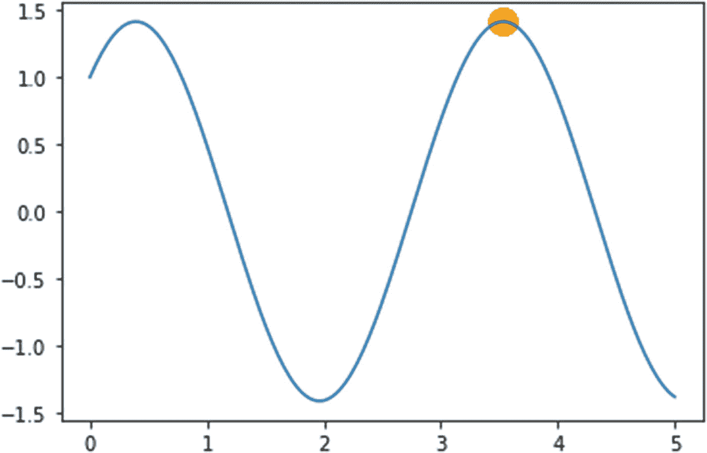

# 7.ML 代理案例研究

在这个阶段，我们已经获得了相当多的关于 ML 代理工具包的灵活性的知识。我们还学习了与深度 RL 相关的不同复杂算法。如果我们分析，我们可以想象任何 RL 算法的主要思想是提供一组决策，代理可以遵循这些决策来实现特定的目标。虽然我们涵盖了大多数深度学习算法，但有一组算法没有遵循反向传播和梯度上升/下降的传统方法。在这一章中，我们将探索进化算法，它已经在实践中有相当长的一段时间了。这些算法遵循达尔文主义的原则——只有最适合的后代才能存活下来产生下一代。我们还将研究最著名的案例《Unity ML 特工:障碍塔挑战》。这项挑战是由 Unity Technologies 创建的，旨在通过提供“具有挑战性的代理性能新基准”来帮助促进人工智能社区的研究。障碍塔是一个程序生成的环境，代理必须在计算机视觉、移动和归纳的帮助下解决。代理的目标是通过到达每一层的楼梯台阶来到达连续的楼层。每一层在谜题、布局和视觉外观方面都有其独特的挑战，并形成了一个适当的环境，传统的 RL 算法通常无法使代理进一步发展。我们还将关注由 Unity 组织的 Unity ML 代理挑战赛。由于这些都是案例研究，我们将简要探讨其算法经过性能基准测试的参与者所遵循的建议和步骤。我们还将探索深度学习的其他平台，即谷歌多巴胺平台。同样在这一章中，我们将更多地关注我们在这些挑战中学到的算法的适用性。

## 进化算法

在这本书里，我们学习了不同的复杂算法，这些算法使代理能够做出决定。我们已经研究了广泛需要深度学习和神经网络的算法。在这一节中，我们将研究一组不同的算法，它们使用自然进化的生物学概念。纵观人类进化史，我们已经看到基因发挥了重要作用。从尼安德特人到智人，这种转变是由于我们的 DNA 不断变化，其中包含等位基因(基因)。DNA 是一种包含双螺旋方向(沃森和克里克模型)的两条多核苷酸链的分子，包含腺嘌呤、胞嘧啶、胸腺嘧啶和鸟嘌呤碱基。人类生殖是在我们的系统中转化、分裂和重组这些 DNA 链的过程，这些 DNA 链固有地改变或突变下一代后代的基因。在有性生殖生物中，通过减数分裂过程发生细胞分裂。在这个八步程序中，染色体(基因的基本部分)经历几次分裂和组合，以产生新的染色体排列，并转移到下一代。这个过程中最重要的两个阶段是染色体的交叉和染色体的突变。染色体新组合(突变染色体)的生存能力取决于达尔文提出的自然选择理论。根据达尔文的理论，最适的后代生存下来，为下一代生产更多的后代。将达尔文的这一理论(自然选择原理)与染色体转换步骤相结合，进化算法就出现了。进化算法集是算法的集合，这些算法被提议为每一代生成更强的样本以完成给定的任务。特定后代的适应度取决于其优化任务的得分——也就是说，新的后代在多大程度上比旧的后代表现得更好。这些任务可以是优化一个数学函数，或者匹配一个模式，或者甚至是让一个代理做出一个能使返回的价值最大化的决策。进化算法与强化学习的结合产生了大量的算法，这些算法通常被称为进化策略。大多数情况下，这些算法是随机化的，并且不像传统的深度 RL 算法那样依赖于神经网络或反向传播来进行权重更新。然而，这些可以扩展为包含神经网络，用于在梯度下降优化器的帮助下，通过损失函数来训练交叉和变异步骤。让我们首先形式化进化算法的步骤，然后为了更好地理解，我们将看看这些算法的两种最简单的形式。

以下是进化算法的步骤。

*   **初始化** **:** 这是算法的第一步，初始群体(样本)与染色体组(可能的变量)一起被初始化，染色体组可以包括用于模式匹配的字符、用于优化函数的浮点数或整数等等。这也包含目标基因组，它是要求达到的优化过程的目标值。

*   **选择** **:** 这个过程是根据一定的逻辑从新一代中选择最适合的后代。根据适应度，选择过程可以使新的后代交配，也可以使其变异。

*   **交叉** **:** 这个过程来源于将染色体的不同部分进行分裂，并在不同的位置进行重组，有效地互换不同位置的基因序列。随着新的序列组合的产生，交换导致突变。类似地，在我们的上下文中，交叉是使用随机函数来创建子代解决方案的新组合。

*   **变异** **:** 新的后代群体随后进行变异，这同样由随机函数控制。随机函数基于交叉解变异部分解，以优化目标值。这导致了人口的变化。

*   **终止** **:** 一旦达到目标函数或值，过程终止，因为在这种情况下，我们已经产生了最适合的一代。

这一过程可以在图 [7-1](#Fig1) 中看到。


图 7-1

进化算法步骤

在这一节中，我们将关注两种不同的算法:遗传算法和进化策略。

### 遗传算法

进化算法的最原始形式是遗传算法。顾名思义，它遵循上一节提到的进化算法的传统管道，包括变异和选择。该算法的目的是通过调整每次训练随机生成的结果来优化函数。训练的片断被称为一代，这样的片断的结果被称为后代。我们将建立一个遗传算法，试图通过执行变异和选择来匹配一个短语。打开 Genetic Algorithm.ipynb 笔记本。在我们的例子中，我们有一个目标字符串作为算法必须匹配的短语。初始种群是通过从“基因库”(字符集)中选择字符随机产生的。

最初，我们从声明类“GA”并包含“parameters”方法开始。这控制了变量，如人口，这意味着在每一代产生的后代字符串的长度；染色体，它是基因库或用于构建群体的所有字符(字母、数字、标点符号、空格和特殊字符)；和 target_genome，它指定要匹配的目标字符串。

```py
def parameters(self,population_size,chromosomes,
target_genome):
    self.population=population_size
    self.chromosomes=chromosomes
    self.target_genome=target_genome

```

“突变”方法用于从称为基因库的字符集中随机选择特定的字符。实际上，突变是随机改变基因组序列中特定基因的过程，在这种情况下，该方法从集合中随机选择特定的字符。

```py
def mutation(self,chromosomes):
    gene_chromosome= random.choice(self.chromosomes)
    return gene_chromosome

```

“创建序列”方法使用“突变”方法为一代中的每个新后代创建基因组序列。它返回字符序列的列表。

```py
def create_sequence(self,target_genome,chromosomes):
    sequence=[]
    for _ in range(len(self.target_genome)):
      sequence.append(self.mutation(self.chromosomes))
    return sequence

```

然后我们有了“后代”方法，这是交配期间基因交叉的简化版本。我们将两个不同的父字符串或字符序列作为父基因组，根据随机函数的输出，我们要么将父基因组夹在子基因组上，要么使用“突变”方法对其进行突变。“随机”方法提供了一个输出概率，如果这个值介于 0 和 0.35 之间，则子基因组取第一个父基因组；如果在 0.35 到 0.70 之间，子基因组取第二个父基因组。对于 0.70 到 1.0 之间的概率，我们用突变算法为孩子生成一个新的基因组序列。

```py
def offspring(self,seq1,seq2):
    child_sequence=[]
    for s1,s2 in zip(seq1,seq2):
      if(random.random()<0.35):
        child_sequence.append(s1)
      elif(random.random()<0.7):
        child_sequence.append(s2)
      else:
        child_sequence.append(self.mutation(self.chromosomes))
    return child_sequence

```

“适应度”方法计算每个后代的递减适应度值。因为我们必须匹配短语或字符串，所以子基因组序列的适合度被计算为与目标基因组序列不匹配的字符数。随着训练的进行，我们会看到适合度会降低，这意味着后代序列(字符串)几乎或完全匹配目标序列(字符串)。

```py
def fitness(self,child_seq,target):
    fitness=0
    for i,j in zip(child_seq,target):
      if i!=j:
        fitness+=1
    return fitness

```

我们有初始化类的“main”方法。我们指定一个 100 个随机创建的基因组的初始群体大小。目标基因组序列是短语“遗传算法”，算法必须匹配它。然后我们有一个“while”循环，只要没有达到目标基因组，它就一直运行。在内部，我们根据适应值对新一代子代序列进行排序，并将其中的 10%(最适应的子代)用于下一代。剩下的 90%的种群使用“后代”方法进行交配(50-50 的比例)。该过程借助于以下代码行来完成:

```py
if __name__=='__main__':
  ga=GA()
  gene_pool='''abcdefghijklmnopqrstuvwxyzABCDEFGHIJKLMNOPQRS
  TUVWXYZ 1234567890, .-;:_!"#%&/()=?@${[]}'''
  target_gene='Genetic Algorithm'
  ga.parameters(100,gene_pool,target_gene)
  generation=0
  gene_match=False
  fitness_array=[]
  gen_array=[]
  pop=[]
  for i in range(ga.population):
    ind_gene=ga.create_sequence(ga.chromosomes,
    ga.target_genome)
    pop.append(ind_gene)

  while not gene_match:
    pop = sorted(pop, key = lambda x:ga.fitness(x,
    ga.target_genome))
    z=pop[0]
    if ga.fitness(z,ga.target_genome) <= 0 :
          gene_match = True
          break
    new_generation=[]
    sample=int((10*ga.population)/100)
    new_generation.extend(pop[:sample])
    mate_sample=int((90*ga.population)/100)

    for j in range(mate_sample):
      parent1=random.choice(pop[:50])
      parent2=random.choice(pop[:50])
      child=ga.offspring(parent1,parent2)
      new_generation.append(child)
    pop=new_generation
    w=ga.fitness(pop[0],ga.target_genome)
    fitness_array.append(w)
    gen_array.append(generation)
    print("Generation: {}\tString: {}\tFitness:
    {}". format(generation, "".join(pop[0]),w))
    generation += 1

```

然后，我们使用“matplotlib”库来可视化新一代的健身得分的下降趋势。必须提到的是，在这种情况下，我们认为最适合的是具有最小适合度分数的那些——也就是说，几乎完全匹配目标基因组或短语。然而，这个逻辑也可以反过来，我们可以根据自己的需要最大化或最小化。

```py
  plt.plot(gen_array,fitness_array)
  plt.title('Genetic Fitness Curve')
  plt.xlabel('Generations')
  plt.ylabel('Fitness')
  plt.show()

```

在运行时，我们可以看到算法产生的代和相应的适应度分数，如图 [7-2](#Fig2) 所示。


图 7-2

遗传算法中的适应度与世代曲线

算法中的参数，如 target_genome、种群大小和产生新世代的百分比，也可以改变，以分析每个参数对训练的影响。

### 进化策略

这是另一套算法，广泛依赖交叉和变异步骤来产生新的子代。在遗传算法的例子中，我们试图用基因库中的值来匹配一个短语，在我们的例子中，基因库是 ASCII 字符集的一个子集。如果我们必须用遗传算法优化一个给定的数学函数，我们将使用二进制集{0，1}来生成合适的后代。在 ES 的情况下，对于同样的问题，我们将使用实数来产生新的世代。ES 是一组确定性算法，基于特定世代样本的某种概率分布。由于这些算法的确定性，可以避免依赖梯度计算来最大化或最小化函数。最简单的形式包括简单的高斯进化策略，在我们开始讨论其实现细节之前，让我们总结一下 es 的步骤。

我们必须使用参数集θ将给定函数 f(x)优化为优化变量 p <sub>θ</sub> (x)。需要采取以下步骤:

*   生成初始种群 D = {(x <sub>i</sub> ，f(x<sub>I</sub>)}，其中 x <sub>i</sub> ~ p <sub>θ</sub> (x)

*   评估 D 的适合度

*   使用达尔文的最佳匹配策略选择一个子代子集来更新θ并产生下一代子代。

这个集合中有各种算法，我们将实现高斯进化策略。

#### 高斯进化策略

我们提到过 ES 中的随机性是由分布引起的。当我们在变异和后代生成过程中应用高斯核时，我们创建了这个策略。我们用均值μ和标准差σ创建一个正态分布，由θ跟踪，如下所示:

θ = (μ，σ)，而 p <sub>θ</sub> (x) ~ N(μ，σ <sup>2</sup> I) = μ + σN(0，I)

其中 N(μ，σ <sup>2</sup> I)为正态分布。该过程的步骤可以在数学上简化如下:

*   **初始化:**初始化θ= θ <sub>0</sub> ，计数器 t=0

*   **后代生成:**通过使用交叉和变异，我们使用以下形式创建下一组群体:

d=【x】<sup>【t+1】</sup>| x<sup>【t+1】</sup>=μ<sup>+σ<sup>和</sup></sup>

*   **适者生存:**根据适应度得分从新种群中抽取最精英的后代。设λ为后代中最适一代的样本:

D <sup>(t+1)</sup> <sub>【精英】</sub>=【x】<sub>【I】</sub><sup>【t+1】</sup>| x<sub>【I】</sub>，λ }

*   **更新μ和θ:** 使用最合适的后代集更新平均值和标准差:

ο<sup>(t+1)</sup>=平均值(D <sup>(t+1)</sup> <sub>精英</sub>=(1/λ)(<sub>I = 1-什么λ</sub> x <sub>i</sub> <sup>(t+1)</sup>

ψ<sup>(t+1)2</sup>= var(d<sup>(t+1)</sup><sub>精英</sub>=(1/λ)(<sub>I = 1-什么λ</sub>x<sub>I</sub>T10【t+1】<sup>)<sup>2</sup></sup>

现在我们将创建该算法的简化版本，用于查找曲线中的最大值。在我们的例子中，我们将使用一个一般的叠加谐振子作为我们的函数，尽管我们可以根据需要改变函数。打开 Evolutionary Algorithm.ipynb 笔记本。我们创建类“EA”并声明“parameters”方法，该方法控制“chrom_size”(由于我们要求方程的最大浮点值，所以为 1)；“chrom_bound”，它指定查找最大值的范围；“世代”，它表示要产生的世代数；“人口”，控制每一代的人口规模；“n _ 后代”，控制产生的后代数量；和一个布尔变量“突变”，它控制突变是否会发生。

```py
def parameters(self,chrom_size,chrom_bound,n_generations,
population_size,
n_offspring,mutation):
    self.chrom_size=chrom_size
    self.chrom_bound=chrom_bound
    self.generations=n_generations
    self.population=population_size
    self.n_offspring=n_offspring
    self.mutation=mutation

```

然后，我们有方法“谐波”，“sigmoid”和“函数”，这是我们希望在给定范围内优化(最大化)的不同函数。这些是以“chrom_bound”变量为界的实平面中的正规代数函数。在我们的例子中，我们将使用“谐波”方法:

```py
def sigmoid(self,x):
    return 1/(1+np.exp(-x))
  def function(self,x):
    return 2*x*x - np.cos(2*x)
  def harmonic(self,x):
    return np.cos(2*x) + np.sin(2*x)

```

“fitness”方法用于将输入展平到一个列表中，以便以后“survival _ of _ fittest”方法可以使用它。向其添加 1e-3 的小偏差以避免 0:

```py
def fitness(self,z):
    return z.flatten() + 1e-3

```

“后代”方法用于让两个父母交配产生一个孩子，并执行交叉和变异(如果“变异”设置为真)。我们创建一个字典，其中包含子代编号及其对应的染色体(浮点值)。群体中的每个有机体由一个值组成，并产生包含另一个浮点值的类似后代，随着训练的进行，后代试图产生函数的最大浮点值。字典为每个后代保留浮点值或染色体的轨迹。在交叉方法中，随机选取两个父代(每个父代都包含一个浮点值)，并生成一个新的子代。因为我们使用了突变，所以我们还创建了一个数组，其中包含每个后代的突变浮点值(随机化的)。然后在更新突变基因时，我们使用平均值为 0.2 的正态分布。最后，我们返回新生成的包含自身染色体(浮点)的后代。

```py
def offspring(self,population,n_offspring):

    children=dict({"chromosome":np.zeros((n_offspring,
    self.chrom_size))})
    if self.mutation==True:
      children['mutate']=np.zeros_like(children['chromosome'])

      for i,j in zip(children['chromosome'],
      children['mutate']):
        sample1,sample2=np.random.choice
       (np.arange(self.population),size=2)
        crossover=np.random.randint
       (0,2,self.chrom_size,dtype=np.bool)
        i[crossover]=population['chromosome']
                     [sample1,crossover]
        i[~crossover]=population['chromosome'] 

                     [sample2,~crossover]
        j[crossover]=population['mutate']
                     [sample1,crossover]
        j[~crossover]=population['mutate']
                     [sample2,~crossover]
        j[:]=np.maximum((j + np.random.rand(*j.shape)-0.2),0)
        i+=j*np.random.rand(*i.shape)
        i[:]=np.clip(i,*self.chrom_bound)
      return children

```

然后我们有“适者生存”的方法，在这种情况下，我们也使用变异数组。我们堆叠包含浮点值(染色体)和变异输出值(浮点)的字典。然后我们展平这个容器，并将其传递给“harmonic”函数来生成浮点值。然后对结果输出进行排序，并将最高值传递给下一代。这可以用下面几行来说明:

```py
def survival_of_fittest(self,pop, kids):
    if self.mutation==False:
      pass
    for key in ['chromosome', 'mutate']:
        pop[key] = np.vstack((pop[key], kids[key]))

    fit = self.fitness(self.harmonic(pop['chromosome']))

    # calculate global fitness
    idx = np.arange(pop['chromosome'].shape[0])
    good_idx = idx[fit.argsort()][-self.population:]
    for key in ['chromosome', 'mutate']:
        pop[key] = pop[key][good_idx]
    #print(pop)
    return pop

```

在“main”方法中，我们初始化参数的值。我们提供了一个界限–[ 0，5]来确定函数的最大值(“chrom_size”)，群体大小为 100(“群体”)，有 200 代(“代”)，每代有 50 个后代(“n _ 后代”)，其中“突变”设置为“真”。我们用正态分布初始化总体。对于每一轮训练，我们使用“后代”方法创建一个新的后代，并基于“适者生存”方法的输出生成一个新的种群。使用“matplotlib”创建的散点图用于显示函数最大值的最终位置。

```py
if __name__=='__main__':
  ea=EA()
  ea.parameters(1,[0,5],200,100,50,True)
  population=dict(chromosome=5*np.random.rand
 (1,ea.chrom_size).repeat(ea.population,axis=0),
  mutate=np.random.rand(ea.population,ea.chrom_size))
  ea.plot()
  for m in range(ea.generations):

    child = ea.offspring(population, ea.n_offspring)
    #print(child)
    population = ea.survival_of_fittest(population, child)
    print("Generation",m)
    #print("Population",population)
  scatter_pl = plt.scatter(population['chromosome']
  , ea.harmonic(population['chromosome']), s=200,
  lw=0, c="orange", alpha=0.5); plt.pause(0.05)

  plt.show()

```

在运行这个程序时，我们可以看到最大值被一个黄橙色的辉光指出，如图 [7-3](#Fig3) 所示。由于我们使用叠加的正弦曲线，最大值可以在范围[0，5]内的两个峰值中的任何一个。该算法显示的结果是右边的结果。



图 7-3

用高斯进化策略最大化调和函数

我们可以改变函数来检查它们的最大值。在本节中还有其他算法，如协方差矩阵自适应(CMA)-ES 和自然进化策略(NES)，我们将简要讨论。

#### 协方差矩阵适应进化策略

这是一种随机进化策略，使用协方差矩阵来更新后代每个周期的均值和标准差。我们使用上一部分中使用的高斯分布，用协方差矩阵代替普通的浮点数和整数。这由以下形式表示:

θ = (μ，σ)，而 p <sub>θ</sub> (x) ~ N(μ，σ <sup>2</sup> C) = μ + σN(0，C)

其中 C 是协方差矩阵。高斯分布上的协方差矩阵具有非负特征值，相应的向量形成正交基。除了均值和标准差更新之外，大部分过程与之前相同。使用以下形式更新平均值:

ο<sup>(t+1)</sup>=平均值(D <sup>(t+1)</sup> <sub>精英</sub>=α(1/λ)(<sub>I = 1-什么λ</sub> x <sub>i</sub> <sup>(t+1)</sup> ，

其中，α是学习率。最重要的方面是产生新样本的步长。如果没有协方差矩阵，下一代的样本由标准差σ控制，如前一节(后代)所述。较大的值使用较大的步长来更新参数，并且为了控制这一点，我们使用具有协方差矩阵的进化策略。因此，在每一步，通过沿着进化路径移动新一代来更新参数。这是通过根据以下关系更新 y 来实现的:

(1/λ)(√t0]I = 1-什么λ 和<sub>我</sub><sup>(t+1)</sup>~(1/√λ)c<sup>(t)0.5</sup>n(0.i)

C <sup>(t)0.5</sup> 可以容易地计算，因为矩阵形成了正交基。我们可以在 polyak 平均的帮助下给最近的后代分配更高的权重。协方差矩阵的自适应是借助于秩最小化来完成的。CMA-ES 算法比普通 ES 算法(简单高斯)更稳定，因为它控制探索速率，并在秩最小更新的帮助下调整协方差矩阵。它结合了高斯分布对步长调制协方差矩阵的影响，并使用自适应策略更新标准差。

#### 自然进化策略

NES 是与政策梯度更新方法有关的优化函数。它使用常规策略梯度和强化算法中使用的对数似然法，表示为:

<sub>【j】<sub>= e<sub>【x】~ p</sub>【f(x)】<sub>【日志 p】<sub>【x】</sub></sub></sub></sub>

这里列出了该算法的基本部分。

*   NES 使用基于排名的健身。这意味着 NES 使用等级来确定单调递增的适合度。

*   NES 对超参数采用自适应抽样。在这种情况下，应用自然梯度下降来更新权重，该权重被表示为上一代后代适应度相对于当前适应度之间的比率。

w `<sub>I</sub>= p<sub>(x)/p**(x)**</sub>

 ***   它还使用 Kullback-Leiblar (KL)散度作为在采样阶段寻找概率分布之间的散度的度量，并且像在自然梯度下降中一样，该算法试图确定沿着一小步的最陡方向。

这些是 ES 下的一些重要算法。还有其他几种算法使用不同的指标来控制和更新总体的方差和均值。OpenAI ES 是 NES 的无梯度黑盒优化器变体，它使用高斯噪声，然后使用对数似然(类似于策略梯度)。这些类型的梯度算法被称为进化策略梯度 es 算法。因此，除了传统的深度 RL 之外，使用这类算法还有很大的发展空间。在下一节中，我们将看到这些算法已经被最顶尖的表演者用于障碍塔挑战。

## 案例研究:障碍塔挑战

障碍塔挑战赛(2019 年 2 月-8 月)旨在提供深度 RL 背景下的临时基准。该挑战旨在促进开发人员和科学家之间的研究，以超越当代最先进的(SOTA)算法。我们将从一个客观的角度来看待这次挑战，同时也会关注一些获胜者提交的最成功的挑战。在那段时间，障碍塔挑战被设计成 SOTA 算法难以解决的问题。虽然 AI 泛化是该挑战的主要目标，但该挑战以过程级生成的特征而闻名。障碍塔挑战包含一个 AI 代理，其任务是从 0 级移动到 100 级，在每个级别中，代理都必须在给定的房间中完成一组任务。这个挑战有 100 个不同的程序生成的环境，每个都包含一个起点和一个终点。每个特定的房间(关卡)由谜题、敌人、障碍和打开下一个房间(关卡)的钥匙组成。这个项目背后的研究归功于来自 Unity Technologies 的 ML 代理团队。与此相关的论文是 Juliani 等人的《障碍塔:视觉、控制和规划中的泛化挑战》，论文发表在以下链接: [`https://arxiv.org/abs/1902.01378`](https://arxiv.org/abs/1902.01378) 。

图 [7-4](#Fig4) 显示了从 Unity Technologies 博客( [`https://blogs.unity3d.com/2019/01/28/obstacle-tower-challenge-test-the-limits-of-intelligence-systems/`](https://blogs.unity3d.com/2019/01/28/obstacle-tower-challenge-test-the-limits-of-intelligence-systems/) )上截取的障碍塔挑战赛的视图。


图 7-4

Unity ML 代理中的障碍塔挑战

### 障碍塔的细节

障碍塔挑战赛是使用 Unity Engine 和 ML 代理创建的，可以在 Windows、Linux 和 Mac OS 上运行。它还使用 OpenAI Gym 包装器来轻松集成现有的深度 RL 算法。它由这里提到的特性组成。

#### 情节动态

根据论文的细节，最有趣的方面是每个房间或级别的程序性内容生成。每一关都有一组要完成的任务，包括躲避障碍、击败敌人、收集打开下一关的钥匙，以及避免落入陷阱。每一级都包含“球体”,它增加了代理到达更高级别的时间。这是探索策略的一个变种，它迫使代理人决定是收集球体和增加时间还是快速完成关卡。这种等级的程序生成允许代理在特定于任务的课程学习模式中接受培训。我们将在接下来的章节中讨论它。

#### 了望处

这包括视觉的和非视觉的辅助信息，是代理人作出决定所需要的。视觉观察空间由 168 X 168 RGB 像素图像组成，可以缩小到 84 X 84 的尺寸。非视觉空间由一个包含辅助属性的向量组成，例如代理拥有的钥匙数量和剧集剩余的时间。

#### 行为空间

动作空间是多重离散的，意味着它由更小的离散动作空间组成。代理可以使用以下子空间移动:向前、向后、无操作、左、右无操作、相机的顺时针、逆时针旋转、无操作和跳跃无操作。动作空间也可以展平为由 54 个可能选项组成的列表。

#### 奖励空间

这里面既有稀疏的奖励，也有密集的奖励。当代理完成特定级别时，将获得少量奖励。在这种情况下,+1 单位的值被记为奖励。在密集配置中，代理因开门、解谜和收集钥匙而获得+0.1 单位奖励。这项挑战的目的之一是创建内部奖励信号，不同的深度 RL 算法可以使用这些信号来激发代理的好奇心和授权。

### 过程级生成:图语法

程序生成是设计挑战等级的一个重要方面。它包括照明、纹理、房间布局和地板布局，使代理能够使用基于课程的方法进行学习。这一代还允许代理通过一般化在新房间中表现良好。

*   **视觉外观:**这包括五个不同主题的障碍塔，它们是使用不同组的照明、纹理、强度和实时全局照明的方向按程序生成的。变体有古代的、摩尔的、工业的、现代的和未来的。

*   **楼层布局:**使用图形语法生成楼层布局。这个布局生成由任务图和布局网格组成。任务图建议代理到达下一个房间需要执行的动作，例如用钥匙开门或解决难题。该文件提供了如何使用图语法技术生成连续级别的深入概述。本文还使用字母和符号来说明语法中的每个节点与下一个节点之间的关系。语法配方用于连接一系列语法规则，以程序性地生成新的任务图。这是通过在生成过程中包含随机性来实现的。然后，生成的任务图被转换成房间的 2D 网格，这就是布局网格。这是在形状语法的帮助下完成的，并用于生成虚拟场景。

*   **房间布置** **:** 一旦完成楼层布置，房间布置借助模板生成。本文使用了两个模板的描述:难题和关键。在前一个模板中，代理人必须从头到尾推动一个方块，并避开中间的障碍物才能解锁不同的关卡。在钥匙模板中，代理必须找到并收集钥匙，并避开障碍物。使用概率方法，这些模板的新样本被创建来控制特定房间中不同游戏对象的位置。每个房间的尺寸可以是 3×3、4×4 和 5×5。

这就是障碍塔环境是如何创建的，主要是通过使用图形配方、形状语法和模板样本来程序化地生成新的关卡。每个级别的难度也会有系统地增加，以允许代理使用课程学习进行学习。因为许多这样的级别(100)是使用有限数量的初始级别生成的，所以对代理的一般化有很大的要求。图 [7-5](#Fig5) 展示了不同的主题和它们的视觉外观，这些都是从纸上收集来的。


图 7-5

障碍塔中的古代、摩尔和工业主题

### 一般化

根据论文的细节，障碍塔包含三种不同的泛化环境。这些测试代理的能力，以推广新的水平，也为改善或改变算法，以产生基准性能。

*   **不概括:**这包括在障碍塔环境的固定版本上训练代理。在这种情况下，代理的动态的五个随机种子将被用作性能的测量。

*   **弱泛化:**这也称为分布内泛化，它需要针对环境配置在固定的 100 个种子集上训练代理。然后，将在五个随机选择的塔配置种子上测试泛化，每个测试五次，使用不同的种子集来控制代理的动态。正如 Unity 博客( [`https://blogs.unity3d.com/2019/08/07/announcing-the-obstacle-tower-challenge-winners-and-open-source-release/`](https://blogs.unity3d.com/2019/08/07/announcing-the-obstacle-tower-challenge-winners-and-open-source-release/) )中提到的，这是挑战的主要焦点。

*   **强泛化** **:** 除了弱泛化测试策略，智能体还必须在一系列不同的外部视觉条件下进行测试，比如变化的光照、纹理和几何形状。由于测试环境是用与训练环境不同的一组语法规则创建的，因此很难用当代的 SOTA 深度学习算法来训练代理。挑战还强调，更强的泛化能力为代理学习任何复杂环境形成了更好的策略。

Unity 团队最初对挑战进行了基准测试，并将结果与人类玩游戏进行了比较。该团队使用近似策略操作(PPO)和 rainbow 作为算法，并发现代理可以达到不到 10 级的无泛化策略。作为一种更一般化的算法，Rainbow 优于 PPO。对于弱概括和强概括，使用不同的彩虹算法，达到的最大水平分别是 3.4 和 0.8。Rainbow 是 N 步决斗双深度 Q 网络(DQN)的变体，具有优先化体验重放和分布式 RL。相比之下，人类平均能够解决 15 个级别，最多可达 22 个级别。Unity 在他们的博客中展示了智能体与人类同类灾难性学习的鲜明对比，如图 [7-6](#Fig6) 所示。


图 7-6

在障碍塔挑战赛中 PPO、彩虹与人类控制的表现

现在，我们已经介绍了障碍塔挑战的基础知识，我们将通过提供非凡的基准来了解一些取得突破的解决方案。我们还将介绍安装障碍塔环境的步骤，因为它是在 Apache 2.0 许可下的挑战后开源的。

### 挑战赛获胜者和提议的算法

Alex Nichol 赢得了挑战，他的算法能够解决平均 19.4 级的问题。获胜策略的基本部分包括行为克隆算法，最初以监督的方式训练代理人。Nichol 使用 GAIL 和一个微调的定制 PPO 实现。使用了具有 KL 差异的 PPO 策略(preirarchy)。然而，行为克隆开始过度适应解决方案，亚历克斯设计了一个黑斑羚卷积神经网络(CNN)视觉分类器来检测房间中的不同物体(门、钥匙、障碍物)。为了通过使用递归神经网络(RNNs)作为记忆来避免代理的灾难性遗忘，他建立了一个由 50 个时间步长组成的观察堆栈作为输入的一部分。他还尝试了多种 CMA-ES 进化算法进行探索；然而，视觉分类器(分布式黑斑羚)以及微调的 PPO、行为克隆和堆叠观察提供了更好的输出。代理能够获得 35.86 单位的平均报酬。Alex Nichol 的博客( [`https://blog.aqnichol.com/2019/07/24/competing-in-the-obstacle-tower-challenge/`](https://blog.aqnichol.com/2019/07/24/competing-in-the-obstacle-tower-challenge/) )提供了该方法的详细描述，挑战的存储库位于( [`https://github.com/unixpickle/obs-tower2`](https://github.com/unixpickle/obs-tower2) )。

二等奖由庞贝法布拉大学计算科学实验室 Compscience.org([`https://www.compscience.org`](https://www.compscience.org))获得。这个团队由詹尼和米哈组成。他们达到了 16 个平均水平，最初尝试用 KL 散度项进行 PPO，但后来采用了广泛的抽样方法。后来，该团队使用了世界模型，包括使用自动编码器(使用基于长短期记忆[LSTM]的 RNNs 的编码器-解码器变体)创建观察的压缩表示，并使用 es 建立策略。

三等奖由来自首尔的宋彬·崔获得，他的经纪人平均达到了 13.2 层。为了获得更好的性能，他使用了来自具有门控循环单元(GRU)的 ML 代理的 PPO 策略，这是 LSTM 和 RNNs 的临时版本。为了减少过度拟合，添加了丢弃层，并在图像中添加了左右翻转以进行分类(数据扩充)。数据扩充是从输入图像产生具有不同方向的图像样本的标准过程。然后，他使用经验缓冲区来收集最相关的观察结果，并将全部 100 颗种子用作训练集。

除了获奖者，还有乔·布斯，道格·孟和 UEFDL 团队的荣誉提名。布斯使用 PPO 和演示来训练代理，并使用 RNN 架构的压缩网络来存储。关于方法的更多细节可以在链接: [`https://towardsdatascience.com/i-placed-4th-in-my-first-ai-competition-takeaways-from-the-unity-obstacle-tower-competition-794d3e6d3310`](https://towardsdatascience.com/i-placed-4th-in-my-first-ai-competition-takeaways-from-the-unity-obstacle-tower-competition-794d3e6d3310) 以及储存库: [`https://github.com/Sohojoe/ppo-dash`](https://github.com/Sohojoe/ppo-dash) 找到。

布斯用他的保单达到了 10.8 的水平。孟使用了 deepmind IMPALA 的一个变种，带有批量推理和定制重放。在尝试过 PPO 和 rainbow 之后，他选择了 IMPALA，因为与前者相比，它更符合政策。UEFDL 团队使用优势演员评论家(A2C)与 LSTM 从稳定的基线来训练代理人，后来使用 A2C 与好奇和 PPO 的更好的表现。孟和 UEFDL 团队的平均成绩都达到了 10 级。关于这些方法的更多信息可以在 Unity 博客上找到( [`https://blogs.unity3d.com/2019/08/07/announcing-the-obstacle-tower-challenge-winners-and-open-source-release/`](https://blogs.unity3d.com/2019/08/07/announcing-the-obstacle-tower-challenge-winners-and-open-source-release/) )。

### 安装和资源

障碍塔源码在 github 挑战完成后就已经开源: [`https://github.com/Unity-Technologies/obstacle-tower-source`](https://github.com/Unity-Technologies/obstacle-tower-source) 。

为了使用存储库，需要安装 Unity 版本 2019.4(来自 Unity Hub)以及 ML 代理版本 4(根据文档为最新版本)。这个发布可以在链接: [`https://github.com/Unity-Technologies/ml-agents/tree/release_4`](https://github.com/Unity-Technologies/ml-agents/tree/release_4) 找到。

存储库可以以 zip 格式下载，也可以使用命令行下载

```py
git clone https://github.com/Unity-Technologies/obstacle-tower-source

```

一旦安装完成，我们可以在 Unity 编辑器中打开它。我们必须从资产/障碍物/场景文件夹中加载程序场景。然后，我们可以在编辑器中单击 Play，使用人工控件进行交互。存储库中有一些重要的方面控制着级别的过程生成。

*   当启动或重置环境时，使用位于 Assets/obstacle tower/Scripts/floor logic 文件夹中的 FloorBuilder 脚本预先生成地板和房间布局的定义。在内部，生成一个 FloorLayout 对象列表，每个对象都填充有 RoomDefinition 对象和其他元数据的 2D 网格。FloorGenerator 和 RoomGenerator 脚本分别负责在图形配方和形状语法的帮助下生成 FloorLayout 和 RoomDefinition。

*   当代理从给定的楼层开始时，布局用于在运行时生成特定的楼层(场景)。FloorBuilder 和 RoomBuilder 脚本用于实例化场景中的游戏对象，并提供了定义帮助。

为了修改和玩五个不同的视觉主题，我们必须导航到资产/障碍塔/资源/预置，每个主题的预置都在那里。动画、网格和纹理位于 Assets/WorldBuilding 文件夹中。五个主题如图 [7-7](#Fig7) 所示。


图 7-7

障碍塔挑战的五个视觉主题

#### 用于过程级生成的资源

正如我们从论文中了解到的，每个房间的楼层都是使用一组使用图语法的规则生成的。FloorGeneration 用于生成 FloorLayout，它返回一个 RoomDefinitions 的 2D 数组。九种不同类型的房间是:

*   **普通:**没有任何特殊属性的普通房间

*   **锁:**有“钥匙锁”门的房间，需要钥匙才能打开

*   **钥匙:**装有“钥匙”物品的房间

*   有“杠杆锁”活板门的房间

*   **谜题:**至少有一扇“谜题锁”门的房间，需要解开谜题才能打开

*   包含“开始”门的房间

*   **End:** 包含“End”门的房间

*   **地下室:**既有“开始”门又有“结束”门的房间(仅适用于 0 层)

*   **连接:**包含单向门的房间

基于“input.txt”和“output.txt”文件使用图形语法创建新房间类型的步骤在文档链接 [`https://github.com/Unity-Technologies/obstacle-tower-source/blob/master/Assets/ObstacleTower/Resources/FloorGeneration/AddRoomType.md`](https://github.com/Unity-Technologies/obstacle-tower-source/blob/master/Assets/ObstacleTower/Resources/FloorGeneration/AddRoomType.md) 中解释。

根据该文档，为了创建新类型的房间，我们首先修改 NodeType.cs 脚本以包含一个新节点。然后，我们必须修改 EnvironmentParameters.cs 脚本来添加新的房间类型。该文档使用名为“Hazard”的新房间类型，并且 EnvironmentParameters.cs 脚本更新如下:

```py
public enum AllowedRoomTypes
 {
     Normal,
     PlusKey,
     PlusPuzzle
     PlusPuzzle,
     Hazard
 }

```

TemplateRoomGenerator 脚本用于修改生成房间的模板。如文件所指出的，将进行以下更改。

```py
 public class TemplateRoomGenerator : RoomGenerator
     private List<RoomDefinition> endTemplates;
     private List<RoomDefinition> keyTemplates;
     private List<RoomDefinition> basementTemplates;
     private List<RoomDefinition> hazardTemplates;

     public TemplateRoomGenerator()
     {
public class TemplateRoomGenerator : RoomGenerator
             case NodeType.Connection:
                 normalTemplates = LoadTemplates($”Templates/
                  {roomSize - 2}/{targetDifficulty}/normals”);
                 return normalTemplates[Random.Range
                 (0, normalTemplates.Count)];
            case NodeType.Hazard:
                hazardTemplates = LoadTemplates($”Templates/
                {roomSize - 2}/{targetDifficulty}/hazards”);
                return hazardTemplates[Random.Range
                (0, hazardTemplates.Count)];
             default:
                 normalTemplates = LoadTemplates($”Templates/
                 {roomSize - 2}/{targetDifficulty}/normals”);
                 return normalTemplates[Random.Range
                 (0, normalTemplates.Count)];

```

然后，我们必须创建自己的配方来修改 FloorGenerator.cs 脚本

```py
public class FloorGenerator
                 return "graphRecipeNormal";
             case AllowedRoomTypes.PlusKey:
                 return "graphRecipeKey";
            case AllowedRoomTypes.Hazard:
                return "graphRecipeHazard";
             case AllowedRoomTypes.PlusPuzzle:
                 switch (environmentParameters.allowedFloorLayouts)
                 {

```

在此之后，我们必须在 Unity 中打开程序场景，并在层级中选择 ObstacleTower-v3.0 游戏对象。然后，我们导航到 ObstacleTower Academy 组件，并将名为“allowed-rooms”的重置参数中的行更改为 enum 的序数值。在这种情况下，我们将“危险”房间类型的值设置为 3。这在 Github 页面的图 [7-8](#Fig8) 中有所体现。


图 7-8

向障碍塔环境添加房间类型

除了不同的房间，场景中还有不同的门，包括:

*   **打开:**塔吉特可以自由移动

*   **钥匙锁:**需要钥匙才能打开

*   一旦特工通过，从后面困住特工的门

*   **PuzzleLock:** 代理解决谜题后解锁的门

*   **开始:**游戏开始时产生代理的门

*   **出口:**带代理到下一层的门

*   单向:这些门只能从一个方向自由打开

位于 [`https://github.com/Unity-Technologies/obstacle-tower-source/blob/master/extending.md`](https://github.com/Unity-Technologies/obstacle-tower-source/blob/master/extending.md) 的 Github 文档提供了如何以编程方式添加新房间的概述。此处提供的示例显示了如何添加地下室类型的房间:

```py
// Create a 1x1 empty floor grid
Cell[,] cellGrid = new Cell[1, 1];

// Create a Basement room node
Node node = new Node(0, 0, NodeType.Basement);

// Pick walls for the entry and exit doors
List<int> possibleDoors = new List<int> {0, 1, 2, 3};
int doorStart = possibleDoors[Random.Range(0, possibleDoors.Count)];
possibleDoors.Remove(doorStart);
int doorEnd = possibleDoors[Random.Range(0, possibleDoors.Count)];

// Add the basement room to the floor grid

cellGrid[0, 0] = new Cell(0, 0, CellType.Normal, node);

// Set the entry and exit doors on the walls of the cellGrid
cellGrid[0, 0].doorTypes[doorStart] = DoorType.Start;
cellGrid[0, 0].doorTypes[doorEnd] = DoorType.Exit;

// Create a floor layout with the grid.
var layout = new FloorLayout
{
    floorRoomSize = 5,
    floorLayout = new RoomDefinition[1, 1],
    cellLayout = cellGrid
};

```

因此，我们观察了如何使用文本节点声明和更新 EnvironmentParameters 脚本以及以编程方式添加新的房间配置。

#### 用于生成房间布局的资源

为了为房间生成一个新的布局，我们必须指定一个模板，如前几节所述。我们还知道模板是通过使用基于文本的输入和输出文件来创建的。每个 RoomDefinition 包含两个 2D 数组—一个定义房间中的模块位置，另一个定义房间中的项目位置。模板位于 Assets/obstacle tower/Resources/Templates 文件夹中。为了在一个 5 X 5 的难题室中访问一个三级难度，我们必须导航到 Assets/obstacle tower/Resources/Templates/5/3/puzzles。每个模板文件(文本)包含一个控制房间中不同项目位置的字符网格。第一项指定模块，第二项指定项目。大写字母表示特定值，而小写字母表示概率值。模板在 TemplateRoomGenerator 脚本中进行解释，该脚本包含一组规则，说明如何解释每个字符以生成房间布局。一个带钥匙的 3 X 3 房间的简单例子如下。

```py
Go GK Go
GX GX GX
GX Go Go

```

g 表示平台大预制模块，o 表示有 50%的几率放置一个球体，X 表示没有物品。图 [7-9](#Fig9) 提供了在摩尔主题中解释该模板的典型图示(来自 Github 文档)。


图 7-9

模板解释后的房间布局生成

Github 文档还包含不同类型的预置模块和库中可用的项目。既然我们对障碍塔中的程序性内容生成有了一个概念，我们可以创建一个简单的 Python 脚本来运行预先存在的算法(PPO，soft actor critic [SAC])。

### 与健身房包装纸互动

我们现在将使用来自 [`https://github.com/Unity-Technologies/obstacle-tower-env`](https://github.com/Unity-Technologies/obstacle-tower-env) 的障碍塔环境库来创建与 OpenAI 健身房包装器的交互。利用障碍塔挑战的预先存在的设置，我们将通过 Python API 创建一个健身房和环境之间的接口，我们在第 [5](5.html) 章中研究过。我们必须首先通过命令或 Anaconda 提示符在我们的本地机器或虚拟机上安装 Gym 接口，方法是克隆存储库并借助“pip install–e .”命令运行安装。我们按照第 [3](3.html) 章中相同的方法安装 ML 代理。

```py
 git clone
git@github.com:Unity-Technologies/obstacle-tower-env.git
 cd obstacle-tower-env
 pip install -e.

```

一旦我们安装了所需的组件，我们就可以开始与障碍塔环境的健身房环境进行交互。本次互动的入门笔记本由 Unity at [`https://github.com/Unity-Technologies/obstacle-tower-env/blob/master/examples/basic_usage.ipynb`](https://github.com/Unity-Technologies/obstacle-tower-env/blob/master/examples/basic_usage.ipynb) 提供，这个也在入门-障碍塔挑战赛. ipynb 笔记本中有，供参考。我们首先在笔记本中导入障碍物-塔-环境以及 matplotlib 进行绘图。

```py
from obstacle_tower_env import ObstacleTowerEnv
%matplotlib inline
from matplotlib import pyplot as plt

```

然后，我们开始在非追溯模式下分析环境。我们将着眼于环境的观察空间和行动空间，这是我们在前面的章节中详细讨论过的。由于障碍塔环境可以与健身房包装器一起使用，我们将使用方法“env.action_space”、“env.reset”、“env.close”和我们在本书中使用的其他健身房方法。

```py
#Launching the Environment
env = ObstacleTowerEnv(retro=False, realtime_mode=False)
print(env.action_space)
print(env.observation_space)

```

下一步是与环境互动，并观察相关的回报。在这种情况下，使用“env.step”方法来提供每集的观察和奖励的概述。

```py
#Interacting with the Environment
obs = env.reset()
plt.imshow(obs[0])
obs, reward, done, info = env.step(env.action_space.sample())
plt.imshow(obs[0])

```

在下一步中，我们设置环境参数。我们设置种子值来控制房间和楼层，根据本文，在弱泛化策略中，我们可以在 0 到 100 的范围内选择任何有效的种子。我们还选择一个楼层进行分析。配置控制代理的视角，在本例中，我们将其设置为第一人称模式。然后我们有来自 Gym 的“env.reset”方法，它重置当前参数。

```py
env.seed(5)
env.floor(15)
config = {'agent-perspective': 0}
obs = env.reset(config=config)
plt.imshow(obs[0])

```

我们也可以为此使用复古模式。为了启动复古模式，我们必须将布尔变量“retro”设置为 True。

```py
env = ObstacleTowerEnv(retro=True)
print(env.action_space)
print(env.observation_space)
We can  interact with this retro Environment as follows:
#Interacting with the Environment in Retro mode
obs = env.reset()
print(obs.shape)
obs, reward, done, info = env.step(env.action_space.sample())
plt.imshow(obs)
For closing the Environment, we have to use the "env.close" method from Gym
#Close Environment retro mode
env.close()

```

现在，如果我们想为障碍塔代理的初始训练扩展健身房基线算法，那么我们必须遵循第 [5](5.html) 章中提供的步骤，其中我们提到了使用健身房包装器和 Python API 使用基线训练代理的步骤。在我们浏览的提交内容中，我们发现 PPO 仍然是培训代理的默认首选算法。获胜者使用了 PPO 的修改版本(变体 1 使用 KL 散度)，以及一系列与行为克隆相关的其他算法，用于图像分类的 CNN 和用于记忆的 LSTM/GRU/RNNs。PPO 的简单性和健壮性使它非常容易使用，加上像 GRU 和 LSTM 这样基于内存的网络，性能大大提高。在“env.reset”方法中可以使用某些重置参数，Github 文档在链接 [`https://github.com/Unity-Technologies/obstacle-tower-env/blob/master/reset-parameters.md`](https://github.com/Unity-Technologies/obstacle-tower-env/blob/master/reset-parameters.md) 中提供了这些参数。此外，Unity 还提供了一个障碍塔环境的示例实现，它具有预定义的种子，并根据随机策略进行评估。这在链接 [`https://github.com/Unity-Technologies/obstacle-tower-env/blob/master/examples/evaluation.py`](https://github.com/Unity-Technologies/obstacle-tower-env/blob/master/examples/evaluation.py) 中提供，也存在于障碍物 _ 塔 _ 预定义 _ 种子-Unity.ipynb 笔记本中。

这就完成了这个案例研究，正如我们所了解的，有一个巨大的研究和开发范围。障碍塔为传统深度强化学习算法提供了一个具有挑战性的解决环境。随着强化学习领域的研究和发展，特别是元学习领域的研究和发展，即兴算法可以让主体完成更多的层次。

## 案例研究:Unity ML 代理挑战 I

这是 2017 年 12 月左右障碍塔挑战赛之前，Unity 的 ML 特工队组织的一次挑战。范围是重新定义 Unity ML 代理的可能性，以训练代理执行不同的任务。挑战详情可在 Unity Connect 网站( [`https://connect.unity.com/discover/challenges/ml-agents-1`](https://connect.unity.com/discover/challenges/ml-agents-1) )找到。

我们将简要地看一下排名前三的投稿，而感兴趣的读者可以浏览整个博客以了解更多细节。第一个位置由克里斯汀·巴伦获得，提交了“煎饼机器人”该项目的目的是训练一个机器人手臂来制作煎饼——也就是说，让手臂把煎饼扔到盘子里。创造者使用课程学习进行训练，包括三个带有可配置关节的刚体肢体。所有部件都受到重力和扭矩的影响。最初的奖励信号是为了帮助代理人(机器人)将薄饼放在手臂上更长时间。修改后的奖励信号包括煎饼离锅中心(机械臂)的距离，如果煎饼撞到地面，该集就终止。为了降低噪音，在关节处应用了运动学和旋转运动。当得分超过 60 时，该集被终止，目标再次被放置在随机位置。课程学习有助于推广 arm 的学习。基于课程学习，手臂(代理)可以从 0.4 个单位依次移动到 0.8 和 1.2 个单位(沿 x 和 z 轴)。“传递黄油”是另一个设计有射线传感器的机器人，可以将“黄油”移动到目标目的地。它使用九个源自头部“相机”的光线投射，如果碰到障碍物，返回 1。奖励信号包括成功完成任务的+2 单位奖励和机器人落地的-2 单位奖励。该机器人根据其与目的地的接近程度获得+0.075 单位的小奖励，并且每一帧提供-0.05 的惩罚。如果机器人碰到一个障碍，它会得到-0.15 单位的奖励。图 [7-10](#Fig10) 展示了来自博客的预览。这些机器人的更多细节可以在 [`https://connect.unity.com/p/pancake-bot?_ga=2.240054851.151262200.1598121566-630897211.1596987781`](https://connect.unity.com/p/pancake-bot%253F_ga%253D2.240054851.151262200.1598121566-630897211.1596987781) 链接找到。


图 7-10

薄饼机器人由克里斯汀巴伦在 ML 特工挑战赛

第二个位置是由周志天获得的项目“金属战”这是一款即时战略(RTS)游戏，创作者希望利用 Unity ML 代理来创建用于发射和射击导弹的 AI 代理，如图 [7-11](#Fig11) 所示。提到的某些细节是 ML 代理被用来信任发射导弹的代理。根据导弹是否击中目标，给予积极或消极的奖励。创造者根据导弹是否击中敌人的建筑或目标分配了几个奖励信号，每成功一次给予+1 单位的奖励。状态数组由五部分组成:动作 ID、先前动作的奖励(延迟奖励)、空闲与否、可用动作和学习状态。关于这款由 ML 代理制作的 RTS 游戏的更多细节，可以在 [`https://connect.unity.com/p/metal-warfare-real-time-strategy-game-special-edition-for-ai-ml-challenging?_ga=2.96402396.151262200.1598121566-630897211.1596987781`](https://connect.unity.com/p/metal-warfare-real-time-strategy-game-special-edition-for-ai-ml-challenging%253F_ga%253D2.96402396.151262200.1598121566-630897211.1596987781) 链接中找到。


图 7-11

《谍战特工挑战赛》中的周志天

第三种立场是由大卫·布施在他的《隐藏/逃脱:躲避追击的敌人》中提出的。这个项目的目的是创造一个智能的人工智能来躲避巡逻的特工。创建奖励信号后，创建者调整超参数来分析不同参数对代理训练的影响。为了避免游戏无限期地继续下去，游戏创建者指定了一个“获胜区域”,逃跑的代理人必须到达这个区域才能获胜。这与广泛的超参数优化和课程学习相结合，产生了一个智能 AI 智能体，它能够隐藏和逃离巡逻智能体，如图 [7-12](#Fig12) 所示。这个项目的细节可以在 [`https://connect.unity.com/p/hide-escape-avoidance-of-pursuing-enemies?_ga=2.61152876.151262200.1598121566-630897211.1596987781`](https://connect.unity.com/p/hide-escape-avoidance-of-pursuing-enemies%253F_ga%253D2.61152876.151262200.1598121566-630897211.1596987781) 链接找到。


图 7-12

大卫·布施在 ML 特工挑战赛中的隐藏逃脱

除此之外，博客中还提到了其他一些提交的内容。所有这些都是用早期版本的 ML 代理设计的，它为我们学习的障碍塔挑战铺平了道路。

在这个阶段，我们已经涵盖了几乎所有与 ML 代理相关的主题，这将使读者清楚地了解这个工具包的功能。我们将简要介绍另一个深度 RL 平台——即谷歌多巴胺，因为它也可以与 ML 代理集成。

## 谷歌多巴胺和 ML 代理

在本书的整个过程中，我们已经广泛地学习和使用了健身房环境。现在，我们将研究谷歌多巴胺与 ML 代理的整合。多巴胺是谷歌在 deep RL 中研究的开源框架，可以通过 Github 链接( [`https://github.com/google/dopamine`](https://github.com/google/dopamine) )访问。多巴胺有它自己的 DQN，彩虹，彩虹的 C51 变体，还有其他的。使用 Gym 包装器，我们可以使用多巴胺运行 ML 代理，为此我们必须首先克隆多巴胺库。

```py
git clone https://github.com/google/dopamine

```

多巴胺建议使用虚拟环境来训练代理人。激活虚拟环境需要以下命令:

```py
python3 -m venv ./dopamine-venv
source dopamine-venv/bin/activate

```

然后我们要设置环境，最后安装多巴胺的依赖。

```py
pip install -U pip
pip install -r dopamine/requirements.txt

```

然后，我们可以使用以下命令测试安装是否成功:

```py
cd dopamine
export PYTHONPATH=$PYTHONPATH:$PWD
python -m tests.dopamine.atari_init_test

```

我们必须将 atari 文件夹的内容复制到一个新文件夹(例如 unity)。在下一步中，我们必须打开 dopamine/Atari/run _ experiment . py，并添加以下几行来导入这里提到的 ML 代理依赖项:

```py
from mlagents_envs.environment import UnityEnvironment
from gym_unity.envs import UnityToGymWrapper

```

然后我们导航到同一个文件中的“create_atari_environment”方法，然后我们必须使用以下代码实例化一个 Unity 环境:

```py
game_version = 'v0' if sticky_actions else 'v4'
full_game_name = '{}NoFrameskip-{}'.format(game_name, game_version)
unity_env = UnityEnvironment('./envs/GridWorld')
env = UnityToGymWrapper(unity_env, use_visual=True, uint8_visual=True)
return env

```

为此，我们使用 GridWorld 环境。多巴胺只有 Atari 特定的调用，这就是为什么我们必须修改它来使用我们的 Unity ML 代理。由于多巴胺提供了使用经验重放的 DQN 算法变体，它与离散动作空间(Gym)是兼容的。对于分支的离散动作空间，我们必须启用“UnityToGymWrapper”中的“flatten_branched”参数，它将分支动作的每个组合视为单独的动作。对于视觉观察，多巴胺不会自动适应多个通道，这就是为什么建议提供尺寸为 84 X 84 的灰度图像作为输入。由于多巴胺迎合 Atari 环境，我们也必须修改超参数。众所周知，dopamine/agents/rainbow/config/rainbow . gin 文件可以很好地与 GridWorld 配合使用。以下超参数摘自 Github 官方文档:

```py
import dopamine.agents.rainbow.rainbow_agent
import dopamine.unity.run_experiment
import dopamine.replay_memory.prioritized_replay_buffer
import gin.tf.external_configurables

RainbowAgent.num_atoms = 51
RainbowAgent.stack_size = 1
RainbowAgent.vmax = 10.
RainbowAgent.gamma = 0.99
RainbowAgent.update_horizon = 3
RainbowAgent.min_replay_history = 20000  # agent steps
RainbowAgent.update_period = 5
RainbowAgent.target_update_period = 50  # agent steps
RainbowAgent.epsilon_train = 0.1
RainbowAgent.epsilon_eval = 0.01
RainbowAgent.epsilon_decay_period = 50000  # agent steps
RainbowAgent.replay_scheme = 'prioritized'
RainbowAgent.tf_device = '/cpu:0'  # use '/cpu:*' for non-GPU version
RainbowAgent.optimizer = @tf.train.AdamOptimizer()

tf.train.AdamOptimizer.learning_rate = 0.00025
tf.train.AdamOptimizer.epsilon = 0.0003125

Runner.game_name = "Unity" # any name can be used here
Runner.sticky_actions = False
Runner.num_iterations = 200
Runner.training_steps = 10000  # agent steps
Runner.evaluation_steps = 500  # agent steps
Runner.max_steps_per_episode = 27000  # agent steps

WrappedPrioritizedReplayBuffer.replay_capacity = 1000000
WrappedPrioritizedReplayBuffer.batch_size = 32

```

我们可以通过运行以下命令来运行 GridWorld 代理的多巴胺变体:

```py
python -um dopamine.unity.train \
  --agent_name=rainbow \
  --base_dir=/tmp/dopamine \
  --gin_files='dopamine/agents/rainbow/configs/rainbow.gin'

```

在这种情况下，建议将 atari 的内容复制到任何名称的新文件夹中(如 unity)。然后我们必须将“import dopamine . unity . run _ experiment”代码中的“unity”替换为我们复制了 run_experiment.py 和 trainer.py 文件的文件夹。

这就完成了使用 Gym wrapper 将 Google 多巴胺与 ML 代理集成的介绍。这也总结了书中的主要话题。

## 摘要

我们来到这一章也是这本书的最后一节。我们将总结我们在本章中学到的主题。

*   我们学习了进化算法，学习了它与生物遗传理论以及达尔文进化论的关系。

*   我们分析了进化算法的两种变体——即遗传算法和广义的专家系统。在遗传算法中，我们通过交叉和变异的遗传过程建立一个进化网络来匹配短语。

*   在专家系统的范围内，我们了解了遗传算法和专家系统之间的区别，后者使用实数代替二进制值来优化函数。然后，我们创建了一个简单的高斯 ES 来寻找指定范围内谐振子的最大值。

*   我们将 ES 算法的学习扩展到 CMA–ES 和 NES 算法。在 CMA-ES 中，我们看到了协方差矩阵上的高斯分布对于更新后代群体的均值和标准差的重要性。在 NES，我们看到了自然梯度下降和进化抽样策略之间的关系，从而提出了一种用于训练代理的进化策略梯度形式。

*   在下一部分，我们对障碍塔挑战进行了描述性概述。在这个案例研究中，我们对所面临的挑战、需求以及复杂的环境有了全面的了解。创建挑战是为了在代理中建立一个一般化(弱/强)特征，并提高模型性能的基准。我们还研究了如何使用图形语法生成程序性内容来广泛设计楼层布局和房间布局。

*   然后，我们讨论了竞赛获胜者采用的策略和算法。我们看到 PPO 仍然是传统深度 RL 环境中的首选算法，也看到行为克隆/GAIL 以及 ES 和世界模型的混合组合成为获胜者采用的主要策略。LSTM/GRU 与 PPO 仍然是大多数提交材料中的核心方法。

*   障碍塔的目的是促进研究和提高基准。在下一节中，我们看到了下载开源存储库的步骤，其中包含了制作新房间布局和地板的代码。我们也看到了图语法的泛化是生成复杂层次的主要策略。

*   我们看到了创建一个脚本的步骤，该脚本将使障碍塔环境与健身房包装器交互，并观察与之相关的不同健身房参数。

*   然后我们分析了另一个案例——ML Agents Challenge I，它是用 ML Agents 的旧版本创建的。我们浏览了前三名提交的作品和他们的项目，这些项目涉及机械臂、RTS 游戏和逃跑的 AI 代理。

*   在上一节中，我们介绍了将 ML 代理与 Google 多巴胺集成的步骤。谷歌多巴胺是一个使用 DQN 算法(rainbow)变体的深度 RL 的研究框架。在这个阶段，我们可以与最流行的深度 RL 平台进行整合，这些平台包括健身房(OpenAI)和多巴胺(Google)。

我们来到了这本书的结尾。深度强化学习在创造自主人工智能代理方面的重要性是巨大的。正如我们所看到的，从机器人模拟，到敌方人工智能，到自主无人驾驶智能体的路径搜索——可能性是无穷无尽的。我们已经介绍了大多数传统的深度 RL 算法以及一些进化算法，并看到了它们在使用 ML 代理时的表现。ML 代理库正在不断的研究和开发中，它是一个非常棒的工具。不考虑职业，这个工具不仅可以用于自动化游戏，还可以用于创建智能人工智能代理和复杂的环境，以及广泛的研究。与 OpenAI Gym wrapper 的兼容性使得用任何算法训练 AI 代理变得更加健壮和简单。通过这本书，我们希望在读者中激发一种热情，让他们了解这个工具包可以实现的无限可能性。**