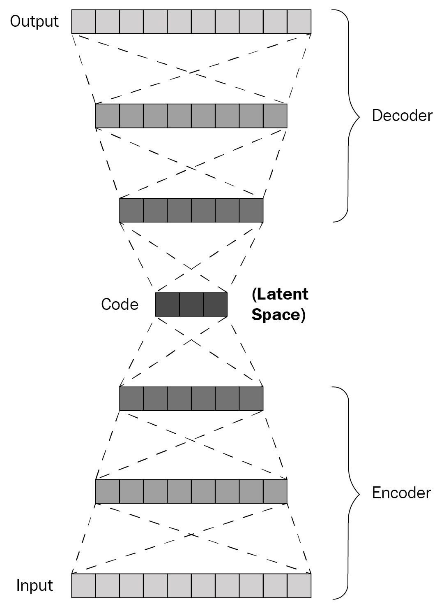
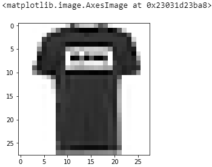
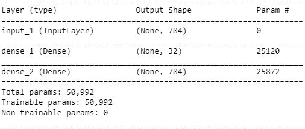
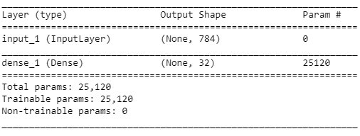
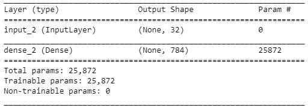
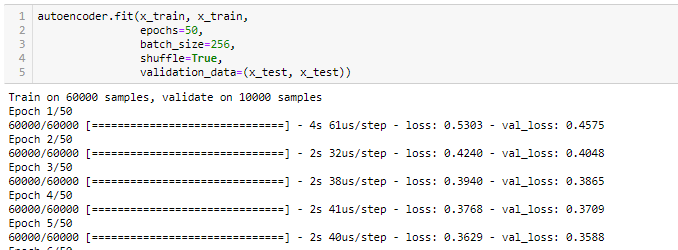
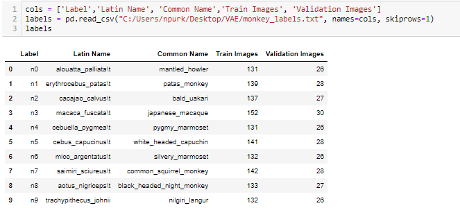
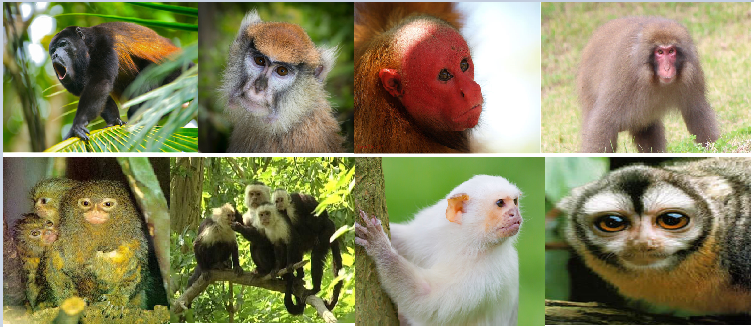
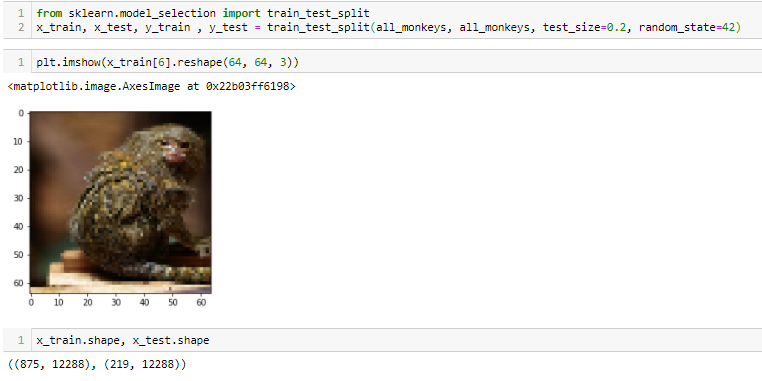

        

# 八、自编码器

在前一章中，我们熟悉了**机器学习** ( **ML** )中的一个新领域:强化学习领域。我们看到了如何使用神经网络增强学习算法，以及我们如何学习能够将游戏状态映射到代理可能采取的行动的近似函数。然后将这些行为与一个移动的目标变量进行比较，这个变量是由我们称之为**贝尔曼方程**定义的。严格来说，这是一种自监督的 ML 技术，因为它是用于比较我们预测的贝尔曼方程，而不是一组标记的目标变量，就像监督学习方法一样(例如，在每个状态下标记最佳行动的游戏屏幕)。虽然后者是可能的，但对于给定的用例来说，它的计算量要大得多。现在我们将继续前进，探索另一种自监督的 ML 技术，我们将深入到**神经自编码器**的世界。

在本章中，我们将探讨让神经网络学习对给定数据集中最具代表性的特征进行编码的效用和优势。本质上，这允许我们保存，并在以后重新创建，定义一类观察的关键元素。观察值本身可以是图像、自然语言数据，甚至是时间序列观察值，它们可能受益于维数的减少，剔除表示给定观察值的信息较少方面的信息位。何人得益你问。

以下是本章将涉及的主题:

*   为什么选择自编码器？
*   自编码信息
*   了解自编码器的局限性
*   分解自编码器
*   训练自编码器
*   自编码器原型概述
*   网络规模和代表性
*   理解自编码器中的正则化
*   稀疏自编码器正则化
*   探测数据
*   构建验证模型
*   设计深度自编码器
*   利用函数式 API 设计自编码器
*   深度卷积自编码器
*   编译和训练模型
*   测试和可视化结果
*   降噪自编码器
*   训练去噪网络

        

# 为什么选择自编码器？

虽然在过去(大约 2012 年)，自编码器曾因其在初始化深度**卷积神经网络**(**CNN**)(通过一种称为**贪婪逐层预训练**的操作)的层权重方面的使用而短暂享有一些声誉，但随着更好的随机权重初始化方案的出现，以及允许训练更深层次神经网络的更有利的方法(如批处理归一化，2014 年，以及后来的残差学习，2015 年)浮出水面，研究人员逐渐对这种预训练技术失去了兴趣。

今天，自编码器的一个最重要的用途来自于它们发现高维数据的低维表示的能力，同时仍然试图保留其中存在的核心属性。这允许我们执行诸如恢复受损图像(或图像去噪)的任务。自编码器感兴趣的一个类似领域来自它们执行主成分分析的能力，例如对数据的转换，允许对存在的主要变化因素进行信息可视化。事实上，具有线性激活功能的单层自编码器可以非常类似于对数据集执行的标准**主成分分析** ( **PCA** )操作。这种自编码器简单地学习将从 PCA 中产生的相同维数减少的子空间。因此，自编码器可以与 t-SNE 算法([https://en . Wikipedia . org/wiki/T-distributed _ random _ neighbor _ embedding](https://en.wikipedia.org/wiki/T-distributed_stochastic_neighbor_embedding))结合使用，该算法以其在 2D 平面上可视化信息的能力而闻名，首先对高维数据集进行下采样，然后可视化可观察到的主要方差因素。

此外，对于这种用例，自编码器的优势(即执行维数缩减)源于它们可能具有非线性编码器和解码器功能，而 PCA 算法仅限于线性映射。与相同数据的 PCA 分析结果相比，这允许自编码器学习特征空间的更强大的非线性表示。事实上，当您处理非常稀疏和高维的数据时，自编码器可以证明是您的数据科学宝库中一个非常强大的工具。

除了自编码器的这些实际应用之外，还存在更多创造性和艺术性的应用。例如，从编码器产生的简化表示中进行采样已被用于生成艺术图像，这些图像在纽约的一家拍卖行被拍卖了大约 50 万美元(见[https://www . Bloomberg . com/news/articles/2018-10-25/ai-generated-portrait-is-selled-for-432-500-in-an-auction-first](https://www.bloomberg.com/news/articles/2018-10-25/ai-generated-portrait-is-sold-for-432-500-in-an-auction-first))。我们将在下一章回顾这种图像生成技术的基础，那时我们将讨论变分自编码器架构和**生成对抗网络** ( **甘斯**)。但首先，让我们试着更好地理解自编码器神经网络的本质。

        

# 自编码信息

那么，自编码器的想法有什么不同呢？您肯定遇到过无数的编码算法，从存储音频文件的 MP3 压缩，到存储图像文件的 JPEG 压缩。自编码神经网络令人感兴趣的原因是，与之前陈述的准对等物相比，它们采用了非常不同的方法来表示信息。在对神经网络的内部运作进行了长达七章的研究后，你肯定会期待这种方法。

与 MP3 或 JPEG 算法不同，它们持有关于声音和像素的一般假设，神经自编码器被迫从训练会话期间显示的任何输入中自动学习代表性特征。它继续通过使用在会话期间捕获的学习表示来重新创建给定的输入。重要的是要明白，自编码器的吸引力并不在于简单地复制它的输入。当训练自编码器时，我们通常对它生成的解码输出不感兴趣，而是对网络如何转换给定输入的维度感兴趣。理想情况下，我们通过给予网络激励和约束来寻找代表性的编码方案，以尽可能接近地重构原始输入。通过这样做，我们可以在相似的数据集上使用编码器功能作为特征检测算法，这为我们提供了给定输入的语义丰富的表示。

然后，这些表示可以用于执行分类，这取决于所处理的用例。因此，与其他标准编码算法相比，它是编码的架构机制，并定义了自编码器的新方法。

        

# 了解自编码器的局限性

正如我们之前看到的，自编码器等神经网络用于从数据中自动学习代表性特征，而不明显依赖于人类工程假设。虽然这种方法可以让我们发现特定于不同类型数据的理想编码方案，但这种方法确实存在一定的局限性。首先，自编码器被称为是**特定于数据的**，从某种意义上说，它们的效用仅限于与其训练数据非常相似的数据。例如，一个被训练成只重新生成猫图片的自编码器，如果没有被明确训练成这样，将很难生成狗图片。自然，这似乎降低了这种算法的可伸缩性。同样值得注意的是，到目前为止，自编码器在图像编码方面并没有明显优于 JPEG 算法。另一个问题是自编码器倾向于产生**有损输出**。这仅仅意味着压缩和解压缩操作降低了网络的输出，生成了与其输入相比不太精确的表示。这个问题似乎是大多数编码用例(包括基于启发式的编码方案，如 MP3 和 JPEG)经常遇到的问题。

因此，自编码器已经揭示了一些非常有前途的实践来处理*未标记的*真实世界数据。然而，今天在数字领域中可用的绝大多数数据实际上是非结构化和未标记的。值得注意的是，流行的误解将自编码器归入无监督学习类别，然而，事实上，它只是自监督学习的另一种变体，我们很快就会发现。那么，这些网络到底是如何运作的呢？

        

# 分解自编码器

嗯，在高层次上，自编码器可以被认为是一种特定类型的前馈网络，它学习模仿其输入来重建类似的输出。正如我们之前提到的，它由两个独立的部分组成:编码器功能和解码器功能。我们可以将整个 autoencoder 想象为多层相互连接的神经元，它们通过首先对输入进行编码，然后使用生成的代码重建输出来传播数据:



欠完整自编码器示例

上图说明了一种特定类型的自编码器网络。从概念上讲，自编码器的输入层连接到一层神经元，将数据汇集到一个潜在空间，称为**编码器功能**。该函数一般可定义为 *h = f(x)* ，其中 *x* 指网络输入， *h* 指编码器函数产生的潜在空间。潜在空间可以体现对我们的网络的输入的压缩表示，并且随后被解码器功能(即，神经元的前进层)用来解开简化的表示，将其映射到更高维的特征空间。因此，解码器功能(公式化为 *r = g(h)* )继续将编码器( *h* )生成的潜在空间转换成网络( *r* )的*重构的*输出。

        

# 训练自编码器

编码器和解码器功能之间的交互由另一个功能控制，该功能操作编码器的输入和输出之间的距离。我们已经知道这是神经网络术语中的`loss`函数。因此，为了训练自编码器，我们简单地相对于`loss`函数区分我们的编码器和解码器函数(通常使用均方误差),并使用梯度反向传播模型的误差，并更新整个网络的层权重。

因此，自编码器的学习机制可以表示为最小化`loss`函数，如下所示:

*min L(x，g ( f ( x ) ) )*

在前面的等式中， *L* 代表一个`loss`函数(例如 MSE)，该函数惩罚解码器函数( *g(f( x ))* )的输出偏离网络的输入， *(x)* 。通过以这种方式迭代地最小化重建损失，我们的模型将最终收敛到编码特定于输入数据的理想表示，然后可以用于解码具有最小量信息损失的类似数据。因此，自编码器几乎总是通过小批量梯度下降来训练，这与前馈神经网络的其他情况一样。

虽然自编码器也可以使用一种称为**再循环**(辛顿和麦克莱兰，1988 年)的技术来训练，但我们将避免在本章中访问这个子主题，因为这种方法很少用于大多数涉及自编码器的机器学习用例。值得一提的是，再循环通过比较给定输入上的网络激活与生成的重建上的网络激活来工作，而不是反向传播基于梯度的误差，该误差是根据网络权重对`loss`函数进行微分而得到的。虽然在概念上是不同的，但从理论的角度来看，这可能是有趣的，因为再循环被认为是反向传播算法的一种生物学上看似合理的替代方法，暗示着我们自己可能会随着新信息的出现而更新我们对世界的心理模型。

        

# 自编码器原型概述

我们之前描述的实际上是一个**欠完成自编码器**的例子，它本质上是对潜在空间维度的一个约束。它被指定为欠完整，因为编码维度(即潜在空间的维度)小于输入维度，这迫使自编码器了解数据样本中存在的最显著的特征。

相反，一个**过完备的自编码器**相对于它的输入维度有一个更大的编码维度。如下图所示，这种自编码器被赋予了与其输入大小相关的额外编码能力:

        

# 网络规模和代表性

在上图中，我们可以看到四种基本的自编码架构。**浅层自编码器**(浅层神经网络的扩展)被定义为只有一个隐藏的神经元层，而深层自编码器可以有许多层来执行编码和解码操作。回想一下前几章，较深层次的神经网络可能比浅层次的神经网络受益于更多的表达能力。由于自编码器被认为是一种特殊的前馈网络，这也适用于它们。此外，已经注意到，更深的自编码器可以指数地减少网络学习表示其输入所需的计算资源。它还可以大大减少网络学习输入的丰富压缩版本所需的训练样本的数量。虽然阅读最后几行可能会激励你们中的一些人开始训练数百个分层的自编码器，但你可能需要耐心等待。赋予编码器和解码器过多的功能也有其自身的缺点。

例如，具有额外能力的自编码器可以学习完美地重建毕加索绘画的输入图像，而无需学习与毕加索绘画风格相关的单个代表性特征。在这种情况下，你所拥有的只是一个昂贵的抄袭算法，它可能与 Microsoft Paint 的复制功能并行。另一方面，根据正在建模的数据的复杂性和分布设计自编码器很可能允许 AE 捕捉代表性的风格特征，这与毕加索的*工作方式*相似，有抱负的艺术家和历史学家都可以从中学习。在实践中，选择正确的网络深度和规模可能取决于对学习过程、实验和与用例相关的领域知识的理论熟悉程度的敏锐组合。这听起来是不是有点耗时？幸运的是，前面可能有一个折衷方案，可以通过使用正则化的自编码器来实现。

        

# 理解自编码器中的正则化

在一个极端，你可能总是试图通过坚持浅层和具有非常小的潜在空间维度来限制网络的学习能力。这种方法甚至可以为更复杂的方法提供一个很好的基准。然而，也有其他方法可以让我们受益于更深层的代表力量，而不会在一定程度上因为产能过剩的问题而受到惩罚。这些方法包括修改自编码器使用的`loss`函数，从而激励网络学习潜在空间的一些代表性标准。

例如，我们可能需要我们的`loss`函数来说明潜在空间的稀疏性，而不是简单地复制输入，这有利于更丰富的表示。正如我们将看到的，我们甚至可以考虑诸如潜在空间的导数的大小，或对丢失输入的鲁棒性等属性，以确保我们的模型确实从它所显示的输入中捕捉到代表性特征。

        

# 稀疏自编码器正则化

正如我们之前提到的，确保我们的模型编码来自所示输入的代表性特征的一种方式是通过在表示潜在空间的隐藏层上添加稀疏性约束( *h* )。我们用希腊字母 omega(ω)表示这种约束，这允许我们重新定义稀疏自编码器的`loss`函数，如下所示:

*   正常 AE 损失: *L ( x，g ( f ( x ) ) )*

*   稀疏 AE 损失: *L ( x，g(f(x))+ω(h)*

这个稀疏性约束项*ω(h)*，可以简单地认为是一个正则项，可以添加到前向神经网络中，正如我们在前面的章节中看到的。

在下面的研究论文中可以找到对自编码器中不同形式的稀疏约束方法的全面综述，我们向我们感兴趣的观众推荐这些论文:*通过学习深度稀疏自编码器进行面部表情识别*:[https://www . science direct . com/science/article/pii/s 0925231217314649](https://www.sciencedirect.com/science/article/pii/S0925231217314649)。

这在我们的议程中释放了一些空间，以便我们可以在继续编码我们自己的模型之前，给你一些自编码器使用的其他正则化方法的简要概述。

        

# 去噪自编码器正则化

与稀疏自编码器不同，去噪自编码器采用不同的方法来确保我们的模型以其被赋予的能力捕获有用的表示。这里，我们实际上可以修改`loss`函数中的重建误差项，而不是向`loss`函数添加约束。换句话说，我们将简单地告诉我们的网络通过使用该输入的噪声版本来重构它的输入。

在这种情况下，噪音可能是指图片中缺少像素、句子中缺少单词或音频片段。因此，我们可以重新制定我们的`loss`函数来对自编码器进行去噪，如下所示:

*   正常 AE 损失: *L ( x，g ( f ( x ) ) )*
*   去噪 AE 损失: *L ( x，g ( f ( ~x) ) )*

这里，术语( *~x* )只是指被某种形式的噪声破坏的输入 *x* 的一个版本。然后，我们的去噪自编码器必须着手消除所提供的噪声输入，而不是简单地试图复制原始输入。向训练数据添加噪声可以迫使自编码器捕捉与正确重构训练实例的被破坏版本最相关的代表性特征。

去噪自编码器的一些有趣的属性和用例(如语音增强)已在以下论文中进行了探讨，值得感兴趣的读者注意:*基于深度去噪自编码器的语音增强*:[https://pdf . semantic scholar . org/3674/37 D5 ee 2 ffbfee 1076 cf 21 c 3852 B2 EC 50d 734 . pdf](https://pdfs.semanticscholar.org/3674/37d5ee2ffbfee1076cf21c3852b2ec50d734.pdf)。

这就把我们带到了本章将要讨论的最后一个正则化策略，也就是收缩型自编码器，然后再讨论实际问题。

        

# 使用收缩自编码器的正则化

虽然我们不会深入研究自编码器网络这一子类的数学，但**收缩自编码器** ( **CAE** )是值得注意的，因为它在概念上与去噪自编码器相似，以及它如何局部扭曲输入空间。对于 CAEs，我们再次向`loss`函数添加一个约束(ω),但方式不同:

*   **正常 AE 损失** : *L ( x，g ( f ( x ) ) )*
*   **CAE 损失** : *L ( x，g(f(x))+ω(h，x)*

这里，术语*ω(h，x)* 被不同地表示，并且可以表述如下:


这里，CAE 利用对`loss`函数的约束来促使编码器的导数尽可能小。对于那些更注重数学的人来说，约束项ω(h，x)实际上被称为雅可比矩阵的**平方弗罗贝纽斯范数**(即平方元素之和)，它由编码器函数的偏导数填充。

对于那些希望在这里提供的简要总结之外扩展其知识的人来说，下面的论文提供了对 CAE 的内部工作及其在特征提取中的使用的出色概述:*收缩自编码器:特征提取期间的显式不变性*:[http://www . iro . umontreal . ca/~ Lisa/pointe urs/icml 2011 _ Explicit _ understance . pdf](http://www.iro.umontreal.ca/~lisa/pointeurs/ICML2011_explicit_invariance.pdf)。

实际上，我们在这里需要理解的是，通过这样定义欧米伽项，CAEs 可以学习近似一个可以将输入映射到输出的函数，即使输入略有变化。由于这种惩罚仅在训练过程中应用，网络学习从输入中捕获代表性特征，并且能够在测试过程中很好地执行，即使它显示的输入与其被训练的输入略有不同。

既然我们已经介绍了基本的学习机制以及一些定义各种类型的自编码器网络的架构变化，我们可以继续本章的实现部分。在这里，我们将在 Keras 中设计一个基本的 autoencoder，并逐步更新架构，以涵盖一些实际的考虑和用例。

        

# 在 Keras 中实现浅层 AE

现在，我们将在 Keras 中实现一个浅层自编码器。我们将处理的这个模型的用例很简单:通过使用 Keras 提供的标准时尚 MNIST 数据集，让一个自编码器生成不同的时尚服装。因为我们知道网络输出的质量直接取决于可用输入数据的质量，所以我们必须警告我们的观众不要期望通过这个练习产生下一个最畅销的服装产品。数据集拥有的像素化 28 x 28 图像将用于阐明在 Keras 上设计任何类型的 AE 网络时，您必须熟悉的编程概念和实施步骤。

        

# 做一些进口

在这个练习中，我们将使用 Keras 的功能 API，可通过`keras.models`访问，它允许我们构建非循环图和多输出模型，正如我们在第 4 章、*卷积神经网络*中所做的那样，以深入研究卷积网络的中间层。虽然您也可以使用顺序 API 复制自编码器(毕竟，自编码器是顺序模型)，但它们通常是通过函数式 API 实现的，这使我们在使用 Keras 的两种 API 时获得了更多的经验:

```py
import numpy as np
import matplotlib.pyplot as plt

from keras.layers import Input, Dense
from keras.models import Model
from keras.datasets import fashion_mnist
```

        

# 探测数据

接下来，我们简单地加载 Keras 中包含的`fashion_mnist`数据集。请注意，虽然我们已经为每个图像加载了标签，但这对于我们将要执行的任务来说并不是必需的。我们需要的只是输入图像，我们的浅层自编码器将重新生成这些图像:

```py
(x_train, y_train), (x_test, y_test) = fashion_mnist.load_data()
x_train.shape,  x_test.shape, type(x_train)
((60000, 28, 28), (10000, 28, 28), numpy.ndarray)
plt.imshow(x_train[1], cmap='binary')
```

以下是输出:



我们可以通过检查输入图像的尺寸和类型来继续，然后从训练数据中为我们自己的视觉满意度绘制出单个示例。这个例子看起来是一件休闲 t 恤，上面写着一些无法辨认的内容。太好了——现在，我们可以继续定义我们的自编码器模型了！

        

# 预处理数据

正如我们之前无数次所做的那样，我们现在将归一化值 0 和 1 之间的像素数据，这提高了我们的网络从归一化数据中的学习能力:

```py
# Normalize pixel values
x_train = x_train.astype('float32') / 255.
x_test = x_test.astype('float32') / 255.

# Flatten images to 2D arrays
x_train = x_train.reshape((len(x_train), np.prod(x_train.shape[1:])))
x_test = x_test.reshape((len(x_test), np.prod(x_test.shape[1:])))

# Print out the shape
print(x_train.shape)
print(x_test.shape)
-----------------------------------------------------------------------
(60000, 784)
(10000, 784)
```

我们还将把 28 x 28 像素展平成一个 784 像素的向量，就像我们在训练前馈网络时在之前的 MNIST 示例中所做的那样。最后，我们将打印出我们的训练和测试数组的形状，以确保它们符合要求的格式。

        

# 构建模型

现在我们准备在 Keras 中设计我们的第一个自编码器网络，我们将使用函数式 API 来完成。正如我们在前面的例子中看到的，管理函数式 API 的基础知识很容易掌握。对于我们的用例，我们将定义潜在空间的编码维度。在这里，我们选择了 32。这意味着每个 784 像素的图像将经过一个仅存储 32 像素的压缩维度，输出将从该维度重建。

这意味着压缩系数为 24.5 (784/32)，这个选择有些随意，但可以作为类似任务的经验法则:

```py
# Size of encoded representation
# 32 floats denotes a compression factor of 24.5 assuming input is 784 float
# we have 32*32 or 1024 floats
encoding_dim = 32
#Input placeholder
input_img = Input(shape=(784,))
#Encoded representation of input image
encoded = Dense(encoding_dim, activation='relu',  activity_regularizer=regularizers.l1(10e-5))(input_img)                               
# Decode is lossy reconstruction of input              
decoded = Dense(784, activation='sigmoid')(encoded)
# This autoencoder will map input to reconstructed output
autoencoder = Model(input_img, decoded)
```

然后，我们使用来自`keras.layers`的输入占位符定义输入层，并指定我们期望的展平图像尺寸。正如我们从早期的 MNIST 实验中已经知道的那样(通过一些简单的数学计算)，展平 28 x 28 像素的图像会返回一个 784 像素的数组，然后可以通过前馈神经网络进行反馈。

接下来，我们定义编码潜在空间的维度。这是通过定义一个连接到输入层的密集层，以及对应于我们的编码维度的神经元数量(之前定义为 32)和 ReLU 激活函数来实现的。在定义后续层的参数之后，通过在括号中包括定义前一层的变量来表示这些层之间的连接。

最后，我们将解码器功能定义为与输入(784 个像素)维数相等的密集层，具有 sigmoid 激活功能。这一层自然地连接到代表潜在空间的编码维度，并在编码层的神经激活的基础上重新生成输出。现在，我们可以通过使用函数式 API 中的模型类来初始化我们的自编码器，并为它提供输入占位符和解码器层作为参数。

        

# 实现稀疏性约束

正如我们在本章前面提到的，在设计自编码器时，有许多方法可以执行正则化。例如，稀疏自编码器简单地在潜在空间上实现稀疏性约束，以迫使自编码器支持丰富的表示。回想一下，如果输出值接近 1，神经网络中的神经元可能会*触发*，如果输出值接近 0，则不会激活。添加稀疏性约束可以简单地认为是约束潜在空间中的神经元在大多数时间是不活动的。因此，在任何给定的时间，可能会有更少数量的神经元激活，迫使那些*激活*的神经元尽可能有效地传播信息，从潜在空间到输出空间。幸运的是，在 Keras 中实现这个过程相当简单。这可以通过定义`activity_regularizer`参数来实现，同时定义代表潜在空间的密集层。在下面的代码中，我们使用来自`keras.regularizers`的 L1 正则化子，稀疏度参数非常接近零(在我们的例子中是 0.067)。现在您也知道如何在 Keras 中设计稀疏自编码器了！虽然我们将继续使用 unsparse 版本，但出于本练习的目的，欢迎您比较这两种浅层自编码器的性能，以了解在直接设计此类模型时向潜在空间添加稀疏约束的好处。

        

# 编译和可视化模型

我们可以通过简单地编译模型并在模型对象上调用`summary()`来可视化我们刚刚做的事情，就像这样。我们将选择 Adadelta 优化器，它在反向传播期间将累积的过去梯度的数量限制在一个固定的窗口内，而不是通过选择 Adagrad 优化器之类的东西来单调降低学习速率。如果你在这本书的前面错过了，我们鼓励你研究大量可用的优化器(【http://ruder.io/optimizing-gradient-descent/】)并用它们做实验，找到一个适合你的用例。最后，我们将二进制交叉熵定义为一个`loss`函数，在我们的例子中，它说明了所产生的输出的像素损失:

```py
autoencoder.compile(optimizer='adadelta', loss='binary_crossentropy')
autoencoder.summary()
```

以下是输出:



        

# 构建验证模型

现在，我们几乎拥有了启动浅层自编码器训练所需的一切。然而，我们缺少一个重要的组成部分。虽然严格来说，这一部分不是训练我们的自编码器所必需的，但我们必须实现它，以便我们可以直观地验证我们的自编码器是否真正从训练数据中学习了显著的特征。为此，我们将实际定义另外两个网络。别担心，这两个网络本质上是我们刚刚定义的自编码器网络中编码器和解码器功能的镜像。因此，我们要做的就是创建一个单独的编码器和解码器网络，它将与我们的自编码器中的编码器和解码器功能的超参数相匹配。只有在我们的自编码器被训练之后，这两个独立的网络才会被用于预测。本质上，编码器网络将用于预测输入图像的压缩表示，而解码器网络将简单地继续预测存储在潜在空间中的信息的解码版本。

        

# 定义独立的编码器网络

在下面的代码中，我们可以看到 encoder 函数是 autoencoder 上半部分的精确副本；它本质上将展平像素值的输入向量映射到压缩的潜在空间:

```py
''' The seperate encoder network '''

# Define a model which maps input images to the latent space
encoder_network = Model(input_img, encoded)

# Visualize network
encoder_network.summary()

```

以下是摘要:



        

# 定义独立的解码器网络

同样，在下面的代码中，我们可以看到解码器网络是自编码器神经网络下半部分的完美复制，将存储在潜在空间中的压缩表示映射到重构输入图像的输出层:

```py
''' The seperate decoder network ''' 

# Placeholder to recieve the encoded (32-dimensional) representation as input
encoded_input = Input(shape=(encoding_dim,))

# Decoder layer, retrieved from the aucoencoder model
decoder_layer = autoencoder.layers[-1]

# Define the decoder model, mapping the latent space to the output layer
decoder_network = Model(encoded_input, decoder_layer(encoded_input))

# Visualize network
decoder_network.summary()
```

以下是摘要:



请注意，要定义解码器网络，我们必须首先构建一个输入层，其形状对应于我们的编码维度(即 32)。然后，我们通过引用对应于该模型的最后一层的索引，简单地从我们早期的自编码器模型复制解码器层。现在，我们已经准备好了启动自编码器网络训练的所有组件！

        

# 训练自编码器

接下来，我们只需安装我们的自编码器网络，就像我们之前无数次对其他网络所做的那样。在对我们的网络节点执行权重更新之前，我们选择该模型在 256 个图像的批次中训练 50 个时期。我们也在训练中打乱我们的数据。正如我们已经知道的，这样做可以确保批次之间的差异减少，从而提高我们模型的可推广性:



最后，我们还使用我们的测试集定义了验证数据，以便能够在每个时代结束时比较我们的模型在看不见的例子上的表现。请记住，在正常的机器学习工作流中，通常的做法是对数据进行验证和开发拆分，以便可以在一个拆分上调整您的模型并在后者上测试它。虽然这不是我们演示用例的先决条件，但为了实现可推广的结果，这种双保持策略总是有益的。

        

# 可视化结果

现在是我们收获劳动果实的时候了。让我们看看我们的 autoencoder 通过使用我们隐蔽的测试集能够重建什么样的图像。换句话说，我们将为我们的网络提供与训练集相似(但不相同)的图像，以查看我们的模型在看不见的数据上的表现如何。为此，我们将使用我们的编码器网络对测试集进行预测。编码器将预测如何将输入图像映射到压缩表示。然后，我们将简单地使用解码器网络来预测如何解码由编码器网络产生的压缩表示。这些步骤如以下代码所示:

```py
# Time to encode some images
encoded_imgs = encoder_network.predict(x_test)
# Then decode them 
decoded_imgs = decoder_network.predict(encoded_imgs)
```

接下来，我们重建了一些图像，并将它们与促使重建的输入进行比较，以查看我们的自编码器是否捕捉到了衣服应该看起来的本质。为此，我们将简单地使用 Matplotlib 并绘制九幅图像，图像下面是它们的重建，如下所示:

```py
# use Matplotlib (don't ask)
import matplotlib.pyplot as plt
plt.figure(figsize=(22, 6))
num_imgs = 9
for i in range(n):                        
    # display original
    ax = plt.subplot(2, num_imgs, i + 1)
    true_img = x_test[i].reshape(28, 28)
    plt.imshow(true_img)

    # display reconstruction
    ax = plt.subplot(2, num_imgs, i + 1 + num_imgs)
    reconstructed_img = decoded_imgs[i].reshape(28,28)
    plt.imshow(reconstructed_img)
plt.show()

```

以下是生成的输出:


正如你所看到的，虽然我们的浅层自编码器没有重新创建品牌标签(如第二张图片中出现的 **Lee** 标签)，但它确实了解了人类服装的一般概念，尽管它的学习能力相当有限。但这就够了吗？嗯，对任何实际用例来说都不够，比如计算机辅助服装设计。太多的细节被遗漏了，部分原因是我们网络的学习能力，部分原因是有损压缩输出。自然，这让你想知道，更深层次的模型能实现什么？嗯，就像那句老话所说的那样， *nullius in verba* (或者用更现代的术语来解释，让我们自己看看吧！).

        

# 设计深度自编码器

接下来，我们将研究自编码器的重建效果能有多好，以及它们是否能生成比我们刚刚看到的模糊图像更好的图像。为此，我们将设计一个深度前馈自编码器。如你所知，这仅仅意味着我们将在自编码器的输入层和输出层之间添加额外的隐藏层。为了保持有趣，我们还将使用不同的图像数据集。如果您想进一步探索自编码器可以达到的时尚感，欢迎您在`fashion_mnist`数据集上重新实现这个方法。

在下一个练习中，我们将使用 Kaggle 提供的 10 种猴子的数据集。我们将尝试从丛林中重建我们顽皮和淘气的表亲的照片，并看看我们的自编码器在更复杂的重建任务中表现如何。这也让我们有机会大胆尝试远离 Keras 中可用的预处理数据集的用例，因为我们将学习处理不同大小和更高分辨率的图像，而不是单调的 MNIST 示例:[https://www.kaggle.com/slothkong/10-monkey-species](https://www.kaggle.com/slothkong/10-monkey-species)。

        

# 做一些进口

按照传统，我们将从导入必要的库开始。您会注意到常见的可疑对象，如 NumPy、pandas、Matplotlib 和一些 Keras 模型和层对象:

```py
import cv2
import datetime as dt
import matplotlib.pylab as plt
import numpy as np
import pandas as pd
from keras import models, layers, optimizers
from keras.layers import Input, Dense
from keras.models import Model
from pathlib import Path
from vis.utils import utils
```

注意，我们从 Keras `vis`库中导入了一个实用模块。虽然这个模块包含许多其他漂亮的图像处理功能，但我们将使用它来调整训练图像的大小，使其达到统一的尺寸，因为对于这个特定的数据集来说，情况并非如此。

        

# 理解数据

我们选择这个数据集作为我们的用例有一个特殊的原因。不像服装的 28 x 28 像素化图像，这些图像表现了丰富而复杂的特征，例如身体形态的变化，当然还有颜色！我们可以画出数据集的组成，看看类分布是什么样子，这纯粹是出于我们自己的好奇:



你会注意到，10 种不同的猴子都有明显不同的特征，从不同的体型、皮毛颜色和面部结构，这使得自编码器的任务更具挑战性。为了更好地说明物种间的这些差异，下面提供了八种不同猴子的样本图像。如你所见，它们看起来都很独特:



因为我们知道自编码器是特定于数据的，所以训练自编码器来重建一类具有高方差的图像可能会导致可疑的结果。尽管如此，我们希望这将成为一个信息丰富的用例，以便您可以更好地理解在使用这些模型时您将面临的潜力和限制。所以，让我们开始吧！

        

# 导入数据

我们将从从 Kaggle 库中导入不同猴子物种的图像开始。正如我们之前所做的，我们将简单地将数据下载到我们的文件系统，然后使用 Python 内置的操作系统接口(使用`os`模块)访问 training data 文件夹:

```py
import os
all_monkeys = []
for image in os.listdir(train_dir):
    try:
        monkey = utils.load_img(('C:/Users/npurk/Desktop/VAE/training/' + image), target_size=(64,64))
        all_monkeys.append(monkey)
    except Exception as e:
        pass
    print('Recovered data format:', type(all_monkeys))    
print('Number of monkey images:', len(all_monkeys))
-----------------------------------------------------------------------
Recovered data format: <class 'list'> 
Number of monkey images: 1094

```

您会注意到我们在一个`try` / `except`循环中嵌套了 image 变量。这只是一种实现上的考虑，因为我们发现数据集中的一些图像已经损坏。因此，如果我们不能使用`utils`模块中的`load_img()`函数加载图像，那么我们将完全忽略图像文件。这种(有点武断的)选择策略使我们从总共 1，097 个图像中的训练文件夹中恢复了 1，094 个图像。

        

# 预处理数据

接下来，我们将把我们的像素值列表转换成 NumPy 数组。我们可以打印出数组的形状，以确认我们是否真的有 1094 幅 64 x 64 像素的彩色图像。这样做之后，我们只需通过将每个像素值除以任何给定像素的最大可能值(即 255)来归一化 0–1 范围内的像素值:

```py
# Make into array
all_monkeys = np.asarray(all_monkeys)
print('Shape of array:', all_monkeys.shape)

# Normalize pixel values
all_monkeys = all_monkeys.astype('float32') / 255.

# Flatten array
all_monkeys = all_monkeys.reshape((len(all_monkeys), np.prod(all_monkeys.shape[1:])))
print('Shape after flattened:', all_monkeys.shape)

Shape of array: (1094, 64, 64, 3)
Shape after flattened: (1094, 12288)
```

最后，我们将四维数组展平为二维数组，因为我们的深度自编码器由前馈神经网络组成，该网络通过其层传播 2D 向量。与我们在[第 3 章](46e25614-bb5a-4cca-ac3e-b6dfbe29eea5.xhtml)、*信号处理-神经网络数据分析*中所做的类似，我们本质上是将每个三维图像(64 x 64 x 3)转换成一个维度为(1，12，288)的 2D 向量。

        

# 划分数据

既然我们的数据已经过预处理，并作为归一化像素值的 2D 张量存在，我们最终可以将其分为训练段和测试段。这样做很重要，因为我们希望最终在它从未见过的图像上使用我们的模型，并能够使用它自己对猴子应该长什么样的理解来重建它们。请注意，虽然在我们的用例中，我们不使用数据集提供的标签，但网络本身会收到它看到的每个图像的标签。在这种情况下，标签将只是图像本身，因为我们正在处理图像重建任务，而不是分类。因此，在自编码器的情况下，输入变量与目标变量相同。正如我们在下面的截图中所看到的，来自 sklearn 的模型选择模块的`train_test_split`函数用于生成我们的训练和测试数据(具有 80/20 的分割比)。您会注意到，由于我们任务的性质，`x`和`y`变量是由相同的数据结构定义的:



现在我们只剩下 875 个训练样本和 219 个测试样本来训练和测试我们的深度自编码器。请注意，Kaggle 数据集附带了一个显式的测试集目录，因为该数据集的原始目的是尝试使用机器学习模型对不同的猴子物种进行分类。然而，在我们的用例中，我们暂时没有严格地确保平衡的类，只是对深度自编码器在高方差数据集上训练时在重建图像方面的表现感兴趣。我们鼓励通过比较深度自编码器的性能进行进一步的实验，这些编码器是在特定种类的猴子上训练的。逻辑将指示这些模型在重建它们的输入图像时会表现得更好，因为后者在训练观察之间。

        

# 利用函数式 API 设计自编码器

正如我们在前面的例子中所做的那样，我们将引用函数式 API 来构造我们的深度自编码器。我们将导入输入层和密集层，以及稍后用于初始化网络的模型对象。我们还将为图像定义输入维度(64 x 64 x 3 = 12，288)，编码维度为 256，压缩比为 48。这仅仅意味着，在我们的网络试图从潜在空间重建图像之前，每个图像将被压缩 48 倍:

```py
from keras.layers import Input, Dense
from keras.models import Model

##Input dimension
input_dim=12288

##Encoding dimension for the latent space
encoding_dim=256
```

压缩因子可能是一个需要考虑的非常重要的参数，因为将输入映射到一个非常低维的空间会导致太多的信息丢失，从而导致重建效果不佳。可能只是没有足够的空间来存储图像的关键要素。另一方面，我们已经意识到为我们的模型提供太多的学习能力可能会导致它过拟合，这就是为什么手动选择压缩因子会非常棘手。如果有疑问，尝试不同的压缩因子和正则化方法也无妨(如果你有时间的话)。

        

# 构建模型

为了构建我们的深度自编码器，我们将从定义输入层开始，它接受与猴子图像的 2D 向量相对应的维度。然后，我们简单地开始使用密集层定义我们网络的编码器部分，随后各层的神经元数量减少，直到我们到达潜在空间。注意，我们简单地选择导致潜在空间减少 2 倍的层中神经元的数量，相对于所选择的编码维度。因此，第一层具有(256×4)1024 个神经元，第二层具有(256×2)512 个神经元，而代表潜在空间本身的第三层具有 256 个神经元。虽然您没有义务严格遵守这一约定，但在接近潜在空间时，通常会减少每层的神经元数量，并在欠完整自编码器的情况下，增加之后出现的层的神经元数量:

```py
# Input layer placeholder
input_layer = Input(shape=(input_dim,))

# Encoding layers funnel the images into lower dimensional representations
encoded = Dense(encoding_dim * 4, activation='relu')(input_layer)
encoded = Dense(encoding_dim * 2, activation='relu')(encoded)

# Latent space
encoded = Dense(encoding_dim, activation='relu')(encoded)

# "decoded" is the lossy reconstruction of the input
decoded = Dense(encoding_dim * 2, activation='relu')(encoded)
decoded = Dense(encoding_dim * 4, activation='relu')(decoded)
decoded = Dense(input_dim, activation='sigmoid')(decoded)

# this model maps an input to its reconstruction
autoencoder = Model(input_layer, decoded)

autoencoder.summary()
_______________________________________________________________
Layer (type)                 Output Shape              Param #   =================================================================
input_1 (InputLayer)         (None, 12288)             0         _______________________________________________________________
dense_1 (Dense)              (None, 1024)              12583936  _______________________________________________________________
dense_2 (Dense)              (None, 512)               524800    _______________________________________________________________
dense_3 (Dense)              (None, 256)               131328    _______________________________________________________________
dense_4 (Dense)              (None, 512)               131584    _______________________________________________________________
dense_5 (Dense)              (None, 1024)              525312    _______________________________________________________________
dense_6 (Dense)              (None, 12288)             12595200  =================================================================
Total params: 26,492,160
Trainable params: 26,492,160
Non-trainable params: 0
_________________________________________________________________
```

最后，我们通过将输入和解码器层作为参数提供给模型对象来初始化自编码器。然后，我们可以直观地总结一下我们刚刚构建的内容。

        

# 训练模型

最后，我们可以开始训练了！这一次，我们将使用`adam`优化器编译模型，并使用均方误差操作`loss`函数。然后，我们简单地通过调用模型对象上的`.fit()`并提供适当的参数来开始训练:

```py
autoencoder.compile(optimizer='adam', loss='mse')

autoencoder.fit(x_train, x_train, epochs=100, batch_size=20, verbose=1)

Epoch 1/100
875/875 [==============================] - 15s 17ms/step - loss: 0.0061
Epoch 2/100
875/875 [==============================] - 13s 15ms/step - loss: 0.0030
Epoch 3/100
875/875 [==============================] - 13s 15ms/step - loss: 0.0025
Epoch 4/100
875/875 [==============================] - 14s 16ms/step - loss: 0.0024
Epoch 5/100
875/875 [==============================] - 13s 15ms/step - loss: 0.0024
```

该模型在第 100 个时段结束时损失(0.0046)。请注意，由于之前已经为浅层模型选择了不同的`loss`函数，因此每个模型的损耗度量不能直接相互比较。实际上，定义`loss`函数的方式表征了模型寻求最小化的内容。如果您希望对两种不同的神经网络架构(例如前馈网络和 CNN)的性能进行基准测试和比较，建议您首先使用相同的优化器和`loss`功能，然后再尝试其他功能。

        

# 可视化结果

现在，让我们通过在隐蔽的测试集上测试 deep autoencoder 的性能来看看它能够进行的重建。为此，我们将简单地使用我们单独的编码器网络来预测如何将这些图像压缩到潜在空间，解码器网络将从编码器预测的潜在空间开始解码和重建原始图像:

```py
decoded_imgs = autoencoder.predict(x_test)
# use Matplotlib (don't ask)
import matplotlib.pyplot as plt

n = 6  # how many digits we will display
plt.figure(figsize=(22, 6))
for i in range(n):
    # display original
    ax = plt.subplot(2, n, i + 1)
    plt.imshow(x_test[i].reshape(64, 64, 3))    #x_test
    plt.gray()
    ax.get_xaxis().set_visible(False)
    ax.get_yaxis().set_visible(False)

    # display reconstruction
    ax = plt.subplot(2, n, i + 1 + n)
    plt.imshow(decoded_imgs[i].reshape(64, 64, 3))
    plt.gray()
    ax.get_xaxis().set_visible(False)
    ax.get_yaxis().set_visible(False)
plt.show()
```

我们将得到以下输出:


虽然这些图像本身甚至可以说是美学上令人愉悦的，但似乎代表猴子的本质在很大程度上避开了我们的模型。大多数重建作品都类似星空，而不是猴子的特征。我们确实注意到网络已经开始在非常基础的水平上学习一般的人形形态，但是这没有什么值得大书特书的。那么，我们该如何改善这一点呢？在一天结束的时候，我们想用至少一些看起来真实的猴子重建来结束这一章。为此，我们将使用一种专门的网络，这种网络擅长处理图像数据。我们说的是**卷积神经网络** ( **CNN** )架构，我们将重新利用它，以便在本练习的下一部分设计深度卷积自编码器。

        

# 深度卷积自编码器

幸运的是，我们所要做的就是定义一个卷积网络，并将我们的训练阵列调整到适当的维度，以测试它对于手头任务的表现。因此，我们将导入一些卷积、最大池和上采样层，并开始构建网络。我们定义输入层，并为其提供 64 x 64 彩色图像的形状。然后，我们简单地交替卷积层和池层，直到我们到达由第二个`MaxPooling2D`层表示的潜在空间。另一方面，远离潜在空间的层必须在卷积层和上采样层之间交替。顾名思义，上采样层通过重复前一层数据的行和列来增加表示维度:

```py
from keras.layers import Conv2D, MaxPooling2D, UpSampling2D

# Input Placeholder
input_img = Input(shape=(64, 64, 3))  # adapt this if using `channels_first` image data format

# Encoder part
l1 = Conv2D(32, (3, 3), activation='relu', padding='same')(input_img)
l2 = MaxPooling2D((2, 2), padding='same')(l1)
l3 = Conv2D(16, (3, 3), activation='relu', padding='same')(l2)

# Latent Space, with dimension (None, 32, 32, 16)
encoded = MaxPooling2D((1,1), padding='same')(l3) 

# Decoder Part
l8 = Conv2D(16, (3, 3), activation='relu', padding='same')(encoded)
l9 = UpSampling2D((2, 2))(l8)
decoded = Conv2D(3, (3, 3), activation='sigmoid', padding='same')(l9)

autoencoder = Model(input_img, decoded)

autoencoder.summary()
_______________________________________________________________
Layer (type)                 Output Shape              Param #   =================================================================
input_2 (InputLayer)         (None, 64, 64, 3)         0         _______________________________________________________________
conv2d_5 (Conv2D)            (None, 64, 64, 32)        896       _______________________________________________________________
max_pooling2d_3 (MaxPooling2 (None, 32, 32, 32)        0         _______________________________________________________________
conv2d_6 (Conv2D)            (None, 32, 32, 16)        4624      _______________________________________________________________
max_pooling2d_4 (MaxPooling2 (None, 32, 32, 16)        0         _______________________________________________________________
conv2d_7 (Conv2D)            (None, 32, 32, 16)        2320      _______________________________________________________________
up_sampling2d_2 (UpSampling2 (None, 64, 64, 16)        0         _______________________________________________________________
conv2d_8 (Conv2D)            (None, 64, 64, 3)         435       =================================================================
Total params: 8,275
Trainable params: 8,275
Non-trainable params: _________________________________________________________________
```

正如我们所见，这个卷积自编码器有八层。信息进入输入层，卷积层从输入层生成 32 个特征图。使用 max pooling 图层对这些地图进行缩减采样，进而生成 32 个要素地图，每个地图的大小为 32 x 32 像素。然后，这些图被传递到潜在层，潜在层存储了输入图像的 16 种不同表示，每种表示的尺寸为 32 x 32 像素。当输入经受卷积和上采样操作时，这些表示被传递到后续层，直到到达解码层。就像输入层一样，我们的解码层与 64 x 64 彩色图像的尺寸相匹配。您可以通过使用 Keras 后端模块中的`int_shape()`函数来检查特定卷积层的维度(而不是可视化整个模型)，如下所示:

```py
# Check shape of a layer
import keras
keras.backend.int_shape(encoded)

(None, 32, 32, 16)

```

        

# 编译和训练模型

接下来，我们简单地用我们为深度前馈网络选择的相同优化器和`loss`函数编译我们的网络，并通过调用模型对象上的`.fit()`来启动训练会话。请注意，我们仅针对 50 个时期训练该模型，并且一次分批执行 128 个图像的权重更新。这种方法在计算上更快，允许我们用训练前馈模型的一小部分时间来训练模型。让我们看看，在这个特定的用例中，训练时间和准确性之间的权衡是否对我们有利:

```py
autoencoder.compile(optimizer='adam', loss='mse')
autoencoder.fit(x_train, x_train, epochs=50, batch_size=20,
                shuffle=True, verbose=1)
Epoch 1/50
875/875 [==============================] - 7s 8ms/step - loss: 0.0462
Epoch 2/50
875/875 [==============================] - 6s 7ms/step - loss: 0.0173
Epoch 3/50
875/875 [==============================] - 7s 9ms/step - loss: 0.0133
Epoch 4/50
875/875 [==============================] - 8s 9ms/step - loss: 0.0116
```

在第 50 ^个时期结束时，模型达到(0.0044)的损失。这证明比早期的前馈模型低，当时它使用大得多的批量来训练一半的时期。让我们从视觉上自己判断这个模型在重建它以前从未见过的图像时表现如何。

        

# 测试和可视化结果

是时候看看 CNN 是否真的支持我们手头的图像重建任务了。我们简单地定义了一个助手函数，它允许我们绘制出从测试集中生成的大量样本，并将它们与原始测试输入进行比较。然后，在接下来的代码单元中，我们通过在模型对象上使用`.predict()`方法，定义一个变量来保存模型在测试集上的推理结果。这将生成一个 NumPy ndarray，其中包含测试集输入的所有解码图像。最后，我们调用`compare_outputs()`函数，使用测试集及其解码预测作为参数来可视化结果:

```py
def compare_outputs(x_test, decoded_imgs=None, n=10):
    plt.figure(figsize=(22, 5))
    for i in range(n):
        ax = plt.subplot(2, n, i+1)
        plt.imshow(x_test[i].reshape(64,64,3))

        ax.get_xaxis().set_visible(False)
        ax.get_yaxis().set_visible(False)

        if decoded_imgs is not None:
            ax = plt.subplot(2, n, i+ 1 +n)
            plt.imshow(decoded_imgs[i].reshape(64,64,3))

            ax.get_xaxis().set_visible(False)
            ax.get_yaxis().set_visible(False)
    plt.show()

decoded_imgs = autoencoder.predict(x_test)
print('Upper row: Input image provided \nBottom row: Decoded output 
       generated')
compare_outputs(x_test, decoded_imgs)
Upper row: Input image provided 
Bottom row: Decoded output generated
```

以下是输出:


正如我们所看到的，深度卷积自编码器实际上在从测试集中重建图像方面做得非常出色。它不仅可以学习身体形态和正确的配色方案，甚至可以从相机闪光灯中重现红眼等方面(正如在 monkey 4 和它的人造分身上看到的那样)。太好了！所以，我们能够重建一些猿的图像。随着兴奋感很快消退(如果它最初存在的话)，我们将希望使用自编码器来完成更有用和真实的任务——可能是图像去噪等任务，在这些任务中，我们委托网络从受损的输入中重新生成完整的图像。

        

# 降噪自编码器

同样，我们将继续猴子物种数据集，并修改训练图像以引入噪声因子。这个噪声因子实质上改变了原始图像上的像素值，以去除构成原始图像的信息片段，使得该任务比原始输入的简单重建更具挑战性。请注意，这意味着我们的输入变量将是有噪声的图像，而在训练期间显示给网络的目标变量将是有噪声的输入图像的未损坏版本。为了生成训练和测试图像的噪声版本，我们所做的就是对图像像素应用高斯噪声矩阵，然后在 0 和 1 之间裁剪它们的值:

```py
noise_factor = 0.35

# Define noisy versions
x_train_noisy = x_train + noise_factor * np.random.normal(loc=0.0, scale=1.0, size=x_train.shape) 
x_test_noisy = x_test + noise_factor * np.random.normal(loc=0.0, scale=1.0, size=x_test.shape) 

# CLip values between 0 and 1
x_train_noisy = np.clip(x_train_noisy, 0., 1.)
x_test_noisy = np.clip(x_test_noisy, 0., 1.)
```

通过从我们的数据中绘制一个随机示例，我们可以看到我们任意选择的噪声因子`0.35`实际上是如何影响图像的，如下面的代码所示。在这种分辨率下，噪声图像几乎无法被人眼理解，看起来只不过是一堆随机像素聚集在一起:

```py
# Effect of adding noise factor
f = plt.figure()
f.add_subplot(1,2, 1)
plt.imshow(x_test[1])

f.add_subplot(1,2, 2)
plt.imshow(x_test_noisy[1])

plt.show(block=True)
```

这是您将得到的输出:


        

# 训练去噪网络

对于这项任务，我们将使用相同的卷积自编码器架构。但是，我们将重新初始化模型，并再次从头开始训练它，这一次使用有噪声的输入变量:

```py
autoencoder.compile(optimizer='adam', loss='mse')
autoencoder.fit(x_train_noisy, x_train, epochs=50, batch_size=20,
                shuffle=True, verbose=1)

Epoch 1/50875/875 [==============================] - 7s 8ms/step - loss: 0.0449
Epoch 2/50
875/875 [==============================] - 6s 7ms/step - loss: 0.0212
Epoch 3/50
875/875 [==============================] - 6s 7ms/step - loss: 0.0185
Epoch 4/50
875/875 [==============================] - 6s 7ms/step - loss: 0.0169
```

正如我们可以看到的，在去噪自编码器的情况下，损耗收敛比我们以前的实验要慢得多。这是自然的情况，因为许多信息现在已经从输入中移除，使得网络更难学习适当的潜在空间来生成未被破坏的输出。因此，在压缩和重建操作中，网络被迫变得更有创造性。该网络的训练期在 50 个时期后结束，损失为 0.0126。现在，我们可以对测试集进行一些预测，并可视化一些重建。

        

# 可视化结果

最后，一旦我们给它一个更具挑战性的任务，比如图像去噪，我们就可以测试该模型实际上执行得有多好。我们将使用相同的辅助函数将我们的网络输出与测试集中的样本进行比较，如下所示:

```py
def compare_outputs(x_test, decoded_imgs=None, n=10):
    plt.figure(figsize=(22, 5))

    for i in range(n):
        ax = plt.subplot(2, n, i+1)
        plt.imshow(x_test_noisy[i].reshape(64,64,3))
        plt.gray()

        ax.get_xaxis().set_visible(False)
        ax.get_yaxis().set_visible(False)

        if decoded_imgs is not None:
            ax = plt.subplot(2, n, i+ 1 +n)
            plt.imshow(decoded_imgs[i].reshape(64,64,3))

            ax.get_xaxis().set_visible(False)
            ax.get_yaxis().set_visible(False)

    plt.show()
decoded_imgs = autoencoder.predict(x_test_noisy)
print('Upper row: Input image provided \nBottom row: Decoded output generated')
compare_outputs(x_test, decoded_imgs)
Upper row: Input image provided 
Bottom row: Decoded output generated
```

以下是输出:


正如我们所见，尽管增加了噪声因素，网络在重建图像方面做得很好！对于人眼来说，这些图像中的许多是很难区分的，因此网络能够重建其中存在的元素的一般结构和组成的事实确实值得注意，特别是考虑到分配给网络的学习能力和训练时间不足。

我们鼓励您通过改变潜在空间的层数、过滤器和编码维度来尝试更复杂的架构。事实上，现在可能是进行一些练习的最佳时机，这些练习将在本章末尾提供。

        

# 摘要

在这一章中，我们探索了自编码器背后的基本理论，并概念化了允许这些模型学习的基础数学。我们看到了自编码器架构的几种变体，包括浅、深、欠完整和过完整模型。这使我们能够概述与每种类型的模型的代表能力相关的考虑因素，以及它们在给定太多容量的情况下过度拟合的倾向。我们还探索了一些正则化技术，让我们补偿过度拟合问题，如稀疏和收缩自编码器。最后，我们训练了几种不同类型的自编码器网络，包括浅层、深层和卷积网络，用于图像重建和去噪的任务。我们看到，在学习能力和训练时间非常少的情况下，卷积自编码器在重建图像方面优于所有其他模型。此外，它能够从被破坏的输入中生成去噪图像，保持显示的输入数据的一般格式。

虽然我们没有探索其他用例，例如通过降维来可视化主要的差异因素，但自编码器在不同的领域中发现了许多适用性，从推荐系统中的协同过滤，到甚至预测未来的医疗保健患者，参见*深度患者*:【https://www.nature.com/articles/srep26094】T2。有一种特定类型的自编码器我们故意没有在本章中涉及:T4 变型自编码器。这种类型的自编码器包括对模型正在学习的潜在空间的特殊约束。它实际上迫使模型学习表示输入数据的概率分布，并从中对输出进行采样。这是一种与我们目前所研究的方法完全不同的方法，这种方法最多允许我们的网络学习某种任意的函数。我们选择不在本章包含这个有趣的副主题的原因是，用技术术语来说，VAEs 是生成模型的一个实例，这是我们下一章的主题！

        

# 锻炼

*   使用时尚 MNIST 数据集进行深度 AE，并在亏损达到稳定水平时进行监控。然后，和浅 AE 对比一下。
*   在您选择的另一个数据集上实现 AEs，并试验不同的编码维度、优化器和`loss`函数，以查看模型的执行情况。
*   比较不同模型(CNN、FF)的损失何时收敛，以及损失值减少的稳定程度或不稳定程度。你注意到了什么？