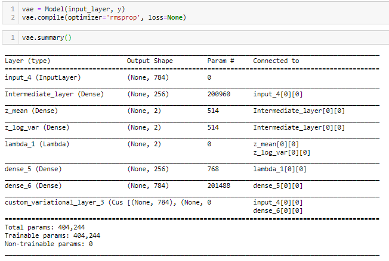

        

# 九、生成网络

在最后一章中，我们沉浸在自编码神经网络的世界中。我们看到了如何使用这些模型来估计参数化的函数，这些函数能够根据目标输出重构给定的输入。虽然乍一看这似乎是微不足道的，但我们现在知道这种自监督编码方式有几个理论和实际意义。

事实上，从**机器学习** ( **ML** )的角度来看，将高维空间中的一组连通的点近似到低维空间的能力(即流形学习)有几个优点，从更高的数据存储效率到更有效的内存消耗。实际上，这使我们能够为不同类型的数据发现理想的编码方案，或者对其进行降维，用于诸如**主成分分析** ( **PCA** )甚至信息检索的用例。例如，通过从存储在低维空间中的一组数据中学习有用的表示，可以极大地增强使用类似查询来搜索特定信息的任务。此外，所学习的表示甚至可以在此后用作特征检测器，以对新的输入数据进行分类。这种类型的应用可以让我们构建强大的数据库，当遇到查询时，能够进行高级别的推断和推理。衍生实现可能包括律师使用的法律数据库，以通过与当前案例的相似性有效地搜索先例，或者允许医生基于每个患者可用的噪声数据有效地诊断患者的医疗系统。这些潜在变量模型允许研究人员和企业解决各种用例，从序列到序列的机器翻译，到将复杂的意图归因于客户评论。本质上，通过生成模型，我们试图回答这个问题:*假设一个数据实例属于某个类(* y *)* ，这些特征( x *)出现在该数据实例中的可能性有多大？这与问这样一个问题非常不同:*在给定特征(* x *)的情况下，这个实例属于一个类(* y *)的可能性有多大？*，就像我们对于监督学习任务一样。为了更好地理解这种角色的转换，我们将进一步探讨前一章介绍的潜在变量建模背后的思想。*

在这一章中，我们将看到如何把潜在变量的概念向前推进一步。我们可以使用神经网络来学习代表潜在空间上的概率分布的函数，而不是简单地学习将输入映射到输出的参数化函数。然后，我们可以从这样的概率分布中进行采样，以生成输入数据的新的合成实例。正如我们将要发现的，这是生成模型背后的核心理论基础。

在本章中，我们将讨论以下主题:

*   复制与生成内容
*   理解潜在空间的概念
*   深入探究生成网络
*   利用随机性增加产量
*   从潜在空间取样
*   理解生成状语网络的类型
*   理解 VAEs
*   在 Keras 中设计 VAEs
*   在 VAE 中构建编码模块
*   构建解码器模块
*   想象潜在的空间
*   潜在空间采样和输出生成
*   探索甘斯
*   深入甘斯
*   在 Keras 中设计 GAN
*   设计发电机模块
*   设计鉴别器模块
*   将 GAN 放在一起
*   培训功能
*   定义鉴别器标签
*   每批培训发电机
*   执行培训课程

        

# 复制与生成内容

虽然我们在上一章中的自编码用例仅限于图像重建和去噪，但这些用例与我们在本章中将要讨论的用例截然不同。到目前为止，我们让我们的自编码器通过学习一个任意的映射函数来重建一些给定的输入。在这一章中，我们希望了解如何训练一个模型来创建一些内容的新实例，而不是简单地复制它的输入。换句话说，如果我们让一个神经网络像人类一样真正具有创造力并生成内容，会怎么样？。这能实现吗？在**人工智能** ( **AI** )领域常见的规范答案是肯定的，但这很复杂。为了寻找更详细的答案，我们来到了本章的主题:生成网络。

虽然存在过多的生成网络，从**深度玻尔兹曼机器**到**深度信念网络**的变体，但鉴于它们的限制性适用性和更高效计算方法的出现，它们中的大多数已经过时。然而，有几个继续保持在聚光灯下，因为它们具有生成合成内容的怪异能力，例如从未存在过的面孔，从未写过的电影评论和新闻文章，或者从未实际拍摄过的视频！为了更好地理解这种魔法背后的机制，让我们用几行文字来描述潜在空间的概念，以便更好地理解这些模型是如何将它们学到的表示转化为看似新的东西的。

        

# 理解潜在空间的概念

回想一下上一章,**潜在空间**只不过是输入数据在低维空间中的压缩表示。它本质上包括对原始输入的识别至关重要的特征。为了更好地理解这个概念，尝试在脑海中想象潜在空间可能编码了什么类型的信息是有帮助的。一个有用的类比是想想我们自己是如何用想象力创造内容的。假设你被要求创造一个虚构的动物。你会依靠什么信息来创造这个生物？你将从你以前见过的动物身上采集特征样本，比如它们的颜色，或者它们是双足动物、四足动物、哺乳动物或爬行动物、陆地动物还是海洋动物，等等。事实证明，当我们在世界中导航时，我们自己开发了世界的潜在模型。当我们试图想象一个类的新实例时，我们实际上是在采样一些潜在的变量模型，这些模型是在我们的整个存在过程中学习到的。

想想吧。在我们的一生中，我们遇到了无数不同颜色、大小和形态的动物。我们一直在将这些丰富的表现减少到更易管理的维度。例如，我们都知道狮子长什么样，因为我们有代表狮子的心理编码属性(或潜在变量)(如它们的四条腿、尾巴、毛皮、颜色等)。这些习得的属性证明了我们是如何在低维空间存储信息，以创建我们周围世界的功能模型的。我们假设这样的信息存储在低维空间，因为我们大多数人，例如，不能在纸上完美地再现狮子的形象。有些人甚至可能无法与之媲美，比如本书的作者。然而，只要提到狮子这个词，我们就能立刻集体就狮子的一般形态达成一致。

        

# 识别概念向量

这个小小的思维实验展示了潜在变量模型在创造世界的功能性表征方面的强大力量。如果我们的大脑没有不断地对从我们的感官输入中接收到的信息进行降采样，以创建可管理的和现实的世界模型，那么我们的大脑很可能会消耗更多的能量。因此，使用潜在变量模型本质上允许我们查询输入的简化表示(或属性)，这又可以与其他表示重新组合，以生成看似新颖的输出(例如:独角兽=马的身体和脸+犀牛/独角鲸的角)。

类似地，神经网络也可以转换来自已学习的潜在空间的样本，以生成新的内容。实现这一点的一种方式是通过识别嵌入在学习的潜在空间中的概念向量。这里的想法很简单。假设我们要从代表人脸的潜在空间中采样一张人脸( *f* )。然后，另一点，( *f + c* )，可以被认为是同一张脸的嵌入表示，加上一些修改(即，在原始脸之上出现一个微笑，或者眼镜，或者胡须)。这些概念向量实质上编码了来自输入数据的不同轴的差异，然后可以用于改变输入图像的有趣属性。换句话说，我们可以探索隐藏在输入数据中的概念向量的潜在空间。在识别这些向量之后，我们可以修改它们来改变输入数据的属性。例如，在给定的图像中，微笑向量可以被学习并用于修改一个人微笑的程度。类似地，性别向量可以用于修改人的外观，看起来更像女性而不是男性，反之亦然。既然我们已经更好地了解了可以从潜在空间中查询什么样的信息，并随后对其进行修改以生成新的内容，我们可以继续我们的探索之旅。

        

# 深入探究生成网络

因此，让我们试着理解生成网络的核心机制，以及这些方法与我们已知的方法有何不同。在我们到目前为止的探索中，我们实现的大多数网络都是为了对某些输入执行确定性的转换，从而得到某种输出。直到我们探索了强化学习的主题([第七章](f011d850-2ed4-4506-8fc9-4930e6a85d85.xhtml)、*深度 Q 网络的强化学习*)，我们才了解到在我们的建模工作中引入一定程度的**随机性**(即随机性)的好处。这是一个核心概念，随着我们熟悉生成网络的运作方式，我们将进一步探索这个概念。正如我们前面提到的，生成网络背后的中心思想是使用深度神经网络来学习变量在缩减的潜在空间上的概率分布。然后，可以以准随机方式对潜在空间进行采样和变换，以生成一些输出( *y* )。

正如你可能注意到的，这与我们在前一章采用的方法有很大的不同。使用自编码器，我们简单地估计一个任意函数，使用编码器将输入( *x* )映射到一个压缩的潜在空间，使用解码器从该空间重建输出( *y* )。在生成网络的情况下，我们学习输入数据的潜在变量模型( *x* )。然后，我们可以将样本从潜在空间转换到我们生成的输出。很棒，你不觉得吗？然而，在我们进一步探索这个概念是如何操作的之前，让我们简单回顾一下与生成创造性内容相关的随机性的作用。

        

# 可控的随机性和创造性

回想一下，我们通过使用**ε贪婪选择**策略在深度强化学习算法中引入了随机性元素，这基本上允许我们的网络不太依赖于相同的动作，并允许它探索新的动作来解决给定的环境。从某种意义上来说，引入这种随机性给这个过程带来了创造性，因为我们的网络能够系统地创建新的状态-行为对，而不依赖于它以前学到的东西。然而，请注意，将在系统中引入随机性的结果贴上创造性的标签，可能是我们某些拟人化的结果。事实上，人类创造创造力的真正过程(我们的基准)仍然很难捉摸，科学界对此知之甚少。另一方面，随机性和创造性之间的这种联系本身是一种长期公认的联系，尤其是在人工智能领域。早在 1956 年，人工智能研究人员就一直对超越机器看似确定性的限制感兴趣。当时，以规则为基础的系统的突出地位使得创造力等概念似乎只能在高级生物有机体中观察到。尽管有这种广泛的信念，塑造人工智能历史(可以说是未来一个世纪)的最重要的文件之一，*达特茅斯夏季研究项目提案* (1956)，特别提到了人工智能系统中受控随机性的作用，以及它与生成创造性内容的联系。虽然我们鼓励您阅读整个文档，但我们提供了与当前主题相关的摘录:

“一个相当有吸引力但显然不完整的猜想是，创造性思维和缺乏想象力的胜任思维之间的区别在于一些随机性的注入。随机性必须由直觉引导才能有效。换句话说，受过教育的猜测或直觉在有序思维中包含了可控的随机性。”

*- John McCarthy, Marvin L Minsky, Nathaniel Rochester, and Claude E Shannon*        

# 利用随机性增加产量

多年来，我们开发了一些方法，将注入一些受控随机性的概念操作化，这在某种意义上是由输入的直觉引导的。当我们谈到生成模型时，我们本质上希望实现一种机制，允许对我们的输入进行受控和半随机化的转换，以生成一些新的东西，但仍然看起来像原始输入。

让我们考虑一下如何实现这一点。我们希望训练一个神经网络使用一些输入变量( *x* )从一个模型产生的潜在空间产生一些输出变量( *y* )。解决这个问题的一个简单方法是简单地添加一个随机性元素作为我们的生成器网络的输入，这里由变量( *z* )定义。 *z* 的值可以从某个概率分布(例如，高斯分布)中采样，并与输入一起馈送给神经网络。因此，该网络实际上将估计函数 *f(x，z)* ，而不仅仅是 *f(x)* 。自然地，对于一个不能测量 z 值的独立观察者来说，这个函数看起来是随机的，但实际情况并非如此。

        

# 从潜在空间取样

为了进一步说明，假设我们必须从一个潜在空间的变量概率分布中抽取一些样本( *y* )，均值为(μ)，方差为(σ2):

*   **采样操作** : *y ̴ N(μ，σ2)*

因为我们使用一个抽样过程来从这个分布中抽取，所以每次查询这个过程时，每个样本都可能发生变化。我们无法根据分布参数(μ和σ2)精确区分生成的样本( *y* ),因为我们处理的是采样操作，而不是函数。那么，我们如何准确地反向传播我们模型的错误呢？一个解决方案是重新定义采样过程，比如对一个随机变量( *z* )进行变换，得到我们生成的输出( *y* )，就像这样:

*   **采样方程** : *y = μ + σz*

这是至关重要的一步，因为我们现在可以使用反向传播算法来计算生成的输出( *y* )相对于采样操作本身 *(μ + σz)* 的梯度。什么变了？本质上，我们现在将采样操作视为确定性操作，包括我们概率分布的均值(μ)和标准差(σ)，以及随机变量( *z* )，其分布与我们试图估计的任何其他变量的分布无关。我们使用这种方法来估计我们的分布均值(μ)或标准差(σ)的变化如何影响生成的输出( *y* )，假设采样操作以相同的 *z* 值再现。

        

# 学习概率分布

由于我们现在可以通过采样操作反向传播，我们可以将这个步骤作为一个更大的网络的一部分。通过将其插入一个更大的网络，我们可以重新定义早期采样操作的参数(μ和σ)，作为可以由这个更大的神经网络的部分进行估计的函数！更数学地说，我们可以将概率分布的均值和标准差重新定义为可以用神经网络的参数来近似的函数(例如，*μ= f(x；θ)* 和*σ= g(x；θ)* ，其中术语 *θ* 表示神经网络的可学习参数)。然后，我们可以使用这些定义的函数来生成一个输出( *y* ):

*   **样本函数** : *y = μ + σz*

在这个函数中，*μ= f(x；θ)* 和*σ= g(x；θ)* 。

现在我们知道了如何对输出( *y* )进行采样，我们最终可以通过对定义的损失函数 *J(y)* 进行微分来训练我们更大的网络。回想一下，我们使用微分链规则来重新定义关于中间层的这个过程，中间层在这里表示参数化的函数( *μ* 和 *σ* )。因此，对这个损失函数进行微分为我们提供了它的导数，用于迭代地更新网络的参数，其中参数本身表示概率分布。

太好了！现在，我们对这些模型如何产生产出有了总体的理论理解。这整个过程允许我们首先估计由编码器功能产生的密集编码变量的概率分布，然后从中取样。在本章的后面，我们将进一步探索不同的生成网络如何通过基准测试它们的输出来学习，并使用反向传播算法来执行权重更新。

        

# 理解生成网络的类型

因此，我们在这里所做的实际上是通过转换从代表编码潜在空间的概率分布中提取的样本来生成输出。在上一章中，我们看到了如何使用编码函数从一些输入数据中产生这样一个潜在空间。在这一章中，我们将看到如何学习一个连续的潜在空间( *l* )，然后从中采样以生成新的输出。为此，我们本质上学习一个可微的生成函数，*g(l；θ(g)，*，其转换来自连续潜在空间的样本( *l* )以产生输出。这里，这个函数本身就是被神经网络近似的。

生成网络家族既包括**变分自编码器** ( **VAEs** )也包括**生成对抗网络** ( **GANs** )。正如我们之前提到的，存在许多类型的生成模型，但在本章中，我们将专注于这两种变体，因为它们广泛适用于各种认知任务(如计算机视觉和自然语言生成)。值得注意的是，vae 通过将生成器网络与近似推理网络耦合来区分自己，这就是我们在上一章中看到的简单编码架构。另一方面，GANs 将生成器网络与单独的鉴别器网络耦合，该鉴别器网络接收来自实际训练数据和生成输出的样本，并负责区分原始图像和计算机生成的图像。一旦发电机被认为是愚弄，你的甘被认为是受过训练的。本质上，这两种不同类型的生成模型采用不同的方法来学习潜在空间。这使得它们对于不同类型的用例都有独特的适用性。例如，VAEs 在学习结构良好的空间方面表现突出，在这些空间中，由于输入数据的特定组成，可能会对显著的变化进行编码(我们将很快看到，使用 MNIST 数据集)。然而，静脉瓣膜也有重建模糊的问题，其原因尚未完全明了。另一方面，GANs 在生成真实内容方面做得更好，尽管从非结构化和不连续的潜在空间采样，我们将在本章后面看到。

        

# 理解 VAEs

现在我们对生成网络需要什么有了一个高层次的理解，我们可以把注意力集中在特定类型的生成模型上。其中之一是 VAE，由 Kingma 和 Welling (2013 年)以及 Rezende、Mohamed 和 Wierstra (2014 年)提出。这个模型实际上非常类似于我们在上一章看到的自编码器，但是它们有一点小小的变化——更具体地说，是几个变化。首先，被学习的潜在空间不再是一个离散的空间，而是被设计成一个连续的空间！所以，有什么大不了的？正如我们之前解释过的，我们将从这个潜在空间中取样来产生我们的输出。然而，从离散的潜在空间取样是有问题的。它是离散的这一事实意味着在潜在空间中将有不连续的区域，这意味着如果这些区域被随机采样，输出将看起来完全不现实。另一方面，学习连续的潜在空间允许模型以概率方式学习从一个类到另一个类的转变。此外，由于正在学习的潜在空间是连续的，因此有可能识别和操纵我们之前谈到的概念向量，这些向量以有意义的方式对输入数据中存在的各种轴的变化进行编码。在这一点上，你们中的许多人可能想知道 VAE 到底是如何学会模拟连续的潜在空间的。好了，不要再想了。

前面，我们看到了如何从潜在空间重新定义采样过程，以便能够将其插入到更大的网络中来估计概率分布。我们通过使用参数化函数(即神经网络的一部分)来估计潜在空间中变量的均值(μ)和标准差(σ)，从而分解潜在空间。在 VAE 中，它的编码器功能就是这样做的。这就是迫使模型在连续的潜在空间中学习变量的统计分布的原因。假定潜在空间编码了概率分布，这个过程允许我们假设输入图像是以概率方式生成的。因此，我们可以使用学习到的均值和标准差参数从分布中随机采样，并将其解码到数据的原始维度。此处的插图有助于我们更好地理解自动 VAE 的工作流程:


这个过程允许我们首先学习，然后从一个连续的潜在空间中取样，产生可信的输出。这是不是还是有点模糊？好吧，也许一个说明性的例子是为了帮助澄清这个概念。让我们从在 Keras 构建一个 VAE 开始，在构建我们的模型时，回顾一下事情的理论和实现方面。

        

# 在喀拉斯设计 VAE

在这个练习中，我们将回到一个众所周知的数据集:MNIST 数据集。手写数字的视觉特征使这个数据集特别适合实验 VAEs，使我们能够更好地理解这些模型是如何工作的。我们从导入必要的库开始:

```py
import numpy as np
import matplotlib.pyplot as plt
from keras.layers import Input, Dense, Lambda, Layer
from keras.models import Model
from keras import backend as K
from keras import metrics
from keras.datasets import mnist
```

        

# 加载和预处理数据

接下来，我们加载数据集，就像我们在[第 3 章](46e25614-bb5a-4cca-ac3e-b6dfbe29eea5.xhtml)、*信号处理-神经网络数据分析*中所做的那样。在设计我们的网络时，我们还可以自由地定义一些可以在以后重用的变量。这里，我们简单地定义用于定义图像原始尺寸的图像尺寸(每个 784 像素)。我们选择一个编码维度`2`来表示潜在空间，一个中间维度`256`。这里定义的这些变量稍后将被馈送到我们的 VAE 的密集层，定义每层的神经元数量:

```py
(x_train, y_train), (x_test, y_test) = mnist.load_data()
image_size = x_train.shape[1]
original_dim=image_size * image_size
latent_dim= 2
intermediate_dim= 256
epochs=50
epsilon_std=1.0

#preprocessing training arrays

x_train=np.reshape(x_train, [-1, original_dim])
x_test=np.reshape(x_test, [-1, original_dim])
x_train=x_train.astype('float 32')/255
x_test=x_test.astype('float 32')/255
```

然后，我们简单地预处理图像，首先将它们展平成 2D 向量(每个图像的维数为(784))。最后，我们将这些 2D 向量中的像素值归一化到 0 和 1 之间。

        

# 在 VAE 中构建编码模块

接下来，我们将开始构建 VAE 的编码模块。这一部分几乎与我们在上一章中构建的浅层编码器相同，除了它分为两个独立的层:一个估计均值，另一个估计潜在空间上的方差:

```py
#Encoder module
input_layer= Input(shape=(original_dim,))
intermediate_layer= Dense(intermediate_dim, activation='relu', name='Intermediate layer')(input_layer)
z_mean=Dense(latent_dim, name='z-mean')(intermediate_layer)
z_log_var=Dense(latent_dim, name='z_log_var')(intermediate_layer)
```

在定义一个层时，您可以选择添加`name`参数，以便能够直观地可视化我们的模型。如果我们愿意，我们实际上可以通过初始化和总结来可视化我们到目前为止构建的网络，如下所示:


请注意中间层的输出如何连接到均值估计层(`z_mean`)和方差估计层(`z_log_var`)，这两个层都表示由网络编码的潜在空间。正如本章前面所描述的，这些独立的层一起估计了潜在空间上变量的概率分布。

所以，现在我们有了一个被 VAE 中间层学习的概率分布。接下来，我们需要一种机制来从这个概率分布中随机抽样，以生成我们的输出。这就引出了采样方程。

        

# 对潜在空间取样

这个过程背后的想法非常简单。我们简单地通过使用来自我们的潜在空间的学习均值(`z_mean`)和方差(`z_log_variance`)来定义样本( *z* ),该等式可以用公式表示如下:

*z = z _ mean+exp(z _ log _ variance)*ε*

这里， *epsilon* 只是一个由非常小的值组成的随机张量，确保每次都有一定程度的随机性渗透到查询的样本中。由于它是一个非常小的值的张量，它确保每个解码图像将看起来像输入图像。

这里给出的采样函数简单地采用编码器网络学习的值(即均值和方差)，定义一个与潜在维度匹配的小值张量，然后使用前面定义的采样方程从概率分布返回一个样本:


由于 Keras 要求所有操作都嵌套在层中，我们使用一个自定义 Lambda 层来嵌套这个采样函数，以及一个定义的输出形状。这一层，这里定义为(`z`)，将负责从学习的潜在空间生成样本。

        

# 构建解码器模块

现在，我们已经实现了从潜在空间采样的机制，我们可以继续构建能够将该样本映射到输出空间的解码器，从而生成输入数据的新实例。回想一下，就像编码器通过缩小层维度直到达到编码表示来汇集数据一样，解码器层逐渐放大从潜在空间采样的表示，将它们映射回原始图像维度:

```py
#Decoder module
decoder_h= Dense(intermediate_dim, activation='relu')
decoder_mean= Dense(original_dim, activation='sigmoid')
h_decoded=decoder_h(z)
x_decoded_mean=decoder_mean(h_decoded)
```

        

# 定义自定义变化层

现在我们已经构建了网络的编码器和解码器模块，在开始训练我们的 VAE 之前，只剩下一个实现问题需要我们转移注意力。这是一个非常重要的问题，因为它关系到我们的网络将如何计算损失并自我更新以创建更真实的世代。乍一看，这似乎有点奇怪。我们拿我们这一代人和什么做比较？好像我们没有一个目标表示来比较我们模型的世代，那么我们如何计算我们模型的误差呢？答案很简单。我们将使用两个独立的`loss`函数，每个函数跟踪我们的模型在生成图像的不同方面的性能。第一个损失函数称为重构损失，它只是确保模型的解码输出与提供的输入相匹配。第二个`loss`函数被描述为正则化损失。该函数实际上帮助我们的模型通过简单地复制它而不会过度拟合训练数据，从而从输入中学习理想组合的潜在空间。不幸的是，这些`loss`功能并没有在 Keras 中实现，因此需要更多的技术关注来实现。

我们通过构建一个自定义的变分图层类来操作这两个`loss`函数，这实际上是我们网络的最后一层，执行两个不同损耗度量的计算，并使用它们的平均值来计算损耗相对于网络参数的梯度:


正如您所看到的，定制层包括三个功能。第一个是初始化。第二个函数负责计算这两个损失。它使用二进制交叉熵度量来计算重建损失，并使用**kull back–lei bler**(**KL**)散度公式来计算正则化损失。KL-散度项基本上允许我们计算生成的输出相对于采样潜在空间的相对熵( *z* )。它允许我们迭代地评估不同于潜在空间的输出的概率分布的差异。然后,`vae_loss`函数返回一个组合的损失值，它只是这两个计算指标的平均值。

最后，通过使用内置的`add_loss`层方法，使用`call`函数来实现自定义层。这部分本质上定义了我们网络的最后一层为损耗层，从而使用我们任意定义的`loss`函数来产生损耗值，用它可以进行反向传播。

        

# 编译和检查模型

接下来，我们使用刚刚实现的自定义变分图层类定义网络的最后一层( *y* )，如下所示:


现在我们已经准备好最终编译和训练我们的模型了！首先，我们将整个模型放在一起，使用来自函数式 API 的`Model`对象，并将来自编码器模块的输入层以及我们刚刚定义的最后一个自定义损失层传递给它。然后，我们在初始化的网络上使用通常的`compile`语法，并为它配备了`rmsprop`优化器。但是，请注意，由于我们有一个自定义的损失函数，`compile`语句实际上没有采用任何损失度量，而损失度量通常是存在的。此时，我们可以通过调用`vae`模型对象上的`.summary()`来可视化整个模型，如下所示:



正如您所看到的，这种架构接收输入图像，并将它们汇集成两种不同的编码表示:`z_mean`和`z_log_var`(也就是说，在潜在空间上学习的均值和方差)。然后，使用添加的λ层对该概率分布进行采样，以在潜在空间中产生一个点。这一点然后由密集层(`dense_5`和`dense_6`)解码，然后由我们最终定制的损耗层计算损耗。现在你已经看到了一切。

        

# 启动培训课程

现在是时候真正训练我们的网络了。这里没有什么特别的，除了我们不需要指定一个目标变量(即`y_train`)。这只是因为目标通常用于计算损失指标，现在由我们的最终自定义层来计算。您可能还会注意到，与以前的实现相比，训练期间显示的损耗值相当大。不要对它们的数量级感到惊慌，因为这只是该架构计算损耗的方式的结果:


该模型被训练 50 个时期，在该时期结束时，我们能够获得验证损失`151.71`和训练损失`149.39`。在我们生成一些看起来新奇的手写数字之前，让我们尝试可视化我们的模型能够学习的潜在空间。

        

# 想象潜在的空间

由于我们有一个二维的潜在空间，我们可以简单地绘制出表示为 2D 流形，其中每个数字类的编码实例可以根据它们与其他实例的接近程度来可视化。这使我们能够检查我们之前谈到的连续潜在空间，并看到网络如何与 10 位数类别(0 到 9)中的不同特征相互关联。为了做到这一点，我们重新访问我们的 VAE 的编码模块，它现在可以用来从一些给定的数据产生一个压缩的潜在空间。因此，我们使用编码器模块对测试集进行预测，从而将这些图像编码到潜在空间中。最后，我们可以使用 Matplotlib 中的散点图来绘制潜在的表示。请注意，每个单独的点代表测试集中的一个编码实例。颜色表示不同的数字类别:

```py
# 2D visualization of latent space

x_test_encoded = encoder_network.predict(x_test, batch_size=256)
plt.figure(figsize=(8, 8))
plt.scatter(x_test_encoded[:, 0], x_test_encoded[:, 1], c=y_test, cmap='Paired')
plt.colorbar()
plt.show()
```

以下是输出:


请注意，不同数字类别之间几乎没有不连续性或间隙。因此，我们现在可以从这种编码表示中进行采样，以产生有意义的数字。如果学习到的潜在空间是离散的，这样的操作不会产生有意义的结果，就像我们在上一章构建的自编码器的情况一样。与 VAE 的研究相比，这些模型的潜在空间看起来大不相同:

        

# 潜在空间采样和输出生成

最后，我们可以继续用我们的 VAE 生成一些新颖的手写数字。要做到这一点，我们只需重新考虑我们的 VAE 解码器部分(自然不包括损失层)。我们将使用它来解码潜在空间的样本，并生成一些从来没有人真正写过的手写数字:


接下来，我们将显示一个 15 x 15 位数的网格，每个数字的大小为 28。为此，我们初始化一个零矩阵，匹配要生成的整个输出的维数。然后，我们使用 SciPy 中的`ppf`函数来转换一些线性放置的坐标，以获得潜在变量的网格值(`z`)。之后，我们通过这些网格进行枚举，以获得一个采样值(`z`)。现在，我们可以将此样本输入生成器网络，该网络将对潜在表示进行解码，随后将输出整形为正确的格式，从而得到如下所示的屏幕截图:


请注意，这个网格演示了如何从连续的空间中进行采样，从而让我们可以直观地看到输入数据中的潜在变化因素。我们注意到，当我们沿着 *x* 或 *y* 轴移动时，数字会转换成其他数字。例如，考虑从图像的中心移动。向右移动可以将数字 **8** 变为 **9** ，向左移动则变为 **6** 。同样，向右上方斜移，先将 **8** 变为 **5** ，最后变为 **1** 。这些不同的轴可以被认为代表了给定数字上某些属性的存在。随着我们在给定轴的方向上越走越远，这些属性变得更加突出，将数字塑造成特定数字类的实例。

        

# 关于脆弱性和适应性的结论意见

正如我们在 MNIST 实验中看到的，VAE 擅长学习一个结构良好的连续潜在空间，从中我们可以采样和解码输出。这些模型非常适合编辑图像，或在图像塑造成其他图像时产生迷幻过渡。一些企业甚至开始用 VAE 的模特进行试验，让顾客用手机上的摄像头完全虚拟地试戴珠宝、太阳镜或其他服装等时尚物品。正如我们前面所讨论的，这是因为 vae 特别适合学习和编辑概念向量。例如，如果你想生成一个介于 1 和 0 之间的新样本，我们可以简单地从潜在空间计算它们的平均向量之间的差，并在解码前将该差的一半加到原始样本上。这将产生一个 6，正如我们在前面的截图中看到的。同样的概念也适用于在人脸图像上训练的 VAE(例如，使用名人脸数据集)，因为我们可以在两个不同的名人之间采样一张脸，然后创建他们的合成兄弟姐妹。类似地，如果我们想要生成特定的特征，比如脸上的胡子，我们所要做的就是找到一张有胡子和没有胡子的脸的样本。然后，我们可以使用编码函数检索它们各自的编码向量，并简单地保存这两个向量之间的差异。现在，我们保存的小胡子向量已准备好应用于任何图像，方法是在解码之前将其添加到新图像的编码空间中。

VAEs 的其他有趣用例包括在直播中交换人脸，或者为了娱乐而添加额外的元素。这些网络非常独特，能够逼真地修改图像并生成原本不存在的图像。很自然，这让你想知道这样的技术是否可以用于不那么有趣的目的；误用这些模型来歪曲人或情况可能会导致一些可怕的结果。然而，既然我们可以训练神经网络来愚弄人类，我们也可以训练它们来帮助我们区分这种伪造。这就把我们带到了本章的下一个话题: **GANs** 。

        

# 探索甘斯

与其他类似模型相比，GANs 背后的想法更容易理解。本质上，我们使用几个神经网络来玩一个相当复杂的游戏。就像电影《如果你能的话来看我》一样。对于不熟悉本片剧情的人，如有遗漏典故，提前致歉。

我们可以把 GAN 看作一个由两个参与者组成的系统。一方面，我们有阿迪·卡普里奥式的网络，试图重现一些莫奈和达利的作品，并把它们卖给不知情的艺术品经销商。我们也有一个警惕的汤姆·汉克斯式的网络，拦截这些货物并识别任何存在的伪造品。随着时间的推移，两个人都变得越来越擅长他们所做的事情，导致骗子一方的现实伪造，以及警察一方对他们的敏锐目光。这个常用类比的变体确实很好地介绍了这些架构背后的思想。

GAN 本质上有两个部分:发生器和鉴别器。这些部分中的每一个都可以被认为是独立的神经网络，它们通过在模型训练时检查彼此的输出来共同工作。生成器网络的任务是通过从潜在空间采样随机向量来生成伪数据点。然后，鉴别器接收这些生成的数据点以及实际数据点，并继续区分哪些数据点是真实的，哪些不是真实的(因此得名，*鉴别器*)。随着我们的网络训练，生成器和鉴别器分别在创建合成数据和识别合成数据方面变得更好:

        

# GANS 的效用和实际应用

该架构由 Goodfellow 等人在 2014 年首次提出，此后被多个领域的研究人员推广。他们成名是因为他们有能力生成与真实图像几乎没有区别的合成图像。虽然我们已经讨论了从这些方法中派生出来的一些更有趣和普通的应用，但是还存在更复杂的应用。例如，虽然 GANs 主要用于纹理编辑和图像修改等计算机视觉任务，但它们在许多学术学科中越来越受欢迎，出现在越来越多的研究方法中。如今，你可能会发现 gan 被用于医学图像合成，甚至在粒子物理和天体物理等领域。生成合成数据的相同方法可以用于从遥远的星系再生去噪图像，或者模拟高能粒子碰撞产生的真实辐射模式。GANs 的真正用途在于它们能够学习数据中潜在的统计分布，允许它们生成原始输入的合成实例。这种方法在收集真实数据时对研究人员特别有用，但这可能非常昂贵，或者在物理上是不可能的。此外，GANs 的应用不仅限于计算机视觉领域。其他应用包括使用这些网络的变体从自然语言数据中生成细粒度的图像，例如描述一些风景的句子:

[https://arxiv.org/pdf/1612.03242v1.pdf](https://arxiv.org/pdf/1612.03242v1.pdf)

这些用例都显示了 GANs 如何允许我们处理新颖的任务，既有创造性又有实际意义。然而，这些架构并不都是有趣的游戏。众所周知，它们很难训练，那些冒险深入这些水域的人将其描述为一门艺术而非科学。

有关此主题的更多信息，请参阅以下内容:

*   **古德菲勒等人的原创论文**:[http://papers . nips . cc/paper/5423-generative-adversarial-nets](http://papers.nips.cc/paper/5423-generative-adversarial-nets)
*   **天体物理学中的甘**:【https://academic.oup.com/mnrasl/article/467/1/L110/2931732】
*   **粒子物理学中的甘**:【https://link.springer.com/article/10.1007/s41781-017-0004-6】
*   **细粒度的文字转图片生成**:[http://open access . the CVF . com/content _ cvpr _ 2018/html/Xu _ Attn gan _ Fine-Grained _ Text _ CVPR _ 2018 _ paper . html](http://openaccess.thecvf.com/content_cvpr_2018/html/Xu_AttnGAN_Fine-Grained_Text_CVPR_2018_paper.html)

        

# 深入甘斯

因此，让我们试着更好地理解 GAN 的不同部分如何协同工作来产生合成数据。考虑参数化函数( *G* )(你知道，就是我们通常用神经网络近似的那种)。这将是我们的生成器，它从一些潜在的概率分布中对其输入向量( *z* )进行采样，并将它们转换成合成图像。然后，我们的鉴别器网络( *D* )将呈现一些由我们的生成器生成的合成图像，这些图像混合在真实图像中，并尝试将真实图像与伪造图像进行分类。因此，我们的鉴别器网络只是一个二元分类器，配备了类似 sigmoid 激活函数的东西。理想情况下，我们希望鉴别器在呈现真实图像时输出高值，而在呈现生成的赝品时输出低值。相反，我们希望我们的生成器网络通过使它也为生成的假货输出高值来试图欺骗鉴别器网络。这些概念将我们带到训练 GAN 的数学公式，这实质上是两个神经网络( *D* 和 *G* )之间的战斗，每个网络都试图超越另一个网络:


在给定的公式中，第一项实际上表示与来自真实分布的数据点( *x* )相关的熵，呈现给鉴别器。鉴别器的目标是尝试将该项最大化为 1，因为它希望正确地识别真实图像。此外，公式中的第二项表示与随机采样点相关的熵，该熵由生成器 *G(z)* 转换成合成图像，呈现给鉴别器 *D(G(z))* 。鉴别器不想要这些，因此它试图将数据点为假的对数概率(即第二项)最大化为 0。因此，我们可以说鉴别器试图最大化整个 *V* 函数。另一方面，生成器函数将做完全相反的事情。生成器的目标是尝试最小化第一项，最大化第二项，这样鉴别器就无法辨别真伪。于是警察和小偷之间开始了艰苦的游戏。

        

# 优化 GANs 的问题

有趣的是，由于两个网络轮流优化自己的度量，GAN 具有动态损耗情况。这与我们在本书中看到的所有其他例子不同，在本书中，损失超平面将保持不变，因为我们通过反向传播模型误差来降低它，收敛到更理想的参数。然而，在这里，由于两个网络都尝试优化它们的参数，超平面的每一步都会稍微改变景观，直到在两个优化约束之间达到平衡。正如生活中的许多事情一样，这种平衡并不容易实现，它需要大量的注意力和努力。在 GAN 的情况下，注意诸如层权重初始化、使用`LeakyRelu`和`tanh`而不是**整流线性单元** ( **ReLU** )和 sigmoid 激活函数、实现批量标准化和丢弃层等方面，这只是可以提高 GAN 达到平衡的能力的众多考虑因素中的几个。然而，除了获取一些代码并实际实现这些迷人架构的实例之外，没有更好的方法来熟悉这些问题。

有关此主题的更多信息，请参阅以下内容:

*   训练甘斯的改良技术:【https://arxiv.org/pdf/1606.03498.pdf 
*   **照片级真实感图像生成**:[http://open access . the CVF . com/content _ cvpr _ 2017/html/Ledig _ Photo-Realistic _ Single _ Image _ CVPR _ 2017 _ paper . html](http://openaccess.thecvf.com/content_cvpr_2017/html/Ledig_Photo-Realistic_Single_Image_CVPR_2017_paper.html)

        

# 在 Keras 中设计 GAN

在这个练习中，假设你是一个大型汽车制造商研究团队的成员。你的老板希望你想出一种方法来生成汽车的合成设计，以系统地激励设计团队。你已经听到了所有关于 GANs 的宣传，并决定研究它们是否可以用于手头的任务。要做到这一点，你首先要做一个概念验证，所以你很快得到一些低分辨率的汽车图片，并在 Keras 中设计一个基本的 GAN，看看该网络是否至少能够重现汽车的一般形态。一旦你确定了这一点，你就可以说服你的经理为办公室投资几个 *Titan x GUPs* ，获得一些更高分辨率的数据，并开发一些更复杂的架构。所以，让我们从实现这一概念验证开始，先看一些汽车的图片。对于这个演示用例，我们使用良好的旧 CIFAR-10 数据集，并将自己限制在商用汽车类别。我们从导入一些库开始我们的实现练习，如下所示:

        

# 准备数据

我们简单地通过 Keras 加载数据，并只选择汽车图像(index = 1)。然后，我们检查我们的训练和测试数组的形状。我们看到有 5000 幅训练图像和 1000 幅测试图像:

        

# 可视化一些实例

我们现在将使用 Matplotlib 查看来自数据集的真实图像。记住这些，我们很快就会产生一些假货进行比较:

```py
# Plot many
plt.figure(figsize=(5, 4))
for i in range(20):
    plt.subplot(4, 5, i+1)
    plt.imshow(x_train[i].reshape(32,32,3), cmap='gray')
    plt.xticks([])
    plt.yticks([])
plt.tight_layout()
plt.show()
```

以下是输出:


        

# 数据预处理

接下来，我们简单地归一化我们的像素值。然而，与以前的尝试不同，这一次，我们将像素值归一化到-1 和 1 之间(而不是 0 和 1 之间)。这是因为我们将对发电机网络使用`tanh`激活功能。这个特定的激活函数输出-1 和 1 之间的值；因此，以类似的方式标准化数据会使学习过程更加顺畅:


我们鼓励你尝试不同的标准化策略，探索这如何影响网络训练时的学习。现在，我们已经具备了开始构建 GAN 架构的所有组件。

        

# 设计发电机模块

现在有趣的部分来了。我们将实现一个**深度卷积生成对抗网络** ( **DCGAN** )。我们从 DCGAN 的第一部分开始:发电机网络。生成器网络将从本质上学习重新创建真实的汽车图像，通过从一些正态概率分布转换样本，表示潜在空间。

我们将再次使用函数式 API 来玷污我们的模型，将它嵌套在一个具有三个不同参数的函数中。第一个参数`latent_dim`，指的是从正态分布中随机采样的输入数据的维数。`leaky_alpha`自变量简单地指提供给在整个网络中使用的`LeakyRelu`激活函数的阿尔法参数。最后，自变量`init_stddev`仅指标准偏差，用于初始化网络的随机权重，在构建图层时用于定义`kernel_initializer`自变量:

```py
# Input Placeholder
def gen(latent_dim, leaky_alpha, init_stddev ):
    input_img = Input(shape=(latent_dim,))  # adapt this if using `channels_first` image data format

# Encoder part
x = Dense(32*32*3)(input_img)
x = Reshape((4, 4, 192))(x)
x = BatchNormalization(momentum=0.8)(x)
x = LeakyReLU(alpha=leaky_alpha)(x)
x = Conv2DTranspose(256, kernel_size=5, strides=2, padding='same',
                       kernel_initializer=RandomNormal(stddev=init_stddev))(x)
x = BatchNormalization(momentum=0.8)(x)
x = LeakyReLU(alpha=leaky_alpha)(x)
x = Conv2DTranspose(128, kernel_size=5, strides=2, padding='same',
kernel_initializer=RandomNormal(stddev=init_stddev))(x)
x = BatchNormalization(momentum=0.8)(x)
x = LeakyReLU(alpha=leaky_alpha)(x)
x = Conv2DTranspose(3, kernel_size=5, strides=2, padding='same',
kernel_initializer=RandomNormal(stddev=init_stddev), activation='tanh')(x)
generator = Model(input_img, x)
generator.summary()
return generator
```

请注意此处设计此模型时考虑的因素。例如，在倒数第二层中选择`LeakyReLU`激活函数，因为与 ReLU 相比，它们能够放松对输出的稀疏性约束。这仅仅是因为`LeakyReLU`也容许一些小的负梯度值，而 ReLU 只是将所有负值压缩为零。在训练神经网络时，梯度稀疏性通常被认为是一个理想的属性，但这并不适用于 GANs。这也是最大池操作在 DCGANs 中不太流行的原因，因为这种下采样操作通常会产生稀疏表示。相反，我们将对 Conv2D 转置层使用跨距卷积，以满足缩减采样的需要。我们还实现了批量标准化图层(将均值和方差设置为 0.8)，因为我们注意到这对提高生成图像的质量有相当大的影响。您还会注意到，对于每个卷积层，卷积核的大小被设置为可被步长整除。还注意到这可以改善生成的图像，同时减少生成的图像的区域之间的差异，因为卷积核被允许对所有区域进行相同的采样。最后，网络的最后一层配备了一个`tanh`激活功能，因为这已经证明使用 GAN 架构可以产生更好的结果。下一个截图描述了我们的 GAN 的整个生成器模块，它将生成 32 x 32 x 3 的汽车合成图像，随后用于尝试欺骗鉴别器模块:

        

# 设计鉴别器模块

接下来，我们继续设计鉴别器模块，它将负责区分我们刚刚设计的生成器模块提供的真实图像和伪造图像。架构背后的概念与生成器非常相似，但有一些关键的区别。鉴别器网络接收 32 x 32 x 3 维度的图像，然后随着信息通过更深的层传播，将其转换为各种表示，直到到达密集的分类层，配备有一个神经元和一个 sigmoid 激活函数。它有一个神经元，因为我们正在处理区分真假的二元分类任务。`sigmoid`函数确保 0 和 1 之间的概率输出，表明网络认为给定图像可能有多假或多真实。还要注意在密集分类器层之前包含了丢弃层，这是为了稳健性和可推广性而引入的:

```py
def disc(leaky_alpha, init_stddev):
disc_input = Input(shape=(32,32,3)) 
x = Conv2D(64, kernel_size=5, strides=2, padding='same', kernel_initializer=RandomNormal(stddev=init_stddev))(disc_input)
x = LeakyReLU(alpha=leaky_alpha)(x)
x = Conv2D(128, kernel_size=5, strides=2, padding='same',
kernel_initializer=RandomNormal(stddev=init_stddev))(x)
x = BatchNormalization(momentum=0.8)(x)
x = LeakyReLU(alpha=leaky_alpha)(x)
x = Conv2D(256,kernel_size=5, strides=2, padding='same',
kernel_initializer=RandomNormal(stddev=init_stddev))(x)
x = BatchNormalization(momentum=0.8)(x)
x = LeakyReLU(alpha=leaky_alpha)(x)
x = Flatten()(x)
x = Dropout(0.2)(x)
x = Dense(1, activation='sigmoid')(x)
discriminator = Model(disc_input, x)
discriminator.summary()
return discriminator
```

我们再次鼓励您尝试尽可能多的模型超参数，以更好地掌握改变这些不同的超参数如何影响我们的 GAN 模型生成的学习和输出。

        

# 将 GAN 放在一起

接下来，我们使用这里显示的函数将两个模块编织在一起。作为参数，它为生成器获取潜在样本的大小，这些样本将被生成器网络转换以产生合成图像。它还接受发生器和鉴别器网络的学习率和衰减率。最后，最后两个参数表示所使用的`LeakyReLU`激活函数的 alpha 值，以及网络权重随机初始化的标准偏差值:

```py
def make_DCGAN(sample_size, 
               g_learning_rate,
               g_beta_1,
               d_learning_rate,
               d_beta_1,
               leaky_alpha,
               init_std):
    # clear first
    K.clear_session()

    # generator
    generator = gen(sample_size, leaky_alpha, init_std)

    # discriminator
    discriminator = disc(leaky_alpha, init_std)
    discriminator_optimizer = Adam(lr=d_learning_rate, beta_1=d_beta_1) #keras.optimizers.RMSprop(lr=d_learning_rate, clipvalue=1.0, decay=1e-8) 
    discriminator.compile(optimizer=discriminator_optimizer, loss='binary_crossentropy')

    # GAN
    gan = Sequential([generator, discriminator])
    gan_optimizer = Adam(lr=g_learning_rate, beta_1=g_beta_1) #keras.optimizers.RMSprop(lr=g_learning_rate, clipvalue=1.0, decay=1e-8)
    gan.compile(optimizer=gan_optimizer, loss='binary_crossentropy')

    return generator, discriminator, gan
```

我们只需通过在导入的后端对象`K`上调用`.clear_session()`来确保没有先前的 Keras 会话正在运行。然后，我们可以定义生成器和鉴别器网络，方法是调用我们之前设计的各自的函数，并为它们提供适当的参数。请注意，鉴别器是编译的，而生成器不是。

请注意，函数的设计方式是通过使用参数更改不同的模型超参数来鼓励快速实验。

最后，在用二进制交叉熵损失函数编译鉴别器网络之后，我们将两个独立的网络合并在一起。我们使用顺序 API 来实现这一点，它允许您轻松地将两个完全连接的模型合并在一起。然后，我们可以编译整个 GAN，再次使用相同的丢失和优化器，但是具有不同的学习速率。我们在实验中选择了`Adam`优化器，GAN 的学习率为 0.0001，鉴别器网络的学习率为 0.001，这恰好适用于手头的任务。

        

# 用于培训的辅助功能

接下来，我们将定义一些帮助函数，它们将在训练过程中帮助我们。其中第一个简单地从正态概率分布中抽取潜在变量样本。接下来，我们有`make_trainable()`函数，它帮助我们依次训练鉴别器和生成器网络。换句话说，它允许我们冻结一个模块(鉴别器或生成器)的层权重，同时训练另一个模块。该函数的可训练参数只是一个布尔变量(真或假)。最后，`make_labels()`函数只是返回标签来训练鉴别器模块。这些标签是二元的，其中`1`代表真实，`0`代表虚假:

```py
def make_latent_samples(n_samples, sample_size):
    #return np.random.uniform(-1, 1, size=(n_samples, sample_size))
    return np.random.normal(loc=0, scale=1, size=(n_samples, sample_size))
def make_trainable(model, trainable):
    for layer in model.layers:
        layer.trainable = trainable
def make_labels(size):
    return np.ones([size, 1]), np.zeros([size, 1])
```

        

# 显示输出的帮助函数

接下来的两个帮助函数允许我们在训练结束时可视化我们的损失，以及在每个时期结束时绘制图像，以直观地评估网络的运行情况。由于损失状况是动态变化的，损失值的意义要小得多。与生成网络的常见情况一样，对其输出的评估大多留给人类观察者的视觉检查。因此，在培训期间，我们能够直观地检查模型的性能是很重要的:

```py
def show_results(losses):
    labels = ['Classifier', 'Discriminator', 'Generator']
    losses = np.array(losses)    

    fig, ax = plt.subplots()
    plt.plot(losses.T[0], label='Discriminator Net')
    plt.plot(losses.T[1], label='Generator Net')
    plt.title("Losses during training")
    plt.legend()
    plt.show()

def show_images(generated_images):     
n_images = len(generated_images)     
rows = 4     cols = n_images//rows          

plt.figure(figsize=(cols, rows))     
for i in range(n_images):         
img = deprocess(generated_images[i])         
plt.subplot(rows, cols, i+1)         
plt.imshow(img, cmap='gray')         
plt.xticks([])         
plt.yticks([])     
plt.tight_layout()     
plt.show()

```

第一个函数简单地接受训练会话中鉴别器和发生器网络的损失值列表，以转置并绘制出它们在各时期的位置。第二个功能允许我们在每个时期结束时可视化生成图像的网格。

        

# 培训功能

接下来是训练功能。是的，它是一个大的。然而，正如您很快就会看到的，它非常直观，并且基本上结合了我们迄今为止已经实现的一切:

```py
def train(
    g_learning_rate,   # learning rate for the generator
    g_beta_1,          # the exponential decay rate for the 1st moment estimates in Adam optimizer
    d_learning_rate,   # learning rate for the discriminator
    d_beta_1,          # the exponential decay rate for the 1st moment estimates in Adam optimizer
    leaky_alpha,
    init_std,
    smooth=0.1,        # label smoothing
    sample_size=100,   # latent sample size (i.e. 100 random numbers)
    epochs=200,
    batch_size=128,    # train batch size
    eval_size=16):      # evaluate size

    # labels for the batch size and the test size
    y_train_real, y_train_fake = make_labels(batch_size)
    y_eval_real,  y_eval_fake  = make_labels(eval_size)

    # create a GAN, a generator and a discriminator
    generator, discriminator, gan = make_DCGAN(
        sample_size, 
        g_learning_rate, 
        g_beta_1,
        d_learning_rate,
        d_beta_1,
        leaky_alpha,
        init_std)

    losses = []
    for epoch_indx in range(epochs):
        for i in tqdm(range(len(X_train_real)//batch_size)):
            # real images
            X_batch_real = X_train_real[i*batch_size:(i+1)*batch_size]

            # latent samples and the generated images
            latent_samples = make_latent_samples(batch_size, sample_size)
            X_batch_fake = generator.predict_on_batch(latent_samples)

            # train the discriminator to detect real and fake images
            make_trainable(discriminator, True)
            discriminator.train_on_batch(X_batch_real, y_train_real * (1 - smooth))
            discriminator.train_on_batch(X_batch_fake, y_train_fake)

            # train the generator via GAN
            make_trainable(discriminator, False)
            gan.train_on_batch(latent_samples, y_train_real)

        # evaluate
        X_eval_real = X_test_real[np.random.choice(len(X_test_real), eval_size, replace=False)]

        latent_samples = make_latent_samples(eval_size, sample_size)
        X_eval_fake = generator.predict_on_batch(latent_samples)

        d_loss  = discriminator.test_on_batch(X_eval_real, y_eval_real)
        d_loss += discriminator.test_on_batch(X_eval_fake, y_eval_fake)
        g_loss  = gan.test_on_batch(latent_samples, y_eval_real) # we want the fake to be realistic!

        losses.append((d_loss, g_loss))

        print("At epoch:{:>3}/{},\nDiscriminator Loss:{:>7.4f} \nGenerator Loss:{:>7.4f}".format(
            epoch_indx+1, epochs, d_loss, g_loss))

        if (epoch_indx+1)%1==0:
            show_images(X_eval_fake)

    show_results(losses)
    return generator
```

        

# 训练函数中的参数

你已经熟悉了训练函数的大部分参数。前四个参数简单地分别指用于发生器和鉴别器网络的学习速率和衰减速率。类似地，`leaky_alpha`参数是我们为`LeakyReLU`激活函数实现的负斜率系数，用于两个网络。随后的平滑参数表示单边标签平滑的实现，如 Goodfellow 等人在 2016 年提出的。这背后的想法是用平滑值(例如 0.9)替换鉴别器模块的真实(1)目标值，因为这已经显示出降低了神经网络在对立示例中失败的敏感性:

```py
def train(
    g_learning_rate,   # learning rate for the generator
    g_beta_1,          # the exponential decay rate for the 1st moment estimates in Adam optimizer
    d_learning_rate,   # learning rate for the discriminator
    d_beta_1,          # the exponential decay rate for the 1st moment estimates in Adam optimizer
    leaky_alpha,
    init_std,
    smooth=0.1,        # label smoothing
    sample_size=100,   # latent sample size (i.e. 100 random numbers)
    epochs=200,
    batch_size=128,    # train batch size
    eval_size=16):      # evaluate size
```

接下来，我们还有四个参数，很容易掌握。其中第一个是`sample_size`，指从潜空间中抽取的样本大小。接下来，我们有训练时期和`batch_size`的数量，在其中执行重量更新。最后，我们有`eval_size`参数，它指的是在每个训练时期结束时要评估的生成图像的数量。

        

# 定义鉴别器标签

接下来，我们通过调用`make_labels()`函数并使用适当的批处理维度来定义用于训练和评估图像的标签数组。这将为训练和评估图像的每个实例返回带有标签 1 和 0 的 us 数组:

```py
# labels for the batch size and the test size
    y_train_real, y_train_fake = make_labels(batch_size)
    y_eval_real,  y_eval_fake  = make_labels(eval_size)
```

        

# 初始化 GAN

接下来，我们通过调用之前定义的`make_DCGAN()`函数并为其提供适当的参数来初始化 GAN 网络:

```py
# create a GAN, a generator and a discriminator
    generator, discriminator, gan = make_DCGAN(
        sample_size, 
        g_learning_rate, 
        g_beta_1,
        d_learning_rate,
        d_beta_1,
        leaky_alpha,
        init_std)
```

        

# 每批训练鉴别器

此后，我们定义一个列表来收集训练期间每个网络的损耗值。为了训练这个网络，我们将实际使用`.train_on_batch()`方法，它允许我们有选择地操纵训练过程，这是我们的用例所需要的。本质上，我们将实现一个双`for`循环:

```py
    losses = []
    for epoch_indx in range(epochs):
        for i in tqdm(range(len(X_train_real)//batch_size)):
            # real images
            X_batch_real = X_train_real[i*batch_size:(i+1)*batch_size]

            # latent samples and the generated images
            latent_samples = make_latent_samples(batch_size, sample_size)
            X_batch_fake = generator.predict_on_batch(latent_samples)

            # train the discriminator to detect real and fake images
            make_trainable(discriminator, True)
            discriminator.train_on_batch(X_batch_real, y_train_real * (1 - smooth))
            discriminator.train_on_batch(X_batch_fake, y_train_fake)
```

因此，对于每个时期中的每个批次，我们将首先在给定的数据批次上训练鉴别器，然后训练生成器。我们首先获取第一批真实的训练图像，并从正态分布中抽取一批潜在变量。然后，我们使用生成器模块对潜在样本进行预测，本质上是生成一个汽车的合成图像。

接下来，我们允许使用`make_trainable()`函数在两个批次(即真实图像和生成图像)上训练鉴别器。这是鉴别者学习辨别真伪的机会。

        

# 每批培训发电机

之后，我们冻结鉴别器的层，再次使用`make_trainable()`函数，这次只训练网络的其余部分。现在轮到生成器通过生成一个真实的图像来尝试击败鉴别器:

```py
# train the generator via GAN
make_trainable(discriminator, False)
gan.train_on_batch(latent_samples, y_train_real)
```

        

# 评估每个时期的结果

接下来，我们退出`nested`循环，在每个时期结束时执行一些动作。我们随机抽取一些真实图像和潜在变量，然后生成一些假图像来绘制。请注意，我们使用了`.test_on_batch()`方法来获得鉴频器和 GAN 的损耗值，并将它们添加到损耗列表中。在每个时期结束时，我们打印出鉴别器和发电机损耗，并绘制出 16 个样本的网格。现在剩下的就是调用这个函数了:

```py
# evaluate
        X_eval_real = X_test_real[np.random.choice(len(X_test_real), eval_size, replace=False)]

        latent_samples = make_latent_samples(eval_size, sample_size)
        X_eval_fake = generator.predict_on_batch(latent_samples)

        d_loss  = discriminator.test_on_batch(X_eval_real, y_eval_real)
        d_loss += discriminator.test_on_batch(X_eval_fake, y_eval_fake)
        g_loss  = gan.test_on_batch(latent_samples, y_eval_real) # we want the fake to be realistic!

        losses.append((d_loss, g_loss))

        print("At epoch:{:>3}/{},\nDiscriminator Loss:{:>7.4f} \nGenerator Loss:{:>7.4f}".format(
            epoch_indx+1, epochs, d_loss, g_loss))

        if (epoch_indx+1)%1==0:
            show_images(X_eval_fake)

    show_results(losses)
    return generator
```

有关更多信息，请参阅以下内容:

*   训练甘斯的改良技术:【https://arxiv.org/pdf/1606.03498.pdf 

        

# 执行培训课程

我们最后用各自的论点开始培训。您会注意到 tqdm 模块显示一个百分比栏，指示每个时期处理的批次数量。在该时期结束时，您将能够看到从 GAN 网络生成的样本的 4 x 4 网格(如下所示)。现在，您已经知道了如何在 Keras 中实现 GAN。另一方面，如果你在本地机器上运行代码并访问 GPU，那么安装 CUDA 和`tensorflow-gpu`是非常有益的。我们运行了这个代码 200 个时期，但是如果有足够的资源和时间，让它运行几千个时期并不罕见。理想情况下，两家网络争斗的时间越长，结果应该越好。然而，情况可能并不总是如此，因此，这种尝试可能还需要仔细监控损失值:


        

# 培训中的口译测试损失

正如您接下来看到的，测试集上的损失值以相当不稳定的速率变化。我们期望不同的优化器展示出更加平滑或粗糙的损失曲线，我们鼓励您使用不同的损失函数来测试这些假设(例如，RMSProp 是一个很好的开始)。虽然查看绘制的损失不太直观，但可视化跨时期生成的图像可以对这一练习进行一些有意义的评估:


        

# 跨时代可视化结果

在下文中，我们展示了所生成样本的 16×16 网格的八个快照，分布在训练期间的不同时间。虽然图像本身非常小，但不可否认的是，它们在训练课结束时与汽车的形态非常相似:


现在你知道了。正如你所看到的，GAN 在一段时间后变得非常擅长生成真实的汽车图像，因为它在欺骗鉴别器方面变得越来越好。在最后的时代，人类的眼睛甚至很难区分真假，至少乍一看是这样。此外，我们通过相对简单和直接的实现实现了这一点。当我们考虑到发电机网络实际上从来没有看到一个真实的图像时，这一壮举似乎更加引人注目。回想一下，它只是从随机概率分布中采样，并且仅使用来自鉴频器的反馈来改善自己的输出！正如我们所看到的，训练 DCGAN 的过程涉及许多关于微小细节和选择特定模型约束和超参数的考虑。对于感兴趣的读者，您可以在以下研究论文中找到关于如何优化和微调 GANs 的更多详细信息:

*   **甘斯原创论文**:[http://papers . nips . cc/paper/5423-generative-adversarial-nets](http://papers.nips.cc/paper/5423-generative-adversarial-nets)
*   **用 DCGAN 进行无监督表示学习**:【https://arxiv.org/abs/1511.06434 

*   **照片级逼真超分辨率甘**:[http://open access . the CVF . com/content _ cvpr _ 2017/papers/Ledig _ Photo-Realistic _ Single _ Image _ CVPR _ 2017 _ paper . pdf](http://openaccess.thecvf.com/content_cvpr_2017/papers/Ledig_Photo-Realistic_Single_Image_CVPR_2017_paper.pdf)

        

# 结论

在本章的这一节中，我们针对特定用例(图像生成)实施了特定类型的 GAN(即 DCGAN)。然而，并行使用两个网络来保持相互检查的想法可以应用于各种类型的网络，用于非常不同的用例。例如，如果您希望生成合成的时间序列数据，我们可以用循环神经网络实现我们在这里学到的相同概念，以设计一个生成性对抗模型！在研究界已经有过几次这样的尝试，并取得了相当成功的结果。例如，一组瑞典研究人员在一个生成对抗的设置中使用循环神经网络来产生古典音乐的合成片段！GANs 的其他突出想法包括使用注意力模型(不幸的是，这本书没有涉及这一主题)来定位网络感知，以及引导对图像的更精细细节的记忆访问。事实上，我们在本章这一部分所涉及的基础理论可以应用于许多不同的领域，使用不同类型的网络来解决越来越复杂的问题。核心思想保持不变:使用两个不同的函数逼近器，每个都试图领先于另一个。接下来，我们将为感兴趣的读者提供一些链接，帮助他们进一步熟悉不同的基于 GAN 的架构及其各自的用途。我们还包括一个由 Google 和佐治亚理工大学开发的非常有趣的工具的链接，它允许您使用不同类型的数据分布和采样考虑来可视化 GAN 的整个训练过程！

有关更多信息，请参阅以下内容:

*   **与 C-RNN _ 甘的音乐**:[http://mogren . one/publications/2016/C-rnn-GAN/mogren 2016 crnngan . pdf](http://mogren.one/publications/2016/c-rnn-gan/mogren2016crnngan.pdf)
*   **自我关注甘斯**:【https://arxiv.org/abs/1805.08318】T2
*   **在生成网络上打开 AI 博客**:【https://openai.com/blog/generative-models/ 
*   **GAN 实验室**:[https://polo lub . github . io/ganlab/？fbclid = iwar 0 jrixzyr 1 ah 3 C08 yjc 6 q34x 0 和 38j 7 _ mpdhspurssi 0 v97 和 1DNQR6eU](https://poloclub.github.io/ganlab/?fbclid=IwAR0JrixZYr1Ah3c08YjC6q34X0e38J7_mPdHaSpUsrRSsi0v97Y1DNQR6eU)

        

# 摘要

在这一章中，我们看到了如何以系统的方式增加神经网络的随机性，以使它们输出我们人类认为有创造性的实例。通过 VAEs，我们看到了如何使用神经网络的参数化函数逼近来学习连续潜在空间上的概率分布。然后，我们看到了如何从这样的分布中随机抽样，并生成原始数据的合成实例。在这一章的第二部分，我们看到了两个网络如何以对立的方式被训练来完成类似的任务。

与他们的对手 VAE 相比，训练甘人的方法只是学习潜在空间的不同策略。虽然 gan 对于合成图像生成的用例有一些关键的好处，但是它们也有一些缺点。众所周知，GANs 很难训练，并且经常从非结构化和不连续的潜在空间生成图像，这与 VAEs 相反，使得 GANs 更难用于挖掘概念向量。当决定在这些生成网络中进行选择时，还存在许多其他考虑因素。生成建模领域正在不断扩展，虽然我们能够涵盖一些相关的基本概念，但新的想法和技术几乎每天都在涌现，这使得对这种模型感兴趣成为一个令人兴奋的时代。