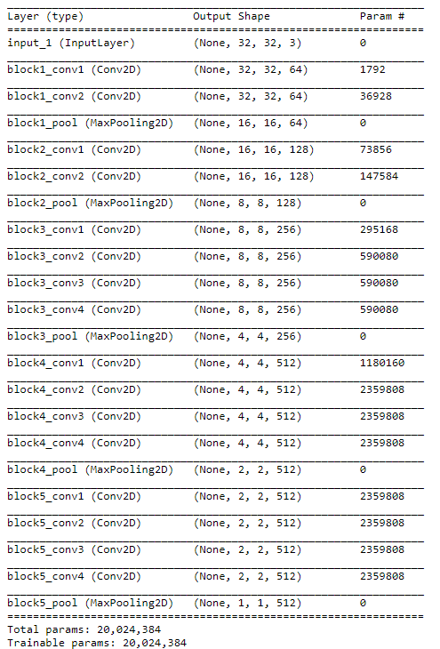
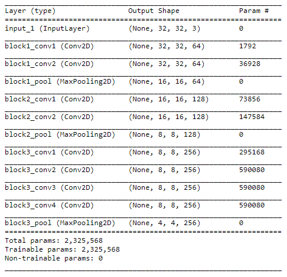
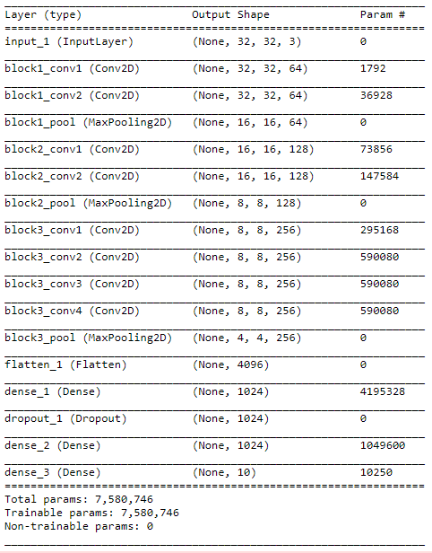
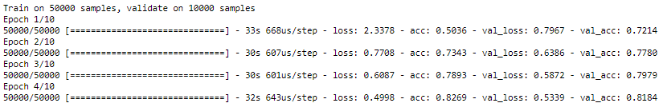

        

# 十、思考现在和未来的发展

在本书的整个过程中，我们有幸一起探索了一个有趣的想法，这个想法充斥着并且目前主导着**人工智能** ( **AI** ): **人工神经网络** ( **ANNs** )。在我们的旅程中，我们有机会详细了解神经模型的功能，包括前馈、卷积和循环网络，从而**长期短期记忆** ( **LSTM** )。我们继续我们的旅程，随后探索自监督的方法，包括使用深度 Q 网络的**强化学习** ( **RL** )以及自编码器。我们通过回顾生成模型背后的直觉来结束我们的旅行。

在本章中，我们将讨论以下主题:

*   用迁移学习分享表征
*   Keras 上的迁移学习
*   结束我们的实验
*   学习表征
*   当前神经网络的局限性
*   鼓励稀疏表示学习
*   调谐超参数
*   自动优化和进化算法
*   多网络预测和集合模型
*   人工智能和神经网络的未来
*   前方的路
*   经典计算的问题
*   量子计算的出现
*   量子神经网络
*   技术与社会
*   思考未来

        

# 用迁移学习分享表征

我们尚未有幸讨论的一个强大的范例是迁移学习的概念。在我们的游览中，我们看到了各种方法和技术，允许神经网络从它们看到的数据中归纳出强大而准确的表示。

然而，如果我们想把这些学习到的表征转移到其他网络上呢？如果我们正在处理一个事先没有很多训练数据的任务，这可能非常有用。本质上，迁移学习寻求利用可能共享相似统计特征的不同学习任务之间的共性。考虑下面的情况:你是一名放射科医生，想要使用一个**卷积神经网络** ( **CNN** )来对不同的肺部疾病进行分类，使用胸部 X 射线的图像。唯一的问题是你只有大约 100 张带标签的胸部 x 光照片。因为你不能为任何不知情的病人订购 x 光片来增加你的数据集，所以你需要变得有创造性。也许你有同一现象的不同图像(比如核磁共振和 CT 扫描)，或者也许你有许多来自不同身体部位的 x 光图像。那么，为什么不用这些呢？

既然我们知道 CNN 中的早期层学习相同的低级特征(如边缘、线段和曲率)，为什么不简单地从不同的任务中重用这些学习到的特征，并将该模型微调到我们的新学习任务？在许多情况下，与从头开始训练网络相比，迁移学习可以节省大量时间，并且是深度学习中非常有用的工具。本着这种精神，让我们探索最后一个实际例子:在 Keras 上实现一个简单的迁移学习工作流。

        

# Keras 上的迁移学习

在这一节中，我们将探索一种非常简单的迁移学习方法。这背后的想法很简单:为什么要浪费宝贵的计算资源来学习几乎所有图像都有的重复的低级特征呢？

我们将使用著名的`CIFAR10`数据集来说明我们的实现，我们的任务是对数据集中出现的 10 个图像类别中的任何一个进行分类。然而，我们将通过使用预训练网络中的层并将它们添加到我们自己的网络中来增加我们的学习经验。为此，我们将导入一个非常深入的 CNN，它已经在昂贵的**图形处理单元**(**GPU**)上训练了数百个小时，并简单地将其微调到我们的用例。我们将使用的模型与我们在第四章、*卷积神经网络、*中使用的 **VGG 网**相同，以可视化神经网络如何看到猎豹。

然而，这一次，我们将把它切开，挑选出一些中间层来拼接到我们自己的模型中，从而将它所学到的东西转移到新的任务中。我们将从进口开始:

```py
 "import numpy as np\n",
 "import matplotlib.pyplot as plt\n",
 "% matplotlib inline\n",
 "\n",
 "\n",
 "from keras import applications\n",
 "from keras import optimizers\n",
 "from keras.models import Sequential, Model \n",
 "from keras.layers import Dropout, Flatten, Dense, GlobalAveragePooling2D, Input\n",
 "from keras import backend as k \n",
 "from keras.datasets import cifar10\n",
 "from keras import utils"
```

        

# 加载预训练模型

我们在 VGG16 模型中定义了我们的图像尺寸和负载，以及它在 **ImageNet** 分类任务(ILSVRC)中获得的训练权重，不包括它的输入层。我们这样做是因为我们将用来训练网络的图像在尺寸上不同于它被训练的原始图像。在下面的代码块中，我们可以直观地总结我们在中加载的模型对象:

```py
img_width, img_height = 32, 32
model = applications.VGG19(weights = "imagenet", include_top=False, input_shape = (img_width, img_height, 3))
model.summary()
```

输出如下所示:



这是一个相当大的模型。事实上，它有大约 2000 万个可训练参数！

        

# 从模型中获取中间层

多亏了 Keras 的乐高式模块化界面，我们可以做一些真正酷的事情，比如拆开前面提到的模型，并将其层作为另一个网络的一部分重复使用。这将是我们的下一步，使用函数式 API 可以轻松实现:

```py
model2= Model(inputs=model.input, outputs=   
              model.get_layer('block3_pool').output) 
model2.summary()
```

获得的结果如下:



请注意，我们所要做的就是使用函数式 API 初始化一个模型对象，并将 VGG 网的前 12 层传递给它。这是通过在 VGG 模型对象上使用`.get_layer()`方法并给它传递一个层名来实现的。回想一下，可以通过在给定的模型对象上使用`.summary()`方法来验证单个层的名称。

        

# 向模型添加层

现在我们已经从 VGG 网络中检索到了经过预训练的中间层。接下来，我们可以将更多连续层连接到这些预训练层。这背后的想法是使用由预训练层学习的表示，并基于它们，从而用来自不同学习任务的知识来扩充分类任务:

```py
 #Adding custom Layers
 num_classes = 10

 x = model2.output
 x = Flatten()(x)
 x = Dense(1024, activation="relu")(x)
 x = Dropout(0.5)(x)
 x = Dense(1024, activation="relu")(x)
 predictions = Dense(num_classes, activation="softmax")(x)
```

为了向我们的模型添加更多层，我们将再次使用函数式 API 语法来创建一个简单的前馈网络，该网络从选定的 VGG 网络层获取输出值，并将它们展平为 2D 阵列，然后将它们向前传递到具有 1，024 个神经元的密集连接的层。这一层然后连接到一个重度漏失层，在该层中，前一层的一半神经连接在训练时被忽略。

接下来，在到达最终输出层之前，我们还有另一个由 1024 个神经元组成的密集层。输出层配备了 10 个神经元，与我们训练数据中的类别数量有关，以及一个 softmax 激活函数，它将为网络看到的每个观察值生成 10 向概率得分。

既然我们已经定义了希望添加到网络中的层，我们可以再次使用函数式 API 语法将两个独立的模型合并在一起:

```py
# creating the final model
model_final = Model(input = model2.input, output = predictions)
model_final.summary()
```

您将得到以下输出:



最重要的是，我们必须冻结 VGG 模型的层权重，以便从它在之前的训练课程中在那些昂贵的 GPU 上编码的表示中受益。

在这里，我们只选择冻结前四层，并决定让架构的其余部分重新培训这项新的学习任务:

```py
# Freeze the layers that dont need to train
for layer in model2.layers[:4]:
    layer.trainable = False
```

其他方法可以选择保持整个模型架构冻结，并且仅重新初始化模型的最后一层的权重。我们鼓励您尝试冻结不同数量的层，并探索这如何改变网络的学习体验，例如，通过可视化损失收敛。

直觉上，不同的学习任务可能需要不同的方法。它自然取决于许多因素，例如任务之间的相似性、训练数据之间的相似性等等。

一个常见的经验法则是，如果在目标学习任务中只有非常少的数据可用，则仅重新初始化最后一层的权重。相反，如果在目标任务上有大量数据可用，那么甚至可以设想在训练期间重新初始化整个网络的权重。在这种情况下，您可以简单地使用一个预训练的模型，并针对不同的用例重新实现它。和深度学习一样，答案在于实验。

        

# 加载和预处理数据

接下来，我们对 CIFAR10 图像进行预处理，并对标签进行矢量化，正如我们在本书的整个课程中所做的那样。这里没有什么特别需要注意的:

```py
(x_train, y_train),(x_test, y_test)=cifar10.load_data() 
x_train = x_train.astype('float32')
x_test = x_test.astype('float32')
x_train /= 255
x_test /= 255
y_train = utils.to_categorical(y_train, num_classes)
y_test = utils.to_categorical(y_test, num_classes)
```

我们首先在第一个代码块中加载图像。在第二个块中，我们将像素值标准化为介于`0`和`1`之间的浮点值。最后，在最后一个模块中，我们对标签进行一次性编码。现在，我们的网络已经可以编译和训练了。

        

# 训练网络

接下来，我们用分类交叉熵`loss`函数和`Adam`优化器编译我们的模型。然后，我们可以启动培训课程，如下所示:

```py
# compile the model
model_final.compile(loss = "categorical_crossentropy", optimizer =  
      optimizers.Adam(lr=0.0001), metrics=["accuracy"])
```

以下是获得的输出:



该模型在 10 个时期内分批训练 128 幅图像。所实现的验证准确度约为 85%，这比从零开始训练的相同模型好得多。您可以在训练模型之前，通过解冻冻结的层来亲自尝试一下。我们找到了。现在，您已经在 Keras 中实现了迁移学习工作流，并且能够在需要预训练或微调的用例中重用神经网络

        

# 练习

1.  通过从预训练的 VGG 网络中检索更多的块来试验不同的模型深度。模型越深，精度越好吗？选择图层的位置不同。
2.  改变可训练层数；这对`loss`的收敛有什么影响？
3.  从`keras.applications`中可用的 10 个预训练模型中尝试一个不同的模型，使用迁移学习的概念构建一个分类器。
4.  听听 https://www.youtube.com/watch?v=yofjFQddwHE[吴恩达谈迁移学习。](https://www.youtube.com/watch?v=yofjFQddwHE)

        

# 结束我们的实验

这种解释结束了我们对各种神经网络结构的探索和实验。然而，仍然有很多东西需要讨论和发现。毕竟，当我们的旅程接近尾声时，你的旅程才刚刚开始！我们可以继续探索无数的用例、架构变化和实现细节，但是这样做会偏离我们对这项工作最初的雄心。我们希望对神经网络实际上做什么、它们如何操作以及在什么情况下可以分别使用它们有一个详细的了解。此外，我们希望对这些网络内部实际发生的事情，以及为什么这些架构工作得这么好，有一种内在的直觉。本章的其余部分将致力于巩固这一概念，让你更好地理解表征学习的基本思想，并将这一概念应用于你可能希望使用神经网络解决的任何未来用例。最后，我们还将借此机会介绍人工神经网络领域的一些最新发展，以及不同的企业和机构是如何为这项技术精心制作工具的。最后，我们还将尝试向未来迈进一步，并推测未来的发展将如何影响科学、经济和社会前景，以及大数据等现象和量子计算等潜在技术飞跃的出现。

        

# 学习表征

虽然我们在第一章、*神经网络概述*中讨论了表征的主题以及它如何影响学习任务，但我们现在可以进一步深化我们的讨论，因为我们已经执行了一些实际的例子。

到目前为止，我们都很清楚，任何**机器学习** ( **ML** )算法(包括深度学习算法，如神经网络)的成功都直接取决于我们选择的表示数据的方式。这是怎么回事？

为了证明表征的重要性及其对信息处理的影响，回想一下我们在本书前面看到的一个简洁的例子。我们进行了数学运算，例如使用罗马数字的长除法，揭示了使用次优表示执行这样一个任务的难度。事实上，我们选择表示信息的方式会直接影响我们处理信息的方式、我们能够对信息执行的操作以及我们可能获得的理解。

        

# DNA 和技术

考虑另一个例子:DNA 分子。**脱氧核糖核酸** ( **DNA** )是由两条相互缠绕的链状线组成的分子结构，被称为**双螺旋结构**。这种分子可以分解成**更简单的单体单元**(或**类核**)，形成由四个氮基构件中的两个组成的碱基对(它们是**腺嘌呤** ( **A** )、**鸟嘌呤** ( **G** )、**胸腺嘧啶** ( **T** )和**胞嘧啶** (

 **你们中的许多人可能会在这一点上感到疑惑，“*这与手头的主题有什么关系？”*事实证明，这种分子结构拥有这个星球上所有生命形式的蓝图。分子控制着细胞如何分裂，如何变成更复杂的结构，一直到我们地球上动植物的偏好和行为。

不用说，这个代表信息的四进制系统已经找到了一种编码和复制指令的方法，来产生我们周围看到的所有生命！迄今为止，人类设计的任何表现形式都无法接近模拟我们所知的生命的广阔领域。事实上，我们仍然在努力模拟真实的沉浸式游戏环境以供娱乐。奇怪的是，根据许多估计，DNA 分子本身可以用我们自己的二进制系统来表示，大约有 1.5 千兆字节的数据。想想看，1.5 千兆字节的数据，或者一张蓝光光盘，能够存储生命本身的所有指令。但我们能做的也就这些了。我们不能确切地指示蓝光光盘不断地将自己复制成我们每天所体现和看到的复杂性。抛开硬件考虑，我们不能以这种方式复制生命运作的一个最重要的原因是由于数据本身的表现！因此，我们表示数据的方式对我们可能执行的转换类型有着严重的影响，导致更加复杂的信息处理系统。** **        

# 当前神经网络的局限性

类似地，在 ML 中，假设数据的不同表示允许捕获其中存在的变化的不同解释因素。我们看到的神经网络在从输入值中归纳出有效的表示，并利用这些表示来完成各种学习任务方面表现出色。然而，这些输入值本身必须经过大量的预处理，将原始数据转换成更适合网络的格式。

目前，神经网络的缺陷涉及它们严重依赖于这种预处理和特征工程考虑来从给定数据中学习有用的表示。就其本身而言，它们无法从原始输入值中提取区别性元素并对其进行分类。通常，在每一个神经网络的背后，都有一个人。

为了克服这个缺陷，我们仍然需要运用我们的聪明才智、领域知识和好奇心。然而，最终我们将努力设计出需要最少人工干预的系统(例如以特征工程的形式)，并真正理解世界上存在的原始数据。设计这样一个系统是人工智能领域最重要的目标之一，也是我们希望你能帮助推进的目标之一。

然而，就目前而言，我们将涵盖一些有用的概念，这些概念允许我们从原始数据中设计更好的表示，从而为我们的人工对应物设计更好的学习体验。

        

# 机器的工程表示

表征学习的主题正好解决了这个问题。直觉上，我们这样问自己:*如何才能让机器更容易地从数据中提取有用的信息？*这一概念与这样一种想法有着内在的联系，即存在某些关于世界的概括假设，这些假设可用于更好地解释和综合可用的原始数据。这些一般化的假设，与实验技术相结合，允许我们设计好的表示，并抛弃坏的表示。在为学习算法(如神经网络)设计预处理工作流时，它们充当实验的原则。

        

# 一个好的代表应该是怎样的？

直觉上，一个好的表现应该能够解开导致一个事件发生的变化的主要因素。因此，一种方法可能是以某种方式增加分析工作流，以便使机器更容易发现这些变化因素。

几十年来，研究人员积累了一套适用于深度学习领域的启发式假设，允许我们做到这一点。接下来，我们将再现这种启发式或正则化策略的子集，已知这些策略可以增加深度神经网络的学习经验。

关于表征学习所涉及的所有考虑因素的全面技术综述，请参考深度学习的一些先驱的这篇优秀论文——*表征学习:回顾和新观点*(Y·本吉奥，A·库维尔，帕斯卡尔·文森特，2016):【https://arxiv.org/pdf/1206.5538.pdf】T2。

        

# 预处理和数据处理

你一定已经很清楚了，神经网络相当挑食。也就是说，在将我们的数据输入神经网络之前，需要执行两个主要操作:**矢量化**和**归一化**。

        

# …向量化…

回想一下，矢量化仅仅意味着数据的所有输入和目标变量都必须是张量格式，包含浮点值(或者在特定情况下，如波士顿房价回归示例中的整数)。我们之前通过使用索引值填充零矩阵(如在情感分类示例中)，或者通过对变量进行一键编码来实现这一点。

        

# 正常化

除了矢量化之外，我们还必须考虑输入数据的规范化。这在大多数 ML 工作流中更像是一种标准实践，包括将我们的输入变量转换成一个小的、同质的值范围。我们在图像处理等任务中通过在 0 和 1 之间归一化像素值来实现这一点。在我们的输入变量处于不同尺度的情况下(比如波士顿的例子)，我们必须实现一个独立的基于特征的归一化策略。放弃这些步骤可能导致梯度更新不收敛到全局最小值，使得网络学习更加困难。一般来说，经验法则可以是尝试独立的特征归一化，确保特征方面的平均值为 0，标准偏差为 1。

        

# 数据的平滑度

如果向神经网络显示局部平滑的数据分布，则它们在预测方面最不费力。这是什么意思？简单来说，如果一个输入， *x* ，*产生一个输出， *y* ，靠近这个输入的一个点会产生一个按比例靠近 *y* 的输出。这是平滑的属性，并极大地增强了学习架构，如神经网络，允许它们从这些数据中捕捉更好的表示。然而，不幸的是，在你的数据分布中具有这种属性并不是神经网络学习良好表示的唯一标准；例如，维数灾难仍然需要通过特征选择或维数缩减来解决。*

例如，在你的数据中加入平滑因子，可以极大地有利于学习过程，正如我们用 LSTMs 预测股票市场价格时所做的那样。

        

# 鼓励稀疏表示学习

假设你正在训练一个网络对猫和狗的图片进行分类。在训练过程中，中间层将从输入值中学习不同的表示或特征(如猫耳朵、狗眼睛等)，以概率方式组合它们以检测输出类的存在(即，图片是猫还是狗)。

然而，在对单个图像进行推理时，我们需要检测猫耳朵的特征来确定这个特定图像是狗的吗？几乎在所有情况下，答案都是响亮的“不”。大多数时候，我们可以假设网络在训练期间学习的大多数特征实际上与每个单独的预测都不相关。因此，我们希望我们的网络学习每个输入的稀疏表示，这是一个结果张量表示，其中大多数条目为零(表示可能存在或不存在相应的特征)。

在深度学习中，稀疏性是学习表示的一个非常理想的属性。这不仅允许我们在表示一种现象时有较少数量的神经元活跃(从而提高我们网络的效率)，而且还帮助网络更好地理清数据本身中存在的主要变化因素。

直观上，稀疏性允许网络识别数据中的学习特征，而不受输入中出现的小变化的干扰。就实现而言，稀疏性只是在表示任何单个输入时，将大多数学习到的特征的值强制为零。稀疏表示可以通过诸如一键编码、由激活函数施加的非线性变换之类的操作来学习，或者通过相对于输入值惩罚中间层导数的其他手段来学习。

        

# 调谐超参数

一般来说，假设更深的模型架构提供了更高的表示能力，允许我们为预测任务分层组织抽象表示。

然而，正如我们所知，更深层次的架构容易过度拟合，因此可能难以训练，需要密切关注正则化等方面(如第 3 章[、*信号处理-神经网络数据分析*中探讨的正则化策略所示)。我们如何准确评估初始化多少层，使用适当数量的神经元和相关的正则化策略？考虑到设计正确架构的复杂性，试验不同的模型超参数以找到正确的网络规格来解决手头的任务可能会非常耗时。](https://cdp.packtpub.com/hands_on_neural_networks_with_keras/wp-admin/post.php?post=26&action=edit)

虽然我们已经讨论了设计更健壮的体系结构的一般直觉，使用了诸如丢弃和批处理规范化之类的技术，但我们不禁想知道是否有一种方法可以自动完成这整个乏味的过程。将深度学习应用于这一过程本身甚至会很有吸引力，因为这不是一个离散约束的优化问题(与我们迄今为止使用梯度下降解决的连续优化问题相反)。

        

# 自动优化和进化算法

幸运的是，有许多工具允许这种自动参数优化。Talos(【https://github.com/autonomio/talos】)就是这样一个建立在 Keras 库之上的工具，在 GitHub 上开源。它允许您预定义一组超参数(如不同的层数、每层神经元和激活函数)，之后该工具将自动训练和比较那些 Keras 模型，以评估哪一个性能更好。

其他解决方案，如**Hyperas**([https://github.com/maxpumperla/hyperas](https://github.com/maxpumperla/hyperas))或**auto _ ML**([https://auto-ml.readthedocs.io/en/latest/](https://auto-ml.readthedocs.io/en/latest/))允许类似的功能，并可以帮助大幅减少开发时间，让您发现哪些超参数最适合您的任务。事实上，您可以使用这样的工具，并制作自己的遗传算法，帮助您从超参数池中进行选择，训练和评估网络，然后选择那些网络架构中的最佳者，随机变异所选网络的一些超参数，并再次重复训练和评估。最终，这种算法可以产生越来越复杂的架构来解决给定的问题，就像自然界中的进化一样。虽然对这种方法的详细概述超出了本书的范围，但我们接下来将冒昧地联系这种方法的一个简单实现，它允许不断发展网络参数，以便找到理想的配置。

        

# 参考

*   **进化算法和神经网络**:【http://www.weiss-gerhard.info/publications/C22.pdf】T2
*   **进化神经网络的实现**:[https://blog . coast . ai/lets-evolve-a-neural-network-with-a-a-genetic-algorithm-code-included-8809 bece 164](https://blog.coast.ai/lets-evolve-a-neural-network-with-a-genetic-algorithm-code-included-8809bece164)

        

# 多网络预测和集合模型

另一种充分利用神经网络的方法是使用集成模型。这个想法很简单:当你可以使用多个网络时，为什么要使用一个呢？换句话说，为什么不设计不同的神经网络，每一个都对输入数据中的特定表示敏感呢？然后，我们可以对他们的预测进行平均，得到一个比只使用一个网络更通用、更简洁的预测。

我们甚至可以通过将每个网络的预测与其在任务中达到的测试精度挂钩，来为每个网络赋予权重。然后，我们可以对来自每个网络的预测进行加权平均(根据它们的相对精度进行加权),从而得到更全面的预测。

直观上，我们只是用不同的眼光看数据；每一个网络，由于其设计，可能会注意到不同的变化因素，可能会被其他对手忽略。这种方法实现起来相当直接和简单，并且只需要设计单独的网络，并且对每个网络可以预期捕获哪种表示具有良好的直觉。之后，简单的问题就是给每个单独网络的预测加上适当的权重，然后平均出结果。

        

# 人工智能和神经网络的未来

在这本书的整个过程中，我们已经深入到一个特定的人工智能领域，嵌套在 ML 中，我们称之为深度学习。机器智能的这一警告采用了连接主义方法，结合了分布式表示的预测能力，进而由深度神经网络学习。

自从 GPU 的出现、加速计算和大数据的可用性以来，深度学习神经网络已经变得突出，自从大约十年前它们重新流行以来，许多考虑因素已经进入改善这些架构背后的直觉和实现(Hinton 等人，2008)。然而，仍然存在许多深度学习尚未能够充分解决的复杂任务。

        

# 全局向量方法

有时，对给定输入值的数学变换序列不足以学习将它们映射到某些输出值的有效函数。很多这样的例子已经存在，尤其是在自然语言处理领域。虽然我们将 NLP 用例限制为简单的单词矢量化，但这种方法对于一些需要理解人类语言中存在的复杂依赖关系的用例来说是有限的。

相反，一种流行的方法是象征性地将属性赋予单词，将属性值赋予这些属性，以便与其他单词进行比较。这是一种被称为**全局向量** ( **手套**)的技术背后的基本直觉，在数据被馈送到神经网络之前，该技术被用作文本预处理矢量化技术。这种方法可能暗示了深度学习的使用在未来将如何发展。这个特定的工作流程说明了如何使用分布式和符号表示的原理来发现、理解和解决复杂的问题，例如机器问答中的逻辑推理。

        

# 分布式表示

在未来，我们很有可能开始使用人工智能各个学科的原则，结合深度学习带来的分布式表示的力量，来设计真正普遍智能的系统。这样的系统能够以自主的方式完成学习任务，并增强处理复杂问题的能力。例如，它可以按照科学方法进行研究，从而实现人类知识发现的自动化。简而言之，深度学习将会一直存在，并将有可能被人工智能的其他子领域所补充，以开发非常强大的计算系统。

        

# 硬件障碍

然而，在我们到达人工智能的那个阶段之前，肯定还有其他的改进要做。回想一下，深度学习变得流行不仅是因为我们学会了在更高层次上表示和处理数据的技术，还因为我们的硬件得到了大幅改善。我们现在可以获得大约几十年前花费数百万美元的处理能力，实际上只需要几千美元。同样，在我们能够设计出能够解决人类重大问题的真正直觉和逻辑优越的系统之前，人类可能还需要克服另一个硬件障碍。

许多人推测这一巨大的飞跃将以量子计算的形式实现。虽然深入讨论这个主题有点超出了本书的范围(以及作者的熟练程度)，但我们不得不包括一个简短的括号，以说明将神经网络引入新兴计算范式所涉及的好处和复杂性，具有光明的前景。

        

# 前方的路

虽然之前描绘处理能力进步的图表可能会让我们怀旧地回顾我们已经走了多远，但一旦我们意识到我们还有多远的路要走，这种怀旧情绪将很快被抹去。

正如我们在前面的图表中看到的，到目前为止，我们实现的系统的计算能力远不及人脑。我们设计的神经网络(至少在本书中)具有从一百万(相当于蟑螂的数量)到大约一千万(接近成年斑马鱼的常见数量)的神经元数量。

截至本书出版之日，试图训练一个与人类思维平行的网络，至少在所用神经元的数量上，目前超出了人类工程学的范围。它完全超过了我们目前的计算能力。此外，值得注意的是，这种比较自然忽略了每个学习系统(人工与生物)中的神经元在形式和功能上都不同的细节。

生物神经元的运作方式与人工神经元大相径庭，并受到分子化学等量子系统的影响。现代神经科学仍然没有完全理解生物神经元中信息处理和存储的确切性质。那么，我们如何模拟我们还没有完全理解的东西呢？解决这一难题的一个办法是设计更强大的计算机，能够以更适合该领域的方式表示和转换信息。这就把我们带到了量子计算的现象。

        

# 经典计算的问题

简单地说，量子力学是一个研究非常小、孤立和寒冷的事物的领域。虽然这一开始可能不会创建一个吸引人的画面，但是考虑一下我们当前面临的问题。正如摩尔定律所预测的那样，芯片中晶体管数量的指数增长似乎正在放缓。

为什么这很重要？这些晶体管实际上是允许我们计算的东西！从简单的数据存储到神经网络固有的复杂数学运算，经典计算机中的所有数据表示都依赖于这些半导体器件。我们用它们来放大和转换电信号，从而创造出能够跟踪带电电子存在与否的逻辑门。可以操纵这些开关来产生代表一个信息单元的二进制数字或比特。本质上，这种二进制系统形成了所有数字编码的基础，利用晶体管的物理特性来存储和处理信息。它是机器的语言，允许表达和处理信息。

从第一台全数字和可编程计算机(Z3，1938)，到最新的超级计算机(IBMs Summit，2018)，这种基本的表示语言没有改变。出于所有的意图和目的，机器的通用语已经基于二进制系统保持了大约一个世纪。

然而，正如我们前面讨论的，不同的表示允许我们执行不同的操作。因此，也许是时候修改我们表示数据的基本方式了。鉴于晶体管只能变得如此之小的事实，我们正在缓慢但肯定地达到经典计算的极限。因此，有什么地方比无限小而奇异的量子力学世界更适合寻找答案呢？

        

# 量子计算的出现

虽然经典计算机使用二进制表示将信息编码成比特，但它们的量子计算机使用物理定律将信息编码成 **Q 比特**。有许多方法可以设计这样的系统。例如，你可以用微波脉冲来改变电子的自旋动量，来表示和存储信息。

        

# 量子叠加

事实证明，这可能允许我们利用有趣的量子现象来表示没有已知经典对应物的操作。诸如**量子叠加**之类的操作，其中两个不同的量子态可以相加在一起产生第三个状态，其自身有效。因此，与其经典对应物不同，Q 位元可以有三种状态:(0)、(1)和(1/0)，其中第三种状态代表只有透过量子叠加的特性才能达到的状态。

自然地，这允许我们表现更多的信息，为我们处理更高复杂度的问题(例如模拟智能)打开了大门。

        

# 区分 Q 位和经典位

其他量子特性也存在，将 Q 位元与经典位元区分开来。例如，两个 Q 比特可以进入纠缠态，其中每个 Q 比特的电子自旋被设置为连续指向相反的方向。

为什么这是一件大事？那么，这两个 Q 位可以相隔数十亿英里，同时似乎仍然保持彼此之间的联系。根据物理定律，我们知道每个电子的自旋在被观察时总是指向相反的方向，而不管 Q 比特之间的距离。

这种纠缠态很有趣，因为没有一种经典的运算可以代表两个不同的位元没有特定的值，却总是保持彼此相反的值。除了它们带来的指数级计算能力之外，这些概念有可能彻底改变通信和密码学等领域。量子计算机可以利用的 Q 比特越多，它就可以使用更多的非经典操作来表示和处理数据。本质上，这些是量子计算背后的一些关键的想法。

        

# 量子神经网络

你们中的许多人可能认为这一切都很好，但我们自己肯定还需要几十年才能使用量子计算机，更不用说在其上设计神经网络了。尽管健康的怀疑主义总是好的，但它并没有公平对待当代研究人员、科学家和企业夜以继日地将这些系统带入生活的努力。例如，你可能会惊讶地发现，今天世界上任何一个有互联网连接的人都可以免费使用量子计算机，使用这里的链接(由 IBM 提供):[https://quantumexperience.ng.bluemix.net/qx/editor](https://quantumexperience.ng.bluemix.net/qx/editor)。

事实上，Francesco Tacchino 和他的同事等研究人员已经使用这项服务来实现用于分类任务的量子神经网络！他们能够实现世界上第一个量子感知机，在精神上类似于我们在[第二章](https://cdp.packtpub.com/hands_on_neural_networks_with_keras/wp-admin/post.php?post=37&action=edit)、*中看到的感知机，更深入地研究神经网络*，但增加了量子力学的法则。他们使用 IBM 的 **Q-5** **特内里费**超导量子处理器来训练分类器，以检测线段等简单模式，该处理器允许操纵多达 5 个 Q 位。

虽然这可能听起来微不足道，但他们的工作意义重大。他们能够决定性地展示量子计算机如何让它能够处理的维度数量呈指数增长。例如，虽然经典感知器能够处理 n 维的输入值，但这些研究人员设计的量子感知器能够处理 2N 维的输入值！这种实现为未来的研究人员实现更复杂的架构铺平了道路。

自然，量子神经网络的领域仍处于起步阶段，因为量子计算机本身还有许多改进需要经历。然而，活跃的研究目前集中在将神经网络引入量子世界的许多领域，从连接层的直接扩展到更好地导航损失景观的量子优化算法。

有些人甚至推测，量子现象，如隧道现象，可以用来，相当字面上，隧道通过损失景观收敛到最佳网络权重极快！这真正代表了人工智能和人工智能新时代的曙光。一旦这些系统经过彻底的试验和测试，我们也许能够以新颖的方式表现真正复杂的模式，其含义超出我们目前的想象。

        

# 进一步阅读

*   关于量子神经网络的论文:[https://arxiv.org/pdf/1811.02266.pdf](https://arxiv.org/pdf/1811.02266.pdf)
*   谷歌的一篇 QNN 论文:[https://arxiv.org/pdf/1802.06002.pdf](https://arxiv.org/pdf/1802.06002.pdf)
*   谷歌量子人工智能博客:[https://AI . Google blog . com/2018/12/exploring-Quantum-neural-networks . html](https://ai.googleblog.com/2018/12/exploring-quantum-neural-networks.html)
*   量子优化算法:[https://ieeexplore.ieee.org/abstract/document/6507335](https://ieeexplore.ieee.org/abstract/document/6507335)

        

# 技术与社会

今天，我们站在非常有趣的时代的十字路口。一些人声称，这个时代将决定人类的未来，并彻底改变我们感知世界和与世界互动的方式。自动化、认知技术、人工智能和量子计算只是颠覆性技术海洋中的几个例子，它们不断促使组织重新评估其价值链，并在影响世界的方式上完善自己。

也许人们将能够更有效地工作，更好地安排时间，并将他们的生命投入到独特的补充他们技能的活动中，从而为他们所参与的社会带来最佳价值。或者，也许，我们面前有一个更糟糕的未来，这样的技术被用来剥夺大众的权利，观察和控制人类行为，并限制我们的自由。虽然技术本身简单地类似于人类以前发明的任何工具，但我们选择使用这些工具的方式将对所有相关的利益相关者产生深远的影响。最终，选择权在我们手中。幸运的是，我们正处于这个新时代的黎明，因此我们仍然能够以可持续和包容性的方式引导进步的方向。

目前，全球各地的组织都在争先恐后地寻找从这些技术中收获果实的方法，以免为时过晚而无法适应，这导致了从透明度到合法性和道德的各种担忧。尽管我们仍然处于人工智能的初级阶段，但这些困境还是出现了。本质上，我们通过本书的课程探索的所有方法和技术都是狭义的人工智能技术。它们是能够解决工作流程中狭窄部分的特定系统，无论是解决特定的计算机视觉任务，还是用自然语言回答特定类型的问题。这与人工智能的概念非常不同，就其字面意义而言:一种自主的智能，可以以自给自足的方式学习，无需外部人员直接操纵其内部学习算法。这是一种可以成长和进化的智能，在精神上类似于人类婴儿成长为成人的旅程，尽管速度不同。

        

# 思考我们的未来

考虑一个新生的人类婴儿。起初，它甚至无法呼吸，必须由主治医生友好地打几下屁股才能呼吸。在最初的几个月，这个生物似乎没有做任何显著的事情，也不能独立运动，更不用说思考了。然而，慢慢地，这个婴儿对周围的世界形成了一个内部模型。它变得越来越能区分它看到的所有光线和听到的不和谐声音。很快，它开始识别运动之类的东西，也许是以一张友好的脸的形式，带着美味的粘性物质在周围盘旋。不一会儿，它通过对周围世界的观察，发展出一个不成熟的内部物理引擎。然后，它使用这些表示首先爬行，然后蹒跚学步，最终甚至行走，逐步更新其内部物理引擎，以表示越来越复杂的世界模型。很快，它就能翻跟头，创作精致的诗歌，钻研数学、历史、哲学，甚至人工智能科学。

请注意，没有人会为了让婴儿看得更清楚而调整 CNN 频道，或者为了让婴儿写出更好的诗歌而增加 LSTM 建筑的尺寸。个人能够在没有任何直接外部干预的情况下做到这一点，只需简单地观察周围的事物，倾听他人，并通过实践来学习。当一个人类婴儿成长为成年人时，在他的引擎盖下发生了许多事情，几乎所有的事情都超出了本书的范围，这个例子表明了我们离创造出真正能与我们的智力相媲美的东西还有多远。

同类型的宝宝最终可以学会开车，在一点点的帮助下，解决世界饥饿或星际旅行等复杂问题！这真是一种智慧生物。我们在书中探索的人工对应物还不值得与前一种形式的智能相比较，仅仅是因为它们的适用性较窄。它们只是拼图的一部分，是处理信息的一种方式，通常用于特定的认知领域。也许有一天，这些狭隘的技术会被整合到一个综合系统中，将众多这样的技术拼接在一起，创造出比内部组件更伟大的东西。事实上，正如我们在本书中已经看到的，这正在发生。例如，我们看到卷积架构如何与 LSTMs 等其他神经网络架构融合，用于涉及时间组件的复杂视觉信息处理，如在游戏中采取正确的步骤。

但问题仍然存在:这样的架构真的会变得智能吗？这可能是今天的哲学家的问题，但也是明天的科学家的问题。随着这些系统的进化，并征服越来越多以前只有人类才能达到的领域，我们最终将面对这些机器和我们自己的生存问题。我们真的有那么不同吗？我们只是非常复杂的计算机，通过生物学进行算术运算吗？或者智力和意识不仅仅是计算？可悲的是，我们并没有所有的答案，然而这对我们人类来说确实是一次激动人心的旅程。

        

# 摘要

在这一章中，我们重申了我们在本书中学到的东西，并看到了我们可以如何改进现有的技术。然后我们继续看深度学习的未来，并深入了解了量子计算。

我希望这次旅行能增长见识。感谢阅读，祝一切顺利！**