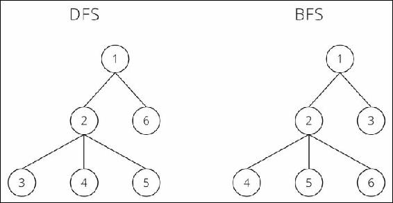
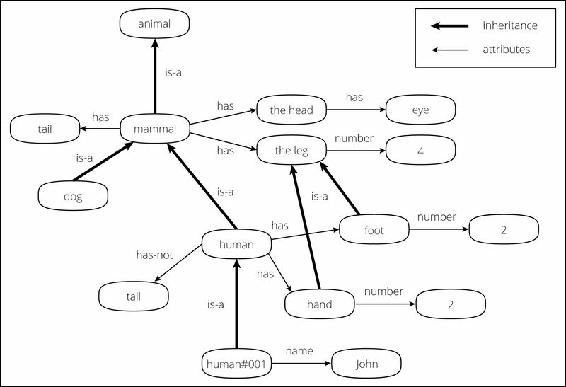
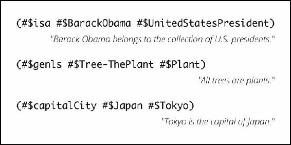
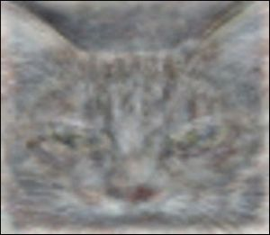
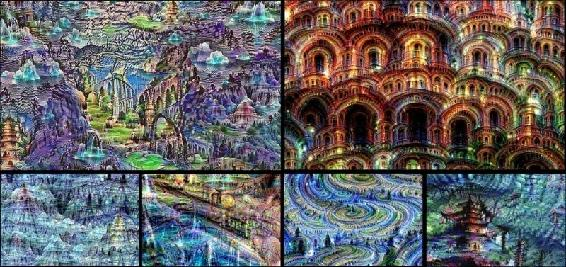
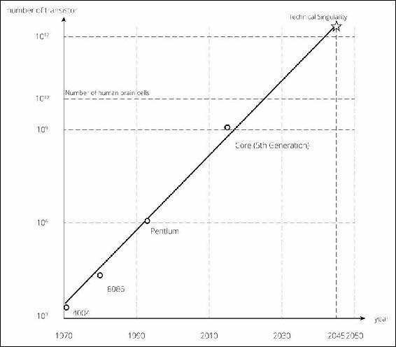

# 一、深度学习概述

人工智能(Artificial Intelligence)(**AI**)是一个你现在可能会越来越经常看到的词。人工智能不仅在学术界，而且在商业领域已经成为的热门话题。谷歌和脸书等大型科技公司积极收购人工智能相关的初创企业。这些人工智能领域的并购尤其活跃，大量资金流入人工智能领域。日本 IT/移动运营商软银在 2014 年 6 月发布了一款名为 Pepper 的机器人，它能够理解人类的感情，一年后他们已经开始向普通消费者出售 Pepper。毫无疑问，这是人工智能领域的一个良好动向。

人工智能的概念已经伴随我们几十年了。那么，为什么 AI 突然成了热门领域？驱动最近人工智能相关运动的因素之一，几乎总是与人工智能这个词一起使用的，是**深度学习**。在深度学习生动亮相，其技术能力开始呈指数级增长后，人们开始认为人工智能最终会成为现实。听起来深度学习绝对是我们需要了解的东西。那么，到底是什么呢？

为了回答前面的问题，在这一章中，我们将通过追踪人工智能的历史和研究领域来看看它为什么以及如何变得流行。涵盖的主题将是:

*   人工智能的早期方法和技术
*   机器学习的介绍以及它是如何发展成深度学习的
*   深度学习的介绍和最近的一些使用案例

如果你已经知道什么是深度学习，或者你想了解深度学习/实现技术的具体算法，你可以跳过这一章，直接跳到[第二章](part0018_split_000.html#H5A41-39437f1d2f624cb5b197ebc27900db65 "Chapter 2. Algorithms for Machine Learning – Preparing for Deep Learning")、*机器学习的算法——为深度学习做准备*。

虽然深度学习是一种创新的技术，但它实际上并没有那么复杂。这是相当惊人的简单。通读这本书，你会发现它是多么精彩。我真诚地希望这本书将有助于你对深度学习的理解，从而有助于你的研究和业务。

# 人工智能的转变

那么，为什么现在深度学习成为了焦点呢？你可能会提出这个问题，尤其是如果你熟悉机器学习的话，因为深度学习与任何其他机器学习算法都没有那么大的不同(如果你不知道这一点，请不要担心，因为我们将在本书的稍后部分进行介绍)。事实上，我们可以说深度学习是神经网络的适应，是机器学习的算法之一，模仿了人类大脑的结构。然而，深度学习所能实现的比任何其他机器学习算法(包括神经网络)都更有意义，也更不同。如果你看到深度学习经历了哪些流程和研究，你会对深度学习本身有更好的理解。所以，我们来过一遍 AI 的过渡。你可以边喝咖啡边浏览。

## 人工智能的定义

一夜之间，人工智能成了全世界的热门话题；然而，事实证明，实际的人工智能还不存在。当然，研究正在创造实际的 AI 方面取得进展，但还需要更多时间才能实现。不管你喜不喜欢，人类的大脑——可以称之为“智力”——是以一种极其复杂的方式构成的，你不可能轻易复制它。

但是等一下——我们看到许多产品的广告上到处都是 AI 或*使用 AI* 的短语。他们有欺诈行为吗？事实上，他们是！惊讶吗？你可能会看到像 AI 的*推荐系统或者 AI* 驱动的*产品这样的词，但是这里使用的 *AI* 这个词并不能表示 AI 的实际含义。严格地说，人工智能这个词有更广泛的含义。对人工智能的研究和过去积累的人工智能技术只实现了人工智能的一部分，但现在人们也在用人工智能这个词来表示那些部分。*

我们来看几个例子。粗略地划分，通常有三个不同的类别被认为是人工智能:

*   人类预先编程的简单重复的机器动作。例如，只处理同一组工作的高速处理工业机器人。
*   按照人类设定的规则搜索或猜测给定作业的答案。例如，iRobot Roomba 可以沿着房间的形状进行清理，因为它可以通过撞到障碍物来呈现房间的形状。
*   通过从现有数据中找到可测量的规律性，为未知数据提供答案。例如，基于用户购买历史或在广告网络中分发横幅广告的产品推荐系统就属于这一类。

人们用 AI 这个词来描述这些类别，不用说，利用深度学习的新技术也被称为 AI。然而，这些技术在结构和功能上都是不同的。那么，具体应该叫 AI 哪个呢？不幸的是，人们对这个问题有不同的看法，答案无法客观地解释。在学术上，根据机器可以达到的水平，一个术语被设定为**强 AI** 或**弱 AI** 。然而，在本书中，为了避免混淆，AI 被用来表示(*尚未实现)与实际人脑*难以区分的类似人类的智能。人工智能领域正在急剧发展，在深度学习的驱动下，人工智能成为现实的可能性呈指数级增长。这个领域现在比历史上任何时候都更加繁荣。这种繁荣会持续多久取决于未来的研究。

## AI 繁荣过去

AI 突然成为最近的热门话题:然而，这并不是第一次 AI 热潮。当你回顾过去时，对人工智能的研究已经进行了几十年，存在着活跃和不活跃的周期。最近的繁荣是第三次繁荣。因此，有些人实际上认为，在这个时候，这只是一个转瞬即逝的繁荣了。

然而，最近的繁荣与过去的繁荣有着显著的不同。没错，那就是深度学习。深度学习实现了过去的技术无法实现的目标。那是什么？简单来说，机器本身能够从给定的数据中找出特征量，并进行学习。有了这项成就，我们可以看到人工智能成为现实的巨大可能性，因为直到现在，机器还不能自己理解新概念，人类需要使用人工智能领域过去创造的技术预先输入一定的特征量。

如果你只是阅读这个事实，它看起来并不像是一个巨大的差异，但有一个世界的差异。在达到机器能够自己测量特征量的阶段之前，已经走过了很长的路。当机器能够获得深度学习驱动的智能时，人们终于能够向前迈出一大步。那么，过去的技术和深度学习有什么大的区别呢？让我们简单回顾一下过去的人工智能领域，以便更好地了解这种差异。

第一次人工智能热潮出现在 20 世纪 50 年代末。当时，搜索程序的主流研发是基于固定的规则——不用说，它们是人类定义的。简而言之，这种搜索就是分割案例。在这个搜索中，如果我们想要一台机器执行任何过程，我们必须写出这个过程中可能需要的每一个可能的模式。机器的计算速度比人快得多。不管图案有多大，机器都能轻松处理。一台机器会不停地搜索一百万次，最终会找到最佳答案。然而，即使一台机器可以高速计算，如果它只是随机盲目地搜索答案，那也要花费大量的时间。没错，别忘了那个约束条件，“时间”因此，对如何使搜索更有效进行了进一步的研究。研究中最流行的搜索方法是**深度优先搜索** ( **DFS** )和**广度优先搜索** ( **BFS** )。

在你能想到的每一种可能的模式中，寻找最有效的路径，并在现实的时间框架内做出最佳选择。通过这样做，你应该每次都能得到最佳答案。基于这一假设，开发了两种图数据结构树的搜索或遍历算法:DFS 和 BFS。两者都从图或树的根开始，DFS 在回溯之前尽可能地沿着每个分支探索，而 BFS 在移动到下一级邻居之前首先探索邻居节点。以下是一些显示 DFS 和 BFS 之间差异的示例图:

这些搜索算法可以在特定的领域取得特定的结果，尤其是像国际象棋和日本象棋这样的领域。这个桌游领域是机器擅长的领域之一。如果预先给它输入大量的赢/输模式、过去的游戏数据和一个棋子的所有允许移动，机器可以评估棋盘位置，并从非常大范围的模式中决定最佳的下一步移动。

对于那些对这个领域感兴趣的人，让我们更详细地看看机器是如何下棋的。假设一台机器第一步棋是“白”，那么下一步棋“白”和“黑”都有 20 种可能的走法。请记住上图中的树状模型。从游戏开始时的树顶开始，下面有 20 根树枝作为白棋的下一步棋。在这 20 个分支中的一个下面，还有另外 20 个分支作为黑棋下一个可能的移动，以此类推。在这种情况下，树有 20 x 20 = 400 个黑色分支，这取决于白色如何移动，400 x 20 = 8，000 个白色分支，8，000 x 20 = 160，000 个黑色分支，以及...如果你喜欢，可以随意计算。

一台机器生成这棵树，并从这些分支中评估每一个可能的棋盘位置，在一秒钟内决定最佳排列。它的深度(它生成和评估树的多少层)由机器的速度控制。当然，每个不同棋子的移动也应该被考虑并嵌入到程序中，所以象棋程序并不像以前认为的那样简单，但我们不会在本书中详细介绍这一点。如你所见，机器下棋能赢人并不奇怪。机器可以在比人类更短的时间内同时评估和计算大量的模式。机器打败了国际象棋冠军，这不是什么新鲜事；一台机器赢了一场人类比赛。因为像这样的故事，人们期望人工智能会成为一个真实的故事。

可惜现实没那么容易。然后，我们发现在我们面前有一堵大墙，阻止我们将搜索算法应用到现实中。众所周知，现实是复杂的。机器擅长根据给定的一组规则高速处理事物，但在只给定一个任务的情况下，它无法自己找出如何行动和应用什么规则。人类无意识地评估，丢弃许多与自己无关的事物/选项，无论何时行动，都要从现实世界的数百万事物(模式)中做出选择。机器不能像人类一样做出这些无意识的决定。如果我们创造了一台可以恰当地考虑现实世界中发生的现象的机器，我们可以假设两种可能性:

*   机器试图完成它的任务或目的，而不考虑次要发生的事件和可能性
*   机器试图完成它的任务或目的，而不考虑不相关的事件和可能性

当人类给它们任务时，这两种机器在完成它们的目的之前仍然会冻结并在处理中丢失；特别是，后一种机器甚至在采取第一个动作之前就会立即冻结。这是因为这些元素几乎是无限的，如果机器试图思考/搜索这些无限的模式，它无法在现实时间内将它们分类。这个问题被认为是人工智能领域的重要挑战之一，它被称为**框架问题**。

机器可以在国际象棋或日本象棋领域取得巨大成功，因为搜索空间(机器应该在其中处理的空间)是预先有限的(在某一帧中设置)。你不能写出大量的模式，所以你不能定义什么是最好的解决方案。即使您被迫限制模式的数量或定义一个最佳解决方案，由于需要大量的计算，您也无法在一个经济的时间框架内得到结果。毕竟，当时的研究只会让一台机器遵循人类设定的详细规则。因此，尽管这种搜索方法可能在特定领域取得成功，但它远未实现实际的人工智能。所以第一次 AI 热潮在失望中迅速降温。

第艾轰被一扫而空；然而，另一方面，对人工智能的研究仍在继续。第二次人工智能热潮出现在 20 世纪 80 年代。这个时候，所谓的**知识表征** ( **KR** )运动正在蓬勃发展。KR 意在描述机器容易理解的知识。如果世界上所有的知识都被集成到一台机器中，并且机器能够理解这些知识，那么即使给它一个复杂的任务，它也应该能够提供正确的答案。基于这一假设，人们开发了各种方法来设计知识，使机器能够更好地理解。例如，网页上的结构化形式——语义网——是试图设计一种机器更容易理解信息的方法的一个例子。下面是一个用 KR 描述语义网的例子:

让机器获得知识并不像人类片面地命令机器做什么，而更像是机器能够对人类的提问做出回应，然后做出回答。如何将其应用于现实世界的一个简单例子是正负分析，这是情绪分析的主题之一。如果你事先将定义句子中每个词的肯定或否定语气的数据(称为“字典”)输入机器，机器可以将句子和字典进行比较，以找出句子是肯定还是否定。

这项技术用于对社交网络或博客上的帖子或评论进行正反分析。如果你问一台机器“对这篇博文的反应是积极的还是消极的？”它根据自己的知识(字典)对评论进行分析，并回复给你。从第一次人工智能热潮开始，机器只遵循人类设定的规则，第二次人工智能热潮显示出一些进步。

通过将知识集成到机器中，机器就成为了全能者。这个想法本身对于实现 AI 来说还不错；然而，在实现这一目标的道路上，我们面前还有两堵高墙。首先，正如你可能已经注意到的，输入所有真实世界的知识需要几乎无限量的工作，现在互联网更加普遍地使用，我们可以从网络上获得大量的开放数据。当时，收集数百万条数据，然后进行分析并将这些知识输入到机器中是不现实的。事实上，这项将世界上所有数据建立数据库的工作一直在继续，并被称为**Cyc**([http://www.cyc.com/](http://www.cyc.com/))。Cyc 的最终目的是基于这些知识的数据库建立一个推理机，叫做**知识库**。这里是使用 Cyc 项目的 KR 的一个例子:

第二，机器并不理解这些知识的实际意义。即使知识是结构化的、系统化的，机器也是把它理解成一个标记，永远理解不了概念。毕竟，知识是由人类输入的，而机器所做的只是比较数据，并根据字典假设含义。例如，如果你知道“苹果”和“绿色”的概念，并被教导“绿色苹果=苹果+绿色”，那么你一眼就能理解“绿色苹果是绿色的苹果”，而机器则不能。这被称为**符号接地问题**，被认为是人工智能领域最大的问题之一，也是框架问题。

这个想法并不坏——它确实提高了人工智能——但是，这种方法在现实中不会实现人工智能，因为它不能创造人工智能。因此，第二次人工智能热潮在不知不觉中冷却下来，随着对人工智能的期望的丧失，谈论人工智能的人数减少了。当谈到“我们真的能够实现人工智能吗？”回答“不”的人逐渐增多。

## 机器学习进化

当人们试图建立一种实现人工智能的方法时，一种完全不同的方法已经稳步建立了一种通用技术。这种方法被称为机器学习。如果您稍微接触过数据挖掘，您应该听说过这个名字。与过去的人工智能方法相比，机器学习是一种强大的工具，过去的人工智能方法只是根据人类给出的知识进行搜索或假设，如本章前面所述，因此机器学习非常先进。在机器学习之前，机器只能从已经输入的数据中搜索答案。重点是机器能以多快的速度从保存的知识中提取出与问题相关的知识。因此，一台机器可以快速回答一个它已经知道的问题，但是当它面对它不知道的问题时就会卡住。

另一方面，在机器学习中，机器确实在学习。机器可以根据它学到的知识来处理未知的问题。你会问，机器是如何学习的？这里的*学*到底是什么？简而言之，学习是指机器可以将一个问题分为“是”或“否”，我们将在下一章详细讨论这个问题，但现在我们可以说机器学习是一种模式识别的方法。

我们可以说，最终，世界上的每一个问题都可以被一个可以用是或否来回答的问题所取代。例如，问题“你喜欢什么颜色？”可以认为几乎等同于问“你喜欢红色吗？你喜欢绿色吗？你喜欢蓝色吗？你喜欢黄色吗？..."在机器学习中，使用计算能力和高速处理能力作为武器，机器利用大量的训练数据，用是/否问题代替复杂的问题，找出哪些数据是肯定的，哪些数据是否定的规律(换句话说，它进行学习)。然后，通过这种学习，机器会假设新给出的数据是“是”还是“否”,并给出答案。综上所述，机器学习在面对未知数据作为问题时，可以通过从提供的数据中识别和整理出模式，然后将这些数据归类到可能合适的模式中(预测)，从而给出答案。

事实上，这种方法并不是在做一件特别困难的事情。人类也无意识地将数据分类成模式。例如，如果你在聚会上遇到一个完全符合你类型的男人/女人，你可能会急切地想知道你面前的这个男人/女人是否对你有类似的感觉。在你的头脑中，你会将他/她的谈话方式、眼神、表情或手势与过去的经验(即数据)进行比较，并假设你是否会去约会！这与基于模式识别的假设相同。

机器学习是一种不是由人类而是由机器以机械方式处理这种模式识别的方法。那么，机器如何识别模式并进行分类呢？机器学习的分类标准是基于一个叫做**概率统计模型**的数字公式的一个假设。已经基于各种数学模型研究了这种方法。

换句话说，学习就是调整模型的参数，一旦学习完成，就用一个调整过的参数建立一个模型。然后，机器将未知数据归类为最可能的模式(即最适合的模式)。对数据进行数学分类有很大的好处。虽然人类几乎不可能处理多维数据或多模式数据，但机器学习可以用几乎相同的数字公式处理分类。机器只需要加上一个向量或者一个矩阵的维数。(在内部，它对多维度进行分类时，不是通过分类直线或分类曲线，而是通过超平面来完成的。)

在这种方法被开发出来之前，在没有人类帮助的情况下，机器在响应未知数据方面是无能为力的，但通过机器学习，机器变得能够响应人类无法处理的数据。研究人员对机器学习的可能性感到兴奋，并抓住机会开始改进方法。机器学习的概念本身有很长的历史，但由于缺乏可用数据，研究人员无法进行大量研究并证明机器学习的有用性。然而，最近许多开源数据已经可以在网上获得，研究人员可以使用这些数据轻松地试验他们的算法。然后，第三次 AI 热潮就这样来了。机器学习周围的环境也推动了它的进步。机器学习需要大量的数据才能正确识别模式。此外，它需要有处理数据的能力。它处理的数据和模式类型越多，数据量和计算次数就越多。因此，很明显，过去的技术无法处理机器学习。

但是，时间在进步，更何况机器的处理能力也提高了。另外，web 发展了，互联网遍布全球，所以开放数据增加了。随着这种发展，每个人都可以处理数据挖掘，只要他们从网上拉数据。环境是给大家随便学机器学习设置的。网络是文本数据的宝库。通过在机器学习领域很好地利用这些文本数据，我们看到了巨大的发展，特别是在统计自然语言处理方面。机器学习在图像识别和语音识别领域也取得了突出的成就，研究人员一直致力于寻找精度最好的方法。

机器学习也被应用于商业世界的各个领域。在自然语言处理领域，你可能很快就会想到**输入法编辑器** ( **IME** )中的预测转换。搜索引擎中的图像识别、语音识别、图像搜索、语音搜索等领域就是很好的例子。当然不仅限于这些领域。它还被应用于广泛的领域，从营销目标，如特定产品的销售预测或广告的优化，或基于预测人类行为设计商店货架或空间规划，到预测金融市场的运动。可以说现在商业界数据挖掘用的最多的方法就是机器学习。是的，机器学习就是那么强大。目前，如果你听到“AI”这个词，通常情况下这个词只是指机器学习完成的一个过程。

## 甚至机器学习也做不到的事情

一台机器通过收集数据和预测答案来学习。的确，机器学习非常有用。由于机器学习，人类难以在现实时间框架内解决的问题(例如使用 100 维超平面进行分类！)对机器来说很容易。最近，“大数据”被用作一个时髦词，顺便说一句，分析这些大数据主要也是使用机器学习来完成的。

然而不幸的是，即使是机器学习也无法制造 AI。从“它实际上能实现 AI 吗？”机器学习有个很大的弱点。机器学习和人类学习在学习过程中有一个很大的区别。你可能已经注意到了不同，但是让我们看看。机器学习是基于输入数据的模式分类和预测技术。如果是，输入数据到底是什么？它能使用任何数据吗？当然……不能。很明显它不能根据不相关的数据正确预测。机器要正确学习，需要有合适的数据，但这时就出现了问题。机器无法分辨出什么是合适的数据，什么不是。只有拥有正确的数据，机器学习才能找到模式。无论问题有多简单或困难，都是人类需要找到正确的数据。

我们来思考这个问题:“你面前的物体是人还是猫？”对于人类来说，答案是显而易见的。区分它们一点都不难。现在，让我们用机器学习做同样的事情。首先，我们需要准备机器可以读取的格式，换句话说，我们需要分别准备一个人和一只猫的图像数据。这没什么特别的。问题是下一步。你可能只是想使用图像数据进行输入，但这是行不通的。如前所述，机器无法自己从数据中找出要学习的内容。机器应该学习的东西需要从原始图像数据中进行处理，并由人类创建。比方说，在这个例子中，我们可能需要使用可以定义差异的数据作为输入数据，这些差异包括面部颜色、面部位置、人和猫的面部轮廓等等。这些值作为人类需要找出的输入，被称为特征。

机器学习做不了特征工程。这是机器学习最薄弱的一点。特征就是机器学习模型中的变量。因为这个值定量地显示了对象的特征，所以机器可以适当地处理模式识别。换句话说，你如何设置恒等式的值将会对预测的精确度产生巨大的影响。潜在地，机器学习有两种类型的限制:

*   一种算法只能在假设训练数据的情况下对数据很好地工作，而数据具有不同的分布。在许多情况下，学习的模型不能很好地概括。
*   即使训练有素的模型也缺乏做出明智的元决策的能力。所以，在大多数情况下，机器学习可以在一个非常狭窄的方向上非常成功。

让我们看一个简单的例子，这样你就可以很容易地想象出恒等式是如何对模型的预测精度产生巨大影响的。假设有一家公司想要推广基于资产数量的资产管理包。公司想推荐一种合适的产品，但由于它不能问私人问题，所以它需要预测客户可能拥有多少资产，并提前做好准备。在这种情况下，什么类型的潜在客户是我们应该考虑的身份？我们可以假设许多因素，如他们的身高、体重、年龄、地址等作为身份，但显然年龄或居住地似乎比身高或体重更相关。如果你尝试基于身高或体重的机器学习，你很可能不会得到一个好结果，因为它基于无关数据进行预测，这意味着它只是一个随机预测。

因此，只有在机器读取了适当的身份之后，机器学习才能针对该问题提供适当的答案。但是，很遗憾，机器无法判断什么是合适的身份，机器学习的精度依赖于这个特征工程！

机器学习有各种方法，但无法进行特征工程的问题在所有这些方法中都存在。已经开发了各种方法，人们竞争他们的精确率，但是在我们达到一定程度的精确度之后，人们根据他们可以找到的特征的大小来决定机器学习方法的好坏。这已经不是算法上的差异，而更像是一个人的直觉或者味觉，或者参数的微调，而这根本不能说是创新。已经开发了各种方法，但毕竟，最难的事情是想出最佳身份，而人类无论如何都要做这一部分。

# 区分机器和人类的事物

我们已经经历了三个问题:框架问题、符号基础问题和特征工程。这些问题都与人类无关。那么，为什么机器不能处理这些问题呢？我们再来复习一下这三个问题。如果你仔细想想，你会发现这三个问题最终都面临着同一个问题:

*   框架问题是机器在分配任务时无法识别应该使用什么知识
*   符号接地问题是机器无法理解一个把知识放在一起的概念，因为它只把知识识别为一个标记
*   机器学习中的特征工程问题是，机器无法找出对象的特征是什么

只有当一台机器能够理清*它应该关注事物/现象的哪个特征，应该使用什么信息*时，这些问题才能得到解决。毕竟这是机器和人类最大的区别。这个世界上的每个物体都有其固有的特征。人类擅长捕捉这些特征。这是凭经验还是凭直觉？无论如何，人类知道特征，并且基于这些特征，人类可以将事物理解为“概念”

现在，让我们简单解释一下什么是概念。首先，作为一个前提，要考虑到这个世界上的每一个事物都是由一组符号表征和符号内容组成的。比如你不认识“猫”这个词，走在街上看到一只猫，是不是就说明你认不出猫了？不，这不是真的。你知道它的存在，如果你刚刚看到另一只猫，你会把它理解为“与我之前看到的类似的东西。”后来你被告知“那叫猫”，或者你自己去查，第一次可以把存在和这个词联系起来。

这个词，猫，是的**符号表征**，而你识别为猫的概念是**的符号内容**。你可以看到这是一枚硬币的两面。(有意思的是，这两方面没有必然。没有必要把 cat 写成 C-A-T 或者这样发音。即便如此，在我们的理解体系中，这些都被认为是不可避免的。如果人们听到“猫”，我们都会想到同样的事情。)这个概念就是，即符号内容。这两个概念有术语。前者是称为**signiant**后者称为**signiié**，这两个一组称为 **signe** 。(这些话是法语。你可以分别用英语说能指、所指和符号。)我们可以说，机器和人的区别在于它是否能独立发挥作用。

如果机器可以从给定的数据中找到显著的特征，会发生什么？至于框架问题，如果机器能够从给定的数据中提取显著的特征并进行知识表示，它就不会再有在思考如何提取必要的知识时冻结的问题。就符号基础问题而言，如果机器可以自己找到特征并从特征中理解概念，它就可以理解输入的符号。

不用说，机器学习中的特征工程问题也将得到解决。如果一台机器可以根据一种情况或一种目的自行获得适当的知识，而不是使用来自固定情况的知识，我们就可以解决我们在实现 AI 方面一直面临的各种问题。现在，机器可以用来从给定数据中找到重要特征值的方法已经接近完成。是的，最后，这就是深度学习。在下一部分，我将解释这种深度学习，它被认为是人工智能 50 多年历史中最大的突破。

# 人工智能和深度学习

机器学习，第三次人工智能热潮的火花，作为一种数据挖掘方法非常有用并且强大；然而，即使有了这种机器学习的方法，实现人工智能的道路似乎还是关闭了。发现特征是人类的角色，这里有一堵大墙阻止机器学习到达 AI。看起来第三次人工智能热潮也将结束。然而，令人惊讶的是，繁荣从未结束，相反，新的浪潮已经兴起。引发这波浪潮的是深度学习。

随着深度学习的出现，至少在图像识别和语音识别领域，机器变得能够自己从输入的数据中获得“它应该决定什么是特征值”，而不是从人类那里获得。一台只能将符号作为符号符号处理的机器已经能够获得概念。

人工智能发展至今与人工智能研究领域的对应图

深度学习第一次出现其实是在很久以前，回到 2006 年的。加拿大多伦多大学的辛顿教授等人发表了一篇论文([https://www.cs.toronto.edu/~hinton/absps/fastnc.pdf](https://www.cs.toronto.edu/~hinton/absps/fastnc.pdf))。本文提出了一种叫做**深度信念网** ( **DBN** )的方法，它是一种机器学习方法——神经网络的扩展。DBN 使用 MNIST 数据库进行了测试，该数据库是比较每种图像识别方法的精确度和准确度的标准数据库。这个数据库包括 70，000 个 28×28 像素的手写字符图像数据，数字从 0 到 9 (60，000 个用于训练，10，000 个用于测试)。

然后，他们根据训练数据构建了一个预测模型，并根据机器是否能正确回答测试案例中 0 到 9 中的哪个数字，来衡量其准确性。虽然这篇论文提出了一个比传统方法精度高得多的结果，但当时并没有引起太多的注意，可能是因为它与另一种通用的机器学习方法相比较。

然后，在 2012 年的一段时间后，整个人工智能研究界被一种方法震惊了。在世界图像识别大赛上， **Imagenet 大规模视觉识别挑战赛** ( **ILSVRC** )，由多伦多大学 Hinton 教授等人开发的一种使用深度学习的方法，称为监督(严格来说，这是团队的名字)，赢得了比赛。它以惊人的精确度远远超过了其他竞争者。在这次比赛中，任务是让一台机器自动区分一幅图像是猫、狗、鸟、车、船等等。提供了 1000 万张图像作为学习数据，并使用了 150，000 张图像进行测试。在这个测试中，每种方法都竞争返回最低的错误率(即最高的准确率)。

让我们来看一下显示比赛结果的下表:

| 

军阶

 | 

团队名称

 | 

错误

 |
| --- | --- | --- |
| one | 管理 | 0.15315 |
| Two | 管理 | 0.16422 |
| three | 工业标准项目（industry standard item 的缩写） | 0.26172 |
| four | 工业标准项目（industry standard item 的缩写） | 0.26602 |
| five | 工业标准项目（industry standard item 的缩写） | 0.26646 |
| six | 工业标准项目（industry standard item 的缩写） | 0.26952 |
| seven | VGG 牛津 | 0.26979 |
| eight | 外部参照/INRIA | 0.27058 |

你可以看到监督和第二位 ISI 的错误率相差超过 10%。第二个位置之后，只是 0.1%以内的竞争。现在你知道了，监管与精确利率相比有多突出。而且，令人惊讶的是，这是监督第一次加入这个 ILSVRC，换句话说，图像识别不是他们通常的领域。在监督(深度学习)出现之前，图像识别领域的正常方法是机器学习。而且，如前所述，使用机器学习所必需的特征值必须由人类来设置或设计。他们重申了基于人类直觉和经验的设计特点，并一遍又一遍地微调参数，最终只提高了 0.1%的精度。在深度学习发展之前，研究和竞争的主要问题是谁能够发明良好的特征工程。因此，当深度学习突然出现时，研究人员一定很惊讶。

还有一个重大事件将深度学习传播到了全世界。那次事件发生在 2012 年，同年，世界震惊于 ILSVRC 的监督，当时谷歌宣布，一台机器可以使用 YouTube 视频作为学习数据，从谷歌提出的深度学习算法中自动检测一只猫。这个算法的细节在[http://Google blog . blogspot . com/2012/06/using-large-scale-brain-simulations-for . html](http://googleblog.blogspot.com/2012/06/using-large-scale-brain-simulations-for.html)有解释。该算法从 YouTube 视频中提取了 1000 万张图片，并将其作为输入数据。现在，记住，在机器学习中，人类必须从图像中检测特征值并处理数据。另一方面，在深度学习中，原始图像可以原样用于输入。这表明机器本身会自动从训练数据中找到特征。在这项研究中，一台机器学习了猫的概念。(只有这个猫的故事很有名，但研究也是用人类的图像做的，进行得很顺利。一台机器学会了什么是人类！)研究中引入的以下图像说明了深度学习认为猫是什么的特征，在使用来自未标记的 YouTube 视频的静止帧进行训练之后:

这两个大事件让我们对深度学习印象深刻，并引发了现在仍在加速的热潮。

继开发出可以识别猫的方法之后，谷歌进行了另一项实验，让机器利用深度学习来绘制图片。这种方法叫做**in ception ism**([http://Google research . blogspot . ch/2015/06/in ception ism-go-deep-into-neural . html](http://googleresearch.blogspot.ch/2015/06/inceptionism-going-deeper-into-neural.html))。正如文中所写，在这种方法中，网络是问:

> “不管你看到了什么，我都想要更多！”。这就形成了一个反馈循环:如果一朵云看起来有点像鸟，网络就会让它看起来更像鸟。这反过来将使网络在下一次传递中更强烈地识别出这只鸟，如此类推，直到一只非常详细的鸟出现，似乎不知从哪里冒出来的。

虽然在机器学习中使用神经网络是一种通常用于检测模式的方法，以便能够指定图像，但概念主义所做的恰恰相反。正如你可以从下面的无概念主义的例子中看到的，这些画看起来很奇怪，就像一个噩梦般的世界:

或者说，它们看起来很有艺术感。这个让任何人都可以尝试概念主义的工具在 GitHub 上向公众开放，并被命名为 Deep Dream([https://github.com/google/deepdream](https://github.com/google/deepdream))。该页面上提供了示例实现。如果你能写 Python 代码，你可以试试。

嗯，没有什么能阻止深度学习获得动力，但仍然有问题，比如深度学习到底有什么创新？什么特殊函数显著提高了这种精度？令人惊讶的是，实际上，深度学习在算法上并没有太大的差异。如前所述，深度学习是神经网络的一种应用，神经网络是模仿人脑结构的机器学习算法；然而，一个设备采用了它，改变了一切。代表人物是**预训练**和**丢弃**(带激活功能)。这些也是实现的关键词，所以请记住它们。

首先，深度学习中的*深度*表示什么？你大概知道，人脑是一个电路结构，那个结构真的很复杂。它是由一个错综复杂的电路堆积在许多层。另一方面，当神经网络算法首次出现时，其结构非常简单。这是人脑的简化结构，网络只有几层。因此，它能识别的模式极其有限。所以，每个人都想知道“我们能不能像人脑一样积累网络，并使其实现变得复杂？”当然，尽管这种方法已经尝试过了。不幸的是，结果是，的精确度实际上比我们只是堆积网络要低。事实上，我们面临着各种各样的问题，而这些问题在简单的网络中是不会出现的。这是为什么？在人脑中，信号会根据你看到的东西进入不同的回路。基于不同的模式，基于哪一部分的电路被刺激，你可以区分不同的事情。

为了再现这种机制，神经网络算法通过用数字加权来代替网络的链接。这是一个很好的方法，但是很快问题就出现了。如果网络是简单的，则从学习数据中适当地分配权重，并且网络可以很好地识别和分类模式。然而，一旦网络变得复杂，链接就变得过于密集，很难在权重上有所不同。简而言之，它不能正确地划分模式。此外，在神经网络中，网络可以通过采用将训练期间发生的错误反馈到整个网络的机制来建立适当的模型。同样，如果网络简单，反馈可以正确反映，但如果网络有许多层，就会出现一个问题，即误差在反映到整个网络之前就消失了——想象一下，如果误差被扩大和稀释了。

如果用复杂的结构构建网络，事情会进展顺利的意图以令人失望的失败告终。这个算法本身的概念很棒，但无论用什么标准来衡量，它都称不上是一个好算法；这是全世界的共识。虽然深度学习成功地使网络多层化，也就是说，使网络“深度化”，但成功的关键是使每一层都分阶段学习。以前的算法将整个多层网络视为一个巨大的神经网络，并使其作为一个学习，这导致了前面提到的问题。

因此，深度学习采取了让每一层提前学习的方法。这就是所谓的预训练。在预训练中，学习按顺序从低维层开始。然后，在较低层中学习的数据被当作下一层的输入数据。这样，机器能够通过在低等级层学习低等级层的特征并逐渐学习更高等级的特征来迈出一步。比如，在学习猫是什么的时候，第一层是轮廓，下一层是眼睛和鼻子的形状，下一层是脸的图片，下一层是脸的细节，等等。同样，可以说人类采取的学习步骤与他们先捕捉全貌，后看到细节特征是一样的。由于每一层都是分阶段学习的，所以对学习错误的反馈也可以在每一层中适当地进行。这导致精度的提高。每一层的学习都有各自的方法，但这将在后面介绍。

我们还解决了网络变得过于密集的问题。防止这种密度问题的方法被称为**下降**。丢弃网络通过在网络单元内随机切断一些连接来学习。丢弃实际上使网络变得稀疏。哪个链接被切断是随机的，因此在每个学习步骤中形成不同的网络。仅仅通过观察，你可能会怀疑这是否可行，但它极大地有助于提高精度，并因此增加了网络的健壮性。人类大脑的回路也有不同的地方根据它看到的对象做出反应或不做出反应。丢弃生似乎能够成功地模仿这种机制。通过在算法中嵌入丢包，很好地完成了网络权值的调整。

深度学习已经在各个领域取得了巨大的成功；然而，深度学习当然也有缺点。如“深度学习”这个名字所示，这种方法中的学习是非常深入的。这意味着完成学习的步骤需要很长时间。这个过程中的计算量往往是巨大的。事实上，前面提到的谷歌识别一只猫的学习用了三天时间，用 1000 台计算机进行处理。相反，尽管深度学习的想法本身可以使用过去的技术来构思，但它无法实现。如果你不能轻松地使用一台具有大规模处理海量数据能力的机器，这种方法就不会出现。

正如我们一直说的，深度学习只是机器获取类人知识的第一步。没有人知道未来会发生什么样的创新。然而，我们可以预测计算机的性能在未来会提高到什么程度。为了预测这一点，使用了摩尔定律。支持计算机进程的集成电路的性能由晶体管的负载数量来表示。摩尔定律表示数字，据说晶体管的数量每一年半翻一番。事实上，计算机 CPU 中的晶体管数量遵循摩尔定律不断增加。与全球首款微处理器英特尔 4004 处理器(拥有 1 x103(1000)个晶体管)相比，最新的 2015 版第五代英特尔酷睿处理器拥有 1 x109(10 亿)个晶体管！如果这项技术继续以这样的速度发展，晶体管的数量将超过 100 亿，这比人类大脑中的细胞数量还要多。

根据摩尔定律，在更远的未来 2045 年，据说我们将到达一个称为**技术奇点**的临界点，在那里人类将能够进行技术预测。到那个时候，一台机器有望产生自我递归智能。换句话说，30 年左右，AI 就准备好了。到那时世界会是什么样子…

摩尔定律的历史

英特尔发明的处理器中装载的晶体管数量遵循摩尔定律平稳增长。

世界著名教授史蒂芬·霍金在接受 BBC 采访时回答了这个问题([http://www.bbc.com/news/technology-30290540](http://www.bbc.com/news/technology-30290540)):

> 全人工智能的发展可能意味着人类的终结

深度学习会变成黑魔法吗？的确，技术的进步有时会造成悲剧。实现人工智能仍然是遥远的未来，然而我们在深度学习上工作时应该小心。

# 总结

在这一章中，你学习了人工智能领域的技术是如何演变成深度学习的。我们现在知道人工智能有两次繁荣，我们现在正处于第三次繁荣。搜索和遍历算法是在第一次热潮中发展起来的，如 DFS 和 BFS。然后，研究集中在如何在第二次热潮中用机器容易理解的符号来表示知识。

虽然这些繁荣已经消退，但那些时期发展的技术积累了许多人工智能领域的有用知识。第三次热潮始于机器学习算法，即基于概率统计模型的模式识别和分类算法。有了机器学习，我们在各个领域都取得了很大的进步，但这还不足以实现真正的 AI，因为我们需要告诉一台机器要分类的对象的特征是什么。机器学习所需的技术被称为特征工程。然后，深度学习出现了，基于一种机器学习算法——即神经网络。机器可以通过深度学习自动学习物体的特征，因此深度学习被认为是一种非常创新的技术。深度学习的研究越来越活跃，每天都有新技术被发明出来。本书最后一章介绍了一些最新的技术，[第八章](part0045_split_000.html#1AT9A1-39437f1d2f624cb5b197ebc27900db65 "Chapter 8. What's Next?")，*下一步是什么？*，供参考。

深度学习通常被认为非常复杂，但事实并非如此。如前所述，深度学习是机器学习的不断发展的技术，深度学习本身非常简单而优雅。我们将在下一章看到机器学习算法的更多细节。对机器学习有了很大的了解，你会很容易获得深度学习的精髓。