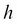

# 六、实际应用的方法——循环神经网络等等

在前面的章节中，你学到了很多关于深度学习的知识。你现在应该理解深度神经网络的概念、理论和实现的基础。您还了解到，通过利用深度学习库，您可以相对容易地在各种数据上试验深度学习算法。下一步是研究深度学习如何应用于广泛的其他领域，以及如何将其用于实际应用。

因此，在这一章中，我们将首先看到深度学习是如何实际应用的。在这里，你会看到深度学习被利用的实际案例还是很少的。但是为什么即使是这么创新的方法也没有很多案例呢？有什么问题？稍后，我们会考虑原因。此外，展望未来，我们还将考虑我们可以将深度学习应用于哪些领域，并将有机会应用深度学习和人工智能的所有相关领域。

本章涵盖的主题包括:

*   图像识别、自然语言处理以及与之相关的神经网络模型和算法
*   将深度学习模型转化为实际应用的困难
*   深度学习可以应用的可能领域，以及如何接近这些领域的想法

我们将探索这一大规模人工智能繁荣的潜力，这将带来一些想法和提示，你可以在深度学习中利用这些想法和提示进行研究、商业和许多种类的活动。

# 深度学习活跃的领域

我们经常听说深度学习的研究一直在进行，这是事实。许多公司，特别是大型科技公司，如谷歌、脸书、微软和 IBM，都投入了大量资金进行深度学习的研究，我们经常听到一些公司收购这些研究小组的消息。但是，当我们浏览时，深度学习本身有各种类型的算法，以及这些算法可以应用的领域。即便如此，深度学习在哪些领域被利用或者可以被用于并不广为人知，这是一个事实。由于“AI”这个词被如此广泛地使用，人们无法正确地理解哪种技术用于哪种产品。因此，在这一节中，我们将浏览人们一直试图积极采用深度学习进行实际应用的领域。

## 图像识别

深度学习最常融入的领域是图像识别。正是辛顿教授和他的团队的发明引出了“深度学习”这个术语。他们的算法记录了图像识别比赛中最低的错误率。为改进算法所做的持续研究带来了更好的结果。现在，利用深度学习的图像识别已经逐渐不仅被用于研究，而且被用于实际应用和产品。例如，谷歌利用深度学习为 YouTube 自动生成缩略图，或者在谷歌照片中自动标记和搜索照片。像这些流行的产品一样，深度学习主要应用于图像标记或分类，例如，在机器人领域，它用于机器人指定周围的事物。

我们之所以能够支持这些产品和这个行业，是因为深度学习更适合图像处理，这是因为它可以实现比其他任何领域的应用更高的准确率。只有图像识别的准确率和召回率这么高，才说明这个行业潜力广阔。深度学习算法([http://cs.nyu.edu/~wanli/dropc/](http://cs.nyu.edu/~wanli/dropc/))记录的 MNIST 图像分类的错误率为 0.21%，这个错误率不会低于人类的记录([http://arxiv.org/pdf/0710.2231v1.pdf](http://arxiv.org/pdf/0710.2231v1.pdf))。换句话说，如果你把它缩小到仅仅是图像识别，那只不过是机器可能战胜人类的事实。为什么只有图像识别获得如此高的精度，而其他领域的方法还需要改进？

原因之一是深度学习中特征提取的结构非常适合图像数据。在深度神经网络中，许多层被堆叠，并且在每一层逐步从训练数据中提取特征。此外，可以说图像数据以分层结构为特征。当你看图片的时候，你会不自觉地先抓住简短的特征，然后再看更详细的特征。因此，深度学习特征提取的固有属性类似于如何感知图像，因此我们可以获得特征的准确实现。尽管深度学习的图像识别仍然需要更多的改进，特别是在机器如何理解图像及其内容方面，但仅采用深度学习对图像数据进行采样而不进行预处理来获得高精度显然意味着深度学习和图像数据是很好的匹配。

另一个原因是，人们一直在努力缓慢但稳步地改进算法。比如深度学习算法中，对于图像识别能得到最好精度的 CNN，每次面对困难/任务都有所提升。引入局部感受域代替卷积层的核，以避免网络变得过于密集。此外，下采样方法，如最大池被发明，以避免网络对图像位置的差距过度反应。这最初是从一个关于如何识别写在某个框架(如邮政编码)中的手写字母的试验和错误过程中产生的。因此，在许多情况下，寻求一种新的方法来使神经网络算法适应实际应用。一个复杂的模型，CNN 也是建立在这些累积而稳定的改进之上的。虽然我们不需要具有深度学习的特征工程，但我们仍然需要考虑一种合适的方法来解决具体问题，即我们无法建立万能的模型，这就是所谓的**没有免费的午餐定理** ( **NFLT** )优化。

在图像识别领域，深度学习所能达到的分类准确率极高，实际上也开始用于实际应用。但是，深度学习可以应用的领域应该更多。图像与许多行业有着密切的联系。在未来，会有很多案例和更多的行业利用深度学习。在本书中，考虑到下一节深度学习的出现，让我们思考一下我们可以将图像识别应用于哪些行业。

## 自然语言处理

第二个最活跃的领域，在图像识别之后，深度学习的研究取得进展的是**自然语言处理** ( **NLP** )。这一领域的研究可能会成为今后最活跃的领域。关于图像识别，我们可以获得的预测精度几乎达到了上限，因为它甚至可以比人进行更好的分类。另一方面，在 NLP 中，由于深度学习，模型的性能确实变得更好，但也有许多任务仍然需要解决。

对于一些产品和实际应用，深度学习已经有了应用。比如基于深度学习的 NLP 应用于谷歌的语音搜索或者语音识别和谷歌翻译。还有 IBM Watson，理解和学习自然语言，支持人类决策的认知计算系统，从成吨的文档中提取关键词和实体，并具有标注文档的功能。这些功能作为 Watson API 向公众开放，任何人都可以不受限制地使用它。

从前面的例子中可以看出，NLP 本身有各种各样的类型。就基本技术而言，我们有句子内容的分类、词的分类和词义的说明。此外，像汉语或日语这样的单词之间不留空格的语言需要词法分析，这也是 NLP 中的另一种技术。

NLP 包含许多需要研究的东西，因此它需要澄清它的目的是什么，它的问题是什么，以及如何解决这些问题。什么模型用最好，如何恰当地得到好的精度都是需要慎重考察的话题。至于图像识别，CNN 方法是通过解决所面临的任务而发明的。现在，让我们考虑一下我们能想到什么方法，以及神经网络和 NLP 分别会有什么困难。了解过去的试错过程将有助于未来的研究和应用。

### 用于自然语言处理的前馈神经网络

NLP 的基本问题是“给定一个或多个特定单词，预测下一个单词”。然而,问题太简单了；如果你试图用神经网络来解决它，那么你将很快面临几个困难，因为使用 NLP 作为样本数据的文档或句子具有以下特征:

*   每句话的长度不是固定的而是可变的，字数是天文数字
*   可能会出现不可预见的问题，如单词拼写错误、首字母缩写词等
*   句子是顺序数据，因此包含时间信息

为什么这些特性会造成问题？记住一般神经网络的模型结构。对于用神经网络进行训练和测试，包括输入层在内的每层中的神经元数量需要预先固定，并且对于所有样本数据，网络需要具有相同的大小。同时，输入数据的长度不是固定的，可以变化很大。这意味着样本数据不能应用于模型，至少不能照现在这样应用。如果不对这些数据进行添加/修改，就无法通过神经网络进行分类或生成。

我们必须固定输入数据的长度，处理这个问题的一种方法是将一个句子从头开始按顺序分成一大块特定的单词。这个方法叫做 **N-gram** 。这里， *N* 代表每一项的大小，大小为 1 的 **N-gram** 为称为 **unigram** ，大小为 2 的为 **bigram** ，大小为的为 **trigram** 。尺寸较大时，则干脆用 *N* 的值来称呼，如*四克*、*五克*等等。

让我们看看 N-gram 如何与 NLP 一起工作。这里的目标是在给定一些历史的情况下，计算一个单词 的概率；。我们将把一系列的单词表示为。然后，我们想要计算的概率是，通过对这一项应用概率链规则，我们得到:

乍一看，这些条件概率似乎对我们有所帮助，但实际上它们并没有帮助，因为我们无法计算一个单词跟在一长串前面的单词之后的确切概率。由于句子的结构非常灵活，我们不能简单地利用样本文档和语料库来估计概率。这就是 N-gram 工作的地方。实际上，我们有两种方法来解决这个问题:原始 N-gram 模型和基于 N-gram 的神经网络模型。在我们深入研究神经网络之前，我们将看第一个来完全理解 NLP 领域是如何发展的。

对于 N-gram，我们不计算一个词在给定其整个历史的情况下的概率，而是用最后的 *N* 个词来近似历史。例如，二元模型仅通过前一个词的条件概率来近似一个词的概率，因此遵循以下等式:

类似地，我们可以推广并扩展 N-gram 的方程。在这种情况下，单词的概率可以表示如下:

我们得到下面的等式:

请记住，这些 N 元语法的近似是基于称为 **马尔可夫模型**的概率模型，其中一个单词的概率仅取决于前一个单词。

现在我们需要做的是估计这些 N 元概率，但是我们怎么估计呢？做这件事的一个简单方法叫做最大似然估计 T2。这种方法通过从语料库中获取计数并对其进行归一化来估计概率。所以当我们以二元模型为例时，我们会得到:

在前面的公式中，表示一个单词或一系列单词的计数。由于分母，即以单词开始的所有二元组计数的总和，等于的一元组计数，前面的等式可以描述如下:

相应地，我们也可以推广 N 元文法的 MLE:

虽然这是使用 N 元文法的 NLP 的基本方法，但是我们现在知道如何计算 N 元文法概率。

与这种方法相反，神经网络模型预测给定特定历史的单词的条件概率；。NLP 的模型之一叫做**神经** **网络语言模型**(**NLMM**)([http://www.jmlr.org/papers/volume3/bengio03a/bengio03a.pdf](http://www.jmlr.org/papers/volume3/bengio03a/bengio03a.pdf))，可以举例如下:

这里，是的词汇的大小，词汇中的每个单词都是一个 N 维向量，其中只有单词的索引设置为 1，其他所有索引设置为 0。这种表示方法叫做 *1-of-N 编码*。NLMM 的输入是前几个字的索引(所以是 *n-grams* )。由于大小 *N* 通常在 5000 到 200000 的范围内，NLMM 的输入向量非常稀疏。然后，每个单词被映射到投影层，用于连续的空间表示。从离散空间到连续空间的线性投影(激活)基本上是一个带有条目的查找表，其中表示特征尺寸。投影矩阵对于上下文中的不同单词位置是共享的，并且激活单词向量以用投影层单元。投影之后是隐藏层。由于投影层位于连续空间中，因此模型的结构与这里的其他神经网络完全相同。因此，激活可以表示如下:

这里，表示激活函数，表示投影层和隐藏层之间的权重，表示隐藏层的偏差。相应地，我们可以得到如下输出单位:

这里，表示隐藏层和输出层之间的权重，表示输出层的偏差。给定特定历史的单词 *i* 的概率然后可以使用soft max 函数来计算:

如你所见，在 NNLM，模型同时预测所有单词的概率。由于该模型现在是用标准的神经网络描述的，我们可以用标准的反向传播算法来训练该模型。

NNLM 是一种使用具有 N 元文法的神经网络的自然语言处理方法。虽然 NNLM 解决了如何固定输入数量的问题，但最佳的 *N* 只能通过试错来寻找，这也是整个建模过程中最困难的部分。此外，我们必须确保不要过于重视输入的时间信息。

### 自然语言处理的深度学习

具有 N-gram 的神经网络可能适用于某些情况，但包含一些问题，例如什么 N-gram 会返回最佳结果，以及 N-gram(模型的输入)是否仍然具有上下文？这些不仅是 NLP 的问题，也是所有其他有时间序列数据的领域的问题，比如降雨量、股票价格、每年的土豆产量、电影等等。由于我们在现实世界中拥有如此大量的数据，我们不能忽视潜在的问题。但是，怎么可能让神经网络用时序数据来训练呢？

#### 循环神经网络

能够保留网络内数据上下文的神经网络模型之一是**循环神经** **网络** ( **RNN** )，该模型积极研究深度学习算法的进化。下面是一个非常简单的 RNN 图形模型:

标准神经网络之间的区别在于，RNN 具有关于时间的隐藏层之间的连接。在时间的输入在时间在隐藏层中被激活，保存在隐藏层中，然后随着时间的输入在时间传播到隐藏层。这使得网络能够包含过去数据的状态并反映它们。你可能会认为 RNN 是一个相当动态的模型，但如果你在每个时间点展开模型，你会发现 RNN 是一个静态模型:

由于每个时间步的模型结构与一般神经网络中的模型结构相同，因此可以使用反向传播算法来训练该模型。但是在训练的时候需要考虑时间的相关性，有一种叫做**通过时间**(**)反向传播的技术来处理这个。在 BPTT，参数的误差和梯度被反向传播到过去的层:**

****

**因此，RNN 可以保留模型中的上下文。理论上，每个时间步的网络应考虑到当时的整个序列，但实际上，具有一定长度的时间窗通常应用于模型，以使计算不太复杂或防止消失梯度问题和爆炸梯度问题。BPTT 实现了层间训练，这就是为什么 RNN 经常被认为是深度神经网络之一。我们也有深度 RNN 的算法，如隐藏层堆叠的堆叠 RNN。**

**RNN 被改编成自然语言处理，实际上是这个领域最成功的模式之一。针对 NLP 优化的原始模型被称为**循环神经网络语言模型** ( **RNNLM** )，由 Mikolov 等人介绍([http://www . fit . vutbr . cz/research/groups/speech/publi/2010/miko lov _ interspeech 2010 _ is 100722 . pdf](http://www.fit.vutbr.cz/research/groups/speech/publi/2010/mikolov_interspeech2010_IS100722.pdf))。模型架构可以如下所示:**

****

**网络有三层:输入层，隐藏层，输出层。隐藏层通常也称为上下文层或状态层。具有的每层相对于时间的值可以表示如下:**

****

**这里，表示 sigmoid 函数，而表示 softmax 函数。由于输入层包含在时间的状态层，它可以向网络反映整个上下文。模型架构意味着 RNNLM 可以查找比前馈 NNLM 更广泛的上下文，其中上下文的长度被限制为 *N* (-gram)。**

**在训练 RNN 时，应该考虑整个时间和整个上下文，但是如前所述，我们经常截断时间长度，因为 BPTT 需要大量计算，并且在学习长期依赖性时经常导致梯度消失/爆炸问题，因此该算法通常被称为**截断 BPTT** 。如果我们相对于时间展开 RNNLM，模型可以如下所示(图中，展开时间):**

****

**这里是输出的标签向量。那么，输出的误差向量可以表示如下:**

****

**我们得到下面的等式:**

****

**这里是展开时间:**

****

**前面的图像是隐藏层的激活函数的导数。因为我们在这里使用 sigmoid 函数，所以我们得到前面的等式。然后，我们可以得到过去的错误如下:**

****

**有了这些等式，我们现在可以更新模型的权重矩阵:**

****

**这里，是学习率。RNNLM 有趣的地方在于，矩阵中的每个向量都显示了训练后单词之间的差异。这是因为是将每个单词映射到潜在空间的矩阵，所以在训练之后，映射的单词向量包含单词的含义。例如，“国王”—“男人”+“女人”的向量计算会返回“王后”。DL4J 支持 RNN，所以你可以很容易地用这个库实现这个模型。**

#### **长短期记忆网络**

**用标准 RNN 训练需要截短的 BPTT。你可能会怀疑 BPTT 真的能训练出足够的模型来反映整个背景，这是非常正确的。这就是为什么一种特殊的 RNN，即**长短期记忆** ( **LSTM** )网络被引入来解决长期依赖问题。LSTM 是相当令人生畏的，但是让我们简单地探索一下 LSTM 的概念。**

**首先，我们必须考虑如何在网络中存储和讲述过去的信息。虽然梯度爆炸问题可以简单地通过设置连接上限来缓解，但梯度消失问题仍然需要深入考虑。一种可能的方法是引入一个永久保持其输入值及其梯度的单元。因此，当您查看标准神经网络的隐藏层中的一个单元时，它被简单地描述如下:**

****

**这里没什么特别的。然后，通过在网络中添加下面的一个单元，网络现在可以记住神经元内的过去信息。这里添加的神经元具有线性激活，其值通常设置为 1。这个神经元或细胞被称为**恒定误差转盘** ( **CEC** )，因为误差像转盘一样留在神经元中，不会消失。CEC 作为一个存储单元，存储过去的输入。这解决了梯度消失的问题，但提出了另一个问题。因为通过传播的所有数据都存储在神经元中，所以它可能也存储噪声数据:**

****

**这个问题可以分解成两个问题:*输入权重冲突*和*输出权重冲突*。输入权重冲突的关键思想是将某些信息保留在网络中，直到有必要为止；神经元只有在相关信息到来时才会被激活，否则不会被激活。类似地，输出权重冲突可以发生在所有类型的神经网络中；神经元的价值只有在必要的时候才会被传播，否则不会被传播。只要神经元之间的连接用网络的权重来表示，我们就不能像一样解决这些问题。因此，需要另一种表示方法或技术来控制输入和输出的传播。但是我们如何做到这一点？答案是在 CEC 之前和之后放置类似“门”的单元，它们分别被称为**输入门**和**输出门**。闸门的图形模型描述如下:**

****

**理想情况下，门应该返回与输入相对应的离散值 0 或 1，当门关闭时为 0，当门打开时为 1，因为它是门，但在编程上，门被设置为返回 0 到 1 范围内的值，以便可以用 BPTT 很好地训练它。**

**似乎我们现在可以在一个准确的时间放入和取出准确的信息，然而另一个问题仍然存在。由于只有两个门，即输入门和输出门，存储在 CEC 中的存储器不容易在几个步骤中被刷新。因此，我们需要一个额外的门来动态改变 CEC 的值。为此，我们在架构中添加了一个**遗忘门**来控制何时应该擦除存储器。当 gate 的值为 0 或接近 0 时，保存在 CEC 中的值会被新的存储器覆盖。有了这三个门，一个单元现在可以记忆过去的信息或上下文，因此它被称为 **LSTM 块**或 **LSTM** **记忆块**，因为它更像是一个块而不是单个神经元。下图代表了一个 LSTM 地块:**

****

**标准的 LSTM 结构已经在前面充分解释过了，但是有一种技术可以从中获得更好的性能，我们现在来解释一下。每个门接收来自输入单元和 LSTM 中所有单元的输出的连接，但是没有来自 CEC 的直接连接。这意味着我们无法看到网络的真实隐藏状态，因为一个块的输出如此依赖于输出门；只要输出门关闭，任何门都不能访问 CEC，并且它缺乏必要的信息，这可能降低 LSTM 的性能。一个简单而有效的解决方案是在一个街区中增加从 CEC 到门的连接。这些被称为**窥视孔连接**和作为标准的加权连接，除了没有错误通过窥视孔连接从闸门反向传播。窥视孔连接让所有门呈现隐藏状态，即使输出门关闭。您现在已经学习了很多术语，但结果是，整个连接的基本架构可以描述如下:**

****

**为简单起见，图中描述了单个 LSTM 模块。你可能会被吓到，因为前面的模型非常复杂。然而，当你一步一步地看这个模型时，你就能理解一个 LSTM 网络是如何想出如何在 NLP 中克服困难的。给定一个输入序列，每个网络单元可以计算如下:**

****

**在前面的公式中，是从输入门到输入的权重矩阵，是从遗忘门到输入的权重矩阵，是从输出门到输入的权重矩阵。是从信元到输入的权重矩阵，是从信元到 LSTM 输出的权重矩阵，是从输出到 LSTM 输出的权重矩阵。、和是窥视孔连接的对角权重矩阵。项表示偏置矢量，是输入栅极偏置矢量，是遗忘栅极偏置矢量，是输出栅极偏置矢量，是 CEC 单元偏置矢量，是输出偏置矢量。这里，和是单元输入和单元输出的激活函数。表示 sigmoid 函数，而表示 softmax 函数。是向量的元素乘积。**

**我们不会遵循本书中进一步的数学方程，因为它们变得太复杂了，只是应用 BPTT，但你可以尝试 LSTM 与 DL4J 以及 RNN。由于 CNN 是在图像识别领域内发展起来的，RNN 和 LSTM 已经被开发出来解决一个接一个出现的 NLP 问题。虽然这两种算法只是使用 NLP 获得更好性能的一种方法，仍然需要改进，但由于我们是使用语言进行交流的生物，NLP 的发展肯定会导致技术创新。对于的应用，可以参考*序列到用神经网络进行序列学习* (Sutskever 等人，[的](http://arxiv.org/pdf/1409.3215v3.pdf))，对于更新的算法，可以参考*网格长时短时记忆* (Kalchbrenner 等人，[的](http://arxiv.org/pdf/1507.01526v1.pdf))和*展示、出席、讲述:视觉注意的神经图像字幕生成*(徐等人，[的](http://arxiv.org/pdf/1502.03044v2.pdf))。**

**<title>The difficulties of deep learning</title>   <link href="../stylesheet.css" rel="stylesheet" type="text/css"> <link href="../page_styles.css" rel="stylesheet" type="text/css">

# 深度学习的困难

深度学习在图像识别领域已经获得了比人更高的精度，并且已经应用到相当多的实际应用中。类似地，在自然语言处理领域，已经研究了许多模型。那么，深度学习在其他领域利用了多少呢？令人惊讶的是，深度学习被成功利用的领域仍然很少。这是因为深度学习与过去的算法相比确实具有创新性，并且肯定让我们向物化 AI 迈出了一大步；然而，当用于实际应用时，它存在一些问题。

第一个问题是深度学习算法的模型参数太多。当你了解算法的理论和实现时，我们没有详细地看，但实际上深度神经网络相比于过去的神经网络或其他机器学习算法，有许多需要决定的超参数。这意味着我们必须经历更多的反复试验才能获得高精度。定义神经网络结构的参数组合，例如要设置多少个隐藏层或每个隐藏层应该有多少个单元，需要大量的实验。此外，需要确定用于训练和测试配置的参数，例如学习速率。此外，每个算法的特殊参数，如 SDA 中的损坏程度和 CNN 中内核的大小，需要额外的反复试验。因此，深度学习提供的出色性能是由稳定的参数调整支持的。然而，人们只看到了深度学习的一个方面——它可以获得很高的精确度——他们往往会忘记达到这一点所需的艰难过程。深度学习不是魔术。

此外，深度学习往往无法从简单的问题中训练和分类数据。深度神经网络的形状是如此的深和复杂，以至于不能很好地优化权重。在优化方面，数据量也很重要。这意味着深度神经网络每次训练都需要大量的时间。总而言之，深度学习在以下情况下显示其价值:

*   当人们不知道他们可以被归类为什么特征时，它解决了复杂和困难的问题
*   有足够的训练数据来适当地优化深度神经网络

与使用不断更新的数据不断更新模型的应用程序相比，一旦使用不会发生剧烈变化的大规模数据集构建了模型，通用使用该模型的应用程序就非常适合深度学习。

因此，当你看商业领域时，你可以说现有的机器学习可以获得比使用深度学习更好的结果的情况更多。例如，让我们假设我们想要向 EC 中的用户推荐合适的产品。在这个电子商务中，许多用户每天购买大量产品，因此购买数据每天都会大量更新。在这种情况下，你是否利用深度学习得到高精度的分类和推荐，利用这些数据提高用户购买的转化率？可能不会，因为使用现有的机器学习算法，如朴素贝叶斯、协同过滤、SVM 等，我们可以从实际角度获得足够的精度，并可以更快地更新模型和计算，这通常更受欢迎。这个就是深度学习在商业领域应用不多的原因。当然，在任何领域获得更高的精度都是更好的，但在现实中，更高的精度和必要的计算时间是一种权衡关系。尽管深度学习在研究领域具有重要意义，但考虑到实际应用，它还有许多障碍需要清除。

况且深度学习算法并不完美，对其模型本身还需要很多改进。例如，如前所述，RNN 只能满足如何将过去的信息反映到网络中，或者如何获得精确度，尽管它是用 LSTM 等技术设计的。此外，深度学习离真正的人工智能还很远，尽管与过去的算法相比，它绝对是一项伟大的技术。对算法的研究正在积极进展，但与此同时，我们需要再有一个突破，才能将深度学习传播和渗透到更广泛的社会中。也许这不仅仅是一个模特的问题。深度学习突然蓬勃发展，因为它得到了硬件和软件的巨大发展的加强。深度学习与周围技术的发展密切相关。

如前所述，在深度学习能够在现实世界中得到更实际的应用之前，还有许多障碍需要清除，但这并非不可能实现。不可能突然发明 AI 来实现技术奇点，但是有一些领域和方法可以马上应用深度学习。在下一部分，我们将思考深度学习可以用于哪些行业。希望它能为你的商业或研究领域播下新思想的种子。

# 最大化深度学习可能性和能力的方法

有几种方法可以让我们将深度学习应用于各种行业。虽然根据任务或目的不同，方法可能会有所不同，但我们可以通过以下三种方式对方法进行简单分类:

*   **面向领域的方法**:这种方法利用深度学习算法或模型，这些算法或模型已经过彻底研究，可以带来出色的性能
*   **面向故障的方法**:这用一个可以很好地采用深度学习的不同问题代替了深度学习显然可以应用的待解决问题
*   **面向输出的方法**:这探索了我们如何用深度学习来表达输出的新方法

这些方法将在下面的小节中详细解释。每种方法都分为适合的行业或不适合的领域，但任何一种都可能是你未来活动的一个很大的暗示。深度学习的用例仍然很少，对使用领域有偏见，但这意味着应该有很多机会创造创新和新事物。利用深度学习的初创企业最近不断涌现，其中一些已经在某种程度上取得了成功。根据你的想法，你可以对世界产生重大影响。

## 面向领域的方法

这种方法不需要新的技术或算法。显然有一些领域非常适合当前的深度学习技术，这里的概念是深入这些领域。如前所述，由于已经实际研究和开发的深度学习算法主要是在图像识别和 NLP 中，我们将探索一些可以与它们和谐相处的领域。

### 医学

医学领域要靠深度学习发展。在扫描图像上检测肿瘤或癌症。这意味着能够利用深度学习的最强功能之一——图像识别技术。使用深度学习来帮助疾病的早期检测和识别疾病的种类，可以大大提高精确度。由于 CNN 可以应用于 3D 图像，所以 3D 扫描图像应该能够相对容易地被分析。通过在当前的医疗领域更多地采用深度学习，深度学习应该会有很大的贡献。

我们还可以说，深度学习在未来对医疗领域非常有用。医疗领域一直处于严格的监管之下；然而，在一些国家有一种放松管制的趋势，这可能是因为信息技术的最新发展及其潜力。因此，医疗领域和 IT 将有机会产生协同效应。例如，如果远程医疗更加普及，则不仅可以通过扫描图像，还可以通过显示器上实时显示的图像来诊断或识别疾病。此外，如果电子图表变得广泛，使用深度学习分析医疗数据将更容易。这是因为医疗记录与深度学习兼容，因为它们是文本和图像的数据集。那么就可以发现未知疾病的症状。

### 汽车

我们可以说，行驶的汽车的周围是图像序列和文字。其他汽车和视图是图像，路标是文本。这意味着我们也可以在这里利用深度学习技术，并且有可能通过改善驾驶辅助功能来降低事故风险。可以说，驾驶辅助的终极类型是自动驾驶汽车，这主要由谷歌和特斯拉负责。一个既著名又迷人的例子是，第一个黑掉 iPhone 的人乔治·霍兹在他的车库里制造了一辆自动驾驶汽车。彭博商业([http://www . Bloomberg . com/features/2015-George-hotz-self-driving-car/](http://www.bloomberg.com/features/2015-george-hotz-self-driving-car/))的一篇文章中介绍了该车的外观，文章中收录了以下图片:

自动驾驶汽车已经在美国进行了测试，但由于其他国家有不同的交通规则和路况，这一想法需要进一步研究和发展，才能在全球范围内普遍使用自动驾驶汽车。在这一领域取得成功的关键是学习和识别周围的汽车、人、景色和交通标志，并正确判断如何处理它们。

与此同时，我们不必只专注于将深度学习技术用于汽车的实际车身。让我们假设我们可以开发一个智能手机应用程序，它具有与我们刚才描述的相同的功能，即识别和分类周围的图像和文本。然后，如果你把智能手机安装在你的车里，你就可以把它当作一个汽车导航应用程序。此外，例如，它可以用作盲人的导航应用程序，为他们提供良好、可靠的方向。

### 广告技术

广告技术可以通过深度学习来扩大覆盖范围。当我们说广告技术时，这目前意味着优化广告横幅或产品的推荐或广告网络。另一方面，当我们说广告时，这不仅仅指横幅或广告网络。根据媒体的类型，世界上有各种各样的广告，如电视广告、广播广告、报纸广告、海报、传单等等。我们还与 YouTube、Vine、脸书、Twitter、Snapchat 等合作开展数字广告活动。广告本身已经改变了它的定义和内容，但所有的广告都有一个共同点:它们由图像和/或语言组成。这意味着它们是深度学习擅长的领域。到目前为止，我们只能使用基于用户行为的指标，如**页面浏览量** ( **PV** )、**点击率** ( **CTR** )和**转换率** ( **CVR** )，来评估广告的效果，但如果我们应用深度学习技术，我们可能能够分析广告的实际内容，并自动生成广告。特别是因为电影和视频只能作为图像识别和 NLP 的结果来分析，所以除了广告技术之外，视频识别而不是图像识别将聚集动力。

### 职业或实践

医生、律师、专利律师、会计师等职业被认为是深度学习可以取代的角色。例如，如果 NLP 的精确度和准确度变得更高，任何需要专业知识的阅读都可以留给机器。由于机器可以覆盖这些耗时的阅读任务，人们可以更专注于高价值的任务。此外，如果一台机器根据什么疾病导致什么症状等对过去的司法案件或医疗案件进行分类，我们将能够建立一个像苹果 Siri 一样的应用程序，回答通常需要专业知识的简单问题。如果医生或律师太忙而不能及时提供帮助，那么机器可以在某种程度上处理这些专业案件。

人们常说人工智能会夺走人类的工作，但就个人而言，这似乎是不正确的。更确切地说，机器夺走了本应支持人类的粗活。一个从事 AI 编程的软件工程师，可谓拥有一份专业的工作，但这份工作在未来也会有所改变。例如，考虑一份与汽车相关的工作，目前的工作是制造标准汽车，但在未来，工程师将处于像 f1 赛车维修人员一样的位置。

### 体育

深度学习当然也有助于运动。在被称为运动科学的研究领域中，分析和检查来自运动的数据变得越来越重要。举个例子，你可能知道一本书或一部电影《金钱球》。在这部电影中，他们通过在棒球中采用回归模型，极大地提高了球队的胜率。观看体育运动本身是非常令人兴奋的，但另一方面，体育运动可以被视为一大块图像序列和数字数据。由于深度学习擅长识别人类找不到的特征，所以找出为什么某些选手能取得好成绩而其他人却不能的原因会变得更容易。

我们提到的这些领域只是深度学习能够对发展做出重大贡献的众多领域中的一小部分。我们从一个字段是否有图像或文本的角度研究了这些字段，但当然深度学习也应该在对一般数字数据的简单分析中表现出很好的性能。应该可以将深度学习应用到其他各个领域，比如生物信息学、金融、农业、化学、天文学、经济学等等。

## 面向分解的方法

这种方法可能类似于传统机器学习算法中考虑的方法。我们已经讨论过特征工程是如何提高机器学习精度的关键。现在我们可以说，这个特征工程可以分为以下两个部分:

*   在机器学习模型的约束下进行工程设计。典型的情况是使输入离散或连续。
*   通过机器学习提高精度的特征工程。这往往依赖于研究人员的感觉。

在更狭义的意义上，特征工程被认为是第二个，这是深度学习不必关注的部分，而第一个肯定是重要的部分，即使对于深度学习来说也是如此。例如，使用深度学习很难预测股票价格。股票价格波动很大，很难定义投入。此外，如何应用输出值也是一个难题。启用深度学习来处理这些输入和输出也被称为更广泛意义上的特征工程。如果对原始数据和/或你想要预测的数据的值没有限制，那么很难将这些数据集插入到机器学习和深度学习算法中，包括神经网络。

然而，我们可以采取某种方法，通过分解输入和/或输出，将模型应用于这些先前的问题。就 NLP 而言，正如前面所解释的，您可能会认为，例如，首先不可能将无数个单词放入特征中，但正如您已经知道的那样，我们可以通过用稀疏向量表示单词并将 N-gram 组合到单词中来训练带有单词的前馈神经网络。当然，我们不仅可以使用神经网络，还可以使用其他机器学习算法，如 SVM 算法。因此，我们可以培育一个深度学习尚未被工程应用的新领域，以使特征很好地适应深度学习模型。与此同时，当我们关注自然语言处理时，我们可以看到 RNN 和 LSTM 是为了妥善解决自然语言处理中遇到的困难或任务而开发的。这可以被认为是与特征工程相反的方法，因为在这种情况下，问题是通过分解模型以适应特征来解决的。

那么，我们如何利用工程学进行我们刚刚提到的股票预测呢？想到输入，也就是特性，其实并不难。例如，如果您每天预测股票价格，如果您使用每天的股票价格作为特征，则很难计算，但是如果您使用一天与前一天之间的价格变化率，则处理起来应该容易得多，因为价格保持在一定的范围内，梯度不会轻易爆炸。同时，困难的是如何处理输出。股票价格当然是连续值，因此产出可以是不同的值。这意味着在输出层单元数固定的神经网络模型中，它们无法处理这个问题。我们在这里应该做什么——我们应该放弃吗？！不，等一下。不幸的是，我们无法预测一只股票的价格本身，但有一种替代的预测方法。

这里的问题是，我们可以把要预测的股票价格分成无限种模式。那么，我们能把它们做成有限的图案吗？是的，我们可以。让我们强行制造它们。想一想最极端但容易理解的情况:用今天的股价数据预测明天的股价，严格来说是收盘价，是涨还是跌。对于这种情况，我们可以用深度学习模型来展示，如下:

在上图中，表示一天的开盘价，；表示收盘价，为最高价，为实际价。这里使用的特性仅仅是示例，在应用于实际应用时需要进行微调。这里的要点是，用这种类型的问题取代原始任务，使深度神经网络能够在理论上对数据进行分类。此外，如果你将数据按照上涨或下跌的幅度分类，你可以做出更详细的预测。对于示例，您可以如下表所示对数据进行分类:

| 

班级

 | 

描述

 |
| --- | --- |
| 1 类 | 比收盘价上涨了 3%以上 |
| 第二类 | 比收盘价高出 1~3 个百分点 |
| 第三类 | 较收盘价上涨超过 0~1 个百分点 |
| 第 4 类 | 从收盘价下跌超过 0~-1 个百分点 |
| 第五类 | 从收盘价下跌超过-1 ~-3% |
| 第六类 | 从收盘价下跌超过 3% |

这种预测是否真的有效，换句话说，这种分类是否有效，在我们检验之前是未知的，但通过将输出分成多个类别，可以在相当窄的范围内预测股票价格的波动。一旦我们可以将任务应用到神经网络中，那么我们应该做的就是检查哪个模型得到更好的结果。在这个例子中，我们可以应用 RNN，因为股票价格是时间序列数据。如果我们以图像数据的形式查看显示价格的图表，我们也可以使用 CNN 来预测未来的价格。

现在，我们已经通过参考示例思考了这种方法，但总的来说，我们可以说:

*   **模型的特征工程**:这是设计输入或调整值以适应深度学习模型，或者通过设置输出限制来实现分类
*   **特征的模型工程**:这是设计新的神经网络模型或算法来解决重点领域的问题

第一个需要想法来设计输入和输出以适应模型，而第二个需要采取数学方法。如果你意识到制造一个有限预测的项目，特征工程可能更容易开始。

## 以产出为导向的方法

前面提到的两种方法是利用深度学习来提高某个领域的任务或问题的正确答案百分比。当然，这是必不可少的，也是深度学习证明其价值的部分；然而，将精确度提高到最终水平可能不是利用深度学习的唯一方式。另一种方法是通过稍微改变观点，使用深度学习来设计输出。让我们看看这意味着什么。

人工智能的研究人员和技术专家称赞深度学习是一种创新的方法，但世界普遍还不太了解它的伟大之处。相反，他们关注的是一台机器不能做什么。例如，人们并不真正关注 MNIST 使用 CNN 的图像识别能力，它产生的错误率比人类低，但他们批评机器不能完美地识别图像。这大概是因为人们在听到和想象 AI 的时候，期待很多。我们可能需要改变这种心态。让我们考虑一下哆啦 a 梦，一个在世界范围内也很有名的日本国民卡通人物——一个具有高智能和 AI，但经常犯愚蠢错误的机器人。我们批评他吗？不，我们只是一笑置之，或者把它当作一个笑话，不要太认真。还有，想想电影*钢铁侠*里的机械臂 DUMMY / DUM-E。它也有人工智能，但会犯愚蠢的错误。看，他们会犯错，但我们仍然喜欢他们。

这样，强调机器会出错这一点可能会更好。改变用户界面的表达部分可能会引发人们采用人工智能，而不仅仅是最多研究一种算法。谁知道呢？极有可能你是通过对创意领域的想法进行思考而获得世界的兴趣，而不是从精准的角度。谷歌的《深度梦想》就是一个很好的例子。当艺术或设计和深度学习合作时，我们可以做更多令人兴奋的事情。

# 总结

在本章中，您学习了如何将深度学习算法用于实际应用。研究较多的领域是图像识别和自然语言处理。在了解 NLP 领域的同时，我们研究了两种新的深度学习模型:RNN 和 LSTM 网络，它们可以用时间序列数据进行训练。这些模型中使用的训练算法是 BPTT。您还了解到，有三种方法可以充分利用深度学习能力:面向领域的方法、面向分解的方法和面向输出的方法。每种方法都有不同的角度，可以最大化深度学习的可能性。

恭喜你！你刚刚用 Java 完成了深度学习的学习部分。虽然仍有一些模型在本书中尚未提及，但可以肯定的是，获取和利用它们不会有任何问题。下一章会介绍一些用其他编程语言实现的库，大家放松一下看看就好。**