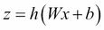
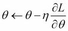
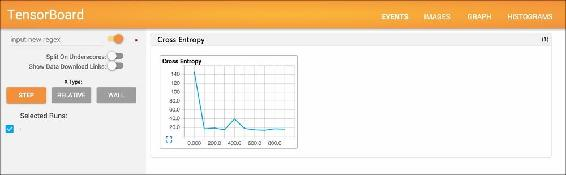
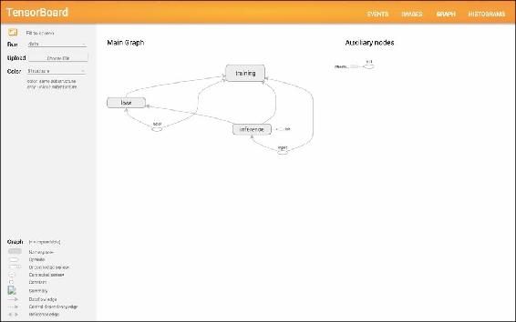
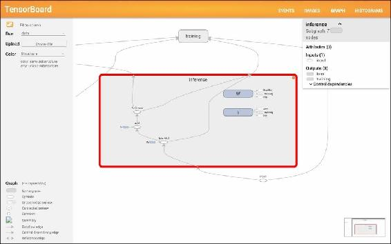

# 七、其他重要的深度学习库

在本章中，我们将讨论其他深度学习库，尤其是使用除 Java 之外的编程语言的库。以下是最著名的、开发良好的库:

*   提亚诺
*   TensorFlow
*   咖啡

您将简要了解它们中的每一个。因为在这里我们主要用 Python 实现它们，如果你不是 Python 开发者，可以跳过这一章。本章介绍的所有库都支持 GPU 实现，并具有其他特殊功能，所以让我们深入研究一下。


# Theano

Theano 是为深度学习开发的，但它实际上并不是一个深度学习库；这是一个用于科学计算的 Python 库。该文件可在 http://deeplearning.net/software/theano/的[获得。页面上介绍了使用 GPU 等几个特性，但最引人注目的特性是，Theano 支持](http://deeplearning.net/software/theano/) **计算微分**或 **自动微分**，而 Java 科学计算库 ND4J 并不支持。这意味着，有了 Theano，我们不必自己计算模型参数的梯度。Theano 会自动执行此操作。由于 Theano 承担了算法中最复杂的部分，所以数学表达式的实现可能不太困难。

让我们看看 Theano 是如何计算梯度的。首先，我们需要在机器上安装 ano。使用`pip install Theano`或`easy_install Theano`即可完成安装。然后，下面是要导入和使用的代码行:

```java
import theano
import theano.tensor as T

```

使用 Theano，所有变量都作为张量处理。例如，我们有`scalar`、`vector`、`matrix`、`d`代表 double、`l`代表 long 等等。`sin`、`cos`、`log`和`exp`等通用功能也在`theano.tensor`下定义。因此，如前所示，我们经常使用张量的别名，`T`。

作为简要掌握 ano 实现的第一步，考虑非常简单的抛物线。实现保存在`DLWJ/src/resources/theano/1_1_parabola_scalar.py`中，这样你可以引用它。首先，我们将`x`定义如下:

```java
x = T.dscalar('x')

```

这个定义在 Python 中是唯一的，因为`x`没有值；这只是一个象征。在这种情况下，`x`是`d` (double)类型的`scalar`。然后我们可以非常直观地定义`y`及其梯度。实现如下:

```java
y = x ** 2
dy = T.grad(y, x)

```

所以，`dy`里面应该有`2x`。让我们看看是否能得到正确的答案。我们需要额外做的是用注册号注册`math`功能:

```java
f = theano.function([x], dy)

```

然后你可以很容易地计算梯度的值:

```java
print f(1)  # => 2.0
print f(2)  # => 4.0

```

很简单！这就是 Theano 的力量。这里我们有标量的`x`,但是您也可以通过将`x`定义为:

```java
x = T.dvector('x')
y = T.sum(x ** 2)

```

这里不再赘述，但是你可以在`DLWJ/src/resources/theano/1_2_parabola_vector.py`和`DLWJ/src/resources/theano/1_3_parabola_matrix.py`中找到完整的代码。

当我们考虑用 Theano 实现深度学习算法的时候，我们可以在*深度学习教程*(【https://github.com/lisa-lab/DeepLearningTutorials】)的 GitHub 上找到一些非常好的例子。在这一章中，我们将看一下标准 MLP 实现的概述,这样你会对 no 有更多的了解。分叉的存储库作为快照可在[https://github.com/yusugomori/DeepLearningTutorials](https://github.com/yusugomori/DeepLearningTutorials)获得。首先，我们来看看`mlp.py`。隐藏层的模型参数是权重和偏差:

```java
W = theano.shared(value=W_values, name='W', borrow=True)
b = theano.shared(value=b_values, name='b', borrow=True)
```

这两个参数都是使用`theano.shared`定义的，因此可以通过模型访问和更新它们。激活可以表示如下:



这表示激活函数，即该代码中的双曲正切。因此，相应的代码编写如下:

```java
lin_output = T.dot(input, self.W) + self.b
self.output = (
    lin_output if activation is None
    else activation(lin_output)
)
```

这里也支持线性激活。同样，输出层，即逻辑回归层的参数`W`和`b`在`logistic_sgd.py`中定义和初始化:

```java
self.W = theano.shared(
    value=numpy.zeros(
        (n_in, n_out),
        dtype=theano.config.floatX
    ),
    name='W',
    borrow=True
)

self.b = theano.shared(
    value=numpy.zeros(
        (n_out,),
        dtype=theano.config.floatX
    ),
    name='b',
    borrow=True
)
```

多类逻辑回归的激活函数是`softmax`函数，我们可以编写并定义如下输出:

```java
self.p_y_given_x = T.nnet.softmax(T.dot(input, self.W) + self.b)
```

我们可以将预测值写成:

```java
self.y_pred = T.argmax(self.p_y_given_x, axis=1)
```

在训练方面，由于反向传播算法的方程是根据损失函数及其梯度计算的，我们需要做的只是定义要最小化的函数，即负对数似然函数:

```java
def negative_log_likelihood(self, y):
    return -T.mean(T.log(self.p_y_given_x)[T.arange(y.shape[0]), y])
```

这里，计算的是平均值，而不是总和，以评估整个小批量。

有了这些前面的值和定义，我们可以实现 MLP。这里，我们需要做的是定义 MLP 的方程式和符号。以下是代码的摘录:

```java
class MLP(object):
    def __init__(self, rng, input, n_in, n_hidden, n_out):
        # self.hiddenLayer = HiddenLayer(...)
        # self.logRegressionLayer = LogisticRegression(...)

        # L1 norm
        self.L1 = (
             abs(self.hiddenLayer.W).sum()
             + abs(self.logRegressionLayer.W).sum()
        )

        # square of L2 norm
        self.L2_sqr = (
           (self.hiddenLayer.W ** 2).sum()
            + (self.logRegressionLayer.W ** 2).sum()
        )

        # negative log likelihood of MLP
        self.negative_log_likelihood = (
           self.logRegressionLayer.negative_log_likelihood
        )

        # the parameters of the model
        self.params = self.hiddenLayer.params + self.logRegressionLayer.params
```

然后就可以建立和训练模型了。我们来看一下`test_mlp()`中的代码。加载数据集并构建 MLP 后，可以通过定义成本来评估模型:

```java
cost = (
    classifier.negative_log_likelihood(y)
    + L1_reg * classifier.L1
    + L2_reg * classifier.L2_sqr
)
```

有了这个成本，我们只需要一行代码就可以得到模型参数的梯度:

```java
gparams = [T.grad(cost, param) for param in classifier.params]
```

以下是更新参数的公式:

```java
updates = [
    (param, param - learning_rate * gparam)
    for param, gparam in zip(classifier.params, gparams)
]
```

第一个括号中的代码遵循以下等式:



最后，我们定义培训的实际功能:

```java
train_model = theano.function(
    inputs=[index],
    outputs=cost,
    updates=updates,
    givens={
        x: train_set_x[index * batch_size: (index + 1) * batch_size],
        y: train_set_y[index * batch_size: (index + 1) * batch_size]
    }
)
```

每个索引的输入和标签对应于*中的`x`、`y`给定*，所以当`index`给定时，参数用`updates`更新。因此，我们可以用训练时期和小批量的迭代来训练模型:

```java
while (epoch < n_epochs) and (not done_looping):
    epoch = epoch + 1
        for minibatch_index in xrange(n_train_batches):
           minibatch_avg_cost = train_model(minibatch_index)
```

原始代码有测试和验证部分，但我们刚才提到的是基本结构。有了“否”,梯度方程将不再被导出。


# TensorFlow

TensorFlow 是由谷歌开发的用于机器学习和深度学习的库。项目页面为[https://www.tensorflow.org/](https://www.tensorflow.org/)，所有代码在[https://github.com/tensorflow/tensorflow](https://github.com/tensorflow/tensorflow)的 GitHub 上向公众开放。TensorFlow 本身是用 C++写的，但是它提供了一个 Python 和 C++ API。在本书中，我们主要关注 Python 的实现。可以使用`pip`、`virtualenv`或`docker`进行安装。安装指南可从[https://www . tensor flow . org/versions/master/get _ started/OS _ setup . html](https://www.tensorflow.org/versions/master/get_started/os_setup.html)获得。安装完成后，您可以通过编写以下代码导入并使用 TensorFlow:

```java
import tensorflow as tf

```

TensorFlow 建议您用以下三个部分实现深度学习代码:

*   `inference()`:使用定义模型结构的给定数据进行预测
*   `loss()`:返回待优化的误差值
*   `training()`:通过计算梯度来应用实际的训练算法

我们将遵循这一方针。在[https://www . tensor flow . org/versions/master/tutorials/mnist/初学者/index.html](https://www.tensorflow.org/versions/master/tutorials/mnist/beginners/index.html) 上介绍了一个针对初学者的 MNIST 分类教程，该教程的代码可以在`DLWJ/src/resources/tensorflow/1_1_mnist_simple.py`中找到。这里，我们考虑细化教程中介绍的代码。你可以在`DLWJ/src/resources/tensorflow/1_2_mnist.py`里看到所有的代码。

首先，我们必须考虑的是获取 MNIST 数据。值得庆幸的是，TensorFlow 还提供了代码来获取[https://github . com/tensor flow/tensor flow/blob/master/tensor flow/examples/tutorials/mnist/input _ data . py](https://github.com/tensorflow/tensorflow/blob/master/tensorflow/examples/tutorials/mnist/input_data.py)中的数据，我们将代码放在同一个目录中。然后，通过编写以下代码，您可以导入 MNIST 数据:

```java
import input_data

```

可以使用以下代码导入 MNIST 数据:

```java
mnist = input_data.read_data_sets("MNIST_data/", one_hot=True)
```

与 no 类似，我们将没有实际值的变量定义为占位符:

```java
x_placeholder = tf.placeholder("float", [None, 784])
label_placeholder = tf.placeholder("float", [None, 10])
```

这里，`784`是输入层中的单元数量，`10`是输出层中的数量。我们这样做是因为占位符中的值根据小批量而变化。定义占位符后，您可以继续进行模型构建和培训。我们在这里用`inference()`中的`softmax`功能设置非线性激活:

```java
def inference(x_placeholder):

    W = tf.Variable(tf.zeros([784, 10]))
    b = tf.Variable(tf.zeros([10]))

    y = tf.nn.softmax(tf.matmul(x_placeholder, W) + b)

    return y
```

这里，`W`和`b`是模型的参数。`loss`功能，即`cross_entropy`功能，在`loss()`中定义如下:

```java
def loss(y, label_placeholder):
    cross_entropy = - tf.reduce_sum(label_placeholder * tf.log(y))

    return cross_entropy
```

有了`inference()`和`loss()`的定义，我们可以通过编写以下代码来训练模型:

```java
def training(loss):
    train_step = tf.train.GradientDescentOptimizer(0.01).minimize(loss)

    return train_step
```

`GradientDescentOptimizer()`应用梯度下降算法。但是要小心，因为这个方法只是定义了训练的方法，实际的训练还没有执行。TensorFlow 还支持`AdagradOptimizer()`、`MemontumOptimizer()`等主要优化算法。

前面解释的代码和方法是为了定义模型。要执行实际训练，您需要初始化 TensorFlow 的一个会话:

```java
init = tf.initialize_all_variables()
sess.run(init)
```

然后我们用小批量训练模型。小批量的所有数据存储在`feed_dict`中，然后在`sess.run()`中使用:

```java
for i in range(1000):
    batch_xs, batch_ys = mnist.train.next_batch(100)
    feed_dict = {x_placeholder: batch_xs, label_placeholder: batch_ys}

    sess.run(train_step, feed_dict=feed_dict)
```

模特培训到此结束。很简单吧？您可以通过编写以下代码来显示结果:

```java
def res(y, label_placeholder, feed_dict):
    correct_prediction = tf.equal(
        tf.argmax(y, 1), tf.argmax(label_placeholder, 1)
    )

    accuracy = tf.reduce_mean(
        tf.cast(correct_prediction, "float")
    )

   print sess.run(accuracy, feed_dict=feed_dict)
```

`TensorFlow`使得实现深度学习超级容易，非常有用。此外，`TensorFlow`还有一个强大的功能，`TensorBoard`，可以可视化深度学习。通过在前面的代码片段中添加几行代码，我们可以使用这个有用的特性。

先来看看模型是怎么可视化的。代码在`DLWJ/src/resources/tensorflow/1_3_mnist_TensorBoard.py`中，所以只需运行它。运行该程序后，键入以下命令:

```java
$ tensorboard --logdir=<ABOSOLUTE_PATH>/data

```

这里，`<ABSOLUTE_PATH>`是程序的绝对路径。然后，如果您在浏览器中访问`http://localhost:6006/`，您可以看到以下页面:



这显示了`cross_entropy`的取值过程。此外，当您点击标题菜单中的**图形**时，您会看到模型的可视化:



当您点击页面上的**推论**时，您可以看到模型结构:



现在让我们看看代码内部。要启用可视化，您需要用范围将整个区域包裹起来:*用* `tf.Graph().as_default()`。通过添加该范围，该范围中声明的所有变量都将显示在图形中。显示的名称可以通过包含`name`标签进行设置，如下所示:

```java
x_placeholder = tf.placeholder("float", [None, 784], name="input")
label_placeholder = tf.placeholder("float", [None, 10], name="label")
```

定义其他作用域将在图中创建节点，这是 division、`inference()`、`loss()`和`training()`显示其真实值的地方。您可以定义各自的范围，而不会失去任何可读性:

```java
def inference(x_placeholder):
    with tf.name_scope('inference') as scope:
        W = tf.Variable(tf.zeros([784, 10]), name="W")
        b = tf.Variable(tf.zeros([10]), name="b")

        y = tf.nn.softmax(tf.matmul(x_placeholder, W) + b)

    return y

def loss(y, label_placeholder):
    with tf.name_scope('loss') as scope:
        cross_entropy = - tf.reduce_sum(label_placeholder * tf.log(y))

        tf.scalar_summary("Cross Entropy", cross_entropy)

    return cross_entropy

def training(loss):
    with tf.name_scope('training') as scope:
        train_step = tf.train.GradientDescentOptimizer(0.01).minimize(loss)

    return train_step
```

`loss()`中的`tf.scalar_summary()`使变量出现在**事件**菜单中。为了实现可视化，我们需要以下代码:

```java
summary_step = tf.merge_all_summaries()
init = tf.initialize_all_variables()

summary_writer = tf.train.SummaryWriter('data', graph_def=sess.graph_def)
```

然后可以用下面的代码添加变量的过程:

```java
summary = sess.run(summary_step, feed_dict=feed_dict)
summary_writer.add_summary(summary, i)
```

当我们使用更复杂的模型时，这种可视化的特性会更加有用。


# Caffe

咖啡馆是一个以速度著称的图书馆。官方项目页面为 http://caffe.berkeleyvision.org/[T3，GitHub 页面为 https://github.com/BVLC/caffe](http://caffe.berkeleyvision.org/)[T5。与 TensorFlow 类似，Caffe 主要是用 C++开发的，但它提供了 Python 和 MATLAB API。另外，Caffe 的独特之处在于，不需要任何编程经验，只需要编写配置或协议文件，也就是`.prototxt`文件，就可以用深度学习进行实验和研究。在这里，我们关注基于协议的方法。](https://github.com/BVLC/caffe)

Caffe 是一个非常强大的库，支持快速建模、训练和测试；但是，要安装这个库并从中获得很多好处有点困难。从[http://caffe.berkeleyvision.org/installation.html](http://caffe.berkeleyvision.org/installation.html)的安装指南可以看出，您需要提前安装以下设备:

*   库达
*   布拉斯(阿特拉斯，MKL，或开放布拉斯)
*   OpenCV
*   促进
*   其他:snappy、leveldb、gflags、glog、szip、lmdb、protobuf 和 hdf5

然后，从 GitHub 页面克隆存储库，并从`Makefile.config.example`创建`Makefile.config`文件。您可能需要一个 Python 发行版 Anaconda 来运行`make`命令。你可以从 https://www.continuum.io/downloads 下载这个。在您运行`make`、`make test`和`make runtest`命令(您可能希望使用`-jN`选项运行这些命令，例如`make -j4`或`make -j8`来加速这个过程)并通过测试之后，您将看到 Caffe 的强大之处。我们来看一个例子。转到您克隆存储库的路径`$CAFFE_ROOT`，并键入以下命令:

```java
$ ./data/mnist/get_mnist.sh
$ ./examples/mnist/train_lenet.sh

```

这就是你用 CNN 解决标准 MNIST 分类问题所需要的。这里发生了什么？当您查看`train_lenet.sh`时，您会看到以下内容:

```java
#!/usr/bin/env sh

./build/tools/caffe train --solver=examples/mnist/lenet_solver.prototxt
```

它只是用协议文件`lenet_solver.prototxt`运行`caffe`命令。该文件配置模型的超参数，如学习率和动量。文件还引用了网络配置文件，在这里是`lenet_train_test.prototxt`。您可以用类似 JSON 的描述来定义每一层:

```java
layer {
  name: "conv1"
  type: "Convolution"
  bottom: "data"
  top: "conv1"
  param {
    lr_mult: 1
  }
  param {
    lr_mult: 2
  }
  convolution_param {
    num_output: 20
    kernel_size: 5
    stride: 1
    weight_filler {
      type: "xavier"
    }
    bias_filler {
      type: "constant"
    }
  }
}
```

因此，基本上，协议文件分为两部分:

*   **Net** :这个定义了模型的详细结构，并给出了每一层的描述，因此是整个神经网络
*   **解算器**:定义优化设置，如 CPU/GPU 的使用、迭代次数以及模型的超参数，如学习率

当你需要用主要方法对大型数据集应用深度学习时，Caffe 可以是一个很好的工具。


# 总结

在本章中，您学习了如何使用 Theano、TensorFlow 和 Caffe 实现深度学习算法和模型。它们都有特殊而强大的功能，而且每一个都非常有用。如果对其他库和框架感兴趣，可以有*Chainer*([http://chainer.org/](http://chainer.org/))*Torch*([http://torch.ch/](http://torch.ch/))*Pyle arn 2*([http://deeplearning.net/software/pylearn2/](http://deeplearning.net/software/pylearn2/))*nerv ana*([http://neon.nervanasys.com/](http://neon.nervanasys.com/))等等。当你真正考虑用前面提到的一个库来构建你的应用时，你也可以参考一些基准测试([https://github.com/soumith/convnet-benchmarks](https://github.com/soumith/convnet-benchmarks)和[https://github.com/soumith/convnet-benchmarks/issues/66](https://github.com/soumith/convnet-benchmarks/issues/66))。

通过这本书，你学习了机器学习和深度学习的基本理论和算法，以及深度学习如何应用于学习/商业领域。凭借你在这里学到的知识和技术，你应该能够应对你面临的任何问题。虽然你确实还需要更多的步骤来实现人工智能，但你现在有最大的机会来实现创新。