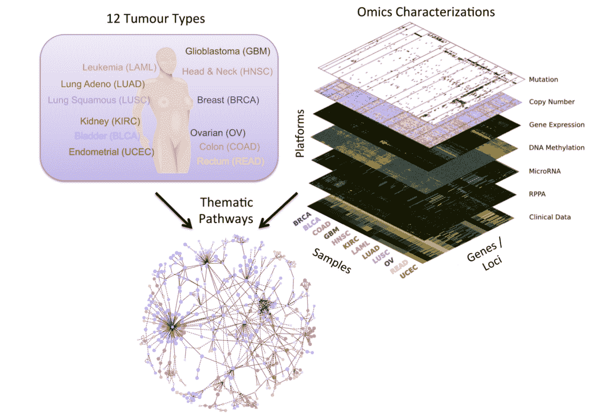

# 二、使用循环类型网络的癌症类型预测

大规模癌症基因组数据通常以多平台和异构形式出现。这些数据集在生物信息学方法和计算算法方面带来了巨大的挑战。许多研究人员已经提出利用这些数据来克服几个挑战，使用经典的机器学习算法作为癌症诊断和预后的主要对象或支持元素。

在这一章中，我们将使用一些深度学习架构，从癌症基因组图谱(TCGA)中筛选出的高维数据集进行癌症类型分类。首先，我们将描述数据集并执行一些预处理，以便数据集可以被馈送到我们的网络。然后，我们将看到如何准备我们的编程环境，然后继续使用一个名为**deep learning 4j**(**DL4J**)的开源深度学习库进行编码。首先，我们将使用 DL4J 的**多层感知器** ( **MLP** )实现再次重温泰坦尼克号的生存预测问题。

然后我们将使用一种改进的**循环神经网络** ( **RNN** )架构，称为**长短期记忆** ( **LSTM** )用于癌症类型预测。最后，我们将看到一些与此项目和 DL4J 超参数/网络调优相关的常见问题。

简而言之，我们将在本章中学习以下主题:

*   癌症基因组学中的深度学习
*   癌症基因组数据集描述
*   Deeplearning4j 入门
*   使用 LSTM-RNN 开发癌症类型预测模型
*   常见问题


# 癌症基因组学中的深度学习

生物医学信息学包括所有关于生物系统研究的数据分析、数学建模和计算模拟的技术。近年来，我们目睹了生物计算领域的巨大飞跃，这使得大量信息丰富的资源可供我们支配。这些领域包括解剖学、建模(3D 打印机)、基因组学和药理学等。

生物医学信息学最著名的成功故事之一来自基因组学领域。人类基因组计划是一个国际研究项目，目标是确定人类 DNA 的全部序列。该项目是计算生物学中最重要的里程碑之一，并被用作其他项目的基础，包括人类大脑项目，该项目决心对人类大脑进行测序。本文使用的数据也是 HGP 的间接结果。

大数据时代始于过去十年左右，其标志是与模拟信息相比，数字信息泛滥。仅在 2016 年，就产生了 16.1 吉字节的数字数据，预计到 2025 年将达到 163 ZB/年。尽管这是一条好消息，但仍然存在一些问题，尤其是数据存储和分析方面的问题。对于后者，在正常大小的数据分析中使用的简单机器学习方法将不再有效，应该被深度神经网络学习方法所取代。深度学习通常被认为可以很好地处理这些类型的大型复杂数据集。

与其他重要领域一样，生物医学领域也受到这些大数据现象的影响。最大的数据源之一是组学数据，如基因组学、代谢组学和蛋白质组学。生物医学技术和设备的创新，如 DNA 测序和质谱分析，导致了组学数据的大量积累。

典型的组学数据具有准确性、可变性和高维性。这些数据集来自多个甚至有时不兼容的数据平台。这些属性使这些类型的数据适合应用 DL 方法。组学数据的深度学习分析是生物医学领域的主要任务之一，因为它有机会成为个性化医疗的领导者。通过获取关于一个人的组学数据的信息，可以更好地应对疾病，并且治疗可以集中在预防措施上。

众所周知，癌症是世界上最致命的疾病之一，这主要是由于其诊断和治疗的复杂性。这是一种涉及多种基因突变的遗传病。随着遗传知识在癌症治疗中的重要性日益受到重视，最近出现了几个记录癌症患者遗传数据的项目。其中最广为人知的是**癌症基因组图谱** ( **TCGA** )项目，可在 http://cancergenome.nih.gov/[TCGA 研究网](http://cancergenome.nih.gov/)上获得。

如前所述，在生物医学领域已经有许多深度学习的实现，包括癌症研究。对于癌症研究，大多数研究人员通常使用组学或医学成像数据作为输入。一些研究工作集中在癌症分析上。其中一些使用组织病理学图像或 PET 图像作为来源。大多数研究都集中在基于图像数据的分类上，使用**卷积神经网络**(**CNN**)。

然而，他们中的许多人使用-组学数据作为他们的来源。Fakoor 等人利用患者的基因表达数据对各种类型的癌症进行了分类。由于每种癌症类型的每个数据的维度不同，他们首先使用**主成分分析** ( **PCA** )来降低微阵列基因表达数据的维度。

PCA 是一种统计技术，用于强调变化并从数据集中提取最重要的模式；主成分是最简单的基于真实特征向量的多元分析。PCA 经常用于使数据探索易于可视化。因此，PCA 是探索性数据分析和建立预测模型中最常用的算法之一。

然后，他们应用稀疏和堆叠自编码器对各种癌症进行分类，包括急性髓细胞白血病、乳腺癌和卵巢癌。

有关详细信息，请参考以下出版物，题为*使用深度学习增强癌症诊断和分类*，由 R. Fakoor 等人在 2013 年国际机器学习会议录中发表。

另一方面，Ibrahim 等人使用了来自六种癌症基因/miRNA 特征选择的 miRNA 表达数据。他们提出了一种新的多级特征选择方法，命名为 **MLFS** (简称**多级基因** / **miRNA 特征选择**)，该方法基于**深度信念网络(DBN)** 和无监督主动学习。

你可以在 Proceedings 36 annual International Conference Eng 中题为*multi level gene/miRNA feature selection using deep believe nets and active learning*(r . Ibrahim 等人)的出版物中了解更多信息。医学。生物。社会主义者(EMBC)，第 3957-3960 页，电气和电子工程师学会，2014 年。

最后，梁等人利用多平台基因组学和临床数据对卵巢癌和乳腺癌患者进行聚类分析。卵巢癌数据集包含 385 名患者的基因表达、DNA 甲基化和 miRNA 表达数据，这些数据从**癌症基因组图谱(TCGA)** 下载。

You can read more more in the following publication entitled *Integrative data analysis of multi-platform cancer data with a multimodal deep learning approach* (by M. Liang et al.) in Molecular Pharmaceutics, vol. 12, pp. 928{937, IEEE/ACM Transaction Computational Biology and Bioinformatics, 2015.

乳腺癌数据集包括 GE 数据和相应的临床信息，如生存时间和复发时间数据，由荷兰癌症研究所收集。为了处理这种多平台数据，他们使用了**多模态深度信念网络** ( **mDBN** )。

首先，他们为这些数据中的每一个实施了一个 DBN，以获得它们的潜在特征。然后，使用这些潜在特征作为输入，实现用于执行聚类的另一个 DBN。除了这些研究人员之外，许多研究工作正在进行中，给癌症基因组学、识别和治疗带来了巨大的推动。


# 癌症基因组数据集描述

基因组数据涵盖了生物上所有与 DNA 相关的数据。虽然在这篇论文中，我们也将使用其他类型的数据，如转录组数据(RNA 和 miRNA)，但为了方便起见，所有数据都将被称为基因组数据。由于 HGP (1984-2000)对人类 DNA 全序列测序的成功，近年来人类遗传学研究取得了巨大突破。

其中一个受益匪浅的领域是对包括癌症在内的所有遗传相关疾病的研究。由于对 DNA 进行的各种生物医学分析，存在各种类型的组学或基因组学数据。以下是一些对癌症分析至关重要的组学数据类型:

*   **原始测序数据:**这对应的是整个染色体的 DNA 编码。一般来说，每个人身体的每个细胞中都有 24 种类型的染色体，每条染色体由 460-247 万个碱基对组成。每个碱基对可以编码成四种不同的类型，分别是**腺嘌呤**(**A**)**胞嘧啶**(**C**)**鸟嘌呤**(**G**)**胸腺嘧啶** ( **T** )。因此，原始测序数据由数十亿个碱基对数据组成，每一个都以这四种不同类型之一编码。
*   **单核苷酸多态性** ( **SNP** )数据:每个人都有不同的原始序列，导致基因突变。基因突变可以导致实际的疾病，或者只是身体外观的差异(如头发颜色)，或者根本没有。当这种突变只发生在单个碱基对上而不是碱基对序列上时，称为**单核苷酸多态性** ( **SNP** )。
*   **拷贝数变异** ( **CNV** )数据:这对应于碱基对序列中发生的基因突变。可能发生几种类型的突变，包括碱基对序列的缺失、碱基对序列的倍增和碱基对序列在染色体其他部分的重新定位。
*   **DNA 甲基化数据**:对应于发生在染色体区域的甲基化量(连接到碱基对的甲基)。基因启动子区域大量甲基化会导致基因阻遏。DNA 甲基化是我们每个器官行为不同的原因，尽管它们都有相同的 DNA 序列。在癌症中，这种 DNA 甲基化被破坏。
*   **基因表达数据**:这对应于在给定时间基因表达的蛋白质数量。癌症的发生要么是因为癌基因(即导致肿瘤的基因)的高表达，要么是因为肿瘤抑制基因(阻止肿瘤的基因)的低表达，或者两者都有。因此，基因表达数据的分析有助于发现癌症中的蛋白质生物标志物。我们将在这个项目中使用它。
*   **miRNA 表达数据**:对应于在给定时间表达的 microRNA 的量。miRNA 在 mRNA 阶段的蛋白质沉默中起作用。因此，对基因表达数据的分析可以帮助发现癌症中的 miRNA 生物标志物。

有几个基因组数据集的数据库，其中可以找到上述数据。其中一些专注于癌症患者的基因组数据。这些数据库包括:

*   **癌症基因组图谱**(**TCGA**):**https://cancergenome.nih.gov/**
*   **国际癌症基因组联盟**(**ICGC**):**https://icgc.org/**
*   **癌症体细胞突变目录** ( **宇宙**):**https://cancer.sanger.ac.uk/cosmic**

这种基因组数据通常伴随着患者的临床数据。该临床数据可以包括一般临床信息(例如，年龄或性别)和他们的癌症状态(例如，癌症位置或癌症阶段)。所有这些基因组学数据本身具有高维度的特征。例如，每个患者的基因表达数据是基于基因 ID 构建的，基因 ID 大约有 60，000 种。

此外，一些数据本身来自不止一种格式。例如，70%的 DNA 甲基化数据收集自乳腺癌患者，其余 30%来自不同的平台。因此，此数据集中有两种不同的结构。因此，为了通过处理异质性来分析基因组数据，研究人员经常使用强大的机器学习技术甚至深度神经网络。

现在，让我们看看可以用于我们目的的真实数据集是什么样的。我们将使用从 UCI 机器学习知识库下载的基因表达癌症 RNA-Seq 数据集(详见[https://archive . ics . UCI . edu/ml/datasets/gene+expression+cancer+RNA-Seq #](https://archive.ics.uci.edu/ml/datasets/gene+expression+cancer+RNA-Seq))。



泛癌分析项目的数据收集管道(资料来源:“温斯坦，约翰·n .，‘癌症基因组图谱泛癌分析项目’。”自然遗传学 45.10 (2013): 1113-1120”)

该数据集是另一个数据集的随机子集，该数据集在以下论文中报道:Weinstein，John N .等人*癌症基因组图谱泛癌分析项目*。*《自然遗传学》45.10 (2013): 1113-1120* 。上图显示了泛癌分析项目的数据收集管道。

项目的名称是泛癌分析项目。它收集了来自数千名身体不同部位原发性肿瘤患者的数据。它涵盖了 12 种肿瘤类型(见上图左上图)，包括:

*   **多形性胶质母细胞瘤** ( **GBM**
*   **淋巴细胞性急性髓细胞白血病** ( **AML** )
*   **头颈鳞癌** ( **HNSC** )
*   **肺腺癌** ( **卢阿德**)
*   **肺鳞癌** ( **LUSC** )
*   **乳腺癌** ( **BRCA** )
*   **肾透明细胞癌** ( **KIRC** )
*   **卵巢癌** ( **OV** )
*   **膀胱癌** ( **BLCA** )
*   **结肠腺癌** ( **COAD** )
*   **宫颈癌和子宫内膜癌** ( **UCEC** )
*   **直肠腺癌** ( **读作**)

这个数据集合是 RNA-Seq (HiSeq) PANCAN 数据集的一部分。它是对患有不同类型肿瘤(BRCA、KIRC、COAD、LUAD 和 PRAD)的患者的基因表达的随机提取。

该数据集是来自 801 名患者的癌症患者的随机集合，每个患者具有 20，531 个属性。样本(实例)按行存储。每个样本的变量(属性)是由 illumina HiSeq 平台测量的 RNA-Seq 基因表达水平。每个属性都有一个虚拟名称(`gene_XX`)。属性的排序与原始提交一致。例如，`sample_0`上的`gene_1`与`2.01720929003`的 a 值显著差异表达。

下载数据集时，您会看到有两个 CSV 文件:

*   `data.csv` **:** 包含每个样本的基因表达数据
*   `labels.csv` **:** 与每个样本相关的标签

让我们来看看处理过的数据集。请注意，考虑到以下屏幕截图中的高维数，我们将只看到一些选定的功能，其中第一列代表样本 id(即匿名患者 id)。其余的列表示特定的基因表达在患者的肿瘤样品中是如何发生的:


样本基因表达数据集

现在看看*图 3* 中的标签。这里，`id`包含样本 id，`Class`代表癌症标签:


样本被分为不同的癌症类型

现在你可以想象我为什么选择这个数据集了。嗯，虽然我们不会有这么多样本，但数据集仍然是非常高维的。此外，这种类型的高维数据集非常适合应用深度学习算法。

好吧。因此，如果给定了特征和标签，我们可以根据特征和地面事实对这些样本进行分类。为什么不呢？我们将尝试用 DL4J 库来解决这个问题。首先，我们必须配置我们的编程环境，以便我们可以开始编写代码。


# 准备编程环境

在本节中，我们将在开始编码之前讨论如何配置 DL4J、ND4s、Spark 和 ND4J。以下是使用 DL4J 时的先决条件:

*   Java 1.8+(仅限 64 位)
*   用于自动构建和依赖管理器的 Apache Maven
*   IntelliJ IDEA 或 Eclipse IDE
*   用于版本控制和 CI/CD 的 Git

以下库可以与 DJ4J 集成，以增强您在开发 ML 应用程序时的 JVM 体验:

*   **DL4J** :核心神经网络框架，提出了许多 DL 架构和底层功能。
*   **ND4J** :可以认为是 JVM 的 NumPy。它附带了线性代数的一些基本运算。例如矩阵创建、加法和乘法。
*   **DataVec** :这个库在执行特征工程的同时支持 ETL 操作。
*   **JavaCPP** :这个库充当了 Java 和原生 C++之间的桥梁。
*   **仲裁器**:这个库为 DL 算法提供了基本的评估功能。
*   **RL4J** :针对 JVM 的深度强化学习。
*   **ND4S** :这是一个科学计算库，它还支持基于 JVM 的语言的 n 维数组。

如果您在首选 IDE 上使用 Maven，让我们定义项目属性，以在`pom.xml`文件中提到版本:

```java
<properties>
        <project.build.sourceEncoding>UTF-8</project.build.sourceEncoding>
        <java.version>1.8</java.version>
        <nd4j.version>1.0.0-alpha</nd4j.version>
        <dl4j.version>1.0.0-alpha</dl4j.version>
        <datavec.version>1.0.0-alpha</datavec.version>
        <arbiter.version>1.0.0-alpha</arbiter.version>
        <logback.version>1.2.3</logback.version>
        <dl4j.spark.version>1.0.0-alpha_spark_2</dl4j.spark.version>
</properties>
```

然后使用 DL4J、ND4S、ND4J 等所需的下列依赖项:

```java
<dependencies>
    <dependency>
        <groupId>org.nd4j</groupId>
        <artifactId>nd4j-native</artifactId>
        <version>${nd4j.version}</version>
    </dependency>
    <dependency>
        <groupId>org.deeplearning4j</groupId>
        <artifactId>dl4j-spark_2.11</artifactId>
        <version>1.0.0-alpha_spark_2</version>
    </dependency>
    <dependency>
        <groupId>org.nd4j</groupId>
        <artifactId>nd4j-native</artifactId>
        <version>1.0.0-alpha</version>
        <type>pom</type>
    </dependency>
    <dependency>
        <groupId>org.deeplearning4j</groupId>
        <artifactId>deeplearning4j-core</artifactId>
        <version>${dl4j.version}</version>
    </dependency>
    <dependency>
        <groupId>org.deeplearning4j</groupId>
        <artifactId>deeplearning4j-nlp</artifactId>
        <version>${dl4j.version}</version>
    </dependency>
    <dependency>
        <groupId>org.deeplearning4j</groupId>
        <artifactId>deeplearning4j-zoo</artifactId>
        <version>${dl4j.version}</version>
    </dependency>
    <dependency>
        <groupId>org.deeplearning4j</groupId>
        <artifactId>arbiter-deeplearning4j</artifactId>
        <version>${arbiter.version}</version>
    </dependency>
    <dependency>
        <groupId>org.deeplearning4j</groupId>
        <artifactId>arbiter-ui_2.11</artifactId>
        <version>${arbiter.version}</version>
    </dependency>
    <dependency>
        <artifactId>datavec-data-codec</artifactId>
        <groupId>org.datavec</groupId>
        <version>${datavec.version}</version>
    </dependency>
    <dependency>
        <groupId>org.apache.httpcomponents</groupId>
        <artifactId>httpclient</artifactId>
        <version>4.3.5</version>
    </dependency>
    <dependency>
        <groupId>ch.qos.logback</groupId>
        <artifactId>logback-classic</artifactId>
        <version>${logback.version}</version>
        </dependency>
</dependencies>
```

对了，DL4J 自带 Spark 2.1.0。此外，如果您的计算机上没有配置本机系统 BLAS，ND4J 的性能将会降低。一旦执行用 Scala 编写的简单代码，您将会遇到以下警告:

```java
****************************************************************
 WARNING: COULD NOT LOAD NATIVE SYSTEM BLAS
 ND4J performance WILL be reduced
 ****************************************************************
```

不过安装配置`OpenBLAS`或者`IntelMKL`之类的 BLAS 并没有那么难；你可以投入一些时间去做。详情请参考以下网址:【http://nd4j.org/getstarted.html#open[。](http://nd4j.org/getstarted.html#open)

干得好！我们的编程环境已经为简单的深度学习应用开发做好了准备。现在是时候使用一些示例代码了。


# 用 DL4J 重温泰坦尼克号生存

在前一章中，我们使用基于 Spark 的 MLP 解决了泰坦尼克号的生存预测问题。我们还看到，通过使用基于 Spark 的 MLP，用户在使用分层结构时几乎没有透明度。此外，超参数等的定义也不明确。

因此，我所做的是使用训练数据集，然后执行一些预处理和特征工程。然后我把预处理后的数据集随机拆分成训练和测试(准确的说是 70%用于训练，30%用于测试)。首先，我们创建 Spark 会话，如下所示:

```java
SparkSession spark = SparkSession.builder()
                  .master("local[*]")
                  .config("spark.sql.warehouse.dir", "temp/")// change accordingly
                  .appName("TitanicSurvivalPrediction")
                  .getOrCreate();
```

在本章中，我们已经看到有两个 CSV 文件。然而，没有人提供任何地面真相。所以我决定只用`training.csv`这一款，这样我们就可以对比一下车型的性能。因此，让我们使用 spark `read()` API 来读取训练数据集:

```java
Dataset<Row> df = spark.sqlContext()
                .read()
                .format("com.databricks.spark.csv")
                .option("header", "true") // Use first line of all files as header
                .option("inferSchema", "true") // Automatically infer data types
                .load("data/train.csv");
```

我们在[第一章](fba163f0-88c0-4278-a4a1-df5389cc3a10.xhtml)、*深度学习入门*中已经看到`Age`和`Fare`列有很多空值。因此，这里我没有为每一列写`UDF`，而是用它们的平均值替换年龄和费用列中缺失的值:

```java
Map<String, Object> m = new HashMap<String, Object>();
m.put("Age", 30);
m.put("Fare", 32.2);
Dataset<Row> trainingDF1 = df2.na().fill(m);  
```

为了更详细地了解如何处理缺失/空值和机器学习，感兴趣的读者可以看看伯颜·安杰洛夫的博客，网址是[https://towards data science . com/working-with-missing-data-in-machine-learning-9c 0a 430 df 4 ce](https://towardsdatascience.com/working-with-missing-data-in-machine-learning-9c0a430df4ce)。

为了简单起见，我们还可以删除一些列，比如`"PassengerId"`、`"Name"`、`"Ticket"`和`"Cabin"`:

```java
Dataset<Row> trainingDF2 = trainingDF1.drop("PassengerId", "Name", "Ticket", "Cabin");
```

现在，棘手的部分来了。类似于基于 Spark ML 的估计器，基于 DL4J 的网络也需要数字形式的训练数据。因此，我们现在必须将分类特征转换成数字特征。为此，我们可以使用一个`StringIndexer()`变压器。我们要做的是为`"Sex"`和`"Embarked"`列创建两个，即`StringIndexer`:

```java
StringIndexer sexIndexer = new StringIndexer()
                                    .setInputCol("Sex")
                                    .setOutputCol("sexIndex")
                                    .setHandleInvalid("skip");//// we skip column having nulls

StringIndexer embarkedIndexer = new StringIndexer()
                                    .setInputCol("Embarked")
                                    .setOutputCol("embarkedIndex")
                                    .setHandleInvalid("skip");//// we skip column having nulls
```

然后我们将它们链接成一个管道。接下来，我们将执行转换操作:

```java
Pipeline pipeline = new Pipeline().setStages(new PipelineStage[] {sexIndexer, embarkedIndexer});
```

然后，我们将调整管道，转换并删除`"Sex"`和`"Embarked"`列，以获得转换后的数据集:

```java
Dataset<Row> trainingDF3 = pipeline.fit(trainingDF2).transform(trainingDF2).drop("Sex", "Embarked");
```

那么我们最终预处理的数据集将只有数字特征。请注意，DL4J 将最后一列视为标签列。这意味着 DL4J 会将`"Pclass"`、`"Age"`、`"SibSp"`、`"Parch"`、`"Fare"`、`"sexIndex"`和`"embarkedIndex"`视为特征。因此，我将`"Survived"`列作为最后一列:

```java
Dataset<Row> finalDF = trainingDF3.select("Pclass", "Age", "SibSp","Parch", "Fare",                                                                   
                                           "sexIndex","embarkedIndex", "Survived");
finalDF.show();
```

然后，我们将数据集随机分为训练和测试，分别占 70%和 30%。也就是说，我们将 70%用于训练，其余部分用于评估模型:

```java
Dataset<Row>[] splits = finalDF.randomSplit(new double[] {0.7, 0.3}); 
Dataset<Row> trainingData = splits[0]; 
Dataset<Row> testData = splits[1];
```

最后，我们将两个数据帧作为单独的 CSV 文件供 DL4J 使用:

```java
trainingData
      .coalesce(1)// coalesce(1) writes DF in a single CSV
      .write() 
      .format("com.databricks.spark.csv")
      .option("header", "false") // don't write the header
      .option("delimiter", ",") // comma separated
      .save("data/Titanic_Train.csv"); // save location

testData
      .coalesce(1)// coalesce(1) writes DF in a single CSV
      .write() 
      .format("com.databricks.spark.csv")
      .option("header", "false") // don't write the header
      .option("delimiter", ",") // comma separated
      .save("data/Titanic_Test.csv"); // save location
```

此外，DL4J 不支持训练集中的头信息，所以我有意跳过了头的编写。


# 多层感知器网络构造

正如我在前一章中告诉你的，基于 DL4J 的神经网络由多层组成。一切都从一个`MultiLayerConfiguration`开始，它组织那些层和它们的超参数。

超参数是决定神经网络如何学习的一组变量。有许多参数，例如，更新模型权重的次数和频率(称为一个 **epoch** )、如何初始化网络权重、使用哪个激活函数、使用哪个更新器和优化算法、学习速率(即模型应该学习多快)、有多少个隐层、每层有多少个神经元等等。

我们现在创建网络。首先，让我们创建层。类似于我们在[第一章](fba163f0-88c0-4278-a4a1-df5389cc3a10.xhtml)、*深度学习入门*中创建的 MLP，我们的 MLP 将有四层:

*   **第 0 层**:输入层
*   **劳尔 1** :隐藏层 1
*   **第二层**:隐藏第二层
*   **第三层**:输出层

更技术上来说，第一层是输入层，然后放两层作为隐藏层。对于前三层，我们使用 Xavier 初始化权重，激活函数是 ReLU。最后，放置输出层。该设置如下图所示:


用于泰坦尼克号生存预测输入层的多层感知器

我们已经指定了神经元(即节点)，它们是相等数量的输入，以及任意数量的神经元作为输出。考虑到很少的输入和功能，我们设置了一个较小的值:

```java
DenseLayer input_layer = new DenseLayer.Builder()
                .weightInit(WeightInit.XAVIER)
                .activation(Activation.RELU)
                .nIn(numInputs)
                .nOut(16)
                .build();
```


# 隐藏层 1

输入神经元的数量等于输入层的输出。那么输出的数量是任意值。考虑到很少的输入和功能，我们设置了一个较小的值:

```java
DenseLayer hidden_layer_1 = new DenseLayer.Builder()
                .weightInit(WeightInit.XAVIER)
                .activation(Activation.RELU)
                .nIn(16).nOut(32)
                .build();
```


# 隐藏层 2

输入神经元的数量等于隐含层 1 的输出。那么输出的数量是任意值。同样，考虑到很少的输入和功能，我们设置了一个较小的值:

```java
 DenseLayer hidden_layer_2 = new DenseLayer.Builder()
                .weightInit(WeightInit.XAVIER)
                .activation(Activation.RELU)
                .nIn(32).nOut(16)
                .build();
```


# 输出层

输入神经元的数量等于隐藏层 1 的输出。那么输出的数量等于预测标签的数量。考虑到很少的输入和特性，我们再次设置了一个较小的值。

这里我们使用 Softmax 激活函数，它给出了类的概率分布(输出总和为 1.0)，损失函数作为二进制分类(XNET)的交叉熵，因为我们希望将输出(概率)转换为离散类，即 0 或 1:

```java
OutputLayer output_layer = new OutputLayer.Builder(LossFunction.XENT) // XENT for Binary Classification
                .weightInit(WeightInit.XAVIER)
                .activation(Activation.SOFTMAX)
                .nIn(16).nOut(numOutputs)
                .build();
```

XNET 用于逻辑回归的二元分类。请在 DL4J 的`LossFunctions.java`类中查看更多相关信息。

现在，我们通过在进行训练之前指定`NeuralNetConfiguration`来创建一个`MultiLayerConfiguration`。使用 DL4J，我们可以通过在`NeuralNetConfiguration.Builder()`上调用`layer`来添加层，指定它在层的顺序中的位置(下面代码中的零索引层是输入层):

```java
MultiLayerConfiguration MLPconf = new NeuralNetConfiguration.Builder().seed(seed)
                .optimizationAlgo(OptimizationAlgorithm.STOCHASTIC_GRADIENT_DESCENT)
                .weightInit(WeightInit.XAVIER)
                .updater(new Adam(0.0001))
                .list()
                    .layer(0, input_layer)
                    .layer(1, hidden_layer_1)
                    .layer(2, hidden_layer_2)
                    .layer(3, output_layer)
                .pretrain(false).backprop(true).build();// no pre-traning required    
```

除此之外，我们还指定如何设置网络的权重。例如，如前所述，我们使用 Xavier 作为权重初始化，使用**随机梯度下降** ( **SGD** )优化算法，使用 Adam 作为更新器。最后，我们还指定不需要做任何预训练(这在 DBN 或堆栈式自编码器中通常是需要的)。然而，由于 MLP 是一个前馈网络，我们设置反向传播为真。


# 网络培训

首先，我们使用前面的`MultiLayerConfiguration`创建一个`MultiLayerNetwork` 。然后，我们初始化网络，并在训练集上开始训练:

```java
MultiLayerNetwork model = new MultiLayerNetwork(MLPconf);
model.init();
log.info("Train model....");
for( int i=0; i<numEpochs; i++ ){
    model.fit(trainingDataIt);
        }
```

在前面的代码块中，我们通过调用训练集上的`model.fit()`(在我们的例子中是`trainingDataIt`)来开始训练模型。现在，我们将讨论如何准备训练集和测试集。为了读取格式不合适的训练集或测试集(特征是数字，标签是整数)，我创建了一个叫做`readCSVDataset()`的方法:

```java
private static DataSetIterator readCSVDataset(String csvFileClasspath, int batchSize, 
               int labelIndex, int numClasses) throws IOException, InterruptedException {
        RecordReader rr = new CSVRecordReader();
        File input = new File(csvFileClasspath);
        rr.initialize(new FileSplit(input));
        DataSetIterator iterator = new RecordReaderDataSetIterator(rr, batchSize, labelIndex, numClasses);
        return iterator;
    }
```

如果你看到前面的代码块，你可以意识到它基本上是一个读取 CSV 格式数据的包装器，然后`RecordReaderDataSetIterator()`方法将记录读取器转换为数据集迭代器。从技术上来说，`RecordReaderDataSetIterator()`是分类的主要构造函数。它采用以下参数:

*   `RecordReader`:这是提供数据来源的`RecordReader`
*   `batchSize`:输出`DataSet`对象的批量(即样本数)
*   `labelIndex`:由`recordReader.next()`获得的可写标签的索引(通常是一个`IntWritable`
*   `numPossibleLabels`:用于分类的类(可能的标签)的数量

然后，这将把输入类索引(在位置`labelIndex`，具有整数值`0`到`numPossibleLabels-1`，包括端点)转换成适当的独热输出/标签表示。所以让我们看看如何进行。首先，我们展示了训练集和测试集的路径:

```java
String trainPath = "data/Titanic_Train.csv";
String testPath = "data/Titanic_Test.csv";

int labelIndex = 7; // First 7 features are followed by the labels in integer 
int numClasses = 2; // number of classes to be predicted -i.e survived or not-survived
int numEpochs = 1000; // Number of training eopich

int seed = 123; // Randome seed for reproducibilty
int numInputs = labelIndex; // Number of inputs in input layer
int numOutputs = numClasses; // Number of classes to be predicted by the network 

int batchSizeTraining = 128;         
```

现在，让我们准备要用于培训的数据:

```java
DataSetIterator trainingDataIt = *readCSVDataset*(trainPath, batchSizeTraining, labelIndex, numClasses);
```

接下来，让我们准备要分类的数据:

```java
int batchSizeTest = 128;
DataSetIterator testDataIt = *readCSVDataset*(testPath, batchSizeTest, labelIndex, numClasses);
```

太棒了。我们已经准备好了培训和测试。请记住，我们将遵循几乎相同的方法来准备其他问题的训练集和测试集。


# 评估模型

一旦培训完成，下一个任务将是评估模型。我们将在测试集上评估模型的性能。对于评估，我们将使用`Evaluation()`；它创建了一个具有两个可能类别(幸存或未幸存)的评估对象。从技术上讲，评估类计算评估指标，如精度、召回率、F1、准确度和马修斯相关系数。最后一个用于评估二元分类器。现在，让我们简要概述一下这些指标:

**准确度**是正确预测的样本与总样本的比率:


**精度**是正确预测的正样本与总预测正样本的比率:


**Recall** 是正确预测的阳性样本与实际类别中所有样本的比率—是:


**F1 得分**是精度和召回率的加权平均值(调和平均值):


**马修斯相关系数** ( **MCC** )是二元(两类)分类质量的度量。MCC 可以直接从混淆矩阵计算如下(假设 TP、FP、TN 和 FN 已经可用):


与基于 Apache Spark 的分类评估器不同，使用基于 DL4J 的评估器解决二进制分类问题时，应特别注意二进制分类指标，如 F1、精度、召回率等。

我们稍后会看到这些。首先，让我们对每个测试样本进行迭代评估，并从训练好的模型中获得网络预测。最后，`eval()`方法对照真实的类检查预测:

```java
*log*.info("Evaluate model...."); 
Evaluation eval = new Evaluation(2) // for class 1 

while(testDataIt.hasNext()){
DataSet next = testDataIt.next(); 
INDArray output = model.output(next.getFeatureMatrix());
eval.eval(next.getLabels(), output);
}
*log*.info(eval.stats());
*log*.info("****************Example finished********************");
```

```java
>>>
 ==========================Scores========================================
 # of classes: 2
 Accuracy: 0.6496
 Precision: 0.6155
 Recall: 0.5803
 F1 Score: 0.3946
 Precision, recall & F1: reported for positive class (class 1 - "1") only
 =======================================================================
```

哎呀！不幸的是，对于类别 1，我们还没有达到非常高的分类精度(即 65%)。现在，我们为这个二进制分类问题计算另一个称为 MCC 的度量。

```java
// Compute Matthews correlation coefficient 
EvaluationAveraging averaging = EvaluationAveraging.*Macro*; 
double MCC = eval.matthewsCorrelation(averaging); 
System.*out*.println("Matthews correlation coefficient: "+ MCC);
```

```java
>>>
 Matthews's correlation coefficient: 0.22308172619187497
```

现在，让我们试着根据马修斯的论文来解释这个结果(更多内容见[www.sciencedirect.com/science/article/pii/0005279575901099](http://www.sciencedirect.com/science/article/pii/0005279575901099))，该论文描述了以下特性:相关性 C = 1 表示完全一致，C = 0 表示预测不比随机好，C = -1 表示预测和观察完全不一致。

接下来，我们的结果显示了弱正相关。好吧！虽然我们还没有达到很好的精度，你们仍然可以通过调整超参数或者甚至通过改变其他网络来尝试，比如 LSTM，我们将在下一节讨论。但我们这样做是为了解决我们的癌症预测问题，这是本章的主要目标。所以和我在一起吧！


# 使用 LSTM 网络的癌症类型预测

在上一节中，我们已经看到了数据(即要素和标注)的样子。在这一部分，我们尝试根据标签对这些样本进行分类。然而，正如我们所看到的，DL4J 需要定义明确的数据格式，以便可以用来训练模型。因此，让我们执行必要的预处理和特征工程。


# 为训练准备数据集

由于我们没有任何未标记的数据，我想随机选择一些样本进行测试。还有一点，特性和标签在两个独立的文件中。因此，我们可以执行必要的预处理，然后将它们连接在一起，这样预处理后的数据将具有要素和标注。

然后剩下的就用来训练了。最后，我们将把训练集和测试集保存在一个单独的 CSV 文件中，供以后使用。首先，让我们加载示例并查看统计数据。顺便说一下，我们使用 Spark 的`read()`方法，但是也指定了必要的选项和格式:

```java
Dataset<Row> data = spark.read()
                .option("maxColumns", 25000)
                .format("com.databricks.spark.csv")
                .option("header", "true") // Use first line of all files as header
                .option("inferSchema", "true") // Automatically infer data types
                .load("TCGA-PANCAN-HiSeq-801x20531/data.csv");// set your path accordingly
```

然后我们会看到一些相关的统计数据，如特征数量和样本数量:

```java
int numFeatures = data.columns().length;
long numSamples = data.count();
System.*out*.println("Number of features: " + numFeatures);
System.*out*.println("Number of samples: " + numSamples);
```

```java
>>>
 Number of features: 20532
 Number of samples: 801
```

因此，存在来自`801`个不同患者的`801`个样本，并且数据集维数过高，具有`20532`特征。此外，在*图 2* 中，我们已经看到`id`列仅表示患者的匿名 ID，因此我们可以简单地删除它:

```java
Dataset<Row> numericDF = data.drop("id"); // now 20531 features left
```

然后，我们使用 Spark 的`read()`方法加载标签，并指定必要的选项和格式:

```java
Dataset<Row> labels = spark.read()
                .format("com.databricks.spark.csv")
                .option("header", "true") // Use first line of all files as header
                .option("inferSchema", "true") // Automatically infer data types
                .load("TCGA-PANCAN-HiSeq-801x20531/labels.csv");
labels.show(10);
```


我们已经看到了标签数据帧的外观。我们将跳过`id`。然而，`Class`列是绝对的。现在，正如我所说的，DL4J 不支持分类标签被预测。所以，我们要把它转换成 numeric(更具体的说是 integer)；为此，我会使用 Spark 的`StringIndexer()`。

首先，创建一个`StringIndexer()`；我们对`Class`列应用索引操作，并将其重命名为`label`。此外，我们跳过空条目:

```java
StringIndexer indexer = new StringIndexer()
                        .setInputCol("Class")
                        .setOutputCol("label")
                        .setHandleInvalid("skip");// skip null/invalid values
```

然后，我们通过调用`fit()`和`transform()`操作来执行索引操作，如下所示:

```java
Dataset<Row> indexedDF = indexer.fit(labels)
                         .transform(labels)
                         .select(col("label")
                         .cast(DataTypes.IntegerType));// casting data types to integer
```

现在，让我们来看看索引数据帧:

```java
indexedDF.show();
```


太棒了。现在我们所有的列(包括特性和标签)都是数字。因此，我们可以将要素和标注合并到单个数据框架中。为此，我们可以使用 Spark 的`join()`方法，如下所示:

```java
Dataset<Row> combinedDF = numericDF.join(indexedDF);
```

现在，我们可以通过随机分割`combindedDF`来生成训练集和测试集，如下所示:

```java
Dataset<Row>[] splits = combinedDF.randomSplit(newdouble[] {0.7, 0.3});//70% for training, 30% for testing
Dataset<Row> trainingData = splits[0];
Dataset<Row> testData = splits[1];
```

现在让我们看看每组样本的数量:

```java
System.out.println(trainingData.count());// number of samples in training set
System.out.println(testData.count());// number of samples in test set
```

```java
>>>
 561
 240
```

因此，我们的训练集有`561`个样本，测试集有`240`个样本。最后，将这两组文件保存为单独的 CSV 文件，供以后使用:

```java
trainingData.coalesce(1).write()
                .format("com.databricks.spark.csv")
                .option("header", "false")
                .option("delimiter", ",")
                .save("data/TCGA_train.csv");

testData.coalesce(1).write()
                .format("com.databricks.spark.csv")
                .option("header", "false")
                .option("delimiter", ",")
                .save("data/TCGA_test.csv");
```

现在我们有了训练集和测试集，我们可以用训练集训练网络，用测试集评估模型。考虑到高维数，我宁愿尝试更好的网络，如 LSTM，这是 RNN 的改进版本。在这一点上，一些关于 LSTM 的背景信息将有助于理解这个想法。


# 经常网络和 LSTM 网络

正如在[第 1 章](fba163f0-88c0-4278-a4a1-df5389cc3a10.xhtml)、*深度学习入门*中所讨论的，rnn 利用来自过去的信息；他们可以对具有高度时间依赖性的数据进行预测。在下图中可以找到更明确的架构，其中除了 **w1** (用于输入层)和 **w3** (用于输出层)之外，还必须学习时间共享权重 **w2** (用于隐藏层)。从计算的角度来看，RNN 需要许多输入向量来处理和生成输出向量。假设下图中的每个矩形都有一个矢量深度和其他特殊的隐藏特征:


一种 RNN 架构，其中所有层中的所有权重都必须随时间学习

然而，我们通常只需要查看最近的信息来执行当前的任务，而不是存储的信息或很久以前到达的信息。这在语言建模的 NLP 中经常发生。让我们看一个常见的例子:


如果相关信息之间的差距很小，rnn 可以学习使用过去的信息

假设我们要开发一个基于 DL 的 NLP 模型，根据前面的单词预测下一个单词。作为一个人，如果我们试着预测柏林是谁的首都...，没有进一步的上下文，下一个词最有可能是*德*。在这种情况下，相关信息和职位之间的差距很小。因此，RNNs 可以很容易地学会使用过去的信息。

然而，考虑另一个稍微长一点的例子: *Reza 在孟加拉国长大。他在韩国学习。他说话流利...*现在，为了预测最后一个单词，我们需要更多一点的上下文。在这个句子中，最新的信息通知网络，下一个单词可能是一种语言的名称。然而，如果我们缩小到语言层面，孟加拉国的背景(从前面的话)将是必要的。


如果相关信息和需要的地方之间的差距越大，RNNs 就不能学习使用过去的信息

这里的差距比上一个示例中的差距更大，因此 RNN 人无法学习绘制信息地图。然而，更深层的梯度是通过来自多层网络中的激活函数的许多梯度的相乘(即乘积)来计算的。如果这些梯度非常小或接近零，梯度将很容易消失。另一方面，当它们大于 1 时，它可能会爆炸。因此，计算和更新变得非常困难。让我们更详细地解释它们。

这两个 RNN 问题统称为**消失-爆炸梯度**问题，直接影响性能。事实上，反向传播时间推出了 RNN，创建了*一个非常深的*前馈神经网络。从 RNN 不可能得到一个长期的背景正是由于这种现象；如果梯度在几个图层内消失或爆炸，网络将无法学习数据之间的高时空距离关系。

因此，不能处理长期依赖、梯度爆炸和消失问题是 RNNs 的严重缺点。LSTM 作为救世主出现了。

顾名思义，短期模式不会被长期遗忘。LSTM 网络由相互链接的单元(LSTM 块)组成。每个 LSTM 模块包含三种类型的门:输入门、输出门和遗忘门。它们分别实现单元存储器的写、读和复位功能。这些门不是二元的，而是模拟的(通常由映射在范围*【0，1】*中的 s 形激活函数管理，其中 0 表示完全抑制，1 表示完全激活)。

我们可以认为 LSTM 细胞非常像一个基本细胞，但训练将更快地收敛，它将检测数据的长期依赖性。现在的问题是:LSTM 细胞是如何工作的？下图显示了基本 LSTM 单元的架构:


LSTM 单元的框图

现在，让我们看看这个架构背后的数学符号。如果我们不看 LSTM 盒子里面的东西，LSTM 细胞本身看起来就像一个普通的记忆细胞，除了它的状态被分成两个向量， *h(t)* 和 *c(t)* :

*   *c* 是单元格
*   *h(t)* 是短期状态
*   *c(t)* 是长期状态

现在，让我们打开盒子！关键思想是网络可以学习以下内容:

*   在长期状态下存储什么
*   扔掉什么
*   读什么

用更简单的话来说，在 STM 中，原始 RNN 的所有隐藏单元都被存储块代替，其中每个存储块包含存储输入历史信息的存储单元和定义如何更新信息的三个门。这些门是输入门、遗忘门和输出门。

这些门的存在使得 LSTM 细胞可以无限期地记忆信息。事实上，如果输入门低于激活阈值，单元将保留之前的状态，如果当前状态被启用，它将与输入值相结合。顾名思义，遗忘门复位单元的当前状态(当其值清零时)，输出门决定单元的值是否必须执行。

虽然长期状态是通过双曲正切函数复制和传递的，但在 LSTM 细胞内部，两个激活函数之间的结合是必需的。例如，在下图中，tanh 在 sigmoid 门的帮助下决定将哪些值添加到状态中:


LSTM 细胞结构的内部组织

现在，由于这本书不是为了教授理论，我想在这里停止讨论，但感兴趣的读者可以在 DL4J 网站上找到更多细节，地址是[https://deeplearning4j.org/lstm.html](https://deeplearning4j.org/lstm.html)。


# 数据集准备

在上一节中，我们准备了训练集和测试集。然而，我们需要付出一些额外的努力，使它们可以被 DL4J 使用。更具体地说，DL4J 期望训练数据是数字，最后一列是标签列，其余的是特征。

我们现在将尝试像那样准备我们的训练和测试集。首先，我们显示了保存训练集和测试集的文件:

```java
String trainPath = "data/TCGA_train.csv"; // training set
String testPath = "data/TCGA_test.csv"; // test set
```

然后，我们定义所需的参数，比如特性的数量、类的数量和批量大小。这里，我使用`128`作为`batchSize`，但对其进行相应的调整:

```java
int labelIndex = 20531;// number of features
int numClasses = 5; // number of classes to be predicted
int batchSize = 128; // batch size (feel free to adjust)
```

该数据集用于训练:

```java
DataSetIterator trainingDataIt = readCSVDataset(trainPath, batchSize, labelIndex, numClasses);
```

这是我们想要分类的数据:

```java
DataSetIterator testDataIt = *readCSVDataset*(testPath, batchSize, labelIndex, numClasses);
```

如果你看到前面两行，你可以意识到`readCSVDataset()`基本上是一个读取 CSV 格式数据的包装器，然后`RecordReaderDataSetIterator()`方法将记录读取器转换为数据集迭代器。更多细节请参考*DL4J*重访泰坦尼克号生存部分。


# LSTM 网络建设

正如在泰坦尼克号生存预测一节中所讨论的，一切都从`MultiLayerConfiguration`开始，它组织这些层和它们的超参数。我们的 LSTM 网络由五层组成。输入层之后是三个 LSTM 层。最后一层是 RNN 层，也是输出层。

从技术上讲，第一层是输入层，然后放置三层作为 LSTM 层。对于 LSTM 层，我们使用 Xavier 初始化权重。我们使用 SGD 作为 Adam 更新器的优化算法，激活函数为 tanh。

最后，RNN 输出层有一个 softmax 激活函数，它为我们提供了类的概率分布(也就是说，输出 sum 到 *1.0* )和 MCXENT，它是多类交叉熵损失函数。该设置如下图所示:


用于泰坦尼克号生存预测的多层感知器。它采用 20，531 个特征和固定偏差(即 1)，并生成多类输出。

为了创建 LSTM 图层，DL4J 提供了 LSTM 和 GravesLSTM 类。后者是一个 LSTM 循环网络，基于*监督序列标签和循环神经网络*(详见 http://www.cs.toronto.edu/~graves/phd.pdf)。

GravesLSTM 与 CUDA 不兼容。因此，在 GPU 上执行培训时，建议使用 LSTM。否则，GravesLSTM 比 LSTM 还快。

现在，在我们开始创建网络之前，让我们定义所需的超参数，例如输入/隐藏/输出节点(神经元)的数量:

```java
// Network hyperparameters
int numInputs = labelIndex; // number of input features
int numOutputs = numClasses; // number of classes to be predicted
int numHiddenNodes = 5000; // too many features, so 5000 sounds good
```

我们现在创建网络配置并进行网络培训。使用 DL4J，您可以通过调用`NeuralNetConfiguration.Builder()`上的`layer`来添加层，指定它在层顺序中的位置(以下代码中的零索引层是输入层):

```java
// Create network configuration and conduct network training
MultiLayerConfiguration LSTMconf = new NeuralNetConfiguration.Builder()
            .seed(seed)    //Random number generator seed for improved repeatability. Optional.
            .optimizationAlgo(OptimizationAlgorithm.STOCHASTIC_GRADIENT_DESCENT)
            .weightInit(WeightInit.XAVIER)
            .updater(new Adam(0.001))
            .list()
            .layer(0, new LSTM.Builder()
                        .nIn(numInputs)
                        .nOut(numHiddenNodes)
                        .activation(Activation.RELU)
                        .build())
            .layer(1, new LSTM.Builder()
                        .nIn(numHiddenNodes)
                        .nOut(numHiddenNodes)
                        .activation(Activation.RELU)
                        .build())
            .layer(2, new LSTM.Builder()
                        .nIn(numHiddenNodes)
                        .nOut(numHiddenNodes)
                        .activation(Activation.RELU)
                        .build())
            .layer(3, new RnnOutputLayer.Builder()
                        .activation(Activation.SOFTMAX)
                        .lossFunction(LossFunction.MCXENT)
                        .nIn(numHiddenNodes)
                        .nOut(numOutputs)
                        .build())
            .pretrain(false).backprop(true).build();
```

最后，我们还指定不需要做任何预训练(这在 DBN 或堆栈式自编码器中通常是需要的)。


# 网络培训

首先，我们使用前面的`MultiLayerConfiguration`创建一个`MultiLayerNetwork` 。然后，我们初始化网络，并在训练集上开始训练:

```java
MultiLayerNetwork model = new MultiLayerNetwork(LSTMconf);
model.init();

log.info("Train model....");
for(int i=0; i<numEpochs; i++ ){
    model.fit(trainingDataIt);
 }
```

通常，这种类型的网络有很多超参数。让我们打印网络中的参数数量(以及每一层):

```java
Layer[] layers = model.getLayers();
int totalNumParams = 0;
for( int i=0; i<layers.length; i++ ){
         int nParams = layers[i].numParams();
        System.*out*.println("Number of parameters in layer " + i + ": " + nParams);
       totalNumParams += nParams;
}
System.*out*.println("Total number of network parameters: " + totalNumParams);
```

```java
>>>
 Number of parameters in layer 0: 510655000
 Number of parameters in layer 1: 200035000
 Number of parameters in layer 2: 200035000
 Number of parameters in layer 3: 25005
 Total number of network parameters: 910750005
```

正如我所说，我们的网络有 9.1 亿个参数，这是巨大的。在优化超参数时，这也是一个巨大的挑战。然而，我们将在 FAQ 部分看到一些技巧。


# 评估模型

一旦培训完成，下一个任务将是评估模型。我们将在测试集上评估模型的性能。对于评估，我们将使用`Evaluation(). This method` 创建一个包含五个可能类的评估对象。首先，让我们对每个测试样本进行迭代评估，并从训练好的模型中获得网络预测。最后，`eval()`方法对照真实类检查预测:

```java
*log*.info("Evaluate model....");
Evaluation eval = new Evaluation(5) // for 5 classes
while(testDataIt.hasNext()){
        DataSet next = testDataIt.next();
        INDArray output = model.output(next.getFeatureMatrix());
        eval.eval(next.getLabels(), output);
}
*log*.info(eval.stats());
*log*.info("****************Example finished********************");
```

```java
>>>
 ==========================Scores========================================
  # of classes:    5
  Accuracy:        0.9950
  Precision:       0.9944
  Recall:          0.9889
  F1 Score:        0.9915
 Precision, recall & F1: macro-averaged (equally weighted avg. of 5 classes)
 ========================================================================
 ****************Example finished********************
```

哇！难以置信！我们的 LSTM 网络已经非常准确地对样本进行了分类。最后，让我们看看分类器如何预测每个类别:

```java
Predictions labeled as 0 classified by model as 0: 82 times
 Predictions labeled as 1 classified by model as 1: 17 times
 Predictions labeled as 1 classified by model as 2: 1 times
 Predictions labeled as 2 classified by model as 2: 35 times
 Predictions labeled as 3 classified by model as 3: 31 times
 Predictions labeled as 4 classified by model as 4: 35 times
```

使用 LSTM 的癌症类型预测的预测准确性可疑地更高。我们的网络是否不足？有什么方法可以观察训练进行的怎么样？换句话说，问题是为什么我们的 LSTM 神经网络显示出 100%的准确性。我们将在下一节尝试回答这些问题。所以和我在一起吧！


# 常见问题(FAQ)

既然我们已经以可接受的准确度解决了巨大的生存预测问题，那么这个问题的其他实际方面和整体深度学习现象也需要考虑。在这一部分，我们将看到一些你可能已经想到的常见问题。这些问题的答案可以在*附录 A* 中找到。

1.  难道不能用 MLP 通过处理这种过于高维的数据来解决癌症类型预测吗？
2.  哪种激活和损失函数可用于 RNN 型网络？
3.  递归净重初始化的最佳方式是什么？
4.  应该使用哪个更新程序和优化算法？
5.  在泰坦尼克号生存预测问题中，我们没有体验到良好的准确性。可能的原因是什么，我们如何提高准确性？
6.  使用 LSTM 的癌症类型预测的预测准确性可疑地更高。我们的网络是否不足？有什么方法可以观察训练进行的怎么样？
7.  我应该使用哪种类型的 RNN 变体，即 LSTM 或 GravesLSTM？
8.  为什么我的神经网络会抛出 nan 的分数值？
9.  如何配置/更改 DL4J UI 端口？


# 摘要

在这一章中，我们看到了如何从 TCGA 收集的非常高维的基因表达数据集中，根据肿瘤类型对癌症患者进行分类。我们的 LSTM 架构成功实现了 100%的准确性，这是非常出色的。尽管如此，我们讨论了 DL4J 的许多方面，这将在接下来的章节中有所帮助。最后，我们看到了与此项目、LSTM 网络和 DL4J 超参数/网络调优相关的一些常见问题的答案。

在下一章中，我们将看到如何在真实 Yelp 图像数据集上使用基于 Scala 的 CNN 和 DL4J 框架开发一个端到端项目来处理多标签(每个实体可以属于多个类)图像分类问题。在开始之前，我们还将讨论 CNN 的一些理论方面。然而，我们将讨论如何调整超参数以获得更好的分类结果。


# 问题的答案

**回答** **对问题 1** :答案是肯定的，但不是很舒服。这意味着一个非常深的前馈网络，如深 MLP 或 DBN，可以通过太多的迭代对它们进行分类。

然而，坦率地说，MLP 是最弱的深层建筑，不适合像这样的高维空间。此外，自从 DL4J 1.0.0-alpha 发行版以来，DL4J 已经弃用了 DBN。最后，我仍然想展示一个 MLP 网络配置，以防您想尝试一下:

```java
// Create network configuration and conduct network training
MultiLayerConfiguration MLPconf = new NeuralNetConfiguration.Builder().seed(seed)
                .optimizationAlgo(OptimizationAlgorithm.STOCHASTIC_GRADIENT_DESCENT)
                .updater(new Adam(0.001)).weightInit(WeightInit.XAVIER).list()
                .layer(0,new DenseLayer.Builder().nIn(numInputs).nOut(32)
                        .weightInit(WeightInit.XAVIER)
                        .activation(Activation.RELU).build())
                .layer(1,new DenseLayer.Builder().nIn(32).nOut(64).weightInit(WeightInit.XAVIER)
                        .activation(Activation.RELU).build())
                .layer(2,new DenseLayer.Builder().nIn(64).nOut(128).weightInit(WeightInit.XAVIER)
                        .activation(Activation.RELU).build())
                .layer(3, new OutputLayer.Builder(LossFunction.XENT).weightInit(WeightInit.XAVIER)
                        .activation(Activation.SOFTMAX).weightInit(WeightInit.XAVIER).nIn(128)
                        .nOut(numOutputs).build())
                .pretrain(false).backprop(true).build();    
```

然后，把线从`MultiLayerNetwork model = new MultiLayerNetwork(LSTMconf);`改成`**MultiLayerNetwork** model = **new** **MultiLayerNetwork**(MLPconf);`就行了。读者可以在`CancerPreddictionMLP.java`文件中看到完整的源代码。

**回答** **问题 2** :关于激活功能的选择，需要注意两个方面。

**激活** **隐藏层功能:**通常情况下，ReLU 或 leakyrelu 激活都是不错的选择。其他一些激活函数(tanh、sigmoid 等)更容易出现消失梯度问题。然而，对于 LSTM 层，tanh 激活函数仍然是常用的。

这里需要注意的是:一些人不想使用整流线性单元(ReLU)的原因是，相对于更平滑的非线性，它的性能似乎不是很好，例如 RNNs 情况下的 sigmoid(详见[https://arxiv.org/pdf/1312.4569.pdf](https://arxiv.org/pdf/1312.4569.pdf))。甚至 tanh 和 LSTM 合作得更好。因此，我使用双曲正切作为 LSTM 层的激活函数。

**输出层的激活** **函数:**对于分类问题，建议使用 Softmax 激活函数结合负对数似然/ MCXENT。但是，对于一个回归问题，“身份”激活函数是一个很好的选择，以 MSE 作为损失函数。简而言之，选择实际上是特定于应用的。

**回答** **问题 3:** 嗯，我们需要确保网络权重既不太大也不太小。我不会推荐用 random 或者 zero 相反，Xavier 权重初始化通常是一个很好的选择。

**回答** **问题 4:** 除非 SGD 收敛很好，否则 momentum/rmsprop/adagrad 优化器是个不错的选择。然而，我经常使用 Adam 作为更新程序，并观察到良好的性能。

**回答** **问题 5:** 嗯，这个问题没有具体的答案。事实上，可能有几个原因。例如，可能我们没有选择合适的超参数。其次，我们可能没有足够的数据。第三，我们可以使用另一个网络，如 LSTM。第四，我们没有使我们的数据标准化。

对于第三个，你当然可以尝试使用类似的 LSTM 网络；我是为了癌症类型预测而做的。对于第四个问题，当然归一化的数据总是给出更好的分类精度。现在的问题是:你的数据分布如何？你的比例合适吗？嗯，连续值必须在-1 到 1，0 到 1 的范围内，或者正态分布，平均值为 0，标准差为 1。

最后，我给大家举一个泰坦尼克号例子中数据规范化的具体例子。为此，我们可以使用 DL4J 的`NormalizerMinMaxScaler()`。一旦我们创建了训练数据集迭代器，我们就可以实例化一个`NormalizerMinMaxScaler()`对象，然后通过调用`fit()`方法来规范化数据。最后，我们使用`setPreProcessor()`方法执行转换，如下所示:

```java
NormalizerMinMaxScaler preProcessor = new NormalizerMinMaxScaler();
preProcessor.fit(trainingDataIt);
trainingDataIt.setPreProcessor(preProcessor);
```

现在，对于测试数据集迭代器，我们应用相同的规范化来获得更好的结果，但是不调用`fit()`方法:

```java
testDataIt.setPreProcessor(preProcessor);
```

更详细地说，`NormalizerMinMaxScaler ()`充当数据集的预处理器，将特征值(和可选的标签值)归一化到最小值和最大值之间(默认情况下，在 0 和 1 之间)。读者可以在`CancerPreddictionMLP.java`文件中看到完整的源代码。经过这种规范化之后，我体验到类 1 的结果稍微好一些，如下所示(您也可以对类 0 进行同样的尝试):

```java
==========================Scores========================================
 # of classes: 2
 Accuracy: 0.6654
 Precision: 0.7848
 Recall: 0.5548
 F1 Score: 0.2056
 Precision, recall & F1: reported for positive class (class 1 - "1") only
 ========================================================================
```

**问题 6 的答案:**在现实世界中，神经网络达到 100%准确率的情况很少见。但是，如果数据是线性可分的，那么是的，有可能！看一下下面的散点图，图中的黑线清楚地将红色点和深蓝色点分开:


非常清晰且线性可分的数据点

从技术上讲，由于神经元的输出(在通过激活函数之前)是其输入的线性组合，由单个神经元组成的网络可以学习这种模式。这意味着如果我们的神经网络得到了正确的路线，就有可能达到 100%的准确性。

现在来回答第二部分:大概不会，为了证明这一点，我们可以在 DL4J UI 上观察训练损耗、得分等等，DL4J UI 是用来在你的浏览器上实时可视化当前网络状态和训练进度的界面。

UI 通常用于帮助调整神经网络，即选择超参数以获得网络的良好性能。这些都已经在`CancerPreddictionLSTM.java`文件中了，所以不要担心，只要继续。

**步骤 1:将 DL4J 的依赖项添加到您的项目中**

在下面的依赖标签中，`_2.11 suffix`用于指定哪个 Scala 版本应该用于 Scala play 框架。您应该相应地设置:

```java
<dependency>
    <groupId>org.deeplearning4j</groupId>
    <artifactId>deeplearning4j-ui_2.11</artifactId>
    <version>${dl4j.version}</version>
</dependency>
```

**步骤 2:在项目中启用 UI**

这相对简单。首先，您必须初始化用户界面后端，如下所示:

```java
UIServer uiServer = UIServer.*getInstance*();
```

然后，您可以配置存储网络信息的位置。然后可以添加 StatsListener 来收集这些信息:

```java
StatsStorage statsStorage = new InMemoryStatsStorage();
```

最后，我们将 StatsStorage 实例附加到 UI:

```java
uiServer.attach(statsStorage); 
int listenerFrequency = 1;
model.setListeners(new StatsListener(statsStorage, listenerFrequency));
```

**步骤 3:通过调用 fit()方法开始收集信息** 当您在网络上调用`fit`方法时，信息将被收集并路由到 UI。

**第四步:访问 UI** 配置完成后，可以在[http://localhost:9000/train](http://localhost:9000/train)访问 UI。现在来回答“我们的网络是否不适合？有什么办法可以观察训练进行得怎么样？”我们可以在概览页面**上观察到**模型得分与迭代图表**。**如在[https://deeplearning4j.org/visualization](https://deeplearning4j.org/visualization)**的模型调谐部分所建议的，我们有以下观察结果 **:****

 ***   随着时间的推移，相对于迭代的总体分数应该会下降
*   分数不会持续增加，但随着迭代的进行会急剧下降

问题可能是折线图中没有噪声，这是理想的预期(也就是说，线将在小范围内上下波动)。

现在，为了解决这个问题，我们可以再次对数据进行归一化，并再次执行训练，以查看性能有何不同。好吧，我想把这个留给你们，伙计们。另一个线索是遵循我们在问题 5 中讨论的相同的数据规范化。


迭代过程中的 LSTM 模型得分

现在，另一个观察也值得一提。例如，梯度直到最后才消失，这从该图中变得更清楚:


LSTM 网络在不同迭代中的梯度

最后，激活功能始终如一地发挥作用，这从下图中可以看得更清楚:


LSTM 网络的激活功能在不同的层上一致地发挥它们的作用

问题是还有很多因素需要考虑。然而，在现实中，调整神经网络往往是一门艺术，而不是一门科学，我们没有像我所说的那样考虑许多方面。然而，不要担心；我们将在即将到来的项目中看到它们。等等，让我们进入下一个问题。

**回答** **问题 7:** LSTM 允许同时支持 GPU/CUDA，但是 GravesLSTM 只支持 CUDA，因此还不支持 CuDNN。尽管如此，如果你想要更快的训练和收敛，建议使用 LSTM 类型。

**回答** **问题 8:** 在训练神经网络时，反向传播涉及非常小的梯度上的乘法。这是由于表示实数时精度有限造成的；不能表示非常接近零的值。

它引入了算术下溢问题，这种问题经常发生在更深的网络中，例如 DBN、MLP 或 CNN。此外，如果你的网络抛出 NaN，那么你需要重新调整你的网络，以避免非常小的梯度。

**回答** **问题 9:** 可以使用 org.deeplearning4j.ui.port 系统属性设置端口。更具体地说，以使用端口`9001`为例，在启动时将以下内容传递给 JVM:

`-Dorg.deeplearning4j.ui.port=9001`**