# 基于卷积神经网络的多标签图像分类

在前一章中，我们开发了一个项目，使用 LSTM 网络根据癌症类型对癌症患者进行准确分类。这是生物医学信息学中一个具有挑战性的问题。不幸的是，在对图像、音频或视频等多媒体对象进行分类时，线性 ML 模型和其他常规**深度神经网络** ( **DNN** )模型，如**多层感知器** ( **MLP** )或**深度信念网络** ( **DBN** )往往无法从图像中学习或建模非线性特征。

另一方面，**卷积神经网络**(**CNN**)可以用来克服这些限制。在 CNN 中，神经元之间的连接模式受到人类视觉皮层的启发，视觉皮层更准确地类似于人的视觉，因此非常适合图像处理相关的任务。因此，CNN 在许多领域都取得了显著的成功:计算机视觉、自然语言处理、多媒体分析、图像搜索等等。

考虑到这个动机，在本章中，我们将看到如何在真实 Yelp 图像数据集上使用基于 Scala 和**deep learning 4j**(**DL4J**)框架的 CNN 来开发一个端到端的项目，用于处理多标签(即每个实体可以属于多个类)图像分类问题。在开始之前，我们还将讨论 CNN 的一些理论方面。然而，我们将讨论如何调整超参数以获得更好的分类结果。简而言之，我们将在整个端到端项目中学习以下主题:

*   常规 dnn 的缺点
*   CNN 架构:卷积运算和池层
*   基于细胞神经网络的大规模图像分类
*   常见问题(FAQ)


# 图像分类及 DNNs 的缺陷

在这个项目中，我们将展示一个使用 Scala 和 CNN 为图像分类开发真实 ML 项目的分步示例。Yelp 就是这样一个图片数据源，里面有很多照片，也有很多用户上传照片。这些照片提供了丰富的跨类别的当地商业信息。因此，使用这些照片，通过理解这些照片的上下文来开发 ML 应用程序并不是一件容易的事情。我们将看到如何使用 DL4j 平台通过 Java 来实现这一点。然而，在我们正式开始之前，必须先了解一些理论背景。

在我们开始开发使用 CNN 进行图像分类的端到端项目之前，让我们看看常规 DNNs 的缺点。虽然常规的 dnn 对于小图像(例如 MNIST 和 CIFAR-10)工作良好，但是对于大规模和高质量的图像来说就不行了，因为它需要大量的超参数。例如，一个 200 × 200 的图像有 40，000 个像素，如果第一层只有 2，000 个神经元，这意味着仅在第一层就有 8，000 万个不同的连接。因此，如果你的网络很深，甚至可能有数十亿个参数。

CNN 使用部分连接的层来解决这个问题。因为连续层仅部分连接，并且因为它大量重用其权重，所以 CNN 具有比完全连接的 DNN 少得多的参数，这使得训练更快，降低了过度拟合的风险，并且需要更少的训练数据。

此外，当 CNN 已经学习了可以检测特定特征的核时，它可以在图像的任何地方检测该特征。相比之下，当 DNN 在一个位置学习一个特征时，它只能在那个特定的位置检测到它。由于图像通常具有非常重复的特征，对于图像处理任务，例如分类，使用较少的训练样本，CNN 能够比 DNNs 更好地概括。

重要的是，DNN 事先不知道像素是如何组织的:它不知道附近的像素是接近的。CNN 的架构嵌入了这种先验知识。较低层通常识别图像的小区域中的特征，而较高层将较低层的特征组合成较大的特征。这对于大多数自然图像都很有效，与 DNNs 相比，这给了 CNN 决定性的优势:

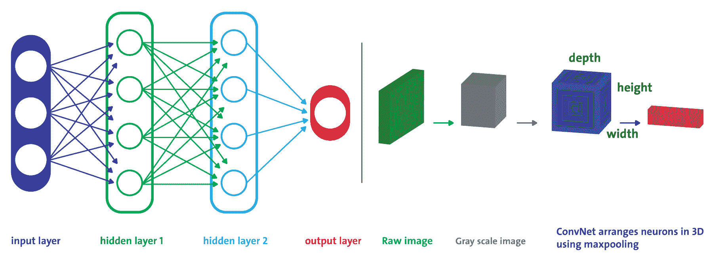

常规 DNN 对比 CNN，每层都有三维排列的神经元

例如，在上图的左侧，您可以看到一个常规的三层神经网络。在右边，ConvNet 将其神经元排列成三维(宽度、高度和深度)，如其中一层所示。`CNN`的每一层都将 3D 结构转换成神经元激活的 3D 输出结构。红色输入层保存图像，因此它的宽度和高度是图像的尺寸，深度是三个(红色、绿色和蓝色通道)。

因此，我们研究的所有多层神经网络都有由一长串神经元组成的层，我们必须在将输入图像馈送到网络之前，将输入图像展平到 1D。然而，将 2D 图像直接输入 CNN 是可能的，因为 CNN 中的每一层都用 2D 表示，这使得将神经元与其相应的输入进行匹配变得更加容易。我们将在接下来的章节中看到这样的例子。

另一个重要的事实是，特征图中的所有神经元共享相同的参数，因此它极大地减少了模型中的参数数量。此外，更重要的是，一旦 CNN 学会了识别一个地方的模式，它也可以对其他地方做同样的事情。


# CNN 架构

在 CNN 网络中，与 MLP 或 DBN 相比，各层之间定义连通性的方式有很大不同。**卷积** ( **conv** )层是 CNN 中的主要类型层，其中每个神经元都连接到输入图像的某个区域，这被称为**感受野**。

更具体地说，在 CNN 架构中，几个 conv 层以级联方式连接:每个层之后是一个**整流线性单元** ( **ReLU** )层，然后是一个池层，然后是几个 conv 层(+ReLU)，然后是另一个池层，依此类推。每个 conv 图层的输出是一组称为特征地图的对象，由单个内核过滤器生成。然后，将特征图作为新输入提供给下一层。在全连接层中，每个神经元产生一个输出，随后是一个激活层(即 Softmax 层):


CNN 的概念架构

正如您在上图中看到的，池层通常位于卷积层之后(即两个卷积层之间)。子区域的汇集层然后划分卷积区域。然后，使用最大池或平均池技术选择单个代表值，以减少后续层的计算时间。这样，CNN 可以被认为是一个特征提取器。为了更清楚地理解这一点，请参考下图:


CNN 是一个端到端的网络，既充当特征提取器又充当分类器。这样，它可以准确地识别(在获得足够训练数据的给定条件下)给定输入图像的标签。例如，它可以分类输入图像确实是一只老虎。

该特征相对于其空间位置的鲁棒性也增加了。更具体地说，当特征地图用作图像属性并通过灰度图像时，随着它在网络中前进，它会变得越来越小，但通常也会变得越来越深，因为会添加更多的特征地图。卷积运算解决了这个问题，因为它减少了自由参数的数量，允许网络用更少的参数变得更深。


# 卷积运算

卷积是一种数学运算，它将一个函数滑过另一个函数，并测量它们逐点相乘的完整性。卷积层可能是 CNN 中最重要的组成部分。对于第一个 conv 层，神经元并不连接到输入图像中的每个单个像素，而是仅连接到其感受野中的像素(参见上图)，而第二个 conv 层中的每个神经元仅连接到位于第一层中的小矩形内的神经元:

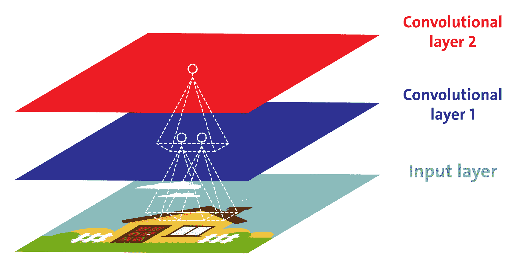

每个卷积神经元只处理其感受野的数据

在[第 2 章](e27fb252-7892-4659-81e2-2289de8ce570.xhtml)、*使用循环类型网络进行癌症类型预测、*中，我们已经看到所有多层神经网络(例如 MLP)都有由如此多的神经元组成的层，我们必须在将 1D 的输入图像馈送到网络之前将其展平。相反，在 CNN 中，每一层都用 2D 表示，这使得将神经元与其相关的输入进行匹配变得更加容易。

感受野用于通过加强相邻层神经元之间的局部连接模式来利用空间局部性。

这种架构允许网络集中于第一个隐藏层中的低级特征，然后将它们组装成下一个隐藏层中的更高级特征，以此类推。这种层次结构在现实世界的图像中很常见，这也是 CNN 在图像识别方面如此出色的原因之一。


# 汇集和填充操作

一旦理解了卷积层的工作原理，池层就很容易掌握了。池层通常独立作用于每个输入通道，因此输出深度与输入深度相同。或者，您可以在深度维度上进行合并，正如我们将在接下来看到的，在这种情况下，图像的空间维度(例如，高度和宽度)保持不变，但通道的数量减少了。让我们来看看 TensorFlow API 文档中对池化层的正式定义(更多信息请参见[https://github . com/Pete warden/tensor flow _ makefile/blob/master/tensor flow/python/ops/nn . py](https://github.com/petewarden/tensorflow_makefile/blob/master/tensorflow/python/ops/nn.py)):

“汇集运算在输入张量上扫描矩形窗口，计算每个窗口的归约运算(平均值、最大值或具有 argmax 的最大值)。每个池操作使用大小为 ksize 的矩形窗口，由偏移步幅分隔。例如，如果步幅都是 1，则使用每个窗口，如果步幅都是 2，则在每个维度中使用每隔一个窗口，以此类推。”

类似于 conv 层，汇集层中的每个神经元连接到位于小矩形感受野内的前一层中有限数量的神经元的输出。但是，必须定义大小、步幅和填充类型。因此，总的来说，池层的输出可以计算如下:

```java
output[i] = reduce(value[strides * i:strides * i + ksize])  
```

其中索引也与填充值一起被考虑。换句话说，使用池的目的是对输入图像进行二次采样，以减少计算负载、内存使用和参数数量。这有助于避免在训练阶段过度适应。

汇集神经元没有权重。因此，它仅使用聚合函数(如最大值或平均值)来聚合输入。

卷积运算的空间语义取决于所选择的填充方案。填充是一种增加输入数据大小的操作:

*   **对于 1D 输入**:只是一个数组附加了一个常数，比如说`c`
*   **对于 2D 输入**:用`c`包围的矩阵
*   **对于多维(即 nD)输入**:nD 超立方体被`c`包围

现在的问题是，这个常数`c`是什么？好吧，在大多数情况下(但不总是)，是零的`c`叫做**补零**。这个概念可以进一步细分为两种类型的填充，称为`VALID`和`SAME`，概述如下:

*   **有效填充**:仅删除最右侧的列(或最底部的行)。
*   **相同填充**:在此方案中，填充均匀应用于左右两侧。但是，如果要添加的列数是奇数，则在右侧添加一个额外的列。

我们已经在下图中用图形解释了前面的定义。如果我们希望一个层具有与前一层相同的高度和宽度，通常在输入周围添加零。这被称为`SAME`或零填充。

术语`SAME`表示输出特征地图与输入特征地图具有相同的空间维度。

另一方面，引入了零填充以使形状根据需要匹配，在输入贴图的每一侧都相等。另一方面，`VALID`表示没有填充，只删除最右边的列(或最下面的行):

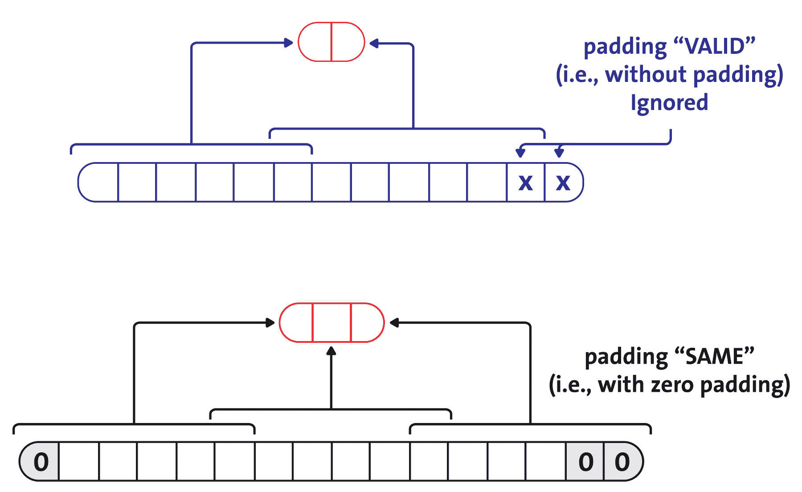

与 CNN 的有效填充相同

在下图中，我们使用一个 2 × 2 的池内核，步长为 2，没有填充。只有每个内核中的最大输入值才能进入下一层，因为其他输入都被丢弃了(我们将在后面看到这一点):

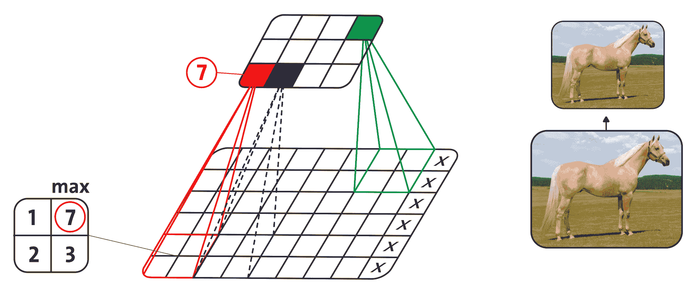

使用最大池(即二次抽样)的示例


# 全连接层(致密层)

在堆栈的顶部，添加了一个常规的全连接层(前馈神经网络或密集层)，其作用类似于可能由几个全连接层(+ReLUs)组成的 MLP，最后一层输出预测:通常，使用 Softmax 层输出多类分类的估计类概率。

到目前为止，我们对细胞神经网络及其用于图像分类的体系结构有最基本的理论知识。现在，是时候做一个动手项目了，是关于大规模 Yelp 图片的分类。在 Yelp，有很多照片，也有很多用户上传照片。这些照片提供了丰富的跨类别的当地商业信息。教计算机理解这些照片的背景并不是一件容易的事情。

Yelp 工程师在内部从事基于深度学习的图像分类项目(详见[https://engineering blog . yelp . com/2015/10/how-we-use-deep-learning-to-classify-business-photos-at-yelp . html](https://engineeringblog.yelp.com/2015/10/how-we-use-deep-learning-to-classify-business-photos-at-yelp.html))。


# 基于 CNN 的多标签图像分类

在本节中，我们将向您展示一个为图像分类开发真实 ML 项目的系统示例。但是，我们首先需要知道问题的描述，这样才能知道需要做什么样的图像分类。此外，在开始之前，关于数据集的知识是必须的。


# 问题描述

如今，食物自拍和以照片为中心的社交故事正在成为社交趋势。因此，大量包含食物和餐馆照片的自拍照被上传到社交媒体和网站上。在许多情况下，美食爱好者也提供书面评论，可以大大提高企业的知名度(例如，一家餐馆)。

例如，数百万独立访问者访问了 Yelp 网站，并撰写了超过 1.35 亿条评论。除此之外，很多照片和用户都在上传照片。然而，企业主可以发布照片和信息给他们的顾客。通过这种方式，Yelp 通过向当地企业出售广告来赚钱。

一个有趣的事实是，这些照片提供了丰富的跨类别的当地商业信息。因此，开发深度学习应用程序来理解这些照片的背景将是一项有用的任务。看一下下面的截图来了解一下吧:


从 Yelp 数据集中挖掘关于企业的一些见解

因此，如果我们得到了属于一家企业的照片，我们需要建立一个模型，以便它可以自动用用户提交的照片的多个标签来标记餐馆，以便预测企业属性。最终，这个项目的目标是将 Yelp 图片转化为文字。


# 数据集的描述

这个有趣项目的 Yelp 数据集是从[https://www . ka ggle . com/c/Yelp-restaurant-photo-classification](https://www.kaggle.com/c/yelp-restaurant-photo-classification)下载的。我们得到了 Yelp 的许可，条件是这些图片不会被重新分发。但是，你需要得到 https://www.yelp.com/dataset[的使用许可。](https://www.yelp.com/dataset)

提交评论是很棘手的。当 Yelp 用户想要提交评论时，他们必须从 Yelp 社区注释的 9 个不同标签中手动选择餐厅的标签，这些标签与数据集相关联。这些措施如下:

*   `0` : `good_for_lunch`
*   `1` : `good_for_dinner`
*   `2` : `takes_reservations`
*   `3` : `outdoor_seating`
*   `4` : `restaurant_is_expensive`
*   `5` : `has_alcohol`
*   `6` : `has_table_service`
*   `7` : `ambience_is_classy`
*   `8` : `good_for_kids`

因此，这是一个多标签多类别分类问题，其中每个企业可能具有前面列出的九个特征中的一个或多个。因此，我们必须尽可能准确地预测这些标签。数据集中有六个文件，如下所示:

*   `train_photos.tgz`:用作训练集的照片(234842 张)
*   `test_photos.tgz`:作为测试集的照片(237152 张)
*   `train_photo_to_biz_ids.csv`:提供照片 ID 和业务 ID 之间的映射(234，842 行)
*   `test_photo_to_biz_ids.csv`:提供照片 ID 和业务 ID 的映射(1190225 行)
*   `train.csv`:这是主训练数据集，包括业务 id 及其对应的标签(2000 行)
*   `sample_submission.csv`:样本提交—引用您的预测的正确格式，包括`business_id`和相应的预测标签


# 移除无效图像

我不知道为什么，但是每个图像文件夹(训练和测试)也包含一些带有`_*.jpg`名称模式的临时图像，而不是实际的图像。因此，我使用 UNIX 命令删除了它们，如下所示:

```java
$ find . -type f -name "._*.jpg" -exec rm -f {} ;
```

然后，我将每个`.csv`文件解压并复制到一个名为`label`的文件夹中。此外，我将训练和测试图像分别移动到`train`和`test`文件夹中(也就是在`images`文件夹中)。简而言之，在提取和复制之后，我们的项目中使用了下面的文件夹结构。因此，产生的结构如下:

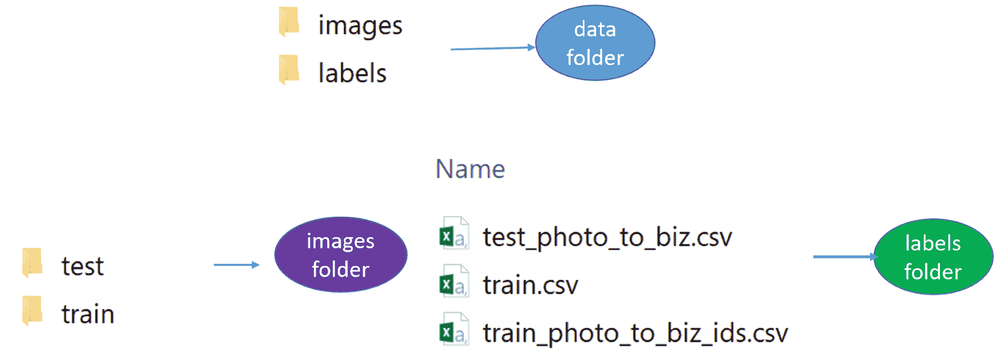

大型电影评论数据集中的文件夹结构


# 整个项目的工作流程

由于我们已经知道这是一个多标签多类图像分类问题，我们必须处理多实例问题**。**由于 DL4J 没有提供如何解决一个多标签多类图像分类问题的例子，我找到了 Andrew Brooks 的博客文章(见[http://Brooks Andrew . github . io/simple blog/articles/convolutionary-neural-network-training-with-DL4J/](http://brooksandrew.github.io/simpleblog/articles/convolutional-neural-network-training-with-dl4j/))这个项目的动机**。**

我只是将餐馆的标签应用到所有与之相关联的图片上，并将每张图片视为一条单独的记录。更专业地说，我将每个类作为一个独立的二元分类问题来处理。然而，在这个项目的开始，我们将看到如何将图像从`.jpg`格式读入 Java 中的矩阵表示。然后，我们将进一步处理和准备这些图像，以便 CNN 可以提供这些图像。此外，由于图像没有统一的形状和大小，因此在对图像应用灰度滤镜之前，我们需要应用几轮图像预处理操作，例如将每个图像调整为统一的尺寸:

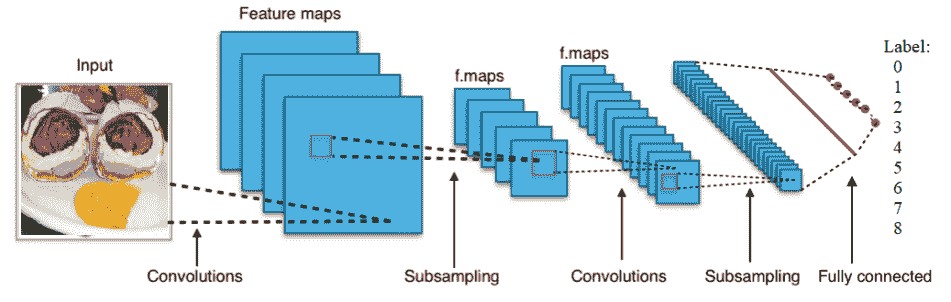

用于图像分类的 CNN 的概念化视图

然后，我们在每个类的训练数据上训练九个 CNN。一旦训练完成，我们保存训练好的模型、CNN 配置和参数，以便以后可以恢复它们。然后，我们应用一个简单的聚合函数为每个餐馆分配类别，其中每个餐馆都有多个与之相关联的图像，每个图像都有自己的九个类别的概率向量。然后，我们对测试数据进行评分，最后，我们使用测试图像对模型进行评估。

现在，我们来看看每个 CNN 的结构。每个网络都有两个卷积层、两个二次采样层、一个密集层和作为密集层的输出层。第一层是 conv 层，后面是二次采样层，再后面是另一个 conv 层，然后是二次采样层，然后是密集层，最后是输出层。稍后我们将看到每一层的结构。简而言之，Java 类(`YelpImageClassifier.java`)有以下工作流程:

1.  我们从`train.csv`文件中读取所有的商业标签
2.  然后，我们读取并创建一个从图像 ID 到业务 ID 的映射，即 imageID | busID
3.  然后，我们从`photoDir`目录中生成一个要加载和处理的图像列表，这有助于我们检索一定数量的图像的图像 id
4.  然后，我们读取图像，并将其处理成一张照片状的矢量图
5.  我们将步骤 3 和步骤 4 的输出链接起来，以对齐业务特征、图像 id 和标签 id，从而提取图像特征
6.  然后，我们在多标签设置中为九个可能的标签构建九个 CNN

7.  然后，我们训练所有的 CNN 并指定模型保存位置
8.  步骤 2 到 *6* 被重复几次，以从测试集中提取特征
9.  最后，我们评估模型并将预测保存在 CSV 文件中

现在，让我们看看前面的步骤在高级图表中会是什么样子，如下所示:

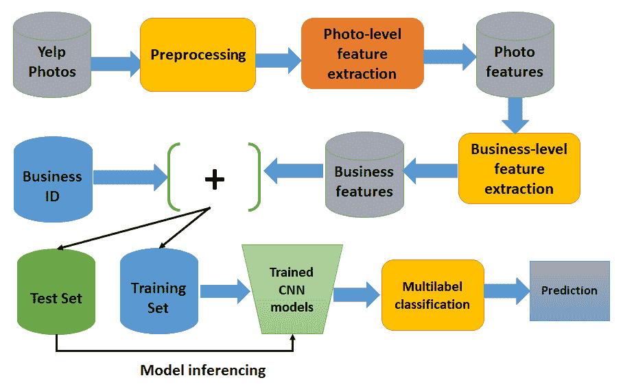

用于图像分类的 DL4j 图像处理流水线

太多了吗？不用担心；我们现在将详细了解每个步骤。如果你仔细看前面的步骤，你会发现步骤 1 到 5 是图像处理和特征构造。然后，第 6 步是训练 9 个 CNN，然后，在第 7 步，我们保存训练好的 CNN，以便我们可以在结果提交期间恢复它们。


# 图像预处理

当我试图开发这个应用程序时，我发现照片的形状和大小都不一样:有些图像很高，有些图像很宽，有些图像在外面，有些图像在里面，大多数图像都是食物。此外，图像有不同的形状(尽管大多数大致是方形)，像素不同，其中许多图像的尺寸正好是 500 x 375:

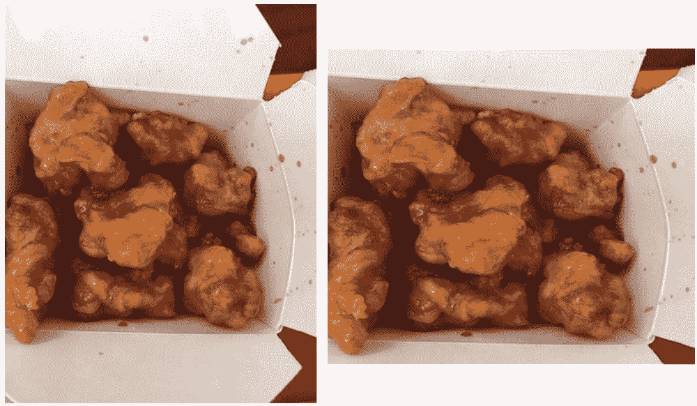

调整后的图形(左，原来的高的那个，右，方形的那个)

我们已经看到 CNN 不能处理不同形状和大小的图像。有许多健壮而有效的图像处理技术可以只提取感兴趣的区域 t ( **ROI** )的**区域，但是老实说，我不是图像处理专家，所以我决定保持这个调整大小的步骤简单。简单地说，我把所有的图像都做成方形，但是我仍然试图保持它们的质量。事实是，在大多数情况下，ROI 是被控制的。因此，只捕捉每张图像最中间的正方形不是一项简单的任务。尽管如此，我们还需要将每个图像转换成灰度图像。让我们把不规则形状的图像做成正方形。看前面的图片，左边的是原图，右边的是平方图。**

我们已经生成了一个正方形图像，但是我们是如何实现的呢？嗯，我首先检查了高度和宽度是否相同，然后我调整了图像的大小。在另外两个例子中，我裁剪了中心区域。下面的方法实现了这个技巧(但是可以随意执行`SquaringImage.java`脚本来查看输出):

```java
private static BufferedImage makeSquare(BufferedImage img) {
        int w = img.getWidth();
        int h = img.getHeight();
        int dim = Math.min(w, h);

        if (w == h) {
            return img;
        } else if (w > h) {
            return Scalr.crop(img, (w - h) / 2, 0, dim, dim);
        } else {
            return Scalr.crop(img, 0, (h - w) / 2, dim, dim);
        }
    }
```

干得好！既然我们所有的训练图像都是方形的，下一步就是使用导入预处理任务来调整它们的大小。我决定让所有的图像大小为 128 x 128。让我们看看调整大小后之前的图像(原始图像)是什么样子:

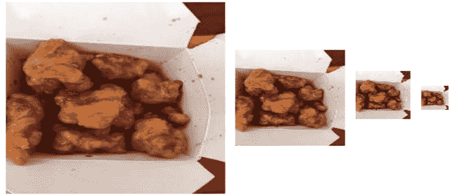

调整图像大小(分别为 256 x 256、128 x 128、64 x 64 和 32 x 32)

下面的方法可以做到这一点(但是可以随意执行`imageUtils.java`脚本来观看演示):

```java
// resize pixels
    public static BufferedImage resizeImg(BufferedImage img, int width, int height) {
        return Scalr.resize(img, Scalr.Method.BALANCED, width, height);
    }
```

顺便说一下，对于图像大小调整和平方，我使用了一些内置的图像读取包和一些第三方的处理包:

```java
import javax.imageio.ImageIO;
import org.imgscalr.Scalr;
```

要使用以前的包，请在 Maven 友好的`pom.xml`文件中添加以下依赖项(有关依赖项的完整列表，请参考本章提供的`pom.xml`文件):

```java
<dependency>
      <groupId>org.imgscalr</groupId>
      <artifactId>imgscalr-lib</artifactId>
      <version>4.2</version>
</dependency>
<dependency>
      <groupId>org.datavec</groupId>
      <artifactId>datavec-data-image</artifactId>
      <version>${dl4j.version}</version>
</dependency>
```

处理彩色图像更令人兴奋和有效，基于 DL4J 的 CNN 也可以处理彩色图像。然而，最好用灰度图像来简化计算。然而，通过这种方式，我们可以使整体表示更简单，空间效率更高。

让我们举一个上一步的例子；我们调整了每张 256 x 256 像素图像的大小——它由 16，384 个特征表示，而不是具有三个 RGB 通道的彩色图像的 16，384 x 3(执行`GrayscaleConverter.java`查看演示)。让我们看看转换后的图像会是什么样子:

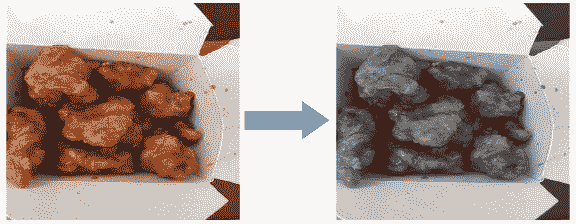

左边是原始图像，右边是经过 RGB 平均的灰度图像

之前的转换使用两种方法完成，分别叫做`pixels2Gray()`和`makeGray()`。前者将 RGB 像素转换为相应的灰度像素。让我们看看这个的签名:

```java
private static int pixels2Gray(int R, int G, int B) {
        return (R + G + B) / 3;
    }
private static BufferedImage makeGray(BufferedImage testImage) {
        int w = testImage.getWidth();
        int h = testImage.getHeight();
        for (int w1 = 0; w1 < w; w1++) {
            for (int h1 = 0; h1 < h; h1++) {
                int col = testImage.getRGB(w1, h1);
                int R = (col & 0xff0000) / 65536;
                int G = (col & 0xff00) / 256;
                int B = (col & 0xff);
                int graycol = pixels2Gray(R, G, B);
                testImage.setRGB(w1, h1, new Color(graycol, graycol, graycol).getRGB());
            }
        }
        return testImage;
    }
```

那么，引擎盖下发生了什么？我们把前面的三个步骤都串起来:把所有的图像做成正方形，然后全部转换成 256 x 256，最后把调整大小的图像转换成灰度的(我假设`x`是要转换的图像):

```java
convertedImage = ImageIO.read(new File(x))
          .makeSquare()
          .resizeImg(resizeImgDim, resizeImgDim) // (128, 128)
         .image2gray();
```

因此，总的来说，现在所有的图像都是灰色的，但只是在平方和调整大小之后。下图给出了转换步骤的一些概念:

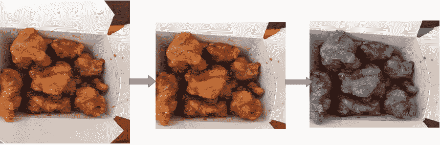

调整后的图形(左，原来的高的那个，右，方形的那个)

前面的链接也带来了一些额外的工作。现在，将所有这三个编码步骤放在一起，我们最终可以准备我们所有的图像:

```java
//imageUtils.java
public class imageUtils {
    // image 2 vector processing
    private static Integer pixels2gray(Integer red, Integer green, Integer blue){
        return (red + green + blue) / 3;
    }
    private static List<Integer> pixels2color(Integer red, Integer green, Integer blue) {
        return Arrays.asList(red, green, blue);
    }

private static <T> List<T> image2vec(BufferedImage img, Function<Triple<Integer, Integer, Integer>, T> f) {
        int w = img.getWidth();
        int h = img.getHeight();

        ArrayList<T> result = new ArrayList<>();
        for (int w1 = 0; w1 < w; w1++ ) {
            for (int h1 = 0; h1 < h; h1++) {
                int col = img.getRGB(w1, h1);
                int red =  (col & 0xff0000) / 65536;
                int green = (col & 0xff00) / 256;
                int blue = (col & 0xff);
                result.add(f.apply(new Triple<>(red, green, blue)));
            }
        }
        return result;
    }

    public static List<Integer> image2gray(BufferedImage img) {
        return image2vec(img, t -> pixels2gray(t.getFirst(), t.getSecond(), t.getThird()));
    }

    public static List<Integer> image2color(BufferedImage img) {
        return image2vec(img, t -> pixels2color(t.getFirst(), t.getSecond(), t.getThird()))
                .stream()
                .flatMap(l -> l.stream())
                .collect(Collectors.toList());
    }

    // make image square
    public static BufferedImage makeSquare(BufferedImage img) {
        int w = img.getWidth();
        int h = img.getHeight();
        int dim = Math.min(w, h);

        if (w == h) {
            return img;
        } else if (w > h) {
            return Scalr.crop(img, (w-h)/2, 0, dim, dim);
        } else  {
            return Scalr.crop(img, 0, (h-w)/2, dim, dim);
        }
    }

    // resize pixels
public static BufferedImage resizeImg(BufferedImage img, int width, int height) {
        return Scalr.resize(img, Scalr.Method.BALANCED, width, height);
    }
}
```


# 提取图像元数据

至此，我们已经加载并预处理了原始图像。然而，我们对添加的图像元数据一无所知，这是我们 CNN 学习所需要的。因此，是时候加载那些包含每个图像元数据的 CSV 文件了。

我编写了一个名为`readMetadata()`的方法来读取 CSV 格式的元数据，以便它可以被另外两个名为`readBusinessLabels`和`readBusinessToImageLabels`的方法使用。这三种方法在`CSVImageMetadataReader.java`脚本中定义。下面是`readMetadata()`的签名方法:

```java
public static List<List<String>> readMetadata(String csv, List<Integer> rows) throws IOException {
        boolean defaultRows = rows.size() == 1 && rows.get(0) == -1;
        LinkedList<Integer> rowsCopy = null;
        if (!defaultRows) {
            rowsCopy = new LinkedList<>(rows);
        }
        try(BufferedReader bufferedReader = new BufferedReader(new InputStreamReader(new FileInputStream(new File(csv))))) {
            ArrayList<List<String>> arrayList = new ArrayList<>();
            String line = bufferedReader.readLine();
            int i = 0;
            while (line != null) {
                if (defaultRows || rowsCopy.getFirst() == i) {
                    if (!defaultRows) {
                        rowsCopy.removeFirst();
                    }
                    arrayList.add(Arrays.asList(line.split(",")));
                }
                line = bufferedReader.readLine();
                i++;
            }
            return arrayList;
        }
    }
```

`readBusinessLabels()`方法从业务 ID 映射到 businessID | Set(labels)形式的标签:

```java
public static Map<String, Set<Integer>> readBusinessLabels(String csv) throws IOException {
        return readBusinessLabels(csv, DEFAULT_ROWS);
    }

public static Map<String, Set<Integer>> readBusinessLabels(String csv, List<Integer> rows) throws IOException {
        return readMetadata(csv, rows).stream()
                .skip(1)
                .map(l -> parseBusinessLabelsKv(l))
                .collect(Collectors.toMap(e -> e.getKey(), e -> e.getValue()));
    }
```

`readBusinessToImageLabels()`方法从图像 ID 映射到格式为 imageID | businessID 的业务 ID:

```java
public static Map<Integer, String> readBusinessToImageLabels(String csv) throws IOException {
        return readBusinessToImageLabels(csv, DEFAULT_ROWS);
    }

public static Map<Integer, String> readBusinessToImageLabels(String csv, List<Integer> rows) throws IOException {
        return readMetadata(csv, rows).stream()
                .skip(1)
                .map(l -> parseBusinessToImageLabelsKv(l))
                .collect(Collectors.toMap(e -> e.getKey(), e -> e.getValue(), useLastMerger()));
    }
```


# 图像特征提取

到目前为止，我们已经了解了如何预处理图像，以及如何通过将图像与原始图像链接来提取图像元数据。现在，我们需要从这些预处理过的图像中提取特征，以便将它们输入到 CNN 中。

我们需要地图操作来提取业务、数据和标签的要素。这三个操作将确保我们不会丢失任何图像来源(参见`imageFeatureExtractor.java`脚本):

*   格式为 imageID | businessID 的业务映射
*   imageID |图像数据形式的数据映射
*   businessID | labels 表单的标签映射

首先，我们必须定义一个正则表达式模式来从`CSVImageMetadataReaderclass`中提取一个 jpg 名称，用于匹配训练标签:

```java
public static Pattern patt_get_jpg_name = Pattern.compile("[0-9]");
```

然后，我们提取与其各自的业务 id 相关联的所有图像 id:

```java
public static List<Integer> getImgIdsFromBusinessId(Map<Integer, String> bizMap, List<String> businessIds) {
        return bizMap.entrySet().stream().filter(x -> 
                 businessIds.contains(x.getValue())).map(Map.Entry::getKey)
                .collect(Collectors.toList());
    }
```

现在，我们需要加载并处理所有已经预处理过的图像，通过将它们与前面示例中从业务 id 中提取的 id 进行映射来提取图像 id:

```java
public static List<String> getImageIds(String photoDir, Map<Integer, String> businessMap, 
                                       List<String> businessIds) {
        File d = new File(photoDir);
        List<String> imgsPath = Arrays.stream(d.listFiles()).map(f -> 
                                f.toString()).collect(Collectors.toList());
        boolean defaultBusinessMap = businessMap.size() == 1 && businessMap.get(-1).equals("-1");
        boolean defaultBusinessIds = businessIds.size() == 1 && businessIds.get(0).equals("-1");
        if (defaultBusinessMap || defaultBusinessIds) {
            return imgsPath;
        } else {
            Map<Integer, String> imgsMap = imgsPath.stream()
                    .map(x -> new AbstractMap.SimpleEntry<Integer, String>(extractInteger(x), x))
                    .collect(Collectors.toMap(e -> e.getKey(), e -> e.getValue()));
            List<Integer> imgsPathSub = imageFeatureExtractor.getImgIdsFromBusinessId(
                                        businessMap, businessIds);
            return imgsPathSub.stream().filter(x -> imgsMap.containsKey(x)).map(x -> imgsMap.get(x))
                    .collect(Collectors.toList());
        }
    }
```

在前面的代码块中，我们从 photoDir 目录(原始图像所在的位置)获得了一个图像列表。`ids`参数是一个可选参数，用于对从 photoDir 加载的图像进行子集化。到目前为止，我们已经能够提取与至少一个企业有某种关联的所有图像 id。下一步将是读取图像并将其处理成 imageID →矢量图:

```java
public static Map<Integer, List<Integer>> processImages(List<String> imgs, int resizeImgDim, int nPixels) {
        Function<String, AbstractMap.Entry<Integer, List<Integer>>> handleImg = x -> {
            BufferedImage img = null;
            try {
                img = ImageIO.read(new File(x));
            } catch (IOException e) {
                e.printStackTrace();
            }
            img = makeSquare(img);
            img = resizeImg(img, resizeImgDim, resizeImgDim);
            List<Integer> value = image2gray(img);
            if(nPixels != -1) {
                value = value.subList(0, nPixels);
            }
            return new AbstractMap.SimpleEntry<Integer, List<Integer>>(extractInteger(x), value);
        };

        return imgs.stream().map(handleImg).filter(e -> !e.getValue().isEmpty())
                .collect(Collectors.toMap(e -> e.getKey(), e -> e.getValue()));
    }
```

在前面的代码块中，我们读取图像并将其处理成 photoID →矢量图。`processImages()`方法采用以下参数:

*   `images`:在`getImageIds()`方法中的图像列表
*   `resizeImgDim`:缩放正方形图像的尺寸
*   `nPixels`:用于对图像进行采样的像素数，以便在测试功能时大幅减少运行时间

干得好！我们离提取训练 CNN 所需的数据只有一步之遥。特征提取的最后一步是提取像素数据，像素数据由跟踪每幅图像的四个对象组成，即 imageID、businessID、标签和像素数据:

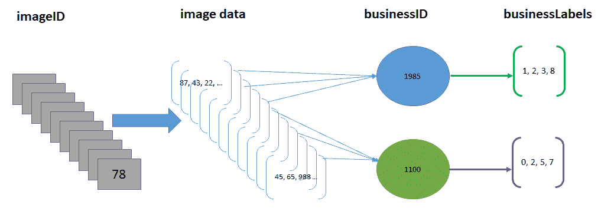

图像数据表示

因此，如上图所示，主数据结构由四种数据类型(即四个元组)构成—`imgID`、`businessID`、`pixel data vector`和`labels`:

因此，我们应该有一个包含这些对象的所有部分的类。不用担心；我们所需要的都在`FeatureAndDataAligner.java`脚本中定义了。一旦我们使用`YelpImageClassifier.java`脚本中的以下代码行(在 main 方法下)实例化了`FeatureAndDataAligner`的实例，就会提供`businessMap`、`dataMap`和`labMap`:

```java
FeatureAndDataAligner alignedData = new FeatureAndDataAligner(dataMap, businessMap, Optional.*of*(labMap));
```

这里使用了`labMap`的选项类型，因为当我们对测试数据评分时，我们没有这个信息——也就是说，它对于调用是可选的。现在，让我们看看我是怎么做的。我们从正在使用的类的构造函数开始，初始化前面的数据结构:

```java
private Map<Integer, List<Integer>> dataMap;
private Map<Integer, String> bizMap;
private Optional<Map<String, Set<Integer>>> labMap;
private List<Integer> rowindices;

public FeatureAndDataAligner(Map<Integer, List<Integer>> dataMap, Map<Integer, String> bizMap, Optional<Map<String, Set<Integer>>> labMap) {
        this(dataMap, bizMap, labMap, dataMap.keySet().stream().collect(Collectors.toList()));
    }
```

现在，我们通过`FeatureAndDataAligner.java`类的构造函数初始化这些值，如下所示:

```java
public FeatureAndDataAligner(Map<Integer, List<Integer>> dataMap, Map<Integer, String> bizMap, Optional<Map<String, Set<Integer>>> labMap,List<Integer> rowindices) {
        this.dataMap = dataMap;
        this.bizMap = bizMap;
        this.labMap = labMap;
        this.rowindices = rowindices;
    }
```

现在，当对齐数据时，如果`labMap`为空——没有提供训练数据——也可以使用以下内容:

```java
public FeatureAndDataAligner(Map<Integer, List<Integer>> dataMap, Map<Integer, String> bizMap) {
        this(dataMap, bizMap, Optional.empty(), dataMap.keySet().stream().collect(Collectors.toList()));
    }
```

现在，我们必须将图像 id 和图像数据与业务 id 对齐。为此，我编写了`BusinessImgageIds()`方法:

```java
public List<Triple<Integer, String, List<Integer>>> alignBusinessImgageIds(Map<Integer, List<Integer>> dataMap, Map<Integer, String> bizMap) {
        return alignBusinessImgageIds(dataMap, bizMap, dataMap.keySet().stream().collect(Collectors.toList()));
    }   
```

实际的实现在于下面的重载方法，如果图像没有业务 ID，该方法返回可选的:

```java
public List<Triple<Integer, String, List<Integer>>> alignBusinessImgageIds(Map<Integer, List<Integer>> dataMap, Map<Integer, String> bizMap, List<Integer> rowindices) {
        ArrayList<Triple<Integer, String, List<Integer>>> result = new ArrayList<>();
        for (Integer pid : rowindices) {
            Optional<String> imgHasBiz = Optional.ofNullable(bizMap.get(pid));
            String bid = imgHasBiz.orElse("-1");
            if (dataMap.containsKey(pid) && imgHasBiz.isPresent()) {
               result.add(new ImmutableTriple<>(pid, bid, dataMap.get(pid)));
            }
        }
        return result;
    }
```

最后，如上图所示，我们现在需要对齐标签，这是一个由`dataMap`、`bizMap`、`labMap`和`rowindices`组成的四元组列表:

```java
private List<Quarta<Integer, String, List<Integer>, Set<Integer>>> alignLabels(Map<Integer, List<Integer>>   
                                                                   dataMap, Map<Integer, String>             
                                                                   bizMap,Optional<Map<String, 
 Set<Integer>>> labMap,  
                                                                   List<Integer> rowindices) {
        ArrayList<Quarta<Integer, String, List<Integer>, Set<Integer>>> result = new ArrayList<>();
        List<Triple<Integer, String, List<Integer>>> a1 = alignBusinessImgageIds(dataMap, 
                                                                                 bizMap, rowindices);
        for (Triple<Integer, String, List<Integer>> p : a1) {
            String bid = p.getMiddle();
            Set<Integer> labs = Collections.emptySet();
            if (labMap.isPresent() && labMap.get().containsKey(bid)) {
                 labs = labMap.get().get(bid);
            }
            result.add(new Quarta<>(p.getLeft(), p.getMiddle(), p.getRight(), labs));
        }
        return result;
    }
```

在前面的代码块中，`Quarta`是一个 case 类，它帮助我们维护我们想要的数据结构，如下所示:

```java
public static class Quarta <A, B, C, D> {
        public final A a;
        public final B b;
        public final C c;
        public final D d;

        public Quarta(A a, B b, C c, D d) {
            this.a = a;
            this.b = b;
            this.c = c;
            this.d = d;
        }
    }
```

最后，我们预先计算并保存数据，这样每次调用该方法时都不需要重新计算:

```java
 private volatile List<Quarta<Integer, String, List<Integer>, Set<Integer>>> _data = null;
// pre-computing and saving data as a val so method does not need to re-compute each time it is called.
public List<Quarta<Integer, String, List<Integer>, Set<Integer>>> data() {
        if (_data == null) {
            synchronized (this) {
                if (_data == null) {
                    _data = alignLabels(dataMap, bizMap, labMap, rowindices);
                }
            }
        }
        return _data;
    }
```

最后，正如在前面的代码块中使用的，我们现在创建一些 getter 方法，以便在每次调用中，我们可以轻松地检索每个业务的`image id`、`business id`、业务标签和图像:

```java
// getter functions
public List<Integer> getImgIds() {
        return data().stream().map(e -> e.a).collect(Collectors.toList());
    }
public List<String> getBusinessIds() {
        return data().stream().map(e -> e.b).collect(Collectors.toList());
    }
public List<List<Integer>> getImgVectors() {
        return data().stream().map(e -> e.c).collect(Collectors.toList());
    }
public List<Set<Integer>> getBusinessLabels() {
        return data().stream().map(e -> e.d).collect(Collectors.toList());
    }
public Map<String, Integer> getImgCntsPerBusiness() {
        return getBusinessIds().stream().collect(Collectors.groupingBy(Function.identity())).entrySet()
                .stream().map(e -> new AbstractMap.SimpleEntry<>(e.getKey(), e.getValue().size()))
                .collect(Collectors.toMap(e -> e.getKey(), e -> e.getValue()));
    }
```

太棒了。到目前为止，我们已经成功地提取了特征来训练我们的 CNN。然而，事实是，当前形式的特征仍然不适合馈入 CNN。这是因为我们只有没有标签的特征向量。因此，它需要另一个中间转换。


# 准备 ND4J 数据集

如前所述，我们需要一个中间转换来准备包含特征向量和标签的训练集:特征来自图像，但标签来自业务标签。

为此，我们有了`makeND4jDataSets`类(详见`makeND4jDataSets.java`)。该类从来自`List[(imgID, bizID, labels, pixelVector)]`表单中的`alignLables`函数的数据结构中创建一个 ND4J 数据集对象。首先，我们使用`makeDataSet()`方法准备数据集，如下所示:

```java
public static DataSet makeDataSet(FeatureAndDataAligner alignedData, int bizClass) {
        INDArray alignedXData = makeDataSetTE(alignedData);
        List<Set<Integer>> labels = alignedData.getBusinessLabels();
        float[][] matrix2 = labels.stream().map(x -> (x.contains(bizClass) ? new float[]{1, 0} 
                             : new float[]{0, 1})).toArray(float[][]::new);
        INDArray alignedLabs = toNDArray(matrix2);
        return new DataSet(alignedXData, alignedLabs);
    }
```

然后，我们进一步需要将前面的数据结构转换成一个`INDArray`，然后 CNN 可以使用它:

```java
public static INDArray makeDataSetTE(FeatureAndDataAligner alignedData) {
        List<List<Integer>> imgs = alignedData.getImgVectors();
        double[][] matrix = new double[imgs.size()][];
        for (int i = 0; i < matrix.length; i++) {
            List<Integer> img = imgs.get(i);
            matrix[i] = img.stream().mapToDouble(Integer::doubleValue).toArray();
        }
        return toNDArray(matrix);
    }
```

在前面的代码块中，`toNDArray()`方法用于将双精度或浮点矩阵转换为`INDArray`格式:

```java
// For converting floar matrix to INDArray
private static INDArray toNDArray(float[][] matrix) {
          return Nd4j.*create*(matrix);
             }
// For converting double matrix to INDArray
private static INDArray toNDArray(double[][] matrix) {
            return Nd4j.*create*(matrix);
                  }
```

太棒了。我们能够从图像中提取所有元数据和特征，并准备了 ND4J 格式的训练数据，现在可以由基于 DL4J 的模型使用。然而，由于我们将使用 CNN 作为我们的模型，我们仍然需要在网络构建期间通过使用`convolutionalFlat`操作将这个 2D 对象转换成 4D。无论如何，我们将在下一节看到这一点。


# 训练、评估和保存训练好的 CNN 模型

到目前为止，我们已经了解了如何准备训练集。现在我们已经有了，更具挑战性的部分还在前面，因为我们必须用 234，545 张图像来训练我们的 CNN，尽管测试阶段可以用有限数量的图像来进行，例如 500 张图像。因此，最好使用 DL4j 的`MultipleEpochsIterator`来训练每个涉及 batchmode 的 CNN，这是一个数据集迭代器，用于对数据集进行多次遍历。

`MultipleEpochsIterator` is a dataset iterator for doing multiple passes over a dataset. See more at [https://deeplearning4j.org/doc/org/deeplearning4j/datasets/iterator/MultipleEpochsIterator.html](https://deeplearning4j.org/doc/org/deeplearning4j/datasets/iterator/MultipleEpochsIterator.html).<title>Network construction</title> <link rel="stylesheet" href="css/style.css" type="text/css"> 

# 网络建设

下面列出了重要的超参数及其详细信息。在这里，我将尝试构建一个五层 CNN，如下:

*   层 0 有一个具有 6×6 内核的`ConvolutionLayer`，一个通道(因为它们是灰度图像)，一个 2×2 的跨距，以及 20 个特征图，其中 ReLU 是激活函数:

```java
ConvolutionLayer layer_0 = new ConvolutionLayer.Builder(6,6)
            .nIn(nChannels)
            .stride(2,2) // default stride(2,2)
            .nOut(20) // # of feature maps
            .dropOut(0.7) // dropout to reduce overfitting
            .activation(Activation.*RELU*) // Activation: rectified linear units
            .build();
```

*   第 1 层有`SubsamplingLayer`最大池，跨度为 2x2。因此，通过使用 stride，我们以因子 2 向下采样。请注意，仅支持 MAX、AVG、SUM 和 PNORM。这里，内核大小将与最后一个`ConvolutionLayer`中的过滤器大小相同。因此，我们不需要明确定义内核大小:

```java
SubsamplingLayer layer_1 = new SubsamplingLayer
                .Builder(SubsamplingLayer.PoolingType.*MAX*)
                .stride(2, 2)
                .build();
```

*   第二层有一个具有 6×6 内核的`ConvolutionLayer`，一个通道(因为它们是灰度图像)，2×2 的步幅，以及 20 个输出神经元，其中 RELU 是激活函数。我们将使用 Xavier 进行网络权重初始化:

```java
ConvolutionLayer layer_2= new ConvolutionLayer.Builder(6, 6)
            .stride(2, 2) // nIn need not specified in later layers
            .nOut(50)
            .activation(Activation.*RELU*) // Activation: rectified linear units
            .build();
```

*   第 3 层有`SubsamplingLayer`最大池和 2 x 2 的跨度。因此，通过使用 stride，我们以因子 2 向下采样。请注意，仅支持 MAX、AVG、SUM 和 PNORM。这里，内核大小将与最后一个`ConvolutionLayer`中的过滤器大小相同。因此，我们不需要明确定义内核大小:

```java
SubsamplingLayer layer_3 = new SubsamplingLayer
           .Builder(SubsamplingLayer.PoolingType.*MAX*)
           .stride(2, 2)
           .build();
```

*   第 4 层有一个`DenseLayer`，即一个全连接的前馈层，可通过 50 个神经元的反向传播进行训练，并将 ReLU 作为激活函数。应该注意的是，我们不需要指定输入神经元的数量，因为它假设输入来自前面的`ConvolutionLayer`:

```java
DenseLayer layer_4 = new DenseLayer.Builder() // Fully connected layer
               .nOut(500)
               .dropOut(0.7) // dropout to reduce overfitting
              .activation(Activation.*RELU*) // Activation: rectified linear units 
             .build();
```

*   第 5 层是一个`OutputLayer`，具有两个由 softmax 激活驱动的输出神经元(即，类上的概率分布)。我们使用 XENT(即二进制分类的交叉熵)作为损失函数来计算损失:

```java
OutputLayer layer_5 = new OutputLayer.Builder(LossFunctions.LossFunction.*XENT*)
          .nOut(outputNum) // number of classes to be predicted
          .activation(Activation.*SOFTMAX*)
          .build();
```

除了这些层，我们还需要执行图像展平，也就是说，通过调用以下方法，使用 CNN 层将 2D 对象转换为 4D 消耗品:

```java
convolutionalFlat(numRows, numColumns, nChannels))
```

因此，综上所述，使用 DL4J，我们的 CNN 将如下:

```java
MultiLayerConfiguration conf = new NeuralNetConfiguration.Builder()
           .seed(seed)a
           .miniBatch(true) // for MultipleEpochsIterator
           .optimizationAlgo(OptimizationAlgorithm.*STOCHASTIC_GRADIENT_DESCENT*)
           .updater(new Adam(0.001)) // Aama for weight updater
           .weightInit(WeightInit.*XAVIER*) //Xavier weight init
           .list()
                    .layer(0, layer_0)
                    .layer(1, layer_1)
                    .layer(2, layer_2)
                    .layer(3, layer_3)
                    .layer(4, layer_4)
                   .layer(5, layer_5)
            .setInputType(InputType.*convolutionalFlat*(numRows, numColumns, nChannels))
            .backprop(true).pretrain(false)
            .build();
```

与培训相关的其他重要方面描述如下:

*   **样本数量**:如果你训练的是除 GPU 以外的所有图像，也就是 CPU，那就需要几天的时间。当我尝试处理 50，000 张图像时，一台配备酷睿 i7 处理器和 32 GB 内存的机器花了一整天的时间。现在，您可以想象整个数据集需要多长时间。此外，即使您以批处理模式进行培训，也需要至少 256 GB 的内存。
*   **历元数**:这是所有训练记录的迭代次数。由于时间限制，我迭代了 10 个时期。
*   **批次号**:每批记录的数量，例如 32、64、128。我用了 128。

现在，有了前面的超参数，我们可以开始训练我们的 CNN。下面的代码完成了这个任务。事情是这样的，首先，我们准备训练集，然后我们定义所需的超参数，然后我们归一化数据集，以便对 ND4j 数据帧进行编码，这样任何被认为是真的标签都是 1，其余的是 0。然后，我们打乱编码数据集的行和标签。

然后，我们需要分别使用`ListDataSetIterator`和`MultipleEpochsIterator`为数据集迭代器创建历元。一旦数据集被转换成 batchmodel，我们就可以训练构造的 CNN 了:

```java
log.info("Train model....");
for( int i=0; i<nepochs; i++ ){
      model.fit(epochitTr);
}
```

完成训练后，我们可以在测试集上评估模型:

```java
log.info("Evaluate model....");
Evaluation eval = new Evaluation(outputNum)

while (epochitTe.hasNext()) {
       DataSet testDS = epochitTe.next(nbatch);
       INDArray output = model.output(testDS.getFeatureMatrix());
       eval.eval(testDS.getLabels(), output);
}
```

评估完成后，我们现在可以检查每个 CNN 的结果(运行`YelpImageClassifier.java`脚本):

```java
System.*out*.println(eval.stats())
```

```java
>>>
 ==========================Scores========================================
 Accuracy: 0.5600
 Precision: 0.5584
 Recall: 0.5577
 F1 Score: 0.5926
 Precision, recall & F1: reported for positive class (class 1 - "1") only
 ========================================================================
```

哎呀！不幸的是，我们没有看到良好的准确性。但是，不要担心，因为在 FAQ 部分，我们将看到如何改进这一点。最后，我们可以保存逐层的网络配置和网络权重，以便稍后使用(即，在提交之前进行评分):

```java
if (!saveNN.isEmpty()) {
      // model config
      FileUtils.write(new File(saveNN + ".json"), model.getLayerWiseConfigurations().toJson());
      // model parameters
      DataOutputStream dos = new DataOutputStream(Files.*newOutputStream*(Paths.*get*(saveNN + ".bin")));
      Nd4j.*write*(model.params(), dos);
         }
    log.info("****************Example finished********************");
}
```

在前面的代码中，我们还保存了一个包含所有网络配置的 JSON 文件和一个用于保存所有 CNN 的所有权重和参数的二进制文件。这是使用两种方法完成的，即`saveNN()`和`loadNN()`，它们在`NetwokSaver.java`脚本中定义。首先，让我们看看`saveNN()`方法的签名，如下所示:

```java
public void saveNN(MultiLayerNetwork model, String NNconfig, String NNparams) throws IOException {
       // save neural network config
       FileUtils.write(new File(NNconfig), model.getLayerWiseConfigurations().toJson());

       // save neural network parms
      DataOutputStream dos = new  DataOutputStream(Files.*newOutputStream*(Paths.*get*(NNparams)));        
      Nd4j.*write*(model.params(), dos);
  }
```

这个想法很有远见，也很重要，因为正如我前面所说的，你不会第二次训练你的整个网络来评估一个新的测试集。例如，假设您只想测试一个图像。事情是这样的，我们还有另一个名为`loadNN()`的方法，它将我们之前创建的`.json`和`.bin`文件读回到一个`MultiLayerNetwork`中，这可以用来记录新的测试数据。这种方法如下:

```java
public static MultiLayerNetwork loadNN(String NNconfig, String NNparams) throws IOException {
        // get neural network config
        MultiLayerConfiguration confFromJson = MultiLayerConfiguration
                .fromJson(FileUtils.readFileToString(new File(NNconfig)));

        // get neural network parameters
        DataInputStream dis = new DataInputStream    (new FileInputStream(NNparams));
        INDArray newParams = Nd4j.read(dis);

        // creating network object
        MultiLayerNetwork savedNetwork = new MultiLayerNetwork(confFromJson);
        savedNetwork.init();
        savedNetwork.setParameters(newParams);

        return savedNetwork;
    }
```


# 对模型评分

我们将要使用的评分方法很简单。它通过平均图像级预测来分配业务级标签。我以简单的方式做到了这一点，但是您可以尝试使用更好的方法。我所做的是，如果属于类别`0`的所有图像的平均概率大于某个阈值，比如 0.5，则将一个企业指定为标签`0`:

```java
public static INDArray scoreModel(MultiLayerNetwork model, INDArray ds) {
        return model.output(ds);
    }
```

然后，我收集了来自`scoreModel()`方法的模型预测，并将它们与`alignedData`合并:

```java
/** Take model predictions from scoreModel and merge with alignedData*/
public static List<Pair<String, Double>> aggImgScores2Business(INDArray scores,
                                         FeatureAndDataAligner alignedData) {
        assert(scores.size(0) == alignedData.data().size());
        ArrayList<Pair<String, Double>> result = new ArrayList<Pair<String, Double>>();

        for (String x : alignedData.getBusinessIds().stream().distinct().collect(Collectors.toList())) {
            //R irows = getRowIndices4Business(alignedData.getBusinessIds(), x);
            List<String> ids = alignedData.getBusinessIds();
            DoubleStream ret = IntStream.range(0, ids.size())
                    .filter(i -> ids.get(i).equals(x))
                    .mapToDouble(e -> scores.getRow(e).getColumn(1).getDouble(0,0));
            double mean = ret.sum() / ids.size();
            result.add(new ImmutablePair<>(x, mean));
        }
        return result;
    }
```

最后，我们可以恢复训练好的和保存好的模型，恢复回来，为 Kaggle 生成提交文件。问题是，我们需要将每个模型的形象预测汇总到业务得分中。


# 提交文件生成

为此，我写了一个名为`ResultFileGenerator.java`的类。根据 Kaggle web 页面，我们将不得不以`business_ids, labels`格式书写结果。这里，`business_id`是对应业务的 ID，标签是多标签预测。让我们看看有多容易做到这一点。

首先，我们将图像预测汇总到每个模型的业务得分中。然后，我们将前面的数据结构转换成包含元组(`bizid`，`List[Double]`)的每个`bizID`的列表，其中`Vector[Double]`是概率的向量:

```java
public static List<Pair<String, List<Double>>> SubmitObj(FeatureAndDataAligner alignedData,
                                               String modelPath,
                                               String model0,
                                               String model1,
                                               String model2,
                                               String model3,
                                               String model4,
                                               String model5,
                                               String model6,
                                               String model7,
                                               String model8) throws IOException {
        List<String> models = Arrays.asList(model0, model1, 
                                            model2, model3, 
                                            model4, model5, 
                                            model6, model7, model8);
        ArrayList<Map<String, Double>> big = new ArrayList<>();
        for (String m : models) {
            INDArray ds = makeND4jDataSets.makeDataSetTE(alignedData);
            MultiLayerNetwork model = NetworkSaver.loadNN(modelPath + m + ".json", 
                                                          modelPath + m + ".bin");
            INDArray scores = ModelEvaluation.scoreModel(model, ds);
            List<Pair<String, Double>> bizScores = ModelEvaluation.
                                                   aggImgScores2Business(scores, alignedData);
            Map<String, Double> map = bizScores.stream().collect(Collectors.toMap(
                                                                 e -> e.getKey(), e -> e.getValue()));
            big.add(map);
              }

        // transforming the data structure above into a List for each bizID containing a Tuple (bizid, 
           List[Double]) where the Vector[Double] is the the vector of probabilities: 
        List<Pair<String, List<Double>>> result = new ArrayList<>();
        Iterator<String> iter = alignedData.data().stream().map(e -> e.b).distinct().iterator();
        while (iter.hasNext()) {
            String x = iter.next();
            result.add(new MutablePair(x, big.stream().map(x2 -> 
                                       x2.get(x)).collect(Collectors.toList())));
        }
        return result;
    }
```

因此，一旦我们从每个模型中聚集了结果，我们就需要生成提交文件:

```java
public static void writeSubmissionFile(String outcsv, List<Pair<String, List<Double>>> phtoObj, double thresh) throws FileNotFoundException {
        try (PrintWriter writer = new PrintWriter(outcsv)) {
            writer.println("business_ids,labels");
            for (int i = 0; i < phtoObj.size(); i++) {
                Pair<String, List<Double>> kv = phtoObj.get(i);
                StringBuffer sb = new StringBuffer();
                Iterator<Double> iter = kv.getValue().stream().filter(x -> x >= thresh).iterator();
                for (int idx = 0; iter.hasNext(); idx++) {
                    iter.next();
                    if (idx > 0) {
                        sb.append(' ');
                    }
                    sb.append(Integer.toString(idx));
                }
                String line = kv.getKey() + "," + sb.toString();
                writer.println(line);
            }
        }
    }
```

至此，我们已经完成了所有的工作，现在我们可以包装它，为 Kaggle 生成一个样本预测和提交文件。为了简单起见，为了节省时间，我将它随机分割成 20，000 张图片。感兴趣的读者也可以尝试为所有的图片建立 CNN。然而，这可能需要几天时间。然而，我们将在常见问题部分查看一些性能调优技巧。


# 通过执行 main()方法完成所有工作

让我们通过以编程方式观察我们的模型的性能来总结整个讨论(参见 main `YelpImageClassifier.java`类):

```java
public class YelpImageClassifier {
    public static void main(String[] args) throws IOException {
        Map<String, Set<Integer>> labMap = readBusinessLabels("Yelp/labels/train.csv");        
        Map<Integer, String> businessMap = readBusinessToImageLabels("Yelp/labels
                                                                      /train_photo_to_biz_ids.csv");
        List<String> businessIds = businessMap.entrySet().stream().map(e -> 
                                                    e.getValue()).distinct().collect(Collectors.toList());
        // 100 images
        List<String> imgs = getImageIds("Yeimg/train/", businessMap, businessIds).subList(0, 100); 
        System.out.println("Image ID retreival done!");

        Map<Integer, List<Integer>> dataMap = processImages(imgs, 64);
        System.out.println("Image processing done!");

        FeatureAndDataAligner alignedData = new FeatureAndDataAligner(dataMap, 
                                                                      businessMap, Optional.of(labMap));
        //System.out.println(alignedData.data());
        System.out.println("Feature extraction done!");

        // Training one model for one class at a time
        CNNEpochs.trainModelEpochs(alignedData, 0, "results/models/model0"); 
        CNNEpochs.trainModelEpochs(alignedData, 1, "results/models/model1");
        CNNEpochs.trainModelEpochs(alignedData, 2, "results/models/model2");
        CNNEpochs.trainModelEpochs(alignedData, 3, "results/models/model3");
        CNNEpochs.trainModelEpochs(alignedData, 4, "results/models/model4");
        CNNEpochs.trainModelEpochs(alignedData, 5, "results/models/model5");
        CNNEpochs.trainModelEpochs(alignedData, 6, "results/models/model6");
        CNNEpochs.trainModelEpochs(alignedData, 7, "results/models/model7");
        CNNEpochs.trainModelEpochs(alignedData, 8, "results/models/model8");

        // processing test data for scoring
        Map<Integer, String> businessMapTE = readBusinessToImageLabels("Yelp/labels
                                                                        /test_photo_to_biz.csv");
        List<String> imgsTE = getImageIds("Yeimg/test/", businessMapTE,                                     
                                  businessMapTE.values().stream()
                                  .distinct().collect(Collectors.toList()))
                                  .subList(0, 100);

        Map<Integer, List<Integer>> dataMapTE = processImages(imgsTE, 64); // make them 64x64
        FeatureAndDataAligner alignedDataTE = new FeatureAndDataAligner(dataMapTE, 
                                                  businessMapTE, Optional.empty());

        // creating csv file to submit to kaggle (scores all models)
        List<Pair<String, List<Double>>> Results = SubmitObj(alignedDataTE, "results/models/", 
                                                             "model0", "model1", "model2", 
                                                             "model3", "model4", "model5", 
                                                             "model6", "model7", "model8");
        writeSubmissionFile("results/kaggleSubmission/kaggleSubmitFile.csv", Results, 0.50);

       // example of how to score just model
        INDArray dsTE = makeND4jDataSets.makeDataSetTE(alignedDataTE);
        MultiLayerNetwork model = NetworkSaver.loadNN("results/models/model0.json", 
                                                      "results/models/model0.bin");
        INDArray predsTE = ModelEvaluation.scoreModel(model, dsTE);
        List<Pair<String, Double>> bizScoreAgg = ModelEvaluation
                                                .aggImgScores2Business(predsTE, alignedDataTE);
        System.out.println(bizScoreAgg);
    }
}
```

的确，我们还没有达到杰出的分类精度。尽管如此，我们仍然可以用调整过的超参数来尝试。以下部分提供了一些见解。


# 常见问题(FAQ)

虽然我们已经能够解决这个多标签分类问题，但我们体验到的准确性低于标准。因此，在这一部分，我们将看到一些你可能已经想到的**常见问题**(**FAQ**)。知道这些问题的答案可能会帮助你提高我们训练的 CNN 的准确性。这些问题的答案可以在附录中找到:

1.  在实现这个项目时，我可以尝试调整哪些超参数？
2.  我的机器在运行这个项目时开始面向对象。我该怎么办？
3.  当用完整的图像训练网络时，我的 GPU 得到了 OOP。我该怎么办？
4.  我知道在这个项目中使用 CNN 的预测准确性仍然很低。我们的网络是欠适应还是过适应？有什么方法可以观察训练进行的怎么样？
5.  我对在 Scala 中实现相同的项目非常感兴趣。我该怎么做呢？
6.  对于这种需要处理大规模图像的项目，我应该使用哪种优化器？
7.  我们有多少个超参数？我还想看到他们的每一层。


# 摘要

在本章中，我们已经看到了如何在 DL4J 框架上使用 CNN 开发一个真实的应用程序。我们已经看到了如何通过九个 CNN 和一系列复杂的特征工程和图像处理操作来解决多标签分类问题。尽管我们无法达到更高的精度，但是鼓励读者调整代码中的超参数，并对相同的数据集尝试相同的方法。

此外，建议用所有图像训练 CNN，以便网络可以获得足够的数据来学习 Yelp 图像的特征。另一个建议是改进特征提取过程，以便 CNN 可以具有更多高质量的特征。

在下一章中，我们将看到如何实施和部署一个实践深度学习项目，该项目根据评论文本包含的单词将它们分类为正面或负面。将使用包含 50，000 条评论(训练加测试)的大规模电影评论数据集。

使用 Word2Vec(即 NLP 中广泛使用的单词嵌入技术)和 LSTM 网络进行建模的组合方法将被应用:预训练的 Google 新闻向量模型将被用作神经单词嵌入。然后，训练向量和标签一起，将被输入 LSTM 网络，以将它们分类为消极情绪或积极情绪。这将在测试集上评估训练好的模型。


# 问题的答案

**回答** **问题 1** :以下超参数非常重要，必须进行调整以获得优化结果:

*   Dropout 用于随机关闭某些神经元(即特征检测器)，以防止过度拟合
*   学习率优化—Adagrad 可用于特定功能的学习率优化
*   正规化—L1 和/或 L2 正规化
*   渐变标准化和裁剪
*   最后，应用批量标准化来减少训练中的内部协变量偏移

现在，对于 dropout，我们可以在每个卷积和密集层中添加 dropout，在过度拟合的情况下，模型会根据训练数据集进行专门调整，因此不会用于泛化。因此，尽管它在训练集上表现良好，但在测试数据集和后续测试上的性能很差，因为它缺乏泛化属性。

无论如何，我们可以在 CNN 和 DenseLayer 上申请退学。现在，为了更好地优化学习速率，Adagrad 可用于特定功能的学习速率优化。那么，为了更好地规范化，我们可以使用 L1 和/或 L2。因此，考虑到这一点，我们的网络配置应该如下所示:

```java
ConvolutionLayer layer_0 = new ConvolutionLayer.Builder(6, 6)
                .nIn(nChannels)
                .stride(2, 2) // default stride(2,2)
                .nOut(20) // # of feature maps
                .dropOut(0.7) // dropout to reduce overfitting
                .activation(Activation.RELU) // Activation: rectified linear units
                .build();
        SubsamplingLayer layer_1 = new SubsamplingLayer.Builder(SubsamplingLayer.PoolingType.MAX)
                .stride(2, 2)
                .build();
        ConvolutionLayer layer_2 = new ConvolutionLayer.Builder(6, 6)
                .stride(2, 2) // nIn need not specified in later layers
                .nOut(50)
                .activation(Activation.RELU) // Activation: rectified linear units
                .build();
        SubsamplingLayer layer_3 = new SubsamplingLayer.Builder(SubsamplingLayer.PoolingType.MAX)
                .stride(2, 2)
                .build();
        DenseLayer layer_4 = new DenseLayer.Builder() // Fully connected layer
                .nOut(500)
                .dropOut(0.7) // dropout to reduce overfitting
                .activation(Activation.RELU) // Activation: rectified linear units
                .gradientNormalization(GradientNormalization.ClipElementWiseAbsoluteValue)
                .gradientNormalizationThreshold(10)
                .build();
        OutputLayer layer_5 = new OutputLayer.Builder(LossFunctions.LossFunction.XENT)
                .nOut(outputNum) // number of classes to be predicted
                .gradientNormalization(GradientNormalization.ClipElementWiseAbsoluteValue)
                .gradientNormalizationThreshold(10)
                .activation(Activation.SOFTMAX)
                .build();
        MultiLayerConfiguration conf = new NeuralNetConfiguration.Builder().seed(seed).miniBatch(true)
                .optimizationAlgo(OptimizationAlgorithm.STOCHASTIC_GRADIENT_DESCENT
                .l2(0.001) // l2 reg on all layers
                .updater(new AdaGrad(0.001))
                .weightInit(WeightInit.XAVIER) // Xavier weight init
                .list()
                        .layer(0, layer_0)
                        .layer(1, layer_1)
                        .layer(2, layer_2)
                        .layer(3, layer_3)
                        .layer(4, layer_4)
                         .layer(5, layer_5)
                .setInputType(InputType.convolutionalFlat(numRows, numColumns, nChannels))
                .backprop(true).pretrain(false) // Feedforward hence no pre-train.
                .build();
```

**问题 2 的答案**:由于分层架构的透视和卷积层，训练 CNN 需要大量的 RAM。这是因为反向传播的反向传递需要在正向传递期间计算的所有中间值。幸运的是，在推理阶段，当计算完下一层时，一旦计算完成，一层占用的内存就会被释放。

此外，如前所述，DL4J 构建于 ND4J 之上，ND4J 利用堆外内存管理。这使我们能够控制堆外内存的最大数量。我们可以设置`org.bytedeco.javacpp.maxbytes`系统属性。例如，对于一次 JVM 运行，您可以通过`-Dorg.bytedeco.javacpp.maxbytes=1073741824`将堆外内存限制为 1 GB。

**问题 3 的答案**:正如我之前提到的，用 Yelp 的 50，000 张图片训练 CNN 用了一整天的时间，使用的是一台配备酷睿 i7 处理器和 32 GB 内存的机器。自然，对所有图像执行此操作可能需要一周时间。因此，在这种情况下，在 GPU 上进行培训更有意义。

幸运的是，我们已经看到 DL4J 可以在分布式 GPU 上工作，也可以在 native 上工作。为此，它有我们所说的**后端**，或者它工作的不同类型的硬件。最后，一个有趣的问题是:如果我们的 GPU 内存不足，我们该怎么办？好吧，如果你的 GPU 在训练 CNN 时耗尽了内存，你可以做以下五件事来尝试解决这个问题(除了购买更多 RAM 的 GPU):

*   减少小批量
*   在一层或多层中使用更大的步幅来降低维数，但不要使用 PCA 或 SVD
*   除去一层或多层，除非有一个非常深的网络是绝对必要的
*   使用 16 位浮点而不是 32 位浮点(但是精度不得不妥协)
*   将 CNN 分布在多个设备上(即 GPU/CPU)

有关使用 DL4J 在 GPU 上进行分布式训练的更多信息，请参考[第 8 章](a59fb1f2-b585-44f5-a467-903b8c25867b.xhtml)、*分布式深度学习-使用卷积 LSTM 网络进行视频分类*。

**回答** **问题 4** :我们确实没有体验到良好的准确性。然而，有几个原因可以解释为什么我们没有执行超参数调优。其次，我们没有用所有的图片训练我们的网络，所以我们的网络没有足够的数据来学习 Yelp 图片。最后，我们仍然可以从下图中看到模型与迭代得分和其他参数的关系，因此我们可以看到我们的模型没有过度拟合:

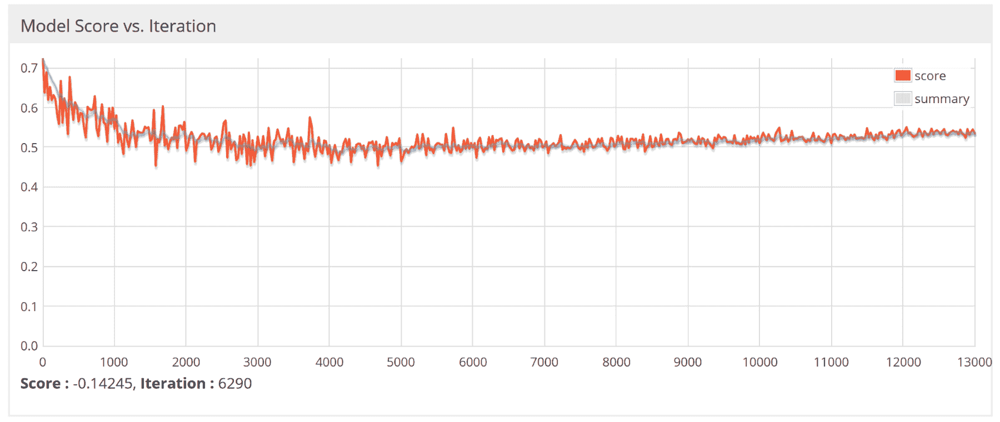

LSTM 情感分析器的模型与迭代得分和其他参数

**回答** **问题 5** :是的，这是可能的，因为 Scala 也是一种 JVM 语言，所以将这个 Java 项目转换成 Scala 并不困难。然而，我之前的一本书在 Scala 中解决了同样的问题。

这里是参考:Md. Rezaul Karim， *Scala 机器学习项目*，Packt 出版有限公司，2018 年 1 月。注意，在那本书里，我用的是旧版本的 ND4J 和 DL4J，但我相信你可以按照这个项目升级。

**回答** **问题 6** :因为在 CNN 中，目标函数之一是最小化评估成本，所以我们必须定义一个优化器。DL4j 支持以下优化器:

*   新币(仅学习率)
*   涅斯特列夫动量
*   阿达格拉德
*   RMSProp
*   圣经》和《古兰经》传统中）亚当（人类第一人的名字
*   阿达德尔塔

有关更多信息，感兴趣的读者可以参考位于[https://deeplearning4j.org/updater](https://deeplearning4j.org/updater)的可用更新程序的 DL4J 页面。

**问题 7 答案**:网络初始化后立即使用以下代码即可:

```java
//Print the number of parameters in the network (and for each layer)
Layer[] layers = model.getLayers();
int totalNumParams = 0;
for( int i=0; i<layers.length; i++ ){
          int nParams = layers[i].numParams();
          System.*out*.println("Number of parameters in layer " + i + ": " + nParams);
          totalNumParams += nParams;
        }
System.*out*.println("Total number of network parameters: " + totalNumParams);
```

```java
>>>
 Number of parameters in layer 0: 740
 Number of parameters in layer 1: 0
 Number of parameters in layer 2: 36050
 Number of parameters in layer 3: 0
 Number of parameters in layer 4: 225500
 Number of parameters in layer 5: 1002
 Total number of network parameters: 263292
```

这也告诉我们，子采样层没有任何超参数。然而，如果你想创造一个 MLP 或 DBN，我们将需要数百万个超参数。然而，在这里，我们可以看到，我们只需要 263，000 个超参数。