# 一、神经网络数学

神经网络用户需要对神经网络概念、算法和基础数学有一个相当好的理解。良好的数学直觉和对许多技术的理解对于牢固掌握算法的内部功能和获得好的结果是必要的。理解这些技术所需的数学量和数学水平是多维的，也取决于兴趣。在本章中，你将通过理解用于解决复杂计算问题的数学来学习神经网络。本章涵盖了线性代数、微积分和神经网络优化的基础知识。

本章的主要目的是为后面的章节建立数学基础。

本章将涵盖以下主题:

*   理解线性代数
*   理解微积分
*   最佳化


# 理解线性代数

线性代数是数学的一个重要分支。对线性代数的理解对于**深度学习**，也就是神经网络来说至关重要。贯穿本章，我们将通过关键和基本的线性代数先决条件。线性代数研究线性方程组。我们不再使用标量，而是开始使用矩阵和向量。利用线性代数，我们可以描述深度学习中的复杂运算。


# 环境设置

在我们进入数学及其属性领域之前，我们有必要设置开发环境，因为它将为我们提供执行我们所学概念的设置，这意味着安装编译器、依赖项和 **IDE** ( **集成开发环境**)来运行我们的代码库。


# 在 Pycharm 中设置 Python 环境

最好使用 Pycharm 这样的 IDE 来编辑 Python 代码，因为它提供了开发工具和内置的编码帮助。代码检查使编码和调试更快更简单，确保您专注于学习神经网络数学的最终目标。

以下步骤展示了如何在 Pycharm 中设置本地 Python 环境:

1.  转到首选项并验证是否安装了 TensorFlow 库。如果没有，按照[https://www.tensorflow.org/install/](https://www.tensorflow.org/install/)的说明安装 TensorFlow:


2.  保留 TensorFlow 的默认选项，点击 OK。
3.  最后，右键单击源文件，然后单击运行“矩阵”:

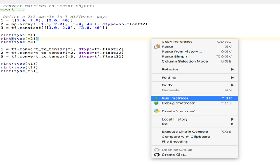

# 线性代数结构

在下一节中，我们将描述线性代数的基本结构。


# 标量、向量和矩阵

标量、向量和矩阵是数学的基本对象。基本定义如下:

*   标量由一个称为**量级**的单一数字或数值表示。
*   Vector 是一组按顺序排列的数字。一个唯一的索引标识每个数字。Vector 表示空间中的一个点，每个元素给出沿不同轴的坐标。
*   矩阵是一个二维数字数组，其中每个数字使用两个索引来标识( *i* 、 *j* )。


# 张量

轴数可变的数字阵列被称为张量。例如，对于三个轴，使用三个索引( *i* 、 *j* 、 *k* )来标识。

下图总结了一个张量，它描述了一个二阶张量对象。在三维笛卡尔坐标系中，张量分量将形成矩阵:

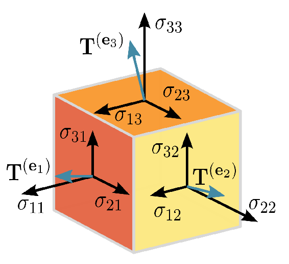

图片参考摘自张量维基[https://en.wikipedia.org/wiki/Tensor](https://en.wikipedia.org/wiki/Tensor)


# 操作

以下主题将描述线性代数的各种运算。


# 向量

`Norm`函数用于获取向量的大小；向量的范数 *x* 测量从原点到点 *x* 的距离。又称为范数，其中 *p=2* 称为**欧氏范数**。

以下示例向您展示了如何计算给定向量的范数:

```py
import tensorflow as tf

vector = tf.constant([[4,5,6]], dtype=tf.float32)
eucNorm = tf.norm(vector, ord="euclidean")

with tf.Session() as sess:
print(sess.run(eucNorm))
```

清单的输出是 8.77496。


# 矩阵

矩阵是数字的二维数组，其中每个元素由两个索引而不是一个来标识。如果一个实矩阵 *X* 的高度为 *m* ，宽度为 *n* ，那么我们说 *X ∈ Rm × n* 。这里， *R* 是一组实数。

以下示例显示了不同的矩阵如何转换为张量对象:

```py
# convert matrices to tensor objects
import numpy as np
import tensorflow as tf

# create a 2x2 matrix in various forms
matrix1 = [[1.0, 2.0], [3.0, 40]]
matrix2 = np.array([[1.0, 2.0], [3.0, 40]], dtype=np.float32)
matrix3 = tf.constant([[1.0, 2.0], [3.0, 40]])

print(type(matrix1))
print(type(matrix2))
print(type(matrix3))

tensorForM1 = tf.convert_to_tensor(matrix1, dtype=tf.float32)
tensorForM2 = tf.convert_to_tensor(matrix2, dtype=tf.float32)
tensorForM3 = tf.convert_to_tensor(matrix3, dtype=tf.float32)

print(type(tensorForM1))
print(type(tensorForM2))
print(type(tensorForM3))
```

清单的输出如以下代码所示:

```py
<class 'list'>
<class 'numpy.ndarray'>
<class 'tensorflow.python.framework.ops.Tensor'>
<class 'tensorflow.python.framework.ops.Tensor'>
<class 'tensorflow.python.framework.ops.Tensor'>
<class 'tensorflow.python.framework.ops.Tensor'>
```


# 矩阵乘法

矩阵 *A* 和 *B* 的矩阵乘法是第三个矩阵， *C* :

*C = AB*

矩阵的逐元素乘积被称为**哈达玛**乘积，并被表示为 *A.B* 。

相同维数的两个向量 *x* 和 *y* 的点积就是转置 *y* 的矩阵积 *x* 。矩阵乘积 *C = AB* 就像计算矩阵 *A* 的行 *i* 和矩阵 *B* 的列 *j* 之间的点积一样:

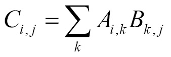

以下示例显示了使用 tensor 对象的 Hadamard 积和点积:

```py
import tensorflow as tf

mat1 = tf.constant([[4, 5, 6],[3,2,1]])
mat2 = tf.constant([[7, 8, 9],[10, 11, 12]])

*# hadamard product (element wise)* mult = tf.multiply(mat1, mat2)

*# dot product (no. of rows = no. of columns)* dotprod = tf.matmul(mat1, tf.transpose(mat2))

with tf.Session() as sess:
    print(sess.run(mult))
    print(sess.run(dotprod))
```

清单的输出如下所示:

```py
[[28 40 54][30 22 12]]
 [[122 167][ 46 64]]
```


# 追踪运算符

矩阵 *A* 的跟踪算子 *Tr(A)* 给出了一个矩阵所有对角线元素的和。以下示例显示了如何对张量对象使用 trace 运算符:

```py
import tensorflow as tf

mat = tf.constant([
 [0, 1, 2],
 [3, 4, 5],
 [6, 7, 8]
], dtype=tf.float32)

 *# get trace ('sum of diagonal elements') of the matrix* mat = tf.trace(mat)

 with tf.Session() as sess:
    print(sess.run(mat))
```

清单的输出是 *12.0* 。


# 矩阵转置

矩阵的转置是矩阵在主对角线上的镜像。对称矩阵是等于其自身转置的任何矩阵:

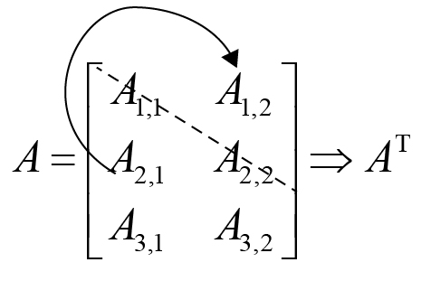

以下示例显示了如何对张量对象使用转置运算符:

```py
import tensorflow as tf

x = [[1,2,3],[4,5,6]]
x = tf.convert_to_tensor(x)
xtrans = tf.transpose(x)

y=([[[1,2,3],[6,5,4]],[[4,5,6],[3,6,3]]])
y = tf.convert_to_tensor(y)
ytrans = tf.transpose(y, perm=[0, 2, 1])

with tf.Session() as sess:
   print(sess.run(xtrans))
   print(sess.run(ytrans))
```

清单的输出如下所示:

```py
[[1 4] [2 5] [3 6]]
```


# 矩阵对角线

本质上是对角线的矩阵主要由零组成，并且只在主对角线上有非零元素。不是所有的对角矩阵都需要是正方形的。

使用对角线部分运算，我们可以得到给定矩阵的对角线，为了创建一个具有给定对角线的矩阵，我们使用来自`tensorflow`的`diag`运算。以下示例显示了如何对张量对象使用对角线运算符:

```py
import tensorflow as tf

mat = tf.constant([
 [0, 1, 2],
 [3, 4, 5],
 [6, 7, 8]
], dtype=tf.float32)

*# get diagonal of the matrix* diag_mat = tf.diag_part(mat)

*# create matrix with given diagonal* mat = tf.diag([1,2,3,4])

with tf.Session() as sess:
   print(sess.run(diag_mat))
   print(sess.run(mat))
```

其输出如下所示:

```py
[ 0\.  4\.  8.]
[[1 0 0 0][0 2 0 0] [0 0 3 0] [0 0 0 4]]
```


# 单位矩阵

单位矩阵是一个矩阵 *I* 不改变任何向量，就像 *V* 乘以 *I* 一样。

以下示例显示了如何获取给定大小的单位矩阵:

```py
import tensorflow as tf

identity = tf.eye(3, 3)

with tf.Session() as sess:
   print(sess.run(identity))  
```

其输出如下所示:

```py
[[ 1\.  0\.  0.] [ 0\.  1\.  0.] [ 0\.  0\.  1.]]
```


# 逆矩阵

*I* 的矩阵逆表示为。考虑下面的等式；使用 *b* 的倒数和不同值来求解，对于 *x* 可以有多个解。请注意该属性:


**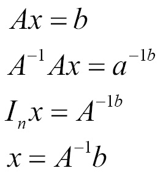**

以下示例显示了如何使用`matrix_inverse`运算计算矩阵的逆矩阵:

```py
import tensorflow as tf

mat = tf.constant([[2, 3, 4], [5, 6, 7], [8, 9, 10]], dtype=tf.float32)
print(mat)

inv_mat = tf.matrix_inverse(tf.transpose(mat))

with tf.Session() as sess:
print(sess.run(inv_mat))
```


# 解线性方程

TensorFlow 可以使用`solve`运算求解一系列线性方程。我们先不使用库来解释这一点，稍后使用`solve`函数。

线性方程表示如下:

*ax + b = yy - ax = b*

*y - ax = b*

*y/b - a/b(x) = 1*

我们的工作是在给定我们的观察点的情况下，找到前面等式中的 *a* 和 *b* 的值。首先，创建矩阵点。第一列代表 *x* 值，而第二列代表 *y* 值。
考虑 *X* 是输入矩阵， *A* 是我们需要学习的参数；我们设置了一个类似 *AX=B* 的系统，因此，。
以下示例(带代码)显示了如何求解线性方程:

*3x+2y = 15*
4x y = 10

```py
import tensorflow as tf

# equation 1
x1 = tf.constant(3, dtype=tf.float32)
y1 = tf.constant(2, dtype=tf.float32)
point1 = tf.stack([x1, y1])

# equation 2
x2 = tf.constant(4, dtype=tf.float32)
y2 = tf.constant(-1, dtype=tf.float32)
point2 = tf.stack([x2, y2])

# solve for AX=C
X = tf.transpose(tf.stack([point1, point2]))
C = tf.ones((1,2), dtype=tf.float32)

A = tf.matmul(C, tf.matrix_inverse(X))

with tf.Session() as sess:
    X = sess.run(X)
    print(X)

    A = sess.run(A)
    print(A)

b = 1 / A[0][1]
a = -b * A[0][0]
print("Hence Linear Equation is: y = {a}x + {b}".format(a=a, b=b))
```

清单的输出如下所示:

```py
[[ 3\. 4.][ 2\. -1.]]
 [[ 0.27272728 0.09090909]]
Hence Linear Equation is: y = -2.9999999999999996x + 10.999999672174463
```

圆的正则方程为*x2+y2+dx+ey+f = 0*；为了对参数 *d* 、 *e* 和 *f* 求解，我们使用 TensorFlow 的求解操作如下:

```py
# canonical circle equation
# x2+y2+dx+ey+f = 0
# dx+ey+f=−(x2+y2) ==> AX = B
# we have to solve for d, e, f

points = tf.constant([[2,1], [0,5], [-1,2]], dtype=tf.float64)
X = tf.constant([[2,1,1], [0,5,1], [-1,2,1]], dtype=tf.float64)
B = -tf.constant([[5], [25], [5]], dtype=tf.float64)

A = tf.matrix_solve(X,B)

with tf.Session() as sess:
    result = sess.run(A)
    D, E, F = result.flatten()
    print("Hence Circle Equation is: x**2 + y**2 + {D}x + {E}y + {F} = 0".format(**locals()))
```

清单的输出如以下代码所示:

```py
Hence Circle Equation is: x**2 + y**2 + -2.0x + -6.0y + 5.0 = 0
```


# 奇异值分解

当我们把一个整数分解成它的质因数时，我们可以理解这个整数的有用性质。同样，当我们分解一个矩阵时，我们可以理解许多不直接明显的函数性质。分解有两种，即特征值分解和奇异值分解。

所有实矩阵都有奇异值分解，但特征值分解不一样。例如，如果一个矩阵不是正方形的，特征分解就没有定义，我们必须使用奇异值分解来代替。

**奇异值分解** ( **SVD** )在数学形式上是三个矩阵 *U* 、 *S* 、 *V* 的乘积，其中 *U* 是 *m*r* 、 *S* 是 *r*r* 、 *V* 是 *r*n* :


以下示例显示了 SVD 对文本数据使用 TensorFlow `svd`操作:

```py
import numpy as np
import tensorflow as tf
import matplotlib.pyplot as plts

path = "/neuralnetwork-programming/ch01/plots"

text = ["I", "like", "enjoy",
         "deep", "learning", "NLP", "flying", "."]
xMatrix = np.array([[0,2,1,0,0,0,0,0],
              [2,0,0,1,0,1,0,0],
              [1,0,0,0,0,0,1,0],
              [0,1,0,0,1,0,0,0],
              [0,0,0,1,0,0,0,1],
              [0,1,0,0,0,0,0,1],
              [0,0,1,0,0,0,0,1],
              [0,0,0,0,1,1,1,0]], dtype=np.float32)

X_tensor = tf.convert_to_tensor(xMatrix, dtype=tf.float32)

# tensorflow svd
with tf.Session() as sess:
    s, U, Vh = sess.run(tf.svd(X_tensor, full_matrices=False))

for i in range(len(text)):
    plts.text(U[i,0], U[i,1], text[i])

plts.ylim(-0.8,0.8)
plts.xlim(-0.8,2.0)
plts.savefig(path + '/svd_tf.png')

# numpy svd
la = np.linalg
U, s, Vh = la.svd(xMatrix, full_matrices=False)

print(U)
print(s)
print(Vh)

# write matrices to file (understand concepts)
file = open(path + "/matx.txt", 'w')
file.write(str(U))
file.write("\n")
file.write("=============")
file.write("\n")
file.write(str(s))
file.close()

for i in range(len(text)):
    plts.text(U[i,0], U[i,1], text[i])

plts.ylim(-0.8,0.8)
plts.xlim(-0.8,2.0)
plts.savefig(path + '/svd_np.png')
```

其输出如下所示:

```py
[[ -5.24124920e-01  -5.72859168e-01   9.54463035e-02   3.83228481e-01   -1.76963374e-01  -1.76092178e-01  -4.19185609e-01  -5.57702743e-02]
[ -5.94438076e-01   6.30120635e-01  -1.70207784e-01   3.10038358e-0
 1.84062332e-01  -2.34777853e-01   1.29535481e-01   1.36813134e-01]
[ -2.56274015e-01   2.74017543e-01   1.59810841e-01   3.73903001e-16
  -5.78984618e-01   6.36550903e-01  -3.32297325e-16  -3.05414885e-01]
[ -2.85637408e-01  -2.47912124e-01   3.54610324e-01  -7.31901303e-02
  4.45784479e-01   8.36141407e-02   5.48721075e-01  -4.68012422e-01]
[ -1.93139315e-01   3.38495038e-02  -5.00790417e-01  -4.28462476e-01
 3.47110212e-01   1.55483231e-01  -4.68663752e-01  -4.03576553e-01]
[ -3.05134684e-01  -2.93989003e-01  -2.23433599e-01  -1.91614240e-01
 1.27460942e-01   4.91219401e-01   2.09592804e-01   6.57535374e-01]
[ -1.82489842e-01  -1.61027774e-01  -3.97842437e-01  -3.83228481e-01
 -5.12923241e-01  -4.27574426e-01   4.19185609e-01  -1.18313827e-01]
[ -2.46898428e-01   1.57254755e-01   5.92991650e-01  -6.20076716e-01
 -3.21868137e-02  -2.31065080e-01  -2.59070963e-01   2.37976909e-01]]
[ 2.75726271  2.67824793  1.89221275  1.61803401  1.19154561  0.94833982
 0.61803401  0.56999218]
[[ -5.24124920e-01  -5.94438076e-01  -2.56274015e-01  -2.85637408e-01
 -1.93139315e-01  -3.05134684e-01  -1.82489842e-01  -2.46898428e-01]
[  5.72859168e-01  -6.30120635e-01  -2.74017543e-01   2.47912124e-01
 -3.38495038e-02   2.93989003e-01   1.61027774e-01  -1.57254755e-01]
[ -9.54463035e-02   1.70207784e-01  -1.59810841e-01  -3.54610324e-01
 5.00790417e-01   2.23433599e-01   3.97842437e-01  -5.92991650e-01]
[  3.83228481e-01   3.10038358e-01  -2.22044605e-16  -7.31901303e-02
 -4.28462476e-01  -1.91614240e-01  -3.83228481e-01  -6.20076716e-01]
[ -1.76963374e-01   1.84062332e-01  -5.78984618e-01   4.45784479e-01
 3.47110212e-01   1.27460942e-01  -5.12923241e-01  -3.21868137e-02]
[  1.76092178e-01   2.34777853e-01  -6.36550903e-01  -8.36141407e-02
 -1.55483231e-01  -4.91219401e-01   4.27574426e-01   2.31065080e-01]
[  4.19185609e-01  -1.29535481e-01  -3.33066907e-16  -5.48721075e-01
  4.68663752e-01  -2.09592804e-01  -4.19185609e-01   2.59070963e-01]
[ -5.57702743e-02   1.36813134e-01  -3.05414885e-01  -4.68012422e-01
 -4.03576553e-01   6.57535374e-01  -1.18313827e-01   2.37976909e-01]]
```

这是前面数据集的奇异值分解图:


# 特征值分解

特征分解是最著名的分解技术之一，我们将矩阵分解成一组特征向量和特征值。

对于方阵，特征向量是向量 *v* ，因此乘以 *A* 仅改变 *v* 的比例:

*Av = λv*

标量 *λ* 就是这个特征向量对应的特征值。

*A* 的本征分解然后给出如下:


矩阵的特征分解描述了矩阵的许多有用的细节。例如，当且仅当任何特征值为零时，矩阵是奇异的。


# 主成分分析

**主成分分析** ( **PCA** )将给定的数据集投影到一个更低维的线性空间，使得投影数据的方差最大化。PCA 需要协方差矩阵的特征值和特征向量，协方差矩阵是乘积，其中 *X* 是数据矩阵。

数据矩阵 *X* 上的 SVD 如下所示:

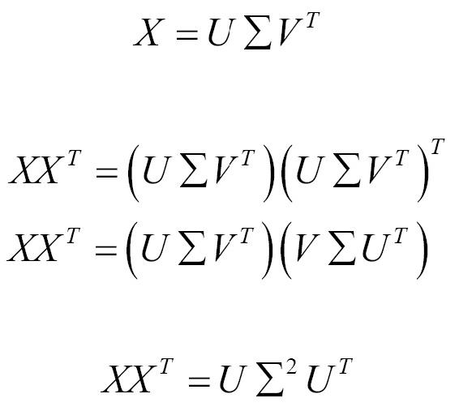

以下示例显示了使用 SVD 的 PCA:

```py
import numpy as np
import tensorflow as tf
import matplotlib.pyplot as plt
import plotly.plotly as py
import plotly.graph_objs as go
import plotly.figure_factory as FF
import pandas as pd

path = "/neuralnetwork-programming/ch01/plots"
logs = "/neuralnetwork-programming/ch01/logs"

xMatrix = np.array([[0,2,1,0,0,0,0,0],
              [2,0,0,1,0,1,0,0],
              [1,0,0,0,0,0,1,0],
              [0,1,0,0,1,0,0,0],
              [0,0,0,1,0,0,0,1],
              [0,1,0,0,0,0,0,1],
              [0,0,1,0,0,0,0,1],
              [0,0,0,0,1,1,1,0]], dtype=np.float32)

def pca(mat):
    mat = tf.constant(mat, dtype=tf.float32)
    mean = tf.reduce_mean(mat, 0)
    less = mat - mean
    s, u, v = tf.svd(less, full_matrices=True, compute_uv=True)

    s2 = s ** 2
    variance_ratio = s2 / tf.reduce_sum(s2)

    with tf.Session() as session:
        run = session.run([variance_ratio])
    return run

if __name__ == '__main__':
    print(pca(xMatrix))
```

清单的输出如下所示:

```py
[array([  4.15949494e-01,   2.08390564e-01,   1.90929279e-01,
         8.36438537e-02,   5.55494241e-02,   2.46047471e-02,
         2.09326427e-02,   3.57540098e-16], dtype=float32)]
```


# 结石

前面几节中的主题是作为标准线性代数的一部分涵盖的；没有涉及到的是基础微积分。尽管我们使用的微积分相对简单，但它的数学形式可能看起来非常复杂。在这一节中，我们将通过几个例子介绍矩阵运算的一些基本形式。


# 梯度

函数相对于实值矩阵 *A* 的梯度定义为 *A* 的偏导数矩阵，并表示如下:

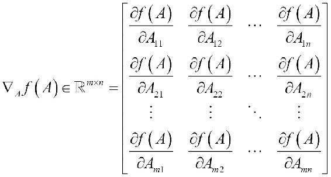

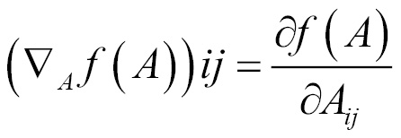

TensorFlow 不做数值微分；相反，它支持自动微分。通过在 TensorFlow 图中指定操作，它可以自动在图中运行链规则，并且由于它知道我们指定的每个操作的导数，它可以自动组合它们。

以下示例显示了使用 MNIST 数据训练网络，MNIST 数据库由手写数字组成。它有 60，000 个样本的训练集和 10，000 个样本的测试集。数字是大小标准化的。

这里，反向传播是在不使用任何 API 的情况下执行的，导数是手动计算的。我们 1000 次测试中有 913 次是正确的。这个概念将在下一章介绍。

以下代码片段描述了如何获取`mnist`数据集并初始化权重和偏差:

```py
import tensorflow as tf

# get mnist dataset
from tensorflow.examples.tutorials.mnist import input_data
data = input_data.read_data_sets("MNIST_data/", one_hot=True)

# x represents image with 784 values as columns (28*28), y represents output digit
x = tf.placeholder(tf.float32, [None, 784])
y = tf.placeholder(tf.float32, [None, 10])

# initialize weights and biases [w1,b1][w2,b2]
numNeuronsInDeepLayer = 30
w1 = tf.Variable(tf.truncated_normal([784, numNeuronsInDeepLayer]))
b1 = tf.Variable(tf.truncated_normal([1, numNeuronsInDeepLayer]))
w2 = tf.Variable(tf.truncated_normal([numNeuronsInDeepLayer, 10]))
b2 = tf.Variable(tf.truncated_normal([1, 10]))
```

我们现在定义一个具有非线性`sigmoid`函数的双层网络；使用反向传播算法应用并优化平方损失函数，如以下代码片段所示:

```py
# non-linear sigmoid function at each neuron
def sigmoid(x):
    sigma = tf.div(tf.constant(1.0), tf.add(tf.constant(1.0), tf.exp(tf.negative(x))))
    return sigma

# starting from first layer with wx+b, then apply sigmoid to add non-linearity
z1 = tf.add(tf.matmul(x, w1), b1)
a1 = sigmoid(z1)
z2 = tf.add(tf.matmul(a1, w2), b2)
a2 = sigmoid(z2)

# calculate the loss (delta)
loss = tf.subtract(a2, y)

# derivative of the sigmoid function der(sigmoid)=sigmoid*(1-sigmoid)
def sigmaprime(x):
    return tf.multiply(sigmoid(x), tf.subtract(tf.constant(1.0), sigmoid(x)))

# backward propagation
dz2 = tf.multiply(loss, sigmaprime(z2))
db2 = dz2
dw2 = tf.matmul(tf.transpose(a1), dz2)

da1 = tf.matmul(dz2, tf.transpose(w2))
dz1 = tf.multiply(da1, sigmaprime(z1))
db1 = dz1
dw1 = tf.matmul(tf.transpose(x), dz1)

# finally update the network
eta = tf.constant(0.5)
step = [
    tf.assign(w1,
              tf.subtract(w1, tf.multiply(eta, dw1)))
    , tf.assign(b1,
                tf.subtract(b1, tf.multiply(eta,
                                             tf.reduce_mean(db1, axis=[0]))))
    , tf.assign(w2,
                tf.subtract(w2, tf.multiply(eta, dw2)))
    , tf.assign(b2,
                tf.subtract(b2, tf.multiply(eta,
                                             tf.reduce_mean(db2, axis=[0]))))
]

acct_mat = tf.equal(tf.argmax(a2, 1), tf.argmax(y, 1))
acct_res = tf.reduce_sum(tf.cast(acct_mat, tf.float32))

sess = tf.InteractiveSession()
sess.run(tf.global_variables_initializer())

for i in range(10000):
    batch_xs, batch_ys = data.train.next_batch(10)
    sess.run(step, feed_dict={x: batch_xs,
                              y: batch_ys})
    if i % 1000 == 0:
        res = sess.run(acct_res, feed_dict=
        {x: data.test.images[:1000],
         y: data.test.labels[:1000]})
        print(res)
```

其输出如下所示:

```py
Extracting MNIST_data
125.0
814.0
870.0
874.0
889.0
897.0
906.0
903.0
922.0
913.0
```

现在，让我们用 TensorFlow 进行自动微分。下面的例子演示了`GradientDescentOptimizer`的用法。我们 1000 次测试中有 924 次是正确的。

```py
import tensorflow as tf

# get mnist dataset
from tensorflow.examples.tutorials.mnist import input_data
data = input_data.read_data_sets("MNIST_data/", one_hot=True)

# x represents image with 784 values as columns (28*28), y represents output digit
x = tf.placeholder(tf.float32, [None, 784])
y = tf.placeholder(tf.float32, [None, 10])

# initialize weights and biases [w1,b1][w2,b2]
numNeuronsInDeepLayer = 30
w1 = tf.Variable(tf.truncated_normal([784, numNeuronsInDeepLayer]))
b1 = tf.Variable(tf.truncated_normal([1, numNeuronsInDeepLayer]))
w2 = tf.Variable(tf.truncated_normal([numNeuronsInDeepLayer, 10]))
b2 = tf.Variable(tf.truncated_normal([1, 10]))

# non-linear sigmoid function at each neuron
def sigmoid(x):
    sigma = tf.div(tf.constant(1.0), tf.add(tf.constant(1.0), tf.exp(tf.negative(x))))
    return sigma

# starting from first layer with wx+b, then apply sigmoid to add non-linearity
z1 = tf.add(tf.matmul(x, w1), b1)
a1 = sigmoid(z1)
z2 = tf.add(tf.matmul(a1, w2), b2)
a2 = sigmoid(z2)

# calculate the loss (delta)
loss = tf.subtract(a2, y)

# derivative of the sigmoid function der(sigmoid)=sigmoid*(1-sigmoid)
def sigmaprime(x):
    return tf.multiply(sigmoid(x), tf.subtract(tf.constant(1.0), sigmoid(x)))

# automatic differentiation
cost = tf.multiply(loss, loss)
step = tf.train.GradientDescentOptimizer(0.1).minimize(cost)

acct_mat = tf.equal(tf.argmax(a2, 1), tf.argmax(y, 1))
acct_res = tf.reduce_sum(tf.cast(acct_mat, tf.float32))

sess = tf.InteractiveSession()
sess.run(tf.global_variables_initializer())

for i in range(10000):
    batch_xs, batch_ys = data.train.next_batch(10)
    sess.run(step, feed_dict={x: batch_xs,
                              y: batch_ys})
    if i % 1000 == 0:
        res = sess.run(acct_res, feed_dict=
        {x: data.test.images[:1000],
         y: data.test.labels[:1000]})
        print(res)
```

其输出如下所示:

```py
96.0
 777.0
 862.0
 870.0
 889.0
 901.0
 911.0
 905.0
 914.0
 924.0
```

以下示例显示了使用梯度下降的线性回归:

```py
import tensorflow as tf
import numpy
import matplotlib.pyplot as plt
rndm = numpy.random

# config parameters
learningRate = 0.01
trainingEpochs = 1000
displayStep = 50

# create the training data
trainX = numpy.asarray([3.3,4.4,5.5,6.71,6.93,4.168,9.779,6.182,7.59,2.167,
                         7.042,10.791,5.313,7.997,5.654,9.27,3.12])
trainY = numpy.asarray([1.7,2.76,2.09,3.19,1.694,1.573,3.366,2.596,2.53,1.221,
                         2.827,3.465,1.65,2.904,2.42,2.94,1.34])
nSamples = trainX.shape[0]

# tf inputs
X = tf.placeholder("float")
Y = tf.placeholder("float")

# initialize weights and bias
W = tf.Variable(rndm.randn(), name="weight")
b = tf.Variable(rndm.randn(), name="bias")

# linear model
linearModel = tf.add(tf.multiply(X, W), b)

# mean squared error
loss = tf.reduce_sum(tf.pow(linearModel-Y, 2))/(2*nSamples)

# Gradient descent
opt = tf.train.GradientDescentOptimizer(learningRate).minimize(loss)

# initializing variables
init = tf.global_variables_initializer()

# run
with tf.Session() as sess:
    sess.run(init)

    # fitting the training data
    for epoch in range(trainingEpochs):
        for (x, y) in zip(trainX, trainY):
            sess.run(opt, feed_dict={X: x, Y: y})

        # print logs
        if (epoch+1) % displayStep == 0:
            c = sess.run(loss, feed_dict={X: trainX, Y:trainY})
            print("Epoch is:", '%04d' % (epoch+1), "loss=", "{:.9f}".format(c), "W=", sess.run(W), "b=", sess.run(b))

    print("optimization done...")
    trainingLoss = sess.run(loss, feed_dict={X: trainX, Y: trainY})
    print("Training loss=", trainingLoss, "W=", sess.run(W), "b=", sess.run(b), '\n')

    # display the plot
    plt.plot(trainX, trainY, 'ro', label='Original data')
    plt.plot(trainX, sess.run(W) * trainX + sess.run(b), label='Fitted line')
    plt.legend()
    plt.show()

    # Testing example, as requested (Issue #2)
    testX = numpy.asarray([6.83, 4.668, 8.9, 7.91, 5.7, 8.7, 3.1, 2.1])
    testY = numpy.asarray([1.84, 2.273, 3.2, 2.831, 2.92, 3.24, 1.35, 1.03])

    print("Testing... (Mean square loss Comparison)")
    testing_cost = sess.run(
        tf.reduce_sum(tf.pow(linearModel - Y, 2)) / (2 * testX.shape[0]),
        feed_dict={X: testX, Y: testY})
    print("Testing cost=", testing_cost)
    print("Absolute mean square loss difference:", abs(trainingLoss - testing_cost))

    plt.plot(testX, testY, 'bo', label='Testing data')
    plt.plot(trainX, sess.run(W) * trainX + sess.run(b), label='Fitted line')
    plt.legend()
    plt.show()
```

其输出如下所示:

```py
Epoch is: 0050 loss= 0.141912043 W= 0.10565 b= 1.8382
 Epoch is: 0100 loss= 0.134377643 W= 0.11413 b= 1.7772
 Epoch is: 0150 loss= 0.127711013 W= 0.122106 b= 1.71982
 Epoch is: 0200 loss= 0.121811897 W= 0.129609 b= 1.66585
 Epoch is: 0250 loss= 0.116592340 W= 0.136666 b= 1.61508
 Epoch is: 0300 loss= 0.111973859 W= 0.143304 b= 1.56733
 Epoch is: 0350 loss= 0.107887231 W= 0.149547 b= 1.52241
 Epoch is: 0400 loss= 0.104270980 W= 0.15542 b= 1.48017
 Epoch is: 0450 loss= 0.101070963 W= 0.160945 b= 1.44043
 Epoch is: 0500 loss= 0.098239250 W= 0.166141 b= 1.40305
 Epoch is: 0550 loss= 0.095733419 W= 0.171029 b= 1.36789
 Epoch is: 0600 loss= 0.093516059 W= 0.175626 b= 1.33481
 Epoch is: 0650 loss= 0.091553882 W= 0.179951 b= 1.3037
 Epoch is: 0700 loss= 0.089817807 W= 0.184018 b= 1.27445
 Epoch is: 0750 loss= 0.088281371 W= 0.187843 b= 1.24692
 Epoch is: 0800 loss= 0.086921677 W= 0.191442 b= 1.22104
 Epoch is: 0850 loss= 0.085718453 W= 0.194827 b= 1.19669
 Epoch is: 0900 loss= 0.084653646 W= 0.198011 b= 1.17378
 Epoch is: 0950 loss= 0.083711281 W= 0.201005 b= 1.15224
 Epoch is: 1000 loss= 0.082877308 W= 0.203822 b= 1.13198
 optimization done...
 Training loss= 0.0828773 W= 0.203822 b= 1.13198
Testing... (Mean square loss Comparison)
 Testing cost= 0.0957726
 Absolute mean square loss difference: 0.0128952
```

情节如下:

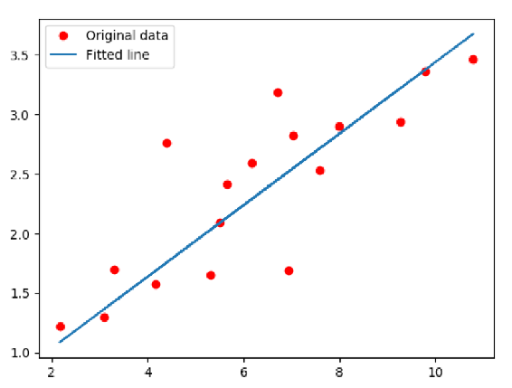

下图显示了使用模型的测试数据的拟合线:

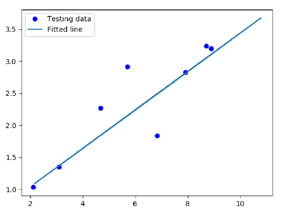

# 打包麻布

梯度是向量函数的一阶导数，而海森是二阶导数。我们现在来看一下符号:

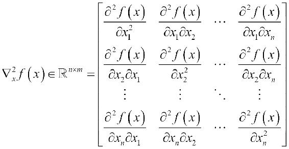

类似于梯度，hessian 仅在 *f(x)* 为实值时定义。

使用的代数函数是。

以下示例显示了使用 TensorFlow 的 hessian 实现:

```py
import tensorflow as tf
import numpy as np

X = tf.Variable(np.random.random_sample(), dtype=tf.float32)
y = tf.Variable(np.random.random_sample(), dtype=tf.float32)

def createCons(x):
    return tf.constant(x, dtype=tf.float32)

function = tf.pow(X, createCons(2)) + createCons(2) * X * y + createCons(3) * tf.pow(y, createCons(2)) + createCons(4) * X + createCons(5) * y + createCons(6)

# compute hessian
def hessian(func, varbles):
    matrix = []
    for v_1 in varbles:
        tmp = []
        for v_2 in varbles:
            # calculate derivative twice, first w.r.t v2 and then w.r.t v1
            tmp.append(tf.gradients(tf.gradients(func, v_2)[0], v_1)[0])
        tmp = [createCons(0) if t == None else t for t in tmp]
        tmp = tf.stack(tmp)
        matrix.append(tmp)
    matrix = tf.stack(matrix)
    return matrix

hessian = hessian(function, [X, y])

sess = tf.Session()
sess.run(tf.initialize_all_variables())
print(sess.run(hessian))
```

其输出如下所示:

```py
 [[ 2\.  2.] [ 2\.  6.]]
```


# 决定因素

行列式向我们展示了有关矩阵的信息，这些信息在线性方程中很有用，也有助于寻找矩阵的逆矩阵。

对于给定的矩阵 *X* ，行列式如下所示:

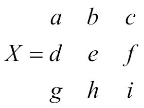


以下示例显示了如何使用 TensorFlow 获得行列式:

```py
import tensorflow as tf
import numpy as np

x = np.array([[10.0, 15.0, 20.0], [0.0, 1.0, 5.0], [3.0, 5.0, 7.0]], dtype=np.float32)

det = tf.matrix_determinant(x)

with tf.Session() as sess:
    print(sess.run(det))
```

其输出如下所示:

```py
-15.0
```


# 最佳化

作为深度学习的一部分，我们最希望优化一个函数的值，该函数相对于 *x* 最小化或最大化 *f(x)* 。优化问题的几个例子是最小二乘法、逻辑回归和支持向量机。这些技术中的许多将在后面的章节中详细讨论。


# 优化者

我们将在这里学习`AdamOptimizer`；TensorFlow `AdamOptimizer`使用 Kingma 和 Ba 的 Adam 算法来管理学习速率。亚当比单纯的`GradientDescentOptimizer`有很多优点。首先，它使用参数的移动平均值，这使得 Adam 能够使用更大的步长，并且它将在没有任何微调的情况下收敛到该步长。

Adam 的缺点是在每个训练步骤中需要对每个参数进行更多的计算。`GradientDescentOptimizer`也可以使用，但它需要更多的超参数调整才能快速收敛。
下面的例子展示了如何使用`AdamOptimizer`:

*   `tf.train.Optimizer`创建优化器
*   `tf.train.Optimizer.minimize(loss, var_list)`将优化操作添加到计算图中

这里，自动微分无需用户输入即可计算梯度:

```py
import numpy as np
import seaborn
import matplotlib.pyplot as plt
import tensorflow as tf

# input dataset
xData = np.arange(100, step=.1)
yData = xData + 20 * np.sin(xData/10)

# scatter plot for input data
plt.scatter(xData, yData)
plt.show()

# defining data size and batch size
nSamples = 1000
batchSize = 100

# resize
xData = np.reshape(xData, (nSamples,1))
yData = np.reshape(yData, (nSamples,1))

# input placeholders
x = tf.placeholder(tf.float32, shape=(batchSize, 1))
y = tf.placeholder(tf.float32, shape=(batchSize, 1))

# init weight and bias
with tf.variable_scope("linearRegression"):
 W = tf.get_variable("weights", (1, 1), initializer=tf.random_normal_initializer())
 b = tf.get_variable("bias", (1,), initializer=tf.constant_initializer(0.0))

 y_pred = tf.matmul(x, W) + b
 loss = tf.reduce_sum((y - y_pred)**2/nSamples)

# optimizer
opt = tf.train.AdamOptimizer().minimize(loss)
with tf.Session() as sess:
    sess.run(tf.global_variables_initializer())

    # gradient descent loop for 500 steps
    for _ in range(500):
     # random minibatch
     indices = np.random.choice(nSamples, batchSize)

     X_batch, y_batch = xData[indices], yData[indices]

     # gradient descent step
     _, loss_val = sess.run([opt, loss], feed_dict={x: X_batch, y: y_batch})
```

这是数据集的散点图:


这是学习模型对数据的绘图:

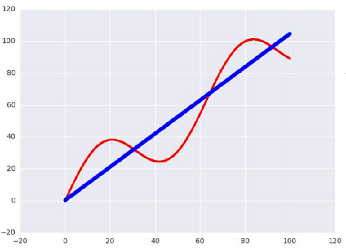

# 摘要

在这一章中，我们已经介绍了对于理解神经网络至关重要的数学概念，并且回顾了一些与张量相关的数学。我们还演示了如何在 TensorFlow 中执行数学运算。我们将在接下来的章节中反复应用这些概念。