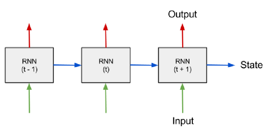
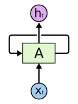
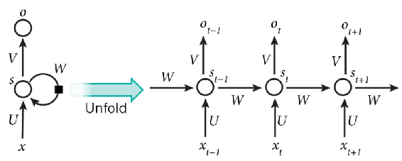
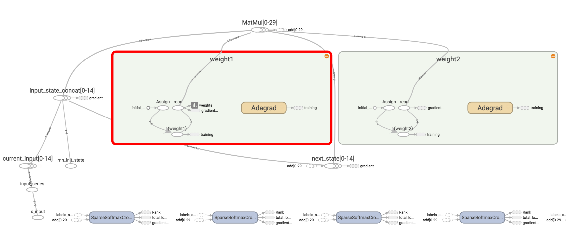
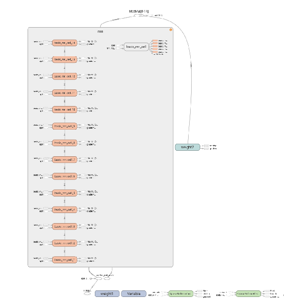
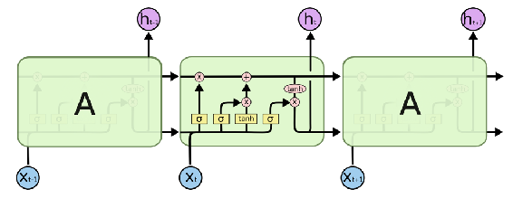
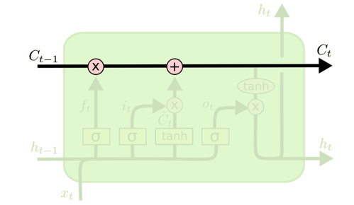
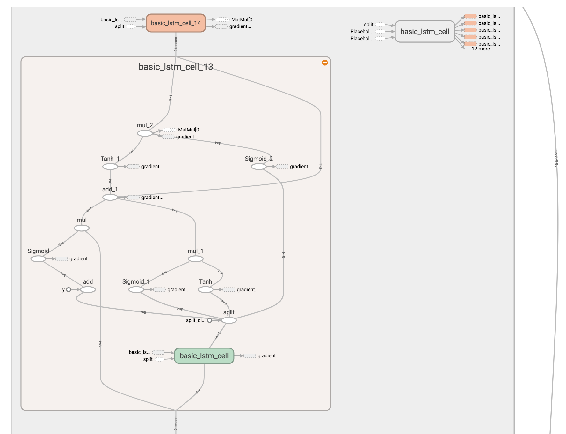
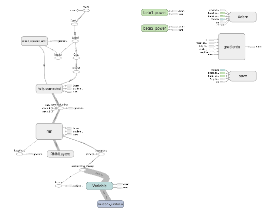

# 五、循环神经网络

循环神经网络( **RNNs** )利用顺序或时间序列数据。在常规的神经网络中，我们认为所有的输入和输出都是相互独立的。对于一个你想预测给定句子中的下一个单词的任务，最好知道哪些单词在它之前出现过。rnn 是递归的，因为对序列中的每个元素执行相同的任务，其中输出依赖于先前的计算。RNNs 可以被认为有一个**存储器**，可以捕获到目前为止已经计算过的信息。

从前馈神经网络到循环神经网络，我们将使用在模型的各个部分共享参数的概念。参数共享将使扩展和应用模型到不同形式(这里是不同长度)的例子并在它们之间推广成为可能。


# RNNs 简介

为了理解 RNNs，我们必须理解前馈神经网络的基础。关于前馈网络的详细信息，可以参考[第三章](73c6bf42-1089-4504-97d5-a7dafae0e59c.xhtml)、*神经网络优化*。前馈神经网络和循环神经网络都是根据它们通过在网络的各个节点执行的一系列数学运算来处理信息或特征的方式来识别的。一种是直接传递信息(从不接触给定的节点两次)，另一种是通过循环传递信息。

前馈神经网络对图像数据进行训练，直到它在预测或分类图像类型的类别时最小化损失或误差。通过训练好的一组超参数或权重，神经网络可以对以前从未见过的数据进行分类。可以向经过训练的前馈神经网络显示任何随机的图像集合，并且它分类的第一个图像不会改变它如何分类其他图像。

简而言之，这些网络没有时间顺序或时间模式的概念，它们考虑的唯一信息是它被要求分类的当前例子。

RNNs 考虑了输入数据的时间特性。对 RNN 单元的输入既来自当前时间步长，也来自时间上的一步。细节如下图所示:



rnn 本质上是递归的，因为它们对序列中的每个元素执行相同的计算，其中输出依赖于先前的计算。考虑 rnn 的另一种方式是，它们有内存，可以捕获到目前为止已经计算过的信息。rnn 可以利用长序列中的信息或知识，但实际上它们仅限于回顾少数步骤。

典型的 RNN 如下所示:



下图显示了 RNN 的展开版本；通过展开，我们意味着我们写出了完整序列的神经网络。考虑一个由五个单词组成的序列；该网络将被展开成一个五层的神经网络，每个单词一层:


RNN 中发生的计算如下:



*   表示时间步长的输入。
*   表示时间步长处的隐藏状态。隐藏状态是网络的记忆。是基于先前的隐藏状态和当前步骤的输入来计算的。
*   函数 *f* 代表非线性，如 *tanh* 或 ReLU。第一隐藏状态通常被初始化为全零。
*   表示步骤的输出。为了预测给定句子中的下一个单词，它将是整个词汇的概率向量，。


# RNN 实施

遵循程序过程，一个数字序列，目标是用以前提供的值预测下一个值。RNN 网络在每个时间步长的输入是当前值和状态向量，该状态向量表示或存储神经网络之前在时间步长看到的内容。这个状态向量是 RNN 的编码存储器，初始设置为零。

训练数据基本上是一个随机的二进制向量。输出向右移动。

```py
from __future__ import print_function, division
import tensorflow as tf
import numpy as np
import matplotlib.pyplot as plt

"""
define all the constants
"""
numEpochs = 10
seriesLength = 50000
backpropagationLength = 15
stateSize = 4
numClasses = 2
echoStep = 3
batchSize = 5
num_batches = seriesLength // batchSize // backpropagationLength

"""
generate data
"""
def generateData():
    x = np.array(np.random.choice(2, seriesLength, p=[0.5, 0.5]))
    y = np.roll(x, echoStep)
    y[0:echoStep] = 0

    x = x.reshape((batchSize, -1))
    y = y.reshape((batchSize, -1))

    return (x, y)

"""
start computational graph
"""
batchXHolder = tf.placeholder(tf.float32, [batchSize, backpropagationLength], name="x_input")
batchYHolder = tf.placeholder(tf.int32, [batchSize, backpropagationLength], name="y_input")

initState = tf.placeholder(tf.float32, [batchSize, stateSize], "rnn_init_state")

W = tf.Variable(np.random.rand(stateSize+1, stateSize), dtype=tf.float32, name="weight1")
bias1 = tf.Variable(np.zeros((1,stateSize)), dtype=tf.float32)

W2 = tf.Variable(np.random.rand(stateSize, numClasses),dtype=tf.float32, name="weight2")
bias2 = tf.Variable(np.zeros((1,numClasses)), dtype=tf.float32)

tf.summary.histogram(name="weights", values=W)

# Unpack columns
inputsSeries = tf.unstack(batchXHolder, axis=1, name="input_series")
labelsSeries = tf.unstack(batchYHolder, axis=1, name="labels_series")

# Forward pass
currentState = initState
statesSeries = []
for currentInput in inputsSeries:
    currentInput = tf.reshape(currentInput, [batchSize, 1], name="current_input")
    inputAndStateConcatenated = tf.concat([currentInput, currentState], 1, name="input_state_concat")

    nextState = tf.tanh(tf.matmul(inputAndStateConcatenated, W) + bias1, name="next_state")
    statesSeries.append(nextState)
    currentState = nextState

# calculate loss
logits_series = [tf.matmul(state, W2) + bias2 for state in statesSeries]
predictions_series = [tf.nn.softmax(logits) for logits in logits_series]

losses = [tf.nn.sparse_softmax_cross_entropy_with_logits(labels=labels, logits=logits) for logits, labels in zip(logits_series,labelsSeries)]
total_loss = tf.reduce_mean(losses, name="total_loss")

train_step = tf.train.AdagradOptimizer(0.3).minimize(total_loss, name="training")

"""
plot computation
"""
def plot(loss_list, predictions_series, batchX, batchY):
    plt.subplot(2, 3, 1)
    plt.cla()
    plt.plot(loss_list)

    for batchSeriesIdx in range(5):
        oneHotOutputSeries = np.array(predictions_series)[:, batchSeriesIdx, :]
        singleOutputSeries = np.array([(1 if out[0] < 0.5 else 0) for out in oneHotOutputSeries])

        plt.subplot(2, 3, batchSeriesIdx + 2)
        plt.cla()
        plt.axis([0, backpropagationLength, 0, 2])
        left_offset = range(backpropagationLength)
        plt.bar(left_offset, batchX[batchSeriesIdx, :], width=1, color="blue")
        plt.bar(left_offset, batchY[batchSeriesIdx, :] * 0.5, width=1, color="red")
        plt.bar(left_offset, singleOutputSeries * 0.3, width=1, color="green")

    plt.draw()
    plt.pause(0.0001)

"""
run the graph
"""
with tf.Session() as sess:
    writer = tf.summary.FileWriter("logs", graph=tf.get_default_graph())
    sess.run(tf.global_variables_initializer())
    plt.ion()
    plt.figure()
    plt.show()
    loss_list = []

    for epoch_idx in range(numEpochs):
        x,y = generateData()
        _current_state = np.zeros((batchSize, stateSize))

        print("New data, epoch", epoch_idx)

        for batch_idx in range(num_batches):
            start_idx = batch_idx * backpropagationLength
            end_idx = start_idx + backpropagationLength

            batchX = x[:,start_idx:end_idx]
            batchY = y[:,start_idx:end_idx]

            _total_loss, _train_step, _current_state, _predictions_series = sess.run(
                [total_loss, train_step, currentState, predictions_series],
                feed_dict={
                    batchXHolder:batchX,
                    batchYHolder:batchY,
                    initState:_current_state
                })

            loss_list.append(_total_loss)

            # fix the cost summary later
            tf.summary.scalar(name="totalloss", tensor=_total_loss)

            if batch_idx%100 == 0:
                print("Step",batch_idx, "Loss", _total_loss)
                plot(loss_list, _predictions_series, batchX, batchY)

plt.ioff()
plt.show()
```


# 计算图形

计算图表如下所示:



清单的输出如下所示:

```py
New data, epoch 0
Step 0 Loss 0.777418
Step 600 Loss 0.693907
New data, epoch 1
Step 0 Loss 0.690996
Step 600 Loss 0.691115
New data, epoch 2
Step 0 Loss 0.69259
Step 600 Loss 0.685826
New data, epoch 3
Step 0 Loss 0.684189
Step 600 Loss 0.690608
New data, epoch 4
Step 0 Loss 0.691302
Step 600 Loss 0.691309
New data, epoch 5
Step 0 Loss 0.69172
Step 600 Loss 0.694034
New data, epoch 6
Step 0 Loss 0.692927
Step 600 Loss 0.42796
New data, epoch 7
Step 0 Loss 0.42423
Step 600 Loss 0.00845207
New data, epoch 8
Step 0 Loss 0.188478
Step 500 Loss 0.00427217
```


# 用 TensorFlow 实现 RNN

我们现在将使用 TensorFlow APIRNN 的内部运作隐藏在引擎盖下。TensorFlow `rnn`包展开 RNN 并自动创建图形，以便我们可以删除 for 循环:

```py
from __future__ import print_function, division
import tensorflow as tf
import numpy as np
import matplotlib.pyplot as plt

"""
define all the constants
"""
numEpochs = 10
seriesLength = 50000
backpropagationLength = 15
stateSize = 4
numClasses = 2
echoStep = 3
batchSize = 5
num_batches = seriesLength // batchSize // backpropagationLength

"""
generate data
"""
def generateData():
    x = np.array(np.random.choice(2, seriesLength, p=[0.5, 0.5]))
    y = np.roll(x, echoStep)
    y[0:echoStep] = 0

    x = x.reshape((batchSize, -1))
    y = y.reshape((batchSize, -1))

    return (x, y)

"""
start computational graph
"""
batchXHolder = tf.placeholder(tf.float32, [batchSize, backpropagationLength], name="x_input")
batchYHolder = tf.placeholder(tf.int32, [batchSize, backpropagationLength], name="y_input")

initState = tf.placeholder(tf.float32, [batchSize, stateSize], "rnn_init_state")

W = tf.Variable(np.random.rand(stateSize+1, stateSize), dtype=tf.float32, name="weight1")
bias1 = tf.Variable(np.zeros((1,stateSize)), dtype=tf.float32)

W2 = tf.Variable(np.random.rand(stateSize, numClasses),dtype=tf.float32, name="weight2")
bias2 = tf.Variable(np.zeros((1,numClasses)), dtype=tf.float32)

tf.summary.histogram(name="weights", values=W)

# Unpack columns
inputsSeries = tf.split(axis=1, num_or_size_splits=backpropagationLength, value=batchXHolder)
labelsSeries = tf.unstack(batchYHolder, axis=1)

# Forward passes
from tensorflow.contrib import rnn
cell = rnn.BasicRNNCell(stateSize)
statesSeries, currentState = rnn.static_rnn(cell, inputsSeries, initState)

# calculate loss
logits_series = [tf.matmul(state, W2) + bias2 for state in statesSeries]
predictions_series = [tf.nn.softmax(logits) for logits in logits_series]

losses = [tf.nn.sparse_softmax_cross_entropy_with_logits(labels=labels, logits=logits) for logits, labels in zip(logits_series,labelsSeries)]
total_loss = tf.reduce_mean(losses, name="total_loss")

train_step = tf.train.AdagradOptimizer(0.3).minimize(total_loss, name="training")

"""
plot computation
"""
def plot(loss_list, predictions_series, batchX, batchY):
    plt.subplot(2, 3, 1)
    plt.cla()
    plt.plot(loss_list)

    for batchSeriesIdx in range(5):
        oneHotOutputSeries = np.array(predictions_series)[:, batchSeriesIdx, :]
        singleOutputSeries = np.array([(1 if out[0] < 0.5 else 0) for out in oneHotOutputSeries])

        plt.subplot(2, 3, batchSeriesIdx + 2)
        plt.cla()
        plt.axis([0, backpropagationLength, 0, 2])
        left_offset = range(backpropagationLength)
        plt.bar(left_offset, batchX[batchSeriesIdx, :], width=1, color="blue")
        plt.bar(left_offset, batchY[batchSeriesIdx, :] * 0.5, width=1, color="red")
        plt.bar(left_offset, singleOutputSeries * 0.3, width=1, color="green")

    plt.draw()
    plt.pause(0.0001)

"""
run the graph
"""
with tf.Session() as sess:
    writer = tf.summary.FileWriter("logs", graph=tf.get_default_graph())
    sess.run(tf.global_variables_initializer())
    plt.ion()
    plt.figure()
    plt.show()
    loss_list = []

    for epoch_idx in range(numEpochs):
        x,y = generateData()
        _current_state = np.zeros((batchSize, stateSize))

        print("New data, epoch", epoch_idx)

        for batch_idx in range(num_batches):
            start_idx = batch_idx * backpropagationLength
            end_idx = start_idx + backpropagationLength

            batchX = x[:,start_idx:end_idx]
            batchY = y[:,start_idx:end_idx]

            _total_loss, _train_step, _current_state, _predictions_series = sess.run(
                [total_loss, train_step, currentState, predictions_series],
                feed_dict={
                    batchXHolder:batchX,
                    batchYHolder:batchY,
                    initState:_current_state
                })

            loss_list.append(_total_loss)

            # fix the cost summary later
            tf.summary.scalar(name="totalloss", tensor=_total_loss)

            if batch_idx%100 == 0:
                print("Step",batch_idx, "Loss", _total_loss)
                plot(loss_list, _predictions_series, batchX, batchY)

plt.ioff()
plt.show()
```


# 计算图形

以下是计算图表的图像:



列表的输出如下所示:

```py
New data, epoch 0
Step 0 Loss 0.688437
Step 600 Loss 0.00107078
New data, epoch 1
Step 0 Loss 0.214923
Step 600 Loss 0.00111716
New data, epoch 2
Step 0 Loss 0.214962
Step 600 Loss 0.000730697
New data, epoch 3
Step 0 Loss 0.276177
Step 600 Loss 0.000362316
New data, epoch 4
Step 0 Loss 0.1641
Step 600 Loss 0.00025342
New data, epoch 5
Step 0 Loss 0.0947087
Step 600 Loss 0.000276762
```


# 长短期记忆网络导论

消失梯度问题已成为循环网络的最大障碍。

由于直线沿着 *x* 轴变化，并且在 *y* 轴上有微小的变化，梯度显示了所有重量相对于误差变化的变化。如果我们不知道梯度，我们将无法在减少损失或误差的方向上调整权重，我们的神经网络停止学习。

**长短期记忆**(**lstm**)是为了克服消失梯度问题而设计的。将信息保留更长时间实际上是他们的隐性行为。

在标准 RNNs 中，重复单元将具有基本结构，例如单个 **tanh** 层:


如上图所示，LSTMs 也具有链状结构，但循环细胞具有不同的结构:



# LSTM 的生命周期

LSTMs 的关键是像传送带一样的细胞状态。它以较小的线性相互作用顺流而下。很简单，数据流动不变:



LSTM 网络有能力删除或添加细胞状态的信息，这些信息由被称为门的结构仔细调节。

1.  LSTM 网络的第一步是确定我们将从小区状态中丢弃什么信息。该决定由称为**遗忘门**层的 s 形层做出。该层查看前一状态 *h(t-1)* 和当前输入 *x(t)* ，并为单元状态*C(t1)*中的每个数字输出一个介于 0 和 1 之间的数字，其中 1 代表**绝对保持这个**，而 0 代表**完全去掉这个**:


2.  下一步是确定我们将在单元状态中保存哪些新信息。首先，称为输入门层的 sigmoid 层决定哪些值将被更新。其次， *tanh* 层生成新的候选值 *C̃* 的向量，该向量可以被添加到状态中。


3.  我们现在将旧的单元状态*C(T1)*更新为新的单元状态 *C(t)* 。我们将旧状态乘以 *f(t)* ，忘记了我们之前决定忘记的事情。然后我们加上*I(t)∫c̃*；这些是我们决定更新每个状态值的新的候选值。


4.  最后，我们决定输出，这将是基于我们的细胞状态，但将是一个过滤或修改的版本。首先，我们执行 sigmoid 层，它决定了我们将要输出的单元状态的部分。随后，我们通过 tanh 设置单元状态，将值推至 1 和 1 之间，并乘以 sigmoid 门的输出，以便只输出我们决定输出的部分。


# LSTM 实施

LSTMs 记住、忘记，并根据当前状态和输入选择要传递的内容，然后输出。一个 LSTM 有更多的活动部件，但是使用原生 TensorFlow API，这将非常简单:

```py
from __future__ import print_function, division
import tensorflow as tf
import numpy as np
import matplotlib.pyplot as plt
from tensorflow.contrib import rnn

"""
define all the constants
"""
numEpochs = 10
seriesLength = 50000
backpropagationLength = 15
stateSize = 4
numClasses = 2
echoStep = 3
batchSize = 5
num_batches = seriesLength // batchSize // backpropagationLength

"""
generate data
"""
def generateData():
    x = np.array(np.random.choice(2, seriesLength, p=[0.5, 0.5]))
    y = np.roll(x, echoStep)
    y[0:echoStep] = 0

    x = x.reshape((batchSize, -1))
    y = y.reshape((batchSize, -1))

    return (x, y)

"""
start computational graph
"""
batchXHolder = tf.placeholder(tf.float32, [batchSize, backpropagationLength], name="x_input")
batchYHolder = tf.placeholder(tf.int32, [batchSize, backpropagationLength], name="y_input")

# rnn replace
#initState = tf.placeholder(tf.float32, [batchSize, stateSize], "rnn_init_state")

cellState = tf.placeholder(tf.float32, [batchSize, stateSize])
hiddenState = tf.placeholder(tf.float32, [batchSize, stateSize])
initState = rnn.LSTMStateTuple(cellState, hiddenState)

W = tf.Variable(np.random.rand(stateSize+1, stateSize), dtype=tf.float32, name="weight1")
bias1 = tf.Variable(np.zeros((1,stateSize)), dtype=tf.float32)

W2 = tf.Variable(np.random.rand(stateSize, numClasses),dtype=tf.float32, name="weight2")
bias2 = tf.Variable(np.zeros((1,numClasses)), dtype=tf.float32)

tf.summary.histogram(name="weights", values=W)

# Unpack columns
inputsSeries = tf.split(axis=1, num_or_size_splits=backpropagationLength, value=batchXHolder)
labelsSeries = tf.unstack(batchYHolder, axis=1)

# Forward passes

# rnn replace
# cell = rnn.BasicRNNCell(stateSize)
# statesSeries, currentState = rnn.static_rnn(cell, inputsSeries, initState)

cell = rnn.BasicLSTMCell(stateSize, state_is_tuple=True)
statesSeries, currentState = rnn.static_rnn(cell, inputsSeries, initState)

# calculate loss
logits_series = [tf.matmul(state, W2) + bias2 for state in statesSeries]
predictions_series = [tf.nn.softmax(logits) for logits in logits_series]

losses = [tf.nn.sparse_softmax_cross_entropy_with_logits(labels=labels, logits=logits) for logits, labels in zip(logits_series,labelsSeries)]
total_loss = tf.reduce_mean(losses, name="total_loss")

train_step = tf.train.AdagradOptimizer(0.3).minimize(total_loss, name="training")

"""
plot computation
"""
def plot(loss_list, predictions_series, batchX, batchY):
    plt.subplot(2, 3, 1)
    plt.cla()
    plt.plot(loss_list)

    for batchSeriesIdx in range(5):
        oneHotOutputSeries = np.array(predictions_series)[:, batchSeriesIdx, :]
        singleOutputSeries = np.array([(1 if out[0] < 0.5 else 0) for out in oneHotOutputSeries])

        plt.subplot(2, 3, batchSeriesIdx + 2)
        plt.cla()
        plt.axis([0, backpropagationLength, 0, 2])
        left_offset = range(backpropagationLength)
        plt.bar(left_offset, batchX[batchSeriesIdx, :], width=1, color="blue")
        plt.bar(left_offset, batchY[batchSeriesIdx, :] * 0.5, width=1, color="red")
        plt.bar(left_offset, singleOutputSeries * 0.3, width=1, color="green")

    plt.draw()
    plt.pause(0.0001)

"""
run the graph
"""
with tf.Session() as sess:
    writer = tf.summary.FileWriter("logs", graph=tf.get_default_graph())
    sess.run(tf.global_variables_initializer())
    plt.ion()
    plt.figure()
    plt.show()
    loss_list = []

    for epoch_idx in range(numEpochs):
        x,y = generateData()

        # rnn remove
        # _current_state = np.zeros((batchSize, stateSize))

        _current_cell_state = np.zeros((batchSize, stateSize))
        _current_hidden_state = np.zeros((batchSize, stateSize))

        print("New data, epoch", epoch_idx)

        for batch_idx in range(num_batches):
            start_idx = batch_idx * backpropagationLength
            end_idx = start_idx + backpropagationLength

            batchX = x[:,start_idx:end_idx]
            batchY = y[:,start_idx:end_idx]

            _total_loss, _train_step, _current_state, _predictions_series = sess.run(
                [total_loss, train_step, currentState, predictions_series],
                feed_dict={
                    batchXHolder:batchX,
                    batchYHolder:batchY,
                    cellState: _current_cell_state,
                    hiddenState: _current_hidden_state
                })

            _current_cell_state, _current_hidden_state = _current_state

            loss_list.append(_total_loss)

            # fix the cost summary later
            tf.summary.scalar(name="totalloss", tensor=_total_loss)

            if batch_idx%100 == 0:
                print("Step",batch_idx, "Loss", _total_loss)
                plot(loss_list, _predictions_series, batchX, batchY)

plt.ioff()
plt.show()
```


# 计算图形

以下来自 TensorBoard 的计算图描述了 LSTM 网络的工作原理:



清单的输出如下所示:

```py
New data, epoch 0
Step 0 Loss 0.696803
Step 600 Loss 0.00743465
New data, epoch 1
Step 0 Loss 0.404039
Step 600 Loss 0.00243205
New data, epoch 2
Step 0 Loss 1.11536
Step 600 Loss 0.00140995
New data, epoch 3
Step 0 Loss 0.858743
Step 600 Loss 0.00141037
```


# 情感分析

我们现在将编写一个应用来预测电影评论的情绪。评论由一系列单词组成，单词的顺序编码了预测情绪的非常有用的信息。第一步是将单词映射到词嵌入。第二步是 RNN，它接收一系列向量作为输入，并考虑向量的顺序来生成预测。


# 词嵌入

我们现在将训练一个用于单词到矢量表示的神经网络。给定一个句子中心的特定单词，即输入单词，我们查看附近的单词。网络会告诉我们，我们词汇中的每个单词成为我们选择的邻近单词的概率。


```py
import time
import tensorflow as tf
import numpy as np
import utility
from tqdm import tqdm
from urllib.request import urlretrieve
from os.path import isfile, isdir
import zipfile
from collections import Counter
import random

dataDir = 'data'
dataFile = 'text8.zip'
datasetName = 'text 8 data set'

'''
track progress of file download
'''

class DownloadProgress(tqdm):
    lastBlock = 0

    def hook(self, blockNum=1, blockSize=1, totalSize=None):
        self.total = totalSize
        self.update((blockNum - self.lastBlock) * blockSize)
        self.lastBlock = blockNum

if not isfile(dataFile):
    with DownloadProgress(unit='B', unit_scale=True, miniters=1, desc=datasetName) as progressBar:
        urlretrieve('http://mattmahoney.net/dc/text8.zip', dataFile, progressBar.hook)

if not isdir(dataDir):
    with zipfile.ZipFile(dataFile) as zipRef:
        zipRef.extractall(dataDir)

with open('data/text8') as f:
    text = f.read()

'''
pre process the downloaded wiki text
'''
words = utility.preProcess(text)
print(words[:30])

print('Total words: {}'.format(len(words)))
print('Unique words: {}'.format(len(set(words))))

'''
convert words to integers
'''
int2vocab, vocab2int = utility.lookupTable(words)
intWords = [vocab2int[word] for word in words]
print('test')

'''
sub sampling (***think of words as int's***)
'''
threshold = 1e-5
wordCounts = Counter(intWords)
totalCount = len(intWords)
frequency = {word: count / totalCount for word, count in wordCounts.items()}
probOfWords = {word: 1 - np.sqrt(threshold / frequency[word]) for word in wordCounts}
trainWords = [word for word in intWords if random.random() < (1 - probOfWords[word])]

'''
get window batches
'''

def getTarget(words, index, windowSize=5):
    rNum = np.random.randint(1, windowSize + 1)
    start = index - rNum if (index - rNum) > 0 else 0
    stop = index + rNum
    targetWords = set(words[start:index] + words[index + 1:stop + 1])

    return list(targetWords)

'''
Create a generator of word batches as a tuple (inputs, targets)
'''

def getBatches(words, batchSize, windowSize=5):
    nBatches = len(words) // batchSize
    print('no. of batches {}'.format(nBatches))

    # only full batches
    words = words[:nBatches * batchSize]

    start = 0
    for index in range(0, len(words), batchSize):
        x = []
        y = []
        stop = start + batchSize
        batchWords = words[start:stop]
        for idx in range(0, len(batchWords), 1):
            yBatch = getTarget(batchWords, idx, windowSize)
            y.extend(yBatch)
            x.extend([batchWords[idx]] * len(yBatch))
        start = stop + 1
        yield x, y

'''
start computational graph
'''
train_graph = tf.Graph()
with train_graph.as_default():
    netInputs = tf.placeholder(tf.int32, [None], name='inputS')
    netLabels = tf.placeholder(tf.int32, [None, None], name='labelS')

'''
create embedding layer
'''
nVocab = len(int2vocab)
nEmbedding = 300
with train_graph.as_default():
    embedding = tf.Variable(tf.random_uniform((nVocab, nEmbedding), -1, 1))
    embed = tf.nn.embedding_lookup(embedding, netInputs)

'''
Below, create weights and biases for the softmax layer. Then, use tf.nn.sampled_softmax_loss to calculate the loss
'''
n_sampled = 100
with train_graph.as_default():
    soft_W = tf.Variable(tf.truncated_normal((nVocab, nEmbedding)))
    soft_b = tf.Variable(tf.zeros(nVocab), name="softmax_bias")

    # Calculate the loss using negative sampling
    loss = tf.nn.sampled_softmax_loss(
        weights=soft_W,
        biases=soft_b,
        labels=netLabels,
        inputs=embed,
        num_sampled=n_sampled,
        num_classes=nVocab)

    cost = tf.reduce_mean(loss)
    optimizer = tf.train.AdamOptimizer().minimize(cost)

'''
Here we're going to choose a few common words and few uncommon words. Then, we'll print out the closest words to them. 
It's a nice way to check that our embedding table is grouping together words with similar semantic meanings.
'''
with train_graph.as_default():
    validSize = 16
    validWindow = 100

    validExamples = np.array(random.sample(range(validWindow), validSize // 2))
    validExamples = np.append(validExamples,
                               random.sample(range(1000, 1000 + validWindow), validSize // 2))

    validDataset = tf.constant(validExamples, dtype=tf.int32)

    norm = tf.sqrt(tf.reduce_sum(tf.square(embedding), 1, keep_dims=True))
    normalizedEmbedding = embedding / norm
    valid_embedding = tf.nn.embedding_lookup(normalizedEmbedding, validDataset)
    similarity = tf.matmul(valid_embedding, tf.transpose(normalizedEmbedding))

'''
Train the network. Every 100 batches it reports the training loss. Every 1000 batches, it'll print out the validation
words.
'''
epochs = 10
batch_size = 1000
window_size = 10

with train_graph.as_default():
    saver = tf.train.Saver()

with tf.Session(graph=train_graph) as sess:
    iteration = 1
    loss = 0
    sess.run(tf.global_variables_initializer())

    for e in range(1, epochs + 1):
        batches = getBatches(trainWords, batch_size, window_size)
        start = time.time()
        for x, y in batches:

            feed = {netInputs: x,
                    netLabels: np.array(y)[:, None]}
            trainLoss, _ = sess.run([cost, optimizer], feed_dict=feed)

            loss += trainLoss

            if iteration % 100 == 0:
                end = time.time()
                print("Epoch {}/{}".format(e, epochs),
                      "Iteration: {}".format(iteration),
                      "Avg. Training loss: {:.4f}".format(loss / 100),
                      "{:.4f} sec/batch".format((end - start) / 100))
                loss = 0
                start = time.time()

            if iteration % 1000 == 0:
                sim = similarity.eval()
                for i in range(validSize):
                    validWord = int2vocab[validExamples[i]]
                    topK = 8
                    nearest = (-sim[i, :]).argsort()[1:topK + 1]
                    log = 'Nearest to %s:' % validWord
                    for k in range(topK):
                        closeWord = int2vocab[nearest[k]]
                        logStatement = '%s %s,' % (log, closeWord)
                    print(logStatement)

            iteration += 1
    save_path = saver.save(sess, "checkpoints/text8.ckpt")
    embed_mat = sess.run(normalizedEmbedding)

'''
Restore the trained network if you need to
'''
with train_graph.as_default():
    saver = tf.train.Saver()

with tf.Session(graph=train_graph) as sess:
    saver.restore(sess, tf.train.latest_checkpoint('checkpoints'))
    embed_mat = sess.run(embedding)

'''
Below we'll use T-SNE to visualize how our high-dimensional word vectors cluster together. T-SNE is used to project 
these vectors into two dimensions while preserving local structure. 
'''
import matplotlib.pyplot as plt
from sklearn.manifold import TSNE
vizWords = 500
tsne = TSNE()
embedTSNE = tsne.fit_transform(embed_mat[:vizWords, :])

fig, ax = plt.subplots(figsize=(14, 14))
for idx in range(vizWords):
    plt.scatter(*embedTSNE[idx, :], color='steelblue')
    plt.annotate(int2vocab[idx], (embedTSNE[idx, 0], embedTSNE[idx, 1]), alpha=0.7)
```

清单的输出如下所示:

```py
Total words: 16680599
 Unique words: 63641
 no. of batches 4626
Epoch 1/10 Iteration: 100 Avg. Training loss: 21.7284 0.3363 sec/batch
 Epoch 1/10 Iteration: 1000 Avg. Training loss: 20.2269 0.3668 sec/batch

Nearest to but: universities, hungry, kyu, grandiose, edema, patty, stores, psychometrics,
 Nearest to three: sulla, monuc, conjuring, ontological, auf, grimoire, unpredictably, frenetic,

Nearest to world: turkle, spectroscopic, jules, servicio, sportswriter, kamikazes, act, earns,
Epoch 1/10 Iteration: 1100 Avg. Training loss: 20.1983 0.3650 sec/batch
 Epoch 1/10 Iteration: 2000 Avg. Training loss: 19.1581 0.3767 sec/batch

Nearest to but: universities, hungry, edema, kyu, grandiose, stores, patty, psychometrics,
 Nearest to three: monuc, sulla, unpredictably, grimoire, hickey, ontological, conjuring, rays,
 Nearest to world: turkle, spectroscopic, jules, sportswriter, kamikazes, alfons, servicio, act,
 ...... 
```


# 用 RNN 进行情感分析

以下示例显示了使用 RNN 的情感分析的实现。它将固定长度的电影评论编码为整数值，然后转换为词嵌入(嵌入向量),以循环方式传递给 LSTM 层，选择最后一个预测作为输出情感:

```py
import numpy as np
import tensorflow as tf
from string import punctuation
from collections import Counter

'''
movie review dataset for sentiment analysis
'''
with open('data/reviews.txt', 'r') as f:
    movieReviews = f.read()
with open('data/labels.txt', 'r') as f:
    labels = f.read()

'''
data cleansing - remove punctuations
'''
text = ''.join([c for c in movieReviews if c not in punctuation])
movieReviews = text.split('\n')

text = ' '.join(movieReviews)
words = text.split()

print(text[:500])
print(words[:100])

'''
build a dictionary that maps words to integers
'''
counts = Counter(words)
vocabulary = sorted(counts, key=counts.get, reverse=True)
vocab2int = {word: i for i, word in enumerate(vocabulary, 1)}

reviewsInts = []
for review in movieReviews:
    reviewsInts.append([vocab2int[word] for word in review.split()])

'''
convert labels from positive and negative to 1 and 0 respectively
'''
labels = labels.split('\n')
labels = np.array([1 if label == 'positive' else 0 for label in labels])

reviewLengths = Counter([len(x) for x in reviewsInts])
print("Min review length are: {}".format(reviewLengths[0]))
print("Maximum review length are: {}".format(max(reviewLengths)))

'''
remove the review with zero length from the reviewsInts list
'''
nonZeroIndex = [i for i, review in enumerate(reviewsInts) if len(review) != 0]
print(len(nonZeroIndex))

'''
turns out its the final review that has zero length. But that might not always be the case, so let's make it more
general.
'''
reviewsInts = [reviewsInts[i] for i in nonZeroIndex]
labels = np.array([labels[i] for i in nonZeroIndex])

'''
create an array features that contains the data we'll pass to the network. The data should come from reviewInts, since
we want to feed integers to the network. Each row should be 200 elements long. For reviews shorter than 200 words, 
left pad with 0s. That is, if the review is ['best', 'movie', 'renaira'], [100, 40, 20] as integers, the row will look 
like [0, 0, 0, ..., 0, 100, 40, 20]. For reviews longer than 200, use on the first 200 words as the feature vector.
'''
seqLen = 200
features = np.zeros((len(reviewsInts), seqLen), dtype=int)
for i, row in enumerate(reviewsInts):
    features[i, -len(row):] = np.array(row)[:seqLen]

print(features[:10,:100])

'''
lets create training, validation and test data sets. trainX and trainY for example. 
also define a split percentage function 'splitPerc' as the percentage of data to keep in the training 
set. usually this is 0.8 or 0.9.
'''
splitPrec = 0.8
splitIndex = int(len(features)*0.8)
trainX, valX = features[:splitIndex], features[splitIndex:]
trainY, valY = labels[:splitIndex], labels[splitIndex:]

testIndex = int(len(valX)*0.5)
valX, testX = valX[:testIndex], valX[testIndex:]
valY, testY = valY[:testIndex], valY[testIndex:]

print("Train set: {}".format(trainX.shape), "\nValidation set: {}".format(valX.shape), "\nTest set: {}".format(testX.shape))
print("label set: {}".format(trainY.shape), "\nValidation label set: {}".format(valY.shape), "\nTest label set: {}".format(testY.shape))

'''
tensor-flow computational graph
'''
lstmSize = 256
lstmLayers = 1
batchSize = 500
learningRate = 0.001

nWords = len(vocab2int) + 1

# create graph object and add nodes to the graph
graph = tf.Graph()

with graph.as_default():
    inputData = tf.placeholder(tf.int32, [None, None], name='inputData')
    labels = tf.placeholder(tf.int32, [None, None], name='labels')
    keepProb = tf.placeholder(tf.float32, name='keepProb')

'''
let us create the embedding layer (word2vec)
'''
# number of neurons in hidden or embedding layer
embedSize = 300

with graph.as_default():
    embedding = tf.Variable(tf.random_uniform((nWords, embedSize), -1, 1))
    embed = tf.nn.embedding_lookup(embedding, inputData)

'''
lets use tf.contrib.rnn.BasicLSTMCell to create an LSTM cell, later add drop out to it with 
tf.contrib.rnn.DropoutWrapper. and finally create multiple LSTM layers with tf.contrib.rnn.MultiRNNCell.
'''
with graph.as_default():
    with tf.name_scope("RNNLayers"):
        def createLSTMCell():
            lstm = tf.contrib.rnn.BasicLSTMCell(lstmSize, reuse=tf.get_variable_scope().reuse)
            return tf.contrib.rnn.DropoutWrapper(lstm, output_keep_prob=keepProb)

        cell = tf.contrib.rnn.MultiRNNCell([createLSTMCell() for _ in range(lstmLayers)])

        initialState = cell.zero_state(batchSize, tf.float32)

'''
set tf.nn.dynamic_rnn to add the forward pass through the RNN. here we're actually passing in vectors from the 
embedding layer 'embed'.
'''
with graph.as_default():
    outputs, finalState = tf.nn.dynamic_rnn(cell, embed, initial_state=initialState)

'''
final output will carry the sentiment prediction, therefore lets get the last output with outputs[:, -1], 
the we calculate the cost from that and labels.
'''
with graph.as_default():
    predictions = tf.contrib.layers.fully_connected(outputs[:, -1], 1, activation_fn=tf.sigmoid)
    cost = tf.losses.mean_squared_error(labels, predictions)

    optimizer = tf.train.AdamOptimizer(learningRate).minimize(cost)

'''
now we can add a few nodes to calculate the accuracy which we'll use in the validation pass.
'''
with graph.as_default():
    correctPred = tf.equal(tf.cast(tf.round(predictions), tf.int32), labels)
    accuracy = tf.reduce_mean(tf.cast(correctPred, tf.float32))

'''
get batches
'''
def getBatches(x, y, batchSize=100):
    nBatches = len(x) // batchSize
    x, y = x[:nBatches * batchSize], y[:nBatches * batchSize]
    for i in range(0, len(x), batchSize):
        yield x[i:i + batchSize], y[i:i + batchSize]

'''
training phase
'''
epochs = 1

with graph.as_default():
    saver = tf.train.Saver()

with tf.Session(graph=graph) as sess:
    writer = tf.summary.FileWriter("logs", graph=tf.get_default_graph())
    sess.run(tf.global_variables_initializer())
    iteration = 1
    for e in range(epochs):
        state = sess.run(initialState)

        for i, (x, y) in enumerate(getBatches(trainX, trainY, batchSize), 1):
            feed = {inputData: x, labels: y[:, None], keepProb: 0.5, initialState: state}

            loss, state, _ = sess.run([cost, finalState, optimizer], feed_dict=feed)

            if iteration % 5 == 0:
                print("Epoch are: {}/{}".format(e, epochs), "Iteration is: {}".format(iteration), "Train loss is: {:.3f}".format(loss))

            if iteration % 25 == 0:
                valAcc = []
                valState = sess.run(cell.zero_state(batchSize, tf.float32))
                for x, y in getBatches(valX, valY, batchSize):
                    feed = {inputData: x, labels: y[:, None], keepProb: 1, initialState: valState}
                    batchAcc, valState = sess.run([accuracy, finalState], feed_dict=feed)
                    valAcc.append(batchAcc)
                print("Val acc: {:.3f}".format(np.mean(valAcc)))
            iteration += 1
            saver.save(sess, "checkpoints/sentimentanalysis.ckpt")
    saver.save(sess, "checkpoints/sentimentanalysis.ckpt")

'''
testing phase
'''
testAcc = []
with tf.Session(graph=graph) as sess:
    saver.restore(sess, "checkpoints/sentiment.ckpt")

    testState = sess.run(cell.zero_state(batchSize, tf.float32))
    for i, (x, y) in enumerate(getBatches(testY, testY, batchSize), 1):
        feed = {inputData: x,
                labels: y[:, None],
                keepProb: 1,
                initialState: testState}
        batchAcc, testState = sess.run([accuracy, finalState], feed_dict=feed)
        testAcc.append(batchAcc)
    print("Test accuracy is: {:.3f}".format(np.mean(testAcc)))
```


# 计算图形



清单的输出如下所示:

```py
Train set: (20000, 200)
 Validation set: (2500, 200)
 Test set: (2500, 200)
 label set: (20000,)
 Validation label set: (2500,)
 Test label set: (2500,)
Val acc: 0.682
 Val acc: 0.692
 Val acc: 0.714
 Val acc: 0.808
 Val acc: 0.763
 Val acc: 0.826
 Val acc: 0.854
 Val acc: 0.872
```


# 摘要

在本章中，您学习了循环神经网络的基础知识，以及为什么它是时间序列数据处理的有用机制。你学习了一些基本概念，如状态、词嵌入和长期记忆。随后给出了一个开发情感分析系统的例子。我们还使用 TensorFlow 实现了循环神经网络。

在下一章，我们来看一种不同的神经网络，叫做**生成模型**。