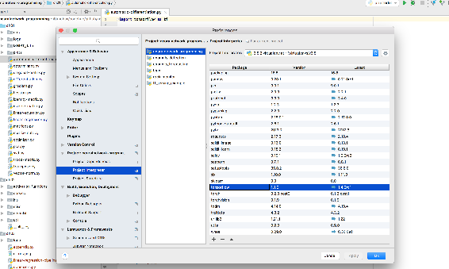
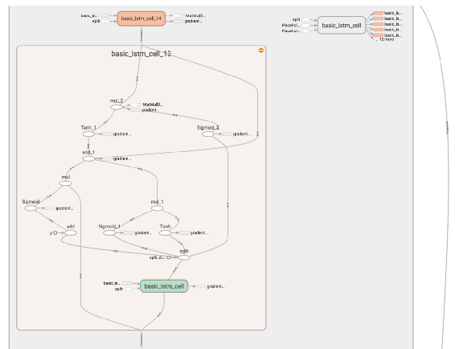

# 十、TensorFlow 入门

TensorFlow 是 Google 的开源深度学习库。它提供了在张量上定义函数和自动计算它们的导数的原语。张量可以表示为多维数组。标量、向量和矩阵是张量的类型。TensorFlow 主要用于设计计算图，构建和训练深度学习模型。TensorFlow 库使用数据流图进行数值计算，其中节点表示数学运算，边表示数据点(通常是多维数组或在这些边之间传输的张量)。


# 环境设置

最好使用 PyCharm 之类的 IDE 来编辑 Python 代码；它提供了更快的开发工具和编码帮助。代码完成和检查使编码和调试更快更简单，确保您专注于神经网络编程的最终目标。

TensorFlow 提供了多种语言的 API:Python、C++、Java、Go 等等。我们将下载 TensorFlow 的一个版本，它将使我们能够用 Python 编写深度学习模型的代码。在 TensorFlow 安装网站上，我们可以找到使用 virtualenv、pip、Docker 安装 TensorFlow 的最常用方式和最新说明。

以下步骤描述了如何设置本地开发环境:

1.  下载 Pycharm 社区版。
2.  在 Pycharm 上获取最新的 Python 版本。
3.  转到首选项，设置 python 解释器，并安装最新版本的 TensorFlow:



4.  TensorFlow 现在将出现在已安装的软件包列表中。点击确定。现在用一个程序测试您的安装，例如 hello world:

```py
import TensorFlow  as tf
helloWorld = tf.constant("Hello World!")
sess = tf.Session()
print(sess.run(helloWorld))
```


# TensorFlow 与 Numpy 的比较

TensorFlow 和 Numpy 都是 N 维数组库。TensorFlow 还允许我们创建张量函数和计算导数。TensorFlow 已经成为用于深度学习的主要库之一，因为它非常高效，可以在 GPU 上运行。

以下程序描述了如何使用`TensorFlow`和`numpy`执行类似的操作，例如创建一个`(3,3)`形状的张量:

```py
import TensorFlow  as tf
import numpy as np

tf.InteractiveSession()

# TensorFlow  operations
a = tf.zeros((3,3))
b = tf.ones((3,3))

print(tf.reduce_sum(b, reduction_indices=1).eval())
print(a.get_shape())

# numpy operations
a = np.zeros((3, 3))
b = np.ones((3, 3))
print(np.sum(b, axis=1))
print(a.shape)
```

上述代码的输出如下:

```py
[ 3\.  3\.  3.]
(3, 3)
[ 3\.  3\.  3.]
(3, 3)
```


# 计算图形

TensorFlow 是基于建立一个计算图。计算图是一个节点网络，其中每个节点定义一个运行函数的操作；这可以像加法或减法一样简单，也可以像多元方程一样复杂。TensorFlow 程序被结构化为组装图形的构造阶段和利用会话对象来执行图形中的操作的执行阶段。

一个操作被称为 op，它可以返回零个或多个张量，这些张量可以在后面的图形中使用。每个 op 可以给定一个常量、数组或 n 维矩阵。


# 图表

导入 TensorFlow 库时，默认图形被实例化。当在一个文件中创建多个互不依赖的模型时，构建一个图形对象而不是使用缺省图形是很有用的。在 TensorFlow 中，常数和运算被添加到图形中。

在`newGraph.as_default()`之外应用的变量和操作将被添加到默认图形中，默认图形是在导入库时创建的:

```py
newGraph = tf.Graph()
with newGraph.as_default():
    newGraphConst = tf.constant([2., 3.])

```


# 会话对象

TensorFlow 中的会话封装了评估张量对象的环境。会话可以有自己的私有变量、队列和指定的读取器。我们应该在会话结束时使用 close 方法。

该会话有三个可选参数:

*   `Target`:要连接的执行引擎
*   `graph`:要启动的图形对象
*   `config`:这是一个配置协议缓冲区

为了运行 TensorFlow 计算的单个步骤，调用 step 函数并执行图形的必要依赖关系:

```py
# session objects
a = tf.constant(6.0)
b = tf.constant(7.0)

c = a * b
with tf.Session() as sess:
   print(sess.run(c))
   print(c.eval())
```

`sess.run(c)`在当前活动的会话中！

上述代码给出了以下输出:

```py
42.0, 42.0
```

`tf.InteractiveSession()`函数是在`ipython`中保持默认会话打开的一种简单方法。`sess.run(c)`是 TensorFlow 提取的一个例子:

```py
session = tf.InteractiveSession()
cons1 = tf.constant(1)
cons2 = tf.constant(2)
cons3 = cons1 + cons2
# instead of sess.run(cons3)
cons3.eval()
```


# 变量

在训练模型时，我们使用变量来保存和更新参数。变量就像内存中包含张量的缓冲区。我们之前用的所有张量都是常量张量，不是变量。

变量由会话对象管理或维护。变量在会话之间保持不变，这很有用，因为张量和操作对象是不可变的:

```py
# tensor variablesW1 = tf.ones((3,3))
W2 = tf.Variable(tf.zeros((3,3)), name="weights")

 with tf.Session() as sess:
   print(sess.run(W1))
   sess.run(tf.global_variables_initializer())
   print(sess.run(W2))
```

上述代码给出了以下输出:

```py
[[ 1\.  1\.  1.] [ 1\.  1\.  1.] [ 1\.  1\.  1.]]
[[ 0\.  0\.  0.] [ 0\.  0\.  0.] [ 0\.  0\.  0.]]
```

TensorFlow 变量必须在有值之前初始化，这与常量张量相反:

```py
# Variable objects can be initialized from constants or random values
W = tf.Variable(tf.zeros((2,2)), name="weights")
R = tf.Variable(tf.random_normal((2,2)), name="random_weights")

with tf.Session() as sess:
   # Initializes all variables with specified values.
   sess.run(tf.initialize_all_variables())
   print(sess.run(W))
   print(sess.run(R))
```

前面的代码给出了以下输出:

```py
[[ 0\.  0.] [ 0\.  0.]]
[[ 0.65469146 -0.97390586] [-2.39198709  0.76642162]]
```

```py
state = tf.Variable(0, name="counter")
new_value = tf.add(state, tf.constant(1))
update = tf.assign(state, new_value)

with tf.Session() as sess:
   sess.run(tf.initialize_all_variables())
   print(sess.run(state))
   for _ in range(3):
      sess.run(update)
      print(sess.run(state))
```

上述代码给出了以下输出:

```py
0 1 2 3
```

获取变量状态:

```py
input1 = tf.constant(5.0)
input2 = tf.constant(6.0)
input3 = tf.constant(7.0)
intermed = tf.add(input2, input3)
mul = tf.multiply(input1, intermed)

# Calling sess.run(var) on a tf.Session() object retrieves its value. Can retrieve multiple variables simultaneously with sess.run([var1, var2])
with tf.Session() as sess:
   result = sess.run([mul, intermed])
   print(result)
```

前面的代码给出了以下输出:

```py
[65.0, 13.0]
```


# 范围

TensorFlow 模型可能有数百个变量。`tf.variable_scope()`提供了一个简单的名称。

为了管理模型的复杂性并分解成独特的部分，TensorFlow 有范围。使用 TensorBoard 时，瞄准镜非常简单而且很有帮助。范围也可以嵌套在其他范围内:

```py
with tf.variable_scope("foo"):
     with tf.variable_scope("bar"):
         v = tf.get_variable("v", [1])
 assert v.name == "foo/bar/v:0" with tf.variable_scope("foo"):
     v = tf.get_variable("v", [1])
     tf.get_variable_scope().reuse_variables()
     v1 = tf.get_variable("v", [1])
 assert v1 == v
```

以下示例显示了如何使用重用选项来理解`get_variable`的行为:

```py
#reuse is falsewith tf.variable_scope("foo"):
     n = tf.get_variable("n", [1])
 assert v.name == "foo/n:0" *#Reuse is true* with tf.variable_scope("foo"):
     n = tf.get_variable("n", [1])
 with tf.variable_scope("foo", reuse=True):
     v1 = tf.get_variable("n", [1])
 assert v1 == n
```


# 数据输入

向 TensorFlow 对象输入外部数据:

```py
a = np.zeros((3,3))
ta = tf.convert_to_tensor(a)
with tf.Session() as sess:
   print(sess.run(ta))
```

上述代码给出了以下输出:

```py
[[ 0\. 0\. 0.] [ 0\. 0\. 0.] [ 0\. 0\. 0.]]
```


# 占位符和提要词典

使用`tf.convert_to_tensor()`输入数据很方便，但是它没有伸缩性。使用`tf.placeholder`变量(为计算图提供数据入口点的虚拟节点)。一个`feed_dict`是 Python 字典映射:

```py
input1 = tf.placeholder(tf.float32)
 input2 = tf.placeholder(tf.float32)
 output = tf.multiply(input1, input2)

 with tf.Session() as sess:
    print(sess.run([output], feed_dict={input1:[5.], input2:[6.]}))
```

前面的代码给出了以下输出:

```py
[array([ 30.], dtype=float32)]
```


# 自动微分

自动微分也被称为**算法微分**，这是一种自动计算函数导数数值的方法。它有助于计算梯度、雅可比矩阵和 Hessians 矩阵，以便在数值优化等应用中使用。反向传播算法是用于计算梯度的自动微分的反向模式的实现。

在下面的例子中，使用`mnist`数据集，我们使用`loss`函数之一计算损失。问题是:我们如何使模型符合数据？

我们可以使用`tf.train.Optimizer`并创建一个优化器。`tf.train.Optimizer.minimize(loss, var_list)`向计算图形添加优化操作，自动微分无需用户输入即可计算梯度:

```py
import TensorFlow  as tf

# get mnist dataset
from TensorFlow .examples.tutorials.mnist import input_data
data = input_data.read_data_sets("MNIST_data/", one_hot=True)

# x represents image with 784 values as columns (28*28), y represents output digit
x = tf.placeholder(tf.float32, [None, 784])
y = tf.placeholder(tf.float32, [None, 10])

# initialize weights and biases [w1,b1][w2,b2]
numNeuronsInDeepLayer = 30
w1 = tf.Variable(tf.truncated_normal([784, numNeuronsInDeepLayer]))
b1 = tf.Variable(tf.truncated_normal([1, numNeuronsInDeepLayer]))
w2 = tf.Variable(tf.truncated_normal([numNeuronsInDeepLayer, 10]))
b2 = tf.Variable(tf.truncated_normal([1, 10]))

# non-linear sigmoid function at each neuron
def sigmoid(x):
    sigma = tf.div(tf.constant(1.0), tf.add(tf.constant(1.0), tf.exp(tf.negative(x))))
    return sigma

# starting from first layer with wx+b, then apply sigmoid to add non-linearity
z1 = tf.add(tf.matmul(x, w1), b1)
a1 = sigmoid(z1)
z2 = tf.add(tf.matmul(a1, w2), b2)
a2 = sigmoid(z2)

# calculate the loss (delta)
loss = tf.subtract(a2, y)

# derivative of the sigmoid function der(sigmoid)=sigmoid*(1-sigmoid)
def sigmaprime(x):
    return tf.multiply(sigmoid(x), tf.subtract(tf.constant(1.0), sigmoid(x)))

# automatic differentiation
cost = tf.multiply(loss, loss)
step = tf.train.GradientDescentOptimizer(0.1).minimize(cost)

acct_mat = tf.equal(tf.argmax(a2, 1), tf.argmax(y, 1))
acct_res = tf.reduce_sum(tf.cast(acct_mat, tf.float32))

sess = tf.InteractiveSession()
sess.run(tf.global_variables_initializer())

for i in range(10000):
    batch_xs, batch_ys = data.train.next_batch(10)
    sess.run(step, feed_dict={x: batch_xs,
                              y: batch_ys})
    if i % 1000 == 0:
        res = sess.run(acct_res, feed_dict=
        {x: data.test.images[:1000],
         y: data.test.labels[:1000]})
        print(res)
```


# 张量板

TensorFlow 有一个强大的内置可视化工具，名为 **TensorBoard** 。它允许开发人员解释、可视化和调试计算图形。为了在 TensorBoard 中自动可视化图形和指标，TensorFlow 将与计算图形的执行相关的事件写入特定的文件夹。

此示例显示了之前完成的分析的计算图:



要检查图形，请单击 TensorBoard 顶部面板上的“图形”选项卡。如果图形有几个节点，在单个视图中可视化它可能会很困难。为了使我们的可视化更容易理解，我们可以使用带有特定名称的`tf.name_scope`将相关操作组织成组。