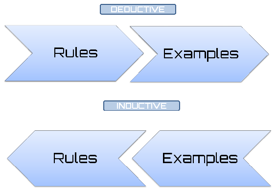
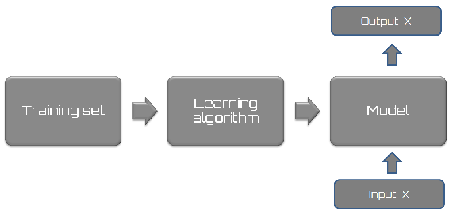
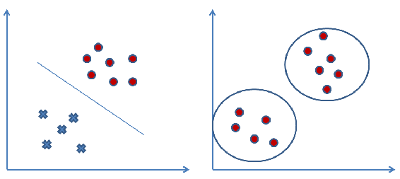
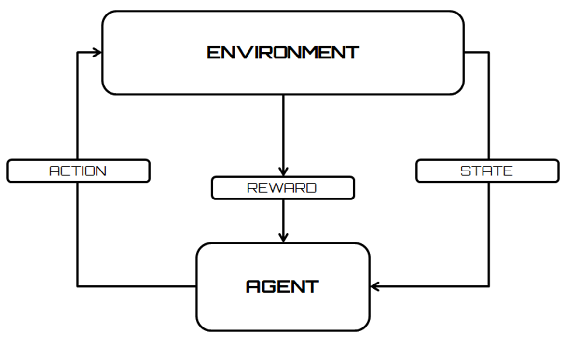
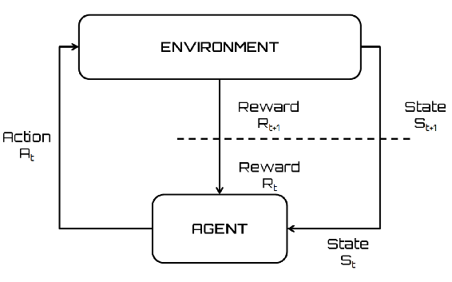
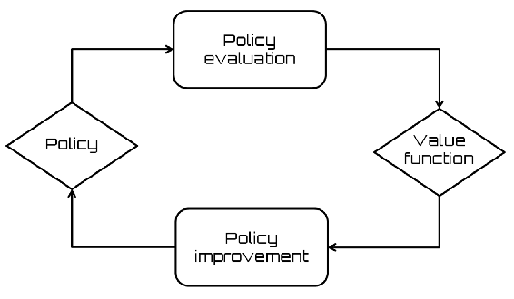

# 一、Keras 强化学习概述

如今，大多数计算机都是基于符号加工，也就是说，问题首先被编码成一组变量，然后使用显式算法进行处理，对于问题的每个可能的输入，提供一个适当的输出。然而，存在这样的问题，其中使用显式算法的解析是低效的或者甚至是不自然的，例如使用语音识别器；用传统的方法处理这种问题是低效的。这个问题和其他类似的问题，如机器人的自主导航或执行操作时的语音辅助，是可以通过基于强化学习的解决方案直接解决的一组非常多样化的问题的一部分。

强化学习是机器学习中非常令人兴奋的一部分，用于从自动驾驶汽车到玩游戏的应用中。强化学习旨在创造能够学习和适应环境变化的算法。为此，我们根据算法做出的选择，使用环境产生的外部反馈信号(奖励信号)。正确的选择将导致奖励，而错误的选择将导致系统的惩罚。所有这些都是为了达到可获得的最佳结果。

本章涵盖的主题如下:

*   机器学习概述
*   强化学习
*   **马氏决策过程** ( **MDP** )
*   **时差** ( **TD** )学习
*   q 学习
*   深度 Q 学习网络

在这一章的最后，你将会完全了解强化学习的力量，并且会学到这种技术的不同方法。几个强化学习方法将被涵盖。


# 机器学习的基本概念

机器学习是一个多学科领域，由计算机科学、统计学、神经生物学和控制理论的交叉和协同创建。它的出现在几个领域发挥了关键作用，并从根本上改变了软件编程的视野。如果以前的问题是如何给计算机编程，那么现在的问题变成了计算机如何给自己编程。因此，很明显，机器学习是一种允许计算机拥有自己智能的基本方法。

正如所料，机器学习与人类学习的学习和研究相互联系并共存。就像人类的大脑和神经元是洞察力的基础一样，**人工神经网络**(**ann**)是计算机任何决策活动的基础。

机器学习是指在没有任何外界帮助的情况下，从经验中学习的能力，这是我们人类在大多数情况下所做的。为什么对机器来说不应该是一样的呢？

通过使用机器学习，我们可以从一组数据中找到一个近似于该组数据的模型。例如，我们可以确定给定系统的输入变量和输出变量之间的对应关系。做到这一点的一种方法是假设数据的参数化生成的某种机制的存在，然而，它不知道参数的确切值。这一过程通常参考统计技术，例如:

*   感应
*   扣除
*   绑架

从一组观察数据中提取一般规律的过程称为归纳；它与演绎法相反，在演绎法中，我们从一般规律出发，想要预测一组变量的值。归纳法是科学方法的基本机制，在这种方法中，我们希望从对现象的观察出发，推导出一般规律，通常用数学语言来描述。

这种观察包括对一组变量的测量，因此也包括对描述观察到的现象的数据的获取。然后，生成的模型可用于对其他数据进行预测。从一组观察开始，我们想要对新的情况做出预测的整个过程被称为推理。因此，归纳学习从来自周围环境的观察开始，并概括获得对尚未观察到的情况有效的知识；至少我们希望如此。

归纳学习基于实例学习:通过从一组作为要学习的概念的实例的正面实例和作为概念的非实例的负面实例开始获得的知识。在这方面，伽利略·伽利雷(1564-1642 年)的一句话特别清楚:

“知识是经验的一部分，从经验中可以得出基于定量数据的假设，这些假设必须通过实验来验证，也可以在心理上理解为定量变量之间的人为关系，从而得出方程形式的定律。”

下图是一个展示归纳和演绎学习的流程图:



一个问题油然而生:为什么机器学习系统能在传统算法失效的地方工作？传统算法失败的原因很多，通常包括以下几点:

*   **问题形式化难度**:比如我们每个人都能从声音中认出朋友。但是可能没有人能描述出一系列的计算步骤，使他们能从记录的声音中认出说话的人。
*   **大量变量在起作用**:当考虑从文档中识别字符的问题时，指定所有被认为涉及到的参数可能特别复杂。此外，同样的形式化适用于同样的背景，但在不同的习语可能证明是不充分的。
*   缺乏理论:想象一下，在没有特定数学定律的情况下，你必须准确预测金融市场的表现。
*   **定制需求**:有趣和无趣功能之间的区别很大程度上取决于个人用户的感知。

对这些问题的快速分析突出表明，在所有情况下都缺乏经验。


# 监督学习

监督学习是一种机器学习技术，旨在对计算机系统进行编程，使其能够自动解决相关任务。为此，输入数据包含在集合 *I* 中(通常是向量)。然后，输出数据集被固定为 set *O* ，最后，它定义了一个函数 *f* ，将每个输入与正确答案关联起来。这种信息称为训练集。此工作流程如下图所示:



所有监督学习算法都基于以下论点:如果一个算法提供了足够数量的例子，它将能够创建一个派生函数 *B* ，该函数将逼近期望函数 *A* 。

如果期望函数的近似是适当的，那么当输入数据被提供给导出函数时，该函数应该能够提供与期望函数提供的输出响应相似的输出响应，然后是可接受的。这些算法基于以下概念:相似的输入对应于相似的输出。

通常，在现实世界中，这种假设是不成立的；然而，在某些情况下这是可以接受的。显然，这种算法的正常运行在很大程度上取决于输入数据。如果只有几个训练输入，算法可能没有足够的经验来提供正确的输出。相反，许多输入可能会使其速度过慢，因为大量输入生成的导数函数会增加训练时间。因此速度缓慢。

此外，经验表明这种类型的算法对噪声非常敏感；即使几条不正确的数据也会使整个系统不可靠，并导致错误的决策。

在监督学习中，可以根据数据的性质分解问题。如果输出值是分类的，比如某类的成员/非成员，那么就是分类问题。如果输出在一定范围内是连续的实值，那么就是回归问题。


# 无监督学习

无监督学习的目的是从数据库中自动提取信息。这个过程在没有要分析的内容的先验知识的情况下发生。与监督学习不同，没有关于样本的成员类别的信息，或者更一般地，没有关于对应于某个输入的输出的信息。目标是得到一个能够发现有趣属性的模型:例如，具有相似特征的组(聚类)。搜索引擎就是应用这些算法的一个例子。给定一个或多个关键字，他们能够创建一个与我们的搜索相关的链接列表。

这些算法的有效性取决于它们能从数据库中提取的信息的有用性。这些算法通过比较数据并寻找相似或不同之处来工作。可用数据仅涉及描述每个示例的一组特征。

下图显示了监督学习(左侧)和非监督学习示例(右侧):



它们在处理数字类型的元素时效率很高，但是在处理非数字数据时就不那么精确了。一般来说，当数据清晰可辨并包含一个顺序或一个清晰的分组时，它们可以正常工作。


# 强化学习

强化学习旨在创造能够学习和适应环境变化的算法。这种编程技术基于接收外部刺激的概念，其性质取决于算法选择。正确的选择会带来奖励，而错误的选择会导致惩罚。当然，这个系统的目标是达到最好的结果。

在监督学习中，有一个老师告诉系统正确的输出(跟着老师学习)。这并不总是可能的。通常，我们只有定性信息(有时是二元的，对/错，或成功/失败)。

可用的信息被称为强化信号。但是系统并没有给出任何关于如何更新代理行为的信息(也就是权重)。您不能定义成本函数或梯度。该系统的目标是创造智能代理，使机器能够从他们的经验中学习。


# 逐步建立机器学习模型

在开发使用机器学习的应用时，我们将遵循以下列步骤为特征的过程:

*   **收集数据**:一切从数据出发，毫无疑问；但是有人可能会问这么多的数据是从哪里来的。在实践中，它是通过漫长的程序收集的，例如，可能来自测量活动或面对面的访谈。在所有情况下，数据都被收集在数据库中，以便可以对其进行分析以获得知识。
*   **准备资料**:我们已经收集了资料；现在，我们必须为下一步做准备。一旦我们有了这些数据，我们必须确保它是我们想要使用的算法可用的格式。为此，您可能需要进行一些格式化。回想一下，一些算法需要整数格式的数据，而另一些算法需要字符串形式的数据，最后还有一些算法需要特殊格式的数据。我们稍后会谈到这一点，但是与数据收集相比，具体的格式化通常很简单。
*   **探索数据**:在这一点上，我们可以查看数据来验证它是否真的在工作，并且我们没有一堆空值。在这一步中，通过使用图，我们可以识别模式以及是否有一些数据点与集合中的其他数据点有很大不同。绘制一维、二维或三维数据也会有所帮助。
*   **训练算法**:现在，让我们认真起来。在这一步中，机器学习算法处理模型的定义，因此处理训练。该模型开始从我们现有的大量数据中提取知识，而迄今为止还没有对这些数据做出任何解释。对于无监督学习，没有训练步骤，因为你没有目标值。
*   **测试算法**:在这一步中，我们使用上一步中学习到的信息来查看模型是否实际工作。对算法的评估是为了查看模型对真实系统的逼近程度。在监督学习的情况下，我们有一些已知的值可以用来评估算法。在无监督学习中，我们可能需要使用一些其他指标来评估成功与否。在这两种情况下，如果我们不满意，我们可以返回到前面的步骤，改变一些东西，并重试测试。

*   **评估算法**:我们已经到了可以应用目前所做的事情的地步。我们可以通过将模型应用于真实数据来评估模型的近似能力。然后，在此阶段对之前经过训练和测试的模型进行评估。
*   **提升算法性能**:最后，我们可以把重点放在整理步骤上。我们已经验证了模型的有效性，我们已经评估了性能，现在我们准备分析整个过程，以确定任何可能的改进空间。

在将机器学习算法应用于我们的数据之前，花一些时间进行工作流设置是合适的。


# 强化学习入门

强化学习旨在创造能够学习和适应环境变化的算法。这种编程技术基于接收外部刺激的概念，这种刺激依赖于代理选择的动作。正确的选择会带来奖励，而错误的选择会导致惩罚。当然，这个系统的目标是达到最好的结果。

这些机制源自机器学习的基本概念(从经验中学习)，试图模拟人类行为。事实上，在我们的头脑中，我们激活大脑机制，引导我们追逐和重复在我们身上产生满足感和幸福感的东西。每当我们经历快乐的时刻(食物、性、爱等等)，我们的大脑中就会产生一些物质，它们通过强化相同的刺激来发挥作用。

除了这种神经化学强化机制之外，记忆也扮演着重要的角色。事实上，记忆收集主体的经历是为了将来能够重复。进化赋予了我们这种机制，推动我们朝着最佳解决方案的方向重复令人满意的经历。

这就是为什么我们如此强烈地记得我们生活中最重要的经历:经历，尤其是那些有巨大回报的经历，会被铭记在记忆中，并决定我们未来的探索。之前，我们已经看到，根据用于学习的信号的性质和系统采用的反馈类型，从经验中学习可以由数值算法以各种方式模拟。

下图显示了一个流程图，该流程图显示了在强化学习设置中代理与环境的交互:



科学文献对强化学习的分类采取了不确定的立场。事实上，在文献的初始阶段，它被认为是监督学习的特例，之后它被完全推广为机器学习算法的第三范式。它适用于监督学习效率低下的不同情况:与环境的交互问题是一个明显的例子。

以下列表显示了正确应用强化学习算法应遵循的步骤:

1.  制剂的制备
2.  观察环境
3.  最佳策略的选择
4.  行动的执行
5.  相应奖励(或惩罚)的计算
6.  制定更新策略(如有必要)
7.  重复步骤 2 到 5，直到代理学习到最佳策略

强化学习是基于心理学的一种理论，是在动物身上进行了一系列实验后形成的。特别是，爱德华·桑戴克(美国心理学家)指出，如果一只猫在执行了被认为正确的行为后立即得到奖励，那么这增加了这种行为重复发生的可能性。另一方面，面对不想要的行为，惩罚的应用减少了错误重复的可能性。

在这一理论的基础上，在定义了要实现的目标之后，强化学习试图最大化执行允许达到指定目标的一个或一组动作所获得的回报。


# 代理-环境界面

就实现目标而言，强化学习可以被视为交互问题的一个特例。必须达到目标的实体称为代理。代理必须与之交互的实体称为环境，它对应于代理外部的一切。

到目前为止，我们更专注于术语*代理*，但是它代表什么呢？代理(软件)是代表另一个程序执行服务的软件实体，通常是自动的和不可见的。这些软件也被称为智能代理。

以下是代理最重要的特征列表:

*   它可以在对环境的动作的连续和离散集合之间进行选择。
*   行动要看情况。系统状态中总结了这种情况。
*   代理持续监控环境(输入)并持续改变状态
*   行动的选择不是无足轻重的，需要一定程度的智慧。
*   代理人有聪明的记忆力。

主体有一个目标导向的行为，但是在一个不确定的环境中行动，这个环境不是先验已知的或者只是部分已知的。智能体通过与环境互动来学习。可以在通过代理自身进行的测量了解环境的同时制定计划。这种策略接近于试错理论。

试错法是解决问题的基本方法。它的特点是不断重复不同的尝试，直到成功，或者直到代理停止尝试。

主体与环境的相互作用是连续的:主体选择要采取的行动，作为响应，环境改变状态，呈现要面对的新情况。

在强化学习的特殊情况下，环境为代理人提供奖励。至关重要的是，奖励的来源是环境，以避免在代理人内部形成会损害学习的个人强化机制。

奖励的价值与行动对实现目标的影响成正比，因此，如果行动正确，奖励的价值为正或高，如果行动不正确，奖励的价值为负或低。

下面列出了一些现实生活中的例子，在这些例子中，代理和环境之间通过交互来解决问题:

*   棋手每走一步，都知道可以创造的棋子的结构，以及对手可能采取的对策。
*   一只小长颈鹿，在短短的几个小时内，学会了站起来跑。
*   一个真正自主的机器人学会在房间里走动以离开房间。比如:Roomba 机器人真空。
*   炼油厂的参数(油压、流量等)是实时设置的，以便获得最高产量或最高质量。例如，如果特别稠的油到达，那么到工厂的流速被修改以允许充分精炼。

我们研究的所有示例都有以下共同特征:

*   与环境的相互作用
*   代理想要达到的特定目标
*   不确定性或对环境的片面了解

通过对这些例子的分析，可以得出以下结论:

*   代理从自己的经验中学习。
*   行动改变了状态(情况)，改变了未来选择的可能性(延迟奖励)。
*   一个行动的效果是无法完全预测的。
*   代理对其行为有一个全局评估。
*   它必须利用这些信息来改进它的选择。选择随着经验而改进。
*   问题可以有一个有限或无限的时间范围。

本质上，代理人通过其传感器接收来自环境的感觉。根据它的感觉，代理决定在环境中采取什么行动。基于其行动的直接结果，代理人可以得到奖励。

如果你想使用自动学习方法，你需要给出一个环境的正式描述。确切地知道环境是如何形成的并不重要；有趣的是对环境所具有的属性做出一般性的假设。在强化学习中，通常假设环境可以用 MDP 来描述。


# 马尔可夫决策过程

为了避免负载问题和计算困难，代理-环境的相互作用被认为是一个 MDP。MDP 是离散时间随机控制过程。

随机过程是数学模型，用于研究遵循随机或概率定律的现象的演变。众所周知，在所有自然现象中，由于其本质和观测误差，随机或偶然的成分是存在的。该组件导致以下情况:在 *t，*的每个实例中，对现象的观察结果是随机数或随机变量*s[t]。不可能有把握地预测结果会是什么；人们只能说它将取几个可能值中的一个，每个值都有一个给定的概率。*

当选择了某个 *t* 的实例进行观察后，从 *t* 开始的随机过程的演化仅依赖于 *t* 而不以任何方式依赖于之前的实例时，该随机过程被称为马尔可夫过程。因此，当给定观察时刻，只有这个实例决定过程的未来演化，而这个演化不依赖于过去时，过程是马尔可夫的。

在马尔可夫过程中，在每个时间步，过程处于状态 *s € S* ，决策者可以选择在状态 *s* 可用的任何动作 *a € A* 。该流程在下一个时间戳通过随机进入新状态*s’*做出响应，并给予决策者相应的奖励 *r(s，s’)*。

下图显示了 MDP 中代理与环境的交互:



上图中所示的代理与环境的交互可以用以下方式来表示:

*   代理和环境在时间上以离散的间隔相互作用， *t = 0，1，2… n* 。
*   在每个时间间隔，代理接收环境的状态*s[t]的表示。*
*   每个元素 *s [t] ∈ S* ，其中 *S* 是可能状态的集合。
*   一旦状态被识别，代理必须采取动作 *a [t] ∈ A(s [t] )* ，其中 *A(s [t] )* 是状态 *s [t]* 中可能的动作集合。
*   要采取的行动的选择取决于要实现的目标，并通过符号 *π* (折扣累积奖励)指示的策略进行映射，该策略将行动与每个状态 *s* 的 *a [t] ∈ A(s)* 相关联。术语 *π [t] (s，a)* 表示在状态 *s* 下执行动作 *a* 的概率。
*   在下一个时间间隔 *t + 1* 期间，作为动作*a[t]的结果的一部分，代理接收与先前采取的动作*a[t]相对应的数字奖励 *r [t + 1] ∈ R* 。**
*   相反，动作的结果代表新的状态*s[t]。此时代理**必须再次编码状态并做出动作的选择。***
*   这种迭代不断重复，直到代理实现目标。

状态*s[t+1]的定义取决于先前的状态和所采取的动作(MDP)，如下所示:*

*s[t + 1] = δ (s[t],a[t])*

这里， *δ* 代表状态函数。

总而言之:

*   在 MDP 中，代理可以感知它所处的状态 *s ∈ S* ,并拥有一套 *A* 动作供其支配
*   在每个离散的时间间隔 *t* ，代理检测当前状态*s[t]并决定执行动作 *a [t] ∈ A**
*   环境通过提供奖励(一种强化)来响应，r*t[t]= r(ST，at)* 并进入状态 *s [t + 1] = δ (st，at)*
*   *r* 和 *δ* 函数是环境的一部分；它们只取决于当前的状态和动作(而不是先前的状态和动作),并且不一定为代理所知
*   强化学习的目标是学习一个策略，对于系统所处的每个状态 *s* ,该策略向代理指示一个动作，以最大化在整个动作序列期间接收的总强化

让我们更深入地了解一些使用的术语:

*   奖励函数定义了强化学习问题的目标。它将检测到的环境状态映射成一个数字，从而定义一个奖励。如前所述，唯一的目标是最大化长期的总回报。奖励函数定义了代理的好的和坏的事件。奖励函数有正确的需要，可以作为改变政策的依据。例如，如果策略选择的一个动作之后是低奖励，则可以在下一步中改变策略以选择该情况下的其他动作。
*   策略定义了学习代理在给定时间的行为。它映射了检测到的环境状态以及当它们处于这些状态时要采取的操作。这相当于心理学上所说的一套刺激反应的规则或关联。策略是强化学习代理的基本部分，从这个意义上说，它本身就足以决定行为。
*   一个价值函数代表一个状态对一个代理人有多好。它等于从状态 *s* 对代理的期望总报酬。值函数取决于代理选择要执行的操作的策略。
*   一个动作值函数返回一个值，也就是遵循一个策略，在某个状态 *s* 下使用动作 *a* 的预期回报(总体回报)。


# 折扣累积奖励

在上一节中，我们说过强化学习的目标是学习一个策略，对于系统所处的每个状态 *s* ，该策略向代理指示一个动作，以最大化在整个动作序列中收到的总奖励。我们怎样才能在整个行动过程中最大限度地获得强化？

从保单中获得的总加固量计算如下:


这里， *r [T]* 代表在终端状态 *s [T]* 下驱动环境的动作的奖励。

这个问题的一个可能的解决方案是把提供最高奖赏的行动与每个单独的州联系起来；也就是说，我们必须确定一个最优策略，使以前的数量最大化。

对于在有限步数内没有达到目标或终点状态的问题(连续任务)， *R [t]* 趋于无穷大。

在这些情况下，一个人想要最大化的回报的总和在无穷远处发散，所以这种方法不适用。因此，有必要开发一种替代的加固技术。

最适合强化学习范式的技术是贴现累积奖励，它试图最大化以下数量:


这里， *γ* 被称为折扣因子，代表对未来奖励的重要性。该参数可以取值 *0 ≤ γ ≤ 1* ，取值如下:

*   如果 *γ < 1* ，序列*r[t]将收敛到一个有限值*
*   如果 *γ = 0* ，代理人将对未来的奖励不感兴趣，但将只对当前状态尝试最大化奖励
*   如果 *γ = 1* ，代理人将试图增加未来的奖励，即使是以眼前的奖励为代价

折扣因子可以在学习过程中修改，以突出特定的动作或状态。一个最优的策略可以导致在执行一个单一的行动中获得的强化很低(甚至是负的)，只要这导致整体上更大的强化。


# 探索与开发

理想情况下，代理人必须将每个动作*a[t]与各自的奖励 *r* 相关联，以便随后选择最有回报的行为来实现目标。因此，这种方法对于复杂的问题是不切实际的，在这些问题中，状态的数量特别多，因此，可能的关联呈指数增长。*

这个问题被称为探索-开发困境。理想情况下，代理人必须探索每个状态的所有可能的行动，找到一个在实现其目标时实际上最有回报的行动。

因此，决策涉及一个基本的选择:

*   **开发**:根据当前信息做出最佳决策
*   **探索**:收集更多信息

在这个过程中，最好的长期战略可能会导致短期内的巨大牺牲。因此，有必要收集足够的信息来做出最佳决策。

每当我们试图学习新的东西时，探索-开发的困境就会显露出来。通常，我们必须决定是选择我们已经知道的东西(开发)，让我们的文化包袱保持不变，还是选择一些新的东西并通过这种方式学习更多的东西(探索)。第二个选择让我们面临做出错误选择的风险。这是我们经常面临的经历；例如，想一想当我们在餐馆被要求从菜单上的菜肴中进行选择时，我们所做的选择:

*   我们可以选择一些我们已经知道的东西，在过去，这些东西给了我们一个已知的回报，比如披萨(谁不知道玛格丽塔披萨的好处？)
*   我们可以尝试一些从未尝过的新东西，看看我们得到了什么(探索)，比如千层面(唉，不是每个人都知道一盘千层面的神奇味道)

我们将做出的选择将取决于许多边界条件:菜肴的价格、饥饿程度、对菜肴的了解等等。重要的是，对做出这些选择的最佳方式的研究表明，最佳学习有时需要我们做出错误的选择。这意味着，有时，你不得不选择避免你认为最有回报的行动，而采取你认为回报较少的行动。逻辑是，这些行动是获得长期利益所必需的:有时，你需要弄脏你的手来学习更多。

以下是在实际案例中采用这种技术的更多示例:

*   商店的选择:
    *   **剥削**:去你最喜欢的商店
    *   探索:尝试一家新店
*   路线的选择:
    *   **开拓**:选择目前为止最好的路线
    *   探索:尝试一条新路线

实际上，在非常复杂的问题中，收敛到一个非常好的策略会太慢。

解决这个问题的好办法是在探索和利用之间找到一个平衡点:

*   一个局限于探索的主体在每个状态下总是以一种随意的方式行动，很明显，收敛到一个最优策略是不可能的
*   如果代理很少探索，它将总是使用通常的动作，这可能不是最佳的

最后，我们可以说，在每一步中，代理人都必须在重复它迄今为止所做的事情，或者尝试能够取得更好结果的新动作之间做出选择。


# 强化学习算法

正如我们在前面几节中看到的，强化学习是一种编程技术，旨在开发能够学习和适应环境变化的算法。这种编程技术是基于这样的假设，即代理能够从外部接收刺激，并根据这些刺激改变其动作。因此，一个正确的选择将导致奖励，而一个错误的选择将导致系统的惩罚。

该系统的目标是获得尽可能高的回报，从而获得尽可能好的结果。这一结果可以通过两种方法获得:

*   第一种方法包括评估算法的选择，然后根据结果奖励或惩罚算法。这些技术也可以适应环境的重大变化。一个例子是图像识别程序，它们随着使用而提高性能。在这种情况下，我们可以说学习是连续进行的。
*   在第二种方法中，应用第一阶段，其中算法被预先训练，并且当系统被认为是可靠的时，它被具体化并且不再可修改。这是因为观察到不断评估算法的行为可能是一个无法自动化或非常昂贵的过程。

这些只是实现的选择，所以算法可能会包含新分析的方法。

到目前为止，我们已经介绍了强化学习的基本概念。现在，我们可以分析这些概念转化为算法的各种方式。在本节中，我们将列出它们，提供一个概述，并且我们将在接下来的章节中处理的实际案例中深化它们。


# 动态规划

**动态规划** ( **DP** )表示一组算法，在给定 MDP 形式的完美环境模型的情况下，这些算法可用于计算最优策略。DP 的基本思想，以及一般的强化学习，是利用国家价值和行动来寻找好的政策。

DP 方法通过称为策略评估和策略改进的两个过程的迭代来解决 MDP 过程:

*   策略评估算法包括将迭代方法应用于贝尔曼方程的求解。由于仅对 *k → ∞* 保证收敛，我们必须满足于通过施加停止条件得到良好的近似。
*   策略改进算法基于当前值改进策略。

以美国应用数学家 Richard E. Bellman 的名字命名的 Bellman 方程是与 DP 方法相关的最优性的必要条件。它允许我们在某个时间点，根据一些初始选择的回报和这些初始选择产生的剩余决策问题的价值，来获得决策问题的价值。

上述两个过程的迭代如下图所示:



策略迭代算法的缺点是我们必须在每一步评估策略。这涉及到一个迭代过程，在这个过程中，我们事先不知道收敛的时间，这将取决于，除其他外，如何选择开始的政策。

克服这个缺点的一个方法是在特定的步骤切断对策略的评估。该操作不会改变收敛到最优值的保证。策略的评估被逐步阻止(也称为扫描)的特殊情况定义了值迭代算法。在值迭代算法中，在策略改进的每个步骤之间执行值计算的单次迭代。在下面的代码片段中，显示了一个值迭代算法的伪代码:

```py
initialize value function V
repeat
   for all s
      for all a
         update Q function
         V = max Q function
until V converge
```

因此，在值迭代算法中，通过设置随机值函数来初始化系统。从该值开始，在迭代过程中寻找新的函数，该新的函数与前一个相比有所改进，直到达到最佳值函数。

如前所述，DP 算法本质上是基于两个并行发生的过程:策略评估和策略改进。这两个过程的反复执行使得一般过程向最优解收敛。在策略迭代算法中，两个阶段交替进行，一个阶段在另一个阶段开始之前结束。

在策略迭代算法中，我们从用随机策略初始化系统开始，所以我们首先必须找到该策略的值函数。这个阶段称为策略评估步骤。因此，我们找到了一个新的策略，与之前的策略相比也有所改进，基于之前的值函数，等等。在这个过程中，每个策略都比前一个策略有所改进，直到达到最佳策略。在下面的代码片段中，显示了策略迭代算法的伪代码:

```py
initialize value function V and policy π
repeat
   evaluate V using policy π
   improve π using V
until convergence
```

DP 方法通过环境可以假设的整个状态集进行操作，在每次迭代中对每个状态执行完整的备份。由备份执行的每个更新操作基于所有可能的后续状态的值来更新状态的值，对它们发生的概率进行加权，由选择的策略和环境的动态性引起。完整备份与贝尔曼方程密切相关；它们只不过是将等式转换成赋值指令。

当完整的备份迭代没有给状态值带来任何变化时，获得收敛，因此，最终状态值完全满足贝尔曼方程。DP 方法只有在有一个完美的环境模型时才适用，这个模型必须相当于一个 MDP。

正是由于这个原因，DP 算法在强化学习中几乎没有用处，因为它们假设了完美的环境模型，并且计算量高且昂贵，但是现在还是应该提到它们，因为它们代表了强化学习的理论基础。事实上，所有的强化学习方法都试图实现与动态规划方法相同的目标，只是计算成本更低，并且不需要假设环境的完美模型。

相对于基于直接搜索的方法所需的指数运算数量 *m*n* ，DP 方法通过关于状态数量 *n* 和动作数量 *m* 的多个多项式运算收敛到最优解。

DP 方法基于后继状态的值的估计来更新状态的值的估计，或者基于过去的估计来更新估计。这代表了一个特殊的属性，称为引导。强化学习的几种方法执行引导，甚至不需要如 DP 方法所要求的完美环境模型的方法。


# 蒙特卡罗方法

用于估计*值*函数和发现优秀政策的**蒙特卡罗** ( **MC** )方法不需要环境模型的存在。他们能够通过单独使用代理人的经验或从代理人和环境之间的相互作用中获得的状态序列、动作和奖励的样本来学习。该经验可以由代理根据学习过程获得，或者由先前填充的数据集模拟。在学习(在线学习)过程中获得经验的可能性是有趣的，因为它允许即使在缺乏环境动态的先验知识的情况下也能获得优秀的行为。甚至通过已经填充的经验数据集学习也可能是有趣的，因为如果与在线学习相结合，它使得由其他人的经验诱导的自动政策改进成为可能。

一般来说，MC 方法依靠重复随机抽样来获得数值结果。为此，他们利用随机性来解决确定性问题。在我们的案例中，我们将使用状态和行动-状态对的随机抽样，我们将查看奖励，然后我们将以迭代的方式审查政策。当我们探索每一个可能的动作-状态对时，过程的迭代将收敛于最优策略。

例如，我们可以采取以下步骤:

*   我们将对一个正确的动作分配+1 的奖励，对一个错误的动作分配-1 的奖励，对一个平局分配 0 的奖励。
*   我们将建立一个表，其中每个键对应一个特定的状态-动作对，每个值都是该对的值。这代表了在该州该行为所获得的平均奖励。

为了解决强化学习问题，MC 方法基于在过去的事件中平均获得的奖励的总和来估计价值函数。这假设体验被分成几集，并且所有的集都由有限数量的过渡组成。这是因为，在 MC 方法中，新值的估计和策略的修改发生在每一集的结尾。MC 方法迭代地估计策略和价值函数。然而，在这种情况下，每个迭代周期相当于完成一集——政策和价值函数的新估计一集接一集地出现。

以下是 MC 策略评估的伪代码:

```py
Initialize
   arbitrary policy π
   arbitrary state-value function
Repeat
   generate episode using π
   for each state s in episode
      the received reinforcement R is added to the set of rewards obtained so far
      estimate the value function on the basis on the average of the total sum of rewards obtained
```

通常，术语 MC 用于估计方法，其运算涉及随机分量。在这种情况下，术语 MC 指的是基于总回报平均值的强化学习方法。与计算每个状态的值的 DP 方法不同，MC 方法计算每个状态-动作对的值，因为在没有模型的情况下，仅有的状态值不足以决定在某个状态下最好执行哪个动作。


# 时间差异学习

TD 学习算法基于减少代理在不同时间做出的估计之间的差异。TD 算法试图预测一个依赖于给定信号未来值的量。它的名字来源于在连续时间步的预测中用来指导学习过程的差异。任何时候的预测都会更新，以使其更接近下一时间步的相同量的预测。在强化学习中，它们被用来预测未来预期的奖励总量。

它是 MC 方法和 DP 思想的结合。

MC 方法允许基于所获得结果的平均值来解决强化学习问题。DP 代表一组算法，在给定 MDP 形式的完美环境模型的情况下，这些算法可用于计算最佳策略。

TD 算法可以直接从原始数据中学习，不需要环境的动力学模型(如 MC)。该算法部分基于先前学习的估计来更新估计，而不等待最终结果(bootstrap，如 DP)。如果时间步长足够小，或者随着时间的推移而减小，则收敛(使用固定策略)。

连续的预测通常是相互关联的；TD 方法基于这一假设。这些方法试图最小化连续时间预测的误差。为此，使用贝尔曼方程计算价值函数更新。如上所述，为了改进预测，使用了自举技术，从而减少了每个更新步骤中预测的方差。

基于时间差的不同类型的算法可以根据选择所采用的动作的方法来区分。存在策略上的时差方法，其中基于由所选策略和策略外方法确定的动作的结果进行更新，其中可以通过假设的动作而不是实际采取的动作来评估各种策略。与政策方法不同，后者可以将探索问题与控制问题分开，学习策略不一定在学习阶段应用。

最常用的 TD 学习算法如下:

*   萨尔萨
*   q 学习
*   深度学习

在接下来的章节中，我们将分析这两种算法的主要特征和本质区别。


# 萨尔萨

**State-action-reward-State-action**(**SARSA**)算法实现了一种基于策略的时差方法，其中基于所选策略 *π (s，a)* ，基于通过动作 a 从状态 *s* 到状态*s’*的转换结果来执行动作值函数的更新。

有些策略总是选择提供最大回报的行动，而非确定性策略(*ε*-贪婪，*ε*-软，软最大)，确保学习阶段的探索元素。

贪婪是一个术语，用来表示试图通过优秀的局部选择获得全局解决方案的算法家族。

在 SARSA 中，有必要估计行动-价值函数 *q (s，a)* ，因为在缺乏环境模型的情况下，一个状态的总值 *v* ( *s* )(价值函数)不足以允许政策确定，给定一个状态，哪个行动被最好地执行。然而，在这种情况下，这些值是按照带有更新参数 *v* ( *s* )的贝尔曼方程逐步估计的，然而，考虑的不是状态，而是状态-动作对。

由于具有基于策略的性质，SARSA 基于 *π* 策略的行为来估计动作值函数，同时根据来自动作值函数的更新估计来修改策略的贪婪行为。SARSA 的趋同，更一般地说，所有 TD 方法的趋同，取决于政策的性质。

以下是 SARSA 算法的伪代码:

```py
Initialize
   arbitrary action-value function
Repeat (for each episode)
   Initialize s
   choose a from s using policy from action-value function
   Repeat (for each step in episode)
      take action a
      observe r, s'
      choose a' from s' using policy from action-value function
      update action-value function
      update s,a
```

动作值函数的更新规则使用全部五个元素*(s[t]T3、*a[t]T7、 *r* [*t + 1*] 、*s*[*t**+1*、*a[t+1])*；因为这个原因，它被称为 SARSA。]**


# q-学习

q 学习是最常用的强化学习算法之一。这是因为它能够在不需要环境模型的情况下比较可用操作的预期效用。由于这种技术，有可能在完成的 MDP 中为每个给定的状态找到最优的动作。

由于学习过程，强化学习问题的一般解决方案是估计评估函数。该功能必须能够通过奖励的总和来评估特定政策的最优性/效用或其他。事实上，Q-learning 试图最大化 *Q* 函数(action-value function)的值，它代表当我们在状态 *s* 执行动作 *a* 时的最大贴现未来回报。

Q-learning 像 SARSA 一样，按照更新用于估计 TD 方法的值的一般公式的逻辑，增量地估计函数值 *q* ( *s* ， *a* )，在环境的每一步更新状态-动作对的值。与 SARSA 不同，Q-learning 具有非策略特性，即当策略根据由 *q* ( *s* ， *a* )估计的值改进时，价值函数按照严格贪婪的次级策略更新估计值:给定一个状态，所选择的动作总是最大化值 max *q* ( *s* ， *a* )的动作。然而， *π* 策略在估计值中具有重要作用，因为通过它，确定了要访问和更新的状态-动作对。

以下是 Q 学习算法的伪代码:

```py
Initialize
   arbitrary action-value function
Repeat (for each episode)
   Initialize s
   choose a from s using policy from action-value function
   Repeat (for each step in episode)
      take action a
      observe r, s'
      update action-value function
      update s
```

Q-learning 使用一个表来存储每个状态-动作对。在每一步，代理观察环境的当前状态，并使用 *π* 策略选择和执行动作。通过执行动作，代理获得奖励 *R* [t+1] 和新状态 *S [t+1]* 。此时，代理能够计算 *Q(S [t] ，a [t] )* ，更新估计值。


# 深度学习

深度 Q-学习代表了基本 Q-学习方法的一种发展，用神经网络代替状态-动作，目的是逼近最优值函数。

与以前的方法相比，在以前的方法中，它用于构建网络以请求输入和动作并提供其预期回报，深度 Q-learning 彻底改变了结构，以便只请求环境的状态，并提供与环境中可以执行的动作一样多的状态-动作值。


# 摘要

强化学习旨在创造能够学习和适应环境变化的算法。这种编程技术基于根据算法选择接收外部刺激的概念。正确的选择会带来奖励，而错误的选择会导致惩罚。当然，这个系统的目标是达到最好的结果。在这一章中，我们讨论了强化学习的基础。

首先，我们探索了机器学习的神奇世界，并浏览了最流行的机器学习算法，以选择符合我们需求的正确算法。为了了解什么最适合我们的需求，我们学会了进行初步分析。然后我们一步步分析了如何建立机器学习模型。

在本章的中心部分，我们看到强化学习的目标是创造能够从经验中学习的智能主体。因此，我们分析了正确应用强化学习算法的步骤。稍后，我们探索了代理-环境接口。必须实现目标的实体称为代理。代理必须与之交互的实体称为环境，它对应于代理之外的一切。

为了避免负载问题和计算困难，代理-环境的相互作用被认为是一个 MDP。MDP 是一个随机控制过程。然后引入了贴现因子的概念。折扣因子在学习过程中用于突出显示或不突出显示特定的动作或状态。一个最优的策略可以使执行一个动作所获得的强化甚至更低(或负的)，只要总体上这导致了更大的强化。

最后，我们分析了最常见的强化学习技术。涵盖了 Q 学习、TD 学习和深度 Q 学习网络。

在下一章中，读者将了解马尔可夫过程的基本概念，
随机游走的基本概念，了解随机游走算法如何工作，
知道如何使用马尔可夫链预测天气，并学习如何使用马尔可夫链模拟
随机游走。