# 七、Segway 倒立摆系统的动力学建模

Segway 是一种个人运输设备，它利用了计算机科学、电子和机械的创新组合。它的功能是身体的延伸；就像舞蹈中的舞伴一样，它能够预测每一个动作。其工作原理基于倒立摆系统。倒立摆系统是控制和研究文献的教科书中常见的一个例子。它之所以受欢迎，部分是因为它在没有控制的情况下是不稳定的，并具有非线性动力学，但最重要的是，因为它有几个实际应用，如控制起飞的火箭或赛格威。

在这一章中，我们将分析一个物理系统的功能，这个系统是由一个刚性杆连接到一个手推车上构成的，用不同的方法来模拟这个系统。该杆通过铰接在支架上的枢轴连接，并可绕其自由旋转。这个被称为倒立摆的机械系统是控制理论中的一个经典问题。通常，它被广泛用于评估各种算法(PID 控制器、神经网络、模糊逻辑、遗传算法等)的性能。

以下是本章涵盖的主题:

*   倒立摆系统
*   开放式体育馆图书馆
*   q 学习
*   磁极环境

在本章结束时，读者将会学到 Q 学习的基本概念，以及如何使用这种技术来控制一个机械系统。他们将会发现最常用的术语的含义，例如力的平衡、摆的质量和转动惯量。他们将学习 OpenAI 健身房图书馆的基础知识，以及如何使用 Q-learning 解决横竿问题。


# 赛格威如何工作

赛格威是迪安·卡门发明的，他在 2001 年展示了原型车。这是一种用于个人移动的电力牵引运输车辆，这是一种非常先进的技术概念，最初被称为 Ginger。这是一种智能滑板车，它可以通过乘客和驾驶员身体的简单运动来启动、停止和倒车，稍微向前或向后弯曲，并借助车把左侧的旋钮来转弯。在下面这款名为 Segway PT 的车型中，转向柱不再是刚性的，而是可以向左或向右倾斜，以诱导所需的方向变化。配备旧转向系统(Segway HT)的车型已停产。在下面的照片中，显示了一辆赛格威 PT:

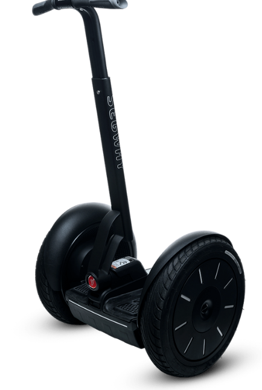

一天，发明家迪安·卡门看到一个坐在轮椅上的年轻人正试图走上人行道。他明白这个问题不是因为轮椅质量差，而是因为这个世界是为那些能够保持平衡的人而建造的。在此之后，他和他的团队创造了独立 iBOT 移动系统，这是一种自平衡机器，允许用户爬楼梯和处理不平坦的表面。在此之后，它增加了一个信念，平衡的车辆可能是一个深远的解决方案，所有的流动性一般。赛格威这个名字来源于英文单词“segue”，意为从一种状态到另一种状态的逐渐过渡。Segway 将人转化为增强型行人，让他们走得更远，做得更快，携带更多的东西。

在向媒体展示该模型并获得好评后，制造公司开始大规模生产，希望每年平均销售 50，000 件；可惜生产 21 个月后，只卖出了 6000 台。2003 年 9 月，制造商召回了为补救设计错误而制造的所有样品，因为在电池几乎耗尽的情况下出现了安全问题。

许多公共组织已经考虑了在大城市使用这种交通工具的可能性。例如，它们已经由警察部队进行了测试，并且经常由铁路警察在车站使用，尽管遇到的最大限制之一是经常双手都用于驾驶，使得例如不可能撑伞。第二个批评转移到了电池的自主性和可靠性——这些问题应该通过采用新型电池来解决。

PT 的功能与人体非常相似。它应用一种叫做动态稳定的技术来保持平衡，前进或后退。当一个人走路时，如果他们将身体的重量向前转移，他们往往会向前迈一步以保持平衡；同样，当他们向后移动身体的重量时，他们倾向于向后退一步。在 PT 车上，车身向前移动驱动车轮，车轮开始向那个方向前进。在下图中，我们有一个行走的物理学:

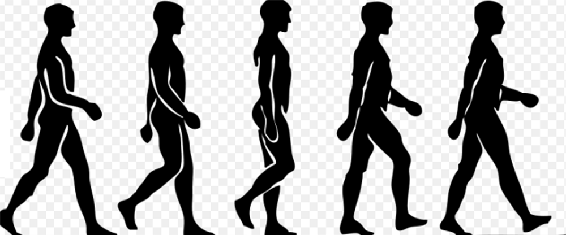

当你向前倾斜时，你只是将重心移过了接触点(轮胎与地面接触的点)。因此，PT 稍微向前倾斜。PT 系统检测到这种变化，并操纵车轮使其始终保持在乘客重心以下。

通过向左倾斜 LeanSteer，PT 以同样的方式向左转，通过向右倾斜，PT 向右转。要转弯，将 LeanSteer 转向所需的方向，保持车把与车身对齐。将 LeanSteer 返回到中间，PT 恢复直线行驶。

PT 的动态稳定技术在前后移动时提供了动态稳定性，但不影响横向稳定性，从而使 PT 在车轮上失去平衡。这将无法补偿任何横向平衡的损失，车上的人可能会摔倒。

用户需要在 PT 上保持横向稳定，保持身体与 LeanSteer 成一直线。向内弯倾斜，身体前倾以保持横向平衡。


# 系统建模基础

单摆是由一根不能伸长的线构成的，线上面可以挂一个质量质点，质量质点可以围绕一个叫做极点的固定点摆动。沿着导线的重力分量抵消了导线本身的张力，而垂直于导线的重力分量作为回复力，产生了摆的振荡运动。

倒立摆代表简单的倒立摆，刚性，没有固定点。因此，下部可以移动，以平衡最高部分的振动，从而确保平衡；因此，控制问题导致想要稳定杆的位置，该杆被约束到沿导轨自由移动的托架。

倒立摆的建模当然是一个众所周知的问题，并且有许多来源报告了用不同的近似级别导出模型的研究。倒立摆系统是一个使用反馈控制来稳定开环不稳定系统的流行演示。模型方案如下图所示:。

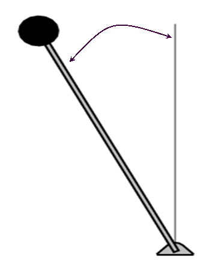

在这种情况下，待分析的系统由安装在电动小车上的反向摆组成。控制系统的目的是通过向与摆锤连接的托架的车轮施加扭矩来平衡反向摆锤。控制输入是水平移动托架的力，而输出是摆的角位置。特别地，我们考虑了一个二维问题，其中摆不能在垂直平面内运动。另一个可以类比为倒立摆的真实系统的例子是放置在移动车辆上的火箭发射器电池。

为了确定模型，需要对倒立摆进行受力分析；为了更清楚起见，对运动方程的研究被分成构成这个系统的两部分。下面列出了相关术语:

*   手推车的质量
*   摆锤质量
*   小车的摩擦系数
*   到摆锤质量中心的长度
*   钟摆的惯性矩
*   施加到推车上的驱动力
*   钟摆与垂直方向的角度
*   推车位置坐标

下图显示了一个模型方案:

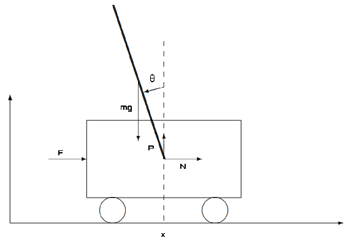

该系统的方程是平衡作用力的水平和垂直分量的方程。分别用 *P* 和 *N* 表示小车施加在杆上的垂直和水平力，用 *L* 表示杆的重心到铰链的距离，用 *I* 表示杆相对于重心的惯性矩。假设它也是重力加速度。杆重心的运动由以下方程描述:

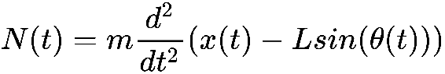

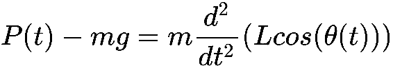

相对于重心的旋转运动由以下等式描述:

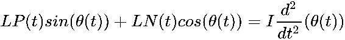

最后，手推车的运动由下面的等式描述:

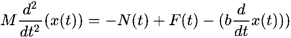

在前面的等式中，我们考虑了系数为 *b* 的粘性摩擦的存在。

显而易见，完美地控制乐器绝非易事。相反，它需要彻底的研究和许多实验，才能有积极的回应。


# OpenAI Gym

OpenAI Gym 是一个帮助我们实现基于强化学习的算法的库。它包括越来越多的基准问题，这些问题暴露了一个公共接口，以及一个人们可以分享他们的结果和比较算法性能的网站。

OpenAI Gym 专注于强化学习的情景设置。换句话说，代理人的经历分为一系列的插曲。代理的初始状态是由一个分布随机抽样的，交互一直进行到环境达到一个终止状态。每集都重复这一过程，目的是最大化每集的总回报预期，并在尽可能少的剧集中实现高水平的表现。

Gym 是一个开发和比较强化学习算法的工具包。它支持教会代理从走路到玩游戏(如 Pong 或 Pinball)的能力。该图书馆位于 https://gym.openai.com/。

以下截图显示了 OpenAI Gym 项目网站的主页:

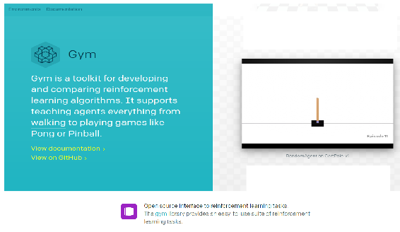

OpenAI Gym 包括越来越多的环境集合，可以解决强化学习中最常见的问题。OpenAI Gym 由一个网站支持，每个用户都可以发布在特定环境下获得的结果，以便与社区比较不同算法的性能。此外，还鼓励用户共享允许他们获得加载结果的源代码，并提供详细的说明，以便轻松复制从他们那里获得的结果。

OpenAI Gym 还为新环境的创建提供了抽象和接口，并能够管理渲染，使开发人员不必担心这一点。由于该框架是专门为强化学习算法的研究而创建的，因此为环境和代理之间的交互而提出的接口与问题所需的元素完全匹配。

OpenAI Gym 假设环境在本质上是情节性的，并且代理通过执行一个可能的动作在每一步与它进行交互。与环境交互，代理获得诸如状态、奖励和指示剧集最终完成的标志的信息，代理使用这些信息来确定何时重置环境和开始新的剧集是合适的。

OpenAI 健身房是一个更加雄心勃勃的项目的一部分:OpenAI 项目。OpenAI 是一家**人工智能** ( **AI** )研究公司，由埃隆·马斯克(Elon Musk)和山姆·奥特曼(Sam Altman)创办。这是一个非营利项目，旨在以造福全人类的方式促进和发展友好的人工智能。该组织旨在通过向公众开放他们的专利和研究，与其他机构和研究人员自由合作。创始人决定承担这个项目，因为他们担心滥用人工智能带来的生存风险。

OpenAI Gym 是一个程序库，允许您开发人工智能，测量他们的智力能力，并增强他们的学习能力。简而言之，这是一个以算法形式存在的健身房，它训练现在的数字大脑，以开放 AI 健身房将它们投射到未来。

但还有另一个目标。OpenAI 希望通过资助那些即使在没有经济回报的领域也能让人类进步的项目，来刺激人工智能领域的研究。另一方面，通过 Gym，它打算将人工智能的测量标准化，以便研究人员可以在平等的条件下竞争，并知道他们的同事取得了什么成就，但最重要的是，专注于对每个人真正有用的结果。

可用的工具有很多。从玩老式视频游戏(如 Pong)的能力，到在 GO 中控制机器人的战斗能力，我们只需在这个数字地方输入我们的算法，看看它是如何工作的。第二步是将获得的基准与其他基准进行比较，看看我们与其他基准相比处于什么位置，也许我们可以与他们合作以获得互惠互利。下表列出了库中可用的一些环境(这些环境按类别分组，以简化搜索):

*   **算法**:进行多位数相加、逆序等运算。有人可能会反对说这些任务对计算机来说很容易。挑战在于纯粹从例子中学习这些算法。这些任务有一个很好的特性，就是通过改变序列长度来改变难度。
*   **雅达利**:玩经典的雅达利游戏。我们以一种易于安装的形式集成了街机学习环境(它对强化学习研究产生了很大的影响)。
*   **Box2D**:Box2D 模拟器中的连续控制任务。
*   **经典控制**:完成小规模任务，多来自强化学习文献。他们是来帮你开始的。
*   **MuJoCo** :连续控制任务，在快速物理模拟器中运行。这个任务使用 MuJoCo 物理引擎，它是为快速准确的机器人模拟而设计的。

*   机器人:为取物和暗影之手机器人模拟基于目标的任务。
*   玩具文本(Toy text):简单的文本环境，帮助您入门。

特别是，经典控件类别提供了非常有用的环境来重现重要物理实验的场景，如下面的屏幕截图所示:

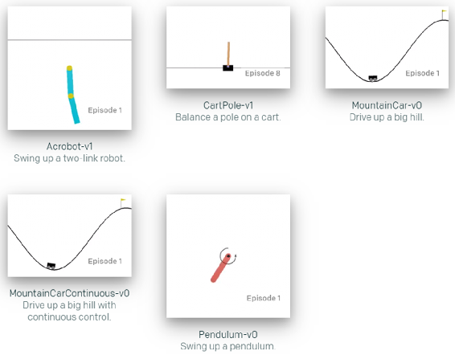

OpenAI Gym 对我们的代理的结构没有任何假设，并且兼容任何数值计算库，如 TensorFlow 或 Theano。健身房图书馆是一个测试问题——环境——的集合，我们可以用它来制定我们的强化学习算法。这些环境有一个共享的接口，允许你编写通用算法。


# 开放式健身方法

OpenAI Gym 提供了`Env`类，封装了环境及其可能的内部动态。该类有不同的方法和属性要实现以创建新的环境。最重要的方法被称为`reset`、`step`和`render`。

`reset`方法的任务是重置环境，将其初始化为初始状态。在`reset`方法中，必须包含构成环境的元素的定义，在这种情况下是机械臂的定义、要抓取的物体及其支撑。
`step`方法的任务是将环境向前推进一步。它要求将动作作为输入来执行，并将新的观察结果返回给代理。在该方法中，必须定义动作动态的管理、状态和奖励的计算以及完成情节的控制。

第三个也是最后一个方法是渲染，因为每个步骤中的元素都必须被表示，所以必须定义内部。该方法涉及不同类型的渲染，如`human`、`rgb_array`或`ansi`。使用`human`类型，渲染在屏幕或命令行界面上完成，该方法不返回任何内容；对于`rgb_array`类型，调用该方法会返回一个表示屏幕 RGB 像素的 *n* 维数组；选择第三种类型，`return`方法返回一个包含文本表示的字符串。为了渲染，OpenAI Gym 提供了`viewer`类，通过它可以将环境的元素绘制为一组多边形和圆形。

关于环境的属性，`Env`类提供了动作空间、观察空间、奖励范围的定义。动作空间属性表示动作空间，动作空间是代理可以在环境中执行的一组可能的动作。使用观察空间属性，定义了构成状态的参数的数量，以及每个参数可以采用的值的范围。奖励`range`属性包含环境中可获得的最小和最大奖励，默认设置为`(-∞, + ∞)`。

使用框架提出的`Env`类作为新环境的基础，采用了工具包提供的通用接口。通过这种方式，创建的环境可以集成到`toolkit`库中，并且它们的动态可以从 OpenAI Gym 社区的用户已经实现的算法中学习。


# 开放式健身房设施

要安装 OpenAI Gym，请确保您之前已经安装了 Python 3.5+版本；然后只需键入以下命令:

```py
pip install gym
```

一旦完成，我们将能够以一种简单而直接的方式插入该库提供的工具。

该库还提供了直接克隆健身房的 Git 库的可能性。如果您想要更改环境或添加其他环境，这可能是必要的。要克隆 Git 存储库，请执行以下命令:

```py
git clone https://github.com/openai/gym
cd gym
pip install -e .
```

接下来，执行以下命令:

```py
pip install -e .[all]
```

通过这种方式，我们执行了包含所有环境的完整安装。这需要安装几个更复杂的依赖项，包括`cmake`和最近的`pip`版本。


# 横竿系统

横竿系统是强化学习的经典问题。该系统由一根通过接头连接到推车上的杆(其作用类似倒立摆)组成，如下图所示:

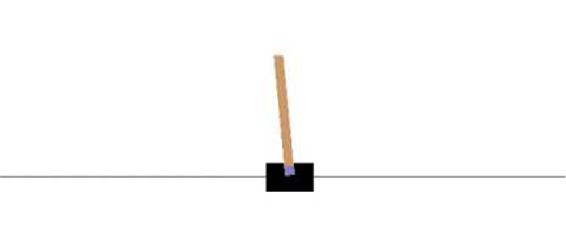

通过对推车施加+1 或-1 的力来控制该系统。施加在推车上的力是可以控制的，目的是向上摆动杆子并使其稳定。这必须在手推车不落地的情况下完成。在每一步，代理人可以选择向左或向右移动手推车，并且它会在杆子平衡的每一个时间步获得 1 的奖励。如果杆偏离竖直方向超过 15 度，程序结束。

要使用 OpenAI Gym 库运行 CartPole 示例，只需键入以下代码:

```py
import gym
env = gym.make('CartPole-v0')
env.reset()
for i in range(1000):
    env.render()
    env.step(env.action_space.sample())
```

像往常一样，我们将详细解释每一行代码的含义。第一行用于导入`gym`库:

```py
import gym
```

然后我们继续通过调用`make`方法来创建环境:

```py
env = gym.make('CartPole-v0')
```

这个方法创建了我们的代理将在其中运行的环境。环境是指代理可以与之交互的最小界面的问题。OpenAI 健身房的环境旨在允许对代理人的能力进行客观测试和基准测试。`gym`库带有一套不同的环境，从容易到困难，涉及许多不同种类的数据。

有关可用环境的列表，请参考[https://gym.openai.com/envs](https://gym.openai.com/envs)。

下面列出了最常用的环境:

*   **经典控制和玩具正文**:完成小规模任务，多来自强化学习文献。他们是来帮你开始的。
*   **算法**:执行多位数相加和逆序等计算。
*   **雅达利**:玩经典雅达利游戏。
*   **2D 和 3D 机器人**:模拟控制机器人。

在我们的例子中，我们称之为 CartPole-v0 环境。`make`方法返回一个`env`对象，我们将使用它与游戏进行交互。但是让我们回到分析代码。

现在我们必须使用`reset()`方法初始化系统:

```py
env.reset()
```

该方法将环境置于其初始状态，返回描述它的数组。此时，我们将使用一个`for`循环运行 CartPole-v0 环境的一个实例，持续`1000`个时间步长，在每一步呈现环境:

```py
for i in range(1000):
    env.render()
    env.step(env.action_space.sample())
```

调用`render()`方法将直观地显示当前状态，而对`env.step()`的后续调用将允许我们与环境交互，返回新的状态以响应我们调用它的动作。

这样，我们在每一步都采取了随机行动。在这一点上，知道我们正在对环境采取什么行动来决定未来的行动肯定是有用的。`step()`方法返回的正是这个。实际上，此方法返回以下四个值:

*   `observation`:一个特定环境的物体，代表你对环境的观察。
*   `reward`:上一次行动获得的奖励金额。规模因环境而异，但目标始终是增加你的总回报。
*   `done`:是否又到了重置环境的时候了。大多数(但不是全部)任务被划分成定义明确的剧集，而`done`为`True`则表示该剧集已经终止。
*   `info`:对调试有用的诊断信息。它有时对学习很有用。

要运行这个简单的示例，请将代码保存在名为`cart.py`的文件中，并在终端窗口中键入以下命令:

```py
python cart.py
```

这样，将显示一个包含我们的系统的窗口，该系统不稳定，很快就会退出屏幕。这是因为推车的推力是随机产生的，没有考虑杆子的位置。

为了解决这个问题，也就是说，为了平衡杆子，因此有必要将推力设置为与杆子的倾斜方向相反。所以，我们只需要设置两个动作，-1 或+1，向左或向右推购物车。但是为了做到这一点，我们需要随时了解从环境观察中获得的数据。我们已经说过，这些数据是由`step()`方法返回的，特别是，它们包含在观察对象中。

该对象包含以下参数:

*   推车位置
*   推车速度
*   磁极角度
*   尖端的极点速度

这四个值成为我们问题的输入。正如我们所预料的那样，系统是通过推手推车来保持平衡的。有两种可能的选择:

*   将购物车推至左侧(0)
*   向右推它(1)

很明显，这是一个二进制分类问题:四个输入和一个二进制输出。

让我们首先考虑如何提取要用作输入的值。要提取这些参数，我们只需更改前面建议的代码:

```py
import gym
env = gym.make('CartPole-v0')
observation = env.reset()
for i in range(1000):
    env.render()
    print(observation)
    observation, reward, done, info = env.step(env.action_space.sample())
```

通过运行代码，我们可以看到包含在观察对象中的值现在被打印在屏幕上。这些很快就会有用的。

使用从环境观察返回的值，代理必须决定两个可能的动作之一:向左或向右移动购物车。


# q-学习解决方案

现在我们必须面对最困难的阶段:训练我们的系统。在上一节中，我们说过`gym`库专注于强化学习的情景设置。经纪人的经历分为一系列的插曲。代理的初始状态是由一个分布随机抽样的，交互作用一直进行到环境达到一个终止状态。每集都重复这一过程，目的是最大化每集的总回报预期，并在尽可能少的剧集中实现高水平的表现。

在学习阶段，我们必须估计一个评价函数。该功能必须能够通过奖励的总和来评估特定政策的便利性或其他方面。换句话说，我们必须逼近评价函数。我们如何做到这一点？一种解决方案是使用人工神经网络作为函数逼近器。

回想一下，神经网络的训练旨在识别神经元之间连接的权重。在这种情况下，我们将为每集选择带权重的随机值。最后，我们将选择能获得最大回报的重量组合。

系统在给定时刻的状态是由观察对象返回给我们的。为了从实际状态中选择一个动作，我们可以使用权重和观察值的线性组合。这是函数逼近最重要的特例之一，其中逼近函数是权向量的线性函数， *w* 。对于每个状态， *s* ，都有一个实值向量， *x(s)* ，其分量数与 *w* 相同。线性方法通过 *w* 和 *x(s)* 之间的内积来近似状态值函数。

这样，我们就确定了解决问题的方法。现在，为了使整个训练阶段易于理解，我们报告整个代码块，然后逐行对其进行详细注释:

```py
import gym
import numpy as np
env = gym.make('CartPole-v0')
HighReward = 0
BestWeights = None
for i in range(200):
    observation = env.reset()
    Weights = np.random.uniform(-1,1,4)
    SumReward = 0
    for j in range(1000):
        env.render()
        action = 0 if np.matmul(Weights,observation) < 0 else 1
        observation, reward, done, info = env.step(action)
        SumReward += reward
        print( i, j, Weights, observation, action, SumReward, BestWeights)
    if SumReward > HighReward:
        HighReward = SumReward
        BestWeights = Weights
```

代码的第一部分处理库的导入:

```py
import gym
import numpy as np
```

然后我们继续通过调用`make()`方法来创建环境:

```py
env = gym.make('CartPole-v0')
```

这个方法创建了我们的代理将在其中运行的环境。现在让我们初始化将要使用的参数:

```py
HighReward = 0
BestWeights = None
```

`HighReward`变量将包含当前剧集获得的最大奖励；该值将用作比较值。`BestWeights`变量将包含记录最大奖励的重量序列。现在，我们可以通过针对情节的迭代过程来实现最佳权重序列搜索:

```py
for i in range(200):
```

我们决定执行过程`200`次，所以我们使用`reset()`方法初始化系统:

```py
observation = env.reset()
```

在每集中，我们使用一系列重量，其数量等于对环境的观察，如前所述为四个(小车位置、小车速度、杆角度和尖端的杆速度):

```py
Weights = np.random.uniform(-1,1,4)
```

为了确定权重，我们使用了`np.random.uniform()`函数。该函数从均匀分布中抽取样本。样本均匀分布在半开区间(低和高)。它包括低，但不包括高。

换句话说，给定区间内的任何值都同样可能由均匀分布得出。已经传递了三个参数:输出间隔的下边界、上边界和输出形状。在我们的例子中，我们要求区间(-1，1)中的四个随机值。这样做之后，我们初始化奖励的总和:

```py
SumReward = 0
```

此时，我们实施另一个迭代周期来确定我们可以用这些权重获得的最大回报:

```py
for j in range(1000):
```

调用`render()`方法将直观显示当前状态:

```py
env.render()
```

现在，我们必须决定行动:

```py
action = 0 if np.matmul(Weights,observation) < 0 else 1
```

正如我们所说，为了决定动作，我们使用了两个向量的线性组合:`Weights`和`observation`。为了执行线性组合，我们使用了`np.matmul()`功能；它实现了两个数组的矩阵乘积。所以，如果这个产品是`<0`，那么动作就是`0`(左移)；否则，动作为`1`(右移)。

需要注意的是，负的乘积意味着杆子向左倾斜，所以为了平衡这种趋势，需要向左推动大车。正的乘积意味着极点向右倾斜，因此为了平衡这种趋势，有必要将推车向右推。

现在我们使用`step()`方法来返回新的状态，以响应我们调用它的动作。显然，我们传递给方法的动作就是我们刚刚决定的动作:

```py
observation, reward, done, info = env.step(action)
```

正如我们所说的，该方法返回以下四个值:

*   `observation`:一个特定环境的物体，代表你对环境的观察。
*   `reward`:上一次行动获得的奖励金额。规模因环境而异，但目标始终是增加你的总回报。它属于`float`类型。
*   `done`:是否又到了重置环境的时候了。大多数(但不是全部)任务被分成定义明确的片段，并且`done`为真表示该片段已经终止。它是`Boolean`型的。
*   `info`:对调试有用的诊断信息。它有时对学习很有用。它属于`dict`类型。

然后，我们可以用刚刚获得的奖励来更新奖励的总和。请记住，对于我们保持直杆的每个时间步长，我们会获得+1 奖励:

```py
SumReward += reward
```

我们只需打印在这一步中获得的值:

```py
print( i, j, Weights, observation, action, SumReward, BestWeights)
```

在当前迭代结束时，我们可以进行比较，以检查获得的总奖励是否是迄今为止获得的最高奖励:

```py
if SumReward > HighReward:
```

如果这是到目前为止获得的最高奖励，用这个值更新`HighReward`参数:

```py
HighReward = SumReward
```

完成后，将当前步骤的`Weights`顺序固定为最佳顺序:

```py
BestWeights = Weights
```

根据该指令，训练阶段结束，这将为我们提供最接近评估函数的权重序列。我们现在可以测试系统了。

当训练阶段完成时，实际上意味着我们已经找到了最接近该函数的权重序列，也就是说，已经返回了可实现的最佳回报的权重序列。现在，我们必须用这些值来测试系统，以检查极点是否能够承受至少`100`个时间步长。

现在，正如我们在培训阶段已经完成的那样，为了使整个测试阶段易于理解，我们报告整个代码块，然后逐行对其进行详细注释:

```py
observation = env.reset()
for j in range(100):
    env.render()
    action = 0 if np.matmul(BestWeights,observation) < 0 else 1
    observation, reward, done, info = env.step(action)
    print( j, action)
```

首先，我们必须使用`reset()`方法再次初始化系统:

```py
observation = env.reset()
```

然后，我们必须运行一个迭代周期来应用在训练阶段获得的结果:

```py
for j in range(100):
```

对于每一步，我们将调用`render()`方法来直观地显示当前状态:

```py
env.render()
```

现在，我们必须根据在训练阶段获得的最佳权重和对当前状态的观察来决定对系统执行的操作:

```py
action = 0 if np.matmul(BestWeights,observation) < 0 else 1
```

现在我们使用`step()`方法，它返回新的状态来响应我们调用它的动作。传递给该方法的操作就是我们刚刚决定的操作:

```py
observation, reward, done, info = env.step(action)
```

最后，我们打印步骤号和为可视化流程控制而决定的动作。通过运行建议的代码，我们可以验证，在训练阶段之后，系统能够在 100 个时间步长内保持极点平衡。


# 深度 Q 学习解决方案

正如我们在[第 1 章](fc93c240-db20-461c-914a-1b438abf288e.xhtml)、*Keras 强化学习概述*中所说，术语深度 Q-learning 标识了一种函数近似的强化学习方法。因此，它代表了基本 Q 学习方法的发展，因为状态-动作表被神经网络代替，目的是逼近最佳值函数。

与之前的方法相比，在之前的方法中，深度 Q-learning 用于构建网络以请求输入和动作，并提供其预期回报，深度 Q-learning 彻底改变了结构，以便仅请求环境的状态，并提供与环境中可以执行的动作一样多的状态-动作值。

在下面的代码中，针对 CartPole 问题提出了深度 Q 学习解决方案:

```py
import numpy as np
import gym

from keras.models import Sequential
from keras.layers import Dense, Activation, Flatten
from keras.optimizers import Adam

from rl.agents.dqn import DQNAgent
from rl.policy import BoltzmannQPolicy
from rl.memory import SequentialMemory

ENV_NAME = 'CartPole-v0'

env = gym.make(ENV_NAME)
np.random.seed(123)
env.seed(123)
nb_actions = env.action_space.n

model = Sequential()
model.add(Flatten(input_shape=(1,) + env.observation_space.shape))
model.add(Dense(16))
model.add(Activation('relu'))
model.add(Dense(16))
model.add(Activation('relu'))
model.add(Dense(16))
model.add(Activation('relu'))
model.add(Dense(nb_actions))
model.add(Activation('linear'))
print(model.summary())

memory = SequentialMemory(limit=50000, window_length=1)
policy = BoltzmannQPolicy()

dqn = DQNAgent(model=model, nb_actions=nb_actions, memory=memory,
               nb_steps_warmup=10,target_model_update=1e-2,
               policy=policy)

dqn.compile(Adam(lr=1e-3), metrics=['mae'])

dqn.fit(env, nb_steps=1000, visualize=True, verbose=2)

dqn.save_weights('dqn_{}_weights.h5f'.format(ENV_NAME), overwrite=True)

dqn.test(env, nb_episodes=5, visualize=True)
```

正如在目前提出的所有示例中所做的那样，我们将逐行分析这段代码，以理解它的操作原理。代码的第一部分用于导入库:

```py
import numpy as np
import gym
```

首先，我们导入`numpy`库，它将用于设置种子值。所以我们导入了`gym`库，它将帮助我们定义环境。完成这些后，我们导入`keras`库的一些函数来构建一个神经网络模型:

```py
from keras.models import Sequential
from keras.layers import Dense, Activation, Flatten
from keras.optimizers import Adam
```

Keras 是一种高级神经网络 API，用 Python 编写，能够在 TensorFlow、CNTK 或 Theano 之上运行。它的开发重点是支持快速实验。使用 Keras，我们将能够在最短的时间内从想法到结果，这样您就可以花更多的时间来分析结果。首先导入`Sequential`模型；`Sequential`模型是层的线性堆叠。然后进口一些`layers`的 Keras:`Dense`、`Activation`、`Flatten`。`Dense`模型是一个全连接的神经网络层。`Activation`层将激活功能应用于输出。`Flatten`层使输入变平；它不影响批量大小。最后，导入`Adam`优化器。让我们继续导入 Keras-RL 库:

```py
from rl.agents.dqn import DQNAgent
from rl.policy import BoltzmannQPolicy
from rl.memory import SequentialMemory
```

Keras-RL 库用 Python 实现了一些最先进的深度强化学习算法，并与深度学习的 Keras 库无缝集成。`DQNAgent`、策略和内存模型被导入。现在我们将定义环境:

```py
ENV_NAME = 'CartPole-v0'
```

这样，我们就设置了环境的名称。让我们继续获取它:

```py
env = gym.make(ENV_NAME)
```

为了设置`seed`值，使用了`numpy`库的`random.seed()`函数:

```py
np.random.seed(123)
```

`seed`函数设置随机数发生器的`seed`，这对于创建模拟或可再现的随机对象非常有用。每当你想得到一个可重复的随机结果时，你必须使用这个函数。种子还必须针对环境进行设置:

```py
env.seed(123)
```

现在，我们将提取代理可用的操作:

```py
nb_actions = env.action_space.n
```

`nb_actions`变量现在包含了所选环境中所有可用的动作。健身房不会一直告诉你这些动作是什么意思，只会告诉你哪些是可以做的。现在，我们将使用 Keras 库构建一个简单的神经网络模型:

```py
model = Sequential()
model.add(Flatten(input_shape=(1,) + env.observation_space.shape))
model.add(Dense(16))
model.add(Activation('relu'))
model.add(Dense(16))
model.add(Activation('relu'))
model.add(Dense(16))
model.add(Activation('relu'))
model.add(Dense(nb_actions))
model.add(Activation('linear'))
print(model.summary())
```

既然神经网络模型已经准备好使用，让我们配置和编译我们的代理。使用 DQN 的一个问题是，算法中使用的神经网络往往会忘记以前的经验，因为它会用新的经验覆盖它们。所以我们需要一个以前的经验和观察的列表，用以前的经验来改造模型。为此，定义了一个包含先前经验的`Memory`变量:

```py
memory = SequentialMemory(limit=50000, window_length=1)
```

现在我们将设置`Policy`变量:

```py
policy = BoltzmannQPolicy()
```

我们只需要定义代理:

```py
dqn = DQNAgent(model=model, nb_actions=nb_actions, memory=memory,
               nb_steps_warmup=10,target_model_update=1e-2,
               policy=policy)
```

让我们继续编译模型:

```py
dqn.compile(Adam(lr=1e-3), metrics=['mae'])
```

前面的命令编译用于培训和测试的代理和底层模型。现在代理已经准备好了，我们可以训练它了:

```py
dqn.fit(env, nb_steps=1000, visualize=True, verbose=2)
```

`fit()`函数在给定的环境中训练代理。在训练结束时，有必要保存获得的重量:

```py
dqn.save_weights('dqn_{}_weights.h5f'.format(ENV_NAME), overwrite=True)
```

保存网络或整个结构的重量发生在 HDF5 文件中，这是一种高效灵活的存储系统，支持复杂的多维数据集。最后，我们将针对`10`集评估我们的算法:

```py
dqn.test(env, nb_episodes=5, visualize=True)
```

如果有些事情还没有被充分清除，就没有必要担心；在[第六章](38e6a231-5562-4cb5-bde1-6fdb3278de1e.xhtml)、*旋转机械系统的连续平衡*中，我们更仔细地观察了这些论点。


# 摘要

在这一章中，你学习了 Q 学习和深度 Q 学习的基本概念，以及如何使用这些技术来控制一个机械系统。首先，概述了赛格威是如何工作的。这是一种用于个人移动的电力牵引运输车辆，可以通过乘客-驾驶员身体的简单运动来启动、停止和倒车——向前或向后轻微弯曲，并借助车把左侧的旋钮转弯。为了展示它是如何工作的，实现了一个倒立摆模型。

然后，介绍了 OpenAI Gym 库，它可以帮助我们实现基于强化学习的算法。它包括越来越多的基准问题，这些问题暴露了一个公共接口，以及一个人们可以分享他们的结果和比较算法性能的网站。我们探索了不同的可用环境以及如何安装该库。

最后，利用 CartPole 系统实现了 Q 学习和深度 Q 学习算法。横竿系统是强化学习的经典问题。该系统由一根通过接头连接到推车上的杆子(其作用类似倒立摆)组成。通过对推车施加+1 或-1 的力来控制该系统。施加在推车上的力是可以控制的，目的是向上摆动杆子并使其稳定。